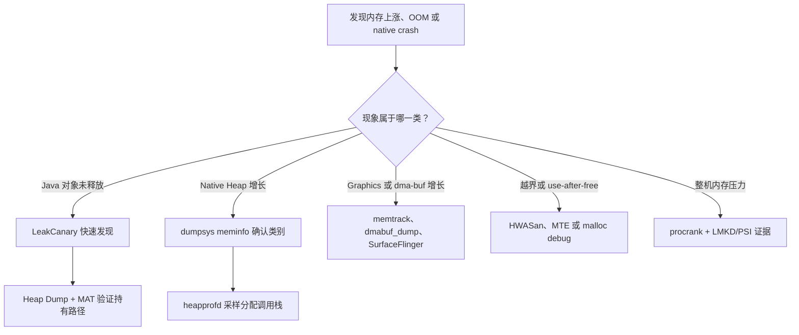

# 14.5 内存分析工具

## 先确定要测哪一种内存

“应用内存上涨”只描述了现象。Java 对象、C/C++ 分配器、匿名 `mmap`、文件映射、线程栈、Graphic Buffer 和 zRAM 中的换出页，采集接口与归因方式都不同。选错工具时，报告可能很完整，结论却指向另一个内存域。

工具按四类证据组织：

| 证据 | 能回答的问题 | 主要工具 |
| --- | --- | --- |
| Java 对象保留图 | 哪个 GC Root 仍能到达应销毁对象 | LeakCanary、Android Studio Heap Dump、MAT |
| 分配调用栈 | 哪条代码路径分配最多、当前仍保留多少采样分配 | heapprofd、ART 分配分析 |
| 进程与 VMA 记账 | PSS/RSS/USS 如何变化，内存落在哪类映射 | `dumpsys meminfo`、`showmap`、`procrank`、libmeminfo |
| 非法内存访问 | 哪里发生越界、释放后使用（use-after-free）或错误释放 | malloc debug、HWASan、MTE |

下面的决策图用于从症状选择第一件工具。



同一问题常要经过两层证据：记账工具确认“涨在哪里”，归因工具解释“由谁产生”。单次快照通常只能提出假设。

平台实现锚定 `android-17.0.0_r1`，涉及内核 `/proc`、dma-buf 与 MTE 的说明锚定 `android17-6.18-2026-06_r6`。较早版本只保留兼容边界。

## LeakCanary：发现应被回收的 Java 对象

### 它观察的对象

LeakCanary 适合开发与测试阶段。2.14 的默认观察器会跟踪已经销毁的 `Activity`、`Fragment`、Fragment View 和 `Service`，以及已经执行 `onCleared()` 的 `ViewModel`。业务对象不在默认清单时，可在生命周期结束处交给 `ObjectWatcher`。

它判断的是“对象在等待期和 GC 后仍被保留”，不是“对象已经被证明永远无法释放”。异步任务、动画、消息队列和测试操作尚未结束，都可能让对象暂时存活。

LeakCanary 2.14 的基础依赖应只进入 debug 构建变体。下面的配置用于避免把堆转储与分析代码带进 release APK。

```kotlin
dependencies {
    debugImplementation("com.squareup.leakcanary:leakcanary-android:2.14")
}
```

依赖在 AndroidManifest 中声明的 initializer 会在主进程安装默认观察器，无需在 `Application` 手工初始化。构建产物仍应通过依赖分析确认 release 变体不含 LeakCanary。

### 从弱引用到泄漏引用链

LeakCanary 的处理过程分为四段：

1. 生命周期观察器把应结束生命周期的对象交给 `ObjectWatcher`，后者只保留弱引用。
2. 默认等待五秒并触发 GC；弱引用仍未清除时，对象进入保留对象集合。
3. 保留对象数量达到当前阈值后，LeakCanary 调用 Android 堆转储接口。
4. Shark 解析 HPROF，从 GC Root 搜索到保留对象的引用路径，并按泄漏签名聚类。

GC Root 到目标对象的路径才是修复依据。通知里的红色可疑引用表示 Shark 认为该边不符合生命周期预期；路径中出现一个熟悉的类名，不能直接证明那个类创建了泄漏。

业务对象可在确定不再使用的位置显式观察。下面的函数要求调用方同时给出对象和生命周期结束原因，避免报告里只剩一个无法定位的类名。

```kotlin
fun watchAfterLifecycleEnd(instance: Any, reason: String) {
    require(reason.isNotBlank())
    AppWatcher.objectWatcher.expectWeaklyReachable(instance, reason)
}
```

这段代码只登记弱引用观察目标，不会延长对象生命周期。调用位置应紧邻真实的释放时点，`reason` 应写清哪个生命周期事件已经发生。

### 配置等待时间与触发阈值

多数项目保留默认自动安装即可。需要自定义观察器或 `retainedDelayMillis` 时，应先覆盖自动安装资源。下面的资源关闭默认安装。

```xml
<?xml version="1.0" encoding="utf-8"?>
<resources>
    <bool name="leak_canary_watcher_auto_install">false</bool>
</resources>
```

关闭后必须在主进程安装观察器。下面的函数把等待时间作为测试配置输入；只有先测得业务存在更长的正常清理窗口时，才应偏离 2.14 的五秒默认值。

```kotlin
fun installLeakWatchers(
    application: Application,
    retainedDelayMillis: Long
) {
    require(retainedDelayMillis > 0)
    AppWatcher.manualInstall(
        application = application,
        retainedDelayMillis = retainedDelayMillis
    )
}
```

应用应从主进程的 `Application.onCreate()` 调用该函数一次。等待时间越长，暂时保留造成的误报越少，反馈也越慢；稳定复现的异常引用不能靠延长等待时间处理。

堆转储策略属于 `LeakCanary.config`。2.14 在应用可见时默认累计五个保留对象才转储，应用不可见时等待一个 `retainedDelayMillis` 后即可转储。下面的函数允许测试基础设施传入经过验证的可见态阈值。

```kotlin
fun setVisibleHeapDumpThreshold(retainedObjectCount: Int) {
    require(retainedObjectCount > 0)
    LeakCanary.config = LeakCanary.config.copy(
        retainedVisibleThreshold = retainedObjectCount
    )
}
```

该阈值只决定何时生成堆转储，不改变对象是否被判定为保留对象。自动化测试若只收集保留对象计数而不希望暂停进程，可在测试专用配置中关闭 `dumpHeap`。

### 如何读一条报告

按以下顺序读泄漏引用链（leak trace）：

1. 确认目标对象的生命周期已经结束，复现步骤也已经完成。
2. 从 GC Root 往下看，区分静态字段、线程、JNI 全局引用和框架缓存。
3. 找到第一条生命周期不合理的强引用，核对它的写入和清理位置。
4. 修复后重复相同操作，等待保留对象消失，并确认没有换成另一条签名。

LeakCanary 不会自动覆盖所有单例、缓存和业务容器。自定义对象应显式观察；只表现为“大量仍然合法存活对象”的内存膨胀，应转到堆转储的 Histogram 与 Dominator Tree。

### Android Studio LeakCanary task 与 CI 接入

Android Studio Panda 3 起提供专用 LeakCanary Profiler task。设备仍负责运行应用和生成堆现场，Shark 转到开发机分析，报告可以从可疑引用跳回工程源码。后续 Quail 稳定版继续提供这项能力；它属于 IDE 发布线，与 Android API 版本没有绑定关系。

几种入口的职责不同：

| 入口 | 适合的阶段 | 主要证据 | 边界 |
|---|---|---|---|
| LeakCanary 2.14 | 日常开发和手工走查 | 生命周期对象的泄漏引用链 | 默认观察范围有限，堆转储会暂停应用 |
| Android Studio LeakCanary task | 本地稳定复现后的源码定位 | Shark 报告与工程源码之间的导航 | 依赖 IDE、构建和被测 APK 版本匹配 |
| Memory Profiler Heap Dump | 对象数量、支配关系和通用 HPROF 检查 | 实例、retained size、引用关系 | 需要开发者判断生命周期是否合法 |
| 系统或线上触发 | 难以本地复现的内存限制现场 | 退出信息、受控 HPROF 或 profile | 受配额、隐私、磁盘和上传成本限制 |

LeakCanary 2.14 还提供 instrumentation 集成。依赖只加入测试 APK，并在测试成功后执行泄漏断言：

```kotlin
dependencies {
    androidTestImplementation(
        "com.squareup.leakcanary:leakcanary-android-instrumentation:2.14"
    )
}

@get:Rule
val detectLeaksAfterTestSuccess = DetectLeaksAfterTestSuccess()
```

这类断言适合生命周期明确、操作可重复的端到端场景。测试应固定页面操作、空闲等待和后台任务清理；异步任务尚未结束时，保留对象不等于稳定泄漏。团队还可以维护少量确定性样例，例如单例保存 Activity、Fragment View binding 未清理、延迟消息、全局协程、Listener 未注销和 WebView/播放器未释放，用同一脚本同时验证“能发现”和“修复后消失”。

线上使用实验性的 release 观察能力时，至少要有远程开关、低采样率、磁盘配额、充电/空闲条件、失败恢复、访问控制与过期策略。原始 HPROF 可能包含业务对象，不应默认上传；优先保存 leak signature、裁剪后的引用路径和不含业务值的统计字段。

## MAT：离线分析 Java 堆对象图

### HPROF 包含什么

HPROF 是某一时刻的托管堆快照，包含类、对象、字段、数组、线程与 GC Root 等信息。它适合回答“对象为何仍可达”和“谁支配了大量 Java 对象”。它不记录历史分配时序，也不覆盖 malloc 分配区、未映射 dma-buf 或 GPU 驱动私有内存。

Android Studio 的 Heap Dump 页面能直接采集与浏览 Android HPROF。MAT 的 Dominator Tree、Path to GC Roots、OQL 和大堆处理更适合复杂离线分析。

### 采集与转换

Android 17 的 `am dumpheap` 支持进程名或 PID；`-g` 会在 dump 前请求一次 GC。下面的命令要求调用方提供本次实测 PID，再用 PID 组成设备端和主机端文件名。

```bash
: "${APP_PID:?Set APP_PID to the target process id}"
remote_hprof="/data/local/tmp/app-${APP_PID}.hprof"
local_hprof="./app-${APP_PID}-android.hprof"

adb shell am dumpheap -g "${APP_PID}" "${remote_hprof}"
adb pull "${remote_hprof}" "${local_hprof}"
```

`-g` 能减少已经不可达却尚未回收的对象，但 GC 时机与堆状态仍会受运行时影响。Android 17 的 [`ActivityManagerService.enforceDebuggable()`](https://android.googlesource.com/platform/frameworks/base/+/refs/tags/android-17.0.0_r1/services/core/java/com/android/server/am/ActivityManagerService.java#6922) 规定：user 构建只能转储 debuggable 应用，`profileable` 声明本身不开放 HPROF；可调试系统构建才允许转储其他目标。两个文件名带有 PID，可避免连续分析不同进程时误用旧文件。采集过程会暂停应用并增加临时内存，不能把它当成无扰动观测。

Android HPROF 若无法被 MAT 直接打开，可用 SDK Platform-Tools 的 `hprof-conv` 转为 Java SE HPROF。下面的命令检查 SDK 根目录和本次 PID，再转换刚才拉取的文件。

```bash
: "${ANDROID_SDK_ROOT:?Set ANDROID_SDK_ROOT to the Android SDK directory}"
: "${APP_PID:?Set APP_PID to the process id used for capture}"
input_hprof="./app-${APP_PID}-android.hprof"
output_hprof="./app-${APP_PID}-mat.hprof"

"${ANDROID_SDK_ROOT}/platform-tools/hprof-conv" \
    "${input_hprof}" \
    "${output_hprof}"
```

转换产物可交给 MAT；转换只改变 HPROF 编码，不会补出 native 分配器、dma-buf 或 GPU 数据。Android Studio 从 Past Recordings 导出的文件是否仍需转换，以 MAT 的解析结果为准。

### 四个概念

- **Shallow size**：对象本身在 Java 堆中占用的字节，不包含它引用的对象。
- **Retained size**：支配关系下，移除该对象后可一并变为不可达的对象大小估计。
- **Dominator**：从任意 GC Root 到目标对象的所有路径都经过的对象。
- **Path to GC Roots**：目标对象到 GC Root 的引用路径；分析泄漏时通常排除 weak、soft 和 phantom references。

Retained size 很大说明该对象控制着大块对象图，不等于该对象自身分配了这些字节。Histogram 中数量最多的类也不必然是泄漏源；缓存、预加载和池化对象可能有合法生命周期。

### 一套可复现的 MAT 流程

1. 固定应用版本、设备、测试账号和操作脚本，预热到稳定状态。
2. 执行基线操作并采集 HPROF A。
3. 重复进入和退出目标场景，等待异步清理完成，再采集 HPROF B。
4. 比较 Histogram，找出实例数与 shallow size 持续增加的类。
5. 在 B 中按 retained size 查看 Dominator Tree。
6. 对目标实例执行 Path to GC Roots，排除弱引用，找到第一条异常强引用。
7. 回到源码验证写入、移除和生命周期，修复后以同一脚本复测。

单个 HPROF 适合判断持有关系，两份或多份同条件 HPROF 才适合判断增长。对象数量上涨一次也可能来自懒加载，需要用重复轮次确认是否达到平台期。

### Bitmap 的版本边界

Android 8.0 起，Bitmap 像素数据由 native 堆管理，Java `Bitmap` 对象主要保存 native 指针和元数据。MAT 能看到 Java 封装对象与引用关系，不能依靠标准 HPROF 还原完整像素内存。

Android Studio Heap Dump 会为部分框架类型提供 Native Size 和 Bitmap 预览，这属于 Android Studio 的增强信息。`dumpsys meminfo` 的 `Graphics`、`Native Heap` 与 Bitmap 预览应一起看；图像数据位于 Graphic Buffer 时，还要转到 dma-buf 工具。

## heapprofd：按调用栈采样堆分配

### Native 模式的模型

heapprofd 从 Android 10 起作为 Perfetto 数据源提供。native 模式会拦截 `malloc/free`、`new/delete` 等分配器调用，对分配按字节概率采样，并把寄存器、栈和分配/释放记录送给独立的 heapprofd 进程展开与聚合。

采样间隔为 `n` 字节时，可把模型理解为每个字节约有 `1/n` 的概率命中，工具再用统计权重估算总体。Android 17 的 `HeapprofdConfig` 要求显式提供非零间隔；同版本 `tools/heap_profile` 代为写入的默认值是 4096 字节。间隔设为 1 表示记录每次分配，记录量与被测进程扰动也随之增加。

heapprofd 统计的是分配器请求与释放。分配器 arena、页粒度、碎片、zRAM 和 mmap 区域会让 heapprofd 的存活分配字节、`malloc_info()` 与 Native Heap RSS 出现差异。三者不应强行对齐。

### 权限与目标

user 构建只允许采样 AndroidManifest 标记为 `debuggable` 或 `profileable` 的 Java 应用。release 性能构建可使用下面这份完整的清单结构开放本地 shell 分析。

```xml
<?xml version="1.0" encoding="utf-8"?>
<manifest xmlns:android="http://schemas.android.com/apk/res/android">
    <application>
        <profileable android:shell="true" />
    </application>
</manifest>
```

`<profileable>` 从 API 29 提供；`android:enabled` 从 API 30 提供且默认是 `true`。`android:shell="true"` 不会把应用改成 debuggable，也不会授权主机直接读取进程内存；工具得到的是分析器生成的调用栈和聚合统计。userdebug/eng 对普通应用和多数系统进程更宽松，但 SELinux 仍会禁止一小组关键服务。

### 推荐命令

Perfetto 的 `tools/heap_profile` 会构造配置、启动会话、拉取原始 trace 并生成 pprof 文件。下面的命令要求调用方提供真实进程名与连续转储间隔；会话一直运行到按下 `Ctrl-C`。

```bash
: "${PERFETTO_ROOT:?Set PERFETTO_ROOT to a Perfetto source checkout}"
: "${TARGET_PROCESS:?Set TARGET_PROCESS to the exact process cmdline}"
: "${DUMP_INTERVAL_MS:?Set DUMP_INTERVAL_MS from the test sampling plan}"

"${PERFETTO_ROOT}/tools/heap_profile" android \
    -n "${TARGET_PROCESS}" \
    -c "${DUMP_INTERVAL_MS}"
```

省略 `-i` 时，Android 17 [`tools/heap_profile`](https://android.googlesource.com/platform/external/perfetto/+/refs/tags/android-17.0.0_r1/tools/heap_profile#780) 使用 4096 字节间隔；省略 `-d` 时持续到中断。结果目录中的 `raw-trace` 可直接交给 Perfetto UI。按进程名采集会匹配已经运行的进程，也会覆盖会话开始后新启动的同名进程；按 PID 只跟踪当前实例。

需要把堆数据与调度、Binder 或自定义 trace 放入同一会话时，可手写 TraceConfig。下面的配置使用 Android 17 `tools/heap_profile` 的默认 trace 缓冲区、共享内存、采样间隔和阻塞策略，目标是 userdebug 构建上的真实平台进程 `system_server`；会话由操作者中断。

```protobuf
buffers {
  size_kb: 63488
}

data_sources {
  config {
    name: "android.heapprofd"
    heapprofd_config {
      shmem_size_bytes: 8388608
      sampling_interval_bytes: 4096
      block_client: true
      process_cmdline: "system_server"
    }
  }
}

duration_ms: 0
write_into_file: true
```

`process_cmdline` 可覆盖已运行及后续启动的匹配进程。`block_client` 在共享内存写满时会暂停目标分配线程，因此高分配率测试还要检查 trace 统计和业务时延。若要改成应用进程，应替换为设备上 `/proc/<pid>/cmdline` 的精确值，并满足前述 AndroidManifest 条件。配置字段以 Android 17 的 [`heapprofd_config.proto`](https://android.googlesource.com/platform/external/perfetto/+/refs/tags/android-17.0.0_r1/protos/perfetto/config/profiling/heapprofd_config.proto) 为准；文本配置交给 Perfetto CLI 时要使用 `--txt`。

### ART 分配分析

Android 12 起，heapprofd 还可选择 ART 注册的 `com.android.art` heap。它记录 Java 对象的分配调用栈、类型、累计字节和次数，用于分析频繁分配。

下面的命令要求调用方提供真实进程名，并一直采集到操作者中断。

```bash
: "${PERFETTO_ROOT:?Set PERFETTO_ROOT to a Perfetto source checkout}"
: "${TARGET_PROCESS:?Set TARGET_PROCESS to the exact app process cmdline}"

"${PERFETTO_ROOT}/tools/heap_profile" android \
    -n "${TARGET_PROCESS}" \
    --heaps com.android.art
```

`com.android.art` 是 ART 注册的 heap 名称。该模式不跟踪对象何时删除或被 GC，也不生成对象引用图；它定位分配频繁的调用栈与类型，泄漏持有关系仍要由 HPROF、LeakCanary 或 MAT 给出。

### 读火焰图

Native 快照常见的两个视角是：

- 累计分配：时间窗内该调用栈分配过多少估算字节或次数，包含已经释放的分配。
- 快照时仍存活：到该快照尚未收到 free 记录的采样分配，适合寻找持续增长的 native 路径。

“仍存活”也不自动等于泄漏。长生命周期缓存、分配器延迟释放和会话尚未覆盖释放动作都会保留数据。连续快照中同一调用栈稳定增长，且业务生命周期已经结束时，证据更强。

### 空报告与异常栈

- 结果为空：检查包是否 `debuggable/profileable`、目标进程名是否匹配、是否存在并发 heapprofd 会话。
- 启动阶段缺样本：运行时挂接会有延迟；按进程名启动会话通常比进程启动后按 PID 连接覆盖更早。
- 缓冲区溢出（buffer overrun）：短暂峰值可增大 `--shmem-size`；持续过载应增大 `--interval`，接受较低精度。
- native 符号缺失：提供与二进制 Build ID 匹配的未剥离符号，再执行 Perfetto 符号化。
- Java 帧出现 `[DEDUPED]`：ART 的 identical code folding 让多个方法共享代码，显示名不一定是执行的那个方法。

不要写死“heapprofd 开销低于某个百分比”。分配率、采样间隔、栈深、线程数和缓冲策略都会改变扰动，应在目标设备上对比开启前后的业务指标。

## `dumpsys meminfo`：进程内存记账快照

### 采集方式

下面的命令要求调用方提供真实包名，分别输出默认分类、ART 细项、摘要，以及加载过该包的全部进程。

```bash
: "${APP_PACKAGE:?Set APP_PACKAGE to the installed application id}"

adb shell dumpsys meminfo "${APP_PACKAGE}"
adb shell dumpsys meminfo -d "${APP_PACKAGE}"
adb shell dumpsys meminfo -s "${APP_PACKAGE}"
adb shell dumpsys meminfo --package "${APP_PACKAGE}"
```

`-d` 增加 Dalvik/ART 子项；`-s` 只保留 App Summary；`--package` 把参数解释为包名，并输出所有已经加载该包的进程，适合核对 `:remote` 或其他辅助进程。WebView renderer 是否出现取决于它实际加载的包，不能只凭父应用包名推定。Android 17 的选项解析可在 [`ActivityManagerService`](https://android.googlesource.com/platform/frameworks/base/+/refs/tags/android-17.0.0_r1/services/core/java/com/android/server/am/ActivityManagerService.java#13030) 中核对。

### PSS、RSS、USS 与 swap

| 指标 | 含义 | 适合回答的问题 |
| --- | --- | --- |
| RSS | 当前驻留的共享页与私有页总和，共享页在每个进程重复计算 | 单进程驻留集如何变化 |
| PSS | 私有页加共享页按映射进程数分摊后的份额 | 进程对系统内存压力的近似贡献 |
| USS | Private Clean 与 Private Dirty 之和 | 该进程独占的驻留页有多少 |
| Swap / SwapPss | 已换出页，SwapPss 对共享换出页按比例分摊 | 是否已有工作集换出到 zRAM/swap |

PSS 可以避免共享页在进程间重复记账，但把所有进程 PSS 相加也不等于整机全部物理内存：内核自身、未映射页、设备内存和统计时刻变化仍在进程口径之外。

Android 17 的 `Debug.MemoryInfo.getTotalPss()` 会在内核提供 SwapPss 时，把按比例分摊的换出页加入总值。解析脚本应保存原始列名和系统版本，避免把 `TOTAL PSS` 与单独显示的 swap 列重复相加。

Private Dirty 表示页面由该进程独占且内容已经改变，不能像干净文件页那样直接丢弃；匿名页和私有 COW 页仍可换出到 zRAM/swap。可回写文件的共享脏页属于另一种记账，不能用它解释 Private Dirty。Private Clean 多为可从文件重新加载的私有页，内存压力下更容易回收。

### 分类行与 App Summary

- `Java Heap`：ART 托管堆的私有部分以及归入 Java 堆的 ART 映射。
- `Native Heap`：默认 native 分配器对应的 Private Dirty malloc 空间。
- `Code`：`.so`、`.jar`、`.apk`、`.dex`、`.oat` 等代码与静态资源的私有部分。
- `Stack`：Java 与 native 线程栈的 Private Dirty。
- `Graphics`：Gfx、EGL、GL 的 private 统计，部分数据来自 memtrack。
- `Private Other`：尚未归入前述类别的 Private Clean/Dirty。
- `System`：摘要中归入系统的共享内存份额。

App Summary 不是上方每一行 PSS 的简单求和。Android 17 的 [`Debug.MemoryInfo`](https://android.googlesource.com/platform/frameworks/base/+/refs/tags/android-17.0.0_r1/core/java/android/os/Debug.java#720) 会把 private 与 shared 部分重新归组。`Graphics` 还受图形驱动的 memtrack 报告质量影响，源码也明确保留了误报警告。

### 如何判断“持续增长”

一轮可靠的趋势测试应固定进程状态和业务动作：

1. 冷启动或预热到约定状态，记录 PID、构建号和第一次快照。
2. 重复同一操作若干轮，每轮等待异步任务与动画结束。
3. 同时保存 `TOTAL PSS`、RSS、SwapPss、Java Heap、Native Heap、Graphics 和进程列表。
4. 观察是否达到稳定平台，并在必要时抓 HPROF、heapprofd 或 dma-buf 明细。

PSS 一次不回落不能证明泄漏。Java 堆会保留已提交空间，native 分配器会保留 arena，图片与代码会进入缓存，线程池也可能延迟销毁。趋势、生命周期和归因调用栈要互相印证。

## `showmap`、`procrank` 与 libmeminfo

### `showmap`：逐个 VMA 查看

Android 17 的 `showmap` 读取 `/proc/<pid>/smaps`，按 VMA 输出 VSS、RSS、PSS、private/shared clean/dirty、swap 等字段。下面的命令要求调用方提供真实 PID，同时显示地址并禁止合并同名 VMA。

```bash
: "${APP_PID:?Set APP_PID to the target process id}"
adb shell showmap -a -v "${APP_PID}"
```

`-a` 显示虚拟地址，`-v` 保留每个 VMA。`[anon:libc_malloc]` 变大通常指向分配器 heap；大型匿名 `mmap` 不一定属于 malloc；`.so/.dex/.apk` 是文件映射。命令能否读取目标 `/proc/<pid>/smaps` 由 user 构建、SELinux 和 procfs 权限决定，不能假定所有商用设备都允许 shell 查看任意进程。

`showmap` 只能报告已经映射进该进程地址空间的页。只持有 dma-buf fd、仅由 GPU/内核引用或映射在其他进程的缓冲区，可能不会在目标 VMA 中呈现。

### `procrank`：跨进程排序

下面的命令分别按 PSS、USS、RSS 和 swap 排序全系统进程。

```bash
adb shell procrank -p
adb shell procrank -u
adb shell procrank -r
adb shell procrank -s
```

Android 17 的默认排序已经是 PSS，显式参数便于保存实验脚本。`procrank` 是否被产品镜像打包、shell 能读取多少进程，都由设备构建决定；缺少命令时可在 AOSP 构建中生成对应 binary。

`procrank` 适合找出大进程，不能预测 LMKD 的唯一候选。LMKD 还会结合 PSI、thrashing、swap、`oom_score_adj` 和产品策略；`procrank -o` 展示 oom score 维度时也只是一张当前快照。

### libmeminfo 的源码分工

libmeminfo 是平台内部 C++ 库，不是应用 SDK API。Android 17 的实现位于独立仓库 `platform/system/memory/libmeminfo`：

| 模块 | 职责 |
| --- | --- |
| [`procmeminfo.cpp`](https://android.googlesource.com/platform/system/memory/libmeminfo/+/refs/tags/android-17.0.0_r1/procmeminfo.cpp) | 解析 `smaps`/`smaps_rollup`、`pagemap`，管理 working set |
| [`androidprocheaps.cpp`](https://android.googlesource.com/platform/system/memory/libmeminfo/+/refs/tags/android-17.0.0_r1/androidprocheaps.cpp) | 把 VMA 归入 Android 堆类别 |
| [`libsmapinfo/smapinfo.cpp`](https://android.googlesource.com/platform/system/memory/libmeminfo/+/refs/tags/android-17.0.0_r1/libsmapinfo/smapinfo.cpp) | 为 `showmap`、`procrank`、`librank` 提供统计与输出 |
| [`libdmabufinfo`](https://android.googlesource.com/platform/system/memory/libmeminfo/+/refs/tags/android-17.0.0_r1/libdmabufinfo/) | 读取 dma-buf 引用、映射和逐缓冲区统计 |

`ProcMemInfo::ResetWorkingSet()` 会向 `/proc/<pid>/clear_refs` 写入 `1`。这类接口需要特权并会改变 working-set 统计状态，常规应用采集不应直接照搬。

内核 PSS/smaps 生成逻辑可从 [`fs/proc/task_mmu.c`](https://android.googlesource.com/kernel/common/+/refs/tags/android17-6.18-2026-06_r6/fs/proc/task_mmu.c) 核对。libmeminfo 是读者与分类器，页表和映射状态仍由内核提供。

## Graphics 与 dma-buf：从 memtrack 转向缓冲区归因

`dumpsys meminfo` 的 `Graphics` 不等同于 `showmap` 中所有 `/dev` 映射。Android 17 的 [`android_os_Debug.cpp`](https://android.googlesource.com/platform/frameworks/base/+/refs/tags/android-17.0.0_r1/core/jni/android_os_Debug.cpp#130) 会通过 libmemtrack 获取 smaps 未覆盖的 graphics、GL 和 other PSS，再合入 `Debug.MemoryInfo`。

图形内存上涨时可按以下顺序收集：

1. 用 `dumpsys meminfo` 区分 Java Heap、Native Heap、Graphics 与 System。
2. 用 `showmap` 查找目标进程已映射的匿名区、图像映射和分配器 heap。
3. 设备包含工具且权限允许时，用 `dmabuf_dump` 查看 fd/map 引用、inode、exporter 和跨进程共享。
4. 用 `dumpsys SurfaceFlinger` 核对 layer、BufferQueue 与 surface 生命周期。
5. 用 Perfetto 把上涨时刻与应用、RenderThread、SurfaceFlinger、Camera/Codec 活动放在同一时间轴。

下面的第一条命令要求调用方提供真实 PID，用于查看该进程引用或映射的 dma-buf；第二条命令请求全系统逐缓冲区、exporter 与 device 统计。

```bash
: "${APP_PID:?Set APP_PID to the target process id}"
adb shell dmabuf_dump "${APP_PID}"
adb shell dmabuf_dump -b
```

带 PID 的输出只覆盖该进程持有 fd 或建立映射的缓冲区；`-b` 不接受 PID。工具可用性和可见范围取决于产品镜像、debugfs/procfs 与 SELinux。每进程总量会在共享缓冲区上重复显示，系统唯一总量要按 inode 去重。实现依据见 Android 17 的 [`dmabuf_dump.cpp`](https://android.googlesource.com/platform/system/memory/libmeminfo/+/refs/tags/android-17.0.0_r1/libdmabufinfo/tools/dmabuf_dump.cpp)。

dma-buf 的内核对象、文件描述符与 attachment 生命周期见 [`drivers/dma-buf/dma-buf.c`](https://android.googlesource.com/kernel/common/+/refs/tags/android17-6.18-2026-06_r6/drivers/dma-buf/dma-buf.c)。图形缓冲区的分配与跨进程共享原理参见 §2.15 [DMA-BUF 与 Gralloc](../../part1-fundamentals/ch02-rendering/15-dmabuf-gralloc.md)。

## malloc debug：给分配器增加检查与记录

malloc debug 从 API 24 起提供。它在正常分配器前加入 shim，可为 `malloc/free/calloc/realloc` 等调用增加 guard、填充值、指针校验、释放隔离区和分配调用栈。

它适合可控测试，不适合性能基准或生产常开。`backtrace` 会让分配显著变慢，`free_track` 会延迟释放，`guard` 会增加每次分配大小；这些选项都会改变被测进程。

### debuggable 应用的 `wrap.sh`

没有 root 权限的应用可在 API 27 及以上按 NDK `wrap.sh` 方式为 debuggable APK 设置环境。下面的脚本让 backtrace 初始关闭并等待信号开启，同时输出详细启用日志。

```sh
#!/system/bin/sh
export LIBC_DEBUG_MALLOC_OPTIONS="backtrace_enable_on_signal verbose"
exec "$@"
```

脚本应按 ABI 放入 Android Studio 工程的 `src/main/resources/lib/<abi>/wrap.sh`，同时把 JNI 库的 `useLegacyPackaging` 设为 `true`，并保证 APK 是 debuggable。`wrap.sh` 是 API 27 加入的应用入口；malloc debug 自身从 API 24 提供。直接写 `wrap.<package>` 属性更适合具有 root 权限的平台调试，Android 12 还存在 bionic README 记录的 zygote fork-loop 兼容问题。

### 选择选项

| 目标 | 选项 |
| --- | --- |
| 记录分配栈 | `backtrace` 或 `backtrace_enable_on_signal` |
| 检测前后越界写 | `guard`、`front_guard`、`rear_guard` |
| 增加 use-after-free 命中机会 | `free_track` |
| 验证传给 `free/realloc/malloc_usable_size` 的指针 | `verify_pointers` |
| 只记录特定大小范围 | `backtrace_min_size`、`backtrace_max_size`、`backtrace_size` |
| 收集仍可达性之外的 native 泄漏候选 | `check_unreachable_on_signal` |

Android 17 仍使用实时信号控制这些动作。下面的命令先检查真实 PID，再依次切换 backtrace、写出 backtrace heap，以及触发 API 34 起的不可达内存扫描。

```bash
: "${APP_PID:?Set APP_PID to the target process id}"

adb shell kill -45 "${APP_PID}"  # SIGRTMAX-19：切换 backtrace
adb shell kill -47 "${APP_PID}"  # SIGRTMAX-17：请求 backtrace heap dump
adb shell kill -48 "${APP_PID}"  # SIGRTMAX-16：请求 unreachable scan
```

堆转储与不可达内存扫描会等到下一次分配器调用再执行。`-47` 需要已启用 backtrace；`-48` 需要配置 `check_unreachable_on_signal`。受保护进程还可能因权限失败，不能把无输出解释为无泄漏。

另一条入口是 `dumpsys meminfo --unreachable <process>`。下面的命令要求调用方提供 PID，再请求目标进程执行 libmemunreachable 扫描。

```bash
: "${APP_PID:?Set APP_PID to the target process id}"
adb shell dumpsys meminfo --unreachable "${APP_PID}"
```

没有分配调用栈时，结果可能只能说明存在不可达 native 分配，无法给出有用的分配点。Android 17 的完整选项和信号语义以 [`malloc_debug/README.md`](https://android.googlesource.com/platform/bionic/+/refs/tags/android-17.0.0_r1/libc/memory/malloc_debug/README.md) 为准。

## malloc hooks：自定义分配器回调

API 28 起，bionic 在显式启用 hooks 时公开 `__malloc_hook`、`__realloc_hook`、`__free_hook` 和 `__memalign_hook`。它们不是 glibc 的运行时兼容承诺；这里讨论的是 Android bionic 自己的接口。

下面的 C++ 片段只演示在进程启动早期替换 `malloc` hook，并保存、转调 bionic 提供的原分配器。

```cpp
#include <malloc.h>

using MallocHook = void* (*)(size_t, const void*);
static MallocHook g_original_malloc = nullptr;

static void* tracking_malloc(size_t bytes, const void* caller) {
    // 此处只能写入不会分配内存、不会递归进入 malloc 的记录结构。
    return g_original_malloc(bytes, caller);
}

__attribute__((constructor))
static void install_malloc_hook() {
    if (__malloc_hook != nullptr) {
        g_original_malloc = __malloc_hook;
        __malloc_hook = tracking_malloc;
    }
}
```

只有在 `LIBC_HOOKS_ENABLE=1` 或平台属性启用 hook shim 后，初始 hook 才指向默认分配器；没有启用时，构造函数不会安装替换。回调内使用 `std::string`、日志格式化、锁的懒初始化等操作都可能再次分配并造成递归。

API 27 及以上的 debuggable 应用可通过 `wrap.sh` 设置环境变量。下面的脚本开启 bionic malloc hooks。

```sh
#!/system/bin/sh
export LIBC_HOOKS_ENABLE=1
exec "$@"
```

hook 指针更新没有线程安全保证，应在线程并发分配前完成。没有替换的 hook 会继续指向 bionic 原实现；如果继续替换 `realloc`、`free` 或 `memalign`，每一个回调都必须保存并转调对应原函数。`malloc_usable_size` 没有独立 hook，它依赖分配器元数据仍然有效。接口细节见 Android 17 的 [`malloc_hooks/README.md`](https://android.googlesource.com/platform/bionic/+/refs/tags/android-17.0.0_r1/libc/memory/malloc_hooks/README.md)。

多数项目应优先使用 heapprofd。malloc hooks 更适合编写专用测试器，维护成本和测量扰动都更高。

## HWASan 与 MTE：定位 native 内存安全错误

### 两套标记机制

| 工具 | 标记与检查位置 | 设备/构建要求 | 更适合的场景 |
| --- | --- | --- | --- |
| HWASan | 编译器插桩、指针标记与影子内存 | ARM64；NDK r21+；Android 10+；目标 native 代码重编译 | 测试阶段获取错误、分配与释放栈 |
| MTE | CPU 检查指针标记与每 16 字节内存标记 | Android 12+ 平台；MTE SoC、内核与系统支持；进程显式启用 | ASYNC/ASYMM 持续检测，或 SYNC 精确复现 |

HWASan 名字中含 Hardware-assisted，但 Android 应用模式仍依赖编译器插桩与 HWASan 运行时库。它利用 AArch64 地址标记能力，不要求 CPU 实现 MTE。

### HWASan

下面的 CMake 函数接收工程里的真实构建目标名称，为该目标同时添加 HWASan 编译与链接参数。

```cmake
function(enable_hwasan target_name)
    target_compile_options(${target_name} PUBLIC
        -fsanitize=hwaddress
        -fno-omit-frame-pointer)
    target_link_options(${target_name} PUBLIC
        -fsanitize=hwaddress)
endfunction()
```

调用方应只在内存安全测试变体中，把工程已有的构建目标名称传给 `enable_hwasan`。使用 libc++ 时必须选择 `c++_shared`；不使用 libc++ 或选择 system STL 也可以。`c++_static` 会阻止 HWASan 接管其中缺少帧指针的 `new/delete` 实现。Android 14 至 Android 17 的 debuggable 应用可在 APK 中加入下面的 ARM64 `wrap.sh`。

```sh
#!/system/bin/sh
LD_HWASAN=1 exec "$@"
```

该路径与 `android:useAppZygote` 不兼容。Android 10 至 Android 13 虽然已有 NDK HWASan 支持，但应用运行依赖 HWASan 系统镜像或对应的平台配置；Android 14 起才可在普通系统上用这份 `wrap.sh` 启动 debuggable 应用。命中错误时进程会中止，并在 logcat/tombstone 中给出标记不匹配、访问栈，以及可用的分配栈和释放栈。

### MTE

应用通过 `android:memtagMode` 请求堆 MTE。下面的 debug 清单覆盖文件为测试变体启用同步模式。

```xml
<manifest xmlns:android="http://schemas.android.com/apk/res/android"
          xmlns:tools="http://schemas.android.com/tools">
    <application
        android:memtagMode="sync"
        tools:replace="android:memtagMode" />
</manifest>
```

SYNC 在出错指令处触发 `SIGSEGV/SEGV_MTESERR`，诊断精度高。ASYNC 延迟到后续内核入口触发 `SIGSEGV/SEGV_MTEAERR`，故障地址和访问类型不精确。

Armv8.7-A 的 ASYMM 对读使用同步检查、对写使用异步检查。应用清单没有 `asymm` 值；应用请求 `async` 后，设备可通过 CPU 粒度的 `mte_tcf_preferred` 把执行模式升级为 ASYMM 或 SYNC。这个选择属于设备配置，应用不能假定所有 MTE 设备都会升级。异步请求被设备升级为 SYNC 时，故障位置会更精确，但分配器的分配栈和释放栈只在进程明确配置为 SYNC 时采集。

MTE 默认不对所有第三方应用开启。`android:memtagMode` 从 API 31 提供；设置在 `<application>` 时作用于全部应用进程，也可由单个 `<process>` 覆盖。堆 MTE 只覆盖参与标记分配的 native 堆。Android 14 QPR3 起，native 栈还可通过编译器插桩参与检查；下面的 CMake 函数把官方要求的编译与链接参数绑定到调用方传入的真实构建目标。

```cmake
function(enable_mte_stack target_name)
    target_compile_options(${target_name} PUBLIC
        -fsanitize=memtag
        -fno-omit-frame-pointer
        -march=armv8-a+memtag)
    target_link_options(${target_name} PUBLIC
        -fsanitize=memtag
        -fsanitize-memtag-mode=sync
        -march=armv8-a+memtag)
endfunction()
```

这组产物只能在支持 MTE 的设备上运行，应限制在 native 内存安全测试变体。清单中的 `sync` 决定堆检查模式，`-fsanitize=memtag` 则给栈增加标记与检查，两者覆盖范围不同。

Android 17 的内核接口与标记故障处理可从 [`memory-tagging-extension.rst`](https://android.googlesource.com/kernel/common/+/refs/tags/android17-6.18-2026-06_r6/Documentation/arch/arm64/memory-tagging-extension.rst) 和 [`arch/arm64/include/asm/mte.h`](https://android.googlesource.com/kernel/common/+/refs/tags/android17-6.18-2026-06_r6/arch/arm64/include/asm/mte.h) 核对。

## 工具组合示例

### Java 堆持续增长

1. 用 `dumpsys meminfo --package` 确认增长位于哪个进程和类别。
2. 用 LeakCanary 检查销毁组件与显式观察的业务对象。
3. 采集两份同条件 HPROF，用 MAT 比较 Histogram、Dominator Tree 与 Path to GC Roots。
4. 若对象数量主要体现短命分配，改用 Android Studio 分配记录或 heapprofd ART 模式观察频繁分配。

### Native 堆持续增长

1. 用 `dumpsys meminfo` 看 Native Heap PSS/RSS 与 SwapPss。
2. 用 `showmap` 判断增长来自 `[anon:libc_malloc]`，还是独立匿名映射或文件映射。
3. 用 heapprofd 的连续快照查找持续增加的存活分配调用栈。
4. heapprofd 的存活字节数与 RSS 差距很大时，检查分配器内存区、碎片和独立 `mmap`。

### Graphics 持续增长

1. 同时记录 Graphics、Native Heap、System 和进程列表。
2. 用 `dmabuf_dump`、SurfaceFlinger 与图形跟踪核对缓冲区数量、尺寸和跨进程引用。
3. 回到 Bitmap、Surface、Camera、Codec 或 WebView 的创建/释放生命周期。

### Native 崩溃

1. 先保存 tombstone、构建 ID、ABI 和复现输入。
2. 可稳定复现时使用 HWASan 或 MTE SYNC 测试变体。
3. 只能在分配器边界捕获时，选择 malloc debug 的 guard、free_track 或指针校验。
4. 通过原始错误地址和匹配符号确认修复，不用单个采样热点代替崩溃证据。

## 结果复核清单

- 采集的是 Java 堆、native 分配器、VMA、图形内存还是整机压力？
- 数据来自同一进程吗？包是否含多个进程？
- PSS、RSS、USS、SwapPss 和分配器存活字节数是否被混成一个口径？
- 快照前后的业务状态、预热、GC、温度和后台负载是否一致？
- HPROF 是否只覆盖托管堆？Native Size 是否来自工具增强信息？
- heapprofd 使用 native 堆还是 `com.android.art`？采样间隔是多少？
- 报告是否有缓冲区溢出、缺少符号、`[DEDUPED]` 或驱动误报？
- `showmap` 是否只看到了已映射 VMA，而遗漏 fd/内核持有的 dma-buf？
- 内存安全检查器、malloc debug 或 hooks 是否改变了时序和内存行为？
- 修复后能否用相同脚本重复验证，并由另一类证据支持？

## 参考资料

- [LeakCanary 工作原理](https://square.github.io/leakcanary/fundamentals-how-leakcanary-works/)
- [LeakCanary 2.14 安装](https://square.github.io/leakcanary/getting_started/)
- [LeakCanary 手动安装 API](https://square.github.io/leakcanary/api/leakcanary/-app-watcher/manual-install/)
- [LeakCanary UI tests](https://square.github.io/leakcanary/ui-tests/)
- [LeakCanary for release builds](https://square.github.io/leakcanary/leakcanary-for-releases/)
- [Android Studio release updates](https://developer.android.com/studio/preview/features)
- [Eclipse Memory Analyzer](https://eclipse.dev/mat/)
- [Android Studio Heap Dump](https://developer.android.com/studio/profile/capture-heap-dump)
- [Android Bitmap 内存版本边界](https://developer.android.com/topic/performance/graphics/manage-memory)
- [Perfetto heapprofd](https://perfetto.dev/docs/data-sources/native-heap-profiler)
- [Perfetto `heap_profile` 命令](https://perfetto.dev/docs/reference/heap_profile-cli)
- [`tools/heap_profile`（AOSP `android-17.0.0_r1`）](https://android.googlesource.com/platform/external/perfetto/+/refs/tags/android-17.0.0_r1/tools/heap_profile)
- [Android `<profileable>`](https://developer.android.com/guide/topics/manifest/profileable-element)
- [Android 进程内存指标](https://developer.android.com/topic/performance/memory-management)
- [Android `dumpsys meminfo`](https://developer.android.com/studio/command-line/dumpsys#meminfo)
- [libmeminfo（AOSP `android-17.0.0_r1`）](https://android.googlesource.com/platform/system/memory/libmeminfo/+/refs/tags/android-17.0.0_r1/)
- [bionic malloc debug（AOSP `android-17.0.0_r1`）](https://android.googlesource.com/platform/bionic/+/refs/tags/android-17.0.0_r1/libc/memory/malloc_debug/README.md)
- [bionic malloc hooks（AOSP `android-17.0.0_r1`）](https://android.googlesource.com/platform/bionic/+/refs/tags/android-17.0.0_r1/libc/memory/malloc_hooks/README.md)
- [Android NDK `wrap.sh`](https://developer.android.com/ndk/guides/wrap-script)
- [Android NDK HWASan](https://developer.android.com/ndk/guides/hwasan)
- [Android NDK MTE](https://developer.android.com/ndk/guides/arm-mte)
- [AOSP MTE 工作模式](https://source.android.com/docs/security/test/memory-safety/arm-mte)
- [内核 smaps/PSS（`android17-6.18-2026-06_r6`）](https://android.googlesource.com/kernel/common/+/refs/tags/android17-6.18-2026-06_r6/fs/proc/task_mmu.c)
- [内核 dma-buf（`android17-6.18-2026-06_r6`）](https://android.googlesource.com/kernel/common/+/refs/tags/android17-6.18-2026-06_r6/Documentation/driver-api/dma-buf.rst)
