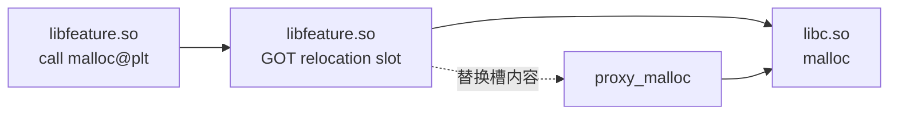

# 三方性能库、Hook 与可观测性基础设施

三方性能库通常通过公开回调、字节码插桩、PLT/GOT、inline hook 或系统 Trace 获取信号。选型要同时检查覆盖范围、版本兼容、开销、隐私和失败降级。

## 信号覆盖、运行开销与选型边界

### 三方性能库补足的场景

Trace 是按时间记录系统与应用事件的性能文件。Perfetto 适合分析跨进程时间线，Simpleperf 是 Android 的 CPU 采样分析器，Android Studio Profiler 则提供 CPU、内存和网络等交互式分析；它们都适合在可控设备上还原现场。

线上问题还有另外几项要求：按版本和设备分组采样（只对部分运行采集）、在异常发生前保留线索、控制采集开销，并把同一次会话中的崩溃、卡顿、内存和网络事件关联起来。这里的会话是 App 一段连续的使用期。三方库主要补这些工程能力。

接入监控 SDK 后仍要保留官方工具。SDK 是集成到 App 中的软件开发工具包；客户端监控负责发现异常和保存证据，Perfetto、系统 dump（进程或系统状态快照）、基准测试与源码负责复现并判断原因。选型时应同时核对采集位置、适用系统、构建工具兼容性、运行开销、隐私边界和维护状态。

平台判断以 Android 17 / API 37 / [`android-17.0.0_r1`](https://android.googlesource.com/platform/frameworks/base/+/refs/tags/android-17.0.0_r1/) 为上限。涉及 ART（Android Runtime，Android 运行时）内部结构时，对照同标签的 [platform/art](https://android.googlesource.com/platform/art/+/refs/tags/android-17.0.0_r1/)；涉及 ftrace（Linux 内核跟踪机制）或其他内核事件时，以 [`android17-6.18-2026-06_r6`](https://android.googlesource.com/kernel/common/+/refs/tags/android17-6.18-2026-06_r6/) 为内核源码参考。

三方项目的“支持 Android 17”仍需在目标 ROM（设备系统构建）、ABI（Native 代码面向的 CPU 架构与二进制接口）、4 KB / 16 KB 内存页和构建链上回归，不能由 README 的一行兼容表代替。

### 按采集位置理解工具

库名会变，采集位置决定了它能看到什么，也决定了风险位于哪里。

| 位置 | 代表方案 | 能解决的问题 | 不能替代的能力 |
|---|---|---|
| 系统与实验室工具 | Perfetto、Simpleperf、Profiler、系统 dump | 高保真时间线、采样、堆与系统状态 | 大规模线上采样与会话聚合 |
| App 进程内探针（嵌入进程的采集代码） | Matrix、KOOM、LeakCanary、btrace | 方法、Looper、堆、线程、I/O 或 Trace 线索 | 系统全局因果关系 |
| 构建期改写 | Booster、Matrix Gradle 插件 | 字节码检查、替换和构建产物检查 | 运行时耗时与设备差异 |
| 研发侧工具箱 | DoKit、Rabbit、BlockCanary | 开发和测试设备上的快速反馈 | 生产采样、后端聚合和告警 |
| 可观测性平台 | Firebase Performance、Measure | 上传、聚合、筛选、会话关联 | 本地源码级定位 |

截至 2026 年 8 月 13 日，几个项目的版本基线如下。AGP 是 Android Gradle Plugin，R8 是 Android 构建链中的代码压缩与优化器。发布版本只能说明上游交付了什么，不能证明它适配当前项目的 AGP、R8、ROM 和安全策略。

| 项目 | 可核对的上游版本 | 接入前应关注的状态 |
|---|---|---|
| Matrix | `v2.1.0` | README 仍声明 Gradle 插件支持 AGP 3.5/4.0/4.1 |
| KOOM | `v2.2.2` | Java 模块支持 API 21+；Native/Thread 模块限 API 24+、arm64 |
| Booster | `v5.1.0` | 发布版 README 兼容表止于 AGP 8.2；主分支已有更高 AGP 适配代码 |
| btrace | `v3.1.0` | Android 8.0+、64 位；对象分配监控暂不支持 Android 15+ |
| LeakCanary | 稳定线 `2.14`；最新预览版 `3.0-alpha-9` | 官方稳定接入示例使用 `debugImplementation`；不能把 3.x Alpha 当成稳定升级 |
| Measure | Android SDK `0.19.0`；自托管平台 `0.12.1` | SDK、Gradle 插件与服务端各自发版；升级前要按兼容说明配套验证 |
| ByteHook / ShadowHook | `v1.1.2` / `v2.0.1` | 两者都声明覆盖 API 16–37；Hook 框架兼容不等于上层工具已经适配 |

### Matrix：接近客户端 APM 的插件框架

Matrix 是腾讯微信团队开源的插件式性能监控框架。APM（Application Performance Monitoring）指应用性能监控。Android 端把多个采集器放在统一的插件生命周期和 `PluginListener` 回调下；数据存储、脱敏、上传、聚合和告警仍由接入方补齐。把 Matrix 称为“完整 APM 平台”会高估开源仓库提供的范围。

#### 整体架构

各模块使用的观测手段并不相同。Trace Canary 依赖编译期字节码改写和运行时主线程观测；Resource Canary 使用弱引用、GC 检查和 HPROF 堆快照；IO Canary 进入 Native I/O 路径并改写 `CloseGuard` 的报告回调。Hook 指在运行时拦截函数调用或系统行为，不能用“全部通过 Hook”概括 Matrix。上游 README 列出的主要 Android 能力包括：

- **APK Checker**：检查包体、资源、Native 库和构建产物
- **Trace Canary**：卡顿、ANR（Application Not Responding，应用无响应）、启动耗时、帧率监控
- **Resource Canary**：Activity 泄漏与重复 Bitmap 检测
- **IO Canary**：文件 I/O 性能问题检测、Closeable 泄漏监控
- **SQLiteLint**：SQLite 使用规范检测
- **Battery Canary**：耗电行为监控
- **Memory Hook / Pthread Hook / MemGuard**：Native 分配、线程资源和堆内存安全问题

模块清单和公开能力可在 [Matrix README](https://github.com/Tencent/matrix/blob/master/README.md) 核对。不同模块的系统边界、ABI 和构建链要求各自独立，接入一个模块不等于获得整套能力。

#### Trace Canary：卡顿与 ANR 的观测边界

Trace Canary 关注卡顿、慢方法、启动、帧率和 ANR 线索。理解它时要分开看“方法记录”“主线程消息观测”和“ANR 检测”，三者的触发条件与证据强度不同。

**方法记录**由 Gradle 插件改写编译后的 class，在方法入口和出口调用 `AppMethodBeat`，再用 method id（方法编号）、时间和线程内执行顺序还原调用片段。`Constants.DEFAULT_EVIL_METHOD_THRESHOLD_MS` 在当前主分支为 700 ms，但这是上游默认配置，不是 Android 卡顿或 ANR 的系统判定线。包过滤、排除名单、插桩规模和内存 buffer（缓冲区）策略都会改变开销与可见范围。

**主线程观测**通过 Looper 的消息分发边界与 `UIThreadMonitor` / `FrameTracer` 组织采样。不能把“单帧超过 16.6 ms”写成固定规则：Android 17 设备可能运行在 60、90、120 Hz 或动态刷新率下，帧预算取决于该帧所在的 VSync（垂直同步）时间线。应用采集到的慢消息或掉帧仍需和 Perfetto 中的 `Choreographer#doFrame`、RenderThread、SurfaceFlinger 与调度事件对齐。

**ANR 线索**有两条路径。`LooperAnrTracer` 在一次主线程 dispatch（消息分发）开始后安排 5 秒延迟任务，dispatch 正常结束便取消；超时日志表达的是“主线程消息已持续 5 秒”，还不能单独证明系统已经确认 ANR。`SignalAnrTracer` 处理 SIGQUIT（系统请求进程输出线程栈的信号）与线程栈 dump 回调，并继续检查主线程阻塞和进程错误状态。Android 17 上这条路径涉及 ART、signal 与系统 ANR 实现细节，必须在目标 ROM 上验证权限、符号、回调时序和误报率。

构建兼容性是 Matrix 当前最醒目的门槛。官方 README 仍写明 Gradle 插件支持 AGP 3.5/4.0/4.1，源码也保留 `MatrixTraceLegacyTransform` 对 `com.android.build.api.transform` 的依赖；而 [AGP API 更新记录](https://developer.android.com/build/releases/gradle-plugin-api-updates) 明确说明旧 Transform API 从 AGP 8.0 起移除。

使用 AGP 8/9 的项目应选择已迁移且经过内部验证的 fork（项目分支），或把逐 class 改写迁到 Instrumentation API，把全量 class 产物操作迁到 Scoped Artifacts API。前者处理单个类的字节码，后者读写某个构建变体的完整 class 集合。验证范围至少包含 Debug/Release、R8、增量构建、configuration cache（配置缓存）、多模块、动态特性模块和混淆 mapping（符号映射文件）。

上述判断可由 Matrix 的 [`Constants`](https://github.com/Tencent/matrix/blob/master/matrix/matrix-android/matrix-trace-canary/src/main/java/com/tencent/matrix/trace/constants/Constants.java)、[`LooperAnrTracer`](https://github.com/Tencent/matrix/blob/master/matrix/matrix-android/matrix-trace-canary/src/main/java/com/tencent/matrix/trace/tracer/LooperAnrTracer.java)、[`SignalAnrTracer`](https://github.com/Tencent/matrix/blob/master/matrix/matrix-android/matrix-trace-canary/src/main/java/com/tencent/matrix/trace/tracer/SignalAnrTracer.java) 和 [`MatrixTraceLegacyTransform`](https://github.com/Tencent/matrix/blob/master/matrix/matrix-android/matrix-gradle-plugin/src/main/kotlin/com/tencent/matrix/plugin/transform/MatrixTraceLegacyTransform.kt) 交叉核对。

#### Resource Canary：内存泄漏与冗余 Bitmap

Resource Canary 的公开主路径从 `Application.ActivityLifecycleCallbacks.onActivityDestroyed()` 接收已销毁 Activity，为对象建立 `WeakReference`（不阻止对象被回收的弱引用），放入待检查队列，并在后台线程按配置重试 GC（垃圾回收）与存活检查。对象跨过多轮检查仍可达时，模块再按 `DumpMode` 进入“不 dump”“自动 dump”“手动 dump”“fork dump / analyze”等处理器。fork 表示创建子进程，dump 表示导出堆快照。

弱引用仍存活只说明对象尚未回收；低内存压力、调试器、GC 未执行和生命周期时序都会影响判断，因此需要重试与去重。

HPROF 是 Android Java 堆快照的文件格式，其处理方式取决于配置。上游同时包含 `HprofBufferShrinker`、客户端分析、fork dump / analyze 和仅报告对象信息等路径，不能把它固定描述成“客户端裁剪、服务端解析”。接入方应明确选择哪个处理器、原始或裁剪 HPROF 保存多久、是否允许上传、如何加密，以及分析进程允许使用多少 CPU、磁盘和 PSS（按共享页比例计算的物理内存占用）。

上游 README 还列出重复 Bitmap 检测：分析 heap 中存活 Bitmap 的像素缓冲区，找出内容重复的对象。它能提示同一图片被重复 decode（解码）或分散保存在多份缓存中，但相同像素不等于对象可以直接合并；密度、色彩空间、可变性、硬件 Bitmap 和生命周期仍要逐项确认。

对应实现可查看 [`ActivityRefWatcher`](https://github.com/Tencent/matrix/blob/master/matrix/matrix-android/matrix-resource-canary/matrix-resource-canary-android/src/main/java/com/tencent/matrix/resource/watcher/ActivityRefWatcher.java) 与 [`processor` 目录](https://github.com/Tencent/matrix/tree/master/matrix/matrix-android/matrix-resource-canary/matrix-resource-canary-android/src/main/java/com/tencent/matrix/resource/processor)。当前上游默认观察入口面向 Activity；项目若声明 Fragment 检测，应给出所用 fork 的 `FragmentLifecycleCallbacks` 和 watcher 代码。

#### IO Canary：文件 I/O 的问题扫描

IO Canary 在 Native 层拦截 `open`、`read`、`write`、`close` 等调用，把文件路径、Java 调用上下文、线程、次数、字节数和耗时汇总给 detector（判定规则）。上游 Matrix 公共组件内置了 xHook 风格的 PLT Hook：PLT 是动态链接函数的跳转表，ELF 是 Android Native 库使用的二进制格式。

PLT Hook 只能覆盖经过目标 ELF 重定位槽的调用；静态链接、同一 ELF 内部直接调用、内联、不同符号变体和未列入 Hook 集合的系统调用都可能绕过采集，所以“全量监控”不成立。

三个公开 detector 的条件值得按源码理解：

- **主线程 I/O**：检查文件操作是否来自主线程，并结合连续读写耗时等条件分类。文件 I/O 可能表现为 Running、Runnable、Sleeping 或 Uninterruptible Sleep，不能预设 Perfetto 中一定是 D（不可中断睡眠）状态。
- **小缓冲区**：默认阈值为 4096 B，但源码还要求操作次数大于 20、平均每次读写小于阈值，并且连续读写耗时达到 13 ms。它检测的是“频繁小 I/O 已形成可观测成本”，不是看到一次 2 KB `read()` 就报警。
- **短时重复读取**：同一路径、相同调用信息在短窗口内达到默认重复次数 5 后报告；写操作会清掉对应观察记录。报告是缓存缺失的候选线索，也可能来自格式探测或刻意的分段读取。

Java 侧 `CloseGuardHooker` 通过反射替换 `dalvik.system.CloseGuard.Reporter`，用于发现未关闭资源。它依赖非 SDK 实现细节，Android 17 / API 37 设备上要覆盖 user（量产）与 userdebug（可调试系统）构建、代码混淆、隐藏 API 策略和 OEM（设备厂商）ROM。反射失败时应降级并记录能力缺失，不能让监控组件影响业务启动。

默认条件可在 [`io_canary_env.h`](https://github.com/Tencent/matrix/blob/master/matrix/matrix-android/matrix-io-canary/src/main/cpp/core/io_canary_env.h)、[`small_buffer_detector.cc`](https://github.com/Tencent/matrix/blob/master/matrix/matrix-android/matrix-io-canary/src/main/cpp/detector/small_buffer_detector.cc) 和 [`CloseGuardHooker`](https://github.com/Tencent/matrix/blob/master/matrix/matrix-android/matrix-io-canary/src/main/java/com/tencent/matrix/iocanary/detect/CloseGuardHooker.java) 中核对。

### KOOM：聚焦内存问题

KOOM（Kwai OOM）是快手团队开源的内存监控方案。OOM 指 Out of Memory，即进程无法继续获得所需内存。它最适合解决已经明确落在内存侧的问题。相比 Matrix 的 Resource Canary，KOOM 更像一个专项工具。

#### Java 堆泄漏检测

KOOM 的 Java 模块会周期性观察 Java heap（Java 对象堆）、线程数、文件描述符数和 VSS（进程保留的虚拟地址空间）。文件描述符是进程访问文件、Socket 等内核对象时使用的数字句柄。一个或多个指标连续越过配置阈值后，`OOMMonitor` 才进入 dump 与分析流程。示例中的 `setHeapThreshold(0.9f)`、`setThreadThreshold(50)` 等值明确标注为测试配置；生产阈值应来自目标设备分层和线上分布，不能抄示例。

为缩短主进程冻结时间，上游路径会暂停 ART VM（运行 Java/Kotlin 代码的虚拟机）、`fork()` 子进程、恢复父进程，再由子进程 dump heap。`fork()` 后父子进程先共享内存页，任一方写入时才复制，这就是 Copy-on-write（写时复制）。KOOM README 把传统 dump 的长冻结缩短到“20 ms 内”作为项目测量结果；堆规模、内存压力、ROM 修改和调度波动都会影响结果，接入文档不应把 20 ms 写成设备保证。

子进程可生成 strip HPROF（去掉部分冗余内容的堆快照），并由基于 Shark 的分析器在设备侧计算泄漏对象和引用链；Shark 是 LeakCanary 使用的堆分析库。需要交给 Android Studio 或 MAT（Memory Analyzer Tool）时，上游还提供 refill 工具恢复所需记录。

Dump、裁剪和分析仍可能运行数分钟并占用一条 CPU 及较多内存，README 因此建议远程开关和采样。系统剩余内存偏低、内存压力已经较高时启动分析，可能放大 OOM 风险；触发器要同时检查前后台、剩余磁盘、充电状态、温度和进程重要性。

Java 模块的触发、兼容范围和资源提示见 [`koom-java-leak/README.md`](https://github.com/KwaiAppTeam/KOOM/blob/master/koom-java-leak/README.md)。该模块声明支持 Android 5.0 / API 21 及以上和四种常见 ABI；这项声明不自动覆盖 Android 17 上的所有 OEM ART 修改，仍需真机验证 fork、dump、解析与恢复路径。

#### Native 堆泄漏检测

`koom-native-leak` 采用“分配元数据 + 保守可达性扫描”的方案。保守扫描会把任何形似指针的值都暂时当作引用。工作过程可分成三步：

1. 通过 PLT Hook 记录 `malloc` / `free` 等分配路径的地址、大小和分配栈。

2. 周期性扫描寄存器、线程栈、全局区和 heap 中形似指针的值，把能到达的分配块标记为可达。

3. 将未标记块与分配元数据关联，输出地址、大小和分配栈。

一个恰好长得像地址的整数或 allocator（内存分配器）残留值，可能把泄漏块继续标成可达并造成漏报；扫描时的线程与 allocator 状态也会影响结果。上游 README 给出的范围是 Android 7.0 / API 24 及以上、仅 `arm64-v8a`，并建议只在性能较好的设备上采样启用。

Android 17 上还要覆盖 16 KB page size（内存页大小）、目标 libc/allocator、PAC/BTI（ARM 的指针认证与分支保护）、unwind（调用栈回溯）和符号化配置。

实现说明见 [`koom-native-leak/README.md`](https://github.com/KwaiAppTeam/KOOM/blob/master/koom-native-leak/README.md)。

#### 线程泄漏检测

KOOM 的 ThreadLeakMonitor 通过 Hook `pthread_create`、`pthread_exit` 等生命周期函数，跟踪创建栈、线程名和回收状态。pthread 是 POSIX 标准的 Native 线程接口。公开 README 聚焦一种明确的资源泄漏：joinable（需要 join 或 detach 回收）线程已经退出，却没有执行 `pthread_join()` 或 `pthread_detach()`；线程的退出状态及相关资源会一直保留到被回收。业务线程长期运行属于另一类问题，不能仅凭存活时间归为 pthread 泄漏。

该模块也只声明 Android 7.0 / API 24 及以上和 `arm64-v8a`。报告应保留创建栈、退出时刻、join/detach 状态和线程名，避免把 Binder 线程池、线程池 worker 或监控线程的长期存活混入同一种告警。

适用范围和判定条件见 [`koom-thread-leak/README.md`](https://github.com/KwaiAppTeam/KOOM/blob/master/koom-thread-leak/README.md)。

### Booster：把问题尽量拦在编译期

Booster 在构建期检查或改写编译后的 class 与安装产物。它可以统一处理应用及依赖中的特定调用点，也可以产出检查报告。构建期结果描述的是静态代码和最终产物，无法回答某段代码在线上执行了多少次、耗时多少或在哪类设备上触发。

#### 不要混淆两种 Transform

早期 Booster 建立在 AGP 的 `com.android.build.api.transform.Transform` 接口上。该接口从 AGP 8.0 起已经删除。Booster 文档中的 “Transform based modules” 又是它自己对字节码转换模块的分类，这个名称延续到了 5.x，不能据此推断 5.x 仍调用旧 AGP Transform API。

当前主分支的 `BoosterPlugin.registerTransform()` 在 `androidComponents.onVariants` 中注册任务，再通过 `variant.artifacts.forScope(ScopedArtifacts.Scope.ALL).toTransform(ScopedArtifact.CLASSES, ...)` 接入 class 产物。这属于 Android Components / Scoped Artifacts 路径，可读写指定构建变体的一组 class 产物。

若只需逐 class 处理，也可以用 `variant.instrumentation.transformClassesWith()` 注册 ASM 字节码访问器。两类 API 的输入范围、增量粒度和 classpath（编译时类搜索路径）能力不同。

编译期改写本身没有采集线程或定时器，但改写后的代码可能增加运行成本，线程重定向也会改变调度、公平性与故障表现。“构建期完成”不等于“运行时零开销”。

#### Booster 的主要优化能力

Booster 以独立模块提供检查、替换和产物处理能力。生产项目应逐个启用模块并保存模块报告，避免把整套插件当成一个开关。

- **API 与字节码检查**：识别可能阻塞 UI 线程的 API、产物异常或不符合团队约束的调用。静态检查给出候选位置，是否在主线程执行仍需运行时证据。
- **线程改写**：`booster-transform-thread` 将 `Thread`、`Executors`、`ThreadPoolExecutor` 等创建路径替换为 Booster 的 instrument 包装类，以统一命名和线程池策略。它会改变第三方库的执行语义，必须覆盖队列饱和、拒绝策略、优先级、线程本地变量、关闭与取消行为。
- **资源索引内联**：`booster-transform-r-inline` 从 symbol list（资源符号表）解析资源 id，把字节码中的 `GETSTATIC R$*.field` 换成常量，并清理部分 R class 字段。AGP 的 non-final / non-transitive R、动态特性、资源 shrink、资源稳定 ID 和 library R 都会影响正确性；应比较改写报告、APK/AAB（应用包/应用发布包）、安装后资源访问和 R8 结果。
- **系统缺陷兼容模块**：Toast 模块把 `Toast.show()` 调用改写为 `ShadowToast.show(toast)`。在 API 25 上，wrapper 尝试替换 Toast 内部 Handler callback / runnable 来捕获 `BadTokenException`；它不是简单地给每个调用点包一层 `try-catch`，也不应在其他 API 上假定相同内部字段。

non-final R 表示资源 ID 不是编译期常量，non-transitive R 表示模块只能直接看到自身或直接依赖暴露的资源，resource shrink 则会删除未使用资源。

这些模块与 Trace Canary 形成静态和动态两类证据：Booster 报告“代码中存在某种调用或改写”，运行时 Trace 回答“调用是否发生、位于哪条路径、成本多大”。两类结果不要合并成同一个结论。

源码依据包括 [`BoosterPlugin.kt`](https://github.com/didi/booster/blob/master/booster-gradle-plugin/src/main/kotlin/com/didiglobal/booster/gradle/BoosterPlugin.kt)、[`RInlineTransformer.kt`](https://github.com/didi/booster/blob/master/booster-transform-r-inline/src/main/kotlin/com/didiglobal/booster/transform/r/inline/RInlineTransformer.kt) 和 [`ToastTransformer.kt`](https://github.com/didi/booster/blob/master/booster-transform-toast/src/main/kotlin/com/didiglobal/booster/transform/toast/ToastTransformer.kt)。

#### 版本兼容性怎么读

Booster `v5.1.0` README 的发布版兼容表列出：

| AGP | Booster 发布线 | 判断 |
|---|---|---|
| 7.x 及更早 | 4.x | 按表选择最低 Booster 版本 |
| 8.0 / 8.1 / 8.2 | 5.0.0+ | 5.x 支持字节码转换模块；多数旧 Task 模块已移除 |
| 8.3—8.5 | 表中为 N/A | `v5.1.0` 不能按发布表宣称支持 |
| 8.6 及以上 | 发布表没有对应行 | 不能从主分支 adapter 推断 5.1.0 artifact 已支持 |

2026 年的主分支已经出现 AGP 8.3—8.12 adapter 和集成测试，说明上游正在扩展范围；这些代码晚于 `v5.1.0`，不能倒推 Maven Central 的 5.1.0 已包含它们。接入策略应同时核对已发布 artifact（可下载依赖）、对应 commit（源码提交）与项目 CI 实测。AGP 9 项目还要核对上游主分支移除 AGP 9 substitute module 的提交，不能根据模块名猜测兼容性。

升级验证至少覆盖 clean/incremental build（全量/增量构建）、configuration cache、并行构建、R8、Baseline Profile、test/benchmark variant（测试/基准构建变体）、动态特性、AAB 和 mapping/资源产物。官方兼容表与迁移说明见 [Booster README](https://github.com/didi/booster/blob/master/README.md)，AGP 旧 Transform API 的删除与替代接口见 [Android Gradle plugin API updates](https://developer.android.com/build/releases/gradle-plugin-api-updates)。

### 启动优化框架：组织启动阶段的任务依赖

启动框架负责表达任务、依赖和等待点。它不会减少 SDK 自身的初始化工作，也无法突破 Android 启动的生命周期约束。任何异步化都要回答三个问题：首帧前是否必须完成、哪个线程允许调用、失败后谁负责降级或重试。

#### 核心思路：有向无环图（DAG）调度

大型 App 的 `Application.onCreate()` 和首个 Activity 生命周期中常有 SDK 初始化、数据预加载、组件注册和路由表构建。这些工作可以表示为 DAG：任务是节点，依赖是有向边；入度表示一个任务尚未满足的前置依赖数量。入度为零的后台任务可以调度执行，依赖完成后再释放后继节点。

并行数量越多，CPU 竞争、锁冲突、I/O 队列和 class loading 抖动也越大。调度器需要限制并发，显式区分主线程任务与后台任务，并把首帧必需节点的最长依赖链当作关键路径。任务总耗时下降但关键路径变长时，启动指标仍会退化。

还要区分“组件发现”和“并行调度”。[Jetpack App Startup](https://developer.android.com/topic/libraries/app-startup) 通过一个共享 `InitializationProvider` 发现 `Initializer`，由 `dependencies()` 声明顺序，也支持手动延迟初始化；它的 `create()` 调用不提供通用后台并行调度器。需要并行 DAG、线程选择或锚点等待时，要由业务调度层负责。

#### 典型框架对比

**Alpha** 是阿里开源的早期 DAG 调度样本，支持任务依赖、优先级和线程池。仓库已归档，代码提交停在 2018 年，适合阅读设计，不适合直接作为新项目依赖。

**Anchors** 在图调度上增加“锚点”：`AnchorsManager.start()` 可以阻塞等待指定节点完成，异步节点由线程池驱动，同步节点投递到主线程。它也支持显式 block/unlock。锚点放在 `Application.onCreate()` 时会直接占用主线程启动窗口，应只等待首个可交互页面不可缺少的节点。上游最新版本记录为 2022 年的 `v1.1.8`，接入现代 Kotlin、AGP 和 Android 17 项目前要自行回归。

**AppInit（hacket/AppInit）** 使用 `@AppInitTask` 标注任务 id、进程、优先级、依赖和是否后台执行，通过 KAPT/KSP（Kotlin 注解处理与代码生成工具）收集任务，也提供 AndroidX Startup 入口。仓库与 Maven `1.0.1` 线停在 2022 年。项目里的 `@AppInit` 若来自另一个同名库，必须先确认 group id（依赖坐标中的组织标识）与仓库，避免把不同实现的能力写到一起。

选型时可用四项验收：

1. 循环依赖在构建期或启动早期失败，并给出完整环路。
2. 每个任务有线程约束、进程范围、超时、失败策略和幂等说明；幂等表示重复执行不会产生额外副作用。
3. Trace 中能看到任务排队、执行、等待和关键路径，线上指标能关联调度版本。
4. 用 Macrobenchmark 比较冷启动分位数，同时检查首帧、完全绘制、CPU time、主线程 I/O 和后台抢占。

上游状态可从 [alibaba/alpha](https://github.com/alibaba/alpha)、[DSAppTeam/Anchors](https://github.com/DSAppTeam/Anchors) 与 [hacket/AppInit](https://github.com/hacket/AppInit) 核对。

### 再补几类经常被漏掉的工具

#### LeakCanary：本地泄漏排查工具

LeakCanary 在 debug / 测试构建中观察应被回收的对象，dump heap 后用 Shark 分析引用图，并给出到 GC root（垃圾回收器始终视为可达的根引用）的保留路径。官方 `2.14` 接入示例明确使用 `debugImplementation`，这与 KOOM 面向采样式线上取证的部署目标不同。

- LeakCanary 适合研发复现、自动化测试和本地引用链解释。
- KOOM 提供阈值触发、fork dump、Native heap 与 pthread 资源监控，更偏受控线上采样。

两者都会遇到 heap dump 成本、对象暂时存活和框架已知引用等问题。报告中的 reference path（引用路径）说明对象为何仍可达，不会直接给出“在哪一行置 null”的答案。修复前还要确认 owner（持有者）的生命周期、泄漏对象的 retained size（连带保留的内存大小）与重复频率。

当前稳定接入说明见 [LeakCanary Getting Started](https://square.github.io/leakcanary/getting_started/)。`3.0-alpha-9` 可用于跟踪演进，不宜在没有回归计划时替换稳定线。

#### Firebase Performance：接入成本较低的平台型方案

Firebase Performance Monitoring 的 Android SDK 会自动采集 app start、前后台时长和 screen rendering；加入 Gradle 插件后还会插桩 HTTP/S 请求与 `@AddTrace`。自定义 Trace 可以增加 duration（持续时间）、metric（数值指标）和 attribute（筛选属性）。它适合快速获得按设备、版本、国家等维度聚合的趋势。

边界同样明确：官方文档写明多进程 Android App 只支持主进程；HTTP payload size（请求或响应正文大小）依赖 `content-length`，可能不准确；默认 Trace 的起止定义也未必等于产品自己定义的可交互时点。接入还要审查数据收集开关、URL 聚合、属性基数（不同属性值的数量）、地区合规和 BigQuery 成本。

能力和限制见 [Firebase Android 接入文档](https://firebase.google.com/docs/perf-mon/get-started-android) 与 [Performance Monitoring 概览](https://firebase.google.com/docs/perf-mon/)。

#### Measure：更完整的平台视角

Measure 同时提供客户端 SDK、后端与 Web UI，可使用托管服务或自托管。当前 Android SDK 为 `0.19.0`，自托管平台为 `0.12.1`，两者版本号不能混用。它以 session timeline（按时间排列的会话事件）组织点击、导航、HTTP、log、crash、ANR、Trace 和 bug report，并提供 app health 与 adaptive capture（服务端动态调整采集量）。

平台化的代价是运维和数据模型复杂度。评估时应验证采样决策是否能远程下发、会话数据如何脱敏、离线缓存上限、用于还原混淆栈的符号表和 mapping 保留期、服务端升级，以及一次事故需要关联的字段能否稳定落在同一个 session。

项目范围与自托管入口见 [measure-sh/measure](https://github.com/measure-sh/measure)。

#### DoKit：更像研发工具箱

DoKit 把 App 信息、沙盒浏览、网络、UI 检查、启动耗时、FPS 等能力放进设备端入口，适合开发和测试现场。它还包含 AOP（面向切面编程）/字节码与平台服务相关功能。接入前要区分仅 debug 生效的 kit、会修改构建产物的插件和依赖远端服务的功能；上游 README 也明确建议只用于 Debug 环境。

GitHub release 页面、README badge 与 AGP 8.6 相关 feature 分支（功能开发分支）显示的 Android 版本线并不一致。新项目应从所需 kit 反推最小依赖，按选定 artifact 验证 AGP/Kotlin/R8 与 Android 17，避免因为一个调试入口引入整套运行时代码。DoKit 不负责大规模生产采样、后端聚合和告警。

项目能力与数据收集说明见 [didi/DoKit](https://github.com/didi/DoKit)。

#### BlockCanary：理解 Looper 监控的历史样本

BlockCanary 的仓库没有正式 release，代码更新已长期停滞，不适合作为 Android 17 新项目的生产依赖。它仍是理解 Looper `Printer` 卡顿监控的历史样本：`Printer` 接收主线程 Message 分发前后的日志回调，BlockCanary 在超时期间采集主线程栈。该方法看不到 RenderThread、GPU、SurfaceFlinger 和系统调度全貌，也会和其他 `setMessageLogging()` 使用者争用同一个回调入口。

源码见 [markzhai/AndroidPerformanceMonitor](https://github.com/markzhai/AndroidPerformanceMonitor)。

#### Rabbit：设备端调试入口

Rabbit（`SusionSuc/rabbit-client`）把页面信息、性能观察和调试入口放在设备 UI 中，定位接近 DoKit 一类研发工具箱。其 `v1.0-beta` 发布于 2020 年，仓库代码更新停在 2023 年。Android 17 项目若保留它，应限制到 internal/debug variant（内部或调试构建变体），并检查 exported component（可被其他 App 调用的组件）、网络代理、文件访问和隐私权限。

源码与发布记录见 [SusionSuc/rabbit-client](https://github.com/SusionSuc/rabbit-client)。

### 扩展：Rhea / btrace —— 字节跳动的 Trace 工具

Rhea 后续以 `btrace` 开源。旧文章常把 Rhea 1.0、2.0 和“Rhea 3.0”连成一套方法插桩方案，但当前 `btrace 3.x` 已经换了技术路线。阅读历史资料时要按版本拆开，避免把旧架构写成 3.1.0 的现状。

#### 2.0 与 3.x 的边界

`btrace 2.0` 依赖编译期方法插桩，即在方法入口和出口加入记录代码。它能给被插桩方法较精确的进入/退出时序，却增加构建和维护成本，只能覆盖打进 APK 的方法，系统 framework 方法也不在该范围内。早期 Rhea 对 `trace_marker`（向内核 Trace 写入用户事件的接口）竞争、用户态缓存和异步转储的探索仍有历史价值；原团队公布的开销数字来自特定版本与测试环境，不能套用到当前设备。

`btrace 3.x` 的 Android 路径改为“同步回溯 + 动态插桩”：

- 在目标线程经过高频叶子节点（调用栈底部、当前未再调用其他方法的位置）或阻塞点时，同步遍历 ART stack（运行时调用栈），先保存 method pointer（指向 ART 方法元数据的地址），再批量符号化为类名和方法名。
- 使用 ShadowHook 动态代理 allocation（对象分配）、`MonitorEnter`（进入 `synchronized` 锁）、`Object.wait`、`Unsafe.park`（线程挂起等待）、GC 等点，在进入或退出边界触发回溯。记录同时区分 wall time（真实经过时间）与 thread CPU time（线程实际占用 CPU 的时间）。
- Android 8.1 及以上默认使用 Perfetto 模式，合并 App Trace 与设备可提供的 atrace/ftrace；atrace 提供 Android 用户态与 Native 类别事件，ftrace 提供内核事件。旧系统可退回 simple 模式，只保留 App Trace。

同步回溯减少了周期性 suspend/resume（暂停并恢复目标线程）的部分成本，并可观察系统方法；它仍依赖触发点。线程长时间停在没有插桩点的计算或阻塞路径中，采样会出现空洞。生成的函数时长来自相邻 stack sample（调用栈样本）的重建结果，不等于逐方法入口/出口的精确计时。

#### 当前开源使用边界

`v3.1.0` README 列出的 Android 条件是：

- Android 8.0 及以上；
- 设备与 App 都是 64 位；
- Java 对象分配监控尚未适配 Android 15 及以上；
- PC 端需要 adb、Java、Python 3，设备要安装集成 btrace 的 APK；
- online support（线上用户采集）仍列在 roadmap（后续计划）中。

所以 btrace 适合连接设备的深度 Trace 和内部构建诊断。若要用于线上用户，团队还需实现受控触发、权限、缓冲区上限、加密上传、超时、符号管理与远程紧急关闭。Android 17 上它会接触 ART 内部符号和 ShadowHook，必须在 `android-17.0.0_r1` 对应的 Pixel/AOSP 镜像及目标 OEM ROM 上回归；Perfetto 中出现的内核事件再按 [`android17-6.18-2026-06_r6`](https://android.googlesource.com/kernel/common/+/refs/tags/android17-6.18-2026-06_r6/) 核对，不要用旧内核字段解释新 Trace。

当前原理与限制见 [btrace README](https://github.com/bytedance/btrace/blob/master/README.MD) 和 [btrace 3.0 Introduction](https://github.com/bytedance/btrace/blob/master/INTRODUCTION.MD)；早期方法插桩路线可对照[抖音 Rhea 文章](https://mp.weixin.qq.com/s/vkBeZ6hmVn_RaXS5Xv_L2g)阅读。

### Hook 能力的选型边界

Matrix、KOOM、btrace 等工具会使用 PLT Hook、Inline Hook、ART/JVMTI 或构建期字节码改写。Inline Hook 直接改写目标函数开头的机器指令；JVMTI 是 Java 虚拟机的调试与监控接口。“使用了 Hook”不足以证明兼容性。

选型时至少记录目标符号、拦截位置、ABI、装载时机、链式调用规则、失败降级、4 KB / 16 KB page size、BTI/PAC、CFI（控制流完整性）/unwind 和目标 ROM。这里先固定 Hook 的选型前提；下文再进入具体实现、回调安全与验证矩阵，避免选型与实现各维护一套原理说明。

### 工具选型指南

选型从“要保留什么证据”开始，再看采集方式和维护成本。

#### 按场景选择

| 目标 | 候选能力 | 选型前的硬条件 |
|---|---|---|
| debug Java 泄漏 | LeakCanary | debug/test variant；可接受 heap dump 与本地分析 |
| 受控线上 OOM 取证 | KOOM Java | 远程开关、采样、磁盘/内存保护、HPROF 合规 |
| Native 分配或 pthread 资源 | KOOM Native/Thread、Matrix hook | API/ABI 符合；目标 ROM、unwind、page size 已回归 |
| 卡顿、启动、I/O 线索 | Matrix 对应模块 | Gradle 插件已迁移；自建数据上传与聚合 |
| 构建期扫描与替换 | Booster 或自研 AGP 插件 | AGP/Booster artifact 精确匹配；改写报告可审计 |
| 会话聚合与告警 | Firebase Performance、Measure | 数据地区、脱敏、成本、主进程/多进程范围满足要求 |
| 连接设备的函数级 Trace | btrace + Perfetto | Android 8+、64 位、PC/adb；Android 17 真机验证 |
| 启动依赖管理 | AndroidX Startup、自研 DAG、Anchors/AppInit | 先定义关键路径、线程约束、超时与失败策略 |

#### 组合使用的注意事项

**开销会叠加。** 方法探针、Looper 监听、Native Hook、stack unwind（调用栈回溯）、heap dump、裁剪与上传都会消耗资源。不要引用上游的固定百分比充当本项目数据；用目标低端机、Android 版本、采样率与典型业务跑 Macrobenchmark 和长时间稳定性测试，并用 Perfetto 检查监控线程本身。

**Hook 链会冲突。** 两个库同时改写 `open`、`malloc` 或 ART 符号时，链顺序、原函数指针、unhook（撤销 Hook）和递归保护可能互相破坏。递归保护用于防止 Hook 回调再次调用同一被拦截函数。ByteHook 支持同一函数的多 Hook，不代表 xHook fork、另一套 Inline Hook 与它可以安全混用。接入清单应画出每个符号由哪个模块负责及其链顺序，并通过故障注入（主动模拟初始化失败等异常）验证任一模块关闭时其余模块仍工作。

**数据需要共同主键。** 卡顿、OOM、网络和启动数据若各自使用不同 session、时间源、版本号与用户匿名标识，事后无法关联。monotonic clock 是只递增、不受手动校时影响的运行时钟；wall clock 是日历时间。平台应统一两者的换算，并统一 process start id、session id、build id、mapping id（混淆映射版本）、ABI、page size 和采样配置。这比统一 UI 更优先。

**监控必须可关闭。** 远程开关应支持按模块、版本、设备层级和采样组关闭，并设本地最大磁盘、内存、CPU 时间、上传次数与超时。监控代码发生崩溃、ANR 或 OOM 时，要能确认它是否参与了事故。

### 从信号到平台：统一可观测性数据定义

三方 SDK 之外，还应先复用平台与 Jetpack 已有信号：

| 信号 | 适合回答的问题 | 主要边界 |
|---|---|---|
| `JankStats` | Window 每帧的 jank（未按预期时序完成的帧）判断和 UI 状态 | 不负责上传、聚合、告警或生成 Trace |
| `FrameMetrics` | API 24+ 的 measure/layout（测量/布局）、draw（绘制）、sync/swap（同步/提交）、deadline 等原始阶段耗时 | 低版本回退、jank 判断和状态管理要自行实现 |
| `ApplicationExitInfo` | API 30+ 的进程退出 reason、importance、PSS/RSS（按比例分摊/常驻物理内存）与可选 Trace | 历史条数有限，Trace 可能为空；隐藏 subreason（更细的退出子原因）不是公开契约 |
| `ProfilingManager` | API 35+ 由系统代采 system Trace、heap dump/profile 和 stack Trace | 请求受频率限制且不保证执行；采集时机和交付由系统控制，详见 ProfilingManager 专章 |
| Android Vitals | Google Play 聚合的线上稳定性、性能与功耗基线 | 聚合定义不替代单次故障的本地证据 |

平台内的数据也要分层：metric 是低成本数值，event 是一次离散事实，span 表示有起止的操作，profile 是较大的深度诊断产物，snapshot 则是 HPROF、tombstone（Native 崩溃记录）、ANR Trace 或截图。不要把它们都叫作“Trace”，也不要用一种采样策略处理所有类型。

自建 schema（字段与类型约定）至少保留 event time、monotonic time、session/process start、app/build/mapping ID、设备与系统版本、metric 单位、sampling rule/probability（采样规则/概率），以及大型 artifact 的 hash（内容摘要）、大小、类型、加密和过期时间。数据模型必须能区分“没有发生”“没有采集”“被采样丢弃”“上传失败”和“解析失败”；把这些情况都存成 `null` 会让发生率与覆盖率失真。

Session ID 表示一段使用期，Trace ID 表示一次操作或请求树，两者不要由账号、手机号或设备标识直接生成。跨端传播优先使用 W3C `traceparent` 请求头传递 Trace 上下文，并只向允许的自有域名发送。URL、SQL、页面标题和堆对象等高基数字段可能产生大量不同取值，应先归一化或哈希；HPROF、截图与 Trace 使用独立权限和保留期。

采样预算按数据类型分开：crash/ANR 事件可保持高覆盖，frame 与网络 span 采用稳定规则采样，大型 profile/snapshot 只在异常、系统触发或远程诊断窗口内获取。接入前后都要在低端设备上比较启动、帧、内存、功耗、磁盘和网络开销；远程开关必须能按模块紧急关闭。


## 插桩与 Native Hook 的实现约束

确定需要补充的信号后，Hook 才是候选实现手段。链接器、指令重定位、线程安全和平台防护决定方案能否长期运行。

Hook 适合补充已有观测手段覆盖不到的调用边界。例如 Perfetto 已经指出主线程在一次 JNI（Java Native Interface，Java 与 C/C++ 的调用边界）调用内停留了 40 ms，但 trace 中没有这段 native（本地机器码）代码的阶段信息；这时可以在自有进程内拦截少量目标函数，记录耗时、参数分类或调用栈。

这里先限定能力边界。普通应用不能凭空进入另一个应用进程。用于线上 SDK（Software Development Kit，供应用集成的软件包）的 Hook 代码仍要随 APK 或 AAB（Android App Bundle）打包，并由目标进程加载；Frida、Xposed 一类外部注入方案依赖调试、root、定制系统或专用运行环境。两类方案的权限模型、风险和发布方式不同，不能混用同一套结论。

平台锚点是 Android 17 / API 37 / `android-17.0.0_r1`，讨论范围限于自有应用进程中的性能观测。Android 内核锚点为 `android17-6.18-2026-06_r6`；ELF（Executable and Linkable Format，可执行与链接文件格式）重定位、ART（Android Runtime）和应用域 SELinux 规则位于平台源码侧。需要更深入的三类 native 方案对比时，可继续阅读 [20.12 Native Hook 技术选型与实现](../../part5-app/ch20-stability/12-native-hook-technology-selection-implementation.md)。

### 先判断是否需要 Hook

不少性能信号已有稳定入口：

- Java/Kotlin 业务阶段可用 `android.os.Trace`、AndroidX Tracing 或 Perfetto SDK Track Event（轨道事件）；
- native 自有代码可用 ATrace NDK API 或 Perfetto SDK；NDK 是 Android Native Development Kit；
- CPU 热点可用 `simpleperf`、Android Studio Profiler 或 Perfetto callstack sampling（调用栈采样）；
- native 分配可用 heapprofd；Java 对象留存关系用 heap dump，分配热点可用 Perfetto 的 ART allocation profiling；
- API 35 及以上可用 [`ProfilingManager`](08-profiling-manager.md) 请求 system trace、native heap profile、stack sampling 或 Java heap dump；
- 自有字节码可在构建期使用 AGP instrumentation API 和 ASM 插桩。AGP 是 Android Gradle Plugin，ASM 是 Java 字节码读写库。

这些入口有文档化契约，升级成本通常低于运行时修改 ELF 或 ART 内部状态。Hook 适合目标足够窄、现有工具缺少所需字段、且团队能够维护兼容组合的场景。

ATrace、heapprofd 和 `simpleperf` 也不属于同一种“Hook”。ATrace 记录显式写入的 trace 事件；heapprofd 默认采样 `malloc/free`，也可切换到 ART 分配采样；`simpleperf` 主要依赖 Linux perf 事件做统计采样。先确认数据在哪里产生，才能判断 Hook 是否真的补上了证据缺口。

### 四种介入方式

| 方式 | 修改位置 | 能覆盖什么 | 主要代价 |
|---|---|---|---|
| 构建期字节码插桩 | 自有 class 的字节码 | 已参与构建的 Java/Kotlin 方法 | 增加构建复杂度，不能覆盖系统和 native 代码 |
| PLT/GOT Hook | 调用方 ELF 的动态重定位槽 | 经该槽调用的外部 native 符号 | 逐调用方生效，绕过 PLT 的调用不会命中 |
| Inline Hook | 目标函数入口或指定指令 | 到达被改写地址的 native 调用 | 要重定位指令并管理可执行内存，架构适配复杂 |
| ART 内部方法 Hook | `ArtMethod`、入口点或运行时调度状态 | Java/Kotlin 运行时方法 | 依赖私有实现，还受解释器、JIT、AOT、内联和 deoptimization（去优化）影响 |

PLT（Procedure Linkage Table，过程链接表）与 GOT（Global Offset Table，全局偏移表）用于动态链接调用；JIT 是运行时即时编译，AOT 是安装期或构建期预编译。Xposed、Dexposed、SandHook 和 Epic 属于运行时方法 Hook 家族，不是构建期 ASM 工具。Matrix TraceCanary 的方法耗时能力使用构建期插桩；它的 Looper 和帧监控又使用运行时公开或反射入口，因此一个工具可以组合多种介入方式。

#### 构建期插桩

对自己维护的 App，构建期插桩通常是方法级监控的低风险方案。插桩器在方法进入、正常返回和异常退出处写入轻量调用，运行期无需推测 `ArtMethod` 布局。

它仍有三类盲区：

- 没有经过当前插桩任务处理的第三方预编译 class、JAR 或 AAR；
- framework、boot class path（启动类路径）和 native 调用；
- R8（Android 构建中的代码压缩、优化与混淆工具）处理后被删除、合并或内联的方法。

映射文件必须与产物版本绑定。方法 ID 表、R8 mapping（混淆前后名称映射）和 APK 版本错配时，采集结果会被还原成错误的方法名。

#### 外部注入和进程内 SDK

外部注入框架拥有额外的进程控制能力，适合实验室调试、安全研究或受控设备。线上性能 SDK 运行在应用自己的 SELinux domain（安全域），只能访问进程已映射且策略允许操作的对象。文中后续提到的 ByteHook、ShadowHook、Matrix 和 KOOM 都按“库已被应用加载”来理解。

### PLT/GOT Hook：改的是调用方

DSO（Dynamic Shared Object）就是进程加载的 ELF 共享对象，Android 中通常是 `.so`。一个 DSO 调用另一个 DSO 导出的函数时，编译器通常生成经 PLT 跳转的调用。动态链接器处理 `R_*_JUMP_SLOT` 等 relocation（重定位）记录后，把解析出的函数地址写入调用方的 GOT 槽；PLT 代码再从该槽读取目标地址。

下面的图用于区分“函数实现”和“调用方重定位槽”。



图中的 Hook 修改 `libfeature.so` 自己的 GOT 槽，没有改写 `libc.so` 中的 `malloc` 实现。另一个 `libcodec.so` 有独立的重定位槽，需要单独处理。目标 DSO 内部的局部调用、编译器直接分支、保存过的函数指针以及 `dlsym()` 返回值直接调用，都可能绕过这个槽。

#### Android linker 是立即绑定

Android 17 的 `bionic/linker/linker.cpp` 在处理 `DT_PLTGOT` 时明确写着 `RTLD_LAZY is not supported`。`link_image()` 调用 `relocate()` 填充跳转槽，随后调用 `protect_relro()` 将 GNU RELRO（Relocation Read-Only，重定位后只读）区域设为只读。Android 上没有 glibc 风格的“第一次调用时再解析”窗口。

Hook 无需赶在 `dlopen()` 返回前完成，但必须先取得 GOT 所在内存页的写权限。ByteHook `v1.1.2` 的 `bh_elf_get_protect()` 会识别 `PT_GNU_RELRO`，`bh_util_set_addr_protect()` 再按运行时页大小对齐后调用 `mprotect()`（修改内存页权限）增加写权限。该 release 中“写完恢复原权限”的调用仍被注释，不能把它描述成每次改写后都会恢复只读。评估时应单独记录这一实现选择；把 GOT 描述成始终可写，同样会漏掉 full RELRO（所有可保护重定位区都转只读）的常见情况。

IFUNC（indirect function，间接函数）用 resolver（解析函数）在装载时选择具体实现。Android linker 执行 resolver 后，把结果写入相应重定位位置；PLT Hook 能否命中仍取决于调用路径是否经过被改写的槽，不能只看符号类型。

#### ByteHook 的调用方模型

ByteHook 提供 single、partial 和 all 三种任务，分别选择单个调用方、由 `caller_allow_filter` 回调筛选部分调用方，或选择全部调用方 DSO。上游还会在新 ELF 加载后继续执行尚未完成的任务。它比只扫描一次 `/proc/self/maps`（当前进程的虚拟内存映射清单）更适合存在动态特性模块或晚加载 SDK 的进程。`v1.1.2` 的 release 说明新增 Android 17 兼容性，但其测试口径写到 Android 17 QPR1 Beta 4；QPR 是 Quarterly Platform Release（季度平台更新），这个上游口径不能替代具体量产设备验证。

下面代码展示 `pthread_create` 代理的 API 形状。计数函数必须无分配、无锁或能证明不会再次触发目标调用。

```c
#include <pthread.h>
#include <stdbool.h>
#include <stdint.h>
#include <stdatomic.h>
#include "bytehook.h"

typedef int (*pthread_create_t)(
    pthread_t *, const pthread_attr_t *, void *(*)(void *), void *);

static _Atomic uint64_t g_thread_create_count;
static bytehook_stub_t g_stub;

static int proxy_pthread_create(
    pthread_t *thread,
    const pthread_attr_t *attr,
    void *(*start_routine)(void *),
    void *arg) {
  __atomic_fetch_add(&g_thread_create_count, 1, __ATOMIC_RELAXED);
  int result = BYTEHOOK_CALL_PREV(
      proxy_pthread_create, pthread_create_t,
      thread, attr, start_routine, arg);
  BYTEHOOK_POP_STACK();
  return result;
}

static bool install_hook(void) {
  g_stub = bytehook_hook_all(
      "libc.so", "pthread_create",
      (void *)proxy_pthread_create, NULL, NULL);
  return g_stub != NULL;
}
```

这段代码只展示代理 API，假定 ByteHook 已完成初始化，也省略了计数读取和 unhook。`BYTEHOOK_CALL_PREV()` 获取当前代理链中的前一个实现，`BYTEHOOK_POP_STACK()` 维护 ByteHook 的代理栈状态。C++ 代码可在函数开头使用 `BYTEHOOK_STACK_SCOPE()`，让作用域退出时自动清理，避免多个 return 分支漏掉 `POP_STACK`。示例只计数；在线上回调中打印日志或抓取完整栈会明显改变线程创建路径。

#### xHook 的位置

xHook 同样通过 ELF 重定位槽实现 PLT Hook，KOOM 的部分模块仍使用它。新项目评估时应同时检查 ByteHook：ByteHook 对代理链、多 Hook 和晚加载 DSO 的处理有更完整的公开说明。已有 xHook 项目无需只为名称迁移，重点是验证当前 fork（项目分支）对 16 KB 页、RELRO、CFI（Control-Flow Integrity，控制流完整性）、晚加载 DSO 和目标 ABI（Application Binary Interface，二进制调用约定）的处理。

### Inline Hook：改写函数入口

Inline Hook 在目标函数入口写入跳转，让所有到达该地址的调用转向代理函数。为了还能调用原实现，框架会保存被覆盖的指令，把它们重定位到 trampoline（跳板代码区），执行后再跳回原函数剩余部分。

这个过程包含三项难点：

1. 入口处被覆盖的指令长度必须容纳跳转，同时不能截断指令；
2. 被搬走的 PC-relative（相对当前指令地址寻址）指令要按 trampoline 的新地址重新编码；
3. 写入完成后要刷新指令缓存，并处理并发线程可能正在执行入口指令的情况。

ARM64 指令固定为 4 字节。`B`/`BL` 的直接跳转范围约为 ±128 MiB，远距离代理常借助目标附近的 branch island（分支跳板岛），再从 island 做绝对跳转。AArch32 是 32 位 ARM 执行状态，同时存在 ARM 和 Thumb 编码；函数地址最低位的 Thumb 标记只适用于 AArch32，64 位 AArch64 没有 Thumb 模式。

#### ShadowHook 的公开 API

ShadowHook `v2.0.1` 可以按函数地址或“库名 + 符号名”安装 Hook。下面用 `getpid()` 展示安装、失败检查和卸载 API 的基本形状。

```c
#include <stdbool.h>
#include <sys/types.h>
#include "shadowhook.h"

typedef pid_t (*getpid_t)(void);

static getpid_t g_orig_getpid;
static void *g_getpid_stub;

static pid_t proxy_getpid(void) {
  return g_orig_getpid();
}

static bool install_getpid_hook(void) {
  g_getpid_stub = shadowhook_hook_sym_name(
      "libc.so", "getpid",
      (void *)proxy_getpid,
      (void **)&g_orig_getpid);
  return g_getpid_stub != NULL;
}

static bool uninstall_getpid_hook(void) {
  return g_getpid_stub != NULL &&
         shadowhook_unhook(g_getpid_stub) == 0;
}
```

示例假定 ShadowHook 已完成库级初始化。代理函数的参数、返回值和 ABI 必须与目标一致。安装成功只说明框架写入了跳转；还要用命中计数和对照调用验证目标路径是否经过该地址。符号被内联、目标调用经过别名，或调用点持有另一个地址时，计数可能为零。

ShadowHook `v2.0.1` 的 release 配置仍优先使用 branch island，使目标地址只需改写一条相对跳转，减少多指令分步写入的窗口。分配器先尝试在分支范围内用 `mmap()` 创建匿名内存页，再尝试目标 ELF 的空隙；地址范围、页权限或可用空隙不足都可能让安装失败。`v2.0.1` 还修复了 `v2.0.0` 引入的并发 `dlclose()` ANR（Application Not Responding，应用无响应）和 arm64 可执行段尾部越界等问题，因此不能把 2.0.0 的稳定性测试直接外推到当前版本。业务代码仍要处理失败并继续运行，不能把 Hook 成功当作进程启动条件。

#### 可执行内存、W^X 与 SELinux

W^X（Write xor Execute）是内存页避免同时可写、可执行的安全原则，RWX 则表示读、写、执行三种权限同时存在。Android 17 没有一条“targetSdk 34 起普通应用禁止所有 RWX”的统一规则。AOSP `system/sepolicy/private/app.te` 仍允许 `appdomain self:process execmem`，源码注释给出的用途是 WebView 和应用自带的 JIT 编译器。ShadowHook `v2.0.1` 在改写目标页和分配匿名 trampoline 页时都会请求 `PROT_READ | PROT_WRITE | PROT_EXEC`；SELinux 的 `execmem` 许可只是其中一个前提，不能保证任意映射操作都会成功。

这不等于任意地址都能修改：

- `mprotect()` 只能改变当前进程有权操作的虚拟内存映射；
- 文件类型、SELinux domain、厂商策略和内核加固会影响结果；
- `execmod` 管理修改文件映射后继续执行，匿名可执行内存则使用 `execmem`，两者是不同权限；
- APEX 只读文件系统阻止磁盘文件改写，但进程内映射能否临时修改还要看 VMA（Virtual Memory Area，虚拟内存区域）属性与策略；
- 生产环境还可能启用 CFI、BTI（Branch Target Identification，分支目标识别）、PAC（Pointer Authentication Code，指针认证）或 MTE（Memory Tagging Extension，内存标记扩展）。

因此，框架返回的 `mmap`、`mprotect` 和指令重定位错误都必须记录，失败时关闭该项观测。SELinux denial（拒绝日志）只是可能的失败来源之一。

#### 指令缓存

ARM 上用数据写入修改代码后，需要让新指令对 CPU 取指可见。框架一般调用 `__builtin___clear_cache(begin, end)`，编译器运行库再执行适配当前架构的 cache maintenance（缓存维护）与 memory barrier（内存屏障）。业务 SDK 不应复制一段固定汇编后假定所有 CPU、内核和编译器都相同。

### ART 方法 Hook 的版本风险

Android 17 的 `art/runtime/art_method.h` 仍有 `entry_point_from_quick_compiled_code_`，它是从 ART quick compiled code 进入方法时使用的入口指针。JNI 入口通过 `PtrSizedFields::data_` 表达，并由 `GetEntryPointFromJni()` / `SetEntryPointFromJni()` 访问；源码中没有所谓“Android 13 才新增的独立 JNI 字段”。直接写固定偏移会同时面临字段布局、指针大小和方法类型语义变化。

即便找对入口，Java 方法调用也可能走多条路径：

- 解释器执行；
- AOT 编译代码；
- JIT 编译代码；
- 调用者已把目标方法内联；
- JNI trampoline、runtime stub（运行时辅助代码）或去优化路径；
- interface/virtual dispatch（接口或虚方法分派）的缓存与解析。

修改一个 quick entry point 不能证明所有调用都会经过代理。可靠实现还要处理 deoptimization、编译状态变化、GC（Garbage Collection，垃圾回收）可见性和线程同步。ART 自 Android 12 起由 `com.android.art` APEX 更新，系统小版本或 Google Play system update 也可能改变私有实现；仅按 `SDK_INT` 选择偏移不够。

#### JVMTI 的适用范围

JVMTI 是 Java Virtual Machine Tool Interface，用于调试和运行时检查。Android 提供 JVMTI 与 `Debug.attachJvmtiAgent()`，但普通发布应用不能把它当作任意线上注入接口：官方 API 明确要求应用是 debuggable，否则抛出 `SecurityException`；agent 还受平台版本、启动方式和可用 capability（能力集合）约束。测试、基准和受控诊断环境应优先考虑 JVMTI；全量线上方法监控更适合构建期插桩或采样。

### Android 17 下的 ELF 与进程边界

#### Linker namespace 和 APEX

linker namespace（动态链接器命名空间）限制普通 `dlopen()` / `dlsym()` 能看到哪些共享库和符号。APEX 是可独立更新的系统模块封装；系统库移入 APEX 后，路径和可见集合也会变化。Hook 工具宣称能扫描进程内 ELF 或绕过 namespace 查询符号，属于工具自有实现，不是 NDK 稳定契约。

工程上应保存以下信息：

- 目标符号所在 DSO 的 basename（不含目录的文件名）、Build ID（二进制构建标识）和运行时路径；
- 目标是公开 NDK 符号、应用自有符号，还是平台私有符号；
- 失败设备的 `/proc/self/maps` 摘要和 Hook 状态码；
- 系统 build fingerprint（构建指纹）、ABI、page size 和 ART module version。

私有符号在同一 API 级别的厂商构建中也可能被隐藏、裁剪或替换。按地址 Hook 时，地址必须由当前进程当前 DSO 解析，不能把另一台设备上的基址或偏移直接复用。

#### 16 KB page size

Android 15 起，AOSP 支持基础 page size（内存页大小）为 16 KB 的设备。要在这类设备上原生兼容，APK 中每个 native 依赖都要具备 16 KB ELF `LOAD` segment 对齐；未压缩 `.so` 还要满足 16 KB ZIP 对齐。16 KB backcompat mode（向后兼容模式）可让部分未对齐应用运行，但官方仍要求应用完成对齐以获得可靠性。Android 17 新增属性值 `bionic.linker.16kb.app_compat.enabled=fatal`，可关闭该兜底并让不兼容二进制立即终止，适合测试。

Hook 框架要处理两类问题：

- 自身 `.so` 的 ELF 与 APK 打包对齐；
- `mprotect()`、trampoline 分配和地址取整使用运行时 page size。

进程应通过 `getpagesize()` 或 `sysconf(_SC_PAGESIZE)` 读取页大小，不能写死 `4096` 或 `0xFFF`。基础页大小由运行中的内核配置决定，不能套用“同一设备上 64 位进程用 16 KB、32 位进程用 4 KB”的通用规则。

ELF section（链接视角的节）文件偏移也不会因为页大小从 4 KB 变成 16 KB，就自动从 `+0x1000` 改成 `+0x4000`。内存加载由 program header（装载视角的段表）、`p_vaddr`、`p_offset`、`p_align` 与 load bias（装载基址修正量）共同决定。Hook 工具应读取 program header 和动态重定位表，不能使用猜测的 section 偏移。

ShadowHook `v2.0.1` 的构建脚本为 arm64 设置 `-Wl,-z,max-page-size=16384`，地址取整和 `mprotect()` 区间使用运行时 page size。采用预编译 AAR（Android Archive 库包）时仍要用 `readelf`、APK Analyzer 或官方脚本检查实际产物及所有传递依赖；一个兼容的 Hook 库无法补救 APK 中另一个未对齐的 native SDK。

#### 32 位与 64 位

| 项目 | AArch64 | AArch32 |
|---|---|---|
| 指令宽度 | 固定 4 字节 | ARM 4 字节，Thumb 可含 2/4 字节 |
| 参数寄存器 | `x0`–`x7` | `r0`–`r3` |
| 返回地址 | `x30` | `r14` |
| 直接分支范围 | `B`/`BL` 约 ±128 MiB | 随 ARM/Thumb 编码变化 |
| 函数地址最低位 | 正常为 0 | 1 可表示 Thumb 状态 |

一个 ABI 上通过的 trampoline 不能推导另一个 ABI 也安全。发布包保留 32 位 ABI 时，测试组合必须覆盖 ARM/Thumb 边界、栈展开和混合 Java/native 调用。

#### 多进程

Hook 状态属于当前进程地址空间。主进程安装成功，不会自动修改 `android:process=":remote"` 进程、isolated process（隔离进程）、WebView renderer（渲染进程）或独立 native 进程。每个目标进程都要决定是否加载 SDK、何时安装和如何上报。

不要在 zygote（应用进程的孵化进程）中预装应用 Hook。普通应用没有这个控制点，把系统库修改状态跨 fork（复制进程）传播还会扩大影响范围。进程级初始化可放在目标进程自己的早期组件中，但应避免让 Hook 安装阻塞首帧。

### 回调代码比安装代码更容易出错

高频函数的代理处在被观测路径内部。下面这些约束应写进 SDK 设计：

- 用 TLS（Thread-Local Storage，线程局部存储）或框架提供的代理栈机制防止递归；Hook `malloc` 时，容器扩容、日志、符号化都可能再次分配；
- 保留并恢复 `errno`，除非代理有意改变被调用函数的错误语义；
- 不在 loader lock（动态装载器锁）、allocator lock（分配器锁）或 signal handler（信号处理函数）上下文做阻塞 I/O、Binder 调用或 Java 回调；
- 固定大小缓冲区满时丢弃样本，并记录丢弃计数；
- 调用栈采集要抽样，不能在每次分配、锁或系统调用上执行完整 unwind（栈展开）；
- 安装、卸载与目标函数并发执行时，要按框架文档处理生命周期；
- 远程开关应能停止采集，安装失败不能影响业务功能。

`malloc`/`free` 代理还要避开自身元数据分配。常见做法是预分配、无锁 ring buffer（固定容量环形缓冲区）、TLS 递归标记和后台批处理。只记录 size 与时间戳也有成本，必须用目标设备测量。

### Matrix 和 KOOM 的实现边界

#### Matrix TraceCanary

Matrix TraceCanary 没有通过 PLT Hook 拦截 `MessageQueue.next()`。当前上游代码中：

- Gradle 插桩把方法进入/退出写入 `AppMethodBeat` 缓冲区；
- `LooperMonitor` 通过 `Looper.setMessageLogging()` 的 `Printer` 文本边界得到一次消息 dispatch（分发）的 begin/end；
- `UIThreadMonitor` 结合 Choreographer 回调拆分 input、animation 和 traversal；
- `LooperAnrTracer`、`EvilMethodTracer` 和 `FrameTracer` 消费这些时间与方法记录。

它没有用 `Method.invoke()` 包装 `MessageQueue.next()`，也不能用“2 秒 × 3 次”或“默认 700 ms”替代源码中的配置与 tracer 逻辑。截至 2026-08-14，GitHub 最新 release 仍为 `v2.1.0`（2023-03-21），早于 Android 17；Android 17 项目要自行验证 AGP/R8 插桩、Compose、多模块和 release mapping，不能只依据仓库示例判断兼容性。

#### KOOM

KOOM 的模块不能合并成一条“Hook malloc 解决 OOM”的描述：

- Java OOMMonitor 轮询 heap、线程和 fd（file descriptor，文件描述符）等指标，达到条件后暂停 ART、fork 子进程、恢复主进程，再由子进程写出 HPROF（Java heap dump 文件格式）并在设备侧分析；
- Native LeakMonitor 使用 xHook 介入 `malloc`、`calloc`、`realloc`、`free` 等分配器函数，记录地址、大小与栈；检测时调用平台私有 `libmemunreachable` 取得不可达内存区间，再与仍未释放的记录交叉匹配；
- Thread Leak 模块通过 xHook 拦截 `pthread_create`、`pthread_detach`、`pthread_join` 和 `pthread_exit`，跟踪线程创建与退出状态。

`libmemunreachable` 不是 NDK 公共 API；KOOM 源码还注明该路径在 release APK 中会受 `ptrace`（进程检查系统调用）和 dumpable（进程是否允许被转储或跟踪的属性）限制，Native LeakMonitor 的 Java 入口只在 API 24 及以上的 arm64 进程启用。因此，不能把仓库内实验路径直接等同于可向所有线上用户开启的能力。Java HPROF 裁剪路径 Hook `open`/`write` 来缩减 dump 文件，这属于 dump 实现细节，不等同于用 native 分配 Hook 判断 Java 对象泄漏。FD 触发条件可结合 [20.7 FD 耗尽监控与故障排查](../../part5-app/ch20-stability/07-fd-resource-monitoring.md) 理解。

截至 2026-08-14，KOOM 最新 release 是 `v2.2.2`（2024-04-16），而 master 已包含 2025/2026 年的 fast-dump 修改；评估时必须区分发布 AAR 与 master 源码。各模块还要分别测暂停时间、峰值内存、CPU、磁盘、误报率和 Android 17、16 KB page size、MTE 的兼容性。

### 把 Hook 数据放进 Perfetto

Hook 回调不要直接写 `/sys/kernel/tracing/trace_marker`；普通应用通常没有稳定的 tracefs 写权限，手写格式也容易与平台演进脱节。应使用 `android.os.Trace`、ATrace NDK API 或 Perfetto SDK，让受支持的入口处理权限、编码和 data source（数据源）注册。

低频阶段事件可以写 slice（带开始和结束的时间区间）。高频函数更适合在进程内聚合成 counter（随时间变化的数值）、直方图或少量异常样本，再与 Perfetto 时间轴对齐。否则，trace 体积和写入开销会改变被测路径。

一条有诊断价值的 Hook 记录至少要带：

- monotonic clock（单调时钟）时间戳和线程 ID；
- 目标 DSO build ID、符号或稳定事件 ID；
- 采集配置版本与采样率；
- 是否递归跳过、buffer 丢弃和安装失败；
- 参数只保留分类或哈希，避免路径、URL、账号和文件内容泄漏。

时间轴对齐后，才能把代理记录与 sched（调度事件）、Binder、VSync（显示垂直同步）、I/O 和 CPU frequency 交叉验证。单独一条“函数耗时 40 ms”不能区分真正执行、被抢占、page fault（缺页异常）和锁等待。

### 验证一项 Hook 是否可信

每个目标都应做四层验证。

#### 命中正确性

准备已知调用次数的测试路径，同时记录原函数与代理计数。覆盖 DSO 已加载、晚加载、`dlsym()` 直接调用、同符号多调用方和多进程。PLT Hook 未命中内部直调属于能力边界，不应伪装成采集丢失。

#### 语义一致性

对比启用前后的返回值、`errno`、异常、线程行为和文件内容。含可变参数、C++ 成员函数、结构体返回值或 vendor 私有 ABI 的函数，需要单独核对调用约定。

#### 性能开销

在目标设备上分别测：

1. 未加载 Hook SDK；
2. SDK 已加载但未安装目标；
3. 已安装但不记录；
4. 已安装并按生产采样率记录。

报告 P50/P95/P99（第 50/95/99 百分位）、CPU time、allocations、RSS（Resident Set Size，驻留内存）、trace 丢弃率和安装耗时。上游宣称的纳秒级数字不能代替当前 SoC、编译参数和代理逻辑的测量。

#### 故障恢复

注入符号不存在、`mprotect()` 失败、island 耗尽、buffer 满、重复安装和卸载并发。应用应继续运行，诊断平台收到明确状态码。Hook 失败后继续解引用空的原函数指针，会把观测故障升级成业务崩溃。

### 选型建议

| 目标 | 优先方案 | 何时考虑 Hook |
|---|---|---|
| 自有 Java/Kotlin 方法耗时 | 构建期 ASM 或采样 profiler | 构建无法介入且环境受控 |
| 自有 native 阶段 | ATrace / Perfetto Track Event | 缺少源码或要观察第三方 DSO 边界 |
| 某个外部 native 符号的调用方 | ByteHook/xHook 类 PLT Hook | 调用确认经过动态重定位槽 |
| native 函数所有入口 | ShadowHook 类 Inline Hook | 团队能验证指令重定位与设备兼容性 |
| Java 对象留存与引用链 | Java heap dump、`ProfilingManager`、KOOM Java 模块 | Hook 仅用于 dump 的专项实现细节 |
| Java 分配热点与 churn | Perfetto ART allocation profiling | 需要额外参数但公开采样仍缺字段 |
| native 泄漏 | heapprofd、采样分配器、KOOM Native 模块 | 需要线上专项且有采样与关闭机制 |
| 方法运行时实验 | JVMTI、调试器、受控注入环境 | 不进入普通线上发布路径 |

churn 指对象在短时间内大量创建又回收。选择方案时要写清五个问题：目标调用经过哪里、谁负责把库加载进进程、失败是否影响业务、回调允许做多少工作、每个 Android/ABI/page size 组合如何验证。回答不完整时，增加 Hook 只会增加一个新的不确定来源。

### 源码与上游资料

- [AOSP Android 17 bionic linker.cpp](https://android.googlesource.com/platform/bionic/+/android-17.0.0_r1/linker/linker.cpp)
- [AOSP Android 17 linker_phdr.cpp：GNU RELRO 保护](https://android.googlesource.com/platform/bionic/+/android-17.0.0_r1/linker/linker_phdr.cpp)
- [AOSP Android 17 linker_relocate.cpp](https://android.googlesource.com/platform/bionic/+/android-17.0.0_r1/linker/linker_relocate.cpp)
- [AOSP Android 17 ArtMethod](https://android.googlesource.com/platform/art/+/android-17.0.0_r1/runtime/art_method.h)
- [AOSP Android 17 appdomain SELinux policy](https://android.googlesource.com/platform/system/sepolicy/+/e066568e98d86db31a9346d30977f3632fa7073c/private/app.te)
- [Android Developers：支持 16 KB page size](https://developer.android.com/guide/practices/page-sizes)
- [Android Debug.attachJvmtiAgent API](https://developer.android.com/reference/android/os/Debug#attachJvmtiAgent(java.lang.String,%20java.lang.String,%20java.lang.ClassLoader))
- [Android ProfilingManager API](https://developer.android.com/reference/android/os/ProfilingManager)
- [Perfetto：heapprofd 与 ART allocation profiling](https://perfetto.dev/docs/data-sources/native-heap-profiler)
- [ByteHook upstream](https://github.com/bytedance/bhook)
- [ByteHook v1.1.2 release](https://github.com/bytedance/bhook/releases/tag/v1.1.2)
- [ByteHook v1.1.2 RELRO 页权限改写源码](https://github.com/bytedance/bhook/blob/v1.1.2/bytehook/src/main/cpp/bh_elf_relocator.c)
- [ShadowHook upstream](https://github.com/bytedance/android-inline-hook)
- [ShadowHook v2.0.1 release](https://github.com/bytedance/android-inline-hook/releases/tag/v2.0.1)
- [ShadowHook v2.0.1 branch island 配置](https://github.com/bytedance/android-inline-hook/blob/v2.0.1/shadowhook/src/main/cpp/common/sh_config.h)
- [xHook upstream](https://github.com/iqiyi/xHook)
- [Tencent Matrix upstream](https://github.com/Tencent/matrix)
- [Tencent Matrix v2.1.0 release](https://github.com/Tencent/matrix/releases/tag/v2.1.0)
- [KOOM upstream](https://github.com/KwaiAppTeam/KOOM)
- [KOOM v2.2.2 release](https://github.com/KwaiAppTeam/KOOM/releases/tag/v2.2.2)
- [KOOM Native Leak 的 `libmemunreachable` 调用](https://github.com/KwaiAppTeam/KOOM/blob/df3b8c33f63ab1f23e814c19792314efb653deaf/koom-native-leak/src/main/jni/src/memory_analyzer.cpp)

**延伸阅读**：[14.8 ProfilingManager](08-profiling-manager.md) · [20.7 FD 资源监控与治理](../../part5-app/ch20-stability/07-fd-resource-monitoring.md) · [20.12 Native Hook 技术选型与实现](../../part5-app/ch20-stability/12-native-hook-technology-selection-implementation.md)


## 常见误区

**“Matrix 接入后可以替代 Perfetto。”** Matrix 记录 App 侧选定探针，Perfetto 负责跨进程时间线与系统数据源。一个慢方法栈解释不了 CPU 是否被抢占、Binder 对端、RenderThread、GPU fence（GPU 工作之间的同步屏障）或 SurfaceFlinger 合成；线上报告应能引导到可复现的 Perfetto 场景。

**“KOOM Native 可以替代 ASan/HWASan。”** KOOM 寻找保守扫描下不可达、仍未释放的分配块，偏向泄漏候选；ASan/HWASan 是地址/硬件辅助地址 Sanitizer，主要检测越界、use-after-free（释放后使用）、double-free（重复释放）等内存安全错误。保守扫描中的 pointer-like（形似指针）值常造成漏报，Sanitizer 又需要专门构建与更高开销，两者解决的问题和部署环境都不同。泄漏专项还应区分 LeakSanitizer（Sanitizer 的泄漏检测器）、Android 系统的不可达内存检测库 `libmemunreachable` 与分配采样。

**“AGP Transform API 删除，所以 Booster 的字节码模块都失效。”** 旧 AGP Transform 接口已删除；Booster 5.x 把 class 产物接到 Android Components / Scoped Artifacts。应检查具体 Booster 与 AGP 组合，不能从旧接口的名称推导整个项目状态。

**“启动框架会自动缩短启动。”** 调度器只能调整依赖、线程和时机。错误并行会增加争用，错误锚点会直接阻塞主线程。优化结果要用首帧与完全绘制分位数、关键路径和任务总 CPU time 验收，不能用“异步任务数量”验收。

**“README 写支持 API 37，所有能力就都支持 Android 17。”** Hook 框架的系统范围、被 Hook 符号的稳定性、上层工具的逻辑和目标 OEM ROM 是四个层次。ByteHook/ShadowHook 支持 API 37，只能证明框架维护者覆盖了其公开测试范围；btrace 的对象分配监控仍明确排除 Android 15+，这两条信息并不矛盾。


## 结论

PLT Hook 按调用方重定位槽生效，覆盖范围有限但修改面较小；Inline Hook 改写函数入口，覆盖更广，也会带来指令重定位、并发写入和可执行内存风险；ART 方法 Hook 还要面对 JIT/AOT/内联和 Mainline（可独立更新的系统模块机制）更新。三者没有统一的“稳定性排名”，结论取决于目标、调用路径和设备组合。

Android 17 上，GNU RELRO、linker namespace、APEX、CFI/BTI/PAC/MTE、16 KB 页与多进程都要进入测试组合。SELinux 也不能用一句“普通应用没有 execmem”概括：AOSP Android 17 的 appdomain 仍有 `execmem` 许可，具体映射操作仍可能受文件类型、VMA、厂商策略和加固机制限制。

性能工具的目标是减少未知量。现有 Trace、Perfetto、Profiler 或构建期插桩能提供证据时，直接使用它们；证据缺口落在明确函数边界时，再安装最小范围的 Hook，并用命中、语义、开销和故障四组测试证明采集本身可信。


## 参考资料

- [Matrix](https://github.com/Tencent/matrix)
- [KOOM](https://github.com/KwaiAppTeam/KOOM)
- [Booster](https://github.com/didi/booster)
- [Android Gradle plugin API updates](https://developer.android.com/build/releases/gradle-plugin-api-updates)
- [LeakCanary](https://square.github.io/leakcanary/)
- [Firebase Performance Monitoring](https://firebase.google.com/docs/perf-mon/)
- [Measure](https://github.com/measure-sh/measure)
- [DoKit](https://github.com/didi/DoKit)
- [btrace](https://github.com/bytedance/btrace)
- [ByteHook](https://github.com/bytedance/bhook)
- [ShadowHook](https://github.com/bytedance/android-inline-hook)
- [xHook 与 Android PLT Hook 概述](https://github.com/iqiyi/xHook/blob/master/docs/overview/android_plt_hook_overview.zh-CN.md)
- [AndroidX App Startup](https://developer.android.com/topic/libraries/app-startup)
- [Alpha](https://github.com/alibaba/alpha)
- [Anchors](https://github.com/DSAppTeam/Anchors)
- [AppInit](https://github.com/hacket/AppInit)
- [JankStats API](https://developer.android.com/reference/androidx/metrics/performance/JankStats)
- [Android Vitals](https://developer.android.com/topic/performance/vitals)
- [ApplicationExitInfo API](https://developer.android.com/reference/android/app/ApplicationExitInfo)
- [Android 17 FrameMetrics](https://android.googlesource.com/platform/frameworks/base/+/refs/tags/android-17.0.0_r1/core/java/android/view/FrameMetrics.java)
- [OpenTelemetry Android](https://opentelemetry.io/docs/platforms/client-apps/android/)
