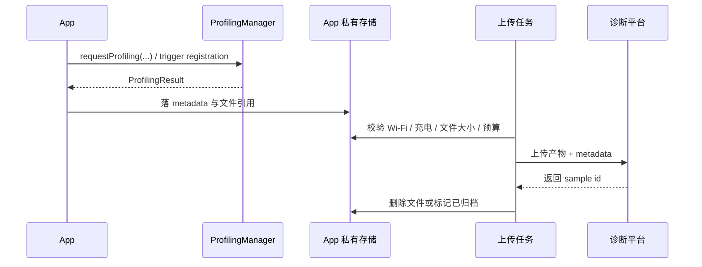

# ProfilingManager

> 技术基线是 Android 17 / API 37 / `android-17.0.0_r1`。ProfilingManager 属于 Mainline（可脱离完整系统升级包单独更新的模块），可通过 Google Play system update（Google Play 系统更新）独立更新。因此，设备上的实际行为可能与这个固定 AOSP tag 对应的源码存在差异。

ProfilingManager 补足量产设备上“问题发生时没有开启分析工具”的取证空档。Android 15 起，应用可主动请求 system trace（系统时间线）、heap dump（堆快照）、heap profile（堆分配采样）和 stack sampling（周期性调用栈采样）；Android 16 增加 system-triggered profiling（由系统事件触发采集）。接入时需要分清显式请求、trigger 版本边界和结果接收三部分。

## 从待回答的问题选择采集类型

`ProfilingManager` 提供四种显式采集请求。AndroidX 为每种请求提供一个 builder，也就是通过连续调用 `set*()` 方法组装参数的配置对象。它们共用结果回调，却生成不同的数据，分析工具也不同。

| AndroidX builder | 适合回答的问题 | 产物 | builder 专有参数 | 读数边界 |
|---|---|---|---|---|
| `SystemTraceRequestBuilder` | 卡顿发生在哪条线程，启动阶段被谁阻塞，Binder（跨进程调用）、调度和渲染如何交叠 | Perfetto system trace | `setDurationMs()`、`setBufferSizeKb()`、`setBufferFillPolicy()` | 只记录配置允许的 Perfetto 数据源，不能直接给出 Java 对象引用链 |
| `JavaHeapDumpRequestBuilder` | 哪些 Java 对象仍然存活，GC Root（垃圾回收根对象）经由什么引用链持有它们 | `.hprof` | `setBufferSizeKb()` | 这是一个堆快照，没有时间维度，也不描述 native 分配 |
| `HeapProfileRequestBuilder` | 哪些调用栈持续产生内存分配，分配量如何分布 | heap profile trace | `setDurationMs()`、`setBufferSizeKb()`、`setSamplingIntervalBytes()`、`setTrackJavaAllocations()` | 采样只记录部分分配，不能代替 heap dump 的完整对象关系 |
| `StackSamplingRequestBuilder` | 哪些调用栈频繁被采样命中，热点大致集中在哪里 | stack-sampling trace | `setDurationMs()`、`setBufferSizeKb()`、`setSamplingFrequencyHz()` | 按频率抽取的样本是统计近似值，不能当作逐方法精确 CPU 时间 |

线程时间线优先采集 system trace；对象存活关系用 Java heap dump；持续分配问题用 heap profile；只需要低开销热点线索时用 stack sampling。采样结果用于缩小范围，结论仍要回到 trace 时间线、heap 引用关系或可复现测试中核对。

heap profile 默认采样 native allocation（C/C++ 等原生堆分配）。开启 `setTrackJavaAllocations(true)` 后改为采样 Java allocation（Java/Kotlin 对象分配），同一请求只覆盖其中一类。

四个 builder 都继承 `setTag()` 和 `setCancellationSignal()`。`tag` 只有前 20 个字母、数字和连字符会转换为小写并进入输出文件名，因此它适合短场景标识，不适合承载完整工单信息。持续一段时间的采集可由 `CancellationSignal` 提前停止；同时配置时长和取消信号时，先到达的条件结束采集。Java heap dump 是某一时刻的快照，没有 `durationMs` 参数。

## API 层与版本判断

Android 15（API 35）加入平台类 `android.os.ProfilingManager`。AndroidX Core 1.15.0 首次提供 `androidx.core.os.Profiling` 和四个 request builder，减少直接拼装平台参数的工作；截至本轮核验，稳定版 1.19.0 仍提供这些封装。AndroidX 回调里的结果类型仍是 `android.os.ProfilingResult`。

显式请求只要求 API 35。系统触发能力分成 API 36、Android 16 minor release 1（36.1）、API 37 三档。36.1 属于 minor SDK release（主 API 级别内的次要 SDK 版本），不属于通过扩展版本号发布能力的 `SdkExtensions` B Extension；下面的守卫用 `SDK_INT_FULL` 把 API 37 基线和 Android 16 minor release 1 分开处理。

```java
boolean hasProfiling36_1 =
        Build.VERSION.SDK_INT >= 37
        || (Build.VERSION.SDK_INT >= 36
            && Build.VERSION.SDK_INT_FULL >= Build.VERSION_CODES_FULL.BAKLAVA_1);
```

API 37 已包含这组接口。Android 16 设备则要用 `SDK_INT_FULL` 查询包含 minor release 序号的完整 SDK 版本；通过版本字符串、机型名单或系统更新日期推测能力都不可靠。编译期也应使用包含相应 minor release API 的 SDK。详细的 36.1 版本判断见下文“System-triggered profiling 的运行方式”。

## 发起一次显式请求

下面的 Java 示例采集 5 秒 system trace，并允许业务场景结束时提前取消。`enqueueProfileForUpload()` 和 `recordProfilingFailure()` 代表应用自己的持久化与日志函数。

```java
CancellationSignal stopSignal = new CancellationSignal();

ProfilingRequest request = new SystemTraceRequestBuilder()
        .setBufferSizeKb(10_240)
        .setDurationMs(5_000)
        .setBufferFillPolicy(BufferFillPolicy.RING_BUFFER)
        .setCancellationSignal(stopSignal)
        .setTag("scroll-jank")
        .build();

Profiling.requestProfiling(context, request, executor, result -> {
    if (result.getErrorCode() == ProfilingResult.ERROR_NONE) {
        String path = result.getResultFilePath();
        if (path != null) {
            enqueueProfileForUpload(path, result.getTag());
        }
    } else {
        recordProfilingFailure(
                result.getErrorCode(),
                result.getErrorMessage(),
                result.getTag());
    }
});
```

`Profiling`、`ProfilingRequest`、`SystemTraceRequestBuilder` 和 `BufferFillPolicy` 来自 `androidx.core.os`；`CancellationSignal` 与 `ProfilingResult` 来自 `android.os`。平台异步执行请求，调用成功也不保证立刻开始采集。若目标是某段业务代码，应给启动留出余量，并用 `androidx.tracing.Trace` 添加可搜索的 slice（带开始、结束时间的时间线区段）；业务段结束后可调用 `stopSignal.cancel()` 请求停止。

`executor`（调度回调的执行器）与 request-specific listener（只接收本次请求结果的监听器）必须成对传入。两者都传 `null` 仅在已经注册全局 listener 时有意义；没有任何 listener 的请求会被丢弃。回调线程不要做文件压缩或网络上传，可把路径交给受约束的后台任务。

## `BufferFillPolicy` 只有两个公开值

这个策略只属于 `SystemTraceRequestBuilder`。

| 策略 | 缓冲区写满后的动作 | 适用窗口 |
|---|---|---|
| `RING_BUFFER` | 环形缓冲区写满后，新事件覆盖最旧事件 | 关注停止点前的滑动卡顿、输入延迟或手动结束场景 |
| `DISCARD` | 新事件被丢弃，已有事件继续保留 | 关注采集开始处的冷启动早期事件 |

策略改变保留哪一段时间线，不会扩展数据源。`ProfilingManager` 暴露的是受控配置，不能把任意 Perfetto config 原样传入。缓冲区大小、时长和采样频率还会在系统服务侧按 `DeviceConfig`（系统可动态调整的配置项）给出的范围裁剪；`android-17.0.0_r1` 的默认值与上限适合用来读源码，不应复制成跨设备的产品常量。

## 两类 listener 与结果再次投递

平台有 request-specific listener 和 global listener 两条结果通道。AndroidX 的 `Profiling.registerForAllProfilingResults()` 会注册 global listener（接收当前 UID 下全部 profiling 结果的全局监听器）；UID 是 Android 用来标识应用沙箱的 Linux 用户 ID。

| 请求来源 | request-specific listener | global listener | `getTriggerType()` |
|---|---|---|---|
| 显式 `requestProfiling()` | 配置后收到 | 注册后也收到同一结果 | `TRIGGER_TYPE_NONE` |
| system-triggered profiling | 没有此通道 | 收到 | 对应的 trigger 常量 |

应用同时使用两条通道时，推荐由 request-specific listener 更新本次交互状态，由 global listener 持久化结果文件。成功结果可用平台返回的完整 `resultFilePath` 字符串去重。失败结果的路径为 `null`，`ProfilingResult` 也没有唯一结果 ID；把 `triggerType + tag + errorCode` 当唯一键会误合并两次独立失败。若失败也要入库，应固定一个写入通道，并把显式请求的内部 request ID 保存在应用自己的请求记录中。

采集完成前进程退出，平台可在应用下次启动并注册全局 listener 后再次投递结果。全局 listener 应在进程启动早期注册，并在整个进程生命周期内保持可用。trigger 配置由 Android 17 的系统服务 `ProfilingService` 写入磁盘恢复，不要求每次进程启动都重复添加；listener 属于进程内回调，仍需重新注册。相同 trigger type 只能保留一份配置，后添加的配置会替换旧配置。

## 结果文件、字段与隐私

成功时只能通过 `ProfilingResult.getResultFilePath()` 获取文件位置。不要硬编码 `files/profiling` 等目录，也不需要申请外部存储权限。应用读取、上传完成后删除、重试和留存超时都应围绕返回路径实现。

Android 17 源码会在注册全局 listener 时顺带清理已经交付且超过五天的旧文件。这只是 `ProfilingManager` 当前实现中的后备清理，不是应用可依赖的留存协议；Profiling Mainline 模块和 OEM（设备厂商）配置都可能改变行为。上传成功后主动删除文件，磁盘不足时再按年龄淘汰，才能控制应用自己的空间预算。

`ProfilingResult` 提供 `errorCode`、`errorMessage`、`resultFilePath`、`tag` 和 `triggerType`，没有 `profilingType` getter。显式请求的采集类型应在提交请求时写入应用记录；trigger 结果则按 trigger 与产物规则映射。不要从文件扩展名反推全部类型，因为多个 profile 都可能使用 Perfetto trace 容器。

system trace 会移除其他应用和进程的信息，因而 PerfettoSQL（Perfetto 的 SQL 查询接口）可查询的数据范围比本地完整 trace 小。脱敏不覆盖应用自己的线程名、trace slice、Surface 名和业务 `tag`。heap dump 还可能包含对象字段与字符串，heap profile 和 stack sampling 会暴露类名、方法名及调用路径。上传前应按数据类型执行授权、加密、访问控制、保留期限和删除策略。

`tag` 不应包含手机号、订单号、账号、地理位置或明文会话标识。可使用不含用户含义的场景码，再由服务端受控映射到内部工单。

### 结果文件生命周期

系统先让应用进程在 `files/profiling/` 中创建目标文件，再通过文件描述符（跨进程传递已打开文件的句柄）写入结果。`ProfilingResult.resultFilePath` 返回的是完整路径，文件此时已经存在，callback 不需要再“保存”一份。应用要在一次数据库事务（相关字段要么全部写入，要么全部回滚）中登记路径与业务 metadata（描述这份文件来源和状态的附加字段），然后交给后台任务。

下面的时序图描述了推荐的处理链：



回调重复、进程重启和上传重试都写入同一条幂等记录。只有后端确认完整接收后才删除本地文件；上传失败则保留到应用自己的过期时间或容量上限。

metadata 至少包含：

- `case_id` / `session_id`
- `request_type` / `trigger_type`
- `app_version` / `build_id`（构建标识）/ `device` / `sdk_int_full`
- 页面、前后台状态、实验分组、触发原因
- `result_file_path`、文件大小、内容摘要（用于校验完整性）、上传状态和清理时间

`android-17.0.0_r1` 中，`ProfilingManager` 会借用应用提供的 executor，尝试删除已交付超过 5 天的旧文件；这项清理至多每天触发一次，但触发依赖相关 API 调用。服务侧也有结果重投与过期处理。这些是实现细节，调用时机和系统配置都可能变化。应用仍需维护自己的容量上限、保留期和上传成功即删除策略。

平台会先把 `tag` 转成小写并过滤到字母、数字和连字符，再截取前 20 个有效字符写进文件名。`tag` 只能放短场景码或随机诊断任务 ID，不能放手机号、账号、Token、URL 查询参数等用户数据。

### Java Heap Dump 的敏感数据风险

Java heap dump 会记录应用进程中的对象、字段、数组和字符串。用户登录后的堆中可能出现：

- 登录 Token、Session ID、OAuth Refresh Token（用于换取新访问令牌的长期凭据）
- 手机号、邮箱、用户昵称等 PII（Personally Identifiable Information，可识别个人身份的信息）
- 支付信息、订单号、地址
- 缓存在内存中的密钥材料或证书

平台对 system trace 的脱敏不能替应用清理 heap dump 中的业务数据。安全方案需要按分析方式选择：

1. **优先在设备上提取**：若问题能由对象计数、Retained Size（对象及其支配对象占用的内存）、类分布或少量调用栈回答，可在设备上提取诊断摘要，只上传摘要。
2. **受控后端分析**：必须上传原始 heap dump 时，使用 TLS 加密传输、服务端加密存储、独立 KMS（密钥管理系统）、最小权限、访问审计和短保留期。后端要分析文件，就必然存在受控的解密路径；“端到端加密且服务端无法读取”与服务端分析不能同时成立。
3. **明确授权与采样范围**：隐私告知应说明性能诊断可能包含内存快照，远程开关要能关闭 heap dump，并把采样限定到必要版本和必要用户范围。
4. **备份排除**：`files/` 默认可能进入 Auto Backup。把 `files/profiling/` 同时排除在云备份和设备迁移规则之外，并兼顾旧版 `fullBackupContent` 配置。
5. **删除可验证**：上传成功、超过保留期、用户撤回同意或诊断任务关闭时，都要有可观测的删除记录。

不要把通用 trace 上传接口直接复用于 heap dump。两者的数据敏感度、访问人群、保留期和审计要求不同。

## System-triggered profiling 的运行方式

系统会周期性、带随机性地启动后台 trace，并使用 ring buffer 保存最近数据。事件发生时，只有后台 trace 正在运行且配额（系统允许的采样预算）充足，才会生成 running trace snapshot（当前后台 trace 的快照）。因此，注册 trigger 代表允许系统在条件满足时采样，不代表每次 ANR、结束进程或 fully drawn 都能得到文件。

API 37 的 trigger 分层如下，表中同时列出逐项停止条件和产物边界。

| 版本 | trigger | 产物与触发语义 |
|---|---|---|
| API 36 | `TRIGGER_TYPE_APP_FULLY_DRAWN` | `reportFullyDrawn()`（应用声明界面已完整绘制）附近的 running system trace snapshot |
| API 36 | `TRIGGER_TYPE_ANR` | ANR（Application Not Responding，应用无响应）时的 running system trace snapshot |
| version 36.1 | `TRIGGER_TYPE_APP_REQUEST_RUNNING_TRACE` | 应用调用 `requestRunningSystemTrace(tag)` 时保存当前 running trace；此前需注册此 trigger 或全部 trigger |
| version 36.1 | `TRIGGER_TYPE_KILL_FORCE_STOP` | 用户在设置页强行停止应用时的 running trace snapshot |
| version 36.1 | `TRIGGER_TYPE_KILL_RECENTS` | 用户从最近任务移除应用时的 running trace snapshot |
| version 36.1 | `TRIGGER_TYPE_KILL_TASK_MANAGER` | 用户通过任务管理界面停止应用时的 running trace snapshot |
| API 37 | `TRIGGER_TYPE_OOM` | Java OOM（out of memory，内存不足）对应的 Java heap dump |
| API 37 | `TRIGGER_TYPE_ANOMALY` | 产物随 anomaly（系统识别的异常）子类型变化，`tag` 携带子类型信息 |
| API 37 | `TRIGGER_TYPE_KILL_EXCESSIVE_CPU_USAGE` | 因 `ApplicationExitInfo.REASON_EXCESSIVE_RESOURCE_USAGE` 结束进程时的 running trace snapshot |
| API 37 | `TRIGGER_TYPE_COLD_START` | 为本次冷启动新开的 system trace 与 stack sampling |
| API 37 | `TRIGGER_TYPE_APP_COMPAT` | 产物随兼容性问题类型变化，`tag` 携带问题信息 |

`addProfilingTriggers()` 从 API 36 可用；`addAllProfilingTriggers()` 与 `requestRunningSystemTrace()` 属于 version 36.1。trigger 结果只送到全局 listener。注册时的 `rateLimitingPeriodHours` 是应用为单个 trigger 设置的额外最小间隔，系统级与进程级限流仍会继续生效。

## 两个启动 trigger 的时间窗口

`APP_FULLY_DRAWN` 保存当时已经在后台运行的 system trace。它依赖后台 trace 恰好处于运行状态，保留的是触发点之前的 ring-buffer 窗口，适合查看启动尾段与触发前的系统活动。

`COLD_START` 在 API 37 为这次冷启动启动一份新 system trace，并同时做 stack sampling。它在应用调用 `reportFullyDrawn()` 时停止；应用未调用时默认约 5 秒停止。其 system trace 使用 `DISCARD`，目的是留下采集开头。启动 trace 自身可能给启动带来延迟，做性能阈值判断时要把采集本身的开销纳入解释。

这两个 trigger 的采集来源、起点、停止点和产物都不同。分析启动问题时，应在样本记录中保留 trigger type，避免把两类时间窗口放进同一个分位数（如 P50、P95）统计。

## 三类排障场景

### 交互卡顿

滑动掉帧、输入延迟和动画停顿可采集 3～5 秒 system trace。若用户操作结束时取消采集，`RING_BUFFER` 有利于保留结束点之前的线程活动。Perfetto 中检查主线程、`RenderThread`（渲染线程）、Frame Timeline（逐帧生命周期与卡顿标记）、Binder、CPU 调度与自定义业务 slice，并把掉帧时刻与调用栈或锁等待对齐。

### 冷启动与 ANR

冷启动回归可结合 `COLD_START`、`APP_FULLY_DRAWN` 与手动 system trace，样本必须按 trigger type 分组。ANR trigger 用于补充现场，但受后台 trace 和限流约束，不能取代 Play Console、`ApplicationExitInfo`、ANR trace 与业务日志。全局 listener 负责接收延迟到达和进程重启后再次投递的文件。

### 内存持续增长

分配来源未知时，可用 heap profile 找高频分配栈，再用 Java heap dump 检查存活对象和 GC Root。API 37 的 `TRIGGER_TYPE_OOM` 只覆盖 Java OOM，不覆盖 `LMKD`（low memory killer daemon，系统低内存杀进程机制）或 native OOM（C/C++ 等原生堆耗尽）。应用安装自定义 `UncaughtExceptionHandler`（未捕获异常处理器）时必须继续调用默认 handler，否则 OOM trigger 无法按平台预期完成处理。

## 覆盖全部失败结果

`android-17.0.0_r1` 的 `ProfilingResult` 定义了八种失败码。成功码是 `ERROR_NONE`。

| 错误码 | 表示的阶段 | 应用侧处理 |
|---|---|---|
| `ERROR_FAILED_RATE_LIMIT_SYSTEM` | 系统配额拒绝本次采集 | 记录为未采样，退避（逐步拉长重试间隔）；不要在前台循环请求 |
| `ERROR_FAILED_RATE_LIMIT_PROCESS` | 当前应用或进程配额耗尽 | 降低主动请求频率，并复核 trigger 的间隔配置 |
| `ERROR_FAILED_PROFILING_IN_PROGRESS` | 已有 profiling 任务运行 | 对主动请求做串行调度，稍后重试一次 |
| `ERROR_FAILED_EXECUTING` | 底层 profiler 启动或执行失败 | 保存系统版本、类型、tag 和消息，按版本聚合 |
| `ERROR_FAILED_POST_PROCESSING` | 采集后的处理或文件准备失败 | 文件不可用，按版本与 profile 类型聚合 |
| `ERROR_FAILED_NO_DISK_SPACE` | 没有足够空间写出结果 | 清理已处理文件，设置磁盘剩余空间阈值后再请求 |
| `ERROR_FAILED_INVALID_REQUEST` | 参数组合或请求内容无效 | 停止重试，修正 builder 参数或版本分支 |
| `ERROR_UNKNOWN` | 未归入以上类别的失败 | 保存 `errorMessage` 与运行环境，限制重试次数 |

失败日志至少保存应用自己的 request ID、profile 类型、`triggerType`、`tag`、`errorCode`、`errorMessage` 和平台版本。成功结果的 `getResultFilePath()` 才有文件语义；失败时应按 `null` 处理。

限流次数、时长上限和缓冲区上限来自可更新模块与 `DeviceConfig`，产品代码不要写死。实验设备可用 `adb shell device_config list profiling` 检查当前配置。为本地复现临时关闭限流可运行 `adb shell device_config put profiling_testing rate_limiter.disabled true`；调试系统 trigger 可设置 `adb shell device_config put profiling_testing system_triggered_profiling.testing_package_name <package>`。这些开关只用于受控测试设备，测试结束后恢复原配置。

限流不能简化成固定的“每小时几次”。Android 17 会按 profiling 类型计算不同资源成本，并分别检查小时、天、周窗口以及应用 UID 与整机预算；任一预算不足都可能拒绝请求。应用还应设置更保守的本地冷却时间，并保证同类采集串行，不能靠循环重试恢复额度。

## 与其他工具的边界

| 工具 | 使用位置 | 能力边界 |
|---|---|---|
| ProfilingManager | 量产设备、线上回归、系统事件采样 | 受完整平台 SDK 版本、后台 trace 是否运行和限流约束 |
| Android Studio Profiler | 开发机交互分析与即时验证 | 很难覆盖用户现场和系统事件发生前的窗口 |
| adb / Perfetto CLI | 实验室压测、定制数据源、自动采集 | 普通应用无法在量产用户设备上任意执行 |
| APM（Application Performance Monitoring，应用性能监控）SDK | 业务指标、崩溃信息、长期统计 | 是否包含 system trace、heap 数据取决于 SDK，数据责任由接入方评估 |

ProfilingManager 生成的是诊断证据，监控系统仍需负责触发策略、样本元数据、传输、访问权限、留存和删除。线上指标异常用于定位样本，profile 用于解释某次现场，两者不要混成同一种数据。

## 设备验证与旧版本降级

Mainline 模块、厂商 Perfetto data source（数据源）、系统负载、存储与后台 trace 抽样都会影响成功率。设备覆盖表至少记录 build fingerprint（精确标识系统构建的字符串）、完整 SDK 版本、Profiling 模块版本、请求或 trigger 类型、错误码、文件大小和可查询 schema（表与字段结构）。某一品牌成功率偏低时，先按这些字段聚合，再判断是否存在 OEM 差异；不能把一次未产出文件直接解释为 trigger 未执行。

测试设备可用官方 `profiling_testing` DeviceConfig 开关维持目标包的后台 trace、关闭 rate limiter（限流器）或保留临时未裁剪结果。它们只服务隔离测试，实验结束必须恢复，生产代码不能依赖这些开关。分析量产环境的 redacted（已脱敏）system trace 时还要标记来源：跨进程表或 SQL 为空，可能是采集窗口未覆盖，也可能是 redactor（脱敏器）删除了无关进程。

Android 8—14 没有等价的线上 profile API。降级目标是保留可比较指标和复现线索：启动/帧耗时使用应用计时、FrameMetrics/JankStats 与 Android vitals，业务慢操作使用名称稳定、取值数量有限（低基数）的 Trace slice，崩溃/ANR 使用 `ApplicationExitInfo` 和诊断平台，本地重现再用 Perfetto、Profiler、heap dump 或 Macrobenchmark。`Trace.beginSection()` 只写事件，本身不会启动或保存 system trace。

### 源码调用链核对

`android-17.0.0_r1` 中可以沿以下路径核对关键行为：

| 源码位置 | 可验证的行为 |
|---|---|
| `framework/java/android/os/ProfilingManager.java` | 双层 listener、无 listener 时丢弃请求、`files/profiling/`、重投提示、旧文件清理 |
| `framework/java/android/os/ProfilingTrigger.java` | API 37 trigger 语义、冷启动 5 秒边界、OOM 默认 handler 要求、应用侧限流 |
| `framework/java/android/os/ProfilingResult.java` | 错误码、失败时路径为 `null`、`tag` 与 `triggerType` |
| `service/java/com/android/os/profiling/Configs.java` | 参数裁剪、默认范围、Perfetto 数据源和缓冲区策略 |
| `service/java/com/android/os/profiling/ProfilingService.java` | 限流、执行与后处理、脱敏、文件后缀、结果复制和回调 |

从调用链看，应用侧 request 经 Binder（Android 的跨进程通信机制）进入 `ProfilingService`，服务依次检查并发状态、限流与参数，再启动 Perfetto。采集完成后，system trace 与 stack sampling 会在需要时经过 redaction（删除或合并其他进程的敏感信息），服务请求应用进程创建目标文件，把临时结果复制到应用私有目录，然后发送 `ProfilingResult`。任一阶段失败都映射到对应错误码，因此“提交成功”不能当成“采集成功”。

## 上线前检查清单

- API 35、API 36、version 36.1、API 37 的代码路径分别受运行时能力保护。
- 显式请求成对提供 executor 与 listener，或确保全局 listener 已注册。
- 全局 listener 在进程启动早期注册，并能处理重投和重复成功回调。
- 成功文件按 `resultFilePath` 去重；失败只由一个通道持久化。
- profile 类型在提交请求时记录，不从 `ProfilingResult` 或扩展名猜测。
- `tag` 使用短场景码，不含用户标识和业务明文。
- 上传、删除、磁盘水位、退避和保留期限都有可测试策略。
- system trace 的脱敏边界、heap 数据风险和用户授权已经过隐私评审。
- trigger 命中率按采样能力解释，不把“无文件”直接当作“事件未发生”。

## 参考资料

1. [App-driven profiling：显式请求、回调与取消](https://developer.android.com/topic/performance/tracing/profiling-manager/how-to-capture)
2. [Trigger-based capture：后台 trace、触发与调试](https://developer.android.com/topic/performance/tracing/profiling-manager/trigger-based-capture)
3. [Retrieve and analyze：结果文件与应用侧处理](https://developer.android.com/topic/performance/tracing/profiling-manager/retrieve-and-analyze)
4. [Querying profiles：脱敏 trace 的查询边界](https://developer.android.com/topic/performance/tracing/profiling-manager/querying-profiles)
5. [`androidx.core.os.Profiling` API](https://developer.android.com/reference/androidx/core/os/Profiling)
6. [`android.os.ProfilingManager` API](https://developer.android.com/reference/android/os/ProfilingManager)
7. [`android.os.ProfilingTrigger` API](https://developer.android.com/reference/android/os/ProfilingTrigger)
8. [`android.os.ProfilingResult` API](https://developer.android.com/reference/android/os/ProfilingResult)
9. [AndroidX `Profiling.kt` 源码](https://android.googlesource.com/platform/frameworks/support/+/androidx-main/core/core/src/main/java/androidx/core/os/Profiling.kt)
10. [AOSP Profiling 模块：`android-17.0.0_r1`](https://android.googlesource.com/platform/packages/modules/Profiling/+/refs/tags/android-17.0.0_r1/)
11. [AOSP `ProfilingManager.java`：结果回调与旧文件清理](https://android.googlesource.com/platform/packages/modules/Profiling/+/refs/tags/android-17.0.0_r1/framework/java/android/os/ProfilingManager.java)
12. [AOSP `ProfilingResult.java`：字段与错误码](https://android.googlesource.com/platform/packages/modules/Profiling/+/refs/tags/android-17.0.0_r1/framework/java/android/os/ProfilingResult.java)
13. [AOSP `ProfilingTrigger.java`：trigger 版本与产物](https://android.googlesource.com/platform/packages/modules/Profiling/+/refs/tags/android-17.0.0_r1/framework/java/android/os/ProfilingTrigger.java)
14. [AOSP `ProfilingService.java`：trigger 与结果持久化](https://android.googlesource.com/platform/packages/modules/Profiling/+/refs/tags/android-17.0.0_r1/service/java/com/android/os/profiling/ProfilingService.java)
15. [Perfetto 文档](https://perfetto.dev/docs/)
16. [`Build.VERSION.SDK_INT_FULL`：minor release 版本判断](https://developer.android.com/reference/android/os/Build.VERSION#SDK_INT_FULL)

## 相关章节

- [13.1 Perfetto 入门、Trace 抓取与可靠性](../ch13-perfetto/01-perfetto-intro-capture-reliability.md)：trace 容器、UI 与基础分析概念
- [15.3 性能指标体系与线上监控](../ch15-methodology/03-performance-metrics-online-monitoring.md)：采样预算、上传和告警
- [9.1 ANR 机制、类型与触发条件](../../part2-performance/ch09-anr/01-anr-mechanism-types-triggers.md)：ANR 信号、trace 与归因边界
- [16.6 Android 系统启动耗时优化与 bootanalyze](../../part4-system/ch16-aosp/06-system-boot-time-optimization.md)：系统启动 trace 与应用冷启动 trace 的边界
