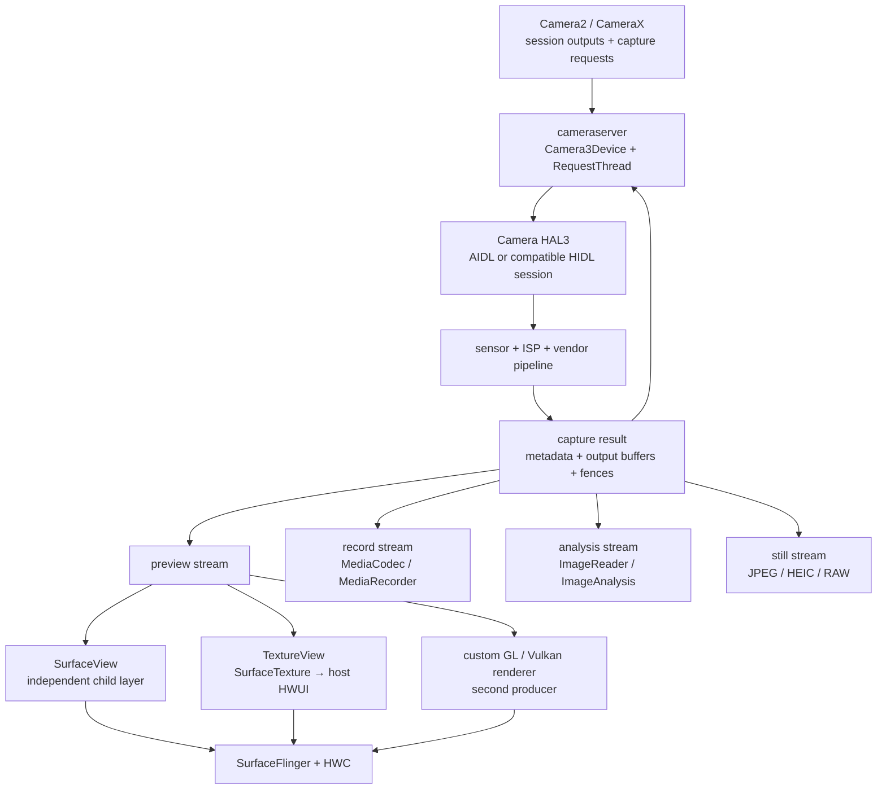

---

title: Android Camera 性能与 Perfetto 分析
chapter: '14.9'
section: '14.9'
status: "finalized"
drafted_date: '2026-04-06'
drafted_by: openclaw-task2a
reviewed_by: "openclaw-task6"
last_task2b_at: "2026-07-13T14:52:36+08:00"
reviewed_date: "2026-07-13"
applicable_versions: Android 12 (API 31) - Android 17 (API 37)
last_verified: '2026-04-06'
last_verified_against: AOSP android-17.0.0_r1
confidence: medium
sources:
- type: blog
  path: Cubox/如何利用 Perfetto 自动化分析 Android Camera 性能-2023-12-15.md
- type: blog
  path: Cubox/Android Camera内存问题剖析-2024-02-04.md
- type: blog
  path: Cubox/一文N张图带你理解Android Camera Native Framework架构-2023-08-13.md
- type: aosp
  path: frameworks/base/core/java/android/hardware/camera2/impl/CameraMetadataNative.java
tags:
- camera
- perfetto
- buffer-queue
- preview-stutter
- hal3
related_chapters:
- '2.13'
- '13.9'
- '11.2'
- '4.3'
task6_result: "pass-light-edit"
review_notes: '2026-05-01 task6 re-review (revisiting): pass-light-edit. L1: fixed 2x 链路→路径, removed 虚假引导语. L2: good. All outline anchors covered. task9_result=needs-rework, not eligible for auto-promotion. | ⚡ 2026-05-01 task6 re-confirm (revisiting→reviewed): content clean, no new L1/L2 issues. task9 issues previously fixed in queue. task9 re-review needed for auto-promotion. | ✅ 2026-07-13 task6 review: pass-light-edit. Fixed 8x L1/L2 issues (spacing, code purpose statements, long sentences). All outline anchors covered. No L3/L4 issues.'
task2b_state: "fixed"
task2b_result: "fixed"
last_task9_at: "2026-07-13T15:41:13+08:00"
task9_reviewed_by: openclaw-task9
task9_reviewed_date: 2026-05-28
repaired_date: '2026-04-26'
repaired_by: openclaw-task2b
last_task9_review_log: "logs/deep-review/2026-05-28-18-deep-review.md"
task9_review_notes: "2026-05-28 task9 deep-review: pass-tech-review。P0 0 / P1 0 / P2 0。复核 TextureView/SurfaceTexture、HAL buffer management、CameraMetadataNative 与 Perfetto SQL/Python 示例；未发现阻断问题，自动晋升 finalized。"
task2b_rework_date: '2026-05-19'
last_task6_at: "2026-07-13T15:17:00+08:00"
task6_reviewed_at: "2026-07-13T15:17:00+08:00"
task6_reviewed_by: "openclaw-task6"
last_task6_review_log: "logs/review/2026-05-28-18-review.md"
last_task6_audit: "2026-07-09"
task6_review_notes: "2026-05-28 18 Task6 revisiting-review: pass-light-edit；修复启动拆解表格被 blockquote 截断、Python SDK 示例 config 省略占位；L1/L2 通过；outline 15/15 覆盖；无 L3/L4 回炉项。task9_result=needs-rework，未自动晋升。"
p0: 0
p1: 0
p2: 0
task6_l1_l2_fixes: 8
task6_l3_l4_issues: 0
finalized_date: "2026-07-13"
finalized_by: openclaw-task9
last_task9_audit: "2026-07-13"
last_task9_audit_log: "logs/deep-review/2026-07-13-08-audit.md"
task9_result: pass-tech-review
task9_state: reviewed
task6_state: reviewed
pipeline_stage: ready-to-publish
deepseek_cn_review_state: done
last_deepseek_cn_review_at: 2026-07-13
task2b_lite_notes_2026_07_13: "frontmatter 去重修复: 清理 6 组 duplicate keys (pipeline_stage/task6_state/task9_state/task9_result/last_task9_audit/path-under-sources 误删已恢复); status finalized→ready-for-review (task9_result=needs-rework)"
last_task2b_lite_at: "2026-07-13"
---


# 14.9 Android Camera 性能与 Perfetto 分析

Camera 性能问题通常横跨 App、Framework、HAL、内核驱动和显示系统。预览卡顿、拍照慢、录像丢帧、内存上涨分别对应不同观测点：有的看 `cameraserver` 和 HAL slice，有的看 BufferQueue，有的看 `CameraMetadataNative` 引用保留和 native allocation。

分析时先把 Camera 性能问题分成可排查的类别，再梳理管线里的 Buffer 流转，并用 Perfetto Trace Processor 量化对应指标。预览、拍照、录像和内存问题需要选择不同的 SQL、Track 与补充工具。

## 基线、设备边界与四类问题

平台源码锚点是 Android 17 / API 37 / `android-17.0.0_r1`，kernel 侧固定为 `android17-6.18-2026-06_r6`。Camera provider、HAL、sensor driver、ISP firmware、算法库和 vendor tracepoint 由设备厂商提供。AOSP 可以证明 framework 与 HAL 的接口边界，不能代替目标设备的实现证据。

一次 Camera session 可能同时包含 preview、record、analysis 和 still capture。它们可由同一组 capture request 驱动，但拥有不同 stream、buffer pool、consumer 和归还节奏。预览稳定不能证明录像或分析流稳定；慢 consumer 也可能经共享 ISP stage、有限 buffer 或内存带宽影响其他输出。

| 现象 | 测量边界 | 容易混入的其他耗时 |
|---|---|---|
| 预览卡顿 | camera frame ready → preview carrier → SF latch → display present | 宿主 UI、TextureView 采样、HWC、显示节奏 |
| 拍照延迟 | 点击/业务触发 → request → shutter → image buffer → 编码/保存 | 3A、长曝光、ZSL、多帧算法、存储 |
| 录像丢帧 | camera record stream → encoder input → 编码输出 → muxer/storage | codec、码率、热限制和 I/O |
| 内存压力 | stream buffer、HAL cache、中间图、metadata 与业务队列 | dma-buf、native heap、Java 可达对象和 vendor pool |

不存在适用于所有设备的“帧间隔超过 40 ms 即 Camera 故障”或“标准差超过 5 ms 即用户可见”阈值。目标 fps、显示刷新率、曝光时间、timestamp base 和产品交互预算共同决定 deadline。30 fps 只给出约 33.33 ms 的名义周期；某个间隔偏长还要判断下一帧是否补回、显示端是否重复上一帧，以及问题发生在哪一路 output。

拍照也不能只记录一个总数。按下快门到 shutter、shutter 到图像可读、图像可读到编码或保存完成，分别对应控制、sensor/ISP、consumer 和 I/O。ZSL、Night、HDR、Ultra HDR、RAW14 的处理边界不同，固定的“普通拍照耗时范围”很快会失去意义。

## Camera 管线的 Buffer 流转

HAL3 把相机建模为多笔 request 在途的异步流水线。`CaptureRequest` 携带控制参数与目标 Surface；HAL 经 sensor 和 ISP 生成结果，再通过 `processCaptureResult()` 分批返回 metadata 和 output buffer。同一 frame number 的 partial metadata、final metadata 与各路 buffer 可以在不同时刻到达。

下面的图用于区分四类 consumer 以及预览的三种 carrier。



图中不同 output 通常对应不同 stream buffer。HAL 可以复用曝光或 ISP 中间结果，每个 consumer 仍需独立完成自己的 acquire、处理和 release。

### `cameraserver` 与 Camera3 stream

Camera2/CameraX 的调用经 Binder 进入 `cameraserver`。Android 17 的 `Camera3Device` 维护 request、in-flight 状态与 stream；RequestThread 准备 buffer 和 metadata，再调用 HAL session 的 `processCaptureRequest` 路径。Android 13 后新设备使用 Camera AIDL HAL，升级设备仍可能保留兼容 HIDL HAL。线程名和 transport 要从设备确认。

每个 output 会映射到 Camera3 stream。`Camera3OutputStream` 负责把 HAL 返回的有效 buffer 送回对应 `ANativeWindow` consumer，并保留 HAL release fence。preview、record、analysis 和 still stream 的消费速度可以不同，不能用某一路 callback 代替另一条路径的完成时间。

### Buffer ownership 与三类 fence

| 同步对象 | 表示的边界 | 常见等待方 |
|---|---|---|
| framework 交给 HAL 的 acquire fence | output buffer 何时可供 HAL 写入 | HAL、ISP 或 vendor GPU |
| HAL 随 result 返回的 release fence | 图像写入何时完成，consumer 可以开始读取 | BufferQueue、ImageReader、codec、App GPU |
| SF/HWC 对 preview layer 的 release fence | 显示 consumer 何时不再读取该 buffer | BufferQueue 与后续 producer |

display present fence 描述一轮显示帧的 present 边界。analysis、record 和 still buffer 可能从不上屏，因此没有对应的 display present fence。把 HAL release fence 与 display present fence 写成同一事件，会掩盖 SurfaceFlinger/HWC 之后的等待。

### HAL buffer management 不是固定三缓冲

Camera HAL3 buffer management 从 Android 10 起允许 request 先进入 HAL，HAL 接近写入阶段时再通过 `requestStreamBuffers()` 向 framework 借 output buffer。正常完成的 buffer 仍随 `processCaptureResult()` 返回；HAL 额外预取且未绑定到已提交 request 的 buffer，才通过 `returnStreamBuffers()` 归还。

`HalStream.maxBuffers` 由 HAL 在 stream 配置结果中逐流给出，不是 Camera 通用常量。Android 17 还支持 session-configurable buffer management，是否启用要查看本次 session 配置结果。诊断时区分：

- framework-managed 模式下，RequestThread 可能在提交 HAL 前等待 stream buffer；
- HAL-managed 模式下，HAL 的 `requestStreamBuffers()` 可能因首次分配、请求数量、consumer 持有或 buffer limit 变慢；
- `ImageReader.maxImages` 是 App consumer 的上限，也不等于 HAL 的 `maxBuffers`；
- vendor HAL 和算法可以维护额外 pool，不能只乘一个固定 buffer 数估算内存。

### SurfaceView、TextureView 与自研预览

`SurfaceView` 让 camera preview 进入独立 child Surface。SurfaceFlinger 同时看到 preview layer 与宿主 App Window；HWC 再依据格式、缩放、alpha、crop、色彩空间和 plane 资源选择 composition type。独立 layer 减少宿主每帧采样相机纹理的工作，不能保证每帧都走 DEVICE composition。

`TextureView` 先让 camera buffer 进入 `SurfaceTexture`，宿主 HWUI 在 View draw 中获取纹理，再把采样结果写进 App Window。这里有 camera → SurfaceTexture 与 host HWUI → App Window 两段 BufferQueue。camera buffer ready 以后，还要等待宿主 `Choreographer`、traversal、RenderThread、GPU 和窗口提交。额外代价依分辨率、变换、GPU、画面覆盖和设备策略而变化，不能固定成 5–10 ms。

滤镜、分割、畸变矫正或 AR 常把 camera buffer 导入 OpenGL ES/Vulkan，再输出到另一个可见 Surface。HAL 是第一生产者，自研 renderer 同时是中间 consumer 与第二生产者。trace 要分开测 camera release fence、App GPU 完成和 output Surface present。

### ImageReader 与 CameraX ImageAnalysis 的回压

`ImageReader.acquireNextImage()` 保留顺序，consumer 跟不上时容易占满 `maxImages`。只关心最新结果时，`acquireLatestImage()` 可丢弃旧帧。两者都要求 owner 在处理结束后调用 `Image.close()`。

CameraX `ImageAnalysis` 的 `STRATEGY_KEEP_ONLY_LATEST` 使用 latest-only 的非阻塞策略；`STRATEGY_BLOCK_PRODUCER` 会在队列满时阻塞 camera device 范围内的其他 use case。`ImageProxy.close()` 才是把底层图像归还 CameraX 的接口，不要直接关闭包装对象中的 `Media.Image`。

扩大队列只能增加缓冲时间和内存。长期处理吞吐低于产帧速率时，应减少分析分辨率、降低分析频率、缩短持有时间或选择丢旧帧策略。

### metadata 也会跟随 Java 引用生存

Android 17 的 `CameraMetadataNative` 仍持有 native `mMetadataPtr`，private `close()` 由 `finalize()` 调用；`updateNativeAllocation()` 会向 `VMRuntime` 登记 native allocation 大小。App 不能直接调用这个 private `close()`，但 Java 对象可达性仍决定 metadata 何时具备清理条件。

大量长期保留的 `TotalCaptureResult`、`CaptureResult` 或带 result 的业务消息，会让对应 native metadata 一起存活。治理时提取需要的字段到轻量对象，避免把完整 result 无界放入缓存或跨线程队列。内存结论还要结合 Java heap、native heap、dma-buf 与 vendor pool，不能把 RSS 增长全部归给 metadata。

## 在 Perfetto 中分析 Camera 性能

### 抓取配置

采集前记录 camera id、logical/physical 关系、所有 output 的 format/size/fps range、dynamic range、stream use case、timestamp base、CameraX 版本、preview carrier、ZSL/Extensions 状态和 thermal 条件。缺少这些信息，同一条 trace 很难解释目标周期和 consumer 拓扑。

下面的配置为 30 秒 Camera 诊断基线。把 `com.example.camera` 替换成目标包名；vendor HAL 有自己的 trace category 或 ftrace event 时，再按设备文档添加。

```textproto
buffers {
  size_kb: 65536
  fill_policy: RING_BUFFER
}

data_sources {
  config {
    name: "linux.ftrace"
    ftrace_config {
      ftrace_events: "sched/sched_switch"
      ftrace_events: "sched/sched_waking"
      ftrace_events: "power/cpu_frequency"
      ftrace_events: "binder/binder_transaction"
      ftrace_events: "binder/binder_transaction_received"
      atrace_categories: "camera"
      atrace_categories: "gfx"
      atrace_categories: "view"
      atrace_categories: "hal"
      atrace_apps: "com.example.camera"
    }
  }
}

data_sources {
  config {
    name: "linux.process_stats"
    process_stats_config {
      scan_all_processes_on_start: true
    }
  }
}

data_sources {
  config {
    name: "android.surfaceflinger.frame"
  }
}

duration_ms: 30000
```

该配置能覆盖 AOSP camera ATrace、调度、Binder 与 SurfaceFlinger frame 数据。它不会自动暴露 ISP、SOF/EOF、IOMMU、内存带宽或 vendor pipeline node；这些信息要由设备 producer 或厂商 tracepoint 补充。长时间高帧率场景还要按事件量调整 buffer，防止环形缓冲覆盖复现窗口。

### 关键 Track 和 Slice

Android 17 AOSP 中值得搜索的线索包括：

| 线索 | 源码语义 | 不能替代的边界 |
|---|---|---|
| `connectHelper` | CameraService 接入与 client 初始化范围 | App 点击到 Binder 到达、预览首帧 |
| `configureStreams` / `beginConfigure` / `endConfigure` | stream 配置与 HAL configure | 首个 request 和首帧显示 |
| `sendRequestsBatch` | RequestThread 调入 HAL 提交一批 request | sensor/ISP 完成 |
| `frame capture` | 以 frame number 为 cookie 的 request 完成异步区间 | 单个 preview stream 的上屏时间 |
| `still capture` | still intent 对应 request 的异步区间 | JPEG/HEIC 保存完成 |
| `Stream N: first full buffer` | 某 stream 配置后首次把有效 output buffer 送往 consumer 的时间点 | SF latch 与 display present |
| `PreviewSpacer-<streamId>` | 固定帧率预览可能使用的显示节奏线程 | 所有设备的稳定 ABI |

`frame capture` 在 `sendRequestsBatch()` 前开始，在 framework 判断该 request 的 result metadata、shutter 与 buffer 条件闭合后结束。它适合观察 request-to-result 分布，不代表预览画面已经显示。`Stream N: first full buffer` 由一个很短的 `ATRACE_NAME` 产生，时间戳有价值，slice 时长没有阶段耗时含义。

CamX/CHI、MtkCam、P1/P2、ISP、JPEG 等 vendor 名称只能作为目标设备线索。把 frame number、sensor timestamp、request id、stream id、buffer id 与 AOSP slice 对齐后，再解释 vendor node。

SurfaceFlinger 的 `BufferTX - <layer>` counter表示 server 收到 pending buffer update 的变化，不能单独证明该 buffer 已 latch 或 present。SurfaceView preview 还可能缺少标准 App Window 那样完整的 App FrameTimeline；独立 layer 必须继续追 BufferQueue、fence、composition type 和 display present。

### SQL：先发现 Track，再算指标

同名 slice 可以来自不同进程、线程或异步 track。下面的查询先列出 Camera 相关 slice 所在 track，避免把 vendor 与 AOSP 事件混在一起。

```sql
SELECT
  s.track_id,
  COALESCE(t.name, '') AS track_name,
  s.name AS slice_name,
  COUNT(*) AS samples,
  MIN(s.ts) / 1e9 AS first_ts_s,
  MAX(s.ts) / 1e9 AS last_ts_s
FROM slice AS s
JOIN track AS t ON t.id = s.track_id
WHERE LOWER(s.name) GLOB '*camera*'
   OR LOWER(s.name) GLOB '*capture*'
   OR LOWER(s.name) GLOB '*request*'
   OR LOWER(s.name) GLOB '*queuebuffer*'
   OR LOWER(s.name) GLOB '*first full buffer*'
GROUP BY s.track_id, t.name, s.name
ORDER BY samples DESC, s.track_id;
```

查询结果用于选择“每个目标帧恰好出现一次”的事件。`frame capture` begin timestamp 描述 request 提交节奏；preview `queueBuffer` 或目标 layer 的 buffer update 才接近预览交付节奏。两类事件回答不同问题。

### SQL：量化帧间隔

下面以 track id `1234` 为示例。把它改成上一条查询确认的单一 preview 事件 track；同一 track 上还含其他 `queueBuffer` 时，应为 `name` 增加更具体的过滤条件。

```sql
WITH ordered AS (
  SELECT
    ts,
    ts - LAG(ts) OVER (ORDER BY ts) AS gap_ns
  FROM slice
  WHERE track_id = 1234
    AND name GLOB '*queueBuffer*'
),
gaps AS (
  SELECT gap_ns
  FROM ordered
  WHERE gap_ns IS NOT NULL
)
SELECT
  COUNT(*) + 1 AS frame_count,
  1e9 / NULLIF(AVG(gap_ns), 0) AS average_fps,
  AVG(gap_ns) / 1e6 AS average_gap_ms,
  MIN(gap_ns) / 1e6 AS min_gap_ms,
  MAX(gap_ns) / 1e6 AS max_gap_ms
FROM gaps;
```

`average_fps` 只有在所选事件与目标 preview buffer 一一对应时才成立。报告还应保留 gap 分布与原始时间窗；只给平均值会隐藏长间隔与随后补帧。

### SQL：定位 Event 所属进程和线程

同步 slice 常落在 thread track，`frame capture` 这类进程级异步事件可能落在 process track。下面两段查询使用同一个示例 track id，分别处理两种归属。

```sql
SELECT
  s.ts,
  s.dur,
  s.name,
  p.pid,
  p.name AS process_name,
  th.tid,
  th.name AS thread_name
FROM slice AS s
JOIN thread_track AS tt ON tt.id = s.track_id
JOIN thread AS th USING (utid)
JOIN process AS p USING (upid)
WHERE s.track_id = 1234
ORDER BY s.ts;

SELECT
  s.ts,
  s.dur,
  s.name,
  p.pid,
  p.name AS process_name
FROM slice AS s
JOIN process_track AS pt ON pt.id = s.track_id
JOIN process AS p USING (upid)
WHERE s.track_id = 1234
ORDER BY s.ts;
```

一条查询返回空结果时再试另一条。PID/TID 会复用，跨表关联使用 Perfetto 的 `upid`/`utid`；对外报告可以同时保留原始 pid/tid 方便查设备日志。

### SQL：观察 request-to-result

下面的查询汇总 AOSP `frame capture` 与 `still capture` 已闭合区间。

```sql
SELECT
  name,
  COUNT(*) AS sample_count,
  AVG(dur) / 1e6 AS average_ms,
  MIN(dur) / 1e6 AS min_ms,
  MAX(dur) / 1e6 AS max_ms
FROM slice
WHERE name IN ('frame capture', 'still capture')
  AND dur > 0
GROUP BY name;
```

这里的 duration覆盖 framework request 提交到 request 完成条件，包含 HAL/sensor/ISP 与 buffer 返回等待。它不包含 consumer 后续处理、preview present 或文件保存。跨场景比较前要保持 output 组合、曝光、算法模式和热状态一致。

### Python SDK 自动化分析

下面的脚本从命令行接收 trace 与 track id，输出相邻事件的间隔分布。它使用 Perfetto Python 包绑定的 Trace Processor，适合在相同采集配置下批量回归。

```python
import argparse
import math
from statistics import mean

from perfetto.trace_processor import TraceProcessor

parser = argparse.ArgumentParser()
parser.add_argument("trace")
parser.add_argument("track_id", type=int)
args = parser.parse_args()

tp = TraceProcessor(trace=args.trace)
rows = tp.query(
    f"""
    SELECT ts
    FROM slice
    WHERE track_id = {args.track_id}
    ORDER BY ts
    """
)
timestamps_ns = [row.ts for row in rows]

if len(timestamps_ns) < 2:
    raise RuntimeError("所选 track 少于两个事件，无法计算帧间隔")

gaps_ms = [
    (right - left) / 1e6
    for left, right in zip(timestamps_ns, timestamps_ns[1:])
]
ordered = sorted(gaps_ms)
p95_index = max(0, math.ceil(len(ordered) * 0.95) - 1)

print(f"events={len(timestamps_ns)}")
print(f"average_gap_ms={mean(gaps_ms):.3f}")
print(f"p95_gap_ms={ordered[p95_index]:.3f}")
print(f"max_gap_ms={ordered[-1]:.3f}")
```

脚本不会判断事件是否选对。把它接入流水线前，应在 Perfetto UI 中抽查该 track，确认每个事件都对应同一路 preview buffer。Trace Processor 版本也要随报告记录；升级 Python 包可能同时升级 SQL 引擎。

## Camera 预览卡顿分析

### 预览帧率不达标

把问题按五段排列：

1. App/CameraX 是否持续提交 repeating request，session 是否反复重配；
2. RequestThread 提交节奏是否稳定，`sendRequestsBatch` 是否长时间阻塞；
3. sensor timestamp、曝光时间和 HAL result 间隔是否符合目标 fps；
4. preview stream 是否按期 queue，HAL release fence 是否拖延；
5. carrier、SurfaceFlinger、HWC 和 display present 是否按期更新。

| Trace 证据 | 优先检查 |
|---|---|
| request 提交已经出现长间隔 | App 控制线程、CameraX bind/unbind、Binder、RequestThread、buffer 获取 |
| request 稳定，sensor timestamp 变慢 | AE fps range、长曝光、sensor mode、HAL/ISP、thermal |
| sensor/result 稳定，preview queue 变慢 | output stream、release fence、consumer 或 HAL buffer management |
| SurfaceView preview 已 queue，display 未更新 | layer acquire、SF latch、geometry、composition、HWC/present |
| TextureView input 已到，host window 晚 | SurfaceTexture acquire、主线程、RenderThread、GPU、host queue |
| preview 正常，record 或 analysis 掉帧 | 对应 stream consumer、codec 或 ImageAnalysis 回压 |

`CONTROL_AE_TARGET_FPS_RANGE` 是请求范围，实际 sensor cadence 还受曝光与设备策略影响。暗光下曝光时间增长时，低帧率可能符合相机控制结果；要结合 `SENSOR_EXPOSURE_TIME`、`SENSOR_FRAME_DURATION`、sensor timestamp 和 result metadata 判断。

### Buffer 耗尽与 consumer 回压

看到 `dequeueBuffer`、stream buffer request 或 fence wait 变长时，不要先假定“Camera 只有三块 buffer”。检查本次 configure 返回的 `maxBuffers`、HAL buffer management 模式、ImageReader `maxImages`、CameraX backpressure strategy 和 vendor cache。

常见证据组合：

- `ImageReader`/`ImageAnalysis` acquire 后长时间没有 close：App consumer 持有；
- MediaCodec input buffer 闭合变慢：encoder 或后续 muxer/storage；
- SurfaceView layer release fence 延迟：显示 consumer 仍在读取；
- TextureView 的 SurfaceTexture buffer 已到，但 host draw 晚：宿主消费慢；
- `requestStreamBuffers()` 在 HAL 侧变长：可用 buffer、首次分配、请求批量或 framework 调度；
- 多路输出同时恶化：共享 ISP、内存带宽、thermal 或 session 级 pipeline stall。

修复要针对 owner。缩短 Image 持有、选择 latest-only、稳定 session 配置、降低某一路分辨率或帧率、调整编码参数，都可能有效；单纯增大 queue depth 常把卡顿推迟并抬高内存。

### Camera 启动性能的分段测量

Camera 启动建议分成以下锚点：

| 阶段 | 起点 | 终点 | 说明 |
|---|---|---|---|
| 交互到 API | App 自定义点击/业务 marker | `openCamera` 调用或 Binder flow | 业务与主线程 |
| service open | CameraService `connectHelper` 入口 | `connectHelper` 返回 | 权限、仲裁、provider/HAL open、client 初始化 |
| session configure | App 创建 session | HAL configure 返回 | stream negotiation、buffer 与 pipeline 配置 |
| first request | configure 完成 | 首次 `sendRequestsBatch` | App/CameraX 控制与 RequestThread |
| first stream buffer | 首次 request | `Stream N: first full buffer` | sensor/ISP/HAL 与 output stream |
| first visible preview | first buffer | SF latch → HWC/display present | preview carrier 与显示 |

应用应主动写入点击、open、session configured、first capture result 和 preview streaming marker。只靠系统 slice 很难知道产品定义的“启动”起点。

Android 17 的 `CameraService::connectHelper()` 在入口记录 `systemTime()`，返回前计算 `openLatencyMs` 并交给 `CameraServiceProxyWrapper::logOpen()`。这个值从 service 入口开始，不含 App 点击到 Binder 到达，也不含 session configure 和首帧。

`Camera3OutputStream` 的 `Stream N: first full buffer` 标记出现在首个有效 output buffer 进入 consumer 路径时。它不表示 SurfaceFlinger 已 latch，也不表示 display 已 present。SurfaceView 继续追独立 layer；TextureView 继续追宿主 HWUI 和 App Window。

### AOSP 内部统计怎样解释

Android 17 `SessionStatsBuilder` 按 stream 记录 requested frame、dropped frame、capture latency histogram，以及第一个未 drop request 的 capture latency。这里的 capture latency 由 request time 到 framework 处理该 output buffer 的时间差计算，固定 bins 为 100、200、300、400、500、700、900、1300、2100 ms 边界。

这些 bins 是平台统计结构，不能当作体验合格线。`mStartLatencyMs` 是该统计窗口内首个未 drop buffer 的 request-to-buffer latency，也不等于点击到首帧显示。统计在设备 idle 路径经 listener 上报；可见性与导出形式依系统组件、权限和设备实现。

RequestThread 还用 `mRequestLatency` 记录 `sendRequestsBatch()` 调入 HAL 的耗时，并以 `ProcessCaptureRequest latency histogram` 标签 dump。它量的是同步提交调用范围，不包含后续 sensor/ISP 运行。`dumpsys media.camera` 中的 histogram 可辅助判断 HAL 入队调用是否出现长尾，阈值应来自同设备正常基线与产品预算。

### 拍照与 ZSL 的时间边界

拍照报告至少分四段：

1. 触发到 request 提交；
2. request 到 shutter/sensor timestamp；
3. shutter 到 still buffer 可读；
4. still buffer 到编码、回调或文件落盘。

`CONTROL_ENABLE_ZSL` 允许 device 使用历史帧生成 still result，不保证每次命中。应用自管 ZSL 则需要 reprocessable session、input stream 与候选帧 buffer。CameraX 的 ZSL 封装和回退条件受库版本、flash、Extensions、VideoCapture 与设备 capability 影响。callback 到达顺序不能代替采集顺序，应按 frame number 和 source sensor timestamp 对齐。

## Camera 功耗优化

Camera 功耗来自 sensor、ISP、内存带宽、CPU 控制与分析、GPU 预览、encoder、显示和存储。优化前要确认哪一部分随场景变化。

- **帧率与分辨率**：按产品显示与分析需求配置每一路 output。降低 preview 分辨率可减少 ISP、buffer 和 TextureView/App GPU 工作，但设备可能选择不同 sensor mode，收益要实测。
- **Sensor 与 stream use case**：`OutputConfiguration.setStreamUseCase()` 向 HAL表达 preview、video、still 等长期用途。它是逐流提示，没有固定延迟收益。读取 characteristics 与 mandatory stream combination，再验证 session。
- **输出数量**：不用的 analysis、RAW、high-resolution still 或并发 record stream 应从 session 移除。隐藏但仍绑定的 use case 可能继续占用 ISP、buffer 和带宽。
- **Consumer 处理**：分析只保留需要的格式与频率，关闭 Image，避免重复 YUV→RGB 和逐帧大对象分配。CameraX 请求 RGBA 时会执行格式转换，也应计入 App 侧成本。
- **预览 carrier**：CameraX `PreviewView` 的 `PERFORMANCE` 模式会尽量使用 SurfaceView，必要时回退 TextureView；`COMPATIBLE` 使用 TextureView。用 layer tree 和实际 View 类型确认路径。
- **热稳定态**：同时记录 thermal status、CPU/GPU/内存频率、sensor mode、亮度、运行时间和供电。短冷机数据不能代表持续录像或视频通话。

功耗度量优先使用设备 power rail、Android Studio Power Profiler、Perfetto power/thermal 数据或实验室电源。CPU time 只能说明处理器活动，不能代表 sensor、ISP、DDR、GPU 和显示的总能量。

kernel 锚点 `android17-6.18-2026-06_r6` 可用于解释 dma-buf、sync_file、调度、reclaim 和 PSI。公共 kernel 不规定 vendor camera/ISP 的 job、频率与带宽 tracepoint；这部分要结合目标设备驱动和 HAL。

## 与其他机制的关系

- [2.13 图形缓冲区管理](../../part1-fundamentals/ch02-rendering/13-buffer-queue.md)：BufferQueue、GraphicBuffer 与 fence 基础；
- [4.3 ART 内存管理](../../part1-fundamentals/ch04-memory/03-art-memory.md)：Java 可达性、native allocation 与 GC；
- [11.2 App 耗电优化](../../part2-performance/ch11-power/02-app-power-optimization.md)：功耗实验与归因；
- [13.9 Perfetto SQL 性能分析实战手册](../ch13-perfetto/09-perfetto-sql-cookbook.md)：Track、slice、counter 和 SQL；
- [18.14 Camera 渲染管线](../../part2-performance/ch18-rendering-pipelines/14-camera-pipeline.md)：多流、ZSL、timestamp base、secure path 与显示拓扑；
- [18.6 SurfaceView](../../part2-performance/ch18-rendering-pipelines/06-surfaceview.md) 与 [18.7 TextureView](../../part2-performance/ch18-rendering-pipelines/07-textureview.md)：两种 preview carrier 的显示路径。

## Camera2 与 CameraX 的性能差异

Camera2 是平台 API，App 直接管理 device、session、request、Surface 和 callback。CameraX 是独立发布的 Jetpack 库，在 Camera2 之上提供 lifecycle、use case binding、resolution negotiation、quirk 与 `PreviewView`。两者最终仍进入 Camera service 与 HAL3。

不能给 CameraX 写一个固定“多 80–150 ms”开销。差异取决于库版本、首次初始化、provider 获取、use case 数量、分辨率协商、设备 quirk、Extensions 和 session 重配。比较时保持 camera id、output 组合、format、size、fps range、dynamic range、carrier、预热状态与启动定义一致。

| 维度 | Camera2 | CameraX |
|---|---|---|
| session 控制 | App 直接配置，能力与错误处理工作较多 | 库管理 use case 与生命周期 |
| preview carrier | App 明确提供 SurfaceView、TextureView 或自研 Surface | `PreviewView` 按 implementation mode 与兼容条件选择 |
| analysis 回压 | App 管理 ImageReader 与线程 | 提供 KEEP_ONLY_LATEST / BLOCK_PRODUCER |
| 设备兼容 | App 维护 capability 与 workaround | CameraX quirk 和版本参与 |
| 诊断记录 | 平台 build 与 App 配置 | 还要记录 CameraX artifact 版本与实际 carrier |

Android 17 发布说明要求 CameraX 更新到 1.5.2 或 1.6.0+，用于规避新增 dynamic range mode 相关崩溃。平台固定为 API 37 也不能冻结 CameraX 行为；库升级后要重跑启动、预览、拍照与分析回归。

## HAL3 管线延迟的深度分析

一次 request 的公共路径可以写成：

1. App/CameraX 构建并提交 capture request；
2. cameraserver RequestThread 准备 settings 与 output buffer；
3. HAL session 接收 `processCaptureRequest`；
4. sensor 曝光/readout，ISP 与 vendor algorithm 处理；
5. HAL 分批返回 shutter、metadata 和 output buffer；
6. framework 把各 buffer 送往 Surface、ImageReader、codec 或 App GPU；
7. consumer 处理并归还 buffer，preview 继续进入 SF/HWC/display。

流水线允许多帧重叠。曝光时间、frame duration、pipeline depth、partial result 和多路 output 让 callback 顺序比线性调用复杂。分析单帧时至少保留：

- frame number、request id 与 request type；
- sensor/readout timestamp 和对应 time base；
- shutter、partial/final metadata；
- 每个 stream 的 buffer id、status、HAL release fence；
- consumer acquire/release；
- preview layer、SF latch、composition type 和 present。

`frame capture` duration增大时，继续看 RequestThread 是 Running、Runnable 还是 blocked。同步 `sendRequestsBatch` 长，候选包括 HAL Binder/AIDL 调用和 HAL 入队；调用很短而 result 晚，候选转向 sensor/ISP/vendor queue、曝光、算法和 output buffer；result 按时而画面晚，候选在 consumer 或显示端。

厂商 slice 的 node 名与拓扑不是 Android ABI。高通 CamX/CHI、MTK P1/P2 或其他 ISP stage 要用 frame number、SOF、request/result 与 buffer 对齐。没有 vendor ATrace 时，Binder flow、thread state、fence、dma-buf、HAL dump 和 camera event log 仍能给出边界。

### Android 17 的版本锚点

Android 17 / API 37 与 Camera 性能相关的公开变化包括：

- `ImageFormat.RAW14`：兼容 sensor 可输出紧凑 14-bit RAW，显式 RAW stream 会提高单帧数据与后处理压力；
- vendor-defined camera extensions：OEM 可以提供自定义 extension type，使用前查询支持与可用 request/result key；
- `CameraCharacteristics.INFO_DEVICE_TYPE`：区分 built-in、external、virtual 与 unknown，类型还可能在 session 中变化。

这些能力影响 capability、stream 配置和工作量。HAL3 request-result、buffer ownership 与 consumer 回收主线保持不变。旧文中的 `CAMERA_PROCESS_PRIORITY_TYPE`、vendor `PerformanceHintManager` camera 通道和 `CameraPerformanceAttestation` 没有对应的 API 37 公开接口或 `android-17.0.0_r1` 源码依据，因此不采用这些名称。

## GFXReconstruct 辅助检查花屏和 YUV 帧问题

GFXReconstruct 在 Android 上通过 `VK_LAYER_LUNARG_gfxreconstruct` 捕获和回放 Vulkan API 调用。它适用于自研 Vulkan 预览或 camera `AHardwareBuffer` 已进入 Vulkan 的阶段，可以检查 image import、format、layout、barrier、descriptor 和 draw/compute 调用。

它不捕获 OpenGL ES，也看不到 sensor、ISP、Camera HAL 或 SurfaceView 直送 SF/HWC 的内部工作。外部 producer 写入的 `AHardwareBuffer` 内容、受保护内存和厂商 extension 还会限制回放。`gfxrecon-convert --include-binaries` 会导出 capture 内记录的 Vulkan binary 参数；这不是通用 YUV 平面 dump，不能保证拿到 Camera HAL 生产的像素。

花屏排查按边界选工具：

| 怀疑位置 | 工具 |
|---|---|
| sensor/ISP/HAL 输出已经错误 | vendor YUV/RAW dump、HAL log、test pattern、metadata |
| ImageReader plane/stride/crop 处理错误 | 受控保存原始 plane、校验 row/pixel stride 与 format |
| Vulkan 导入、layout 或 shader 采样错误 | validation layer、GFXReconstruct、RenderDoc/AGI |
| SurfaceView 预览晚或错位 | Perfetto、layer tree、fence、SF/HWC |
| TextureView 宿主合成错误 | SurfaceTexture、HWUI/RenderThread、GPU frame capture |

捕获 layer 会改变时序和内存。用未注入 layer 的 Perfetto 建立性能基线，再用短窗口图形 capture 检查 API 与资源状态。

## 常见问题与误区

| 误区 | 修正方法 |
|---|---|
| `frame capture` 的频率就是预览显示 fps | 它描述 request；继续查目标 preview stream、carrier 与 display |
| `first full buffer` 表示首帧已经上屏 | 继续查 Surface/SurfaceTexture、SF latch、HWC 与 present |
| Camera preview 固定使用 3–4 个 buffer | 读取 HAL configure 的 `maxBuffers`、session 模式、consumer 与 vendor pool |
| SurfaceView 一定走 HWC overlay | 查看当前整组 layer 的 composition type |
| TextureView 每帧把 YUV 从 CPU 上传到 GL | 常见路径由 SurfaceTexture/GLConsumer采样外部纹理；自定义 CPU 转换要另行确认 |
| `Image.close()` 只影响内存 | 它决定 consumer buffer 能否归池，可能反压整个 session |
| CameraX 自动选择的配置一定最快 | 记录库版本和协商结果，在同设备做等价配置对照 |
| Binder 调用固定只耗 1–2 ms | 用 sched 与 binder flow测目标设备，不写固定延迟 |
| `onCaptureCompleted()` 表示所有 output 都已消费 | metadata 与 buffer可分批返回，consumer 处理和显示仍在后面 |
| `CameraMetadataNative` RSS 增长只能等 GC | 查 result 引用队列、native allocation、dma-buf 与 vendor pool |
| GFXReconstruct 可以抓 Camera 的任意 YUV | 它面向 Vulkan API；HAL/SurfaceView 与外部像素内容有明确边界 |
| Android 17 新 Camera API 会自动改善延迟 | 公开变化主要扩展能力发现与格式，性能仍由配置和设备实现决定 |

## 参考资料

- [Android 17 release notes](https://developer.android.com/about/versions/17/release-notes)
- [Android 17 Camera API diff](https://developer.android.com/sdk/api_diff/37/changes/pkg_android.hardware.camera2)
- [Camera2 package](https://developer.android.com/reference/android/hardware/camera2/package-summary)
- [Camera HAL3 request/result](https://source.android.com/docs/core/camera/camera3_requests_hal)
- [Camera HAL3 buffer management](https://source.android.com/docs/core/camera/buffer-management-api)
- [CameraX Preview](https://developer.android.com/media/camera/camerax/preview)
- [CameraX Image Analysis](https://developer.android.com/media/camera/camerax/analyze)
- [Perfetto Trace Processor SQL](https://perfetto.dev/docs/analysis/perfetto-sql-getting-started)
- [Perfetto Trace Processor Python](https://perfetto.dev/docs/analysis/trace-processor-python)
- [Android 17 `Camera3Device.cpp`](https://android.googlesource.com/platform/frameworks/av/+/refs/tags/android-17.0.0_r1/services/camera/libcameraservice/device3/Camera3Device.cpp)
- [Android 17 `Camera3OutputUtils.cpp`](https://android.googlesource.com/platform/frameworks/av/+/refs/tags/android-17.0.0_r1/services/camera/libcameraservice/device3/Camera3OutputUtils.cpp)
- [Android 17 `Camera3OutputStream.cpp`](https://android.googlesource.com/platform/frameworks/av/+/refs/tags/android-17.0.0_r1/services/camera/libcameraservice/device3/Camera3OutputStream.cpp)
- [Android 17 `SessionStatsBuilder.cpp`](https://android.googlesource.com/platform/frameworks/av/+/refs/tags/android-17.0.0_r1/services/camera/libcameraservice/utils/SessionStatsBuilder.cpp)
- [Android 17 `CameraMetadataNative.java`](https://android.googlesource.com/platform/frameworks/base/+/refs/tags/android-17.0.0_r1/core/java/android/hardware/camera2/impl/CameraMetadataNative.java)
- [Android 17 Camera HAL AIDL](https://android.googlesource.com/platform/hardware/interfaces/+/refs/tags/android-17.0.0_r1/camera/device/aidl/android/hardware/camera/device/)
- [GFXReconstruct Android usage](https://github.com/LunarG/gfxreconstruct/blob/dev/USAGE_android.md)
- [Kernel `dma-buf.c`](https://android.googlesource.com/kernel/common/+/refs/tags/android17-6.18-2026-06_r6/drivers/dma-buf/dma-buf.c)
- [Kernel `sync_file.c`](https://android.googlesource.com/kernel/common/+/refs/tags/android17-6.18-2026-06_r6/drivers/dma-buf/sync_file.c)
