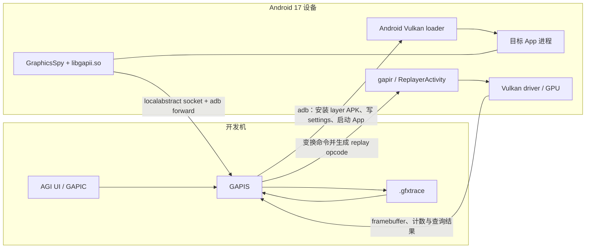

# GPU 调试与 AGI 单帧分析

GPU 调试工具分为 API 调用捕获、单帧重放、计数器分析和系统时间线。AGI Frame Profiler 通过 gapii Spy 捕获图形调用并重建帧，适合定位资源和命令问题，但需要控制捕获开销和兼容性。

## API 捕获、计数器与系统 Trace 选型

### 分析对象是一条显示时间线

本文以 Android 17 / API 37 / `android-17.0.0_r1` 作为平台源码基线，以 `android17-6.18-2026-06_r6` 作为 Android common kernel 的源码参照。商业设备可能包含更新或厂商修改，报告仍要记录设备实际 build、kernel 和 GPU driver。GPU producer（向 Perfetto 注册数据源并写入 GPU 数据的组件）、用户态驱动和内核 GPU 驱动大多由厂商提供；两台设备即使都是 API 37，可采集的数据源、counter（硬件计数器）和驱动事件也可能不同。

一次 draw API（提交绘制命令的图形接口）返回，只说明 CPU 已执行到某个提交点。GPU 可能仍在队列中工作，承载图像内容的 buffer 也可能继续等待 SurfaceFlinger latch、HWC 合成或 display present。判断 GPU 瓶颈时，要把以下节点放进同一帧：

1. 应用何时开始逻辑与录制命令；
2. CPU 何时 submit（提交）GPU 工作；
3. GPU 工作何时开始和完成；
4. producer 何时向 BufferQueue 提交 buffer，acquire fence 何时 signal；
5. SurfaceFlinger 何时 latch，是否进入 RenderEngine client composition；
6. HWC 和显示端何时 present。

这些词对应不同时间点：BufferQueue 是图像 buffer 的生产者—消费者队列；acquire fence 是“消费者现在可以安全读取该 buffer”的异步完成信号；latch 是 SurfaceFlinger 选中本帧 buffer；HWC（Hardware Composer）是显示硬件合成层；present 是把合成结果交给显示端。RenderEngine client composition 则表示 SurfaceFlinger 使用 GPU 完成合成。

显示路径需要按这些节点分层观察。标准 HWUI（Android UI 硬件加速渲染库）窗口通常从主线程和 `RenderThread` 开始；SurfaceView、游戏、Camera、视频和自有 Vulkan render loop（持续录制并提交帧的渲染循环）应先找实际承载画面的 Surface 与 producer 线程。只看宿主 Activity 的 FrameTimeline，可能漏掉独立 Surface 的画面。

### 工具按证据深度分层

| 层级 | 适合回答的问题 | 工具 | 主要限制 |
|---|---|---|---|
| 系统时间线 | 哪一帧晚，CPU、GPU、SurfaceFlinger、HWC 谁先偏离预算 | Perfetto、Android Performance Analyzer（APA） | 设备未暴露 GPU producer 时，GPU 轨道可能为空 |
| 系统级 GPU | GPU 频率、render stage、计数器与 CPU 调度如何关联 | APA、AGI System Profiler、厂商 system profiler | counter 名称与语义依赖 GPU 和驱动 |
| 单帧捕获 | 哪个 render pass、draw、pipeline、shader 或资源有问题 | AGI Frame Profiler、RenderDoc、Arm Frame Advisor | 捕获与回放会改变时序，不能拿来测正常帧率 |
| 多帧捕获 | 间歇性 pipeline/state 变化、连续帧资源与 shader 差异 | Sokatoa | 面向 Vulkan，要求 Android 13+，注入 layer 需要 debuggable APK 或 root |
| 微架构分析 | ALU、纹理、tile、cache、带宽、occupancy 受限在哪里 | Arm Streamline、Snapdragon Profiler、厂商工具 | 结论只能绑定对应 GPU 架构与 counter 文档 |

表中的 render stage 是 GPU 工作的一个执行阶段；render pass 定义一组 attachment（渲染输入/输出图像）及其处理过程；pipeline 是着色器与固定功能状态的组合；shader 是运行在 GPU 上的程序。ALU 是算术逻辑单元，tile 是分块渲染中的小块区域，cache 是片上缓存，occupancy 表示执行资源被并行工作占用的程度，具体计算方式仍由厂商定义。

可以先用系统 Trace 找到异常时间窗，再通过单变量实验缩小资源类型，最后用帧捕获或厂商 counter 解释原因。跳过系统时间线直接抓一帧，既可能抓到正常帧，也可能把 SurfaceFlinger 或 BufferQueue 的等待误判为应用 shader 开销。

### Perfetto：Android 17 的 GPU 数据源

Perfetto 的 GPU 能力由多个数据源组成，每个数据源回答不同问题。`linux.ftrace` 是 Linux 内核事件追踪数据源；其余 GPU 数据源通常由系统或厂商 producer 提供。

| 数据源 | Android 17 中的用途 | 不能直接推出的结论 |
|---|---|---|
| `linux.ftrace` 的 `power/gpu_frequency` | GPU 频率变化 | GPU 利用率、shader 耗时 |
| `linux.ftrace` 的 `gpu_mem/gpu_mem_total` | GPU 内存总量事件 | 带宽、完整对象归属或泄漏 |
| `gpu.counters` | 周期采样设备 producer 暴露的硬件计数器 | 跨厂商统一阈值 |
| `gpu.renderstages` | graphics/compute submission 的 GPU 活动时间线 | 每个 draw 的完整 pipeline state |
| `vulkan.memory_tracker` | Vulkan 内存分配（allocation）与绑定（bind）事件 | GLES 和驱动私有内存的完整视图 |
| `gpu.log` | GPU producer 提供的调试消息 | 所有厂商的卡死（hang）、访问或执行故障（fault）与 GPU 重置（reset） |

下面的 TraceConfig（Perfetto 录制配置）展示 Android 17 tag 中 GPU frequency、GPU memory 和 render stages 的请求方式。设备也可能只注册带厂商后缀的名字，例如 `gpu.renderstages.mali`；录制前应查询 data-source descriptor，也就是 producer 上报的数据源能力说明。

```textproto
buffers {
  size_kb: 32768
  fill_policy: RING_BUFFER
}

data_sources {
  config {
    name: "linux.ftrace"
    ftrace_config {
      ftrace_events: "power/gpu_frequency"
      ftrace_events: "gpu_mem/gpu_mem_total"
    }
  }
}

data_sources {
  config {
    name: "gpu.renderstages"
    gpu_renderstages_config {
      low_overhead: true
    }
  }
}
```

这段配置只说明要请求哪些数据，不能保证每台设备都会返回结果。内核 tracepoint（内核事件记录点）、GPU producer、数据源名称、应用 Graphics API、权限或驱动支持不满足时，都可能产生空轨道。`low_overhead` 会把 render stages 合并为一个 workload stage，以更少细节换取更低 GPU 扰动；只有短窗口确实需要分开观察 load/store stage 时才关闭它。

#### `gpu.counters` 的正确配置

Android 17 的 `GpuCounterConfig` 包含 `counter_period_ns`、`counter_ids`、`instrumented_sampling` 和 `fix_gpu_clock`。常规周期采样只需要前两个字段。`counter_ids` 是 repeated（可重复）字段，在 TextProto（Protocol Buffers 的文本格式）中要逐项重复书写。`instrumented_sampling` 会在 GPU command buffer 中插入采样，`fix_gpu_clock` 会请求固定 GPU 频率；两者都会改变采集方式或运行条件，不应默认用于正常基线。

下面的 counter ID 只用于展示配置结构，必须替换为目标设备 descriptor 中公布的 ID。

```textproto
data_sources {
  config {
    name: "gpu.counters"
    gpu_counter_config {
      counter_period_ns: 1000000
      counter_ids: 1
      counter_ids: 3
    }
  }
}
```

`android-17.0.0_r1` 的 `GpuCounterEvent` 支持两类 descriptor。Android OEM producer 按 CDD/CTS（Android 兼容性定义与兼容性测试套件）要求，使用全局 counter ID 的 `GpuCounterDescriptor`；sequence-scoped（只在一条可信数据序列内有效）的 `InternedGpuCounterDescriptor` 面向多 producer、多 GPU 等复杂用途。两种模式处理的是 descriptor 传输和 ID 作用范围，并未统一各家 counter 的名称、单位或计算方法。

#### 频率、利用率和带宽怎么读

GPU frequency 反映 DVFS（Dynamic Voltage and Frequency Scaling，动态电压频率调节）的当前频点。高频可能来自持续负载、响应性策略或固定性能模式；低频可能来自轻载、温控、功耗限制或 governor（频率调节策略）选择。单看频率无法判断 GPU 是否占满。

“GPU utilization”“shader core active”“ALU busy”“external memory read”这类 counter 的分母、采样窗口和包含的等待状态由厂商定义。分析时应：

1. 找到目标帧对应的 GPU stage；
2. 读取同一时间窗内的 counter；
3. 以同一设备、同一画质和相近热状态的基线比较；
4. 每轮只改变分辨率、pass、shader、纹理或 draw 组织中的一个变量；
5. 用该 GPU 的 counter 文档解释变化。

没有通用的“ALU 超过 80%”或“单帧超过多少 draw”阈值。draw 数量增加可能拖慢 CPU 侧的驱动提交，也可能让 GPU 工作量上升；要结合调用栈、GPU stage 和硬件 counter 区分这两种情况。

### 从 Trace 判断瓶颈方向

下表中的 deadline 是一帧必须完成的时间点；backpressure（背压）表示下游队列已满，反过来阻塞上游；frame pacing 是安排帧生成与提交节奏；completion fence 在 GPU 工作完成后发出信号；release fence 通知 producer 何时可以重新使用 buffer；present fence 则标记一帧完成显示的时间。

| 观察到的证据 | 候选方向 | 下一步 |
|---|---|---|
| CPU 录制或 submit 已晚，GPU stage 随后正常完成 | CPU、锁、调度、资源加载、driver CPU 开销 | 看 CPU 调度事件（sched）、调用栈、锁、Binder IPC 与命令录制 |
| CPU submit 按时，应用 GPU completion fence 越过 deadline | 应用提交的 GPU 工作量 | 降分辨率或关闭一个 pass，再进入帧 profiler |
| producer 长时间卡在 acquire、dequeue 或 swap，GPU stage 不长 | BufferQueue backpressure、release fence、frame pacing | 看队列深度、release fence、present 间隔 |
| 应用 buffer 按时，SurfaceFlinger 的 client composition 或 present 晚 | RenderEngine、HWC、显示端 | 看合成类型（composition type）、RenderEngine、HWC 与 present fence |
| GPU track 空白 | 数据源或设备支持缺失，也可能没有覆盖该 API | 查 descriptor、trace config、驱动与权限 |
| GPU frequency 高，frame 正常 | 当前 DVFS 状态 | 不单独作为性能缺陷 |

FrameTimeline 的 `GPU Composition` 只说明 SurfaceFlinger 是否使用 GPU/client composition，不说明应用内容是否由 GPU 生成。游戏 Surface 可以由应用 GPU 渲染，随后由 HWC 直接扫描输出；此时应用仍可能 GPU bound（GPU 工作决定帧耗时），而 DisplayFrame（SurfaceFlinger 把多个 layer 合成后的屏幕帧）没有 client composition 标记。

Perfetto 官方文档仍说明 SurfaceView 不受标准 FrameTimeline 支持。遇到游戏、Camera、视频或独立 native Surface，应结合 layer name（SurfaceFlinger 图层名）、buffer frame number、`android.surfaceflinger.frame`、acquire/release fence、HWC 和 display present 还原显示路径。

### Android Performance Analyzer（APA）

截至 2026 年 8 月 13 日，APA 下载页已不再标注 Beta。APA 以 Perfetto 为系统追踪基础，覆盖 CPU、GPU、内存和功耗，并支持自定义 TraceConfig。官方说明 Android 12+ 设备能提供较好的 system-wide（应用与系统进程同一时间线）性能分析、GPU counter 和 render stage 体验。

APA 与 Perfetto 的区别主要在入口和分析体验：

- APA 提供独立桌面应用、项目管理、截图、轨道整理、标注和 GPU counter 浏览；当前首页还展示了 Vulkan render pass debug marker 和多 trace A/B 对比；
- Perfetto CLI 与 Trace Processor 适合固定配置、批量采集、SQL 回归和自动化；
- 两者都受目标设备 GPU producer 与驱动数据限制。

AGI quickstart 当前仍把 APA 列为 system profiling 的推荐工具。AGI System Profiler 仍可使用，尤其是团队已有 AGI 设备验证和 counter 流程时。2026 年 5 月的 APA 公告把逐帧 capture/replay（捕获与回放）列为后续能力；2026 年 8 月的 APA 首页虽然新增 Vulkan debug marker 展示，却仍没有发布逐 draw 的 Frame Profiler 文档。因此不能把 trace 中的 render pass 名称，当成 AGI Frame Profiler 那类单帧命令与资源捕获。

### Android GPU Inspector（AGI）

AGI 运行在 Android 11+ 的受支持真机上，并在首次连接以及 Android 或 GPU driver 变化后执行兼容性验证。官方列出的 System Profiler GPU 包括 Qualcomm Adreno、Arm Mali 和 Imagination PowerVR。设备验证失败或 counter 缺失，只能说明当前设备、系统与驱动组合没有通过 AGI 要求。

AGI 有两种主要模式：

| 模式 | 数据 | 使用位置 |
|---|---|---|
| System Profiler | CPU/GPU/内存/电池、GPU counter、系统时间线 | 找到长时间运行中的异常窗口 |
| Frame Profiler | Vulkan API call、framebuffer、mesh draw、内存、pipeline、state、shader、texture | 检查单帧命令与资源 |

AGI quickstart 要求目标应用设置 `android:debuggable="true"`。原生 Vulkan 应用还要启用 validation layer（检查 Vulkan API 使用是否合法的验证层），先修复已有 validation error，再采集 profile。AGI 会管理自身的捕获流程；手工配置全局 Vulkan layer 时，应严格使用当前 AGI 文档给出的包名、ABI（Application Binary Interface，应用二进制接口）和清理命令，避免把验证层与捕获层写进同一项配置。

#### OpenGL ES on ANGLE

AGI Frame Profiler 的类型选择是 `Vulkan` 或 `OpenGL on ANGLE`。ANGLE 会把 OpenGL ES（GLES）命令翻译为 Vulkan。GLES 应用经这条路径捕获后，看到的是翻译生成的 Vulkan command、pipeline 和 shader；backend 指实际执行图形命令的后端实现。若问题只在设备原生 GLES driver 出现，这份 capture 已改变 backend，必须同时保留原生路径的 Perfetto、日志和厂商数据。

Android 15+ 提供按包测试 ANGLE 的入口。Android 17 又允许 game 在 manifest 中表达“优先使用 ANGLE”的请求：

```xml
<application android:appCategory="game">
    <meta-data
        android:name="com.android.graphics.driver.prefer_angle"
        android:value="true" />
</application>
```

这项 metadata 是请求信号，不保证系统选择 ANGLE。设备配置、graphics driver 包、应用兼容性和厂商策略仍会参与选择。即使系统是 Android 17，也不能据此认定所有 GLES 应用默认运行在 ANGLE 上。

对照 native GLES 与 ANGLE 时，可用官方测试命令设置 `angle_gl_driver_selection_pkgs` 和 `angle_gl_driver_selection_values=angle`，重启目标进程后再检查 EGL vendor/renderer、进程加载的 library、Graphics Driver 日志和 `gpu.angle` trace event。这两个 global setting 在重启后仍会保留，测试结束必须删除，避免影响后续基线。

### RenderDoc：图形状态与资源调试

RenderDoc 可以检查帧内 API event、pipeline state、texture、buffer、framebuffer 和 shader，适合定位渲染错误、资源绑定错误与状态配置问题。framebuffer 是一帧渲染使用的颜色、深度等图像集合，pipeline state 是该 draw 生效的管线配置。通用 RenderDoc capture 不一定包含目标移动 GPU 的全部微架构 counter，API replay 的耗时也不能直接视为正常运行时帧耗时。

Android 捕获通常要求 debuggable 应用、ADB 连接和受支持的 Vulkan driver。具体 API 与 extension（图形 API 扩展）能力要以所用 RenderDoc 版本为准。Arm Performance Studio 提供 RenderDoc for Arm GPUs，补充部分 Arm/Android 特性、设备兼容处理、Vulkan ray tracing 与 ray query 调试；这些能力不代表 upstream RenderDoc（主项目版本）的每个发行版都具备相同支持。

如果要判断性能开销来自哪里，可先用 AGI 或厂商 profiler 找到慢 render pass，再用 RenderDoc 检查该 pass 的 attachment、pipeline、descriptor（资源绑定描述）、texture 和 shader。若要调查画面错误，可以从错误帧逐个 event 检查 framebuffer 变化。

### Sokatoa：Vulkan 多帧视角

Sokatoa 由 Samsung Austin Research Center 发起，并与 Google、LunarG 协作。项目面向 Android Vulkan 应用，提供 system 与 frame 两种视角的多帧捕获、Vulkan API/pipeline/shader 分析和设备端 replay（在设备上重放已捕获工作）。

项目当前文档给出的边界是：

- Android 13 或更高；
- 注入 GFXR（GFXReconstruct 捕获与回放层）和 Sokatoa Vulkan layer 时，需要 debuggable APK 或 rooted device（已取得 root 超级用户权限的设备）；
- performance view 支持 Xclipse、Mali、Adreno 和 PowerVR；
- 当前可免费下载，README 表示计划在 2026 年底开放源码。

多帧捕获适合调查间歇性 pipeline 创建、状态变化、资源生命周期和异常帧前后的差异。capture replay 仍受 API feature、extension、格式、driver 和 GPU 能力约束；记录了 Vulkan API，并不代表捕获结果能在任意 GPU 上等价回放。

### 厂商工具的边界

| GPU | 工具 | 适合的数据 | 使用时的限制 |
|---|---|---|---|
| Arm Mali / Immortalis | Arm Performance Studio：Streamline、Frame Advisor、Mali Offline Compiler、RenderDoc for Arm GPUs | CPU/GPU 联合 timeline、Mali counter、单帧几何与 API、shader 静态分析 | 支持范围按 GPU 世代、driver 和工具版本确认 |
| Qualcomm Adreno | Snapdragon Profiler，配合 APA/AGI | Adreno counter、GPU driver instrumentation（驱动插桩数据）、系统资源、frame snapshot（单帧快照） | 设备与功能覆盖按 Qualcomm 文档确认 |
| Samsung Xclipse | Sokatoa，配合 APA/Perfetto 与 Samsung 扩展 | 多帧 Vulkan、Xclipse performance view、系统时间线 | 扩展与设备支持仍在演进，报告要记录版本 |
| Imagination PowerVR | AGI、Sokatoa 与 Imagination 工具 | PowerVR counter、系统与帧分析 | counter 名称和可用性依设备 producer |

Arm Streamline 能在未 root 的受支持 Android 设备上采集 CPU、GPU、内存、调度和硬件 counter。Frame Advisor 面向问题帧的 API 与几何分析；RenderDoc for Arm GPUs 偏重图形调试；Mali Offline Compiler 不运行 App，而是估算 shader 在不同 Arm GPU 上的指令、寄存器和周期成本。三者用途不同，报告不能只写“Arm profiler”后混用结论。

厂商 counter 应保留原名称、单位、采样方式、GPU 型号、driver 和文档版本。把 Adreno 的 busy、Mali 的 shader core active 与 Xclipse 的相似名称放进一张跨机型排行榜，数值很容易失去可比性。

### `profileable`、`debuggable` 与 root

`<profileable>` 从 API 29 引入，是 `<application>` 的子元素；`android:enabled` 属性在 API 30 加入。设置 `android:shell="true"` 后，本地 shell profiling 工具可以分析 release 构建，同时只能访问平台允许的有限数据。与 debuggable 构建相比，这种方式对运行时序的扰动通常更小。debuggable 允许调试器和图形 layer 注入；root 则表示设备取得系统超级用户权限，三者不是同一种授权。

它不保证 `gpu.counters`、`gpu.renderstages` 或厂商内核事件出现。GPU 数据源由系统 producer、驱动、设备配置和调用权限决定。一个 profileable 包得到空 GPU 轨道时，排查方向应包含 data-source descriptor 与厂商支持。

帧捕获通常需要把 Vulkan layer 加载进目标进程，或替换 graphics backend：

- AGI quickstart 要求 debuggable 应用；
- RenderDoc Android capture 通常要求 debuggable 应用；
- Sokatoa 要求 debuggable APK 或 rooted device；
- 厂商工具各有设备、包类型和权限条件。

debuggable 会改变运行时优化与安全检查，捕获 layer 还会记录命令、资源和内存。应使用 profileable/release 包采集低扰动基线，再用 debuggable 包做短窗口详细诊断；两类结果不能直接比较绝对帧时间。

### 不设固定阈值，改做对照实验

#### 怀疑 fragment、overdraw 或带宽

fragment 是光栅化后进入片元着色阶段的候选像素；overdraw 指同一屏幕位置被重复绘制。在同一设备上降低渲染分辨率或停用一个全屏 pass，如果 GPU stage 与外部内存相关 counter 同步下降，再检查 overdraw、blend（颜色混合）、render-target format（渲染目标格式）、attachment load/store、texture sampling（纹理采样）和 SurfaceFlinger client composition。

Android View 的开发者选项 overdraw overlay 适合查找 UI 重复覆盖，游戏和 native renderer 则应使用帧 capture 与厂商 counter。Tile-based GPU 会把画面分块，并在片上 tile memory 中处理部分中间结果；因此“画了 N 次”不能直接换算成 N 倍外部内存带宽。

#### 怀疑 shader ALU 或纹理

固定画面、分辨率与 pipeline state，只替换一个 shader 变体或关闭一个纹理采样分支。结合 shader duration、instruction、occupancy、texture/cache 与 external memory counter 判断变化。某个 counter 很高只能描述该架构上的活动状态，仍需通过 A/B 对照实验，也就是每次只改变一个变量，确认改动与结果之间的关系。

#### 怀疑 draw call 或 driver CPU 开销

检查 render/RHI 线程调用栈、`vkQueueSubmit()` 前的命令录制、pipeline/descriptor churn 和 driver ioctl。RHI（Render Hardware Interface）是引擎对图形 API 的抽象层；churn 指 pipeline 或 descriptor 被频繁创建、切换；ioctl 是用户态通过系统调用向内核驱动发送控制请求。合批后若 CPU submit 提前而 GPU stage 基本不变，收益来自 CPU 或驱动开销下降；若 GPU stage 也缩短，才能说明 GPU 工作组织同时改善。

#### 怀疑 queue-stuffing

持续尽快 present 可能塞满 BufferQueue，这就是 queue stuffing。随后 render thread 会在 acquire、dequeue、swap 或 present 路径等待。此时 CPU 与 GPU 时间线都可能出现空白，但输入仍排在较早的 in-flight frame（已提交、尚未显示的帧）中。应检查队列深度、release fence、present 间隔、输入采样点和 frame pacing，不能把等待函数本身解释为 shader 变慢。

#### 怀疑热限制

把 thermal status（温控状态）、thermal headroom（距离进一步触发温控限制的余量）、CPU/GPU frequency、帧时间、画质和持续运行时间放进同一份记录。固定性能模式适合隔离 DVFS 变量，却不能代表用户环境。优化验证应从相近初始温度开始重复多轮，并比较温度和频率趋于稳定后的阶段。

### 捕获扰动与报告要求

system trace、counter sampling、frame capture 和 replay 都会扰动被测程序，程度取决于采样频率、数据量、driver 与工具。报告里至少记录：

- 工具与版本、TraceConfig、设备 build、GPU 和 driver；
- 应用包类型、Graphics API、ANGLE/native driver 选择；
- 分辨率、刷新率、目标帧率、画质与场景；
- 温度、供电、持续运行时间和固定性能模式；
- 捕获是否注入 layer、替换 backend 或启用 validation；
- 原始 Trace/capture，以及每次 A/B 对照只改变的变量。

帧 capture 用来检查命令、状态与资源，不应作为产品帧率基准。性能数字应来自未注入 capture layer 的低扰动运行，再用帧 capture 解释慢帧结构。

### 执行清单

1. 记录设备、GPU/driver、build、分辨率、刷新率、画质、温度与包类型。
2. 确认主体 Surface 和 producer 线程，不把宿主窗口当作独立 Surface 的主体。
3. 用 APA/Perfetto 找到目标帧和 CPU submit、GPU completion、queue、latch、composition、present。
4. 查询设备 data-source descriptor，确认 GPU producer 名字、counter ID 和单位。
5. 用分辨率、pass、shader、HWC/client composition 或 frame pacing 做单变量实验。
6. 依据问题选择 AGI、RenderDoc、Sokatoa 或厂商 profiler。
7. 分开保存低扰动性能基线与注入 layer 后的调试 capture。
8. 优化后在相近热状态重复多轮，保留原始数据和工具版本。
9. 报告按“证据、推断、对照结果”书写，设备特有结论不要写成 Android 通用规则。

### 相关章节

- [2.7 GPU 渲染与图形 API 选型](../../part1-fundamentals/ch02-rendering/07-gpu-rendering-graphics-api.md)：GPU pipeline、tile、带宽与 shader
- [2.7 GPU 渲染与图形 API 选型](../../part1-fundamentals/ch02-rendering/07-gpu-rendering-graphics-api.md)：GLES、Vulkan 与 ANGLE 的版本边界
- [13.2 Perfetto UI、状态轨道与版本边界](../ch13-perfetto/02-perfetto-ui-state-tracks.md)：Trace UI 与时间线操作
- [14.1 Android Studio Profiler](01-as-profiler.md)：profileable/debuggable 与低扰动 profiling
- [18.1 Android View 渲染管线与分析方法](../../part2-performance/ch18-rendering-pipelines/01-android-view-pipeline-analysis.md)：Surface、BufferQueue、SurfaceFlinger、HWC 与 display present
- [18.4 OpenGL ES、EGL 与 ANGLE](../../part2-performance/ch18-rendering-pipelines/04-opengl-egl-angle.md)：EGL/GLES 提交与 native/ANGLE backend
- [18.5 Vulkan 原生管线与 HWUI 多队列](../../part2-performance/ch18-rendering-pipelines/05-vulkan-hwui-multi-queue.md)：swapchain、submit、present 与 frame pacing


## AGI 捕获、重放与单帧分析

工具类型确定后，AGI 的捕获链要继续检查注入、调用序列、资源快照和重放设备。捕获成功不保证性能时间完全无扰动。

### 版本边界：分别确定 Android 平台与 AGI 工具版本

Android GPU Inspector（AGI）不是 `android-17.0.0_r1` 平台源码中的系统组件。该 `tag`（固定版本标签）的 AOSP `manifest`（源码项目清单）中，没有 `external/android-gui`、`gapii` 或 `gapis` 这些 `project`（仓库项目）条目。AGI 在独立的 [`google/agi`](https://github.com/google/agi) 仓库和发布渠道中维护。因此，“Android 17 上使用 AGI”包含两条要分别核验的版本基线：

- 设备侧 Vulkan layer 发现、加载和安全条件，以 AOSP `android-17.0.0_r1` 为准；
- gapii、gapis、gapir、gapidapk 与 `.gfxtrace` 的工具实现，以明确的 AGI release（发布版本）或 commit（提交快照）为准。

截至 2026 年 8 月 13 日，GitHub Releases 仍将 AGI `v3.3.3` 标为 Latest。该 release tag 指向 commit `5f97b4fd99a9459320b782203ce2de5351a1e661`，发布资产的日期为 2025 年 1 月 20 日。工具内部实现以这个固定提交为准，当前支持流程以更新至 2026 年 5 月 19 日的 Android Developers 文档为准。AGI 安装包版本和 Android OS 版本互相独立，复现实验时应同时记录二者。

当前官方 quickstart 要求受支持设备运行 Android 11 或更高版本，配套的 supported devices 页面明确排除 Android Emulator。历史 AGI release 对 Android 10 的兼容记录不能代替当前工具验证；Android 17 设备也要通过 AGI 的 device validation（设备兼容性校验），支持状态由 OS、GPU 和 driver（GPU 驱动）共同决定。

### System Profile 与 Frame Profile 解决不同问题

AGI 提供 System Profile 与 Frame Profile，两者的数据来源和分析尺度不同。

| 模式 | 设备侧主要机制 | 输出关注点 | 适合回答的问题 |
| --- | --- | --- | --- |
| System Profile | Perfetto，以及系统和厂商 producer（向 trace 写入事件的数据源） | CPU 调度、GPU queue（命令队列）、频率、counter（硬件计数器）、内存和功耗等时间线 | 某段卡顿期间 CPU、GPU 与系统服务怎样互相影响 |
| Frame Profile | GraphicsSpy Vulkan layer、gapii、gapis、gapir | 一帧附近的 API 调用、资源、pipeline state（渲染管线状态）、framebuffer（帧缓冲）与 render pass（渲染通道）性能 | 某个 draw、shader、纹理或 render pass 为什么昂贵或结果异常 |

gapii 属于 Frame Profile 的 API 拦截链路，不是低开销的持续系统监控器。它要进入目标进程、记录 API 参数和 memory observation（API 调用可能读写的内存快照），还可能序列化捕获开始时的完整 Vulkan 状态，开销远高于常规 Perfetto trace。长时趋势、调度关系和整机 GPU counter 应优先使用 System Profile。要检查命令级状态与资源时，再使用 Frame Profile。

Android Developers 当前还建议新的系统分析优先评估 Android Performance Analyzer（APA）。这不改变 Frame Profile 的用途，也不能把 APA 描述成只分析 Java/Kotlin 的工具。

先明确四个容易混淆的缩写：

- GAPIC：Graphics API Client，即 AGI 的图形界面；
- GAPIS：Graphics API Server，负责主机端解析与重放编排；
- GAPII：Graphics API Interceptor，源码目录和库名写作 `gapii`，负责进程内拦截；
- GAPIR：Graphics API Replayer，负责设备端重放。

下面的关系图把 Frame Profile 的主机端和设备端组件放在同一条链路中：



图中的 GraphicsSpy 与 `libgapii.so` 都加载在目标 App 进程内；GAPIC 和 GAPIS 位于开发机；GAPIR 在 Android 设备上执行重放。主机负责解析并生成 replay payload（重放指令及其资源引用），不会用开发机 GPU 代替目标设备驱动重放。

### Android 17 怎样把 GraphicsSpy 放进目标进程

#### Android 设备使用 global settings，不依赖 `VK_LAYER_PATH`

桌面 Vulkan loader（负责发现、加载并连接 layer 与驱动）常通过环境变量 `VK_LAYER_PATH` 搜索 layer，Android 的应用注入路径不同。AGI `gapii/client/adb.go` 会先安装与目标 ABI（应用二进制接口，这里对应进程的 CPU 架构）匹配的 gapid APK。随后，`core/os/android/layers.go` 写入四个 global settings（Settings Provider 保存的全局配置项）：

```shell
adb shell settings put global enable_gpu_debug_layers 1
adb shell settings put global gpu_debug_app com.example.game
adb shell settings put global gpu_debug_layer_app com.google.android.gapid.arm64v8a
adb shell settings put global gpu_debug_layers GraphicsSpy
```

这些键分别开启调试 layer（插在 Vulkan API 与驱动之间的可选拦截层）、限定目标 package（应用包名）、指定提供 layer 的 APK、选择 layer 名。AGI 会在正常清理路径删除设置；若采集进程异常退出，应手动检查并清除，避免后续启动继续加载 layer。

AOSP Android 17 的 `frameworks/native/vulkan/libvulkan/layers_extensions.cpp` 列出了可使用调试 layer 的条件：

- 目标 App 可调试；
- 或系统为可 root 的 userdebug（可调试系统构建变体）构建；
- 或 targetSdk 不低于 30 的 App 在 manifest 中声明 `com.android.graphics.injectLayers.enable=true`。

AGI 官方支持流程仍要求目标 App 设置 `android:debuggable="true"`。平台允许的其他入口不代表 AGI 对任意生产 App 提供受支持的抓帧能力。

#### GraphicsSpy 是 wrapper，拦截实现位于 libgapii

AGI 源码中的 `GraphicsSpyLayer.json` 描述 layer 名 `GraphicsSpy` 及其函数映射，供使用 JSON manifest（JSON 格式的 layer 描述文件）的 loader 环境识别。Android 的 gapid APK 同时打包 `libVkLayer_GraphicsSpy.so` 与 `libgapii.so`。AOSP loader 从 layer APK 的 native library path（原生库搜索路径）发现前者，并按 layer 名解析 `GraphicsSpyGetInstanceProcAddr` / `GraphicsSpyGetDeviceProcAddr`。这个 wrapper（薄封装层）随后以 `dlopen()` 动态加载同目录的 `libgapii.so`，把 Vulkan 函数地址查询转交给 `gapid_vkGetInstanceProcAddr` 与 `gapid_vkGetDeviceProcAddr`。

这条路径解释了两个常见现象：

- layer APK 的 ABI 必须与目标进程 ABI 匹配；
- App 能启动但没有捕获数据时，要分别检查 layer 是否被 loader 发现、`libgapii.so` 是否加载、gapii 是否建立 socket。

#### `debug.agi.procname` 只选择进程名

layer 设置以 package 为单位。某些游戏会在包内启动独立的渲染进程，AGI 用私有系统属性 `debug.agi.procname` 指定要捕获的进程名。`Spy::Spy()` 会读取当前进程名并与该属性比较；属性为空时接受任意进程，名称不匹配时创建 `NullWriter`（丢弃输出的空 writer），不会与主机建立抓帧连接。

它不是同时接受 PID、package 和进程名的通用平台接口。package 由 `gpu_debug_app` 选择，进程由 `debug.agi.procname` 进一步过滤，PID（进程 ID）只用于 AGI 在启动后确认进程已经出现。

### gapidapk 不是持续采集 GPU 数据的 AIDL 服务

AGI 为不同 ABI 准备独立 package，例如：

- `com.google.android.gapid.arm64v8a`
- `com.google.android.gapid.armeabiv7a`

公开源码中的 gapid APK 包含以下角色：

| 组件 | 职责 |
| --- | --- |
| `libVkLayer_GraphicsSpy.so` / `libgapii.so` | 作为 Vulkan layer 注入目标 App 并捕获调用 |
| `ReplayerActivity` + `libgapir.so` | 在设备上承载 GPU replay |
| `DeviceInfoService` | 通过 local abstract socket（Linux 抽象命名空间中的本地 socket，不对应磁盘文件）向主机返回设备信息 |
| `PackageInfoService` | 枚举可捕获 package、activity、ABI 等信息 |
| `VkSampleActivity` | AGI 自带的 Vulkan 验证样例 |

`DeviceInfoService` 与 `PackageInfoService` 是前台 `IntentService`（启动时显示通知、按 Intent 处理任务的服务），用于设备探测和 package 枚举。抓帧数据不经过一个名为 `com.google.android.gapid` 的 AIDL（Android Interface Definition Language，Android 跨进程接口定义）capture service。gapii 在目标进程内监听 local abstract socket，开发机通过 adb forward（把主机端口转发到设备 socket）连接。

源码也没有支持“AI 压缩算法、GPU 数据加密存储、动态采样率或 GPU 访问审计日志”这些描述。安全边界应回到 Android 的 debuggable 状态、Vulkan layer 注入条件、adb 授权、layer package 与目标 package 选择。

### 一帧捕获从连接到结束发生了什么

AGI 开发文档把 Vulkan Frame Profile 的主要步骤写得很具体：

1. GAPIS 安装 gapid APK、设置 Vulkan layer、配置 `debug.agi.procname`，然后启动目标 activity。
2. 目标进程加载 GraphicsSpy 与 `libgapii.so`。gapii 在 Android local abstract namespace 监听 `gapii` socket，并发送五字节握手 `"gapii"`。
3. GAPIS 经 adb forward 连接该 socket，校验五字节握手后发送 version 4 的 connection header（固定字段的连接头）。连接头中的多字节字段使用小端序，即低位字节先传；内容包括 `spy0` magic（协议标识）、观察频率、起始 frame、捕获 frame 数、API bitmask（用不同 bit 选择 API），以及延迟开始、关闭 buffering、记录时间戳等 flags（用 bit 组合的选项）。
4. 手动模式下，gapii 先保持 suspended（暂停捕获）；用户点击 Start 后，GAPIS 发出 start message。
5. gapii 等当前 frame 结束，在捕获边界序列化 Vulkan 初始状态与 GPU buffer，随后记录目标 frame 的 API 调用和相关 memory observation。
6. frame 结束时 gapii 发送 end message，GAPIS 停止写入 `.gfxtrace`。

官方 UI 还提供 Beginning、Manual、Time 与 Frame 等启动方式。它们分别从启动后的第一帧、手动点击、指定秒数后或指定帧号开始捕获，只决定何时进入捕获窗口，不会把 Frame Profile 变成常驻 GPU telemetry（持续遥测）服务。

#### buffering（内存缓冲）选项的取舍

默认 buffering 会先在目标进程内暂存数据，再批量写出。`Disable Buffering` 让数据更及时地离开目标进程，适合排查采集期间崩溃，因为崩溃前已经序列化的数据更有机会保留下来；代价是更高的运行期开销。普通抓帧保留 buffering，遇到“抓帧导致 App 崩溃且文件为空”时再用该选项缩小问题范围。

#### 多线程捕获不等于确定性的时序重放

`.gfxtrace` 可以包含多个线程的 API 调用，ProtoPack object group（带父子关系的消息组）也可能交错。捕获器会记录调用和内存快照，但无法保证未显式同步的 race（并发竞态）都能稳定复现。Vulkan 应用在抓帧前应通过 validation layer（检查 API 使用是否合法的校验层），资源生命周期、host memory（CPU 可访问内存）修改和 queue 同步要符合 API 约束。

### `.gfxtrace` 的内容与边界

正确扩展名是 `.gfxtrace`。AGI `v3.3.3` 使用自定义 ProtoPack v2 容器封装 protobuf（Protocol Buffers）message；整个文件并不是单个 protobuf message。

ProtoPack 头部 magic 为：

```text
ProtoPack\r\n2.0\n\0
```

后续是变长 chunk（记录块）。chunk 可以是类型定义，也可以是带 parent 回指关系的对象实例；类型定义会先于对应对象出现，因此读取端可以从文件内取得 protobuf 类型描述。这个结构不自动保证随机访问、差分编码、压缩块或损坏恢复；没有源码证据时不应添加这些属性。

一份 Vulkan `.gfxtrace` 通常包含：

- trace `Header` protobuf：格式版本、设备、ABI 与捕获开始时间；
- 捕获开始时的 `GlobalState`（图形 API 全局状态）和初始内存快照；
- Vulkan command 及参数、返回值；
- driver 在命令前可能读取、命令后可能写入的 memory observation；
- buffer、texture 等资源 bytes；
- 捕获期间产生的 trace message。

AGI 自带的 CLI（命令行工具）`gapit` 可以把 ProtoPack 内容展开检查。下面的命令用于判断文件是否至少能被当前版本解析：

```shell
gapit unpack -verbose capture.gfxtrace
```

输出会按 ProtoPack 对象树列出 header、global state、resource、observation 和 command group。它适合验证文件结构，不提供 GPU 时间线或 render pass 成本结论。

#### 捕获文件不具备跨设备可移植性承诺

Android Developers 的 Vulkan 工具页确实写有“trace 不可跨设备移植”的警告，但该警告位于 GFXReconstruct 小节，不能直接当成 AGI `.gfxtrace` 的产品说明。

AGI `v3.3.3` 的开发文档给出了与本节直接相关的边界：主机可以演算 API state，draw 对 render target（渲染目标图像）的真实像素影响仍要在设备上重放，结果取决于重放设备及其 driver。因此，对 `.gfxtrace` 应采用“不要假设能跨 OS、芯片组或驱动版本稳定重放”的保守结论。分享问题时应同时保存：

- AGI 版本与 `.gfxtrace`；
- Android build fingerprint（标识一次系统构建的字符串）、API level；
- GPU 型号与 driver 版本；
- 目标 App 版本、ABI、所用 Vulkan extension；
- 捕获时是否经 ANGLE、是否启用 validation layer。

### GAPIS 与 GAPIR 各自负责什么

#### GAPIS：解析、状态演算与 replay 生成

GAPIS 运行在开发机。它把 `.gfxtrace` 解析为 `GraphicsCapture`，其中包含 header、initial state、command 列表和 memory observation。GAPIS 可用生成的 `mutate`（按命令更新 API 状态）逻辑在 CPU 上演算某条命令后的 Vulkan API state；查看“此时绑定了哪个 pipeline、有哪些 image”不一定要启动 GPU replay。

draw call 对 framebuffer 的像素影响无法只靠状态演算得到。需要图像、指定 draw 后的 render target 或 GPU 性能数据时，GAPIS 会：

1. 选取并变换要执行的命令，例如只保留目标 draw 之前所需的命令；
2. 为重建初始状态生成必要命令；
3. 把命令转为 GAPIR 虚拟机 opcode（操作码）；
4. 把 payload（待执行的操作码序列）和资源引用交给设备侧 GAPIR。

#### GAPIR：在目标设备 driver 上执行

GAPIR 是面向图形 replay 的栈式虚拟机，操作数主要从栈中取得。Android 上的 `ReplayerActivity` 加载 `libgapir.so`，GAPIR 按 opcode 调用 Vulkan driver，并把 framebuffer、查询或 profiling 结果返回 GAPIS。

资源不会全部预先塞进 replay payload。GAPIR 按需向 GAPIS 请求 resource，并在设备端维护 cache（资源缓存）；这会减少重复 replay 时经 adb 传输同一纹理和 buffer 的次数，也避免一次占满设备内存。

#### `replay2` 与 GFXReconstruct 不属于已验证主链路

AGI `v3.3.3` 的 `replay2/` 目录包含 handle remapper（句柄映射器）、memory remapper（内存地址映射器）、replay context（重放上下文）等基础模块，公开源码没有把它描述为 Frame Profiler 的完整执行引擎。AGI 的 `DEVDOC.md` 仍把生产链路写成 GAPIS 生成 opcode、GAPIR 执行。

GFXReconstruct 是另一个开源 capture/replay 项目。AGI 当前公开文档和上述源码没有把它列为 `.gfxtrace` 的采集器，也没有“GFXReconstruct 生成命令流、replay2 在主机端执行”的链路证据。排查代码时不要把三个项目的名词混在一起。

### OpenGL ES 通过 ANGLE 进入 Frame Profile

AGI 官方 Frame Profile 入口区分：

- Vulkan：直接捕获应用的 Vulkan 调用；
- OpenGL on ANGLE：使用 AGI 提供的 custom ANGLE（把 OpenGL ES 调用翻译到另一图形后端的兼容层），先把调用转换成 Vulkan，再捕获转换后的 Vulkan 命令。

所以，OpenGL on ANGLE 的 trace 描述的是 ANGLE 生成的 Vulkan workload（实际提交的图形工作序列）。它适合观察转换后的 render pass、pipeline、resource 与 GPU 成本，但不能当作原始 GLES driver 调用序列。ANGLE 自身的 API 转换、shader translation（着色器转译）和状态管理开销也进入被测路径。

当前 AGI 源码文档写明工具主线只支持 Vulkan；这与官方 UI 的 OpenGL on ANGLE 说明一致。没有证据支持“gapii 直接替换全部 GLES 2.0/3.x 函数”或“ANGLE D3D11 on Vulkan”这类 Android 描述。Android 上的 ANGLE 后端是 Vulkan 方向，D3D11 属于其他平台语境。

### Frame Profiler 能展示什么，不能由什么推导

官方 Frame Profiler UI 提供 Commands、Framebuffer、Geometry、Memory、Performance、Pipeline、Shader、State、Textures 与 Report 等视图。这些视图来自 capture state、resource 和必要的设备 replay。Commands 显示 API 调用树；Framebuffer 与 Geometry 检查像素和网格；Pipeline、Shader、State 与 Textures 检查绑定状态和资源；Performance 显示 replay 得到的 GPU 数据；Report 汇总捕获或 replay 错误。

分析时可按以下顺序缩小范围：

1. 在 Commands 与 frame timeline（帧内命令时间线）找到耗时 render pass 或 draw。
2. 检查 render target 尺寸和 attachment（render pass 绑定的颜色或深度图像）数量，再看 load/store/resolve 如何处理 attachment 的进入、保留与多重采样解析。
3. 查看 pipeline（各渲染阶段的配置）、blend（颜色混合）、depth/stencil（深度与模板测试）、vertex input（顶点数据布局）与 descriptor（shader 资源绑定表）。
4. 核对 shader、纹理尺寸、采样方式和资源生命周期。
5. 结合目标 GPU 的 counter 判断瓶颈更接近算术、纹理、带宽或几何阶段。
6. 回到 System Profile 验证该帧是否同时受到 CPU 提交、调度、频率或其他进程干扰。

#### Frame Profile 的终点早于 display present

Frame Profile 可以记录应用的 `vkQueuePresentKHR()`，但这条 API 调用仍位于 Producer 侧，也就是向 BufferQueue 提交 buffer 的应用一侧。调用返回以后，GPU 工作可能尚未完成。后续显示路径是：

`producer completion fence`（GPU 完成该 buffer 的同步信号）→ `BufferQueue`（向消费者传递 buffer）→ `SurfaceFlinger latch`（本轮合成选中该 buffer）→ `HWC / RenderEngine composition`（硬件合成或 GPU 图层合成）→ `display present`

其中，HWC 是 Hardware Composer（硬件合成器），RenderEngine 是 SurfaceFlinger 的 GPU 合成引擎。`.gfxtrace` 的命令和资源足以重放应用 GPU 工作，不包含一次真实显示周期里的全部 SurfaceFlinger layer、HWC plane（硬件显示平面）分配和 present fence（本轮 display present 完成后的同步信号）。

这几类证据在一次完整诊断中的位置如下：

| 证据 | 覆盖范围 | 不能替代的后续证据 |
| --- | --- | --- |
| AGI Commands / Pipeline / Shader / Texture | App graphics API、pipeline state、资源与 replay 结果 | GPU 完成、buffer 被系统采用、display present |
| AGI Performance | replay 设备上被分析的 render event 与 GPU 性能数据 | 原始运行时的 CPU 调度、其它进程和整屏 HWC 条件 |
| Producer completion fence、`queueBuffer` | App buffer 何时可供 Consumer 读取及何时进入队列 | SurfaceFlinger 是否在目标周期选择该 buffer |
| layer trace、FrameTimeline、composition type | buffer/layer 选择、App/SF 时序，以及 DEVICE（HWC 合成）/CLIENT（RenderEngine 合成）决策 | draw 内部的 shader、pipeline 和资源原因 |
| present fence | Android 显示栈的一次 present 边界 | panel 光学响应和用户视觉感知 |

显示路径还有两个使用限制：

- 游戏可能已有多帧处于 in-flight（已提交但尚未完成显示）状态。抓到的 API frame 很重，不能据此断言它就是用户看到的那一帧；需要用 frame id、present id、buffer、latch 与 present 建立关系。
- SurfaceFlinger 把目标 layer 改为 CLIENT composition 时，RenderEngine 会在应用 GPU 工作之外增加 client target 工作；client target 是 RenderEngine 把多个 layer 合成后交给 HWC 的中间 buffer。单看应用 `.gfxtrace` 会漏掉这段系统 GPU 成本。

更稳妥的工作流是先用 System Profile、Perfetto 或 APA 锁定异常 display frame 和目标应用 Surface。确认瓶颈落在应用 GPU 区间后，再抓取相同场景的 Frame Profile。修改 shader、render pass 或资源后，回到系统时间线验证 producer fence、latch 与 present 是否一起改善。OpenGL on ANGLE 还要保留“转换后的 Vulkan workload 与原 GLES driver 路径不同”这一实验变量。

Frame Profile 能提供单帧内部证据，不会自动给出跨设备通用阈值，公开资料中也没有可核验的 Android 17“机器学习性能预测、AI 异常检测或云端趋势分析”能力；`Sokatoa` 在上述 AGI 与 AOSP 来源中也没有对应组件或扩展定义。遇到这类描述时，必须要求独立产品文档、版本和可复现实验。

### 常见失败怎样定位

#### App 启动后没有 gapii 连接

按链路逐项检查：

- 目标 App 是否 debuggable；
- `gpu_debug_app` 是否为正确 package；
- `gpu_debug_layer_app` 是否安装且 ABI 匹配；
- `gpu_debug_layers` 是否包含 `GraphicsSpy`；
- 实际绘制发生在哪个进程，`debug.agi.procname` 是否写成完整进程名；
- `adb forward` 与 local abstract `gapii` socket 是否建立；
- logcat（Android 系统日志）是否出现 Vulkan loader、`GraphicsSpy`、`libgapii.so` 的加载错误。

#### 能连接但抓帧为空

检查选择的 API 模式。原生 Vulkan 应使用 Vulkan；GLES 应使用 OpenGL on ANGLE。还要确认触发窗口内确有 present/frame boundary（一帧结束标记），目标进程没有在 Start 前退出。

#### replay 与原画面不同或崩溃

检查：

- validation layer 是否报告错误；
- trace 使用的 extension 是否受 AGI 支持；
- replay 设备、OS、GPU driver 是否与 capture 环境一致；
- App 是否依赖未记录的外部资源、竞态或未声明同步；
- ANGLE 路径是否改变了原 GLES workload。

Frame profiling overview 把该选项写作 `Include Unsupported Extensions`，troubleshooting 页面也使用过 `Include Unknown Extensions`；两者都表示允许应用继续暴露 AGI 未支持的 Vulkan extension。这个选项只会允许继续尝试，官方文档明确提示启用后 replay 仍可能出现细微错误或崩溃。

#### 清理残留设置

手工调试或 AGI 异常退出后，可清理下面这些键：

```shell
adb shell settings delete global enable_gpu_debug_layers
adb shell settings delete global gpu_debug_app
adb shell settings delete global gpu_debug_layer_app
adb shell settings delete global gpu_debug_layers
adb shell settings delete global angle_debug_package
adb shell settings delete global angle_gl_driver_selection_values
adb shell settings delete global angle_gl_driver_selection_pkgs
adb shell setprop debug.agi.procname ""
```

这三个 `angle_*` 键只与 OpenGL on ANGLE 抓帧有关；原生 Vulkan 抓帧通常不会设置它们。清理后重启目标 App，再用 `settings get global ...` 和 `getprop debug.agi.procname` 确认没有残留。global settings 会跨重启保存，遗留的 layer 或 ANGLE 配置可能继续影响同包进程。

### 源码与官方文档索引

#### Android 17 平台侧

- [AOSP `android-17.0.0_r1` manifest](https://android.googlesource.com/platform/manifest/+/android-17.0.0_r1/default.xml)
- [Vulkan layer 发现、注入条件与 global settings](https://android.googlesource.com/platform/frameworks/native/+/android-17.0.0_r1/vulkan/libvulkan/layers_extensions.cpp)

#### AGI `v3.3.3` 工具侧

- [AGI `v3.3.3` release](https://github.com/google/agi/releases/tag/v3.3.3)

仓库同时存在名为 `v3.3.3` 的 branch（可继续前进的分支指针）和 tag（发布标签），且两者当前指向不同提交。下面的源码链接固定到 release tag 对应的完整 commit，避免短引用被解析到同名 branch：

- [AGI 开发文档：Life of a gfxtrace](https://github.com/google/agi/blob/5f97b4fd99a9459320b782203ce2de5351a1e661/DEVDOC.md)
- [Android 抓帧启动与 `debug.agi.procname`](https://github.com/google/agi/blob/5f97b4fd99a9459320b782203ce2de5351a1e661/gapii/client/adb.go)
- [Android Vulkan layer settings 写入与清理](https://github.com/google/agi/blob/5f97b4fd99a9459320b782203ce2de5351a1e661/core/os/android/layers.go)
- [GraphicsSpy layer manifest](https://github.com/google/agi/blob/5f97b4fd99a9459320b782203ce2de5351a1e661/gapii/vulkan/vk_graphics_spy/cc/GraphicsSpyLayer.json)
- [GraphicsSpy wrapper 加载 `libgapii.so`](https://github.com/google/agi/blob/5f97b4fd99a9459320b782203ce2de5351a1e661/gapii/vulkan/vk_graphics_spy/cc/layer.cpp)
- [gapii 进程选择、socket 与 capture 初始化](https://github.com/google/agi/blob/5f97b4fd99a9459320b782203ce2de5351a1e661/gapii/cc/spy.cpp)
- [gapii 主机连接与 capture protocol](https://github.com/google/agi/blob/5f97b4fd99a9459320b782203ce2de5351a1e661/gapii/client/capture.go)
- [`.gfxtrace` 解析与导出](https://github.com/google/agi/blob/5f97b4fd99a9459320b782203ce2de5351a1e661/gapis/capture/graphics.go)
- [ProtoPack v2 文件格式](https://github.com/google/agi/blob/5f97b4fd99a9459320b782203ce2de5351a1e661/core/data/pack/README.md)
- [GAPIR replay VM](https://github.com/google/agi/blob/5f97b4fd99a9459320b782203ce2de5351a1e661/gapir/README.md)
- [gapid APK manifest](https://github.com/google/agi/blob/5f97b4fd99a9459320b782203ce2de5351a1e661/gapidapk/android/apk/AndroidManifest.xml.in)
- [`replay2` 公开源码目录](https://github.com/google/agi/tree/5f97b4fd99a9459320b782203ce2de5351a1e661/replay2)

#### 使用与边界

- [AGI quickstart](https://developer.android.com/agi/start)
- [AGI supported devices](https://developer.android.com/agi/supported-devices)
- [Frame profiling overview](https://developer.android.com/agi/frame-trace/frame-profiler)
- [分析高成本 render pass](https://developer.android.com/agi/frame-trace/renderpasses)
- [AGI troubleshooting](https://developer.android.com/agi/troubleshooting)
- [Android Vulkan 工具与 trace 可移植性说明](https://developer.android.com/games/develop/vulkan/tools-and-advanced-features)


## 常见误区

### RenderThread 很短，所以 GPU 很慢

RenderThread 可能只负责异步提交。只有 GPU stage、completion fence、FrameTimeline 和单变量实验共同指向 GPU，才能判断这一帧受 GPU 工作限制。

### GPU utilization 高，所以 shader 复杂

GPU busy 可能来自 fragment、纹理、带宽、compute、copy、driver queue 或 SurfaceFlinger client composition。需要结合不同 stage 和对应 counter 继续区分。

### `gpu.counters` 是 Android 17 统一指标

Android 17 统一了 Perfetto 的传输结构和 Android OEM descriptor 要求，没有统一每家 GPU 的微架构指标。

### Android 17 默认把所有 GLES 转成 ANGLE

Android 17 提供 manifest 请求信号，ANGLE 选择仍受设备与系统策略控制。AGI 的 OpenGL on ANGLE capture 只能说明本次捕获使用了 ANGLE。

### `profileable` 足以使用所有帧工具

AGI、RenderDoc、Sokatoa 等帧捕获会注入 graphics layer，通常要求 debuggable 或 root。`profileable` 主要服务低扰动 profiling。

### GPU 时间短，所以显示没有问题

GPU 工作完成后还有 acquire fence、SurfaceFlinger latch、composition、HWC 与 present。判断用户何时真正看到画面，必须追踪到显示端。


## 结论

- Android 17 提供 Vulkan debug layer 的发现与安全机制；AGI 是独立版本化的开发工具，不能把 AGI 功能写成 Android 17 平台新增项。
- System Profile 走 Perfetto，Frame Profile 走 GraphicsSpy、gapii、`.gfxtrace`、GAPIS 与设备侧 GAPIR。
- Android 注入使用 `enable_gpu_debug_layers` 等 global settings；`VK_LAYER_PATH` 是桌面 loader 语境。
- gapii 在目标 App 进程捕获 Vulkan 调用，gapid APK 的前台 service 只负责设备和 package 信息。
- `.gfxtrace` 是 ProtoPack 封装的 protobuf object stream，包含初始状态、命令、资源和内存观察。
- GAPIS 在主机解析和生成 replay opcode，GAPIR 在 Android 设备 driver 上执行；`.gfxtrace` 的 replay 结果依赖设备与 driver，不能预设它能跨 OS、GPU 和 driver 稳定复现。
- OpenGL ES Frame Profile 经 custom ANGLE 转成 Vulkan，分析结果对应转换后的 workload。
- Frame Profile 停在应用图形 API 与 replay 范围内，不能替代 producer fence、SurfaceFlinger latch、HWC composition 与 display present 的运行时证据。
- 公开主链路没有 GFXReconstruct、完整 replay2 引擎、Sokatoa 或 Android 17 AI 诊断功能的证据。


## 参考资料

- [Android Performance Analyzer](https://developer.android.com/android-performance-analyzer)
- [Introducing Android Performance Analyzer](https://developer.android.com/blog/posts/introducing-android-performance-analyzer-the-next-evolution-in-profiling-for-android)
- [Android GPU Inspector](https://developer.android.com/agi)
- [AGI quickstart](https://developer.android.com/agi/start)
- [AGI Frame profiling overview](https://developer.android.com/agi/frame-trace/frame-profiler)
- [Perfetto GPU data sources](https://perfetto.dev/docs/data-sources/gpu)
- [Perfetto FrameTimeline](https://perfetto.dev/docs/data-sources/frametimeline)
- [Android 17 `gpu_counter_config.proto`](https://android.googlesource.com/platform/external/perfetto/+/refs/tags/android-17.0.0_r1/protos/perfetto/config/gpu/gpu_counter_config.proto)
- [Android 17 `gpu_renderstages_config.proto`](https://android.googlesource.com/platform/external/perfetto/+/refs/tags/android-17.0.0_r1/protos/perfetto/config/gpu/gpu_renderstages_config.proto)
- [Android 17 `gpu_counter_event.proto`](https://android.googlesource.com/platform/external/perfetto/+/refs/tags/android-17.0.0_r1/protos/perfetto/trace/gpu/gpu_counter_event.proto)
- [Android 17 `FrameTracer`](https://android.googlesource.com/platform/frameworks/native/+/refs/tags/android-17.0.0_r1/services/surfaceflinger/FrameTracer/)
- [Android Vulkan and ANGLE overview](https://developer.android.com/games/develop/vulkan/overview)
- [`<profileable>` manifest element](https://developer.android.com/guide/topics/manifest/profileable-element)
- [Sokatoa project and current requirements](https://github.com/sarc-acl/sokatoa)
- [Arm Performance Studio](https://developer.arm.com/Tools%20and%20Software/Arm%20Performance%20Studio)
- [Arm Streamline](https://developer.arm.com/tools-and-software/streamline-performance-analyzer)
- [RenderDoc for Arm GPUs](https://developer.arm.com/tools-and-software/renderdoc-for-arm-gpus)
- [Snapdragon Profiler](https://developer.qualcomm.com/software/snapdragon-profiler)
- [Android 17 common kernel devfreq](https://android.googlesource.com/kernel/common/+/refs/tags/android17-6.18-2026-06_r6/drivers/devfreq/)
- [Android 17 common kernel dma-fence](https://android.googlesource.com/kernel/common/+/refs/tags/android17-6.18-2026-06_r6/drivers/dma-buf/dma-fence.c)
