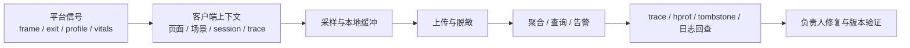

# APM / 可观测性平台与 SDK 选型

一套 Android 线上可观测性系统包含信号来源、客户端上下文、采样与存储、查询告警、诊断产物和处理流程。单独接入一个帧指标库、一个崩溃 SDK 或一个 Web 控制台，都只能覆盖其中一部分。

平台基线是 Android 17 / API 37 / `android-17.0.0_r1`。开源项目与托管服务变化更快，采用前还要检查当前 release、维护状态、Android Gradle Plugin 兼容性、数据区域和价格。

## 把三层能力分开

| 层次 | 负责什么 | 代表能力 |
|---|---|---|
| 官方信号 | 提供平台或分发侧事实 | `JankStats`、`FrameMetrics`、`ApplicationExitInfo`、`ProfilingManager`、Android Vitals |
| 客户端 SDK | 添加业务上下文、采样、诊断产物和上传 | Matrix、KOOM、LeakCanary、btrace、DoKit、OpenTelemetry Android、商业 RUM SDK |
| 后端与平台 | 接收、聚合、查询、告警、符号化和会话回查 | Firebase Performance、Measure、自建 OpenTelemetry 后端、商业 SaaS |

下面的图标出一条数据从设备到处理人的路径。

这条路径中任一段缺失，数据价值都会下降。只有指标没有上下文，团队只能看到波动；只有 hprof 和 trace，没有聚合索引，产物很难找到；有告警却没有负责人和验证版本，问题会反复出现。

## 先统一五种数据类型

APM 方案常把不同数据都称作“trace”，工程上需要拆开。

| 类型 | 示例 | 数据量 | 主要用途 |
|---|---|---|---|
| Metric | 启动时长分布、jank rate、ANR rate、RSS | 小 | 趋势、分组、告警 |
| Event | 一次进程退出、一次网络错误、一次卡顿 | 中 | 检索、归因、会话重建 |
| Span | 页面加载、数据库查询、HTTP 请求 | 中到大 | 时序与跨服务关联 |
| Profile | Perfetto trace、heap profile、stack sample | 大 | 深度诊断 |
| Snapshot | hprof、tombstone、ANR trace、截图 | 很大且敏感 | 单例问题取证 |

Metric 适合全量或较高采样率，profile 和 snapshot 应由低频规则、系统触发或远程开关控制。把每一帧、每次方法调用都当作远程 event 上传，会增加 CPU、磁盘、网络和费用，还可能让异常样本被海量正常数据淹没。

## 官方信号层

### JankStats：帧信号与 UI 状态

`androidx.metrics:metrics-performance` 的 `JankStats` 以 Window 为单位监听每一帧，回调包含开始时间、UI duration、jank 判断和 `PerformanceMetricsState` 状态。Android 12 / API 31 及更高版本还能提供 frame overrun；API 24 起利用 `FrameMetrics` 获得更可靠的时长；API 16–23 使用较粗的回退。

接入时要守住三项边界：

- 它提供每帧数据和 jank 启发式判断，不提供上传、聚合、告警或 trace 文件；
- `OnFrameListener` 会在帧回调线程执行，API 23 及以下可能是主线程，回调必须快速返回；
- `FrameData` 对象会复用，异步处理前要复制需要的字段，不能把对象引用直接放进队列。

`PerformanceMetricsState` 适合写页面、滚动、动画或业务阶段。状态值要使用有限集合；把商品 ID、搜索词或完整路由参数写进去，会带来高基数和隐私风险。

刷新率变化后，固定“超过 16.67 ms 就算卡顿”的规则会误判。JankStats 按平台能力和 heuristic multiplier 计算；平台聚合时应保留 frame deadline 或 overrun 语义。

### FrameMetrics：需要原始阶段耗时时再用

`Window.addOnFrameMetricsAvailableListener()` 从 API 24 提供 Window 帧指标。Android 17 的 `FrameMetrics` 包括 layout/measure、draw、sync、command issue、swap、total duration 等字段；较新平台还提供 `DEADLINE` 与 FrameTimeline VSync ID。

它适合已有自研采集器、需要控制字段和聚合方式的团队。Jank 判定、状态管理、低版本回退和上传都要自行实现。`FrameMetrics` 与 JankStats 常可组合：JankStats 提供统一入口，原始 FrameMetrics 只在高版本补充细分字段。

### ApplicationExitInfo：用系统记录修正退出归因

API 30 起，`ActivityManager.getHistoricalProcessExitReasons()` 返回历史进程退出记录。公开字段包括 reason、status、importance、timestamp、PSS、RSS 和进程名；ANR 或 native crash 在条件满足时还可能提供 trace input stream。Android 17 的内部记录还保存 subreason，但 `getSubReason()` 标记为 `@hide`，普通应用不能把它当作公开契约。

Android 17 源码给出几项限制：

- AOSP `config_app_exit_info_history_list_size` 默认是 16，厂商资源覆盖后可能不同；
- PSS/RSS 是系统最近一次采样，不保证等于进程死亡瞬间；
- ANR trace 和 tombstone 位于有限的全局循环存储中，`getTraceInputStream()` 可能返回 null；
- `AppExitInfoTracker` 同时处理 lmkd、子进程退出、应用 kill、recoverable crash 和 statsd 等来源，单一客户端心跳无法覆盖这些事实。

采集器应在首帧后或后台线程读取，按 `(processName, timestamp, reason, status)` 去重，并保存“来源是 system exit record”。不能把 `REASON_LOW_MEMORY`、Java OOM 和 native OOM 合成一个无来源标签。

### ProfilingManager：系统代采诊断产物

`ProfilingManager` 从 API 35 支持请求 system trace、Java heap dump、heap profile 和 stack trace。Android 17 还提供系统触发式能力。系统负责配额、采集时机和文件交付，应用负责注册 listener、保存关联上下文和上传结果。

它适合作为异常样本的诊断产物来源，不能替代日常 metric。系统可能因配额、设备状态或策略不执行请求，线上平台必须允许“事件存在，但 profile 缺失”。

### Android Vitals：分发侧基线

Android Vitals 来自用户同意上传的认证设备和 Google Play 安装，覆盖 crash、ANR、启动、渲染、LMK、Wakelock 等质量信号。它还能发现 SDK 尚未初始化前的 crash 和部分系统侧 ANR。

Vitals 与自建 APM 的分母通常不同。Play 可能按 daily active user 计算，自建平台常按 session、launch 或 event 计算；隐私阈值、渠道和用户同意范围也不同。两边数值不一致时，应先比较定义、覆盖和时间窗，不能用其中一个数字校准另一个。

## 客户端增强工具

### Matrix：多插件采集框架

Matrix 提供 Trace Canary、IO Canary、SQLite lint、resource/内存、APK 分析等模块，并把结果交给应用自己的 `PluginListener`。它适合已有上传和后台平台、希望统一多类客户端信号的团队。

兼容性是当前选择中的主要风险。上游最新正式 release 仍停在 2023 年，README 明确写 Matrix Gradle plugin 支持 AGP 3.5.0、4.0.0、4.1.0。AGP 8/9、Kotlin、R8、16 KB page size 和 Android 17 项目不能按 README 直接推定兼容。采用前应建立最小应用验证：

- debug/release、minify 开关和 baseline profile 构建；
- Java/Kotlin/Compose 和多模块插桩；
- mapping、native symbol 与反混淆；
- 启动、帧、包体、内存和构建时间差值；
- 崩溃时的远程关闭能力。

使用内部 fork 时，还要记录与上游的差异、owner 和升级测试组合。

### KOOM：线上内存专项

KOOM 分为 Java heap、native heap 和线程泄漏等模块。Java 方案利用 copy-on-write fork 子进程执行 heap dump 与分析，减少主进程长时间停顿；native 与线程模块使用各自的 hook 和分析策略。

它适合 OOM、native 泄漏或线程泄漏已经成为主要稳定性问题的团队。评估时不能只看能否产出报告，还要测：

- fork、dump 与分析在各 Android 版本和厂商 ROM 上的成功率；
- 主进程暂停时间与峰值内存；
- 低磁盘、低内存和进程被杀时的恢复；
- hprof 裁剪后的可解释性；
- native hook 与目标 ABI、MTE、Scudo、16 KB page size 的兼容；
- 产物大小、脱敏与上传条件。

### LeakCanary：开发阶段的 Java 泄漏定位

LeakCanary 监视已结束生命周期但仍被引用的对象，触发 heap dump 后用 Shark 找到 GC root 到 retained object 的引用路径，并按 leak signature 分组。

它适合 debug 和测试设备。heap dump 会暂停应用并包含对象内容，不能直接按本地配置搬到全量 release。线上内存治理还需要发生率、设备分布、RSS/PSS、OOM exit、产物采样与隐私策略，LeakCanary 本身不提供这些平台能力。

### btrace / RheaTrace：按需方法级现场

btrace 3.x 的 Android 方案使用动态 hook 与同步抓栈，按运行时采样间隔收集方法栈，并可把应用数据与 Perfetto 的 sched、atrace、ftrace 写入同一份 protobuf trace。采样能覆盖未做编译期插桩的系统栈，但不会精确记录每次方法进入和退出。

这种工具适合已发现启动或卡顿回归、普通 trace 缺少 Java 方法上下文时的定向采集。同步抓栈依赖选定触发点，长时间停在没有触发点的代码中可能形成采样空窗；采样合并还可能把两次相同栈误认为连续执行。结论应回到原始 sched、锁、I/O 和业务事件验证。

线上接入要配置构建开关、采样率、buffer 上限、采集时长、目标进程和符号文件。默认常驻打开所有模式没有依据。

### DoKit：Debug 研发工具

DoKit 提供网络 mock、沙盒查看、数据库、FPS、启动、布局、视觉和其他研发辅助面板。上游 README 明确说明功能面向 Debug，Release 未经过其保证。

它适合本地联调和测试效率，不应列入线上 APM SDK。release variant 应通过依赖隔离、no-op artifact 或构建检查确认没有把调试入口、网络拦截与敏感工具打进生产包。

## 传输与平台方案

### Firebase Performance

Firebase Performance 的 Android SDK 自动采集应用启动、screen rendering 和生命周期信号；加入 Gradle plugin 后可自动插桩 HTTP/S 请求，也支持 custom trace、custom metric 和 attribute。控制台提供版本、设备、国家和系统版本等聚合与告警。

选择前要核对这些限制：

- Android 自动网络采集依赖 Gradle plugin 与支持的网络调用路径；
- 官方文档说明 Android 只支持 main process，独立进程需要另行设计；
- 网络 URL 会做 pattern 聚合，仍要检查路径中的账号、文档 ID 等敏感片段；
- custom trace 不适合逐帧或高频调用；
- 数据存储、导出、区域、保留期和计费要符合组织要求；
- 托管控制台不能接收任意 Perfetto、hprof 或自定义二进制产物。

它适合希望快速获得托管指标和告警、能够接受 Firebase 数据与平台约束的团队。

### OpenTelemetry Android

OpenTelemetry Android 建立在 OTel Java 之上，当前提供 Activity/Fragment 生命周期、启动、ANR、crash、网络变化、慢帧/冻结帧、session、离线缓冲、自动与手动 instrumentation，并可导出到兼容后端。

OTel 解决的是统一数据模型、上下文传播和 exporter 接口。Collector、存储、查询、告警、移动端 issue grouping、符号化和大型附件管理仍需要后端能力。已有 OTel 服务端体系的团队可复用 trace context 与 collector；没有平台团队时，单接 SDK 只会得到待处理的遥测流。

移动端资源有限，Batch export、采样、离线磁盘上限和 attribute redaction 都要在接入测试中验证。服务端 Java agent 的默认配置不能原样复制到 Android。

### Measure

Measure 是 Apache 2.0 的开源移动可观测性平台，包含 Android/iOS 等 SDK、session timeline、crash、ANR、performance trace、符号上传和自托管后端。当前 Android 能力还可通过 `ProfilingManager` 接收系统触发的 profile，并把产物关联到 session。

它适合需要自托管和移动端会话上下文、并且有人维护升级、存储、备份、鉴权和告警的团队。自托管只改变控制权，不会消除运行成本。接入前应压测事件吞吐、附件增长、索引保留、版本迁移和灾难恢复。

### 商业移动 APM / RUM

商业 SaaS 常把 crash、ANR、RUM、network span、session replay、backend trace 和告警集成在一个控制台。产品名称相近，Android 覆盖差异很大。采购验证应使用真实 release APK 和目标设备，检查：

- Compose、View、Fragment、WebView 和多进程；
- OkHttp、Cronet、Ktor、gRPC 与自定义协议；
- Java/Kotlin、JNI/native crash 与符号化；
- session replay 的遮罩规则、截图与输入隐私；
- W3C trace context 和自家后端的兼容；
- 离线缓存、弱网重试、包体、启动和功耗；
- 原始数据导出、区域、保留期、删除和退出成本。

销售功能表不能代替上述验证。

## 自建 schema：先保证数据能解释

### 通用事件字段

| 字段 | 用途 | 约束 |
|---|---|---|
| `event_id` | 上传幂等与去重 | 随机 ID，不复用用户标识 |
| `event_type` / `name` | 区分 frame、launch、exit、network、profile | 枚举受版本管理 |
| wall clock + monotonic time | 跨设备查询与单设备时长 | 时长优先使用 monotonic clock |
| app version / build ID | 版本归因和符号匹配 | versionName 不足以唯一定位产物 |
| API level / device / ABI / process | 平台与进程分组 | 设备型号需规范化 |
| session ID | 组织一次前台使用期 | 与账号 ID 分离 |
| trace ID / span ID | 关联一次分布式请求 | 使用随机值和标准传播格式 |
| metric value / unit | 防止 ms、ns、bytes、KB 混用 | unit 必填，不写进 metric name 猜测 |
| sampling rule / probability | 解释覆盖率和加权 | 远程配置版本一并保存 |
| attributes | 页面、场景、网络等上下文 | allowlist、长度和基数限制 |
| artifact reference | trace、hprof、tombstone 等附件 | 保存 hash、大小、类型、加密与过期时间 |

schema 要能区分“没有发生”“没有采集”“被采样丢弃”“上传失败”和“后端解析失败”。把它们都存成 null，会让发生率和覆盖率失真。

### Session ID 与 trace ID

Session ID 表示一段用户使用期，trace ID 表示一次操作或请求树。一个 session 可以包含多个 trace，一次后台 trace 也可能不属于前台 session。二者都不应由账号、手机号或设备标识直接生成。

跨端与后端关联可使用 W3C `traceparent`。只向允许的自有域名传播，网关还要保留采样决定。第三方域名、广告和支付接口不应默认收到内部 baggage。

### 高基数字段

完整 URL、搜索词、聊天内容、文件路径和动态路由会同时增加索引成本与隐私风险。常用处理方式包括：

- URL 只保留 host、method、状态码和模板化 path；
- 页面使用稳定 screen ID，不上传可见文本；
- 错误消息分成受控 error code 与采样后的脱敏详情；
- stack trace 由 build ID + frame 组成，服务端完成符号化；
- hprof、截图和 trace 使用单独权限与保留期。

## 采样与开销

### 不同数据使用不同预算

| 数据 | 常用策略 |
|---|---|
| crash / system exit | 高覆盖，严格去重，附件按可用性采集 |
| ANR | 高覆盖事件，trace 受系统和存储限制 |
| 启动 | 按 session 采样，区分 cold/warm/hot 与 TTID/TTFD |
| frame | 端上聚合分布与场景，异常帧再抽样明细 |
| network | 按 endpoint template、错误和慢请求分层采样 |
| span | head sampling 为主，服务端可对错误提高保留 |
| profile / hprof | 极低频、配额控制、远程开关、条件上传 |

采样率变更必须随事件上报。版本 A 采 1%，版本 B 采 10%，直接比较 event count 没有意义。P95/P99 也不能由各设备已经计算好的 P95 再求平均；应上传可合并 histogram 或受控原始样本。

### 接入基准

每个 SDK 或插件都要在 release 构建上测量：

- cold/warm startup 与首帧；
- 帧时长分布、ANR 和 crash；
- Java/native heap、线程、FD 和磁盘；
- 前后台 CPU、网络字节与电量；
- APK/AAB 大小、DEX 方法、native library 和 16 KB page compatibility；
- Gradle configuration/build time、R8 与 baseline profile；
- 弱网、无网、低磁盘、低内存和进程被杀后的队列恢复。

结果要包含 SDK 全关、默认配置和目标采样配置三组。还要提供本地与远程 kill switch，确保 SDK 异常时无需发版即可停止高风险采集。

## 选型对照表

| 当前需求 | 合适起点 | 采用前要确认 |
|---|---|---|
| Play 渠道质量基线 | Android Vitals | 分母、隐私阈值、渠道覆盖 |
| 自建帧指标 | JankStats + 自有聚合 | 回调开销、状态基数、刷新率语义 |
| 稳定进程退出归因 | ApplicationExitInfo | API 30、历史条数、trace 可用性 |
| 托管启动/渲染/网络指标 | Firebase Performance | main process、数据区域、导出与自定义限制 |
| 已有 OTel 后端 | OpenTelemetry Android | 移动端采样、离线缓存、RUM 展示能力 |
| 自托管移动端 issue/session | Measure | 基础设施、附件成本、升级与备份 |
| 自有平台 + 多类客户端监控 | Matrix 或内部框架 | 现代 AGP/Android 17 兼容与维护 owner |
| OOM/内存泄漏专项 | KOOM；开发期配合 LeakCanary | dump 成功率、峰值内存、隐私和产物上传 |
| 启动/卡顿方法级诊断 | btrace，配合 Perfetto | 采样空窗、符号、buffer 与按需开关 |
| 本地研发调试 | DoKit、LeakCanary、Android Studio | release variant 完全隔离 |
| 大型商业组织的一体化 RUM | 商业 SaaS 试点 | 真实端覆盖、费用、数据与退出成本 |

## 一条可执行的采用顺序

1. 写出要改善的用户体验和度量定义，例如 cold TTID P95、受影响 session 的 ANR rate。
2. 用 Android Vitals、JankStats、ApplicationExitInfo 和现有日志建立基线。
3. 设计 event schema、采样字段、隐私 allowlist 和 build ID。
4. 选择一个平台路径：托管服务、OTel 后端或自托管移动平台。
5. 只为当前证据缺口增加 Matrix、KOOM、btrace 等专项工具。
6. 在 release 构建和真实设备上做开销、兼容与故障测试。
7. 灰度后比较 SDK 自身引入的 crash、ANR、启动、流量和功耗变化。
8. 给每个告警绑定负责人、诊断入口、修复版本和回归验证。

当指标已经很多、告警无人处理、trace 搜索困难时，继续增加采集器通常不会改善结果。此时应修复 schema、索引、owner 和处理时限。

## 源码与官方资料

- [JankStats API](https://developer.android.com/reference/androidx/metrics/performance/JankStats)
- [JankStats 使用与 API level 差异](https://developer.android.com/topic/performance/jankstats)
- [Android Vitals 定义与覆盖](https://developer.android.com/topic/performance/vitals)
- [ApplicationExitInfo API](https://developer.android.com/reference/android/app/ApplicationExitInfo)
- [ProfilingManager API](https://developer.android.com/reference/android/os/ProfilingManager)
- [Android 17 AppExitInfoTracker](https://android.googlesource.com/platform/frameworks/base/+/refs/tags/android-17.0.0_r1/services/core/java/com/android/server/am/AppExitInfoTracker.java)
- [Android 17 ApplicationExitInfo](https://android.googlesource.com/platform/frameworks/base/+/refs/tags/android-17.0.0_r1/core/java/android/app/ApplicationExitInfo.java)
- [Android 17 FrameMetrics](https://android.googlesource.com/platform/frameworks/base/+/refs/tags/android-17.0.0_r1/core/java/android/view/FrameMetrics.java)
- [Android 17 Window frame listener](https://android.googlesource.com/platform/frameworks/base/+/refs/tags/android-17.0.0_r1/core/java/android/view/Window.java)
- [Firebase Performance Monitoring](https://firebase.google.com/docs/perf-mon)
- [Firebase Performance Android 接入与 main-process 边界](https://firebase.google.com/docs/perf-mon/get-started-android)
- [OpenTelemetry Android](https://opentelemetry.io/docs/platforms/client-apps/android/)
- [Measure](https://github.com/measure-sh/measure)
- [Matrix](https://github.com/Tencent/matrix)
- [KOOM](https://github.com/KwaiAppTeam/KOOM)
- [LeakCanary](https://square.github.io/leakcanary/)
- [btrace / RheaTrace](https://github.com/bytedance/btrace)
- [DoKit](https://github.com/didi/DoKit)

---

**延伸阅读**：[14.7 ProfilingManager](07-profiling-manager.md) · [14.13 Hook 基础设施](13-hook-infrastructure.md) · [15.3 性能指标体系](../ch15-methodology/03-metrics.md) · [15.5 线上性能监控](../ch15-methodology/05-online-monitoring.md)
