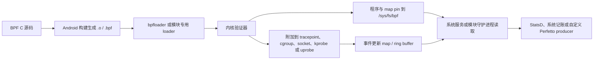

# Android eBPF 架构与性能观测

eBPF（extended Berkeley Packet Filter，内核源码通常仍简称 BPF）允许一段受 verifier（验证器）检查的程序在内核事件发生时执行。验证器会在加载阶段拒绝越界访问、无法证明会终止的控制流等不安全代码。

程序可以在调度、系统调用、网络、内存和用户态函数等位置采集上下文，再通过 map、ring buffer 或 perf buffer 把结果交给用户态。map 是内核与用户态共享的键值存储。BPF ring buffer 通常让多个 CPU 写入同一个环形队列，perf buffer 一般按 CPU 分流；两者在空间不足时都可能丢事件，顺序与合并方式也不同。

Android 已用 BPF 做系统记账和诊断，但没有向普通应用开放通用加载接口。本文讨论的是平台开发、系统调试和工具选择，不是第三方应用可直接调用的 SDK。

平台基线是 Android 17 / API 37 / `android-17.0.0_r1`，内核源码基线是 Android common tag `android17-6.18-2026-06_r6`。Android common 是 Android 使用的公共内核代码线，并不等同于某台设备最终交付的 vendor kernel。

读源码时要分清平台版本、设备内核和产品配置：平台仓库里有某个程序，不代表每台 Android 17 设备都会加载它；内核仓库里有某项能力，也不代表量产设备打开了对应的 Kconfig 编译开关。

Android eBPF 程序在内核事件处采集低开销信号，由 bpfloader 按平台规则加载、固定和授权。Android 17 增加的程序需要结合 hook 点、map、消费端和设备内核能力逐项确认。

## Hook 点、Map 与性能观测场景

### 先确认自己处在哪个权限层

Android 上讨论 eBPF 时，先要说明权限前提。同一段 BPF C 代码放在 AOSP 系统组件、root 调试环境和普通应用里，能否加载、附加和读取数据的结论完全不同。这里的 platform 指 Android 平台代码，vendor 指设备厂商随系统镜像交付的代码。

| 使用层级 | 能做什么 | 常见入口 | 约束 |
|---|---|---|---|
| AOSP 平台或 vendor 组件 | 随系统构建 BPF 对象，由启动阶段的 loader 加载、pin 和附加 | `system/bpf`、`system/bpfprogs`、Connectivity、GPU Service | 需要产品构建、SELinux、UID/GID、内核版本和程序元数据配合 |
| userdebug / eng / root 设备 | 检查已 pin 的对象，使用内核工具做受控实验 | `bpftool`、tracefs、内核自带示例 | 量产 user build 往往缺少权限或工具，结果不能直接代表应用可部署能力 |
| 普通应用 | 读取公开 API 暴露的数据，或使用获准的系统分析工具 | Perfetto、simpleperf、Android Studio Profiler、ProfilingManager | 不能自行执行 `BPF_PROG_LOAD`、附加任意 kprobe/uprobe，也不能遍历系统 BPF map |

loader 是把 BPF 对象送进内核的用户态加载器；pin 是把程序、map 或 link 固定在 BPF 文件系统 bpffs 中，使其他进程能通过 `/sys/fs/bpf` 路径找到它。SELinux 再按安全域限制谁能操作这些对象，UID/GID 则用于传统的所有者和组权限。

`userdebug`、`eng` 和量产 `user` 是不同构建类型；root 表示取得超级用户权限，不等同于某一种构建类型。tracefs 是暴露 tracepoint、ftrace 控制项和事件格式的调试文件系统，`bpftool` 是查看与管理 BPF 对象的内核配套工具。

应用性能排查通常从 Perfetto 或 simpleperf 开始：前者记录系统时间线，后者采样 CPU 函数与硬件性能事件。只有现有数据源回答不了问题，并且手里有系统镜像、模块接入点或受控 root 环境时，才需要编写新的 BPF 程序。`BPF_PROG_LOAD` 是向内核加载 BPF 程序的 syscall 命令，普通应用被权限与 SELinux 策略挡在这条路径之外。

### Android 17 的加载与取数链路

一项 BPF 观测能力要经过构建、加载、附加和消费四段。attach（附加）是把程序绑定到 tracepoint、函数或网络 hook；consumer（消费者）是读取 map 或事件缓冲区的用户态组件。下面的图标出各段的责任边界。



图中的 `.o` 或 `.bpf` 是包含 BPF 字节码、map 定义和附加元数据的 ELF 对象。Perfetto producer 是向 Perfetto 注册 data source 并写入 trace packet（序列化 trace 记录）的数据生产进程或库。

验证器还会检查指针访问、栈使用和 helper（内核向 BPF 程序开放的受限函数）调用。验证通过只说明程序满足内核约束，不说明采样方案足够低开销，也不说明用户态有权限读取结果。

#### bpfloader 在 Android 17 中做了什么

`platform/system/bpf` 的 Android 17 实现以 Rust 入口加载平台 libbpf 对象。libbpf 是 Linux 的 BPF 用户态加载库；Android 这里通过 Rust 绑定 `libbpf_rs` 使用它。`load_libbpf_progs()` 遍历内置文件描述，逐个打开对象、复用或创建 map、加载程序，并按元数据设置 pin 路径、所有者和权限。对象还可以声明内核版本范围、构建类型限制以及是否自动附加。

Rust 路径执行完成后，入口会创建 vendor pin 目录并调用 `vendorBpfLoader()`。这个函数来自旧 C++ loader。Android 17 的实现边界如下：

- 平台内置的 libbpf 对象由 Rust 路径处理；
- 旧 C++ 代码仍负责 legacy（为兼容旧接入方式保留的）vendor BPF 对象；
- 两条路径都属于启动期的特权加载流程；
- `/sys/fs/bpf` 下的名称由对象前缀和元数据决定，不能假定所有版本都使用同一种扁平命名格式。

所以，把一个 `.o` 文件 push 到设备后通常还不能加载。系统侧还要准备构建规则、SELinux 规则、loader 清单、map 权限和兼容性声明。

#### Android 17 已内置的几类程序

下表列出 `android-17.0.0_r1` 源码中有代表性的程序。设备能否看到相应 map 或事件，还取决于 loader 条件、内核 tracepoint 和厂商实现。

| 组件 | 附加位置或数据来源 | 输出 | 消费者或用途 |
|---|---|---|---|
| `timeInState.bpf` | `sched_switch`、`cpu_frequency`、`sched_process_free` | UID 的频点累计时间，以及受跟踪 TGID 按任务聚合键统计的时间等 map | 电量与 CPU 时间记账 |
| `gpuMem.bpf` | `gpu_mem/gpu_mem_total` | 以 GPU ID 和 PID 组合键记录的 GPU 内存 | GPU Service |
| `gpuWork.bpf` | `power/gpu_work_period` | 按 GPU ID 与 UID 聚合的 active/inactive 时间 map | GPU 能耗与工作量统计 |
| `bpfMemEvents.bpf` | OOM、直接回收、kswapd、vendor LMK 等事件 | 分别面向 AMS、lmkd 的 ring buffer | 内存压力诊断和策略 |
| Connectivity BPF | cgroup、socket、traffic-control（tc）等网络 hook | 按 UID、tag、接口等维度的流量和策略 map | netd、NetworkStats、Connectivity |
| UprobeStats | 用户态 ELF 文件偏移对应的 uprobe | ring buffer、StatsD atom、bridge event | 受 statsd 配置控制的系统诊断 |

UID 是 Android/Linux 用来标识用户或应用身份的整数；TGID 是 Linux 线程组 ID，通常对应用户看到的进程 ID。cgroup 是把进程分组并施加资源策略的内核机制，socket 是网络端点，tc 是 Linux 流量控制层。

StatsD atom 是 statsd 接收的结构化指标记录；bridge event 则经 UprobeStats 的 Binder 桥接服务送往有权限的 framework 消费者。这里的 framework 是承载系统 Java API 与系统服务的 Android 框架层。AMS 指 ActivityManagerService，lmkd 是 Android 的低内存终止守护进程，kswapd 是内核后台页面回收线程，OOM/LMK 分别指内核内存耗尽与 Android 低内存终止流程。

`timeInState.bpf` 不生成 Perfetto 的调度时间线，它在调度事件发生时更新累计 map。Perfetto 的线程运行状态通常来自 ftrace（Linux 内核跟踪框架）的 `sched_switch`、`sched_waking` 等事件。两者能观察同一内核活动，但一个保留累计值，另一个保留事件顺序。

### Attach 点决定了 `ctx` 的结构

BPF 程序的 `ctx` 是内核传给探针的上下文指针，没有统一布局。ELF section 名称、程序类型和目标事件共同决定参数怎么取。代码能通过 C 编译，不代表运行时布局正确。

| 附加方式 | section 示例 | `ctx` 的含义 | 适用场景 |
|---|---|---|---|
| 常规 tracepoint | `tracepoint/raw_syscalls/sys_enter` | 目标 tracepoint 的生成结构；该事件常见为 `trace_event_raw_sys_enter`，包含 `id` 和 `args[6]` | 需要稳定事件字段，接受 tracepoint 数据准备开销 |
| raw tracepoint | `raw_tracepoint/sys_enter` | `bpf_raw_tracepoint_args`；元素对应内核 tracepoint 原始原型 | 需要更低层的原始参数，代码必须理解该 tracepoint 的内核原型 |
| kprobe / kretprobe | `kprobe/vmalloc`、`kretprobe/vmalloc` | `pt_regs`，入口参数和返回值按目标架构 ABI 读取 | 内核函数级实验；符号、内联和版本变化都会影响稳定性 |
| uprobe / uretprobe | 由用户态二进制、偏移和 perf event 建立 | `pt_regs`，参数按用户态 ABI 读取 | native 函数入口/返回；需正确换算 ELF 文件偏移并跟踪二进制版本 |
| cgroup / socket / tc | 由具体 BPF program type 定义 | socket buffer、socket、cgroup 等专用上下文 | Android 网络统计和策略 |

`pt_regs` 是内核保存寄存器现场的结构；ABI（application binary interface）规定参数和返回值放在哪些寄存器或栈位置。tracepoint 是内核显式定义的事件接口，kprobe/uprobe 则分别在内核函数和用户态二进制位置放置动态探针。perf event 是 Linux 性能事件接口，uprobe 可借它完成附加。

#### `raw_syscalls/sys_enter` 的两个名字不能混用

内核在 `include/trace/events/syscalls.h` 中把 `sys_enter` tracepoint 定义为两个原始参数：`struct pt_regs *regs` 和 syscall ID。常规 tracepoint 路径会进一步生成带 `id` 与 `args[6]` 的事件记录。

因此：

- `tracepoint/raw_syscalls/sys_enter` 可按生成的 tracepoint 结构读取 `id` 与 `args`；
- `raw_tracepoint/sys_enter` 的 `ctx->args[0]` 是 `pt_regs` 指针，`ctx->args[1]` 才是 syscall ID；
- 把 `SEC("tp/raw_syscalls/sys_enter")` 与 `bpf_raw_tracepoint_args` 拼在一起，会把两种 ABI 混成一段代码；
- raw tracepoint 中的 syscall 参数藏在寄存器上下文里，读取方式与 CPU 架构有关。

下面的片段只展示常规 tracepoint 的字段关系。`vmlinux.h` 是从目标内核 BTF（BPF Type Format，保存内核类型信息的格式）生成的 C 头文件；CO-RE（Compile Once – Run Everywhere）利用 BTF 重定位字段访问，以适配一组兼容内核。示例所需的完整头文件、CO-RE 处理和 Android 构建规则仍要由所在模块补齐。

```c
struct syscall_key {
    __u32 tgid;
    __u32 syscall_id;
};

struct {
    __uint(type, BPF_MAP_TYPE_HASH);
    __uint(max_entries, 1024);
    __type(key, struct syscall_key);
    __type(value, __u64);
} syscall_counts SEC(".maps");

const volatile __u32 target_tgid = 0;

SEC("tracepoint/raw_syscalls/sys_enter")
int count_syscalls(struct trace_event_raw_sys_enter *ctx)
{
    __u64 pid_tgid = bpf_get_current_pid_tgid();
    __u32 tgid = pid_tgid >> 32;
    __u64 initial = 1;
    __u64 *count;
    struct syscall_key key = {
        .tgid = tgid,
        .syscall_id = (__u32)ctx->id,
    };

    if (target_tgid && target_tgid != tgid)
        return 0;

    count = bpf_map_lookup_elem(&syscall_counts, &key);
    if (count)
        __sync_fetch_and_add(count, 1);
    else
        bpf_map_update_elem(&syscall_counts, &key, &initial, BPF_NOEXIST);

    return 0;
}
```

这里把上 32 位命名为 `tgid`。需要当前线程时，应把返回值截断到低 32 位并命名为 `tid`。Linux 用户态常把 TGID 叫作进程 ID，把 TID 叫作线程 ID。若把 `bpf_get_current_pid_tgid() >> 32` 笼统命名为 `pid`，后续做线程级关联时容易用错。

这段计数器只适合教学。HASH map（哈希表）最多容纳 1024 个 key；容量耗尽后，新组合不会被记录。`BPF_NOEXIST` 表示仅当 key 尚不存在时才插入。两个 CPU 第一次同时遇到同一个 key 时，可能都先查到空值，随后只有一个插入成功，另一次事件没有补加。生产实现应检查更新返回值，并设计可接受的容量、并发与淘汰策略。

#### kprobe 与 kretprobe 需要成对保存上下文

kprobe 入口能看到函数参数，kretprobe 返回点能看到返回值。返回点不会自动保留入口参数。若要计算一次调用的耗时，或把 `vmalloc(size)` 的 size 与返回地址关联，需要在入口写入临时 map，在返回点按当前 TID 取出并删除。

这类程序还要处理几项边界：

- 同一线程可能发生嵌套调用，单值 map 会覆盖上一层；
- 函数可能被内联、换名或改成 wrapper（只做转发的包装函数），kprobe 名称不属于稳定 Android API；
- `pt_regs` 的取参宏依赖目标架构；
- 入口有记录、返回点丢事件时，临时 map 会残留；
- 量产设备可能禁止相应 attach 操作。

对内存问题，先检查平台已有的 OOM、vmscan（内核页面回收事件）、LMK、dma-buf、GPU memory 和 allocator 数据源。只有问题落在一个没有稳定 tracepoint 的内核函数里，才考虑 kprobe。

#### uprobe 还要理解 ELF 与运行时

uprobe 附加的是 ELF 文件偏移，不直接识别源码函数名。ELF 是 Linux/Android 原生可执行文件和共享库使用的格式。调试脚本通常先用 ELF 符号把函数名换算成文件偏移，再通过 `perf_event_open` 建立探针。ASLR（address space layout randomization，地址空间布局随机化）会随机化运行时虚拟地址，但不会改变同一文件版本的 uprobe 文件偏移；只有从运行时地址反推文件偏移时，才需要扣除映射基址并处理 ELF segment（文件内可加载区段）的映射。

Android 系统进程还会遇到 stripped symbol（发布产物移除了部分符号）、APEX（可独立更新的系统模块封装）路径与版本替换、native bridge（跨指令集运行 native 代码的兼容层），以及 ART（Android Runtime）的 AOT/JIT 代码地址变化。AOT（ahead-of-time）在运行前编译，JIT（just-in-time）在运行时编译；后者生成的代码不一定对应稳定 ELF 偏移。

Android 17 的 UprobeStats 封装了这套受控 instrumentation（插桩，即在不修改目标二进制的情况下增加观测点）流程。statsd 通过 Subscription（订阅配置）下发任务，任务描述目标进程、探针和运行时长；守护进程解析目标方法对应的 ELF 偏移，建立 perf event，附加模块自带的 BPF 程序并轮询 ring buffer。

UprobeStats 还会检查允许插桩的方法、配置限制和同时使用同一 map 的任务冲突。结果可以写成 StatsD atom；需要 Android framework 上下文的复杂事件，则经 `UprobeStatsBridgeService` 转交给有权限的应用。

UprobeStats 在 API 37 上以 lazy Binder service `uprobestats_service` 运行。lazy 表示按需启动，并允许服务空闲后退出；任务活动期间由 `LazyServiceGuard` 阻止进程被提前回收。

init service 仍带 `disabled`、`oneshot` 属性：`disabled` 表示不会随 class 自动启动，`oneshot` 表示退出后 init 不会自动重启它。这两个属性都不能推出“只读一次配置文件、没有 Binder 服务”。只有兼容 API 37 以前的平台路径时，代码才会回退读取 `/data/misc/uprobestats-configs/config`。

UprobeStats 面向平台控制的系统诊断，不向第三方应用提供任意插桩能力。量产 user build 还会按 allowlist（允许列表）检查可插桩的方法。init 为守护进程配置了 `SYS_ADMIN`、`PERFMON` Linux capability；capability 是把 root 权限拆成若干独立特权位的机制。专用 UID/GID、SELinux 策略和这些 capability 一起构成权限边界。

### 五类常见问题该怎样选观测点

#### CPU 时间与调度延迟

`timeInState.bpf` 适合系统做累计记账，问题通常是“某 UID 在各频率上累计运行了多久”。它监听 `sched_switch`，根据当前 CPU 和频率更新 map；CPU 频率变化时，`cpu_frequency` 事件会更新频率索引。

线程为何晚被调度、一次 runnable（已经可以运行、正在等待 CPU）状态持续了多久，则应采集 Perfetto 的 `sched_switch`、`sched_waking`、`sched_wakeup` 等 ftrace 事件。时间线保留事件顺序和线程状态，更适合定位抢占、CPU 饱和、优先级与 affinity 问题。affinity 是限制线程可在哪些 CPU 上运行的亲和性掩码。

不要把 `/proc/stat` 描述成固定 10 ms 精度。它导出的计数单位与内核配置和字段语义有关，采样间隔由读者的轮询策略决定；它的问题主要是全局累计值难以还原短时线程调度因果。

#### 系统调用频率与耗时

只想知道某段操作发起了哪些 syscall（系统调用），可在 Perfetto 中打开 `raw_syscalls/sys_enter` 和 `raw_syscalls/sys_exit`。需要按进程、syscall ID 做长期聚合，并且 ftrace 数据量不可接受时，特权 BPF 程序可以先在内核里过滤和计数。

系统调用延迟必须关联 enter 与 exit，关联键至少要包含 TID。线程退出、信号打断、嵌套与重入、map 容量和丢事件都要纳入设计。对所有进程采集六个参数再送入 ring buffer，通常会制造大量无用数据；应尽量在内核侧按 TGID、UID、cgroup 或 syscall ID 过滤。

#### GPU 内存

Android 17 的 `gpuMem.bpf` 挂在 `gpu_mem/gpu_mem_total` tracepoint。map 的 64 位键由 GPU ID 放在高 32 位、PID 放在低 32 位，值是该组合的总字节数；事件报告 size 为 0 时删除对应键。

使用这项数据前要确认两个前提：

1. GPU 驱动必须发出 `gpu_mem_total` tracepoint；
2. 该数值代表驱动报告的 GPU 内存总量，不能直接当成 SurfaceFlinger layer 大小、进程 PSS 或某次渲染的瞬时分配。PSS（Proportional Set Size）会把共享内存按共享进程数折算，是进程内存统计口径。

如果要分析帧问题，应把 GPU memory、BufferQueue、FrameTimeline、GPU work period 和进程生命周期放在同一时间范围里看。BufferQueue 是生产者与显示消费者传递图形缓冲的队列；FrameTimeline 记录帧从应用到合成显示的时序。单独一条 memory counter（随时间变化的数值轨道）无法证明卡顿因果。

#### 网络流量与策略

Android 的网络 BPF 由 Connectivity 与 netd 体系管理。netd 是系统网络守护进程；NetworkStats 是 framework 使用的按 UID、网络类型等维度统计流量的数据接口。BPF 程序可以在 cgroup、socket 和 traffic-control 等位置统计 UID/tag 流量或执行策略，用户态服务读取 pinned map 后形成上层数据。

这套设施不能当成应用可复用的抓包 API。应用侧若要看请求时序，应使用网络库事件、Perfetto 已开放的数据源或受控代理；系统开发者排查计费和策略问题时，再去核对 Connectivity BPF 对象、map 和对应服务。

#### 内存压力与分配异常

Android 17 平台已有面向 OOM、回收、LMK、dma-buf、GPU memory 和锁竞争等方向的 BPF 程序或 tracepoint。dma-buf 是内核在驱动和进程之间共享缓冲区的机制，图形与相机链路经常使用。排查路径可以按问题层级选择：

| 现象 | 优先数据 |
|---|---|
| 应用 Java/Kotlin 堆增长 | Java heap dump、Android Studio allocation tracking/sampling |
| native heap 增长 | heapprofd、malloc debug；可重编译目标时评估 LeakSanitizer |
| 系统内存压力、回收和 LMK | Perfetto memory/ftrace、lmkd/AMS 事件、`bpfMemEvents` 平台数据 |
| dma-buf 或图形缓冲增长 | dma-buf 统计、GPU memory、SurfaceFlinger/BufferQueue |
| 某个内核函数疑似泄漏 | 受控设备上的 tracepoint；没有稳定事件时再评估 kprobe |

heap dump 是某一时刻堆对象与引用关系的快照，allocation tracking/sampling 记录对象分配；heapprofd 是 Perfetto 的 native heap profiler，malloc debug 与 LeakSanitizer（LSan）则依赖不同程度的调试或插桩条件。

eBPF 擅长在事件发生时按条件计数，但不会自动理解对象所有权。泄漏结论仍要靠分配与释放配对、进程生命周期和上层资源语义证明。

### 与 Perfetto 的关系

在 Android 17 的 `external/perfetto` tag 中，`DataSourceConfig` 列出了内置数据源使用的配置字段：

- `linux.ftrace` 对应 `ftrace_config`；
- `linux.perf` 对应 `perf_event_config`；
- 该 release tag 没有 `ebpf_config` 字段，也没有文档化的内置 `linux.ebpf` 数据源。

这不妨碍平台团队自建 Perfetto producer，但 BPF map 或 ring buffer 不会自动变成 trace packet。已有 tracepoint 能回答问题时，可以直接让 Perfetto 采 ftrace。下面的 prototext（protobuf 的文本表示）用来采集调度与 syscall 事件，观察一个短时操作附近的系统调用和线程切换。

```protobuf
buffers {
  size_kb: 32768
  fill_policy: RING_BUFFER
}
data_sources {
  config {
    name: "linux.ftrace"
    ftrace_config {
      ftrace_events: "sched/sched_switch"
      ftrace_events: "sched/sched_waking"
      ftrace_events: "raw_syscalls/sys_enter"
      ftrace_events: "raw_syscalls/sys_exit"
      atrace_apps: "com.example.app"
    }
  }
}
duration_ms: 10000
```

这份配置采集 10 秒系统级原始事件流，数据量可能很大。`atrace_apps` 请求为 `com.example.app` 启用应用侧 atrace 标记，不会把 `sched/*` 或 `raw_syscalls/*` 过滤到这个进程。正式采集前应缩短时长，并根据问题删掉不需要的 event；若需要按进程筛选 syscall，应另外设计过滤或在采集后查询。user build 上，能否启动相应数据源及看到敏感字段还取决于 trace 会话权限和平台策略。

BPF map 或 ring buffer 不会自动出现在 Perfetto UI。若自研平台 BPF 程序需要进入 trace，用户态消费者还要完成一段桥接：

1. 读取 map 或轮询 ring buffer；
2. 保存内核时间戳、CPU、TGID/TID 和事件字段；
3. 通过自定义 Perfetto data source 或 TrackEvent SDK 写入 trace packet；
4. 定义稳定的 track、counter 或 slice 语义；
5. 统计读取失败、ring buffer 满和用户态处理不及时造成的丢失。

track 是 Perfetto 中承载一组相关事件的轨道；counter 表示随时间变化的数值，slice 表示有开始与结束的时间区间。trace schema 则约定 packet 字段、单位和关联方式，保证生产者与分析查询理解一致。

写入 StatsD 也不等于写入 Perfetto。StatsD 适合聚合 atom 和设备侧指标，Perfetto 适合保留时间线。UprobeStats 可以上报 StatsD，这是该模块自己实现的消费链路，不代表任意 BPF 程序都有同样集成。

### 开销不能用一个固定数字概括

BPF 程序运行在事件热路径上，也就是每次该事件发生时都会同步经过的高频执行路径。开销由事件频率、指令数、helper 调用、map 类型、锁竞争、跨 CPU 通信、栈回溯和输出量共同决定。“每秒几千次”或“亚毫瓦”都不是可迁移到另一台设备和另一种事件上的结论。

评估一项探针时，应记录以下数据：

- 每秒触发次数，以及峰值而非只有平均值；
- 每次执行的 map lookup/update 次数；
- ring buffer 预留失败或 perf buffer 丢失计数；
- map 的最大条目数、淘汰策略和实际占用；
- 用户态消费者的 CPU 时间、唤醒频率和积压；
- 在同一负载下开启与关闭探针，比较目标指标和整机功耗的 A/B 差异；
- verifier 日志、程序 JIT 状态和 attach 失败原因。

JIT 会把 BPF 字节码编译为目标 CPU 的机器码；设备是否启用、程序是否成功 JIT，都应以运行时状态为准。

BPF ring buffer 在空间不足时，reserve（预留写入空间）会失败，不会阻塞等待消费者。程序若忽略返回值，仍会继续运行，用户态也可能读到部分事件；缺失记录却会让 enter/exit 配对、延迟分布和对象生命周期分析失真。

还有三类常见放大器：

- 在 `sched_switch`、syscall 或网络包等高频事件上输出每条记录；
- 对每个事件抓用户栈或内核栈；
- 使用全局热点 key，让多个 CPU 竞争同一个 map 条目。

减负手段包括尽早按 UID/TGID/cgroup 过滤、内核侧聚合、按 CPU map、有限采样和短采集窗口。优化以后仍需重新做 A/B 测量。

### sched_ext：内核具备能力不等于设备正在使用

`android17-6.18-2026-06_r6` 包含 `kernel/sched/ext.c` 和 `tools/sched_ext` 示例。sched_ext（也简称 SCX）允许 BPF 程序实现 `sched_ext_ops`，在运行时提供一套调度策略。`sched_ext_ops` 通过 BPF struct_ops 机制把一组调度回调注册给内核。它属于调度器扩展框架，与前文只做观测和记账的 BPF 程序用途不同。

启用 sched_ext 至少要满足：

- 内核编译时打开 `CONFIG_SCHED_CLASS_EXT` 及相关 BPF 配置；
- 用户态 loader 成功加载并附加一套 scheduler ops；
- verifier、struct_ops 注册和运行时检查都通过；
- 产品策略允许该调度器运行。

当没有 BPF scheduler 加载时，系统仍由常规调度类工作。sched_ext 调度器发生错误或卡死时，内核会中止它，并把相关任务交回 fair-class scheduler（Linux 的普通分时调度类）。支持该接口的调试环境可从这些节点检查状态：

```text
/sys/kernel/sched_ext/state
/sys/kernel/sched_ext/root/ops
/sys/kernel/sched_ext/enable_seq
```

节点存在只能证明内核编译了相应接口。还要结合 `state`、当前 ops 名称和系统行为，才能判断采集时是否有 sched_ext 调度器处于活动状态。Android 的 `system/bpf` bpfloader 负责清单中的平台和 vendor BPF 对象；它的存在不能证明产品还加载了 sched_ext scheduler。

### 版本演进应怎样写

版本历史适合帮助读者寻找源码，但不要把平台、Mainline 和内核三条时间线混成一条。

| Android 版本 | 可确认的方向 | 阅读时的边界 |
|---|---|---|
| Android 9–11 | 网络统计和策略逐步迁移到 BPF | 具体 hook 和旧的 qtaguid 内核流量记账接口随版本、内核而变 |
| Android 12–13 | CPU time-in-state、GPU memory 等系统记账场景扩展 | map 是否加载取决于设备内核与产品配置 |
| Android 15–16 | 正式 tag 中可见 UprobeStats Mainline 模块，平台 BPF 程序继续扩展，Rust loader 路径逐步引入 | 模块版本与整个平台版本不是同一条发布线 |
| Android 17 / API 37 | 正式 tag 中可见 Rust 平台 loader、legacy vendor loader、lazy Binder UprobeStats，以及 CPU time-in-state、GPU memory/work、memory events 等对象 | 结论锚定 `android-17.0.0_r1`，不拿 main 分支代替 release tag |
| Android common 6.18 | sched_ext、ring buffer、BTF/CO-RE 等内核能力继续演进 | 内核 tag 不能代替设备 Kconfig 和 vendor kernel 验证 |

Mainline 是 Android 可通过模块更新独立发布部分系统组件的机制，OTA 则通常指整机系统更新。GKI（Generic Kernel Image）是 Android 的通用内核镜像方案，但设备仍可能带不同内核分支、模块和 vendor 改动。

若一台 API 37 设备运行的 GKI 基线不同，或厂商移除了某个 tracepoint，平台源码里的 attach 方案就可能无法工作。记录问题时应同时写下 build fingerprint（唯一标识系统构建的字符串）、API level、`uname -r` 输出、内核 config 来源和目标 tracepoint 是否存在。

### 一套可执行的选择顺序

遇到性能问题时，可以按下面的顺序缩小工具范围：

1. 写清要测的是累计量、时间线、采样热点，还是一次事件的参数。
2. 检查 Perfetto、simpleperf、heapprofd、系统 `dumpsys` 和平台现有 BPF map 是否已经提供答案。
3. 核对权限：普通应用、系统应用、root 调试还是自有系统镜像。
4. 对照目标设备的内核版本、Kconfig、tracefs 事件和 BTF；Android API level 单独不足以证明内核能力。
5. 优先选稳定 tracepoint；没有合适事件时，再评估 kprobe 或 uprobe 的版本成本。
6. 在内核侧设置最窄过滤条件和有界 map，显式记录丢事件。
7. 用已知负载验证字段语义，再做探针开关 A/B。
8. 若数据需要进入 Perfetto，单独设计用户态消费者和 trace schema。

`dumpsys` 用来导出 Android 系统服务的当前状态。BTF 可供 verifier、调试工具和 CO-RE 重定位使用；没有目标设备 BTF 时，要改用与目标内核匹配的头文件或其他兼容方案，不能假定 CO-RE 自动生效。

工具之间的分工可以概括为：

| 问题 | 优先工具 | eBPF 介入条件 |
|---|---|---|
| UI 卡顿和跨进程时序 | Perfetto | 已有 ftrace/atrace 缺少某个内核上下文 |
| CPU 函数热点、PMU 事件 | simpleperf | 需要在特定内核事件上按条件聚合 |
| Java/Kotlin heap | heap dump、allocation tracking/sampling | 需要关联内核回收、OOM 或系统级缓冲 |
| native heap | heapprofd、malloc debug、LSan | 需要关联内核回收、OOM 或系统级缓冲 |
| 网络请求时序 | 应用网络埋点、Perfetto | 系统网络统计或策略本身有问题 |
| 平台长期轻量记账 | 已有系统 BPF map | 自有系统组件有明确且稳定的新指标 |

PMU（Performance Monitoring Unit）是 CPU 的硬件性能计数单元，可记录 cycles、cache miss 等事件；simpleperf 是 Android 对 perf 能力的命令行封装。atrace 是 Android 写入 ftrace/Perfetto 的用户态标记接口，适合表示 framework 或应用中的区间和瞬时事件。

### 常见误读

#### “Android 17 有 eBPF，所以应用可以直接加载”

错误。平台 loader 和模块 loader 运行在特权域，普通应用没有等价入口。

#### “pin 目录里有 map，说明对应程序正在正常采集”

证据不足。map 可能只是在启动期被创建，程序可能附加失败、事件可能从未触发，消费者也可能没有权限。需要同时检查 program/link、attach 状态、map 更新和 loader 日志。这里的 link 是内核表示“程序已绑定到附加点”的 BPF 对象。

#### “BPF 与 ftrace 挂同一个 tracepoint，Perfetto 就会显示 BPF 结果”

错误。Perfetto 采到的是 ftrace 事件；BPF 对事件做的聚合或额外输出需要独立消费者。

#### “tracepoint 字段在所有内核版本都一样”

tracepoint 通常比函数符号稳定，但不属于 Android SDK API。自研程序仍应基于目标内核头文件或 BTF 构建，并验证字段和事件是否存在。

#### “sched_ext 出现在 6.18 源码里，Android 17 就在使用 BPF 调度器”

错误。源码、Kconfig、产品启用和采集时活动状态是四项不同证据。

### 观测点部分的源码与官方文档

- [Android 17 bpfloader Rust 入口与平台对象清单](https://android.googlesource.com/platform/system/bpf/+/refs/tags/android-17.0.0_r1/loader/bpfloader.rs)
- [Android 17 timeInState BPF 程序](https://android.googlesource.com/platform/system/bpfprogs/+/refs/tags/android-17.0.0_r1/timeInState.c)
- [Android 17 GPU memory BPF 程序](https://android.googlesource.com/platform/frameworks/native/+/refs/tags/android-17.0.0_r1/services/gpuservice/bpfprogs/gpuMem.c)
- [Android 17 GPU work BPF 程序](https://android.googlesource.com/platform/frameworks/native/+/refs/tags/android-17.0.0_r1/services/gpuservice/gpuwork/bpfprogs/gpuWork.c)
- [Android 17 memory events BPF 程序](https://android.googlesource.com/platform/system/memory/libmeminfo/+/refs/tags/android-17.0.0_r1/libmemevents/bpfprogs/bpfMemEvents.c)
- [Android 17 UprobeStats 设计与配置说明](https://android.googlesource.com/platform/packages/modules/UprobeStats/+/refs/tags/android-17.0.0_r1/README.md)
- [Android 17 UprobeStats 守护进程入口](https://android.googlesource.com/platform/packages/modules/UprobeStats/+/refs/tags/android-17.0.0_r1/daemon/uprobestats.rs)
- [Android 17 UprobeStats lazy service 配置](https://android.googlesource.com/platform/packages/modules/UprobeStats/+/refs/tags/android-17.0.0_r1/apex/UprobeStats-service-mainline.rc)
- [Android 17 UprobeStats 任务执行与 ring buffer 读取](https://android.googlesource.com/platform/packages/modules/UprobeStats/+/refs/tags/android-17.0.0_r1/daemon/android/task.rs)
- [Android 17 Perfetto DataSourceConfig](https://android.googlesource.com/platform/external/perfetto/+/refs/tags/android-17.0.0_r1/protos/perfetto/config/data_source_config.proto)
- [Android common 6.18 syscall tracepoint 定义](https://android.googlesource.com/kernel/common/+/refs/tags/android17-6.18-2026-06_r6/include/trace/events/syscalls.h)
- [Android common 6.18 sched_ext 实现](https://android.googlesource.com/kernel/common/+/refs/tags/android17-6.18-2026-06_r6/kernel/sched/ext.c)
- [Android common 6.18 sched_ext 示例](https://android.googlesource.com/kernel/common/+/refs/tags/android17-6.18-2026-06_r6/tools/sched_ext/)
- [Linux BPF ring buffer 文档](https://www.kernel.org/doc/html/latest/bpf/ringbuf.html)
- [Linux sched_ext 文档](https://docs.kernel.org/scheduler/sched-ext.html)
- [Android BPF loader 与平台使用说明](https://source.android.com/docs/core/architecture/kernel/bpf)
- [Android eBPF traffic monitor](https://source.android.com/docs/core/data/ebpf-traffic-monitor)

## bpfloader、对象组织与权限

观测场景决定需要哪些内核事件，平台架构决定程序怎样加载、固定到 bpffs 并向用户空间开放 map。

观测点与权限层明确后，下文转向系统启动：Android 17 在什么时机装载平台、Mainline 和 vendor BPF 对象，谁负责把已加载的 program 附加到 tracepoint，用户空间又怎样读取 map。

Mainline 是可独立于完整系统更新的 Android 模块，vendor 则指设备厂商随产品镜像交付的部分。

BPF program 是送入内核执行的字节码，map 是 program 与用户空间共享数据的内核对象。理解下面的启动链时，先把三个动作分开：

- **load**：通过 `bpf(2)` 系统调用在内核中创建 program 和 map，期间会经过 verifier（验证器）。`(2)` 表示 Linux 手册的系统调用章节。
- **pin**：把内核对象固定到 bpffs 路径。bpffs 是 BPF 虚拟文件系统；pin 会保留对象引用，使加载进程退出后，其他进程仍能按路径取得 fd（file descriptor，文件描述符）。
- **attach**：把 program 连接到 tracepoint、raw tracepoint、iterator 等触发点。tracepoint 是内核预先定义的事件，raw tracepoint 暴露更原始的参数，iterator 则让 BPF 程序遍历特定内核对象。program 已出现在 `/sys/fs/bpf`，仍不能证明它正在接收事件。

Android 17 的平台源码锚点是 `android-17.0.0_r1`，Android common kernel 的 tracepoint 以 `android17-6.18-2026-06_r6` 为准。common kernel 是 Android 使用的公共内核代码线；GKI（Generic Kernel Image）是 Android 的通用内核镜像方案，具体设备仍可能带不同基线和 vendor 改动。

### Android 17 的完整启动链

`bpfloader` 这个名字容易让人误判入口。Android 17 的 init service 由 Connectivity APEX 覆盖。init 是 Android/Linux 的第一个用户空间进程，负责按 `.rc` 文件启动服务；APEX 是 Android 可独立更新的系统模块封装。

同一个加载进程会在 Mainline、UprobeStats、平台和 vendor 加载器之间多次调用 `execve()`。`execve()` 会用新程序替换当前进程映像，成功时不会返回，PID 也不变。

下面的流程图用于标出每一段进程负责的对象范围：

```text
init
  ├─ mount bpffs at /sys/fs/bpf
  └─ trigger load-bpf-programs
       │
       ▼
/apex/com.android.tethering/bin/netbpfload
  ├─ load Connectivity BPF objects
  ├─ optional: exec uprobestatsbpfload
  └─ exec /system/bin/bpfloader
       │
       ▼
/system/bin/bpfloader                  (Rust)
  ├─ libbpf-rs: load registered /system/etc/bpf/*.bpf
  ├─ C++ vendorBpfLoader(): load /vendor/etc/bpf/*.o
  └─ exec netbpfload done
       │
       ▼
netbpfload done
  ├─ set bpf.progs_loaded=1
  └─ return to init; init can start netd
```

这个顺序来自 `system/core/rootdir/init.rc`、Connectivity 的 `netbpfload*.rc` 和各加载器入口。图中的 UprobeStats 步骤是条件分支：只有对应二进制存在时才执行，完成后再 `execve()` 平台 loader。

日志里同时出现 `NetBpfLoad`、`BpfLoader-rs` 和 `LibBpfLoader`，不能据此判断加载器被重复启动。这些 tag 来自同一 PID 先后执行的不同阶段。

#### init 为什么在这个时机运行加载器

`init.rc` 在 `on init` 阶段把 bpffs 挂到 `/sys/fs/bpf`。主启动序列完成 `post-fs-data` 后触发 `load-bpf-programs`，位置早于 `zygote-start`。Connectivity 的 `netbpfload.rc` 还要求此时 APEX 与日志系统已经可用，并要求 BPF 程序在 netd 启动前加载完成。

`post-fs-data` 是 `/data` 挂载后的初始化阶段；Zygote 是 Android 应用与多数 Java 系统进程的孵化进程；netd 是系统网络守护进程。

`exec_start bpfloader` 是同步动作，init 会等它结束。加载链末端的 `netbpfload done` 设置 `bpf.progs_loaded=1`，init 随后才启动 netd。

加载器异常退出时，等待条件不会满足；service 的 `reboot_on_failure` 还会让设备以 `bpfloader-failed` 原因重启。这类故障会阻断关键启动序列，不能按普通后台服务崩溃处理。

#### 三类对象由谁装载

| 对象来源 | Android 17 装载方 | 典型安装目录 | 说明 |
| --- | --- | --- | --- |
| Connectivity Mainline | Connectivity APEX 的 `netbpfload` | `/apex/com.android.tethering/etc/bpf/mainline/` | 包含 netd、clatd、offload 等网络 BPF 对象 |
| 平台 system image | Rust `bpfloader.rs` + `libbpf-rs` | `/system/etc/bpf/` 及其子目录 | 文件必须登记在 Rust descriptor 中 |
| 厂商分区 | `Loader.cpp::vendorBpfLoader()` | `/vendor/etc/bpf/*.o` | 保留 Android 旧式对象格式和加载规则 |

clatd 负责 IPv4/IPv6 地址转换，offload 指把部分网络处理交给内核或硬件。system image 是平台系统分区，vendor partition 是厂商分区。

`libbpf-rs` 是 libbpf 的 Rust binding（语言绑定）。平台 Rust 加载器不会扫描 `/system/etc/bpf` 后无条件加载每个文件。它按 `BpfFileDesc` descriptor（描述文件路径、权限和对象清单的数据结构）打开指定对象，并逐个核对 map、program 名称。

官方 BPF 文档所说的 `/system/etc/bpf` 启动装载约定仍可用来理解文件布局；分析 Android 17 的精确行为时，还要同时查看 `bpfloader.rs` 的 descriptor。

### 从 Android 15 到 Android 17 的迁移边界

Rust 化发生在 Android 16，Android 17 完成了更多平台对象的迁移：

| 平台版本 | 平台入口 | `timeInState` 构建方式 | `fuseMedia` 构建方式 |
| --- | --- | --- | --- |
| Android 15 | `BpfLoader.cpp` | `bpf { name: "timeInState.o" }` | `fuseMedia.o` |
| Android 16 | `bpfloader.rs` | 同时构建 `.o` 与 `.bpf` | `fuseMedia.o` |
| Android 17 | `bpfloader.rs` | 只构建 `timeInState.bpf` | 只构建 `fuseMedia.bpf` |

Android 16 的双构建用于迁移 libbpf/CO-RE 路径。libbpf 是 Linux 的 BPF 用户空间加载库；CO-RE（Compile Once – Run Everywhere）利用 BTF（BPF Type Format，内核类型信息格式）重定位字段访问，以兼容一组内核版本。

到了 Android 17，`system/bpfprogs/Android.bp` 中已经没有 `timeInState.o` 和 `fuseMedia.o`；C++ `Loader.cpp` 仍存在，用途收窄到 `/vendor/etc/bpf/*.o`。因此，Android 17 不能概括成“Rust 外壳调用 C++ 装载全部平台对象”。

加载器迁移也没有移除平台内部的消费接口。Android 17 的 `libtimeinstate` 与 GpuMem 仍通过 `retrieveProgram()`、`bpf_attach_tracepoint()` 和 `BpfMap` wrapper 取得 pinned 对象、完成 attach 并读写 map；这些是平台内部接口，不是普通应用 SDK。

### Rust 加载器怎样处理一个 `.bpf` 对象

`bpfloader.rs` 的 descriptor 同时声明文件路径、bpffs 前缀、map、program、权限和版本条件。`libbpf_worker()` 对每个对象执行以下工作：

1. 根据 `skip_on_user` 和构建类型决定是否跳过测试对象；
2. 检查文件是否存在，只有 `allow_missing` 对象可以缺失；
3. 用 `ObjectBuilder::open_file()` 打开 ELF 对象，再按运行内核版本关闭不适用的 map 或 program；ELF 是 Android/Linux 原生对象文件使用的格式；
4. 调用 `load()` 让内核 verifier 校验并创建对象；
5. 按 descriptor 逐一 pin map 和 program，设置 Unix mode、owner、group；
6. descriptor 少写了一个 ELF 中的 map 或 program 时返回错误，避免静默留下无权限定义的对象。

map 的 pin 路径遵循：

`/sys/fs/bpf/<prefix>/map_<ELF 文件名>_<map 名>`

program 或持久化 link 的路径遵循：

`/sys/fs/bpf/<prefix>/prog_<ELF 文件名>_<program 名>`

文件名中的点会被替换成下划线。这里的 `<ELF 文件名>` 取 `file_stem()`，因此 `timeInState.bpf` 会变成 `timeInState`。UID 频率驻留 map 的实际路径是：

`/sys/fs/bpf/cputimeinstate/map_timeInState_uid_time_in_state_map`

#### load 与 auto-attach 的边界

`ProgDesc::new()` 默认把 `auto_attach` 设为 `false`。此时 loader 只 pin program，消费者稍后取得 program fd 并完成 attach。

descriptor 明确写入 `auto_attach: true` 时，loader 才会调用 libbpf 的 `attach()`，pin 返回的 BPF link，再用 `disconnect()` 阻止 Rust link 对象析构时解除附加。BPF link 是内核中表示“program 已连接到 attach 点”的对象。

Android 17 中的例子：

| 对象 | loader 是否自动附着 | 后续责任 |
| --- | --- | --- |
| `timeInState.bpf` | 否 | `libtimeinstate` 附着三个程序 |
| `gpuMem.bpf` | 否 | GpuService 附着 `gpu_mem/gpu_mem_total` |
| `kernelWakelockDuration.bpf` | 是 | loader pin link |
| `dmabufIter.bpf` | 是 | loader pin iterator link |
| `bpfLockContention.bpf` | 是 | loader 在内核 6.1+ pin 两个 tracepoint link |

“program 已 pin”只能证明加载阶段完成。map 始终为空时，还要检查消费者是否启动、attach 是否成功，以及对应内核 tracepoint 是否有事件。

#### 基础清单与条件清单

Android 17 的静态 `FILE_ARR` 包含：

- `timeInState.bpf`
- `fuseMedia.bpf`
- `gpuMem.bpf`
- `gpuWork.bpf`
- `memevents/bpfMemEvents.bpf`
- 仅非 user 构建加载的 `bpfMemEventsTest.bpf`
- 仅非 user 构建加载的 `bpfRingbufProg.bpf`

`get_file_vec()` 再根据 aconfig flag 加入 `kernelWakelockDuration.bpf`、`dmabufIter.bpf`、`bpfLockContention.bpf`；x86_64 还可加入 `cyclePerUid.bpf`。aconfig 是 Android 平台的类型化 feature flag 系统。

部分 descriptor 带 `min_kver=6.1`，loader 会按 `uname()` 返回的运行内核版本关闭不适用的 ELF section（对象文件分区）。

`bpfloader` 的 `Android.bp` 把 `timeInState.bpf`、`kernelWakelockDuration.bpf`、`dmabufIter.bpf` 和 `bpfLockContention.bpf` 列为 required 模块，也就是随 loader 一起打包的构建依赖。`bpftool` 只进入 debuggable 产品；量产 user build 通常不含这个调试命令。

#### owner、group 与 mode

Rust `MapDesc::new()` 把 owner 固定为 `AID_ROOT`，descriptor 传入的是 group。`timeInState` 的 map 因而是 `root:system`，读写权限按用途分为 owner-only、group read/write 和 other read/write 等不同组合。

原 BPF C 宏中的 `AID_SYSTEM` 也表达访问组，但 Android 17 的最终 mode 与属主应以 Rust descriptor 为准。

这项设计阻止普通 App 直接读取平台 BPF 统计。即使知道 pin 路径，调用进程仍要通过 DAC（基于 owner/group/mode 的传统自主访问控制）和 SELinux 安全域检查；具备 shell 权限也不等于具备 map 的读写权限。

### timeInState：三个程序、十五个 map

`timeInState.c` 统计 UID 与受跟踪进程在 CPU 频点上的运行时间，也维护同时处于 active 状态的 CPU 数。Android 17 的对象包含 15 个 map，按用途可分为四组：

| 用途 | map |
| --- | --- |
| CPU 与时间状态 | `cpu_last_pid_map`、`cpu_last_update_map`、`nr_active_map`、`policy_nr_active_map` |
| CPU policy 与频率索引 | `cpu_policy_map`、`freq_to_idx_map`、`policy_freq_idx_map` |
| UID 与整机累计 | `uid_time_in_state_map`、`uid_concurrent_times_map`、`uid_last_update_map`、`total_time_in_state_map` |
| 进程跟踪 | `pid_tracked_hash_map`、`pid_tracked_map`、`pid_task_aggregation_map`、`pid_time_in_state_map` |

map 的 PERCPU、HASH、ARRAY 类型以 `timeInState.c` 中的 `DEFINE_BPF_MAP_*` 声明为准。PERCPU 为每个逻辑 CPU 保存独立 value，HASH 用稀疏 key 查找，ARRAY 使用固定整数索引。

`pid_tracked_hash_map` 与 `pid_tracked_map` 分工不同。用户空间先用 `BPF_NOEXIST`（仅当 key 不存在时插入）向 HASH map 原子占用一个空闲 slot（固定数组槽位），再把 PID 与状态写入同一 index 的 ARRAY map。BPF program 会把这段定长遍历在编译期完全展开，因此 verifier 看不到运行时循环。

#### 三个触发点各做什么

| program | 内核触发点 | 工作 |
| --- | --- | --- |
| `tracepoint_sched_sched_switch` | `sched/sched_switch` | 结算刚被切出的任务在当前频率上的时间，更新 UID、总量、并发度和可选进程统计 |
| `tracepoint_power_cpu_frequency` | `power/cpu_frequency` | 把 CPU policy 的当前频率更新为内部索引 |
| `tracepoint_sched_sched_process_free` | raw tracepoint `sched_process_free` | 清理退出 PID 的跟踪 slot 与聚合映射 |

三个触发点都能在 `android17-6.18-2026-06_r6` 的 common kernel 源码中找到：`sched_switch`、`sched_process_free` 位于 `include/trace/events/sched.h`，CPU frequency 事件位于 `include/trace/events/power.h`。

#### `sched_switch` 的计账顺序

处理函数用 `cpu_last_update_map` 保存每 CPU 上一次切换时间，用 `cpu_last_pid_map` 检查本次 `prev_pid` 是否等于上次记录的 `next_pid`。这项检查处理 suspend-to-RAM（内存保留、其余硬件进入低功耗）恢复后可能连续出现的 idle 切换，避免重复修改 active CPU 数。

通过一致性检查后，程序：

1. 根据 `prev_pid` 与 `next_pid` 更新整机和 policy 的 active CPU 计数；
2. 从 `cpu_policy_map` 与 `policy_freq_idx_map` 取得当前频率 bucket；
3. 读取当前被切出任务的 UID，计算 `ktime_now - old_last`；
4. 把 delta 写入 UID 驻留时间、UID 并发时间与整机总量；
5. 若 TGID 在跟踪列表中，再写入进程级频率驻留 map。

CPU policy 是共享同一调频策略的一组 CPU，frequency bucket 是把频点映射成的紧凑索引。`ktime` 是内核单调时钟时间，delta 是本次与上次事件的时间差。

SDK sandbox 是 Android 为第三方 SDK 提供的隔离进程环境。其 UID 有一段专门逻辑：运行时间会记到对应 App UID，也会记到保留的 `AID_SDK_SANDBOX` 聚合 UID。framework 侧在计算系统总量时要处理这份重复记录。

函数返回的 `ALLOW=1` 是该 Android tracepoint BPF wrapper 与 simpleperf 共存所需的返回值，不是 Linux 调度器的任务准入结果。

#### 初始化、附着与读取都在 `libtimeinstate`

`frameworks/native/libs/cputimeinstate/cputimeinstate.cpp` 补齐了 loader 之后的初始化、attach 与读取工作：

- 扫描 `/sys/devices/system/cpu/cpufreq/policy*`，建立 policy、CPU 与频率表；
- 写入 `cpu_policy_map`、`freq_to_idx_map` 和 policy 当前频率；
- 取得三个 pinned program，分别调用 `bpf_attach_tracepoint()` 与 `bpf_attach_raw_tracepoint()`；
- 通过 pinned map 读取 UID 频率时间、UID 并发时间、整机时间和进程聚合时间。

`system_server` 中的 `KernelCpuBpfTracking` 通过 JNI（Java Native Interface）调用 `isTrackingUidTimesSupported()`、`startTrackingUidTimes()` 和 `getCpuFreqs()`，更高层的 BPF map reader 再使用这些入口。

这证明 framework 可以接入 `libtimeinstate`；仍不能把 `dumpsys batterystats` 中任意一个 CPU 字段直接等同于某个 BPF map。

### gpuMem：loader、GpuService 与 Perfetto 的分工

`gpuMem.c` 挂在 `gpu_mem/gpu_mem_total` tracepoint。Android 17 common kernel 的 `include/trace/events/gpu_mem.h` 定义了 `gpu_id`、`pid` 和 `size` 三个字段，其中 `pid=0` 表示全局总量，正数 PID 表示进程总量。

BPF 程序使用 64 位 key：

`key = (gpu_id << 32) | pid`

value 是字节数。事件的 `size` 为 0 时删除条目，其余情况更新该 GPU、PID 的当前总量。map 保留当前快照，不保存每次分配与释放的历史。

Android 17 的责任划分如下：

1. Rust loader 从 `/system/etc/bpf/gpuMem.bpf` 加载对象，并 pin program 与 `gpu_mem_total_map`；
2. GpuService 等待 `bpf.progs_loaded`，取得 pinned program；
3. GpuService 调用 `bpf_attach_tracepoint()`；GPU 驱动尚未注册 tracepoint 时每秒重试，超时常量为 30 秒；
4. GpuService 以只读 wrapper `BpfMapRO<uint64_t, uint64_t>` 遍历 map；
5. `dumpsys gpu --gpumem` 输出按 GPU 和 PID 组织的当前快照；`dumpsys` 是导出 Android 系统服务状态的命令。

`gpuMem.bpf` 已列入 Rust `FILE_ARR`，不再走厂商 `.o` 扫描路径。

#### Perfetto 看到的是什么

GpuService 注册的 Perfetto producer data source 名为 `android.gpu.memory`。producer 是向 Perfetto 写 trace packet 的数据生产者，data source 是采集时选择的数据源名称。一次采集开始时，`GpuMemTracer` 遍历 `gpu_mem_total_map`，为已有条目写入 `gpu_mem_total_event` 初始 packet。

`GpuMemTracer` 本身没有循环轮询这个 map。若同一份 trace 还要记录后续变化，采集配置需另外启用 `gpu_mem/gpu_mem_total` ftrace 事件；ftrace 是 Linux 内核跟踪框架。

所以，UI 中出现 GPU memory counter（随时间变化的数值轨道），不代表 Perfetto 在持续轮询 BPF map。map 在这里提供采集起点的全量快照，内核 tracepoint 提供后续事件流。若设备 GPU 驱动没有发出 `gpu_mem_total` tracepoint，program 可以成功加载，map 仍会为空。

### 调试：按加载、附着、数据三层检查

#### 1. 确认启动链完成

以下命令用于确认完成属性、相关进程日志和 pin 目录：

```bash
adb shell getprop bpf.progs_loaded
adb shell logcat -d -s \
  'bpfloader:*' 'LibBpfLoader:*' 'BpfLoader-rs:*' \
  'NetBpfLoad:*' 'NetBpfLoader:*'
adb shell find /sys/fs/bpf -maxdepth 3 -print
```

属性应为 `1`。日志过滤器来自 Android 17 的 `netbpfload.35rc` 调试说明。Rust logger 把 Info 及以上写入 Android main log buffer，只把 Error 写入 `/dev/kmsg`；`dmesg` 适合查致命错误，不能代替完整的 logcat 启动日志。

`getprop` 读取 Android property，`logcat` 读取用户空间日志缓冲区，`find` 列出 bpffs 中的 pin 路径。`/dev/kmsg` 写入内核日志环形缓冲区，`dmesg` 读取该缓冲区；两者看到的内容范围与 logcat 不同。

#### 2. 在 debuggable 构建查看内核对象

`bpftool` 是内核配套的 BPF 对象检查工具，也是 `bpfloader` 在 debuggable 产品中的 required 模块。userdebug/eng 设备取得 root 后，可用以下命令核对 program 与 map 元数据：

```bash
adb root
adb shell bpftool prog show
adb shell bpftool map show
adb shell bpftool prog show pinned \
  /sys/fs/bpf/cputimeinstate/prog_timeInState_tracepoint_sched_sched_switch
adb shell bpftool map show pinned \
  /sys/fs/bpf/cputimeinstate/map_timeInState_uid_time_in_state_map
```

`bpftool map dump pinned <path>` 能按内核中的 raw key/value 布局导出内容，但 `timeInState` 的 key、PERCPU value 和 frequency bucket 需要结合 `bpf_timeinstate.h` 解码。对 pin 文件执行 `cat` 得不到有意义的 map 内容；bpffs pin 是内核对象句柄，不是普通数据文件。

#### 3. 确认消费者已经附着

program 存在而 map 无数据时，检查消费进程：

```bash
adb shell dumpsys gpu --gpumem
adb shell logcat -d -s 'GpuMem:*' 'GpuMemTracer:*' 'libtimeinstate:*'
adb shell ls /sys/kernel/tracing/events/gpu_mem/gpu_mem_total
adb shell ls /sys/kernel/tracing/events/sched/sched_switch
adb shell ls /sys/kernel/tracing/events/power/cpu_frequency
```

`dumpsys gpu --gpumem` 的输出能区分 GpuService 初始化失败与 map 为空。tracefs 是承载 ftrace 控制项和事件目录的调试文件系统；目录存在只能证明内核导出了事件，仍要结合 GpuService 或 `libtimeinstate` 日志判断 attach 是否成功。

#### 4. 解释常见故障形态

| 现象 | 优先检查 |
| --- | --- |
| `bpf.progs_loaded` 不是 `1` | `NetBpfLoad`、`BpfLoader-rs`、verifier 日志，文件缺失与启动重启原因 |
| 对象文件存在但没有 pin | descriptor 名称是否与 ELF section 一致、内核版本门槛、verifier 拒绝原因 |
| program 已 pin，map 一直为空 | 消费者是否执行 attach、tracepoint 是否存在、驱动是否发出事件 |
| root 可读，shell 不可读 | pin 的 mode、group 与 SELinux；不要把它误判为加载失败 |
| 测试对象在 user build 缺失 | 检查 `skip_on_user`，这是预期行为 |
| `bpftool` 命令不存在 | 量产 user build 未安装该调试模块 |

排查 verifier 失败时，从日志末尾向前找到第一个被拒绝的 program，再核对它依赖的 helper、context 字段、BTF 与内核版本。helper 是内核向 BPF program 开放的受限函数，context 是触发点传入的参数结构。只看到上层“load failed”不足以定位原因。

### 加载架构部分的源码阅读路线

阅读 Android 17 加载链时，建议沿调用方向查看：

1. `system/core/rootdir/init.rc`：bpffs mount 与 `load-bpf-programs` 触发位置；
2. `packages/modules/Connectivity/bpf/loader/netbpfload.rc`、`netbpfload.35rc`：service override、同步等待与失败策略；
3. `packages/modules/Connectivity/bpf/loader/NetBpfLoad.cpp`：Mainline 对象加载、`exec /system/bin/bpfloader` 与 `done` 属性；
4. `system/bpf/loader/bpfloader.rs`：平台 `.bpf` descriptor、pin、权限、版本过滤和 auto-attach；
5. `system/bpf/loader/Loader.cpp`：厂商 `.o` 扫描与回到 `netbpfload done`；
6. 具体 BPF C 源码与消费者：例如 `timeInState.c` 对 `cputimeinstate.cpp`，`gpuMem.c` 对 `GpuMem.cpp`。

这条路线能持续区分“谁把对象装进内核”“谁把 program 连到事件”“谁读取 map”。只读 BPF C 文件会漏掉初始化数据、权限和 attach 生命周期。


## Android 17 程序、事件与消费端

加载框架明确后，新程序应按 hook、输出 map、消费者和版本条件核对，不能只根据对象文件名推断可用指标。

加载框架明确后，再对 Android 17 的新程序做实体核对。相较 `android-16.0.0_r4`，Android 17 的首个发布 tag `android-17.0.0_r1` 新增了下面四组程序。这里沿着“构建产物 → 启动加载 → attach（连接到内核触发点）→ 输出 → 用户态消费”逐项核对：

- `cyclePerUid.bpf`：x86_64 平台的 per-UID（按 Linux UID 汇总）CPU cycle（处理器周期）统计。
- `dmabufIter.bpf`：DMA-BUF（设备间共享缓冲区）全局快照迭代器。
- `kernelWakelockDuration.bpf`：至少一个 kernel wakelock（内核唤醒锁）处于 active 状态时的累计时长。
- `bpfLockContention.bpf`：指定内核锁的 contention（竞争等待）时延聚合。

四个对象都由 Soong（Android 构建系统）的 `libbpf_prog` 模块构建为 `.bpf` 文件，但源码层面的内核依赖并不相同：`cyclePerUid`、`dmabufIter` 和 `bpfLockContention` 使用 BTF（BPF Type Format，内核类型信息）；`kernelWakelockDuration` 直接读取 raw tracepoint（原始跟踪点）参数，不依赖 `vmlinux` 类型。对象被编进 system image（系统镜像），不等于启动时已经加载；`bpfloader` 还会检查 CPU 架构、内核版本、配置 flag（开关）以及对应 hook（触发点）能否附加。

### 程序矩阵（matrix）

| 程序 | 构建与加载条件 | attach（附加）点 | 输出 | 明确不提供 |
|---|---|---|---|---|
| `cyclePerUid` | 仅 x86_64；还需 `x86_cpu_energy_attribution` flag | `tp_btf/sched_switch`，由用户态库按需 attach | 每个 UID、每个 CPU 的累计 cycles；desync（归因序列不同步）次数 | 进程维度、调用栈、ARM 统计 |
| `dmabufIter` | riscv64 之外构建；需 `load_dmabuf_iterator` flag | `iter/dmabuf`，启动时自动 attach | inode、size、name、exporter 四个字段的全局快照 | attachment（设备映射关系）数量、引用进程、UID、持续事件 |
| `kernelWakelockDuration` | 需 `kernel_wakelock_duration` flag | `raw_tp/wakeup_source_activate` / `deactivate`，自动 attach | 系统至少有一个 active kernel wakelock 时的时间并集 | wakelock 名称、单个 wakeup source、UID |
| `bpfLockContention` | riscv64 之外构建；内核至少 6.1；需 `load_bpf_lock_contention` flag | `tp/lock/contention_begin` / `end`，自动 attach | TGID（线程组 ID，通常对应进程）× 白名单锁的 sum/count/min/max | 任意锁、持有时长、owner（持有者）、调用栈、用户态锁 |

`aconfig` 是 Android 的功能开关配置机制。`android.bpfprogs.flags` 中的三个声明分别控制 wakelock、DMA-BUF 和 lock contention 程序。`cyclePerUid` 的构建限制写在 `Android.bp`，加载还由 `backstage_power_flags::x86_cpu_energy_attribution()` 控制。`progs.aconfig` 只声明开关，不能据此判断某款产品最终采用什么值。

### Android 17 的加载和固定路径

Android 17 的 Rust `bpfloader` 先执行 `load_libbpf_progs()`，再进入 legacy loader（旧的 C++ vendor 加载器）。bpffs 是挂载在 `/sys/fs/bpf` 的 BPF 虚拟文件系统；pin 会用文件系统路径保留内核对象引用。program 是送入内核执行的 BPF 代码，map 是 program 与用户态共享的内核键值存储。对这四组程序，libbpf（Linux BPF 用户态加载库）路径负责：

1. 根据 flag 和架构组装待加载文件列表。
2. 打开 `.bpf` 对象，并按内核版本关闭不适用的 map 或 program。
3. 把 map 固定到 `/sys/fs/bpf/<prefix>/map_<object>_<map>`。
4. 对 `auto_attach` program 建立 BPF link，并把 link 固定到 `/sys/fs/bpf/<prefix>/prog_<object>_<program>`。BPF link 是记录“程序已附加到哪个触发点”的内核对象。
5. 对不自动 attach 的 program，只固定 program，交给用户态消费者决定 attach 生命周期。

`userdebug` 和 `eng` 是面向调试或工程开发的系统构建类型，root 表示取得超级用户权限。在这类设备上，下面的命令用于检查加载结果；它只读取 bpffs，不会改写 map：

```bash
adb shell su root sh -c '
  for name in cpucycleperuid dmabuf kernelwakelockduration lock_contention; do
    dir=/sys/fs/bpf/$name
    if [ -d "$dir" ]; then
      echo "[$name]"
      ls -l "$dir"
    else
      echo "[$name] not loaded"
    fi
  done
'
```

命令会逐个列出四个 bpffs 目录；不存在时打印 `not loaded`。目录缺失可能来自架构不符、flag 关闭、对象未安装、BTF 或 hook 不兼容，也可能是加载失败。排查时还要查看 `bpfloader` 日志，不能只根据 `/system/etc/bpf/` 中有无对象文件下结论。

### `cyclePerUid`：x86 CPU cycle 与 RAPL 归因

#### BPF 侧如何归因

`cyclePerUid.c` 定义五张 map。这里的 `PERCPU` 表示每个 CPU 各有一份值，`LRU` 表示容量满时按近期使用情况淘汰旧键，`PERF_EVENT_ARRAY` 则保存 perf event（性能计数事件）的文件描述符：

| map | 类型 | 作用 |
|---|---|---|
| `last_recorded_cycle_map` | `PERCPU_ARRAY` | 保存每个 CPU 上一次读取的 cycle 值 |
| `last_running_pid_map` | `PERCPU_ARRAY` | 保存每个 CPU 上一次切入的 PID |
| `uid_cpu_cycle_map` | `LRU_PERCPU_HASH` | 按 UID 保存各 CPU 的累计 cycle，最多 1024 个 UID |
| `tsc_events` | `PERF_EVENT_ARRAY` | 保存每个 CPU 的 perf event fd（file descriptor，文件描述符） |
| `desync_counter` | `PERCPU_ARRAY` | 记录上下文切换序列不连续的次数 |

程序附加到 `tp_btf/sched_switch`；`sched_switch` 是调度器切换当前运行任务时触发的 tracepoint。每次上下文切换时，程序读取当前 CPU 的 cycle 计数，用本次值减去上次值，再把差值记到被切出任务的 UID。`last_running_pid_map` 用来识别 suspend/resume（系统挂起/恢复）附近可能重复出现的 idle（空闲任务）切换；PID 序列对不上时，本次归因会被跳过，并增加 `desync_counter`。

归因键来自 `bpf_get_current_uid_gid()` 返回值的低 32 位，即 UID；map 中没有 PID 或线程维度。同一 UID 下的多个进程会合并统计，继续定位到进程、线程和函数时还要配合 `simpleperf` 等采样工具。

#### 只面向 x86_64

`system/bpfprogs/Android.bp` 默认关闭 `cyclePerUid.bpf`，只在 x86_64 架构启用。`frameworks/native/libs/cpucycleperuid` 中的 Rust bindgen（从 C 声明生成 Rust 绑定）、FFI shared library（供其他语言调用的共享库）和测试也采用同样的架构限制。FFI 是 Foreign Function Interface，指跨语言调用边界。

Rust 库为每个 CPU 打开 `PERF_COUNT_HW_CPU_CYCLES` perf event，把 fd 填入 `tsc_events`，再把已固定到 bpffs 的 `tp_btf` program 附加到 `sched_switch`。虽然 map 名叫 `tsc_events`，这里存放的计数源是上述 perf hardware event，不能仅凭名字把结果解释成直接读取 TSC（Time Stamp Counter，时间戳计数器）。该库还依赖两个 Intel RAPL（Running Average Power Limit，处理器封装能量计数接口）节点：

- `/sys/class/powercap/intel-rapl:0/energy_uj`
- `/sys/class/powercap/intel-rapl:0/max_energy_range_uj`

因此，这条链路不能作为 ARM 手机上的通用 per-UID cycle 方案。CPU cycle 的含义还会受到频率、IPC（instructions per cycle，每周期指令数）、微架构和 PMU（Performance Monitoring Unit，性能监控单元）实现影响，不适合直接拿不同 SoC（System on Chip，片上系统）的绝对值排名。

#### 能量分摊是估算模型

`libcycleperuid` 的 `read_uid_power_delta()` 在相邻两次读取之间计算：

1. RAPL package energy（处理器封装能量）增量。
2. 每个 UID 的 CPU cycle 增量。
3. 所有 UID 的 cycle 增量总和。
4. 按 `uid_cycles / total_cycles` 的比例分配 package energy 增量。

这个结果是“按 cycle 占比分摊的 package energy”，不代表硬件直接测得某个 UID 的能量。内存、GPU、I/O、idle、不同核心的能效和频率差异都没有在公式中单独建模。报告中应明确标为“估算”，并同时监控 `desync_counter`。

Rust FFI 通过 C ABI（Application Binary Interface，二进制接口）导出 start/stop、RAPL 可用性、program 是否存在、累计 cycles、desync count 和 per-UID energy delta 等能力。应用层不应直接依赖 bpffs map 的二进制布局；平台消费者应复用该库，或提供带版本约束的适配层。

### `dmabufIter`：四字段全局快照

`dmabufIter.c` 附加到 `iter/dmabuf`。BPF iterator（迭代器）会在一次读取过程中遍历某类内核对象；这里逐个提供表示 DMA-BUF 的 `struct dma_buf`。程序通过 CO-RE（Compile Once – Run Everywhere）读取四项数据，CO-RE 会借助 BTF 调整不同内核版本中的结构体成员偏移：

1. `file->f_inode->i_ino`
2. `dma_buf::size`
3. `dma_buf::name`
4. `dma_buf::exp_name`

`inode` 是 DMA-BUF 所对应文件对象的 inode 编号，`size` 是字节数，`name` 是可选名称，`exp_name` 则标识导出这个缓冲区的驱动或子系统。每个字段单独占一行，每个 DMA-BUF 固定四行。`name` 可以为空，也可能来自用户态；程序会把其中的换行替换为空格，避免破坏记录边界。

已加载的 iterator link 会 pin（固定）在下面的 bpffs 路径。打开这个 link 会触发一次遍历并返回文本记录：

```text
/sys/fs/bpf/dmabuf/prog_dmabufIter_iter_dmabuf
```

在支持读取 pinned iterator link 的 root 调试环境中，可以用下面的命令抓取快照，并在主机端把每四行合成一行：

```bash
adb shell su root cat \
  /sys/fs/bpf/dmabuf/prog_dmabufIter_iter_dmabuf \
  > dmabuf.snapshot

paste - - - - < dmabuf.snapshot
```

第一条命令中的重定向由主机 shell 执行，因此 `dmabuf.snapshot` 保存在主机上；`paste - - - -` 再把连续四行拼成一行。合并后的列顺序是 inode、bytes、name、exporter。诊断时至少采集两个时间点，按 inode 对比新增、消失和大小变化；单次快照只能描述读取当时仍存活的 DMA-BUF。

#### 能做与不能做

该 iterator 适合：

- 按 exporter 汇总 DMA-BUF 数量和字节数。
- 找出持续存在的大 buffer。
- 比较场景前后的全局 DMA-BUF 集合。
- 用 inode 作为同一快照内和相邻快照间的关联线索；对象销毁后 inode 可能被复用，不能把它当作长期全局 ID。

它没有读取 attachment list、文件引用计数、进程、UID 或分配调用栈。仅凭四字段输出无法判断由哪个进程泄漏，也不能把 `exp_name` 当作当前引用者；它表示 exporter（导出方）。需要进程归因时，应把快照与进程 fd、`/proc/<pid>/fdinfo`、DMA-BUF sysfs 统计和图形或相机服务状态联合分析。`fdinfo` 是内核为某个文件描述符暴露的附加信息，sysfs 则是 `/sys` 下的内核对象属性接口。

### `kernelWakelockDuration`：全局 active 时间并集

Linux 电源管理用 wakeup source（唤醒源）阻止或记录系统挂起期间的唤醒活动；Android 代码常把处于 active 状态的 wakeup source 称为 kernel wakelock。程序自动附加到两个 raw tracepoint：

- `raw_tp/wakeup_source_activate`
- `raw_tp/wakeup_source_deactivate`

内核 tracepoint 参数是 `(name, state)`。这里的 BPF 程序只从原始参数数组读取第二项 `state`，不读取 `name`，也不通过 BTF 访问内核结构体。`state` 对应内核的 `combined_event_count`（把进行中数量和已完成计数压进一个整数）：

- 低 16 位：当前 active wakeup source 的数量。
- 高 16 位：已经完成的 wakeup event 计数；该字段会回绕。

位数来自共享宏 `IN_PROGRESS_BITS = sizeof(int) * 4`；在这里的 32 位 `int` 布局中，一半是 16 位。

程序只有一张 `ARRAY` map，键固定为 0，值包含：

- `program_init`：处理动态加载期间事件竞态的初始化状态，类型是 `uint64_t`。
- `timer_state_ns`：系统至少有一个 kernel wakelock active 时的累计时间状态，类型是有符号的 `int64_t`。

active 数量从 0 变为 1 时，程序从 `timer_state_ns` 中减去 `bpf_ktime_get_boot_ns()`；从 1 变为 0 时再加回当前时间。这个 BPF helper（内核提供给 BPF program 的辅助函数）返回以纳秒计的 boot time，即包含系统 suspend 时间的启动后时钟。读取 map 时如果值为负，说明当前仍有 active wakelock；用户态应使用同一时钟域计算 `timer_state_ns + 当前 CLOCK_BOOTTIME 纳秒值`，得到截至读取时刻的累计值。

累计值只覆盖 `program_state` map 创建并开始处理事件后的时段；设备重启或 map 重建会归零。计算某个采集窗口的增量时，应先把窗口两端的负值状态分别换算成累计时长，再用结束值减去开始值。

动态 attach 时，不同 CPU 上先前触发的事件可能晚于首个初始化事件到达。程序先保存首个事件的 `combined_event_count`，再用高低位和 16 位回绕距离判断后续事件是否更旧；已完成计数向前推进超过 64 后，`program_init` 才会写入 `UINT64_MAX`，表示初始化完成。初始化阶段判定为旧的事件会被跳过，避免它们污染累计值。

该程序输出的是全局时间并集：多个 wakelock 同时 active 时，重叠区间只计算一次。它不提供 wakeup source 名称、单个 source 的 active 时长、UID 或调用者。按名称查异常 wakeup source 仍要读取对应统计，或用 Perfetto、ftrace（内核函数与事件跟踪器）记录带 `name` 的 activate/deactivate 事件。

`bpftool` 是 Linux 内核配套的 BPF 对象查看与管理工具。在装有它的 root 调试设备上，下面的命令用于确认 map 和两个持久 link 是否存在：

```bash
adb shell su root sh -c '
  ls -l /sys/fs/bpf/kernelwakelockduration
  bpftool map dump pinned \
    /sys/fs/bpf/kernelwakelockduration/map_kernelWakelockDuration_program_state
'
```

`ls` 用于确认一张 map 和两个持久 link，`bpftool` 则展示原始 key/value。共享 ABI 头 `system/bpf/progs/include/bpf_kernelwakelockduration.h` 定义了上述 `uint64_t` 与 `int64_t` 字段及固定路径；用户态解析时必须采用相同字段顺序、大小和符号类型。这个头提供的是二进制布局约定，不会替用户态完成负值到累计时长的换算。

### `bpfLockContention`：白名单内核锁的等待聚合

Android 17 的程序附加到 `lock/contention_begin` 与 `lock/contention_end`。这两个 tracepoint 位于多类锁进入等待的慢路径，包括 mutex（可睡眠互斥锁）、rwsem（读写信号量）、queued spinlock（排队自旋锁）和 RT mutex（支持优先级继承的实时互斥锁）。它们与 `lock_acquire` / `lock_release` 属于不同事件；后两者依赖 `CONFIG_LOCKDEP`，即内核锁依赖检查器的编译开关。目标设备仍应从 tracefs（内核跟踪事件文件系统）核对事件是否存在：

```bash
adb shell su root sh -c '
  test -e /sys/kernel/tracing/events/lock/contention_begin/id &&
  test -e /sys/kernel/tracing/events/lock/contention_end/id &&
  echo "lock contention tracepoints available"
'
```

命令只在两个事件目录都存在时打印成功提示。没有输出时，BPF 对象即使安装在 system image，也无法完成对应 attach。`bpfloader` 对这组 program 和 map 还设置了 Linux 6.1 的最低版本。

#### 只追踪源码列出的锁

program 收到发生竞争的锁地址后，`get_lock_id()` 只匹配 `bpf_lock_list.h` 中的全局锁，以及嵌在当前任务相关结构体里的动态锁。Android 17 列表包括：

- 全局锁：`tasklist_lock`、`cgroup_mutex`、`rtnl_mutex`、`rcu_state`、`pcpu_drain_mutex`、`vmap_purge_lock`、`freezer_mutex`、`buslock_sem`、`console_sem`、`dm_bufio_clients_lock`、`list_lrus_mutex`。
- 动态锁：当前任务相关的 `mmap_lock`、`page_table_lock`、`pi_lock`、`alloc_lock`、`futex_exit_mutex`、`perf_event_mutex`。

全局符号以 weak ksym（弱内核符号引用）声明；某个内核未提供对应符号时，该引用可以为空并被跳过。锁地址没有命中列表时，program 直接返回，不写入 map。因此，这里得到的是“指定锁集合的竞争统计”，覆盖不到任意驱动锁，也覆盖不到 Java、ART 或 Binder 用户态代码中的 mutex。

#### 两张 map 的数据语义

`contention_start_map` 用 `{tgid, tid, lock_name}` 保存等待开始时间，容量为 4096 条，用于配对同一线程的 begin/end。TGID 是线程组 ID，通常作为进程 ID 使用；TID 是具体线程 ID。`contention_latency_map` 再用 `{tgid, lock_name}` 聚合：

- `sum`：等待时长总和，单位 ns。
- `count`：竞争次数。
- `max` / `min`：观察到的最大、最小时长。
- `comm`：该聚合项首次创建时读取的任务名，长度和含义受内核 task comm 字段限制。

`sum` 与 `count` 使用原子累加，多个 CPU 并发更新时不会互相覆盖。源码对 `min` / `max` 采用允许竞态的简化更新，因此平均值 `sum / count` 可用于排序，`min` 和 `max` 在高并发下只能看作近似值。map 也没有 owner、持有时间、调用栈或等待者列表，不能单靠它重建“哪把锁等待哪把锁”的依赖关系。

下面的命令用于读取聚合 map。读取后是否清空，应由采集规则预先确定，包括开始时间、结束时间以及是否在每个窗口前后删除条目；没有基线时不应直接清空累计数据：

```bash
adb shell su root bpftool map dump pinned \
  /sys/fs/bpf/lock_contention/map_bpfLockContention_contention_latency_map
```

`bpftool` 输出的是聚合 map 当前保存的键和值。做版本回归时，应固定采集时长和工作负载，按 TGID、锁名比较 count、sum 与平均等待时长，并同时记录 map 条目数是否接近 4096 上限以及 program 加载日志。

### 与既有 Android BPF 观测的关系

| 问题 | 程序 | 仍需补充的观测 |
|---|---|---|
| 哪个 UID 消耗 x86 CPU cycles | `cyclePerUid` | `simpleperf` 细化到进程、线程、函数；调度 trace 解释等待 |
| 哪些 DMA-BUF 仍然存活 | `dmabufIter` | fdinfo/sysfs/服务状态用于进程和子系统归因 |
| 系统被 kernel wakelock 阻止休眠多久 | `kernelWakelockDuration` | wakeup source 统计或 ftrace 用于名称归因 |
| 指定内核锁等待多久 | `bpfLockContention` | `perf` 采样、调度 trace、源码路径用于解释调用者和影响 |

四组程序都没有在自身源码中写入 Perfetto packet（trace 中的协议消息），也没有定义 Perfetto data source（负责产出某类 trace 数据的组件）。平台上的其他消费者可以读取 map 或 iterator，再转写到 Perfetto trace；仅看到 BPF 程序已加载，无法推断 Perfetto UI 中会出现对应 track（时间线轨道）。

### 调试顺序

1. 查看 `/system/etc/bpf/`，确认 `.bpf` 对象是否安装进设备镜像。
2. 查看 bpffs，确认 `bpfloader` 是否加载并 pin 了 program、map 或 link。
3. 核对产品 flag、CPU 架构和内核版本是否满足加载条件。
4. 从 tracefs、BTF 和内核配置确认 attach 点及所需类型信息存在。
5. 读取 map 或 iterator，并严格按照对应版本的源码结构解析字段。
6. 记录 desync 次数、map 条目是否接近容量上限，以及明确的采集起止时间；这四组聚合程序没有统一的“丢事件”计数。
7. 用 `simpleperf`、Perfetto、sysfs、fdinfo 或服务状态补充 program 没有提供的维度。

这套顺序能区分“对象未安装”“启动时未选择”“内核拒绝加载或 attach”“没有匹配事件”“用户态解析错误”等情况，避免看到空数据就直接归因于工作负载。

### Android 17 程序部分的源码索引

- [system/bpfprogs/Android.bp：四组 `.bpf` 对象的构建和架构限制](https://android.googlesource.com/platform/system/bpfprogs/+/refs/tags/android-17.0.0_r1/Android.bp)
- [cyclePerUid.c：sched_switch cycle 归因与五张 map](https://android.googlesource.com/platform/system/bpfprogs/+/refs/tags/android-17.0.0_r1/cyclePerUid.c)
- [dmabufIter.c：DMA-BUF iterator 的四字段输出](https://android.googlesource.com/platform/system/bpfprogs/+/refs/tags/android-17.0.0_r1/dmabufIter.c)
- [kernelWakelockDuration.c：全局 active 时间并集与初始化算法](https://android.googlesource.com/platform/system/bpfprogs/+/refs/tags/android-17.0.0_r1/kernelwakelockduration/kernelWakelockDuration.c)
- [kernelWakelockDuration_test.cpp：负值计时状态与初始化竞态测试](https://android.googlesource.com/platform/system/bpfprogs/+/refs/tags/android-17.0.0_r1/kernelwakelockduration/kernelWakelockDuration_test.cpp)
- [bpf_kernelwakelockduration.h：共享状态结构和固定路径](https://android.googlesource.com/platform/system/bpf/+/refs/tags/android-17.0.0_r1/progs/include/bpf_kernelwakelockduration.h)
- [bpfLockContention.c：begin/end 配对与聚合](https://android.googlesource.com/platform/system/bpfprogs/+/refs/tags/android-17.0.0_r1/locks/bpfLockContention.c)
- [bpf_lock_list.h：Android 17 的锁白名单](https://android.googlesource.com/platform/system/bpfprogs/+/refs/tags/android-17.0.0_r1/locks/include/locks/bpf_lock_list.h)
- [progs.aconfig：三组启动加载 flag](https://android.googlesource.com/platform/system/bpfprogs/+/refs/tags/android-17.0.0_r1/progs.aconfig)
- [bpfloader.rs：选择、加载、auto-attach 与 bpffs 固定规则](https://android.googlesource.com/platform/system/bpf/+/refs/tags/android-17.0.0_r1/loader/bpfloader.rs)
- [frameworks/native cpucycleperuid/lib.rs：x86 cycle、RAPL 与 C FFI](https://android.googlesource.com/platform/frameworks/native/+/refs/tags/android-17.0.0_r1/libs/cpucycleperuid/lib.rs)
- [frameworks/native cpucycleperuid/Android.bp：x86_64 构建限制](https://android.googlesource.com/platform/frameworks/native/+/refs/tags/android-17.0.0_r1/libs/cpucycleperuid/Android.bp)
- [Android 17 kernel dmabuf_iter.c：`iter/dmabuf` 内核实现](https://android.googlesource.com/kernel/common/+/refs/tags/android17-6.18-2026-06_r6/kernel/bpf/dmabuf_iter.c)
- [Android 17 kernel wakeup.c：`combined_event_count` 语义](https://android.googlesource.com/kernel/common/+/refs/tags/android17-6.18-2026-06_r6/drivers/base/power/wakeup.c)
- [Android 17 kernel lock.h：contention begin/end tracepoint](https://android.googlesource.com/kernel/common/+/refs/tags/android17-6.18-2026-06_r6/include/trace/events/lock.h)
- [Android BPF 官方文档：加载、权限与调试基础](https://source.android.com/docs/core/architecture/kernel/bpf)

## 小结

Android eBPF 分析要始终把四层证据分开：源码或对象是否存在、loader 是否选中并加载、program 是否成功 attach、消费端是否正确读取 map 或事件。hook 点决定 context 语义，map 决定聚合与丢数边界，SELinux、Kconfig、BTF、架构和产品 flag 共同决定设备能力。只看 `.bpf` 文件、bpffs 路径或空 map 都不足以得出性能结论；还要与 Perfetto、simpleperf、sysfs 或服务状态做交叉验证。

## 参考资料

- [Android 17 platform manifest](https://android.googlesource.com/platform/manifest/+/refs/tags/android-17.0.0_r1/default.xml)
- [Android 17 init.rc](https://android.googlesource.com/platform/system/core/+/refs/tags/android-17.0.0_r1/rootdir/init.rc)
- [Android 17 netbpfload.rc](https://android.googlesource.com/platform/packages/modules/Connectivity/+/refs/tags/android-17.0.0_r1/bpf/loader/netbpfload.rc)
- [Android 17 netbpfload.35rc](https://android.googlesource.com/platform/packages/modules/Connectivity/+/refs/tags/android-17.0.0_r1/bpf/loader/netbpfload.35rc)
- [Android 17 NetBpfLoad.cpp](https://android.googlesource.com/platform/packages/modules/Connectivity/+/refs/tags/android-17.0.0_r1/bpf/loader/NetBpfLoad.cpp)
- [Android 17 Rust bpfloader](https://android.googlesource.com/platform/system/bpf/+/refs/tags/android-17.0.0_r1/loader/bpfloader.rs)
- [Android 17 vendor Loader.cpp](https://android.googlesource.com/platform/system/bpf/+/refs/tags/android-17.0.0_r1/loader/Loader.cpp)
- [Android 17 bpfloader build definition](https://android.googlesource.com/platform/system/bpf/+/refs/tags/android-17.0.0_r1/loader/Android.bp)
- [Android 17 system BPF program build definition](https://android.googlesource.com/platform/system/bpfprogs/+/refs/tags/android-17.0.0_r1/Android.bp)
- [Android 17 timeInState.c](https://android.googlesource.com/platform/system/bpfprogs/+/refs/tags/android-17.0.0_r1/timeInState.c)
- [Android 17 libtimeinstate consumer](https://android.googlesource.com/platform/frameworks/native/+/refs/tags/android-17.0.0_r1/libs/cputimeinstate/cputimeinstate.cpp)
- [Android 17 KernelCpuBpfTracking JNI](https://android.googlesource.com/platform/frameworks/base/+/refs/tags/android-17.0.0_r1/core/jni/com_android_internal_os_KernelCpuBpfTracking.cpp)
- [Android 17 gpuMem.c](https://android.googlesource.com/platform/frameworks/native/+/refs/tags/android-17.0.0_r1/services/gpuservice/bpfprogs/gpuMem.c)
- [Android 17 GpuMem consumer](https://android.googlesource.com/platform/frameworks/native/+/refs/tags/android-17.0.0_r1/services/gpuservice/gpumem/GpuMem.cpp)
- [Android 17 GpuMem interface](https://android.googlesource.com/platform/frameworks/native/+/refs/tags/android-17.0.0_r1/services/gpuservice/gpumem/include/gpumem/GpuMem.h)
- [Android 17 GpuMem Perfetto producer](https://android.googlesource.com/platform/frameworks/native/+/refs/tags/android-17.0.0_r1/services/gpuservice/tracing/GpuMemTracer.cpp)
- [Android 17 GpuMem Perfetto data source declaration](https://android.googlesource.com/platform/frameworks/native/+/refs/tags/android-17.0.0_r1/services/gpuservice/tracing/include/tracing/GpuMemTracer.h)
- [Android common kernel 6.18 sched tracepoints](https://android.googlesource.com/kernel/common/+/refs/tags/android17-6.18-2026-06_r6/include/trace/events/sched.h)
- [Android common kernel 6.18 power tracepoints](https://android.googlesource.com/kernel/common/+/refs/tags/android17-6.18-2026-06_r6/include/trace/events/power.h)
- [Android common kernel 6.18 GPU memory tracepoint](https://android.googlesource.com/kernel/common/+/refs/tags/android17-6.18-2026-06_r6/include/trace/events/gpu_mem.h)
- [AOSP eBPF architecture documentation](https://source.android.com/docs/core/architecture/kernel/bpf)

**延伸阅读**：[5.2 DVFS、Thermal 与 Android 功耗管理](../../part1-fundamentals/ch05-cpu-power/02-dvfs-thermal-android-power.md) · [13.6 Android Tracing 基础设施与自定义 Trace](../ch13-perfetto/06-android-tracing-infrastructure-custom-trace.md) · [15.6 AOSP 源码阅读方法](../ch15-methodology/06-aosp-reading.md) · [26.7 eBPF 在线追踪与 Binder 语义重建](../../part5-app/ch26-observability/07-ebpf-atrace-online-tracing.md)
