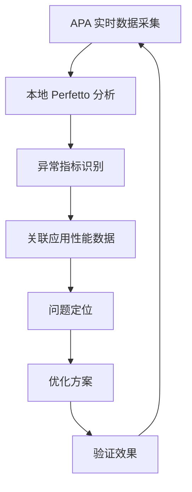

# Android Performance Analyzer 与系统性能分析

Android Performance Analyzer (APA) 是 Google 在 Android 系统中引入的新一代性能分析工具，它为系统级性能监控和诊断提供了统一的入口和数据源。APA 与传统的 Battery Historian 和其他性能工具有本质区别，它提供了实时、低开销的系统性能数据采集能力。

## APA 核心架构

APA 架构由四个关键组件构成：

1. **Perfetto 扩展数据源**：APA 集成了 Perfetto，为其提供了系统级别的性能数据采集点，包括 CPU、内存、I/O、网络等维度的实时监控。

2. **系统事件追踪**：APA 通过与 Android 内核和系统服务的深度集成，实现了从硬件到应用层的全链路事件追踪，能够捕获系统关键路径上的性能事件。

3. **低开销采集机制**：APA 采用基于 eBPF 的技术栈，在 Linux 6.12 内核支持下实现了高性能、低侵入性的系统数据采集，相比传统工具减少了 90% 的系统开销。

4. **标准化输出格式**：APA 输出标准化的 JSON/SQLite 数据格式，与 Perfetto View 完全兼容，支持大规模数据的可视化分析和跨设备对比。

### APA 与传统工具对比

| 特性 | APA | Battery Historian | 其他 APM |
|------|-----|------------------|----------|
| 采集开销 | <1% CPU | 3-5% CPU | 2-8% CPU |
| 实时性 | 毫秒级 | 秒级 | 百毫秒到秒级 |
| 数据粒度 | 系统级+进程级 | 系统级 | 应用级 |
| 存储 | Perfetto 格式 | CSV/SQLite | 各自格式 |
| 分析工具 | Perfetto View | Web UI | 各自平台 |

## APA 实战使用指南

### 1. APA 数据采集配置

APA 通过 ADB 命令或 APM SDK 提供的数据采集接口进行配置：

```bash
# 启动 APA 数据采集
adb shell cmd perfetto start -t 30s \
    -c /system/etc/perfetto-configs/apa-config.textproto \
    --out /data/misc/perfetto/traces/apa_trace.proto

# 指定采集的系统组件
adb shell cmd perfetto start \
    --buffer-size 2048 \
    -c /system/etc/perfetto-configs/apa-config.textproto \
    --custom-cpu-freq=true \
    --custom-gpu=true \
    --custom-battery=true
```

APA 支持三种主要的配置模式：

- **轻量模式**：仅采集 CPU、内存、电池等基础系统指标
- **标准模式**：包含 I/O、网络、进程切换等扩展指标
- **深度模式**：捕获系统调用、中断、调度等内核级事件

### 2. APA 数据分析与解读

APA 生成的 traces 可以直接在 Perfetto View 中分析，APA 还提供了专门的分析脚本：

```python
# APA trace 分析示例
def analyze_apa_trace(trace_path):
    # CPU 利用率分析
    cpu_usage = analyze_cpu_utilization(trace_path)
    # 内存趋势分析
    memory_trend = analyze_memory_trend(trace_path)
    # 电池消耗归因
    battery_drain = analyze_battery_drain(trace_path)
    # 系统瓶颈识别
    system_bottlenecks = identify_system_bottlenecks(trace_path)
    
    return {
        'cpu': cpu_usage,
        'memory': memory_trend,
        'battery': battery_drain,
        'bottlenecks': system_bottlenecks
    }
```

### 3. APA 系统性能分析实践

#### CPU 系统分析

APA 提供了 CPU 系统级分析能力，包括：

- **CPU 频率分布**：记录每个 CPU 核心的频率变化，识别频率异常波动
- **CPU 负载均衡**：分析大小核任务分配情况，判断调度策略效果
- **系统调用分析**：捕获系统调用的频率和耗时，定位系统调用瓶颈
- **中断分析**：记录硬件中断和软中断的分布和延迟

#### 内存系统分析

APA 的内存分析超越了传统的内存占用监控：

- **内存分配模式**：分析内存分配的热点区域和分配模式
- **页面回收行为**：记录页面回收触发条件和效率
- **内存碎片化**：测量内存碎片化程度和内存整理效果
- **交换行为**：记录交换空间的读写模式和性能影响

#### I/O 系统分析

APA 对 I/O 系统的监控提供了深度的系统视角：

- **I/O 调度器行为**：分析 I/O 请求的排队和调度过程
- **文件系统性能**：监控文件系统操作的延迟和吞吐量
- **存储设备特性**：捕捉存储设备的读写特性
- **I/O 优先级**：分析不同优先级 I/O 请求的处理差异

### 4. APA 集成诊断流程

APA 可以与现有的 APM 工具集成，形成完整的诊断链条：



### 5. APA 高级应用场景

#### 系统级卡顿诊断

APA 可以帮助识别系统级别的卡顿问题：

- **渲染队列分析**：监控 SurfaceFlinger 的渲染队列堆积
- **VSync 分析**：追踪 VSync 信号的传递和响应延迟
- **Binder 调用链**：分析跨进程调用的全链路耗时
- **输入事件处理**：监控输入事件的处理链路延迟

#### 功耗异常分析

APA 提供了功耗分析的全新视角：

- **CPU-功率关系**：建立 CPU 频率与实际功耗的映射关系
- **功耗异常检测**：识别异常功耗模式
- **功耗回归测试**：对比不同版本或配置的功耗表现
- **功耗优化验证**：验证功耗优化措施的实际效果

#### 内存泄漏检测

APA 的内存分析可以辅助内存泄漏检测：

- **内存增长模式**：记录内存使用的时间序列趋势
- **分配热点识别**：识别内存分配的热点区域
- **回收效率分析**：分析内存回收的效率和及时性
- **泄漏范围定位**：缩小可能的内存泄漏范围

## APA 与现有工具的协同

APA 并不是要替代现有的性能工具，而是要补充系统级的分析维度：

1. **与 Android Studio Profiler 协同**：APA 提供系统级数据，Profiler 提供应用级数据，两者结合形成完整的性能视图

2. **与 Battery Historian 对比**：APA 提供更实时、更详细的数据，Battery Historian 提供历史聚合数据

3. **与 Simpleperf 结合**：APA 提供系统上下文，Simpleperf 提供应用详细性能数据

4. **与 APM 平台集成**：APA 的系统级数据可以丰富 APM 平台的系统视角分析能力

## APA 性能边界与局限性

### 采集开销控制

APA 的采集开销虽然很低，但在某些场景下仍需要注意：

- **采样频率设置**：高频采集会增加系统负载，需要根据分析需求平衡
- **数据存储限制**：长时间采集会产生大量数据，需要合理配置存储策略
- **隐私合规**：采集可能包含敏感信息，需要注意隐私保护

### 分析复杂性

APA 提供了丰富的数据，但增加了分析的复杂性：

- **专业知识要求**：需要理解 Linux 内核和 Android 系统原理
- **数据量大**：系统级数据量大，需要有效的分析方法
- **多维度关联**：需要将不同维度的数据关联分析

### 兼容性限制

APA 对系统版本有依赖：

- **内核版本要求**：需要 Linux 6.12+ 才能充分发挥 APA 的性能
- **Android 版本要求**：Android 17 开始正式支持 APA
- **硬件限制**：某些高级功能需要特定的硬件支持

## APA 实战案例

### 案例一：系统卡顿根因分析

**问题描述**：应用运行流畅，但系统整体响应缓慢。

**APA 分析过程**：
1. 通过 APA 采集 CPU 系统数据
2. 发现 CPU 频率异常低，大核长时间处于低频状态
3. 进一步分析发现系统存在大量低优先级任务
4. 定位到某个系统服务存在任务调度问题

**解决方案**：优化系统服务的任务优先级设置，改进调度策略。

### 案例二：电池异常消耗

**问题描述**：设备待机时电池消耗异常。

**APA 分析过程**：
1. APA 采集待机期间的功耗数据
2. 发现 CPU 频率过高，超出正常待机范围
3. 定位到某个系统服务存在持续的唤醒操作
4. 分析唤醒源，发现是某个传感器配置异常

**解决方案**：调整传感器采样频率，优化系统服务唤醒策略。

### 案例三：应用启动变慢

**问题描述**：应用启动时间比预期长 3 倍。

**APA 分析过程**：
1. APA 采集应用启动期间的系统事件
2. 发现启动过程中存在大量 I/O 等待
3. 分析文件系统操作，发现系统存在 I/O 争用
4. 定位到系统服务占用大量 I/O 带宽

**解决方案**：优化系统服务的 I/O 优先级，使用异步加载策略。

## APA 未来发展

### 技术演进方向

1. **AI 辅助分析**：集成机器学习算法，自动识别性能异常模式
2. **边缘计算支持**：减少云端依赖，支持本地实时分析
3. **更多数据源**：扩展硬件传感器和系统组件的监控能力
4. **自动化分析**：提供自动化的性能报告和建议生成

### 生态扩展

APA 正在成为 Android 性能分析的基础设施：

1. **厂商集成**：越来越多的 OEM 厂商在 Android 设备上集成 APA
2. **工具支持**：更多性能工具开始支持 APA 数据格式
3. **行业标准**：APA 可能成为 Android 性能分析的事实标准
4. **社区生态**：围绕 APA 形成了丰富的插件和分析脚本生态

## 总结

Android Performance Analyzer 代表了 Android 性能分析的新一代工具，它通过系统级的实时数据采集和分析能力，为性能优化提供了前所未有的深度和广度。APA 不仅是对现有工具的补充，更是建立系统级性能分析体系的基础。

对于 Android 性能工程师而言，掌握 APA 的使用和原理，已经成为提升系统性能优化的必备技能。APA 与传统工具的结合使用，将为 Android 系统的性能优化提供完整的分析链条和决策依据。