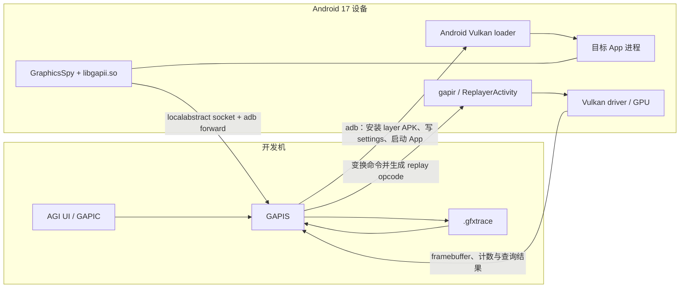

# 14.18 Android 17 AGI Frame Profiler gapii Spy 架构与单帧 GPU 捕获机制

## 14.18.1 版本边界：Android 平台与 AGI 工具分开锚定

Android GPU Inspector（AGI）不是 `android-17.0.0_r1` 平台源码中的系统组件。该 tag 的 AOSP manifest 没有 `external/android-gui`、`gapii` 或 `gapis` project；AGI 在独立的 [`google/agi`](https://github.com/google/agi) 仓库和发布渠道中维护。因而，“Android 17 上使用 AGI”要拆成两条可核验基线：

- 设备侧 Vulkan layer 发现、加载和安全条件，以 AOSP `android-17.0.0_r1` 为准；
- gapii、gapis、gapir、gapidapk 与 `.gfxtrace` 的工具实现，以明确的 AGI release 或 commit 为准。

截至 2026 年 7 月 29 日，GitHub Releases 的最新稳定版仍是 AGI `v3.3.3`，对应 commit `5f97b4fd99a9459320b782203ce2de5351a1e661`，发布于 2025 年 1 月 20 日。工具内部实现以这个 release commit 为准，当前支持流程则以更新至 2026 年 5 月 19 日的 Android Developers 文档为准。AGI 二进制版本和 Android OS 版本互相独立；复现实验时应同时记录二者。

当前官方 quickstart 要求受支持的物理设备运行 Android 11 或更高版本，Android Emulator 不受支持。历史 AGI release 对 Android 10 的兼容记录不能代替当前工具验证；在 Android 17 上也要经过 AGI 的 device validation，支持状态由 OS、GPU 与 driver 共同决定。

## 14.18.2 System Profile 与 Frame Profile 解决不同问题

AGI 提供 System Profile 与 Frame Profile，两者的数据来源和分析尺度不同。

| 模式 | 设备侧主要机制 | 输出关注点 | 适合回答的问题 |
| --- | --- | --- | --- |
| System Profile | Perfetto、系统和厂商 producer | CPU 调度、GPU queue、频率、counter、内存、功耗等时间线 | 某段卡顿期间 CPU、GPU 与系统服务怎样互相影响 |
| Frame Profile | GraphicsSpy Vulkan layer、gapii、gapis、gapir | 一帧附近的 API 调用、资源、pipeline state、framebuffer 与 render pass 性能 | 某个 draw、shader、纹理或 render pass 为什么昂贵或结果异常 |

gapii 属于 Frame Profile 的 API 拦截链路，不是低开销的持续系统监控器。它要进入目标进程、记录 API 参数和内存观察，还可能序列化捕获开始时的完整 Vulkan 状态，开销远高于常规 Perfetto trace。长时趋势、调度关系和整机 GPU counter 应优先使用 System Profile；命令级状态与资源检查才进入 Frame Profile。

Android Developers 当前还建议新的系统分析优先评估 Android Performance Analyzer（APA）。这不改变 Frame Profile 的用途，也不能把 APA 描述成只分析 Java/Kotlin 的工具。

下面的关系图把 Frame Profile 的主机端和设备端组件放在同一条链路中：



图中的 GraphicsSpy 与 `libgapii.so` 都加载在目标 App 进程内；GAPIS 和 UI 位于开发机；gapir 在 Android 设备上执行重放。主机负责解析和生成 replay payload，不会用开发机 GPU 代替目标设备驱动重放。

## 14.18.3 Android 17 怎样把 GraphicsSpy 放进目标进程

### Android 设备使用 global settings，不依赖 `VK_LAYER_PATH`

桌面 Vulkan loader 常通过 `VK_LAYER_PATH` 搜索 layer，Android 的应用注入路径不同。AGI `gapii/client/adb.go` 会安装与目标 ABI 对应的 gapid APK，再调用 `core/os/android/layers.go` 写入四个 global settings：

```shell
adb shell settings put global enable_gpu_debug_layers 1
adb shell settings put global gpu_debug_app com.example.game
adb shell settings put global gpu_debug_layer_app com.google.android.gapid.arm64v8a
adb shell settings put global gpu_debug_layers GraphicsSpy
```

这些键分别开启调试 layer、限定目标 package、指定提供 layer 的 APK、选择 layer 名。AGI 会在正常清理路径删除设置；若采集进程异常退出，应手动检查并清除，避免后续启动继续加载 layer。

AOSP Android 17 的 `frameworks/native/vulkan/libvulkan/layers_extensions.cpp` 列出了可使用调试 layer 的条件：

- 目标 App 可调试；
- 或系统为可 root 的 userdebug 构建；
- 或 targetSdk 不低于 30 的 App 在 manifest 声明 `com.android.graphics.injectLayers.enable=true`。

AGI 官方支持流程仍要求目标 App 设置 `android:debuggable="true"`。平台允许的其他入口不代表 AGI 对任意生产 App 提供受支持的抓帧能力。

### GraphicsSpy 是 wrapper，拦截实现位于 libgapii

AGI 源码中的 `GraphicsSpyLayer.json` 描述 layer 名 `GraphicsSpy` 及其函数映射，供使用 JSON manifest 的 loader 环境识别。Android 的 gapid APK 同时打包 `libVkLayer_GraphicsSpy.so` 与 `libgapii.so`；AOSP loader 从 layer APK 的 native library path 发现前者，并按 layer 名解析 `GraphicsSpyGetInstanceProcAddr` / `GraphicsSpyGetDeviceProcAddr`。wrapper 随后以 `dlopen()` 加载同目录的 `libgapii.so`，把函数查询转交给 `gapid_vkGetInstanceProcAddr` 与 `gapid_vkGetDeviceProcAddr`。

这条路径解释了两个常见现象：

- layer APK 的 ABI 必须与目标进程 ABI 匹配；
- App 能启动但没有捕获数据时，要分别检查 layer 是否被 loader 发现、`libgapii.so` 是否加载、gapii 是否建立 socket。

### `debug.agi.procname` 只选择进程名

layer 设置以 package 为单位。某些游戏会在包内启动独立的渲染进程，AGI 用私有系统属性 `debug.agi.procname` 指定要捕获的进程名。`Spy::Spy()` 会读取当前进程名并与该属性比较；属性为空时接受任意进程，名称不匹配时创建 `NullWriter`，不会与主机建立抓帧连接。

它不是同时接受 PID、package 和进程名的通用平台接口。package 由 `gpu_debug_app` 选择，进程由 `debug.agi.procname` 进一步过滤，PID 只用于 AGI 在启动后确认进程已经出现。

## 14.18.4 gapidapk 不是持续采集 GPU 数据的 AIDL 服务

AGI 为不同 ABI 准备独立 package，例如：

- `com.google.android.gapid.arm64v8a`
- `com.google.android.gapid.armeabiv7a`

公开源码中的 gapid APK 包含以下角色：

| 组件 | 职责 |
| --- | --- |
| `libVkLayer_GraphicsSpy.so` / `libgapii.so` | 作为 Vulkan layer 注入目标 App 并捕获调用 |
| `ReplayerActivity` + `libgapir.so` | 在设备上承载 GPU replay |
| `DeviceInfoService` | 通过 local abstract socket 向主机返回设备信息 |
| `PackageInfoService` | 枚举可捕获 package、activity、ABI 等信息 |
| `VkSampleActivity` | AGI 自带的 Vulkan 验证样例 |

`DeviceInfoService` 与 `PackageInfoService` 是前台 `IntentService`，服务的是设备探测和 package 枚举。抓帧数据不经过一个名为 `com.google.android.gapid` 的 AIDL capture service；gapii 在目标进程内监听 local abstract socket，开发机通过 adb forward 连接。

源码也没有支持“AI 压缩算法、GPU 数据加密存储、动态采样率或 GPU 访问审计日志”这些描述。安全边界应回到 Android 的 debuggable 状态、Vulkan layer 注入条件、adb 授权、layer package 与目标 package 选择。

## 14.18.5 一帧捕获从连接到结束发生了什么

AGI 开发文档把 Vulkan Frame Profile 的主要步骤写得很具体：

1. GAPIS 安装 gapid APK、设置 Vulkan layer、配置 `debug.agi.procname`，然后启动目标 activity。
2. 目标进程加载 GraphicsSpy 与 `libgapii.so`。gapii 在 Android local abstract namespace 监听 `gapii` socket，并发送五字节握手 `"gapii"`。
3. GAPIS 经 adb forward 连接该 socket，校验五字节握手后发送 version 4 的 connection header。该连接头使用小端编码，包含 `spy0` magic、观察频率、起始 frame、捕获 frame 数、API bitmask，以及延迟开始、关闭 buffering、记录时间戳等 flags。
4. 手动模式下，gapii 先保持 suspended；用户点击 Start 后，GAPIS 发出 start message。
5. gapii 等当前 frame 结束，在捕获边界序列化 Vulkan 初始状态与 GPU buffer，随后记录目标 frame 的 API 调用和相关内存观察。
6. frame 结束时 gapii 发送 end message，GAPIS 停止写入 `.gfxtrace`。

官方 UI 还提供 Beginning、Manual、Time 与 Frame 等启动方式。它们决定何时进入捕获窗口，不会把 Frame Profile 变成常驻 GPU telemetry 服务。

### buffering 选项的取舍

`Disable Buffering` 会让数据更及时地离开目标进程。它适合排查采集期间崩溃，因为崩溃前已经序列化的数据更有机会保留下来；代价是更高的运行期开销。普通抓帧保留 buffering，遇到“抓帧导致 App 崩溃且文件为空”时再用该选项缩小问题范围。

### 多线程捕获不等于确定性的时序重放

`.gfxtrace` 可以包含多个线程的 API 调用，ProtoPack object group 也可能交错。捕获器会记录调用和内存观察，但这不保证所有未显式同步的竞态都能稳定复现。Vulkan 应用在抓帧前应通过 validation layer，资源生命周期、host memory 修改和 queue 同步要符合 API 约束。

## 14.18.6 `.gfxtrace` 的内容与边界

正确扩展名是 `.gfxtrace`。AGI `v3.3.3` 使用自定义 ProtoPack v2 容器封装 protobuf message，而不是普通的“一个 protobuf 文件”。

ProtoPack 头部 magic 为：

```text
ProtoPack\r\n2.0\n\0
```

后续是变长 chunk。chunk 可以是类型定义，也可以是带 parent 关系的对象实例，因此文件能够携带自描述的 protobuf 类型。这个结构不自动保证随机访问、差分编码、压缩块或损坏恢复；没有源码证据时不应添加这些属性。

一份 Vulkan `.gfxtrace` 通常包含：

- trace `Header` protobuf：格式版本、设备、ABI 与捕获开始时间；
- 捕获开始时的 `GlobalState` 和初始内存观察；
- Vulkan command 及参数、返回值；
- driver 在命令前可能读取、命令后可能写入的 memory observation；
- buffer、texture 等资源 bytes；
- 捕获期间产生的 trace message。

AGI 自带的 CLI 可以把 ProtoPack 内容展开检查。下面的命令用于判断文件是否至少能被当前版本解析：

```shell
gapit unpack -verbose capture.gfxtrace
```

输出会列出 header、global state、resource、observation 和 command group。它适合验证文件结构，不提供 GPU 时间线或 render pass 成本结论。

### 捕获文件不具备跨设备可移植性承诺

Android Developers 的 Vulkan 工具文档明确提醒，图形 trace 不能假设能跨 OS 版本、芯片组或驱动版本重放。API state 可以在主机端解析，GPU 执行结果仍依赖重放设备及其 driver。分享问题时应同时保存：

- AGI 版本与 `.gfxtrace`；
- Android build fingerprint、API level；
- GPU 型号与 driver 版本；
- 目标 App 版本、ABI、所用 Vulkan extension；
- 捕获时是否经 ANGLE、是否启用 validation layer。

## 14.18.7 GAPIS 与 GAPIR 各自负责什么

### GAPIS：解析、状态演算与 replay 生成

GAPIS 运行在开发机。它把 `.gfxtrace` 解析为 `GraphicsCapture`，其中包含 header、initial state、command 列表和 memory observation。GAPIS 可用生成的 `mutate` 逻辑在 CPU 上演算某条命令后的 Vulkan API state，因此查看“此时绑定了哪个 pipeline、有哪些 image”不一定要启动 GPU replay。

draw call 对 framebuffer 的像素影响无法只靠状态演算得到。需要图像、指定 draw 后的 render target 或 GPU 性能数据时，GAPIS 会：

1. 选取并变换要执行的命令；
2. 为重建初始状态生成必要命令；
3. 把命令转为 GAPIR 虚拟机 opcode；
4. 把 payload 和资源引用交给设备侧 GAPIR。

### GAPIR：在目标设备 driver 上执行

GAPIR 是面向图形 replay 的栈式虚拟机。Android 上的 `ReplayerActivity` 加载 `libgapir.so`，GAPIR 按 opcode 调用 Vulkan driver，并把 framebuffer、查询或 profiling 结果返回 GAPIS。

资源不会全部预先塞进 replay payload。GAPIR 按需向 GAPIS 请求 resource，并在设备端维护 cache；这减少重复 replay 时经 adb 传输同一纹理和 buffer 的次数，也避免一次占满设备内存。

### `replay2` 与 GFXReconstruct 不属于已验证主链路

AGI `v3.3.3` 的 `replay2/` 目录包含 handle remapper、memory remapper、replay context 等基础模块，公开源码没有把它描述为 Frame Profiler 的完整执行引擎。AGI 的 `DEVDOC.md` 仍把生产链路写成 GAPIS 生成 opcode、GAPIR 执行。

GFXReconstruct 是另一个开源 capture/replay 项目。AGI 当前公开文档和上述源码没有把它列为 `.gfxtrace` 的采集器，也没有“GFXReconstruct 生成命令流、replay2 在主机端执行”的链路证据。排查代码时不要把三个项目的名词混在一起。

## 14.18.8 OpenGL ES 通过 ANGLE 进入 Frame Profile

AGI 官方 Frame Profile 入口区分：

- Vulkan：直接捕获应用的 Vulkan 调用；
- OpenGL on ANGLE：使用 AGI 提供的 custom ANGLE，把 OpenGL ES 调用转换成 Vulkan，再捕获转换后的 Vulkan 命令。

所以，OpenGL on ANGLE 的 trace 描述的是 ANGLE 生成的 Vulkan workload。它适合观察转换后的 render pass、pipeline、resource 与 GPU 成本，但不能当作原始 GLES driver 调用序列。ANGLE 自身的转换、shader translation 和状态管理开销也进入被测路径。

当前 AGI 源码文档写明工具主线只支持 Vulkan；这与官方 UI 的 OpenGL on ANGLE 说明一致。没有证据支持“gapii 直接替换全部 GLES 2.0/3.x 函数”或“ANGLE D3D11 on Vulkan”这类 Android 描述。Android 上的 ANGLE 后端是 Vulkan 方向，D3D11 属于其他平台语境。

## 14.18.9 Frame Profiler 能展示什么，不能由什么推导

官方 Frame Profiler UI 提供 Commands、Framebuffer、Geometry、Memory、Performance、Pipeline、Shader、State、Textures 与 Report 等视图。这些视图来自 capture state、resource 和必要的设备 replay。

分析时可按以下顺序收敛：

1. 在 Commands 与 frame timeline 找到耗时 render pass 或 draw。
2. 检查 render target 尺寸、load/store、resolve 和 attachment 数量。
3. 查看 pipeline、blend、depth/stencil、vertex input 与 descriptor 绑定。
4. 核对 shader、纹理尺寸、采样方式和资源生命周期。
5. 结合目标 GPU 的 counter 判断瓶颈更接近算术、纹理、带宽或几何阶段。
6. 回到 System Profile 验证该帧是否同时受到 CPU 提交、调度、频率或其他进程干扰。

### Frame Profile 的终点早于 display present

Frame Profile 可以记录应用的 `vkQueuePresentKHR()`，但这条 API 调用仍位于 Producer 侧。调用返回以后，GPU 工作可能尚未完成；buffer 还要经过 producer completion fence、BufferQueue、SurfaceFlinger latch、HWC/RenderEngine composition 与 display present。`.gfxtrace` 的命令和资源足以重放应用 GPU 工作，不包含一次真实显示周期里所有 SurfaceFlinger layer、HWC plane 决策和 present fence。

这几类证据在一次完整诊断中的位置如下：

| 证据 | 覆盖范围 | 不能替代的后续证据 |
| --- | --- | --- |
| AGI Commands / Pipeline / Shader / Texture | App graphics API、pipeline state、资源与 replay 结果 | GPU 完成、buffer 被系统采用、display present |
| AGI Performance | replay 设备上被分析的 render event 与 GPU 性能数据 | 原始运行时的 CPU 调度、其它进程和整屏 HWC 条件 |
| Producer completion fence、`queueBuffer` | App buffer 何时可供 Consumer 读取及何时进入队列 | SurfaceFlinger 是否在目标周期选择该 buffer |
| layer trace、FrameTimeline、composition type | buffer/layer 选择、App/SF 时序与 DEVICE/CLIENT 决策 | draw 内部的 shader、pipeline 和资源原因 |
| present fence | Android 显示栈的一次 present 边界 | panel 光学响应和用户视觉感知 |

显示路径还有两个使用限制：

- 游戏可能已有多帧处于 in-flight 状态。抓到的 API frame 很重，不能据此断言它就是用户看到的那一帧；需要用 frame id、present id、buffer、latch 与 present 建立关系。
- SurfaceFlinger 把目标 layer 改为 CLIENT composition 时，RenderEngine 会在应用 GPU 工作之外增加 client target 工作。单看应用 `.gfxtrace` 会漏掉这段系统 GPU 成本。

因此，更稳妥的工作流是：用 System Profile、Perfetto 或 APA 锁定异常 display frame 和主体 Surface；确认瓶颈落在应用 GPU 区间后，再抓取相同场景的 Frame Profile；修改 shader、render pass 或资源后，回到系统时间线验证 producer fence、latch 与 present 是否一起改善。OpenGL on ANGLE 还要保留“转换后的 Vulkan workload 与原 GLES driver 路径不同”这一实验变量。

Frame Profile 能提供单帧内部证据，不会自动给出跨设备通用阈值，也没有可核验的 Android 17“机器学习性能预测、AI 异常检测、云端趋势分析或 Sokatoa 扩展”。涉及这些能力时必须给出独立产品文档、版本和可复现实验。

## 14.18.10 常见失败怎样定位

### App 启动后没有 gapii 连接

按链路逐项检查：

- 目标 App 是否 debuggable；
- `gpu_debug_app` 是否为正确 package；
- `gpu_debug_layer_app` 是否安装且 ABI 匹配；
- `gpu_debug_layers` 是否包含 `GraphicsSpy`；
- 实际绘制发生在哪个进程，`debug.agi.procname` 是否写成完整进程名；
- `adb forward` 与 local abstract `gapii` socket 是否建立；
- logcat 是否出现 Vulkan loader、`GraphicsSpy`、`libgapii.so` 的加载错误。

### 能连接但抓帧为空

检查选择的 API 模式。原生 Vulkan 应使用 Vulkan；GLES 应使用 OpenGL on ANGLE。还要确认触发窗口内确有 present/frame boundary，目标进程没有在 Start 前退出。

### replay 与原画面不同或崩溃

检查：

- validation layer 是否报告错误；
- trace 使用的 extension 是否受 AGI 支持；
- replay 设备、OS、GPU driver 是否与 capture 环境一致；
- App 是否依赖未记录的外部资源、竞态或未声明同步；
- ANGLE 路径是否改变了原 GLES workload。

`Include Unsupported Extensions` 只会允许继续尝试。官方文档明确提示，启用后 replay 仍可能出现细微错误或崩溃。

### 清理残留设置

手工调试或 AGI 异常退出后，可清理下面这些键：

```shell
adb shell settings delete global enable_gpu_debug_layers
adb shell settings delete global gpu_debug_app
adb shell settings delete global gpu_debug_layer_app
adb shell settings delete global gpu_debug_layers
adb shell settings delete global angle_debug_package
adb shell settings delete global angle_gl_driver_selection_values
adb shell settings delete global angle_gl_driver_selection_pkgs
adb shell setprop debug.agi.procname ""
```

这三个 `angle_*` 键只与 OpenGL on ANGLE 抓帧有关；原生 Vulkan 抓帧通常不会设置它们。清理后重启目标 App，再用 `settings get global ...` 和 `getprop debug.agi.procname` 确认没有残留。global settings 会跨重启保存，遗留的 layer 或 ANGLE 配置可能继续影响同包进程。

## 14.18.11 源码与官方文档索引

### Android 17 平台侧

- [AOSP `android-17.0.0_r1` manifest](https://android.googlesource.com/platform/manifest/+/android-17.0.0_r1/default.xml)
- [Vulkan layer 发现、注入条件与 global settings](https://android.googlesource.com/platform/frameworks/native/+/android-17.0.0_r1/vulkan/libvulkan/layers_extensions.cpp)

### AGI `v3.3.3` 工具侧

- [AGI `v3.3.3` release](https://github.com/google/agi/releases/tag/v3.3.3)

仓库同时存在名为 `v3.3.3` 的 branch 和 tag，且两者当前指向不同对象。下面的源码链接固定到 release tag 对应的完整 commit，避免短引用被解析到同名 branch：

- [AGI 开发文档：Life of a gfxtrace](https://github.com/google/agi/blob/5f97b4fd99a9459320b782203ce2de5351a1e661/DEVDOC.md)
- [Android 抓帧启动与 `debug.agi.procname`](https://github.com/google/agi/blob/5f97b4fd99a9459320b782203ce2de5351a1e661/gapii/client/adb.go)
- [Android Vulkan layer settings 写入与清理](https://github.com/google/agi/blob/5f97b4fd99a9459320b782203ce2de5351a1e661/core/os/android/layers.go)
- [GraphicsSpy layer manifest](https://github.com/google/agi/blob/5f97b4fd99a9459320b782203ce2de5351a1e661/gapii/vulkan/vk_graphics_spy/cc/GraphicsSpyLayer.json)
- [GraphicsSpy wrapper 加载 `libgapii.so`](https://github.com/google/agi/blob/5f97b4fd99a9459320b782203ce2de5351a1e661/gapii/vulkan/vk_graphics_spy/cc/layer.cpp)
- [gapii 进程选择、socket 与 capture 初始化](https://github.com/google/agi/blob/5f97b4fd99a9459320b782203ce2de5351a1e661/gapii/cc/spy.cpp)
- [gapii 主机连接与 capture protocol](https://github.com/google/agi/blob/5f97b4fd99a9459320b782203ce2de5351a1e661/gapii/client/capture.go)
- [`.gfxtrace` 解析与导出](https://github.com/google/agi/blob/5f97b4fd99a9459320b782203ce2de5351a1e661/gapis/capture/graphics.go)
- [ProtoPack v2 文件格式](https://github.com/google/agi/blob/5f97b4fd99a9459320b782203ce2de5351a1e661/core/data/pack/README.md)
- [GAPIR replay VM](https://github.com/google/agi/blob/5f97b4fd99a9459320b782203ce2de5351a1e661/gapir/README.md)
- [gapid APK manifest](https://github.com/google/agi/blob/5f97b4fd99a9459320b782203ce2de5351a1e661/gapidapk/android/apk/AndroidManifest.xml.in)
- [`replay2` 公开源码目录](https://github.com/google/agi/tree/5f97b4fd99a9459320b782203ce2de5351a1e661/replay2)

### 使用与边界

- [AGI quickstart](https://developer.android.com/agi/start)
- [AGI supported devices](https://developer.android.com/agi/supported-devices)
- [Frame profiling overview](https://developer.android.com/agi/frame-trace/frame-profiler)
- [分析高成本 render pass](https://developer.android.com/agi/frame-trace/renderpasses)
- [AGI troubleshooting](https://developer.android.com/agi/troubleshooting)
- [Android Vulkan 工具与 trace 可移植性说明](https://developer.android.com/games/develop/vulkan/tools-and-advanced-features)

## 14.18.12 小结

- Android 17 提供 Vulkan debug layer 的发现与安全机制；AGI 是独立版本化的开发工具，不能把 AGI 功能写成 Android 17 平台新增项。
- System Profile 走 Perfetto，Frame Profile 走 GraphicsSpy、gapii、`.gfxtrace`、GAPIS 与设备侧 GAPIR。
- Android 注入使用 `enable_gpu_debug_layers` 等 global settings；`VK_LAYER_PATH` 是桌面 loader 语境。
- gapii 在目标 App 进程捕获 Vulkan 调用，gapid APK 的前台 service 只负责设备和 package 信息。
- `.gfxtrace` 是 ProtoPack 封装的 protobuf object stream，包含初始状态、命令、资源和内存观察。
- GAPIS 在主机解析和生成 replay opcode，GAPIR 在 Android 设备 driver 上执行；图形 trace 没有跨 OS、GPU 和 driver 的可移植性保证。
- OpenGL ES Frame Profile 经 custom ANGLE 转成 Vulkan，分析结果对应转换后的 workload。
- Frame Profile 停在应用图形 API 与 replay 范围内，不能替代 producer fence、SurfaceFlinger latch、HWC composition 与 display present 的运行时证据。
- 公开主链路没有 GFXReconstruct、完整 replay2 引擎、Sokatoa 或 Android 17 AI 诊断功能的证据。
