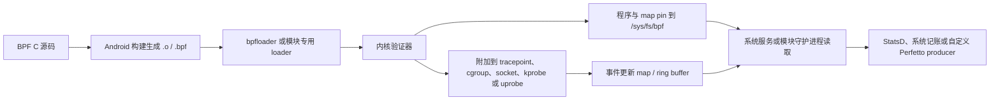

---

title: "eBPF/BPF 在 Android 性能分析中的应用"
chapter: "14.23"
section: "14.23"
status: "finalized"
applicable_versions: "Android 9 (API 28) - Android 17 (API 37)"
last_verified: "2026-06-14"
last_verified_against: "AOSP android-16.0.0_r4 (platform/system/bpf, packages/modules/UprobeStats, frameworks/native/services/gpuservice); Android common kernel android16-6.12 (include/linux/vmalloc.h, include/trace/events/syscalls.h); external/perfetto android-16.0.0_r4 (data_source_config.proto)"
confidence: medium
sources:
  - type: aosp
    path: "packages/modules/UprobeStats/src/bpf_progs/"
  - type: aosp
    path: "packages/modules/UprobeStats/src/UprobeStats.cpp"
  - type: aosp
    path: "packages/modules/UprobeStats/src/Bpf.cpp"
  - type: aosp
    path: "packages/modules/UprobeStats/src/Guardrail.cpp"
  - type: aosp
    path: "system/bpf/loader/bpfloader.rs"
  - type: aosp
    path: "packages/modules/Connectivity/bpf/progs/"
  - type: aosp
    path: "frameworks/native/services/gpuservice/bpfprogs/gpuMem.c"
  - type: aosp
    path: "external/perfetto/protos/perfetto/config/data_source_config.proto"
  - type: blog
    path: "Cubox/在 Android 中使用 eBPF：开篇-2022-06-12.md"
  - type: blog
    path: "Cubox/探索Android动态埋点的新视界：UprobeStats深度解析-2025-02-21.md"
  - type: blog
    path: "Cubox/基于eBPF的sched-ext会在产品成功的底层逻辑是什么-2025-10-18.md"
  - type: blog
    path: "Cubox/基于eBPF的CPU利用率精准计算小工具开发-2022-03-13.md"
  - type: official
    path: "kernel.org/doc/html/latest/scheduler/sched-ext.html"
  - type: official
    path: "source.android.com/docs/core/architecture/kernel/bpf"
  - type: research
    path: "intake/research-feeds/2026-04-02-15-ch05-sched-ext-bpf-android.md"
  - type: research
    path: "intake/research-feeds/2026-04-03-07-sched-ext-bpf-scheduler.md"
tags: [eBPF, BPF, observability, tracing, sched_ext, kernel, performance, bpfloader, UprobeStats]
related_chapters: ["14.2", "13.1", "5.1", "1.14"]
task6_state: "reviewed"
task9_state: "reviewed"
task2b_state: "fixed"
pipeline_stage: "ready-to-publish"
---


# 14.23 eBPF/BPF 在 Android 性能分析中的应用

eBPF 允许一段受验证器约束的程序在内核事件发生时执行。它能在调度、系统调用、网络、内存和用户态函数等位置采集上下文，再通过 map、ring buffer 或 perf buffer 把结果交给用户态。Android 已把它用于系统记账和诊断，但没有向普通应用开放通用的 BPF 加载接口。

平台基线是 Android 17 / API 37 / `android-17.0.0_r1`，内核源码基线是 `android17-6.18-2026-06_r6`。读源码时要把平台版本、设备内核和产品配置分开：平台仓库里存在某个程序，不等于任意 Android 17 设备都会加载它；内核仓库里存在某项能力，也不等于量产设备启用了对应 Kconfig。

## 先确认自己处在哪个权限层

Android 上讨论 eBPF 时，最容易漏掉权限前提。同一段 BPF C 代码在 AOSP 系统组件、root 调试环境和普通应用里，结论完全不同。

| 使用层级 | 能做什么 | 常见入口 | 约束 |
|---|---|---|---|
| AOSP 平台或 vendor 组件 | 随系统构建 BPF 对象，由启动阶段的 loader 加载、pin 和附加 | `system/bpf`、`system/bpfprogs`、Connectivity、GPU Service | 需要产品构建、SELinux、UID/GID、内核版本和程序元数据配合 |
| userdebug / eng / root 设备 | 检查已 pin 的对象，使用内核工具做受控实验 | bpftool、tracefs、内核自带示例 | 量产 user build 往往缺少权限或工具，结果不能直接代表应用可部署能力 |
| 普通应用 | 读取公开 API 暴露的数据，或使用获准的系统分析工具 | Perfetto、simpleperf、Android Studio Profiler、ProfilingManager | 不能自行执行 `BPF_PROG_LOAD`、附加任意 kprobe/uprobe，也不能遍历系统 BPF map |

因此，应用性能排查通常从 Perfetto 或 simpleperf 开始。只有现有数据源回答不了问题，并且手里有系统镜像、模块接入点或受控 root 环境时，才需要编写新的 BPF 程序。

## Android 17 的加载与取数链路

一项 BPF 观测能力要经过构建、加载、附加和消费四段。下面的图用来标出各段的责任边界。



验证器负责检查控制流、指针访问、栈使用和 helper 调用等安全条件。验证通过只说明程序满足内核约束，不说明采样方案足够低开销，也不说明用户态有权限读取结果。

### bpfloader 在 Android 17 中做了什么

`platform/system/bpf` 的 Android 17 实现以 Rust 入口加载平台 libbpf 对象。`load_libbpf_progs()` 遍历内置文件描述，逐个打开对象、复用或创建 map、加载程序，并按元数据设置 pin 路径、所有者和权限。对象还可以声明内核版本范围、构建类型限制以及是否自动附加。

Rust 路径执行完成后，入口会创建 vendor pin 目录并调用 `vendorBpfLoader()`。这个函数来自旧 C++ loader。因此，Android 17 的准确描述是：

- 平台内置的 libbpf 对象由 Rust 路径处理；
- 旧 C++ 代码仍负责 legacy vendor BPF 对象；
- 两条路径都属于启动期的特权加载流程；
- `/sys/fs/bpf` 下的名称由对象前缀和元数据决定，不能假定所有版本都使用同一种扁平命名格式。

这也解释了为何把一个 `.o` 文件 push 到设备后通常无法加载。系统还要求构建规则、SELinux 规则、loader 清单、map 权限和兼容性声明。

### Android 17 已内置的几类程序

下表列出 `android-17.0.0_r1` 源码中有代表性的程序。设备能否看到相应 map 或事件，还取决于 loader 条件、内核 tracepoint 和厂商实现。

| 组件 | 附加位置或数据来源 | 输出 | 消费者或用途 |
|---|---|---|---|
| `timeInState.bpf` | `sched_switch`、`cpu_frequency`、`sched_process_free` | UID/TGID 在各 CPU 频率上的累计时间等 map | 电量与 CPU 时间记账 |
| `gpuMem.bpf` | `gpu_mem/gpu_mem_total` | 以 GPU ID 和 PID 组合键记录的 GPU 内存 | GPU Service |
| `gpuWork.bpf` | `power/gpu_work_period` | GPU 工作周期 map | GPU 能耗与工作量统计 |
| `bpfMemEvents.bpf` | OOM、回收、LMK 等内存事件 | 面向 AMS、lmkd 的 ring buffer | 内存压力诊断和策略 |
| Connectivity BPF | cgroup、socket、traffic-control 等网络 hook | 按 UID、tag、接口等维度的流量和策略 map | netd、NetworkStats、Connectivity |
| UprobeStats | 用户态 ELF 偏移对应的 uprobe | ring buffer、StatsD atom、bridge event | 受服务端配置控制的系统诊断 |

`timeInState.bpf` 并不生成 Perfetto 的调度时间线。它在调度事件发生时更新累计 map。Perfetto 的线程运行状态通常来自 ftrace 的 `sched_switch`、`sched_waking` 等事件，两者可以观察同一内核活动，但数据模型和消费者不同。

## Attach 点决定了 `ctx` 的结构

BPF 程序的 `ctx` 没有统一布局。section 名称、程序类型和目标事件共同决定参数怎么取。代码能通过 C 编译，不代表运行时布局正确。

| 附加方式 | section 示例 | `ctx` 的含义 | 适用场景 |
|---|---|---|---|
| 常规 tracepoint | `tracepoint/raw_syscalls/sys_enter` | 目标 tracepoint 的生成结构；该事件常见为 `trace_event_raw_sys_enter`，包含 `id` 和 `args[6]` | 需要稳定事件字段，接受 tracepoint 数据准备开销 |
| raw tracepoint | `raw_tracepoint/sys_enter` | `bpf_raw_tracepoint_args`；元素对应内核 tracepoint 原始原型 | 需要更低层的原始参数，代码必须理解该 tracepoint 的内核原型 |
| kprobe / kretprobe | `kprobe/vmalloc`、`kretprobe/vmalloc` | `pt_regs`，入口参数和返回值按目标架构 ABI 读取 | 内核函数级实验；符号、内联和版本变化都会影响稳定性 |
| uprobe / uretprobe | 由用户态二进制、偏移和 perf event 建立 | `pt_regs`，参数按用户态 ABI 读取 | native 函数入口/返回；需处理 ASLR、ELF 偏移和符号变化 |
| cgroup / socket / tc | 由具体 BPF program type 定义 | socket buffer、socket、cgroup 地址等专用上下文 | Android 网络统计和策略 |

### `raw_syscalls/sys_enter` 的两个名字不能混用

内核在 `include/trace/events/syscalls.h` 中把 `sys_enter` tracepoint 定义为两个原始参数：`struct pt_regs *regs` 和 syscall ID。常规 tracepoint 路径会进一步生成带 `id` 与 `args[6]` 的事件记录。

因此：

- `tracepoint/raw_syscalls/sys_enter` 可按生成的 tracepoint 结构读取 `id` 与 `args`；
- `raw_tracepoint/sys_enter` 的 `ctx->args[0]` 是 `pt_regs` 指针，`ctx->args[1]` 才是 syscall ID；
- 把 `SEC("tp/raw_syscalls/sys_enter")` 与 `bpf_raw_tracepoint_args` 拼在一起，会把两种 ABI 混成一段代码；
- raw tracepoint 中的 syscall 参数藏在寄存器上下文里，读取方式与 CPU 架构有关。

下面的片段只用来展示常规 tracepoint 的字段关系。map 定义、目标内核生成的 `vmlinux.h`、CO-RE 兼容处理和 Android 构建规则仍需由所在模块补齐。

```c
struct syscall_key {
    __u32 tgid;
    __u32 syscall_id;
};

struct {
    __uint(type, BPF_MAP_TYPE_HASH);
    __uint(max_entries, 1024);
    __type(key, struct syscall_key);
    __type(value, __u64);
} syscall_counts SEC(".maps");

const volatile __u32 target_tgid = 0;

SEC("tracepoint/raw_syscalls/sys_enter")
int count_syscalls(struct trace_event_raw_sys_enter *ctx)
{
    __u64 pid_tgid = bpf_get_current_pid_tgid();
    __u32 tgid = pid_tgid >> 32;
    __u64 initial = 1;
    __u64 *count;
    struct syscall_key key = {
        .tgid = tgid,
        .syscall_id = (__u32)ctx->id,
    };

    if (target_tgid && target_tgid != tgid)
        return 0;

    count = bpf_map_lookup_elem(&syscall_counts, &key);
    if (count)
        __sync_fetch_and_add(count, 1);
    else
        bpf_map_update_elem(&syscall_counts, &key, &initial, BPF_NOEXIST);

    return 0;
}
```

这里把上 32 位命名为 `tgid`。需要当前线程时，应把返回值截断到低 32 位并命名为 `tid`。Linux 用户态常把 TGID 叫作进程 ID，把 TID 叫作线程 ID。若把 `bpf_get_current_pid_tgid() >> 32` 笼统命名为 `pid`，短代码看似无害，后续做线程级关联时很容易用错。

### kprobe 与 kretprobe 需要成对保存上下文

kprobe 入口能看到函数参数，kretprobe 返回点能看到返回值。返回点不能自动取回入口参数。若要计算一次调用的耗时或把 `vmalloc(size)` 的 size 与返回地址关联，需要在入口写入临时 map，在返回点按当前 TID 取出并删除。

这类程序还要处理几项边界：

- 同一线程可能发生嵌套调用，单值 map 会覆盖上一层；
- 函数可能被内联、换名或改成 wrapper，kprobe 名称不属于稳定 Android API；
- `pt_regs` 的取参宏依赖目标架构；
- 入口有记录、返回点丢事件时，临时 map 会残留；
- 量产设备可能禁止相应 attach 操作。

对内存问题，先检查平台已有的 OOM、vmscan、LMK、dma-buf、GPU memory 和 allocator 数据源。只有问题落在一个没有稳定 tracepoint 的内核函数里，才考虑 kprobe。

### uprobe 还要理解 ELF 与运行时

uprobe 附加的是文件偏移，不是源码函数名。调试脚本往往通过 ELF 符号把函数名换算成偏移，再用 `perf_event_open` 建立探针。到了 Android 系统进程，还会遇到 stripped symbol、APEX 路径、版本替换、ASLR、native bridge，以及 ART AOT/JIT 代码地址变化。

Android 17 的 UprobeStats 已经封装了不少危险细节。配置描述目标进程、探针和运行时长；守护进程解析目标方法对应的 ELF 偏移，建立 perf event，附加 BPF 程序并轮询 ring buffer。它还会检查配置冲突和资源限制，把结果写入 StatsD atom 或 bridge service event。

UprobeStats 在 API 37 上以 lazy Binder service `uprobestats_service` 运行。init service 仍带 `disabled`、`oneshot` 属性：`oneshot` 描述进程退出后的 init 行为，不能据此推导成“只读一次配置文件、没有服务”。兼容 API 37 以前的路径时，代码才会回退读取 `/data/misc/uprobestats-configs/config`。

UprobeStats 面向平台控制的系统诊断，不是供第三方应用任意插桩的 SDK。它附带的 `SYS_ADMIN`、`PERFMON` capability、专用 UID/GID 和 SELinux 策略也说明了这一点。

## 五类常见问题该怎样选观测点

### CPU 时间与调度延迟

`timeInState.bpf` 适合系统做累计记账，问题通常是“某 UID 在各频率上累计运行了多久”。它监听 `sched_switch`，根据当前 CPU 和频率更新 map；CPU 频率变化时，`cpu_frequency` 事件会更新频率索引。

线程为何晚被调度、一次 runnable 等了多久，则应采集 Perfetto 的 `sched_switch`、`sched_waking`、`sched_wakeup` 等 ftrace 事件。时间线保留事件顺序和线程状态，更适合定位抢占、CPU 饱和、优先级与 affinity 问题。

不要把 `/proc/stat` 描述成固定 10 ms 精度。它导出的计数单位与内核配置和字段语义有关，采样间隔由读者的轮询策略决定；它的问题主要是全局累计值难以还原短时线程调度因果。

### 系统调用频率与耗时

仅想知道某段操作发起了哪些 syscall，可在 Perfetto 中打开 `raw_syscalls/sys_enter` 和 `raw_syscalls/sys_exit`。需要按进程、syscall ID 做长期聚合，且 ftrace 数据量不可接受时，特权 BPF 程序可以在内核里先过滤、计数。

系统调用延迟必须关联 enter 与 exit。键至少要包含 TID，退出、信号、重入和 map 容量也要纳入设计。对所有进程采集六个参数再送入 ring buffer，通常会制造大量无用数据；把 TGID、UID、cgroup 或 syscall ID 过滤放到内核侧更合适。

### GPU 内存

Android 17 的 `gpuMem.bpf` 挂在 `gpu_mem/gpu_mem_total` tracepoint。map 的 64 位键由 GPU ID 放在高 32 位、PID 放在低 32 位，值是该组合的总字节数；事件报告 size 为 0 时删除对应键。

这里有两个前提：

1. GPU 驱动必须发出 `gpu_mem_total` tracepoint；
2. 该数值代表驱动报告的 GPU 内存总量，不能直接当成 SurfaceFlinger layer 大小、进程 PSS 或某次渲染的瞬时分配。

如果要分析帧问题，应把 GPU memory、BufferQueue、FrameTimeline、GPU work period 和进程生命周期放在同一时间范围里看。单独一条内存 counter 无法证明卡顿因果。

### 网络流量与策略

Android 的网络 BPF 由 Connectivity/netd 体系管理。程序可以在 cgroup、socket 和 traffic-control 等位置统计 UID/tag 流量或执行策略，用户态服务读取 pin map 后形成 NetworkStats 等上层数据。

这套设施不能当成应用可复用的抓包 API。应用侧若要看请求时序，应使用网络库事件、Perfetto 已开放的数据源或受控代理；系统开发者排查计费和策略问题时，再去核对 Connectivity BPF 对象、map 和对应服务。

### 内存压力与分配异常

Android 17 平台已有面向 OOM、回收、LMK、dma-buf、GPU memory 和锁竞争等方向的 BPF 程序或 tracepoint。排查路径可以按问题层级选择：

| 现象 | 优先数据 |
|---|---|
| 应用 Java/Kotlin 堆增长 | heapprofd、Java heap dump、allocation sampling |
| native heap 增长 | heapprofd、malloc debug、LeakSanitizer 适用场景 |
| 系统内存压力、回收和 LMK | Perfetto memory/ftrace、lmkd/AMS 事件、`bpfMemEvents` 平台数据 |
| dma-buf 或图形缓冲增长 | dma-buf 统计、GPU memory、SurfaceFlinger/BufferQueue |
| 某个内核函数疑似泄漏 | 受控设备上的 tracepoint；没有稳定事件时再评估 kprobe |

eBPF 擅长在事件发生时带条件计数，但它不会自动理解对象所有权。泄漏结论仍要靠分配与释放配对、进程生命周期和上层资源语义证明。

## 与 Perfetto 的关系

在 Android 17 的 `external/perfetto` tag 中，`DataSourceConfig` 明确列出：

- `linux.ftrace` 对应 `ftrace_config`；
- `linux.perf` 对应 `perf_event_config`；
- 没有名为 `linux.ebpf` 的稳定专用配置字段或数据源。

因此，已有 tracepoint 能回答问题时，直接让 Perfetto 采 ftrace 更省事。下面的 prototext 用来采集调度与 syscall 事件，验证某个短时操作的系统调用和线程切换。

```protobuf
buffers {
  size_kb: 32768
  fill_policy: RING_BUFFER
}
data_sources {
  config {
    name: "linux.ftrace"
    ftrace_config {
      ftrace_events: "sched/sched_switch"
      ftrace_events: "sched/sched_waking"
      ftrace_events: "raw_syscalls/sys_enter"
      ftrace_events: "raw_syscalls/sys_exit"
      atrace_apps: "com.example.app"
    }
  }
}
duration_ms: 10000
```

这份配置会产生原始事件流，数据量可能很大。正式采集前应缩短时长、限定目标应用，并根据问题删掉不需要的 event。某些 user build 还会限制敏感 syscall 参数的可见性。

BPF map 或 ring buffer 不会自动出现在 Perfetto UI。若自研平台 BPF 程序需要进入 trace，用户态消费者还要完成一段桥接：

1. 读取 map 或轮询 ring buffer；
2. 保存内核时间戳、CPU、TGID/TID 和事件字段；
3. 通过自定义 Perfetto data source 或 TrackEvent 写入 trace packet；
4. 定义稳定的 track、counter 或 slice 语义；
5. 统计读取失败、ring buffer 满和用户态处理不及时造成的丢失。

写入 StatsD 也不等于写入 Perfetto。StatsD 适合聚合 atom 和设备侧指标，Perfetto 适合保留时间线。UprobeStats 可以上报 StatsD，是它自己的消费链路，不代表任意 BPF 程序都会获得同样集成。

## 开销不能用一个固定数字概括

BPF 程序运行在事件热路径上。开销由事件频率、指令数、helper、map 类型、锁竞争、跨 CPU 通信、栈回溯和输出量共同决定。把它写成“每秒几千次”或“亚毫瓦”没有通用依据。

评估一项探针时，应记录以下数据：

- 每秒触发次数，以及峰值而非只有平均值；
- 每次执行的 map lookup/update 次数；
- ring buffer 预留失败或 perf buffer 丢失计数；
- map 的最大条目数、淘汰策略和实际占用；
- 用户态消费者的 CPU 时间、唤醒频率和积压；
- 开启与关闭探针时，目标指标和整机功耗的 A/B 差异；
- verifier 日志、程序 JIT 状态和 attach 失败原因。

BPF ring buffer 在空间不足时，reserve 会失败，它不会阻塞等待消费者。程序若忽略返回值，trace 仍然能生成，但缺失事件可能让 enter/exit 配对、延迟分布和对象生命周期分析全部失真。

还有三类常见放大器：

- 在 `sched_switch`、syscall 或网络包等高频事件上输出每条记录；
- 对每个事件抓用户栈或内核栈；
- 使用全局热点 key，让多个 CPU 竞争同一个 map 条目。

减负手段包括尽早按 UID/TGID/cgroup 过滤、内核侧聚合、按 CPU map、有限采样和短采集窗口。优化以后仍需重新做 A/B 测量。

## sched_ext：内核具备能力不等于设备正在使用

`android17-6.18-2026-06_r6` 包含 `kernel/sched/ext.c` 和 `tools/sched_ext` 示例。sched_ext 允许 BPF 程序实现 `sched_ext_ops`，在运行时提供一套调度策略。它属于调度器扩展框架，与前文做观测和记账的 BPF 程序不同。

启用 sched_ext 至少要满足：

- 内核编译时打开 `CONFIG_SCHED_CLASS_EXT` 及相关 BPF 配置；
- 用户态 loader 成功加载并附加一套 scheduler ops；
- verifier、struct_ops 和运行时检查都通过；
- 产品策略允许该调度器运行。

当没有 BPF scheduler 加载时，系统仍由常规调度类工作。sched_ext 调度器发生错误或卡死时，内核可以卸载它并退回 fair scheduler。支持该接口的调试环境可从这些节点检查状态：

```text
/sys/kernel/sched_ext/state
/sys/kernel/sched_ext/root/ops
/sys/kernel/sched_ext/enable_seq
```

节点存在只能证明内核编译了相应接口。`state`、当前 ops 名称和系统行为一起，才能说明采集时是否有 sched_ext 调度器处于活动状态。Android 的 `system/bpf` bpfloader 负责平台和 vendor BPF 对象，不能据此推断它会加载 sched_ext scheduler。

## 版本演进应怎样写

版本历史适合帮助读者寻找源码，但不要把平台、Mainline 和内核三条时间线混成一条。

| Android 版本 | 可确认的方向 | 阅读时的边界 |
|---|---|---|
| Android 9–11 | 网络统计和策略逐步迁移到 BPF | 具体 hook 和旧 qtaguid 兼容路径随版本、内核而变 |
| Android 12–13 | CPU time-in-state、GPU memory 等系统记账场景扩展 | map 是否加载取决于设备内核与产品配置 |
| Android 14–16 | UprobeStats Mainline 模块、平台 BPF 程序继续扩展，Rust loader 路径逐步引入 | Mainline 版本可独立于完整 OTA 更新 |
| Android 17 / API 37 | 正式 tag 中可见 Rust 平台 loader、legacy vendor loader、lazy Binder UprobeStats，以及更完整的内存/GPU/CPU 程序集合 | 结论锚定 `android-17.0.0_r1`，不拿 main 分支代替 release tag |
| Android common 6.18 | sched_ext、ring buffer、BTF/CO-RE 等内核能力继续演进 | 内核 tag 不能代替设备 Kconfig 和 vendor kernel 验证 |

若一台 API 37 设备仍运行不同的 GKI 基线，或厂商移除了某个 tracepoint，平台源码里的 attach 方案可能无法工作。记录问题时应同时写下 build fingerprint、API level、`uname -r`、内核 config 来源和目标 tracepoint 是否存在。

## 一套可执行的选择顺序

遇到性能问题时，可以按下面的顺序缩小工具范围：

1. 写清要测的是累计量、时间线、采样热点，还是一次事件的参数。
2. 检查 Perfetto、simpleperf、heapprofd、系统 dumpsys 和平台现有 BPF map 是否已经提供答案。
3. 核对权限：普通应用、系统应用、root 调试还是自有系统镜像。
4. 对照目标设备的内核版本、Kconfig、tracefs 事件和 BTF，而不是只看 Android API level。
5. 优先选稳定 tracepoint；没有合适事件时，再评估 kprobe 或 uprobe 的版本成本。
6. 在内核侧设置最窄过滤条件和有界 map，显式记录丢事件。
7. 用已知负载验证字段语义，再做探针开关 A/B。
8. 若数据需要进入 Perfetto，单独设计用户态消费者和 trace schema。

工具之间的分工可以概括为：

| 问题 | 优先工具 | eBPF 介入条件 |
|---|---|---|
| UI 卡顿和跨进程时序 | Perfetto | 已有 ftrace/atrace 缺少某个内核上下文 |
| CPU 函数热点、PMU 事件 | simpleperf | 需要在特定内核事件上按条件聚合 |
| Java/native heap | heapprofd、heap dump、malloc 工具 | 需要关联内核回收、OOM 或系统级缓冲 |
| 网络请求时序 | 应用网络埋点、Perfetto | 系统网络统计或策略本身有问题 |
| 平台长期轻量记账 | 已有系统 BPF map | 自有系统组件有明确且稳定的新指标 |

## 常见误读

### “Android 17 有 eBPF，所以应用可以直接加载”

错误。平台 loader 和模块 loader 运行在特权域，普通应用没有等价入口。

### “pin 目录里有 map，说明对应程序正在正常采集”

不充分。map 可能来自启动期创建，程序可能附加失败、事件可能从未触发，消费者也可能没有权限。需要同时检查 program/link、attach 状态、map 更新和 loader 日志。

### “BPF 与 ftrace 挂同一个 tracepoint，Perfetto 就会显示 BPF 结果”

错误。Perfetto 采到的是 ftrace 事件；BPF 对事件做的聚合或额外输出需要独立消费者。

### “tracepoint 字段在所有内核版本都一样”

tracepoint 通常比函数符号稳定，但它不是 Android SDK API。自研程序仍应基于目标内核头文件或 BTF 构建，并验证字段和事件是否存在。

### “sched_ext 出现在 6.18 源码里，Android 17 就在使用 BPF 调度器”

错误。源码、Kconfig、产品启用和采集时活动状态是四项不同证据。

## 源码与官方文档

- [Android 17 bpfloader Rust 入口与平台对象清单](https://android.googlesource.com/platform/system/bpf/+/refs/tags/android-17.0.0_r1/loader/bpfloader.rs)
- [Android 17 timeInState BPF 程序](https://android.googlesource.com/platform/system/bpfprogs/+/refs/tags/android-17.0.0_r1/timeInState.c)
- [Android 17 GPU memory BPF 程序](https://android.googlesource.com/platform/frameworks/native/+/refs/tags/android-17.0.0_r1/services/gpuservice/bpfprogs/gpuMem.c)
- [Android 17 UprobeStats 设计与配置说明](https://android.googlesource.com/platform/packages/modules/UprobeStats/+/refs/tags/android-17.0.0_r1/README.md)
- [Android 17 UprobeStats 守护进程入口](https://android.googlesource.com/platform/packages/modules/UprobeStats/+/refs/tags/android-17.0.0_r1/daemon/uprobestats.rs)
- [Android 17 UprobeStats lazy service 配置](https://android.googlesource.com/platform/packages/modules/UprobeStats/+/refs/tags/android-17.0.0_r1/apex/UprobeStats-service-mainline.rc)
- [Android 17 UprobeStats 任务执行与 ring buffer 读取](https://android.googlesource.com/platform/packages/modules/UprobeStats/+/refs/tags/android-17.0.0_r1/daemon/android/task.rs)
- [Android 17 Perfetto DataSourceConfig](https://android.googlesource.com/platform/external/perfetto/+/refs/tags/android-17.0.0_r1/protos/perfetto/config/data_source_config.proto)
- [Android common 6.18 syscall tracepoint 定义](https://android.googlesource.com/kernel/common/+/refs/tags/android17-6.18-2026-06_r6/include/trace/events/syscalls.h)
- [Android common 6.18 sched_ext 实现](https://android.googlesource.com/kernel/common/+/refs/tags/android17-6.18-2026-06_r6/kernel/sched/ext.c)
- [Android common 6.18 sched_ext 示例](https://android.googlesource.com/kernel/common/+/refs/tags/android17-6.18-2026-06_r6/tools/sched_ext/)
- [Linux BPF ring buffer 文档](https://www.kernel.org/doc/html/latest/bpf/ringbuf.html)
- [Linux sched_ext 文档](https://docs.kernel.org/scheduler/sched-ext.html)
- [Android BPF loader 与平台使用说明](https://source.android.com/docs/core/architecture/kernel/bpf)
- [Android eBPF traffic monitor](https://source.android.com/docs/core/data/ebpf-traffic-monitor)

---

**延伸阅读**：[13.1 Perfetto 简介与演进](../ch13-perfetto/01-perfetto-intro.md) · [5.1 Linux 调度器原理](../../part1-fundamentals/ch05-cpu-power/01-linux-scheduling.md) · [15.7 AOSP 源码阅读方法](../ch15-methodology/07-aosp-reading.md)
