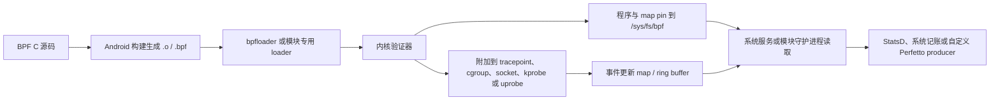

---

title: "eBPF/BPF 在 Android 性能分析中的应用"
chapter: "14.23"
section: "14.23"
status: "finalized"
applicable_versions: "Android 9 (API 28) - Android 17 (API 37)"
last_verified: "2026-08-14"
last_verified_against: "AOSP android-17.0.0_r1 (system/bpf, system/bpfprogs, system/memory/libmeminfo, packages/modules/UprobeStats, frameworks/native/services/gpuservice); Android common kernel android17-6.18-2026-06_r6 (include/trace/events/syscalls.h, kernel/sched/ext.c); external/perfetto android-17.0.0_r1 (data_source_config.proto)"
confidence: high
sources:
  - type: aosp
    path: "system/bpf/loader/bpfloader.rs"
  - type: aosp
    path: "system/bpfprogs/timeInState.c"
  - type: aosp
    path: "packages/modules/Connectivity/bpf/progs/"
  - type: aosp
    path: "frameworks/native/services/gpuservice/bpfprogs/gpuMem.c"
  - type: aosp
    path: "frameworks/native/services/gpuservice/gpuwork/bpfprogs/gpuWork.c"
  - type: aosp
    path: "system/memory/libmeminfo/libmemevents/bpfprogs/bpfMemEvents.c"
  - type: aosp
    path: "packages/modules/UprobeStats/README.md"
  - type: aosp
    path: "packages/modules/UprobeStats/daemon/uprobestats.rs"
  - type: aosp
    path: "packages/modules/UprobeStats/daemon/android/task.rs"
  - type: aosp
    path: "packages/modules/UprobeStats/apex/UprobeStats-service-mainline.rc"
  - type: aosp
    path: "external/perfetto/protos/perfetto/config/data_source_config.proto"
  - type: aosp
    path: "kernel/common/include/trace/events/syscalls.h (android17-6.18-2026-06_r6)"
  - type: aosp
    path: "kernel/common/kernel/sched/ext.c (android17-6.18-2026-06_r6)"
  - type: official
    path: "https://docs.kernel.org/scheduler/sched-ext.html"
  - type: official
    path: "https://source.android.com/docs/core/architecture/kernel/bpf"
  - type: research
    path: "intake/research-feeds/2026-04-02-15-ch05-sched-ext-bpf-android.md"
  - type: research
    path: "intake/research-feeds/2026-04-03-07-sched-ext-bpf-scheduler.md"
tags: [eBPF, BPF, observability, tracing, sched_ext, kernel, performance, bpfloader, UprobeStats]
related_chapters: ["14.2", "13.1", "5.1", "1.14"]
task6_state: "reviewed"
task9_state: "reviewed"
task2b_state: "fixed"
pipeline_stage: "ready-to-publish"
---


# 14.23 eBPF/BPF 在 Android 性能分析中的应用

eBPF（extended Berkeley Packet Filter，内核源码通常仍简称 BPF）允许一段受 verifier（验证器）检查的程序在内核事件发生时执行。验证器会在加载阶段拒绝越界访问、无法证明会终止的控制流等不安全代码。

程序可以在调度、系统调用、网络、内存和用户态函数等位置采集上下文，再通过 map、ring buffer 或 perf buffer 把结果交给用户态。map 是内核与用户态共享的键值存储。BPF ring buffer 通常让多个 CPU 写入同一个环形队列，perf buffer 一般按 CPU 分流；两者在空间不足时都可能丢事件，顺序与合并方式也不同。

Android 已用 BPF 做系统记账和诊断，但没有向普通应用开放通用加载接口。本文讨论的是平台开发、系统调试和工具选择，不是第三方应用可直接调用的 SDK。

平台基线是 Android 17 / API 37 / `android-17.0.0_r1`，内核源码基线是 Android common tag `android17-6.18-2026-06_r6`。Android common 是 Android 使用的公共内核代码线，并不等同于某台设备最终交付的 vendor kernel。

读源码时要分清平台版本、设备内核和产品配置：平台仓库里有某个程序，不代表每台 Android 17 设备都会加载它；内核仓库里有某项能力，也不代表量产设备打开了对应的 Kconfig 编译开关。

## 先确认自己处在哪个权限层

Android 上讨论 eBPF 时，先要说明权限前提。同一段 BPF C 代码放在 AOSP 系统组件、root 调试环境和普通应用里，能否加载、附加和读取数据的结论完全不同。这里的 platform 指 Android 平台代码，vendor 指设备厂商随系统镜像交付的代码。

| 使用层级 | 能做什么 | 常见入口 | 约束 |
|---|---|---|---|
| AOSP 平台或 vendor 组件 | 随系统构建 BPF 对象，由启动阶段的 loader 加载、pin 和附加 | `system/bpf`、`system/bpfprogs`、Connectivity、GPU Service | 需要产品构建、SELinux、UID/GID、内核版本和程序元数据配合 |
| userdebug / eng / root 设备 | 检查已 pin 的对象，使用内核工具做受控实验 | `bpftool`、tracefs、内核自带示例 | 量产 user build 往往缺少权限或工具，结果不能直接代表应用可部署能力 |
| 普通应用 | 读取公开 API 暴露的数据，或使用获准的系统分析工具 | Perfetto、simpleperf、Android Studio Profiler、ProfilingManager | 不能自行执行 `BPF_PROG_LOAD`、附加任意 kprobe/uprobe，也不能遍历系统 BPF map |

loader 是把 BPF 对象送进内核的用户态加载器；pin 是把程序、map 或 link 固定在 BPF 文件系统 bpffs 中，使其他进程能通过 `/sys/fs/bpf` 路径找到它。SELinux 再按安全域限制谁能操作这些对象，UID/GID 则用于传统的所有者和组权限。

`userdebug`、`eng` 和量产 `user` 是不同构建类型；root 表示取得超级用户权限，不等同于某一种构建类型。tracefs 是暴露 tracepoint、ftrace 控制项和事件格式的调试文件系统，`bpftool` 是查看与管理 BPF 对象的内核配套工具。

应用性能排查通常从 Perfetto 或 simpleperf 开始：前者记录系统时间线，后者采样 CPU 函数与硬件性能事件。只有现有数据源回答不了问题，并且手里有系统镜像、模块接入点或受控 root 环境时，才需要编写新的 BPF 程序。`BPF_PROG_LOAD` 是向内核加载 BPF 程序的 syscall 命令，普通应用被权限与 SELinux 策略挡在这条路径之外。

## Android 17 的加载与取数链路

一项 BPF 观测能力要经过构建、加载、附加和消费四段。attach（附加）是把程序绑定到 tracepoint、函数或网络 hook；consumer（消费者）是读取 map 或事件缓冲区的用户态组件。下面的图标出各段的责任边界。



图中的 `.o` 或 `.bpf` 是包含 BPF 字节码、map 定义和附加元数据的 ELF 对象。Perfetto producer 是向 Perfetto 注册 data source 并写入 trace packet（序列化 trace 记录）的数据生产进程或库。

验证器还会检查指针访问、栈使用和 helper（内核向 BPF 程序开放的受限函数）调用。验证通过只说明程序满足内核约束，不说明采样方案足够低开销，也不说明用户态有权限读取结果。

### bpfloader 在 Android 17 中做了什么

`platform/system/bpf` 的 Android 17 实现以 Rust 入口加载平台 libbpf 对象。libbpf 是 Linux 的 BPF 用户态加载库；Android 这里通过 Rust 绑定 `libbpf_rs` 使用它。`load_libbpf_progs()` 遍历内置文件描述，逐个打开对象、复用或创建 map、加载程序，并按元数据设置 pin 路径、所有者和权限。对象还可以声明内核版本范围、构建类型限制以及是否自动附加。

Rust 路径执行完成后，入口会创建 vendor pin 目录并调用 `vendorBpfLoader()`。这个函数来自旧 C++ loader。Android 17 的实现边界如下：

- 平台内置的 libbpf 对象由 Rust 路径处理；
- 旧 C++ 代码仍负责 legacy（为兼容旧接入方式保留的）vendor BPF 对象；
- 两条路径都属于启动期的特权加载流程；
- `/sys/fs/bpf` 下的名称由对象前缀和元数据决定，不能假定所有版本都使用同一种扁平命名格式。

所以，把一个 `.o` 文件 push 到设备后通常还不能加载。系统侧还要准备构建规则、SELinux 规则、loader 清单、map 权限和兼容性声明。

### Android 17 已内置的几类程序

下表列出 `android-17.0.0_r1` 源码中有代表性的程序。设备能否看到相应 map 或事件，还取决于 loader 条件、内核 tracepoint 和厂商实现。

| 组件 | 附加位置或数据来源 | 输出 | 消费者或用途 |
|---|---|---|---|
| `timeInState.bpf` | `sched_switch`、`cpu_frequency`、`sched_process_free` | UID 的频点累计时间，以及受跟踪 TGID 按任务聚合键统计的时间等 map | 电量与 CPU 时间记账 |
| `gpuMem.bpf` | `gpu_mem/gpu_mem_total` | 以 GPU ID 和 PID 组合键记录的 GPU 内存 | GPU Service |
| `gpuWork.bpf` | `power/gpu_work_period` | 按 GPU ID 与 UID 聚合的 active/inactive 时间 map | GPU 能耗与工作量统计 |
| `bpfMemEvents.bpf` | OOM、直接回收、kswapd、vendor LMK 等事件 | 分别面向 AMS、lmkd 的 ring buffer | 内存压力诊断和策略 |
| Connectivity BPF | cgroup、socket、traffic-control（tc）等网络 hook | 按 UID、tag、接口等维度的流量和策略 map | netd、NetworkStats、Connectivity |
| UprobeStats | 用户态 ELF 文件偏移对应的 uprobe | ring buffer、StatsD atom、bridge event | 受 statsd 配置控制的系统诊断 |

UID 是 Android/Linux 用来标识用户或应用身份的整数；TGID 是 Linux 线程组 ID，通常对应用户看到的进程 ID。cgroup 是把进程分组并施加资源策略的内核机制，socket 是网络端点，tc 是 Linux 流量控制层。

StatsD atom 是 statsd 接收的结构化指标记录；bridge event 则经 UprobeStats 的 Binder 桥接服务送往有权限的 framework 消费者。这里的 framework 是承载系统 Java API 与系统服务的 Android 框架层。AMS 指 ActivityManagerService，lmkd 是 Android 的低内存终止守护进程，kswapd 是内核后台页面回收线程，OOM/LMK 分别指内核内存耗尽与 Android 低内存终止流程。

`timeInState.bpf` 不生成 Perfetto 的调度时间线，它在调度事件发生时更新累计 map。Perfetto 的线程运行状态通常来自 ftrace（Linux 内核跟踪框架）的 `sched_switch`、`sched_waking` 等事件。两者能观察同一内核活动，但一个保留累计值，另一个保留事件顺序。

## Attach 点决定了 `ctx` 的结构

BPF 程序的 `ctx` 是内核传给探针的上下文指针，没有统一布局。ELF section 名称、程序类型和目标事件共同决定参数怎么取。代码能通过 C 编译，不代表运行时布局正确。

| 附加方式 | section 示例 | `ctx` 的含义 | 适用场景 |
|---|---|---|---|
| 常规 tracepoint | `tracepoint/raw_syscalls/sys_enter` | 目标 tracepoint 的生成结构；该事件常见为 `trace_event_raw_sys_enter`，包含 `id` 和 `args[6]` | 需要稳定事件字段，接受 tracepoint 数据准备开销 |
| raw tracepoint | `raw_tracepoint/sys_enter` | `bpf_raw_tracepoint_args`；元素对应内核 tracepoint 原始原型 | 需要更低层的原始参数，代码必须理解该 tracepoint 的内核原型 |
| kprobe / kretprobe | `kprobe/vmalloc`、`kretprobe/vmalloc` | `pt_regs`，入口参数和返回值按目标架构 ABI 读取 | 内核函数级实验；符号、内联和版本变化都会影响稳定性 |
| uprobe / uretprobe | 由用户态二进制、偏移和 perf event 建立 | `pt_regs`，参数按用户态 ABI 读取 | native 函数入口/返回；需正确换算 ELF 文件偏移并跟踪二进制版本 |
| cgroup / socket / tc | 由具体 BPF program type 定义 | socket buffer、socket、cgroup 等专用上下文 | Android 网络统计和策略 |

`pt_regs` 是内核保存寄存器现场的结构；ABI（application binary interface）规定参数和返回值放在哪些寄存器或栈位置。tracepoint 是内核显式定义的事件接口，kprobe/uprobe 则分别在内核函数和用户态二进制位置放置动态探针。perf event 是 Linux 性能事件接口，uprobe 可借它完成附加。

### `raw_syscalls/sys_enter` 的两个名字不能混用

内核在 `include/trace/events/syscalls.h` 中把 `sys_enter` tracepoint 定义为两个原始参数：`struct pt_regs *regs` 和 syscall ID。常规 tracepoint 路径会进一步生成带 `id` 与 `args[6]` 的事件记录。

因此：

- `tracepoint/raw_syscalls/sys_enter` 可按生成的 tracepoint 结构读取 `id` 与 `args`；
- `raw_tracepoint/sys_enter` 的 `ctx->args[0]` 是 `pt_regs` 指针，`ctx->args[1]` 才是 syscall ID；
- 把 `SEC("tp/raw_syscalls/sys_enter")` 与 `bpf_raw_tracepoint_args` 拼在一起，会把两种 ABI 混成一段代码；
- raw tracepoint 中的 syscall 参数藏在寄存器上下文里，读取方式与 CPU 架构有关。

下面的片段只展示常规 tracepoint 的字段关系。`vmlinux.h` 是从目标内核 BTF（BPF Type Format，保存内核类型信息的格式）生成的 C 头文件；CO-RE（Compile Once – Run Everywhere）利用 BTF 重定位字段访问，以适配一组兼容内核。示例所需的完整头文件、CO-RE 处理和 Android 构建规则仍要由所在模块补齐。

```c
struct syscall_key {
    __u32 tgid;
    __u32 syscall_id;
};

struct {
    __uint(type, BPF_MAP_TYPE_HASH);
    __uint(max_entries, 1024);
    __type(key, struct syscall_key);
    __type(value, __u64);
} syscall_counts SEC(".maps");

const volatile __u32 target_tgid = 0;

SEC("tracepoint/raw_syscalls/sys_enter")
int count_syscalls(struct trace_event_raw_sys_enter *ctx)
{
    __u64 pid_tgid = bpf_get_current_pid_tgid();
    __u32 tgid = pid_tgid >> 32;
    __u64 initial = 1;
    __u64 *count;
    struct syscall_key key = {
        .tgid = tgid,
        .syscall_id = (__u32)ctx->id,
    };

    if (target_tgid && target_tgid != tgid)
        return 0;

    count = bpf_map_lookup_elem(&syscall_counts, &key);
    if (count)
        __sync_fetch_and_add(count, 1);
    else
        bpf_map_update_elem(&syscall_counts, &key, &initial, BPF_NOEXIST);

    return 0;
}
```

这里把上 32 位命名为 `tgid`。需要当前线程时，应把返回值截断到低 32 位并命名为 `tid`。Linux 用户态常把 TGID 叫作进程 ID，把 TID 叫作线程 ID。若把 `bpf_get_current_pid_tgid() >> 32` 笼统命名为 `pid`，后续做线程级关联时容易用错。

这段计数器只适合教学。HASH map（哈希表）最多容纳 1024 个 key；容量耗尽后，新组合不会被记录。`BPF_NOEXIST` 表示仅当 key 尚不存在时才插入。两个 CPU 第一次同时遇到同一个 key 时，可能都先查到空值，随后只有一个插入成功，另一次事件没有补加。生产实现应检查更新返回值，并设计可接受的容量、并发与淘汰策略。

### kprobe 与 kretprobe 需要成对保存上下文

kprobe 入口能看到函数参数，kretprobe 返回点能看到返回值。返回点不会自动保留入口参数。若要计算一次调用的耗时，或把 `vmalloc(size)` 的 size 与返回地址关联，需要在入口写入临时 map，在返回点按当前 TID 取出并删除。

这类程序还要处理几项边界：

- 同一线程可能发生嵌套调用，单值 map 会覆盖上一层；
- 函数可能被内联、换名或改成 wrapper（只做转发的包装函数），kprobe 名称不属于稳定 Android API；
- `pt_regs` 的取参宏依赖目标架构；
- 入口有记录、返回点丢事件时，临时 map 会残留；
- 量产设备可能禁止相应 attach 操作。

对内存问题，先检查平台已有的 OOM、vmscan（内核页面回收事件）、LMK、dma-buf、GPU memory 和 allocator 数据源。只有问题落在一个没有稳定 tracepoint 的内核函数里，才考虑 kprobe。

### uprobe 还要理解 ELF 与运行时

uprobe 附加的是 ELF 文件偏移，不直接识别源码函数名。ELF 是 Linux/Android 原生可执行文件和共享库使用的格式。调试脚本通常先用 ELF 符号把函数名换算成文件偏移，再通过 `perf_event_open` 建立探针。ASLR（address space layout randomization，地址空间布局随机化）会随机化运行时虚拟地址，但不会改变同一文件版本的 uprobe 文件偏移；只有从运行时地址反推文件偏移时，才需要扣除映射基址并处理 ELF segment（文件内可加载区段）的映射。

Android 系统进程还会遇到 stripped symbol（发布产物移除了部分符号）、APEX（可独立更新的系统模块封装）路径与版本替换、native bridge（跨指令集运行 native 代码的兼容层），以及 ART（Android Runtime）的 AOT/JIT 代码地址变化。AOT（ahead-of-time）在运行前编译，JIT（just-in-time）在运行时编译；后者生成的代码不一定对应稳定 ELF 偏移。

Android 17 的 UprobeStats 封装了这套受控 instrumentation（插桩，即在不修改目标二进制的情况下增加观测点）流程。statsd 通过 Subscription（订阅配置）下发任务，任务描述目标进程、探针和运行时长；守护进程解析目标方法对应的 ELF 偏移，建立 perf event，附加模块自带的 BPF 程序并轮询 ring buffer。

UprobeStats 还会检查允许插桩的方法、配置限制和同时使用同一 map 的任务冲突。结果可以写成 StatsD atom；需要 Android framework 上下文的复杂事件，则经 `UprobeStatsBridgeService` 转交给有权限的应用。

UprobeStats 在 API 37 上以 lazy Binder service `uprobestats_service` 运行。lazy 表示按需启动，并允许服务空闲后退出；任务活动期间由 `LazyServiceGuard` 阻止进程被提前回收。

init service 仍带 `disabled`、`oneshot` 属性：`disabled` 表示不会随 class 自动启动，`oneshot` 表示退出后 init 不会自动重启它。这两个属性都不能推出“只读一次配置文件、没有 Binder 服务”。只有兼容 API 37 以前的平台路径时，代码才会回退读取 `/data/misc/uprobestats-configs/config`。

UprobeStats 面向平台控制的系统诊断，不向第三方应用提供任意插桩能力。量产 user build 还会按 allowlist（允许列表）检查可插桩的方法。init 为守护进程配置了 `SYS_ADMIN`、`PERFMON` Linux capability；capability 是把 root 权限拆成若干独立特权位的机制。专用 UID/GID、SELinux 策略和这些 capability 一起构成权限边界。

## 五类常见问题该怎样选观测点

### CPU 时间与调度延迟

`timeInState.bpf` 适合系统做累计记账，问题通常是“某 UID 在各频率上累计运行了多久”。它监听 `sched_switch`，根据当前 CPU 和频率更新 map；CPU 频率变化时，`cpu_frequency` 事件会更新频率索引。

线程为何晚被调度、一次 runnable（已经可以运行、正在等待 CPU）状态持续了多久，则应采集 Perfetto 的 `sched_switch`、`sched_waking`、`sched_wakeup` 等 ftrace 事件。时间线保留事件顺序和线程状态，更适合定位抢占、CPU 饱和、优先级与 affinity 问题。affinity 是限制线程可在哪些 CPU 上运行的亲和性掩码。

不要把 `/proc/stat` 描述成固定 10 ms 精度。它导出的计数单位与内核配置和字段语义有关，采样间隔由读者的轮询策略决定；它的问题主要是全局累计值难以还原短时线程调度因果。

### 系统调用频率与耗时

只想知道某段操作发起了哪些 syscall（系统调用），可在 Perfetto 中打开 `raw_syscalls/sys_enter` 和 `raw_syscalls/sys_exit`。需要按进程、syscall ID 做长期聚合，并且 ftrace 数据量不可接受时，特权 BPF 程序可以先在内核里过滤和计数。

系统调用延迟必须关联 enter 与 exit，关联键至少要包含 TID。线程退出、信号打断、嵌套与重入、map 容量和丢事件都要纳入设计。对所有进程采集六个参数再送入 ring buffer，通常会制造大量无用数据；应尽量在内核侧按 TGID、UID、cgroup 或 syscall ID 过滤。

### GPU 内存

Android 17 的 `gpuMem.bpf` 挂在 `gpu_mem/gpu_mem_total` tracepoint。map 的 64 位键由 GPU ID 放在高 32 位、PID 放在低 32 位，值是该组合的总字节数；事件报告 size 为 0 时删除对应键。

使用这项数据前要确认两个前提：

1. GPU 驱动必须发出 `gpu_mem_total` tracepoint；
2. 该数值代表驱动报告的 GPU 内存总量，不能直接当成 SurfaceFlinger layer 大小、进程 PSS 或某次渲染的瞬时分配。PSS（Proportional Set Size）会把共享内存按共享进程数折算，是进程内存统计口径。

如果要分析帧问题，应把 GPU memory、BufferQueue、FrameTimeline、GPU work period 和进程生命周期放在同一时间范围里看。BufferQueue 是生产者与显示消费者传递图形缓冲的队列；FrameTimeline 记录帧从应用到合成显示的时序。单独一条 memory counter（随时间变化的数值轨道）无法证明卡顿因果。

### 网络流量与策略

Android 的网络 BPF 由 Connectivity 与 netd 体系管理。netd 是系统网络守护进程；NetworkStats 是 framework 使用的按 UID、网络类型等维度统计流量的数据接口。BPF 程序可以在 cgroup、socket 和 traffic-control 等位置统计 UID/tag 流量或执行策略，用户态服务读取 pinned map 后形成上层数据。

这套设施不能当成应用可复用的抓包 API。应用侧若要看请求时序，应使用网络库事件、Perfetto 已开放的数据源或受控代理；系统开发者排查计费和策略问题时，再去核对 Connectivity BPF 对象、map 和对应服务。

### 内存压力与分配异常

Android 17 平台已有面向 OOM、回收、LMK、dma-buf、GPU memory 和锁竞争等方向的 BPF 程序或 tracepoint。dma-buf 是内核在驱动和进程之间共享缓冲区的机制，图形与相机链路经常使用。排查路径可以按问题层级选择：

| 现象 | 优先数据 |
|---|---|
| 应用 Java/Kotlin 堆增长 | Java heap dump、Android Studio allocation tracking/sampling |
| native heap 增长 | heapprofd、malloc debug；可重编译目标时评估 LeakSanitizer |
| 系统内存压力、回收和 LMK | Perfetto memory/ftrace、lmkd/AMS 事件、`bpfMemEvents` 平台数据 |
| dma-buf 或图形缓冲增长 | dma-buf 统计、GPU memory、SurfaceFlinger/BufferQueue |
| 某个内核函数疑似泄漏 | 受控设备上的 tracepoint；没有稳定事件时再评估 kprobe |

heap dump 是某一时刻堆对象与引用关系的快照，allocation tracking/sampling 记录对象分配；heapprofd 是 Perfetto 的 native heap profiler，malloc debug 与 LeakSanitizer（LSan）则依赖不同程度的调试或插桩条件。

eBPF 擅长在事件发生时按条件计数，但不会自动理解对象所有权。泄漏结论仍要靠分配与释放配对、进程生命周期和上层资源语义证明。

## 与 Perfetto 的关系

在 Android 17 的 `external/perfetto` tag 中，`DataSourceConfig` 列出了内置数据源使用的配置字段：

- `linux.ftrace` 对应 `ftrace_config`；
- `linux.perf` 对应 `perf_event_config`；
- 该 release tag 没有 `ebpf_config` 字段，也没有文档化的内置 `linux.ebpf` 数据源。

这不妨碍平台团队自建 Perfetto producer，但 BPF map 或 ring buffer 不会自动变成 trace packet。已有 tracepoint 能回答问题时，可以直接让 Perfetto 采 ftrace。下面的 prototext（protobuf 的文本表示）用来采集调度与 syscall 事件，观察一个短时操作附近的系统调用和线程切换。

```protobuf
buffers {
  size_kb: 32768
  fill_policy: RING_BUFFER
}
data_sources {
  config {
    name: "linux.ftrace"
    ftrace_config {
      ftrace_events: "sched/sched_switch"
      ftrace_events: "sched/sched_waking"
      ftrace_events: "raw_syscalls/sys_enter"
      ftrace_events: "raw_syscalls/sys_exit"
      atrace_apps: "com.example.app"
    }
  }
}
duration_ms: 10000
```

这份配置采集 10 秒系统级原始事件流，数据量可能很大。`atrace_apps` 请求为 `com.example.app` 启用应用侧 atrace 标记，不会把 `sched/*` 或 `raw_syscalls/*` 过滤到这个进程。正式采集前应缩短时长，并根据问题删掉不需要的 event；若需要按进程筛选 syscall，应另外设计过滤或在采集后查询。user build 上，能否启动相应数据源及看到敏感字段还取决于 trace 会话权限和平台策略。

BPF map 或 ring buffer 不会自动出现在 Perfetto UI。若自研平台 BPF 程序需要进入 trace，用户态消费者还要完成一段桥接：

1. 读取 map 或轮询 ring buffer；
2. 保存内核时间戳、CPU、TGID/TID 和事件字段；
3. 通过自定义 Perfetto data source 或 TrackEvent SDK 写入 trace packet；
4. 定义稳定的 track、counter 或 slice 语义；
5. 统计读取失败、ring buffer 满和用户态处理不及时造成的丢失。

track 是 Perfetto 中承载一组相关事件的轨道；counter 表示随时间变化的数值，slice 表示有开始与结束的时间区间。trace schema 则约定 packet 字段、单位和关联方式，保证生产者与分析查询理解一致。

写入 StatsD 也不等于写入 Perfetto。StatsD 适合聚合 atom 和设备侧指标，Perfetto 适合保留时间线。UprobeStats 可以上报 StatsD，这是该模块自己实现的消费链路，不代表任意 BPF 程序都有同样集成。

## 开销不能用一个固定数字概括

BPF 程序运行在事件热路径上，也就是每次该事件发生时都会同步经过的高频执行路径。开销由事件频率、指令数、helper 调用、map 类型、锁竞争、跨 CPU 通信、栈回溯和输出量共同决定。“每秒几千次”或“亚毫瓦”都不是可迁移到另一台设备和另一种事件上的结论。

评估一项探针时，应记录以下数据：

- 每秒触发次数，以及峰值而非只有平均值；
- 每次执行的 map lookup/update 次数；
- ring buffer 预留失败或 perf buffer 丢失计数；
- map 的最大条目数、淘汰策略和实际占用；
- 用户态消费者的 CPU 时间、唤醒频率和积压；
- 在同一负载下开启与关闭探针，比较目标指标和整机功耗的 A/B 差异；
- verifier 日志、程序 JIT 状态和 attach 失败原因。

JIT 会把 BPF 字节码编译为目标 CPU 的机器码；设备是否启用、程序是否成功 JIT，都应以运行时状态为准。

BPF ring buffer 在空间不足时，reserve（预留写入空间）会失败，不会阻塞等待消费者。程序若忽略返回值，仍会继续运行，用户态也可能读到部分事件；缺失记录却会让 enter/exit 配对、延迟分布和对象生命周期分析失真。

还有三类常见放大器：

- 在 `sched_switch`、syscall 或网络包等高频事件上输出每条记录；
- 对每个事件抓用户栈或内核栈；
- 使用全局热点 key，让多个 CPU 竞争同一个 map 条目。

减负手段包括尽早按 UID/TGID/cgroup 过滤、内核侧聚合、按 CPU map、有限采样和短采集窗口。优化以后仍需重新做 A/B 测量。

## sched_ext：内核具备能力不等于设备正在使用

`android17-6.18-2026-06_r6` 包含 `kernel/sched/ext.c` 和 `tools/sched_ext` 示例。sched_ext（也简称 SCX）允许 BPF 程序实现 `sched_ext_ops`，在运行时提供一套调度策略。`sched_ext_ops` 通过 BPF struct_ops 机制把一组调度回调注册给内核。它属于调度器扩展框架，与前文只做观测和记账的 BPF 程序用途不同。

启用 sched_ext 至少要满足：

- 内核编译时打开 `CONFIG_SCHED_CLASS_EXT` 及相关 BPF 配置；
- 用户态 loader 成功加载并附加一套 scheduler ops；
- verifier、struct_ops 注册和运行时检查都通过；
- 产品策略允许该调度器运行。

当没有 BPF scheduler 加载时，系统仍由常规调度类工作。sched_ext 调度器发生错误或卡死时，内核会中止它，并把相关任务交回 fair-class scheduler（Linux 的普通分时调度类）。支持该接口的调试环境可从这些节点检查状态：

```text
/sys/kernel/sched_ext/state
/sys/kernel/sched_ext/root/ops
/sys/kernel/sched_ext/enable_seq
```

节点存在只能证明内核编译了相应接口。还要结合 `state`、当前 ops 名称和系统行为，才能判断采集时是否有 sched_ext 调度器处于活动状态。Android 的 `system/bpf` bpfloader 负责清单中的平台和 vendor BPF 对象；它的存在不能证明产品还加载了 sched_ext scheduler。

## 版本演进应怎样写

版本历史适合帮助读者寻找源码，但不要把平台、Mainline 和内核三条时间线混成一条。

| Android 版本 | 可确认的方向 | 阅读时的边界 |
|---|---|---|
| Android 9–11 | 网络统计和策略逐步迁移到 BPF | 具体 hook 和旧的 qtaguid 内核流量记账接口随版本、内核而变 |
| Android 12–13 | CPU time-in-state、GPU memory 等系统记账场景扩展 | map 是否加载取决于设备内核与产品配置 |
| Android 15–16 | 正式 tag 中可见 UprobeStats Mainline 模块，平台 BPF 程序继续扩展，Rust loader 路径逐步引入 | 模块版本与整个平台版本不是同一条发布线 |
| Android 17 / API 37 | 正式 tag 中可见 Rust 平台 loader、legacy vendor loader、lazy Binder UprobeStats，以及 CPU time-in-state、GPU memory/work、memory events 等对象 | 结论锚定 `android-17.0.0_r1`，不拿 main 分支代替 release tag |
| Android common 6.18 | sched_ext、ring buffer、BTF/CO-RE 等内核能力继续演进 | 内核 tag 不能代替设备 Kconfig 和 vendor kernel 验证 |

Mainline 是 Android 可通过模块更新独立发布部分系统组件的机制，OTA 则通常指整机系统更新。GKI（Generic Kernel Image）是 Android 的通用内核镜像方案，但设备仍可能带不同内核分支、模块和 vendor 改动。

若一台 API 37 设备运行的 GKI 基线不同，或厂商移除了某个 tracepoint，平台源码里的 attach 方案就可能无法工作。记录问题时应同时写下 build fingerprint（唯一标识系统构建的字符串）、API level、`uname -r` 输出、内核 config 来源和目标 tracepoint 是否存在。

## 一套可执行的选择顺序

遇到性能问题时，可以按下面的顺序缩小工具范围：

1. 写清要测的是累计量、时间线、采样热点，还是一次事件的参数。
2. 检查 Perfetto、simpleperf、heapprofd、系统 `dumpsys` 和平台现有 BPF map 是否已经提供答案。
3. 核对权限：普通应用、系统应用、root 调试还是自有系统镜像。
4. 对照目标设备的内核版本、Kconfig、tracefs 事件和 BTF；Android API level 单独不足以证明内核能力。
5. 优先选稳定 tracepoint；没有合适事件时，再评估 kprobe 或 uprobe 的版本成本。
6. 在内核侧设置最窄过滤条件和有界 map，显式记录丢事件。
7. 用已知负载验证字段语义，再做探针开关 A/B。
8. 若数据需要进入 Perfetto，单独设计用户态消费者和 trace schema。

`dumpsys` 用来导出 Android 系统服务的当前状态。BTF 可供 verifier、调试工具和 CO-RE 重定位使用；没有目标设备 BTF 时，要改用与目标内核匹配的头文件或其他兼容方案，不能假定 CO-RE 自动生效。

工具之间的分工可以概括为：

| 问题 | 优先工具 | eBPF 介入条件 |
|---|---|---|
| UI 卡顿和跨进程时序 | Perfetto | 已有 ftrace/atrace 缺少某个内核上下文 |
| CPU 函数热点、PMU 事件 | simpleperf | 需要在特定内核事件上按条件聚合 |
| Java/Kotlin heap | heap dump、allocation tracking/sampling | 需要关联内核回收、OOM 或系统级缓冲 |
| native heap | heapprofd、malloc debug、LSan | 需要关联内核回收、OOM 或系统级缓冲 |
| 网络请求时序 | 应用网络埋点、Perfetto | 系统网络统计或策略本身有问题 |
| 平台长期轻量记账 | 已有系统 BPF map | 自有系统组件有明确且稳定的新指标 |

PMU（Performance Monitoring Unit）是 CPU 的硬件性能计数单元，可记录 cycles、cache miss 等事件；simpleperf 是 Android 对 perf 能力的命令行封装。atrace 是 Android 写入 ftrace/Perfetto 的用户态标记接口，适合表示 framework 或应用中的区间和瞬时事件。

## 常见误读

### “Android 17 有 eBPF，所以应用可以直接加载”

错误。平台 loader 和模块 loader 运行在特权域，普通应用没有等价入口。

### “pin 目录里有 map，说明对应程序正在正常采集”

证据不足。map 可能只是在启动期被创建，程序可能附加失败、事件可能从未触发，消费者也可能没有权限。需要同时检查 program/link、attach 状态、map 更新和 loader 日志。这里的 link 是内核表示“程序已绑定到附加点”的 BPF 对象。

### “BPF 与 ftrace 挂同一个 tracepoint，Perfetto 就会显示 BPF 结果”

错误。Perfetto 采到的是 ftrace 事件；BPF 对事件做的聚合或额外输出需要独立消费者。

### “tracepoint 字段在所有内核版本都一样”

tracepoint 通常比函数符号稳定，但不属于 Android SDK API。自研程序仍应基于目标内核头文件或 BTF 构建，并验证字段和事件是否存在。

### “sched_ext 出现在 6.18 源码里，Android 17 就在使用 BPF 调度器”

错误。源码、Kconfig、产品启用和采集时活动状态是四项不同证据。

## 源码与官方文档

- [Android 17 bpfloader Rust 入口与平台对象清单](https://android.googlesource.com/platform/system/bpf/+/refs/tags/android-17.0.0_r1/loader/bpfloader.rs)
- [Android 17 timeInState BPF 程序](https://android.googlesource.com/platform/system/bpfprogs/+/refs/tags/android-17.0.0_r1/timeInState.c)
- [Android 17 GPU memory BPF 程序](https://android.googlesource.com/platform/frameworks/native/+/refs/tags/android-17.0.0_r1/services/gpuservice/bpfprogs/gpuMem.c)
- [Android 17 GPU work BPF 程序](https://android.googlesource.com/platform/frameworks/native/+/refs/tags/android-17.0.0_r1/services/gpuservice/gpuwork/bpfprogs/gpuWork.c)
- [Android 17 memory events BPF 程序](https://android.googlesource.com/platform/system/memory/libmeminfo/+/refs/tags/android-17.0.0_r1/libmemevents/bpfprogs/bpfMemEvents.c)
- [Android 17 UprobeStats 设计与配置说明](https://android.googlesource.com/platform/packages/modules/UprobeStats/+/refs/tags/android-17.0.0_r1/README.md)
- [Android 17 UprobeStats 守护进程入口](https://android.googlesource.com/platform/packages/modules/UprobeStats/+/refs/tags/android-17.0.0_r1/daemon/uprobestats.rs)
- [Android 17 UprobeStats lazy service 配置](https://android.googlesource.com/platform/packages/modules/UprobeStats/+/refs/tags/android-17.0.0_r1/apex/UprobeStats-service-mainline.rc)
- [Android 17 UprobeStats 任务执行与 ring buffer 读取](https://android.googlesource.com/platform/packages/modules/UprobeStats/+/refs/tags/android-17.0.0_r1/daemon/android/task.rs)
- [Android 17 Perfetto DataSourceConfig](https://android.googlesource.com/platform/external/perfetto/+/refs/tags/android-17.0.0_r1/protos/perfetto/config/data_source_config.proto)
- [Android common 6.18 syscall tracepoint 定义](https://android.googlesource.com/kernel/common/+/refs/tags/android17-6.18-2026-06_r6/include/trace/events/syscalls.h)
- [Android common 6.18 sched_ext 实现](https://android.googlesource.com/kernel/common/+/refs/tags/android17-6.18-2026-06_r6/kernel/sched/ext.c)
- [Android common 6.18 sched_ext 示例](https://android.googlesource.com/kernel/common/+/refs/tags/android17-6.18-2026-06_r6/tools/sched_ext/)
- [Linux BPF ring buffer 文档](https://www.kernel.org/doc/html/latest/bpf/ringbuf.html)
- [Linux sched_ext 文档](https://docs.kernel.org/scheduler/sched-ext.html)
- [Android BPF loader 与平台使用说明](https://source.android.com/docs/core/architecture/kernel/bpf)
- [Android eBPF traffic monitor](https://source.android.com/docs/core/data/ebpf-traffic-monitor)

---

**延伸阅读**：[13.1 Perfetto 简介与演进](../ch13-perfetto/01-perfetto-intro.md) · [5.1 Linux 调度器原理](../../part1-fundamentals/ch05-cpu-power/01-linux-scheduling.md) · [15.7 AOSP 源码阅读方法](../ch15-methodology/07-aosp-reading.md)
