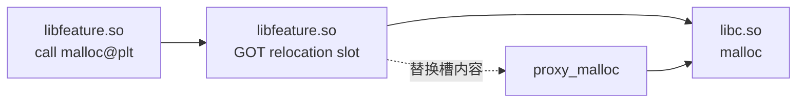

# 14.26 Hook 基础设施与性能工具实现原理

Hook 适合补充已有观测手段覆盖不到的调用边界。例如 Perfetto 已经指出主线程在一次 JNI 调用内停留了 40 ms，但 trace 中没有这段 native 代码的阶段信息；这时可以在自有进程内拦截少量目标函数，记录耗时、参数分类或调用栈。

这里必须先限定能力边界。普通应用不能凭空进入另一个应用进程。用于线上 SDK 的 Hook 代码仍要随 APK/AAB 打包，并由目标进程加载；Frida、Xposed 一类外部注入方案依赖调试、root、定制系统或专用运行环境。两类方案的权限模型、风险和发布方式不同，不应混用同一套结论。

平台锚点是 Android 17 / API 37 / `android-17.0.0_r1`，讨论范围限于自有应用进程中的性能观测。Android 内核锚点为 `android17-6.18-2026-06_r6`；ELF 重定位、ART 和应用域 SELinux 规则位于平台源码侧。

## 先判断是否需要 Hook

不少性能信号已有稳定入口：

- Java/Kotlin 业务阶段可用 `android.os.Trace`、AndroidX Tracing 或 Perfetto SDK Track Event；
- native 自有代码可用 ATrace NDK API 或 Perfetto SDK；
- CPU 热点可用 Simpleperf、Android Studio Profiler 或 Perfetto callstack sampling；
- native 分配可用 heapprofd，Java 堆可用 heap dump；
- API 35 及以上可用 `ProfilingManager` 请求系统 trace、heap profile、stack sampling 或 Java heap dump；
- 自有字节码可在构建期使用 AGP instrumentation API 和 ASM 插桩。

这些入口有文档化契约，升级成本通常低于运行时修改 ELF 或 ART 内部状态。Hook 适合目标足够窄、现有工具缺少所需字段、且团队能够维护兼容组合的场景。

ATrace、heapprofd 和 Simpleperf 也不属于同一种“Hook”。ATrace 记录显式写入的 trace 事件；heapprofd 的客户端路径会介入分配器；Simpleperf 主要依赖 Linux perf 事件做统计采样。理解数据从哪里产生，比给它们统一贴上 Hook 标签更有帮助。

## 四种介入方式

| 方式 | 修改位置 | 能覆盖什么 | 主要代价 |
|---|---|---|---|
| 构建期字节码插桩 | 自有 class 的字节码 | 已参与构建的 Java/Kotlin 方法 | 增加构建复杂度，不能覆盖系统和 native 代码 |
| PLT/GOT Hook | 调用方 ELF 的动态重定位槽 | 经该槽调用的外部 native 符号 | 逐调用方生效，绕过 PLT 的调用不会命中 |
| Inline Hook | 目标函数入口或指定指令 | 到达被改写地址的 native 调用 | 要重定位指令并管理可执行内存，架构适配复杂 |
| ART 内部方法 Hook | `ArtMethod`、入口点或运行时调度状态 | Java/Kotlin 运行时方法 | 依赖私有实现，还受解释器、JIT、AOT、内联和去优化影响 |

Xposed、Dexposed、SandHook 和 Epic 属于运行时方法 Hook 家族，不是构建期 ASM 工具。Matrix TraceCanary 的方法耗时能力使用构建期插桩；它的 Looper 和帧监控又使用运行时公开/反射入口，因此一个工具可以组合多种介入方式。

### 构建期插桩

对自己维护的 App，构建期插桩通常是方法级监控的低风险方案。插桩器在方法进入、正常返回和异常退出处写入轻量调用，运行期无需推测 `ArtMethod` 布局。

它仍有三类盲区：

- 没有进入当前构建的三方预编译产物；
- framework、boot class path 和 native 调用；
- R8 优化后被删除、合并或内联的方法。

映射文件必须与产物版本绑定。方法 ID 表、R8 mapping 和 APK 版本错配时，采集结果会被还原成错误的方法名。

### 外部注入和进程内 SDK

外部注入框架拥有额外的进程控制能力，适合实验室调试、安全研究或受控设备。线上性能 SDK 运行在应用自己的 SELinux domain，只能访问进程已映射并允许操作的对象。文中后续提到的 ByteHook、ShadowHook、Matrix 和 KOOM 都按“库已被应用加载”来理解。

## PLT/GOT Hook：改的是调用方

一个 DSO 调用另一个 DSO 导出的函数时，编译器通常生成经 PLT 跳转的调用。动态链接器处理 `R_*_JUMP_SLOT` 等重定位后，把解析结果写入调用方的 GOT 槽。PLT 代码再从该槽读取目标地址。

下面的图用于区分“函数实现”和“调用方重定位槽”。



PLT Hook 修改的是 `libfeature.so` 里的槽。另一个 `libcodec.so` 有自己的重定位槽，需要单独处理。目标 DSO 内部的局部调用、编译器直接分支、保存过的函数指针以及 `dlsym()` 返回值直接调用，都可能绕过这个槽。

### Android linker 是立即绑定

Android 17 的 `bionic/linker/linker.cpp` 在处理 `DT_PLTGOT` 时明确写着 `RTLD_LAZY is not supported`。`link_image()` 调用 `relocate()` 填充跳转槽，随后调用 `protect_relro()` 将 GNU RELRO 区域设为只读。Android 上不存在 glibc 风格的首次调用延迟绑定窗口。

这不要求 Hook 必须赶在 `dlopen()` 返回前完成。成熟的 PLT Hook 库会定位重定位槽；槽位于 GNU RELRO 时，暂时改变包含该槽的页面权限，写入新地址后恢复权限。ByteHook 的 `bh_elf_get_protect()` 会识别 `PT_GNU_RELRO`，`bh_util_set_addr_protect()` 使用按运行时页大小对齐的 `mprotect()`。旧文把 GOT 描述成始终可写，会漏掉 full RELRO 的常见情况。

IFUNC 也要按重定位关系分析。linker 会在装载时执行 resolver，再把解析出的实现地址写进相应重定位槽；能够定位并改写这个槽的 PLT Hook 仍可命中该调用方。绕过发生在调用路径未经过被改写槽时，不能仅凭符号类型下结论。

### ByteHook 的调用方模型

ByteHook 提供 single、partial 和 all 三种任务，选择一个、部分或全部调用方 DSO。上游还会在新 ELF 加载后继续执行尚未完成的任务。它比“扫描一次当前 maps”更适合存在动态特性模块或晚加载 SDK 的进程。

下面代码展示 `pthread_create` 代理的 API 形状。计数函数必须无分配、无锁或能证明不会再次触发目标调用。

```c
#include <pthread.h>
#include <stdbool.h>
#include <stdint.h>
#include <stdatomic.h>
#include "bytehook.h"

typedef int (*pthread_create_t)(
    pthread_t *, const pthread_attr_t *, void *(*)(void *), void *);

static _Atomic uint64_t g_thread_create_count;
static bytehook_stub_t g_stub;

static int proxy_pthread_create(
    pthread_t *thread,
    const pthread_attr_t *attr,
    void *(*start_routine)(void *),
    void *arg) {
  __atomic_fetch_add(&g_thread_create_count, 1, __ATOMIC_RELAXED);
  int result = BYTEHOOK_CALL_PREV(
      proxy_pthread_create, pthread_create_t,
      thread, attr, start_routine, arg);
  BYTEHOOK_POP_STACK();
  return result;
}

static bool install_hook(void) {
  g_stub = bytehook_hook_all(
      "libc.so", "pthread_create",
      (void *)proxy_pthread_create, NULL, NULL);
  return g_stub != NULL;
}
```

`BYTEHOOK_CALL_PREV()` 获取当前代理链中的前一个实现，`BYTEHOOK_POP_STACK()` 维护 ByteHook 的调用栈状态。C++ 代码可使用上游提供的 scope 宏避免多个 return 分支漏掉清理。示例只计数；在线上回调中打印日志或抓取完整栈会明显改变线程创建路径。

### xHook 的位置

xHook 同样通过 ELF 重定位槽实现 PLT Hook，KOOM 的部分模块仍使用它。新项目评估时应同时检查 ByteHook：ByteHook 的调用链、多 Hook、晚加载 DSO 和 Android 17 支持说明更完整。已有 xHook 项目无需只为名称迁移，重点是验证当前 fork 对 16 KB 页、RELRO、CFI、晚加载 DSO 和目标 ABI 的处理。

## Inline Hook：改写函数入口

Inline Hook 在目标函数入口写入跳转，让所有到达该地址的调用转向代理函数。为了还能调用原实现，框架会保存被覆盖的指令，把这些指令重定位到 trampoline，执行后跳回原函数剩余部分。

这个过程包含三项难点：

1. 入口处被覆盖的指令长度必须容纳跳转，同时不能截断指令；
2. 被搬走的 PC-relative 指令要按 trampoline 的新地址重新编码；
3. 写入完成后要刷新指令缓存，并处理并发线程可能正在执行入口指令的情况。

ARM64 指令固定为 4 字节。`B`/`BL` 的直接跳转范围约为 ±128 MiB，远距离代理常借助目标附近的 branch island，再从 island 做绝对跳转。ARM32 同时存在 ARM 和 Thumb 编码，函数地址最低位的 Thumb 标记只适用于 AArch32；AArch64 没有 Thumb 模式。

### ShadowHook 的公开 API

ShadowHook 2.x 可以按函数地址或“库名 + 符号名”安装 Hook。下面用 `getpid()` 展示完整的安装、失败检查和卸载路径。

```c
#include <stdbool.h>
#include <sys/types.h>
#include "shadowhook.h"

typedef pid_t (*getpid_t)(void);

static getpid_t g_orig_getpid;
static void *g_getpid_stub;

static pid_t proxy_getpid(void) {
  return g_orig_getpid();
}

static bool install_getpid_hook(void) {
  g_getpid_stub = shadowhook_hook_sym_name(
      "libc.so", "getpid",
      (void *)proxy_getpid,
      (void **)&g_orig_getpid);
  return g_getpid_stub != NULL;
}

static bool uninstall_getpid_hook(void) {
  return g_getpid_stub != NULL &&
         shadowhook_unhook(g_getpid_stub) == 0;
}
```

代理函数的参数、返回值和 ABI 必须与目标一致。安装成功也只说明框架写入了跳转；还要用命中计数和对照调用验证目标路径是否经过该地址。符号被内联、目标调用经过别名、或调用点持有另一个地址时，计数可能为零。

ShadowHook 上游 2.0.0 的 release 配置偏向单条相对跳转和 branch island，以降低多指令改写时的并发风险。island 空间取决于目标 ELF 的可用布局，任务过多可能返回容量相关错误。业务代码要处理失败并继续运行，不能把 Hook 成功当作进程启动条件。

### 可执行内存、W^X 与 SELinux

Android 17 没有一条“targetSdk 34 起普通应用禁止所有 RWX”的统一规则。AOSP `system/sepolicy/private/app.te` 仍允许 `appdomain self:process execmem`，源码注释给出的用途是 WebView 和应用自带的 JIT 编译器。ShadowHook 当前源码在改写目标页时会请求 `PROT_READ | PROT_WRITE | PROT_EXEC`，它能够在普通应用进程使用这一事实也与策略一致。

这不等于任意地址都能修改：

- `mprotect()` 只能改变当前进程有权操作的映射；
- 文件类型、SELinux domain、厂商策略和内核加固会影响结果；
- `execmod` 关注被修改的文件映射继续执行，和匿名 `execmem` 不是同一个权限；
- APEX 只读文件系统阻止磁盘文件改写，但进程内映射是否能临时修改要由 VMA 与策略判断；
- 生产环境还可能启用 CFI、BTI、PAC、MTE 或厂商完整性检测。

因此框架返回的 `mmap`/`mprotect`/指令重定位错误必须被记录，失败时关闭该项观测。不要把 SELinux denial 当作唯一失败来源。

### 指令缓存

ARM 上用数据写入修改代码后，需要让新指令对取指可见。框架一般调用 `__builtin___clear_cache(begin, end)`，编译器运行库再执行适配当前架构的 cache maintenance 与 barrier。业务 SDK 不应复制一段固定汇编后假定所有 CPU、内核和编译器都相同。

## ART 方法 Hook 的版本风险

Android 17 的 `art/runtime/art_method.h` 仍有 `entry_point_from_quick_compiled_code_`。JNI 入口通过 `PtrSizedFields::data_` 表达，并由 `GetEntryPointFromJni()` / `SetEntryPointFromJni()` 访问；它不是 Android 13 才新增的独立字段。直接写固定偏移会同时面临字段布局、指针大小和方法类型语义变化。

即便找对入口，Java 方法调用也可能走多条路径：

- 解释器执行；
- AOT 编译代码；
- JIT 编译代码；
- 调用者已把目标方法内联；
- JNI trampoline、runtime stub 或去优化路径；
- interface/virtual dispatch 的缓存与解析。

修改一个 quick entry point 不能证明所有调用都会经过代理。可靠的实现还要处理 deoptimization、编译状态变化、GC 可见性和线程同步。ART 自 Android 12 起由 `com.android.art` APEX 更新，系统小版本或 Google Play system update 也可能改变私有实现；仅按 `SDK_INT` 选择偏移不够。

### JVMTI 的适用范围

Android 提供 JVMTI 与 `Debug.attachJvmtiAgent()` 作为受支持的调试能力，但普通发布应用不能把它当作任意线上注入接口。公开 API 要求应用可调试，agent 还受平台版本、启动方式和可用 capability 约束。测试、基准和受控诊断环境应优先考虑 JVMTI；全量线上方法监控更适合构建期插桩或采样。

## Android 17 下的 ELF 与进程边界

### Linker namespace 和 APEX

Android linker namespace 限制普通 `dlopen()` / `dlsym()` 可见范围。系统库移入 APEX 后，路径和可见集合也会变化。Hook 工具宣称能扫描进程内 ELF 或绕过 namespace 查询符号，属于工具自有实现，不是 NDK 稳定契约。

工程上应保存以下信息：

- 目标符号所在 DSO 的 basename、build ID 和运行时路径；
- 目标是公开 NDK 符号、应用自有符号，还是平台私有符号；
- 失败设备的 `/proc/self/maps` 摘要和 Hook 状态码；
- 系统 build fingerprint、ABI、page size 和 ART module version。

私有符号在同一 API 级别的厂商构建中也可能被隐藏、裁剪或替换。按地址 Hook 时，地址必须由当前进程当前 DSO 解析，不能把另一台设备上的基址或偏移直接复用。

### 16 KB page size

Android 15 起，AOSP 支持 16 KB page size 设备。Android 17 仍要求 native 依赖具备 16 KB ELF LOAD segment 与 APK ZIP 对齐；兼容模式只用于过渡。Android 17 增加的 `fatal` 属性值可让不兼容二进制立即终止，便于测试。

Hook 框架要处理两类问题：

- 自身 `.so` 的 ELF 与 APK 打包对齐；
- `mprotect()`、trampoline 分配和地址取整使用运行时 page size。

进程应通过 `getpagesize()` 或 `sysconf(_SC_PAGESIZE)` 读取页大小，不能写死 `4096` 或 `0xFFF`。同一内核上的基础页大小是系统配置，不存在同一设备上“64 位进程 16 KB、32 位进程 4 KB”的通用 VMA 规则。

ELF section 的文件偏移也不会因为页大小从 4 KB 变成 16 KB，就自动从 `+0x1000` 改成 `+0x4000`。加载地址由 ELF program header、`p_vaddr`、`p_offset`、`p_align` 与 load bias 共同决定。Hook 工具应读取 program header 和动态重定位表，不能用假设出来的 section 偏移。

ShadowHook 当前构建脚本为 arm64 设置 `-Wl,-z,max-page-size=16384`，地址取整和 `mprotect()` 区间使用运行时 page size。采用预编译 AAR 时仍要检查所有传递依赖；一个兼容的 Hook 库无法补救 APK 中另一个未对齐的 native SDK。

### 32 位与 64 位

| 项目 | AArch64 | AArch32 |
|---|---|---|
| 指令宽度 | 固定 4 字节 | ARM 4 字节，Thumb 可含 2/4 字节 |
| 参数寄存器 | `x0`–`x7` | `r0`–`r3` |
| 返回地址 | `x30` | `r14` |
| 直接分支范围 | `B`/`BL` 约 ±128 MiB | 随 ARM/Thumb 编码变化 |
| 函数地址最低位 | 正常为 0 | 1 可表示 Thumb 状态 |

一个 ABI 上通过的 trampoline 不能推导另一个 ABI 也安全。发布包保留 32 位 ABI 时，测试组合必须覆盖 ARM/Thumb 边界、栈展开和混合 Java/native 调用。

### 多进程

Hook 状态属于当前进程地址空间。主进程安装成功，不会自动修改 `android:process=":remote"`、isolated process、WebView renderer 或独立 native 进程。每个目标进程都要决定是否加载 SDK、何时安装和如何上报。

不要在 zygote 中预装应用 Hook。普通应用没有这个控制点，把系统库修改状态跨 fork 传播还会扩大影响范围。进程级初始化可放在目标进程自己的早期组件中，但应避免让 Hook 安装阻塞首帧。

## 回调代码比安装代码更容易出错

高频函数的代理处在被观测路径内部。下面这些约束应写进 SDK 设计：

- 用 TLS 或框架提供的调用栈机制防止递归；Hook `malloc` 时，容器扩容、日志、符号化都可能再次分配；
- 保留并恢复 `errno`，除非代理有意改变被调用函数的错误语义；
- 不在 loader lock、allocator lock 或 signal handler 上下文做阻塞 I/O、Binder 调用或 Java 回调；
- 固定大小缓冲区满时丢弃样本，并记录丢弃计数；
- 调用栈采集要抽样，不能在每次分配、锁或系统调用上全量 unwind；
- 安装、卸载与目标函数并发执行时，要按框架文档处理生命周期；
- 远程开关应能停止采集，安装失败不能影响业务功能。

`malloc`/`free` 代理还要避开自身元数据分配。常见做法是预分配、无锁 ring buffer、TLS 递归标记和后台批处理。只记录 size 与时间戳也有成本，必须用目标设备测量。

## Matrix 和 KOOM 的实现边界

### Matrix TraceCanary

Matrix TraceCanary 不是 PLT Hook `MessageQueue.next()`。当前上游代码中：

- Gradle 插桩把方法进入/退出写入 `AppMethodBeat` 缓冲区；
- `LooperMonitor` 通过 `Looper.setMessageLogging()` 的 `Printer` 边界得到 dispatch begin/end；
- `UIThreadMonitor` 结合 Choreographer 回调拆分 input、animation 和 traversal；
- `LooperAnrTracer`、`EvilMethodTracer` 和 `FrameTracer` 消费这些时间与方法记录。

它没有用 `Method.invoke()` 包装 `MessageQueue.next()`，也不能用“2 秒 × 3 次”或“默认 700 ms”替代源码中的配置与 tracer 逻辑。Matrix 上游 release 与 Gradle 插件较旧，Android 17 项目要验证 AGP/R8 插桩、Compose、多模块和 release mapping。

### KOOM

KOOM 的模块不能合并成一条“Hook malloc 解决 OOM”的描述：

- Java OOMMonitor 轮询 heap、线程和 fd 等指标，达到条件后采用暂停 ART、fork 子进程、恢复主进程、在子进程 dump hprof 的策略，并在设备侧分析；
- Native LeakMonitor 使用 xHook 介入 `malloc`/`free` 等分配器函数，记录地址、大小与栈，再借助 mark-and-sweep 分析不可达块；
- Thread Leak 模块拦截 `pthread_create`/`pthread_exit` 等线程生命周期函数。

Java hprof 裁剪路径会 Hook `open`/`write` 来缩减 dump 文件，这属于 dump 实现细节，不等同于用 native 分配 Hook 判断 Java 对象泄漏。评估 KOOM 时要按模块测暂停时间、峰值内存、CPU、磁盘、误报率和 Android 17/16 KB/MTE 兼容性。

## 把 Hook 数据放进 Perfetto

Hook 回调不要直接写 `/sys/kernel/tracing/trace_marker`。普通应用应使用 `android.os.Trace`、ATrace NDK API 或 Perfetto SDK；这些入口处理权限、格式和数据源注册。

低频阶段事件可以写 slice。高频函数更适合在进程内聚合成 counter、直方图或少量异常样本，再与 Perfetto 时间轴对齐。否则 trace 体积和写入开销会改变被测路径。

一条有诊断价值的 Hook 记录至少要带：

- 单调时钟时间戳和线程 ID；
- 目标 DSO build ID、符号或稳定事件 ID；
- 采集配置版本与采样率；
- 是否递归跳过、buffer 丢弃和安装失败；
- 参数只保留分类或哈希，避免路径、URL、账号和文件内容泄漏。

时间轴对齐后，才能把代理记录与 sched、Binder、VSync、I/O 和 CPU frequency 交叉验证。单独一条“函数耗时 40 ms”不能区分运行、抢占、page fault 和锁等待。

## 验证一项 Hook 是否可信

每个目标都应做四层验证。

### 命中正确性

准备已知调用次数的测试路径，同时记录原函数与代理计数。覆盖 DSO 已加载、晚加载、`dlsym()` 直接调用、同符号多调用方和多进程。PLT Hook 未命中内部直调属于能力边界，不应伪装成采集丢失。

### 语义一致性

对比启用前后的返回值、`errno`、异常、线程行为和文件内容。含可变参数、C++ 成员函数、结构体返回值或 vendor 私有 ABI 的函数，需要单独核对调用约定。

### 性能开销

在目标设备上分别测：

1. 未加载 Hook SDK；
2. SDK 已加载但未安装目标；
3. 已安装但不记录；
4. 已安装并按生产采样率记录。

报告 P50/P95/P99、CPU time、allocations、RSS、trace 丢弃率和安装耗时。上游宣称的纳秒级数字不能代替当前 SoC、编译参数和代理逻辑的测量。

### 故障恢复

注入符号不存在、`mprotect()` 失败、island 耗尽、buffer 满、重复安装和卸载并发。应用应继续运行，诊断平台收到明确状态码。Hook 失败后继续解引用空的原函数指针，会把观测故障升级成业务崩溃。

## 选型建议

| 目标 | 优先方案 | 何时考虑 Hook |
|---|---|---|
| 自有 Java/Kotlin 方法耗时 | 构建期 ASM 或采样 profiler | 构建无法介入且环境受控 |
| 自有 native 阶段 | ATrace / Perfetto Track Event | 缺少源码或要观察第三方 DSO 边界 |
| 某个外部 native 符号的调用方 | ByteHook/xHook 类 PLT Hook | 调用确认经过动态重定位槽 |
| native 函数所有入口 | ShadowHook 类 Inline Hook | 团队能验证指令重定位与设备兼容性 |
| Java 堆问题 | heap dump、heapprofd 对应能力、KOOM Java 模块 | Hook 仅用于 dump 或专项实现细节 |
| native 泄漏 | heapprofd、采样分配器、KOOM Native 模块 | 需要线上专项且有采样与关闭机制 |
| 方法运行时实验 | JVMTI、调试器、受控注入环境 | 不进入普通线上发布路径 |

选择时写清五个问题：目标调用经过哪里、谁负责把库加载进进程、失败是否影响业务、回调允许做多少工作、每个 Android/ABI/page size 组合如何验证。回答不完整时，增加 Hook 只会增加一个新的不确定来源。

## 结论

PLT Hook 按调用方重定位槽生效，覆盖范围有限但修改面较小；Inline Hook 改写函数入口，覆盖更广，也会带来指令重定位、并发写入和可执行内存风险；ART 方法 Hook 还要面对 JIT/AOT/内联和 Mainline 更新。三者没有统一的“稳定性排名”，结论取决于目标、调用路径和设备组合。

Android 17 上，GNU RELRO、linker namespace、APEX、CFI/BTI/PAC/MTE、16 KB 页与多进程都要进入测试组合。SELinux 也不能用一句“普通应用没有 execmem”概括：AOSP Android 17 的 appdomain 仍有 `execmem` 许可，具体映射操作仍可能受文件类型、VMA、厂商策略和加固机制限制。

性能工具的目标是减少未知量。现有 Trace、Perfetto、Profiler 或构建期插桩能提供证据时，直接使用它们；证据缺口落在明确函数边界时，再安装最小范围的 Hook，并用命中、语义、开销和故障四组测试证明采集本身可信。

## 源码与上游资料

- [AOSP Android 17 bionic linker.cpp](https://android.googlesource.com/platform/bionic/+/android-17.0.0_r1/linker/linker.cpp)
- [AOSP Android 17 linker_relocate.cpp](https://android.googlesource.com/platform/bionic/+/android-17.0.0_r1/linker/linker_relocate.cpp)
- [AOSP Android 17 ArtMethod](https://android.googlesource.com/platform/art/+/android-17.0.0_r1/runtime/art_method.h)
- [AOSP Android 17 appdomain SELinux policy](https://android.googlesource.com/platform/system/sepolicy/+/e066568e98d86db31a9346d30977f3632fa7073c/private/app.te)
- [Android Developers：支持 16 KB page size](https://developer.android.com/guide/practices/page-sizes)
- [Android Debug.attachJvmtiAgent API](https://developer.android.com/reference/android/os/Debug#attachJvmtiAgent(java.lang.String,%20java.lang.String,%20java.lang.ClassLoader))
- [ByteHook upstream](https://github.com/bytedance/bhook)
- [ShadowHook upstream](https://github.com/bytedance/android-inline-hook)
- [xHook upstream](https://github.com/iqiyi/xHook)
- [Tencent Matrix upstream](https://github.com/Tencent/matrix)
- [KOOM upstream](https://github.com/KwaiAppTeam/KOOM)
