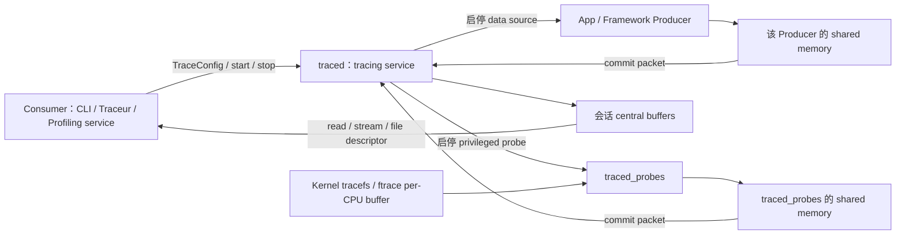

# Perfetto 入门、Trace 抓取与可靠性

Perfetto 把内核、系统服务、应用埋点和性能计数器写入统一时间线。可靠分析先定义问题窗口和数据源，再选择抓取方式；超大 Trace 的处理与采集可靠性属于同一证据链。

## 数据源、Tracing Service 与 Trace Processor

### 为什么要了解 Perfetto

日志和单次堆栈擅长记录局部状态，却很难回答跨线程、跨进程的时间关系。一次卡顿可能同时经过 App 主线程、RenderThread、GPU、SurfaceFlinger；一次 Binder 阻塞还要看调用方是否在运行、对端何时被唤醒、事务何时返回。只看其中一层，很容易把等待时间算到错误的模块上。

Perfetto 把所选 data source 的事件放进同一时间域，并提供时间线和 PerfettoSQL 两种观察方式。data source 是向 trace 写入某类数据的组件或能力。采集配置决定最终能看到什么：启用调度事件可以还原线程何时运行，启用 Binder、FrameTimeline、进程统计或堆 profiling 后，才能继续回答对应问题。空白轨道只说明当前 trace 没有这份证据，不能直接推断系统没有发生相应行为。

Android 的系统追踪主线已经从 Systrace 转到 Perfetto。旧的 ftrace/atrace 经验仍然有用，但采集配置、二进制格式、分析引擎和长时录制模型都需要按 Perfetto 重新理解。

### Perfetto 是什么

Perfetto 是 Google 开源的一套 tracing 基础设施，包括 SDK、守护进程、采集工具、Trace Processor 分析引擎和可视化界面。它覆盖 Android、Linux 和 Chrome，但各平台能采集的数据源不同。Android 9 已把 `traced` / `traced_probes` 放进系统镜像；Android 9 和 10 的非 Pixel 设备通常还要手动启用服务，Android 11 起大多数设备默认启用。

从数据流看，这套基础设施可以分为三个模块：

- **采集层**：按 `TraceConfig` 启动 data source，收集 ftrace、atrace、进程统计、功耗、堆 profiling 或 SDK 自定义事件。
- **分析层**：Trace Processor 解析并按时间排序不同格式的事件，把数据写入按列组织的内部存储，再通过 PerfettoSQL 提供查询接口。
- **可视化层**：Perfetto UI 在浏览器本地解析和展示 trace，默认不会上传文件。大型 trace 可能超过浏览器内存上限，此时可让本机原生 Trace Processor 作为解析后端。

采集端、分析端和 UI 可以独立升级。设备侧平台 Perfetto 负责产出 trace，主机上的 Trace Processor 和 UI 可以使用更新版本读取它。排查解析差异时，必须同时记录设备 build fingerprint、采集端版本和分析端版本。

### 复核基线

| 层级 | 锚点 | 分析边界 |
| --- | --- | --- |
| Android 平台 | Android 17 / API 37 / `android-17.0.0_r1` | 固定 `traced`、`traced_probes`、Perfetto CLI 与平台 data source |
| 平台内 Perfetto | `external/perfetto` 提交 `ece66975738007dd0978b911d8a2077e49b8f31e` | `CHANGELOG` 已包含 v54.0，并带有后续 `android.aflags` 变更；不能直接写成上游最新版本 |
| Profiling 模块 | `packages/modules/Profiling` 提交 `8b3abe8eebc0e97890977d9658038f4966aa7df6` | 固定 `ProfilingManager`、`ProfilingTrigger` 与 `com.android.profiling` APEX 边界 |
| Android 内核 | `android17-6.18-2026-06_r6` | 固定 common kernel 的 tracefs/ftrace 和通用调度 tracepoint；厂商事件及启用项以设备内核为准 |
| 主机分析工具 | 与 trace 一起记录实际版本 | Perfetto UI、`trace_processor_shell`、Python API 和 `traceconv` 可独立于系统镜像升级 |

这里不能只写“Android 17 + Perfetto”。同一份 Android 17 镜像内有固定的平台采集端，而浏览器 UI 和主机预编译工具仍在迭代；SQL 表、标准库模块和 UI 行为可能随分析端版本变化。

### 从 Systrace 到 Perfetto：为什么要换

Systrace 是 Android 4.1（2012 年）引入的 tracing 工具。它通过 Linux 内核的 ftrace 采集系统事件，通过 atrace 接收 Framework 和应用写入的区间标记，最终生成可在 Chrome 中查看的 HTML 报告。它长期是 Android 性能分析的常用工具。

它的限制主要集中在采集模型和分析工具。

**长时采集缺少完整的流式写盘模型。** ftrace 为每个 CPU 使用容量有限的 ring buffer（写满后循环复用空间的缓冲区）；事件产生速度超过读取速度时，旧数据会被覆盖。Perfetto 默认也把事件保存在会话的 central buffer 中，同样受容量约束。配置 `write_into_file`、`file_write_period_ms` 和 `max_file_size_bytes` 后，它可以周期性把 central buffer 写入文件。长 trace 仍要根据峰值事件速率计算 buffer，单纯延长录制时间无法避免丢包。

**数据源范围较窄。** Systrace 的 Android 工作流主要围绕 ftrace 和 atrace。Perfetto 除了接入这些旧数据，还能在设备支持时采集 heapprofd、ART heap graph、进程统计、功耗 rail、GPU 和 SDK Track Event 等数据源。

**缺少面向批处理的结构化分析接口。** 旧 HTML 查看器适合缩放和点选，复杂聚合通常还要自行解析文本。Trace Processor 把不同 trace 格式转换成统一表结构，同一条 PerfettoSQL 可以在 UI、命令行、Python API 和批处理流程中复用。

Perfetto 的 Producer（提供 data source 并产生事件的一方）先把序列化的 trace packet 写进与 tracing service 共享的临时 buffer，service 再把已提交的 packet 搬到会话的 central buffer。ftrace 还多一层内核 per-CPU buffer，由 `traced_probes` 周期读取。三层任一处都可能丢数据；分析前应查询用于记录解析和采集异常的 `stats` 表，检查其中 `severity = 'data_loss'` 且 `value != 0` 的记录。

下表总结了二者的关键差异：

| 维度 | Systrace | Perfetto |
| --- | --- | --- |
| 引入阶段 | Android 4.1（2012 年） | Android 9 基础服务进 system image，Android 10 完整可用，Android 11+ 大多数设备默认启用 |
| 采集模型 | ftrace/atrace 事件导出后生成 HTML 报告 | ftrace per-CPU buffer + Producer shared memory + service central buffer |
| 采集时长 | 受 ftrace buffer 与导出流程约束 | 默认仍受 central buffer 限制；可按周期写文件并设置文件上限 |
| 配置方式 | category + 命令行为主 | simple mode flags 或 normal mode `TraceConfig` |
| 数据源 | ftrace + atrace | ftrace + atrace + heap / log / process stats / power 等 |
| 分析方式 | HTML 报告，交互能力有限 | SQL 查询 + Web UI + 脚本 |
| UI 承载能力 | 旧 Catapult 查看器面向旧格式 | 浏览器有内存上限；大型 trace 可连接本机原生 Trace Processor |
| 跨平台 | 主要 Android | Android + Linux + Chrome |
| 当前定位 | 兼容旧流程 | Android tracing 主线平台 |

Perfetto UI 和 Trace Processor 可以读取 Systrace/ftrace 文本及旧 HTML 格式，旧文件仍可继续分析。反向转换时使用 `traceconv systrace`；转换只保留目标格式能表达的数据，不能把它当成无损往返。

### Perfetto 的架构

Perfetto 采用 service-based model。Producer 提供 data source 并写入 trace packet；Consumer 是发起和控制采集的一方，负责提交 `TraceConfig`、控制会话并读取结果；Android 上的 `traced` 是 tracing service，管理会话的 central buffer。

下面的图用于区分三层 buffer 和控制方向。配置经 `traced` 发给 Producer，trace packet 则沿相反方向进入 central buffer。



每个 Producer 通常只与 service 共享一块临时 shared memory（两个进程都能访问的内存区域），同一 Producer 内的多个 data source 共用它。central buffer 属于 tracing service，不会映射给其他 Producer。ftrace 事件还要先经过内核 per-CPU buffer，所以 ftrace、Producer shared memory 和 central buffer 要分别检查丢包。

#### traced：核心守护进程

`traced` 是 Perfetto 的 tracing service。Android 17 的 `perfetto.rc` 让它以 `nobody` 用户运行，通过 consumer/producer UNIX socket 接收本机进程间的控制连接和 Producer 连接。它负责会话、data source 路由、central buffer 和结果读取。

它的工作可以分成三类：

- **管理采集会话**：接收 Consumer 发来的 `TraceConfig`，创建 buffer，并把各 data source 的配置路由给对应 Producer。
- **汇聚 trace packet**：Producer 在 shared memory chunk（共享内存中分配的一段空间）内序列化 packet，再通过 IPC（Inter-Process Communication，进程间通信）通知 service 提交；service 把完整 packet 搬进目标 central buffer。
- **交付结果**：Consumer 可以从 service 读取 buffer，或把文件描述符交给 service，让它在结束时或 long-trace 周期内写出 `.perfetto-trace`。

需要分清三个层次：

1. **Producer shared memory**：每个 Producer 的低开销写入区。
2. **central trace buffers**：`traced` 统一管理的会话 buffer。
3. **输出文件**：默认在录制结束时一次性写出；只有显式设置 `write_into_file: true` 和 `file_write_period_ms`，才会定期写入磁盘。

默认配置在会话结束时写文件。开启 `write_into_file` 后，service 才会按 `file_write_period_ms` 周期把 central buffer 写入文件。buffer 至少要容纳一个写文件周期内的峰值数据量；`flush_period_ms` 用于要求低频 Producer 提交尚未填满的 shared-memory page（一页写入空间）。前者控制 service 写文件的频率，后者控制 Producer 提交数据的频率。

`perfetto` CLI 的 simple mode 和 normal mode 都要连接 tracing service。simple mode 只是在 CLI 内部用 flags 生成受限配置，并没有绕过 `traced`。Android 9/10 的非 Pixel 设备若服务未启动，应先按官方方式设置 `persist.traced.enable=1`；Android 11 起，大多数设备默认启动 `traced` / `traced_probes`。更老设备或特殊镜像再评估主机脚本的 sideload 模式、atrace 或厂商工具。

#### traced_probes：系统数据源代理

`traced_probes` 是系统 probe Producer，也就是代替 tracing service 访问受权限保护数据的采集进程；它负责读取 ftrace、`/proc`、`/sys`、log 和部分 Android HAL（Hardware Abstraction Layer，硬件抽象接口）数据源。

Android 17 的 `traced` 与 `traced_probes` 都以 `nobody` 用户运行，权限差异来自进程所属 group、Linux capability 和 SELinux domain 策略。`traced_probes` 额外加入 `readproc`、`log`、`readtracefs`，拥有 `DAC_READ_SEARCH`、`SYS_NICE` 与 `shared_kallsyms`；其中 log 访问在 `perfetto.rc` 注释中明确受 SELinux 限制，只对 userdebug/eng 等调试系统镜像放行。不能把这套模型简化成“`traced_probes` 以 root 运行”。

`traced_probes` 支持的主要数据源包括：

- **ftrace**：内核级事件，如 CPU 调度（`sched_switch`、`sched_wakeup`）、系统调用和中断等。这是 trace 中 CPU 行为数据的来源。
- **atrace**：Framework 和 App 的 `android.os.Trace` 标注最终进入 tracefs 路径，由 ftrace data source 一并读取。
- **`/proc` 和 `/sys` 轮询器**：按固定间隔读取进程 CPU、内存和系统级计数器等数据。
- **功耗计数器**：从 Android 10 开始，集成了电池和能耗相关的硬件计数器，包括总电流和 ODPM（On-Device Power Rails Monitor，各硬件子系统的独立功耗）。

这些 data source 默认不采集，只有会话请求时才激活。守护进程和已初始化 SDK 仍有基础资源占用，因此“空闲时零开销”不应作为绝对承诺。

#### heapprofd 与 traced_perf：专用 profiling 进程

`traced_probes` 负责通用系统数据源，但 Perfetto 的 profiling 能力还有一组独立组件：

- `heapprofd`：负责 Native heap allocation sampling，也就是按采样规则记录原生内存分配调用栈。Android 17 的同一二进制还编入 `JavaHprofProducer`，所以 `java_hprof_producer.cc` 是 `heapprofd` 的组成代码，并非第三个独立守护进程。
- `JavaHprofProducer`：处理 `android.java_hprof`。它在发送 `__SIGRTMIN+6` 实时信号前调用 `CanProfile(...)`，检查目标 App 的 `profileable`、`debuggable` 属性和 installer gate（安装来源是否允许 profiling 的策略门槛）。目标进程中的 ART Perfetto 插件捕获信号，生成表示对象保留关系的引用图，并写回 tracing shared memory。结果是 retained graph，用于分析哪些对象仍被引用；它不包含传统 HPROF 文件中的完整对象字段数据。
- `traced_perf` / `perf_producer`：通过 Linux `perf_event_open` 周期采样 CPU，并记录采样点对应的调用栈；源码位于 `external/perfetto/src/profiling/perf/`。

这些组件仍由 `TraceConfig` 控制，并把结果交给 `traced` 的会话 buffer。遇到空结果时，先确认请求的是 Native/ART allocation profile、ART heap dump 还是 CPU sampling，再检查目标进程是否允许被分析、采样配置、符号文件和设备支持。

#### Perfetto UI：可视化界面

Perfetto UI 托管在 `ui.perfetto.dev`，默认在浏览器本地解析文件，不会自动上传 trace。浏览器可用内存通常低于主机物理内存，trace 解析后的内存占用还可能达到二进制文件的数倍。大型 trace 可以执行 `./trace_processor server http <trace>`，让 UI 使用本机原生 Trace Processor；能否直接使用浏览器内的 WebAssembly 分析引擎，要按浏览器、系统和 trace 实际大小判断。

UI 主要提供三类观察入口：

- **时间线视图**：进程通常显示为轨道分组，线程可以拥有 Slice、线程状态等多条轨道；调度事件则按 CPU 核心组织。轨道上的色块表示有起止时间的事件（Slice）。
- **计数器图表**：CPU 频率、内存使用量等随时间变化的数值，以折线图的形式叠加显示。
- **SQL 查询面板**：直接在 UI 中写 SQL 语句查询 trace 数据，结果以表格形式返回。

14.2 节再展开 Perfetto UI 的具体操作。

#### Trace Processor：SQL 分析引擎

Trace Processor 是 Perfetto 的分析核心。它检测输入格式，分块解析并按时间排序事件，再写入专用的列式存储。查询接口使用 PerfettoSQL：它继承 SQLite 方言，并增加 `INCLUDE PERFETTO MODULE`、Perfetto table/function/macro 等扩展。Trace Processor 的内部数据模型和执行能力超出了“把 trace 导入普通 SQLite 文件”的范围。

Trace Processor 的分析能力分为三层，从高层到底层依次是：

1. **内置 Metrics**：`trace_processor_shell --run-metrics android_cpu,android_startup,android_frame_timeline_metric` 可以输出 CPU、启动和 FrameTimeline 等结构化结果。Android 17 对应源码中可核到 `android_frame_timeline_metric`、`android_hwui_metric`、`android_jank_cuj`；`android_jank` 不是同目录下的 metric 名。
2. **PerfettoSQL Standard Library 与 Trace Summary v2**：Standard Library 把常用分析逻辑封装成可复用模块。Trace Summary v2 是按规范运行查询并输出批量摘要的框架，可以引用这些模块生成结构化结果。模块和命令行参数会随主机 Trace Processor 版本演进，自动化脚本应固定工具版本。
3. **原始表查询**：直接查询 `slice`、`sched`、`counter`、`thread_state` 等表，适合验证高层 metric 没覆盖的边界，但调用方要自己处理进程筛选、时间窗口、丢包和版本差异。

下面的查询只用于统计名字包含 `doFrame` 的完整 Slice，重点是确认时间单位和过滤条件；它不等价于 FrameTimeline 的 jank 判定。

```sql
-- Perfetto 内部时间单位为纳秒（ns），除以 1e6 转为毫秒
SELECT
  name,
  COUNT(*) AS frame_count,
  AVG(dur) / 1e6 AS avg_ms,
  MAX(dur) / 1e6 AS max_ms
FROM slice
WHERE dur > 0
  AND name LIKE '%doFrame%'
GROUP BY name;
```

结果只说明这些 Slice 自身的持续时间。判断掉帧还要关联目标进程、FrameTimeline expected/actual slice、Vsync 和显示路径；Trace Processor 可通过 `trace_processor_shell`、Python/C++ API 或 UI 查询页执行同一类 PerfettoSQL。

### 核心概念

使用 Perfetto 前，需要先区分几个核心概念。这些概念贯穿了 Perfetto 的采集、分析和可视化三个阶段。

#### TraceConfig：采集配置

每次 trace 会话都由一个 TraceConfig 定义。它是 protobuf message，设备端不接受 JSON 配置。对 perfetto normal mode 来说，Android 10 起可以用 `--txt` 让 CLI 读取人类可读的 PBTX/PBTXT 文本格式；Android 9 只接受序列化后的 binary protobuf。simple mode 不读取 TraceConfig 文件，而是在 CLI 内根据命令行 flags 生成受限配置，只覆盖 ftrace/atrace 子集。

TraceConfig 至少要回答四个问题：

- 启用哪些 data source；
- buffer 多大，各 data source 写入哪个 buffer；
- 录制多久；
- 结束时一次性写文件，还是按 long trace（周期写盘的长时录制）配置写盘。

下面的最小 PBTX 用于验证 normal mode 配置结构：一个 64 MiB central buffer、一个 ftrace data source 和 10 秒时长。

```protobuf
buffers {
  size_kb: 65536
  fill_policy: DISCARD
}

data_sources {
  config {
    name: "linux.ftrace"
    ftrace_config {
      ftrace_events: "sched/sched_switch"
      ftrace_events: "sched/sched_wakeup"
      atrace_categories: "gfx"
      atrace_categories: "view"
      atrace_categories: "input"
      atrace_categories: "sched"
    }
  }
}

duration_ms: 10000
```

`DISCARD` 会在 buffer 满后丢弃新 packet，保留会话开始时的较早事件；默认的 `RING_BUFFER` 会复用旧空间，更适合保留停止采集前的一段滚动时间窗。选择策略前要先确定希望保留问题发生前的证据，还是会话启动后的早期证据。

下面的命令展示 Android 9、10/11 与 12+ 的输入差异。Android 9 示例刻意不引用不存在的“PBTX 转换工具”。

```bash
# Android 12+：perfetto.rc 创建并放行专用配置目录
adb push config.pbtx /data/misc/perfetto-configs/config.pbtx
adb shell perfetto --txt -c /data/misc/perfetto-configs/config.pbtx \
  -o /data/misc/perfetto-traces/trace.perfetto-trace

# Android 10/11 非 root 设备：通过 stdin 传 PBTX
cat config.pbtx | adb shell perfetto -c - --txt \
  -o /data/misc/perfetto-traces/trace.perfetto-trace

# Android 9 快速抓 ftrace/atrace 子集：使用 simple mode
adb shell perfetto -o /data/misc/perfetto-traces/trace.perfetto-trace \
  -t 10s sched freq idle am wm gfx view binder_driver

# Android 9 normal mode：config.bin 必须是预先序列化的 TraceConfig
cat config.bin | adb shell perfetto -c - \
  -o /data/misc/perfetto-traces/trace.perfetto-trace
```

Android 9 的 binary config 应使用与目标 schema 匹配的 protobuf 定义和构建工具生成；Perfetto 源码树没有名为 `perfetto_to_pb` 的官方工具。该版本从 `/data/misc/perfetto-traces/` 取结果还可能受 `adb pull` 权限限制，可用 `adb shell cat /data/misc/perfetto-traces/trace.perfetto-trace > trace.perfetto-trace` 导出。Perfetto UI 的 Record 页面、`record_android_trace` 和 Android Studio 可以代为组织配置与传输，但仍受设备版本和权限限制。

#### Data Source：数据的来源

Data Source 是 Perfetto 对“可采集能力”的抽象。一个 data source 可以是内核事件、用户空间标记、进程统计、堆分析，也可以是功耗或图形时间线。系统级 data source 多数由 `traced_probes` 这类系统进程代采；App 自定义 trace 则由 App 自己充当 Producer。

除了 `linux.ftrace` 之外，入门阶段最容易混淆的是这些能力：

- **Native heap sampling**：按调用栈观察原生内存分配，常见入口是 heapprofd。
- **Java allocation sampling**：按调用栈观察 Java 对象分配热点，通常也走 heapprofd，但配置里要加 `heaps: "com.android.art"`。
- **Java heap dump / retained graph**：观察对象之间的引用和保留关系，走 `android.java_hprof`。
- **logcat in trace**：把日志写进同一时间窗里，方便和 Binder、调度、渲染事件一起读；官方 `android.log` data source 标注为 Android userdebug builds 支持，普通 user build 不应默认视为可用。
- **power / rail counters**：能不能抓到，要看设备和 HAL 是否实现了对应能力。

只知道 data source 名称还不够，排查前要确认目标设备能否采集。下表先列出常见能力的版本与权限门槛：

#### 常见 data source 可用性对照表

| 能力 | 典型前提 | user build 额外门槛 | 适合看什么 |
| --- | --- | --- | --- |
| ftrace + atrace（调度、Binder、gfx、view、input 等） | Android 9+ 有 Perfetto services；Android 9/10 非 Pixel 设备常见要手动 enable | 常规系统追踪一般不要求 App 在 manifest 中额外声明可分析属性 | CPU 调度、Binder、渲染、输入、系统服务时序 |
| FrameTimeline | Android 12+ | 无额外 App gate | 帧级 jank 分类、`Expected/Actual Timeline` |
| logcat in trace | Android 10+ 常用；官方 `android.log` data source 标注为 userdebug builds 支持 | 普通 user build 不应默认可用，先以设备实测能力为准 | 把日志与同一时间窗里的系统事件放在一起看 |
| Native heap sampling | Android 10+ | 目标 App 通常要 `profileable` 或 `debuggable`；`userdebug` / root 可以扩大到更多系统进程 | native alloc / free 调用栈 |
| Java allocation sampling | Android 12+ | 和上面一样，目标 App 需要 `profileable` 或 `debuggable` | Java 对象分配热点 |
| Java heap dump / retained graph | Android 11+ | 目标 App 通常要 `profileable` 或 `debuggable` | retained graph、泄漏保留关系 |
| power / rail counters | Android 10+，并且设备实现了对应 HAL / energy 接口 | 机型能力决定是否有数据 | 电源 rail、子系统能耗 |

这张表只回答设备是否提供采集入口。选择采集方式时还要考虑 Consumer：Traceur、`adb shell perfetto`、`record_android_trace` 和 Android Studio Profiler 使用的配置、权限与目标范围并不完全相同。

#### LMKD 行为追踪

Perfetto 可以追踪 lmkd（Low Memory Killer Daemon）的杀死行为，但观测路径取决于 Android 版本和内核配置。

**Legacy kernel LMK（Android 9 及更早，部分设备延续到 Android 10）**：旧实现主要在内核中选择并杀死进程，通过 ftrace 事件 `lowmemorykiller/lowmemory_kill` 记录。Perfetto 解析这类事件后，可在 `instant` 表中看到 `mem.lmk`。下面的命令只用于确认目标内核是否注册了旧 tracepoint。

```bash
adb shell cat /sys/kernel/tracing/events/lowmemorykiller/enable
```

路径不存在只能说明该内核没有暴露旧 `lowmemorykiller` tracepoint；还要通过进程、属性和源码确认设备使用哪套 lmkd 实现。

**Modern lmkd（Android 10+）**：用户空间的 lmkd 位于 `system/memory/lmkd/`，主要结合 PSI（Pressure Stall Information，系统因资源压力而停顿的统计）和进程状态做决策。Android 17 的 `kill_one_process()` 成功终止进程后，会调用 `ATRACE_INSTANT_FOR_TRACK(LOG_TAG, desc)`、写入 event log，并把 `LMK_KILL_OCCURRED` 数据包交给 AMS（ActivityManagerService）和 statsd 统计服务。Perfetto 没有名为 `android_lmk_proc_state` 或 `linux.lowmemorykiller` 的独立 data source，诊断时要组合以下证据：

- trace 中的 lmkd instant event：只有采集窗口和 atrace 配置覆盖 kill 时才会出现；
- event log/logcat 的 kill 描述：用于核对 pid、`oom_adj`（进程在低内存回收中的优先级分值）、RSS（当前驻留在物理内存中的页量）和 kill reason；
- statsd 的 LMK kill 统计：适合离线核对 kill 结果，不保证已经进入当前 Perfetto trace；
- `/proc/pressure/memory` 的 `some` / `full` 指标与内存、swap、进程 RSS：`some` 表示至少有任务因内存压力停顿，`full` 表示所有非 idle 任务同时因内存压力停顿，用于还原 kill 前的压力环境；
- `sched` 和进程生命周期事件：用于确认 lmkd 何时运行、目标进程何时退出。

`onTrimMemory()` 回调不能直接证明 lmkd 随后执行了 kill，厂商和版本也可能改变回调策略。分析卡顿与低内存的关系时，应先确认压力、回收、GC、调度和帧超时的先后顺序，再判断它们是否属于同一条因果链。

详细源码分析见 §7.2「卡顿分析方法论」。

上述 Android 17 行为固定到 `system/memory/lmkd` 提交 `c3601e823bd07c9c190f67e2f9bc7486e4978328`；旧内核事件的解析路径另由 Perfetto ftrace parser 提供。

#### Track：时间线上的一条轨道

Perfetto UI 把事件组织为水平 Track。一个进程通常显示为可折叠的分组，里面可能同时有主线程 Slice、RenderThread Slice、线程状态、计数器和 profiling 轨道；CPU 调度则按 CPU 核心单独组织。不能把“一个进程”与“一个 Track”画等号。

Track 是事件的容器，具有相同上下文的一组事件会被组织到同一条 Track 上。例如：

- 线程上的 atrace/Track Event Slice 通常进入该线程对应的 Slice Track；
- `sched_switch` 经解析后形成 CPU scheduling Track 和线程状态数据；
- CPU 频率、进程 RSS、功耗等数值进入各自的 Counter Track；
- FrameTimeline、GPU render stage 等 data source 可以创建专用 Track。

UI 的折叠层级是展示模型，Trace Processor 中的 `track` 表还会通过维度和关联表表达进程、线程或全局作用域。写 SQL 时应使用 `upid`、`utid` 或对应专用表关联，不能从 UI 的视觉缩进推断数据库父子关系。

#### Slice：时间段内的事件

Slice 是 Perfetto 中最常见的事件类型，表示一个有开始和结束时间的操作。在 UI 中，Slice 显示为轨道上的色块：长度对应持续时间，颜色和标注用于区分事件类型。

`Choreographer#doFrame` 是常见的主线程 Slice，它可以包含 traversal、measure、layout、draw 等子 Slice。RenderThread 的工作位于另一条线程 Track 上，不能缩进成主线程 `draw` 的子 Slice。

下面的示意只表达轨道归属，不提供虚构的耗时数据。

```text
Main thread Track
└── Choreographer#doFrame
    └── traversal / measure / layout / draw

RenderThread Track
└── DrawFrame / GPU submission

FrameTimeline / flow
└── 把同一帧跨线程、跨进程的阶段关联起来
```

同一 Track 内可以用 `parent_id` 分析嵌套；跨 Track 应依赖 flow、frame token、时间关系或领域专用表。把时间上重叠的两个 Slice 直接认作父子关系，会把等待方和执行方混在一起。

#### Counter：随时间变化的数值

Counter 由一组“时间戳 + 数值”样本组成，没有 Slice 那样明确的起止区间。UI 会把相邻样本连成折线或阶梯图，但这不代表数据源在两个采样点之间进行了连续测量。

在 Perfetto UI 中，Counter 以折线图的形式显示。常见的 Counter 包括：

- CPU 频率（每个核心独立追踪）；
- 进程的内存使用量（RSS，以及按共享页比例分摊后的 PSS）；
- 电池电流、功耗 rail 等设备提供的功耗数值；
- App 通过 Track Event 写入的队列长度等自定义数值。

Counter 和 Slice 通常要配合分析。若长帧期间 CPU 频率较低，这只能作为候选解释：线程可能没有处于 Running，也可能运行在另一颗 CPU；DVFS（动态电压与频率调节）还可能在负载下降后才降频。继续检查 `sched`、`thread_state`、CPU 迁移、run queue 和频率变化顺序，才能判断低频是否位于影响该帧的执行路径上。

### 哪些问题优先使用 Perfetto

Perfetto 最适合回答“多个执行主体在同一个时间窗里各自做了什么”。它不能替代 heap 内容检查、网络抓包、GPU shader profiler 或业务日志，但可以先确定问题处在哪一层，再选择更专用的工具。

常见入口如下：

**流畅性分析。** FrameTimeline、Choreographer、RenderThread、GPU、BufferQueue 和 SurfaceFlinger 分布在多条轨道。采集到相应 data source 后，可以区分 App 未按期产出、GPU 未完成、SurfaceFlinger 未及时 latch（选定本轮要合成的 buffer）或显示末端延迟。缺少 FrameTimeline 或 GPU producer 时，只能对 trace 中已有的区间下结论。

**启动速度分析。** 冷启动会经过进程创建、Application/Provider、Activity 生命周期、Binder 调用、类加载和首帧。`android_startup` 标准库模块或 metric 提供阶段归类，线程 Slice、调度和 Binder 事件用于验证归类是否符合当前应用路径。

**ANR 分析。** 主线程可能在执行长任务、等待锁、等待 Binder 或长期得不到 CPU。trace 覆盖 Binder 事件时，可以关联调用方和对端；覆盖锁竞争、调度和线程状态时，可以继续区分 Runnable、Running 与各类 Sleep。trace 窗口没覆盖 ANR 前因时，仍要结合 traces.txt、ANR reason 和日志。

**功耗分析。** Android 10 起的 `android.power` 可以采集 battery counter；设备实现 IPowerStats HAL（向系统暴露硬件功耗统计的接口）且具备专用计量硬件时，还能采集 ODPM rail。rail 名称、覆盖子系统和分辨率由设备决定，不能默认每台 Android 17 设备都有 CPU、GPU、显示和 Modem 的独立功耗轨道。

**内存分析。** heapprofd 的 Native/ART allocation profile 回答“采样窗口内哪些调用栈发生分配”，`android.java_hprof` 回答“快照时哪些对象保留了其他对象”。两者都可以与 GC、调度、PSI 和进程内存计数器对齐，但不能互相替代。

问题跨越线程、进程或系统层时，Perfetto 通常是第一轮定位工具。日志、FrameMetrics、Android Studio Profiler、AGI 和 heap analyzer 再对已经定位到具体模块的问题补证据。

### Perfetto 的跨平台能力

Perfetto 的 SDK、service model、Trace Processor 和 UI 也用于 Android 之外的平台，但系统级 data source 仍依赖操作系统集成。

Chrome 使用 Perfetto tracing 基础设施采集浏览器进程、渲染、网络和 GPU 等事件。Perfetto UI 能直接分析 Chrome trace；`chrome://tracing` 还涉及历史格式和旧查看入口，不应把两者描述成完全相同的前端。

在 Linux 桌面/服务器上，Perfetto 可以采集 ftrace、`/proc` 和 `/sys` 轮询数据，也能分析 Native 应用的 CPU 与堆 profiling。`tracebox` 把常用采集组件封装为单文件可执行程序，便于在不同 Linux 机器上部署；实际可用的数据源仍取决于内核、权限和构建配置。

UI 操作、PerfettoSQL 和 service model 可以跨平台复用；Android 的 atrace、FrameTimeline、Binder 与 Java heap graph 则是平台特有数据。迁移分析脚本时应先检查输入格式和 data source，再复用查询逻辑。

### Perfetto SDK：在 App 中嵌入自定义 Trace

Perfetto 提供 C++17 Tracing SDK，允许 App 在代码中写入自定义 trace 事件。它支持的事件类型比最终写入 atrace 的 `android.os.Trace` 更丰富：

- **Track Event**：支持 Slice、instant（单个时间点事件）、Counter、flow（跨 track 关联事件）、category 和 debug annotation（附加调试字段）；
- **自定义 Counter**：可以追踪 App 特有的指标（队列长度、缓存命中率等），和系统级数据在同一时间线上展示。
- **两种运行模式**：
  - *In-process 模式*：Perfetto 服务运行在 App 进程内部，只采集 App 自己的事件，不需要系统 tracing 权限。支持 Android、Linux、macOS、Windows。
  - *System backend*：Producer 连接系统 `traced`，自定义事件可以进入设备级 trace；Android 上能否连接以及可以暴露哪些类别，仍受系统 socket、SELinux、应用可分析资格和版本约束。

大多数应用先使用 SDK 的 Track Event API，Perfetto UI 和 Trace Processor 已理解通用 Track Event schema。只有通用事件无法表达业务数据时，才继承 `perfetto::DataSource` 定义自有 protobuf。

完全自定义的 packet 字段还需要 Trace Processor importer 或 UI 插件理解其 schema，否则只能看到原始 packet，无法自动生成对应的分析表和轨道。若只需记录方法区间并兼容 Android Java/Kotlin 代码，`android.os.Trace` 通常接入成本更低；需要跨平台 C++、结构化参数、Counter 或 flow 时，再评估 Perfetto SDK。

### 版本演进与抓取入口对照表

下面按关键 Android 版本列出服务状态、配置输入和新增入口，避免把某一版本的命令或 data source 套到所有设备。

#### Android 版本对照表

| 版本 | `traced` / `traced_probes` 状态 | normal mode 配置输入 | 配置文件读取路径 / SELinux | 常见启用条件 | 分析边界 |
| --- | --- | --- | --- | --- | --- |
| Android 9 (P) | 服务已进入 system image | binary protobuf，通过 stdin 传入 | 不支持 `--txt`；shell 不能按 Android 12+ 的方式读取专用配置目录 | 非 Pixel 设备常见要手动 enable `persist.traced.enable=1` | 可以使用 Perfetto，但不能直接输入文本 PBTX |
| Android 10 (Q) | 服务仍可能未默认 enable | binary protobuf；或 PBTX 配合 `--txt` | 非 root 设备受 SELinux 限制，PBTX 宜经 stdin 传入 | 非 Pixel 设备仍常见手动 enable | heapprofd 开始进入常用工作流 |
| Android 11 (R) | 大多数设备默认启用 | binary protobuf；或 PBTX 配合 `--txt` | 同 Android 10，非 root 设备宜经 stdin 传入 | 一般不用再手动 enable | Perfetto 成为日常 Android 系统追踪主入口 |
| Android 12 (S) | 默认启用 | binary protobuf；或 PBTX 配合 `--txt` | `perfetto.rc` 创建 `/data/misc/perfetto-configs/`，shell 可放置配置 | FrameTimeline 进入平台 | 长 trace 与 FrameTimeline 都要单独配置，默认 trace 不会自动包含 |
| Android 15 (V, API 35) | 默认启用 | 同 Android 12+ | 专用配置目录可用 | `ProfilingManager.requestProfiling()` 允许 App 主动请求 system trace、heap dump/profile 或 stack sample | 由 App 发起请求，系统不会因某个事件自动触发 |
| Android 16 (API 36) | 默认启用 | 同 Android 12+ | 专用配置目录可用 | `ProfilingTrigger` 增加 `APP_FULLY_DRAWN`、`ANR` 等系统触发入口 | 后台 trace 按系统采样与限流运行，不保证每次事件都有 artifact（交付给 App 的分析文件） |
| Android 17 (API 37) | 默认启用；平台 Perfetto 固定到 `ece6697573…` | 同 Android 12+ | 专用配置目录可用 | 新增 `OOM`、`ANOMALY`、`KILL_EXCESSIVE_CPU_USAGE`、`COLD_START`、`APP_COMPAT` 等 trigger | artifact 类型随 trigger 改变，包括 system trace、stack sample、Java heap dump 或异常专用数据 |

Android 17 的 `traced` / `traced_probes` 仍由 `external/perfetto` 构建为 `/system/bin` 平台二进制。`packages/modules/Profiling` 另行定义 `com.android.profiling` APEX（可独立更新的系统模块包），其中包含 Profiling framework/service 和负责移除敏感信息的 redactor 等模块。`traced`、`traced_probes` 及整个 Perfetto 项目并没有因此全部迁入该 APEX。判断设备实现时应分别查看 `/system/bin`、`/apex/com.android.profiling`、系统 build manifest 和 feature flag。

系统触发 profiling 也不表示设备会持续保存完整 trace。系统按采样窗口运行后台 ring-buffer trace，并施加系统级和 App 自定义限流；事件发生时若没有活跃的后台 trace、额度不足或 feature flag 关闭，都可能拿不到 artifact。

#### 常见抓取入口对照表

| 入口 | 运行位置 | 输入方式 | 结果形式 | 适合场景 | 备注 |
| --- | --- | --- | --- | --- | --- |
| Traceur / 系统追踪 | 设备端 UI | UI 开关、预置模板 | 设备上的 `.perfetto-trace` 文件 | 现场快速抓一份设备级 trace | 依赖系统 tracing services |
| `adb shell perfetto` simple mode | 设备 shell | 命令行 flags | `.perfetto-trace` | 快速抓 ftrace/atrace 子集 | 仍依赖 tracing service；CLI 会根据 flags 生成受限 TraceConfig |
| `adb shell perfetto` normal mode | 设备 shell | TraceConfig protobuf；Android 10+ 可 `--txt` 读 pbtx | `.perfetto-trace` | 全量 data source、long trace、精细 buffer 配置 | 依赖 `traced` / `traced_probes` |
| `record_android_trace` | 主机脚本 + 设备 | 脚本 flags 或 config file | 自动 pull 到本地的 trace 文件 | 频繁使用 adb 的采集流程 | 封装 device-side perfetto、ADB 传输与结果导出 |
| Android Studio Profiler | Android Studio | Studio 预置配置 | Profiler session / trace | App 开发期的 CPU、内存与系统 trace | 可采范围由 Profiler 配置、设备 build 和目标 App 资格决定 |
| tracebox | Linux 主机 | CLI / config file | Linux trace | Linux 桌面 / 服务器 tracing | 不是 Android 设备抓取入口 |

选择入口前，先确认目标是整机时序、单个 App，还是 Linux 主机。这个范围会决定可用命令、权限和结果文件格式。

### 采集前的固定检查

下文继续讲设备抓取和 TraceConfig，14.2 节再进入 Perfetto UI。实操前固定检查三项：采集端与分析端版本、data source 及其权限、`stats` 表中的丢包记录。分析渲染问题前还应理解 §2.1 的线程、BufferQueue 与显示路径；同一组件不保证在每份 trace 中都出现同名 Track。

### 常见误区

**“Perfetto 需要 root 权限才能用。”** 常规 Traceur 和 `adb shell perfetto` 可以在 user build 上采集系统允许的调度、gfx、view、input 等数据。Native/ART allocation profile、ART heap dump、log、内核符号和厂商 probe 另有 `profileable`、`debuggable`、installer、SELinux、root 或 userdebug 门槛。权限要按具体 data source 检查。

**“Perfetto 和 Android Studio Profiler 是什么关系？”** Android Studio 的部分 profiler 和 System Trace 使用 Perfetto 的采集或解析能力，并提供面向 App 的预设界面。Perfetto CLI/UI 则直接提供 TraceConfig、PerfettoSQL 与平台轨道。两者可以处理部分相同类型的 trace，但入口、预设和权限不完全相同。

**“Systrace 还能用吗？”** 旧设备、旧脚本和历史 trace 仍可使用，Perfetto UI 也能读取旧格式。Android 9 已包含 Perfetto services，Android 9/10 的非 Pixel 设备常见要手动 enable，Android 11+ 大多数设备默认启用。新的系统追踪流程优先围绕 Perfetto 建立。

**“抓 trace 会影响性能吗？”** 开销由 data source、事件率、stack unwinding（从采样地址还原调用栈）、采样间隔、buffer 搬运、写文件周期和目标进程数量共同决定。调度/渲染 trace 通常比 heap profiling 或高频 callstack sampling 轻，但没有跨设备固定比例。做 benchmark 时要记录配置，并用开启和关闭采集的 A/B 结果估算扰动。

## 配置、触发与设备侧采集

理解生产者、缓冲区和 consumer 后，抓取配置才能对应到具体信号。配置过宽会放大开销，配置过窄会丢失因果关系。

### 抓取配置决定分析上限

一份 trace 能回答哪些问题，由时间窗口、data source、目标进程和 buffer 完整性共同决定。data source 是向 trace 写入某类数据的采集组件；buffer 保存它产生的事件。若卡顿发生在采集结束之后，或配置里缺少 FrameTimeline、Binder、调度事件，后续分析无法补回这些证据。

抓取前先写下一句待验证的问题。例如：“主线程长帧来自 CPU 执行、Binder 等待，还是长期处于 Runnable 状态却得不到 CPU？”Runnable 表示线程已经可以运行，但仍在调度队列中等待 CPU。这句话会直接决定是否采集 App atrace、Binder tracepoint、`sched_switch`、`sched_wakeup`、线程状态和 FrameTimeline。

抓取完成后还要检查丢包。文件成功生成，只能证明会话结束并拿到了输出，不能证明每个 Producer（产生 trace packet 的组件）和 buffer 都完整写入了数据。

### 复核基线

| 层级 | 固定锚点 | 引用范围 |
| --- | --- | --- |
| Android 平台 | Android 17 / API 37 / `android-17.0.0_r1` | 设备端 `perfetto`、平台 data source、App Trace API |
| 平台内 Perfetto | `external/perfetto` 提交 `ece66975738007dd0978b911d8a2077e49b8f31e` | `TraceConfig`、`record_android_trace`、heapprofd、`linux.perf` |
| Framework Native | `frameworks/native` 提交 `ae266dcb706d083868578cfedce381ef44488a07` | atrace category、SurfaceFlinger FrameTimeline |
| Android 内核 | `android17-6.18-2026-06_r6` | `sched_switch`、`sched_wakeup`、`cpu_frequency`、`cpu_idle` 等通用 tracepoint |

设备平台和主机脚本要分别记录版本。本文的源码字段固定到 Android 17 平台；浏览器 UI、主机 `trace_processor` 和上游脚本仍会继续变化。

Android 9 到 17 的设备端入口有三处分界：

| Android 版本 | tracing service | 文本配置 | 配置传入方式 |
| --- | --- | --- | --- |
| Android 9 | 服务已进入系统镜像；非 Pixel 设备常要手动设置 `persist.traced.enable=1` | 不支持 `--txt` | simple mode，或经 stdin 传入预先序列化的 binary `TraceConfig` |
| Android 10 / 11 | Android 10 非 Pixel 设备仍可能要手动启用；Android 11 起多数设备默认启用 | 支持 PBTX + `--txt` | 非 root 设备宜经 stdin 传入 |
| Android 12-17 | 默认启用 | 支持 PBTX + `--txt` | shell 可从 `/data/misc/perfetto-configs/` 读取配置 |

### 三种抓取入口

表中的 transport 指 UI 与设备之间的连接方式，probe 指在 Recording 页面中选择的数据源。

| 入口 | 优点 | 适用场景 | 主要边界 |
| --- | --- | --- | --- |
| 设备端 `perfetto` | 直接控制 CLI 和完整 `TraceConfig` | 验证命令、调试设备侧权限、自动化底层流程 | 需要自行处理配置传输、停止和导出 |
| `record_android_trace` | 自动调用设备端 CLI、拉取结果并打开 UI | 日常 ADB 抓取、团队共享配置 | 脚本版本要记录；`-c` 模式由文件控制，短参数不会改写文件内容 |
| Perfetto UI Recording | 可视化选择 transport、buffer 和 probes | 初次组装配置、现场交互抓取 | 页面选项随 UI 版本变化，生成的配置仍要保存 |

三种入口最终都在控制 Perfetto tracing service。入口不同不会自动补齐未启用的数据源。

### 用设备端 `perfetto` 快速抓取

下面的 simple mode 命令用于抓 10 秒调度、频率、窗口、渲染、Binder 和输入事件，并把结果拉回主机。

```bash
adb shell perfetto \
  -o /data/misc/perfetto-traces/trace.perfetto-trace \
  -t 10s \
  sched freq idle am wm gfx view binder_driver input

adb pull /data/misc/perfetto-traces/trace.perfetto-trace .
```

simple mode 会根据短参数生成受限的 `TraceConfig`，仍依赖 `traced` tracing service 和负责系统数据采集的 `traced_probes`。输出路径位于 `/data/misc/perfetto-traces/`；Android 9 若无法直接 `adb pull`，可用 `adb shell cat` 把文件重定向到主机。

`adb shell perfetto` 在非交互 ADB 会话里不一定能可靠接收 `Ctrl+C`。可复现问题宜设置 `-t`；后台会话则要按 Perfetto background tracing 文档保存 PID（进程 ID），并通过该 ID 显式停止采集进程。

### 用完整 TraceConfig 抓取

normal mode 接收 protobuf 编码的 `TraceConfig`。PBTX（也常写作 PBTXT 或 pbtxt）是 protobuf 的人类可读文本表示，Android 10 起由 `--txt` 解析；Android 9 设备端只接收序列化后的 binary protobuf。

下面的 Android 12-17 配置用于采集 20 秒 App 渲染、调度、Binder、进程信息和 FrameTimeline。64 MiB 只是便于起步的示例值，抓取后要根据丢包统计和事件速率调整。

```textproto
buffers {
  size_kb: 65536
  fill_policy: RING_BUFFER
}

data_sources {
  config {
    name: "linux.ftrace"
    ftrace_config {
      ftrace_events: "sched/sched_switch"
      ftrace_events: "sched/sched_wakeup"
      ftrace_events: "sched/sched_waking"
      ftrace_events: "sched/sched_blocked_reason"
      ftrace_events: "power/cpu_frequency"
      ftrace_events: "power/cpu_idle"

      atrace_categories: "am"
      atrace_categories: "wm"
      atrace_categories: "gfx"
      atrace_categories: "view"
      atrace_categories: "input"
      atrace_categories: "binder_driver"
      atrace_categories: "dalvik"
      atrace_apps: "com.example.myapp"
    }
  }
}

data_sources {
  config {
    name: "linux.process_stats"
    process_stats_config {
      scan_all_processes_on_start: true
    }
  }
}

data_sources {
  config {
    name: "android.surfaceflinger.frametimeline"
  }
}

duration_ms: 20000
```

`linux.ftrace` 同时承载 raw ftrace event 和 atrace 标记，`linux.process_stats` 补充进程元数据，FrameTimeline 则是独立 data source。Android 10/11 尚无这项 FrameTimeline data source，使用这份配置时应删除 `android.surfaceflinger.frametimeline` 块。

#### 在不同版本上传入配置

Android 12-17 可以把 PBTX 放进专用配置目录。下面的命令用于这条路径。

```bash
adb push config.pbtx /data/misc/perfetto-configs/config.pbtx
adb shell perfetto \
  --txt \
  -c /data/misc/perfetto-configs/config.pbtx \
  -o /data/misc/perfetto-traces/trace.perfetto-trace
```

`perfetto.rc` 会为 shell 创建并通过 SELinux 策略放行 `/data/misc/perfetto-configs/`。结果文件仍写到 trace 专用目录。

Android 10/11 的非 root 设备宜通过 stdin 传入同一份 PBTX。下面的管道避免了 SELinux 对普通临时目录读取的限制。

```bash
cat config.pbtx | adb shell perfetto \
  --txt \
  -c - \
  -o /data/misc/perfetto-traces/trace.perfetto-trace
```

`-c -` 表示从标准输入读取配置。Android 9 没有 `--txt`；只有在主机已经按匹配的 proto schema 生成 binary `TraceConfig` 时，才能用同样的 stdin 方式传入二进制。

#### `buffers`：容量和保留方向

`size_kb` 定义 tracing service 的 central buffer，单位为 KiB。它不包含内核为每个 CPU 分配的 ftrace buffer，也不包含每个 Producer 的 shared memory；三层都可能发生数据丢失。

`fill_policy` 决定 central buffer 满时保留哪一端：

- `RING_BUFFER` 是默认策略。新 packet 覆盖较旧的未读 packet，适合保留停止前的一段时间窗。
- `DISCARD` 在 Producer 写到尚未被读取的 chunk（一段 buffer 空间）后停止接收新 packet，保留较早数据。会话仍可继续运行，不能把它解释为“buffer 满后立刻停止 tracing”。

固定写“10 秒用 64 MiB”缺少事件速率和设备条件。更稳妥的做法是先抓短 trace，检查 `stats`，再按峰值写入量和所需时间窗调整。

#### `duration_ms`：活动时间和墙上时间

Android 17 的 `TraceConfig.duration_ms` 默认使用不累计设备休眠时段的时钟。短 trace 几乎感受不到差别；长 trace 若跨过设备休眠，从开始到自动停止的现实经过时间可能超过 `duration_ms`。若要把设备休眠也计入期限，应设置 `prefer_suspend_clock_for_duration: true`，让 duration 使用包含 suspend 时段的时钟。

未设置 `duration_ms` 时，会话由 Consumer 显式停止。自动化采集应提供时长、trigger 或清晰的停止路径，避免遗留后台会话。

#### `data_sources`：名称、专属配置和目标 buffer

每个 `data_sources.config` 至少给出 data source 名称。需要额外参数时，再填写与该名称配套的字段，例如 `linux.ftrace` 对应 `ftrace_config`，`linux.perf` 对应 `perf_event_config`。

配置多个 central buffer 时，data source 通过 `target_buffer` 选择写入目标，索引从 0 开始。把高流量 profiling 数据放进独立 buffer，可以避免它覆盖调度和渲染事件；每个 buffer 的容量仍要按实际 trace 写入量校准。

### ftrace event 与 atrace category

两类配置都写在 `linux.ftrace.ftrace_config` 中，但来源不同：

- `ftrace_events` 直接启用 tracefs event，也就是内核 tracing 文件系统暴露的事件，例如 `sched/sched_switch`、`binder/binder_transaction`。
- `atrace_categories` 选择 Android 平台预定义的 category。一个 category 可能打开 ATRACE tag（用户空间代码写 trace 时使用的类别位）、若干 tracefs event，或同时打开两者。
- `atrace_apps` 指定哪些 App 的 `ATRACE_TAG_APP` 标记可见，值可以是包名，也可以按官方约定使用 `*`。

Android 17 的 `frameworks/native/cmds/atrace/atrace.cpp` 把 `sched` 映射到调度 tracepoint，把 `freq` 映射到 `power/cpu_frequency` 等事件，把 `binder_driver` 映射到 Binder 驱动 tracepoint。common kernel `android17-6.18-2026-06_r6` 的 `sched.h` 和 `power.h` 提供通用定义；设备是否启用某个事件还受内核配置和厂商实现影响。

下面的命令用于查看当前设备能够启用的 category。

```bash
adb shell atrace --list_categories
```

设备输出才是本次抓取的可用清单。AOSP category 存在，不保证厂商内核提供其依赖的每个 tracefs event。

#### 按问题选择最小证据集

| 问题 | 建议起点 | 还需按设备确认的证据 |
| --- | --- | --- |
| App 长帧 | `sched freq gfx view input` + `atrace_apps` + FrameTimeline | GPU render stage、SurfaceFlinger/HWC（硬件显示合成器）、厂商频率事件 |
| 冷启动 | `sched freq am wm ss view binder_driver dalvik` + 目标 App | `ss` 对应的 system_server 事件、`android_startup` 所需事件、磁盘 I/O、类加载和包管理 |
| ANR / Binder 等待 | `sched am wm ss binder_driver input` | 对端进程 atrace、锁竞争、ANR 窗口前的日志 |
| 内存压力 | `sched memory dalvik` + `linux.process_stats` | PSI（资源压力停顿统计）、mm event、heapprofd 或 ART heap graph |
| 功耗 | `sched freq idle power` | `android.power`、ODPM rail、热状态和厂商事件 |

表里的组合只负责建立起点。某个问题已经定位到 Binder，就可以删掉无关图形事件；要解释显示末端，则要补 SurfaceFlinger、FrameTimeline、GPU/HWC 或显示侧数据。

### 用 `record_android_trace` 抓取

本文把脚本固定到 Android 17 平台 tag，避免上游更新后参数发生变化。下面的命令从 Gitiles 下载其 Base64 编码内容，解码后保存为本地可执行脚本。

```bash
curl -L \
  'https://android.googlesource.com/platform/external/perfetto/+/refs/tags/android-17.0.0_r1/tools/record_android_trace?format=TEXT' \
  | python3 -c \
    'import base64,sys; sys.stdout.buffer.write(base64.b64decode(sys.stdin.buffer.read()))' \
  > record_android_trace
chmod +x record_android_trace
```

下载后可用 `python3 record_android_trace --help` 查看参数。若改用上游新版脚本，采集记录中应保存脚本版本或提交号。

Android 17 tag 的脚本在 API 29 以下设备上会 sideload `tracebox`，也就是临时把采集二进制推送到 `/data/local/tmp/` 后运行。因此，Android 9 的脚本抓取路径与直接调用系统 `/system/bin/perfetto` 不同。

下面的短参数模式抓 10 秒系统 trace，同时启用目标 App 的 atrace 标记。

```bash
python3 ./record_android_trace \
  -o trace.perfetto-trace \
  -t 10s \
  -b 32mb \
  -a com.example.myapp \
  sched freq view ss input
```

Android 17 tag 的脚本要求提供至少一个 event/category，或使用 `-c/--config` 指定配置文件。它会调用设备端 `perfetto`、把结果拉回主机，并默认打开 Perfetto UI；远程主机可以加 `--no-open` 跳过打开浏览器。

已经准备好 PBTX 时，使用配置模式。下面的命令让时长、buffer、App 和 data source 全部由文件控制。

```bash
python3 ./record_android_trace \
  -c config.pbtx \
  -o trace.perfetto-trace
```

配置模式不要再叠加 `-t`、`-b` 或 `-a`；脚本在 `-c` 分支中直接读取文件，这些短参数不会改写 PBTX。团队复现问题时，应同时保存 PBTX 和脚本版本，避免临时命令丢失隐含配置。

### 通过 Perfetto UI 抓取

在 `ui.perfetto.dev` 打开 “Record New Trace” 后，页面会列出当前可用的设备 transport，并逐项检查连接条件。不同 UI 版本可能提供 ADB WebSocket、WebUSB 或其他连接方式。应按页面提示授权；`adb devices` 只证明本机 ADB 能看到设备，不能代替 UI 自身的连接状态。

Recording Settings 主要控制三件事：

- **Recording mode**：`Stop when full` 保留较早数据，`Ring buffer` 循环覆盖旧数据以保留停止前的时间窗，`Long trace` 周期写入文件。
- **In-memory buffer size / Max duration**：定义 central buffer 和会话期限。
- **Probes**：选择调度、频率、atrace、FrameTimeline、内存、功耗或 profiling 数据。

UI 的 probes 名称和分组会随版本调整。配置完成后打开 “Recording command”，保存生成的 PBTX，再用同一文件执行 `record_android_trace -c`，即可用命令重复相同配置。采集记录还应保存当时的 UI 或脚本版本。

### 在 App 中添加 Trace 标记

#### 同步区间：`beginSection()` / `endSection()`

`Trace.beginSection()` 从 API 18 起可用，区间必须在同一线程内正确嵌套。下面是调用点示例，业务方法的实现未展开。

```java
import android.os.Trace;

Trace.beginSection("loadHomePageData");
try {
    loadHomePageData();
} finally {
    Trace.endSection();
}
```

`finally` 保证异常路径也能关闭最近打开的 section。抓取配置还要把包名放进 `atrace_apps`，否则 App 的 `ATRACE_TAG_APP` 标记不会进入这次 system trace。

Android 17 的 `Trace.java` 将 section name 上限固定为 127 个 Unicode code unit；Java 字符串按 UTF-16 code unit 计数，一个补充平面字符会占两个单位。超长名称会抛出 `IllegalArgumentException`。`|`、换行和空字符由底层协议占用，API 会把它们替换为空格。名称宜使用稳定操作名，动态 ID 放进异步 cookie 或 Counter，避免产生大量难以聚合的 Slice 名称。

格式化 section name 可能创建临时字符串。API 29 及以上可以先用 `Trace.isEnabled()` 判断是否值得构造这类字符串；低版本代码需要按 SDK 版本分支处理。Trace API 内部已经检查开关，普通常量名称不需要重复判断。

#### 异步区间和 Counter

`beginAsyncSection()`、`endAsyncSection()` 和 `setCounter()` 从 API 29 起可用。异步区间可以跨线程，也不要求嵌套，但开始和结束必须使用相同名称与 `int` cookie。

```java
import android.os.Trace;

int requestCookie = 1001;
Trace.beginAsyncSection("loadProfile", requestCookie);

startProfileRequest()
        .whenComplete((result, error) -> {
            Trace.setCounter("profileQueueDepth", pendingRequestCount());
            Trace.endAsyncSection("loadProfile", requestCookie);
        });
```

cookie 是同名异步区间的整数关联键，用来区分并发操作。结束调用要覆盖成功、失败和取消等终止路径。业务请求 ID 若为 `long` 或字符串，应建立稳定的 `int` 映射，不能依赖可能发生冲突的随意截断。

#### NDK ATrace

普通 App 的 Native 代码使用公开头文件 `<android/trace.h>`。同步 API 从 API 23 起可用；异步区间和 Counter 从 API 29 起可用。下面的调用点省略了初始化函数的实现。

```c
#include <android/trace.h>

ATrace_beginSection("nativeInit");
initialize_native_components();
ATrace_endSection();
```

这段标记仍走 App tracing tag，抓取时同样要设置 `atrace_apps`。AOSP 平台内部代码常见 `<cutils/trace.h>` 与 `ATRACE_BEGIN`，它们不属于普通 NDK App 的公开集成方式。

Perfetto C++ SDK 的 Track Event 可以提供 category、flow（跨 track 关联事件）、显式轨道和结构化 annotation。它是另一套埋点路径，具体集成见 §14.6 和 §14.12；若只需要 Java/Kotlin 方法区间，`android.os.Trace` 接入更直接。

### Long trace：周期写文件

默认会话把 packet 留在 central buffer，Consumer 在结束时读取。Long trace 设置 `write_into_file: true`，让 tracing service 周期性把已提交数据写入 Consumer 提供的文件描述符；文件描述符是进程引用已打开输出文件的整数句柄。

下面的 Android 17 配置演示 1 小时墙上时间、5 秒写文件周期和 2 GiB 文件上限。32 MiB buffer 仍是示例起点，必须用目标设备的事件速率复核。

```textproto
buffers {
  size_kb: 32768
  fill_policy: RING_BUFFER
}

write_into_file: true
file_write_period_ms: 5000
max_file_size_bytes: 2147483648

duration_ms: 3600000
prefer_suspend_clock_for_duration: true

data_sources {
  config {
    name: "linux.ftrace"
    ftrace_config {
      ftrace_events: "sched/sched_switch"
      ftrace_events: "sched/sched_wakeup"
      ftrace_events: "power/cpu_frequency"
      atrace_categories: "am"
      atrace_categories: "wm"
      atrace_categories: "gfx"
      atrace_categories: "view"
    }
  }
}
```

`file_write_period_ms` 的有效最小值是 100 ms。写文件周期越短，磁盘唤醒和 I/O 越频繁；周期越长，central buffer 越要覆盖这一段时间内的峰值写入量。`max_file_size_bytes` 达到上限时会停止 tracing，即使 `duration_ms` 尚未结束。

`flush_period_ms` 要求 Producer 定期提交尚未填满的 shared-memory page，和 `file_write_period_ms` 的 central buffer 写文件动作不同。Android 17 的 service 会为 long trace 自动处理周期 flush，大多数配置无需手动设置；过于频繁的 flush 会增加开销。

这些字段生成一个持续增长的文件，不提供自动轮转。需要多个独立文件时，可以运行一组有时长上限的连续会话，或采用 trigger、clone/periodic snapshot：trigger 在条件满足时执行预设动作，clone/snapshot 在不停止原后台会话的情况下复制当时的 buffer 内容。采集设计要明确分段之间是否允许空窗或重叠。

长 trace 结束后仍要检查丢包和文件尾部完整性。浏览器受内存上限影响时，可以运行 `./trace_processor server http trace.perfetto-trace`，让本机原生 Trace Processor 作为 UI 后端，详见 §14.1。

### Heap profiling 与 Callstack sampling

profiling 数据量和运行开销通常高于普通调度 trace。应先确定目标进程和问题类型，再设置采样间隔、频率、buffer 与会话时长。

| 目标 | Data source | 平台边界 | user build 的 App 门槛 |
| --- | --- | --- | --- |
| Native 分配与释放调用栈 | `android.heapprofd` | Android 10+ | `profileable` 或 `debuggable` |
| ART 对象分配调用栈 | `android.heapprofd` + `heaps: "com.android.art"` | Android 12+ | `profileable` 或 `debuggable` |
| Java 对象保留图 | `android.java_hprof` | Android 11+ | `profileable` 或 `debuggable` |
| CPU/PMU 调用栈采样 | `linux.perf` | Android 12+ 平台已有；Android 17 源码按上述配置 | `profileable` 或 `debuggable` |

PMU（Performance Monitoring Unit）是 CPU 的硬件性能计数单元。userdebug/eng 等调试系统镜像可以把 profiling 范围扩大到更多 App 和系统服务，具体范围仍受 SELinux、kernel perf 权限、目标进程和厂商配置影响。FrameTimeline 属于 SurfaceFlinger 系统数据，不使用这张表中的 App profiling 资格门槛。

#### Native 与 ART allocation sampling

heapprofd 是进程外守护进程。目标进程内的 client 在内存分配路径上采样，并把记录写入 shared memory；守护进程负责异步 unwinding（从采样地址还原调用栈）、统计和写 trace。只有 client 位于目标进程内，整套 profiler 还包含进程外组件。

下面的配置针对一个 App 采集 Native 分配，并每 10 秒导出一次累计统计。

```textproto
data_sources {
  config {
    name: "android.heapprofd"
    heapprofd_config {
      process_cmdline: "com.example.myapp"
      sampling_interval_bytes: 4096
      continuous_dump_config {
        dump_phase_ms: 0
        dump_interval_ms: 10000
      }
    }
  }
}
```

`sampling_interval_bytes` 在手写 `TraceConfig` 时必须显式设为非零值。4096 表示平均每分配 4 KiB 抽取一个样本；采样按概率进行，并不会机械地记录每第 4096 个字节。间隔越小，小额分配越容易被观察到，client、shared memory、unwinding 和 trace 体积的开销也越高。

没有 `process_cmdline` 或 `pid` 时，普通目标配置不会自动选择进程。`all: true` 可以请求所有符合资格的进程，但在低采样间隔下很容易让 heapprofd 处理不过来。

Android 12+ 若要采集 ART 对象分配，把 `heaps: "com.android.art"` 加入同一 `heapprofd_config`。它回答“采样窗口内哪些调用栈发生分配”，不提供某一时刻的完整对象持有关系。

#### Java heap graph

`android.java_hprof` 让目标 ART 进程生成对象引用图。下面的最小配置按进程名请求一次 heap graph。

```textproto
data_sources {
  config {
    name: "android.java_hprof"
    java_hprof_config {
      process_cmdline: "com.example.myapp"
    }
  }
}

duration_ms: 10000
```

结果用于 retained graph（对象引用和保留关系图）与泄漏分析，不包含传统 `.hprof` 文件中的全部对象字段值。生成对象图会暂停目标进程并消耗额外内存，抓取窗口应避开需要测量原始延迟的区间。

#### `linux.perf` 调用栈采样

Android 17 的 `PerfEventConfig` 已把新配置分成 `timebase` 和 `callstack_sampling`。下面的配置使用 `SW_CPU_CLOCK` 软件 CPU 时钟作为采样源，在每个 CPU 上请求 100 Hz 采样，只保留目标 App 的用户空间调用栈。

```textproto
data_sources {
  config {
    name: "linux.perf"
    perf_event_config {
      timebase {
        counter: SW_CPU_CLOCK
        frequency: 100
        timestamp_clock: PERF_CLOCK_MONOTONIC
      }
      callstack_sampling {
        scope {
          target_cmdline: "com.example.myapp"
        }
      }
    }
  }
}
```

100 Hz 只是配置示例，不是跨设备建议值。`frequency` 是向内核请求的每 CPU 采样频率，内核可能因负载而降低实际频率；采样结束后应检查丢样统计。`scope` 用于限定目标进程，省略它会保留所有进程的样本，用户空间 unwinder 更容易过载。

Android 13+ 的 `target_cmdline` 支持一个 `*` 通配符，Android 12 则按归一化后的命令行做精确匹配。需要内核栈时可以设置 `kernel_frames: true`，但 user build 仍受 `kptr_restrict`（限制内核地址暴露的安全设置）和平台权限约束。

`linux.perf` 和 simpleperf 都调用 `perf_event_open`。前者把样本写进 Perfetto trace，便于与调度、Binder 和帧事件放在同一时间轴；后者输出 `perf.data`，更适合独立 CPU profile 与 simpleperf 的命令行分析流程。

### Android 17 源码核对点

| 结论 | Android 17 源码位置 | 代码能证明什么 |
| --- | --- | --- |
| atrace category 映射 | `frameworks/native/cmds/atrace/atrace.cpp` | `sched`、`freq`、`idle`、`binder_driver`、`memory` 等 category 对应哪些 ATRACE tag / tracefs event |
| FrameTimeline 注册 | `FrameTimeline.h:656`、`FrameTimeline.cpp:1344-1354` | data source 名为 `android.surfaceflinger.frametimeline`，在 SurfaceFlinger boot finished 路径注册 |
| `linux.perf` 注册 | `perf_producer.cc:80-81, 1327-1331` | Producer 名为 `perfetto.traced_perf`，data source 名为 `linux.perf` |
| `traced_perf` socket | `traced_perf.cc:34-40`、`traced_perf.rc` | init socket 用于接收 `/proc` 文件描述符；守护进程以 `nobody` 运行并依赖 group、capability 和 SELinux |
| profiling 配置 | `perf_event_config.proto`、`heapprofd_config.proto`、`java_hprof_config.proto` | Android 17 的字段、deprecated 边界、scope 和目标过滤语义 |
| 新增平台入口 | `data_source_config.proto` | Android 17 增加 `android.user_list`、`android.inputmethod`、`android.aflags` 配置字段，已有常用 data source 仍保留 |

源码存在某个配置字段，只能证明平台代码具备入口。设备能否产出数据，还取决于 Producer 是否注册、feature flag 是否开启、权限、内核/HAL 实现和目标进程资格。

### 抓取后的质量检查

分析前先确认这五项：

1. trace 的起止时间覆盖了复现动作，设备时间轴上能找到触发点。
2. 目标进程、线程和 App 自定义标记存在，包名没有写错。
3. 问题所需 data source 有可查询的轨道或表；空轨道要回查配置、Producer 注册状态和权限。
4. `stats` 没有与结论相关的数据丢失；存在丢包时，只对能够证明完整的区间作判断。
5. 记录设备 build、内核、PBTX、脚本和分析端版本，保证别人能复现。

下面的 PerfettoSQL 用于列出非零的数据丢失和错误统计。

```sql
SELECT
  name,
  severity,
  source,
  value
FROM stats
WHERE severity IN ('data_loss', 'error')
  AND value != 0
ORDER BY severity, name;
```

每个命中项要回到对应层处理：ftrace 丢包检查内核 buffer 和读取速率；Producer/central buffer 丢包检查 shared memory、buffer 容量与写文件周期；profiling 丢样还要检查 unwinder 和守护进程资源限制。

### 进入分析前的质量门

下文进入大型 trace 的存储与查询；§14.2 讲 Perfetto UI，§14.3 讲线程 CPU 状态。拿到 trace 后，先完成上述五项质量检查，再进入具体主题分析。

### 常见误区

**category 越多越好。** 多余事件会提高写入速率和解析成本，还可能覆盖真正需要的时间窗。先使用由待验证问题决定的最小集合，证据不足时再补充。

**文件生成就代表数据完整。** 会话可以在部分 data source 空结果或 buffer 丢包的情况下正常产出文件。`stats`、轨道、目标进程和采集窗口都要检查。

**App 写了 `Trace.beginSection()` 就一定可见。** system trace 还要在 `atrace_apps` 里选中包名，并覆盖这段代码的执行时间。

**Long trace 会自动切成多个文件。** `file_write_period_ms` 控制周期写入，`max_file_size_bytes` 达到上限后停止会话；这两个字段都不负责文件轮转。

**profiling 配置可直接复用到整机。** 省略 `scope`、使用过小的 heap sampling interval 或过高的 perf frequency，都会放大采集扰动。目标进程、频率和采样间隔必须在目标设备上试跑并检查丢样。

## 超大 Trace 的存储、裁剪与查询

Trace 超出浏览器和内存承载能力时，应在采集端控制窗口，并用 trace_processor_shell 或本地后端查询，避免把加载失败误判成数据损坏。

### 大 Trace 的压力来自运行时表示

Perfetto UI 默认在浏览器中运行 WebAssembly 版 Trace Processor；WebAssembly 是让编译后的程序在浏览器沙箱中执行的二进制格式。浏览器通常会限制单个站点可用的内存，官方文档给出的典型运行时上限约为 2 GB。这个数字指解析和查询期间的站点内存，并非 Trace 文件大小，也不是所有浏览器都遵循的固定阈值。

Trace Processor 会把输入 packet 解析成便于查询的列式表，也就是按列组织值以提高扫描和聚合效率。对未压缩 protobuf Trace，官方给出的运行时内存经验值是文件体积的 2～4 倍；比例仍会随 data source、事件密度、输入格式和工具版本变化。因此，不能用“超过 200 MB 一定打不开”或“500 MB 必然需要多少内存”判断风险。

本机原生 Trace Processor 可以使用主机可用内存，并避开浏览器站点的内存上限。它依旧要读取并解析完整 Trace，不会把超大文件自动变成内存占用恒定的流式查询。遇到加载问题时，应先检查主机资源和 Trace 质量，再决定使用本机后端、缩小采集范围或分批处理。

命令行还可以把同一份 SQL 重复运行在一组 Trace 上，适合回归测试和持续集成。Trace 默认留在本机；若文件包含应用标记、进程名、URL 或用户数据，仍须遵守团队的数据分级、访问和保留策略。

### 固定主机工具版本

Android 17 / API 37 的平台源码锚点是 `android-17.0.0_r1`。Trace 生产端与主机分析工具是两条独立版本线：Android 17 设备产生的 Trace 可以交给匹配版本，或经过兼容性验证的较新主机工具分析。要复现分析结果，必须记录实际使用的主机工具版本，不能只记录设备版本。

下面的命令下载官方启动脚本并打印它选中的 Trace Processor 版本：

```bash
curl -LO https://get.perfetto.dev/trace_processor
chmod +x ./trace_processor
./trace_processor --version
```

下载到的 `trace_processor` 是依赖 Python 3 的轻量启动脚本。首次运行时，它会获取当前平台的原生程序，并缓存到 `~/.local/share/perfetto/prebuilts`。因此，归档分析环境时应记录启动脚本校验和与 `--version` 输出；只有文件名无法证明最终执行的是哪个原生程序。

若流水线要求长期复现，可以把审核过的原生程序放入受控工具目录，并记录其校验和，再让 Python API 的 `bin_path` 指向它。临时探索可以使用官方启动脚本；正式基线不能在没有版本记录的情况下持续跟随“latest”。

### 交互式 Trace Processor

下面的命令加载一份 Trace 并进入 PerfettoSQL 交互终端：

```bash
./trace_processor trace.perfetto-trace
```

程序完成解析后会显示 SQL 提示符。输入文件也可以是包含多份 Trace 的 ZIP 或 TAR；此时 Trace Processor 会把它们合并到同一时间轴上。分析前必须确认各文件的时钟同步、机器或进程归属信息足以支持合并。

交互终端常用的元命令如下：

```text
.tables
.schema slice
.read analysis.sql
.quit
```

`.tables` 列出本次输入产生的表和视图，`.schema` 查看列定义，`.read` 执行 SQL 文件，`.quit` 退出。拿到陌生 Trace 时，应先检查实际表、列和数据，再运行已有查询；采集时没有启用的 data source，不会因为 SQL 正确就自动出现。

### 用本机后端保留 Perfetto UI

需要时间轴、Track 嵌套和跨线程对齐视图时，可以让 UI 连接本机原生后端。这里的 native accelerator 指本机原生 Trace Processor 代替浏览器 WebAssembly 引擎执行解析和 SQL。当前子命令写法如下：

```bash
./trace_processor server http /path/to/trace.pftrace
```

服务默认监听 `127.0.0.1:9001`。打开 [Perfetto UI](https://ui.perfetto.dev) 后，页面会探测该地址，并询问使用外部加速器还是浏览器内置的 WebAssembly 后端。旧写法 `./trace_processor --httpd /path/to/trace.pftrace` 仍由兼容层支持，行为相同。

`server http` 通过 RPC（Remote Procedure Call，远程过程调用）让本机原生进程负责解析和 SQL，UI 负责交互与显示。它不降低 Trace Processor 自身的完整解析内存需求。`--port` 可改端口，`--ip-address` 可改绑定地址，`--additional-cors-origins` 可增加通过浏览器跨来源检查的页面地址。除非已有明确的网络隔离和鉴权方案，不要让包含敏感 Trace 的服务监听局域网或公网地址。

### PerfettoSQL 的数据模型

PerfettoSQL 继承 SQLite 语法，并增加 `CREATE PERFETTO VIEW`、`CREATE PERFETTO MACRO`、标准库模块和区间处理能力。查询能否跨版本工作，取决于表、列、模块及输入 data source，不能用一个固定百分比概括它与 SQLite 的相似程度。

常见内置表负责不同职责：

- `slice` 保存有开始时间和持续时间的区间事件，通过 `track_id` 关联所属 Track。
- `sched` 保存线程在某个 CPU 上实际运行的区间。
- `thread_state` 保存线程运行、可运行、睡眠等状态区间。
- `counter` 保存“时间戳 + 数值”样本，通过 `track_id` 关联计数器 Track。
- `thread` 与 `process` 保存线程、进程元数据。
- `stats` 保存解析错误、数据丢失和调试统计，是自动分析的质量入口。

`ts` 和 `dur` 通常以纳秒表示。Trace 中的单调时钟只保证时间随系统运行向前推进，适合做区间运算，但它的值不能直接当作日期时间。Perfetto 使用 `utid`（Trace 内唯一线程 ID）和 `upid`（Trace 内唯一进程 ID）标识本次 Trace 中的线程与进程实例，避免 Linux `tid`、`pid` 在对象退出后被复用而发生错误关联。按进程聚合时，应同时按 `upid` 与名称分组；只按名称会合并同名的不同进程实例。

#### 先确认表和事件

下面的查询用一个结果集检查常用表，并列出实际出现的 Slice 名称：

```sql
SELECT
  'table' AS item_type,
  name AS item_name
FROM sqlite_master
WHERE type IN ('table', 'view')
  AND name IN ('slice', 'sched', 'thread_state', 'counter', 'stats')

UNION ALL

SELECT
  'slice_name' AS item_type,
  name AS item_name
FROM (
  SELECT DISTINCT name
  FROM slice
  ORDER BY name
  LIMIT 100
)
ORDER BY item_type, item_name;
```

`item_type` 区分表名与 Slice 名称。名称列表只用于发现输入中已有的事件。生产指标应绑定经过验证的系统 Slice、自定义 Trace 标记或标准库模块；事件不存在时要保留为缺失值，不能静默写成零，因为零会被误读为“事件存在且测量结果为 0”。

#### 先过数据质量门

下面的查询列出解析阶段报告的错误和数据丢失：

```sql
SELECT
  severity,
  name,
  idx,
  value
FROM stats
WHERE severity IN ('error', 'data_loss')
  AND value != 0
ORDER BY severity, name, idx;
```

这里的“质量门”是指标入库前必须通过的检查。有结果不表示整份 Trace 必然不可用，但相应 data source 和时间区间需要单独判定。流水线至少要保存这些记录，并阻止受影响的指标在没有标记的情况下进入历史基线。

#### 找出某个进程的长 Slice

下面的查询使用 Android 系统界面进程作为具体例子，找出它的 20 个最长线程 Slice：

```sql
SELECT
  p.upid,
  p.name AS process_name,
  t.utid,
  t.name AS thread_name,
  s.name AS slice_name,
  s.ts,
  s.dur,
  s.dur / 1e6 AS dur_ms
FROM slice AS s
JOIN thread_track AS tt ON s.track_id = tt.id
JOIN thread AS t USING (utid)
JOIN process AS p USING (upid)
WHERE p.name = 'com.android.systemui'
  AND s.dur >= 0
ORDER BY s.dur DESC
LIMIT 20;
```

关联路径是 `slice → thread_track → thread → process`：Slice 先找到所属线程轨道，再找到线程及其进程。分析应用进程时，应先从 `process` 表确认包进程的实际名称，再替换过滤条件；多进程应用的 `:remote` 等进程不会自动并入主进程。

#### 按进程实例统计 CPU 运行时间

下面的查询对 `sched` 区间求和，并保留进程实例标识：

```sql
SELECT
  p.upid,
  COALESCE(p.name, '[unknown]') AS process_name,
  SUM(s.dur) / 1e9 AS cpu_seconds
FROM sched AS s
JOIN thread AS t USING (utid)
LEFT JOIN process AS p USING (upid)
WHERE s.dur > 0
GROUP BY p.upid, p.name
ORDER BY cpu_seconds DESC
LIMIT 20;
```

这里得到的是所有线程在各 CPU 上运行时间的总和。两个线程若同时在两颗 CPU 上各运行 1 秒，总 CPU 时间就是 2 秒，因此多核并行时它可以大于墙上经过时间。这个总和也不等于 CPU 利用率；计算利用率还要明确分析窗口长度和作为分母的可用 CPU 数。

#### 用真实区间计算线程状态交集

固定“Trace 第 10～20 秒”或“启动后 5 秒”容易把无关工作算入指标。更稳妥的做法是让被测应用写入边界明确的自定义 Trace 标记。下面假定被测代码已经产生一个持续时间大于零、名称唯一的 `cold_start` Slice，并统计该 Slice 所在线程与各线程状态的交集：

```sql
WITH target AS (
  SELECT
    s.ts AS start_ts,
    s.ts + s.dur AS end_ts,
    tt.utid
  FROM slice AS s
  JOIN thread_track AS tt ON s.track_id = tt.id
  WHERE s.name = 'cold_start'
    AND s.dur > 0
  ORDER BY s.ts
  LIMIT 1
),
overlap AS (
  SELECT
    st.state,
    st.io_wait,
    st.blocked_function,
    MIN(st.ts + st.dur, target.end_ts)
      - MAX(st.ts, target.start_ts) AS overlap_ns
  FROM thread_state AS st
  JOIN target USING (utid)
  WHERE st.dur > 0
    AND st.ts < target.end_ts
    AND st.ts + st.dur > target.start_ts
)
SELECT
  state,
  io_wait,
  blocked_function,
  SUM(overlap_ns) / 1e6 AS overlap_ms
FROM overlap
GROUP BY state, io_wait, blocked_function
ORDER BY overlap_ms DESC;
```

区间相交条件使用半开时间窗 `[start_ts, end_ts)`，只累计目标 Slice 内真正重叠的状态片段。Linux 的 `D` 表示不可中断睡眠，磁盘 I/O 只是可能原因之一；还要结合 `io_wait`、`blocked_function`、内核事件和调用栈确认阻塞来源。若 `cold_start` 标记不存在，查询返回空集，流水线应将本次样本判为采集不完整。

### 非交互查询与导出

Android 17 源码中的 Trace Processor 已提供 `query`、`interactive`、`server`、`summarize`、`export` 等子命令。旧的 `-q`、`-Q`、`--httpd`、`-e` 参数仍由兼容层转换，新脚本宜直接使用子命令接口，让参数归属更清楚。

下面展示内联 SQL、SQL 文件和标准输入三种输入方式：

```bash
./trace_processor query trace.pftrace \
  "SELECT ts, dur, name FROM slice LIMIT 5"

./trace_processor query -f queries.sql trace.pftrace

./trace_processor query -f - trace.pftrace < queries.sql
```

SQL 可以包含多条以分号分隔的语句。`android-17.0.0_r1` 的 `query.cc` 会检查前序语句是否产生结果行：只有末尾语句可以返回结果，前面可放不返回行的建表、插入或模块加载语句。非交互结果按 CSV（逗号分隔的结构化文本）输出，字段可能包含引号、逗号或换行，解析时应使用 CSV 库。

截至 2026-08-13，Perfetto 网页文档描述了依次打印多个 CSV 结果集的行为，但官方下载的稳定版 v57.2-da1d152cf 实测仍执行单结果集限制：连续执行两个 `SELECT` 会报错。Android 17 标签源码也采用这条限制。网页文档可能先于稳定二进制更新，因此自动化脚本应按固定版本的 `--help` 和最小行为测试编写，升级工具时重新验证。

同一份大 Trace 要连续执行很多查询时，可以使用 v57.2 已支持的 warm session，避免每条命令都重新解析。`./trace_processor server unix --name mysession --daemonize trace.pftrace` 会在 Linux、macOS 等 POSIX 系统上创建名为 `mysession` 的后台本机进程通信端点（Unix socket）；随后用 `./trace_processor query --remote mysession "SELECT COUNT(*) FROM slice"` 查询，完成后执行 `./trace_processor server kill mysession`。会话会一直占用已解析 Trace 所需内存，脚本要处理命名冲突、超时和异常退出后的清理。

#### 给批处理建立固定质量输出

下面的 `trace_quality.sql` 始终返回一行，适合作为每份 Trace 进入历史数据集前的质量检查：

```sql
SELECT
  COALESCE(SUM(
    CASE WHEN severity = 'data_loss' THEN value ELSE 0 END
  ), 0) AS data_loss_count,
  COALESCE(SUM(
    CASE WHEN severity = 'error' THEN value ELSE 0 END
  ), 0) AS parser_error_count
FROM stats
WHERE severity IN ('data_loss', 'error');
```

两个字段只代表 Trace Processor 报告的解析统计，无法发现业务埋点缺失、场景执行失败或时间边界错误。它们应与必需表、必需标记和设备执行日志一起检查。

下面的脚本逐份处理 `./traces` 中的 Trace，并把结果写到独立文件：

```bash
for trace in ./traces/*.pftrace; do
  [ -e "$trace" ] || continue
  ./trace_processor query -f trace_quality.sql "$trace" \
    > "${trace}.quality.csv"
done
```

逐份启动会重复付出解析成本，但能把峰值内存限制在单份 Trace 附近。文件名和 Trace 校验和仍要写进结果清单，避免复制或重命名后失去样本身份。

#### 导出 SQLite 与诊断 Trace Processor

下面的命令分别导出 SQLite、关闭通用 ftrace 原始表摄取，并记录加载与查询耗时：

```bash
./trace_processor export sqlite -o result.sqlite trace.pftrace

./trace_processor --no-ftrace-raw trace.pftrace

./trace_processor query --perf-file tp-perf.txt \
  trace.pftrace "SELECT COUNT(*) AS slice_count FROM slice"
```

`export sqlite` 便于交给 SQLite 工具继续处理，但生成数据库前仍要完整解析输入。v57.2 的 `export --help` 只列出 SQLite；当前网页文档已经出现 `perfetto` 可重载归档和 `arrow_tar`，这些格式尚未进入该稳定二进制，不能只看网页就用于 v57.2 流水线。`--no-ftrace-raw` 会阻止类型化 ftrace 事件额外进入通用 `ftrace_event` 原始表，在 SQL 不查询这条路径时可降低内存。`--perf-file` 记录加载和查询耗时，用来区分慢在解析还是 SQL；`--full-sort` 会强制完整排序，不能当作省内存选项。

### Python API

Python API 适合组织多步查询、结构化输出和统计处理。安装要求是 Python 3；`as_pandas_dataframe()` 会把结果转换为 Pandas DataFrame（按行列组织的内存数据表），还需要 Pandas 与 NumPy。

下面的命令安装官方包及 DataFrame 依赖：

```bash
python3 -m pip install perfetto pandas numpy
```

正式流水线应在依赖锁文件中固定 Python 包版本。默认配置会下载与已安装 `perfetto` 包绑定的 Trace Processor 版本；升级 Python 包时，底层原生程序也可能变化。

下面的程序固定原生程序路径，查询长 Slice，并用上下文管理器释放服务进程：

```python
from perfetto.trace_processor import TraceProcessor, TraceProcessorConfig

config = TraceProcessorConfig(
    bin_path="./tools/trace_processor",
)

with TraceProcessor(
    trace="trace.pftrace",
    config=config,
) as tp:
    rows = tp.query("""
        SELECT name, ts, dur / 1e6 AS dur_ms
        FROM slice
        WHERE dur >= 0
        ORDER BY dur DESC
        LIMIT 20
    """)
    for row in rows:
        print(row.name, row.ts, row.dur_ms)
```

`query()` 返回可迭代结果，SQL 的解析和执行由原生 Trace Processor 完成。把结果转换为 Pandas 或 Polars DataFrame 时，会在 Python 进程中物化结果，也就是把返回行实际装入内存数据结构。列数很多或行数很大的明细结果会增加内存占用和转换时间；聚合、过滤和列裁剪应尽量在 SQL 中完成。

`TraceProcessorConfig(bin_path=...)` 适合固定经过审核的原生程序。未指定时，官方包会使用与该 Python 包绑定的版本，只要包版本也被锁定，仍可复现；设置 `fetch_latest_trace_processor=True` 会尝试获取最新预编译程序，不适合作为稳定基线。

#### BatchTraceProcessor

下面的程序查询目录中的多份 Trace，并保留每份结果：

```python
from pathlib import Path

from perfetto.batch_trace_processor.api import BatchTraceProcessor

paths = sorted(Path("traces").glob("*.pftrace"))
files = [str(path) for path in paths]

with BatchTraceProcessor(files) as btp:
    results = btp.query("""
        SELECT COUNT(*) AS slice_count
        FROM slice
    """)

for path, frame in zip(paths, results):
    print(path.name, int(frame["slice_count"].iloc[0]))
```

`query()` 返回与输入 Trace 一一对应的 DataFrame 列表。`query_and_flatten()` 会把各份结果纵向合并，并按所用解析器增加来源列。每份已加载 Trace 都完整驻留内存；官方给出的粗略估算是 `2 × 平均文件大小 × Trace 数量`，内容差异会让实际值明显偏离。官方文档提到可查询约千份 Trace，这只是使用规模示例，并非容量承诺；批大小要根据样本内容、主机内存和并发配置压测。

### traceconv 用于格式互操作

`traceconv` 用于格式互操作，可以把 Perfetto protobuf Trace 转为文本、Chrome JSON、systrace、压缩 systrace、pprof 或 Firefox Profiler 格式，也能处理原生符号、R8/ProGuard 混淆映射和压缩包。官方地址下载到的同样是 Python 3 启动脚本，原生程序会缓存在 Perfetto 预编译目录。

下面的命令下载工具，并展示几种经过 Android 17 源码与当前文档核对的模式：

```bash
curl -LO https://get.perfetto.dev/traceconv
chmod +x ./traceconv

./traceconv text trace.pftrace trace.textproto
./traceconv json trace.pftrace trace.json
./traceconv systrace trace.pftrace trace.html
./traceconv profile --output-dir ./profiles trace.pftrace
./traceconv bundle trace.pftrace trace.bundle.tar
```

`profile` 会生成一个或多个 pprof 文件，因此使用 `--output-dir`。`bundle` 要求输入和输出都是实际文件路径；它把 Trace、原生符号和 R8/ProGuard 映射整理成可由 UI 或 Trace Processor 直接打开的 TAR，便于连同符号化资料一起分享和归档。文本与 JSON 输出可能远大于原始 protobuf；格式转换解决的是工具兼容问题，不能降低超大 Trace 的解析内存需求。

### 可复现的分析流水线

持续分析不能只保留一个指标 CSV。每份样本至少要有一份可审计清单，用来追溯输入、环境、查询和输出，记录：

- Trace 文件 SHA-256；
- 设备构建指纹、Android 版本和 API 等级；
- 内核版本；本项目面向 Android 17 时以 `android17-6.18-2026-06_r6` 为内核侧基线；
- Perfetto 采集配置全文或校验和；
- 场景名称、迭代编号、开始与结束判据；
- Trace Processor `--version` 输出和程序校验和；
- SQL 代码提交号、输出结构版本与单位。

这些字段应由采集与分析程序在运行时自动生成。手写设备构建、工具版本或哈希容易出现抄录错误，也会让测试环境变化难以与性能变化区分。

进入历史基线前，至少执行这些检查：

1. `stats` 中与目标数据源有关的数据丢失和解析错误已判定；
2. 必需表、标准库模块和自定义标记存在；
3. 测试场景成功，测量窗口由可复核事件限定；
4. SQL 对目标 Trace Processor 版本有回归测试；
5. 单位在字段名或结构版本中明确，跨版本列变更已有迁移；
6. 缺失值、零值和查询错误分开存储；
7. 每份 Trace 保留独立结果，再计算分位数和置信区间；置信区间用于表达样本估计值的不确定范围。

阈值告警应来自稳定基线和已知噪声分布。P95/P99 分别表示 95%/99% 的样本不超过该值；只有在样本量、设备状态、温度、电量、编译产物和测试步骤受控时，这些分位数才有可比性。

### 原生工具也内存不足时

按下面的顺序处理：

1. 回到采集端缩短时间窗口，只覆盖可复核的测试区间；
2. 减少与问题无关的数据源、atrace 类别和高频事件；
3. 长时间观测使用 ring buffer 或 long trace 配置，保留所需历史；
4. 不需要通用 ftrace 原始表时评估 `--no-ftrace-raw`；
5. 多份 Trace 改为顺序或小批加载，按主机峰值内存设批大小；
6. 单机方案完成容量测试后，再评估 BigTrace 这类分布式大规模 Trace 分析方案。

拆批只减少多文件同时驻留内存的数量。单份 Trace 仍然过大时，需要重新采集或换用内存更大的分析主机；Python `TraceProcessor` 和 `BatchTraceProcessor` 都不会只加载查询涉及的 Track。

### Android 17 源码落点

`android-17.0.0_r1` 的 `external/perfetto` 已包含下列接口：

- `src/trace_processor/trace_processor_shell.cc` 定义子命令入口、公共参数和旧接口转换层；
- `src/trace_processor/shell/query_subcommand.cc` 处理内联 SQL、文件、标准输入和多语句入口；
- `src/trace_processor/shell/query.cc` 检查单结果集约束并生成 CSV；
- `src/trace_processor/shell/server_subcommand.cc` 实现 HTTP 和标准输入输出 RPC 服务；
- `src/trace_processor/shell/export_subcommand.cc` 实现 SQLite 导出；
- `src/traceconv/main.cc` 定义 `text`、`json`、`systrace`、`ctrace`、`profile`、`bundle` 等模式。

这些源码位置证明相应命令在 Android 17 锚点中存在。主机上从 `get.perfetto.dev` 获取的程序可能更新得更快，运行时能力仍以本机 `--version`、子命令 `--help` 和流水线固定版本的行为测试为准。

### 常见误区

**原生后端会让超大 Trace 变成低内存查询吗？**

不会。它解除浏览器站点内存限制并使用原生代码执行，Trace Processor 仍需摄取和维护查询所需的数据结构。

**D 状态就是磁盘 I/O 吗？**

不能这样下结论。D 只表示不可中断睡眠，还要检查 `io_wait`、`blocked_function`、内核事件与调用栈。

**Python API 的额外开销可以忽略吗？**

SQL 解析和执行在原生进程完成，结果传输与 DataFrame 物化仍有成本。查询返回大量行时，这部分可能成为内存和耗时主体。

**导出 JSON 能缓解文件过大吗？**

通常不能。JSON 和 protobuf 文本面向兼容与检查，输出经常更大。分析大文件应优先使用 Trace Processor，或在采集端控制数据量。

**Slice 名称匹配到就能作为跨版本指标吗？**

不能。名称可能来自平台实现、atrace 类别、Track Event 或应用自定义标记。指标必须说明来源、版本边界、线程归属和缺失时的处理规则。

## 丢包、时钟、开销与可复现性

能够打开 Trace 只证明文件格式有效。还要检查 buffer 丢包、数据源启停、时钟域和采集开销，确认这份证据可以支撑结论。

> 平台基线是 Android 17 / API 37 / `android-17.0.0_r1`，工具基线是该平台 `external/perfetto` 中包含的 Perfetto v54.0。CUJ（Critical User Journey）是启动、滚动或页面切换等用户能直接感知的关键操作；界面操作、SQL 节点图与 Jank CUJ 指标口径见 [14.7 Perfetto SQL、SPAN_JOIN 与 Jank CUJ](07-perfetto-sql-span-join-jank-cuj.md)。

### 1. 先判断 trace 能不能支撑结论

性能分析常从时间线开始，却可能在采集阶段就失去可信度：内核调度事件被覆盖、producer 的共享内存写满后丢包、结束 flush 失败，或 ring buffer（写满后覆盖最早内容的环形缓冲区）已经冲掉问题发生前的数据。producer 是生成 trace 数据的进程，flush 是要求它提交仍暂存在本地缓冲区中的数据。Trace Processor 能打开文件，只说明文件可解析，不能证明事件完整。

诊断采用一条固定顺序：

1. 明确要回答的问题和所需数据源；
2. 估算数据率，设置 ftrace（Linux 内核事件追踪机制）、共享内存和 central buffer（tracing service 管理的会话缓冲区）；
3. 采集后检查 `stats` 与时间范围；
4. 通过完整性检查后，再做 Data Explorer、PerfettoSQL 或 metric（按固定定义计算的性能指标）分析；
5. 保存配置、工具版本、SQL 与原始 trace，供同事复核。

这套顺序对 UI 卡顿、启动、ANR（Application Not Responding，应用无响应）、功耗和内存分析都适用。不同场景的配置可以不同，数据完整性检查不应省略。

### 2. Android 17 上的数据流

#### 2.1 四个角色

Perfetto 的系统采集路径可分成四个角色。data source 是可被会话启用的一类数据能力，producer 承载 data source 并生成数据；consumer 负责配置、读取或停止会话。

| 角色 | Android 上的常见实例 | 职责 |
| --- | --- | --- |
| Producer / data source | 应用中的 Track Event、`traced_probes` 托管的 ftrace/process stats 等 | 生成 `TracePacket` 数据包 |
| 共享内存缓冲区（SMB） | 每个 producer 与 tracing service 之间的一对一暂存区 | 让高频写入路径直接序列化，吸收 service 短时调度延迟 |
| Tracing service | `traced` | 把 producer 的 chunk（SMB 中的一块连续写入区）复制到会话 central buffer，处理 flush、触发与输出 |
| Consumer / 分析端 | `perfetto` CLI、Perfetto UI、`trace_processor_shell` | 配置和读取会话，或在采集后解析 trace |

`traced_probes` 与 `traced` 是两个职责不同的进程。前者承载 ftrace、进程统计等系统探针，后者是 tracing service。producer/service 控制通道使用 Perfetto IPC（进程间通信协议）；Android system backend 通常通过 Unix domain socket（本机进程通信端点）连接，不走 Binder 调用。

Trace Processor 不位于设备的采集 hot path（调用频繁且对延迟敏感的路径）中。它在采集后读取 trace，把 protobuf（Protocol Buffers 序列化格式）packet 解析成 `slice`、`sched_slice`、`thread`、`process` 等表，再加载 PerfettoSQL 标准库与 metric。

#### 2.2 三层 buffer 不能混为一谈

启用 `linux.ftrace` 时，数据通常经过三类 buffer：

```text
kernel per-CPU ftrace buffer
  → traced_probes 所在 producer 的 SMB
  → traced 会话的 central buffer
  → trace 文件或 consumer
```

每一层解决的问题不同：

- ftrace buffer 位于内核，每个 CPU 各有一份；`traced_probes` 周期读取；
- SMB 是 producer 与 service 共享的短期暂存区，每个 producer 进程一份；
- central buffer 由 `TraceConfig.buffers` 定义，可接收多个 producer 和 data source 的 packet，最终在会话结束或流式写入时输出。

把 `TraceConfig.buffers.size_kb` 调大，只会扩大 central buffer；它不会同步扩大内核 ftrace buffer 或 SDK producer 的 SMB。ftrace 使用 `ftrace_config.buffer_size_kb`，SDK producer 可通过 `TracingInitArgs.shmem_size_hint_kb` 等初始化参数请求 SMB 大小。三层容量必须分别评估。

#### 2.3 一个 packet 如何到达 central buffer

producer 中的 `TraceWriter` 取得一个 SMB chunk 后，通过 ProtoZero（Perfetto 的低开销 protobuf 写入库）直接序列化数据。chunk 写满或被主动提交后，producer 发送异步 IPC；service 把已提交 chunk 复制到 central buffer，再把 SMB 空间交还 producer。page 是 SMB 的固定大小内存页，一个 page 可以按布局分成多个 chunk。

共享内存 ABI（producer 与 service 都必须遵守的二进制内存布局约定）中的 chunk 状态为：

| 状态 | 含义 |
| --- | --- |
| `Free` | producer 可以取得并开始写入 |
| `BeingWritten` | producer 正在写，service 不应改动状态 |
| `Complete` | producer 已完成写入，service 可以取得该 chunk |
| `BeingRead` | service 正在复制，完成后转回 `Free` |

一个 `TracePacket` 可以跨越多个 chunk，每一段称为 fragment（分片）；protobuf 的长度字段也可能要等整段消息写完后才能确定。v54 协议用 `CommitDataRequest.ChunkToPatch` 等机制修补已提交 chunk 中预留的长度字段。读取端会按 `{ProducerID, WriterID, ChunkID}` 顺序重组 fragment：只有链条完整且待写字段已经 patch（回填）后，才把它作为完整 packet 输出；遇到缺口时会标记数据丢失，不能把残片当作有效 packet。

这种完整 packet 输出规则不保证每个 packet 都能保留。SMB 耗尽、central ring buffer 覆盖或读取不及时，仍可能丢失整个 packet、连续多个 packet，甚至让同一 writer 的后续序列暂时无法解析。

### 3. 顺序、flush 与增量状态

#### 3.1 文件顺序不是全局时间顺序

一个 `TraceWriter` sequence 是同一 writer 按顺序生成的一串 packet，该序列内部保持写入顺序。多个 writer 会并发提交，因此 trace 文件中的 packet 不保证按全局时间戳排列；Trace Processor 导入时会在排序窗口内按时间整理事件。

低频 data source 可能长时间没有填满 SMB page。若没有 flush，一条较早的事件可能在数分钟后才提交，与其他序列的新事件混在文件后部。长 trace 的乱序跨度超过导入器的排序窗口时，可能出现 out-of-order（事件到达次序与时间戳次序不一致）警告或解析问题。

`flush_period_ms` 会周期性向所有 data source 发出 flush 请求，让它们提交尚未送达 service 的数据，从而缩小乱序窗口。v54 的 `TraceConfig` 明确提示高频 flush 会增加 producer 与 service 开销；普通采集不应只为追求更低延迟而设置成毫秒级。

导入旧 trace 时若已经遇到超大乱序窗口，可让 shell 使用完整排序：

```bash
./trace_processor_shell \
  --full-sort \
  trace.perfetto-trace
```

`--full-sort` 会提高导入内存占用。它只能改变解析排序策略，不能找回采集时已经丢失的数据。

#### 3.2 环形覆盖为何会破坏后续解释

Track Event 常通过 string interning（把重复字符串登记一次并分配整数 ID）压缩数据，后续 packet 只引用 ID。`linux.process_stats` 也可能先记录线程与进程的对应关系，后续 ftrace packet 再引用 TID（线程 ID）。若 ring buffer 覆盖了较早的映射，保留下来的事件就可能缺少解释后续 ID 所需的 incremental state（增量状态）。

Trace Processor 会检测部分无效增量状态，并跳过依赖缺失 interned data 的 packet。结果未必只是名称为空：整段 sequence 都可能无法进入分析表。

两种常用缓解方式是：

- 设置 `incremental_state_config.clear_period_ms`，让支持该协议的 data source 周期重置增量状态并重新发出描述；
- 把低频、但决定解释关系的数据源放入单独 target buffer（指定的 central buffer 下标），减少被高频 ftrace 数据覆盖的机会。

`clear_period_ms` 不是所有 data source 的强制刷新开关。只有声明 `handles_incremental_state_clear` 的 data source 会响应；周期越短，重复描述带来的数据量和开销越高。

### 4. 数据完整性检查

#### 4.1 不要只看 `severity = 'data_loss'`

`stats` 表汇总 trace 自带的采集统计和 Trace Processor 导入时发现的问题。`severity` 是严重程度，`source` 标明问题来自采集记录还是分析阶段，`idx` 用来区分 CPU 或 buffer。下面的查询列出 severity 为 data loss 或 error 的非零统计：

```sql
SELECT
  name,
  idx,
  severity,
  source,
  value,
  description
FROM stats
WHERE
  severity IN ('data_loss', 'error')
  AND value > 0
ORDER BY
  severity,
  name,
  idx;
```

它能捕获 `ftrace_cpu_has_data_loss`、`traced_buf_trace_writer_packet_loss`、`traced_final_flush_failed`，以及 severity 同为 `data_loss` 的 `misplaced_end_event` 等关键项。不过，v54 的 `traced_buf_chunks_overwritten`、`traced_buf_chunks_discarded` 和 `ftrace_cpu_overrun_delta` 在 `stats.h` 中仍标为 `info`。该查询返回空时，仍不能单独证明 central buffer 没有覆盖或 ftrace 没有 overrun（内核事件生成速度超过读取速度）。

下面的第二条查询专门查看 central buffer 容量与写入状态。其中 `traced_buf_bytes_written` 是正常写入量，用来理解数据规模，不表示发生错误：

```sql
SELECT
  name,
  idx AS buffer_index,
  severity,
  value,
  description
FROM stats
WHERE
  name IN (
    'traced_buf_chunks_overwritten',
    'traced_buf_chunks_discarded',
    'traced_buf_bytes_overwritten',
    'traced_buf_bytes_written',
    'traced_buf_trace_writer_packet_loss',
    'traced_buf_patches_failed'
  )
  AND value > 0
ORDER BY
  buffer_index,
  name;
```

`idx` 对 central buffer 统计通常是 buffer 下标，对 ftrace 统计通常是 CPU 下标。报告问题时应保留 `idx`，它能定位发生异常的 buffer 或 CPU。分析 ftrace 时还应按名称查看 `ftrace_cpu_overrun_delta`，并与同一 CPU 的 `ftrace_cpu_has_data_loss` 对照。

#### 4.2 关键统计怎么解释

| 统计项 | 表示什么 | 优先检查 |
| --- | --- | --- |
| `ftrace_cpu_has_data_loss` | 指定 CPU 的内核 ftrace buffer 在用户态读取前覆盖了事件 | 减少 ftrace 事件、增大 `buffer_size_kb`、确认读取调度 |
| `ftrace_cpu_overrun_delta` | 采集区间内的 ftrace overrun 计数差，即内核覆盖了尚未读取的事件 | 与 `ftrace_cpu_has_data_loss` 和 CPU 下标一起看 |
| `traced_buf_trace_writer_packet_loss` | service 在指定 target buffer 中观察到 writer 丢包 | producer 突发写入、SMB 大小与等待（stall）/丢弃（drop）策略 |
| `traced_buf_chunks_overwritten` | `RING_BUFFER` 中旧 chunk 被新数据覆盖 | central buffer 容量、采集时长、数据率 |
| `traced_buf_chunks_discarded` | `DISCARD` 满后拒收新 chunk | central buffer 容量、是否选错 fill policy |
| `traced_buf_patches_failed` | 跨 chunk packet 的 patch 失败，可能丢数据；若 `DISCARD` 已满且有 discarded chunk，失败可能只是被拒收数据的后果 | 同 buffer 的 discard 与 packet loss |
| `traced_final_flush_failed` | 会话结束时至少一个 producer 或 data source 未在超时内完成 flush | producer 状态、超时与 trace 尾部可信度 |
| `traced_buf_incremental_sequences_dropped` | 缺少有效增量状态而丢弃 sequence | 环形覆盖、clear 周期、target buffer 划分 |
| `misplaced_end_event` | 解析 slice 时遇到无法配对的 end；v54 将它标为 `data_loss` | 插桩是否配对；其 `source` 是 analysis |

`source = 'trace'` 指向 trace 自带的采集统计，`source = 'analysis'` 表示导入或建表阶段发现的问题。前者通常要调整采集配置或 producer，后者还可能来自插桩配对、文件内容或分析器版本。

#### 4.3 “有丢失”之后还能不能分析

能否继续分析取决于损失所在的 CPU、buffer、时间段和数据源：

- 目标是主线程锁等待，而目标 CPU 的 sched 事件有丢失，调度因果不能下强结论；
- 只分析一个应用 Track Event 区间，而丢失发生在无关 target buffer，结论可能仍可用；
- ring buffer 有覆盖，但所需窗口完整保留且增量状态有效，可以限定时间范围继续；
- 结束 flush 失败时，trace 尾部事件可能缺失，不能把“没看到结束”解释成“操作没有结束”。

报告中应明确写出损失项、下标、数值及它可能影响的结论。重采成本较低时，应先修正配置并重新采集。

### 5. 用数据率计算 buffer，不背固定数值

#### 5.1 Central buffer

非流式采集近似满足：

```text
可保留时长 ≈ central buffer 字节数 ÷ 聚合写入速率
```

MiB 是二进制容量单位，1 MiB 为 1,048,576 字节。例如所有 producer 合计写入约 2 MiB/s，32 MiB buffer 只能保存约 16 秒。fill policy（写满后的处理策略）为 `RING_BUFFER` 时保留靠近结束的窗口，较早数据会被覆盖；`DISCARD` 则保留开头，满后拒绝新数据。v54 配置中的枚举名是 `RING_BUFFER` 与 `DISCARD`，没有 `STOP_WHEN_FULL`。

写入速率与设备负载、CPU 数、启用事件和应用插桩量相关。syscall（系统调用）、page fault（缺页异常）、Binder 事务或大量应用 trace point（代码观测点）都可能让速率提高一个数量级。估算值只用于选择初始配置，采集后还要用 buffer 统计校正。

#### 5.2 Ftrace per-CPU buffer

内核 ftrace buffer 需要容纳两次读取之间每个 CPU 产生的事件。影响它的配置是：

- `ftrace_config.buffer_size_kb`：每 CPU buffer 的目标大小；
- `ftrace_config.drain_period_ms`：`traced_probes` 读取周期；
- `ftrace_events` 与 atrace category：决定事件率。

减少 `drain_period_ms` 能降低覆盖风险，但会增加唤醒和读取开销。增大 `buffer_size_kb` 会按 CPU 数增加内核内存占用。两者都应由 `ftrace_cpu_has_data_loss` 与实际负载来调整。

#### 5.3 Producer SMB

SMB 要吸收 producer 的峰值写入，而非平均值。一个 data source 每 10 秒写一个 2 MiB packet，平均只有 0.2 MiB/s，但瞬时连续序列化的速度可能远高于平均值，仍会耗尽较小的 SMB。

可选方向包括：

- 提高 producer 的 SMB size hint（请求的共享内存容量）；
- 把大 payload（packet 承载的数据内容）分段并避免瞬时连续写入；
- SDK data source 在业务允许时使用 `BufferExhaustedPolicy::kStall`。

自定义 SDK data source 的默认策略是 `kDrop`，SMB 无空闲 chunk 时丢弃 trace 数据。`kStall` 会让写入线程等待空闲 chunk，数秒后仍无空间时还会中止 producer 进程；它可能显著改变时序，也有可用性风险。性能敏感路径通常更重视低扰动，应保留 `kDrop`，再用 stats 明确标记 trace 不完整。只有“丢数据比阻塞或进程终止更危险”的专用采集，才适合评估 `kStall`。

### 6. 一份可解释的 Android 17 短 trace 配置

下面这份 pbtxt（protobuf text format，protobuf 的文本配置格式）面向约 15 秒的 UI 调度观察。数值只作为起始点，仍需根据目标设备的 stats 和实际数据率校正：

```protobuf
buffers {
  size_kb: 65536
  fill_policy: RING_BUFFER
}

buffers {
  size_kb: 4096
  fill_policy: RING_BUFFER
}

duration_ms: 15000

data_sources {
  config {
    name: "linux.ftrace"
    target_buffer: 0
    ftrace_config {
      ftrace_events: "sched/sched_switch"
      ftrace_events: "sched/sched_waking"
      ftrace_events: "power/cpu_frequency"
      ftrace_events: "power/suspend_resume"

      atrace_categories: "gfx"
      atrace_categories: "view"
      atrace_categories: "wm"
      atrace_categories: "am"
      atrace_apps: "com.example.app"

      buffer_size_kb: 8192
      drain_period_ms: 250
    }
  }
}

data_sources {
  config {
    name: "linux.process_stats"
    target_buffer: 1
    process_stats_config {
      scan_all_processes_on_start: true
    }
  }
}
```

`target_buffer` 使用从 0 开始的下标，把 data source 指向前面声明的 central buffer。高频 ftrace 写入 buffer 0，低频进程映射放在 buffer 1，可降低映射被调度事件覆盖的概率。`scan_all_processes_on_start` 会在会话启动时扫描全部进程，有助于建立初始进程/线程关系，也会增加采集量。

`ftrace_config.buffer_size_kb` 是每 CPU 的请求大小；8192 KiB 在 8 核设备上的名义总量约为 64 MiB。存在并发 ftrace 会话时，内核缓冲区不能随意暂停并重设，实际大小未必等于请求值。多数 v43 及更高版本配置可以先保留默认值；确需调优时，应结合设备 CPU 数、内存限制与 `ftrace_cpu_has_data_loss` 验证。15 秒短采集通常可依赖停止会话时的 final flush，因此示例没有默认加入周期 flush 和增量状态清除。

该配置没有罗列 Binder、IRQ（硬件中断）、workqueue（内核工作队列）、CPU idle、内存和 heap profiling（堆内存采样与分析）等所有数据源。应先写出诊断问题，再加入能回答该问题的事件。若 UI 卡顿分析需要 Binder 调用关系，可补充 Binder ftrace；若只关心应用 slice，就不应默认开启高频 syscall。

#### 6.1 采集后要保存什么

每次可复核采集至少保存：

- 完整 pbtxt 配置；
- Android build fingerprint（唯一标识系统构建版本的一串属性值）或明确的 `android-17.0.0_r1` 构建标识；
- `trace_processor_shell --version` 输出；
- 原始 trace 文件；
- 数据完整性查询结果；
- 用于计算最终数字的 SQL 或 metric 命令；
- 操作步骤和观察时间窗口。

只保存 Perfetto UI 截图，会丢掉单位、过滤条件、工具版本与缺失数据提示，其他人也无法重新执行查询。

### 7. 长 trace：文件流式写入与 v54 flush 策略

#### 7.1 `write_into_file` 解决 central buffer 容量问题

长 trace 若只在结束时读取 central buffer，容量必须覆盖整个目标时段，否则就要接受 ring 覆盖。`write_into_file: true` 让 service 周期性地从 central buffer 读取并写入文件，buffer 主要承载两个写周期之间的数据峰值。它解决内存保留时长问题，仍需确保写文件速度跟得上数据生成速度。

下面片段展示 v54 的相关字段：

```protobuf
write_into_file: true
file_write_period_ms: 5000
max_file_size_bytes: 1073741824
write_flush_mode: WRITE_FLUSH_AUTO
```

`file_write_period_ms` 控制写文件周期，`max_file_size_bytes` 达到上限时会停止 tracing。若配置 `output_path`，Android system `traced` 只允许使用 `/data/misc/perfetto-traces/` 下尚不存在的文件；更常见的 CLI 方式是由 consumer 传入 file descriptor（操作系统用来引用已打开文件的整数句柄）。

#### 7.2 v54 的 `write_flush_mode`

v54 用 `write_flush_mode` 替换已移除的 `no_flush_before_write_into_file`。三种有意义的模式为：

| 模式 | 行为 |
| --- | --- |
| `WRITE_FLUSH_AUTO` | 默认；根据 file write period 自动决定 flush 频率 |
| `WRITE_FLUSH_DISABLED` | 周期写文件前不强制 flush；允许较新数据暂留 SMB |
| `WRITE_FLUSH_ENABLED` | 每次周期写前都 flush；数据更新更及时，开销更高 |

在 AUTO 下，`file_write_period_ms <= 5s` 时不会每次写都 flush，而是每 5 秒发起一次周期 flush；write period 大于 5 秒时，每次写文件前 flush。这个规则来自 v54 `TraceConfig` 注释，脚本迁移时不应继续使用已经移除的旧字段。

`fflush_post_write: FFLUSH_ENABLED` 会在每轮写入后执行存储同步。字段名虽然含 `fflush`，v54 在 Android/Linux 的实现实际调用 `fdatasync()`，把文件数据从内核缓存同步到存储；这能减少进程或系统崩溃时尚未持久化的数据，同时增加 I/O 延迟与写放大。它不能承诺任何硬件掉电场景都绝对无损，一般性能采集也不应默认开启。

### 8. 诊断流程：从问题窗口到证据

#### 8.1 UI 卡顿

建议按下面的顺序检查：

1. 确认 trace 的 ftrace、FrameTimeline、应用 atrace 和进程映射没有关键丢失；
2. 在 timeline（按时间排列事件的视图）或 CUJ 表确定异常帧和时间窗口；
3. 分开判断 app missed（应用未按期提交帧）与 SurfaceFlinger missed（系统合成未按期完成）；
4. 检查 UI thread、RenderThread 的 `thread_state` 与 `sched_slice`；
5. 对 Runnable 时间检查 CPU 竞争、优先级与频率；
6. 对 sleeping/blocking 时间检查 binder、锁、I/O 和回调；
7. 对 GPU/合成问题检查 FrameTimeline、SurfaceFlinger 与图形数据；
8. 把候选原因与正常帧对照，确认差异可重复。

Running 表示线程正在 CPU 上执行，Runnable 表示线程具备运行条件却还在调度队列中等待；wall duration 是从开始到结束的现实经过时间，包含运行、调度等待、阻塞和睡眠。一个帧超过预算，可能是线程没有及时获得 CPU，也可能是获得 CPU 后执行过多，还可能在 Binder 或 fence（表示图形工作完成状态的同步原语）上等待。

#### 8.2 应用启动

启动分析至少要区分：

- 进程是否已存在；
- 冷、温、热启动口径：冷启动时进程不存在；温启动时进程仍在，但 Activity 需要重建；热启动时 Activity 仍在内存中，只需恢复到前台；
- launcher 点击、ActivityTaskManager 处理、进程创建、Application、Activity 与首帧；
- 主线程 CPU 执行、调度等待、I/O、类加载和锁。

不要把某个 `slice.dur` 直接命名为完整启动时间。使用 Android startup metric 或 PerfettoSQL 标准库时，应先核对该 metric 对启动类型、起点和终点的定义，再用 slice 解释具体慢在哪里。

#### 8.3 ANR

ANR 查询可从 `android_anrs` 获取事件时间、类型、`subject`（原因摘要）、`intent`（触发请求）与 `component`（目标组件），再回到时间线检查：

- 主线程当时处于 Running、Runnable、Sleeping 还是阻塞态；
- binder 调用链是否完整；
- 是否有 CPU starvation（线程长时间得不到足够 CPU）、锁竞争、I/O 或长回调；
- `traced_final_flush_failed` 是否让 trace 尾部缺失。

没有看到解锁、Binder reply（服务端返回事务结果）或回调结束，不足以证明它从未发生；应先排除尾部未 flush 与相关 buffer 丢失。

#### 8.4 功耗

短时间高 CPU 与长期耗电不能画等号。功耗分析应对齐：

- CPU/GPU 频率，以及 idle state 与 residency（处理器在各空闲状态停留的时长）；
- suspend/wakeup；
- 进程或线程活动；
- 网络、定位、相机、音频等设备使用；
- 测量窗口和设备状态。

trace 只能解释已经采到的数据。没有设备功率计、fuel gauge（电池电量计）或 Wattson（基于设备模型估算功耗的 Perfetto/Android 分析能力）支持时，不能把调度时长直接换算成毫瓦时。

### 9. 插桩需要遵守的边界

应用 Track Event 或 atrace 名称应稳定、短小，并表达业务阶段。同步 begin/end 必须在同一线程和控制流上正确配对；异步操作应使用能够区分并发实例的 cookie（整数关联标识）或独立 track。

插桩前要评估：

- 高频循环是否产生过量事件；
- 动态名称是否产生大量 interned string（登记后以整数 ID 引用的字符串）；
- 是否把用户数据、URL、账号或业务内容写入 trace；
- release/user build（面向用户发布的生产构建）上是否允许该数据源；
- 关闭 tracing 时高频调用路径的开销是否可接受。

`misplaced_end_event` 增长时，应检查 begin/end 配对和线程迁移。用名称搜索到一段 slice，不代表异步任务边界一定正确。

### 10. 观测开销怎么评估

观测动作本身可能改变被测系统，这称为 probe effect（探针效应）。Tracing 会消耗 CPU、内存、I/O 和被观测进程时间，开销随配置变化，不能只引用一个“Perfetto 通常很低”的百分比。

建议做三组同场景重复测试：

1. 不采 trace 的基线；
2. 最小必要配置；
3. 候选完整配置。

比较业务指标的中位数和 tail（P90/P95/P99 等尾部结果）、设备温度、频率状态、掉帧，以及 `stats` 中的丢失项。若完整配置显著改变被测指标，应缩小事件集、降低 polling（定时读取状态）频率、缩短采集窗口或使用触发式采集。

对小于几毫秒的阶段，插桩本身、调度抖动和设备温控都可能接近差异量级。此时需要足够样本和对照组，不能依赖单次 trace 下结论。

### 11. Data Explorer 在这套流程中的位置

通过完整性检查后，Data Explorer 这个可视化查询构建器适合交互式探索。Table/Query 是表或 SQL 查询数据源，Time Range 用来限定时间窗口，Join 按键连接两组记录，pivot 按维度分组汇总，bar 与 histogram 分别显示条形比较和数值分布。它适合：

- 从 Table 或 Query 源快速确认字段；
- 用 Time Range 与问题窗口对齐；
- 在 Join 前后观察行数，发现一对多关联造成的重复；
- 用 pivot、bar、histogram 找分布和异常组；
- 把有价值的探索转换成可保存 SQL。

它无法替代采集与质量判断：

- 选择设备采集了哪些事件；
- 判断 trace 是否因 buffer 覆盖而缺数据；
- 自动消除一对多 Join 造成的行数膨胀；
- 为缺失字段编造 0；
- 保证导出的节点图跨 Perfetto 版本兼容。

#### 11.1 命令行完整性检查

将完整性 SQL 保存为 `check_trace.sql` 后，可用固定版本的 v54 shell 执行：

```bash
./trace_processor_shell \
  --query-file check_trace.sql \
  trace.perfetto-trace
```

脚本应把非零 data-loss/error 统计和 central buffer 覆盖项保存为结构化结果。是否让 CI（持续集成）任务失败，应根据指标依赖的数据源判断；不能静默忽略所有 warning，也不必因无关 buffer 的单个计数丢弃整份数据。

### 12. 源码与文档版本依据

版本与行为以这些 v54/Android 17 一手资料为准：

- [Android 17 `external/perfetto` CHANGELOG](https://android.googlesource.com/platform/external/perfetto/+/android-17.0.0_r1/CHANGELOG)
- [Perfetto v54.0 release notes](https://github.com/google/perfetto/blob/v54.0/CHANGELOG)
- [Buffers and dataflow](https://github.com/google/perfetto/blob/v54.0/docs/concepts/buffers.md)
- [Perfetto service model](https://github.com/google/perfetto/blob/v54.0/docs/concepts/service-model.md)
- [Shared-memory API/ABI](https://github.com/google/perfetto/blob/v54.0/docs/design-docs/api-and-abi.md)
- [Trace buffer design](https://github.com/google/perfetto/blob/v54.0/docs/design-docs/trace-buffer.md)
- [v54 `TraceConfig` proto](https://github.com/google/perfetto/blob/v54.0/protos/perfetto/config/trace_config.proto)
- [v54 `FtraceConfig` proto](https://github.com/google/perfetto/blob/v54.0/protos/perfetto/config/ftrace/ftrace_config.proto)
- [v54 Trace Processor stats definitions](https://github.com/google/perfetto/blob/v54.0/src/trace_processor/storage/stats.h)
- [Trace Processor shell](https://github.com/google/perfetto/blob/v54.0/src/trace_processor/trace_processor_shell.cc)

Android 17 平台源码用于确认设备侧包含的 Perfetto 能力，v54 标签用于固定主机工具和文档语义。使用更新工具解析旧 trace 时，应记录工具版本，并重新核对配置字段、stats severity 和标准库表定义。

### 常见误区

| 误判 | 修正 |
| --- | --- |
| Trace Processor 能打开，所以 trace 完整 | 可解析与无丢失是两件事，先查 `stats` |
| `severity='data_loss'` 无结果，所以没有覆盖 | v54 的 overwritten/discarded 还是 `info`，需单独查询 |
| 调大 `buffers.size_kb` 就解决 ftrace overrun | 它只影响 central buffer；ftrace 有每 CPU buffer |
| 环形 buffer 覆盖只影响旧时间段 | 被覆盖的 interned data 可能让后续 sequence 失去解释条件 |
| 更频繁 flush 总是更安全 | flush 提高新鲜度，也增加 producer 与 service 开销 |
| `DISCARD` 就叫 `STOP_WHEN_FULL` | v54 proto 枚举名是 `DISCARD` |
| 文件中的 packet 按时间戳全局有序 | 只保证 writer sequence 内顺序，导入器负责跨序列排序 |
| 一条 trace 足以证明优化有效 | 需要相同条件的重复样本与无 tracing 基线 |

## 小结

可复核的 Perfetto 分析从采集前就开始：先用问题选择 data source、权限和时间窗，再记录设备与工具版本。大文件优先依靠本地 Trace Processor 和受控查询，不靠转换成更大的文本规避浏览器限制。拿到结果后，还必须检查 `stats`、buffer 覆盖、时钟域和观测开销；只有采集完整性与分析边界同时成立，trace 才能支撑因果判断或回归比较。

## 参考资料

### 架构、版本与可靠性

- [Perfetto documentation](https://perfetto.dev/docs/)：平台定位、组件与跨平台范围。
- [Service-based model](https://perfetto.dev/docs/concepts/service-model) 与 [Buffers and dataflow](https://perfetto.dev/docs/concepts/buffers)：Producer/Consumer、三层 buffer 与丢包边界。
- [Trace Processor Architecture](https://perfetto.dev/docs/design-docs/trace-processor-architecture) 与 [PerfettoSQL Syntax](https://perfetto.dev/docs/analysis/perfetto-sql-syntax)：解析、排序、列式存储与 SQL 方言。
- [ProfilingTrigger API](https://developer.android.com/reference/android/os/ProfilingTrigger) 与 [Trigger-based profiling](https://developer.android.com/topic/performance/tracing/profiling-manager/trigger-based-capture)：API 36/37 trigger、后台采样、artifact 和限流。
- Android 17 `external/perfetto` 的 [`CHANGELOG`](https://android.googlesource.com/platform/external/perfetto/+/refs/tags/android-17.0.0_r1/CHANGELOG) 与 [`perfetto.rc`](https://android.googlesource.com/platform/external/perfetto/+/refs/tags/android-17.0.0_r1/perfetto.rc)：平台 Perfetto 基线、进程身份、socket、启停和目录。
- Android 17 Profiling 模块的 [`ProfilingTrigger.java`](https://android.googlesource.com/platform/packages/modules/Profiling/+/refs/tags/android-17.0.0_r1/framework/java/android/os/ProfilingTrigger.java) 与 [`apex/Android.bp`](https://android.googlesource.com/platform/packages/modules/Profiling/+/refs/tags/android-17.0.0_r1/apex/Android.bp)：trigger 常量、feature flag 与 `com.android.profiling` 组成。
- Android 17 [`lmkd.cpp`](https://android.googlesource.com/platform/system/memory/lmkd/+/refs/tags/android-17.0.0_r1/lmkd.cpp)：PSI、kill instant event、event log 与 stats 数据。
- common kernel `android17-6.18-2026-06_r6` 的 [`kernel/trace/trace.c`](https://android.googlesource.com/kernel/common/+/refs/tags/android17-6.18-2026-06_r6/kernel/trace/trace.c)：tracefs/ftrace 内核基线。
- [高爷 Systrace 系列导读](https://androidperformance.com/2019/05/28/Android-Systrace-About/) 与 [SmartPerfetto 架构实践](https://androidperformance.com/2026/04/10/SmartPerfetto-Architecture-Deep-Dive/)：中文实践背景与自动化分析思路。

### 采集、配置与数据源

- [Recording system traces with Perfetto](https://perfetto.dev/docs/getting-started/system-tracing) 与 [Advanced System Tracing on Android](https://perfetto.dev/docs/learning-more/android)：设备端 CLI、`record_android_trace`、Android 9-12 输入和服务边界。
- [Trace configuration](https://perfetto.dev/docs/concepts/config) 与 [TraceConfig reference](https://perfetto.dev/docs/reference/trace-config-proto)：buffer、duration、long trace、heapprofd、JavaHprofConfig 和 PerfEventConfig。
- [Instrumenting Android apps/platform with atrace](https://perfetto.dev/docs/getting-started/atrace)、[Android `Trace` API](https://developer.android.com/reference/android/os/Trace) 与 [NDK tracing API](https://developer.android.com/ndk/reference/group/tracing)：App 标记、包名、配对、名称长度和 API level。
- [Native/ART allocation profiling](https://perfetto.dev/docs/data-sources/native-heap-profiler)、[ART heap graph](https://perfetto.dev/docs/data-sources/java-heap-profiler)、[`linux.perf` callstack sampling](https://perfetto.dev/docs/quickstart/callstack-sampling) 与 [Power data sources](https://perfetto.dev/docs/data-sources/battery-counters)：profiling 与功耗数据源的形态、配置和权限。
- [Trace Processor Stats](https://perfetto.dev/docs/analysis/sql-stats)：data loss/error 统计项。
- Android 17 `external/perfetto` 的 [`record_android_trace`](https://android.googlesource.com/platform/external/perfetto/+/refs/tags/android-17.0.0_r1/tools/record_android_trace)、[`trace_config.proto`](https://android.googlesource.com/platform/external/perfetto/+/refs/tags/android-17.0.0_r1/protos/perfetto/config/trace_config.proto)、[`data_source_config.proto`](https://android.googlesource.com/platform/external/perfetto/+/refs/tags/android-17.0.0_r1/protos/perfetto/config/data_source_config.proto)、[`heapprofd_config.proto`](https://android.googlesource.com/platform/external/perfetto/+/refs/tags/android-17.0.0_r1/protos/perfetto/config/profiling/heapprofd_config.proto)、[`java_hprof_config.proto`](https://android.googlesource.com/platform/external/perfetto/+/refs/tags/android-17.0.0_r1/protos/perfetto/config/profiling/java_hprof_config.proto) 与 [`perf_event_config.proto`](https://android.googlesource.com/platform/external/perfetto/+/refs/tags/android-17.0.0_r1/protos/perfetto/config/profiling/perf_event_config.proto)：脚本参数和平台配置协议。
- Android 17 [`atrace.cpp`](https://android.googlesource.com/platform/frameworks/native/+/refs/tags/android-17.0.0_r1/cmds/atrace/atrace.cpp)、[`FrameTimeline.cpp`](https://android.googlesource.com/platform/frameworks/native/+/refs/tags/android-17.0.0_r1/services/surfaceflinger/Scheduler/FrameTimeline.cpp) 与 [`Trace.java`](https://android.googlesource.com/platform/frameworks/base/+/refs/tags/android-17.0.0_r1/core/java/android/os/Trace.java)：category、FrameTimeline 和 App Trace 实现。
- common kernel `android17-6.18-2026-06_r6` 的 [`sched.h`](https://android.googlesource.com/kernel/common/+/refs/tags/android17-6.18-2026-06_r6/include/trace/events/sched.h) 与 [`power.h`](https://android.googlesource.com/kernel/common/+/refs/tags/android17-6.18-2026-06_r6/include/trace/events/power.h)：调度、频率和 idle tracepoint。

### 大文件分析与格式转换

- [Visualising large traces](https://perfetto.dev/docs/visualization/large-traces)
- [Trace Processor（C++）](https://perfetto.dev/docs/analysis/trace-processor)
- [PerfettoSQL 入门](https://perfetto.dev/docs/analysis/perfetto-sql-getting-started)
- [PerfettoSQL 内置表](https://perfetto.dev/docs/analysis/sql-tables)
- [Trace Processor（Python）](https://perfetto.dev/docs/analysis/trace-processor-python)
- [Batch Trace Processor](https://perfetto.dev/docs/analysis/batch-trace-processor)
- [traceconv](https://perfetto.dev/docs/quickstart/traceconv)
- [Android 17 trace_processor_shell.cc](https://android.googlesource.com/platform/external/perfetto/+/refs/tags/android-17.0.0_r1/src/trace_processor/trace_processor_shell.cc)
- [Android 17 query_subcommand.cc](https://android.googlesource.com/platform/external/perfetto/+/refs/tags/android-17.0.0_r1/src/trace_processor/shell/query_subcommand.cc)
- [Android 17 query.cc](https://android.googlesource.com/platform/external/perfetto/+/refs/tags/android-17.0.0_r1/src/trace_processor/shell/query.cc)
- [Android 17 server_subcommand.cc](https://android.googlesource.com/platform/external/perfetto/+/refs/tags/android-17.0.0_r1/src/trace_processor/shell/server_subcommand.cc)
- [Android 17 export_subcommand.cc](https://android.googlesource.com/platform/external/perfetto/+/refs/tags/android-17.0.0_r1/src/trace_processor/shell/export_subcommand.cc)
- [Android 17 traceconv/main.cc](https://android.googlesource.com/platform/external/perfetto/+/refs/tags/android-17.0.0_r1/src/traceconv/main.cc)
