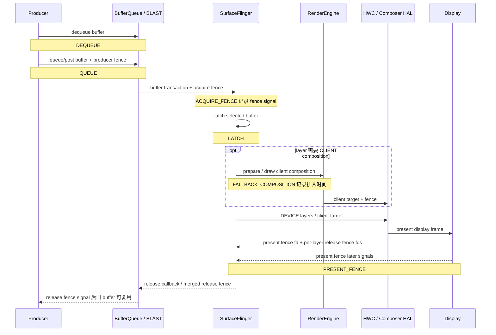

# FrameTracer 与 FrameTimeline 分析

排查卡顿时，我们手里常有两条数据：FrameTimeline 判断某个 SurfaceFrame 或 DisplayFrame 是否按预测时间完成——SurfaceFrame 是某个 layer 提交的一帧，DisplayFrame 是 SurfaceFlinger 把一个或多个 SurfaceFrame 合成后送去显示的一帧；FrameTracer 则记录 buffer 从 Producer 持有、提交、可供读取、latch 到 present 的时间点——latch 指 SurfaceFlinger 选中该 buffer 用于合成，present 指显示系统给出呈现反馈。

> 源码基线：AOSP `android-17.0.0_r1`，内核 `android17-6.18-2026-06_r6`（Android 17 / API 37）。FrameTracer 在 `frameworks/native` 的 SurfaceFlinger 中，只解释它发出的事件时不必依赖内核函数；追查 DMA-BUF、`sync_file` 或 `dma-fence` 时以该内核版本为准。SQL 查询环境是 SmartPerfetto v1.3.0 固定的 Perfetto v57.2 `trace_processor_shell`，并与该版本 importer 的 diff test 对照。

两套数据经常出现在同一条 trace 中，却使用不同的 ID 和时间含义，中间还隔着三种 fence：acquire fence 约束 Consumer 何时可以读取 buffer，present fence 标记显示设备何时完成该帧的 present，release fence 通知 Producer 何时可以安全复用旧 buffer。一旦混用 `frame_number`、FrameTimeline token 和这三种 fence，语法正确的查询也会得出错误归因。

顺着这条线，FrameTracer 在系统侧记录图形帧事件，FrameTimeline 用 token 把应用预期、实际提交和显示结果关联起来。Expected 与 Actual timeline 的差值，要结合 layer 和线程上下文才能解释卡顿责任。

## FrameTracer 事件生成与 token 关联

### 两条数据源分别保存什么

SurfaceFlinger（下文简称 SF）注册了两条独立的 Perfetto 数据源，我们先分清它们各自保存什么：

| 数据源 | 主要实现 | 观测对象 | 适合回答的问题 |
| --- | --- | --- | --- |
| `android.surfaceflinger.frametimeline` | `Scheduler/FrameTimeline.cpp` | expected（预测）与 actual（实际）的 SurfaceFrame、DisplayFrame | 帧是否晚到、丢弃或发生 Buffer Stuffing（队列持续积压），App 与 SF 哪一侧错过预测时间 |
| `android.surfaceflinger.frame` | `FrameTracer/FrameTracer.cpp` | 每个 layer/buffer 的阶段事件 | Producer 何时持有和提交 buffer、producer fence 何时 signal（变为已完成）、SF 何时 latch、显示 present 反馈何时到达 |

FrameTimeline 使用 `surface_frame_token` 与 `display_frame_token` 标识帧，一个 DisplayFrame 可以包含多个 SurfaceFrame。FrameTracer 这边用的是 layer、buffer id 与 BufferQueue frame number：buffer id 标识被循环使用的 buffer 对象，frame number 标识该 BufferQueue 上的一次提交。Perfetto 导入后，buffer id 主要编码在 track name 中，`frame_number` 与 `layer_name` 则作为 `frame_slice` 字段提供给 SQL——写 SQL 时从这两个字段取值即可。

两套数据之间没有可直接等值连接的“全程帧号”，FrameTracer 的 `frame_number` 也无法与 `surface_frame_token` 或 `display_frame_token` 直接比较。联合分析要先限定同一个 layer，再根据时间是否重叠、是否靠近同一次 present，以及相关 transaction（提交给 SF 的状态更新）建立对应关系。

### Android 17 的六个实际发射事件

`graphics_frame_event.proto` 是这类 trace 数据的 Protocol Buffers 结构定义，一共列出 14 个枚举值，连 `UNSPECIFIED` 也算在内。枚举只表示协议允许写入哪些值，AOSP 实际并不见得会发出每一种事件。我们拿 `android-17.0.0_r1` 的 `Layer.cpp`、`FrameTracer.cpp`、`SurfaceFlinger.cpp` 和 `HWComposer.cpp` 逐一核对过，AOSP SurfaceFlinger 真正会写的只有以下六类 emit 调用：

| 事件 | Android 17 发射位置 | 时间含义 | 判读限制 |
| --- | --- | --- | --- |
| `DEQUEUE` | `Layer::setBuffer()` 处理带有效 `dequeueTime` 的 buffer transaction | Producer 从 BufferQueue 取得该 buffer 的时间 | 只在 transaction 携带正数 `dequeueTime` 时记录 |
| `QUEUE` | 与 `DEQUEUE` 相同的 `dequeueTime > 0` 条件块，时间取 `postTime` | buffer transaction 携带的提交时间 | 没有有效 `dequeueTime` 时，AOSP 连 `QUEUE` 也不会记录；该事件不能当成 GPU 已完成，也不表示 SF 已经采纳该 buffer |
| `ACQUIRE_FENCE` | latch 路径调用 `traceFence()` | producer/acquire fence 的 signal 时间 | 对 HWUI（Android 硬件加速 UI 渲染器）常对应 GPU 写完；Camera、Video 或原生 Producer 可能来自其他硬件 |
| `LATCH` | `Layer::latchBufferImpl()` 附近 | SF 采纳该 buffer 的 latch 时间 | Android 13+ 允许特定 unsignaled buffer 先 latch，读取前仍须遵守 fence |
| `FALLBACK_COMPOSITION` | `OutputLayer::requiresClientComposition()` 为真时 | 该 layer 被加入 client composition 的时间戳 | client composition 指 RenderEngine 使用 GPU 合成；这里记录的是任务被安排进入该路径的时间，不是 GPU 完成时间 |
| `PRESENT_FENCE` | post-composition 路径 | display present fence signal；无有效 fence 时使用 HWC present timestamp 推导值 | HWC 是 Hardware Composer（硬件合成器）；present fence 按 display 和 frame 生成，FrameTracer 把同一个 display 反馈记到相关 layer 上 |

下面这张图把六个事件放回 Producer、SurfaceFlinger 与显示系统的公共路径。Producer 生成并提交图像内容，BufferQueue 在 Producer 与 Consumer 之间传递 buffer；在这条路径中，SF 选择要使用的 buffer，RenderEngine 或 HWC 再负责后续合成。虚线 release 路径只用于说明真实的 buffer 回收关系，不属于 AOSP FrameTracer 的 emit 集合。



图中的 `PRESENT_FENCE` 是 Android 显示栈的 present 参考时间，要判断面板像素是否完成光学响应，或者旧 buffer 何时可安全复用，还得分别去看光学测量和每个 layer 的 release fence。AOSP 虽然在 proto 中保留 `RELEASE_FENCE = 9`，FrameTracer 没有对应 emit 调用。

允许 unsignaled latch（fence 尚未 signal 时先选中 buffer）时，acquire fence 的等待被推迟到后续真正读取 buffer 的位置。DEVICE composition 由 HWC 直接合成 layer，SF 会把原 layer 的 acquire fence 随 buffer 交给 HWC；CLIENT composition 由 RenderEngine 使用 GPU 合成，它会消费或等待原 layer 的 fence，再把 GPU 合成后的整屏目标 buffer——client target——及其完成 fence 交给 HWC。所以在 trace 里看到 `LATCH` 早于 `AcquireFenceSignaled` 时，我们要先想起这条机制，而不是认定 SF 在没有同步的情况下读取了 buffer。

#### `HWC_COMPOSITION_QUEUED` 与 `RELEASE_FENCE`

`HWC_COMPOSITION_QUEUED = 6` 和 `RELEASE_FENCE = 9` 在 Android 17 的 AOSP SurfaceFlinger 中都没有 emit 调用。trace 中出现前者时，我们应先记录设备 build 与来源实现，再判断它是否来自设备厂商自行增加的跟踪代码——OEM instrumentation；只看 proto 注释，还不足以把它归为标准 AOSP 事件。

同样，trace 里缺少 `RELEASE_FENCE` 事件，也说明不了系统没有 release fence：HWC 仍会返回每个 layer 的 release fence，SurfaceFlinger 仍会按需要合并，并通过 release callback / BufferQueue 传给 Producer，只是 FrameTracer 数据源没有把这条信号写入 `GraphicsFrameEvent`。

### `traceFence()` 为什么可能缺尾部事件

`traceFence()` 遇到已 signal 的 fence 时，会按 signal time 写入事件；遇到仍在等待完成的 pending fence 时，会把它保存到对应 layer、buffer id 的 `pendingFences`。要等同一个 buffer 以后再次触发 FrameTracer 调用，`tracePendingFencesLocked()` 才会重新检查，并补写此时已经 signal 的事件。

这套实现会影响以下三种判断：

1. 即使补写发生得晚，trace 文件里的 protobuf 记录单元 TracePacket，其 timestamp 仍使用原 fence signal time；Trace Processor 按时间排序后，事件会出现在原来的 signal 位置；
2. trace 结束前没有后续同 buffer 调用时，尾部 pending fence 可能没有机会补写；
3. signal time 距检查时刻超过 60 秒的 pending fence 会被丢弃，防止前一次 trace 遗留的 fence 被写进后续采集。

因此，看到某一帧缺少 `AcquireFenceSignaled` 或 `PresentFenceSignaled`，我们要结合 trace 尾部、buffer 是否继续复用、fence 有效性和数据源采集区间下判断，正确的写法是“这条 fence 在本段 trace 中没有留下 signal 事件”，而非“fence 从未 signal”。

### Perfetto v57.2 怎样导入 Graphics Frame Event

Perfetto 的 `GraphicsFrameEventParser` 会把一条 proto 事件导入成两种东西：raw event，即单个原始事件；以及 phase slice，由一对起止事件配对生成的阶段区间。在 Perfetto v57.2 中，SQL 查询入口是 `gpu_track` 和 `frame_slice`，筛选条件为 `gpu_track.scope = 'graphics_frame_event'`。

| track name | slice 内容 | `dur` 的含义 |
| --- | --- | --- |
| `Buffer: <bufferId> <layer>` | `Dequeue`、`Queue`、`AcquireFenceSignaled`、`Latch`、`FallbackComposition`、`PresentFenceSignaled` 等 raw event | importer 支持带 `duration_ns` 的 span（持续区间）；Android 17 的六类 AOSP emit 调用没有传入正 duration，因此均导入为 instant slice（零时长事件） |
| `APP_<bufferId> <layer>` | 一帧对应一个 phase slice | `DEQUEUE → QUEUE` |
| `GPU_<bufferId> <layer>` | 一帧对应一个 phase slice | `QUEUE → ACQUIRE_FENCE signal` |
| `SF_<bufferId> <layer>` | 一帧对应一个 phase slice | `LATCH → PRESENT_FENCE signal` |
| `Display_<layer>` | 连续 present 之间的 phase slice | 当前 present → 同 layer 下一次 present |

`APP_` phase 表示 Producer 持有 buffer 的时间，里面可能装着 CPU 准备、GPU 提交、主动 pacing、锁等待或其他 Producer 行为——pacing 指按目标帧率控制提交节奏——所以给它统一命名为“App 绘制耗时”是错的。`GPU_` phase 表示从提交到 producer fence signal 的间隔；对 HWUI，它常能反映等待 GPU 完成的时间，对 Camera、Video 和其他硬件 Producer，我们则要按对应设备的完成信号解释。

`SF_` phase 把 latch 到 display present feedback 合成一个区间，覆盖 SF 调度、CLIENT/DEVICE composition 和显示后段，想单独量出 HWC 或 RenderEngine 的执行时间，得去别的数据里找。`Display_` phase 表示相邻 present 的 cadence，也就是重复出现的帧节奏；它不含 buffer 从 present 到 release 的生命周期。末尾的 `Display_` slice 没有下一次 present 与它配对时，`dur` 为 `-1`，表示区间尚未闭合。

还有一个 parser 分支要考虑：acquire fence 可能在 `QUEUE` packet 被 importer 处理前已经 signal，此时 importer 不创建 `GPU_` phase，以免生成起止顺序相反或时长错误的区间。所以某一帧缺少 `GPU_` slice 时，先想到这个分支，再谈数据损坏。

### 确认 trace 中是否有这组数据

下面的片段只展示两条 SurfaceFlinger 数据源，需合并到已经定义采集时长与 buffer 的完整配置中。

```textproto
data_sources {
  config { name: "android.surfaceflinger.frame" }
}
data_sources {
  config { name: "android.surfaceflinger.frametimeline" }
}
```

这只是可合并的配置片段，要合并进完整采集配置才能运行。完整排障应按问题补充 sched、atrace、GPU counter 或应用 track event，并根据采集时长与数据量设置 buffer。另外，`gfx` 这类 atrace category 与这两条原生 Perfetto 数据源是两套开关：只打开 `gfx`，判断这两条数据源有没有启用，还得看配置里有没有上面的数据源项。

### SQL 1：列出目标 layer 的 raw event 与 phase

这条查询采用 Perfetto v57.2 importer diff test 使用的表关系，并增加目标 layer 过滤。`ts` 与 `dur` 的单位是纳秒，`GLOB` 使用通配符匹配 layer 名称。

```sql
SELECT
  fs.ts,
  fs.dur,
  gt.name AS track_name,
  fs.name AS slice_name,
  fs.frame_number,
  fs.layer_name
FROM gpu_track AS gt
JOIN frame_slice AS fs
  ON fs.track_id = gt.id
WHERE gt.scope = 'graphics_frame_event'
  AND fs.layer_name GLOB '*com.example.app*'
ORDER BY fs.ts;
```

把包名替换为目标 layer 名称中稳定不变的片段。`Buffer:` 轨迹用于查看六类 raw event；`APP_`、`GPU_`、`SF_`、`Display_` 轨迹已经由 importer 计算好阶段时长。查询结果中 `dur = -1` 的未闭合 slice 要先剔除，再算均值、P95 或总时长统计——P95 即第 95 百分位值。

### SQL 2：按 frame number 汇总四类 phase

下面的查询把 importer 生成的 phase 归入四列，不使用 SQLite 不支持的 `PIVOT` 语法。

```sql
WITH phase AS (
  SELECT
    fs.layer_name,
    fs.frame_number,
    fs.dur,
    CASE
      WHEN gt.name GLOB 'APP_*' THEN 'app_hold'
      WHEN gt.name GLOB 'GPU_*' THEN 'producer_fence_wait'
      WHEN gt.name GLOB 'SF_*' THEN 'latch_to_present'
      WHEN gt.name GLOB 'Display_*' THEN 'present_interval'
    END AS phase_name
  FROM gpu_track AS gt
  JOIN frame_slice AS fs
    ON fs.track_id = gt.id
  WHERE gt.scope = 'graphics_frame_event'
    AND fs.dur >= 0
    AND fs.layer_name GLOB '*com.example.app*'
)
SELECT
  layer_name,
  frame_number,
  MAX(CASE WHEN phase_name = 'app_hold' THEN dur END) / 1e6
    AS app_hold_ms,
  MAX(CASE WHEN phase_name = 'producer_fence_wait' THEN dur END) / 1e6
    AS producer_fence_wait_ms,
  MAX(CASE WHEN phase_name = 'latch_to_present' THEN dur END) / 1e6
    AS latch_to_present_ms,
  MAX(CASE WHEN phase_name = 'present_interval' THEN dur END) / 1e6
    AS present_interval_ms
FROM phase
WHERE phase_name IS NOT NULL
GROUP BY layer_name, frame_number
ORDER BY latch_to_present_ms DESC;
```

NULL 表示该 phase 在当前 trace 中没有闭合或没有生成，这一格就是缺失证据，用 `COALESCE(..., 0)` 改写成零耗时会把问题藏起来。排序只用于定位候选帧；判断原因时还要把 active refresh rate、FrameTimeline expected/actual、线程状态、GPU 数据和 composition type 放在一起看。

这条汇总还假设查询窗口内的完整 `layer_name` 只对应一个 layer 生命周期。窗口销毁后重建、出现同名 layer，或镜像到多个 Display 时，同名对象可能从较小的 frame number 重新计数。对长 trace 做自动化查询时，我们应进一步限制时间窗，并保留原始 track name 或 layer 标识，免得把来自不同 BufferQueue 的同名帧合并到一起。

### FrameTimeline 与 FrameTracer 怎样配合

FrameTimeline 从 Android 12 起提供 expected/actual SurfaceFrame 与 DisplayFrame。Android 17 的 `ActualSurfaceFrameStart` 包含多组判断字段：`present_type` 表示早到、准时或晚到，`on_time_finish` 表示 App 是否按时完成，`gpu_composition` 表示是否使用 GPU 合成，`jank_type` 与 `jank_severity_type` 描述卡顿类型和严重程度，`prediction_type` 描述预测是否仍有效，`is_buffer` 区分 buffer 帧与动画状态。`present_delay_millis`、`vsync_resynced_jitter_millis` 和 `jank_severity_score` 则提供延迟、VSync 重新同步抖动与评分。SQL 视图会把 jank bitmask——一个用不同二进制位同时表示多个原因的整数——转换成可读分类。

相比 `android-16.0.0_r1`，Android 17 的 proto 增加了五个 jank 枚举值，取值和诊断含义见下文「Android 17 新增的分类」。同时新增的还有 `jank_type_experimental`、`present_type_experimental` 与 `jank_debug_metadata`，proto 明确要求 experimental 字段不得用于正式 jank 判定。这些新增项来自 Android 16 与 Android 17 固定 tag 的 proto 对比；某个字段存在于当前文件，也就说明不了更早版本支持它。

#### `gpu_composition` 与 `FALLBACK_COMPOSITION`

把两条数据源对上之后我们会发现，`Layer.cpp` 在 `OutputLayer::requiresClientComposition()` 为真时记录 `FALLBACK_COMPOSITION`，并对相关 SurfaceFrame 调用 `setGpuComposition()`，所以 FrameTimeline 的 `gpu_composition` 与 FrameTracer raw event 来自同一条 client-composition 判定分支。

`requiresClientComposition()` 在当前 output layer 没有 HWC state，或 HWC composition type 为 `CLIENT` 时返回真。一次 display frame 可以同时包含由 HWC 直接合成的 DEVICE layer 和由 RenderEngine 生成的 CLIENT target。某个 layer 出现 `FallbackComposition`，只说明它进入 client composition；overlay plane 有没有用完、RenderEngine 的 GPU 时长是多少，这条事件单独回答不了——像素 format、几何 transform、alpha blend、dataspace、color transform、protected content 和 vendor HWC 策略都可能影响这一选择。

#### 两套 frame identity 的对齐方式

两套 ID 各有各的对齐方式：FrameTimeline 查询用 `surface_frame_token` 对齐 App expected/actual，用 `display_frame_token` 对齐 SurfaceFrame 与 DisplayFrame；FrameTracer 查询用 `layer_name` 与 BufferQueue `frame_number`。两者联合分析时，我们按以下步骤操作：

1. 在 `actual_frame_timeline_slice` 中选出目标进程和目标 layer 的 late/dropped frame；
2. 记录该 SurfaceFrame 的时间区间与 `display_frame_token`；
3. 在相同 layer、相邻时间范围内查找 `APP_`、`GPU_`、`SF_` phase 和 raw event；
4. 回到 Perfetto UI 检查 layer、transaction、`BufferTX - <layerName>`，以及该帧前后的 present 事件；
5. 需要自动关联时，限定时间窗并输出匹配置信度，frame token 与 frame number 之间不写成等值条件。

标准 HWUI App Window 的 FrameTimeline 覆盖较完整。SurfaceView、Camera、Video、游戏、WebView overlay、Flutter PlatformView 等路径可能有独立 Producer、独立 layer，或没有完整的 App SurfaceFrame——overlay 指独立的叠加层。这时我们先识别真正提交 buffer 的 Producer 与目标 layer，再决定能否主要依靠 FrameTimeline 定位帧。

### 四类耗时怎样读

#### `APP_` 偏长：Producer 长时间持有 buffer

`DEQUEUE → QUEUE` 增长说明 Producer 拿到 buffer 后较晚提交。对标准 HWUI，我们检查 MainThread、RenderThread、`DrawFrame`、Skia/GPU submit 与 pacing；对游戏检查 Logic、Render/RHI 和 swap——RHI 即 Rendering Hardware Interface，渲染硬件抽象层；对 Camera/Video 检查 HAL、codec 与时间戳策略。即使 CPU 线程不忙，也可能存在主动 pacing、GPU backpressure 或同步依赖，backpressure 指 GPU 处理不过来导致上游放慢。

#### `GPU_` 偏长：producer completion fence 晚

`QUEUE → ACQUIRE_FENCE signal` 增长表示 Consumer 等了较久，才获得可以安全读取的 buffer。分析 HWUI 或游戏时，通常还要补充 GPU stage、frequency、utilization、shader 和内存带宽证据；Camera、Video 和硬件 blitter——负责复制、缩放或格式转换图像的硬件单元——则要按对应生产设备的 completion fence 解释。判定阈值也一样：固定使用 16.5 ms，会在 90/120 Hz、30 fps 内容、VRR（Variable Refresh Rate，可变刷新率）、ARR（Adaptive Refresh Rate，自适应刷新率）和非整数帧节奏场景中产生误报，我们应改为与当前 expected timeline 和目标帧率比较。

#### acquire 已 signal，latch 仍晚：检查 transaction 与 SF 调度

FrameTracer importer 没有生成独立的 acquire-to-latch phase track。我们可以从 raw event 时间或事件参数计算二者间隔，再查看 transaction readiness、同步 transaction、`BufferTX - <layerName>`、SF actual timeline，以及该 layer 是否被本轮合成选中——transaction readiness 指 transaction 是否满足提交条件。Android 13+ 的 unsignaled latch 还会让 latch 与 fence signal 的先后关系更灵活，只看事件顺序，就读不出真正的读取等待发生在哪里。

#### `SF_` 偏长：系统输出段的综合延迟

`LATCH → PRESENT_FENCE signal` 同时包含 SF 调度、HWC validate/present、可选的 RenderEngine client composition、显示模式节奏和 display 后段。若出现 `FallbackComposition`，我们继续检查 RenderEngine 与 GPU；若全部目标 layer 都走 DEVICE composition，继续检查 HWC、DisplayHAL、刷新率或 mode change。present fence 仍只是显示栈中的参考时间，panel 扫描和光学响应需要额外测量。

#### `Display_` 偏长：相邻 present 的帧节奏出现空档

`Display_` 的 duration 是同一 layer 相邻两次 present feedback 的间隔，适合观察帧节奏和继续显示旧 buffer 的时段，但它量的是 present 间隔，某个 buffer 从 present 到允许复用的延迟——release latency——需要其他数据。30 fps 内容在 60 Hz display 上出现约 33.3 ms 间隔可能完全符合预期，必须结合 requested frame rate、内容帧率与 FrameTimeline 判断。

### 按出图类型修正解释

| 出图类型 | FrameTracer 中要锁定的对象 | 不能直接套用的解释 |
| --- | --- | --- |
| 标准 App Window | 宿主 App Window layer | `APP_` 仍不等于完整 `doFrame`；主线程工作可能发生在 dequeue 前 |
| SurfaceView / 游戏 Surface | 独立 Surface layer | 宿主窗口 token 不能代替独立 layer 的 buffer frame number |
| TextureView | 宿主 App Window layer，外部 SurfaceTexture 另查 | 外部 Producer 的 ready 时间不等于宿主窗口 present |
| 软件绘制 / 离屏渲染 | 最终上传或提交到窗口的 layer；纯离屏 Bitmap 没有 SF layer | 离屏 CPU 绘制可能发生在 dequeue 前，不能要求 FrameTracer 覆盖这段工作 |
| Native EGL / Vulkan | 实际 `ANativeWindow` / Surface 对应的独立 layer | 不能套用 MainThread、RenderThread 或 HWUI 的线程归因 |
| Camera / 普通 Video Surface | preview/video layer | acquire fence 可能来自 HAL 或 codec，不能统一归为 GPU |
| Tunneled / sideband video | sideband layer 与 HAL/HWC 证据；sideband 表示视频数据通过专用硬件路径交给显示系统 | 可能没有普通的逐帧 BufferQueue / FrameTracer 事件 |
| WebView / Flutter / React Native | 先区分宿主合成和独立 overlay | framework frame id 不能直接作为 BufferQueue frame number |
| 多窗口 / 多 Display | 每个窗口的 layer 与各自目标 Display | 共享进程或线程不等于共享 BufferQueue；present fence 必须按 Display 区分 |

这张表按渲染管线中的 Producer、Surface、layer 与 composition 关系区分场景。我们排障时如果只看事件名，很容易把宿主窗口、独立 Surface 和 display frame 都当成同一条“App 帧”。

### 不同 Android 版本的能力

| 平台 | 数据能力 | 判读影响 |
| --- | --- | --- |
| Android 11 / API 30 | FrameTracer 数据源已经存在 | 缺少 Android 12 的 FrameTimeline 配套；可单独分析 buffer phase |
| Android 12 / API 31 | FrameTimeline 成为现代 trace 基线 | 可以用 SurfaceFrame/DisplayFrame 选 jank 候选，再按 layer 与时间匹配 FrameTracer |
| Android 13 / API 33 | `AutoSingleLayer` unsignaled latch 成为默认策略，允许符合条件的单 layer buffer 在 fence signal 前先 latch | latch 与 acquire fence signal 不再保持简单的“必须先 signal 再 latch”假设 |
| Android 14～16 / API 34～36 | 两条数据源的公共模型延续 | 仍要固定设备、vendor build、刷新率和 Perfetto 版本 |
| Android 17 / API 37 | 本文核对的源码与 proto 版本；扩展 FrameTimeline jank bitmask | 使用 Android 17 调用名、emit 集合和五个新增 jank 值 |

联合诊断的范围因此从 Android 12 开始，这条路径依赖 FrameTimeline；Android 11 的 FrameTracer 可以作为历史兼容路径保留。回到 Android 10 及更早版本，我们应使用当时可用的 BufferQueue、atrace、SF 与 fence 证据，这条 Perfetto data source 就要放一边了。

### 使用限制

FrameTracer 提供的是一组参考时间点和 importer 生成的阶段，端到端的用户可见延迟要把整条链路的数据组合起来才能得到。使用时要遵守以下条件：

- `QUEUE` 之后 Producer 仍可能写 buffer，完成时刻由 acquire fence 约束；
- `LATCH` 表示 SF 采纳 buffer，不保证内容已经完成读取或显示；
- `FALLBACK_COMPOSITION` 表示进入 client composition，不提供 RenderEngine 完成时刻；
- `PRESENT_FENCE` 是每个 display 的 present 反馈，不是每个 layer 的 release，也不是 panel 光学响应；
- FrameTimeline token 与 BufferQueue frame number 属于两套不同的 ID；
- phase 缺失、`dur = -1` 和 trace 尾部 pending fence 都要按缺失证据处理；
- 固定毫秒阈值只能作为筛选条件，帧预算应来自实际刷新率、内容帧率与 expected timeline。

在这些条件下分工是清楚的：FrameTimeline 负责选“哪一帧值得查”，FrameTracer 负责判断“buffer 路径哪一段出现等待”，线程、GPU、HWC 和 display 证据再解释等待来源。

### FrameTracer 部分的参考源码与验证材料

- [Android 17 `FrameTracer.h`](https://android.googlesource.com/platform/frameworks/native/+/refs/tags/android-17.0.0_r1/services/surfaceflinger/FrameTracer/FrameTracer.h) 与 [`FrameTracer.cpp`](https://android.googlesource.com/platform/frameworks/native/+/refs/tags/android-17.0.0_r1/services/surfaceflinger/FrameTracer/FrameTracer.cpp)
- [Android 17 `Layer.cpp` 的六类 emit 调用](https://android.googlesource.com/platform/frameworks/native/+/refs/tags/android-17.0.0_r1/services/surfaceflinger/Layer.cpp)
- [Android 17 `graphics_frame_event.proto`](https://android.googlesource.com/platform/external/perfetto/+/refs/tags/android-17.0.0_r1/protos/perfetto/trace/android/graphics_frame_event.proto)
- [Android 17 `frame_timeline_event.proto`](https://android.googlesource.com/platform/external/perfetto/+/refs/tags/android-17.0.0_r1/protos/perfetto/trace/android/frame_timeline_event.proto)
- [Perfetto v57.2 GraphicsFrameEvent importer](https://github.com/Gracker/perfetto/blob/39bdbfe942aa51de9a08c4fc5f363c2ca57ebd9f/src/trace_processor/importers/proto/graphics_frame_event_parser.cc)
- [Perfetto v57.2 importer diff test 与标准查询](https://github.com/Gracker/perfetto/blob/39bdbfe942aa51de9a08c4fc5f363c2ca57ebd9f/test/trace_processor/diff_tests/parser/graphics/tests.py)
- [Perfetto FrameTimeline 文档](https://perfetto.dev/docs/data-sources/frametimeline)
- [Android 图形同步框架](https://source.android.com/docs/core/graphics/sync)
- [kernel `android17-6.18-2026-06_r6` `sync_file.c`](https://android.googlesource.com/kernel/common/+/refs/tags/android17-6.18-2026-06_r6/drivers/dma-buf/sync_file.c)


## Expected、Actual 与 Jank 分类

事件生产路径明确后，FrameTimeline 就可以按 token 连接 App 和 SurfaceFlinger 了：它用一组可关联的帧 ID 记录调度预测、应用出帧、SurfaceFlinger 合成和显示提交，我们拿着它回答三个问题——哪一帧偏离了预测，偏差发生在应用侧还是显示合成侧，下一步应查看哪条线程或 buffer 路径。deadline miss、prediction error 和 composition 结果需要分别读取。FrameTimeline trace 数据源从 Android 12 / API 31 起可用；标题中的 API 33 指 `Choreographer.VsyncCallback`、`FrameData` 与 `FrameTimeline` 公共 API 的引入版本，平台与查询环境的版本见本章开头的源码基线。

FrameTimeline 的内部对象与分类流程见 §2.12，buffer 阶段事件见本文前文，CUJ 聚合见 §14.7。这里集中处理 Expected/Actual 语义、API 33 回调、采集配置和可执行 SQL。

### 两类帧

FrameTimeline 同时记录应用的 SurfaceFrame 和 SurfaceFlinger 的 DisplayFrame。两类帧的 token 组合不同：

| 对象 | `surface_frame_token` | `display_frame_token` | 代表什么 |
| --- | ---: | ---: | --- |
| 应用 SurfaceFrame | 非空 | 非空 | 某进程向一个 layer 提交的一帧 |
| SF DisplayFrame | `NULL` | 非空 | SurfaceFlinger 组合后提交给某个 display 的一帧 |

token 在这里是用于关联记录的帧 ID。一个 DisplayFrame 可以组合来自多个进程、多个 layer 的 SurfaceFrame，因此多条应用行可以共享同一个 `display_frame_token`：它适合从应用帧追到显示帧，而应用 Expected 与应用 Actual 之间的连接，要用同一 `upid` 下的 `surface_frame_token`。`upid` 是 Trace Processor 为进程分配的内部唯一 ID，可避免直接使用可能被系统复用的 PID。

DisplayFrame 的 protobuf 记录只有自己的 display token，没有 surface token。Perfetto v57.2 因此把 DisplayFrame 行的 `surface_frame_token` 保留为 `NULL`，也就是 SQL 中的空值；部分文档示例仍把这一格显示为 0。查询时我们按字段是否为空区分两类帧，数值 0 只在部分文档示例里出现，不作依据。

数据覆盖上，标准 HWUI App Window 的 SurfaceFrame 最完整——HWUI 即 Android 硬件加速 UI 渲染器。SurfaceView 由独立 Producer 和独立 Surface 出帧，Perfetto 官方文档仍将其列为 FrameTimeline 不支持的路径；Camera、Video、游戏 Surface、WebView overlay 和跨进程嵌入也一样，要先确认真正生成并提交 buffer 的 Producer 与 layer，宿主窗口的 token 代替不了独立 Surface 的帧 ID。

### Expected 与 Actual 各自量什么

每个有可见帧的应用进程会得到 Expected Timeline 和 Actual Timeline，SurfaceFlinger 也有自己的一对 track。

#### 应用侧

- Expected slice 的起点是 Choreographer 回调被计划运行的时刻；slice 表示系统为应用准备该帧安排的时间窗口。
- Actual slice 的起点是 `Choreographer#doFrame` 或 `AChoreographer_vsyncCallback` 开始运行的时刻。
- Actual slice 的终点取 GPU 完成时间与 post time 的较晚者；post time 表示应用把这一帧提交给 SurfaceFlinger 的时刻。

`Choreographer#doFrame` 只覆盖主线程回调区间，Actual SurfaceFrame 还考虑异步 GPU 工作和提交时刻，所以 `doFrame` 较短，也证明不了该帧在 ready deadline 之前就绪——ready deadline 指必须准备完成的时间。Android 17 的 trace 名为 `Choreographer#doFrame <vsyncId>`，例如 `Choreographer#doFrame 12345`；方括号形式不符合该 tag 的源码。

#### SurfaceFlinger 侧

SF Expected slice 表示当前 DisplayFrame 的预测工作窗口；SF Actual slice 从 SF 主线程开始处理该帧，覆盖 Composer 与 Display HAL 相关路径，终点是 Android 显示栈报告 on-screen update 的时刻。

这个 present 时间可以用于分析 Android 显示管线；面板像素是否完成扫描和光学响应，它给不出答案。测量从触摸到屏幕发光的端到端延迟，仍要同时记录输入时间戳、显示链路，并使用外部光学设备。

#### Expected 宽度与刷新周期的关系

Expected slice 的宽度来自该回调的调度预算，即系统预计 App 或 SF 完成工作的可用时间。官方示例中应用 Expected slice 约 20.5 ms，SF Expected slice 约 10.5 ms；拿“90 Hz 就应固定为 11.1 ms”去校验它们，校验的对象就错了。

Android 17 的 `VSyncDispatchTimerQueueEntry::schedule()` 以预测的目标 VSYNC 为参考时间，并使用 `workDuration`、`readyDuration` 计算 wakeup 与 ready 时刻：

```text
nextReadyTime  = nextVsyncTime - readyDuration
nextWakeupTime = nextReadyTime - workDuration
```

公式先从目标 VSYNC 减去 `readyDuration` 得到应当就绪的时间，再向前减去 `workDuration` 得到唤醒时间。理解了这一点就能看出，固定的“VSYNC-app 提前 1～3 ms、再叠加 SF 预算”模型覆盖不了动态刷新率、不同工作预算、VSync 重同步或 Buffer Stuffing——队列持续积压——我们反推 Expected slice 时以公式为准。

### 三个字段要一起看

Actual slice 至少包含以下三组相互独立的信息：

| 字段 | 问题 | 常见值 |
| --- | --- | --- |
| `present_type` | 该帧何时 present | `Early Present`、`On-time Present`、`Late Present`、`Dropped Frame` |
| `on_time_finish` | 生产该帧的工作是否按时结束 | 0 或 1 |
| `jank_type` / `jank_tag` | FrameTimeline 检测到的原因，以及原因归在当前进程还是其他进程 | `App Deadline Missed`、`Buffer Stuffing`、`Self Jank`、`Other Jank` 等 |

时间轴上的偏差适合发现候选帧，分类字段用于说明系统怎样判断这帧。`on_time_finish = 0` 只表示工作超出 ready deadline，拿它过滤全部 jank 会漏帧：Buffer Stuffing 常见 `on_time_finish = 1` 和 `Late Present` 同时出现，应用生产工作虽然按时结束，队列中积压的 buffer 仍会增加输入延迟。

Perfetto UI 用颜色表示状态，以及原因归在当前进程还是其他进程：

| 颜色 | UI 含义 | 判读 |
| --- | --- | --- |
| 绿色 | good frame | 没有检测到 jank |
| 浅绿色 | high-latency state | 帧节奏可能平滑，但帧持续晚 present，输入延迟增加 |
| 红色 | self jank | 当前 slice 所属进程被判为原因 |
| 黄色 | other jank | 只用于应用 track；当前应用帧受 SF/display 侧问题影响 |
| 蓝色 | dropped frame | 应用状态更新未及时交给 RenderThread，或 SF 选择较新的显示帧 |

Android 17 `SurfaceFrame::isSelfJanky()` 将 `AppDeadlineMissed`、`AppResyncedJitter` 和 `Unknown` 视为应用自身 jank；SF scheduling、SF CPU/GPU deadline、Display HAL 和 Prediction Error 则形成系统侧原因。看到黄色，我们只知道 FrameTimeline 把当前帧归到了系统侧，而复杂 layer、GPU 负载或 composition 变化仍可能由应用行为触发，排障时还要顺着 flow——跨 track 的事件关联线——检查 layer 和系统负载。

`jank_type` 是把 bitmask 转换成的字符串，一帧可以同时带多个原因。Perfetto v57.2 还提供 `jank_tag`，把结果归并为 `Self Jank`、`Other Jank`、`Buffer Stuffing`、`SurfaceFlinger Stuffing`、`Dropped Frame`、`Non-perceivable Jank` 等预计算类别。做统计时应优先使用这个分类，避免靠字符串包含关系自行分组。

Android 17 的 Actual SurfaceFrame protobuf 记录还包含 `present_delay_millis`、`vsync_resynced_jitter_millis`、`jank_severity_type` 与 `jank_severity_score`，前两者分别是 present 延迟与 VSync 重同步抖动；DisplayFrame 没有 VSync 重同步抖动字段。Perfetto v57.2 在内置表中把 severity score 命名为 `jank_score`。这些值可以描述偏差幅度和严重程度，我们要把它们和 `jank_type`、present 状态与采集版本放在一起读；脱离这些上下文另起一套 jank 判定，是行不通的。protobuf 中带 `experimental` 的 jank、present 与 debug 字段明确标注为调试数据，正式 jank 指标里不该出现。

### API 33 的 `FrameData` 用法

API 33 新增 `Choreographer.postVsyncCallback(VsyncCallback)`。这个一次性回调接收 `FrameData`，公开方法如下：

| 类型 | 方法 | 返回内容 |
| --- | --- | --- |
| `FrameData` | `getFrameTimeNanos()` | 当前回调使用的 frame time |
| `FrameData` | `getFrameTimelines()` | 按时间排序的候选 `FrameTimeline[]` |
| `FrameData` | `getPreferredFrameTimeline()` | 平台当前选中的候选 timeline |
| `FrameTimeline` | `getVsyncId()` | 与 HWUI、SurfaceFlinger trace 关联的 VSYNC id |
| `FrameTimeline` | `getExpectedPresentationTimeNanos()` | 预测 present 时间，使用 `System.nanoTime()` 时基 |
| `FrameTimeline` | `getDeadlineNanos()` | 该候选帧应当 ready 的时间，使用 `System.nanoTime()` 时基 |

`FrameData.getLastFrameTimeNanos()`、`FrameData.getIntervalNanos()`、`Choreographer.getFrameData()` 都不属于公共 API。deadline 也不等同于“主线程 CPU 工作结束时间”；应用的 buffer 与 GPU 工作要在这个时刻前满足后续 Consumer 的读取条件。

下面的 Java 片段演示如何在 API 33+ 复制一次回调中的标量值。

```java
if (Build.VERSION.SDK_INT >= Build.VERSION_CODES.TIRAMISU) {
    Choreographer choreographer = Choreographer.getInstance();
    choreographer.postVsyncCallback(frameData -> {
        Choreographer.FrameTimeline preferred =
                frameData.getPreferredFrameTimeline();

        long frameTimeNanos = frameData.getFrameTimeNanos();
        long vsyncId = preferred.getVsyncId();
        long deadlineNanos = preferred.getDeadlineNanos();
        long expectedPresentNanos =
                preferred.getExpectedPresentationTimeNanos();

        recordFramePlan(
                frameTimeNanos,
                vsyncId,
                deadlineNanos,
                expectedPresentNanos);
    });
}
```

这段代码要在带 `Looper` 的线程调用，回调会在 `Choreographer` 绑定的同一线程执行——`Looper` 即 Android 线程消息循环。`FrameData` 与其中的 `FrameTimeline` 只在 `onVsync` 执行期间有效，Android 17 源码在回调外访问时会抛出 `IllegalStateException`，所以需要异步记录时，我们只复制 `long` 等标量值。`postVsyncCallback()` 执行一次后会移除，连续观测要由调用方再次注册，并控制日志写入和对象分配成本。

Android 17 内部的 `DisplayEventReceiver.VsyncEventData` 为候选数组预留 7 个槽位，但 `FrameData.update()` 会按事件携带的 `frameTimelinesLength` 重新分配数组。公共 API 没有承诺固定返回 7 项，业务代码应读取实际数组长度，并使用平台标出的 preferred 项。

这些 API 提供的是本次回调可选的调度计划，替代不了 FrameTimeline trace：应用进程只凭 `FrameData`，拿不到最终 present、SF 分类、其他 layer 或 Display HAL 结果。

### 正确启用数据源

FrameTimeline 是原生 Perfetto 数据源 `android.surfaceflinger.frametimeline`。`gfx`、`view` 属于 atrace category，也就是 Android trace 事件分类，可以补充 `Choreographer#doFrame`、`DrawFrame` 和图形 slice，但 FrameTimeline 数据源要由上面的配置单独打开。

下面的配置片段同时启用 FrameTimeline、FrameTracer、应用图形 slice 和线程调度信息，需合并到已经定义采集时长与 buffer 的完整配置中。

```textproto
data_sources {
  config { name: "android.surfaceflinger.frametimeline" }
}
data_sources {
  config { name: "android.surfaceflinger.frame" }
}
data_sources {
  config {
    name: "linux.ftrace"
    ftrace_config {
      ftrace_events: "sched/sched_switch"
      ftrace_events: "sched/sched_waking"
      ftrace_events: "power/cpu_frequency"
      atrace_categories: "view"
      atrace_categories: "gfx"
      atrace_categories: "wm"
      atrace_apps: "com.example.app"
    }
  }
}
```

这段内容要合并进完整采集配置才能运行。采集时长和 buffer 容量按复现窗口、设备内存与实际数据速率设定，适用于所有场景的固定数值并不存在。`android.surfaceflinger.frame` 是可选的 buffer 阶段数据源，见 §14.13。定位单个应用时，我们把 `atrace_apps` 换成目标包名；使用全局 `*` 会增加 ftrace 数据量。生产问题还要按待验证的原因加入 GPU counter、Binder、memory 或 power 数据，避免无关数据占满 ring buffer——写满后覆盖旧数据的环形缓冲区。

下面的命令使用文本配置采集并拉回 trace。

```bash
adb push frame_timeline.pbtxt /data/local/tmp/
adb shell perfetto --txt \
  -c /data/local/tmp/frame_timeline.pbtxt \
  -o /data/misc/perfetto-traces/frame_timeline.perfetto-trace
adb pull /data/misc/perfetto-traces/frame_timeline.perfetto-trace
```

命令依次把文本配置推到设备、启动 Perfetto 采集，再把 trace 文件拉回电脑。采集结束后，我们先在 Trace Processor 中确认两张 FrameTimeline 表有数据；若 UI 缺少应用 Expected/Actual track，再依次检查平台是否为 Android 12+、原生数据源是否启用、目标应用在采集区间内是否产生可见帧，以及目标路径是否属于独立 Surface 或未覆盖的 SurfaceView。

### UI 排障顺序

一次可靠的帧级分析可以按下面的顺序进行：

1. 在目标进程下选中红色、黄色、浅绿色或蓝色 Actual slice，记录 `surface_frame_token`、`display_frame_token`、layer、`jank_tag`、`jank_type`、`present_type` 和 `on_time_finish`。
2. 用 `surface_frame_token` 找同进程的 Expected slice，比较计划起点、实际回调起点、ready 窗口和 Actual 终点。
3. 沿 UI flow 跟到 SurfaceFlinger 的 DisplayFrame。一个显示帧可能连接多条应用 layer，不要把同 token 的所有行当成重复数据。
4. `Self Jank` 时检查同一 VSYNC id 的 `Choreographer#doFrame <id>`、RenderThread `DrawFrame <id>`、CPU scheduling、GPU 与 acquire fence。
5. `Other Jank` 时检查 SF actual track、composition type、RenderEngine、HWC/Display HAL、刷新率和 mode/power change。
6. `Buffer Stuffing` 时检查 Producer 的提交节奏、连续 late present、dequeue 阻塞和 FrameTracer phase；这类高延迟状态下 `on_time_finish = 1` 仍可能出现。

`doFrame` 较长只能说明主线程回调占用明显；`doFrame` 较短而 Actual 较长时，RenderThread、GPU、提交等待或 Producer 与 SF 的交接过程仍可能有问题，要确认原因，还需查询对应线程、GPU、fence 或 BufferQueue 数据。

### Perfetto SQL：按正确身份对齐

`expected_frame_timeline_slice` 与 `actual_frame_timeline_slice` 是 Trace Processor 导入 trace 时直接生成的内置表，查询它们不需要 `INCLUDE PERFETTO MODULE android.frames.timeline`。Perfetto v57.2 的表结构包含 `name`、两个 token、`upid`、`layer_name`、`present_type`、`on_time_finish`、`jank_type` 与 `jank_tag`，没有 `slice_name` 列。

#### 查询 1：逐帧比较应用 Expected 与 Actual

下面的查询只选择应用 SurfaceFrame，并用 `upid + surface_frame_token` 连接 Expected 与 Actual。两个字段一起使用，可以避免不同进程恰好出现相同 token 时发生误连。

```sql
WITH app_actual AS (
  SELECT
    a.*,
    p.name AS process_name
  FROM actual_frame_timeline_slice AS a
  LEFT JOIN process AS p USING (upid)
  WHERE a.surface_frame_token IS NOT NULL
),
app_expected AS (
  SELECT
    upid,
    surface_frame_token,
    ts AS expected_ts,
    dur AS expected_dur
  FROM expected_frame_timeline_slice
  WHERE surface_frame_token IS NOT NULL
)
SELECT
  a.process_name,
  a.layer_name,
  a.surface_frame_token,
  a.display_frame_token,
  a.ts / 1e6 AS actual_start_ms,
  a.dur / 1e6 AS actual_dur_ms,
  e.expected_ts / 1e6 AS expected_start_ms,
  e.expected_dur / 1e6 AS expected_dur_ms,
  (a.ts + a.dur - e.expected_ts - e.expected_dur) / 1e6
    AS end_delta_ms,
  a.present_type,
  a.on_time_finish,
  a.jank_tag,
  a.jank_type
FROM app_actual AS a
JOIN app_expected AS e
  USING (upid, surface_frame_token)
WHERE a.process_name = 'com.example.app'
ORDER BY a.ts;
```

`end_delta_ms` 是 Actual 终点减去 Expected 终点得到的时间差，只用于排序和定位，单独当 jank 判定会误导。若同一 token 对应多个 layer，结果会保留多条 Actual 行，每一行都代表一个 layer，用 `DISTINCT` 去重会把真实信息藏起来。

#### 查询 2：按原因归属、present 与 ready 状态统计

下面的查询保留 Buffer Stuffing、Dropped Frame 和 non-perceivable 状态，不使用 `on_time_finish = 0` 预先删行。

```sql
SELECT
  a.jank_tag,
  a.jank_type,
  a.present_type,
  a.on_time_finish,
  COUNT(*) AS frame_count,
  AVG(a.dur) / 1e6 AS avg_actual_ms,
  MAX(a.dur) / 1e6 AS max_actual_ms
FROM actual_frame_timeline_slice AS a
LEFT JOIN process AS p USING (upid)
WHERE a.surface_frame_token IS NOT NULL
  AND p.name = 'com.example.app'
GROUP BY
  a.jank_tag,
  a.jank_type,
  a.present_type,
  a.on_time_finish
ORDER BY frame_count DESC;
```

这份聚合能区分“工作超 deadline”“present 晚”“队列积压”和“原因归在其他进程”。`dur` 来自 FrameTimeline 的 Actual slice，统一解释成主线程、GPU 或端到端显示耗时都会出错。

#### 查询 3：把应用帧连接到 SF DisplayFrame

下面的查询用 `display_frame_token` 找到应用 SurfaceFrame 对应的 SF DisplayFrame，并通过 `surface_frame_token IS NULL` 只保留 DisplayFrame 行，防止连接到其他应用 layer。

```sql
WITH app_frame AS (
  SELECT
    a.*,
    p.name AS process_name
  FROM actual_frame_timeline_slice AS a
  LEFT JOIN process AS p USING (upid)
  WHERE a.surface_frame_token IS NOT NULL
    AND p.name = 'com.example.app'
),
display_frame AS (
  SELECT
    a.*
  FROM actual_frame_timeline_slice AS a
  LEFT JOIN process AS p USING (upid)
  WHERE a.surface_frame_token IS NULL
    AND p.name GLOB '*surfaceflinger'
)
SELECT
  app.surface_frame_token,
  app.display_frame_token,
  app.layer_name,
  app.jank_tag AS app_jank_tag,
  app.jank_type AS app_jank_type,
  sf.jank_tag AS sf_jank_tag,
  sf.jank_type AS sf_jank_type,
  sf.present_type AS sf_present_type
FROM app_frame AS app
LEFT JOIN display_frame AS sf
  USING (display_frame_token)
ORDER BY app.ts;
```

一个 SF DisplayFrame 对应多条应用 SurfaceFrame，查询结果出现重复的 `display_frame_token` 是正常的多对一关系。`GLOB '*surfaceflinger'` 用通配符匹配 SF 进程名。排查单帧时，我们还可以借助 UI flow——它保留时间位置与其他 layer，通常比只看表格直观。

### Android 17 新增的分类

Android 17 `frame_timeline_event.proto` 继续用 bitmask 表示原因，并在 Android 16 固定 tag 的基础上加入五项分类：

| bit | Android 17 枚举 | 诊断含义 |
| ---: | --- | --- |
| 2048 | `JANK_NON_ANIMATING` | 非动画内容或无法按动画节奏解释的 present 状态；源码将其放入 non-jank bitmask |
| 4096 | `JANK_APP_RESYNCED_JITTER` | 应用 VSYNC 重同步相关抖动 |
| 8192 | `JANK_DISPLAY_NOT_ON` | display 未处于 on 状态 |
| 16384 | `JANK_DISPLAY_MODE_CHANGE_IN_PROGRESS` | 显示模式切换进行中 |
| 32768 | `JANK_DISPLAY_POWER_MODE_CHANGE_IN_PROGRESS` | 显示电源模式切换进行中 |

后三项 display 状态会影响“用户是否能感知”和原因归属，把它们整批算进应用 jank rate——卡顿帧比例——会把系统状态记到应用头上。Perfetto v57.2 已把 bitmask 转换为 `jank_type`、`jank_tag`、`jank_severity_type` 和 `jank_score`；自动化报告应保存原始类型和工具版本，避免把不同 Perfetto 版本生成的字段混进同一比较基线。

Buffer Stuffing、SurfaceFlinger Stuffing、Non Animating 和三项 display 状态在 Android 17 `FrameTimeline.cpp` 中都位于 non-jank bitmask。这些位单独出现时不会增加 `jank_severity_score`，却仍可能描述高延迟、不可感知或显示状态变化。性能报告应对它们分别统计：全部并入 `No Jank` 会掩盖高延迟状态，全部算作应用 jank 会把系统问题记到应用头上。

### 按出图路径选择主要记录

不同渲染路径使用的 Producer、Surface、layer 和 fence 不同，分析时可按下表选择优先用于定位帧的记录：

| 出图路径 | 优先用于定位帧的记录 | 补充证据 |
| --- | --- | --- |
| 标准 View/Compose App Window | App Window 的 SurfaceFrame token | MainThread、RenderThread、HWUI、GPU、FrameTracer |
| SurfaceView / 游戏独立 Surface | 先找独立 layer；App Timeline 可能缺失 | Producer 线程、BufferQueue、FrameTracer、GPU |
| TextureView | 宿主 App Window token | 外部 SurfaceTexture Producer 与宿主合成时序 |
| Camera / Video Surface | preview/video layer 的 present 节奏 | HAL、codec、acquire fence；fence 来源未必是 GPU |
| Tunneled / sideband video | FrameTimeline 可能无法覆盖逐帧 buffer | HWC、HAL、sideband（视频经专用硬件路径交给显示系统）与显示状态 |
| WebView / Flutter / 跨进程嵌入 | 区分宿主窗口和独立 overlay | 各进程 layer、flow、buffer 与 composition type |
| Software / 离屏渲染 | 只有最终提交到可见 Surface 的帧可能进入 FrameTimeline | CPU raster（CPU 像素绘制）、Bitmap/ImageReader Consumer 与后续上传或提交 |
| Native EGL / Vulkan | 优先定位 ANativeWindow 对应的 layer | 引擎线程、swap/present、GPU queue、BufferQueue 与 fence |
| 多窗口 / 多 display | 每个可见窗口或独立 Surface 分别找 layer | 窗口可见性、目标 display、刷新模式与同一 DisplayFrame 的 layer 集合 |

`queueBuffer` 返回只代表 Producer 已提交 buffer；acquire fence 决定 Consumer 何时可以安全读取，Consumer 指读取 buffer 的一方。present fence 按 display/frame 生成，release fence 按 layer/frame 生成并决定旧 buffer 何时可复用。FrameTimeline 的 present 时间回答不了 release fence 的问题，token 里也推不出 BufferQueue frame number。

### 不同 Android 版本的能力

| 平台 | 能力 | 分析影响 |
| --- | --- | --- |
| Android 12 / API 31 | FrameTimeline 数据源进入平台 | Expected/Actual track 与两张内置表可用于判断帧是否偏离计划及原因归属 |
| Android 13 / API 33 | 公共 `VsyncCallback`、`FrameData`、`FrameTimeline` | 应用可在回调内读取候选 deadline、expected present 与 VSYNC id |
| Android 14～16 / API 34～36 | 公共模型延续，分类和调度实现继续演进 | 固定设备 build、刷新率和 Perfetto 版本后再比较 |
| Android 17 / API 37 | 本文核对的平台源码与 protobuf 版本 | 使用动态 work/ready budget、Android 17 jank bitmask 与 v57.2 表结构 |

FrameTimeline trace 的最低平台是 Android 12，API 33 只限定应用代码示例。结论范围不包含 Android 17 之后的行为。

### 使用限制

- Expected 是调度预测窗口，不是刷新周期的同义词。
- Actual 应用 slice 覆盖回调起点到 GPU/post 的较晚时刻，范围不止 `doFrame` CPU 时长。
- `on_time_finish`、`present_type`、`jank_type`、`jank_tag` 要联合判断。
- `surface_frame_token` 对齐同一应用帧；`display_frame_token` 连接应用帧与显示帧。
- 一个 display frame 可以组合许多 layer，重复的 display token 不表示重复采样。
- 红色和黄色只提示原因归在哪一侧；确认 CPU、GPU、HWC 或队列问题时，仍需查看对应数据。
- SurfaceView 与独立 Surface 先确认覆盖范围，缺少 App Timeline 说明不了没有出帧。
- present 是 Android 显示栈报告的时间，release 和 panel 光学时刻需要其他数据。

在这些条件下，我们的用法是：先用 FrameTimeline 选择问题帧、判断原因归在 App 侧还是 SF 侧，再用线程、GPU、FrameTracer、HWC 与 display 数据解释等待发生在哪里。

## 小结

回到开头的问题：FrameTimeline 用 expected/actual 时间和 frame token 选出异常帧、区分 App 与 SurfaceFlinger 侧原因，FrameTracer 用 BufferQueue frame number 和 Graphics Frame Event 补充 queue、acquire、latch、composition 与 present 阶段。两套 ID 各自独立，各阶段时长也只覆盖自己那段路径，端到端可见延迟要把整条链路组合起来看。我们的使用顺序是先用 FrameTimeline 定帧，再用 FrameTracer、线程状态、GPU/HWC 和 fence 证据解释等待，这样才不会把颜色或单个时间点直接写成根因。

## FrameTimeline 参考源码与验证材料

- [Android 17 `Choreographer.java`](https://android.googlesource.com/platform/frameworks/base/+/refs/tags/android-17.0.0_r1/core/java/android/view/Choreographer.java)
- [API 33 `Choreographer.FrameData`](https://developer.android.com/reference/android/view/Choreographer.FrameData)、[`FrameTimeline`](https://developer.android.com/reference/android/view/Choreographer.FrameTimeline) 与 [`VsyncCallback`](https://developer.android.com/reference/android/view/Choreographer.VsyncCallback)
- [Android 17 `Scheduler/FrameTimeline.cpp`](https://android.googlesource.com/platform/frameworks/native/+/refs/tags/android-17.0.0_r1/services/surfaceflinger/Scheduler/FrameTimeline.cpp)
- [Android 17 `VSyncDispatchTimerQueue.cpp`](https://android.googlesource.com/platform/frameworks/native/+/refs/tags/android-17.0.0_r1/services/surfaceflinger/Scheduler/VSyncDispatchTimerQueue.cpp)
- [Android 17 `frame_timeline_event.proto`](https://android.googlesource.com/platform/external/perfetto/+/refs/tags/android-17.0.0_r1/protos/perfetto/trace/android/frame_timeline_event.proto)
- [Perfetto FrameTimeline 官方文档](https://perfetto.dev/docs/data-sources/frametimeline)
- [Perfetto v57.2 FrameTimeline importer](https://github.com/google/perfetto/blob/v57.2/src/trace_processor/importers/proto/frame_timeline_event_parser.cc)
- [Perfetto v57.2 `android.frames.timeline` 标准库](https://github.com/google/perfetto/blob/v57.2/src/trace_processor/perfetto_sql/stdlib/android/frames/timeline.sql)
