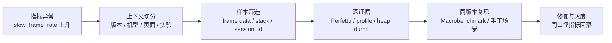

# APM 全景、Firebase 与商业平台选型

APM 客户端采集启动、帧、网络、资源、Crash 和 ANR 等应用可见信号，再由服务端聚合和归因。Firebase 与商业平台的差异主要落在信号覆盖、数据模型、部署成本和生态集成。

## 客户端信号、采集架构与选型维度

### APM 先回答“线上发生了什么”

APM（Application Performance Monitoring，应用性能监控）负责回答三类线上问题：

- 哪个版本、页面、设备群或实验组正在变差；
- 影响面有多大，是否值得进入修复队列；
- 能否保留一份足以继续诊断的现场样本。

APM SDK（Software Development Kit，软件开发工具包）通常只能看到应用有权限采集的信号。一次慢帧可能来自主线程业务、RenderThread、CPU 抢占、Binder 对端、I/O、GPU 或 SurfaceFlinger。RenderThread 是渲染线程，Binder 是 Android 跨进程通信机制，I/O 指输入/输出，SurfaceFlinger 是系统显示合成服务。

一次进程死亡也可能是 Java crash、native crash、ANR、LMK、force-stop、安装更新或系统策略。native crash 指 C/C++ 等原生代码崩溃；ANR（Application Not Responding）是应用无响应；LMK（Low Memory Kill）是低内存终止；force-stop 是强制停止。仅凭一个耗时或 `reason`（退出原因字段）无法判断根因。

APM 负责发现问题和筛选样本，Perfetto、Android Studio Profiler、simpleperf（CPU 采样工具）、heap dump（堆对象快照）、AGI（Android GPU Inspector）和 dumpsys（系统状态查询命令）负责复现并定位原因。线上系统提供分布和样本，线下及系统工具再把一个样本展开到线程、调用栈、资源、GPU 和显示路径。

### Android 17 复核基线

| 层级 | 版本基线 | APM 能看到什么 |
|---|---|---|
| Android 平台 | Android 17 / API 37 / `android-17.0.0_r1` | `ApplicationExitInfo`、`FrameMetrics`、`ProfilingManager`、系统 trace 与进程生命周期 |
| Android 内核 | `android17-6.18-2026-06_r39` | scheduler、I/O、binder driver、dma-buf/fence、内存压力等底层事实；普通应用不能任意读取这些数据 |
| Jetpack Metrics | `androidx.metrics:metrics-performance:1.0.0` | JankStats 的帧时长、jank 判断与 UI state |
| 第三方/自研 APM | 随应用版本固定 | 埋点、采样、堆栈、hook（拦截或替换调用）、缓存、上传和服务端聚合 |
| Google Play | 当前 Play Console / Reporting API 口径 | Android vitals 的 crash、ANR、wake lock、启动、渲染等聚合数据 |

内核表中的 scheduler 是线程调度器，binder driver 是 Binder 的内核驱动，dma-buf 用于跨组件共享缓冲区，fence 用于同步缓冲区的生产者与消费者。这些词描述内核证据，不表示普通应用能直接读取它们。

表中的 jank 指渲染过慢造成的卡顿帧，UI state 是当时的页面与交互状态，wake lock 是阻止设备进入休眠的系统锁。

Android 平台版本与 APM SDK 版本要分别记录。Android 17 不会自动升级应用内的 Matrix、KOOM、JankStats、Firebase 或自研 SDK；升级 SDK 也不会改变设备的 framework（Android 框架层）和 kernel（内核）实现。

### 从异常指标到可验证结论

下面的流程图展示一条慢帧问题从线上发现到修复验证的证据路径。



图中的 `slow_frame_rate` 是慢帧占比，`stack` 是调用栈，`session_id` 用于关联同一次使用会话。它们负责缩小范围，不能单独说明慢帧发生在哪一行代码。

例如，灰度发布（只向一部分用户提供新版本）的看板发现，图片编辑页的慢帧率只在某个版本和一组低内存设备上升。JankStats 样本带有页面、操作和帧时长，但没有主线程阻塞点。团队从该分组挑选可复现设备，采集 Perfetto，看到每次缩放都会在主线程同步解码大图并伴随 I/O 等待；simpleperf 或方法 trace 再把耗时集中的调用定位出来。

修复后，用相同图片、相同操作序列和相同编译模式跑 Macrobenchmark，再在小流量灰度中观察原指标、用于归并同类问题的堆栈特征，以及 crash/ANR 副作用。若只看到慢帧率下降，却更换了分母、采样率或设备范围，这次“改善”不能作为相同统计规则下的结论。

### 四类能力不要混在一起选

Android 性能工具至少分成四类。分类依据是采集位置、运行阶段、输出证据和工程成本，不能按“都能看性能”合并选型。

| 类别 | 代表能力 | 运行位置 | 主要输出 | 典型成本 |
|---|---|---|---|---|
| 客户端 APM | Matrix、KOOM、btrace/RheaTrace、Measure、自研 SDK | Release / 灰度发布 | 聚合指标、异常样本、堆栈、trace、heap 摘要 | 包体、CPU/内存、hook / 插桩（构建时插入采集代码）兼容、隐私、上传平台 |
| 官方信号与 SDK | Android vitals、JankStats、FrameMetrics、ApplicationExitInfo、ProfilingManager、Tracing | 系统、Play、应用进程 | 平台指标、帧数据、退出记录、受控 profile、应用 slice（带起止时间的 trace 区间） | 最低 API 版本、指标定义、回调开销、rate limit（频率限制） |
| 线下诊断 | Perfetto、Profiler、simpleperf、LeakCanary、AGI、dumpsys | Debug / QA / 实验室 | trace、调用栈、heap、GPU 命令流、系统状态 | 需要设备、复现和人工分析 |
| Benchmark / CI | Macrobenchmark、Microbenchmark、PerfDog、设备 benchmark | CI / 实验室 | 可比较的耗时、帧、吞吐、功耗或分数 | 测试环境、预热、编译模式、设备与温度控制 |

Release 是供用户安装的发布构建，Debug 是开发调试构建，QA 是测试阶段，CI（Continuous Integration，持续集成）是在代码变更后自动构建和测试。

客户端 APM 擅长覆盖大量真实设备，却受权限与采样预算限制；线下工具证据更深，却只覆盖少量可复现场景；Benchmark 擅长做改动前后对比，却不能代表线上分布；平台信号的口径稳定性较好，也要服从版本、设备支持和数据可见性限制。

Android vitals 与自建 APM 的数值不应强求一致。Play 数据只覆盖认证设备、从 Google Play 安装且同意共享数据的用户；其问题率按 DAU（Daily Active Users，日活跃用户）计算，第三方 SDK 常按 session（使用会话）、启动次数或采样事件计算。合并看板前要把人群、时间窗口、分母和去重规则写清楚。

### 四类证据各有用途

#### 指标：发现趋势与影响面

指标是聚合结果，例如：

- `cold_start_p50_ms`、`cold_start_p95_ms`；
- `slow_frame_rate`、`frozen_frame_rate`；
- `user_perceived_anr_rate`、`crash_user_rate`；
- `lm_kill_user_rate`、`native_crash_rate`；
- `request_ttfb_p95_ms`、`request_failure_rate`。

指标适合版本门禁、趋势和分组排序。它不能指向某一行代码；P95 上升只说明分布尾部变差，还需要样本和上下文。

这些名称保留英文，便于和看板字段对应：`p50` 是中位数，`p95` / `p99` 是第 95 / 99 百分位，`ms` 是毫秒，`rate` 是发生率；TTFB（Time to First Byte）表示从发起请求到收到首字节的时间。这里的版本门禁指达到阈值后阻止继续发布。

#### 样本：保留一次现场

样本是一次事件，例如：

- 慢帧的 UI state、frame duration 与主线程堆栈；
- ANR 的线程堆栈、reason、前后台和近期操作；
- Java/native crash 的符号化栈（把地址还原为函数和源码位置）与 Build-ID（构建产物标识）；
- OOM/LMK 附近的 PSS（按共享比例折算的内存）、RSS（驻留物理内存）、heap 摘要和页面；
- 网络请求的 DNS 解析、connect（建连）、TLS 握手和 TTFB 分段。

样本数不能直接当发生率。异常触发采样、设备离线、磁盘满、进程死亡和上传限流都会改变样本被看见的概率。

#### Trace / profile：还原时间与资源关系

trace、CPU sample（定期截取调用栈）、heap dump（堆对象快照）和 GPU capture（GPU 命令与资源快照）分别用于还原时间线、CPU、内存与图形现场：

- Perfetto 解释线程调度、Binder、I/O、渲染和系统服务；
- simpleperf 解释 CPU 耗时集中位置与 native 调用栈；
- Hprof（Java 堆转储格式）、heapprofd（native 堆分析器）或 LeakCanary 解释对象、分配和引用关系；
- AGI 解释 GPU 命令、shader（着色器程序）、资源和渲染 pipeline（流水线）；
- ProfilingManager 在受支持版本上提供受控的 system trace、heap dump、heap profile 或 stack sample。

这类文件较大、采集成本高，不适合把每个事件都上传。常见策略是先按轻量指标筛选，再对少量样本提升证据等级。

#### 上下文：决定样本能否比较

最小上下文应覆盖：

- App version、version code、build variant（构建变体）、发布渠道；
- ProGuard/R8 Mapping ID（混淆映射表的版本标识）、native ELF Build-ID；
- Android 版本、build fingerprint（系统构建标识）、机型、ABI（Application Binary Interface，原生二进制接口）、RAM 容量档位；
- 进程、页面/场景、前后台、刷新率、实验组；
- `event_id`、`session_id`、`trace_id` 与用户匿名标识；
- 采样概率、SDK 版本、采集配置版本。

上下文字段若随意改名或高基数失控，同一个问题会被拆散，服务端存储和查询成本也会膨胀。高基数指字段存在大量不同取值，例如未归一化的 URL 或文件路径。

### 常见采集路线的工程代价

| 采集方式 | 可见范围 | 适合的问题 | 主要边界 |
|---|---|---|---|
| Looper logging / message observer | 主线程消息的执行区间 | 长消息、主线程阻塞、ANR 前堆栈 | 看不到消息之外的 RenderThread/GPU/系统等待；观察者自身会占主线程 |
| Choreographer（帧调度器）回调 | App UI frame 节奏 | 连续帧间隔、动画/滚动场景 | 帧间隔不等于完整呈现耗时，刷新率变化也会改变阈值 |
| FrameMetrics / JankStats | Window frame 与 UI state | 慢帧率、场景归因 | API 版本决定字段；回调必须快速返回 |
| 字节码插桩 | 被插桩方法的调用与耗时 | 启动节点、热点路径、业务 trace | 增加构建复杂度与运行代码；R8（代码压缩与混淆器）、AGP（Android Gradle Plugin）和 Kotlin 版本要回归 |
| PLT/inline hook、JVMTI、malloc hook | native/Java 运行时事件 | I/O、分配、线程、函数调用 | ABI、linker、符号、ROM 与安全策略带来兼容成本 |
| 系统 profiling | 调度、系统服务、heap、stack 等 | 少量高价值现场 | 受权限、频率限制、redaction（敏感字段裁剪）和系统支持约束 |
| 外部测试采样 | FPS、CPU、内存、温度、功耗等 | QA、竞品或设备对比 | 不等于线上用户数据；采样源和指标定义要核对 |

PLT/inline hook 会改写 native 函数跳转，JVMTI（Java Virtual Machine Tool Interface）提供 Java 虚拟机观测接口，malloc hook 观察 native 内存分配。它们能看到更底层的事件，也更依赖 ABI、动态链接器（linker）和设备 ROM（厂商系统）实现。

采集代码也会改变被测系统。主线程抓栈、每帧序列化、Hprof dump、native allocation tracking（原生内存分配跟踪）和长 trace 都可能造成额外卡顿、内存或 I/O。上线前要在高端与低端设备上测量 CPU 时间、主线程时间、内存、包体、磁盘、流量和电量，不能只测“功能能否收到数据”。

### JankStats 与 FrameMetrics 的准确边界

截至 2026-08-14，`androidx.metrics:metrics-performance:1.0.0` 是稳定版本。JankStats 在 API 24+ 基于 FrameMetrics，在更早版本使用 `OnPreDrawListener`；使用同一套 JankStats API，不表示各系统版本能提供相同精度。

版本差异可按下面理解：

| 系统版本 | 主要来源 | 能力边界 |
|---|---|---|
| API 23 及以下 | `OnPreDrawListener` | 在主线程回调，估计 UI frame 时长，无法获得现代 FrameMetrics 字段 |
| API 24—30 | `Window.OnFrameMetricsAvailableListener` | 可获得 UI/CPU 相关耗时；回调由 FrameMetrics 线程交付 |
| API 31—37 | FrameMetrics + deadline（帧截止时间）信息 | 可使用 `frameOverrunNanos` / `DEADLINE` 判断超过目标帧期限的时长 |

JankStats listener 每帧都会收到数据，必须快速返回。`FrameData` 会被复用，回调返回后若还要异步处理，应复制需要的值，不能缓存原对象引用。

FrameMetrics 的 `TOTAL_DURATION` 表示该帧从开始到提交给显示子系统的总时长；各阶段（stage）可能重叠，所以子项之和不必等于 total。它也不等于物理屏幕真正显示（present）的时间。需要分析 SurfaceFlinger/HWC（Hardware Composer，显示硬件合成器）和 display present 时，应转向 Perfetto FrameTimeline、SurfaceFlinger 和 GPU/display 证据。

JankStats 的 UI state 需要由应用维护。页面、滚动、过渡、列表类型等状态没有及时清理时，慢帧会被关联到过期场景，服务端统计会很精确地计算出一个错误结论。

### ApplicationExitInfo：退出记录不是 OOM 结论

#### 应用 API 与 Android 17 服务端路径

API 30 起，应用可调用 `ActivityManager.getHistoricalProcessExitReasons()` 查询历史 `ApplicationExitInfo`。Android 17 的调用路径是：

```text
App
  → ActivityManager.getHistoricalProcessExitReasons()
  → Binder / ActivityManagerService
  → ProcessList.mAppExitInfoTracker
  → per-package / per-UID exit records
  → NativeTombstoneManager 合并可访问 tombstone
```

UID 是 Android 基于 Linux 用户标识实现的应用隔离身份。上面的路径说明查询会跨 Binder 进入 `system_server`（承载核心 Android 服务的进程），还可能合并 tombstone（native 崩溃记录）。它不应阻塞冷启动首帧；可通过后台 executor（执行线程池）查询最近记录，按 timestamp、process name 和 version/session 边界去重后再上报。

`AppExitInfoTracker` 在 Android 17 中是独立顶层类，实例由 `ProcessList` 字段 `mAppExitInfoTracker` 创建并初始化。AOSP 基础配置为每个 package/UID 最多保留 16 条记录，设备厂商可通过资源 overlay（覆盖系统资源配置）改变容量。记录通过 `AtomicFile` 写入 `procexitstore/procexitinfo`；这种写法可在失败时回滚，避免留下半份文件。非紧急更新按 30 分钟间隔调度写入，package/user 移除时会清理对应记录。

#### reason 来自多路事实合并

进程死亡与 ActivityManagerService（AMS）主动终止形成基础记录；lmkd（低内存管理守护进程）和 zygote（应用进程孵化器）的外部通知可以补充 status、RSS 或修正 reason。Android 17 源码还保护已经明确为 ANR、Java crash 或 native crash 的记录，避免后到的模糊信号覆盖高价值原因。

常见公开 reason 包括：

| reason | 值 | 解释时要保留的边界 |
|---|---:|---|
| `REASON_SIGNALED` | 2 | 结合 `getStatus()` 的 signal（操作系统信号）；在不支持 LMK 上报的设备上，内存压力终止可能表现为 `SIGKILL` |
| `REASON_LOW_MEMORY` | 3 | 先检查 `ActivityManager.isLowMemoryKillReportSupported()`；该 reason 本身不提供 heap dump 或 Java OOM 证据 |
| `REASON_CRASH` | 4 | Java 未处理异常，不等于 native crash |
| `REASON_CRASH_NATIVE` | 5 | API 31+ 可能附带 protobuf 格式的 tombstone stream（结构化 native 崩溃数据流），也可能因覆盖而为空 |
| `REASON_ANR` | 6 | 通常可取得系统保存的 ANR trace，但不保证永远存在 |
| `REASON_USER_REQUESTED` | 10 | 包含 force-stop、最近任务移除等用户相关路径，需结合 description 和当时场景 |
| `REASON_OTHER` | 13 | 依赖 description 与上下文，不能直接归为应用缺陷 |
| `REASON_FREEZER` | 14 | API 33+ 的 freezer（缓存进程冻结机制）相关退出 |
| `REASON_PACKAGE_STATE_CHANGE` / `UPDATED` | 15 / 16 | API 34+ 区分组件状态变化与包更新 |

`getPss()` 与 `getRss()` 是系统上一次采样值，可能为 0，也不是死亡瞬间内存。`getTraceInputStream()` 通常用于 ANR；API 31+ 还可返回 native tombstone protobuf。进程曾发生并恢复的 ANR，其 trace 也可能附在之后因其他 reason 死亡的记录上。trace 和 tombstone 由独立循环存储管理，可能被更新事件覆盖，因此返回 `null` 是合法结果。

下面的代码用于展示一次低优先级、可去重的历史退出查询；生产代码还要接入自己的持久化和上传队列。

```kotlin
executor.execute {
    val records = activityManager.getHistoricalProcessExitReasons(
        null, // 仅查询调用方 UID 可访问的记录
        0,    // 不按 PID 过滤
        16,
    )

    records.forEach { info ->
        reportExitIfNew(
            processName = info.processName,
            timestampMs = info.timestamp,
            reason = info.reason,
            status = info.status,
            pssKb = info.pss,
            rssKb = info.rss,
        )
    }
}
```

`packageName = null` 时，服务端按调用方 UID 过滤；应用不能借此读取任意包的历史。`timestamp + processName + reason/status` 只能作为去重基础，跨 reinstall（重装）、数据清除和时钟变化时还要加入 install/build/session 标识。

### ProfilingManager：请求可能被限频或拒绝

API 35 引入 `android.os.ProfilingManager`，支持 Java heap dump（Java 堆转储）、heap profile（堆分配采样）、stack sampling（调用栈采样）和 system trace（系统时间线）请求。请求会受到频率限制，也不保证执行；结果会裁剪敏感和无权限数据，只包含请求进程可访问的信息。

API 36 增加 `ProfilingTrigger`，应用可注册 ANR、`reportFullyDrawn()` 等系统触发事件。API 37 又增加 OOM、冷启动、应用兼容性异常和过量 CPU 使用等类型；不同 trigger 返回的文件不同，例如 OOM 返回 Java heap dump，冷启动返回 system trace 和 stack sampling。trigger 同样不保证产生结果，调用方需要注册全局 result listener（接收该 UID 全部结果的回调），处理应用重启后的重新交付，并为文件过期、上传和去重设计流程。

Android 17 上可以把 ProfilingManager 接入少量高价值样本，例如：

- 启动 P99 异常且设备满足采集条件；
- 特定页面连续慢帧，并已通过轻量信号筛选；
- 远程配置选择的低比例实验人群；
- 系统 trigger 返回的 ANR、OOM 或冷启动 profile。

不要对每次慢帧请求 system trace，也不要把 callback（回调）未返回直接解释成 API 故障。频率限制、资源状态、系统策略和进程生命周期都可能让请求没有结果。

### 什么时候 APM 证据不够

| 线上现象 | APM 能提供的入口 | 后续验证工具 |
|---|---|---|
| 主线程长任务 | message duration、主线程 stack、页面 | Perfetto thread state、method trace、CPU profiler |
| CPU 抢占或频率受限 | 慢帧/启动样本、设备与温度上下文 | Perfetto scheduler/cpufreq、simpleperf、thermal 信息 |
| Binder 卡住 | 调用点 stack、超时样本 | Perfetto binder transaction、对端线程与服务 trace |
| I/O 等待 | 文件类别、耗时、调用 stack | Perfetto/ftrace I/O、simpleperf；必要时检查文件系统与内核事件 |
| GPU/显示晚 | frame duration、场景、Surface 类型 | Perfetto GPU/FrameTimeline、AGI、SurfaceFlinger/HWC |
| Java 对象泄漏 | heap 使用趋势、页面、退出原因 | Hprof、LeakCanary、Profiler |
| native 内存增长 | RSS/PSS 趋势、native stack sample | heapprofd、malloc debug、KOOM/厂商工具 |
| LMK/OOM | exit reason、PSS/RSS、设备 RAM、前后台 | ApplicationExitInfo、lmkd/PSI trace、heap/native memory 分解 |
| 网络慢 | DNS/connect/TLS/TTFB 分段与 endpoint 类别 | 客户端网络 trace、服务端 trace、网络环境复现 |

表中的 thread state 是线程的运行、就绪、休眠或等待状态，binder transaction 是一次 Binder 跨进程请求，`cpufreq` 是 CPU 频率轨道，thermal 指温度与降频信息。PSI（Pressure Stall Information）描述 CPU、内存或 I/O 压力造成的停顿，endpoint 指网络请求目标，method trace 记录方法调用时间线，ftrace 是 Linux 内核跟踪机制。

普通应用看不到完整系统和内核现场。需要 scheduler、driver、dma-fence、lmkd/PSI 或系统服务内部细节时，要在可控测试设备上采集 Perfetto/ftrace，或与平台/OEM（设备制造商）团队协作。缺失字段应明确标为未知，不能补成推测。

### 线上采样要先写清数据合同

数据合同要先于 SDK 接入。它规定“客户端采什么、服务端怎样解释、多久删除、如何关联构建”，避免同名字段在不同版本中表达不同含义。

下面的 JSON 只展示最小结构，用于讨论字段职责，不代表特定后端协议。

```json
{
  "schema_version": 3,
  "event_name": "jank_frame_sample",
  "event_id": "01J...ULID",
  "occurred_at_epoch_ms": 1784908800123,
  "duration_ns": 42800000,
  "sample_probability": 0.02,
  "session_id": "anonymous-session-id",
  "trace_id": null,
  "app": {
    "version_name": "8.4.0",
    "version_code": 804000,
    "mapping_id": "r8-mapping-uuid",
    "native_build_ids": ["7f3a..."]
  },
  "device": {
    "sdk_int": 37,
    "build_fingerprint_hash": "sha256:...",
    "model_class": "mid_ram_6g",
    "abi": "arm64-v8a"
  },
  "context": {
    "process": "main",
    "screen": "image_editor",
    "interaction": "pinch_zoom",
    "foreground": true
  }
}
```

`event_id` 示例使用 ULID（可按时间排序的唯一标识），`schema_version` 表示事件结构版本。耗时字段要在名称或 schema 中固定单位；`sample_probability` 是该事件被采中的概率，用于加权估计，不能丢失；Mapping ID 与 Build-ID 用于还原 Java/Kotlin 和 native 栈。原始机型、URL、文件路径和用户信息取值多、识别风险高，应按数据最小化原则处理。

一份可执行的数据合同至少定义：

- 事件名、schema version、字段类型、单位和 nullable（是否允许空值）规则；
- 指标窗口、分母、去重、分位数算法和时区；
- 用户/session/event/trace 的关联与生命周期；
- Java Mapping ID、native Build-ID 和 source revision（对应的源码版本）；
- 采样单位是用户、session、事件还是异常；
- URL、请求头、日志、路径、截图和标识符的脱敏规则；
- 本地保留、上传重试、服务端保留和删除周期；
- SDK 配置版本、远程开关与回滚方式。

### 端侧采样、缓存与上传

#### 采样

不同事件使用不同策略：

- crash、ANR 等低频高价值事件优先保留完整轻量元数据；
- 每帧、每请求等高频数据先在端侧聚合；
- trace、heap dump 等重文件只对少量候选样本采集；
- 用户/session 采样尽量使用稳定 hash（相同输入得到相同分组），避免每次启动换一批人，导致同一批用户的前后变化难以比较；
- 服务端展示发生率时校正采样概率和上传成功率。

“异常才采样”会产生选择偏差。例如只在设备空闲、充电且网络良好时上传 trace，样本天然偏向特定设备状态；结论中要保留这项限制。

#### 本地缓冲

缓冲区应有总字节、单事件、单文件、条数和年龄上限。写入使用临时文件与原子 rename（重命名要么完整成功，要么保持原状），或使用具备事务语义的存储（整组操作全部成功或全部回滚），避免进程被杀后留下半文件。重文件与普通指标分目录管理，过期和低价值事件优先淘汰。

敏感数据应在写盘前完成裁剪或脱敏。不能先保存原始 URL、token（认证凭据）、日志和用户数据，再指望上传阶段处理；进程死亡后，这些原始文件仍可能留在磁盘。

#### 上传

上传需要批量、压缩、指数退避（失败越多，重试间隔越长）、抖动（给重试时间加入随机偏移）、幂等 event ID（重复上传仍识别为同一事件）和服务端去重。网络、充电、温度、前后台等条件应按文件价值设置，不能让 APM 自身制造启动竞争、流量尖峰或发热。

服务端收到事件不代表数据完整。客户端要上报丢弃原因计数，例如 quota（配额耗尽）、serialization error（序列化失败）、disk full（磁盘已满）、expired（已过期）、rate limited（触发频率限制）和 upload failed（上传失败）；否则看板只描述“成功上传的人群”。

### 选型：从团队约束推导组合

选型之前先区分“构建工具能解析依赖”和“可以进入生产环境”。一个 APM artifact（发布的库产物）要通过 Android 17 验证，至少要检查构建、打包、启动、采集、失败降级、停用恢复与隐私七层；仓库 README、较低的 `minSdk`（最低支持 Android 版本）、一次启动成功或 AOSP 中仍存在同名私有字段，都不能替代这些证据。

#### 用成对变体测量 APM 自身开销

同一 commit（源码版本）至少准备以下 release 变体，保持 R8、应用签名、ABI、资源和业务配置一致：

| 变体 | 内容 | 用途 |
|---|---|---|
| `baseline` | 不包含被测 SDK | 建立设备与业务基线 |
| `linked-off` | 包含依赖，但模块全部关闭 | 观察打包、类加载和初始化前影响 |
| `module-on` | 一次只开启一个模块 | 将成本归属到具体采集器 |
| `production-set` | 生产计划中的模块、采样与上传配置 | 验证组合效应 |
| `event-trigger` | 受控制造主线程阻塞、内存 dump、泄漏或上传失败 | 测量峰值和失败恢复 |

测试至少覆盖冷启动、前台空闲、固定交互、高频 Looper Message、后台静置和受控异常；轮次按 baseline/variant（基线/被测变体）交替或随机排列，每轮使用相同的温度、电量、刷新率、网络和数据状态。Android 17 还要覆盖 4 KB 环境，以及关闭 16 KB backcompat（向后兼容）模式的 16 KB 环境；后者会让不兼容的 native 二进制立即中止。业务占比高的厂商 ROM 也要单独测试。

CPU 使用 Perfetto 中的进程/线程 running time（实际占用 CPU 的时间），帧使用 FrameTimeline、JankStats 或 FrameMetrics，内存同时记录 PSS、RSS、Java/native heap 和峰值，启动由 Macrobenchmark 固定测试模式。I/O、网络、唤醒、包体、事件丢失、关闭后残留线程和异常恢复也要进入结果。不能从源码操作数估算“低于 0.1%”，也不能把周期 tracker（定时采集器）与一次 heap dump 汇总成同一个平均开销。

发布表同时给绝对差值、相对差值、中位数、尾部值、最差有效轮和样本数。没有实测的数据保留为空；性能差但流程完整的轮次不能按异常值删除。最终 APK/AAB（Android 安装包/应用包）中的所有 native 依赖，还要分别检查 ELF（native 可执行文件格式）的 LOAD segment（可加载段）对齐、ZIP 内文件对齐和真机 page size（内存页大小）；三项检查回答的问题不同。

#### Android 17 接入准入清单

清单中的 NDK 是 Native Development Kit（原生开发工具包），`targetSdk` 是应用声明适配的目标 API 版本。

- 固定仓库、commit、依赖坐标、AGP、NDK、R8、targetSdk 与配置版本。
- clean build（全量构建）、增量构建、Gradle configuration cache（配置缓存）、各 variant（构建变体）和最终安装产物均通过。
- manifest、权限、Provider、Service、通知、`PendingIntent`、文件目录和网络安全配置符合当前 Android 的组件声明、权限和后台执行要求。
- 4 KB/16 KB 设备验证安装、初始化、正常事件、边界事件、失败事件和关闭模块。
- 反射、私有符号、Hook、Printer（Looper 日志回调）、子进程、磁盘和上传失败都会显式降级，不以“没有报告”冒充“没有问题”。
- 关闭模块后恢复 Hook/Printer，停止线程与任务，缓存满足大小、年龄、重试和删除限制。
- 报告保存原始 trace、脚本 commit、测试顺序、判废原因和 SDK 自监控数据。

具体工具的构建和运行边界留在各自正文：Matrix 看 17.2，KOOM 看 17.3，BlockCanary 与历史开源项目看 17.5。这样兼容性结论只维护一次，通用实验协议也不再单独占用一个重复编号。

| 团队条件 | 优先能力 | 原因 |
|---|---|---|
| 没有线上性能平台 | Android vitals + crash/ANR + 基础启动/页面指标 | 建立稳定趋势和版本分组，再补专项 |
| UI 卡顿是主问题 | JankStats + UI state + 少量 Perfetto/Macrobenchmark | 轻量覆盖真实场景，深证据用于归因 |
| Java/native 内存问题多 | ApplicationExitInfo + heap/native 专项工具 | 区分 crash、LMK、ANR，再选择 Hprof/heapprofd/KOOM |
| 已有日志与数据平台 | 自研轻量 SDK 或开源采集组件 | 可复用认证授权、上传、查询和告警，但仍需评估客户端维护成本 |
| 发版节奏快、AGP/Kotlin 升级频繁 | 少 hook、少插桩，优先稳定系统/Jetpack API | 降低构建链和运行时兼容风险 |
| 低端设备占比高 | 更低采样、更小缓冲、端侧聚合、严格 kill switch（远程紧急关闭开关） | APM 开销更容易污染被测性能 |
| 隐私或合规限制严格 | 数据最小化、端侧聚合、短保留期、可审计 schema | 降低原始内容离开设备的范围 |

Matrix、KOOM、btrace/RheaTrace、Measure、Firebase、Sentry、APMPlus 等工具各自覆盖一部分问题。项目活跃度、license（许可证）、版本兼容和维护者状态会变化，接入前要查看对应仓库、release（发布版本）和最小验证应用，不能仅凭过时的“主流/维护中”标签判断。

### 分阶段建设顺序

1. 统一 build、version、device、process、screen、session 和采样字段。
2. 接入 Android vitals、crash/ANR 与基础启动/页面指标，建立版本门禁。
3. 按主要问题加入 JankStats、ApplicationExitInfo、网络分段或内存信号。
4. 从轻量事件中筛选少量样本，再请求 trace、profile、heap 或转到实验室复现。
5. 把 Macrobenchmark/Microbenchmark 和关键场景回归接入 CI。
6. 增加远程开关、采集预算、丢弃统计、隐私审计和 SDK 自身性能监控。

每一步都应能单独关闭和回滚。没有远程 kill switch 的 hook、每帧监听或重文件采集，不适合直接进入大规模 Release。

### 后续章节怎样分工

- 17.2—17.4：看 Matrix、btrace、Tracing SDK、KOOM、LeakCanary、DoKit 与 Measure 的采集和工程边界；
- 17.5：理解 BlockCanary、ArgusAPM 等历史方案能保留的设计和必须替换的实现；
- 22.10：看 JankStats、FrameMetrics、系统合成器分类与线上卡顿治理；
- 17.6—17.7：看 Jetpack Benchmark、Baseline Profile 验证、外部性能测试与设备 benchmark；
- 17.8—17.12：看网络、crash/ANR、功耗、WebView/Flutter 混合栈与大规模端侧架构。

阅读某个工具前，先回答它处在“线上采集、系统信号、线下诊断、回归测量”中的哪一层。这样能避免用一款工具负责它没有数据权限或没有证据深度的问题。

### 源码与文档入口

- [Android vitals](https://developer.android.com/topic/performance/vitals)：核对 Play 数据范围、core vitals、分母差异和 Reporting API。
- [JankStats guide](https://developer.android.com/topic/performance/jankstats) 与 [AndroidX Metrics release notes](https://developer.android.com/jetpack/androidx/releases/metrics)：核对 API 版本路径、listener 线程、FrameData 复用和 `1.0.0` 稳定版。
- [`FrameMetrics`](https://developer.android.com/reference/android/view/FrameMetrics)：核对 API 24+ stage、API 31+ `DEADLINE`、单位和 total 语义。
- [`ApplicationExitInfo`](https://developer.android.com/reference/android/app/ApplicationExitInfo) 与 [`ActivityManager.getHistoricalProcessExitReasons()`](<https://developer.android.com/reference/android/app/ActivityManager#getHistoricalProcessExitReasons(java.lang.String,int,int)>)：核对 reason、status、PSS/RSS、trace 和访问范围。
- Android 17 的 [`ApplicationExitInfo.java`](https://android.googlesource.com/platform/frameworks/base/+/android-17.0.0_r1/core/java/android/app/ApplicationExitInfo.java)、[`ActivityManager.java`](https://android.googlesource.com/platform/frameworks/base/+/android-17.0.0_r1/core/java/android/app/ActivityManager.java)、[`ActivityManagerService.java`](https://android.googlesource.com/platform/frameworks/base/+/android-17.0.0_r1/services/core/java/com/android/server/am/ActivityManagerService.java)、[`ProcessList.java`](https://android.googlesource.com/platform/frameworks/base/+/android-17.0.0_r1/services/core/java/com/android/server/am/ProcessList.java) 与 [`AppExitInfoTracker.java`](https://android.googlesource.com/platform/frameworks/base/+/android-17.0.0_r1/services/core/java/com/android/server/am/AppExitInfoTracker.java)：核对 Binder 查询、记录容量、持久化、lmkd/zygote 修正与 tombstone 合并。
- [`ProfilingManager`](https://developer.android.com/reference/android/os/ProfilingManager)、[`ProfilingTrigger`](https://developer.android.com/reference/android/os/ProfilingTrigger) 与 Android 17 [`ProfilingManager.java`](https://android.googlesource.com/platform/packages/modules/Profiling/+/android-17.0.0_r1/framework/java/android/os/ProfilingManager.java)：核对 API 35 主动请求、API 36 基础 trigger、API 37 新 trigger、频率限制、结果交付与敏感字段裁剪。
- [16 KB page-size 指南](https://developer.android.com/guide/practices/page-sizes)：核对 ELF/ZIP 对齐、backcompat 模式，以及 Android 17 让不兼容二进制立即中止的测试开关。
- [Macrobenchmark](https://developer.android.com/topic/performance/benchmarking/macrobenchmark-overview) 与 [Microbenchmark](https://developer.android.com/topic/performance/benchmarking/microbenchmark-overview)：核对端到端场景和局部代码 benchmark 的分工。
- [Perfetto Android trace](https://perfetto.dev/docs/getting-started/system-tracing)：核对 scheduler、Binder、I/O、内存和图形等系统证据的采集边界。
- 当前 kernel `android17-6.18-2026-06_r39` 的 [PSI 文档](https://android.googlesource.com/kernel/common/+/refs/tags/android17-6.18-2026-06_r39/Documentation/accounting/psi.rst) 与 [ftrace 文档](https://android.googlesource.com/kernel/common/+/refs/tags/android17-6.18-2026-06_r39/Documentation/trace/ftrace.rst)：核对内存压力和内核 trace 机制。此前核验使用的 `r6` [PSI 文档](https://android.googlesource.com/kernel/common/+/refs/tags/android17-6.18-2026-06_r6/Documentation/accounting/psi.rst) / [ftrace 文档](https://android.googlesource.com/kernel/common/+/refs/tags/android17-6.18-2026-06_r6/Documentation/trace/ftrace.rst) 链接继续保留，便于复现旧基线；普通应用权限边界仍由 Android 平台与设备策略决定。

### 常见误判

| 误判 | 修正 |
|---|---|
| 接入一个 SDK 就有完整 APM | SDK 只是采集端；还需要数据合同、缓存上传、符号化、聚合、查询、告警和验证 |
| Android vitals 与自建 crash rate 应完全相等 | 人群、分母、去重、窗口和隐私阈值不同 |
| JankStats 报 jank 就说明主线程慢 | 继续检查 CPU 调度、RenderThread、GPU、SurfaceFlinger 和刷新率 |
| FrameMetrics 各阶段之和等于总时长 | 阶段可以并发，API 文档明确不保证相等 |
| `REASON_LOW_MEMORY` 代表 Java heap OOM | 它表示系统内存压力 kill；先检查设备是否支持该 reason，再拆 PSS/RSS/heap/native |
| `getTraceInputStream()` 对 ANR/native crash 必有数据 | 独立循环存储可能覆盖，ANR 恢复后也可能把 trace 带到其他 reason |
| ProfilingManager 请求一定返回 | 请求受频率限制和系统策略控制，不保证执行 |
| 样本数就是发生率 | 采样、进程死亡、磁盘、网络和服务端去重都会影响可见样本 |
| 外部 benchmark 分数代表线上体验 | 分数只在相同版本、设备状态和测试条件下可比较 |
| APM 没采到 scheduler/GPU 细节，就能用堆栈推断 | 缺系统证据时转向 Perfetto/AGI/OEM 工具，并明确未知项 |

## Firebase Performance 的自动与自定义 Trace

明确 APM 通用能力后，可以按 Firebase 的自动启动、网络和屏幕信号检查其覆盖与限制。

### Firebase Performance 的定位

Firebase Performance Monitoring 是 Firebase 提供的托管型性能监控服务：数据接收、存储和控制台由 Firebase 运营，团队只需在应用中接入 SDK，无需自行部署采集服务器。它会采集启动、前后台、屏幕渲染和部分 HTTP/S 请求，也允许应用补充业务 trace。控制台按版本、设备、国家或地区等维度聚合数据。

它适合中小团队快速建立基础性能看板（汇总关键指标的 dashboard），也可以补充成熟监控体系，用来观察各版本的长期变化。它不提供自托管采集服务，端侧还会采样和限流，控制台展示也达不到秒级。因此，Firebase Performance 无法单独承担实时故障发现、还原单次请求的完整过程、解释每一帧为何变慢，或诊断 native（C/C++ 等本地代码）问题。

截至 2026 年 8 月 14 日，当前 Firebase 构建版本如下：

| 组件 | 版本 | 说明 |
| --- | --- | --- |
| Firebase Android BoM | `34.17.0` | 统一 Firebase Android 库版本 |
| `firebase-perf` | `22.0.6` | BoM 对应的 Performance SDK |
| Performance Gradle plugin | `2.0.2` | 网络请求和 `@AddTrace` 字节码插桩 |
| Google services plugin | `4.5.0` | 处理 `google-services.json` |

BoM（Bill of Materials）用于让一组 Firebase 库采用彼此兼容的版本。`firebase-perf:22.0.6` 的 AAR（Android Archive 库包）声明最低支持 API 23；本文内容按 Android 8（API 26）到 Android 17（API 37）复核。Firebase Android BoM 从 `34.0.0` 起不再包含独立 KTX module（Kotlin 扩展构件），这些扩展 API 已并入主 module，依赖仍写 `firebase-perf`。

### 数据模型：trace、metric、attribute

Firebase Performance 用 trace 表示一段被计时的执行区间，用 metric 表示数值指标，用 attribute 表示便于筛选的键值标签。自动 trace 和 custom trace 都带有 duration 等内建 metric；custom trace 还能记录自定义 metric 与 attribute。Network request trace 还会保存 URL pattern（把相似 URL 归为一组的匹配规则）、HTTP method、status code、payload size 和 Content-Type 等网络字段。

| 对象 | 含义 | 例子 | 使用建议 |
| --- | --- | --- | --- |
| trace | 一段被计时的执行区间 | `_app_start`、`home_first_feed` | 名称固定，不拼动态值 |
| metric | trace 中的整数计数或内建耗时 | duration、`item_count`、`retry_count` | 用数值表达次数或数量 |
| attribute | 用于过滤和分组的键值标签 | `entry=cold_start`、`result=success` | 只放可选值少且固定的枚举，不放 user id |
| network request trace | 一次被捕获的 HTTP/S 请求 | `GET api.example.com/v1/items/**` | 用 URL pattern 聚合动态路径 |

metric 适合记录条目数、重试次数等整数；trace duration 由 `start()` 到 `stop()` 自动计算。attribute 用于筛选和分组。用户 id、订单号、完整搜索词等字段可能产生大量不同取值，这类高基数字段会把样本切成许多小组；它们还可能属于 PII（Personally Identifiable Information，可识别个人的信息），不应交给 Performance Monitoring。

这套模型擅长回答“哪个版本变慢”“哪类设备更慢”“哪条业务路径分布异常”，但不能还原一次故障的完整调用栈。

### 构建接入：插件与运行库分工

Performance Gradle plugin 与运行时 SDK 负责不同工作。这里的字节码插桩，是指插件在构建时修改编译产物，自动插入计时和采集调用：

- `com.google.firebase.firebase-perf` 在构建期对受支持的网络库和 `@AddTrace` 做字节码插桩。
- `firebase-perf` 在进程中记录、采样、暂存并上传性能事件。
- `com.google.gms.google-services` 读取 `google-services.json`，把 Firebase 项目配置转换成 Android resource（应用资源）。

下面的 Kotlin DSL 示例保留了 2026 年 7 月可用的 BoM `34.16.0`。新接入或本次升级时，应把示例中的这一项改成当前版本 `34.17.0`；两版 BoM 都会选择 `firebase-perf:22.0.6`，另外两个 Gradle plugin 版本不变：

```kotlin
plugins {
    id("com.android.application") version "<项目使用的 AGP 版本>" apply false
    id("com.google.gms.google-services") version "4.5.0" apply false
    id("com.google.firebase.firebase-perf") version "2.0.2" apply false
}

// app/build.gradle.kts
plugins {
    id("com.android.application")
    id("com.google.gms.google-services")
    id("com.google.firebase.firebase-perf")
}

dependencies {
    implementation(platform("com.google.firebase:firebase-bom:34.16.0"))
    implementation("com.google.firebase:firebase-perf")
}
```

代码中的 AGP 指 Android Gradle Plugin，其版本沿用项目现有配置。BoM 只管理 Firebase 库版本，不管理 Gradle plugin 版本，因此两个 plugin 的版本仍要单独声明。使用 version catalog（版本目录）或根构建脚本时，可以采用等价写法。

#### 构建插桩和数据采集不是同一个开关

团队经常只关闭运行时采集，却仍让 debug 构建执行字节码插桩。构建期和运行期是两套开关，需要分开配置：

| 控制项 | 作用时机 | 结果 |
| --- | --- | --- |
| `FirebasePerfExtension.setInstrumentationEnabled(false)` | 指定 variant 的构建期 | 不对该 variant（如 debug、release）执行自动网络和 `@AddTrace` 插桩 |
| Gradle property `firebasePerformanceInstrumentationEnabled=false` | 整次构建 | 全局关闭 Performance 插桩；适合 CI（持续集成）参数或临时诊断 |
| `firebase_performance_collection_enabled=false` | 应用运行期 | 默认不采集；之后可由 `setPerformanceCollectionEnabled(true)` 改变 |
| `firebase_performance_collection_deactivated=true` | 应用运行期 | 强制停用并覆盖 enabled；只有删除该 Manifest 项并重新发版才能恢复 |

下例通过 Android Manifest 元数据把运行时采集默认关闭，待用户同意隐私政策，或分阶段启用策略选中该设备后再开启：

```xml
<application>
    <meta-data
        android:name="firebase_performance_collection_enabled"
        android:value="false" />
</application>
```

这段 Manifest 配置不会自动关闭构建插桩。若 debug variant 不需要插桩，还要在构建配置中调用 `FirebasePerfExtension.setInstrumentationEnabled(false)`；若只想停止采集和上传，则无需关闭插桩。

Firebase 没有“debug 构建默认关闭”的通用规则。可采用这样的发布策略：debug variant 明确关闭插桩与采集，内部测试包只对少量受控设备启用，release 再按产品政策开放。接入清单还应覆盖 Firebase IAM（Identity and Access Management，身份与权限管理）、BigQuery 数据仓库权限、服务可用地区、数据保留说明、用户同意机制和隐私政策。Google Analytics 权限不属于 Performance Monitoring 的基本接入条件。

> 多进程应用要特别留意：官方只支持主进程中的 Performance Monitoring。独立 `:remote`、`:push` 等远程进程不会自动获得与主进程相同的采集能力；需要观察这些进程时，仍要保留应用自己的多进程监控。

### 自动采集能力与版本边界

自动采集覆盖的是 SDK 明确识别的生命周期和网络调用，不等于应用发生的每一个性能事件。

| 能力 | 采集方式 | 稳妥边界 | 局限 |
| --- | --- | --- | --- |
| App start | 自动 | 记录 Firebase SDK 定义的启动区间 | 不是进程 fork 到首帧，也不是完整首屏 |
| Foreground / background | 自动 | 依据进程生命周期记录会话区间 | 不等同于业务页面停留 |
| Screen rendering | 自动 | Activity；SDK `20.1.0+` 增加 Fragment | 固定 60 Hz 阈值，缺少逐帧业务状态 |
| HTTP/S request | 自动 + 手工 | 自动覆盖受支持的 Java/Kotlin 网络库调用 | Cronet、native 或自研栈需要手工记录 |
| Custom trace | 手工或 `@AddTrace` | 业务阶段、解码、查询等代码区间 | 需要设计稳定字段，`@AddTrace` 不能附加自定义数据 |

Android 17 / API 37 没有一套单独的 Firebase Performance 统计规则。这里以 SDK `22.0.6` 的官方文档和源码为准；跨版本比较时，也要记录 SDK 版本和采样策略是否改变，避免把采集方式的变化误判为应用性能变化。

### App start：不要把 `_app_start` 当成完整启动

在 `firebase-perf:22.0.6` 中，SDK 内部把这条 trace 记为 `_as`，控制台显示为 `_app_start`。计时使用单调时钟 `elapsedRealtime`：它按设备启动后的经过时间递增，不受用户修改时间或网络校时影响。它的区间是：

1. 起点：Firebase 首个类的早期 class-load（类加载）近似时间。
2. 终点：第一个 Activity 的 `onResume()` 回调时间。
3. 子区间：到首次 `onCreate()`、`onStart()` 和 `onResume()` 的几个阶段耗时。

这个区间没有覆盖 Firebase 初始化之前的全部进程时间，也没有等待第一帧或首屏内容可用。API 24 以后，源码会读取 `Process.getStartElapsedRealtime()`，但该时间用于实验性 TTID trace 及 `process start → class load` 子区间，不能把它写成稳定 `_app_start` 的起点。这里的 process start 接近系统从 Zygote fork（派生）应用进程的时刻；`Process.getStartUptimeMillis()` 也不是稳定 `_app_start` 使用的时钟。

SDK 会过滤后台触发的进程启动。`22.0.6` 修复了 Android 14（API 34）及以上版本的判断：在 Firebase 的早期初始化阶段调用 `ActivityManager.getMyMemoryState()`，只有 `IMPORTANCE_FOREGROUND` 才允许生成 `_app_start`。这个变化同样覆盖 Android 17。

`_app_start` 可用于比较版本趋势，不能替代应用定义的 TTID（Time to Initial Display，首次画面出现时间）和 TTFD（Time to Full Display，完整内容可用时间）。若“启动完成”要求首页骨架绘制、首批数据展示或页面可交互，需要另建 custom trace，并用 Macrobenchmark（Jetpack 的端侧性能基准工具）或 Perfetto 系统 trace 校验各阶段。

### Screen rendering：指标是“屏幕实例比例”

Firebase 自动 screen trace 的时间窗口取决于页面类型：

- Activity：`onActivityStarted()` 到 `onActivityStopped()`。
- Fragment：`onFragmentResumed()` 到 `onFragmentPaused()`，需要 SDK `20.1.0+`。

Fragment 不会独立读取一条 FrameMetrics 流。FrameMetrics 是 Android 提供的 `Window` 帧耗时数据；SDK 从宿主 Activity 的 `Window` 收集它，再计算 Fragment 生命周期区间内的计数差值。多个 Fragment 重叠、生命周期管理不规范，或使用单 Activity 的 Compose Navigation，都会让页面级结果更难解释。

SDK `22.0.6` 对单帧的分类仍是：

- slow frame：耗时 `> 16 ms`；
- frozen frame：耗时 `> 700 ms`。

官方文档明确指出，自动 screen rendering trace 按固定 60 Hz 阈值计算。在 60 Hz 屏幕上，每个刷新周期约为 16.67 ms；在 90/120 Hz 设备上，刷新周期缩短为约 11.11/8.33 ms。一帧即使错过设备的真实刷新周期，也可能没有超过 16 ms，因此 Firebase 可能低估高刷新率设备上的卡顿。

控制台中的汇总百分比也不是“慢帧数除以总帧数”：

- slow rendering：slow frame 超过该 screen instance 总帧数 50% 的 screen instance 占比；
- frozen frames：frozen frame 超过该 screen instance 总帧数 0.1% 的 screen instance 占比。

这里的 screen instance 指一次 Activity 或 Fragment 展示区间，不是一帧。自动 screen trace 不能附加 custom metric 或 custom attribute。单 Activity + Compose 应用若要区分具体 route（导航目的地）、滚动阶段或业务动作，应使用 JankStats（Jetpack 的逐帧卡顿统计库）记录状态，并按需增加 custom trace。

### 自定义 trace：字段规则与服务端边界

custom trace 的命名要保持长期稳定，也要符合控制台和后端的公开约束：

| 项目 | 公开约束 | 工程建议 |
| --- | --- | --- |
| trace name | 最长 100 个字符；无首尾空格；不能以 `_` 开头 | 使用固定 snake_case（小写单词以下划线连接） |
| metric name | 最长 100 个字符；无首尾空格；不能以 `_` 开头 | 表达可累加的整数计数 |
| trace metrics | 每条 custom trace 最多 32 个，duration 也计入 | 只保留诊断需要的少量指标 |
| attribute | 每条 custom trace 最多 5 个 | 采用取值少且固定的枚举 |
| attribute key | 文档口径最长 32 个字符，只使用英文字母与 `_` | 遵循文档口径，不依赖 SDK 的宽松校验 |
| attribute value | 最长 100 个字符 | 不写 PII、认证 token 或自由文本 |

这里有一处容易误读的源码差异：SDK `22.0.6` 的端侧校验允许 attribute key 最长 40 个字符，也允许首字母后的数字，并拒绝 `firebase_`、`google_`、`ga_` 前缀；当前 Android 官方文档给出的服务端规则更严格，只接受最长 32 个字符以及字母、下划线。生产代码应采用两套规则共同接受的范围。通过端侧校验，只能说明本地 SDK 接受了该字段，不能保证服务端和控制台会长期保留它。

| 场景 | trace 名 | metric 名 | attribute | 不要写 |
| --- | --- | --- | --- | --- |
| 首屏首批内容 | `home_first_feed` | `item_count`、`payload_kb` | `entry=cold_start` | 完整接口 URL、user id |
| 登录流程 | `login_request` | `retry_count` | `result=success` 或 `result=fail` | 手机号、邮箱 |
| 图片解码 | `image_decode_list` | `image_count`、`decode_ms` | `source=disk` 或 `source=network` | 图片 hash（哈希值）、CDN（内容分发网络）签名 |
| 数据库查询 | `db_query_user` | `row_count`、`query_ms` | `source=room` | SQL 原文、主键 id |

下面的示例用主 module 中的 Kotlin `trace` 扩展保证异常路径也会调用 `stop()`：

```kotlin
import com.google.firebase.Firebase
import com.google.firebase.perf.performance
import com.google.firebase.perf.trace

suspend fun loadFirstFeed(): List<FeedItem> {
    return Firebase.performance.newTrace("home_first_feed").trace {
        putAttribute("entry", "cold_start")

        val items = repository.loadFirstPage()
        putMetric("item_count", items.size.toLong())
        items
    }
}
```

`trace {}` 内部使用 `try/finally` 停止 trace，因此抛出异常或协程被取消时也能执行 `stop()`。若项目不用该扩展，应显式写 `start()`、`try/finally` 和 `stop()`，避免 trace 一直没有结束时间。`@AddTrace` 适合简单方法计时，但它不能附加 custom metric 和 attribute；需要业务字段时，应使用显式 API。

### 网络请求聚合和 URL pattern

自动 network request trace 记录请求 URL、HTTP method、response code、request/response payload size、Content-Type 和 duration。官方默认把 response code `100..399` 计为成功；duration 从发出请求算到完整接收响应。这个总耗时不能继续拆成 DNS（域名解析）、TCP 建连、TLS 加密握手、服务器处理和重试等阶段。

Performance Gradle plugin `2.0.2` 的插桩类覆盖以下调用：

- OkHttp 3.x 的 `Call.execute()` / `enqueue()`；
- `HttpURLConnection` / `HttpsURLConnection`；
- Apache HttpClient。

官方文档明确列的是 OkHttp **3.x.x**。较新 OkHttp 即使保持二进制兼容，也只表示已经编译的调用通常还能找到相同方法，不代表 Performance plugin 一定识别这些调用。升级网络库或插件后，应发送测试请求，并用 SDK debug log 核对是否采集成功。Cronet（基于 Chromium 的网络引擎）、native 网络栈、自研协议栈以及插件未识别的封装，需要手工创建 `HttpMetric`。

#### 手工记录不受支持的网络栈

下面的示例为 Cronet 或自研网络 client 的一次请求创建独立 `HttpMetric`：

```kotlin
import com.google.firebase.Firebase
import com.google.firebase.perf.FirebasePerformance
import com.google.firebase.perf.performance

suspend fun executeWithMetric(request: ApiRequest): ApiResponse {
    val metric = Firebase.performance.newHttpMetric(
        "https://api.example.com/v1/items",
        FirebasePerformance.HttpMethod.GET,
    )
    metric.start()

    return try {
        val response = cronetClient.execute(request)
        metric.setHttpResponseCode(response.code)
        metric.setResponsePayloadSize(response.bodySizeBytes)
        response.contentType?.let(metric::setResponseContentType)
        response
    } finally {
        metric.stop()
    }
}
```

`HttpMetric` 不保证线程安全，一次请求应创建一个实例，不要放进 singleton（全局共享的单例对象）反复使用。异常分支也要执行 `stop()`。若网络 client 能区分 DNS、TLS、timeout 等错误，可在应用自己的少量固定分类字段或错误监控中记录；`HttpMetric` 没有通用的 network-stage 字段。

#### URL pattern 要在控制台中统一分组

SDK 在写入 URL 时会移除 user-info（如 `user:password@host` 中的账号信息）和 query 参数（`?key=value`），并把长度截到 2000 个字符。这只是上报前的保护措施，凭证仍不应放在 URL 中；自定义 attribute 也不能写 PII、token、签名或自由文本。

控制台会生成 automatic URL pattern，也允许创建 custom URL pattern。这里的 segment 指 URL path 中由 `/` 分隔的一段；pattern 语法不接受 `{id}` 这种参数写法：

- 字面量 segment：`api.example.com/v1/items/list`
- `*`：匹配一个 path segment
- `**`：匹配 path 的剩余部分，只能放在 pattern 末尾

例如，`/api/item/10001/detail` 与 `/api/item/10002/detail` 应定义为：

```text
api.example.com/api/item/*/detail
```

这个 pattern 只归并一个动态 segment。若其后还可能出现任意数量的 path segment，才使用末尾 `**`。

同一请求只映射到一个 URL pattern：Firebase 先尝试 custom pattern，再使用 automatic pattern；多个 custom pattern 同时命中时，从 path 左侧开始，按字面量、`*`、`**` 的顺序选择更具体的一条。新增 pattern 不会追溯改写历史数据，而且新规则最多可能等待 12 小时才出现聚合结果。当前限制是每个 app 最多 400 个 custom pattern、每个 domain 最多 100 个。设计时应按同一类 API 资源归并，不要为每个具体 URL 单独创建 pattern。

payload size 通常依赖 `Content-Length` 等 HTTP header（请求或响应头）信息；该 header 缺失或填写不准时，控制台数值也可能不准，不能把它当作线路实际传输字节数。缺少 Content-Type 可以被接受，格式非法的 Content-Type 则可能让请求不显示。长时间未完成、没有执行 `stop()` 或未被插桩命中的请求，也不会形成可用样本。

排查采集时，可在测试构建的 Manifest 临时设置 `firebase_performance_logcat_enabled=true`，再到 Logcat（Android 设备日志）检查 `FirebasePerformance` debug log 中是否出现已完成的 trace/request 和对应 URL。验证完成后移除该开关，避免增加生产日志。

### 采样、时效和排查边界

SDK 记录到事件，不代表控制台会保存设备上发生的每个事件。采样会按一定比例选择设备或事件，限流则限制一个时间窗口内可发送或接收的数量；两者都可能减少最终样本。设备侧还会批量发送，服务端也要继续处理。

| SDK 情况 | 控制台时效 | 适合做什么 |
| --- | --- | --- |
| Android SDK `19.0.10+` 或 BoM `26.1.0+` | SDK 大约每 30 秒批量发送；控制台通常几分钟内出现 | 分阶段发布观察、当日回归、版本趋势 |
| 旧 SDK | 大约 36 小时延迟 | 次日复盘、长期趋势 |

`firebase-perf:22.0.6` 已进入 near real-time（近实时）处理路径，这里的含义是数据通常在采集后几分钟内显示。“几分钟”不能当作严格的实时 SLA（Service Level Agreement，服务时效约定）；设备离线、省电策略、初始化失败、上传失败或服务端处理都可能继续推迟数据。

官方 troubleshooting 文档给出的设备限流口径是：code trace 和 network request trace 合计每台设备每 10 分钟最多发送 300 个事件。此外，SDK 会通过 Firebase Remote Config（远程配置服务）取得针对该 app 的动态采样率，随机选择哪些设备发送 trace；服务端仍可能丢弃一部分已收到的事件。启用 BigQuery 集成的项目会获得较高的 network request trace 数量上限，但仍不等于全量采集。因此：

- 高频轮询和图片请求不会保证逐条保留；
- 小流量分阶段发布可能因为样本不足而看不出变化；
- 控制台分布只能代表被捕获并被接受的事件。

Performance alerts 也有样本门槛。App start、custom trace、network 和 screen rendering 告警需要过去一小时至少 100 个样本；这里的样本是 Firebase 已记录并用于相应指标的事件。低流量版本不能把“没有告警”等同于“没有问题”。

#### BigQuery 导出能补分析能力，不能取消采样

Firebase Performance 支持把 captured events（已被采集并接受的事件）导出到 BigQuery，每一行对应一个 performance event。BigQuery 是 Google Cloud 的托管分析型数据仓库，适合使用 SQL 做长期留存和跨版本分析。导出数据已经经过端侧采样与限流，不是设备上全部事件的原始副本。

首次启用导出后，初始数据传播最多可能需要 48 小时；之后的常规同步任务通常会在安排执行后的 24 小时内完成。BigQuery 提供分析和持有数据副本的能力，不提供自托管采集入口；字段 schema（表结构和字段定义）也由 Firebase 制定。

### 和 JankStats、FrameMetrics、Android Vitals 的分工

这些工具都会出现渲染或稳定性指标，但观察对象不同：

| 工具 | 主要样本 | 长处 | 不足 |
| --- | --- | --- | --- |
| Firebase Performance | Activity/Fragment screen instance、network、custom trace | 接入快，可看版本、设备和地区分布 | 固定 60 Hz 阈值；缺少逐帧状态 |
| JankStats | 逐帧 jank（卡顿帧）判定 + `StateInfo` 状态标签 | 能关联 route、滚动和业务状态 | 需要自行聚合、存储和上报 |
| FrameMetrics | `Window` 级帧阶段耗时 | 能观察 layout、draw、同步和 GPU 等阶段 | API 24+；数据较底层，需要自行解释 |
| Android Vitals | Google Play 分发人群的慢帧、ANR 等质量数据 | 适合设定发布质量门槛和评估用户影响 | 只覆盖 Play 样本，业务上下文少 |

Firebase 的 16/700 ms、screen instance 占比与 Android Vitals 的用户或会话统计口径不能直接比较。看到百分比变化时，应先确认分母（计算该百分比所基于的样本集合）、刷新率、版本分布和采样窗口，再决定是否用 JankStats、FrameMetrics、Macrobenchmark 或 Perfetto 继续定位。

### 使用建议

#### 适合采用

- 希望用较低接入成本观察启动、页面和网络的版本趋势；
- 产品运行地区可以稳定访问 Firebase 服务；
- 能接受托管服务、采样、分钟级控制台延迟和 Firebase 定义的字段 schema；
- 愿意为首页可用、登录、图片解码、数据库查询等关键路径设计少量 custom trace。

#### 需要配合其他工具

- 秒级错误告警：使用业务错误码、日志或实时 APM（Application Performance Monitoring，应用性能监控）系统；
- 逐帧页面状态：使用 JankStats；
- 启动与渲染阶段：使用 Macrobenchmark、FrameMetrics 和 Perfetto；
- ANR（Application Not Responding，应用无响应）和 native 故障信息：使用 Android Vitals、系统 trace、tombstone（native 崩溃转储文件）与内部采集；
- 自托管或完整样本回溯：选择满足数据所有权要求的自建或商业方案。

#### 接入与验收清单

- [ ] 锁定 BoM、Performance plugin 和 Google services plugin 版本；当前复核值分别为 `34.17.0`、`2.0.2`、`4.5.0`。
- [ ] 分别配置构建插桩开关与运行时采集开关。
- [ ] 确认只依赖主进程数据，没有把远程进程误算为已覆盖。
- [ ] 在测试构建核对 `_app_start`、screen trace 和受支持网络请求。
- [ ] 为 Cronet、native 或自研网络 client 增加独立 `HttpMetric`。
- [ ] 按资源族设计 URL pattern，禁止动态 id、query 和 token 进入维度。
- [ ] custom trace 的 attribute key 遵守最长 32 字符的公开文档规则，attribute 不含 PII。
- [ ] 把采样、展示延迟和 100 样本告警门槛写进看板说明。
- [ ] 按需启用 BigQuery，并确认导出对象是 captured events，不是全部端侧事件。
- [ ] Android 17 发布前用真实 90/120 Hz 设备检查 Firebase 固定 60 Hz 口径的偏差。

#### 从 Firebase 迁移时应保留的字段

迁移到自建或商业 APM 时，不要只复制 trace 名。至少保留这些分析字段的定义：

- app id、version name、version code、build type、distribution channel；
- device model、OS/API level、country/region、network type；
- trace name、start time、duration、metric、取值少且固定的 attribute；
- URL pattern、HTTP method、status code、payload size、Content-Type；
- screen name、total/slow/frozen frame count 及其阈值；
- SDK/plugin version、采样率、限流规则、客户端采集时间和服务端接收时间；
- 错误类型、重试次数、服务端 request id 的脱敏规则，以及它与服务端日志的关联方式。

应把字段名、单位、计算公式、分母和采样规则写成可版本化的数据字典，也就是一份说明每个字段含义和统计方式的规范。缺少这份规范时，迁移前后的曲线即使同名，也可能没有可比性。

### 源码核对点

| 结论 | `firebase-perf:22.0.6` 对应实现 |
| --- | --- |
| `_app_start` 的起点和终点 | `AppStartTrace.logAppStartTrace()` 使用 Firebase class-load timer 到首次 `onResume()` |
| API 24+ 进程起点 | `Process.getStartElapsedRealtime()` 进入实验性 TTID trace，不是稳定 `_app_start` 起点 |
| API 34+ 后台启动过滤 | `AppStartCause` 读取 `ActivityManager.getMyMemoryState()` 的 importance（进程重要性等级） |
| 帧阈值 | `Constants.SLOW_FRAME_TIME=16`、`FROZEN_FRAME_TIME=700` |
| Fragment 统计方式 | `FragmentStateMonitor` 配合 Activity `FrameMetricsRecorder` 计算区间差值 |
| attribute 端侧校验 | `PerfMetricValidator.validateAttribute()`；其宽松边界不能替代公开文档约束 |
| URL 脱敏 | `NetworkRequestMetricBuilder.setUrl()` 调用 `Utils.stripSensitiveInfo()` |

## 商业平台的信号覆盖与工程取舍

商业平台通常增加崩溃、会话、服务端链路或厂商生态能力。选型时需要用同一场景验证字段、采样、符号化和数据保留。

### 商业平台买的是服务能力和维护成本

APM（Application Performance Monitoring，应用性能监控）用于收集和分析 App 的稳定性、耗时与运行上下文。Sentry、APMPlus、Bugly 这类商业平台的付费内容主要包括 SDK、服务端、看板、告警、权限、符号文件、数据保留、工单协作和技术支持。符号文件包括 R8/ProGuard 的 `mapping` 与 native symbol，它们用于把混淆名或 native 地址还原成可读堆栈。团队由此减少采集后端维护、值班运营、告警规则维护和跨端数据分析工作。

选型前要先确认团队缺少哪种能力：崩溃治理、性能指标、用户会话回看、跨端追踪、国内访问、合规审计、私有化部署，或数据迁移。商业 APM 接入后会进入 App 启动、异常捕获、网络、页面和用户标识等敏感路径，采购评审必须同时看能力、成本和退出方式。

以下 Android 端版本按 2026 年 8 月 14 日的公开文档与发布仓库核对。PoC（Proof of Concept，小范围可行性验证）必须使用项目实际拿到的 artifact（仓库发布的 SDK 制品）、合同能力表和部署清单；商业合同也可能提供不同于公开仓库的分支。

| 平台 | 核对的公开 Android 制品 | 版本边界 |
|---|---|---|
| Sentry | `io.sentry:sentry-android:8.53.0`、Android Gradle plugin `6.19.0` | core AAR 的 `minSdk=21`；Session Replay 源码只在 API 26+ 启用；API 35+ profiling 使用 `ProfilingManager` |
| APMPlus 国内版 | `apm_insight:1.5.25.cn`、`apm_insight_crash:1.5.21`、plugin `1.4.2` | 国内与海外制品、上报地域不同，不能混用 |
| APMPlus 海外版 | `apm_insight:1.5.24.oversea`、`apm_insight_crash:1.5.21.oversea` | 当前公开接入页写明上报到马来西亚柔佛 |
| Bugly Pro | Maven Central 最新为 `com.tencent.bugly:bugly-pro:4.4.7.16` | 16KB page size 要选择 `com.tencent.bugly_16kb` 下的同版本；公开更新日志目前只说明到 `4.4.7.8` |

仓库中的最新版本只证明制品可下载，无法补足厂商尚未公开的行为说明。对 Bugly `4.4.7.8` 之后、截至 `4.4.7.16` 的版本做能力判断时，应以实际 AAR、合同说明和 PoC 结果为准。

Android 17 / API 37 没有一套通用于所有商业 APM 的新采集协议。需要验证厂商 SDK 在 API 37 上使用的公开 API、native library（C/C++ 等本地代码库）、前后台判断、网络插桩和采样行为。“兼容 Android 17”这句宣传本身不足以形成可复现的验收结论。

### 三个平台的定位

#### Sentry：错误监控起家，移动端 APM 能力逐步补齐

Sentry Android 除了错误捕获，还支持 tracing（记录跨操作的调用链）、profiling（抽样调用栈）、Session Replay（会话画面回放）、logs、user feedback 和 release health（按发布版本统计会话与故障）。Gradle plugin 负责上传 source context（出错位置附近的源码）、mapping、native symbol 等构建产物；运行时 SDK 负责事件、span、profile 和 replay。两者的版本与开关要分别管理。

它适合这些团队：

- 已经用 Sentry 管 Web、后端或 iOS 错误，希望移动端统一入口。
- 需要异常、performance transaction、profiling 和 release health 放在一起看。
- 面向海外用户，Sentry SaaS（由厂商托管的在线服务）可稳定访问。

从 SDK `8.51.0` 起，Sentry UI Profiling 会按系统版本选择两条路径：Android 15（API 35）及以上调用系统 `ProfilingManager`，结果是 Perfetto trace；API 34 及以下默认回退到旧 ART runtime tracer。`8.53.0` 仍采用这套分支。设置 `enableLegacyProfiling=false` 可以关闭旧设备回退，也会关闭所有 transaction-based profiling；API 35+ 的 `ProfilingManager` UI Profiling 不受该开关影响。

两条路径都需要低采样，但风险不同。系统会对 `ProfilingManager` 请求限流，因此 API 35+ 即使命中 SDK 采样，也不保证每次请求都有 profile；这个后端也不支持 app-start profiling。旧 ART tracer 才涉及 Sentry 文档列出的 runtime crash 风险。如果 API 34 及以下新增 crash 集中在 `libart.so`、`art::Trace::StopTracing`、`pthread_getcpuclockid` 等 runtime 栈附近，应先关闭 legacy profiling 或降低采样率，再按 Sentry SDK、Android 版本和机型分组复现。升级 SDK 也要重新做灰度（先只向少量用户发布），不能把这些 runtime crash 全部归因给业务 native code。

Sentry Android 各能力存在 SDK/API 版本门槛，接入前要按版本表核对：

| 能力 | 最低 SDK / API 版本 | 边界与约束 |
|---|---|---|
| Session Replay | Sentry Android SDK `7.12.0+`；运行时 API 26+ | 默认遮盖文本、图片和 WebView；PixelCopy 仍可能出现遮盖位置偏差 |
| UI Profiling | Sentry Android SDK `8.7.0+`；`ProfilingManager` 后端需要 `8.51.0+` 和 API 35+ | manual 与 trace lifecycle 两种模式互斥；API 21～34 默认使用 legacy ART tracer |
| Transaction-based profiling | Sentry Android SDK 6.16.0+、API 22+ | legacy 能力，单次最长 30 秒；Sentry 文档建议迁移到 UI Profiling |
| App start profiling | Sentry Android SDK 7.3.0+ | 仅 legacy profiler 支持；API 35+ 的 `ProfilingManager` 后端忽略该开关；安装后的首次运行不会执行 |

Sentry 的主 profiling 页和 `8.51.0` changelog 都把 `ProfilingManager` 的起始版本写为 `8.51.0`，但 legacy 页导语目前写成 `8.47.0`。这里采用有对应发布记录的 `8.51.0` 作为可验证边界。

Session Replay 默认遮盖不代表已经满足业务合规要求。默认 PixelCopy 策略通过 Android 异步截图 API 取图，再依据 View hierarchy（界面控件树）计算遮盖位置，二者时序不一致时可能错位；实验性的 Canvas 策略在重绘时遮盖文本和图片，更可靠但开销更高。`SurfaceView` 把内容绘制到独立 surface，需要单独开启实验性采集，而且只能整体处理，无法遮盖其中某个地图标签、视频帧或 Unity 元素。涉及支付、健康、聊天或身份信息的页面，应在 PoC 中逐屏检查录制结果。`8.53.0` 修复了一种硬件视频编码器卡住后引发 ANR 的问题，但这项修复不能替代目标机型上的 replay 稳定性测试。

#### APMPlus：国内移动 APM 平台型方案

APMPlus 是火山引擎的应用性能监控产品，覆盖 Android、iOS、鸿蒙、Web、PC、服务端等多平台。公开文档中 App 侧能力包括崩溃、卡顿、内存、网络、启动、自定义事件、日志回捞、报警和自定义看板等。日志回捞指平台按授权和配置，让指定设备补充上传故障附近的本地日志；它涉及的权限与数据范围需要单独审核。

它适合国内业务、需要托管平台和移动端专项能力的团队。当前 Android 接入页把国内与海外 artifact 分开：国内版上报到中国，海外版上报到马来西亚柔佛。数据地域应以合同、网络抓包和实际项目配置三方核对，不能只看依赖后缀。

公开验证页还给出了几个边界：crash 默认 100% 上报；其他监控项要命中平台采样配置；ANR（Application Not Responding，应用无响应）需要同时接入 crash 组件，只有性能组件时看不到 ANR 日志；网络自动监控依赖 Gradle plugin 和对应网络开关。PoC 设备应加入测试白名单，使其强制进入采集范围，或把目标模块临时调到 100%；否则“没有数据”可能只说明设备没有命中采样。

选型时要验证 SDK 支持的 Android 版本、targetSdk、ABI（应用二进制接口，此处主要指 `arm64-v8a` 等 CPU 架构）、主流网络库，卡顿 / ANR / OOM（Out of Memory，内存不足）/ native crash 的采集口径，符号文件与版本的绑定方式，日志回捞授权流程，以及远程采样和阈值调整能力。若采购专有云或私有化形态，应让厂商给出采集网关、消息缓冲、计算、查询存储、对象存储、冷热分层、备份恢复的实际 BOM（Bill of Materials，组件与资源清单）和容量模型；不能根据同厂商其他产品推测 APMPlus 使用了哪种数据库或流处理组件。

#### Bugly：普通版和 Pro 版要拆开评估

Bugly 普通版更偏 crash、ANR、符号文件和版本稳定性看板。公开普通版 Android changelog 的最新条目仍是 `3.4.4`（2021 年），不能拿普通版文档推断 Bugly Pro `4.4.x` 的 API 或能力。

Bugly Pro 不能按普通版边界评估。Pro 版公开文档覆盖 crash、ANR、OOM、卡顿、FPS（Frames Per Second，每秒帧数）、内存、启动和页面回放等能力。ANR 有两组容易混淆的配置：

- `enableAllThreadStackAnr=true`：ANR 发生时抓取线程堆栈，当前 builder 文档标为默认开启；`4.4.6.2` 的更新说明写明全线程抓取时不再重复抓主线程。
- `setEnableRecordAnrMainStack(true)`：记录 ANR 发生前的主线程堆栈，`4.4.7.3` 新增，当前示例默认 `false`。

这两者采集时点不同。控制台缺少某份 stack（线程调用栈）时，要先核对配置、系统是否在采集完成前终止进程，以及当前机型能否取得 ANR trace。

### 选型表

| 平台 | 更适合 | 能力边界 | 数据与部署 | 成本和退出点 |
|---|---|---|---|---|
| Sentry | 海外业务、跨端错误监控、tracing / profiling / replay 统一 | profiling 和 replay 必须低采样；API 34 及以下的 legacy ART 风险、API 35+ 的系统限流、遮盖可靠性、国内访问和 PII（可识别个人的信息）规则要分别核验 | SaaS 与 self-hosted（自行部署）在功能、升级和支持责任上不同 | 按事件量、seat（付费账号席位）、保留周期、附件、profile 和 replay 用量估算；退出时导出 issue、release、event、trace、alert |
| APMPlus | 国内业务、移动端性能和稳定性一体化平台 | 启动、卡顿、ANR、OOM、网络、内存、日志回捞、单点查询、报警和看板较全 | 公开接入页区分中国与柔佛上报；专有云或私有化能力以合同为准 | 费用与事件量、留存、日志回捞、部署资源、支持服务相关；退出时迁移指标口径和 dashboard |
| Bugly Regular | 国内稳定性治理、崩溃 / ANR / 符号文件 | 偏稳定性入口，性能能力按套餐确认 | SaaS 为主，和腾讯生态流程结合较深 | 接入成本低；退出时要处理 crash issue、mapping、symbol、Webhook（HTTP 回调）和版本趋势 |
| Bugly Pro | 需要卡顿、内存、启动 Span、页面回放等增强能力 | Maven 最新是 `4.4.7.16`，公开能力说明只到 `4.4.7.8`；远端配置要逐项验收，16KB 还要选对 groupId | 关注 ANR 诊断字段、replay、Span 数据和合同部署形态 | 费用和数据量、采样、保留周期相关；退出时迁移诊断字段、附件和 Span 数据 |

选型结论不要只看功能列表。商业平台越深入 App 运行路径，越要确认数据归属、字段合规、留存周期、费用模型、16KB Page Size 适配和退出成本。

### 商业 APM 的评审维度

16KB Page Size 验收包含两个层次：`.so` 的 ELF load segment 要按 16KB 边界对齐，APK 中未压缩 `.so` 的 ZIP 存放位置也要对齐。ELF 是 native library 的可执行文件格式；APK 是安装包，AAB 是交给应用商店生成 APK 的发布包。两个检查都通过，才能说明最终交付物满足 16KB 加载要求。

| 维度 | 要问的问题 | 验收方式 |
|---|---|---|
| SDK 覆盖 | Android 版本、targetSdk、ABI、主流网络库、Flutter / React Native（RN）/ WebView 是否支持 | 用试点 App 接入，覆盖 release、debug、混淆和包含多种 ABI 的包 |
| 稳定性 | SDK 自身 crash、ANR、启动开销、线程数、包体积 | 先发布给 1% 用户，跟踪 SDK crash、启动 P95（95% 样本不超过的耗时）、主线程耗时和包体积增量 |
| 16KB Page Size 兼容（Android 15+） | SDK 及其传递依赖中的 `.so` 是否支持 16KB ELF alignment，APK/AAB 中未压缩 native library 的 ZIP alignment 是否正确 | 用 16KB 模拟器或真机运行 release 包；执行官方 `check_elf_alignment.sh`，再用 `zipalign -c -P 16 -v 4` 检查 APK；关注加载失败与 native crash |
| 性能数据 | 启动、慢帧、卡顿、ANR、OOM、网络、磁盘、功耗是否有清晰口径 | 用已知慢帧、弱网、OOM、ANR 样本回放，核对平台展示与本地 trace / log 是否一致 |
| 故障证据 | 堆栈、日志回捞、trace、截图、session replay、用户路径 | 检查是否有授权流程、脱敏规则、采样上限和故障时的人工取证路径 |
| 符号化 | ProGuard mapping、native symbol、版本和 build id（一次构建的唯一标识）绑定 | 用一个已知混淆 crash 和一个 native crash 验证堆栈还原率 |
| 采样配置 | 远程开关、按版本 / 机型 / 页面采样、异常强制采样 | 灰度配置后核对生效延迟、回滚延迟和误采样率 |
| 数据所有权 | 原始事件、聚合指标、附件、replay、日志、trace 属于谁 | 合同写明导出格式、保留周期、删除 SLA（约定的完成时限）、离职权限回收 |
| 部署形态 | SaaS、专有云、私有化的数据边界和网络路径 | 画出数据流向图，标出端上采集、网关、存储、计算、看板、审计 |
| 价格模型 | license、seat、事件量、日志量、回放量、留存周期、私有化资源 | 做 3 档流量估算：当前量、2 倍峰值、活动峰值 |
| 迁移成本 | schema（字段结构）、trace 名、alert、dashboard、mapping、历史数据能否迁出 | 试导出 7 天数据，导入内部仓库或另一平台做字段映射 |
| 合规 | 数据区域、PII 过滤、保留周期、访问审计、删除流程 | 由法务 / 安全 / 隐私团队按字段清单签字 |
| 运营 | 告警、负责人分配、工单、Webhook、报表导出 | 用一次演练验证谁收到告警、谁看样本、谁确认修复 |

### Sentry 的 transaction 和 profiling

Sentry 的性能模型围绕 transaction / span 展开。transaction 表示一次根操作，例如页面加载；span 表示其中较小的计时区间，例如网络、解析或渲染。多个相关 transaction 和 span 组成一条 trace，移动端事件由此可以和后端服务路径关联。

下面的结构把页面加载作为根 transaction，把网络、解析和渲染作为子 span：

```text
transaction: HomeScreen.load
  span: http GET /feed
  span: json.parse
  span: db.read_cache
  span: ui.render
```

这些 span 的名称必须稳定。动态 URL、feed id 或 user id 会产生大量不同名称，不应拼进 span description；确有分析需要时，应放入经过隐私审核且取值受控的 attribute/tag。

下面的 Kotlin 示例确保子 span 和根 transaction 在成功、异常两条路径上都会结束：

```kotlin
import io.sentry.Sentry
import io.sentry.SpanStatus

fun loadHome(): Feed {
    val transaction = Sentry.startTransaction("HomeScreen.load", "ui.load")
    return try {
        val networkSpan = transaction.startChild("http.client", "GET /feed")
        try {
            api.loadFeed().also {
                networkSpan.status = SpanStatus.OK
            }
        } catch (t: Throwable) {
            networkSpan.throwable = t
            networkSpan.status = SpanStatus.INTERNAL_ERROR
            throw t
        } finally {
            networkSpan.finish()
        }
    } finally {
        transaction.finish()
    }
}
```

漏掉任意一次 `finish()` 都可能让 span 缺失或 duration 失真。生产封装应把 `try/finally` 放进 facade（内部适配层），让业务调用者只提供待计时的代码 block。

如果后端也接了 Sentry 或 OpenTelemetry（跨厂商的可观测数据标准），移动请求携带 trace headers（传播 trace 标识的 HTTP header）后，可以从 App span 关联到服务器路径。应通过 `tracePropagationTargets` 只允许自有 API host；host 在这里指服务器域名。不要把 `sentry-trace` 或 baggage（随 trace 传播的附加键值）发给广告、支付等第三方域名。客户端与后端的采样规则也要一起核对；一端有数据、另一端缺失，可能来自两端各自的采样决定。

Tracing、profiling、Session Replay 和附件要使用彼此独立的采样预算。接入评审里要单列 `tracesSampleRate`/sampler（按上下文决定是否采样的函数）、`profileSessionSampleRate`、replay 的 `sessionSampleRate` 与 `onErrorSampleRate`，还要记录回放时长、脱敏规则、附件大小、丢弃原因和上传失败策略。`1.0` 适合白名单验收设备，不适合作为默认生产配置。

### APMPlus 的移动专项能力

国内商业 APM 的优势是贴近 Android App 线上治理常见问题：崩溃、ANR、卡顿、启动、网络、内存、日志回捞、单点查询、报警和 SDK 远程配置。

APMPlus 公开文档中的“卡顿分析”监控主线程 message 执行超时；这里的 message 是 Looper 消息队列中一次待执行任务。默认卡顿阈值为 2.5 秒、严重卡顿为 4 秒。“流畅性/丢帧”属于另一组数据，不能与 Android Vitals 慢帧、JankStats jank 或系统 ANR 混成一个指标。接入时要验证这些问题：

- ANR 是系统 ANR、SDK 自判卡死，还是两者都有。
- 卡顿是 Looper message timeout、慢帧，还是方法 trace；各自阈值和分母是什么。
- 内存是 OOM、泄漏、PSS（Proportional Set Size，按共享比例分摊后的进程物理内存）、Java heap，还是 native 内存。
- 日志回捞是否按用户授权和配置触发。
- SDK 采样是否能按版本和灰度动态调整。
- 私有化是否给出存储容量、查询 QPS（Queries Per Second，每秒查询数）、冷热分层（近期高频数据与历史低频数据分开存放）、备份恢复和升级窗口。

网络模块的公开接入示例通过 `ApmPlugin.okHttp3Switch` 开启 OkHttp3 插桩。若应用使用 OkHttp 4/5、Cronet（基于 Chromium 的网络引擎）、native stack 或自研 client，应使用真实请求核对；“网络分析”这个功能名称不能证明所有协议都被覆盖。

这些名词在不同平台里的口径可能不同。合同和接入文档里要写明起止点、阈值、采样、上报时机和聚合分母，否则多个控制台即使显示同名指标，也无法比较。

### Bugly 的稳定性边界

Bugly 普通版常见价值在：

- Java crash 聚合。
- Native crash 符号化。
- ANR 上报。
- 版本维度趋势。
- mapping / symbol 管理。
- Webhook 对接内部流程。

Bugly Pro 的评审口径要扩到性能监控：ANR 发生时的线程栈、发生前主线程记录、卡顿高频抓栈、启动 Span 是不同数据源，必须分别构造样本。启用这些能力前，要确认远端开关、采样率、低端机开销、上报时机、数据留存和 16KB artifact。当前 Maven Central 最新版本是 `4.4.7.16`，但公开 changelog 最后一条仍是 `4.4.7.8`；对这之后、截至 `4.4.7.16` 的版本，不能按版本号猜测新增或修复内容。

公开 Android 接入页写明 crash、ANR、OOM 默认 100% 上报且不支持采样，其他性能监控项支持采样。这个差异会直接影响事件费用、流量与隐私评审，不能用“统一采样率”估算 Bugly Pro。

如果团队只需要 crash / ANR 基础设施，普通版可能足够。如果要把 Bugly 当完整性能平台，要按 Pro 能力做 PoC，不要用普通版经验推断 Pro 版边界。

Bugly Pro 各增强能力存在 SDK 版本门槛，PoC 前要确认当前集成版本是否覆盖：

| 能力 | 最低 SDK 版本 | PoC 验证动作 |
|---|---|---|
| 页面启动耗时 | Android SDK `4.4.3+` | 核对 Activity 的渲染耗时、加载耗时与本地时间点 |
| 页面启动 Span | Android SDK `4.4.3.5+` | 检查 `startSpan()` / `endSpan()` 成对；同名 span 后写会覆盖前写 |
| ANR 发生时线程栈 | 当前 builder 的 `enableAllThreadStackAnr=true` | 检查 ANR 详情中的线程栈；主线程可能由独立字段呈现 |
| ANR 前主线程记录 | Android SDK `4.4.7.3+`，`setEnableRecordAnrMainStack(true)` | 对比关闭与开启后的 ANR 前主线程样本 |
| 页面回放 | Android SDK `4.4.7.3+` | 检查二次启动后的附件上报、采样、敏感页面与数据遮盖 |
| 16KB Page Size | `4.4.6.2+` 开始提供独立 16KB artifact；当前 Maven 版本为 `4.4.7.16` | 依赖必须来自 `com.tencent.bugly_16kb`；对 release APK 做 ELF/ZIP alignment 和运行验证 |

Bugly 的 16KB 文档存在历史措辞差异：changelog 与 Android 接入页写的是从 `4.4.6.2` 开始提供，单独的升级指南又以 `4.4.6.4` 为示例。当前可复现的做法是使用 Maven Central 已发布的 `com.tencent.bugly_16kb:bugly-pro:4.4.7.16`，再检查最终 release 包。groupId 是 Maven 坐标中的发布组织；只升级版本号但仍使用 `com.tencent.bugly`，不足以证明选择了 16KB 制品。

页面回放在当前文档中仍标为完善中的功能。它每秒采集一张 view hierarchy 与 screenshot，crash 后缓存为附件，等 App 二次启动再上传；截图采用整图马赛克，不是按字段证明敏感信息已被可靠识别。默认采样率是 0，文档建议 `0.01～0.1`。PoC 应检查 `replay.zip` 中的 JPEG 和 JSON 原始内容、资源开销、附件权限与删除流程。

以上门槛来自 Bugly Pro 官方 Android 接入页、更新日志和功能页。Bugly 是商业 SDK，版本阈值由厂商制品控制；当前集成版本低于门槛时，应先在独立分支升级并做小流量验证。

### PoC 验收表

商业 APM 也要按小流量验证。试点时选一条完整路径：发现问题、查看样本、定位责任、验证修复、关闭告警。

| 验收项 | 构造样本 | 通过标准 |
|---|---|---|
| Java crash | 构造一个已知异常，带混淆 mapping | 平台能聚合、还原符号、按版本和用户查询 |
| Native crash | 构造一个测试 `.so` 崩溃，上传 symbol | 能显示 native 栈、build id、ABI、系统版本 |
| ANR | 在受控测试包中用 input、BroadcastReceiver、Service 等超时路径构造系统 ANR，再补锁等待 / Binder 等待 | 能区分系统 ANR 与 SDK 自判卡死；记录触发类型、主线程与相关线程栈 |
| 慢帧 / 卡顿 | 构造 60Hz 和 120Hz 页面卡顿 | 能给出慢帧时间、页面、设备、系统版本；与 Perfetto FrameTimeline 大体一致 |
| 启动 | 冷启动、温启动各跑 30 次 | 能按版本、渠道、机型看 P50（中位数）和 P95（第 95 百分位）；采样对启动耗时影响可接受 |
| 网络阶段 | 对每种受支持 client 构造 DNS 慢、connect 慢、TLS 慢、服务端慢 | 文档承诺的阶段都能出现；未支持的 client 或协议有明确补点方案 |
| OOM / 内存 | 构造 Java heap 压力和 native 内存压力 | 能拿到内存趋势、设备水位、进程存活信息；不把 LMK（系统因内存压力终止进程）误写成 Java OOM |
| 采样准确性 | 白名单设备发固定数量事件，再把采样率改为 25% 重复测试 | 100% 配置下无系统性漏报；采样配置的生效时间、误差和服务端限流可解释 |
| 告警噪声 | 构造一次低量级异常和一次集中异常 | 告警阈值可控；不会因采样波动反复报警 |
| 低端机开销 | 低端设备跑 30 分钟常用场景 | SDK 线程数、CPU、内存、流量、包体积增量在接入预算内 |
| 16KB Page Size | Android 15～17 的 16KB 环境运行 release 包并触发 crash / ANR / profiling | 所有 `.so` 的 ELF/ZIP alignment 通过；App 与 native 采集能力正常 |
| 删除与权限 | 创建专用测试用户，产生 event、replay、log、attachment 后发起删除 | 数据在合同 SLA 内删除；导出、审计和离职权限回收均有记录 |

### 成本模型与 ROI 估算

TCO（Total Cost of Ownership，总拥有成本）不只包含“每年多少钱”，还应拆成这些项：

| 成本项 | 计算口径 | 低估后的后果 |
|---|---|---|
| license / 套餐 | App 数、平台数、MAU（月活跃用户数）、事件量、seat | 后续扩端或扩团队时费用跳涨 |
| 数据量 | crash、ANR、trace、log、replay、attachment 的月增量 | 保留周期被迫缩短，线上样本查不到 |
| 私有化资源 | 计算、存储、对象存储、消息队列、带宽、备份 | 查询慢、告警延迟、活动峰值时丢数据 |
| 运维人力 | 升级、容量、备份、权限、审计、值班 | 平台买回来后仍要内部团队兜底 |
| 合规成本 | 字段梳理、脱敏、删除流程、访问审计 | 上线慢，或后续被安全团队叫停 |
| 迁移成本 | facade、schema、历史数据、dashboard、alert、mapping | 供应商更换时业务代码和看板一起返工 |

月度总成本可以按这个公式估：

```text
月度 TCO = 平台订阅费用
         + 数据增量费用
         + 存储和保留费用
         + 私有化基础设施费用
         + 运维和值班人力成本
         + 合规与审计成本
         + 迁移预留成本
```

ROI（Return on Investment，投资回报）要用可比较的数据计算。可量化的收益包括：崩溃率下降带来的留存改善、ANR / 慢帧定位时间缩短、值班误报减少、内部 APM 后端维护人力减少、合规审计时间缩短。PoC 阶段至少记录“接入前定位一次线上 ANR 的耗时”和“接入后用平台样本定位同类问题的耗时”。

### 私有化责任表

私有化的交付范围包括内网部署，也包括部署、升级、存储、权限、审计、数据删除和故障责任。所有责任都要写进合同和验收文档。

| 事项 | 厂商应交付 | 客户侧负责 | 验收材料 |
|---|---|---|---|
| 部署架构 | 网关、采集服务、计算、存储、看板、告警的拓扑 | 网络、域名、证书、Kubernetes（容器编排）/ VM（虚拟机）资源 | 架构图、端口清单、容量模型 |
| 升级 | SDK 版本、服务端版本、兼容表、回滚方案 | 升级窗口、灰度策略、回滚审批 | 升级手册、回滚演练记录 |
| 存储 | 热数据、冷数据、对象存储、备份恢复方案 | 磁盘、备份介质、保留周期 | 容量压测、恢复演练、保留策略 |
| 权限 | 角色模型、项目隔离、审计日志 | 组织架构、离职回收、最小权限 | 权限表、审计样例 |
| 数据删除 | 用户数据删除 API、批量清理任务 | 删除工单、合规审批、回查流程 | 删除 SLA、抽样验证记录 |
| 故障责任 | 组件健康检查、告警规则、支持响应时间 | 值班人员、基础设施故障处理 | SLA、RCA（Root Cause Analysis，根因分析）模板、演练记录 |
| 成本控制 | 采样、保留、冷热分层、限流策略 | 业务峰值预估、预算上限 | 月度容量报表、费用报表 |

### 内部 APM facade 与字段合同

商业平台 SDK 不要直接散落在业务代码里。先定义内部 facade，也就是业务代码只依赖的统一监控接口，再由实现层映射到各平台 API。

```kotlin
data class MonitorContext(
    val pageName: String,
    val appVersion: String,
    val buildId: String,
    val experimentId: String?,
    val deviceTier: String
)

interface TraceHandle {
    fun addMetric(name: String, value: Long)
    fun addTag(name: String, value: String)
    fun finish(status: String)
}

interface AppMonitor {
    fun setUser(anonymousId: String?, userType: String)
    fun clearUser()
    fun setContext(context: MonitorContext)
    fun captureException(throwable: Throwable, tags: Map<String, String>)
    fun startTrace(name: String, context: MonitorContext): TraceHandle
    fun reportMetric(name: String, value: Long, tags: Map<String, String>)
}
```

实现层要保证 `finish()` 幂等，即重复调用也只结束一次，并提供内部 `try/finally` 包装，避免某个 vendor（平台供应商）要求手工结束 span 时产生没有结束时间的数据。`anonymousId` 应是经过隐私评审的假名标识：它可以关联同一主体的事件，但不直接暴露真实身份。退出登录时调用 `clearUser()`，不要把手机号、邮箱、广告标识符或可逆业务主键直接传给厂商。

字段合同要比代码接口更早定下来：

| 字段 | 约束 |
|---|---|
| `page.name` | 用产品页面名，不用 Activity 类名直接当展示名 |
| `user.type` | 匿名、登录、会员、内测等有限枚举 |
| `user.id` | 只允许经同意的假名标识；定义生成、轮换、删除和跨平台映射规则 |
| `app.version` / `build.id` | 和 release、mapping、native symbol 一一绑定 |
| `experiment.id` | 灰度、A/B、功能开关统一命名 |
| `network.stage` | DNS、connect、TLS、request、TTFB（Time to First Byte，收到首字节前的时间）、download 统一枚举 |
| `device.tier` | 低端 / 中端 / 高端规则固定，避免迁移后设备分桶（按规则分组）发生变化 |
| `trace.name` | 由内部词典生成，不直接使用 vendor 自动名 |

只要字段合同稳定，更换 Sentry、Firebase、APMPlus、Bugly 或自建平台时，业务侧不需要到处改 SDK API。

### 退出成本与迁移失败样本

商业平台还要评估退出成本：数据能否导出，事件 schema 是否能迁移，客户端 SDK 是否与业务代码耦合，自定义 trace 名称是否平台专有，告警和工单流程是否绑定平台。

迁移中常见的失败样本有三类：

| 样本 | 现场表现 | 规避方式 |
|---|---|---|
| 字段名漂移 | 旧平台用 `screen_name`，新平台用 `page`；历史看板无法和新数据合并 | 接入前建立内部字段词典，所有 vendor 字段都由映射层生成 |
| 符号文件断档 | 旧平台保存了 mapping / symbol，新平台只有新版本符号；历史 crash 无法还原 | mapping、native symbol、build id 和 release 元数据单独归档，不能只放在 vendor 平台 |
| 告警规则丢失 | 迁移后阈值、负责人、工单状态无法搬迁；值班噪声暴涨 | 把告警规则导出成内部配置，迁移前做一次影子告警对照 |

迁移前要做一次 7 天影子运行：两个平台同时接收数据，老平台继续报警，新平台只记录、不通知值班人员。对比 crash 聚合数、ANR 数、慢帧 P95、网络错误率、告警数量、误报样本和缺失样本，再决定切流比例，也就是逐步把多少正式监控与告警转到新平台。

### 核验来源

商业 APM 的实现不是 AOSP 组成部分，无法用 Android 17 platform tag（AOSP 对应版本标签）验证厂商闭源逻辑。核验采用三层证据：

1. 厂商公开接入页、功能页和 changelog，用于确认制品版本、开关和产品口径。
2. 可下载 AAR 的 Manifest、source package（源码包）和最终 APK，用于确认 `minSdk`、API 分支、native library 与打包结果。
3. Android 8～17 真机或模拟器的构造样本，用于确认运行行为、采样、上传、符号化和开销。

“文档写了支持”只完成第一层。采购验收要把第二、三层的制品哈希、测试包 build id、设备、系统版本和平台截图归档。

## 参考资料

- [Firebase Performance Monitoring for Android：接入与当前版本](https://firebase.google.com/docs/perf-mon/get-started-android)
- [Custom code traces](https://firebase.google.com/docs/perf-mon/custom-code-traces?platform=android)
- [Automatic app start、foreground 和 background traces](https://firebase.google.com/docs/perf-mon/app-start-foreground-background-traces?platform=android)
- [Screen rendering performance data](https://firebase.google.com/docs/perf-mon/screen-traces?platform=android)
- [Network request performance data](https://firebase.google.com/docs/perf-mon/network-traces?platform=android)
- [Custom URL patterns](https://firebase.google.com/docs/perf-mon/custom-url-patterns)
- [Troubleshooting and FAQ](https://firebase.google.com/docs/perf-mon/troubleshooting?platform=android)
- [Performance alerts](https://firebase.google.com/docs/perf-mon/alerts)
- [Disable Performance Monitoring](https://firebase.google.com/docs/perf-mon/disable-sdk?platform=android)
- [Export Performance Monitoring data to BigQuery](https://firebase.google.com/docs/perf-mon/bigquery-export)
- [Firebase Android SDK release notes](https://firebase.google.com/support/release-notes/android)
- [Firebase Android BoM 版本元数据](https://dl.google.com/dl/android/maven2/com/google/firebase/firebase-bom/maven-metadata.xml)
- [`firebase-perf` 版本元数据](https://dl.google.com/dl/android/maven2/com/google/firebase/firebase-perf/maven-metadata.xml)
- [Performance Gradle plugin 版本元数据](https://dl.google.com/dl/android/maven2/com/google/firebase/perf-plugin/maven-metadata.xml)
- [Google services plugin 版本元数据](https://dl.google.com/dl/android/maven2/com/google/gms/google-services/maven-metadata.xml)
- [`firebase-perf:22.0.6` source package](https://dl.google.com/dl/android/maven2/com/google/firebase/firebase-perf/22.0.6/firebase-perf-22.0.6-sources.jar)
- [Firebase Android SDK：Performance 源码](https://github.com/firebase/firebase-android-sdk/tree/main/firebase-perf/src/main/java/com/google/firebase/perf)

### Sentry

- [Sentry Android SDK](https://docs.sentry.io/platforms/android/)
- [Android tracing](https://docs.sentry.io/platforms/android/tracing/)
- [Android profiling](https://docs.sentry.io/platforms/android/profiling/)
- [Android legacy profiling](https://docs.sentry.io/platforms/android/profiling/legacy/)
- [Android profiling troubleshooting](https://docs.sentry.io/platforms/android/profiling/troubleshooting/)
- [Android Session Replay](https://docs.sentry.io/platforms/android/session-replay/)
- [Sentry Java/Android SDK 8.53.0 release](https://github.com/getsentry/sentry-java/releases/tag/8.53.0)
- [Sentry Java/Android SDK 8.51.0 release](https://github.com/getsentry/sentry-java/releases/tag/8.51.0)
- [Sentry Android Gradle plugin 6.19.0 release](https://github.com/getsentry/sentry-android-gradle-plugin/releases/tag/6.19.0)
- [`sentry-android` Maven metadata](https://repo1.maven.org/maven2/io/sentry/sentry-android/maven-metadata.xml)
- [Sentry Java/Android SDK 8.50.1 release](https://github.com/getsentry/sentry-java/releases/tag/8.50.1)

#### APMPlus

- [APMPlus 产品简介](https://www.volcengine.com/docs/6431/69088)
- [Android SDK 接入](https://www.volcengine.com/docs/6431/68852)
- [Android SDK 数据上报验证](https://www.volcengine.com/docs/6431/1175072)
- [卡顿分析](https://www.volcengine.com/docs/6431/68854)
- [内存优化](https://www.volcengine.com/docs/6431/68858)

#### Bugly

- [Bugly Pro 文档中心](https://bugly.tds.qq.com/docs/)
- [Bugly Pro Android SDK 接入](https://bugly.tds.qq.com/docs/sdk/android/)
- [Bugly Pro SDK 更新日志](https://bugly.tds.qq.com/docs/sdk/change_log/)
- [Bugly Pro 16KB Page Size 升级指南](https://bugly.tds.qq.com/docs/tutorial/Android/16kb_version)
- [Bugly Pro 16KB `4.4.7.16` Maven artifact](https://repo1.maven.org/maven2/com/tencent/bugly_16kb/bugly-pro/4.4.7.16/)
- [Bugly Pro `4.4.7.16` Maven artifact](https://repo1.maven.org/maven2/com/tencent/bugly/bugly-pro/4.4.7.16/)
- [Bugly Pro 16KB `4.4.7.8` Maven artifact](https://repo1.maven.org/maven2/com/tencent/bugly_16kb/bugly-pro/4.4.7.8/)
- [Bugly Pro Maven metadata](https://repo1.maven.org/maven2/com/tencent/bugly/bugly-pro/maven-metadata.xml)
- [Bugly Pro 16KB Maven metadata](https://repo1.maven.org/maven2/com/tencent/bugly_16kb/bugly-pro/maven-metadata.xml)
- [Bugly Pro ANR](https://bugly.tds.qq.com/docs/tutorial/Android/anr)
- [Bugly Pro 页面启动耗时](https://bugly.tds.qq.com/docs/tutorial/Android/pagelaunch/)
- [Bugly Pro 页面回放](https://bugly.tds.qq.com/docs/tutorial/Android/replay_report)
- [Bugly 普通版 Android changelog](https://bugly.qq.com/docs/release-notes/release-android-bugly/)

#### Android

- [Support 16 KB page sizes](https://developer.android.com/guide/practices/page-sizes)
