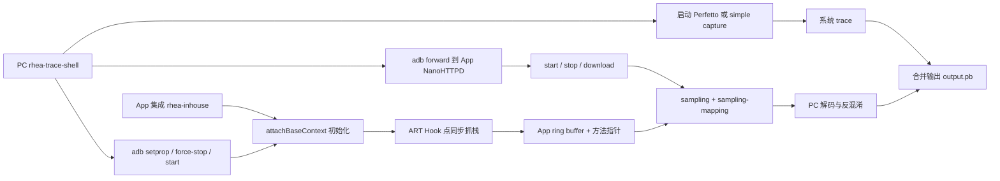
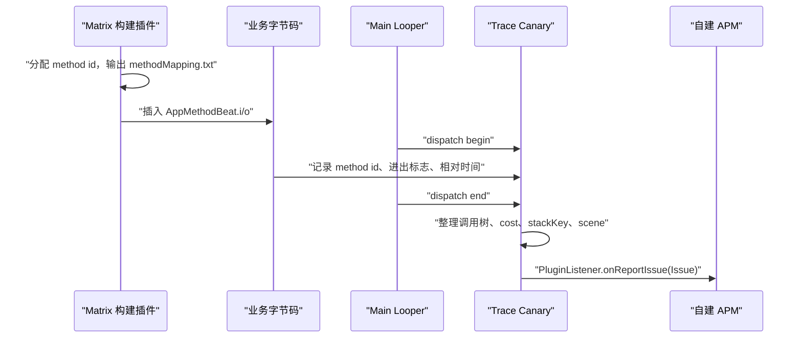

# Matrix、btrace 与 Tracing SDK

androidx.tracing 提供应用埋点入口，btrace/RheaTrace 通过插桩和运行时记录扩大方法覆盖，Matrix 再把 Trace、资源和稳定性能力组织成客户端框架。三者处在不同抽象层。

## 应用 Trace API 与埋点边界

### 它给系统 trace 增加业务语义

系统 trace 是把系统执行活动按时间排列的记录。它能显示线程调度、Binder 进程间通信、I/O、渲染与锁等待，却无法自行判断某段应用代码正在解析首页数据，还是在提交支付结果。`androidx.tracing` 2.0.0 保留的经典 `Trace.*` / `trace {}` API 可以给这些代码区间加上稳定名称，使 Perfetto、Android Studio System Trace 和 Macrobenchmark 采集的 trace 出现应用自定义 slice。

这里要把三件事分开：

- **trace slice** 是有开始和结束的命名时间片，记录区间何时发生，以及它落在哪条 track（时间线轨道）上。
- **性能指标**负责统计分位数、失败率、慢帧率等聚合结果。
- **根因分析**需要把 slice 与线程状态、CPU 调度、Binder、I/O、帧时间线等证据放在一起读。

因此，经典 `androidx.tracing` 事件适合回答“慢发生在哪个业务阶段”，但不会上传数据，也不会自动解释慢因。slice 的持续时间是墙上时间（wall time），即现实中从开始到结束经过的时间；其中可以包含 CPU 执行、锁等待、I/O 等待和被调度器换出的时间，不能直接当作 CPU time（线程实际占用 CPU 的时间）。

#### 核验基线

截至 2026-08-14，采用以下版本边界：

| 对象 | 核验锚点 | 已核实的边界 |
|---|---|---|
| Android 平台 | Android 17 / API 37 / `android-17.0.0_r1` | `android.os.Trace` 的同步 section、异步 section、counter 与 Java Native Interface（JNI）路径 |
| AndroidX 稳定线 | `androidx.tracing:tracing:2.0.0` | 发布于 2026-08-12；Android 变体最低 API 23；同时包含经典 API 与新的进程内 tracing API |
| AndroidX 兼容线 | `androidx.tracing:tracing:1.3.0` | 发布于 2025-04-23；Android 变体最低 API 21，供仍需覆盖 API 21-22 的应用使用 |
| Tracing Wire | `androidx.tracing:tracing-wire:2.0.0` | 给 2.0 进程内 API 提供 Perfetto 格式的 `TraceSink` 实现 |
| Tracing Perfetto | `androidx.tracing:tracing-perfetto:1.0.1` | 独立的 Perfetto SDK 接入组件，不等同于经典 `Trace.beginSection()`，也不等同于 `tracing-wire` |
| AndroidX Benchmark | 稳定版 `1.4.1`；预发布版 `1.5.0-rc01` | 1.5 预发布线可采集并合并目标包的进程内 trace |
| Kernel | `android17-6.18-2026-06_r6` | 仅在联读 CPU 调度、唤醒等 kernel（操作系统内核）事件时作为源码锚点 |

API 23+ 项目当前应使用稳定坐标 `androidx.tracing:tracing:2.0.0`。如果应用仍需运行在 API 21-22，可继续使用 1.3.0 兼容线；下面保留的是这种低版本依赖写法。

```kotlin
dependencies {
    implementation("androidx.tracing:tracing:1.3.0")
}
```

Gradle 会为 Android 目标选择对应版本的 `tracing-android` variant（针对 Android 的发布变体）。这里的 artifact 指 Maven 仓库中的发布组件。自 1.3.0 起，原 `tracing-ktx` 实现已并入主 artifact；使用 1.3.0 或 2.0.0 都不必再单独添加 `tracing-ktx`。

### 哪些位置值得手动标记

判断时应看“这个区间能否缩小性能问题的排查范围”，函数的重要程度并非主要依据。通常值得长期保留的点包括：

- 启动：配置读取、依赖初始化、首屏数据准备、首个可交互状态。
- 列表：diff（新旧列表的差量）计算、分页合并、批量 bind（把数据绑定到列表项）、预取和图片解码。
- 存储：关键数据库查询、事务提交、缓存反序列化。
- 交互：页面转场准备、支付提交、播放器 prepare、相机初始化。
- 跨线程任务：从业务请求开始，到后台工作完成或 UI 提交结束的逻辑跨度。
- Native 重任务：编解码、图像处理、渲染资源准备和大块数据转换。

下面这些位置通常不该逐次打点：

- `onDraw()`、像素循环、序列化字段循环等高频内层。
- 已被一个清晰父 slice 覆盖、且拆开后没有诊断价值的小函数。
- 只为临时观察而加入、问题结束后不再使用的细碎标记。
- 名称必须携带用户 ID、URL、搜索词或订单号才看得懂的事件。

一条长期 slice 应当对应一个稳定业务阶段。需要知道循环处理了多少项时，用 counter 或离线统计；不要为每一项创建不同名称的 slice。

### 三种事件：同步 slice、异步 slice、counter

#### 同步 slice：同一线程上的嵌套区间

同步 section 遵循线程内栈语义：`beginSection()` 与 `endSection()` 必须在同一线程配对，嵌套顺序必须后进先出。Kotlin 优先使用 `trace {}`，它用 `finally` 关闭区间。

下面的例子用于区分主线程上的列表提交和其中的 diff 计算。

```kotlin
import androidx.tracing.trace

fun submitFeed(items: List<FeedItem>) {
    trace("Home#submitFeed") {
        val result = trace("Home#calculateDiff") {
            calculateDiff(items)
        }
        adapter.dispatchUpdates(result)
    }
}
```

在 Perfetto 中，应当到调用 `submitFeed()` 的线程轨道查找 `Home#submitFeed`；`Home#calculateDiff` 会成为它的子 slice。父 slice 很长而子 slice 很短时，耗时还在 diff 之外，不能把父区间全归因于 diff。

Java 代码可以直接调用 `Trace.beginSection()` / `endSection()`，但必须用 `try-finally` 保证异常路径也闭合。

```java
import androidx.tracing.Trace;

void decodeThumbnail(byte[] encoded) {
    Trace.beginSection("Image#decodeThumbnail");
    try {
        decoder.decode(encoded);
    } finally {
        Trace.endSection();
    }
}
```

如果这段方法在解码线程执行，slice 就出现在该解码线程，而不会自动出现在主线程。漏掉 `finally` 会破坏当前线程后续 section 的嵌套关系。

#### 异步 slice：跨线程、跨挂起点的逻辑跨度

异步 section 由“名称 + `Int` cookie”配对。cookie 是区分同名并发任务的整数标识；开始和结束可以位于不同线程，也不要求按栈嵌套，同名且时间重叠的任务必须使用不同 cookie。它适合表示一次跨线程加载、一次远端请求或一段会挂起的协程任务。

AndroidX Tracing 2.0.0 保留了 suspend `traceAsync()`；suspend 表示这个 Kotlin 函数可以挂起后再恢复。下面的例子让一个异步 span（跨线程表达同一逻辑工作的区间）覆盖完整加载过程，同时保留 I/O 线程和主线程各自的同步 slice。

```kotlin
import androidx.tracing.trace
import androidx.tracing.traceAsync
import java.util.concurrent.atomic.AtomicInteger
import kotlinx.coroutines.Dispatchers
import kotlinx.coroutines.withContext

private val nextTraceCookie = AtomicInteger(1)

suspend fun loadFirstFeed(): List<FeedItem> {
    val cookie = nextTraceCookie.getAndIncrement()
    return traceAsync("Home#loadFirstFeed", cookie) {
        val items = withContext(Dispatchers.IO) {
            trace("Home#requestFirstFeed") {
                repository.loadFirstFeedBlocking()
            }
        }

        withContext(Dispatchers.Main.immediate) {
            trace("Home#submitFirstFeed") {
                adapter.submitList(items)
            }
        }
        items
    }
}
```

`traceAsync()` 的 2.0.0 源码仍在 `try-finally` 中结束异步 section，所以正常返回、异常和协程取消都会走关闭路径。Perfetto 中，`Home#loadFirstFeed` 表示墙上时间跨度；`Home#requestFirstFeed` 要到 I/O 线程查看，`Home#submitFirstFeed` 要到主线程查看。前者不能代替后两条线程内证据。

不要用同步 `trace {}` 包住包含 `delay()`、`withContext()` 或其他挂起点的代码。协程恢复后可能换线程，而同步 section 要求 begin/end 位于同一线程；即使某次测试恰好恢复到原线程，也不能把这种调度结果当作 API 保证。

对于线程池（executor）、回调或消息队列，规则相同：

1. 提交任务前生成 cookie 并开始异步 section。
2. 在任务的唯一终态关闭同名、同 cookie 的 section。
3. 提交被拒绝、任务取消、回调不再投递时也要关闭。
4. 每条实际执行线程再用同步 section 标记 CPU 工作。

如果现有抽象无法保证“每个 begin 恰好对应一次 end”，先修正任务生命周期，再加 async trace。用多个 `catch` 和回调分别关闭，很容易形成漏关或重复关闭。

#### Counter：观察随时间变化的值

counter 表示某个时刻的数值，不表示一段耗时。它适合队列深度、缓存条目数、在途请求数等低频状态。

下面的例子在解码队列变化时写入固定名称的 counter。

```kotlin
import androidx.tracing.Trace

fun onDecodeQueueChanged(pendingCount: Int) {
    Trace.setCounter("Image#decodeQueueDepth", pendingCount)
}
```

在 Perfetto 中搜索 `Image#decodeQueueDepth`，应当看到一条随时间变化的 counter 轨道。AndroidX 1.3.0 只有 `Int` 参数；2.0.0 保留这个重载，并增加 API 29+ 可用的 `Long` 重载。Android 17 平台 `android.os.Trace.setCounter()` 接受 `long`。写公共库时要注明所依赖的 AndroidX 版本和最低 API，不能把三者混写成同一签名。

### 命名是一份可维护的诊断协议

建议统一使用 `Module#Action`，必要时再加一个固定层级，如 `Module#Stage.Step`。名称描述业务阶段，不绑定类名、方法名或当前架构。

| 场景 | 推荐名称 | 不推荐 | 原因 |
|---|---|---|---|
| 应用启动 | `Startup#loadConfig` | `ConfigRepositoryImpl.loadV3` | 实现重构后仍可比较 |
| 首页首屏 | `Home#loadFirstFeed` | `feed_4938102` | 避免高基数，即避免名称数量随请求或内容数量增长 |
| 详情页 | `Detail#renderContent` | `Detail#render/sku-123` | 不写业务 ID |
| 支付提交 | `Checkout#submit` | `pay/alice@example.com` | 不写用户数据 |
| 图片解码 | `Image#decodeThumbnail` | 完整图片 URL | 避免隐私与超长名称 |
| 数据库查询 | `Database#loadTimeline` | 完整 SQL | 防止敏感参数进入 trace |

团队可以按下面四条规则评审名称：

- **稳定**：相同阶段跨版本保留同名，指标才能纵向比较。
- **有界**：动态变化只能来自少量固定枚举，如 `thumbnail`、`preview`、`full`。
- **可定位**：名称能指向业务阶段，但无需暴露类和方法实现。
- **无敏感数据**：trace 文件可能被分享、上传或附在缺陷单中。

Android 17 的平台 `Trace.beginSection()` 限制名称最多 127 个 Unicode code unit。这里的 code unit 是 Java `String.length` 使用的 UTF-16 计数单位，一个可见字符不一定只占一个单位。采集已启用时，直接向平台 API 传入超长名称会抛 `IllegalArgumentException`；AndroidX 1.3.0 与 2.0.0 都会先截断到 127。截断仍可能让不同名称变得相同，所以设计时就应保持短且稳定。`|`、换行和空字符属于底层保留字符，也不应放入名称。

### Android 17 的调用链：不要固定套用旧版 `trace_marker` 叙述

以 `android-17.0.0_r1` 为准，AndroidX 2.0.0 经典 `trace {}` API 的同步调用链可以概括为：

```text
androidx.tracing.trace("Home#submitFeed")
  -> androidx.tracing.Trace.beginSection()
  -> android.os.Trace.beginSection()
  -> nativeTraceBegin(TRACE_TAG_APP, name)
  -> tracing_perfetto::traceBegin(tag, name)
```

这条链说明两个边界：

- AndroidX 负责兼容封装、异常安全辅助和名称截断，平台仍会检查 `TRACE_TAG_APP` 是否启用。
- Android 17 的 `android_os_Trace.cpp` 已把 JNI 调用交给 `tracing_perfetto`，不能再把所有版本概括成“每次直接向 `trace_marker` 执行一次 `write()`”。

因此，也不能从旧版实现推导 Android 17 的固定纳秒开销、锁竞争方式或系统调用次数。若要判断打点是否影响热路径（高频或对延迟敏感的执行路径），应当在目标构建、目标设备和实际采集配置上运行 Microbenchmark（针对一小段代码的重复性能测试），并同时比较 trace 开启与关闭两种状态。

### 版本与可见性：允许写入不等于正在采集

`Trace.isEnabled()` 为 `true` 需要同时满足两件事：当前存在能接收应用事件的 trace 会话，并且该进程被允许写 app trace。Android 12 以后“默认允许应用 tracing”不表示系统一直在后台记录。

下表中的 non-debuggable 表示应用关闭调试能力，profileable 表示应用允许 shell 等受控工具进行性能采集。

| 平台范围 | 非 debuggable 进程的允许条件 | AndroidX 经典 async/counter 路径 |
|---|---|---|
| API 21-22 | 只能使用 1.3.0；应用启动早期调用 `Trace.forceEnableAppTracing()` | 反射平台隐藏的 `asyncTraceBegin`、`asyncTraceEnd`、`traceCounter` |
| API 23-28 | 1.3.0 或 2.0.0；应用启动早期调用 `Trace.forceEnableAppTracing()` | 反射同一组平台隐藏方法 |
| API 29-30 | manifest 设置 `<profileable android:shell="true"/>`，或调用 `forceEnableAppTracing()` | 调用 API 29 新增的公开平台方法 |
| API 31-37 | 默认允许；显式设置 `<profileable android:enabled="false"/>` 或 `android:shell="false"` 会限制该能力 | 调用公开平台方法；`forceEnableAppTracing()` 在这一范围无操作 |

当前稳定版 `tracing-android:2.0.0` 的 `minSdkVersion` 是 23；兼容线 1.3.0 的下限是 21。两版源码都保留了更低平台的兼容分支说明，但发布物 manifest 会先限制依赖范围，不能据此宣称 artifact 支持 API 18。

采集侧也要包含目标应用：

- Macrobenchmark 会自动采集目标应用的自定义 trace point。
- 旧 systrace 命令需要用 `-a <package>` 指定应用。
- 自定义 Perfetto 配置要把目标包加入相应的 atrace app 配置；atrace 是 Perfetto 用来接收 Android 系统与应用 trace point 的数据源之一。

正式性能结论宜来自 non-debuggable、profileable 且接近发布配置的构建。debuggable 包的调试设施、编译选项和运行时行为可能改变时间分布。

### 开销控制：少而稳定，动态内容延迟计算

Tracing 没有一个适用于所有设备的固定开销数字。成本会随是否采集、平台实现、事件类型、名称处理、缓冲区压力和调用频率变化。工程上应采用以下约束：

- 把 section 提到循环外，观察一次批处理，不给每个元素打点。
- 优先使用静态名称；只有诊断需要且取值空间很小时才构造动态名称。
- 用 `Trace.isEnabled()` 避免只为 trace 做昂贵计算。
- 用同一套 Macrobenchmark 或 Microbenchmark 对比打点前后，关注 p50/p95 与 trace 丢失情况；p95 表示 95% 的观测值不超过该数值。
- 父 slice 已足够定位时，删除重复的子 slice。

AndroidX 2.0.0 保留 lazy label（延迟计算名称）重载。下面的例子只在 tracing 启用时构造带固定枚举的名称。

```kotlin
import androidx.tracing.trace

fun bindCard(card: Card, viewType: CardViewType) {
    trace(lazyLabel = { "Feed#bind/${viewType.traceName}" }) {
        renderer.bind(card)
    }
}
```

`traceName` 应是受控枚举，如 `text`、`image`、`video`，不能返回 item ID。该 slice 位于执行 `bindCard()` 的线程；如果它每帧出现很多次，应改为在批量 bind 外只保留一个父 section。

### Native 标注：与 Java 使用同一套名称

Android Native Development Kit（NDK）的 `<android/trace.h>` 从 API 23 提供同步 section，API 29 增加异步 section 与 counter。Native 同步 section 也要求在同一线程正确嵌套。

下面的 RAII（Resource Acquisition Is Initialization，以对象生命周期管理资源）封装用于保证 early return（函数提前返回）或 C++ 异常不会漏掉 `ATrace_endSection()`。

```cpp
#include <android/trace.h>

class ScopedTrace final {
public:
    explicit ScopedTrace(const char* name) {
        ATrace_beginSection(name);
    }

    ~ScopedTrace() {
        ATrace_endSection();
    }

    ScopedTrace(const ScopedTrace&) = delete;
    ScopedTrace& operator=(const ScopedTrace&) = delete;
};

void DecodeFrame(const EncodedFrame& frame) {
    ScopedTrace trace("Video#decodeFrame");
    DecodeOneFrame(frame);
}
```

Perfetto 会把 `Video#decodeFrame` 放在执行 `DecodeFrame()` 的 native 线程轨道上。Java 外层若有 `Video#processFrame`，两者只有在同一线程同步调用时才形成自然嵌套；JNI 前后换了线程时，要用 async span 或 Perfetto flow（连接两个 slice 的箭头）表达逻辑联系。

`ATrace_isEnabled()` 可用于跳过只服务于 tracing 的昂贵名称计算。不要为了调用它而包住正常业务逻辑，业务逻辑无论 tracing 状态如何都必须执行。

### 与 Perfetto SDK、btrace、Macrobenchmark 的分工

这些工具都能产出或消费 trace 信息，但抽象层级不同。

| 工具 | 适合的任务 | 关键边界 |
|---|---|---|
| 经典 `Trace.*` / `trace {}`（2.0.0；API 21-22 用 1.3.0） | 长期保留少量业务 section、async span、counter | 写入系统 trace；不上传、不聚合；官方仍推荐用于低频事件 |
| `Tracer` + `tracing-wire:2.0.0` | 进程内 Perfetto 格式 trace、分类、metadata（键值附注）、flow 与协程上下文传播 | 最低 API 23；要设计 `TraceDriver`、`TraceSink`、文件和丢事件生命周期 |
| `tracing-perfetto:1.0.1` | 通过独立 Perfetto SDK 组件记录应用事件 | 有自己的 native binary 与启用握手（handshake），与经典 API、`tracing-wire` 都是不同接入路径 |
| btrace / RheaTrace | 专项抓取方法级调用现场，即记录大量方法进入和退出 | 数据量和侵入面更大，适合定向诊断 |
| Macrobenchmark 1.4.1 / 1.5.0-rc01 | 在测试侧启动、交互并采集 trace；1.5 预发布线可合并进程内 trace | `TraceSectionMetric` 是实验 API；默认只看目标包；1.5.0-rc01 尚未成为稳定版 |
| Perfetto UI / Trace Processor | 人工或 SQL 联读系统与应用证据 | 工具负责展示和查询，不替应用补业务语义 |

AndroidX 2.0.0 的新 `Tracer` API 与经典 `Trace.beginSection()` 是两条用途不同的接口面。经典 API 仍写系统 trace，也没有被弃用。新路径由 `TraceDriver` 持有 `Tracer` 并管理一次 tracing 生命周期，`TraceSink` 决定事件如何序列化和输出；`tracing-wire` 提供 Perfetto 格式实现。category 用于按类别筛选事件，metadata 给事件附加键值信息，instant event 表示没有持续时间的瞬时点。新 API 还支持 counter、Perfetto flow 和 `traceCoroutine()`。Android Studio System Trace 目前不会直接采集这条进程内路径，Benchmark 1.5.0-rc01 的 `PerfettoCapture` / `PerfettoTraceRule` 可以采集并在事后合并目标包的进程内 trace。即使 2.0.0 已稳定，接入新路径时仍要设计采集启动方式、文件生命周期、丢事件策略、体积与工具兼容性。

Benchmark 稳定版 1.4.1 的 `TraceSectionMetric(sectionName)` 仍是实验 API，默认使用 `Mode.Sum`，输出全部匹配 section 的总时长与次数；只有显式选择 `Mode.First` 才取第一条。这里的 mode 是把多条同名 section 汇成指标的方式。它默认只读取目标包。用于基准指标的 section 要把生命周期和 mode 写清楚，并用生成的 trace 复核所选区间。

### 与线上指标建立同名索引

经典 `androidx.tracing` 不会把事件送到线上；2.0 进程内 API 也只负责本地记录，上传仍需应用自行设计。可以用一张受版本控制的阶段表，让 Perfetto slice、JankStats context 和 APM（Application Performance Monitoring，应用性能监控）span 指向同一个业务语义；span 是 APM 中表示一次操作区间的记录。

| 业务阶段 | Perfetto slice | JankStats state | APM 事件 |
|---|---|---|---|
| 应用初始化 | `Startup#appOnCreate` | `phase=startup_init` | `startup.app_on_create` |
| 首屏数据 | `Home#loadFirstFeed` | `phase=first_feed_load` | `home.first_feed_load` |
| 首页提交 | `Home#submitFirstFeed` | `phase=first_feed_submit` | `home.first_feed_submit` |
| 详情内容可见 | `Detail#renderContent` | `phase=content_render` | `detail.content_render` |
| 支付提交 | `Checkout#submit` | `phase=checkout_submit` | `checkout.submit` |

映射表只保存稳定阶段。请求 ID、trace ID 等关联字段可进入受控的日志或 APM 字段，不应拼进 Perfetto slice 名称。

JankStats 的 `PerformanceMetricsState` 是状态，不是瞬时事件。进入阶段时写入，离开阶段时移除或替换；若忘记清理，后续帧会继续携带过期上下文。线上看到 `phase=first_feed_submit` 的慢帧后，可以在线下复现并搜索 `Home#submitFirstFeed`，再用主线程与帧时间线确认慢因。

### 在 Perfetto 里按证据顺序阅读

拿到 trace 后，建议按固定顺序分析：

1. **搜索精确名称**：确认目标 slice 是否出现，以及出现了几次。
2. **确认轨道**：同步 slice 看所在的 thread track（每条线程的时间线轨道）；异步 span 看它连接的逻辑轨道和两端事件。
3. **展开嵌套**：父 slice 的墙上时间只能说明范围，子 slice 才能继续分段归因。
4. **对齐帧或启动窗口**：慢帧要对齐 FrameTimeline（记录每帧生命周期的系统时间线），启动要对齐进程创建、activity launch 和首帧。
5. **查看线程状态**：Running 表示正在占用 CPU，Runnable 表示可运行但未获 CPU，Sleeping 常见于等待；还要继续结合锁、Binder、I/O 和 wakeup（线程被唤醒）事件。
6. **检查 gap**：gap 是两个业务 slice 之间的空白，可能来自等待或没有标记的代码，不能只凭空白下结论。

需要批量核对同名 slice 时，可以在 Perfetto Trace Processor（Perfetto 的 SQL 查询引擎）中执行下面的查询。

```sql
SELECT
  s.ts / 1e6 AS start_ms,
  s.dur / 1e6 AS duration_ms,
  t.name AS thread_name
FROM slice AS s
JOIN thread_track AS tt ON s.track_id = tt.id
JOIN thread AS t ON tt.utid = t.utid
WHERE s.name = 'Home#submitFirstFeed'
ORDER BY s.ts;
```

这条查询只列出 thread track 上的同步 slice。`ts` 和 `dur` 的原始单位是纳秒，除以 `1e6` 后得到毫秒；`utid` 是 Trace Processor 内部的线程关联键，不等同于 Linux `tid`。异步 slice 可能位于其他 track，不能因查询无结果就断言事件没有采到。`dur = -1` 通常意味着区间未闭合或采集结束时仍在进行，需要回查 begin/end 生命周期。

CPU 调度与唤醒证据来自系统和 kernel trace 数据源。涉及这类实现时，以 `android17-6.18-2026-06_r6` 为 kernel 侧锚点；应用自定义 slice 的 Android 17 Java/JNI 行为则以 `android-17.0.0_r1` 为准，两类源码边界不要混用。

### 常见错误与修正

| 错误 | trace 中的表现 | 修正 |
|---|---|---|
| 名称带 ID、URL、SQL 或用户数据 | 名称爆炸，无法聚合，并有泄露风险 | 固定名称；动态字段进入受控日志或 APM |
| Java begin/end 没放进 `try-finally` | 后续 slice 嵌套到错误父区间，或出现未闭合区间 | Kotlin 用 `trace {}`；Java 强制 `try-finally` |
| 同步 section 跨协程挂起点 | begin/end 可能跨线程，线程栈语义失效 | 用 suspend `traceAsync()` 表示逻辑跨度，线程内工作另加同步 slice |
| async span 复用并发 cookie | 同名任务互相错配 | cookie 在同名重叠任务间保持唯一 |
| 只标任务提交 | 只看到 `execute()`、`post()` 的提交耗时 | 在执行线程标记工作，并用 async span 串起生命周期 |
| 每个循环元素都打点 | 视图充满碎片，缓冲区压力上升 | 把 section 移到循环外；数量用 counter |
| 把 slice 时长当 CPU time | 把等待和调度延迟误算为执行耗时 | 联读 thread state、sched（调度事件）、Binder、I/O |
| 认为 API 31+ 一直在采集 | 没抓 trace 时仍构造昂贵名称 | 用 lazy label 或 `Trace.isEnabled()` |
| 把 2.0 `Tracer` 当成经典 `Trace.*` 的直接替换 | 采集和文件生命周期设计缺失 | 将进程内 tracing 作为独立路径评估；低频系统事件可继续用经典 API |
| 把 trace 当线上统计系统 | 没有分位数、采样和上传策略 | 指标交给 JankStats/APM/Benchmark，trace 用于解释现场 |

### 源码核验记录

相关结论来自官方文档、Android 17 源码和已发布 artifact 的交叉核对：

- AndroidX Tracing 发布说明与 Google Maven metadata：2.0.0 stable、1.3.0 兼容线与 Tracing Perfetto 1.0.1 的版本边界。
- `android-17.0.0_r1` 的 `android.os.Trace`：127 code unit 限制、同步同线程约束、异步 name/cookie 配对和公开 API。
- `android-17.0.0_r1` 的 `android_os_Trace.cpp`：JNI 进入 `tracing_perfetto::traceBegin()`、`traceEnd()`、`traceAsyncBegin()` 等实现。
- `tracing-android:2.0.0` sources：AndroidX 名称截断、API 29 前反射兼容路径、`forceEnableAppTracing()`、`Long` counter 重载与 suspend `traceAsync()` 的 `finally` 配对。
- AndroidX Tracing 2.0 发布说明与 `tracing-wire` POM：进程内 `Tracer`、Perfetto 格式 `TraceSink`、Studio System Trace 的采集边界，以及 Benchmark 1.5 的事后合并能力。
- AndroidX Benchmark 发布说明与 `TraceSectionMetric` API：1.4.1 stable、1.5.0-rc01、实验 API 标记和 mode 语义。
- Android NDK tracing reference：同步 API 从 23 可用，异步与 counter 从 29 可用。

为便于复核，下载件的 SHA-256 如下：

| 文件 | SHA-256 |
|---|---|
| `tracing-android-2.0.0.aar` | `b21800b83ed0e3e214742c8a94edee90130e0a9970c85e59161d161546f5fe9a` |
| `tracing-android-2.0.0-sources.jar` | `3e8834bc1448680390709e1379de6fcae6170920ebc9b8a569d00c5e735df51d` |
| `tracing-android-1.3.0.aar` | `f59782bbe3470a6b0c531cef262dd1fc9d9a0233490bb5e6d553e1fe6a1816b2` |
| `tracing-android-1.3.0-sources.jar` | `a3a9c1b46707208a024ab3939fc93dd56978f5c0e5928ec808e21df9e139cc5d` |
| `tracing-android-2.0.0-beta01.aar` | `a5596bdc3870afcede0c8a4b99685eea692bfed9b583679b3a07e9598750feb8` |
| `tracing-android-2.0.0-beta01-sources.jar` | `3e8834bc1448680390709e1379de6fcae6170920ebc9b8a569d00c5e735df51d` |

2.0.0 与 beta01 的 sources JAR 内容哈希相同，已发布 AAR 的哈希不同；表中同时保留两组值，避免复核历史文章时把两个产物混为一谈。


## 字节码插桩与方法 Trace

显式埋点适合关键业务区间，需要更广方法覆盖时才引入插桩。采样、过滤和方法 ID 映射决定运行开销。

### 官方产物不要直接接入 Android 17 生产项目

btrace 是字节跳动开源的跨平台 tracing（记录程序运行时间线）项目，Android 代码仍沿用 `RheaTrace3`、`rhea-inhouse` 等历史命名。它会把应用线程的 Java 方法栈样本转换成 Perfetto protobuf（Protocol Buffers 编码的 trace 数据），并在 `perfetto` 模式下与系统 trace 合并，让方法现场和调度、Binder（Android 跨进程调用机制）、I/O、渲染时间线使用同一时钟轴。

截至 2026-08-14，仓库最新 tag 和 GitHub release 仍是 [`v3.1.0`](https://github.com/bytedance/btrace/tree/v3.1.0)，对应 2026-06-09 的 commit `2ae621f2d84ad54b2811d675d86ba2815006adb3`。这个 tag 加入了 HarmonyOS，Android 子工程的 `POM_VERSION_NAME`、README 依赖和脚本表仍停在 `3.0.0`。[Maven Central 元数据](https://repo.maven.apache.org/maven2/com/bytedance/btrace/rhea-inhouse/maven-metadata.xml)显示 Android 产物最新是 `3.0.1-alpha01`，稳定版仍是 `3.0.0`。仓库 tag 与 Android Maven 版本是两套发布状态，不能把 Android 依赖写成不存在的 `3.1.0`。

当前开源 Android 实现不能视为 Android 17 / API 37 兼容，原因已经落到源码和产物：

- btrace 解析旧的 `art::StackVisitor::WalkStack<CountTransitions::kNo>(bool)` C++ 符号。Android 17 的 [`StackVisitor`](https://android.googlesource.com/platform/art/+/refs/tags/android-17.0.0_r1/runtime/stack.h) 已给 `WalkStack` 增加第二个模板参数。`android-17.0.0_r1` 显式实例化的新 mangled symbol（编译器编码后的 C++ 符号名）与 btrace 写死的旧名称不同。旧符号解析失败时，核心 `StackVisitor::init()` 返回 false，后续方法采样会失败。
- 上游只声明 Java 对象创建监控未适配 Android 15+，这不是唯一的高版本风险。同步抓栈、JNI（Java Native Interface）、锁、GC（垃圾回收）、park/wait 等路径都会 Hook 或解析 ART 私有实现，没有公开 SDK/NDK ABI（应用二进制接口）的稳定保证。
- Android 子工程仍用 compileSdk 30、targetSdk 30、AGP（Android Gradle Plugin）4.1.0、NDK（Native Development Kit）`21.1.6352462`。这组版本只描述上游构建环境，不能证明 API 37 行为。
- 实测 `3.0.1-alpha01` AAR（Android 库归档）中的 `librheatrace.so` 和随包 `libc++_shared.so`，其 ELF `LOAD` segment（加载段）都是 `2**12`，即 4096 字节对齐。`npth_dl.c` 还用 `0xfff` / `0x1000` 计算 ELF section 的 `mmap`（内存映射）偏移。它们没有满足 Android 17 严格 16 KB 运行环境的条件。

Android 17 设备上可能仍得到一份只有系统轨道的 `.pb`，这不能证明 btrace 方法采样成功。采用方需要维护 source fork（从官方源码派生的自有分支），修复 ART 符号、16 KB ELF 对齐和页大小假设，再把“采样记录数大于零、方法能正确符号化”设为自动验收条件。符号化是把方法指针或地址还原成可读的方法名。没有维护私有 ART Hook 的能力时，可直接使用 Perfetto、`androidx.tracing`、Perfetto SDK、simpleperf 或 Android Studio Profiler。

3.0 的接入侧没有 Gradle 插件或 Transform API 字节码任务，现代 AGP 工程可以把它当普通 AAR 解析。这只排除了旧版编译期插桩 API 与构建链不兼容这一项风险。重建 fork 仍要升级上游 AGP/Gradle/NDK；最终 App 还要验证 manifest 合并、`libc++_shared.so` 冲突、ABI 筛选和 16 KB 打包结果。

### 3.0 已经不做编译期全量插桩

btrace 2.0 依靠 Gradle 插件和编译期字节码插桩记录方法进入与退出。3.0 删除了应用方法的编译期全量插桩，改为“运行时动态 Hook + 当前线程同步抓栈”。同步抓栈表示由目标线程在经过 Hook 点时读取自己的调用栈：

1. ShadowHook（用于替换 native 函数入口的 Hook 库）和 JNI Hook 拦截一批高频或可能阻塞的 ART 路径，例如对象分配、JNI 调用、Monitor 对象锁、GC、`Object.wait()`、`Unsafe.park()`。
2. Hook 点在目标线程上调用 ART 私有 `StackVisitor`，只保存 `ArtMethod*` 和时间、线程、rusage（线程资源使用计数）等轻量信息。
3. 停止采集后，再对去重的方法指针批量符号化，转换成 Perfetto 的 stack/slice 数据。
4. PC 端把应用样本追加到系统 trace，输出 `.pb`。

同步抓栈省掉了“采样线程暂停目标线程、抓栈、恢复线程”的固定成本，也能在锁、wait、park 等 Hook 点记录 wall time（现实经过时间）与 thread CPU time（线程实际占用 CPU 的时间）。但它依赖 Hook 点：线程在两次 Hook 之间执行的短方法不会被完整记录；线程长期阻塞在未覆盖的入口，也可能没有足够样本。这里的 slice（时间线中有起止时间的区间）由样本和 Hook 上下文重建，不能当成每个方法精确的 enter/exit 计时。

这也解释了两个常见配置误区：

- btrace 3.0 没有 2.0 那种方法 include/exclude 插桩表。`-m` 接收的是 ProGuard/R8 mapping，即“混淆后名称 → 原始类/方法名”的映射，用于反混淆；它不是 btrace 2.0 的 method mapping。
- `-sampleInterval` 是同一线程两次同步抓栈之间的最小间隔，默认 `1,000,000 ns`，也就是 1 ms。它不会启动一个严格每 1 ms 唤醒的定时采样器；没有经过 Hook 点，就不会产生对应样本。

### 从构建到 Perfetto 的采集链

采集过程跨 App、adb（Android Debug Bridge）、PC 脚本和 Perfetto。任何一段失败都可能出现“文件已经生成，证据却不完整”。下面这张图标出数据与控制路径：



冷启动时，PC 先写 `debug.rhea3.startWhenAppLaunch=1` 系统属性，再用 `force-stop` 终止现有 App 进程并启动 Launcher Activity（点击桌面图标时进入的 Activity）；App 在 `attachBaseContext()` 读取属性并开始采样。非重启采集则通过 `adb forward` 把 PC 端口转发到设备端，再访问 App 内嵌的 NanoHTTPD 轻量 HTTP server，发送 start/stop/download。设备端口记录、HTTP server、采样文件、mapping 文件或系统 trace 任一缺失，PC 都可能超时或只留下部分数据。

#### 接入包要有明确开关

上游建议在真实实现与 no-op AAR 之间切换。下面的模板保留这种做法，并把版本固定在稳定版：

```groovy
dependencies {
    if (providers.gradleProperty("enableBtrace").orNull == "true") {
        implementation("com.bytedance.btrace:rhea-inhouse:3.0.0")
    } else {
        implementation("com.bytedance.btrace:rhea-inhouse-noop:3.0.0")
    }
}
```

no-op 版本保留同名 API，但方法不执行真实采集，适合让普通构建不携带 Hook 行为。Android 17 fork 不能复用上面的官方坐标冒充兼容版，应使用自有 Maven group/version，并记录上游 commit、ART tag、NDK、ShadowHook 和 16 KB 测试结果。

App 需要尽早初始化，下面的调用放在主进程 `Application.attachBaseContext()`：

```java
@Override
protected void attachBaseContext(Context base) {
    super.attachBaseContext(base);
    RheaTrace3.init(base);
}
```

`RheaTrace3.init()` 会直接跳过非主进程，所以官方 3.0 不能采集 remote Service（运行在独立进程中的 Android Service）。初始化还会启动 App 内的 HTTP server；不要让真实依赖在所有生产构建中无条件常驻。只放入 internal（内部测试）或专项诊断包，更容易限制可访问范围和性能变量。

#### 一条可复现的冷启动命令

这条命令用于采集主进程 10 秒冷启动，并显式要求调度事件：

```bash
java -jar rhea-trace-processor-3.0.0.jar \
  -a com.example.app \
  -t 10 \
  -o startup-api34.pb \
  -m app-release-mapping.txt \
  -r \
  sched
```

`-r` 表示重启 App，`sched` 是传给系统 trace 脚本的 category（要启用的一组 trace 事件），两者作用不同。源码在没有提供 category 时也会补 `sched`，但复现记录里显式写出更清楚。采集前先用 `--list` 查看设备支持的 category；要分析 Binder、磁盘或 CPU 频率，还要确认对应事件确已进入 trace。看到 `.pb` 文件存在，不能直接认定所需轨道齐全。

### perfetto 与 simple 模式

| 项目 | `perfetto` | `simple` |
|---|---|---|
| PC 侧实现 | `PerfettoCapture` 启动 `record_android_trace` 系统采集脚本，随后追加应用样本 | `LiteCapture` 只等待采集结束并写应用样本 |
| 自动选择 | PC 源码在 API 28+ 默认选择 | API 27 及以下默认选择 |
| 系统信息 | 可包含 atrace（Android framework/应用事件）、ftrace（Linux 内核事件）、调度和频率等，取决于 category 与设备权限 | 当前源码没有采系统 trace |
| 输出 | 系统 trace + btrace 样本的 `.pb` | 仅 btrace 样本转换的 `.pb` |
| 诊断能力 | 能区分 Running、Runnable、阻塞与业务栈样本 | 只能看到 App 方法样本，等待原因容易误判 |

README 把 Android 8.1 写成 `perfetto` 默认边界，但 `Main.getSystemLevelCapture()` 的实现使用 `SDK_INT >= 28`，也就是 Android 9。API 27 若要显式尝试 `-mode perfetto`，必须在目标设备验证脚本与 tracing service（系统 trace 服务）；文档描述不能替代测试。

README 还说 `simple` 模式能带系统 atrace，当前 `LiteCapture` 源码只调用 `SamplingTraceDecoder`，没有启动 atrace。遇到这类文档与实现冲突，应以所用 commit 的代码和产物测试为准。

### 参数决定“能看到什么”

| 参数 | 精确含义 | 容易踩的坑 |
|---|---|---|
| `-a` | 包名；App 内只采主进程 | 不能靠包名覆盖同包多进程 |
| `-t` | PC 等待的采集时长，单位秒 | 过长更容易覆盖 ring buffer（容量固定、写满后覆盖旧记录的环形缓冲区）；过短可能漏掉首帧后任务 |
| `-o` | 最终 `.pb` 路径 | 同时保留设备、API、App 版本和场景信息 |
| `-r` | 设置启动采集属性并重启 Launcher Activity | 多 Launcher 时要核对选择结果，必要时指定 `-launcher` |
| `-m` | ProGuard/R8 混淆映射文件 | 必须与 APK 构建完全匹配；3.0 不再使用 2.0 method mapping |
| `-mode` | 强制 `perfetto` 或 `simple` | perfetto 启动失败时会缺系统文件；simple 没有调度证据 |
| `-sampleInterval` | 同线程抓栈最小间隔，纳秒 | 调小会增加 CPU 和 buffer 压力，也不能保证固定周期 |
| `-maxAppTraceBufferSize` | ring buffer 可保存的抓栈条数，默认 200000 | 满后旧记录被覆盖；停止时要检查脚本打印的 usage |
| `-waitTraceTimeout` | 等待端侧 dump 完成的秒数，默认 20 | 加大只改变等待时间，不能修复端侧 dump 失败 |
| `-s` | 指定 adb serial（设备序列号） | 由 `Adb.init()` 单独读取并附加到后续 adb 命令；多设备环境应显式指定 |

上游 README 还列出 `-mainThreadOnly`，当前 `Arguments.Parser` 没有解析它，也没有把它转成设备端配置。在写入自动化脚本前，不能预期这个参数有效。若只需要主线程，应在 fork 中实现可测试的配置，或在后处理阶段筛选线程。

### Perfetto UI 要从线程状态读起

btrace 样本给出某个 Hook 点附近的 Java 栈；系统轨道给出线程有没有运行、在哪个 CPU 上运行、为何被唤醒。Main thread 是 Android UI 主线程，RenderThread 是负责部分渲染工作的线程。推荐按以下顺序阅读：

1. 用用户操作、启动点或手工 trace marker 圈定问题窗口。
2. 查看 Main thread 与 RenderThread 的 thread state（线程状态）。`Running` 表示正在 CPU 上执行；`Runnable` 表示已经可以运行，却还在等待调度。只有 `Running` 时间才累计 on-CPU 工作。
3. 对照 CPU 轨道和 CPU frequency（运行频率）。多条后台线程同时 `Runnable` 时，主线程慢段可能来自 CPU 竞争。
4. 再展开 btrace 重建的方法栈，看样本是否连续、是否出现 `[unknown]`，以及 buffer 是否覆盖。
5. 若线程进入 `Sleeping` 或 `Uninterruptible Sleep`，继续找 Binder、futex（Linux 用户态锁常用的内核等待机制）、I/O、GC 或唤醒者；缺对应 category 时重新采集。
6. 渲染问题继续对照 FrameTimeline（帧是否按期限完成的系统时间线）、Choreographer、RenderThread、SurfaceFlinger/GPU 轨道。btrace 的 Java 栈不能代替 GPU 完成时间。

一段 30 ms 的“方法 slice”不一定表示 CPU 执行了 30 ms。线程可能只运行 4 ms，其余时间在 `Runnable`、sleep、Binder 或 I/O 中。修复记录应分别写明 wall duration（现实经过时长）、on-CPU duration（真正占用 CPU 的时长）、线程状态和阻塞证据。

`sched` 数据来自目标设备的 ftrace 能力，btrace 不自带内核探针。GKI（Generic Kernel Image）是 Android 通用内核架构；知识库当前的 Android 17 common kernel 源码锚点是 [`android17-6.18-2026-06_r39`](https://android.googlesource.com/kernel/common/+/refs/tags/android17-6.18-2026-06_r39)，此前核验使用的 [`android17-6.18-2026-06_r6`](https://android.googlesource.com/kernel/common/+/refs/tags/android17-6.18-2026-06_r6) 继续保留，便于复现旧基线。量产设备仍可能使用厂商分支和不同内核配置；轨道缺失时，应先检查目标设备支持的 category 与 trace 配置。

### 冷启动案例

现象：版本升级后，热启动稳定，冷启动 P95 增加 300 ms。P95 表示 95% 的样本不超过该时长，用于观察偏慢的一端。采集时使用同一台设备和一致的冷启动定义，运行 10～15 秒 `perfetto` 模式，并保留 `sched`、CPU 频率和所需 atrace category。

Zygote 是 Android 创建应用进程所用的预加载模板进程；`bindApplication` 是 `ActivityThread` 开始把新进程绑定到应用的阶段。由于 btrace SDK 此时尚未全部初始化，冷启动前半段必须依赖系统 trace：

| 阶段 | btrace 能提供的证据 | 系统 trace 要补的证据 |
|---|---|---|
| Zygote fork / 进程创建 | SDK 尚未加载，基本没有方法样本 | 进程创建、调度与 CPU frequency |
| `bindApplication` 到 `attachBaseContext()` | 只能覆盖初始化后的部分 | ActivityThread/framework slice 与线程状态 |
| Provider 安装 | 初始化足够早时可见业务/SDK 栈样本 | Binder、I/O、锁等待 |
| `Application.onCreate()` | 方法栈、对象分配/锁等 Hook 上下文 | on-CPU 时间、GC、调度竞争 |
| Activity 创建 | inflate、Fragment、首屏业务栈候选 | 主线程状态与资源读取 |
| 首帧 | Java 提交前的方法候选 | FrameTimeline、RenderThread、SurfaceFlinger |
| 首帧后 | 延迟任务与后台并发 | 主线程是否被后台工作抢占 |

判断时先看增加的 300 ms 落在哪个阶段。若 `Application.onCreate()` 的 wall time 增长，主线程却长期 `Runnable`，方法名只代表采样时所在的调用栈；下一步可减少启动并发或调整线程优先级，并用只改变“后台任务是否开启”这一项的 A/B trace 做对照。若主线程一直 `Running`，多个样本稳定落在同一同步 I/O 路径，再用 StrictMode（检测主线程磁盘/网络等违规操作）、文件事件或局部计时确认具体调用。

### 列表滑动案例

现象：120 Hz 设备滑动列表时连续掉帧；每帧预算约为 8.33 ms。采集前给业务边界增加低基数 trace marker（取值数量有限、名称稳定的时间线标记），便于把 btrace 样本对应到具体列表阶段：

```kotlin
trace("Feed#submitList") {
    adapter.submitList(items)
}

trace("Feed#bindViewHolder") {
    bind(item)
}
```

这些 marker 提供精确的业务区间，btrace 在区间里补方法栈候选。marker 名不要带用户 ID、URL 或 item 内容，否则会产生大量不同名称（高基数），还可能把隐私数据写入 trace。

读图时按帧边界处理：

- Main thread 的 `doFrame`/FrameTimeline 是否越过 deadline（这一帧应完成的期限）；`bindViewHolder`、diff、图片解码回调和曝光逻辑是否反复出现在超时窗口。
- RenderThread 是否及时拿到 CPU，还是在同步、提交或等待 buffer。RenderThread 慢不等于 Java bind 慢。
- 后台解码、JSON、数据库任务是否同时占满大核；主线程若 Runnable 却不上 CPU，应先处理并发竞争。
- 同一操作抓 5～10 次，比较卡顿帧与正常帧。单个样本里的最长栈不能代表稳定根因。

修复后用同样的数据集、手势脚本、刷新率和设备复测，并比较 missed frame（未按期限完成的帧）、Main/RenderThread on-CPU 时间和对应方法样本占比。

### 工具怎么搭配

| 工具 | 更擅长回答的问题 | 主要边界 |
|---|---|---|
| btrace 3.0 | 系统时间线中的 Java 栈候选、锁/wait/park 等 Hook 上下文 | 私有 ART 符号、事件驱动采样、当前只采主进程；API 37 未适配 |
| `androidx.tracing` / `Trace` | 已知业务区间何时开始、结束 | 需要手工标注，未标注的方法没有语义 |
| Perfetto SDK | 自定义结构化 track event（时间线事件）与应用数据源 | 需要设计 schema（字段结构）和采集策略，不自动生成完整方法栈 |
| Perfetto 系统 trace | 调度、频率、Binder、I/O、FrameTimeline 等全局现场 | 方法语义取决于已有 atrace/SDK marker |
| simpleperf | CPU 热点、采样调用栈、硬件计数器 | 采样结果不等于方法 wall time，Java/JIT（运行时即时编译）符号能力要按设备验证 |
| Android Studio Profiler | 本地交互式 CPU/内存分析 | 工具开销和配置会改变时序，适合可控复现 |
| Matrix Trace Canary 2.x | 对选中方法做编译期 enter/exit 插桩 | 构建链与插桩开销明显，当前上游 AGP 兼容性陈旧 |

常见顺序是：先用线上指标或 Macrobenchmark（在真实 App 进程外驱动启动、滚动等场景的基准测试）固定异常场景，再用 Perfetto 系统 trace 判断 CPU、调度、I/O 或渲染方向；需要业务语义时补 `androidx.tracing` / Perfetto SDK；需要方法候选时，在受支持的测试系统上使用 btrace、Profiler 或 simpleperf。工具选择应由当前缺失的证据决定。

### Android 17 移植与验收

若团队决定维护 btrace source fork，至少完成以下工作：

1. 固定 `btrace@2ae621f2` 与 `platform/art@android-17.0.0_r1`，列出每个 `npth_dlsym`（btrace 自带的动态符号查找）、ShadowHook 和 JNI Hook 在 API 37 上要解析或代理的函数。
2. 更新 `StackVisitor::WalkStack` 的函数类型与 mangled symbol，并在量产设备使用的 user/release 构建上验证。user/release 是关闭大部分调试能力的系统/App 构建，不能只在便于调试的 AOSP 构建中搜索同名函数。
3. 对 `StackVisitor` 构造、vptr（指向虚函数表的指针）替换和 2048-byte holder（为私有对象预留的内存）做 ABI、对齐、析构与 inlined frame（被编译器内联的方法帧）测试；私有类布局没有稳定承诺。
4. 单独适配或关闭 Java object allocation listener（对象分配监听器）；不能把“API 30+ 使用同一 listener vtable（虚函数表）”直接延伸到 API 37。
5. 用 NDK r28+ 重编 `librheatrace.so` 和 C++ runtime，移除 `npth_dl.c` 的 4 KB 常量，所有映射偏移都按 `getpagesize()` 或 `sysconf(_SC_PAGESIZE)` 返回的运行时 page size 计算。
6. 对最终 APK 中的 `librheatrace.so`、`libc++_shared.so`、ShadowHook 和其他 native 库执行 16 KB ELF/ZIP 对齐检查，并在 Android 17 的 `fatal` 模式下关闭 16 KB 兼容后运行；该模式会让不兼容二进制在加载时立即终止。
7. 启动后主动采一条已知 Java 栈，断言记录数、栈深、方法名、线程名和时间戳；解析失败必须明确报错，不能只输出系统 trace。
8. 覆盖冷启动、前台采集、停止、再次采集、buffer 覆盖、mapping 错配、设备端 dump 超时、adb 中断和多 Launcher 场景。
9. 量化关闭/开启采集时的启动耗时、帧时间、CPU、内存、包体和 crash/ANR（Application Not Responding，应用无响应）。1 ms 是同一线程两次采样的默认最小间隔，不是通用安全配置。
10. 把真实 SDK 仅放在 internal 或受控诊断包。当前开源流程依赖 PC、adb 和 App 内 HTTP server；`INTRODUCTION` 中的 online support（线上支持）列在后续规划里，不能当作已经交付的远程采集能力。

检查 fork 的 16 KB ELF 与最终 APK 时，可使用以下两条命令：

```bash
llvm-objdump -p path/to/librheatrace.so | grep LOAD
zipalign -c -P 16 -v 4 app-internal.apk
```

`LOAD` segment 应达到 `2**14`，也就是 16384 字节；ZIP 检查要针对最终安装的 APK。通过对齐检查只能证明二进制满足装载条件，ART 私有符号和 Hook 行为仍要在 API 37 真机或模拟器单独验收。


## Matrix 的插件架构与诊断能力

底层追踪信号确定后，Matrix 将卡顿、资源、IO 和稳定性插件组合到统一客户端生命周期中。

### 2026 年接入结论

Matrix 是微信团队开源的客户端 APM（Application Performance Monitoring，应用性能监控）框架。它提供可选的 plugin（插件）、数据采集器和部分离线分析工具，不包含由供应商维护的上传、查询、聚合、告警或工单服务。接入方拿到的是一组可改造的客户端组件，服务端的数据协议、存储和查询系统仍需自行建设。

截至 2026-08-14，Maven Central 中 `matrix-android-lib` 的最新正式版仍是 `2.1.0`，元数据更新时间为 2023-03-21。GitHub `master` 顶部提交仍是 2023-07-31 的 README 更新；仓库元数据记录的最后 push 时间是 2024-07-23。提交时间表示代码历史中的具体变更，push 时间也可能来自其他分支或标签，二者不可互换；它们共同表明公开维护已经明显放缓。官方 README 只声明 Matrix Gradle 插件可配合 AGP 3.5.0、4.0.0、4.1.0 使用。因此，采用时应更保守：

- 已有 Matrix 项目可以继续维护，但要把自有分支、工具链升级和设备验证视为产品代码的一部分。
- 新项目若采用 AGP 8+，不能直接把官方 2.1.0 插件加入构建并预期它通过编译；运行时模块与构建插件要分开评估。
- 只引入某个运行时模块，也要核对它是否依赖旧系统实现、native hook（在本地代码层改写函数调用入口）或旧版预编译 `.so`（ELF 格式的共享库）。

平台检查锚点是 Android 17 / API 37 / `android-17.0.0_r1`。Matrix 位于应用进程，没有对应的 AOSP 或 `android17-6.18-2026-06_r39` 内核实现；内核基线只在 Perfetto 的调度、锁等待和 I/O 证据中充当系统侧参照。

### 按“数据来源”理解模块

下面这张表把模块、观测来源和结论边界放在一起。只有知道数据如何产生，才能判断报告能证明什么。

| 模块 | 观测来源 | 适合回答 | 不能单独证明 |
|---|---|---|---|
| Trace Canary | 编译期方法插桩（修改字节码并加入探针）、`AppMethodBeat`、主线程 Looper（消息循环）与帧回调 | 哪段主线程调用路径耗时、启动阶段分布、FPS（每秒帧数）分桶、部分 ANR（Application Not Responding，应用无响应）现场 | 线程为何没获得 CPU、Binder（Android 跨进程调用机制）对端为何慢、锁由谁长期持有 |
| IO Canary | 对指定 Java 运行库的 `open/read/write/close` 做 PLT hook；替换 `CloseGuard` reporter | 主线程文件 I/O 的路径、Java 栈、次数、大小、耗时；未关闭的 `Closeable` | 任意 native 库或后台线程的全部 I/O；SQL 语句质量 |
| Resource Canary | Activity 销毁后用弱引用重检；可选 Hprof dump/分析 | 哪类 Activity 销毁后长期存活、小比例样本中的引用链 | 所有 Fragment/View 泄漏；一次存活必然是永久泄漏 |
| 重复 Bitmap 分析 | Hprof 离线分析器 | 堆快照中内容相同的 Bitmap 与引用链 | 图片为何重复解码、线上每次分配的调用现场 |
| SQLite Lint | 独立 SQLite Lint 插件，hook 或业务回调提供 SQL | SQL 规则问题、索引与查询质量风险 | 某次页面卡顿一定由该 SQL 引起 |
| Battery Canary | 线程活动、系统 API 使用和 `HealthStats`（系统累计的进程健康计数）等采样 | WakeLock、Alarm、定位、网络、线程等可疑行为 | 单个行为对应的精确耗电量、系统归因的因果关系 |
| Memory Hook | `alloc/free`（申请/释放 native 内存）的 PLT hook 与 native backtrace（本地调用栈回溯） | native 分配未释放的候选与聚合 | 每个候选一定是泄漏 |
| MemGuard | Matrix 自己实现的 GWP-ASan 风格抽样保护与 PLT hook | 越界访问、use-after-free（释放后使用）、double free（重复释放） | 全量内存安全覆盖；平台 GWP-ASan 已经启用 |
| Pthread Hook | `pthread` 生命周期的 PLT hook | Java/native 线程泄漏候选、32 位进程线程栈裁剪 | 线程业务逻辑是否正确 |
| APK Checker | 构建产物离线扫描 | 包体构成、资源与 native 库问题 | 运行时性能 |

PLT（Procedure Linkage Table，过程链接表）保存共享库调用外部函数时使用的跳转入口；这里的 hook 是把入口改到 Matrix 的代理函数。Hprof 是 Java/ART 堆快照，记录某一时刻的对象和引用关系，不记录完整的分配事件时间线。GWP-ASan 则是抽样式 native 内存错误检测思路，常用 guard page（故意设为不可访问的保护页）让越界或释放后访问尽快崩溃并留下现场。

Resource Canary 的“重复 Bitmap”能力主要位于 `matrix-resource-canary-analyzer-cli` 的 Hprof 分析路径，Activity watcher 不会在运行时自动给出每次重复解码栈。SQLite Lint 也有自己的安装配置和 SQL 输入路径；看到数据库文件 I/O，只能提示继续检查 SQL、索引和事务，不能据此生成一条 SQLite Lint 结论。

Battery Canary、Memory Hook、MemGuard 和 Pthread Hook 都不宜面向全部用户长期启用。它们会增加采样、回调、栈回溯或 hook 路径。MemGuard 源码还限制它不能在 `MemoryHook` 已调用 `commit()`、使 hook 配置生效后安装；这里的 `commit` 是 Matrix API 的状态转换，与 Git 提交无关。生产使用要为每个模块准备独立开关、进程范围、采样比例、目标 `.so` 名称正则表达式，以及停止采集后的恢复验证。

### Android 17 下有两个接入门槛

#### 构建插件不是 AGP 8+ 实现

AGP（Android Gradle Plugin，Android 构建插件）8.0 删除了整个 `com.android.build.api.transform` 包。Matrix 2.1.0 的构建插件仍依赖以下旧接口：

- `MatrixPlugin` 把 Gradle 中名为 `android` 的 extension（扩展配置对象）强制转换为旧的 `AppExtension`。
- `MatrixTraceInjection` 在透明 Transform 模式下会注册 `MatrixTraceTransform`，即旧 Transform API 下的字节码处理任务。
- `MatrixTraceTransform` 继承已经删除的 `Transform`，并使用未承诺兼容性的 AGP 内部 pipeline 类型。
- 源码中的 task injection（把自定义任务直接接到旧 variant/task 对象上）仍依赖 `BaseVariant`、`DexArchiveBuilderTask` 等旧 API，也没有改用 Android Components Instrumentation API。

所以，切换到 task injection 仍不足以支持 AGP 8。官方仓库中也没有 `MatrixTraceClassVisitorFactory` 之类的迁移类。现代项目有三种可复核的选择：

1. 继续使用官方明确覆盖的旧构建环境，并接受旧工具链的维护代价。
2. 采用持续维护的 fork（基于官方源码继续演进的派生分支），逐项检查它是否已迁到 Android Components API，并在目标 AGP、R8、Kotlin 和动态特性模块上做回归测试。
3. 自己移植插桩器。逐类 ASM（Java 字节码读写库）插桩可用 Instrumentation API；若任务必须同时查看全程序的类，再评估 Scoped Artifacts API。迁移工作不止是替换一个注册方法名。

移植必须保留类过滤、忽略方法规则、方法 ID 分配、`methodMapping.txt`、R8 mapping 读取、增量构建和各 variant（如 `debug`、`release`）产物隔离。`methodMapping.txt` 保存“整数方法 ID → 方法签名”的映射，R8 mapping 保存混淆前后的名称映射，两份文件承担不同职责。方法 ID 不会天然跨构建保持稳定：若没有正确使用并保存 `baseMethodMapFile`，同一个方法在下一次构建中可能换 ID。

#### 所有预编译 native 库都要检查 16 KB page size

page size（内存页大小）是内核管理虚拟内存映射的基本粒度。Android 15 起，AOSP 支持采用 16 KB page size 的设备；Android 17 还能把 16 KB 兼容模式设为 `fatal`，让不兼容的二进制在加载时立即终止，适合在测试环境暴露问题。Matrix 的 IO Canary、SQLite Lint、Memory Hook、MemGuard、Pthread Hook、Backtrace 等模块都包含 native 代码，Java 层初始化成功无法证明这些本地库兼容 16 KB。

采用 2023 年发布的预编译产物前，要检查 APK/AAB 中每个 Matrix `.so` 的 ELF `LOAD` segment alignment（加载段在内存中的对齐值）和包内 ZIP alignment（未压缩 `.so` 在 APK 中的起始位置对齐值）。还要在 16 KB 模式的 Android 17 设备或模拟器上覆盖安装、启动、hook、停止 hook 和异常回调。Android 官方当前建议使用 AGP 8.5.1 以上处理打包对齐，NDK r28 以上默认生成 16 KB 对齐的 ELF；预编译依赖仍需逐个验证。这与 Matrix 官方 Gradle 插件依赖旧 AGP 的现状直接冲突。工程上通常要分别处理：移植构建插件并重编 native 模块，或选用已经提供现代工具链产物和验证记录的维护分支。

### 接入结构：先注册，再初始化，再启动

运行时框架的顺序很直接：`Matrix.Builder.plugin()` 把插件实例加入集合，`pluginListener()` 接收插件产生的 `Issue`（Matrix 的统一报告对象），`Matrix.init()` 安装进程内单例，随后再启动所需插件。源码锚点以 2.1.0 的 `Matrix.java` 为准：其中没有 `patchListener()`，准确 API 是 `pluginListener()`。

下面的骨架只演示 Matrix 2.1.0 中存在的运行时 API。它假设调用方已经完成进程筛选，并且构建期 Trace 插桩器已在当前工具链上通过验证：

```java
public final class MatrixInstaller {
    public static void install(
            Application app,
            IDynamicConfig dynamicConfig) {
        TraceConfig traceConfig = new TraceConfig.Builder()
                .dynamicConfig(dynamicConfig)
                .enableFPS(true)
                .enableEvilMethodTrace(true)
                .enableAnrTrace(true)
                .enableStartup(true)
                .isDebug(false)
                .isDevEnv(false)
                .build();

        TracePlugin tracePlugin = new TracePlugin(traceConfig);
        IOCanaryPlugin ioPlugin = new IOCanaryPlugin(
                new IOConfig.Builder()
                        .dynamicConfig(dynamicConfig)
                        .build());

        Matrix.Builder builder = new Matrix.Builder(app)
                .pluginListener(new DefaultPluginListener(app) {
                    @Override
                    public void onReportIssue(Issue issue) {
                        super.onReportIssue(issue);
                        MatrixReportQueue.enqueue(issue);
                    }
                })
                .plugin(tracePlugin)
                .plugin(ioPlugin);

        Matrix.init(builder.build());
        Matrix.with().startAllPlugins();
    }
}
```

这里的 `MatrixReportQueue` 是应用自建的上传队列，不属于 Matrix API。注册顺序也有实际约束：未加入 `builder.plugin(...)` 的实例不会进入 Matrix 的插件集合，`getPluginByClass()` 也找不到它。示例没有表达采样和远程开关；项目代码应在构造插件前完成进程允许列表和实验分组，并让动态配置接口 `IDynamicConfig` 返回当前生效的采集策略。

多进程应用不要在每个 `Application` 中照搬同一配置。主进程可开启 Trace；WebView、推送、下载或短命进程只选择能回答该进程问题的模块。还要分别记录“未安装”“安装失败”“已停止”三种状态，否则没有报告时无法判断是未发现问题，还是监控根本没有工作。

### Trace Canary：插桩记录与 Looper 窗口如何配合

构建期的 `MethodCollector` 为选中的方法分配整数 ID，并写出 `methodMapping.txt`；修改后的字节码在方法进入和退出处分别调用 `AppMethodBeat.i(id)` 与 `AppMethodBeat.o(id)`。运行时的 `AppMethodBeat` 用 ring buffer（容量固定、写到末尾后回到开头的环形缓冲区）记录 ID、进出标志和相对时间。主线程 Looper 每次 dispatch 的开始与结束，则界定了一条消息的分析窗口。

下面的时序图说明构建产物和运行时报告之间的依赖：



这条时序暴露了两个常见故障。第一，若没有保存与该 App 构建一一对应的 `methodMapping.txt`，服务端就无法可靠地把整数栈还原为方法名。第二，插桩器失效后，Looper/FPS 信号可能仍然存在，方法树却会缺失；此时不能下结论说主线程没有执行过业务方法。

Trace Canary 会生成不同的 tag（报告类别标识）。2.1.0 源码中包括 `Trace_FPS`、`Trace_EvilMethod` 和 `Trace_StartUp`；payload（报告正文）常见字段有 `scene`、`cost`、`stack`、`stackKey`、`detail` 和启动阶段耗时。服务端应按 `tag + type + payload schema version` 解码，其中 schema version 表示字段结构版本；所有 `Issue` 不会共享完全相同的字段集合。

阈值应按场景配置，不要把一个固定毫秒数写成通用标准。卡顿窗口、冷启动、热启动和 FPS 分桶使用不同信号。方法插桩无法替代逐帧指标：JankStats/FrameMetrics 适合确认 jank（未按显示节奏完成的慢帧）及当时的界面状态，Trace Canary 的方法树适合解释较长的主线程工作；需要判断调度、锁、Binder 或 I/O 等系统原因时，再转到 Perfetto。

### IO Canary：覆盖范围比名称窄

2.1.0 的 native 实现通过 xHook（用于改写 ELF 函数导入入口的库）查找 `libopenjdkjvm.so`、`libjavacore.so`、`libopenjdk.so`。它会在这些库中代理 `open/open64/close`；`read/write` 及其 `_chk` 变体只在 `libjavacore.so` 分支处理。代理函数发现当前线程不在主线程时会直接调用原函数，不进入收集器。因此，它主要覆盖经这些 Java 运行库路径发生的主线程文件 I/O，覆盖范围小于“进程中任意库、任意线程的 I/O 审计”。

一次被跟踪的文件从 `open` 开始保存路径、线程名和 Java 栈；`read/write` 累加操作次数、请求大小与耗时；`close` 时补文件大小并运行三类 detector：

- Main-thread detector（主线程检测器）关注单次很慢或连续读写超过阈值的 I/O。
- Small-buffer detector（小缓冲检测器）按操作次数、平均请求大小和连续读写耗时判断。
- Repeat-read detector（重复读取检测器）比较路径、线程、Java 栈、文件大小和读取大小，在短窗口内发现重复读取。

`Closeable` 泄漏走另一条路径：`CloseGuardHooker` 通过反射替换 `dalvik.system.CloseGuard$Reporter`，再把 `Throwable` 栈转换成 type 4 的 `Issue`。这依赖 Android 的隐藏实现，Android 17 上必须单独验证 hook 成功率，以及停止后能否恢复原 reporter。源码虽预留 network I/O、cursor leak 的常量，这些常量本身不能证明 2.1.0 已完整实现对应 detector。

Perfetto 与 IO Canary 提供的证据不同。数据源和权限允许时，Perfetto 能显示调度、I/O、文件描述符或系统调用线索；Matrix 报告保留的是应用层路径、Java 栈以及一次文件生命周期内的聚合字段。一次主线程 I/O 报告可按以下顺序读：

1. 用 `thread`、`scene`（业务场景标识）和时间窗口判断它是否处在启动或交互路径。
2. 查看 `path`、`opType`、`op`、`opSize`、`buffer`、`cost` 与 `repeat`，区分单次慢、连续小块操作和重复读取。
3. 从 Java 栈找到调用入口，但不要把 `open` 时的栈当作每次 `read/write` 的精确栈。
4. 在 Perfetto 中检查相同窗口内主线程是在运行、等待 I/O、等待锁、等待 Binder，还是因调度压力未及时运行。
5. 若路径属于 SQLite，转去检查 SQL、索引、事务和 SQLite Lint 结果；文件路径本身不能指出哪条 SQL 有问题。

上报前不要上传原始私有目录、数据库名、账号、URL query（问号后的查询参数）或缓存 key。受控的路径类型与稳定哈希通常已经足够聚合同类问题；原始路径只留在用户授权的本地调试或受限的小比例测试环境。

### Resource Canary：Activity 观察和 Hprof 分开看

`ActivityRefWatcher` 在 Activity 销毁后保存 weak reference（弱引用，不阻止垃圾回收），后台任务按间隔请求 GC（garbage collection，垃圾回收）并重检。2.1.0 默认最多重检 10 次；达到上限且对象仍存活后，才交给选定的 leak processor（泄漏处理器）。这个过程可以减少对象暂时未回收造成的误报，但 `Runtime.getRuntime().gc()` 只是一次请求，重检次数也无法从数学上证明对象会永久泄漏。

`ResourceConfig.DumpMode` 提供 `NO_DUMP`、`AUTO_DUMP`、`MANUAL_DUMP`、`SILENCE_ANALYSE`、`FORK_DUMP`、`FORK_ANALYSE`、`LAZY_FORK_ANALYZE`。dump 指生成堆快照，analyse 指解析快照，fork 类模式会借助子进程降低主进程影响；各模式的暂停时间、磁盘占用和 Android 版本支持范围并不相同。官方 2.1.0 release note 只明确提到 ResourcePlugin 对 API 31 的兼容改动，不能由此推导它已经验证到 API 37。

生产环境可把发现和分析分开：

- 面向全部样本的统计只上报 Activity 类名、进程、版本、次数、ref key、dump mode 和分析状态。
- Hprof 只在受控设备、充电/空闲条件或内部测试中生成；设置目录配额、超时和 LRU（Least Recently Used，优先清理最久未使用文件）策略。
- 上传前评估对象数据的隐私风险。Hprof 可能含用户输入、登录令牌（token）、URL 和业务对象。
- Fragment、View、listener 等引用问题，可在本地用 LeakCanary 或 heap analyzer 补足引用链；Resource Canary 的 watcher 入口以 Activity 为中心。

重复 Bitmap 是 Hprof analyzer 的独立分析结果。它适合指出堆中存在内容相同的 bitmap buffer（像素数据缓冲区）及其引用链，随后再检查图片缓存 key、变换参数、尺寸和生命周期。不要把结果改写成“同一文件被解码了多少次”，Hprof 没有保留完整的解码事件时间线。

### Battery、Memory Hook、MemGuard 与 Pthread Hook

这些模块靠近系统 API 或 native 分配/线程路径，启用前应先写出假设和退出条件。

| 模块 | 建议的启用范围 | 关键风险与校验 |
|---|---|---|
| Battery Canary | 低比例样本、后台行为异常的版本、专项实验 | 观察行为不等于精确能耗归因；对照 Battery Historian、Perfetto、`dumpsys batterystats` 与复现实验 |
| Memory Hook | 指定进程与指定 `.so`，短时采集 | alloc/free hook 和回溯有成本；检查未释放聚合能否稳定复现 |
| MemGuard | 内部设备或小比例用户，限定目标 `.so` 与分配尺寸 | 抽样覆盖、guard page 的额外内存、潜在对齐影响；不能在 Memory Hook 已 `commit()` 后安装 |
| Pthread Hook | 线程数量异常增长或 32 位虚拟地址空间专项 | pthread hook 兼容性、缩小线程栈对深层调用的影响、停止 hook 后状态 |

Matrix MemGuard 标注 “based on GWP-ASan”，表示两者采用相近的抽样保护思路，不能据此认定 Android 平台自带的 GWP-ASan 配置已经生效。它可以用正则表达式选择目标库，选项还包含最大分配尺寸、最大受保护分配数和跳过分配数，因此覆盖范围由采样配置决定。没有报告只表示本次采样未捕获问题。

### 报告入库：原始 Issue 之外再建稳定协议

Matrix 的 `Issue` 只有 `type`、`tag`、`key`、`content` 和 `plugin`。进程、发生时间、应用版本、构建 ID、采样策略、隐私级别与上传状态应由接入方补齐。不要让服务端直接依赖每个插件各自变化的 `content`；先在外层定义一份带版本号的稳定协议，至少保留以下字段：

| 字段 | 用途 |
|---|---|
| `schema_version` | 标识字段结构与解析规则版本，避免用新代码误读旧 payload |
| `matrix_version` / `matrix_fork_revision` | 定位官方版本，以及派生分支所用的准确提交 |
| `issue_tag` / `issue_type` | 保留 Matrix 原始路由信息 |
| `process_name` / `thread_name` / `tid` | 区分进程、线程名和系统线程 ID |
| `scene` / `page` | 业务入口 |
| `duration_ms` | 接入层统一时间单位，并保留原字段 |
| `stack_signature` | 去除地址和动态 ID 后，用于聚合同类栈的稳定摘要 |
| `app_build_id` | 关联 APK、R8 mapping 和 native symbols（native 调试符号文件） |
| `method_map_id` | 关联 Trace `methodMapping.txt` |
| `sample_policy_id` | 解释样本如何被选中 |
| `payload_object_id` | 大栈、Hprof 或 dump 文件在独立对象存储中的索引 |
| `privacy_class` | 路径、URL、对象数据的处理规则 |

下面的 JSON 只定义自建平台协议，字段名不是 Matrix 2.1.0 的原生 payload：

```json
{
  "schema_version": 3,
  "matrix_version": "2.1.0+company.12",
  "issue_tag": "Trace_EvilMethod",
  "issue_type": 0,
  "process_name": "com.example.app",
  "thread_name": "main",
  "scene": "HomeActivity",
  "duration_ms": 1280,
  "stack_signature": "sha256:77c0...",
  "app_build_id": "8.3.0-370412-release",
  "method_map_id": "sha256:aa91...",
  "sample_policy_id": "trace-prod-2026-07",
  "payload_object_id": "matrix/trace/2026/07/25/0001",
  "privacy_class": "internal-pseudonymized"
}
```

服务端收到它后，要按 `app_build_id + method_map_id` 找到同一构建的映射文件，再解码 Matrix 的整数方法栈。`stack_signature` 只用于聚合同类样本，不能代替原始栈；`sample_policy_id` 记录样本选择规则，因此统计出的发生率只在对应采样方案下有意义。

IO 事件可以复用同一外层协议，在 payload 中只放经过筛选的字段。下面给出一个已经对路径分类并做哈希的例子：

```json
{
  "issue_tag": "io",
  "issue_type": 3,
  "process_name": "com.example.app",
  "thread_name": "main",
  "scene": "ColdStart",
  "path_type": "shared_prefs",
  "path_hash": "sha256:8d31...",
  "op_type": "read",
  "op_count": 42,
  "op_size_bytes": 5376,
  "max_buffer_bytes": 128,
  "cost_ms": 86,
  "repeat_count": 6
}
```

这个例子只支持“冷启动主线程在短窗口内反复小块读取某类文件”的判断。它不能证明 86 ms 全部消耗在存储等待上，也不能保证增大 buffer 就会消除首屏慢；仍需结合调用栈、缓存策略和系统时间线验证。

### 从 Matrix 样本转向系统证据

Matrix 给出应用侧的方法、场景和文件路径，Perfetto 给出同一时间窗内的系统执行状态。Perfetto 中的 slice 是时间线上的一个有起止时间的任务区间。联合诊断时，不能只找一个时间相近的 slice，还要检验互相竞争的解释。wall time 指现实经过时间，包含运行和等待；CPU time 只累计线程真正占用 CPU 的时间：

- 慢方法的 wall time 很长，但 CPU time 很短：检查锁、Binder、I/O 和调度等待。
- wall time 与 CPU time 都长：查看 CPU 频点、核心分配、同机并发负载和方法内部工作量。
- Matrix 报主线程 I/O：核对系统调用或 I/O 事件是否与该窗口重合，同时检查 page fault（访问的虚拟页尚未就绪而触发的缺页处理）、锁和 Binder。
- 启动慢：核对进程创建、`bindApplication`、ContentProvider、`Application`、Activity launch 与首帧，不要把 Matrix 的“启动总时长”当成单一函数耗时。
- ANR：Matrix 的主线程栈只是一个观察点；还要查看 Binder 对端、锁持有线程、CPU 饥饿（线程长时间拿不到 CPU）、系统服务与平台保存的 ANR trace。

Perfetto 复现不到线上样本时，保留 Matrix 的 scene、构建 ID、设备、进程、发生时间和实验分组，再从相同入口制造可比较样本。若无法控制输入和环境，一条 trace 与一条线上 `Issue` 即使栈相似，也不足以建立因果关系。

### 上线前检查表

- [ ] 明确使用官方 2.1.0、哪个 fork revision（派生分支提交），以及每个补丁的维护人。
- [ ] 当前 AGP、Gradle、Kotlin、R8、Java、动态特性模块和增量构建均有 CI（持续集成）回归覆盖。
- [ ] Trace 插桩失败会让构建失败或产生显式诊断，不会静默发布空方法栈。
- [ ] 每个 release 的 APK/AAB、R8 mapping、`methodMapping.txt`、native symbols 可由同一 `app_build_id` 找回。
- [ ] 所有 Matrix `.so` 通过 16 KB ELF 与 zip alignment 检查，并在 Android 17 的严格 16 KB 模式运行。
- [ ] hook 模块覆盖安装、启用、禁用、重复初始化、异常回调、进程退出和版本回滚。
- [ ] 各进程的模块允许列表明确；WebView、推送、下载和短命进程没有继承主进程配置。
- [ ] 插桩方法数、APK 体积、冷/热启动、帧耗时、CPU、内存、线程数和耗电有对照实验。
- [ ] 本地队列有条数、字节数、文件数和保留时长上限；上传失败不会制造新的主线程 I/O。
- [ ] 路径、SQL、URL、Hprof、native dump 与日志按隐私等级裁剪、哈希、加密和授权。
- [ ] 每个模块有远程停止方式，并验证停止后 hook、listener、线程和文件状态。
- [ ] 后端区分“无问题”“未采样”“安装失败”“采集被关闭”“上传失败”。

### 源码与版本依据

- [Matrix v2.1.0 release](https://github.com/Tencent/matrix/releases/tag/v2.1.0)
- [Matrix `master` 顶部提交（2023-07-31）](https://github.com/Tencent/matrix/commit/3b8293bd65d47eeea7caf1f32a3a5d4d5eab60e7)
- [Matrix 仓库元数据](https://api.github.com/repos/Tencent/matrix)
- [Maven Central: matrix-android-lib metadata](https://repo1.maven.org/maven2/com/tencent/matrix/matrix-android-lib/maven-metadata.xml)
- [Maven Central 主镜像：matrix-android-lib metadata](https://repo.maven.apache.org/maven2/com/tencent/matrix/matrix-android-lib/maven-metadata.xml)
- [Matrix README（v2.1.0）](https://github.com/Tencent/matrix/blob/1ef57301201f9f65a755573afaee4ebada5a53a1/README.md)
- [Matrix.java（v2.1.0）](https://github.com/Tencent/matrix/blob/1ef57301201f9f65a755573afaee4ebada5a53a1/matrix/matrix-android/matrix-android-lib/src/main/java/com/tencent/matrix/Matrix.java)
- [Issue.java（v2.1.0）](https://github.com/Tencent/matrix/blob/1ef57301201f9f65a755573afaee4ebada5a53a1/matrix/matrix-android/matrix-android-lib/src/main/java/com/tencent/matrix/report/Issue.java)
- [MatrixPlugin.kt（v2.1.0）](https://github.com/Tencent/matrix/blob/1ef57301201f9f65a755573afaee4ebada5a53a1/matrix/matrix-android/matrix-gradle-plugin/src/main/kotlin/com/tencent/matrix/plugin/MatrixPlugin.kt)
- [MatrixTraceInjection.kt（v2.1.0）](https://github.com/Tencent/matrix/blob/1ef57301201f9f65a755573afaee4ebada5a53a1/matrix/matrix-android/matrix-gradle-plugin/src/main/kotlin/com/tencent/matrix/plugin/trace/MatrixTraceInjection.kt)
- [AppMethodBeat.java（v2.1.0）](https://github.com/Tencent/matrix/blob/1ef57301201f9f65a755573afaee4ebada5a53a1/matrix/matrix-android/matrix-trace-canary/src/main/java/com/tencent/matrix/trace/core/AppMethodBeat.java)
- [IO Canary native hook（v2.1.0）](https://github.com/Tencent/matrix/blob/1ef57301201f9f65a755573afaee4ebada5a53a1/matrix/matrix-android/matrix-io-canary/src/main/cpp/io_canary_jni.cc)
- [ActivityRefWatcher.java（v2.1.0）](https://github.com/Tencent/matrix/blob/1ef57301201f9f65a755573afaee4ebada5a53a1/matrix/matrix-android/matrix-resource-canary/matrix-resource-canary-android/src/main/java/com/tencent/matrix/resource/watcher/ActivityRefWatcher.java)
- [ResourceConfig.java（v2.1.0）](https://github.com/Tencent/matrix/blob/1ef57301201f9f65a755573afaee4ebada5a53a1/matrix/matrix-android/matrix-resource-canary/matrix-resource-canary-android/src/main/java/com/tencent/matrix/resource/config/ResourceConfig.java)
- [MemGuard.java（v2.1.0）](https://github.com/Tencent/matrix/blob/1ef57301201f9f65a755573afaee4ebada5a53a1/matrix/matrix-android/matrix-memguard/src/main/java/com/tencent/matrix/memguard/MemGuard.java)
- [Android Gradle plugin API updates](https://developer.android.com/build/releases/gradle-plugin-api-updates)
- [Android 16 KB page size compatibility](https://developer.android.com/guide/practices/page-sizes)
- [AOSP Android 17 平台标签](https://android.googlesource.com/platform/build/+/refs/tags/android-17.0.0_r1)
- [Android 17 common kernel `r39` 标签](https://android.googlesource.com/kernel/common/+/refs/tags/android17-6.18-2026-06_r39)


## 参考资料

- [AndroidX Tracing release notes](https://developer.android.com/jetpack/androidx/releases/tracing)
- [Google Maven：AndroidX Tracing metadata](https://dl.google.com/android/maven2/androidx/tracing/tracing/maven-metadata.xml)
- [Android custom trace events](https://developer.android.com/topic/performance/tracing/custom-events)
- [AndroidX Tracing API reference](https://developer.android.com/reference/androidx/tracing/package-summary)
- [Android 17 `android.os.Trace`](https://android.googlesource.com/platform/frameworks/base/+/refs/tags/android-17.0.0_r1/core/java/android/os/Trace.java)
- [Android 17 `android_os_Trace.cpp`](https://android.googlesource.com/platform/frameworks/base/+/refs/tags/android-17.0.0_r1/core/jni/android_os_Trace.cpp)
- [`tracing-android:2.0.0` AAR](https://dl.google.com/dl/android/maven2/androidx/tracing/tracing-android/2.0.0/tracing-android-2.0.0.aar)
- [`tracing-android:2.0.0` sources](https://dl.google.com/dl/android/maven2/androidx/tracing/tracing-android/2.0.0/tracing-android-2.0.0-sources.jar)
- [`tracing-android:1.3.0` AAR](https://dl.google.com/dl/android/maven2/androidx/tracing/tracing-android/1.3.0/tracing-android-1.3.0.aar)
- [`tracing-android:1.3.0` sources](https://dl.google.com/dl/android/maven2/androidx/tracing/tracing-android/1.3.0/tracing-android-1.3.0-sources.jar)
- [`tracing-android:2.0.0-beta01` AAR](https://dl.google.com/dl/android/maven2/androidx/tracing/tracing-android/2.0.0-beta01/tracing-android-2.0.0-beta01.aar)
- [`tracing-android:2.0.0-beta01` sources](https://dl.google.com/dl/android/maven2/androidx/tracing/tracing-android/2.0.0-beta01/tracing-android-2.0.0-beta01-sources.jar)
- [AndroidX Benchmark release notes](https://developer.android.com/jetpack/androidx/releases/benchmark)
- [`TraceSectionMetric` API reference](https://developer.android.com/reference/androidx/benchmark/macro/TraceSectionMetric)
- [NDK tracing API](https://developer.android.com/ndk/reference/group/tracing)
- [Macrobenchmark metrics](https://developer.android.com/topic/performance/benchmarking/macrobenchmark-metrics)
- [JankStats](https://developer.android.com/topic/performance/jankstats)
- [`android17-6.18-2026-06_r6` kernel source](https://android.googlesource.com/kernel/common/+/refs/tags/android17-6.18-2026-06_r6)

- [btrace `v3.1.0` 审阅锚点](https://github.com/bytedance/btrace/tree/2ae621f2d84ad54b2811d675d86ba2815006adb3)
- [btrace v3.1.0 release](https://github.com/bytedance/btrace/releases/tag/v3.1.0)
- [Maven Central：`rhea-inhouse` 元数据](https://repo.maven.apache.org/maven2/com/bytedance/btrace/rhea-inhouse/maven-metadata.xml)
- [`rhea-inhouse:3.0.1-alpha01` AAR](https://repo.maven.apache.org/maven2/com/bytedance/btrace/rhea-inhouse/3.0.1-alpha01/rhea-inhouse-3.0.1-alpha01.aar)
- [btrace 3.0 Android README 与已知问题](https://github.com/bytedance/btrace/blob/2ae621f2d84ad54b2811d675d86ba2815006adb3/README.zh-CN.md)
- [btrace 3.0 同步抓栈与动态 Hook 设计](https://github.com/bytedance/btrace/blob/2ae621f2d84ad54b2811d675d86ba2815006adb3/INTRODUCTION.zh-CN.MD)
- [Android 子工程版本与 Maven 坐标](https://github.com/bytedance/btrace/blob/2ae621f2d84ad54b2811d675d86ba2815006adb3/btrace-android/gradle.properties)
- [Android 子工程 SDK/NDK 配置](https://github.com/bytedance/btrace/blob/2ae621f2d84ad54b2811d675d86ba2815006adb3/btrace-android/build.gradle)
- [App 侧采样默认值](https://github.com/bytedance/btrace/blob/2ae621f2d84ad54b2811d675d86ba2815006adb3/btrace-android/rhea-library/rhea-inhouse/src/main/java/com/bytedance/rheatrace/trace/sampling/SamplingConfig.java)
- [btrace `StackVisitor.cpp` 私有 ART 符号](https://github.com/bytedance/btrace/blob/2ae621f2d84ad54b2811d675d86ba2815006adb3/btrace-android/rhea-library/rhea-inhouse/src/main/cpp/sampling/StackVisitor.cpp)
- [btrace `npth_dl.c` 的 4 KB ELF 映射假设](https://github.com/bytedance/btrace/blob/2ae621f2d84ad54b2811d675d86ba2815006adb3/btrace-android/rhea-library/rhea-inhouse/src/main/cpp/utils/npth_dl.c)
- [PC 侧 `perfetto` / `simple` 默认选择](https://github.com/bytedance/btrace/blob/2ae621f2d84ad54b2811d675d86ba2815006adb3/btrace-android/rhea-tool/rhea-trace-processor/src/main/java/com/bytedance/rheatrace/Main.java)
- [PC 参数解析实现](https://github.com/bytedance/btrace/blob/2ae621f2d84ad54b2811d675d86ba2815006adb3/btrace-android/rhea-tool/rhea-trace-processor/src/main/java/com/bytedance/rheatrace/core/Arguments.java)
- [`LiteCapture` 的 simple 模式实现](https://github.com/bytedance/btrace/blob/2ae621f2d84ad54b2811d675d86ba2815006adb3/btrace-android/rhea-tool/rhea-trace-processor/src/main/java/com/bytedance/rheatrace/lite/LiteCapture.java)
- [Android 17 ART `stack.h`](https://android.googlesource.com/platform/art/+/refs/tags/android-17.0.0_r1/runtime/stack.h)
- [Android 17 ART `stack.cc`](https://android.googlesource.com/platform/art/+/refs/tags/android-17.0.0_r1/runtime/stack.cc)
- [Android 17 common kernel `r39`](https://android.googlesource.com/kernel/common/+/refs/tags/android17-6.18-2026-06_r39)
- [Android 17 GKI `android17-6.18-2026-06_r6`](https://android.googlesource.com/kernel/common/+/refs/tags/android17-6.18-2026-06_r6)
- [Perfetto Android tracing quickstart](https://perfetto.dev/docs/quickstart/android-tracing)
- [Android 16 KB page-size 兼容指南](https://developer.android.com/guide/practices/page-sizes)
