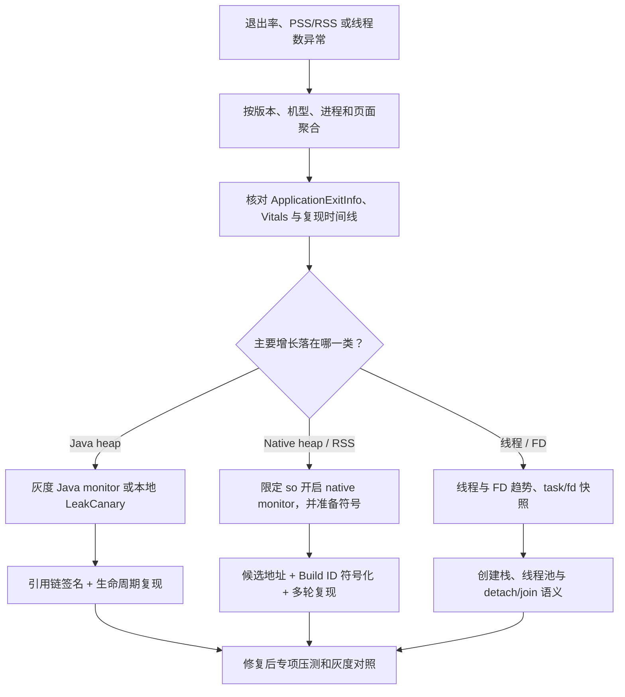

# KOOM 与 LeakCanary 内存诊断

LeakCanary 通过对象可达性和 Heap Dump 定位开发期 Java 泄漏，KOOM 面向线上或大规模设备补充低内存开销的泄漏、OOM 和线程监控。两者的触发、上传和隐私边界不同。

## 对象监视、Heap Dump 与引用链

### 先确定工具定位和版本基线

LeakCanary 用于回答一个具体问题：某个 Java/Kotlin 对象的生命周期已经结束，为什么它仍能从 GC Root 经强引用到达？GC Root 是垃圾回收器遍历对象图的起点，例如已加载的 system class 或仍在运行的 Java thread。LeakCanary 会在开发或测试设备上观察对象、抓取 Java heap dump（Java/ART 堆快照），再由 Shark（LeakCanary 的 heap 分析库）计算引用路径，把可疑引用缩小到便于回查代码的范围。

它不负责线上内存平台的全部职责。几类工具的分工如下：

| 工具 | 擅长回答的问题 | 不能单独证明什么 |
|---|---|---|
| LeakCanary | 已知生命周期对象为何没有回收；哪条强引用路径保留了它 | native 内存为何上涨、线上发生率、整机内存压力 |
| Android Studio Memory Profiler | 分配记录、heap dump、对象图和本地交互分析 | 线上分布和自动生命周期判定 |
| Perfetto | PSS/RSS（共享内存按比例计入/全部计入的驻留内存）、GC、调度、FrameTimeline（帧生命周期轨道）和 heap profiling（堆分配记录）等时间线 | 某个已销毁 Fragment 被哪条 Java 引用长期保留 |
| KOOM / APM | KOOM（线上内存监控框架）和 APM 记录的版本、机型、页面分布与受控样本；APM 指应用性能监控（Application Performance Monitoring） | 本地代码修改是否已经切断指定引用链 |

截至 2026-08-14，版本选择要分稳定线和预览线：

| 版本 | 发布状态 | 上游构建边界 | 使用建议 |
|---|---|---|---|
| `2.14` | 最新稳定版，tag 对应 commit `8d29638ccf25e15d84b0119b6617f0069bc0b2d8` | minSdk 14、compileSdk 34 | 作为常规 Debug / QA 默认选择 |
| `3.0-alpha-9` | 2026-06-25 发布的预览版，tag 对应 commit `bac94a74fa87ed807c31a42b4d495bbfdcede33a` | minSdk 26、compileSdk 35 | 只在隔离分支评估 heap growth 等新能力 |

Maven Central 把 `3.0-alpha-9` 标成 latest/release，只表示仓库元数据中的最新产物，并没有把 alpha 变成稳定版。2.14 也没有以 compileSdk 37 构建，所以下文会把“源码路径在 Android 17 仍存在”和“API 37 真机已经通过回归”分开表述。

稳定版最小接入只需要把完整能力放进 debug build variant（Gradle 构建变体）：

```kotlin
dependencies {
    debugImplementation("com.squareup.leakcanary:leakcanary-android:2.14")
}
```

依赖通过 manifest 中的私有 `ContentProvider` 在主进程自动安装 watcher（生命周期观察器）；系统会在创建 `Application` 前初始化这个 provider，所以不需要在 `Application` 中重复调用安装。2.14 另有基于 AndroidX Startup 的替代 artifact（发布组件），两条安装路径只能选择其一。若工程有 QA、internal 等自定义变体，应把依赖放到对应 configuration（例如 `qaImplementation` 这类 Gradle 依赖配置），防止完整分析组件被合进生产包。

### 从 watch 到 leak trace 的源码路径

“对象被保留”“触发 heap dump”“确认泄漏”是三个阶段，不能合成一句“5 秒后发现泄漏”。这里的 heap dump 是某一时刻的堆对象与引用关系快照。

1. 生命周期 watcher 在预期终点调用 `expectWeaklyReachable()`。`ObjectWatcher` 创建带唯一 key 的 `KeyedWeakReference`（可凭 key 在 heap 中找回目标的弱引用），并把它关联到 `ReferenceQueue`（弱引用目标可回收后进入的队列）。这个弱引用本身不会延长目标对象的生命周期。
2. 2.14 的默认 `retainedDelayMillis` 是 5 秒。延迟任务执行时，`ObjectWatcher` 先从 `ReferenceQueue` 移除已经 weakly reachable（只剩弱引用、可由 GC 回收）的对象；仍在 `watchedObjects` map 中的对象被标记为 retained（超过观察窗口仍未变为 weakly reachable），并通知 LeakCanary。
3. retained 只是候选状态，还不是 heap 分析结论。`HeapDumpTrigger` 在后台线程检查 retained 数量，显式执行一次 `Runtime.gc()`，等待弱引用入队，再运行 finalization（对象终结处理），随后重新计数。
4. 应用可见时，默认要达到 5 个 retained object 才 dump；应用不可见后，会等待一个 `retainedDelayMillis`，随后 1 个 retained object 也足以触发。用户点通知还可以主动请求 dump。
5. dump 前会再检查开关、调试器状态、最近一次 dump 等条件。默认 `AndroidDebugHeapDumper` 调用公开的 `Debug.dumpHprofData()` 写出 `.hprof`；Hprof 是 JVM/ART heap dump 的文件格式。
6. Shark 在 heap 中找到带 key 的弱引用对象，计算从 GC Root 到目标对象的最佳强引用路径。`ObjectInspector` 判断路径上对象是否应当泄漏，`ReferenceMatcher` 匹配已知系统或依赖引用模式。分析器还会估算 retained size（移除该对象后可能释放的内存），并根据尚未排除的 suspect reference（可疑引用）计算 signature；signature 是同类引用路径的稳定标识，用于归并报告。

这段顺序有两个诊断含义：

- 页面退出 1 秒后对象还活着很常见，不能拿瞬时存活当泄漏。
- `retainedObjectCount > 0` 是候选信号。只有 dump 中仍存在目标对象并找到保留路径，才会得到可供修复的 leak trace（泄漏引用链）。

阈值用于减少频繁冻结 UI，不是“少于 5 个就没有泄漏”。调试时把 App 切到后台，或在测试中调用官方 assertion，比为了快速出报告长期把前台阈值改成 1 更稳妥。

### 默认观察对象与依赖条件

2.14 的 `AppWatcher.appDefaultWatchers()` 安装四组 watcher：

| watcher | 观察终点 | 依赖和例外 |
|---|---|---|
| `ActivityWatcher` | `Activity.onDestroy()` 回调完成 | 使用 `Application.ActivityLifecycleCallbacks` |
| `FragmentAndViewModelWatcher` | Fragment `onDestroy()`、fragment view `onDestroyView()`、ViewModel `onCleared()` | AndroidX 路径只在相关类存在时安装；2.14 还兼容 support Fragment；framework Fragment 只覆盖 API 26+ |
| `RootViewWatcher` | root view（挂到 WindowManager 的窗口根 View）从 WindowManager 脱离 | Activity root 已由 ActivityWatcher 覆盖；PopupWindow root 不观察；Dialog root 默认不观察；Toast、Tooltip 和未知类型会观察 |
| `ServiceWatcher` | `Service.onDestroy()` 后 system_server（承载 Android 系统服务的系统进程）收到 `serviceDoneExecuting()` | 依赖 framework 私有字段、消息号和 Binder（Android 进程间通信）代理；反射失败会记录日志并放弃 Service 自动观察 |

“默认观察 View”不能简写成“所有 detached View 都会被扫一遍”。Fragment view 来自 Fragment 生命周期；root view 来自 Curtains（LeakCanary 使用的 Window root 监听库）对 WindowManager root 的监听；普通子 View 没有统一生命周期，业务仍要在明确终点自行观察。

Service 也是高版本验证重点。2.14 的 `ServiceWatcher` 会反射 `ActivityThread.mH`、`mServices`、`Handler.mCallback` 和 `ActivityManager.IActivityManagerSingleton`，并识别 `STOP_SERVICE = 116`。Android 17 `android-17.0.0_r1` 中这些名字和停止流程仍存在，但它们都属于未承诺兼容性的 framework 内部实现。OEM（设备厂商）修改、hidden API（应用 SDK 未公开的接口）限制或后续平台改动都可能让 watcher 安装失败；测试包启动后要检查 Logcat 是否出现 `Could not watch destroyed services`，关键 Service 可在 `onDestroy()` 末尾再做业务侧观察。

### 自定义观察要放在明确的终点

播放器控制器、地图会话、Presenter、Dagger component 和业务 scope（限定对象存活范围的生命周期作用域）都可能有自己的 `release()` / `close()`。观察调用要放在资源清理完成后，因为这时 owner（负责持有和释放对象的一方）理应尽快放弃强引用。

下面的例子用 2.14 推荐的 `expectWeaklyReachable()`，避免继续使用已弃用的 `watch()`：

```kotlin
class PlayerController {
    private var released = false

    fun release() {
        if (released) return
        released = true

        stopPlayback()
        unregisterCallbacks()
        AppWatcher.objectWatcher.expectWeaklyReachable(
            watchedObject = this,
            description = "PlayerController.release() completed"
        )
    }
}
```

这段代码观察的是 `PlayerController` 本身。若页面或播放器管理器在 `release()` 后仍保存 controller，5 秒后它会成为 retained 候选；若调用方按约定清掉引用，弱引用会进入 `ReferenceQueue`，观察记录自行移除。

ObjectWatcher 2.14 没有为每次观察返回“取消句柄”。不要用全局 `clearWatchedObjects()` 掩盖业务生命周期变化；对象可能复用、进入对象池或重新由其他 owner 持有时，应等到不可逆的终点再观察。测试框架为了隔离用例可以清理旧记录，业务代码不应借此消除报告。

降低噪声还要遵守三条规则：

- 不观察 Application、全局 cache、进程级 repository 等设计上常驻的对象。
- description 写“哪个生命周期终点已经发生”，不要只写类名。
- teardown（解绑回调、释放资源等收尾过程）有异步完成条件时，在完成回调后观察；不要用随意增加 sleep 的方式掩盖 ownership（谁负责持有和释放）不清。

### leak trace 要逐行读

Leak trace 是 GC Root 到 retained object 的强引用路径，不是线程调用栈。文本报告中：

- `GC Root` 说明遍历起点，常见类型有 thread local（线程局部变量）、Java thread、system class 和 native reference（JNI/native 代码持有的引用）。
- `├─` / `╰→` 是路径上的对象；`↓` 是指向下一对象的字段、数组元素或 Java local（Java 局部变量）。
- `Leaking: NO / YES / UNKNOWN` 来自 Shark 的对象状态推断，分别表示该对象有证据表明不应泄漏、应当泄漏，或暂时无法判断。
- `~~~` 标出尚未被排除的 suspect reference。它表示“应继续查的引用”，不等于工具已经定位到一行错误代码。
- `retainedHeapByteSize` 估算移除该泄漏后可回收的字节数，还可计入部分与 Java 对象关联的 native 大小，例如 Android Bitmap。它不能覆盖通用 native heap；共享对象图和运行时状态也会限制数值的解释范围。
- signature 由 suspect reference 组合计算，用来把同一原因的多个实例归为一组。

下面是一条经过压缩、但保留 LeakCanary 文本结构的 Fragment view 泄漏：

```text
┬───
│ GC Root: System class
│
├─ com.example.AnalyticsDispatcher class
│    Leaking: NO (a class is never leaking)
│    ↓ static AnalyticsDispatcher.callbacks
│                                 ~~~~~~~~~
├─ java.util.ArrayList instance
│    ↓ ArrayList.elementData
│                ~~~~~~~~~~~
├─ java.lang.Object[] array
│    ↓ Object[].[2]
│               ~~~
├─ com.example.HomeFragment$callback instance
│    ↓ HomeFragment$callback.this$0
│                            ~~~~~~
├─ com.example.HomeFragment instance
│    ↓ HomeFragment.binding
│                   ~~~~~~~
├─ com.example.HomeFragmentBinding instance
│    ↓ HomeFragmentBinding.rootView
│                         ~~~~~~~~
╰→ androidx.constraintlayout.widget.ConstraintLayout instance
     Leaking: YES (ObjectWatcher was watching this because
     HomeFragment received Fragment#onDestroyView() callback)
```

逐行阅读时按下面的顺序收敛：

1. 末尾的 root view 已经过了 `onDestroyView()`，因此“应该回收”的前提成立。
2. `HomeFragment.binding` 说明 Fragment 在 view 销毁后仍持有 binding；Fragment 留在 back stack（返回栈，保留 Fragment 实例以便返回）时，这条引用会拖住整棵 view tree。
3. `callback.this$0` 是匿名内部类对 Fragment 的隐式引用。
4. 静态 `AnalyticsDispatcher.callbacks` 是长生命周期 owner。集合中的 callback 没有注销，因而 callback、Fragment 和 binding 始终可达。
5. 修复不能停在“把某个引用改成 WeakReference”。应在 `onDestroyView()` 解除 dispatcher 注册并清空 binding，使 owner 与生命周期对齐。

GC Root 只告诉你为何整条链始终可达，不一定是业务修复点。上例若盯着 system class 或 ClassLoader 处理，就会绕开未注销 callback 这个责任边界。

### 三个能从代码走到 trace 的案例

#### Fragment：binding 活得比 view 久

Fragment 可以留在 back stack，而它的 view 已在 `onDestroyView()` 销毁。下面的 teardown 同时断开 RecyclerView 与 adapter、Fragment 与 binding 两组引用：

```kotlin
class FeedFragment : Fragment(R.layout.feed) {
    private var _binding: FeedBinding? = null
    private val binding: FeedBinding get() = requireNotNull(_binding)
    private val feedAdapter = FeedAdapter()

    override fun onViewCreated(view: View, savedInstanceState: Bundle?) {
        _binding = FeedBinding.bind(view)
        binding.list.adapter = feedAdapter
    }

    override fun onDestroyView() {
        binding.list.adapter = null
        _binding = null
        super.onDestroyView()
    }
}
```

典型 trace 会经过 `FragmentManager` 或 Fragment store（FragmentManager 内部保存 Fragment 的容器）到仍存活的 Fragment，再从 `_binding` 到 root view。`_binding = null` 切断主要引用；`list.adapter = null` 还会解除 RecyclerView 注册在 adapter 上的 observer（数据变化观察者），避免 adapter 从另一侧保留旧 RecyclerView。

#### RecyclerView：全局 listener 经 adapter 拖住页面

Adapter 常被当作“纯数据对象”，但 `AdapterDataObservable`（RecyclerView.Adapter 内部的 observer 注册表）、回调 lambda 和业务 listener 都可能形成反向引用。下面的 adapter 明确暴露 teardown，并由 view owner 调用：

```kotlin
class FeedAdapter(
    private val dispatcher: PlaybackDispatcher
) : RecyclerView.Adapter<FeedViewHolder>() {

    private val playbackListener = PlaybackListener { itemId ->
        notifyItemChanged(findPosition(itemId))
    }

    init {
        dispatcher.addListener(playbackListener)
    }

    fun dispose() {
        dispatcher.removeListener(playbackListener)
    }
}

override fun onDestroyView() {
    binding.list.adapter = null
    feedAdapter.dispose()
    _binding = null
    super.onDestroyView()
}
```

泄漏路径通常是 `PlaybackDispatcher` → listener → adapter → `AdapterDataObservable` → RecyclerView observer → RecyclerView → Activity。只清空 Fragment binding 仍可能留下 dispatcher 这一侧的强引用，所以 listener 的注册和注销必须成对。

`onDetachedFromRecyclerView()` 不一定等同于 adapter 的永久销毁：同一个 adapter 可能被临时拆下再挂回。是否在该回调释放，要由组件的复用约定决定；页面级 adapter 用显式 `dispose()` 更容易审计。

#### Coroutine / Flow：collector 绑定错生命周期

Fragment 的 `lifecycleScope` 跟 Fragment 实例一起存活，可能跨过 `onDestroyView()`。Flow collector（执行 `collect` / `collectLatest` 的收集逻辑）若捕获 binding，就会在 view 已销毁后继续保留旧视图。下面把收集任务绑定到 `viewLifecycleOwner`：

```kotlin
viewLifecycleOwner.lifecycleScope.launch {
    viewLifecycleOwner.repeatOnLifecycle(Lifecycle.State.STARTED) {
        viewModel.uiState.collectLatest { state ->
            render(binding, state)
        }
    }
}
```

进入 STOPPED 时，`repeatOnLifecycle` 取消内部 collection，并在再次进入 STARTED 时重新启动；view lifecycle 到 DESTROYED 时，外层 scope 也会取消。对应泄漏 trace 若出现 `JobSupport`、continuation（协程保存挂起位置与局部状态的对象）、collector lambda、Fragment 和 binding，应先检查启动 scope 与 owner，再检查 Flow 上游是否把回调或 collector 另存到全局对象。

取消 coroutine 只能终止配合取消的挂起工作。阻塞 I/O、第三方 callback、`GlobalScope` 和自行保存的 listener 仍要单独 teardown；不能看到 `lifecycleScope` 就判定引用一定安全。

### 常见模式要从“谁持有谁”分析

读下面的路径时，箭头左侧是当前强引用的持有者，右侧是被持有对象；修复责任通常落在注册引用或决定对象生命周期的 owner。

| 模式 | 常见强引用路径 | 修复责任 |
|---|---|---|
| static / singleton | class → static field / collection → Activity、View、callback | 长生命周期 owner 不保存页面对象；只在语义允许时改存 `applicationContext` |
| Handler / Runnable | thread → MessageQueue（线程消息队列）→ Message.callback → Runnable → 页面 | owner 保存自己的 Runnable，并在生命周期终点 `removeCallbacks(runnable)`；不要清掉共享 Handler 的全部消息 |
| Listener / callback | manager / SDK → listener list → lambda / anonymous class → 页面 | 注册方或 owner 成对注销，异常与提前返回路径也要覆盖 |
| Coroutine / Flow / Rx | scope / Job / subscriber → continuation / collector → View | 使用与目标资源一致的 scope；取消 Rx subscription（订阅），并终止外部 callback |
| Adapter | dispatcher → adapter，或 adapter observable → RecyclerView | 拆 adapter、注销 observer/listener、清理缓存的 ViewHolder |
| anonymous class / lambda | callback → `this$0` / captured variable → Activity 或 Fragment | 缩小捕获对象，或在 owner 结束时解除 callback |
| Context | singleton → Activity Context → Window / View tree | 只有不需要主题、Window、页面语义时才使用 Application Context |
| Dialog / PopupWindow | manager / listener → Dialog → Window → decor view → Activity | dismiss 后解除 listener 与 owner 引用；优先让 DialogFragment 管理配置变化 |
| WebView | 页面 / JS bridge（JavaScript 调用 Android 的接口）/ callback → WebView，或 WebView 内部对象 → Activity | 从父容器移除，停止加载，解除 JS interface/回调，按组件约定调用 `destroy()` 并清掉 owner 引用 |

Handler 的修复最好针对本 owner 的 Runnable：

```kotlin
private val refreshRunnable = Runnable { refreshUi() }

override fun onDestroy() {
    mainHandler.removeCallbacks(refreshRunnable)
    super.onDestroy()
}
```

`removeCallbacksAndMessages(null)` 会删除同一 Handler 上其他 owner 的任务，可能把泄漏问题换成功能错误。若 Runnable 必须跨页面执行，就不要捕获 Activity、Fragment 或 View；把结果交给生命周期感知的状态 owner。

WebView 还可能持有 native 资源，LeakCanary 只能分析 Java heap 中通往 WebView 或 Activity 的引用。`WebView.destroy()` 不是所有页面都能机械套用的补丁：先停止业务回调和 JS bridge，再从 parent 移除并按产品的复用策略销毁；共享 WebView 池则需要独立的 owner 和明确的回收协议。

### Application Leak 与 Library Leak 的处置

LeakCanary 使用 `ReferenceMatcher` 识别已知第三方或 Android Framework 引用模式。matcher 是“某条引用在指定版本和设备条件下如何分类”的规则，不会删除 heap 中的对象：

- **Application Leak**：没有命中已知库问题，LeakCanary 按应用泄漏报告；多数 suspect reference 可由应用控制，也可能是尚未收录的系统或依赖问题。默认 CI assertion（自动化测试断言）会为这类泄漏失败。
- **Library Leak**：命中已知模式，表示应用按正常 API 使用时仍受到系统或依赖 bug 影响。它仍在占内存，只是修复权可能不在应用侧。

处理 Application Leak 时，要找到引用的 owner、注册点、预期解绑时刻和遗漏分支，随后补测试。不要通过给字段加 `ReferenceMatcher` 把自家问题改名为 Library Leak。

Library Leak 按影响处理：

- 记录 signature、系统版本、厂商、依赖版本、发生场景和 retained size。
- 查系统或依赖项目的 issue 与修复版本，让相同场景分别运行升级、降级或最小规避方案，比较结果。
- 高流量页面或大 retained size 即使来自系统，也要评估生命周期顺序、功能降级或隔离进程。
- 发生比例低且无法规避的问题可以暂缓，但 matcher 要有 issue、owner、适用版本和删除条件。

`referenceMatchers` 会改变分类和路径搜索，不等同于“不 dump”。默认 instrumentation reporter 只对 Application Leak 抛错，因此错误的 matcher 会让测试误判为通过；这也是例外规则必须评审、注明期限并定期删除的原因。

### Android 17 / API 37 验证边界

Android 17 `android-17.0.0_r1` 的 `android.os.Debug.dumpHprofData(String)` 仍是公开方法，内部继续调用 `VMDebug.dumpHprofData()`。LeakCanary 2.14 与 3.0-alpha-9 的默认 `AndroidDebugHeapDumper` 都直接使用这条 API，因此基础 Java heap dump 路径没有依赖 ART（Android Runtime）私有 C++ 符号。

Android 17 的 platform 源码也保留了 2.14 `ServiceWatcher` 所依赖的字段和停止消息流程：

- `ActivityThread.mH`、`mServices` 和 `H.STOP_SERVICE = 116`
- `ActivityThread.handleStopService()` 在 `Service.onDestroy()` 后调用 `IActivityManager.serviceDoneExecuting()`
- `ActivityManager.IActivityManagerSingleton`
- `Handler.mCallback`

这只验证 AOSP tag（Android 开源代码的一份固定版本快照）的结构，没有给反射调用提供兼容承诺。API 37 验收至少覆盖 Activity、AndroidX Fragment view、ViewModel、root view、Service、前后台阈值、通知权限、heap dump、Shark 分析和结果页；Service 要单列 watcher 安装日志。

2.14 与 3.0-alpha-9 的仓库树没有 C/C++ 源码或原生构建文件，2.14 的 `leakcanary-android` 发布 AAR（Android 库归档）也没有 `.so`。因此 LeakCanary 自身没有 16 KB ELF 加载段对齐问题；ELF 是 Android 原生库 `.so` 使用的文件格式。

`android17-6.18-2026-06_r6` 这类 GKI（Generic Kernel Image，通用内核镜像）/kernel 构建版本也不适合作为 LeakCanary 兼容性的判断依据，因为它与这里使用的公开 Java API 没有直接版本绑定。这个结论不能外推到被测 App：App 自带的 native 库仍要独立检查 16 KB 对齐；malloc、GPU、驱动或 native cache 上涨也不会因为 Java Hprof 可分析就得到完整根因。

2.14 用 compileSdk 34 构建，3.0-alpha-9 用 compileSdk 35 构建。它们可以被 API 37 App 依赖，不表示上游已经覆盖 targetSdk 37、OEM ROM 和 API 37 全套回归。团队应在自己的 compileSdk/targetSdk 37 internal 变体上保留上述测试集。

### Release 边界：计数、分析和上传是三件事

生产包的选择不能只看 artifact 名称：

| 依赖 / 能力 | 行为 | 风险边界 |
|---|---|---|
| `leakcanary-android:2.14` | 自动观察、dump、Shark 分析、通知和结果 UI | 官方要求用于 debuggable 构建；非 debuggable 初始化默认抛错，以便尽早发现误接入 |
| `leakcanary-object-watcher-android:2.14` | 自动安装 watcher，可读取 `retainedObjectCount` | 只有候选计数，没有引用链；5 秒窗口和生命周期噪声不能换算成线上泄漏发生率 |
| `leakcanary-android-release:2.14` | 提供生产环境 heap analysis API | 官方标为 experimental（实验性接口），需要自行设计触发、取消、脱敏、存储和上报 |

完整 heap dump 会暂停被测进程，并把当时 Java heap 写入文件。文件可能包含字符串、URL、token（登录或访问凭据）、页面内容、业务 ID、集合元素和类结构，体积也可能达到数十或数百 MB。Shark 分析还会占用 CPU、内存、I/O 和电量。

`stripHeapDump` 把 primitive array（基本类型数组）内容归零，能降低字符串等数据暴露，但不代表文件已经完成匿名化处理。

线上专项分析至少要具备：

- 服务端开关、低比例采样、设备/版本限制、冷却时间和单设备上限。
- 只在后台、熄屏或用户明确同意的诊断流程触发，并允许取消。
- 使用 app 私有且不备份的临时目录；分析结束或失败后删除 Hprof。
- 优先上传分析结果，避免上传原始 Hprof；字段使用 allowlist，只允许预先评审过的字段，传输与存储还要设置加密、访问权限和保留期限。
- 记录 dump/analysis 时长、失败率、文件大小、OOM（内存耗尽）/ANR（应用无响应）和电量影响；任一指标超过预设上限时自动停用该能力，这就是此处的“熔断”。

大多数团队更适合让 KOOM、自研 APM 或 Android Vitals（Google Play 提供的线上质量指标）给出线上信号，再回到可控的 Debug / QA 包用 LeakCanary 找引用链。生产 heap analysis 是专项能力，不能因为官方提供 release artifact 就默认常开。

### 从线上信号回到本地验证

线上 OOM 或 PSS 上涨可能来自泄漏、缓存、图片、WebView、native allocator（原生内存分配器）、GPU 或进程工作集变化。排查时要分别保留“线上现象、Java 引用链、修复后曲线”三层证据：

1. 用 APM、Vitals 或 KOOM 确认问题版本、系统版本、机型、页面、操作序列和内存类型。
2. 在相同版本与接近的 API / OEM 设备环境构造可重复场景，循环进入、操作、退出页面。
3. LeakCanary 只负责 Java/Kotlin 生命周期对象：记录 signature、完整 trace、retained size 和观察 description。
4. 修复 suspect reference 后，用同一脚本重复多轮；确认旧 signature 不再出现，也没有新 signature。
5. 用 Profiler、Perfetto 或 heap diff（比较两份 heap 快照）检查对象数与内存曲线，避免“引用链断了，但缓存或 native 内存仍上涨”。
6. 先向少量用户或设备发布修复，再回看原版本维度的 OOM、PSS/RSS 和页面指标。线上指标没有改善时，重新检查问题分类；LeakCanary 没有报告，只能说明当前观察点没有找到 Java/Kotlin 生命周期泄漏。

这种联动让线上数据回答“影响多大、在哪里发生”，让 LeakCanary 回答“哪条 Java 强引用需要修改”。

### Instrumentation 测试和 CI 失败条件

在 Android Instrumentation UI 测试中，LeakCanary 检测到 JUnit 位于 classpath（运行时可加载的类集合）后，会关闭日常自动 dump。官方 `leakcanary-android-instrumentation` 会在 assertion（断言）时等待主线程空闲、触发 GC、等待 retained delay，再在有 retained object 时 dump 和分析。

这套流程比手写 `sleep(6000) + retainedObjectCount == 0` 少一层时序猜测。

2.14 的测试依赖必须与 App 侧调试依赖同时存在：

```kotlin
dependencies {
    debugImplementation(
        "com.squareup.leakcanary:leakcanary-android:2.14"
    )
    androidTestImplementation(
        "com.squareup.leakcanary:leakcanary-android-instrumentation:2.14"
    )
}
```

`androidTestImplementation` 提供 assertion 和 JUnit rule（在测试前后插入检查的规则），`debugImplementation` 把 watcher 与 heap 分析实现放进被测 APK。只加测试依赖并不能代替 App 侧依赖。

单个关键场景可以在页面退出后显式断言：

```kotlin
@RunWith(AndroidJUnit4::class)
class CheckoutLeakTest {

    @Test
    fun checkoutPage_doesNotLeakAfterFinish() {
        ActivityScenario.launch(CheckoutActivity::class.java).use { scenario ->
            performCheckout()
            scenario.moveToState(Lifecycle.State.DESTROYED)
        }

        LeakAssertions.assertNoLeaks()
    }
}
```

`assertNoLeaks()` 发现 retained object 后才 dump；默认 reporter 在分析得到 Application Leak 时抛出 `NoLeakAssertionFailedError`。页面必须在 assertion 前到达销毁终点，否则测试只是证明“仍在使用的页面还活着”。

要在每个成功用例末尾检查，可以使用 rule：

```kotlin
@get:Rule
val detectLeaks = DetectLeaksAfterTestSuccess(tag = "AfterTest")
```

Rule 只在测试主体成功时执行。它和 `ActivityScenarioRule` 的内外顺序会改变 assertion 发生在 Activity 销毁前还是销毁后；官方提供 `detectLeaksAfterTestSuccessWrapping()`，可在 Activity rule 两侧各检查一次，分别覆盖 Fragment/view teardown 和 Activity teardown。

CI 可以按执行成本分三层；这里的“失败条件”是发现符合规则的 Application Leak 后让自动化任务失败：

- PR 检查只跑高流量页面、复杂容器和历史高风险路径，减少设备时间与偶发异步噪声。
- nightly（每天夜间定时执行的测试任务）扩展页面集合和循环次数，并保存完整 heap analysis 文本。
- 3.0 alpha 的 repeating heap growth（重复执行场景并比较 heap 增长）能发现“没有明确 lifecycle watch 点、但对象持续增加”的问题；它仍是预览 API，不能直接替换基于 2.12 的稳定检查。

每条失败至少保存 App commit、依赖锁文件、设备、API、ABI（应用二进制接口/CPU 架构，如 arm64-v8a）、场景 tag（测试场景标签）、leak signature、完整 trace、retained size 和测试次数。只有 `retainedObjectCount` 没有路径，无法可靠去重或定位原因。

#### 例外规则和误报维护

例外规则只能覆盖有证据的系统或第三方已知问题：

1. matcher 精确到 class、field、厂商、API 和依赖版本，不用宽泛包名前缀。
2. description 关联上游 issue、内部 owner、加入日期、影响范围和删除条件。
3. Application 自己的 singleton、listener、adapter 泄漏不进入 matcher。
4. 临时跳过测试使用 `@SkipLeakDetection` 时写明 issue 原因，并设到期检查；不要在 suite（整组测试集合）级关闭。
5. 升级 SDK 或 Android 版本后，重跑一遍不带自定义 matcher 的对照测试，删除不再命中的规则。

一个 Library Leak 不会因为 CI 不失败就停止占用内存。CI 可以暂时不因团队无法修复的问题失败，但仍要保留报告和趋势。

### 修复后的验收清单

- 原始步骤能稳定触发旧 signature；只出现一次 retained 通知不足以证明泄漏。
- 修改点切断了 trace 中的 owner → target 强引用，生命周期责任可以从代码审查中说明。
- 相同设备、数据和操作循环下，旧 signature 不再出现。
- Fragment view、Activity、Service、Dialog、WebView 等各自到达预期终点后再 assertion。
- 没有用 WeakReference、扩大延时、提高阈值、清空全局 watcher 或 matcher 重分类来隐藏应用泄漏。
- retained size、对象数和 Java heap 曲线回落；涉及 native / GPU 时另有对应工具证据。
- instrumentation 用例在 API 37 设备通过，Service watcher 安装和 heap dump / Shark 分析均有日志。
- 少量发布后，原问题维度的线上指标有所改善；无改善时回到内存类型和复现假设重新判断。


## 线上泄漏、OOM 与资源监控

开发期确认引用模式后，线上方案还要控制触发频率、dump 开销、文件大小和数据上传。KOOM 的各模块应按问题域独立评估。

### 先看 Android 17 结论

KOOM 是快手开源的内存专项工具，分为 Java heap（ART 管理的 Java/Kotlin 对象堆）、native heap（C/C++ 等本地代码申请的堆）和 thread（线程资源生命周期）三条诊断路径。它适合处理已经由 OOM（Out of Memory，内存耗尽）、PSS/RSS 或线程数趋势确认的内存问题。PSS 是按比例分摊共享页后的进程内存，RSS 是进程当前驻留的物理内存。若启动慢、网络慢或列表卡顿没有明确的内存证据，不应先接 KOOM。

截至 2026-08-14，[Maven Central 元数据](https://repo.maven.apache.org/maven2/com/kuaishou/koom/koom-java-leak/maven-metadata.xml)中的最新正式版本仍是 `2.2.2`，最后更新时间为 2024-04-16。KOOM `master` 的 `VERSION_NAME` 已写为 `2.2.3`，该值尚未发布到 Maven Central。当前 `master` 顶部提交（HEAD）仍是 2026-01-12 的 [`df3b8c33f63ab1f23e814c19792314efb653deaf`](https://github.com/KwaiAppTeam/KOOM/commit/df3b8c33f63ab1f23e814c19792314efb653deaf)，构建配置使用 compileSdk 34、targetSdk 30、AGP（Android Gradle Plugin）7.1.0。compileSdk 决定编译时可见的 API，targetSdk 决定系统采用哪组兼容行为；这些配置和上游工程构建成功都不能证明 Android 17 运行兼容。

更关键的限制写在源码里：

- `DefaultInitTask` 只允许 API 21～36，`ForkJvmHeapDumper.dump()` 会再次检查这个条件。Android 17 / API 37 会被拒绝。
- `ThreadMonitor` 只允许 API 28～34，而且只接受 arm64 进程。arm64 是 64 位 ARM ABI（Application Binary Interface，应用二进制接口）。模块 README 写的“Android N+”已经落后于实现。
- `LeakMonitor` 只检查 API 24+ 和 arm64，没有 API 上限。这代表“没有主动拒绝 API 37”，不代表经过了 API 37 验证。
- Maven `2.2.2` 的发布时间早于上游 2025 年的 Android 15 fast dump 修改和 2026 年合入的 16 KB page-size 修改，不能把这两批改动算在正式产物里。

所以，在 Android 17 项目里，`2.2.2` 不能作为直接接入的生产依赖；当前 `master` 也不能只删除版本判断便发布。采用方需要维护 source fork（从官方源码派生的自有分支），并按启用模块分别验证：Java fast dump 依赖 ART（Android Runtime）私有符号，native leak 依赖平台内部的 `libmemunreachable` 和函数 Hook，thread leak 依赖 pthread Hook，所有随包 `.so` 还要通过 16 KB ELF（Executable and Linkable Format，`.so` 使用的二进制格式）加载段对齐检查。没有这项维护预算时，应优先保留系统退出证据、本地 Profiler/Perfetto 和 LeakCanary，不把 KOOM 加入生产依赖。

### 三个模块使用不同的判定口径

下表中的 FD（file descriptor，文件描述符）是进程打开文件、socket 等内核对象时使用的整数句柄；Hprof 是 Java/ART 堆快照；Shark 是 LeakCanary 使用的 Hprof 分析引擎。Hook 指把目标函数调用转到监控代理函数，能看到的范围取决于实际改写了哪些入口。

| 模块 | 观察对象 | 源码中的触发与产物 | 当前边界 |
|---|---|---|---|
| `koom-java-leak` | Java heap，以及线程数、FD 数等 OOM 前兆 | 主进程在前台时轮询；命中条件后用 `fork()` 派生子进程，生成原始 Hprof，再由 Shark 生成引用链 JSON | 公共版本门是 API 21～36；自动路径不会裁剪 Hprof；dump 和分析仍有内存、I/O 与磁盘成本 |
| `koom-native-leak` | 被 Hook 的 app `.so` 中尚未释放的 native 分配块 | Hook 分配/释放函数，将活跃分配与 `libmemunreachable` 结果求交集，产出大小、线程、相对地址和 so 名 | API 24+、arm64；依赖私有系统库与文本格式；API 37 未获上游保证 |
| `koom-thread-leak` | 已退出、却没有 `detach` 或 `join` 的 joinable pthread | Hook `pthread_create`、`pthread_detach`、`pthread_join`、`pthread_exit`，延迟上报创建栈和生命周期时间 | 源码限定 API 28～34、arm64；不能识别仍然活着的 `WAITING` 线程或无界线程池 |

joinable pthread 是需要由其他线程调用 `pthread_join` 回收资源的 POSIX 线程；调用 `pthread_detach` 后，系统会在线程退出时自动回收。普通内存指标回答“进程用了多少”，KOOM 尝试回答“什么对象、分配或线程生命周期值得怀疑”。Android Studio Profiler 和 Perfetto 适合观察时间线、内存分区与复现过程；LeakCanary 专注可复现的 Java/Kotlin 对象保留。四类工具的证明范围不同，不能互相替换。

### Java heap：触发器比 fork dump 更容易被误读

#### 源码会在什么条件下 dump

`OOMMonitor` 只在主进程工作。它默认每 15 秒刷新一次 `SystemInfo`，再依次运行以下 tracker（周期性判定规则）：

| Tracker | 默认条件 | 会不会触发 Hprof |
|---|---|---|
| `HeapOOMTracker` | heap 使用率超过阈值，并连续 3 次没有明显回落；大堆默认阈值 80%，中等堆 85%，小堆 90% | 会 |
| `ThreadOOMTracker` | 线程数超过 750；旧版 EMUI 的默认值是 450，并连续 3 次维持高位 | 会，同时暂存 `/proc/self/task/*/comm` |
| `FdOOMTracker` | FD 数超过 1000，并连续 3 次维持高位 | 会，同时暂存 `/proc/self/fd` 链接 |
| `FastHugeMemoryOOMTracker` | heap 使用率超过 90%，或一次轮询间隔内增长超过 350000 KB | 立即触发 |
| `PhysicalMemoryOOMTracker` | 设备可用内存比例低于 5% 等区间 | 不会；当前实现只写日志，`return true` 已被注释 |

这里没有“连续 GC（garbage collection，垃圾回收）后仍存活”的独立触发器，也没有 PSS/RSS 阈值直接触发 dump。PSS、RSS、VSS 会进入运行信息和报告；VSS（Virtual Set Size）表示进程虚拟地址空间总量。报告包含某个字段，不能证明该字段参与了触发判断。

进程进入后台时，应用生命周期的 `ON_STOP` 事件会停掉轮询；回到前台后才恢复。执行分析的 Android Service 也会等待进程回到前台。每个进程生命周期最多自动 dump 一次；非 debug 构建还配置了“每版本 5 次、首个 15 天内”的分析额度。源码在次数已经 `> 5` 时才拒绝，计数恰好为 5 时仍可能再分析一次。接入方若要求严格上限，需要修正这个边界。命中期限或次数限制后，监控循环会结束，本次不会生成 Hprof。

这些默认值是上游策略，不是适合所有应用的通用安全值。业务接入至少还要加上远程开关、按设备能力分组、随机采样、交互状态、剩余磁盘、电量和两次采集之间的冷却时间。对一个 128 MB heap 的进程，90% 与对一个 512 MB heap 的进程含义不同；单看比例也区分不了有意保留的图片缓存和失控增长。

#### fork dump 降低主进程停顿，没有消除资源风险

KOOM fast dump 的基本顺序是暂停 ART、调用 `fork()`、恢复父进程，再让子进程写 Hprof。`fork()` 创建的子进程先与父进程共享内存页；copy-on-write（写时复制）表示某一方修改页面时才复制该页，因此不会在创建子进程的瞬间复制整块堆。不过，父子进程随后修改的页面仍会增加物理内存，子进程也会消耗 CPU、文件 I/O 和磁盘。在可用内存已经很低时，诊断动作本身可能失败或加快进程退出。

这一实现不属于公开 Android SDK。`koom-fast-dump` 会按 mangled name（编译器编码后的 C++ 符号名）从 `libart.so` 解析 `art::ScopedSuspendAll`、`art::gc::ScopedGCCriticalSection`、ART 锁和 `art::hprof::DumpHeap` 等私有符号。Android 17 的源码锚点是 [`platform/art@android-17.0.0_r1`](https://android.googlesource.com/platform/art/+/refs/tags/android-17.0.0_r1)。平台源码中存在相似实现，只能说明源码里有这些能力，无法给应用提供稳定 ABI 承诺。上游把公共版本门停在 API 36，也说明 API 37 需要逐符号验证。

还要分清两条 dump 路径：

- `OOMMonitor.dumpAndAnalysis()` 调用 `ForkJvmHeapDumper`，分析成功后把 Hprof 标为 `ORIGIN`（原始堆快照），再交给接入方配置的 uploader。
- 源码保留了 `ForkStripHeapDumper`，README 的手动示例也会使用它，但自动监控路径没有调用它。

所以，KOOM 的自动路径不会产出裁剪版 Hprof。若上传器传输原始 Hprof，文件可能包含字符串、账号数据、图片字节、业务对象和第三方 SDK 状态。生产环境可在设备内完成分析，只上传经过筛选的 JSON；若确需保留 Hprof，应单独取得授权，使用应用私有目录、短保留期、加密传输和服务端访问审计。

#### 报告能回答什么

上游 `HeapReport` 的 `RunningInfo` 包含 JVM 最大/已用内存、VSS/PSS/RSS、线程数、FD 数及列表，以及 SDK、厂商、机型、应用版本、当前页面、使用时长、设备总内存/可用内存和触发原因。`GCPath` 保存 GC Root（垃圾回收器判断对象存活时使用的根节点）、引用路径、实例数、泄漏原因，以及按引用链计算的 SHA-1 摘要；另外还有类实例统计和可疑对象信息。

引用链是从 GC Root 到可疑对象的路径，无法单独证明对象已经泄漏。静态单例保留已销毁 `Activity` 通常证据很强；仍在执行的异步任务、合法缓存和进程级对象则需要结合生命周期再判断。修复后要在同一路径上重复进入和退出页面，配合 LeakCanary 或 Profiler 确认对象数量回落，再观察小比例发布（常称灰度）中同一摘要的样本是否下降。

`OOMFileManager.isSpaceEnough()` 只要求大约 1.2 MB 可用空间，远低于真实 Hprof 可能需要的容量。生产接入需要按“预计 Hprof 大小 + 分析临时文件 + 安全余量”计算配额，并设置单文件上限、目录总量、过期清理和失败退避（失败次数越多，下一次重试等待越久）。不要把上游这项轻量检查当成完整的磁盘保护。

### Native leak：候选来自两份数据的交集

Native 模块先用 xhook 改写目标 `.so` 的 PLT（Procedure Linkage Table，共享库调用外部函数时使用的跳转表），拦截 `malloc`、`realloc`、`calloc`、`memalign`、`posix_memalign` 和 `free`，维护仍未释放的分配记录。检查时，它再加载 `libmemunreachable.so`（Android 平台内部的 native 不可达内存分析库），解析私有的 `GetUnreachableMemoryString(bool, size_t)` 符号，并从人类可读文本中提取不可达地址。只有同时出现在“KOOM 活跃分配”和“系统不可达结果”中的内存块，才进入候选报告。

这套做法带来四个边界：

1. PLT Hook 只能覆盖实际经过被 Hook 入口的分配。自定义 allocator（内存分配器）、静态绑定、直接 `mmap`（创建内存映射）、GPU/驱动内存和未选中的 `.so` 都在覆盖范围之外。
2. 从当前 root 集（可达性分析使用的一组起点）不可达，比暂时没有业务引用更接近泄漏；但扫描时机、库内部缓存和对象生命周期仍可能产生候选。修复结论应有多轮趋势或可控复现支撑。
3. `libmemunreachable` 是平台内部组件。Android 17 源码锚点 [`system/memory/libmemunreachable@android-17.0.0_r1`](https://android.googlesource.com/platform/system/memory/libmemunreachable/+/refs/tags/android-17.0.0_r1) 仍包含相关能力，但应用进程自行 `dlopen`（运行时加载共享库）、解析 C++ 符号并依赖输出文本格式，都没有 SDK 稳定性保证。
4. 未开启本地符号化时，KOOM 只提供 `rel_pc`（相对程序计数器地址）与 `soName`。服务端必须按应用版本、ABI 和 Build ID（标识一次 native 构建的 ID）保存未执行 strip、仍含调试符号的准确文件；只要构建不一致，地址就可能被解析到错误函数。

一个播放器版本的 RSS 每播放一次视频就上升 20 MB，可以先把播放器业务 `.so` 加入目标库列表，排除 KOOM 自身与已知基础库，再按调用栈聚合持续出现的大分配。若候选落在第三方解码器的帧缓存创建路径，还要停止播放、销毁实例并等待回收，再比较 RSS 与候选数量；单条 native stack 不能直接确定责任代码。

`LeakMonitorConfig` 还提供分配大小门槛、目标/忽略 `.so`、默认 300 秒扫描周期和本地符号化开关。当前 `LeakMonitor.call()` 对 `nativeHeapAllocatedThreshold` 的判断方向与注释不一致：已分配 native heap 大于阈值时反倒提前返回。因此，在没有为所用提交编写回归测试前，不要依赖该字段负责触发保护。

### Thread leak：只识别一种 pthread 生命周期错误

线程模块只识别一种情况：joinable 线程已经退出，但没有被 `pthread_detach` 或 `pthread_join` 回收，超过延迟后才生成 `ThreadLeakRecord`。记录字段是 `tid`（Linux 线程 ID）、创建/开始/结束时间、线程名和创建调用栈。这类错误会遗留 pthread 资源，但线程本身已经结束。

下面几类问题需要另一套观测：

| 问题 | KOOM `ThreadLeakMonitor` 能否直接确认 | 应补的证据 |
|---|---|---|
| joinable 线程已退出，未 detach/join | 能，这是它的目标 | `ThreadLeakRecord` 创建栈与多设备聚合 |
| 匿名线程仍在运行 | 不能 | `/proc/self/task` 数量、线程名、创建栈或采样栈 |
| 无界线程池持续创建 worker（工作线程） | 不能直接确认 | 线程总量趋势、线程池指标、创建点 |
| 业务线程长期 `WAITING`（等待） | 不能 | thread dump（线程快照）、锁/队列所有者、业务生命周期 |
| Binder（Android 跨进程调用机制）、RenderThread（渲染线程）、GC 等常驻线程 | 不应按存活时间判泄漏 | 系统线程基线和版本/设备对照 |

源码配置没有面向业务的线程允许列表字段。接入方可在自己的上报与聚合层实现允许列表：要求业务线程命名，再按规范化线程名前缀和创建栈归类；系统线程、固定规模线程池和经过评审的常驻 SDK 线程只做趋势监控。允许列表不能掩盖数量持续增长，同一前缀仍要设置进程级上限和增长率告警。

`ThreadMonitor.stop()` 会调用 native stop，但上游 C++ `ThreadHooker::Stop()` 当前是空实现。接入方需要验证停止后是否还会拦截新线程、是否继续保留记录，以及重复 start/stop 是否安全。Java 方法已经返回，不代表 Hook 已完整卸载。

### 把系统退出证据放在 KOOM 前面

线上看到“OOM”时，先确定是哪一种退出或内存增长，再决定是否启动高成本诊断。`ApplicationExitInfo` 是 Android 11 起提供的历史进程退出记录，Android Vitals 是 Google Play 汇总的线上质量数据。建议使用下面这条证据路径：



这条路径把退出事实、内存分区和专项证据分开。Java、native、thread 的修复人和验证工具通常不同，PSS 上升本身不能证明 Java heap 泄漏。

#### `ApplicationExitInfo` 的版本边界

Android 11 / API 30 起，可以在下次启动后通过 `ActivityManager.getHistoricalProcessExitReasons()` 查询退出记录。调用会通过 Binder 跨进程进入 `system_server`（承载 Android 核心系统服务的进程），不宜同步放在冷启动主线程。解释结果时还要留三个余量：

- 先用 `ActivityManager.isLowMemoryKillReportSupported()` 判断设备是否支持 `REASON_LOW_MEMORY`。不支持时，内存压力导致的杀进程可能只显示 `REASON_SIGNALED` 和 `SIGKILL`（不能被应用捕获的强制终止信号）。
- `getPss()`、`getRss()` 是系统最近一次采样值，可能为 0，也不保证贴近退出瞬间。
- `getTraceInputStream()` 主要服务于有 trace 的退出类型，例如 ANR（Application Not Responding，应用无响应）或部分 native crash；不要假设 OOM/LMK（low memory kill，低内存终止）一定带可读 trace。

Android 8～10 没有 `ApplicationExitInfo`。这部分设备要结合 Android Vitals、本地复现、版本级 PSS/RSS 趋势和受控日志判断。现代 Android 的内存回收决策由用户空间的 `lmkd`（low memory killer daemon，低内存终止守护进程）根据内存压力与进程优先级执行；Android 17 平台锚点是 [`system/memory/lmkd@android-17.0.0_r1`](https://android.googlesource.com/platform/system/memory/lmkd/+/refs/tags/android-17.0.0_r1)。相关判断不直接依赖当前 `android17-6.18-2026-06_r39` 标签下的某一段内核代码，也不应再用旧式“内核 lowmemorykiller 日志”概括 API 37 的机制。

#### `onTrimMemory` 不能再负责统一压力触发

`ComponentCallbacks2.onTrimMemory()` 在历史版本上可用于补充进程状态，但 Android 14 起系统不再向应用交付 `TRIM_MEMORY_UI_HIDDEN`、`TRIM_MEMORY_BACKGROUND` 之外的旧级别；其余旧常量在 Android 15 / API 35 正式废弃。`UI_HIDDEN` 表示 UI 转入不可见，`BACKGROUND` 表示后台进程已成为回收候选；两者都不是“系统将在固定时间内杀进程”的倒计时。Android 17 接入应以自身 heap/RSS/线程趋势和系统退出记录为主，不能等待旧压力级别再 dump。

PSS 适合在分摊共享页后比较进程总体内存，RSS 表示当前驻留的物理页，Java heap 只覆盖 ART 管理的堆。若 Java heap 平稳，RSS/PSS 却持续上升，可以把排查重点移向 native、graphics、`mmap` 或线程栈；`dumpsys meminfo` 与 Perfetto memory counters（内存计数轨道）可在复现环境中继续区分内存去向。

### 端侧报告要能复现，也要克制采集

KOOM 原始结构之外，平台通常还需要样本、构建和业务上下文。下面是一份统一事件外层结构，用于说明字段职责，不要求照搬字段名：

```json
{
  "sample_id": "opaque-random-id",
  "kind": "java_heap | native_heap | pthread_resource",
  "app_version": "17.3.0",
  "build_id": "native-symbol-build-id",
  "abi": "arm64-v8a",
  "api_level": 37,
  "page": "PlayerDetail",
  "process_state": "foreground",
  "trigger": {
    "java_heap_bytes": 412000000,
    "pss_kb": 536000,
    "rss_kb": 601000,
    "thread_count": 812,
    "fd_count": 438
  },
  "evidence": {
    "gc_path_signature": "sha1-or-null",
    "native_so": "libplayer.so",
    "native_rel_pc": "0x1234",
    "thread_name": "player-worker-42",
    "creator_stack": "redacted-summary"
  }
}
```

事件外层只保存定位所需的摘要。`kind` 表示证据类型，决定哪些 `evidence` 字段有效；不要为了方便查询，给每条事件填入并不存在的 GC path、native stack 或线程状态。账号、URL query（问号后的查询参数）、消息正文、图片字节和完整对象字段应在设备端删除或散列。

文件治理至少包括：

- 设备端先生成 JSON 摘要，原始 Hprof 默认不上报。
- dump 前检查预计容量，设置单文件上限、目录总配额和过期时间；失败后指数退避。
- 只在命中远程开关、采样和设备能力条件时加载对应模块；内存容量小、磁盘不足、设备过热或用户正在高频交互时跳过。
- native 符号按版本、ABI、Build ID 保存；Java 混淆映射按构建号保存。
- 上传任务使用约束网络与充电策略，进程被杀后也不能无限重试同一个大文件。
- 远程关闭后验证 monitor、Hook、子进程和临时文件均停止或被清理。

### Android 17 移植清单

把 KOOM 带到 API 37 不止是改一处 `SDK_INT`。至少完成以下验证，才可从实验依赖转为小比例发布依赖：

1. 从明确的 KOOM commit hash（提交哈希）构建，不把 Maven `2.2.2` 与 `master` 的 Android 15/16 KB 修改混在同一个版本描述里。
2. 审阅 `DefaultInitTask` 和 `ForkJvmHeapDumper` 的 API 37 版本门；对每个私有 ART 符号做启动时解析、失败降级和真机 dump 测试。
3. 在 Android 17 / API 37 上测试大堆、并发分配、前后台切换、dump 超时、子进程被杀、磁盘不足和重复启动。
4. 对 native monitor 验证 `libmemunreachable.so` 加载、符号解析、`ptrace`/进程 dumpable 条件、结果文本解析、xhook 与目标 allocator 覆盖率。`ptrace` 和 dumpable 状态共同影响一个进程能否被检查或读取。
5. 不启用 thread monitor，除非已完成 API 37 适配；上游源码当前会直接拒绝。适配后还要覆盖 create/detach/join/exit、线程复用和 stop/start。
6. 仅打包 arm64 的 native/thread 模块，或为其他 ABI 明确禁用；同时统一 `c++_shared` / `c++_static`（C++ 运行库动态/静态链接）策略，避免 `libc++_shared.so` 冲突。
7. 使用 NDK（Native Development Kit，本地开发工具包）r28+ 重编所有 native 产物，并对最终 APK/AAB 执行 16 KB ELF 与 ZIP 对齐检查。上游 `master` 升到 NDK `28.2.13676358` 只是必要条件，业务工程中的预编译 `.so` 仍要逐个检查。
8. 在 Android 17 的 16 KB 设备或官方模拟环境中，用 `fatal` 模式关闭 page-size 兼容并运行专项用例。只通过 4 KB 设备不能证明 API 37 可用。
9. 对比启用组和关闭组的启动时间、帧停顿、ANR、OOM/LMK、PSS 峰值、磁盘写入与电量，确认诊断收益高于监控成本。
10. 修复后用同一压测脚本复测，并观察至少一个小比例发布周期内的同一问题摘要所覆盖的设备数与退出率；单次 report 消失不算验证完成。

检查 16 KB 产物时，Android 官方建议对 ELF LOAD segment 和 APK ZIP 对齐分别验证。下面两条命令分别检查 native 库的段对齐与最终 APK 的包内对齐：

```bash
llvm-objdump -p path/to/libkoom-fast-dump.so | grep LOAD
zipalign -c -P 16 -v 4 app-release.apk
```

第一条输出中的 `LOAD` segment 对齐应达到 `2**14`，也就是 16384 字节；第二条必须对最终交付 APK 执行。AAB 还要用当前 bundletool 生成对应 APK 后检查，不能只验中间产物。


## 参考资料

- [LeakCanary 2.14 源码锚点](https://github.com/square/leakcanary/tree/8d29638ccf25e15d84b0119b6617f0069bc0b2d8)
- [LeakCanary 3.0-alpha-9 源码锚点](https://github.com/square/leakcanary/tree/bac94a74fa87ed807c31a42b4d495bbfdcede33a)
- [Maven Central `leakcanary-android` 版本元数据](https://repo.maven.apache.org/maven2/com/squareup/leakcanary/leakcanary-android/maven-metadata.xml)
- [LeakCanary 工作流程](https://square.github.io/leakcanary/fundamentals-how-leakcanary-works/)
- [Leak trace 阅读与修复](https://square.github.io/leakcanary/fundamentals-fixing-a-memory-leak/)
- [LeakCanary 2.14 配置与 release retained count](https://square.github.io/leakcanary/recipes/)
- [Instrumentation 泄漏检测](https://square.github.io/leakcanary/ui-tests/)
- [实验性的 release heap analysis](https://square.github.io/leakcanary/leakcanary-for-releases/)
- [2.14 `ObjectWatcher.kt`](https://github.com/square/leakcanary/blob/8d29638ccf25e15d84b0119b6617f0069bc0b2d8/leakcanary-object-watcher/src/main/java/leakcanary/ObjectWatcher.kt)
- [2.14 `AppWatcher.kt`](https://github.com/square/leakcanary/blob/8d29638ccf25e15d84b0119b6617f0069bc0b2d8/leakcanary-object-watcher-android-core/src/main/java/leakcanary/AppWatcher.kt)
- [2.14 SDK 构建参数](https://github.com/square/leakcanary/blob/8d29638ccf25e15d84b0119b6617f0069bc0b2d8/build.gradle)
- [2.14 自动安装 manifest](https://github.com/square/leakcanary/blob/8d29638ccf25e15d84b0119b6617f0069bc0b2d8/leakcanary-object-watcher-android/src/main/AndroidManifest.xml)
- [2.14 `LeakCanary.Config`](https://github.com/square/leakcanary/blob/8d29638ccf25e15d84b0119b6617f0069bc0b2d8/leakcanary-android-core/src/main/java/leakcanary/LeakCanary.kt)
- [2.14 `MainProcessAppWatcherInstaller.kt`](https://github.com/square/leakcanary/blob/8d29638ccf25e15d84b0119b6617f0069bc0b2d8/leakcanary-object-watcher-android/src/main/java/leakcanary/internal/MainProcessAppWatcherInstaller.kt)
- [2.14 `HeapDumpTrigger.kt`](https://github.com/square/leakcanary/blob/8d29638ccf25e15d84b0119b6617f0069bc0b2d8/leakcanary-android-core/src/main/java/leakcanary/internal/HeapDumpTrigger.kt)
- [2.14 `ServiceWatcher.kt`](https://github.com/square/leakcanary/blob/8d29638ccf25e15d84b0119b6617f0069bc0b2d8/leakcanary-object-watcher-android-core/src/main/java/leakcanary/ServiceWatcher.kt)
- [Android 17 `Debug.dumpHprofData()`](https://android.googlesource.com/platform/frameworks/base/+/android-17.0.0_r1/core/java/android/os/Debug.java)
- [Android 17 `ActivityThread` Service 停止流程](https://android.googlesource.com/platform/frameworks/base/+/android-17.0.0_r1/core/java/android/app/ActivityThread.java)
- [Android 17 `ActivityManager.IActivityManagerSingleton`](https://android.googlesource.com/platform/frameworks/base/+/android-17.0.0_r1/core/java/android/app/ActivityManager.java)
- [Android 17 `Handler.mCallback`](https://android.googlesource.com/platform/frameworks/base/+/android-17.0.0_r1/core/java/android/os/Handler.java)

- [KOOM 当前审阅锚点 `df3b8c33`](https://github.com/KwaiAppTeam/KOOM/tree/df3b8c33f63ab1f23e814c19792314efb653deaf)
- [KOOM v2.2.2 release](https://github.com/KwaiAppTeam/KOOM/releases/tag/v2.2.2)
- [Maven Central：`koom-java-leak` 元数据](https://repo.maven.apache.org/maven2/com/kuaishou/koom/koom-java-leak/maven-metadata.xml)
- [KOOM `gradle.properties`（`VERSION_NAME=2.2.3`）](https://github.com/KwaiAppTeam/KOOM/blob/df3b8c33f63ab1f23e814c19792314efb653deaf/gradle.properties)
- [KOOM 构建版本配置](https://github.com/KwaiAppTeam/KOOM/blob/df3b8c33f63ab1f23e814c19792314efb653deaf/build.gradle)
- [KOOM `DefaultInitTask` 的 API 21～36 版本门](https://github.com/KwaiAppTeam/KOOM/blob/df3b8c33f63ab1f23e814c19792314efb653deaf/koom-monitor-base/src/main/java/com/kwai/koom/base/DefaultInitTask.kt)
- [`ForkJvmHeapDumper` 的二次版本检查](https://github.com/KwaiAppTeam/KOOM/blob/df3b8c33f63ab1f23e814c19792314efb653deaf/koom-fast-dump/src/main/java/com/kwai/koom/fastdump/ForkJvmHeapDumper.java)
- [`OOMMonitor` 的自动 dump/分析路径](https://github.com/KwaiAppTeam/KOOM/blob/df3b8c33f63ab1f23e814c19792314efb653deaf/koom-java-leak/src/main/java/com/kwai/koom/javaoom/monitor/OOMMonitor.kt)
- [`LeakMonitor` 的 API/ABI 门与阈值判断](https://github.com/KwaiAppTeam/KOOM/blob/df3b8c33f63ab1f23e814c19792314efb653deaf/koom-native-leak/src/main/java/com/kwai/koom/nativeoom/leakmonitor/LeakMonitor.kt)
- [KOOM `ThreadMonitor` 的 API 28～34 与 arm64 限制](https://github.com/KwaiAppTeam/KOOM/blob/df3b8c33f63ab1f23e814c19792314efb653deaf/koom-thread-leak/src/main/java/com/kwai/performance/overhead/thread/monitor/ThreadMonitor.kt)
- [KOOM thread Hook 与空 `Stop()` 实现](https://github.com/KwaiAppTeam/KOOM/blob/df3b8c33f63ab1f23e814c19792314efb653deaf/koom-thread-leak/src/main/cpp/src/thread/thread_hook.cpp)
- [Android 15 fast dump 合入提交](https://github.com/KwaiAppTeam/KOOM/commit/f653d7c986debb242b1d8b96761351f63d9f04bf)
- [16 KB page-size 修改提交](https://github.com/KwaiAppTeam/KOOM/commit/aae5a7c9212bd70c52d6b36ef631d6f5e6fb0fa1)
- [Android 17 ART 源码 `android-17.0.0_r1`](https://android.googlesource.com/platform/art/+/refs/tags/android-17.0.0_r1)
- [Android 17 `libmemunreachable` 源码 `android-17.0.0_r1`](https://android.googlesource.com/platform/system/memory/libmemunreachable/+/refs/tags/android-17.0.0_r1)
- [ApplicationExitInfo API 文档](https://developer.android.com/reference/android/app/ApplicationExitInfo)
- [Android 应用内存管理与 `onTrimMemory` 版本说明](https://developer.android.com/topic/performance/memory)
- [Android 16 KB page-size 兼容指南](https://developer.android.com/guide/practices/page-sizes)
- [Android 17 common kernel `r39` 标签](https://android.googlesource.com/kernel/common/+/refs/tags/android17-6.18-2026-06_r39)
