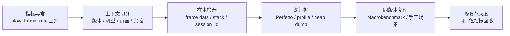

---

title: "APM 全景图与分类体系"
chapter: "19"
section: "19.01"
applicable_versions: "Android 8 (API 26) - Android 17 (API 37)"
last_verified: "2026-08-14"
last_verified_against: "Android Developers JankStats / FrameMetrics / ApplicationExitInfo / ProfilingManager / ProfilingTrigger / Android vitals / 16 KB docs, AOSP android-17.0.0_r1, kernel android17-6.18-2026-06_r39, GitHub upstream READMEs"
confidence: medium
tags: [apm]
related_chapters: ["19.0"]
consolidated_from:
  - "src/part3-tools/ch19-apm/19.10-apm-tool-compatibility.md"
sources:
  - type: official
    path: "https://developer.android.com/topic/performance"
  - type: official
    path: "https://developer.android.com/topic/performance/vitals"
  - type: official
    path: "https://developer.android.com/jetpack/androidx/releases/metrics"
  - type: official
    path: "https://developer.android.com/guide/practices/page-sizes"
  - type: official
    path: "https://developer.android.com/reference/androidx/metrics/performance/JankStats"
  - type: official
    path: "https://developer.android.com/reference/android/view/FrameMetrics"
  - type: official
    path: "https://developer.android.com/reference/android/app/ApplicationExitInfo"
  - type: official
    path: "https://developer.android.com/reference/android/os/ProfilingManager"
  - type: official
    path: "https://developer.android.com/reference/android/os/ProfilingTrigger"
  - type: official
    path: "https://firebase.google.com/docs/perf-mon"
  - type: github
    path: "https://github.com/Tencent/matrix"
  - type: github
    path: "https://github.com/KwaiAppTeam/KOOM"
  - type: github
    path: "https://github.com/bytedance/btrace"
  - type: github
    path: "https://github.com/measure-sh/measure"
status: finalized
task9_state: reviewed
task2b_state: fixed
pipeline_stage: ready-to-publish
task6_state: reviewed
---

# APM 全景图与分类体系

## APM 先回答“线上发生了什么”

APM（Application Performance Monitoring，应用性能监控）负责回答三类线上问题：

- 哪个版本、页面、设备群或实验组正在变差；
- 影响面有多大，是否值得进入修复队列；
- 能否保留一份足以继续诊断的现场样本。

APM SDK（Software Development Kit，软件开发工具包）通常只能看到应用有权限采集的信号。一次慢帧可能来自主线程业务、RenderThread、CPU 抢占、Binder 对端、I/O、GPU 或 SurfaceFlinger。RenderThread 是渲染线程，Binder 是 Android 跨进程通信机制，I/O 指输入/输出，SurfaceFlinger 是系统显示合成服务。

一次进程死亡也可能是 Java crash、native crash、ANR、LMK、force-stop、安装更新或系统策略。native crash 指 C/C++ 等原生代码崩溃；ANR（Application Not Responding）是应用无响应；LMK（Low Memory Kill）是低内存终止；force-stop 是强制停止。仅凭一个耗时或 `reason`（退出原因字段）无法判断根因。

APM 负责发现问题和筛选样本，Perfetto、Android Studio Profiler、simpleperf（CPU 采样工具）、heap dump（堆对象快照）、AGI（Android GPU Inspector）和 dumpsys（系统状态查询命令）负责复现并定位原因。线上系统提供分布和样本，线下及系统工具再把一个样本展开到线程、调用栈、资源、GPU 和显示路径。

## Android 17 复核基线

| 层级 | 版本基线 | APM 能看到什么 |
|---|---|---|
| Android 平台 | Android 17 / API 37 / `android-17.0.0_r1` | `ApplicationExitInfo`、`FrameMetrics`、`ProfilingManager`、系统 trace 与进程生命周期 |
| Android 内核 | `android17-6.18-2026-06_r39` | scheduler、I/O、binder driver、dma-buf/fence、内存压力等底层事实；普通应用不能任意读取这些数据 |
| Jetpack Metrics | `androidx.metrics:metrics-performance:1.0.0` | JankStats 的帧时长、jank 判断与 UI state |
| 第三方/自研 APM | 随应用版本固定 | 埋点、采样、堆栈、hook（拦截或替换调用）、缓存、上传和服务端聚合 |
| Google Play | 当前 Play Console / Reporting API 口径 | Android vitals 的 crash、ANR、wake lock、启动、渲染等聚合数据 |

内核表中的 scheduler 是线程调度器，binder driver 是 Binder 的内核驱动，dma-buf 用于跨组件共享缓冲区，fence 用于同步缓冲区的生产者与消费者。这些词描述内核证据，不表示普通应用能直接读取它们。

表中的 jank 指渲染过慢造成的卡顿帧，UI state 是当时的页面与交互状态，wake lock 是阻止设备进入休眠的系统锁。

Android 平台版本与 APM SDK 版本要分别记录。Android 17 不会自动升级应用内的 Matrix、KOOM、JankStats、Firebase 或自研 SDK；升级 SDK 也不会改变设备的 framework（Android 框架层）和 kernel（内核）实现。

## 从异常指标到可验证结论

下面的流程图展示一条慢帧问题从线上发现到修复验证的证据路径。



图中的 `slow_frame_rate` 是慢帧占比，`stack` 是调用栈，`session_id` 用于关联同一次使用会话。它们负责缩小范围，不能单独说明慢帧发生在哪一行代码。

例如，灰度发布（只向一部分用户提供新版本）的看板发现，图片编辑页的慢帧率只在某个版本和一组低内存设备上升。JankStats 样本带有页面、操作和帧时长，但没有主线程阻塞点。团队从该分组挑选可复现设备，采集 Perfetto，看到每次缩放都会在主线程同步解码大图并伴随 I/O 等待；simpleperf 或方法 trace 再把耗时集中的调用定位出来。

修复后，用相同图片、相同操作序列和相同编译模式跑 Macrobenchmark，再在小流量灰度中观察原指标、用于归并同类问题的堆栈特征，以及 crash/ANR 副作用。若只看到慢帧率下降，却更换了分母、采样率或设备范围，这次“改善”不能作为相同统计规则下的结论。

## 四类能力不要混在一起选

Android 性能工具至少分成四类。分类依据是采集位置、运行阶段、输出证据和工程成本，不能按“都能看性能”合并选型。

| 类别 | 代表能力 | 运行位置 | 主要输出 | 典型成本 |
|---|---|---|---|---|
| 客户端 APM | Matrix、KOOM、btrace/RheaTrace、Measure、自研 SDK | Release / 灰度发布 | 聚合指标、异常样本、堆栈、trace、heap 摘要 | 包体、CPU/内存、hook / 插桩（构建时插入采集代码）兼容、隐私、上传平台 |
| 官方信号与 SDK | Android vitals、JankStats、FrameMetrics、ApplicationExitInfo、ProfilingManager、Tracing | 系统、Play、应用进程 | 平台指标、帧数据、退出记录、受控 profile、应用 slice（带起止时间的 trace 区间） | 最低 API 版本、指标定义、回调开销、rate limit（频率限制） |
| 线下诊断 | Perfetto、Profiler、simpleperf、LeakCanary、AGI、dumpsys | Debug / QA / 实验室 | trace、调用栈、heap、GPU 命令流、系统状态 | 需要设备、复现和人工分析 |
| Benchmark / CI | Macrobenchmark、Microbenchmark、PerfDog、设备 benchmark | CI / 实验室 | 可比较的耗时、帧、吞吐、功耗或分数 | 测试环境、预热、编译模式、设备与温度控制 |

Release 是供用户安装的发布构建，Debug 是开发调试构建，QA 是测试阶段，CI（Continuous Integration，持续集成）是在代码变更后自动构建和测试。

客户端 APM 擅长覆盖大量真实设备，却受权限与采样预算限制；线下工具证据更深，却只覆盖少量可复现场景；Benchmark 擅长做改动前后对比，却不能代表线上分布；平台信号的口径稳定性较好，也要服从版本、设备支持和数据可见性限制。

Android vitals 与自建 APM 的数值不应强求一致。Play 数据只覆盖认证设备、从 Google Play 安装且同意共享数据的用户；其问题率按 DAU（Daily Active Users，日活跃用户）计算，第三方 SDK 常按 session（使用会话）、启动次数或采样事件计算。合并看板前要把人群、时间窗口、分母和去重规则写清楚。

## 四类证据各有用途

### 指标：发现趋势与影响面

指标是聚合结果，例如：

- `cold_start_p50_ms`、`cold_start_p95_ms`；
- `slow_frame_rate`、`frozen_frame_rate`；
- `user_perceived_anr_rate`、`crash_user_rate`；
- `lm_kill_user_rate`、`native_crash_rate`；
- `request_ttfb_p95_ms`、`request_failure_rate`。

指标适合版本门禁、趋势和分组排序。它不能指向某一行代码；P95 上升只说明分布尾部变差，还需要样本和上下文。

这些名称保留英文，便于和看板字段对应：`p50` 是中位数，`p95` / `p99` 是第 95 / 99 百分位，`ms` 是毫秒，`rate` 是发生率；TTFB（Time to First Byte）表示从发起请求到收到首字节的时间。这里的版本门禁指达到阈值后阻止继续发布。

### 样本：保留一次现场

样本是一次事件，例如：

- 慢帧的 UI state、frame duration 与主线程堆栈；
- ANR 的线程堆栈、reason、前后台和近期操作；
- Java/native crash 的符号化栈（把地址还原为函数和源码位置）与 Build-ID（构建产物标识）；
- OOM/LMK 附近的 PSS（按共享比例折算的内存）、RSS（驻留物理内存）、heap 摘要和页面；
- 网络请求的 DNS 解析、connect（建连）、TLS 握手和 TTFB 分段。

样本数不能直接当发生率。异常触发采样、设备离线、磁盘满、进程死亡和上传限流都会改变样本被看见的概率。

### Trace / profile：还原时间与资源关系

trace、CPU sample（定期截取调用栈）、heap dump（堆对象快照）和 GPU capture（GPU 命令与资源快照）分别用于还原时间线、CPU、内存与图形现场：

- Perfetto 解释线程调度、Binder、I/O、渲染和系统服务；
- simpleperf 解释 CPU 耗时集中位置与 native 调用栈；
- Hprof（Java 堆转储格式）、heapprofd（native 堆分析器）或 LeakCanary 解释对象、分配和引用关系；
- AGI 解释 GPU 命令、shader（着色器程序）、资源和渲染 pipeline（流水线）；
- ProfilingManager 在受支持版本上提供受控的 system trace、heap dump、heap profile 或 stack sample。

这类文件较大、采集成本高，不适合把每个事件都上传。常见策略是先按轻量指标筛选，再对少量样本提升证据等级。

### 上下文：决定样本能否比较

最小上下文应覆盖：

- App version、version code、build variant（构建变体）、发布渠道；
- ProGuard/R8 Mapping ID（混淆映射表的版本标识）、native ELF Build-ID；
- Android 版本、build fingerprint（系统构建标识）、机型、ABI（Application Binary Interface，原生二进制接口）、RAM 容量档位；
- 进程、页面/场景、前后台、刷新率、实验组；
- `event_id`、`session_id`、`trace_id` 与用户匿名标识；
- 采样概率、SDK 版本、采集配置版本。

上下文字段若随意改名或高基数失控，同一个问题会被拆散，服务端存储和查询成本也会膨胀。高基数指字段存在大量不同取值，例如未归一化的 URL 或文件路径。

## 常见采集路线的工程代价

| 采集方式 | 可见范围 | 适合的问题 | 主要边界 |
|---|---|---|---|
| Looper logging / message observer | 主线程消息的执行区间 | 长消息、主线程阻塞、ANR 前堆栈 | 看不到消息之外的 RenderThread/GPU/系统等待；观察者自身会占主线程 |
| Choreographer（帧调度器）回调 | App UI frame 节奏 | 连续帧间隔、动画/滚动场景 | 帧间隔不等于完整呈现耗时，刷新率变化也会改变阈值 |
| FrameMetrics / JankStats | Window frame 与 UI state | 慢帧率、场景归因 | API 版本决定字段；回调必须快速返回 |
| 字节码插桩 | 被插桩方法的调用与耗时 | 启动节点、热点路径、业务 trace | 增加构建复杂度与运行代码；R8（代码压缩与混淆器）、AGP（Android Gradle Plugin）和 Kotlin 版本要回归 |
| PLT/inline hook、JVMTI、malloc hook | native/Java 运行时事件 | I/O、分配、线程、函数调用 | ABI、linker、符号、ROM 与安全策略带来兼容成本 |
| 系统 profiling | 调度、系统服务、heap、stack 等 | 少量高价值现场 | 受权限、频率限制、redaction（敏感字段裁剪）和系统支持约束 |
| 外部测试采样 | FPS、CPU、内存、温度、功耗等 | QA、竞品或设备对比 | 不等于线上用户数据；采样源和指标定义要核对 |

PLT/inline hook 会改写 native 函数跳转，JVMTI（Java Virtual Machine Tool Interface）提供 Java 虚拟机观测接口，malloc hook 观察 native 内存分配。它们能看到更底层的事件，也更依赖 ABI、动态链接器（linker）和设备 ROM（厂商系统）实现。

采集代码也会改变被测系统。主线程抓栈、每帧序列化、Hprof dump、native allocation tracking（原生内存分配跟踪）和长 trace 都可能造成额外卡顿、内存或 I/O。上线前要在高端与低端设备上测量 CPU 时间、主线程时间、内存、包体、磁盘、流量和电量，不能只测“功能能否收到数据”。

## JankStats 与 FrameMetrics 的准确边界

截至 2026-08-14，`androidx.metrics:metrics-performance:1.0.0` 是稳定版本。JankStats 在 API 24+ 基于 FrameMetrics，在更早版本使用 `OnPreDrawListener`；使用同一套 JankStats API，不表示各系统版本能提供相同精度。

版本差异可按下面理解：

| 系统版本 | 主要来源 | 能力边界 |
|---|---|---|
| API 23 及以下 | `OnPreDrawListener` | 在主线程回调，估计 UI frame 时长，无法获得现代 FrameMetrics 字段 |
| API 24—30 | `Window.OnFrameMetricsAvailableListener` | 可获得 UI/CPU 相关耗时；回调由 FrameMetrics 线程交付 |
| API 31—37 | FrameMetrics + deadline（帧截止时间）信息 | 可使用 `frameOverrunNanos` / `DEADLINE` 判断超过目标帧期限的时长 |

JankStats listener 每帧都会收到数据，必须快速返回。`FrameData` 会被复用，回调返回后若还要异步处理，应复制需要的值，不能缓存原对象引用。

FrameMetrics 的 `TOTAL_DURATION` 表示该帧从开始到提交给显示子系统的总时长；各阶段（stage）可能重叠，所以子项之和不必等于 total。它也不等于物理屏幕真正显示（present）的时间。需要分析 SurfaceFlinger/HWC（Hardware Composer，显示硬件合成器）和 display present 时，应转向 Perfetto FrameTimeline、SurfaceFlinger 和 GPU/display 证据。

JankStats 的 UI state 需要由应用维护。页面、滚动、过渡、列表类型等状态没有及时清理时，慢帧会被关联到过期场景，服务端统计会很精确地计算出一个错误结论。

## ApplicationExitInfo：退出记录不是 OOM 结论

### 应用 API 与 Android 17 服务端路径

API 30 起，应用可调用 `ActivityManager.getHistoricalProcessExitReasons()` 查询历史 `ApplicationExitInfo`。Android 17 的调用路径是：

```text
App
  → ActivityManager.getHistoricalProcessExitReasons()
  → Binder / ActivityManagerService
  → ProcessList.mAppExitInfoTracker
  → per-package / per-UID exit records
  → NativeTombstoneManager 合并可访问 tombstone
```

UID 是 Android 基于 Linux 用户标识实现的应用隔离身份。上面的路径说明查询会跨 Binder 进入 `system_server`（承载核心 Android 服务的进程），还可能合并 tombstone（native 崩溃记录）。它不应阻塞冷启动首帧；可通过后台 executor（执行线程池）查询最近记录，按 timestamp、process name 和 version/session 边界去重后再上报。

`AppExitInfoTracker` 在 Android 17 中是独立顶层类，实例由 `ProcessList` 字段 `mAppExitInfoTracker` 创建并初始化。AOSP 基础配置为每个 package/UID 最多保留 16 条记录，设备厂商可通过资源 overlay（覆盖系统资源配置）改变容量。记录通过 `AtomicFile` 写入 `procexitstore/procexitinfo`；这种写法可在失败时回滚，避免留下半份文件。非紧急更新按 30 分钟间隔调度写入，package/user 移除时会清理对应记录。

### reason 来自多路事实合并

进程死亡与 ActivityManagerService（AMS）主动终止形成基础记录；lmkd（低内存管理守护进程）和 zygote（应用进程孵化器）的外部通知可以补充 status、RSS 或修正 reason。Android 17 源码还保护已经明确为 ANR、Java crash 或 native crash 的记录，避免后到的模糊信号覆盖高价值原因。

常见公开 reason 包括：

| reason | 值 | 解释时要保留的边界 |
|---|---:|---|
| `REASON_SIGNALED` | 2 | 结合 `getStatus()` 的 signal（操作系统信号）；在不支持 LMK 上报的设备上，内存压力终止可能表现为 `SIGKILL` |
| `REASON_LOW_MEMORY` | 3 | 先检查 `ActivityManager.isLowMemoryKillReportSupported()`；该 reason 本身不提供 heap dump 或 Java OOM 证据 |
| `REASON_CRASH` | 4 | Java 未处理异常，不等于 native crash |
| `REASON_CRASH_NATIVE` | 5 | API 31+ 可能附带 protobuf 格式的 tombstone stream（结构化 native 崩溃数据流），也可能因覆盖而为空 |
| `REASON_ANR` | 6 | 通常可取得系统保存的 ANR trace，但不保证永远存在 |
| `REASON_USER_REQUESTED` | 10 | 包含 force-stop、最近任务移除等用户相关路径，需结合 description 和当时场景 |
| `REASON_OTHER` | 13 | 依赖 description 与上下文，不能直接归为应用缺陷 |
| `REASON_FREEZER` | 14 | API 33+ 的 freezer（缓存进程冻结机制）相关退出 |
| `REASON_PACKAGE_STATE_CHANGE` / `UPDATED` | 15 / 16 | API 34+ 区分组件状态变化与包更新 |

`getPss()` 与 `getRss()` 是系统上一次采样值，可能为 0，也不是死亡瞬间内存。`getTraceInputStream()` 通常用于 ANR；API 31+ 还可返回 native tombstone protobuf。进程曾发生并恢复的 ANR，其 trace 也可能附在之后因其他 reason 死亡的记录上。trace 和 tombstone 由独立循环存储管理，可能被更新事件覆盖，因此返回 `null` 是合法结果。

下面的代码用于展示一次低优先级、可去重的历史退出查询；生产代码还要接入自己的持久化和上传队列。

```kotlin
executor.execute {
    val records = activityManager.getHistoricalProcessExitReasons(
        null, // 仅查询调用方 UID 可访问的记录
        0,    // 不按 PID 过滤
        16,
    )

    records.forEach { info ->
        reportExitIfNew(
            processName = info.processName,
            timestampMs = info.timestamp,
            reason = info.reason,
            status = info.status,
            pssKb = info.pss,
            rssKb = info.rss,
        )
    }
}
```

`packageName = null` 时，服务端按调用方 UID 过滤；应用不能借此读取任意包的历史。`timestamp + processName + reason/status` 只能作为去重基础，跨 reinstall（重装）、数据清除和时钟变化时还要加入 install/build/session 标识。

## ProfilingManager：请求可能被限频或拒绝

API 35 引入 `android.os.ProfilingManager`，支持 Java heap dump（Java 堆转储）、heap profile（堆分配采样）、stack sampling（调用栈采样）和 system trace（系统时间线）请求。请求会受到频率限制，也不保证执行；结果会裁剪敏感和无权限数据，只包含请求进程可访问的信息。

API 36 增加 `ProfilingTrigger`，应用可注册 ANR、`reportFullyDrawn()` 等系统触发事件。API 37 又增加 OOM、冷启动、应用兼容性异常和过量 CPU 使用等类型；不同 trigger 返回的文件不同，例如 OOM 返回 Java heap dump，冷启动返回 system trace 和 stack sampling。trigger 同样不保证产生结果，调用方需要注册全局 result listener（接收该 UID 全部结果的回调），处理应用重启后的重新交付，并为文件过期、上传和去重设计流程。

Android 17 上可以把 ProfilingManager 接入少量高价值样本，例如：

- 启动 P99 异常且设备满足采集条件；
- 特定页面连续慢帧，并已通过轻量信号筛选；
- 远程配置选择的低比例实验人群；
- 系统 trigger 返回的 ANR、OOM 或冷启动 profile。

不要对每次慢帧请求 system trace，也不要把 callback（回调）未返回直接解释成 API 故障。频率限制、资源状态、系统策略和进程生命周期都可能让请求没有结果。

## 什么时候 APM 证据不够

| 线上现象 | APM 能提供的入口 | 后续验证工具 |
|---|---|---|
| 主线程长任务 | message duration、主线程 stack、页面 | Perfetto thread state、method trace、CPU profiler |
| CPU 抢占或频率受限 | 慢帧/启动样本、设备与温度上下文 | Perfetto scheduler/cpufreq、simpleperf、thermal 信息 |
| Binder 卡住 | 调用点 stack、超时样本 | Perfetto binder transaction、对端线程与服务 trace |
| I/O 等待 | 文件类别、耗时、调用 stack | Perfetto/ftrace I/O、simpleperf；必要时检查文件系统与内核事件 |
| GPU/显示晚 | frame duration、场景、Surface 类型 | Perfetto GPU/FrameTimeline、AGI、SurfaceFlinger/HWC |
| Java 对象泄漏 | heap 使用趋势、页面、退出原因 | Hprof、LeakCanary、Profiler |
| native 内存增长 | RSS/PSS 趋势、native stack sample | heapprofd、malloc debug、KOOM/厂商工具 |
| LMK/OOM | exit reason、PSS/RSS、设备 RAM、前后台 | ApplicationExitInfo、lmkd/PSI trace、heap/native memory 分解 |
| 网络慢 | DNS/connect/TLS/TTFB 分段与 endpoint 类别 | 客户端网络 trace、服务端 trace、网络环境复现 |

表中的 thread state 是线程的运行、就绪、休眠或等待状态，binder transaction 是一次 Binder 跨进程请求，`cpufreq` 是 CPU 频率轨道，thermal 指温度与降频信息。PSI（Pressure Stall Information）描述 CPU、内存或 I/O 压力造成的停顿，endpoint 指网络请求目标，method trace 记录方法调用时间线，ftrace 是 Linux 内核跟踪机制。

普通应用看不到完整系统和内核现场。需要 scheduler、driver、dma-fence、lmkd/PSI 或系统服务内部细节时，要在可控测试设备上采集 Perfetto/ftrace，或与平台/OEM（设备制造商）团队协作。缺失字段应明确标为未知，不能补成推测。

## 线上采样要先写清数据合同

数据合同要先于 SDK 接入。它规定“客户端采什么、服务端怎样解释、多久删除、如何关联构建”，避免同名字段在不同版本中表达不同含义。

下面的 JSON 只展示最小结构，用于讨论字段职责，不代表特定后端协议。

```json
{
  "schema_version": 3,
  "event_name": "jank_frame_sample",
  "event_id": "01J...ULID",
  "occurred_at_epoch_ms": 1784908800123,
  "duration_ns": 42800000,
  "sample_probability": 0.02,
  "session_id": "anonymous-session-id",
  "trace_id": null,
  "app": {
    "version_name": "8.4.0",
    "version_code": 804000,
    "mapping_id": "r8-mapping-uuid",
    "native_build_ids": ["7f3a..."]
  },
  "device": {
    "sdk_int": 37,
    "build_fingerprint_hash": "sha256:...",
    "model_class": "mid_ram_6g",
    "abi": "arm64-v8a"
  },
  "context": {
    "process": "main",
    "screen": "image_editor",
    "interaction": "pinch_zoom",
    "foreground": true
  }
}
```

`event_id` 示例使用 ULID（可按时间排序的唯一标识），`schema_version` 表示事件结构版本。耗时字段要在名称或 schema 中固定单位；`sample_probability` 是该事件被采中的概率，用于加权估计，不能丢失；Mapping ID 与 Build-ID 用于还原 Java/Kotlin 和 native 栈。原始机型、URL、文件路径和用户信息取值多、识别风险高，应按数据最小化原则处理。

一份可执行的数据合同至少定义：

- 事件名、schema version、字段类型、单位和 nullable（是否允许空值）规则；
- 指标窗口、分母、去重、分位数算法和时区；
- 用户/session/event/trace 的关联与生命周期；
- Java Mapping ID、native Build-ID 和 source revision（对应的源码版本）；
- 采样单位是用户、session、事件还是异常；
- URL、请求头、日志、路径、截图和标识符的脱敏规则；
- 本地保留、上传重试、服务端保留和删除周期；
- SDK 配置版本、远程开关与回滚方式。

## 端侧采样、缓存与上传

### 采样

不同事件使用不同策略：

- crash、ANR 等低频高价值事件优先保留完整轻量元数据；
- 每帧、每请求等高频数据先在端侧聚合；
- trace、heap dump 等重文件只对少量候选样本采集；
- 用户/session 采样尽量使用稳定 hash（相同输入得到相同分组），避免每次启动换一批人，导致同一批用户的前后变化难以比较；
- 服务端展示发生率时校正采样概率和上传成功率。

“异常才采样”会产生选择偏差。例如只在设备空闲、充电且网络良好时上传 trace，样本天然偏向特定设备状态；结论中要保留这项限制。

### 本地缓冲

缓冲区应有总字节、单事件、单文件、条数和年龄上限。写入使用临时文件与原子 rename（重命名要么完整成功，要么保持原状），或使用具备事务语义的存储（整组操作全部成功或全部回滚），避免进程被杀后留下半文件。重文件与普通指标分目录管理，过期和低价值事件优先淘汰。

敏感数据应在写盘前完成裁剪或脱敏。不能先保存原始 URL、token（认证凭据）、日志和用户数据，再指望上传阶段处理；进程死亡后，这些原始文件仍可能留在磁盘。

### 上传

上传需要批量、压缩、指数退避（失败越多，重试间隔越长）、抖动（给重试时间加入随机偏移）、幂等 event ID（重复上传仍识别为同一事件）和服务端去重。网络、充电、温度、前后台等条件应按文件价值设置，不能让 APM 自身制造启动竞争、流量尖峰或发热。

服务端收到事件不代表数据完整。客户端要上报丢弃原因计数，例如 quota（配额耗尽）、serialization error（序列化失败）、disk full（磁盘已满）、expired（已过期）、rate limited（触发频率限制）和 upload failed（上传失败）；否则看板只描述“成功上传的人群”。

## 选型：从团队约束推导组合

选型之前先区分“构建工具能解析依赖”和“可以进入生产环境”。一个 APM artifact（发布的库产物）要通过 Android 17 验证，至少要检查构建、打包、启动、采集、失败降级、停用恢复与隐私七层；仓库 README、较低的 `minSdk`（最低支持 Android 版本）、一次启动成功或 AOSP 中仍存在同名私有字段，都不能替代这些证据。

### 用成对变体测量 APM 自身开销

同一 commit（源码版本）至少准备以下 release 变体，保持 R8、应用签名、ABI、资源和业务配置一致：

| 变体 | 内容 | 用途 |
|---|---|---|
| `baseline` | 不包含被测 SDK | 建立设备与业务基线 |
| `linked-off` | 包含依赖，但模块全部关闭 | 观察打包、类加载和初始化前影响 |
| `module-on` | 一次只开启一个模块 | 将成本归属到具体采集器 |
| `production-set` | 生产计划中的模块、采样与上传配置 | 验证组合效应 |
| `event-trigger` | 受控制造主线程阻塞、内存 dump、泄漏或上传失败 | 测量峰值和失败恢复 |

测试至少覆盖冷启动、前台空闲、固定交互、高频 Looper Message、后台静置和受控异常；轮次按 baseline/variant（基线/被测变体）交替或随机排列，每轮使用相同的温度、电量、刷新率、网络和数据状态。Android 17 还要覆盖 4 KB 环境，以及关闭 16 KB backcompat（向后兼容）模式的 16 KB 环境；后者会让不兼容的 native 二进制立即中止。业务占比高的厂商 ROM 也要单独测试。

CPU 使用 Perfetto 中的进程/线程 running time（实际占用 CPU 的时间），帧使用 FrameTimeline、JankStats 或 FrameMetrics，内存同时记录 PSS、RSS、Java/native heap 和峰值，启动由 Macrobenchmark 固定测试模式。I/O、网络、唤醒、包体、事件丢失、关闭后残留线程和异常恢复也要进入结果。不能从源码操作数估算“低于 0.1%”，也不能把周期 tracker（定时采集器）与一次 heap dump 汇总成同一个平均开销。

发布表同时给绝对差值、相对差值、中位数、尾部值、最差有效轮和样本数。没有实测的数据保留为空；性能差但流程完整的轮次不能按异常值删除。最终 APK/AAB（Android 安装包/应用包）中的所有 native 依赖，还要分别检查 ELF（native 可执行文件格式）的 LOAD segment（可加载段）对齐、ZIP 内文件对齐和真机 page size（内存页大小）；三项检查回答的问题不同。

### Android 17 接入准入清单

清单中的 NDK 是 Native Development Kit（原生开发工具包），`targetSdk` 是应用声明适配的目标 API 版本。

- 固定仓库、commit、依赖坐标、AGP、NDK、R8、targetSdk 与配置版本。
- clean build（全量构建）、增量构建、Gradle configuration cache（配置缓存）、各 variant（构建变体）和最终安装产物均通过。
- manifest、权限、Provider、Service、通知、`PendingIntent`、文件目录和网络安全配置符合当前 Android 的组件声明、权限和后台执行要求。
- 4 KB/16 KB 设备验证安装、初始化、正常事件、边界事件、失败事件和关闭模块。
- 反射、私有符号、Hook、Printer（Looper 日志回调）、子进程、磁盘和上传失败都会显式降级，不以“没有报告”冒充“没有问题”。
- 关闭模块后恢复 Hook/Printer，停止线程与任务，缓存满足大小、年龄、重试和删除限制。
- 报告保存原始 trace、脚本 commit、测试顺序、判废原因和 SDK 自监控数据。

具体工具的构建和运行边界留在各自正文：Matrix 看 19.2，KOOM 看 19.3，BlockCanary 与历史开源项目看 19.8。这样兼容性结论只维护一次，通用实验协议也不再单独占用一个重复编号。

| 团队条件 | 优先能力 | 原因 |
|---|---|---|
| 没有线上性能平台 | Android vitals + crash/ANR + 基础启动/页面指标 | 建立稳定趋势和版本分组，再补专项 |
| UI 卡顿是主问题 | JankStats + UI state + 少量 Perfetto/Macrobenchmark | 轻量覆盖真实场景，深证据用于归因 |
| Java/native 内存问题多 | ApplicationExitInfo + heap/native 专项工具 | 区分 crash、LMK、ANR，再选择 Hprof/heapprofd/KOOM |
| 已有日志与数据平台 | 自研轻量 SDK 或开源采集组件 | 可复用认证授权、上传、查询和告警，但仍需评估客户端维护成本 |
| 发版节奏快、AGP/Kotlin 升级频繁 | 少 hook、少插桩，优先稳定系统/Jetpack API | 降低构建链和运行时兼容风险 |
| 低端设备占比高 | 更低采样、更小缓冲、端侧聚合、严格 kill switch（远程紧急关闭开关） | APM 开销更容易污染被测性能 |
| 隐私或合规限制严格 | 数据最小化、端侧聚合、短保留期、可审计 schema | 降低原始内容离开设备的范围 |

Matrix、KOOM、btrace/RheaTrace、Measure、Firebase、Sentry、APMPlus 等工具各自覆盖一部分问题。项目活跃度、license（许可证）、版本兼容和维护者状态会变化，接入前要查看对应仓库、release（发布版本）和最小验证应用，不能仅凭过时的“主流/维护中”标签判断。

## 分阶段建设顺序

1. 统一 build、version、device、process、screen、session 和采样字段。
2. 接入 Android vitals、crash/ANR 与基础启动/页面指标，建立版本门禁。
3. 按主要问题加入 JankStats、ApplicationExitInfo、网络分段或内存信号。
4. 从轻量事件中筛选少量样本，再请求 trace、profile、heap 或转到实验室复现。
5. 把 Macrobenchmark/Microbenchmark 和关键场景回归接入 CI。
6. 增加远程开关、采集预算、丢弃统计、隐私审计和 SDK 自身性能监控。

每一步都应能单独关闭和回滚。没有远程 kill switch 的 hook、每帧监听或重文件采集，不适合直接进入大规模 Release。

## 后续章节怎样分工

- 19.2 Matrix、19.6 DoKit、19.7 Measure：看当前客户端框架的采集与工程边界；
- 19.3 KOOM、19.5 LeakCanary：看 Java/native 内存和泄漏专项；
- 19.4 btrace/RheaTrace：看方法级 trace 与在线采样；
- 19.8：理解 BlockCanary、ArgusAPM 等历史方案能保留的设计和必须替换的实现；
- 19.9、19.10：看官方帧信号与应用 trace；
- 19.11—19.13：看回归测量、编译优化和系统受控取证；
- 19.14、19.15：看托管平台的指标、采样和服务端能力；
- 19.16、19.17：看外部性能测试、操作复现与设备 benchmark；
- 19.18—19.22：看网络、crash/ANR、功耗、WebView/Flutter 等混合技术栈，以及大规模端侧架构。

阅读某个工具前，先回答它处在“线上采集、系统信号、线下诊断、回归测量”中的哪一层。这样能避免用一款工具负责它没有数据权限或没有证据深度的问题。

## 常见误判

| 误判 | 修正 |
|---|---|
| 接入一个 SDK 就有完整 APM | SDK 只是采集端；还需要数据合同、缓存上传、符号化、聚合、查询、告警和验证 |
| Android vitals 与自建 crash rate 应完全相等 | 人群、分母、去重、窗口和隐私阈值不同 |
| JankStats 报 jank 就说明主线程慢 | 继续检查 CPU 调度、RenderThread、GPU、SurfaceFlinger 和刷新率 |
| FrameMetrics 各阶段之和等于总时长 | 阶段可以并发，API 文档明确不保证相等 |
| `REASON_LOW_MEMORY` 代表 Java heap OOM | 它表示系统内存压力 kill；先检查设备是否支持该 reason，再拆 PSS/RSS/heap/native |
| `getTraceInputStream()` 对 ANR/native crash 必有数据 | 独立循环存储可能覆盖，ANR 恢复后也可能把 trace 带到其他 reason |
| ProfilingManager 请求一定返回 | 请求受频率限制和系统策略控制，不保证执行 |
| 样本数就是发生率 | 采样、进程死亡、磁盘、网络和服务端去重都会影响可见样本 |
| 外部 benchmark 分数代表线上体验 | 分数只在相同版本、设备状态和测试条件下可比较 |
| APM 没采到 scheduler/GPU 细节，就能用堆栈推断 | 缺系统证据时转向 Perfetto/AGI/OEM 工具，并明确未知项 |

## 源码与文档入口

- [Android vitals](https://developer.android.com/topic/performance/vitals)：核对 Play 数据范围、core vitals、分母差异和 Reporting API。
- [JankStats guide](https://developer.android.com/topic/performance/jankstats) 与 [AndroidX Metrics release notes](https://developer.android.com/jetpack/androidx/releases/metrics)：核对 API 版本路径、listener 线程、FrameData 复用和 `1.0.0` 稳定版。
- [`FrameMetrics`](https://developer.android.com/reference/android/view/FrameMetrics)：核对 API 24+ stage、API 31+ `DEADLINE`、单位和 total 语义。
- [`ApplicationExitInfo`](https://developer.android.com/reference/android/app/ApplicationExitInfo) 与 [`ActivityManager.getHistoricalProcessExitReasons()`](<https://developer.android.com/reference/android/app/ActivityManager#getHistoricalProcessExitReasons(java.lang.String,int,int)>)：核对 reason、status、PSS/RSS、trace 和访问范围。
- Android 17 的 [`ApplicationExitInfo.java`](https://android.googlesource.com/platform/frameworks/base/+/android-17.0.0_r1/core/java/android/app/ApplicationExitInfo.java)、[`ActivityManager.java`](https://android.googlesource.com/platform/frameworks/base/+/android-17.0.0_r1/core/java/android/app/ActivityManager.java)、[`ActivityManagerService.java`](https://android.googlesource.com/platform/frameworks/base/+/android-17.0.0_r1/services/core/java/com/android/server/am/ActivityManagerService.java)、[`ProcessList.java`](https://android.googlesource.com/platform/frameworks/base/+/android-17.0.0_r1/services/core/java/com/android/server/am/ProcessList.java) 与 [`AppExitInfoTracker.java`](https://android.googlesource.com/platform/frameworks/base/+/android-17.0.0_r1/services/core/java/com/android/server/am/AppExitInfoTracker.java)：核对 Binder 查询、记录容量、持久化、lmkd/zygote 修正与 tombstone 合并。
- [`ProfilingManager`](https://developer.android.com/reference/android/os/ProfilingManager)、[`ProfilingTrigger`](https://developer.android.com/reference/android/os/ProfilingTrigger) 与 Android 17 [`ProfilingManager.java`](https://android.googlesource.com/platform/packages/modules/Profiling/+/android-17.0.0_r1/framework/java/android/os/ProfilingManager.java)：核对 API 35 主动请求、API 36 基础 trigger、API 37 新 trigger、频率限制、结果交付与敏感字段裁剪。
- [16 KB page-size 指南](https://developer.android.com/guide/practices/page-sizes)：核对 ELF/ZIP 对齐、backcompat 模式，以及 Android 17 让不兼容二进制立即中止的测试开关。
- [Macrobenchmark](https://developer.android.com/topic/performance/benchmarking/macrobenchmark-overview) 与 [Microbenchmark](https://developer.android.com/topic/performance/benchmarking/microbenchmark-overview)：核对端到端场景和局部代码 benchmark 的分工。
- [Perfetto Android trace](https://perfetto.dev/docs/getting-started/system-tracing)：核对 scheduler、Binder、I/O、内存和图形等系统证据的采集边界。
- 当前 kernel `android17-6.18-2026-06_r39` 的 [PSI 文档](https://android.googlesource.com/kernel/common/+/refs/tags/android17-6.18-2026-06_r39/Documentation/accounting/psi.rst) 与 [ftrace 文档](https://android.googlesource.com/kernel/common/+/refs/tags/android17-6.18-2026-06_r39/Documentation/trace/ftrace.rst)：核对内存压力和内核 trace 机制。此前核验使用的 `r6` [PSI 文档](https://android.googlesource.com/kernel/common/+/refs/tags/android17-6.18-2026-06_r6/Documentation/accounting/psi.rst) / [ftrace 文档](https://android.googlesource.com/kernel/common/+/refs/tags/android17-6.18-2026-06_r6/Documentation/trace/ftrace.rst) 链接继续保留，便于复现旧基线；普通应用权限边界仍由 Android 平台与设备策略决定。
