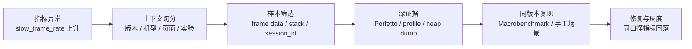

---

title: "APM 全景图与分类体系"
chapter: "19"
section: "19.01"
drafted_date: "2026-04-24"
drafted_by: "codex"
applicable_versions: "Android 8 (API 26) - Android 17 (API 37)"
last_verified: "2026-04-25"
last_verified_against: "Android Developers JankStats / FrameMetrics / ApplicationExitInfo / ProfilingManager docs, Firebase docs, GitHub upstream READMEs, External Review 2026-04-25"
confidence: medium
tags: [apm]
related_chapters: ["19.0"]
consolidated_from:
  - "src/part3-tools/ch19-apm/19.10-apm-tool-compatibility.md"
sources:
  - type: official
    path: "https://developer.android.com/topic/performance"
  - type: official
    path: "https://developer.android.com/reference/androidx/metrics/performance/JankStats"
  - type: official
    path: "https://developer.android.com/reference/android/view/FrameMetrics"
  - type: official
    path: "https://developer.android.com/reference/android/app/ApplicationExitInfo"
  - type: official
    path: "https://developer.android.com/reference/android/os/ProfilingManager"
  - type: official
    path: "https://firebase.google.com/docs/perf-mon"
  - type: blog
    path: "https://github.com/Tencent/matrix"
  - type: blog
    path: "https://github.com/KwaiAppTeam/KOOM"
  - type: blog
    path: "https://github.com/bytedance/btrace"
  - type: blog
    path: "https://github.com/measure-sh/measure"
task2b_result: fixed
last_task2b_at: "2026-05-22T11:21:56+08:00"
last_task6_audit: "2026-06-13"
last_task9_audit: "2026-06-15"
last_task9_audit_at: "2026-06-15T03:20:00+08:00"
last_task9_audit_log: "logs/deep-review/2026-06-15-03-audit.md"
status: finalized
task9_state: reviewed
task9_result: auto-fixed
task2b_state: fixed
pipeline_stage: ready-to-publish
task9_reviewed_date: "2026-05-22"
task9_reviewed_by: openclaw-task9
last_task9_at: "2026-06-15T03:20:00+08:00"
last_task9_review_log: "logs/deep-review/2026-05-22-11-deep-review.md"
task9_review_notes: "2026-05-22 Task9 re-review: pass-tech-review。P0/P1=0；ApplicationExitInfo reason 版本边界与 AppExitInfoTracker 消息路径已修正；queue 无 pending，Task6 已通过，自动晋升 finalized。 2026-06-15 Task9 idle audit: AUTO-FIX source anchor boundary; AppExitInfoTracker / ProcessList / ApplicationExitInfo references pinned from AOSP mainline/android-15 note to android-16.0.0_r1 after direct source verification; P0/P1=0, Task6 revisiting."
last_task9_autofix_at: "2026-06-15"
reviewed_date: "2026-05-22"
reviewed_by: "openclaw-task6"
task6_state: reviewed
task6_result: pass-light-edit
last_task6_at: "2026-06-15T04:09:51+08:00"
last_task6_review_log: logs/review/2026-06-15-04-review.md
review_notes: "2026-05-21 task9 idle audit: needs-rework。P0：AppExitInfoTracker 源码位置写错；ApplicationExitInfo reason 常量值错位，写入 queue 条目 task9-audit-20260521-19.01-appexitinfo-constants-source。2026-05-21 task2b rework: AppExitInfoTracker 源码位置从 ProcessList 内部类修正为顶层类 AppExitInfoTracker.java；reason 常量按 AOSP ApplicationExitInfo.java 修正（SIGNALED=2, LOW_MEMORY=3, CRASH=4, CRASH_NATIVE=5, ANR=6 等）；消息表同步修正；删除不存在的 REASON_PROCESS_ENTRY_NULL。2026-05-22 Task6 re-review: L1/L2 pass-light-edit，修正 frontmatter 重复 key 与术语表达；Task9 P1 queue 已存在，保持 task2b_pending。 2026-06-15 Task6 revisiting review: pass-light-edit。L1 小修 0 处。无 L3/L4 回炉项。task9_result=auto-fixed (P0/P1=0), queue 无 pending, 自动晋升 finalized。"
finalized_date: 2026-06-15
finalized_by: openclaw-task6
auto_promoted_date: 2026-06-15
auto_promoted_by: openclaw-task6
last_deepseek_polish_at: 2026-05-26
deepseek_polish_state: done
task6_reviewed_date: 2026-06-15
task6_reviewed_by: openclaw-task6
deepseek_cn_review_state: done
last_deepseek_cn_review_at: 2026-06-18
---

# APM 全景图与分类体系

## APM 先解决线上可见性

APM（Application Performance Monitoring）负责回答三类线上问题：

- 哪个版本、页面、设备群或实验组正在变差；
- 影响面有多大，是否值得进入修复队列；
- 能否保留一份足以继续诊断的现场样本。

APM SDK 通常只能看到应用有权限采集的信号。一次慢帧可能来自主线程业务、RenderThread、CPU 抢占、Binder 对端、I/O、GPU 或 SurfaceFlinger；一次进程死亡也可能是 Java crash、native crash、ANR、LMK、force-stop、安装更新或系统策略。仅凭一个耗时或 reason 不能给出根因。

因此，APM 与 Perfetto、Android Studio Profiler、simpleperf、heap dump、AGI、dumpsys 的关系是“发现与筛选”对“复核与归因”。线上系统提供分布和样本，线下及系统工具把一个样本展开到线程、调用栈、资源、GPU 和显示路径。

## Android 17 复核基线

| 层级 | 版本基线 | APM 能看到什么 |
|---|---|---|
| Android 平台 | Android 17 / API 37 / `android-17.0.0_r1` | `ApplicationExitInfo`、`FrameMetrics`、`ProfilingManager`、系统 trace 与进程生命周期 |
| Android 内核 | `android17-6.18-2026-06_r6` | scheduler、I/O、binder driver、dma-buf/fence、内存压力等底层事实；普通应用不能任意读取这些数据 |
| Jetpack Metrics | `androidx.metrics:metrics-performance:1.0.0` | JankStats 的帧时长、jank 判断与 UI state |
| 第三方/自研 APM | 随应用版本固定 | 埋点、采样、堆栈、hook、缓存、上传和服务端聚合 |
| Google Play | 当前 Play Console / Reporting API 口径 | Android vitals 的 crash、ANR、wake lock、启动、渲染等聚合数据 |

平台锚点与 APM SDK 版本要分别记录。Android 17 不会自动升级应用内的 Matrix、KOOM、JankStats、Firebase 或自研 SDK；反过来，升级 SDK 也不会改变设备的 framework 和 kernel 实现。

## 从异常指标到可验证结论

下面的流程图展示一条慢帧问题从线上发现到修复验证的证据路径。



例如，灰度看板发现图片编辑页的慢帧率只在某个版本和一组低内存设备上升。JankStats 样本带有页面、操作和帧时长，但没有主线程阻塞点。团队从该分组挑选可复现设备，采集 Perfetto，看到每次缩放都会在主线程同步解码大图并伴随 I/O 等待；simpleperf 或方法 trace 再把热点定位到具体调用。

修复后，用相同图片、相同操作序列和相同编译模式跑 Macrobenchmark，再在小流量灰度中观察原指标、样本签名和 crash/ANR 副作用。若只看到慢帧率下降，却更换了分母、采样率或设备范围，这次“改善”不能作为同口径结论。

## 四类能力不要混在一起选

Android 性能工具至少分成四类。分类依据是采集位置、运行阶段、输出证据和工程成本，不能按“都能看性能”合并选型。

| 类别 | 代表能力 | 运行位置 | 主要输出 | 典型成本 |
|---|---|---|---|---|
| 客户端 APM | Matrix、KOOM、btrace/RheaTrace、Measure、自研 SDK | Release / 灰度 | 聚合指标、异常样本、堆栈、trace、heap 摘要 | 包体、CPU/内存、hook/插桩兼容、隐私、上传平台 |
| 官方信号与 SDK | Android vitals、JankStats、FrameMetrics、ApplicationExitInfo、ProfilingManager、Tracing | 系统、Play、应用进程 | 平台指标、帧数据、退出记录、受控 profile、应用 slice | API floor、平台口径、回调开销、rate limit |
| 线下诊断 | Perfetto、Profiler、simpleperf、LeakCanary、AGI、dumpsys | Debug / QA / 实验室 | trace、调用栈、heap、GPU command、系统状态 | 需要设备、复现和人工分析 |
| Benchmark / CI | Macrobenchmark、Microbenchmark、PerfDog、设备 benchmark | CI / 实验室 | 可比较的耗时、帧、吞吐、功耗或分数 | 测试环境、预热、编译模式、设备与温度控制 |

客户端 APM 擅长覆盖大量真实设备，却受权限与采样预算限制；线下工具证据更深，却只覆盖少量可复现场景；Benchmark 擅长做改动前后对比，却不能代表线上分布；平台信号的口径稳定性较好，也要服从版本、设备支持和数据可见性限制。

Android vitals 与自建 APM 的数值不应强求一致。Play 数据只覆盖符合其采集条件的设备和用户，issue rate 的分母也可能按 daily active user 计算；第三方 SDK 常按 session、启动次数或采样事件计算。合并看板前要把人群、窗口、分母和去重规则写清楚。

## 四类证据各有用途

### 指标：发现趋势与影响面

指标是聚合结果，例如：

- `cold_start_p50_ms`、`cold_start_p95_ms`；
- `slow_frame_rate`、`frozen_frame_rate`；
- `user_perceived_anr_rate`、`crash_user_rate`；
- `lm_kill_user_rate`、`native_crash_rate`；
- `request_ttfb_p95_ms`、`request_failure_rate`。

指标适合版本门禁、趋势和分组排序。它不能指向某一行代码；P95 上升只说明分布尾部变差，还需要样本和上下文。

### 样本：保留一次现场

样本是一次事件，例如：

- 慢帧的 UI state、frame duration 与主线程堆栈；
- ANR 的线程堆栈、reason、前后台和近期操作；
- Java/native crash 的符号化栈与 Build-ID；
- OOM/LMK 附近的 PSS/RSS、heap 摘要和页面；
- 网络请求的 DNS/connect/TLS/TTFB 分段。

样本数不能直接当发生率。异常触发采样、设备离线、磁盘满、进程死亡和上传限流都会改变样本被看见的概率。

### Trace / profile：还原时间与资源关系

trace、CPU sample、heap dump 和 GPU capture 属于重证据：

- Perfetto 解释线程调度、Binder、I/O、渲染和系统服务；
- simpleperf 解释 CPU hotspot 与 native 调用栈；
- Hprof、heapprofd 或 LeakCanary 解释对象/分配和引用关系；
- AGI 解释 GPU command、shader、资源和 pipeline；
- ProfilingManager 在受支持版本上提供受控的 system trace、heap dump、heap profile 或 stack sample。

这类文件较大、采集成本高，不适合把每个事件都上传。常见策略是先按轻量指标筛选，再对少量样本提升证据等级。

### 上下文：决定样本能否比较

最小上下文应覆盖：

- App version、version code、build variant、发布渠道；
- ProGuard/R8 Mapping ID、native ELF Build-ID；
- Android 版本、build fingerprint、机型、ABI、RAM 档位；
- 进程、页面/场景、前后台、刷新率、实验组；
- `event_id`、`session_id`、`trace_id` 与用户匿名标识；
- 采样概率、SDK 版本、采集配置版本。

上下文字段若随意改名或高基数失控，同一个问题会被拆散，服务端存储和查询成本也会膨胀。

## 常见采集路线的工程代价

| 采集方式 | 可见范围 | 适合的问题 | 主要边界 |
|---|---|---|---|
| Looper logging / message observer | 主线程 message 执行区间 | 长消息、主线程 block、ANR 前堆栈 | 看不到 message 之外的 RenderThread/GPU/系统等待；观察者自身会占主线程 |
| Choreographer 回调 | App UI frame 节奏 | 连续帧间隔、动画/滚动场景 | 帧间隔不等于完整呈现耗时，刷新率变化也会改变阈值 |
| FrameMetrics / JankStats | Window frame 与 UI state | 慢帧率、场景归因 | API 版本决定字段；回调必须快速返回 |
| 字节码插桩 | 被插桩方法的调用与耗时 | 启动节点、热点路径、业务 trace | 增加构建复杂度与运行代码；R8/AGP/Kotlin 版本要回归 |
| PLT/inline hook、JVMTI、malloc hook | native/Java 运行时事件 | I/O、分配、线程、函数调用 | ABI、linker、符号、ROM 与安全策略带来兼容成本 |
| 系统 profiling | 调度、系统服务、heap、stack 等 | 少量高价值现场 | 受权限、rate limit、redaction 和系统支持约束 |
| 外部测试采样 | FPS、CPU、内存、温度、功耗等 | QA、竞品或设备对比 | 不等于线上用户数据；采样源和指标定义要核对 |

采集代码也会改变被测系统。主线程抓栈、每帧序列化、Hprof dump、native allocation tracking 和长 trace 都可能造成额外卡顿、内存或 I/O。上线前要在高端与低端设备上测量 CPU 时间、主线程时间、内存、包体、磁盘、流量和电量，而非只测“功能能否收到数据”。

## JankStats 与 FrameMetrics 的准确边界

截至 2026-07-25，`androidx.metrics:metrics-performance:1.0.0` 是稳定版本。JankStats 在 API 24+ 基于 FrameMetrics，在更早版本使用 `OnPreDrawListener`；同一 API 表面不代表各版本能提供相同精度。

版本差异可按下面理解：

| 系统版本 | 主要来源 | 能力边界 |
|---|---|---|
| API 23 及以下 | `OnPreDrawListener` | 在主线程回调，估计 UI frame 时长，无法获得现代 FrameMetrics 字段 |
| API 24—30 | `Window.OnFrameMetricsAvailableListener` | 可获得 UI/CPU 相关 duration；listener 由 FrameMetrics 线程交付 |
| API 31—37 | FrameMetrics + deadline 信息 | 可使用 `frameOverrunNanos` / `DEADLINE` 等更接近是否错过目标帧期限的字段 |

JankStats listener 每帧都会收到数据，必须快速返回。`FrameData` 会被复用，回调返回后若还要异步处理，应复制需要的值，不能缓存原对象引用。

FrameMetrics 的 `TOTAL_DURATION` 表示该帧从开始到提交给显示子系统的总时长；各 stage 可能重叠，所以子项之和不必等于 total。它也不等于物理屏幕 present 时间。需要分析 SurfaceFlinger/HWC 和 display present 时，转向 Perfetto FrameTimeline、SurfaceFlinger 和 GPU/display 证据。

JankStats 的 UI state 需要由应用维护。页面、滚动、过渡、列表类型等状态没有及时清理时，慢帧会被关联到过期场景，服务端统计会很精确地计算出一个错误结论。

## ApplicationExitInfo：退出记录不是 OOM 结论

### 应用 API 与 Android 17 服务端路径

API 30 起，应用可调用 `ActivityManager.getHistoricalProcessExitReasons()` 查询历史 `ApplicationExitInfo`。Android 17 的调用路径是：

```text
App
  → ActivityManager.getHistoricalProcessExitReasons()
  → Binder / ActivityManagerService
  → ProcessList.mAppExitInfoTracker
  → per-package / per-UID exit records
  → NativeTombstoneManager 合并可访问 tombstone
```

这段路径说明查询会跨 Binder 进入 `system_server`，还可能合并 tombstone。它不应阻塞冷启动首帧；可在后台 executor 查询最近记录，按 timestamp、process name 和 version/session 边界去重后再上报。

`AppExitInfoTracker` 在 Android 17 中是独立顶层类，实例由 `ProcessList` 字段 `mAppExitInfoTracker` 创建并初始化。AOSP 基础配置每个 package/UID 最多保留 16 条记录，设备资源 overlay 可以改变容量。记录通过 AtomicFile 持久化到 `procexitstore/procexitinfo`，非紧急更新按 30 分钟间隔调度写入；package/user 移除时会清理对应记录。

### reason 来自多路事实合并

进程死亡与 AMS 主动 kill 形成基础记录；lmkd 和 zygote 的外部通知可以补充 status、RSS 或修正 reason。Android 17 源码还保护已经明确为 ANR、Java crash 或 native crash 的记录，避免后到的模糊信号覆盖高价值原因。

常见公开 reason 包括：

| reason | 值 | 解释时要保留的边界 |
|---|---:|---|
| `REASON_SIGNALED` | 2 | 结合 `getStatus()` 的 signal；在不支持 LMK 上报的设备上，内存压力 kill 可能表现为 SIGKILL |
| `REASON_LOW_MEMORY` | 3 | 先检查 `ActivityManager.isLowMemoryKillReportSupported()`；没有 heap trace |
| `REASON_CRASH` | 4 | Java 未处理异常，不等于 native crash |
| `REASON_CRASH_NATIVE` | 5 | API 31+ 可能附带 protobuf tombstone stream，也可能因覆盖而为空 |
| `REASON_ANR` | 6 | 通常可取得系统保存的 ANR trace，但不保证永远存在 |
| `REASON_USER_REQUESTED` | 10 | 包含 force-stop、任务移除等用户相关路径，结合 description/场景 |
| `REASON_OTHER` | 13 | 依赖 description 与上下文，不能直接归为应用缺陷 |
| `REASON_FREEZER` | 14 | API 33+ 的 freezer 相关退出 |
| `REASON_PACKAGE_STATE_CHANGE` / `UPDATED` | 15 / 16 | API 34+ 区分组件状态变化与包更新 |

`getPss()` 与 `getRss()` 是系统上一次采样值，可能为 0，也不是死亡瞬间内存。`getTraceInputStream()` 通常用于 ANR；API 31+ 还可返回 native tombstone protobuf。进程曾发生并恢复的 ANR，其 trace 也可能附在之后因其他 reason 死亡的记录上。trace 和 tombstone 由独立循环存储管理，可能被更新事件覆盖，因此返回 `null` 是合法结果。

下面的代码用于展示一次低优先级、可去重的历史退出查询；生产代码还要接入自己的持久化和上传队列。

```kotlin
executor.execute {
    val records = activityManager.getHistoricalProcessExitReasons(
        null, // 仅查询调用方 UID 可访问的记录
        0,    // 不按 PID 过滤
        16,
    )

    records.forEach { info ->
        reportExitIfNew(
            processName = info.processName,
            timestampMs = info.timestamp,
            reason = info.reason,
            status = info.status,
            pssKb = info.pss,
            rssKb = info.rss,
        )
    }
}
```

`packageName = null` 时，服务端按调用方 UID 过滤；应用不能借此读取任意包的历史。`timestamp + processName + reason/status` 只能作为去重基础，跨 reinstall、数据清除和时钟变化时还要加入 install/build/session 标识。

## ProfilingManager：受控取证，不是随叫随到

API 35 引入 `android.os.ProfilingManager`，支持 Java heap dump、heap profile、stack sampling 和 system trace 请求。请求会被 rate limit，也不保证执行；结果经过裁剪，只包含请求进程可访问的信息。

API 36 增加 `ProfilingTrigger` 注册，允许系统事件命中后交付 profile。trigger 同样不保证产生结果，调用方需要注册全局 result listener、处理进程被杀后的重新交付，并为文件过期、上传和去重设计流程。

Android 17 上可以把 ProfilingManager 接入少量高价值样本，例如：

- 启动 P99 异常且设备满足采集条件；
- 特定页面连续慢帧，并已通过轻量信号筛选；
- 远程配置选择的低比例实验人群；
- 系统 trigger 返回的 ANR、OOM 或冷启动 profile。

不要对每次慢帧请求 system trace，也不要把 callback 未返回解释成 API 故障。rate limit、资源状态、系统策略和进程生命周期都可能让请求没有结果。

## 什么时候 APM 证据不够

| 线上现象 | APM 能提供的入口 | 后续验证工具 |
|---|---|---|
| 主线程长任务 | message duration、主线程 stack、页面 | Perfetto thread state、method trace、CPU profiler |
| CPU 抢占或频率受限 | 慢帧/启动样本、设备与温度上下文 | Perfetto scheduler/cpufreq、simpleperf、thermal 信息 |
| Binder 卡住 | 调用点 stack、超时样本 | Perfetto binder transaction、对端线程与服务 trace |
| I/O 等待 | 文件类别、耗时、调用 stack | Perfetto/ftrace I/O、simpleperf；必要时检查文件系统与内核事件 |
| GPU/显示晚 | frame duration、场景、Surface 类型 | Perfetto GPU/FrameTimeline、AGI、SurfaceFlinger/HWC |
| Java 对象泄漏 | heap 使用趋势、页面、退出原因 | Hprof、LeakCanary、Profiler |
| native 内存增长 | RSS/PSS 趋势、native stack sample | heapprofd、malloc debug、KOOM/厂商工具 |
| LMK/OOM | exit reason、PSS/RSS、设备 RAM、前后台 | ApplicationExitInfo、lmkd/PSI trace、heap/native memory 分解 |
| 网络慢 | DNS/connect/TLS/TTFB 分段与 endpoint 类别 | 客户端网络 trace、服务端 trace、网络环境复现 |

普通应用看不到完整系统和内核现场。需要 scheduler、driver、dma-fence、lmkd/PSI 或系统服务内部细节时，要在可控测试设备上采集 Perfetto/ftrace，或与平台/OEM 团队协作。不能把缺失字段补成推测。

## 线上采样要先写清数据合同

数据合同要先于 SDK 接入。它规定“客户端采什么、服务端怎样解释、多久删除、如何关联构建”，避免同名字段在不同版本中表达不同含义。

下面的 JSON 只展示最小结构，用于讨论字段职责，不代表特定后端协议。

```json
{
  "schema_version": 3,
  "event_name": "jank_frame_sample",
  "event_id": "01J...ULID",
  "occurred_at_epoch_ms": 1784908800123,
  "duration_ns": 42800000,
  "sample_probability": 0.02,
  "session_id": "anonymous-session-id",
  "trace_id": null,
  "app": {
    "version_name": "8.4.0",
    "version_code": 804000,
    "mapping_id": "r8-mapping-uuid",
    "native_build_ids": ["7f3a..."]
  },
  "device": {
    "sdk_int": 37,
    "build_fingerprint_hash": "sha256:...",
    "model_class": "mid_ram_6g",
    "abi": "arm64-v8a"
  },
  "context": {
    "process": "main",
    "screen": "image_editor",
    "interaction": "pinch_zoom",
    "foreground": true
  }
}
```

耗时字段在名称或 schema 中固定单位；`sample_probability` 用于加权估计，不能丢失；Mapping ID 与 Build-ID 用于还原 Java/Kotlin 和 native 栈；高基数原始机型、URL、文件路径和用户信息要按数据最小化原则处理。

一份可执行的数据合同至少定义：

- 事件名、schema version、字段类型、单位和 nullable 规则；
- 指标窗口、分母、去重、分位数算法和时区；
- 用户/session/event/trace 的关联与生命周期；
- Java Mapping ID、native Build-ID 和 source revision；
- 采样单位是用户、session、事件还是异常；
- URL、请求头、日志、路径、截图和标识符的脱敏规则；
- 本地保留、上传重试、服务端保留和删除周期；
- SDK 配置版本、远程开关与回滚方式。

## 端侧采样、缓存与上传

### 采样

不同事件使用不同策略：

- crash、ANR 等低频高价值事件优先保留完整轻量元数据；
- 每帧、每请求等高频数据先在端侧聚合；
- trace、heap dump 等重文件只对少量候选样本采集；
- 用户/session 采样尽量使用稳定 hash，避免每次启动换一批人导致纵向比较困难；
- 服务端展示发生率时校正采样概率和上传成功率。

“异常才采样”会产生选择偏差。例如只在设备空闲、充电且网络良好时上传 trace，样本天然偏向特定设备状态；结论中要保留这项限制。

### 本地缓冲

缓冲区应有总字节、单事件、单文件、条数和年龄上限。写入使用临时文件与原子 rename 或具备事务语义的存储，避免进程被杀后留下半文件。重文件与普通指标分目录管理，过期和低价值事件优先淘汰。

敏感数据应在写盘前完成裁剪或脱敏。不能先保存原始 URL、token、日志和用户数据，再指望上传阶段处理；进程死亡后，这些原始文件仍可能留在磁盘。

### 上传

上传需要批量、压缩、指数退避、抖动、幂等 event ID 和服务端去重。网络、充电、温度、前后台等条件应按文件价值设置，不能让 APM 自身制造启动竞争、流量尖峰或发热。

服务端收到事件不代表数据完整。客户端要上报丢弃原因计数，例如 quota、serialization error、disk full、expired、rate limited、upload failed；否则看板只描述“成功上传的人群”。

## 选型：从团队约束推导组合

选型之前先区分“能解析依赖”和“能进入生产”。一个 APM artifact 的 Android 17 准入至少包含构建、打包、启动、采集、失败降级、停用恢复与隐私七层；仓库 README、低 `minSdk`、一次启动成功或 AOSP 中仍存在同名私有字段，都不能替代这七层证据。

### 用成对变体测量 APM 自身开销

同一 commit 至少准备以下 release 变体，保持 R8、签名、ABI、资源和业务配置一致：

| 变体 | 内容 | 用途 |
|---|---|---|
| `baseline` | 不包含被测 SDK | 建立设备与业务基线 |
| `linked-off` | 包含依赖，但模块全部关闭 | 观察打包、类加载和初始化前影响 |
| `module-on` | 一次只开启一个模块 | 将成本归属到具体采集器 |
| `production-set` | 生产计划中的模块、采样与上传配置 | 验证组合效应 |
| `event-trigger` | 受控制造 block、dump、leak 或上传失败 | 测量峰值和失败恢复 |

测试至少覆盖冷启动、前台空闲、固定交互、高频 Message、后台静置和受控异常；轮次按 baseline/variant 交替或随机排列，每轮使用相同的温度、电量、刷新率、网络和数据状态。Android 17 还要分别覆盖 4 KB 与严格 16 KB page-size 环境，以及业务占比高的厂商 ROM。

CPU 使用 Perfetto 中的进程/线程 running time，帧使用 FrameTimeline、JankStats 或 FrameMetrics，内存同时记录 PSS、RSS、Java/native heap 和峰值，启动由 Macrobenchmark 控制模式。I/O、网络、唤醒、包体、事件丢失、关闭后残留线程和异常恢复也要进入结果。不能从源码操作数估算“低于 0.1%”或把周期 tracker 与一次 heap dump 汇总成同一个平均开销。

发布表同时给绝对差值、相对差值、中位数、尾部值、最差有效轮和样本数。没有实测的数据保留为空；性能差但流程完整的轮次不能按异常值删除。最终 APK/AAB 中所有 native 依赖还要分别检查 ELF LOAD segment、ZIP 对齐和真机 page size，这三项不是同一个证据。

### Android 17 接入准入清单

- 固定仓库、commit、依赖坐标、AGP、NDK、R8、targetSdk 与配置版本。
- clean、增量、configuration cache、各 variant 和最终安装产物均通过。
- manifest、权限、Provider、Service、通知、`PendingIntent`、文件目录和网络安全完成现代化审查。
- 4 KB/16 KB 设备验证安装、初始化、正常事件、边界事件、失败事件和关闭模块。
- 反射、私有符号、Hook、Printer、子进程、磁盘和上传失败都会显式降级，不以“没有报告”冒充“没有问题”。
- 关闭模块后恢复 Hook/Printer，停止线程与任务，缓存满足大小、年龄、重试和删除限制。
- 报告保存原始 trace、脚本 commit、测试顺序、判废原因和 SDK 自监控数据。

具体工具的构建和运行边界留在各自正文：Matrix 看 19.2，KOOM 看 19.3，BlockCanary 与历史开源项目看 19.8。这样兼容性结论只维护一次，通用实验协议也不再单独占用一个重复编号。

| 团队条件 | 优先能力 | 原因 |
|---|---|---|
| 没有线上性能平台 | Android vitals + crash/ANR + 基础启动/页面指标 | 建立稳定趋势和版本分组，再补专项 |
| UI 卡顿是主问题 | JankStats + UI state + 少量 Perfetto/Macrobenchmark | 轻量覆盖真实场景，深证据用于归因 |
| Java/native 内存问题多 | ApplicationExitInfo + heap/native 专项工具 | 区分 crash、LMK、ANR，再选择 Hprof/heapprofd/KOOM |
| 已有日志与数据平台 | 自研轻量 SDK 或开源采集组件 | 可复用鉴权、上传、查询和告警，但仍需评估客户端维护成本 |
| 发版节奏快、AGP/Kotlin 升级频繁 | 少 hook、少插桩，优先稳定系统/Jetpack API | 降低构建链和 runtime 兼容风险 |
| 低端设备占比高 | 更低采样、更小缓冲、端侧聚合、严格 kill switch | APM 开销更容易污染被测性能 |
| 隐私或合规限制严格 | 数据最小化、端侧聚合、短保留期、可审计 schema | 降低原始内容离开设备的范围 |

Matrix、KOOM、btrace/RheaTrace、Measure、Firebase、Sentry、APMPlus 等工具各自覆盖一部分问题。项目活跃度、license、版本兼容和维护者状态会变化，接入前要查看对应仓库/release 和最小验证应用，不能仅凭过时的“主流/维护中”标签判断。

## 分阶段建设顺序

1. 统一 build、version、device、process、screen、session 和采样字段。
2. 接入 Android vitals、crash/ANR 与基础启动/页面指标，建立版本门禁。
3. 按主要问题加入 JankStats、ApplicationExitInfo、网络分段或内存信号。
4. 建立样本升级机制：从轻事件请求 trace、profile、heap 或实验室复现。
5. 把 Macrobenchmark/Microbenchmark 和关键场景回归接入 CI。
6. 增加远程开关、预算、丢弃统计、隐私审计和 SDK 自身性能监控。

每一步都应能单独关闭和回滚。没有 kill switch 的 hook、每帧监听或重文件采集，不适合直接进入大规模 Release。

## 后续章节怎样分工

- 19.2 Matrix、19.6 DoKit、19.7 Measure：看当前客户端框架的采集与工程边界；
- 19.3 KOOM、19.5 LeakCanary：看 Java/native 内存和泄漏专项；
- 19.4 btrace/RheaTrace：看方法级 trace 与在线采样；
- 19.8：理解 BlockCanary、ArgusAPM 等历史方案能保留的设计和必须替换的实现；
- 19.9、19.10：看官方帧信号与应用 trace；
- 19.11—19.13：看回归测量、编译优化和系统受控取证；
- 19.14、19.15：看托管平台的指标、采样和服务端能力；
- 19.16、19.17：看外部性能测试、操作复现与设备 benchmark；
- 19.18—19.22：看网络、crash/ANR、功耗、混合栈和大规模端侧架构。

阅读某个工具前，先回答它处在“线上采集、系统信号、线下诊断、回归测量”中的哪一层。这样能避免用一款工具负责它没有数据权限或没有证据深度的问题。

## 常见误判

| 误判 | 修正 |
|---|---|
| 接入一个 SDK 就有完整 APM | SDK 只是采集端；还需要数据合同、缓存上传、符号化、聚合、查询、告警和验证 |
| Android vitals 与自建 crash rate 应完全相等 | 人群、分母、去重、窗口和隐私阈值不同 |
| JankStats 报 jank 就说明主线程慢 | 继续检查 CPU 调度、RenderThread、GPU、SurfaceFlinger 和刷新率 |
| FrameMetrics 各 stage 之和等于 total | stage 可以并发，API 文档明确不保证相等 |
| `REASON_LOW_MEMORY` 代表 Java heap OOM | 它表示系统内存压力 kill；先检查设备是否支持该 reason，再拆 PSS/RSS/heap/native |
| `getTraceInputStream()` 对 ANR/native crash 必有数据 | 独立循环存储可能覆盖，ANR 恢复后也可能把 trace 带到其他 reason |
| ProfilingManager 请求一定返回 | 请求受 rate limit 和系统策略控制，不保证执行 |
| 样本数就是发生率 | 采样、进程死亡、磁盘、网络和服务端去重都会影响可见样本 |
| 外部 benchmark 分数代表线上体验 | 分数只在相同版本、设备状态和测试条件下可比较 |
| APM 没采到 scheduler/GPU 细节，就能用堆栈推断 | 缺系统证据时转向 Perfetto/AGI/OEM 工具，并明确未知项 |

## 源码与文档入口

- [Android vitals](https://developer.android.com/topic/performance/vitals)：核对 Play 数据范围、core vitals、分母差异和 Reporting API。
- [JankStats guide](https://developer.android.com/topic/performance/jankstats) 与 [AndroidX Metrics release notes](https://developer.android.com/jetpack/androidx/releases/metrics)：核对 API 版本路径、listener 线程、FrameData 复用和 `1.0.0` 稳定版。
- [`FrameMetrics`](https://developer.android.com/reference/android/view/FrameMetrics)：核对 API 24+ stage、API 31+ `DEADLINE`、单位和 total 语义。
- [`ApplicationExitInfo`](https://developer.android.com/reference/android/app/ApplicationExitInfo) 与 [`ActivityManager.getHistoricalProcessExitReasons()`](<https://developer.android.com/reference/android/app/ActivityManager#getHistoricalProcessExitReasons(java.lang.String,int,int)>)：核对 reason、status、PSS/RSS、trace 和访问范围。
- Android 17 的 [`ApplicationExitInfo.java`](https://android.googlesource.com/platform/frameworks/base/+/android-17.0.0_r1/core/java/android/app/ApplicationExitInfo.java)、[`ActivityManager.java`](https://android.googlesource.com/platform/frameworks/base/+/android-17.0.0_r1/core/java/android/app/ActivityManager.java)、[`ActivityManagerService.java`](https://android.googlesource.com/platform/frameworks/base/+/android-17.0.0_r1/services/core/java/com/android/server/am/ActivityManagerService.java)、[`ProcessList.java`](https://android.googlesource.com/platform/frameworks/base/+/android-17.0.0_r1/services/core/java/com/android/server/am/ProcessList.java) 与 [`AppExitInfoTracker.java`](https://android.googlesource.com/platform/frameworks/base/+/android-17.0.0_r1/services/core/java/com/android/server/am/AppExitInfoTracker.java)：核对 Binder 查询、记录容量、持久化、lmkd/zygote 修正与 tombstone 合并。
- [`ProfilingManager`](https://developer.android.com/reference/android/os/ProfilingManager)、[`ProfilingTrigger`](https://developer.android.com/reference/android/os/ProfilingTrigger) 与 Android 17 [`ProfilingManager.java`](https://android.googlesource.com/platform/packages/modules/Profiling/+/android-17.0.0_r1/framework/java/android/os/ProfilingManager.java)：核对 API 35 请求、API 36 trigger、rate limit、结果交付与 redaction。
- [Macrobenchmark](https://developer.android.com/topic/performance/benchmarking/macrobenchmark-overview) 与 [Microbenchmark](https://developer.android.com/topic/performance/benchmarking/microbenchmark-overview)：核对端到端场景和局部代码 benchmark 的分工。
- [Perfetto Android trace](https://perfetto.dev/docs/getting-started/system-tracing)：核对 scheduler、Binder、I/O、内存和图形等系统证据的采集边界。
- kernel `android17-6.18-2026-06_r6` 的 [PSI 文档](https://android.googlesource.com/kernel/common/+/refs/tags/android17-6.18-2026-06_r6/Documentation/accounting/psi.rst) 与 [ftrace 文档](https://android.googlesource.com/kernel/common/+/refs/tags/android17-6.18-2026-06_r6/Documentation/trace/ftrace.rst)：核对内存压力和内核 trace 机制；普通应用权限边界仍由 Android 平台与设备策略决定。
