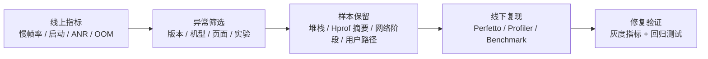

# APM 全景图与分类体系

<!-- outline-start -->
## 本节要点大纲

### 锚点（必须覆盖）

- 🔹 [定位] 说明 APM 解决线上可见性，不替代 Perfetto、Android Studio Profiler、simpleperf、heap dump；补一个线上慢帧或 OOM 样本从发现到定位的例子。
- 🔹 [分类] 把客户端 APM、官方指标 SDK、线下研发工具、Benchmark 工具按采集位置、使用阶段、输出数据、工程成本做成对照表。
- 🔹 [数据模型] 展开指标、样本、trace、上下文四类证据；每类至少写 3 个字段例子和一个误用场景。
- 🔹 [证据路径] 写清从指标异常到样本筛选，再到 trace / dump / report 复核的排查路径；避免只停留在工具清单。
- 🔹 [采集方式] 比较 Looper、Choreographer、FrameMetrics、字节码插桩、native hook、系统 profiling 的成本、版本边界和适用问题。
- 🔹 [工具边界] 给出“什么时候只用 APM 不够”的判断表，包括 CPU 争抢、Binder 卡住、I/O 等待、GPU 阻塞、Java / native 内存泄漏。
- 🔹 [选型框架] 按团队已有平台、发版节奏、隐私要求、低端设备比例、专项问题类型，推导应该优先接入哪些工具。
- 🔹 [数据合同] 明确 event 名称、维度、单位、采样、脱敏、保留周期、trace id / session id 关系；提供一份最小字段模板。
- 🔹 [线上策略] 说明灰度开关、采样率、磁盘缓存、上传失败重试、端侧降级和服务端聚合对结论可信度的影响。
- 🔹 [章节关系] 交代本章后续各节的分工，让读者知道 Matrix、KOOM、JankStats、Firebase、PerfDog、Benchmark 分别回答哪类问题。

### 扩展（可选深入）

- 🔸 画一张“端侧采集 -> 本地缓冲 -> 上传 -> 服务端聚合 -> 告警/查询 -> 专项诊断”的架构图。
- 🔸 加一份 APM 数据 schema 示例，覆盖启动、慢帧、ANR、OOM、I/O、网络请求。
- 🔸 增加一张“工具选择速查表”，按问题类型映射到推荐工具和后续验证方式。
- 🔸 补充隐私与合规检查项，特别是 URL、文件路径、日志片段、用户标识、Hprof 摘要。
- 🔸 对所有 Android 官方 API 和开源项目状态做 L1/L2 核对，过期项目要明确写边界。

### 流水线加工要求

- 每个锚点至少补一个判断依据和一个边界条件，不要只扩写定义。
- 表格优先承担比较信息，代码块优先展示字段、配置或伪数据，不写装饰性代码。
- 所有版本、API、项目状态必须能追溯到 front matter 的 sources 或新增来源。

### OpenClaw 加工指引

> **锚点**是最低覆盖要求，加工时必须逐条落实并标注验证结果。
> **扩展**视素材丰富程度选择性深入。
> 如果从 Obsidian 素材或 AOSP 源码中发现大纲未列出但与本节强相关的知识点，
> 可**就地插入**最相关的锚点之后，并用 `[自动发现]` 标注，方便后续 review。
> 锚点内容需 L1/L2 验证，扩展内容至少 L2 验证，自动发现内容至少标注来源。
<!-- outline-end -->

## APM 先解决线上可见性

APM 在 Android 性能体系里的位置很清楚：它把线上设备里的性能信号采回来，让团队知道哪类问题正在发生、影响多少用户、是否需要进入修复队列。它不替代 Perfetto、Android Studio Profiler、simpleperf 这类线下诊断工具，也不保证单靠 SDK 上报就能还原所有现场。

这层边界要先讲清。APM 负责发现样本和分布，Perfetto 负责还原一次具体慢帧、ANR、启动慢或内存异常的细节。

## 四类能力不要混在一起选

Android 性能监控工具可以按采集位置和使用场景分成四类：

| 层次 | 代表工具 | 最低 API / 精度边界 | 主要回答的问题 | 常见使用位置 |
|---|---|---|---|---|
| 客户端 APM 框架 | Matrix、KOOM、btrace、Measure | 多数依赖应用自身 minSdk、native ABI 和构建链兼容性 | 线上发生了什么，能不能保留现场 | Release 或灰度包 |
| 官方指标 SDK | JankStats、FrameMetrics、ApplicationExitInfo、Tracing SDK、ProfilingManager | JankStats API 16+，API 24+ 改走 FrameMetrics，API 31+ 可拿到 `frameOverrunNanos`；FrameMetrics API 24+；ApplicationExitInfo API 30+；Tracing SDK 更偏应用侧自定义 trace；ProfilingManager API 35+ | 系统和 AndroidX 愿意给哪些稳定信号 | Release、测试、专项诊断 |
| 线下研发工具 | LeakCanary、DoKit、BlockCanary、AndroidGodEye | 更依赖 Debug 构建、测试设备和人工操作 | 开发和测试阶段怎样更快发现问题 | Debug、QA、实验室 |
| Benchmark 工具 | Macrobenchmark、Geekbench、PerfDog、AndroBench | Macrobenchmark 依赖 Jetpack 与测试基建；外部工具还受设备与测试台约束 | 设备、版本或代码改动前后差异是多少 | 自动化、实验室、竞品分析 |

同样写着“性能监控”，这四类工具的工程含义差别很大。客户端 APM 关心采样、上报、隐私、服务端存储；官方 SDK 关心系统版本、API floor 和指标口径；线下工具关心诊断效率；Benchmark 关心可重复性和测试条件。

官方信号不能被写成同一批等价能力。JankStats 的 API floor 最低，但精度会随系统版本变化：API 16-23 依赖 `OnPreDrawListener`，API 24-30 依赖 `FrameMetrics`，API 31+ 才能补上 `frameOverrunNanos` 这类更接近 deadline 超时的信息。FrameMetrics 只从 API 24 起可用，ApplicationExitInfo 从 API 30 起给进程退出原因，ProfilingManager 则是 API 35 之后的按需 profiling 入口。

## 一个完整线上体系至少有三层数据

线上性能治理通常从三层数据开始：

- **指标层**：启动耗时、慢帧率、ANR 率、OOM 率、网络耗时、磁盘占用等聚合指标，用来判断版本是否变差。
- **现场层**：线程堆栈、方法 trace、Hprof 摘要、ANR trace、网络阶段耗时、页面状态等样本信息，用来定位问题方向。
- **归因层**：版本、机型、系统版本、页面、实验分组、渠道、用户操作路径等上下文，用来判断影响范围和复现入口。

只采指标，问题会停在“知道差了但不知道为什么”。只采现场，样本会很散，无法判断优先级。只采上下文，没有稳定指标，报警口径会变成业务猜测。

## 工具边界优先于功能清单

选 APM 时不该只看功能表。更稳的检查项是：

- **采集路径**：系统回调、字节码插桩、PLT Hook、Inline Hook、JVMTI、Perfetto SDK 分别带来不同兼容成本。
- **运行开销**：帧级回调、主线程抓栈、Hprof dump、native 分配追踪都可能影响用户侧性能，必须有采样和限流。
- **上报策略**：异常样本、周期指标、长 trace、Hprof 摘要不能用同一套上传策略，否则要么丢现场，要么成本失控。
- **隐私边界**：URL、请求头、日志、截图、用户标识、文件路径都可能进入合规审查范围。
- **可回查性**：一次上报能不能关联页面、版本、用户操作、实验分组和日志，是平台是否能用的分水岭。

这些检查项会直接决定工具能不能进线上包。一个 Debug 工具功能再多，也不能默认进入 Release；一个线上 SDK 再成熟，也不能省掉灰度、采样和开关。

## 和 Perfetto、Profiler 的分工

Perfetto 和 Android Studio Profiler 的优势是深，APM 的优势是广。

Perfetto 适合回答这类问题：

- 某一次滑动为什么掉帧
- 主线程和 RenderThread 的时间花在哪里
- Binder 对端进程是否拖慢调用
- CPU 调度、I/O、GPU、SurfaceFlinger 是否参与了问题

APM 适合回答另一类问题：

- 哪个版本的慢帧率开始抬升
- 哪些机型最容易 OOM
- 哪个页面的启动样本最差
- 线上 ANR 样本是否集中在同一类堆栈

实战里两者会连起来用：APM 先把问题样本和分布筛出来，再用 Perfetto、Profiler、simpleperf 在线下还原和验证。APM 给入口，诊断工具给证据。

## 使用建议

刚开始搭体系时，不要一次接满所有 SDK。更稳的顺序是按 API floor 往上加：

1. 用 Android Vitals、Crash 平台、基础启动埋点建立版本级趋势。
2. 先接 JankStats 作为跨版本帧信号；在 Android 8+ 设备上，再配 FrameMetrics 做窗口级拆解。
3. Android 11+ 再补 ApplicationExitInfo，把 ANR、LMK、native crash 和用户主动杀进程分开看。
4. Android 15+ 再考虑 ProfilingManager，用它按需拉 system trace、heap dump 或 heap profile。
5. 再选一到两个专项客户端工具补现场，比如 Matrix 看卡顿和 IO，KOOM 看内存，btrace 看方法级 trace。
6. 再决定是否接 Measure、Firebase、Sentry、APMPlus 这类平台方案，或自建数据管道。

APM 不是“接一个库就完成”。它是一套持续运行的数据系统：采集要克制，指标要稳定，样本要可回查，结论要能被线下工具验证。

## 书稿级分析框架

后面每个工具小节都按同一套问题展开。读者可以把它当成 APM 工具评审模板：

| 问题 | 要看的内容 | 为什么不能省 |
|---|---|---|
| 它采什么 | 帧、启动、ANR、内存、I/O、网络、trace、benchmark 分数 | 不同信号解决的问题不同，混在一起会误判 |
| 它怎么采 | 系统 API、Looper 监听、字节码插桩、Hook、Perfetto、adb、外部采样 | 采集方式决定兼容性、开销和失败场景 |
| 它在哪跑 | Release、灰度、Debug、QA、CI、实验室、外部设备 | 运行位置决定是否需要隐私、采样和远程开关 |
| 它输出什么 | 聚合指标、单点样本、trace 文件、Hprof、CSV、云端看板 | 输出形态决定平台怎么消费 |
| 它不能回答什么 | 根因、系统调度、业务语义、服务端耗时、设备能力 | 边界写清楚，读者才知道下一步该找哪个工具 |

这一章的工具很多，但判断逻辑不会变。工具名会更新，系统 API 会变化，底层采集路线相对稳定。

## 指标、样本、trace 是三种不同证据

做线上性能治理时，要把三种证据分开：

- **指标**：适合看趋势和排序，例如慢帧率、启动 P95、ANR 率、OOM 率。
- **样本**：适合看单个问题现场，例如一次 ANR 堆栈、一次主线程 block 调用栈、一次泄漏引用链。
- **trace**：适合还原时间线，例如 Perfetto 里的线程调度、Binder、I/O、渲染阶段和业务 trace slice。

这三类证据不能互相替代。指标能告诉你“这个版本变差了”，但不能告诉你哪一行代码慢。样本能告诉你“这次卡在这里”，但不能说明影响面。trace 能还原一次现场，但没有采样体系时，团队不知道该抓哪条路径。

一个能用的 APM 体系通常长这样：

这条路径里，APM 负责从 A 推到 C，Perfetto、Profiler、Benchmark 负责从 C 推到 E。把这些步骤混成“接个性能 SDK”会让体系失去可解释性。

## 常见采集路线的工程代价

| 路线 | 代表工具 | 能拿到什么 | 主要代价 |
|---|---|---|---|
| 系统 API | JankStats（API 16+；API 24+/31+ 精度逐级变好）、FrameMetrics（API 24+）、ApplicationExitInfo（API 30+）、ProfilingManager（API 35+） | 平台愿意暴露的稳定信号 | 口径受系统版本限制，细节不一定够 |
| Looper / Choreographer 监听 | BlockCanary、Matrix Trace Canary、轻量自研 APM | 主线程消息耗时、帧间隔、慢帧样本 | 难以覆盖 RenderThread、GPU、系统调度 |
| 字节码插桩 | Matrix、Rabbit、部分 ArgusAPM 能力 | 方法耗时、调用路径、启动节点 | 构建链复杂，AGP / R8 / 混淆适配成本高 |
| PLT / native Hook | Matrix IO Canary、KOOM、部分内存工具 | I/O、malloc/free、pthread 生命周期 | ABI、linker namespace、ROM 差异、符号化成本 |
| Perfetto / trace 文件 | btrace、ProfilingManager、Perfetto SDK | 应用和系统时间线 | 文件大，不适合高频上报 |
| 外部采样 | PerfDog、SoloPi、Emmagee | FPS、CPU、内存、功耗、网络等外部指标 | 适合测试，不等于真实线上用户数据 |

这张表比功能清单更适合做技术评审。只要知道一个工具依赖哪条路线，就能预判它的兼容性、开销、灰度策略和故障模式。

## 线上采样要先写清数据合同

APM SDK 上线前，团队应该先写数据合同。至少包括：

- **事件名**：例如 `jank_frame_batch`、`startup_sample`、`anr_trace`、`io_issue`。
- **稳定维度**：App 版本、build number、系统版本、机型、ABI、进程名、页面、前后台。
- **指标字段**：耗时单位、计数窗口、分位口径、阈值来源。
- **样本字段**：堆栈、线程名、文件路径哈希、trace id、Hprof 摘要 id。
- **隐私策略**：URL 是否脱敏、文件路径是否哈希、日志是否裁剪、用户标识如何匿名化。
- **采样策略**：全量、按用户、按会话、按异常、按远程配置。

没有数据合同，客户端和服务端会各自解释字段。常见结果是：平台能画图，但每个图都难以解释；问题能上报，但每条样本都缺定位所需的上下文。

## 书稿中的判断边界

本章不做“哪个工具最好”的排序。原因很直接：APM 工具没有单一最优解。Matrix 适合客户端采集框架，KOOM 适合内存专项，JankStats 适合帧级基础信号，Firebase / Measure / Sentry / APMPlus 适合平台化，PerfDog 适合外部测试，Benchmark 适合可重复验证。

后文每个小节都会把边界写在正文里。读者读完后应该能回答三个问题：

1. 这个工具能放在体系里的哪一层。
2. 它产出的数据能支撑哪类判断。
3. 问题继续往下查时，要接哪个工具或哪条分析路径。
