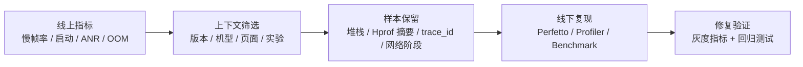

---

title: "APM 全景图与分类体系"
chapter: "19"
section: "19.01"
drafted_date: "2026-04-24"
drafted_by: "codex"
applicable_versions: "Android 8 (API 26) - Android 17 (API 37)"
last_verified: "2026-04-25"
last_verified_against: "Android Developers JankStats / FrameMetrics / ApplicationExitInfo / ProfilingManager docs, Firebase docs, GitHub upstream READMEs, External Review 2026-04-25"
confidence: medium
tags: [apm]
related_chapters: ["19.0"]
sources:
  - type: official
    path: "https://developer.android.com/topic/performance"
  - type: official
    path: "https://developer.android.com/reference/androidx/metrics/performance/JankStats"
  - type: official
    path: "https://developer.android.com/reference/android/view/FrameMetrics"
  - type: official
    path: "https://developer.android.com/reference/android/app/ApplicationExitInfo"
  - type: official
    path: "https://developer.android.com/reference/android/os/ProfilingManager"
  - type: official
    path: "https://firebase.google.com/docs/perf-mon"
  - type: blog
    path: "https://github.com/Tencent/matrix"
  - type: blog
    path: "https://github.com/KwaiAppTeam/KOOM"
  - type: blog
    path: "https://github.com/bytedance/btrace"
  - type: blog
    path: "https://github.com/measure-sh/measure"
task2b_result: fixed
last_task2b_at: "2026-05-22T11:21:56+08:00"
last_task6_audit: "2026-06-13"
last_task9_audit: "2026-06-15"
last_task9_audit_at: "2026-06-15T03:20:00+08:00"
last_task9_audit_log: "logs/deep-review/2026-06-15-03-audit.md"
status: finalized
task9_state: reviewed
task9_result: auto-fixed
task2b_state: fixed
pipeline_stage: ready-to-publish
task9_reviewed_date: "2026-05-22"
task9_reviewed_by: openclaw-task9
last_task9_at: "2026-06-15T03:20:00+08:00"
last_task9_review_log: "logs/deep-review/2026-05-22-11-deep-review.md"
task9_review_notes: "2026-05-22 Task9 re-review: pass-tech-review。P0/P1=0；ApplicationExitInfo reason 版本边界与 AppExitInfoTracker 消息路径已修正；queue 无 pending，Task6 已通过，自动晋升 finalized。 2026-06-15 Task9 idle audit: AUTO-FIX source anchor boundary; AppExitInfoTracker / ProcessList / ApplicationExitInfo references pinned from AOSP mainline/android-15 note to android-16.0.0_r1 after direct source verification; P0/P1=0, Task6 revisiting."
last_task9_autofix_at: "2026-06-15"
reviewed_date: "2026-05-22"
reviewed_by: "openclaw-task6"
task6_state: reviewed
task6_result: pass-light-edit
last_task6_at: "2026-06-15T04:09:51+08:00"
last_task6_review_log: logs/review/2026-06-15-04-review.md
review_notes: "2026-05-21 task9 idle audit: needs-rework。P0：AppExitInfoTracker 源码位置写错；ApplicationExitInfo reason 常量值错位，写入 queue 条目 task9-audit-20260521-19.01-appexitinfo-constants-source。2026-05-21 task2b rework: AppExitInfoTracker 源码位置从 ProcessList 内部类修正为顶层类 AppExitInfoTracker.java；reason 常量按 AOSP ApplicationExitInfo.java 修正（SIGNALED=2, LOW_MEMORY=3, CRASH=4, CRASH_NATIVE=5, ANR=6 等）；消息表同步修正；删除不存在的 REASON_PROCESS_ENTRY_NULL。2026-05-22 Task6 re-review: L1/L2 pass-light-edit，修正 frontmatter 重复 key 与术语表达；Task9 P1 queue 已存在，保持 task2b_pending。 2026-06-15 Task6 revisiting review: pass-light-edit。L1 小修 0 处。无 L3/L4 回炉项。task9_result=auto-fixed (P0/P1=0), queue 无 pending, 自动晋升 finalized。"
finalized_date: 2026-06-15
finalized_by: openclaw-task6
auto_promoted_date: 2026-06-15
auto_promoted_by: openclaw-task6
last_deepseek_polish_at: 2026-05-26
deepseek_polish_state: done
task6_reviewed_date: 2026-06-15
task6_reviewed_by: openclaw-task6
---

# APM 全景图与分类体系

<!-- outline-start -->
## 本节要点大纲

### 锚点（必须覆盖）

- 🔹 [定位] 说明 APM 解决线上可见性，不替代 Perfetto、Android Studio Profiler、simpleperf、heap dump；补一个线上慢帧或 OOM 样本从发现到定位的例子。
- 🔹 [分类] 把客户端 APM、官方指标 SDK、线下研发工具、Benchmark 工具按采集位置、使用阶段、输出数据、工程成本做成对照表。
- 🔹 [数据模型] 展开指标、样本、trace、上下文四类证据；每类至少写 3 个字段例子和一个误用场景。
- 🔹 [证据路径] 写清从指标异常到样本筛选，再到 trace / dump / report 复核的排查路径；避免只停留在工具清单。
- 🔹 [采集方式] 比较 Looper、Choreographer、FrameMetrics、字节码插桩、native hook、系统 profiling 的成本、版本边界和适用问题。
- 🔹 [工具边界] 给出“什么时候只用 APM 不够”的判断表，包括 CPU 争抢、Binder 卡住、I/O 等待、GPU 阻塞、Java / native 内存泄漏。
- 🔹 [选型框架] 按团队已有平台、发版节奏、隐私要求、低端设备比例、专项问题类型，推导应该优先接入哪些工具。
- 🔹 [数据合同] 明确 event 名称、维度、单位、采样、脱敏、保留周期、trace id / session id 关系；提供一份最小字段模板。
- 🔹 [线上策略] 说明灰度开关、采样率、磁盘缓存、上传失败重试、端侧降级和服务端聚合对结论可信度的影响。
- 🔹 [章节关系] 交代本章后续各节的分工，让读者知道 Matrix、KOOM、JankStats、Firebase、PerfDog、Benchmark 分别回答哪类问题。

### 扩展（可选深入）

- 🔸 画一张“端侧采集 -> 本地缓冲 -> 上传 -> 服务端聚合 -> 告警/查询 -> 专项诊断”的架构图。
- 🔸 加一份 APM 数据 schema 示例，覆盖启动、慢帧、ANR、OOM、I/O、网络请求。
- 🔸 增加一张“工具选择速查表”，按问题类型映射到推荐工具和后续验证方式。
- 🔸 补充隐私与合规检查项，特别是 URL、文件路径、日志片段、用户标识、Hprof 摘要。
- 🔸 对所有 Android 官方 API 和开源项目状态做 L1/L2 核对，过期项目要明确写边界。

### 流水线加工要求

- 每个锚点至少补一个判断依据和一个边界条件，不要只扩写定义。
- 表格优先承担比较信息，代码块优先展示字段、配置或伪数据，不写装饰性代码。
- 所有版本、API、项目状态必须能追溯到 front matter 的 sources 或新增来源。

### OpenClaw 加工指引

> **锚点**是最低覆盖要求，加工时必须逐条落实并标注验证结果。
> **扩展**视素材丰富程度选择性深入。
> 如果从 Obsidian 素材或 AOSP 源码中发现大纲未列出但与本节强相关的知识点，
> 可**就地插入**最相关的锚点之后，并用 `[自动发现]` 标注，方便后续 review。
> 锚点内容需 L1/L2 验证，扩展内容至少 L2 验证，自动发现内容至少标注来源。
<!-- outline-end -->

## APM 先解决线上可见性

APM 在 Android 性能体系里的作用是把线上设备里的性能信号采回来，让团队知道哪类问题正在发生、影响多少用户、是否需要进入修复队列。它不替代 Perfetto、Android Studio Profiler、simpleperf 这类线下诊断工具，也不保证单靠 SDK 上报就能还原所有现场。

APM 负责发现样本和分布，Perfetto 负责还原一次具体慢帧、ANR、启动慢或内存异常的细节。

排查路径可以这样展开：灰度版本看板发现 `oom_rate` 在 Android 13/14 的低内存机型上抬升，按页面聚合后集中在图片编辑页。APM 拉到一条样本，主事件里有 `version`、`device`、`page`、`session_id`、`heap_used_ratio`，附件里有 Hprof 摘要：多个已销毁的 `ImageEditActivity` 仍被静态 `Handler` 消息引用。

服务端用样本里的 Mapping UUID 对上当前构建，把混淆栈还原到业务类名。线下再用同版本 Debug 包打开 Profiler / LeakCanary 复现，修掉 `Handler` 持有 `Activity` 的引用后，灰度观察 `oom_rate` 和同签名样本数是否回落。

## 四类能力不要混在一起选

Android 性能监控工具可以按采集位置和使用场景分成四类：

| 层次 | 代表工具 | 最低 API / 精度边界 | 主要回答的问题 | 常见使用位置 |
|---|---|---|---|---|
| 客户端 APM 框架 | Matrix、KOOM、btrace、Measure | 多数依赖应用自身 minSdk、native ABI 和构建链兼容性 | 线上发生了什么，能不能保留现场 | Release 或灰度包 |
| 官方指标 SDK | JankStats、FrameMetrics、ApplicationExitInfo、Tracing SDK、ProfilingManager | JankStats API 16+，API 24+ 改走 FrameMetrics，API 31+ 可拿到 `frameOverrunNanos`；FrameMetrics API 24+；ApplicationExitInfo API 30+；Tracing SDK 更偏应用侧自定义 trace；ProfilingManager API 35+ | 系统和 AndroidX 愿意给哪些稳定信号 | Release、测试、专项诊断 |
| 线下研发工具 | LeakCanary、DoKit、BlockCanary、AndroidGodEye | 更依赖 Debug 构建、测试设备和人工操作 | 开发和测试阶段怎样更快发现问题 | Debug、QA、实验室 |
| Benchmark 工具 | Macrobenchmark、Geekbench、PerfDog、AndroBench | Macrobenchmark 依赖 Jetpack 与测试基建；外部工具还受设备与测试台约束 | 设备、版本或代码改动前后差异是多少 | 自动化、实验室、竞品分析 |

同样写着“性能监控”，这四类工具的工程含义差别很大。客户端 APM 关心采样、上报、隐私、服务端存储；官方 SDK 关心系统版本、API floor 和指标口径；线下工具关心诊断效率；Benchmark 关心可重复性和测试条件。

官方信号不能被写成同一批等价能力。JankStats 的 API floor 最低，但精度会随系统版本变化：API 16-23 依赖 `OnPreDrawListener`，API 24-30 依赖 `FrameMetrics`，API 31+ 才能补上 `frameOverrunNanos` 这类更接近 deadline 超时的信息。FrameMetrics 只从 API 24 起可用，ApplicationExitInfo 从 API 30 起给进程退出原因，ProfilingManager 则是 API 35 之后的按需 profiling 入口。

`ActivityManager.getHistoricalProcessExitReasons()` 是到 `system_server` 的查询，不放在冷启动主线程同步调用。更稳的做法是在后台线程读取退出记录，带上 `session_id`、`process_name` 和 build 标识，再和当前版本指标关联。

## 一个完整线上体系至少有四类数据

线上性能治理通常从四类数据开始：

- **指标 metrics**：`startup_p95_ms`、`jank_frame_rate`、`oom_rate`、`anr_rate` 等聚合值，用来判断版本是否变差。误用场景：只看 P95 抬升就直接定位到某个函数。
- **样本 sample**：`main_thread_stack`、`hprof_summary_id`、`leak_signature`、`network_phase_cost` 等单次现场，用来定位问题方向。误用场景：把未按采样率归一化的样本数当成真实发生率。
- **Trace**：`trace_id`、`time_range_ms`、`atrace_categories`、业务 `slice` 名等时间线数据，用来复核线程调度、Binder、I/O 和渲染阶段。误用场景：把大 trace 当成高频事件上传，导致端侧磁盘和网络成本失控。
- **上下文**：App 版本、build number、系统版本、机型、ABI、页面、实验分组、`session_id` 与 `trace_id` 的关联关系，用来判断影响范围和复现入口。误用场景：页面名或实验名不稳定，导致同一问题被拆成多个统计桶。

只采指标，问题会停在“知道差了但不知道为什么”。只采样本，样本会很散，无法判断优先级。只采 trace，成本会很快失控。只采上下文，没有稳定指标，报警口径会变成业务猜测。

## 工具边界优先于功能清单

选 APM 时不该只看功能表。应该检查：

- **采集路径**：系统回调、字节码插桩、PLT Hook、Inline Hook、JVMTI、Perfetto SDK 分别带来不同兼容成本。
- **运行开销**：帧级回调、主线程抓栈、Hprof dump、native 分配追踪都可能影响用户侧性能，必须有采样和限流。
- **上报策略**：异常样本、周期指标、长 trace、Hprof 摘要不能用同一套上传策略，否则要么丢现场，要么成本失控。
- **隐私边界**：URL、请求头、日志、截图、用户标识、文件路径都可能进入合规审查范围。
- **可回查性**：一次上报能不能关联页面、版本、用户操作、实验分组和日志，是平台是否能用的分水岭。

这些检查项会直接决定工具能不能进线上包。一个 Debug 工具功能再多，也不能默认进入 Release；一个线上 SDK 再成熟，也不能省掉灰度、采样和开关。

## 和 Perfetto、Profiler 的分工

Perfetto 和 Android Studio Profiler 的优势是深，APM 的优势是广。

Perfetto 适合回答这类问题：

- 某一次滑动为什么掉帧
- 主线程和 RenderThread 的时间花在哪里
- Binder 对端进程是否拖慢调用
- CPU 调度、I/O、GPU、SurfaceFlinger 是否参与了问题

APM 适合回答另一类问题：

- 哪个版本的慢帧率开始抬升
- 哪些机型最容易 OOM
- 哪个页面的启动样本最差
- 线上 ANR 样本是否集中在同一类堆栈

实战里两者会连起来用：APM 先把问题样本和分布筛出来，再用 Perfetto、Profiler、simpleperf 在线下还原和验证。APM 给入口，诊断工具给证据。

## 使用建议

刚开始搭体系时，不要一次接满所有 SDK。按 API floor 往上加：

1. 用 Android Vitals、Crash 平台、基础启动埋点建立版本级趋势。
2. 先接 JankStats 作为跨版本帧信号；在 Android 8+ 设备上，再配 FrameMetrics 做窗口级拆解。
3. Android 11+ 再补 ApplicationExitInfo，把 ANR、LMK、native crash 和用户主动杀进程分开看。
4. Android 15+ 再考虑 ProfilingManager，用它按需拉 system trace、heap dump 或 heap profile。
5. 再选一到两个专项客户端工具补现场，比如 Matrix 看卡顿和 IO，KOOM 看内存，btrace 看方法级 trace。
6. 再决定是否接 Measure、Firebase、Sentry、APMPlus 这类平台方案，或自建数据管道。

接一个库不代表 APM 体系已经完成。它是一套持续运行的数据系统：采集要克制，指标要稳定，样本要可回查，结论要能被线下工具验证。

## 书稿级分析框架

后面每个工具小节都按同一套问题展开。读者可以把它当成 APM 工具评审模板：

| 问题 | 要看的内容 | 为什么不能省 |
|---|---|---|
| 它采什么 | 帧、启动、ANR、内存、I/O、网络、trace、benchmark 分数 | 不同信号解决的问题不同，混在一起会误判 |
| 它怎么采 | 系统 API、Looper 监听、字节码插桩、Hook、Perfetto、adb、外部采样 | 采集方式决定兼容性、开销和失败场景 |
| 它在哪跑 | Release、灰度、Debug、QA、CI、实验室、外部设备 | 运行位置决定是否需要隐私、采样和远程开关 |
| 它输出什么 | 聚合指标、单点样本、trace 文件、Hprof、CSV、云端看板 | 输出形态决定平台怎么消费 |
| 它不能回答什么 | 根因、系统调度、业务语义、服务端耗时、设备能力 | 边界写清楚，读者才知道下一步该找哪个工具 |

这一章的工具很多，但判断逻辑不会变。工具名会更新，系统 API 会变化，底层采集路线相对稳定。

## 指标、样本、trace、上下文是四种不同证据

做线上性能治理时，要把四种证据分开：

- **指标**：适合看趋势和排序，例如慢帧率、启动 P95、ANR 率、OOM 率。
- **样本**：适合看单个问题现场，例如一次 ANR 堆栈、一次主线程 block 调用栈、一次泄漏引用链。
- **Trace**：适合还原时间线，例如 Perfetto 里的线程调度、Binder、I/O、渲染阶段和业务 trace slice。
- **上下文**：适合限定影响范围，例如版本、机型、页面、实验分组、渠道和用户操作路径。

这四类证据不能互相替代。指标能告诉你“这个版本变差了”，但不能告诉你哪一行代码慢。样本能告诉你“这次卡在这里”，但不能说明影响面。trace 能还原一次现场，但没有采样体系时，团队不知道该抓哪条路径。上下文能缩小排查范围，但没有稳定指标和样本时，只能做粗略猜测。

一个能用的 APM 体系通常长这样：

在这条路径里，APM 负责从 A 推到 C，Perfetto、Profiler、Benchmark 负责从 C 推到 E。把这些步骤混成“接个性能 SDK”会让体系失去可解释性。

## 常见采集路线的工程代价

| 路线 | 代表工具 | 能拿到什么 | 主要代价 |
|---|---|---|---|
| 系统 API | JankStats（API 16+；API 24+/31+ 精度逐级变好）、FrameMetrics（API 24+）、ApplicationExitInfo（API 30+）、ProfilingManager（API 35+） | 平台愿意暴露的稳定信号 | 口径受系统版本限制，细节不一定够 |
| Looper / Choreographer 监听 | BlockCanary、Matrix Trace Canary、轻量自研 APM | 主线程消息耗时、帧间隔、慢帧样本 | 难以覆盖 RenderThread、GPU、系统调度 |
| 字节码插桩 | Matrix、Rabbit、部分 ArgusAPM 能力 | 方法耗时、调用路径、启动节点 | 构建链复杂，AGP / R8 / 混淆适配成本高 |
| PLT / native Hook | Matrix IO Canary、KOOM、部分内存工具 | I/O、malloc/free、pthread 生命周期 | ABI、linker namespace、ROM 差异、符号化成本 |
| Perfetto / trace 文件 | btrace、ProfilingManager、Perfetto SDK | 应用和系统时间线 | 文件大，不适合高频上报 |
| 外部采样 | PerfDog、SoloPi、Emmagee | FPS、CPU、内存、功耗、网络等外部指标 | 适合测试，不等于真实线上用户数据 |

这张表比功能清单更适合做技术评审。只要知道一个工具依赖哪条路线，就能预判它的兼容性、开销、灰度策略和故障模式。

## 线上采样要先写清数据合同

APM SDK 上线前，团队应该先写数据合同。至少包括：

- **事件名**：例如 `jank_frame_batch`、`startup_sample`、`anr_trace`、`io_issue`。
- **稳定维度**：App 版本、build number、Mapping UUID、Native Build-ID、系统版本、机型、ABI、进程名、页面、前后台。
- **指标字段**：耗时单位、计数窗口、分位口径、阈值来源。
- **样本字段**：堆栈、线程名、文件路径哈希、trace id、session id、Hprof 摘要 id、leak signature。
- **隐私策略**：URL 是否脱敏、文件路径是否哈希、日志是否裁剪、用户标识如何匿名化。
- **采样策略**：全量、按用户、按会话、按异常、按远程配置。
- **保留周期**：指标、样本、trace、Hprof 摘要的存储期限和删除策略。

Java/Kotlin 堆栈必须带 Mapping UUID 或等价构建标识，Native 栈必须带 ELF Build-ID。缺少这些标识时，服务端无法把 `a.b.c.a()` 或裸地址还原到源码位置，样本只能做粗略聚合。

没有数据合同，客户端和服务端会各自解释字段。常见结果是：平台能画图，但每个图都难以解释；问题能上报，但每条样本都缺定位所需的上下文。

## 书稿中的判断边界

APM 工具没有单一最优解。Matrix 适合客户端采集框架，KOOM 适合内存专项，JankStats 适合帧级基础信号，Firebase / Measure / Sentry / APMPlus 适合平台化，PerfDog 适合外部测试，Benchmark 适合可重复验证。

每个工具小节的正文里都会写清边界。对照这三个问题来读：

1. 这个工具能放在体系里的哪一层。
2. 它产出的数据能支撑哪类判断。
3. 问题继续往下查时，要接哪个工具或哪条分析路径。

<!-- AIW-源码调研-2026-04-25 -->
## 补充：AppExitInfoTracker 内部机制（源码级）

以下内容基于 AOSP 源码调研，补充到 §19.01 作为 AppExitInfoTracker 的实现细节参考。

### AppExitInfoTracker 在 AOSP 中的位置

`AppExitInfoTracker` 是 `services/core/java/com/android/server/am/AppExitInfoTracker.java` 中的顶层 `public final` 类，由 `ActivityManagerService` 实例化，`ProcessList` 持有并创建 `mAppExitInfoTracker` 字段（`ProcessList.java` L525, AOSP android-16.0.0_r1）。

它在系统侧维护每个包名的进程退出记录环形缓冲区。`KillHandler` 处理的消息分为基础记录来源和外部修正来源两层：

**基础记录来源**（`AppExitInfoTracker` 内部 `KillHandler` 处理的消息）：

| 消息类型 | 来源 | 创建/修正的 exitInfo.reason |
|---|---|---|
| `MSG_PROC_DIED` | 进程死亡通知（`scheduleNoteProcessDied()` → `handleNoteProcessDiedLocked()`） | 根据死亡原因写入基础 reason |
| `MSG_APP_KILL` | AMS 主动杀进程（`scheduleNoteAppKill()` → `handleNoteAppKillLocked()`） | 记录 AMS 主动 kill 的 reason/subreason |
| `MSG_APP_RECOVERABLE_CRASH` | 可恢复 crash 通知 | 记录可恢复 crash 事件 |
| `MSG_STATSD_LOG` | 统计日志记录 | 辅助记录，不直接决定 reason |

**外部修正来源**（对基础记录的 reason 做补充修正）：

| 消息类型 | 来源 | 修正说明 |
|---|---|---|
| `MSG_LMKD_PROC_KILLED` | lmkd 杀进程后通知 AMS | 将 reason 修正为 `REASON_LOW_MEMORY (3)` |
| `MSG_CHILD_PROC_DIED` | Zygote 感知子进程异常退出（SIGCHLD/SIGKILL） | 修正为 `REASON_SIGNALED (2)` / `REASON_CRASH_NATIVE (5)` |

`handleNoteProcessDiedLocked()` 和 `handleNoteAppKillLocked()` 是核心处理函数；`updateExistingExitInfoRecordLocked()` 会在已有记录上做 reason 修正。Java crash（`REASON_CRASH(4)`）、ANR（`REASON_ANR(6)`）、用户/系统 kill（`REASON_USER_REQUESTED(10)`）等退出记录通过基础路径进入历史列表，lmkd/zygote 作为外部来源补充和修正 reason 值。

应用侧通过 `ActivityManager.getHistoricalProcessExitReasons()` 查询，该 API 底层调用 `ActivityManagerService.getHistoricalProcessExitReasons()`，后者从 `AppExitInfoTracker` 读取。

### ApplicationExitInfo 关键字段（API 30+）

| 方法 | 说明 | 版本 |
|---|---|---|
| `getReason()` | 返回值：`REASON_SIGNALED(2)` `REASON_LOW_MEMORY(3)` `REASON_CRASH(4)` `REASON_CRASH_NATIVE(5)` `REASON_ANR(6)` `REASON_USER_REQUESTED(10)` `REASON_OTHER(13)`；API 33+ 新增 `REASON_FREEZER(14)`；API 34+ 新增 `REASON_PACKAGE_STATE_CHANGE(15)` `REASON_PACKAGE_UPDATED(16)` | API 30 |
| `getDescription()` | 人类可读退出描述字符串 | API 30 |
| `getTimestamp()` | 退出时间戳（毫秒） | API 30 |
| `getTraceInputStream()` | 获取 ANR/native crash 的 trace 流，仅 `REASON_ANR` / native crash 有效；`REASON_LOW_MEMORY` 无 trace | API 30 |
| `getRss()` | 退出前最近采样 RSS（KB），采样值非精确时刻 | API 30 |
| `getImportance()` | 退出时进程 importance 级别 | API 30 |

### 关键设计原则

- circular buffer 持久化到磁盘，重启后可查询
- 不支持 `USER_ALL` / `USER_CURRENT` 作为 userId 参数
- `getTraceInputStream()` 对 `REASON_LOW_MEMORY` 返回 null（无 trace）
- `REASON_CRASH` 对应 Java 未捕获异常；`REASON_CRASH_NATIVE` 对应 native crash（SIGSEGV/SIGABRT 等）；`REASON_ANR` 对应 Application Not Responding

---

**调研来源**：
- `services/core/java/com/android/server/am/AppExitInfoTracker.java` (AOSP android-16.0.0_r1) — 顶层类，进程退出记录管理与持久化
- `services/core/java/com/android/server/am/ProcessList.java` (AOSP android-16.0.0_r1) — 持有 `mAppExitInfoTracker` 字段（L525）
- `core/java/android/app/ApplicationExitInfo.java` (AOSP android-16.0.0_r1 / API 30+) — 应用层 API，reason 常量定义
- `github.com/KwaiAppTeam/KOOM` — koom-java-leak 模块 fork dump HPROF 机制

<!-- AIW-源码调研-2026-04-25 -->

## 延伸阅读

### 字节跳动 Android/移动端 性能·功耗·稳定性 全栈技术方案深度调研
- 来源：/Users/gracker/Library/Mobile Documents/iCloud~md~obsidian/Documents/Obsidian/DeepResearch/字节跳动 Android:移动端 性能·功耗·稳定性 全栈技术方案深度调研.md
- 类型：DeepResearch 调研结果
- 摘要：系统梳理字节跳动开源性能工具链（btrace 3.0 同步抓栈、ByteHook/ShadowHook hook 三件套、Raphael Native 泄漏检测）与闭源 APM 平台（Slardar/MDAP/APMPlus）的架构原理。覆盖流畅度三级防劣化体系、ANR 信号捕获与消息调度图还原、功耗模块化归因模型、端侧 AI（豆包手机助手 GUI Agent 端云协同架构）等核心方案，包含大量源码级实现细节。
- 注入时间：2026-06-02
- 价值：字节系 APM 工具链的完整技术栈剖析，btrace 3.0 同步抓栈原理与稳定性的信号归因方法论对 AIW APM 章节有直接补充价值
