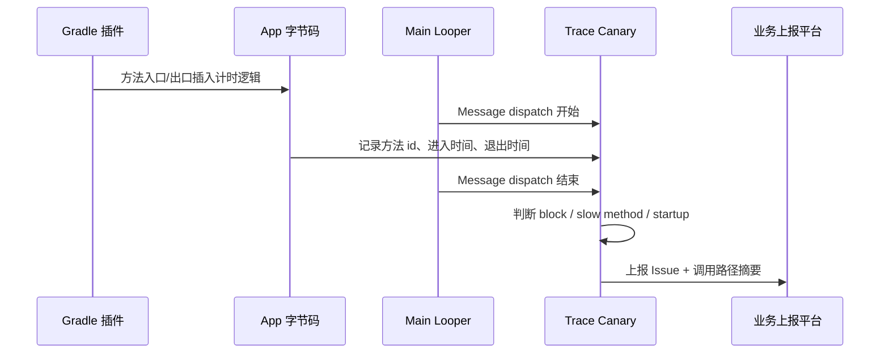

# Tencent Matrix

<!-- outline-start -->
## 本节要点大纲

### 锚点（必须覆盖）

- 🔹 [定位] 说明 Matrix 是客户端采集框架，不是完整 SaaS；写清它需要接入方补齐上传、聚合、告警和查询能力。
- 🔹 [模块地图] 按 Trace Canary、IO Canary、Resource Canary、SQLite Lint、Battery Canary、MemGuard / Memory Hook 拆功能、数据来源和适用问题。
- 🔹 [构建接入] 展开 Gradle 插件、初始化配置、进程过滤、远程开关、采样率；必须写 AGP 8.x 后 Transform 路径的兼容风险。
- 🔹 [Trace Canary] 说明字节码插桩、方法 id、调用栈、Looper 消息、FPS / startup report 的关系；补一份最小配置或伪代码。
- 🔹 [报告入库] 设计 Matrix report schema，包含 issue type、process、scene、thread、cost、stack、method map、sample id、version。
- 🔹 [IO Canary] 解释 native I/O hook 能补哪些文件信息；至少覆盖主线程 I/O、小 buffer、重复读、Closeable 泄漏和 SQLite 访问。
- 🔹 [Resource Canary] 区分 Activity 泄漏、Bitmap 重复和 LeakCanary 本地诊断；说明线上 dump 成本和误报过滤。
- 🔹 [Battery / native] 给 Battery Canary、MemGuard、pthread hook 的使用前提和风险边界，避免写成默认打开的功能清单。
- 🔹 [联合诊断] 给出 Matrix report 跳到 Perfetto / heap dump / 日志的操作路径，说明二者证据如何互相校验。
- 🔹 [上线检查] 覆盖多进程、mapping、method map、磁盘配额、上传失败、隐私脱敏、开关回滚和低端机开销。

### 扩展（可选深入）

- 🔸 增加 Matrix 客户端到服务端的事件流图，标出 plugin、issue、report callback、uploader、backend。
- 🔸 补一个 Trace Canary 启动慢或慢函数案例，要求有报告字段、判断过程和下一步 Perfetto 验证。
- 🔸 补一个 IO Canary 案例，要求从文件路径、线程名、调用栈推导修复方向。
- 🔸 对 Matrix upstream README、wiki、AGP 兼容资料做核对；不确定处标注版本范围。
- 🔸 增加与 KOOM、JankStats、FrameMetrics、btrace 的分工表，避免章节之间重复。

### 流水线加工要求

- 所有 “Matrix 能做什么” 都要跟 “数据从哪里来、报告怎么读、什么情况下不可信” 放在一起写。
- 涉及 hook、插桩、native 模块时必须写开销和回滚策略。
- 示例里的字段名要稳定，便于后续服务端章节复用。

### OpenClaw 加工指引

> **锚点**是最低覆盖要求，加工时必须逐条落实并标注验证结果。
> **扩展**视素材丰富程度选择性深入。
> 如果从 Obsidian 素材或 AOSP 源码中发现大纲未列出但与本节强相关的知识点，
> 可**就地插入**最相关的锚点之后，并用 `[自动发现]` 标注，方便后续 review。
> 锚点内容需 L1/L2 验证，扩展内容至少 L2 验证，自动发现内容至少标注来源。
<!-- outline-end -->

## Matrix 适合做客户端侧的监控框架

Matrix 是微信团队开源的插件式 APM 框架，Android 侧覆盖 APK 检查、卡顿与慢函数、启动耗时、内存泄漏、文件 I/O、SQLite、耗电、native memory leak 检测、MemGuard、pthread hook 等模块。它最适合的场景，是团队已经有上报和分析平台，需要一个客户端 SDK 把常见性能现场采回来。

它不是一个“接入即有完整平台”的 SaaS。Matrix 更偏客户端采集框架，数据格式、采样、上传、聚合、报警和工单流转，都要由接入方自己接好。

## 模块怎么分

Matrix Android 侧常见模块可以按问题类型理解：

| 模块 | 解决的问题 | 主要采集方式 |
|---|---|---|
| Trace Canary | 卡顿、ANR、启动、慢函数、FPS | 字节码插桩 + Looper / Choreographer 监听 |
| Resource Canary | Activity 泄漏、重复 Bitmap | 弱引用观察 + Hprof 裁剪分析 |
| IO Canary | 主线程 I/O、小 buffer、重复读、Closeable 泄漏 | native I/O Hook + Java 层资源检查 |
| SQLite Lint | SQLite 语句质量和风险 | SQLite 官方工具能力封装 |
| Battery Canary | 线程、WakeLock、Alarm、GPS、Wi-Fi、蓝牙等耗电行为 | 系统接口采样与行为监控 |
| Memory Hook | native 内存泄漏候选 | PLT Hook + alloc/free backtrace |
| MemGuard | heap overlap、use-after-free、double free | GWP-ASan 相关能力 |
| Pthread Hook | Java / native 线程泄漏、线程栈空间修剪 | PLT Hook + pthread 生命周期拦截 |

这个分法比“Matrix 很全”更有用。Trace Canary 和 IO Canary 适合线上卡顿现场，Resource Canary 关注 Activity leak 与 duplicate bitmap，Memory Hook 和 MemGuard 则分别覆盖 native leak 与 native heap 错误。APK Checker 更适合 CI 或发版前检查。

Battery Canary、Memory Hook、MemGuard、Pthread Hook 都不适合无差别开启。Battery Canary 会接触 WakeLock、Alarm、线程和系统服务调用，定制 ROM 上的行为差异会放大兼容风险；Memory Hook / Pthread Hook 依赖 native hook，系统库、架构和安全策略变化都可能引入 crash。生产环境更适合云端开关、低采样灰度、按机型放量，并保留一键关闭能力。

## Trace Canary 的工程边界

Trace Canary 最容易被误解。它在编译期对目标方法插入入口和出口记录，再由运行时逻辑把方法耗时、调用栈和 Looper 消息耗时组织成报告。

这条路线有两个好处：

- 方法级耗时来自插桩记录，比单纯定时抓栈更容易还原业务调用路径。
- 可以通过包名、黑名单、白名单控制插桩范围，避免全项目方法都进监控。

代价同样明确：

- 构建链变复杂，AGP 升级要重新确认插件适配情况。
- 混淆后需要稳定的 mapping / method map 关系，否则线上报告难以阅读。
- 插桩范围过大时，方法记录本身会产生额外开销。

AGP 8.0 已移除 Transform API 和 `com.android.build.api.transform` 包，仍调用 `android.registerTransform` 的 Matrix Trace 插件会在配置阶段失败，典型错误是 `API 'android.registerTransform' is removed`。接入 AGP 8+ 项目前，先看所用官方版本、内部分支或社区 fork 的插件源码：如果还注册 `MatrixTraceTransform`，可选方案有三类：固定在 AGP 7.x；使用已经迁移到 Android Components Instrumentation API 的分支；把插桩迁到 `androidComponents.onVariants { variant.instrumentation.transformClassesWith(...) }`。

迁移时要保留旧 Transform 里的三项能力：按包名和黑白名单过滤类，给被插桩方法分配稳定整数 id，输出与混淆 mapping 同版本保存的 `methodMapping.txt`。线上 `Issue` payload 通常只适合携带 method id、栈摘要和耗时；服务端必须用对应构建产物的 `methodMapping.txt` 反解方法名，否则慢函数报告无法聚合到源码位置。

下面这段是 AGP 8+ 注册位置示意，`MatrixTraceClassVisitorFactory` 代表迁移后的 ASM visitor 工厂名，实际项目要替换为自己的实现类：

```kotlin
androidComponents {
    onVariants { variant ->
        variant.instrumentation.transformClassesWith(
            MatrixTraceClassVisitorFactory::class.java,
            InstrumentationScope.PROJECT
        ) { params ->
            params.traceConfig.set(traceConfigFile)
            params.methodMapOutput.set(methodMapFile)
        }
    }
}
```

这段只说明注册入口。迁移时还要把原 `MatrixTraceTransform` 中的方法过滤、id 分配、method map 输出和增量构建处理搬到新的 visitor 工厂里。

## IO Canary 补的是 Perfetto 看不到的文件信息

Perfetto 能看到线程进入 D 状态、主线程被 I/O 拖住，也能看到调度和系统调用相关线索，但它通常不会直接告诉你“哪个业务文件被读了几次、buffer 多大、是否忘了 close”。IO Canary 补的就是这块应用层上下文。

典型报告应该回答三件事：

- 哪个线程触发文件读写，是否发生在主线程。
- 哪个文件路径产生高耗时或重复读取。
- 单次读写 buffer 是否过小，是否存在 Closeable 泄漏。

线上使用时要处理路径脱敏。文件名、用户目录、业务缓存 key 都可能包含敏感信息，上报前应该做裁剪或哈希。

## Resource Canary 和 LeakCanary 的分工

Resource Canary 通过弱引用观察 Activity 销毁后的存活情况，再在需要时 dump 和裁剪 Hprof。Matrix README 公开写明的两类能力是 Activity leak 和 duplicate bitmap，线上更适合把它当成“某类页面反复泄漏”或“同图被重复解码”的趋势探针。

如果排查目标是 Fragment 泄漏、View 引用链或更完整的 leak trace，通常还要交给 LeakCanary 或团队自己的 lifecycle watcher。LeakCanary 更适合开发和测试阶段。它会在本地展示完整 leak trace，帮助开发者直接修代码。两者不冲突：线上用 Resource Canary 发现 Activity leak / duplicate bitmap 分布，本地用 LeakCanary 还原引用链。

## 接入建议

Matrix 适合已经有一定工程能力的团队。接入前至少确认四件事：

1. 当前 AGP、Gradle、Kotlin、R8 版本是否被所选 Matrix 版本支持。
2. Release 包是否只打开必要模块，Debug 包是否保留更完整诊断能力。
3. 上报 schema 是否能承载页面、线程、堆栈、文件、版本、机型等字段。
4. 每个模块是否有远程开关、采样率、阈值和灰度策略。

Matrix 的优势是客户端能力完整。它的风险也来自这里：模块一多，采集范围、构建适配和平台消费都会变重。稳妥做法是按问题接入，先让一个模块的数据能被团队稳定使用，再扩到下一类问题。

## 接入结构：插件、配置和上报回调

Matrix Android 的接入模型可以分成三层：

1. Gradle 插件负责在构建阶段处理 Trace Canary 需要的字节码插桩和 method map。
2. App 运行时初始化 Matrix，并按需安装 `TracePlugin`、`ResourcePlugin`、`IOCanaryPlugin` 等模块。
3. `PluginListener` 接收 `Issue`，业务侧把它转换成自己的上报 schema。

代码层面通常会落到这样的结构。下面这段是接入骨架，重点看 `builder.plugin(...)` 的注册顺序和 `onReportIssue()` 的职责分离。`TraceConfig` 细节要按项目所用 Matrix 版本补齐，但不能跳过注册直接 `getPluginByClass(...).start()`。

源码锚点是 `matrix-android-lib/src/main/java/com/tencent/matrix/Matrix.java`：`Matrix.Builder` 公开 `plugin(Plugin)` 和 `pluginListener(PluginListener)`，`build()` 在 listener 为空时补 `DefaultPluginListener`。示例应调用 `pluginListener(...)`，不存在 `patchListener(...)` 这个 Builder API。

```java
public final class MatrixInitializer {
    public static void init(Application app) {
        Matrix.Builder builder = new Matrix.Builder(app);
        builder.pluginListener(new DefaultPluginListener(app) {
            @Override
            public void onReportIssue(Issue issue) {
                super.onReportIssue(issue);
                MatrixReportBridge.enqueue(issue);
            }
        });

        IDynamicConfig dynamicConfig = new DynamicConfigImpl();

        TracePlugin tracePlugin = buildTracePlugin(dynamicConfig); // 示意：补齐 TraceConfig
        IOCanaryPlugin ioCanaryPlugin = new IOCanaryPlugin(
                new IOConfig.Builder()
                        .dynamicConfig(dynamicConfig)
                        .build());

        builder.plugin(tracePlugin);
        builder.plugin(ioCanaryPlugin);

        Matrix.init(builder.build());

        tracePlugin.start();
        ioCanaryPlugin.start();
    }
}
```

实际接入时，顺序是“先构造插件，再 `builder.plugin(...)` 注册，再 `Matrix.init(...)`，再按需 `start()`”。如果少了注册步骤，`getPluginByClass(...)` 拿不到实例，示例就会把读者带到一条不存在的接入路径上。

真实项目还要把远程开关、进程过滤、采样率、Debug / Release 差异放进去。Matrix 模块不应该在所有进程里默认启动，尤其是推送进程、WebView 独立进程、插件进程和短命进程。

## Trace Canary 的时间线

Trace Canary 要解决的主要问题，是把卡顿发生时的主线程执行路径和方法耗时保留下来。一个典型流程如下：



这条路径里有三个容易出错的点：

- method id 必须能还原到混淆后的真实方法，否则线上报告不可读。
- 插桩范围要控制，三方 SDK、生成代码、热路径小函数都可能制造噪声。
- block 阈值要结合业务场景，统一 700ms 只能捕获严重主线程卡顿，抓不到慢帧级别问题。

Trace Canary 更适合抓“大块主线程工作”和“启动阶段长函数”。对 16ms 级别的帧预算，它不是唯一信号源，还要配 JankStats / FrameMetrics。

## Matrix 报告应该怎样入库

Matrix 原始 `Issue` 不能直接当平台事件使用。书稿级工程里，至少要转换出稳定字段：

| 字段 | 说明 |
|---|---|
| `issue_type` | `trace_block`、`slow_method`、`startup`、`io_main_thread`、`activity_leak` 等 |
| `process_name` | 多进程应用必须带进程名 |
| `thread_name` / `tid` | 卡顿、I/O、ANR 样本的线程归因 |
| `page` / `scene` | 当前 Activity、Fragment、路由或业务场景 |
| `duration_ms` | 统一毫秒口径，避免 ns / ms 混用 |
| `stack_signature` | 堆栈或调用路径归一化后的签名，用于聚合 |
| `sample_payload_id` | 大 payload 单独存储，主事件只保存索引 |
| `privacy_level` | 标记是否包含路径、URL、日志、文件名等敏感信息 |

如果缺少 `page` 和 `stack_signature`，Matrix 数据会很快变成“很多样本，但无法排序”。如果缺少 `sample_payload_id`，服务端会被大堆栈、Hprof 摘要和 I/O 明细拖慢。

Trace Canary 慢函数样本入库时，至少要保留 method id、耗时、场景和 method map 版本。下面是服务端事件 schema 示例，字段名按团队平台调整：

```json
{
  "issue_type": "slow_method",
  "process_name": "com.example.app",
  "thread_name": "main",
  "scene": "HomeActivity#onCreate",
  "duration_ms": 1280,
  "stack_signature": "home_startup_load_config",
  "method_ids": [10231, 20488, 30412],
  "method_mapping_version": "app-8.3.0-20260427-release",
  "sample_payload_id": "matrix-trace-20260427-0001"
}
```

读这类样本时，先用 `method_mapping_version` 找到同一包的 `methodMapping.txt`，把 `method_ids` 反解成方法名，再按 `scene` 和 `stack_signature` 聚合同类问题。只有单条 `duration_ms` 时，判断空间很小；同一签名在同版本、同机型或同入口上持续出现，才进入排查。

IO Canary 样本要保留文件类型、线程、次数和 buffer 信息，方便和 Perfetto 的线程状态互证。下面是主线程重复小 buffer 读取的事件 schema 示例：

```json
{
  "issue_type": "io_main_thread",
  "process_name": "com.example.app",
  "thread_name": "main",
  "scene": "ColdStart",
  "path_type": "shared_prefs",
  "path_hash": "sha256:8d31...",
  "op": "read",
  "cost_ms": 86,
  "repeat_count": 42,
  "buffer_size_bytes": 128,
  "sample_payload_id": "matrix-io-20260427-0032"
}
```

这个样本的读法是：`thread_name=main` 和 `scene=ColdStart` 说明它可能影响首屏；`repeat_count=42` 与 `buffer_size_bytes=128` 指向重复小块读取；`path_hash` 保留聚合能力，同时避免把真实文件路径传到平台。

## IO Canary 的分析路径

一次主线程 I/O 上报不要只看“耗时大于阈值”。更稳的排查顺序是：

1. 看线程：是否主线程，是否启动阶段，是否用户交互期间。
2. 看文件：路径属于数据库、SharedPreferences、图片缓存、日志、动态资源还是业务文件。
3. 看次数：一次大文件读取和短时间重复小文件读取是两类问题。
4. 看 buffer：小 buffer 会放大系统调用次数。
5. 看 Perfetto：主线程是否进入 D 状态，I/O 是否和慢帧/启动慢时间窗口重合。

优化动作也要按类型分：

- 启动主线程读配置：改成预加载、异步读取或首屏后加载。
- 重复读同一文件：补内存缓存或合并调用。
- 小 buffer：调整缓冲区，减少 read/write 次数。
- 数据库文件大：回到 SQLite 查询、索引和事务设计。

## Resource Canary 的线上限制

Resource Canary 的 Activity 泄漏检测依赖生命周期和弱引用观察，报告“销毁后仍存活”这件事。线上要防两个误判：

- Activity 刚销毁后短时间仍被系统或异步任务持有，过早判泄漏会误报。
- 某些页面在转场、配置变化、Dialog、Fragment manager 状态恢复期间会出现短暂保留。

所以线上策略一般不会“第一次没回收就上报”。更合理的策略是多轮 GC 后仍然存活，再结合页面、版本、出现次数、引用链摘要判断是否进入修复队列。

Hprof 处理也要克制。完整 Hprof 体积大，还可能包含业务对象和用户数据。生产环境更适合上传裁剪后的引用链摘要、对象类型、页面和签名，把完整文件留在内部灰度或本地复现。

## 和 Perfetto 的联合诊断

Matrix 能提供应用侧现场，Perfetto 能提供系统时间线。两者联合时，先用 Matrix 定位样本窗口，再用 Perfetto 复现同一路径：

- Matrix 报慢函数：Perfetto 看这段时间线程是否在 CPU 上运行。
- Matrix 报主线程 I/O：Perfetto 看线程状态是否 D，是否有其他系统负载。
- Matrix 报启动慢：Perfetto 看 Zygote fork、bindApplication、Activity launch、首帧路径是否对应。
- Matrix 报 ANR：Perfetto 看 Binder 对端、锁等待、CPU 饥饿和系统负载。

单看 Matrix 容易把“方法栈停在哪里”当作“方法耗时原因”。单看 Perfetto 又缺少业务语义。两者合在一起，结论才更稳。

## 上线检查清单

Matrix 进入 Release 前，至少跑完这组检查：

- AGP、Gradle、R8、Kotlin、multidex、动态特性模块都能构建通过。
- 插桩后方法数、包体积、启动耗时没有异常增长。
- 所有模块都有远程开关和采样率。
- 多进程只在目标进程启动，短命进程不采集重模块。
- 混淆 mapping / method map 能和线上样本关联。
- I/O 路径、URL、日志、Hprof 摘要经过脱敏。
- 上报失败时本地缓存有大小上限，不会反过来制造 I/O 问题。
