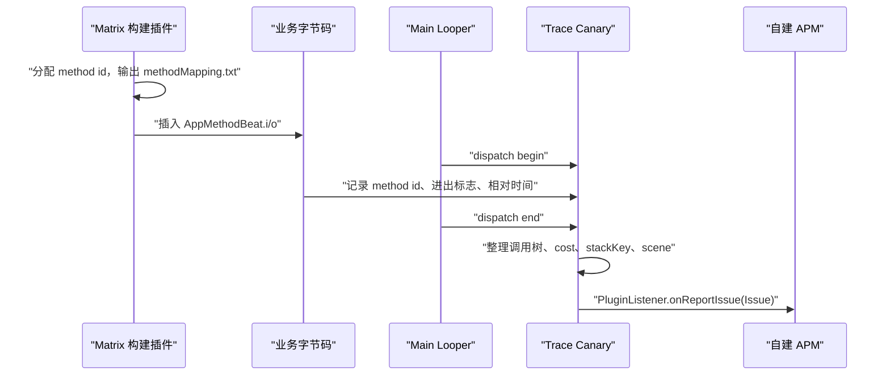

# Tencent Matrix

## 2026 年接入结论

Matrix 是微信团队开源的客户端性能监控框架。它提供插件、采集器和部分离线分析工具，不提供托管式上传、查询、聚合、告警或工单系统。选择它，等于选择一组可改造的客户端组件；服务端数据平台仍由接入方建设。

截至 2026-07-25，Maven Central 中 `matrix-android-lib` 的最新正式版仍是 `2.1.0`，发布时间为 2023-03-21；GitHub 主分支最近一次提交停在 2023-07-31。官方 README 只声明 Matrix Gradle 插件可配合 AGP 3.5.0、4.0.0、4.1.0 使用。这个时间差决定了采用策略：

- 已有 Matrix 项目可以继续维护，但要把自有分支、工具链升级和设备验证视为产品代码的一部分。
- 新项目若采用现代 AGP，不应直接把官方 2.1.0 插件加入构建并期待它兼容。
- 只引入某个运行时模块，也要核对它是否依赖旧系统实现、native hook 或旧版预编译 `.so`。

平台检查锚点是 Android 17 / API 37 / `android-17.0.0_r1`。Matrix 位于应用进程，没有对应的 AOSP 或 `android17-6.18-2026-06_r6` 内核实现；内核锚点只在 Perfetto 的调度、锁等待和 I/O 证据中作为系统侧参照。

## 按“数据来源”理解模块

下面这张表把模块、观测来源和结论边界放在一起。只有知道数据如何产生，才能判断报告能证明什么。

| 模块 | 观测来源 | 适合回答 | 不能单独证明 |
|---|---|---|---|
| Trace Canary | 编译期方法插桩、`AppMethodBeat`、主线程 Looper 与帧回调 | 哪段主线程调用路径耗时、启动阶段分布、FPS 分桶、部分 ANR 现场 | 线程为何没获得 CPU、Binder 对端为何慢、锁由谁长期持有 |
| IO Canary | 对指定 Java 运行库的 `open/read/write/close` PLT hook；`CloseGuard` reporter | 主线程文件 I/O 的路径、Java 栈、次数、大小、耗时；Closeable 泄漏 | 任意 native 库或后台线程的全部 I/O；SQL 语句质量 |
| Resource Canary | Activity 销毁后的弱引用重检；可选 Hprof dump/分析 | 哪类 Activity 销毁后长期存活、灰度样本中的引用链 | 所有 Fragment/View 泄漏；一次存活必然是永久泄漏 |
| 重复 Bitmap 分析 | Hprof 离线分析器 | 堆中内容相同的 Bitmap 与引用链 | 图片为何重复解码、线上每次分配的调用现场 |
| SQLite Lint | 独立 SQLite Lint 插件，hook 或业务回调提供 SQL | SQL 规则问题、索引与查询质量风险 | 某次页面卡顿一定由该 SQL 引起 |
| Battery Canary | 线程活动、系统 API 使用和 `HealthStats` 等采样 | WakeLock、Alarm、定位、网络、线程等可疑行为 | 单个行为对应的精确耗电量、系统归因的因果关系 |
| Memory Hook | alloc/free 的 PLT hook 与 native backtrace | native 分配未释放的候选与聚合 | 每个候选一定是泄漏 |
| MemGuard | Matrix 自己实现的 GWP-ASan 风格抽样保护与 PLT hook | 越界访问、use-after-free、double free | 全量内存安全覆盖；平台 GWP-ASan 已经启用 |
| Pthread Hook | `pthread` 生命周期 PLT hook | Java/native 线程泄漏候选、32 位进程线程栈裁剪 | 线程业务逻辑是否正确 |
| APK Checker | 构建产物离线扫描 | 包体构成、资源与 native 库问题 | 运行时性能 |

Resource Canary 的“重复 Bitmap”能力主要位于 `matrix-resource-canary-analyzer-cli` 的 Hprof 分析路径，不应描述成 Activity watcher 在运行时自动给出每次重复解码栈。SQLite Lint 也有自己的安装配置和 SQL 输入路径；看到数据库文件 I/O，只能提示继续检查 SQL、索引和事务，不能据此生成一条 SQLite Lint 结论。

Battery Canary、Memory Hook、MemGuard 和 Pthread Hook 都不宜作为全量常开项。它们会增加采样、回调、栈回溯或 hook 路径。MemGuard 的源码还明确限制它不能在 `MemoryHook` 已经 commit 后安装。生产使用要按模块准备独立开关、进程范围、采样比例、目标 `.so` 正则和停止采集后的恢复验证。

## Android 17 下有两个硬门槛

### 构建插件不是 AGP 8+ 实现

AGP 8.0 删除了 `com.android.build.api.transform`。Matrix 2.1.0 的源码仍有以下依赖：

- `MatrixPlugin` 把 `android` extension 强制转换为旧的 `AppExtension`。
- `MatrixTraceInjection` 无条件注册 `MatrixTraceTransform`。
- `MatrixTraceTransform` 继承已经删除的 `Transform`，并使用 AGP 内部 pipeline 类型。
- 所谓 task injection 仍依赖 `BaseVariant`、`DexArchiveBuilderTask` 等旧 API；它也不是 Android Components Instrumentation API 的实现。

因此，“切换为 task injection 就能支持 AGP 8”是不成立的。官方仓库中也没有 `MatrixTraceClassVisitorFactory` 之类的迁移类。现代项目只有三种可审计的选择：

1. 继续使用官方明确覆盖的旧构建环境，并接受旧工具链的维护代价。
2. 采用一个持续维护的 fork，逐项检查它是否已迁到 Android Components API，并在目标 AGP、R8、Kotlin、动态特性模块上跑回归。
3. 自己移植插桩器。逐类 ASM 插桩可用 Instrumentation API；需要全程序分析时，应评估 Scoped Artifacts API，而不能只改一个注册方法名。

移植必须保留类过滤、忽略方法规则、方法 id 分配、`methodMapping.txt`、R8 mapping 读取、增量构建和各 variant 产物隔离。方法 id 不是天然跨版本稳定：若没有正确使用并保存 `baseMethodMapFile`，同一个方法在下一次构建中可能换 id。

### 所有预编译 native 库都要检查 16 KB page size

Android 15 起，AOSP 支持 16 KB page size 设备；Android 17 还提供关闭兼容模式并让不兼容二进制立即终止的测试方式。Matrix 的 IO Canary、SQLite Lint、Memory Hook、MemGuard、Pthread Hook、Backtrace 等模块都包含 native 代码，不能因为 Java 层初始化成功就判定兼容。

采用 2023 年发布的预编译产物前，要检查 APK/AAB 中每个 Matrix `.so` 的 ELF load segment alignment 和包内 zip alignment，并在 16 KB 模式的 Android 17 设备或模拟器上覆盖安装、启动、hook、停止 hook 和异常回调。Google 的当前建议是使用 AGP 8.5.1 以上与 NDK r28 以上获得默认的 16 KB 构建支持；这又与 Matrix 官方 Gradle 插件的旧 AGP 依赖形成直接冲突。工程上通常需要拆开处理：移植构建插件，同时重编 native 模块，或换用已经给出现代工具链产物与验证记录的维护分支。

## 接入结构：先注册，再初始化，再启动

运行时框架本身很直接：`Matrix.Builder.plugin()` 注册插件，`pluginListener()` 接收 `Issue`，`Matrix.init()` 安装单例，随后启动所需插件。源码锚点以 2.1.0 的 `Matrix.java` 为准：其中没有 `patchListener()`，准确 API 是 `pluginListener()`。

下面的骨架只演示 Matrix 2.1.0 中存在的运行时 API。它假设调用方已经完成进程筛选，并且构建期 Trace 插桩器已在当前工具链上通过验证：

```java
public final class MatrixInstaller {
    public static void install(
            Application app,
            IDynamicConfig dynamicConfig) {
        TraceConfig traceConfig = new TraceConfig.Builder()
                .dynamicConfig(dynamicConfig)
                .enableFPS(true)
                .enableEvilMethodTrace(true)
                .enableAnrTrace(true)
                .enableStartup(true)
                .isDebug(false)
                .isDevEnv(false)
                .build();

        TracePlugin tracePlugin = new TracePlugin(traceConfig);
        IOCanaryPlugin ioPlugin = new IOCanaryPlugin(
                new IOConfig.Builder()
                        .dynamicConfig(dynamicConfig)
                        .build());

        Matrix.Builder builder = new Matrix.Builder(app)
                .pluginListener(new DefaultPluginListener(app) {
                    @Override
                    public void onReportIssue(Issue issue) {
                        super.onReportIssue(issue);
                        MatrixReportQueue.enqueue(issue);
                    }
                })
                .plugin(tracePlugin)
                .plugin(ioPlugin);

        Matrix.init(builder.build());
        Matrix.with().startAllPlugins();
    }
}
```

这里的 `MatrixReportQueue` 是应用自建的上传队列，不属于 Matrix API。注册顺序也有实际约束：未加入 `builder.plugin(...)` 的实例不会进入 Matrix 的插件集合，`getPluginByClass()` 也找不到它。示例没有表达采样和远程开关；项目代码应在构造插件前完成进程允许列表和实验分组，并让 `IDynamicConfig` 返回当前策略。

多进程应用不要在每个 `Application` 中照搬同一配置。主进程可开启 Trace；WebView、推送、下载或短命进程只选择能回答该进程问题的模块。还要记录“未安装”“安装失败”“已停止”三种状态，否则没有报告时无法区分“没有问题”和“监控没有工作”。

## Trace Canary：插桩记录与 Looper 窗口如何配合

构建期的 `MethodCollector` 为被选中的方法分配整数 id，写出 `methodMapping.txt`；字节码在方法进入和退出处调用 `AppMethodBeat.i(id)` 与 `AppMethodBeat.o(id)`。运行时的 `AppMethodBeat` 用环形缓冲记录 id、进出标志和相对时间，Looper dispatch 边界则切出一次主线程消息的分析窗口。

下面的时序图说明构建产物和运行时报告之间的依赖：



这条时序说明两个常见故障：没有与样本同构建保存的 `methodMapping.txt`，服务端无法可靠反解整数栈；插桩器没有工作时，Looper/FPS 信号可能仍存在，但方法树会缺失，不能把它误判为“主线程没有业务方法”。

Trace Canary 会生成不同 tag。2.1.0 源码中包括 `Trace_FPS`、`Trace_EvilMethod` 和 `Trace_StartUp`；payload 常见字段有 `scene`、`cost`、`stack`、`stackKey`、`detail` 和启动阶段耗时。服务端应该按 `tag + type + payload schema version` 解码，不能假设所有 `Issue` 都有同一组字段。

阈值应按场景配置，不要把一个固定毫秒数写成通用标准。卡顿窗口、冷启动、热启动和 FPS 分桶使用不同信号。方法插桩也不是逐帧性能指标的替代品：JankStats/FrameMetrics 适合确认坏帧及界面状态，Trace Canary 的方法树适合解释较长的主线程工作；需要系统归因时，再转到 Perfetto。

## IO Canary：覆盖范围比名称窄

2.1.0 的 native 实现通过 xHook 查找 `libopenjdkjvm.so`、`libjavacore.so`、`libopenjdk.so`，代理 `open/open64/read/write/close` 等符号。代理函数发现当前线程不是主线程时会直接调用原函数，不进入收集器。其文件性能检测因此主要覆盖经这些 Java 运行库路径发生的主线程 I/O，不是进程中任意库、任意线程的 I/O 审计。

一次被跟踪的文件从 `open` 开始保存路径、线程名和 Java 栈；`read/write` 累加操作次数、请求大小与耗时；`close` 时补文件大小并运行三类 detector：

- Main-thread detector 关注单次很慢或连续读写超过阈值的主线程 I/O。
- Small-buffer detector 按操作次数、平均请求大小和连续读写耗时判断。
- Repeat-read detector 比较路径、线程、Java 栈、文件大小和读取大小，在短窗口内发现重复读取。

Closeable 泄漏是另一条路径：`CloseGuardHooker` 反射替换 `dalvik.system.CloseGuard$Reporter`，将其 `Throwable` 栈转换成 type 4 的 `Issue`。这是对隐藏实现的反射与代理，Android 17 上必须单独验证 hook 成功率和停止后的 reporter 恢复情况。源码中虽预留 network I/O、cursor leak 的常量，也不能据此宣称 2.1.0 已完整实现这些 detector。

Perfetto 与 IO Canary 提供的证据不同。数据源和权限允许时，Perfetto 能显示调度、I/O、文件描述符或系统调用线索；Matrix 报告保留的是应用层路径、Java 栈以及一次文件生命周期内的聚合字段。一次主线程 I/O 报告可按以下顺序读：

1. 用 `thread`、`scene` 和时间窗口判断它是否处在启动或交互路径。
2. 看 `path`、`opType`、`op`、`opSize`、`buffer`、`cost` 与 `repeat`，区分单次慢、连续小块操作和重复读取。
3. 从 Java 栈找到调用入口，但不要把 `open` 时的栈当作每次 `read/write` 的精确栈。
4. 在 Perfetto 中检查相同窗口内主线程是在运行、等待 I/O、等待锁、等待 Binder，还是因调度压力未及时运行。
5. 若路径属于 SQLite，转去检查 SQL、索引、事务和 SQLite Lint 结果；文件路径本身不能指出哪条 SQL 有问题。

上报前不要上传原始私有目录、数据库名、账号、URL query 或缓存 key。保留受控的路径类型与稳定哈希即可支持聚合，原始路径只留在用户授权的本地调试或受限灰度环境。

## Resource Canary：Activity 观察和 Hprof 分开看

`ActivityRefWatcher` 在 Activity 销毁后保存弱引用，后台任务按间隔触发 GC 并重检。2.1.0 默认最大重检次数是 10；达到上限且对象仍存活后，才交给所选 leak processor。这个过程降低了短暂保留造成的噪声，但 `Runtime.getRuntime().gc()` 只是请求，重检次数也不是“永久泄漏”的数学证明。

`ResourceConfig.DumpMode` 提供 `NO_DUMP`、`AUTO_DUMP`、`MANUAL_DUMP`、`SILENCE_ANALYSE`、`FORK_DUMP`、`FORK_ANALYSE`、`LAZY_FORK_ANALYZE`。这些模式的暂停时间、磁盘占用、Android 版本支持范围并不相同。官方 2.1.0 release note 只明确提到 ResourcePlugin 对 API 31 的兼容改动，不能从这句话推导出它已经验证到 API 37。

生产侧建议把发现和分析分开：

- 大盘只上报 Activity 类名、进程、版本、次数、ref key、dump mode 和分析状态。
- Hprof 只在受控设备、充电/空闲条件或内部测试中生成；设置目录配额、LRU 与超时。
- 上传前评估对象数据的隐私风险。Hprof 可能含用户输入、token、URL 和业务对象。
- Fragment、View、listener 等引用问题，可在本地用 LeakCanary 或 heap analyzer 补足引用链；Resource Canary 的 watcher 入口以 Activity 为中心。

重复 Bitmap 是 Hprof analyzer 的独立分析结果。它适合指出“堆里有内容相同的 bitmap buffer 及其引用链”，随后再检查图片缓存 key、变换参数、尺寸和生命周期。不要把结果直接翻译成“同一文件被解码了多少次”，Hprof 没有保留完整的解码事件时间线。

## Battery、Memory Hook、MemGuard 与 Pthread Hook

这些模块靠近系统 API 或 native 分配/线程路径，启用前应先写出假设和退出条件。

| 模块 | 建议的启用范围 | 关键风险与校验 |
|---|---|---|
| Battery Canary | 低比例样本、后台异常版本、专项实验 | 观察行为不等于精确能耗归因；对照 Battery Historian、Perfetto、`dumpsys batterystats` 与复现实验 |
| Memory Hook | 指定进程与指定 `.so`，短时采集 | alloc/free hook 和回溯有成本；检查未释放聚合能否稳定复现 |
| MemGuard | 内部/小流量，限定目标 `.so` 与分配尺寸 | 抽样覆盖、guard page 内存成本、潜在对齐影响；不能与已 commit 的 Memory Hook 同时安装 |
| Pthread Hook | 线程暴涨或 32 位虚拟地址空间专项 | pthread hook 兼容性、栈裁剪对深调用的影响、停止 hook 后状态 |

Matrix MemGuard “based on GWP-ASan”表示实现思路相近，不表示 Android 平台的 GWP-ASan 配置已生效。它可以按正则选择目标库，默认选项也包含最大分配尺寸、最大受保护分配数和跳过分配数，说明它有明确采样范围。报告没有出现时，只能说明本次采样未捕获问题。

## 报告入库：原始 Issue 之外再建稳定协议

Matrix 的 `Issue` 只有 `type`、`tag`、`key`、`content` 和 `plugin`。进程、发生时间、应用版本、构建 id、采样策略、隐私级别与上传状态应由接入方补齐。建议至少保留以下字段：

| 字段 | 用途 |
|---|---|
| `schema_version` | 解析规则升级，避免用新代码误读旧 payload |
| `matrix_version` / `matrix_fork_revision` | 定位官方版本与自有补丁 |
| `issue_tag` / `issue_type` | 保留 Matrix 原始路由信息 |
| `process_name` / `thread_name` / `tid` | 多进程和线程归因 |
| `scene` / `page` | 业务入口 |
| `duration_ms` | 接入层统一时间单位，并保留原字段 |
| `stack_signature` | 去地址、去动态 id 后的聚合键 |
| `app_build_id` | 关联 APK、R8 mapping 和 native symbols |
| `method_map_id` | 关联 Trace `methodMapping.txt` |
| `sample_policy_id` | 解释样本如何被选中 |
| `payload_object_id` | 大栈、Hprof 或 dump 文件的独立存储索引 |
| `privacy_class` | 路径、URL、对象数据的处理规则 |

下面的 JSON 只定义自建平台协议，字段名不是 Matrix 2.1.0 的原生 payload：

```json
{
  "schema_version": 3,
  "matrix_version": "2.1.0+company.12",
  "issue_tag": "Trace_EvilMethod",
  "issue_type": 0,
  "process_name": "com.example.app",
  "thread_name": "main",
  "scene": "HomeActivity",
  "duration_ms": 1280,
  "stack_signature": "sha256:77c0...",
  "app_build_id": "8.3.0-370412-release",
  "method_map_id": "sha256:aa91...",
  "sample_policy_id": "trace-prod-2026-07",
  "payload_object_id": "matrix/trace/2026/07/25/0001",
  "privacy_class": "internal-pseudonymized"
}
```

服务端收到它后，要按 `app_build_id + method_map_id` 找到同一构建的映射文件，再解码 Matrix 的整数方法栈。`stack_signature` 用于聚合同类样本，不能代替原始栈；`sample_policy_id` 用来提醒读者，发生率只对当前采样方案有意义。

IO 事件可以复用同一信封，在 payload 中放受控字段。下面给出一个经过路径分类和哈希的例子：

```json
{
  "issue_tag": "io",
  "issue_type": 3,
  "process_name": "com.example.app",
  "thread_name": "main",
  "scene": "ColdStart",
  "path_type": "shared_prefs",
  "path_hash": "sha256:8d31...",
  "op_type": "read",
  "op_count": 42,
  "op_size_bytes": 5376,
  "max_buffer_bytes": 128,
  "cost_ms": 86,
  "repeat_count": 6
}
```

这个例子只支持“冷启动主线程在短窗口内反复小块读取某类文件”的判断。它不能证明 86 ms 全部是存储等待，也不能证明提高 buffer 就一定消除首屏慢；仍需结合调用栈、缓存策略和系统时间线验证。

## 从 Matrix 样本转向系统证据

Matrix 给出应用语义，Perfetto 给出同一时间窗内的系统执行状态。联合诊断时不要只寻找一个能对上时间的 slice，要检验互相竞争的解释：

- 慢方法的 wall time 很长，但 CPU time 很短：检查锁、Binder、I/O 和调度等待。
- wall time 与 CPU time 都长：查看 CPU 频点、核心分配、同机并发负载和方法内部工作量。
- Matrix 报主线程 I/O：核对系统调用或 I/O 事件是否与该窗口重合，同时检查 page fault、锁和 Binder。
- 启动慢：核对进程创建、`bindApplication`、ContentProvider、`Application`、Activity launch 与首帧，不要把 Matrix 的“启动总时长”当成单一函数耗时。
- ANR：Matrix 的主线程栈只是一个观察点；还要查看 Binder 对端、锁持有线程、CPU 饥饿、系统服务与平台 ANR trace。

Perfetto 复现不到线上样本时，保留 Matrix 的 scene、构建 id、设备、进程、发生时间和实验分组，用相同入口制造可比较样本。若无法控制输入和环境，一条 trace 与一条线上 Issue 的相似栈还不足以建立因果关系。

## 上线前检查表

- [ ] 明确使用官方 2.1.0、哪个 fork revision，以及每个补丁的维护人。
- [ ] 当前 AGP、Gradle、Kotlin、R8、Java、动态特性模块和增量构建均有 CI 覆盖。
- [ ] Trace 插桩失败会让构建失败或产生显式诊断，不会静默发布空方法栈。
- [ ] 每个 release 的 APK/AAB、R8 mapping、`methodMapping.txt`、native symbols 可由同一 `app_build_id` 找回。
- [ ] 所有 Matrix `.so` 通过 16 KB ELF 与 zip alignment 检查，并在 Android 17 的严格 16 KB 模式运行。
- [ ] hook 模块覆盖安装、启用、禁用、重复初始化、异常回调、进程退出和版本回滚。
- [ ] 各进程的模块允许列表明确；WebView、推送、下载和短命进程没有继承主进程配置。
- [ ] 插桩方法数、APK 体积、冷/热启动、帧耗时、CPU、内存、线程数和耗电有对照实验。
- [ ] 本地队列有条数、字节数、文件数和保留时长上限；上传失败不会制造新的主线程 I/O。
- [ ] 路径、SQL、URL、Hprof、native dump 与日志按隐私等级裁剪、哈希、加密和授权。
- [ ] 每个模块有远程停止方式，并验证停止后 hook、listener、线程和文件状态。
- [ ] 后端区分“无问题”“未采样”“安装失败”“采集被关闭”“上传失败”。

## 源码与版本依据

- [Matrix v2.1.0 release](https://github.com/Tencent/matrix/releases/tag/v2.1.0)
- [Maven Central: matrix-android-lib metadata](https://repo1.maven.org/maven2/com/tencent/matrix/matrix-android-lib/maven-metadata.xml)
- [Matrix.java（v2.1.0）](https://github.com/Tencent/matrix/blob/1ef57301201f9f65a755573afaee4ebada5a53a1/matrix/matrix-android/matrix-android-lib/src/main/java/com/tencent/matrix/Matrix.java)
- [MatrixPlugin.kt（v2.1.0）](https://github.com/Tencent/matrix/blob/1ef57301201f9f65a755573afaee4ebada5a53a1/matrix/matrix-android/matrix-gradle-plugin/src/main/kotlin/com/tencent/matrix/plugin/MatrixPlugin.kt)
- [MatrixTraceInjection.kt（v2.1.0）](https://github.com/Tencent/matrix/blob/1ef57301201f9f65a755573afaee4ebada5a53a1/matrix/matrix-android/matrix-gradle-plugin/src/main/kotlin/com/tencent/matrix/plugin/trace/MatrixTraceInjection.kt)
- [AppMethodBeat.java（v2.1.0）](https://github.com/Tencent/matrix/blob/1ef57301201f9f65a755573afaee4ebada5a53a1/matrix/matrix-android/matrix-trace-canary/src/main/java/com/tencent/matrix/trace/core/AppMethodBeat.java)
- [IO Canary native hook（v2.1.0）](https://github.com/Tencent/matrix/blob/1ef57301201f9f65a755573afaee4ebada5a53a1/matrix/matrix-android/matrix-io-canary/src/main/cpp/io_canary_jni.cc)
- [ActivityRefWatcher.java（v2.1.0）](https://github.com/Tencent/matrix/blob/1ef57301201f9f65a755573afaee4ebada5a53a1/matrix/matrix-android/matrix-resource-canary/matrix-resource-canary-android/src/main/java/com/tencent/matrix/resource/watcher/ActivityRefWatcher.java)
- [Android Gradle plugin API updates](https://developer.android.com/build/releases/gradle-plugin-api-updates)
- [Android 16 KB page size compatibility](https://developer.android.com/guide/practices/page-sizes)
