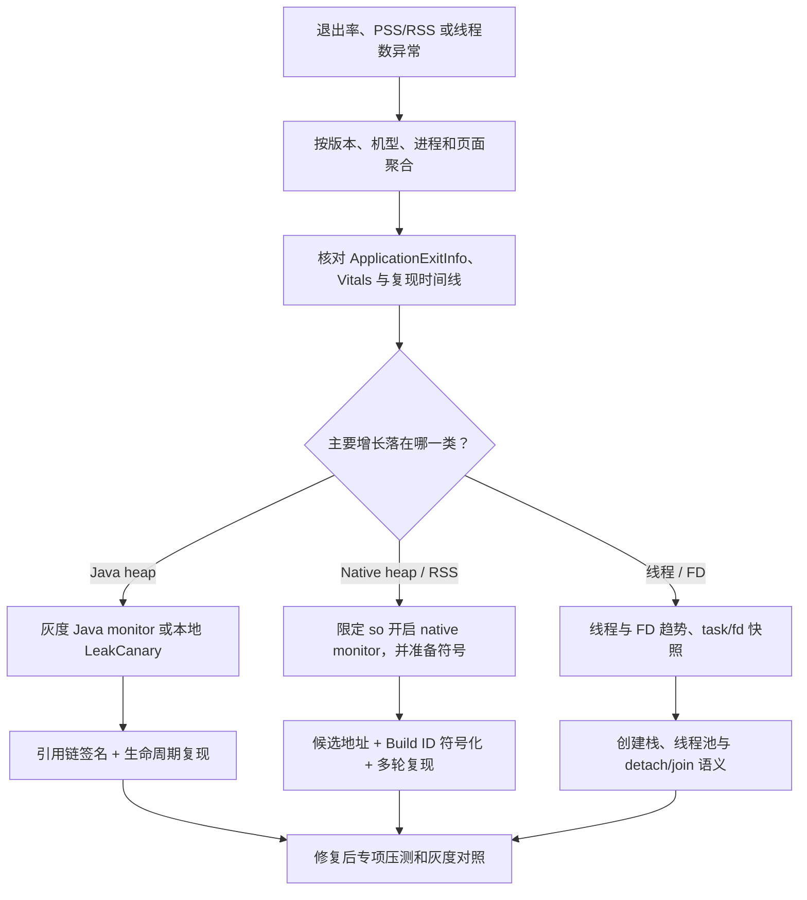

---

title: "KOOM"
chapter: "19"
section: "19.03"
status: finalized
applicable_versions: "Android 8 (API 26) - Android 17 (API 37)"
last_verified: "2026-08-14"
last_verified_against: "KOOM df3b8c33 source/build config + v2.2.2 release and Maven metadata + Android ApplicationExitInfo/memory/16 KB docs updated through 2026-08-06 + AOSP android-17.0.0_r1 + kernel android17-6.18-2026-06_r39"
confidence: medium
tags: [apm]
related_chapters: ["19.0"]
sources:
  - type: github
    path: "https://github.com/KwaiAppTeam/KOOM"
  - type: github
    path: "https://github.com/KwaiAppTeam/KOOM/tree/master/koom-java-leak"
  - type: github
    path: "https://github.com/KwaiAppTeam/KOOM/tree/master/koom-native-leak"
  - type: github
    path: "https://github.com/KwaiAppTeam/KOOM/tree/master/koom-thread-leak"
  - type: source
    path: "https://github.com/KwaiAppTeam/KOOM/commit/df3b8c33f63ab1f23e814c19792314efb653deaf"
  - type: source
    path: "https://repo.maven.apache.org/maven2/com/kuaishou/koom/koom-java-leak/maven-metadata.xml"
  - type: official
    path: "https://developer.android.com/reference/android/app/ApplicationExitInfo"
  - type: official
    path: "https://developer.android.com/guide/practices/page-sizes"
  - type: official
    path: "https://developer.android.com/topic/performance/memory"
pipeline_stage: ready-to-publish
task6_state: reviewed
task9_state: reviewed
task2b_state: fixed
---

# KOOM

## 先看 Android 17 结论

KOOM 是快手开源的内存专项工具，分为 Java heap（ART 管理的 Java/Kotlin 对象堆）、native heap（C/C++ 等本地代码申请的堆）和 thread（线程资源生命周期）三条诊断路径。它适合处理已经由 OOM（Out of Memory，内存耗尽）、PSS/RSS 或线程数趋势确认的内存问题。PSS 是按比例分摊共享页后的进程内存，RSS 是进程当前驻留的物理内存。若启动慢、网络慢或列表卡顿没有明确的内存证据，不应先接 KOOM。

截至 2026-08-14，[Maven Central 元数据](https://repo.maven.apache.org/maven2/com/kuaishou/koom/koom-java-leak/maven-metadata.xml)中的最新正式版本仍是 `2.2.2`，最后更新时间为 2024-04-16。KOOM `master` 的 `VERSION_NAME` 已写为 `2.2.3`，该值尚未发布到 Maven Central。当前 `master` 顶部提交（HEAD）仍是 2026-01-12 的 [`df3b8c33f63ab1f23e814c19792314efb653deaf`](https://github.com/KwaiAppTeam/KOOM/commit/df3b8c33f63ab1f23e814c19792314efb653deaf)，构建配置使用 compileSdk 34、targetSdk 30、AGP（Android Gradle Plugin）7.1.0。compileSdk 决定编译时可见的 API，targetSdk 决定系统采用哪组兼容行为；这些配置和上游工程构建成功都不能证明 Android 17 运行兼容。

更关键的限制写在源码里：

- `DefaultInitTask` 只允许 API 21～36，`ForkJvmHeapDumper.dump()` 会再次检查这个条件。Android 17 / API 37 会被拒绝。
- `ThreadMonitor` 只允许 API 28～34，而且只接受 arm64 进程。arm64 是 64 位 ARM ABI（Application Binary Interface，应用二进制接口）。模块 README 写的“Android N+”已经落后于实现。
- `LeakMonitor` 只检查 API 24+ 和 arm64，没有 API 上限。这代表“没有主动拒绝 API 37”，不代表经过了 API 37 验证。
- Maven `2.2.2` 的发布时间早于上游 2025 年的 Android 15 fast dump 修改和 2026 年合入的 16 KB page-size 修改，不能把这两批改动算在正式产物里。

所以，在 Android 17 项目里，`2.2.2` 不能作为直接接入的生产依赖；当前 `master` 也不能只删除版本判断便发布。采用方需要维护 source fork（从官方源码派生的自有分支），并按启用模块分别验证：Java fast dump 依赖 ART（Android Runtime）私有符号，native leak 依赖平台内部的 `libmemunreachable` 和函数 Hook，thread leak 依赖 pthread Hook，所有随包 `.so` 还要通过 16 KB ELF（Executable and Linkable Format，`.so` 使用的二进制格式）加载段对齐检查。没有这项维护预算时，应优先保留系统退出证据、本地 Profiler/Perfetto 和 LeakCanary，不把 KOOM 加入生产依赖。

## 三个模块使用不同的判定口径

下表中的 FD（file descriptor，文件描述符）是进程打开文件、socket 等内核对象时使用的整数句柄；Hprof 是 Java/ART 堆快照；Shark 是 LeakCanary 使用的 Hprof 分析引擎。Hook 指把目标函数调用转到监控代理函数，能看到的范围取决于实际改写了哪些入口。

| 模块 | 观察对象 | 源码中的触发与产物 | 当前边界 |
|---|---|---|---|
| `koom-java-leak` | Java heap，以及线程数、FD 数等 OOM 前兆 | 主进程在前台时轮询；命中条件后用 `fork()` 派生子进程，生成原始 Hprof，再由 Shark 生成引用链 JSON | 公共版本门是 API 21～36；自动路径不会裁剪 Hprof；dump 和分析仍有内存、I/O 与磁盘成本 |
| `koom-native-leak` | 被 Hook 的 app `.so` 中尚未释放的 native 分配块 | Hook 分配/释放函数，将活跃分配与 `libmemunreachable` 结果求交集，产出大小、线程、相对地址和 so 名 | API 24+、arm64；依赖私有系统库与文本格式；API 37 未获上游保证 |
| `koom-thread-leak` | 已退出、却没有 `detach` 或 `join` 的 joinable pthread | Hook `pthread_create`、`pthread_detach`、`pthread_join`、`pthread_exit`，延迟上报创建栈和生命周期时间 | 源码限定 API 28～34、arm64；不能识别仍然活着的 `WAITING` 线程或无界线程池 |

joinable pthread 是需要由其他线程调用 `pthread_join` 回收资源的 POSIX 线程；调用 `pthread_detach` 后，系统会在线程退出时自动回收。普通内存指标回答“进程用了多少”，KOOM 尝试回答“什么对象、分配或线程生命周期值得怀疑”。Android Studio Profiler 和 Perfetto 适合观察时间线、内存分区与复现过程；LeakCanary 专注可复现的 Java/Kotlin 对象保留。四类工具的证明范围不同，不能互相替换。

## Java heap：触发器比 fork dump 更容易被误读

### 源码会在什么条件下 dump

`OOMMonitor` 只在主进程工作。它默认每 15 秒刷新一次 `SystemInfo`，再依次运行以下 tracker（周期性判定规则）：

| Tracker | 默认条件 | 会不会触发 Hprof |
|---|---|---|
| `HeapOOMTracker` | heap 使用率超过阈值，并连续 3 次没有明显回落；大堆默认阈值 80%，中等堆 85%，小堆 90% | 会 |
| `ThreadOOMTracker` | 线程数超过 750；旧版 EMUI 的默认值是 450，并连续 3 次维持高位 | 会，同时暂存 `/proc/self/task/*/comm` |
| `FdOOMTracker` | FD 数超过 1000，并连续 3 次维持高位 | 会，同时暂存 `/proc/self/fd` 链接 |
| `FastHugeMemoryOOMTracker` | heap 使用率超过 90%，或一次轮询间隔内增长超过 350000 KB | 立即触发 |
| `PhysicalMemoryOOMTracker` | 设备可用内存比例低于 5% 等区间 | 不会；当前实现只写日志，`return true` 已被注释 |

这里没有“连续 GC（garbage collection，垃圾回收）后仍存活”的独立触发器，也没有 PSS/RSS 阈值直接触发 dump。PSS、RSS、VSS 会进入运行信息和报告；VSS（Virtual Set Size）表示进程虚拟地址空间总量。报告包含某个字段，不能证明该字段参与了触发判断。

进程进入后台时，应用生命周期的 `ON_STOP` 事件会停掉轮询；回到前台后才恢复。执行分析的 Android Service 也会等待进程回到前台。每个进程生命周期最多自动 dump 一次；非 debug 构建还配置了“每版本 5 次、首个 15 天内”的分析额度。源码在次数已经 `> 5` 时才拒绝，计数恰好为 5 时仍可能再分析一次。接入方若要求严格上限，需要修正这个边界。命中期限或次数限制后，监控循环会结束，本次不会生成 Hprof。

这些默认值是上游策略，不是适合所有应用的通用安全值。业务接入至少还要加上远程开关、按设备能力分组、随机采样、交互状态、剩余磁盘、电量和两次采集之间的冷却时间。对一个 128 MB heap 的进程，90% 与对一个 512 MB heap 的进程含义不同；单看比例也区分不了有意保留的图片缓存和失控增长。

### fork dump 降低主进程停顿，没有消除资源风险

KOOM fast dump 的基本顺序是暂停 ART、调用 `fork()`、恢复父进程，再让子进程写 Hprof。`fork()` 创建的子进程先与父进程共享内存页；copy-on-write（写时复制）表示某一方修改页面时才复制该页，因此不会在创建子进程的瞬间复制整块堆。不过，父子进程随后修改的页面仍会增加物理内存，子进程也会消耗 CPU、文件 I/O 和磁盘。在可用内存已经很低时，诊断动作本身可能失败或加快进程退出。

这一实现不属于公开 Android SDK。`koom-fast-dump` 会按 mangled name（编译器编码后的 C++ 符号名）从 `libart.so` 解析 `art::ScopedSuspendAll`、`art::gc::ScopedGCCriticalSection`、ART 锁和 `art::hprof::DumpHeap` 等私有符号。Android 17 的源码锚点是 [`platform/art@android-17.0.0_r1`](https://android.googlesource.com/platform/art/+/refs/tags/android-17.0.0_r1)。平台源码中存在相似实现，只能说明源码里有这些能力，无法给应用提供稳定 ABI 承诺。上游把公共版本门停在 API 36，也说明 API 37 需要逐符号验证。

还要分清两条 dump 路径：

- `OOMMonitor.dumpAndAnalysis()` 调用 `ForkJvmHeapDumper`，分析成功后把 Hprof 标为 `ORIGIN`（原始堆快照），再交给接入方配置的 uploader。
- 源码保留了 `ForkStripHeapDumper`，README 的手动示例也会使用它，但自动监控路径没有调用它。

所以，KOOM 的自动路径不会产出裁剪版 Hprof。若上传器传输原始 Hprof，文件可能包含字符串、账号数据、图片字节、业务对象和第三方 SDK 状态。生产环境可在设备内完成分析，只上传经过筛选的 JSON；若确需保留 Hprof，应单独取得授权，使用应用私有目录、短保留期、加密传输和服务端访问审计。

### 报告能回答什么

上游 `HeapReport` 的 `RunningInfo` 包含 JVM 最大/已用内存、VSS/PSS/RSS、线程数、FD 数及列表，以及 SDK、厂商、机型、应用版本、当前页面、使用时长、设备总内存/可用内存和触发原因。`GCPath` 保存 GC Root（垃圾回收器判断对象存活时使用的根节点）、引用路径、实例数、泄漏原因，以及按引用链计算的 SHA-1 摘要；另外还有类实例统计和可疑对象信息。

引用链是从 GC Root 到可疑对象的路径，无法单独证明对象已经泄漏。静态单例保留已销毁 `Activity` 通常证据很强；仍在执行的异步任务、合法缓存和进程级对象则需要结合生命周期再判断。修复后要在同一路径上重复进入和退出页面，配合 LeakCanary 或 Profiler 确认对象数量回落，再观察小比例发布（常称灰度）中同一摘要的样本是否下降。

`OOMFileManager.isSpaceEnough()` 只要求大约 1.2 MB 可用空间，远低于真实 Hprof 可能需要的容量。生产接入需要按“预计 Hprof 大小 + 分析临时文件 + 安全余量”计算配额，并设置单文件上限、目录总量、过期清理和失败退避（失败次数越多，下一次重试等待越久）。不要把上游这项轻量检查当成完整的磁盘保护。

## Native leak：候选来自两份数据的交集

Native 模块先用 xhook 改写目标 `.so` 的 PLT（Procedure Linkage Table，共享库调用外部函数时使用的跳转表），拦截 `malloc`、`realloc`、`calloc`、`memalign`、`posix_memalign` 和 `free`，维护仍未释放的分配记录。检查时，它再加载 `libmemunreachable.so`（Android 平台内部的 native 不可达内存分析库），解析私有的 `GetUnreachableMemoryString(bool, size_t)` 符号，并从人类可读文本中提取不可达地址。只有同时出现在“KOOM 活跃分配”和“系统不可达结果”中的内存块，才进入候选报告。

这套做法带来四个边界：

1. PLT Hook 只能覆盖实际经过被 Hook 入口的分配。自定义 allocator（内存分配器）、静态绑定、直接 `mmap`（创建内存映射）、GPU/驱动内存和未选中的 `.so` 都在覆盖范围之外。
2. 从当前 root 集（可达性分析使用的一组起点）不可达，比暂时没有业务引用更接近泄漏；但扫描时机、库内部缓存和对象生命周期仍可能产生候选。修复结论应有多轮趋势或可控复现支撑。
3. `libmemunreachable` 是平台内部组件。Android 17 源码锚点 [`system/memory/libmemunreachable@android-17.0.0_r1`](https://android.googlesource.com/platform/system/memory/libmemunreachable/+/refs/tags/android-17.0.0_r1) 仍包含相关能力，但应用进程自行 `dlopen`（运行时加载共享库）、解析 C++ 符号并依赖输出文本格式，都没有 SDK 稳定性保证。
4. 未开启本地符号化时，KOOM 只提供 `rel_pc`（相对程序计数器地址）与 `soName`。服务端必须按应用版本、ABI 和 Build ID（标识一次 native 构建的 ID）保存未执行 strip、仍含调试符号的准确文件；只要构建不一致，地址就可能被解析到错误函数。

一个播放器版本的 RSS 每播放一次视频就上升 20 MB，可以先把播放器业务 `.so` 加入目标库列表，排除 KOOM 自身与已知基础库，再按调用栈聚合持续出现的大分配。若候选落在第三方解码器的帧缓存创建路径，还要停止播放、销毁实例并等待回收，再比较 RSS 与候选数量；单条 native stack 不能直接确定责任代码。

`LeakMonitorConfig` 还提供分配大小门槛、目标/忽略 `.so`、默认 300 秒扫描周期和本地符号化开关。当前 `LeakMonitor.call()` 对 `nativeHeapAllocatedThreshold` 的判断方向与注释不一致：已分配 native heap 大于阈值时反倒提前返回。因此，在没有为所用提交编写回归测试前，不要依赖该字段负责触发保护。

## Thread leak：只识别一种 pthread 生命周期错误

线程模块只识别一种情况：joinable 线程已经退出，但没有被 `pthread_detach` 或 `pthread_join` 回收，超过延迟后才生成 `ThreadLeakRecord`。记录字段是 `tid`（Linux 线程 ID）、创建/开始/结束时间、线程名和创建调用栈。这类错误会遗留 pthread 资源，但线程本身已经结束。

下面几类问题需要另一套观测：

| 问题 | KOOM `ThreadLeakMonitor` 能否直接确认 | 应补的证据 |
|---|---|---|
| joinable 线程已退出，未 detach/join | 能，这是它的目标 | `ThreadLeakRecord` 创建栈与多设备聚合 |
| 匿名线程仍在运行 | 不能 | `/proc/self/task` 数量、线程名、创建栈或采样栈 |
| 无界线程池持续创建 worker（工作线程） | 不能直接确认 | 线程总量趋势、线程池指标、创建点 |
| 业务线程长期 `WAITING`（等待） | 不能 | thread dump（线程快照）、锁/队列所有者、业务生命周期 |
| Binder（Android 跨进程调用机制）、RenderThread（渲染线程）、GC 等常驻线程 | 不应按存活时间判泄漏 | 系统线程基线和版本/设备对照 |

源码配置没有面向业务的线程允许列表字段。接入方可在自己的上报与聚合层实现允许列表：要求业务线程命名，再按规范化线程名前缀和创建栈归类；系统线程、固定规模线程池和经过评审的常驻 SDK 线程只做趋势监控。允许列表不能掩盖数量持续增长，同一前缀仍要设置进程级上限和增长率告警。

`ThreadMonitor.stop()` 会调用 native stop，但上游 C++ `ThreadHooker::Stop()` 当前是空实现。接入方需要验证停止后是否还会拦截新线程、是否继续保留记录，以及重复 start/stop 是否安全。Java 方法已经返回，不代表 Hook 已完整卸载。

## 把系统退出证据放在 KOOM 前面

线上看到“OOM”时，先确定是哪一种退出或内存增长，再决定是否启动高成本诊断。`ApplicationExitInfo` 是 Android 11 起提供的历史进程退出记录，Android Vitals 是 Google Play 汇总的线上质量数据。建议使用下面这条证据路径：



这条路径把退出事实、内存分区和专项证据分开。Java、native、thread 的修复人和验证工具通常不同，PSS 上升本身不能证明 Java heap 泄漏。

### `ApplicationExitInfo` 的版本边界

Android 11 / API 30 起，可以在下次启动后通过 `ActivityManager.getHistoricalProcessExitReasons()` 查询退出记录。调用会通过 Binder 跨进程进入 `system_server`（承载 Android 核心系统服务的进程），不宜同步放在冷启动主线程。解释结果时还要留三个余量：

- 先用 `ActivityManager.isLowMemoryKillReportSupported()` 判断设备是否支持 `REASON_LOW_MEMORY`。不支持时，内存压力导致的杀进程可能只显示 `REASON_SIGNALED` 和 `SIGKILL`（不能被应用捕获的强制终止信号）。
- `getPss()`、`getRss()` 是系统最近一次采样值，可能为 0，也不保证贴近退出瞬间。
- `getTraceInputStream()` 主要服务于有 trace 的退出类型，例如 ANR（Application Not Responding，应用无响应）或部分 native crash；不要假设 OOM/LMK（low memory kill，低内存终止）一定带可读 trace。

Android 8～10 没有 `ApplicationExitInfo`。这部分设备要结合 Android Vitals、本地复现、版本级 PSS/RSS 趋势和受控日志判断。现代 Android 的内存回收决策由用户空间的 `lmkd`（low memory killer daemon，低内存终止守护进程）根据内存压力与进程优先级执行；Android 17 平台锚点是 [`system/memory/lmkd@android-17.0.0_r1`](https://android.googlesource.com/platform/system/memory/lmkd/+/refs/tags/android-17.0.0_r1)。相关判断不直接依赖当前 `android17-6.18-2026-06_r39` 标签下的某一段内核代码，也不应再用旧式“内核 lowmemorykiller 日志”概括 API 37 的机制。

### `onTrimMemory` 不能再负责统一压力触发

`ComponentCallbacks2.onTrimMemory()` 在历史版本上可用于补充进程状态，但 Android 14 起系统不再向应用交付 `TRIM_MEMORY_UI_HIDDEN`、`TRIM_MEMORY_BACKGROUND` 之外的旧级别；其余旧常量在 Android 15 / API 35 正式废弃。`UI_HIDDEN` 表示 UI 转入不可见，`BACKGROUND` 表示后台进程已成为回收候选；两者都不是“系统将在固定时间内杀进程”的倒计时。Android 17 接入应以自身 heap/RSS/线程趋势和系统退出记录为主，不能等待旧压力级别再 dump。

PSS 适合在分摊共享页后比较进程总体内存，RSS 表示当前驻留的物理页，Java heap 只覆盖 ART 管理的堆。若 Java heap 平稳，RSS/PSS 却持续上升，可以把排查重点移向 native、graphics、`mmap` 或线程栈；`dumpsys meminfo` 与 Perfetto memory counters（内存计数轨道）可在复现环境中继续区分内存去向。

## 端侧报告要能复现，也要克制采集

KOOM 原始结构之外，平台通常还需要样本、构建和业务上下文。下面是一份统一事件外层结构，用于说明字段职责，不要求照搬字段名：

```json
{
  "sample_id": "opaque-random-id",
  "kind": "java_heap | native_heap | pthread_resource",
  "app_version": "17.3.0",
  "build_id": "native-symbol-build-id",
  "abi": "arm64-v8a",
  "api_level": 37,
  "page": "PlayerDetail",
  "process_state": "foreground",
  "trigger": {
    "java_heap_bytes": 412000000,
    "pss_kb": 536000,
    "rss_kb": 601000,
    "thread_count": 812,
    "fd_count": 438
  },
  "evidence": {
    "gc_path_signature": "sha1-or-null",
    "native_so": "libplayer.so",
    "native_rel_pc": "0x1234",
    "thread_name": "player-worker-42",
    "creator_stack": "redacted-summary"
  }
}
```

事件外层只保存定位所需的摘要。`kind` 表示证据类型，决定哪些 `evidence` 字段有效；不要为了方便查询，给每条事件填入并不存在的 GC path、native stack 或线程状态。账号、URL query（问号后的查询参数）、消息正文、图片字节和完整对象字段应在设备端删除或散列。

文件治理至少包括：

- 设备端先生成 JSON 摘要，原始 Hprof 默认不上报。
- dump 前检查预计容量，设置单文件上限、目录总配额和过期时间；失败后指数退避。
- 只在命中远程开关、采样和设备能力条件时加载对应模块；内存容量小、磁盘不足、设备过热或用户正在高频交互时跳过。
- native 符号按版本、ABI、Build ID 保存；Java 混淆映射按构建号保存。
- 上传任务使用约束网络与充电策略，进程被杀后也不能无限重试同一个大文件。
- 远程关闭后验证 monitor、Hook、子进程和临时文件均停止或被清理。

## Android 17 移植清单

把 KOOM 带到 API 37 不止是改一处 `SDK_INT`。至少完成以下验证，才可从实验依赖转为小比例发布依赖：

1. 从明确的 KOOM commit hash（提交哈希）构建，不把 Maven `2.2.2` 与 `master` 的 Android 15/16 KB 修改混在同一个版本描述里。
2. 审阅 `DefaultInitTask` 和 `ForkJvmHeapDumper` 的 API 37 版本门；对每个私有 ART 符号做启动时解析、失败降级和真机 dump 测试。
3. 在 Android 17 / API 37 上测试大堆、并发分配、前后台切换、dump 超时、子进程被杀、磁盘不足和重复启动。
4. 对 native monitor 验证 `libmemunreachable.so` 加载、符号解析、`ptrace`/进程 dumpable 条件、结果文本解析、xhook 与目标 allocator 覆盖率。`ptrace` 和 dumpable 状态共同影响一个进程能否被检查或读取。
5. 不启用 thread monitor，除非已完成 API 37 适配；上游源码当前会直接拒绝。适配后还要覆盖 create/detach/join/exit、线程复用和 stop/start。
6. 仅打包 arm64 的 native/thread 模块，或为其他 ABI 明确禁用；同时统一 `c++_shared` / `c++_static`（C++ 运行库动态/静态链接）策略，避免 `libc++_shared.so` 冲突。
7. 使用 NDK（Native Development Kit，本地开发工具包）r28+ 重编所有 native 产物，并对最终 APK/AAB 执行 16 KB ELF 与 ZIP 对齐检查。上游 `master` 升到 NDK `28.2.13676358` 只是必要条件，业务工程中的预编译 `.so` 仍要逐个检查。
8. 在 Android 17 的 16 KB 设备或官方模拟环境中，用 `fatal` 模式关闭 page-size 兼容并运行专项用例。只通过 4 KB 设备不能证明 API 37 可用。
9. 对比启用组和关闭组的启动时间、帧停顿、ANR、OOM/LMK、PSS 峰值、磁盘写入与电量，确认诊断收益高于监控成本。
10. 修复后用同一压测脚本复测，并观察至少一个小比例发布周期内的同一问题摘要所覆盖的设备数与退出率；单次 report 消失不算验证完成。

检查 16 KB 产物时，Android 官方建议对 ELF LOAD segment 和 APK ZIP 对齐分别验证。下面两条命令分别检查 native 库的段对齐与最终 APK 的包内对齐：

```bash
llvm-objdump -p path/to/libkoom-fast-dump.so | grep LOAD
zipalign -c -P 16 -v 4 app-release.apk
```

第一条输出中的 `LOAD` segment 对齐应达到 `2**14`，也就是 16384 字节；第二条必须对最终交付 APK 执行。AAB 还要用当前 bundletool 生成对应 APK 后检查，不能只验中间产物。

## 参考源码与文档

- [KOOM 当前审阅锚点 `df3b8c33`](https://github.com/KwaiAppTeam/KOOM/tree/df3b8c33f63ab1f23e814c19792314efb653deaf)
- [KOOM v2.2.2 release](https://github.com/KwaiAppTeam/KOOM/releases/tag/v2.2.2)
- [Maven Central：`koom-java-leak` 元数据](https://repo.maven.apache.org/maven2/com/kuaishou/koom/koom-java-leak/maven-metadata.xml)
- [KOOM `gradle.properties`（`VERSION_NAME=2.2.3`）](https://github.com/KwaiAppTeam/KOOM/blob/df3b8c33f63ab1f23e814c19792314efb653deaf/gradle.properties)
- [KOOM 构建版本配置](https://github.com/KwaiAppTeam/KOOM/blob/df3b8c33f63ab1f23e814c19792314efb653deaf/build.gradle)
- [KOOM `DefaultInitTask` 的 API 21～36 版本门](https://github.com/KwaiAppTeam/KOOM/blob/df3b8c33f63ab1f23e814c19792314efb653deaf/koom-monitor-base/src/main/java/com/kwai/koom/base/DefaultInitTask.kt)
- [`ForkJvmHeapDumper` 的二次版本检查](https://github.com/KwaiAppTeam/KOOM/blob/df3b8c33f63ab1f23e814c19792314efb653deaf/koom-fast-dump/src/main/java/com/kwai/koom/fastdump/ForkJvmHeapDumper.java)
- [`OOMMonitor` 的自动 dump/分析路径](https://github.com/KwaiAppTeam/KOOM/blob/df3b8c33f63ab1f23e814c19792314efb653deaf/koom-java-leak/src/main/java/com/kwai/koom/javaoom/monitor/OOMMonitor.kt)
- [`LeakMonitor` 的 API/ABI 门与阈值判断](https://github.com/KwaiAppTeam/KOOM/blob/df3b8c33f63ab1f23e814c19792314efb653deaf/koom-native-leak/src/main/java/com/kwai/koom/nativeoom/leakmonitor/LeakMonitor.kt)
- [KOOM `ThreadMonitor` 的 API 28～34 与 arm64 限制](https://github.com/KwaiAppTeam/KOOM/blob/df3b8c33f63ab1f23e814c19792314efb653deaf/koom-thread-leak/src/main/java/com/kwai/performance/overhead/thread/monitor/ThreadMonitor.kt)
- [KOOM thread Hook 与空 `Stop()` 实现](https://github.com/KwaiAppTeam/KOOM/blob/df3b8c33f63ab1f23e814c19792314efb653deaf/koom-thread-leak/src/main/cpp/src/thread/thread_hook.cpp)
- [Android 15 fast dump 合入提交](https://github.com/KwaiAppTeam/KOOM/commit/f653d7c986debb242b1d8b96761351f63d9f04bf)
- [16 KB page-size 修改提交](https://github.com/KwaiAppTeam/KOOM/commit/aae5a7c9212bd70c52d6b36ef631d6f5e6fb0fa1)
- [Android 17 ART 源码 `android-17.0.0_r1`](https://android.googlesource.com/platform/art/+/refs/tags/android-17.0.0_r1)
- [Android 17 `libmemunreachable` 源码 `android-17.0.0_r1`](https://android.googlesource.com/platform/system/memory/libmemunreachable/+/refs/tags/android-17.0.0_r1)
- [ApplicationExitInfo API 文档](https://developer.android.com/reference/android/app/ApplicationExitInfo)
- [Android 应用内存管理与 `onTrimMemory` 版本说明](https://developer.android.com/topic/performance/memory)
- [Android 16 KB page-size 兼容指南](https://developer.android.com/guide/practices/page-sizes)
- [Android 17 common kernel `r39` 标签](https://android.googlesource.com/kernel/common/+/refs/tags/android17-6.18-2026-06_r39)
