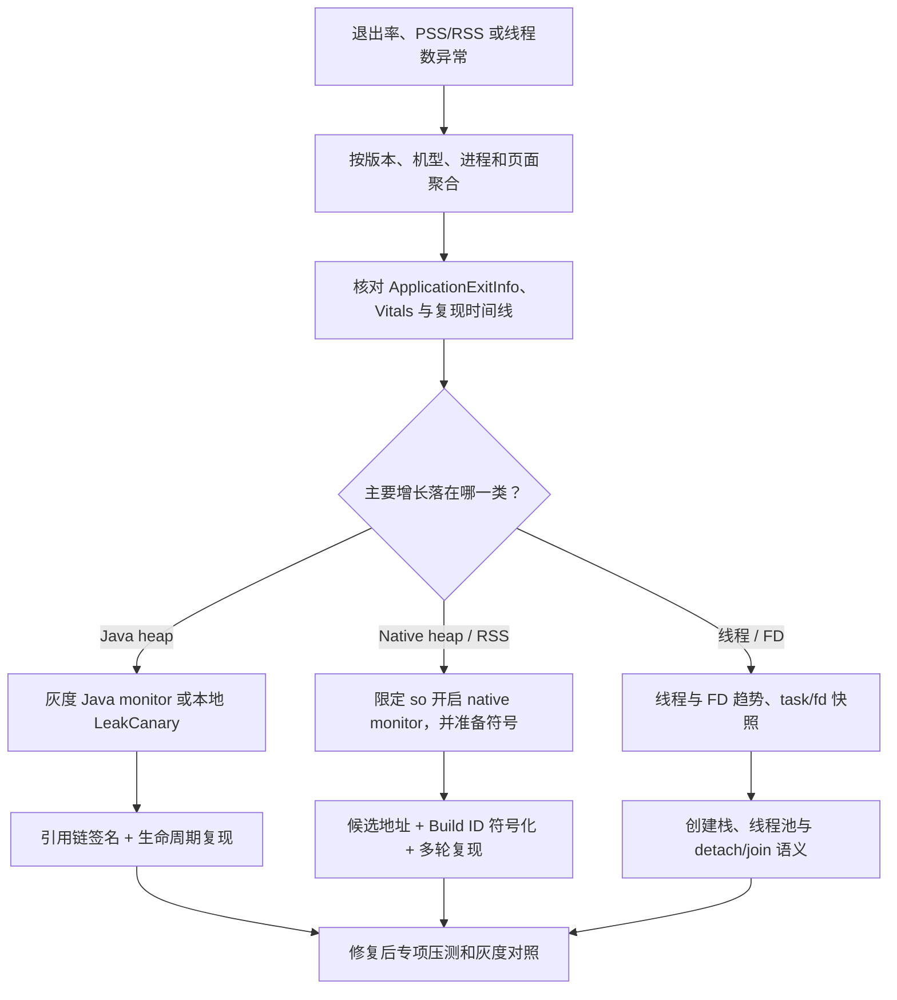

---

title: "KOOM"
chapter: "19"
section: "19.03"
status: finalized
applicable_versions: "Android 8 (API 26) - Android 17 (API 37)"
last_verified: "2026-06-13"
last_verified_against: "KwaiAppTeam/KOOM README.zh-CN and module READMEs, Android ApplicationExitInfo docs, Android 16KB page-size docs"
confidence: medium
tags: [apm]
related_chapters: ["19.0"]
sources:
  - type: blog
    path: "https://github.com/KwaiAppTeam/KOOM"
  - type: blog
    path: "https://github.com/KwaiAppTeam/KOOM/tree/master/koom-java-leak"
  - type: blog
    path: "https://github.com/KwaiAppTeam/KOOM/tree/master/koom-native-leak"
  - type: blog
    path: "https://github.com/KwaiAppTeam/KOOM/tree/master/koom-thread-leak"
  - type: official
    path: "https://developer.android.com/reference/android/app/ApplicationExitInfo"
  - type: official
    path: "https://developer.android.com/guide/practices/page-sizes"
pipeline_stage: ready-to-publish
task6_state: reviewed
task9_state: reviewed
task2b_state: fixed
---

# KOOM

## 先看 Android 17 结论

KOOM 是快手开源的内存专项工具，分为 Java heap、native heap 和 thread 三条诊断路径。它适合已经由 OOM、PSS/RSS 或线程数趋势确认的内存问题。启动慢、网络慢、普通列表卡顿没有明确的内存证据时，不应先接 KOOM。

截至 2026-07-25，[Maven Central 元数据](https://repo.maven.apache.org/maven2/com/kuaishou/koom/koom-java-leak/maven-metadata.xml)中的最新正式版本仍是 `2.2.2`；KOOM `master` 的 `VERSION_NAME` 已写为 `2.2.3`，但这不是已发布版本。当前 `master` HEAD 是 [`df3b8c33f63ab1f23e814c19792314efb653deaf`](https://github.com/KwaiAppTeam/KOOM/commit/df3b8c33f63ab1f23e814c19792314efb653deaf)，构建配置仍使用 compileSdk 34、targetSdk 30、AGP 7.1.0，只能说明源码能在上游工程中构建，不能推导出 Android 17 兼容性。

更关键的限制写在源码里：

- `DefaultInitTask` 只允许 API 21～36，`ForkJvmHeapDumper.dump()` 会再次检查这个条件。Android 17 / API 37 会被拒绝。
- `ThreadMonitor` 只允许 API 28～34，而且只接受 arm64 进程。模块 README 写的“Android N+”已经落后于实现。
- `LeakMonitor` 只检查 API 24+ 和 arm64，没有 API 上限。这代表“没有主动拒绝 API 37”，不代表经过了 API 37 验证。
- Maven `2.2.2` 的发布时间早于上游 2025 年的 Android 15 fast-dump 修改和 2026 年合入的 16 KB page-size 修改，不能把这两批改动算在正式产物里。

所以，在 Android 17 项目里，`2.2.2` 不能作为开箱即用的依赖；当前 `master` 也不能只删除版本判断便上线。采用方需要 fork 源码，逐项移植、验证并维护私有 ART 符号、`libmemunreachable`、Hook 和 16 KB ELF 兼容性。没有这项维护预算时，应保留系统退出证据、本地 Profiler/Perfetto 和 LeakCanary，把 KOOM 排除在生产依赖之外。

## 三个模块并不共享一套判定口径

| 模块 | 观察对象 | 源码中的触发与产物 | 当前边界 |
|---|---|---|---|
| `koom-java-leak` | Java heap，以及线程数、FD 数等 OOM 前兆 | 主进程前台轮询；命中条件后 fork 子进程生成原始 Hprof，再由 Shark 生成引用链 JSON | 公共版本门是 API 21～36；自动路径不是裁剪 Hprof；dump 和分析仍有内存、I/O 与磁盘成本 |
| `koom-native-leak` | 被 Hook 的 app `.so` 中尚未释放的 native 分配块 | Hook 分配/释放函数，将活跃分配与 `libmemunreachable` 结果求交集，产出大小、线程、相对地址和 so 名 | API 24+、arm64；依赖私有系统库与文本格式；API 37 未获上游保证 |
| `koom-thread-leak` | 已退出、却没有 `detach` 或 `join` 的 joinable pthread | Hook `pthread_create`、`pthread_detach`、`pthread_join`、`pthread_exit`，延迟上报创建栈和生命周期时间 | 源码限定 API 28～34、arm64；不能识别仍然活着的 WAITING 线程或无界线程池 |

普通内存指标回答“进程用了多少”，KOOM 尝试回答“什么对象、分配或线程生命周期值得怀疑”。Android Studio Profiler 和 Perfetto 适合观察时间线、分区与复现过程；LeakCanary 专注可复现的 Java/Kotlin 对象保留。四者的证据层级不同，不能互相替换。

## Java heap：触发器比 fork dump 更容易被误读

### 源码会在什么条件下 dump

`OOMMonitor` 只在主进程工作。默认每 15 秒刷新一次 `SystemInfo`，依次运行以下 tracker：

| Tracker | 默认条件 | 会不会触发 Hprof |
|---|---|---|
| `HeapOOMTracker` | heap 使用率超过阈值，并连续 3 次没有明显回落；大堆默认阈值 80%，中等堆 85%，小堆 90% | 会 |
| `ThreadOOMTracker` | 线程数超过 750；旧版 EMUI 的默认值是 450，并连续 3 次维持高位 | 会，同时暂存 `/proc/self/task/*/comm` |
| `FdOOMTracker` | FD 数超过 1000，并连续 3 次维持高位 | 会，同时暂存 `/proc/self/fd` 链接 |
| `FastHugeMemoryOOMTracker` | heap 使用率超过 90%，或一次轮询间隔内增长超过 350000 KB | 立即触发 |
| `PhysicalMemoryOOMTracker` | 设备可用内存比例低于 5% 等区间 | 不会；当前实现只写日志，`return true` 已被注释 |

这里没有“连续 GC 后仍存活”的独立触发器，也没有 PSS/RSS 阈值直接触发 dump。PSS、RSS、VSS 会进入运行信息和报告，但不要把“报告中含有某字段”写成“该字段参与触发”。

进程进入后台时，`ON_STOP` 会停掉轮询；回到前台后才恢复。分析 Service 同样会等待进程前台。每个进程生命周期最多自动 dump 一次；非 debug 构建还配置了“每版本 5 次、首个 15 天内”的分析额度。源码在次数已经 `> 5` 时才拒绝，计数恰好为 5 时仍可能再分析一次，接入方若要求严格上限，应修正这个边界。命中期限或次数限制后，监控循环结束，却不会生成本次 Hprof。

这些默认值是上游策略，不是适合所有应用的安全值。业务接入至少还要加上远程开关、设备分层、随机采样、交互状态、剩余磁盘、电量和冷却时间。对一个 128 MB heap 的进程，90% 与对一个 512 MB heap 的进程含义不同；单看比例也区分不了有意保留的图片缓存和失控增长。

### fork dump 降低主进程停顿，没有消除资源风险

KOOM fast dump 的基本顺序是暂停 ART、fork、恢复父进程，再让子进程写 Hprof。copy-on-write 避免了立刻复制整块堆，但父子进程随后修改的页面仍会产生额外物理内存；子进程还会消耗 CPU、文件 I/O 和磁盘。在可用内存已经很低时，诊断动作本身可能失败或加快进程退出。

这一实现并非公开 Android SDK。`koom-fast-dump` 会按 mangled name 从 `libart.so` 解析 `art::ScopedSuspendAll`、`art::gc::ScopedGCCriticalSection`、ART 锁和 `art::hprof::DumpHeap` 等私有符号。Android 17 的源码锚点是 [`platform/art@android-17.0.0_r1`](https://android.googlesource.com/platform/art/+/refs/tags/android-17.0.0_r1)，但平台源码中存在相似实现，不等于这些 C++ 符号对应用提供 ABI 承诺。上游主动把公共版本门停在 API 36，正说明 API 37 不能靠猜测放行。

还要分清两条 dump 路径：

- `OOMMonitor.dumpAndAnalysis()` 调用 `ForkJvmHeapDumper`，分析成功后把 Hprof 标为 `ORIGIN` 交给 uploader。
- 源码保留了 `ForkStripHeapDumper`，README 的手动示例也会使用它，但自动监控路径没有调用它。

因此，“KOOM 自动产出裁剪 Hprof”并不准确。若上传器真的传原始 Hprof，文件可能包含字符串、账号数据、图片字节、业务对象和第三方 SDK 状态。更安全的生产方案是在端内完成分析，只上传受控 JSON；若保留 Hprof，应单独取得授权，使用应用私有目录、短保留期、加密传输和服务端访问审计。

### 报告能回答什么

上游 `HeapReport` 的 `RunningInfo` 包含 JVM 最大/已用内存、VSS/PSS/RSS、线程数、FD 数及列表，以及 SDK、厂商、机型、应用版本、当前页面、使用时长、设备总内存/可用内存和触发原因。`GCPath` 保存 GC Root、引用路径、实例数、泄漏原因和按引用链计算的 SHA-1 签名；另外还有类实例统计和可疑对象信息。

引用链是“从 GC Root 到可疑对象的路径”，不是对象已经泄漏的数学证明。静态单例保留已销毁 `Activity` 通常证据很强；仍在执行的异步任务、合法缓存和进程级对象则需要结合生命周期再判断。修复后要在同一路径上重复进入/退出页面，配合 LeakCanary 或 Profiler 确认对象数量回落，再观察灰度版本的同签名样本是否下降。

`OOMFileManager.isSpaceEnough()` 只要求大约 1.2 MB 可用空间，远低于真实 Hprof 可能需要的容量。生产接入需要按“预计 Hprof 大小 + 分析临时文件 + 安全余量”计算配额，并设置单文件上限、目录总量、过期清理和失败退避。不要把上游这项轻量检查当成磁盘保护。

## Native leak：候选来自两份数据的交集

Native 模块先用 xhook 改写目标 `.so` 的 PLT 表，拦截 `malloc`、`realloc`、`calloc`、`memalign`、`posix_memalign` 和 `free`，维护仍然存活的分配记录。检查时，它再加载 `libmemunreachable.so`，解析私有的 `GetUnreachableMemoryString(bool, size_t)` 符号，并从其人类可读文本中提取不可达地址。只有同时出现在“KOOM 活跃分配”和“系统不可达结果”中的块，才进入候选报告。

这套做法带来四个边界：

1. PLT Hook 只能覆盖实际经过被 Hook 入口的分配。自定义 allocator、静态绑定、直接 `mmap`、GPU/驱动内存和未选中的 `.so` 不在同一观察面。
2. “从当前 root 集不可达”比“长期无用”更接近泄漏，但扫描瞬间、库内部缓存和生命周期仍可能制造候选。修复结论应有多轮趋势或可控复现支撑。
3. `libmemunreachable` 是平台内部组件。Android 17 源码锚点 [`system/memory/libmemunreachable@android-17.0.0_r1`](https://android.googlesource.com/platform/system/memory/libmemunreachable/+/refs/tags/android-17.0.0_r1) 仍包含相关能力，但 app 进程私自 `dlopen`、解析 C++ 符号和依赖文本格式都没有 SDK 稳定性保证。
4. 未开启本地符号化时，KOOM 只提供 `rel_pc` 与 `soName`。服务端必须按应用版本、ABI、Build ID 保存未经 strip 的精确符号文件；错一个构建，地址就可能落到错误函数。

一个播放器版本的 RSS 每播放一次视频就上升 20 MB，可以先把播放器业务 `.so` 加入 selected list，排除 KOOM 自身与已知基础库，再按调用栈聚合持续出现的大分配。若候选落在第三方解码器的帧缓存创建路径，还要用停止播放、销毁实例、等待回收后的 RSS 与候选数量验证；单条 native stack 不能直接定责。

`LeakMonitorConfig` 还提供分配大小门槛、目标/忽略 `.so`、默认 300 秒扫描周期和本地符号化开关。当前 `LeakMonitor.call()` 对 `nativeHeapAllocatedThreshold` 的判断方向与注释不一致：已分配 native heap 大于阈值时反倒提前返回。因此，在没有为所用提交编写回归测试前，不要依赖该字段负责触发保护。

## Thread leak：只识别一种 pthread 生命周期错误

线程模块的判定很窄：joinable 线程已经走到退出，但没有被 `pthread_detach` 或 `pthread_join` 回收，超过延迟后才生成 `ThreadLeakRecord`。记录字段是 `tid`、创建/开始/结束时间、线程名和创建调用栈。这类错误会遗留 pthread 资源，却不等同于“线程仍然活着”。

下面几类问题需要另一套观测：

| 问题 | KOOM `ThreadLeakMonitor` 能否直接确认 | 应补的证据 |
|---|---|---|
| joinable 线程已退出，未 detach/join | 能，这是它的目标 | `ThreadLeakRecord` 创建栈与多设备聚合 |
| 匿名线程仍在运行 | 不能 | `/proc/self/task` 数量、线程名、创建栈或采样栈 |
| 无界线程池持续创建 worker | 不能直接确认 | 线程总量趋势、线程池指标、创建点 |
| 业务线程长期 WAITING | 不能 | thread dump、锁/队列所有者、业务生命周期 |
| Binder、RenderThread、GC 等常驻线程 | 不应按存活时间判泄漏 | 系统线程基线和版本/设备对照 |

源码配置没有面向业务的白名单字段。所谓“白名单”应放在应用自己的上报与聚合层：要求业务线程命名，按规范化线程名前缀和创建栈归类；系统线程、固定规模线程池和经过评审的常驻 SDK 线程只做趋势监控。白名单不能掩盖数量持续增长，同一前缀仍要设置进程级上限和增长率告警。

`ThreadMonitor.stop()` 会调用 native stop，但上游 C++ `ThreadHooker::Stop()` 当前为空实现。接入方需要验证停止后是否还会拦截新线程、是否继续保留记录，以及重复 start/stop 是否安全，不要把 Java 方法返回当成 Hook 已完整卸载。

## 把系统退出证据放在 KOOM 前面

线上看到“OOM”时，先确定是哪一种退出或内存增长，再决定是否启动高成本诊断。建议使用下面这条证据路径：



这条路径把退出事实、内存分区和专项证据分开。Java、native、thread 的修复人和验证工具通常不同，不能把 PSS 上升直接翻译成“Java 泄漏”。

### `ApplicationExitInfo` 的版本边界

Android 11 / API 30 起，可以在下次启动后通过 `ActivityManager.getHistoricalProcessExitReasons()` 查询退出记录。调用会跨进程进入 `system_server`，不宜同步放在冷启动主线程。解释结果时还要留三个余量：

- 先用 `ActivityManager.isLowMemoryKillReportSupported()` 判断设备是否支持 `REASON_LOW_MEMORY`。不支持时，内存压力导致的杀进程可能只显示 `REASON_SIGNALED` 和 `SIGKILL`。
- `getPss()`、`getRss()` 是系统最近一次采样值，可能为 0，也不保证贴近退出瞬间。
- `getTraceInputStream()` 主要服务于有 trace 的退出类型，例如 ANR 或部分 native crash；不要假设 OOM/LMK 一定带可读 trace。

Android 8～10 没有 `ApplicationExitInfo`。这部分设备要结合 Android Vitals、本地复现、版本级 PSS/RSS 趋势和受控日志判断。现代 Android 的内存回收决策由用户空间 `lmkd` 根据内存压力与进程优先级执行；Android 17 平台锚点是 [`system/memory/lmkd@android-17.0.0_r1`](https://android.googlesource.com/platform/system/memory/lmkd/+/refs/tags/android-17.0.0_r1)。相关判断不直接依赖 `android17-6.18-2026-06_r6` 的内核代码，也不应继续使用旧式“内核 lowmemorykiller 日志”概括 API 37 的机制。

### `onTrimMemory` 不能再负责统一压力触发

`ComponentCallbacks2.onTrimMemory()` 在历史版本上可用于补充进程状态，但 Android 14 起系统不再向应用交付 `TRIM_MEMORY_UI_HIDDEN`、`TRIM_MEMORY_BACKGROUND` 之外的旧级别；其余旧常量在 Android 15 / API 35 正式废弃。`UI_HIDDEN` 表示 UI 转入不可见，`BACKGROUND` 表示后台进程已成为回收候选，两者都不是“系统将在固定时间内杀进程”的倒计时。Android 17 接入应以自身 heap/RSS/线程趋势和系统退出记录为主，不能等待旧压力级别再 dump。

PSS 适合跨进程分摊共享页后的总体比较，RSS 表示当前驻留物理页，Java heap 只覆盖 ART 管理的堆。三条曲线中，Java heap 平稳而 RSS/PSS 持续上升，才值得把排查重点移向 native、graphics、mmap 或线程栈；`dumpsys meminfo` 与 Perfetto memory counters 可以在复现环境里继续拆分。

## 端侧报告要能复现，也要克制采集

KOOM 原始结构之外，平台通常还需要样本、构建和业务上下文。下面是一份推荐的统一事件外壳，用于说明字段职责，不要求照搬字段名：

```json
{
  "sample_id": "opaque-random-id",
  "kind": "java_heap | native_heap | pthread_resource",
  "app_version": "17.3.0",
  "build_id": "native-symbol-build-id",
  "abi": "arm64-v8a",
  "api_level": 37,
  "page": "PlayerDetail",
  "process_state": "foreground",
  "trigger": {
    "java_heap_bytes": 412000000,
    "pss_kb": 536000,
    "rss_kb": 601000,
    "thread_count": 812,
    "fd_count": 438
  },
  "evidence": {
    "gc_path_signature": "sha1-or-null",
    "native_so": "libplayer.so",
    "native_rel_pc": "0x1234",
    "thread_name": "player-worker-42",
    "creator_stack": "redacted-summary"
  }
}
```

事件外壳只保存定位所需的摘要。`kind` 决定哪些 evidence 字段有效；不要为方便查询而给每条事件填入并不存在的 GC path、native stack 或线程状态。账号、URL query、消息正文、图片字节和完整对象字段应在端内删除或散列。

文件治理至少包括：

- 端内先生成 JSON 摘要，原始 Hprof 默认不上报。
- dump 前检查预计容量，设置单文件上限、目录总配额和过期时间；失败后指数退避。
- 只在命中远程开关、采样和设备能力条件时加载对应模块；低 RAM、低磁盘、过热或高交互场景跳过。
- native 符号按版本、ABI、Build ID 保存；Java 混淆映射按构建号保存。
- 上传任务使用约束网络与充电策略，进程被杀后也不能无限重试同一个大文件。
- 远程关闭后验证 monitor、Hook、子进程和临时文件均停止或被清理。

## Android 17 移植清单

把 KOOM 带到 API 37 不是改一处 `SDK_INT`。至少完成以下验证，才可从实验依赖转为灰度依赖：

1. 从明确的 KOOM commit 构建，不把 Maven `2.2.2` 与 `master` 的 Android 15/16 KB 修改混在同一个版本描述里。
2. 审阅 `DefaultInitTask` 和 `ForkJvmHeapDumper` 的 API 37 版本门；对每个私有 ART 符号做启动时解析、失败降级和真机 dump 测试。
3. 在 Android 17 / API 37 上测试大堆、并发分配、前后台切换、dump 超时、子进程被杀、磁盘不足和重复启动。
4. 对 native monitor 验证 `libmemunreachable.so` 加载、符号解析、ptrace/进程 dumpable 条件、结果文本解析、xhook 与目标 allocator 覆盖率。
5. 不启用 thread monitor，除非已完成 API 37 适配；上游源码当前会直接拒绝。适配后还要覆盖 create/detach/join/exit、线程复用和 stop/start。
6. 仅打包 arm64 的 native/thread 模块，或为其他 ABI 明确禁用；同时统一 `c++_shared` / `c++_static` 依赖策略，避免 `libc++_shared.so` 冲突。
7. 使用 NDK r28+ 重编所有 native 产物，并对最终 APK/AAB 执行 16 KB ELF 与 ZIP 对齐检查。上游 `master` 升到 NDK `28.2.13676358` 只是必要条件，业务工程中的预编译 `.so` 仍要逐个检查。
8. 在 Android 17 的 16 KB 设备或官方模拟环境关闭 page-size 兼容模式运行专项用例。只通过 4 KB 设备不能证明 API 37 可用。
9. 对比启用组和关闭组的启动时间、帧停顿、ANR、OOM/LMK、PSS 峰值、磁盘写入与电量，确认诊断收益高于观测成本。
10. 修复后用同一压测脚本复测，并观察至少一个灰度周期内的签名设备数与退出率；单次 report 消失不算验证完成。

检查 16 KB 产物时，Android 官方建议对 ELF LOAD segment 和 APK ZIP 对齐分别验证。下面两条命令分别检查 native 库的段对齐与最终 APK 的包内对齐：

```bash
llvm-objdump -p path/to/libkoom-fast-dump.so | grep LOAD
zipalign -c -P 16 -v 4 app-release.apk
```

第一条输出中的 LOAD segment 对齐应达到 `2**14`，第二条必须对最终交付 APK 执行。AAB 还要用当前 bundletool 生成对应 APK 后检查，不能只验中间产物。

## 参考源码与文档

- [KOOM 当前审阅锚点 `df3b8c33`](https://github.com/KwaiAppTeam/KOOM/tree/df3b8c33f63ab1f23e814c19792314efb653deaf)
- [KOOM `DefaultInitTask` 的 API 21～36 版本门](https://github.com/KwaiAppTeam/KOOM/blob/df3b8c33f63ab1f23e814c19792314efb653deaf/koom-monitor-base/src/main/java/com/kwai/koom/base/DefaultInitTask.kt)
- [KOOM `ThreadMonitor` 的 API 28～34 与 arm64 限制](https://github.com/KwaiAppTeam/KOOM/blob/df3b8c33f63ab1f23e814c19792314efb653deaf/koom-thread-leak/src/main/java/com/kwai/performance/overhead/thread/monitor/ThreadMonitor.kt)
- [Android 17 ART 源码 `android-17.0.0_r1`](https://android.googlesource.com/platform/art/+/refs/tags/android-17.0.0_r1)
- [Android 17 `libmemunreachable` 源码 `android-17.0.0_r1`](https://android.googlesource.com/platform/system/memory/libmemunreachable/+/refs/tags/android-17.0.0_r1)
- [ApplicationExitInfo API 文档](https://developer.android.com/reference/android/app/ApplicationExitInfo)
- [Android 应用内存管理与 `onTrimMemory` 版本说明](https://developer.android.com/topic/performance/memory)
- [Android 16 KB page-size 兼容指南](https://developer.android.com/guide/practices/page-sizes)
