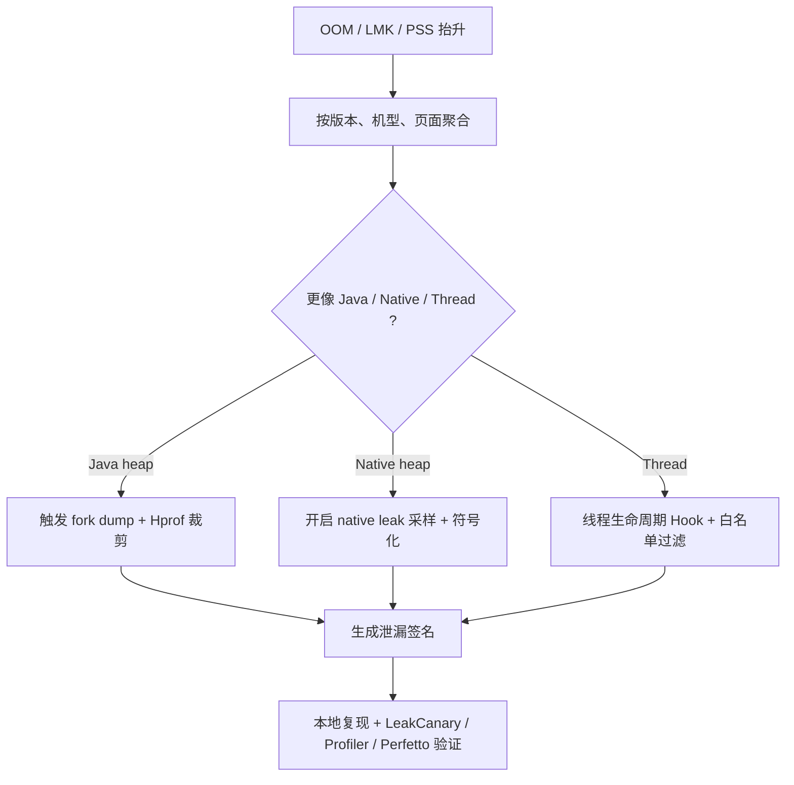

# KOOM

<!-- outline-start -->
## 本节要点大纲

### 锚点（必须覆盖）

- 🔹 [定位] 说明 KOOM 处理 Java heap、native heap、thread 三类内存风险；写清它和普通内存指标、Profiler、LeakCanary 的差异。
- 🔹 [模块拆分] 用表格列出 `koom-java-leak`、`koom-native-leak`、`koom-thread-leak` 的观察对象、触发条件、产物和开销。
- 🔹 [Java heap] 展开 fork dump、Hprof 裁剪、引用摘要、对象保留路径；说明何时触发 dump、何时放弃 dump。
- 🔹 [触发策略] 写清 heap 增长、PSS/RSS、前后台、页面、低内存信号、采样率如何组合，避免频繁 dump。
- 🔹 [Native leak] 说明 malloc/free 追踪、可达性分析、符号化、so 归属和采样成本；补一个 native SDK 泄漏候选案例。
- 🔹 [线程泄漏] 定义匿名线程、无界线程池、长时间 WAITING、常驻系统线程的判定口径；给白名单和误判处理方式。
- 🔹 [线上 OOM] 写一条从 OOM / PSS 抬升到 KOOM report，再到 heap / native / thread 分类的分析路径。
- 🔹 [系统信号] 补充 `onTrimMemory`、LMKD、ApplicationExitInfo、PSS / RSS / Java heap 的配合方式和版本边界。
- 🔹 [端侧策略] 覆盖上传前裁剪、文件大小、磁盘配额、隐私、失败重试、低端机禁用和远程开关。
- 🔹 [验证方式] 修复后要用 LeakCanary、Profiler、灰度内存指标或专项压测验证，不能只看单次 report。

### 扩展（可选深入）

- 🔸 增加一份 KOOM report schema，覆盖 object type、retained size、native stack、thread name、page、version、sample id。
- 🔸 增加 Java、native、thread 三类问题的排查流程图。
- 🔸 补充与 Android 14+ / 15+ / 16+ 内存诊断 API 的关系，新增内容必须标注来源。
- 🔸 对 KOOM upstream 活跃度、模块可用性、AGP / NDK 适配风险做核对。
- 🔸 增加“何时不该接入 KOOM”的反例，比如启动慢、网络慢、普通列表卡顿。

### 流水线加工要求

- 每个内存判断必须说明证据来源：系统指标、KOOM report、heap 摘要、native stack 或线程列表。
- 不要把 Java 泄漏、native 泄漏、线程泄漏混成一个“大内存问题”。
- 涉及线上 dump 的段落必须写停顿、磁盘、隐私和失败处理。

### OpenClaw 加工指引

> **锚点**是最低覆盖要求，加工时必须逐条落实并标注验证结果。
> **扩展**视素材丰富程度选择性深入。
> 如果从 Obsidian 素材或 AOSP 源码中发现大纲未列出但与本节强相关的知识点，
> 可**就地插入**最相关的锚点之后，并用 `[自动发现]` 标注，方便后续 review。
> 锚点内容需 L1/L2 验证，扩展内容至少 L2 验证，自动发现内容至少标注来源。
<!-- outline-end -->

## KOOM 是内存专项工具

KOOM 来自快手团队，定位集中在 OOM 和内存泄漏治理。它覆盖 Java Heap 泄漏、Native Heap 泄漏和线程泄漏，适合已经确认“内存是主要问题”的应用。启动慢、列表卡顿、网络慢这些问题，不应该从 KOOM 开始。

它的使用方式也更接近专项诊断 SDK。线上打开后，团队要关注 dump 时机、文件大小、上报失败、低端设备开销和误报过滤。

## 三个模块对应三类内存风险

| 模块 | 观察对象 | 触发条件 / 产物 | 主要开销与边界 |
|---|---|---|---|
| `koom-java-leak` | Java 堆对象 | heap、线程数、FD、VSS 等资源连续超过阈值后，产出 fork dump、Hprof 裁剪结果和 Shark 分析报告 | 父进程仍有短暂 VM suspend / fork 窗口，子进程 dump 与分析会占用内存和 I/O；官方模块支持 Android 5.0+ |
| `koom-native-leak` | Native 分配块 | 通过 `malloc` / `free` 记录分配元数据，周期性产出不可达 native 块、分配大小和调用栈 | 依赖 PLT Hook 与 unwind，官方模块面向 Android 7.0+ 且仅支持 arm64-v8a |
| `koom-thread-leak` | Java / native 线程 | Hook `pthread_create` / `pthread_exit`，延迟上报未 `detach` / `join` 的 joinable 线程 | 依赖线程生命周期 Hook，官方模块面向 Android 7.0+ 且仅支持 arm64-v8a |

把这三类问题放在一起看，KOOM 处理的是“哪类对象或分配没有按预期释放”，粒度比“内存数值偏高”更细。

## Java 泄漏：重点是 dump 成本

Java 堆泄漏检测通常绕不开 Hprof。Android 原生 heap dump 的入口通常是 `Debug.dumpHprofData()`，它最终走到 `dalvik.system.VMDebug.dumpHprofData()`。为了拿到一致的 Hprof，ART 会停住 Java 世界并遍历堆；在大堆和慢 I/O 设备上，这段 Stop-The-World 时间会拖到秒级，主进程直接调用就可能把前台交互拖成 ANR。

KOOM 官方文档给出的路线是 `VM suspend -> fork -> VM resume -> child dump`：父进程借 Linux copy-on-write 只承受很短的 suspend / fork 窗口，Hprof 写文件和后续 Shark 分析落到子进程。这个设计降低主进程冻结时间，但没有消除成本。子进程仍会占用额外内存和 I/O；fork 发生在多线程进程里，还要控制 native 锁、malloc 状态和超时退出，避免子进程继承父进程的锁状态后卡死。

这条路线的直接收益：线上可以在达到阈值时保留堆现场，不必等用户 OOM 后只拿到一个崩溃点。代价也要算清：

- Hprof 文件仍然很大，需要裁剪或只上传摘要。
- fork 和 dump 对低内存设备仍然有压力，KOOM 文档也建议远程开关和采样开启。
- dump 阈值过低会引入噪声，过高又可能错过泄漏早期。

Java 泄漏报告不要只上报“内存超过 80%”。更有用的数据是触发前后的页面、进程状态、前台后台、GC 次数、最大对象类型、引用链摘要和是否接近 OOM。

## Native 泄漏：重点是可达性分析

Native 泄漏比 Java 泄漏难，是因为 ART 的引用图帮不上忙。KOOM native 模块的思路接近 tracing garbage collection：通过 `xhook` 这类 PLT Hook 库拦截 `malloc` / `free` 等分配器方法，记录地址、大小和分配调用栈；再扫描进程内存中可达指针，未被标记到的分配块成为泄漏候选。

这一层依赖的是 native 分配入口拦截能力。KOOM 官方接入依赖里包含 `com.kuaishou.koom:xhook`，同类工程也常用 bhook / xhook 处理动态库符号重定向和 Android linker 兼容问题。

报告里需要包含这些信息：

- 分配大小和累计大小
- 分配调用栈
- 所属 so 或业务模块
- 是否在多轮扫描后持续存在

Native 泄漏检测通常要结合符号表和 unwind 能力。没有符号化，报告只剩地址；没有采样和阈值，报告会被正常长期缓存淹没。

## 线程泄漏：不要把常驻线程当异常

线程泄漏检测容易误报。Android 进程里有 Binder 线程、RenderThread、线程池 worker、监控线程、常驻 SDK 线程，它们本来就可能长期存活。

KOOM 线程模块通过 Hook 线程生命周期函数记录创建和退出，再周期性报告疑似未退出线程。线上可用的前提是先建立白名单：

- 系统线程和框架线程不报。
- 业务线程必须命名，匿名线程优先整改。
- 线程池 worker 按线程池维度统计，不按单线程直接报警。
- 只对持续增长或超过阈值的线程数报警。

线程泄漏还会占用线程栈、文件描述符和调度资源，32 位进程里虚拟地址空间也更容易被耗尽。

## 使用建议

KOOM 不适合“先全量开起来看看”。更稳的接入方式是：

1. 先用线上 OOM、LMK、PSS、Java heap 使用率确认内存异常足够集中。
2. 按问题类型只打开一个模块，比如先查 Java 泄漏或 native 泄漏。
3. 设置灰度、采样、阈值和远程开关，避免异常版本把 dump 压力放大。
4. 把报告接到符号表、混淆映射和页面上下文里，否则样本难以分配到代码负责人。

Native 模块的依赖模式也要提前定。KOOM Native 模块支持 `c++_shared` 和 `c++_static` 两种模式，多个 KOOM 模块不能混用 shared / static。`c++_shared` 包体小，但 `libc++_shared.so` 版本冲突可能引发 `dlopen failed` 或符号缺失；`c++_static` 包体更大，隔离性更好。`pickFirst` 只适合临时解决打包冲突，不能替代 STL 版本治理。

KOOM 的强项是把线上内存现场保下来。它的边界也清楚：它不能替代本地 heap 分析、native 符号化、Perfetto memory 轨道和业务缓存治理。

## Java heap 泄漏的触发策略

Java heap 泄漏检测最怕两个极端：触发太早会误报，触发太晚只剩 OOM 崩溃。线上更稳的触发条件通常由多个信号组成：

| 信号 | 用途 | 误判风险 |
|---|---|---|
| Java heap 使用率 | 判断是否接近 `maxMemory()` | 大对象缓存也会抬高使用率 |
| 连续 GC 后存活对象 | 判断是否有对象持续保留 | 短期异步任务会造成临时保留 |
| 前后台状态 | 区分用户使用中和后台恢复 | 后台被系统限制时采样可能延迟 |
| 页面历史 | 判断泄漏是否和某类页面有关 | 页面路由缺失会影响聚合 |
| OOM 前兆 | 在崩溃前保留样本 | 低端机 dump 本身有压力 |

KOOM 的 fork dump 思路缓解了主进程卡顿，但不等于 dump 没成本。触发策略要优先保护用户体验：前台高频交互、低电量、低剩余内存、短时间已经 dump 过，都应该跳过或延迟。

## Hprof 裁剪和引用链摘要

完整 Hprof 通常不适合直接上传。书稿级平台里更常见的做法是把 Hprof 处理成两层数据：

- **主事件**：版本、机型、进程、页面、heap 使用率、触发原因、摘要 id。
- **分析附件**：引用链、最大对象类型、可疑 GC Root、对象数量、裁剪后的 Hprof 或 Shark/自研解析结果。

裁剪的目标是缩小文件并保留引用关系。常见做法是丢弃体积大的 primitive arrays，例如图片像素 `byte[]` 或大文本数组；类元数据、对象 id、字段引用和 GC Root 信息要保留，否则引用链无法还原。

引用链摘要要能回答这几个问题：

1. 谁是 GC Root。
2. 哪个引用把泄漏对象留下来。
3. 泄漏对象是什么类型。
4. 泄漏对象属于哪个页面或业务模块。
5. 同一签名在多少设备上出现。

如果只上传 “heap 90%” 或 “Activity 泄漏”，研发仍然要回到本地重抓。线上样本的价值在于先帮你缩小到一个签名。

## Native leak 检测的成本点

Native leak 模块要处理三个成本：

- **分配记录成本**：每次 `malloc` / `free` 记录元数据和调用栈，开销和采样率直接相关。
- **可达性扫描成本**：扫描 native heap 和寄存器/栈范围需要 CPU 时间。
- **符号化成本**：没有 so 符号表，报告只能显示地址或不完整栈。

线上通常不会对所有 native 分配全量记录。可以采取的策略：

- 只在灰度或异常设备开启。
- 对大分配或可疑 so 提高采样。
- 只保留 top N 分配栈。
- 符号表和 build id 一起管理，避免版本错配。

Native 内存上涨不一定是泄漏。图片缓存、播放器 buffer、OpenGL / Vulkan 资源、mmap 文件、厂商 SDK 内部池化都会让 native 内存长期维持高位。KOOM 给的是泄漏候选，结论仍要结合业务生命周期。

## 线程泄漏的判定口径

线程泄漏报告应该按“线程来源”和“增长趋势”判断，不能只按单个线程存活时间直接报警。

建议入库字段：

| 字段 | 说明 |
|---|---|
| `thread_name` | 业务线程必须命名，匿名线程优先整改 |
| `creator_stack` | 创建线程的调用栈 |
| `alive_duration_ms` | 存活时间 |
| `state` | WAITING、TIMED_WAITING、RUNNABLE、nativePollOnce 等 |
| `thread_group` | 线程池、业务模块或 SDK 名 |
| `is_whitelisted` | Binder、RenderThread、常驻线程等白名单 |

处理顺序也要克制。先修匿名线程和无界线程池，再看长时间 WAITING 的业务线程，随后处理第三方 SDK 线程。不要直接把系统线程池和 Binder 线程池当成泄漏。

## 线上 OOM 分析流程

KOOM 更适合放在这条流程里：

这一步先做分类。Java、native、线程三类问题的修复人、证据和工具都不同。把所有内存问题都归到“OOM”只会让任务无法分配。

## 和 Android 系统内存信号配合

KOOM 不应该单独使用。至少要和这些系统信号配合：

- `ApplicationExitInfo`（Android 11 / API 30+）：确认进程是否因为 low memory、ANR、crash 等退出；读取前先用 `ActivityManager.isLowMemoryKillReportSupported()` 判断设备是否能报告 `REASON_LOW_MEMORY`。
- Android Vitals LMK / crash 数据：判断真实分发面的受影响程度。
- Perfetto memory counters：看 RSS、PSS、heap、ion / dmabuf 等曲线变化。
- `dumpsys meminfo`：本地复现时拆 Java heap、native heap、graphics、stack、code。

Android 8-10 没有 `ApplicationExitInfo`，只能把 Android Vitals、LMK / lowmemorykiller 日志、Crash 平台和本地 `dumpsys meminfo` 放在一起判断。`ActivityManager.getHistoricalProcessExitReasons()` 是到 `system_server` 的查询，不放在冷启动主线程同步调用。

KOOM 负责保留更细现场，系统信号负责定义事实口径。没有系统信号，线上 OOM 治理容易把“用户杀进程”“后台回收”“崩溃重启”混成一类。
