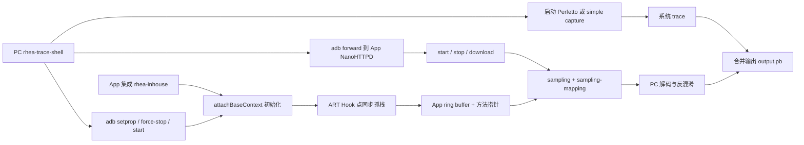

# btrace / RheaTrace

## Android 17 上先不要接入

btrace 是字节跳动开源的跨平台 tracing 项目，Android 代码仍沿用 `RheaTrace3`、`rhea-inhouse` 等历史命名。它的用途是把应用线程的 Java 方法栈样本转换成 Perfetto protobuf，并在 perfetto 模式下与系统 trace 合并，让方法现场和调度、Binder、I/O、渲染时间线处在同一个时钟轴上。

截至 2026-07-25，仓库最新 tag 是 [`v3.1.0`](https://github.com/bytedance/btrace/tree/v3.1.0)，对应 commit `2ae621f2d84ad54b2811d675d86ba2815006adb3`。这个 tag 加入了 HarmonyOS，Android 子工程的 `POM_VERSION_NAME`、README 依赖和脚本表仍停在 `3.0.0`。[Maven Central 元数据](https://repo.maven.apache.org/maven2/com/bytedance/btrace/rhea-inhouse/maven-metadata.xml)显示 Android 产物最新是 `3.0.1-alpha01`，稳定版仍是 `3.0.0`。不能因为仓库打了 `v3.1.0` tag，就把 Android 依赖写成 `3.1.0`。

当前开源 Android 实现不能视为 Android 17 / API 37 兼容，原因已经落到源码和产物：

- btrace 解析旧的 `art::StackVisitor::WalkStack<CountTransitions::kNo>(bool)` C++ 符号。Android 17 的 [`StackVisitor`](https://android.googlesource.com/platform/art/+/refs/tags/android-17.0.0_r1/runtime/stack.h) 已给 `WalkStack` 增加第二个模板参数，`android-17.0.0_r1` 显式实例化的是新 mangled symbol。旧符号解析失败时，核心 `StackVisitor::init()` 返回 false，后续方法采样会静默失败。
- 上游只声明“Java 对象创建监控未适配 Android 15+”，但这不是唯一的高版本风险。同步抓栈、JNI、锁、GC、park/wait 等路径都 Hook 或解析 ART 私有实现，没有 SDK/NDK ABI 保证。
- Android 子工程仍用 compileSdk 30、targetSdk 30、AGP 4.1.0、NDK `21.1.6352462`。这组版本只能描述上游构建环境，不能证明 API 37 行为。
- `3.0.1-alpha01` AAR 中的 `librheatrace.so` 和随包 `libc++_shared.so` 的 ELF LOAD segment 都是 `2**12` 对齐。`npth_dl.c` 还用 `0xfff` / `0x1000` 计算 ELF section 的 `mmap` 偏移。它没有满足 Android 17 严格 16 KB 运行环境的条件。

Android 17 设备上可能仍得到一份只有系统轨道的 `.pb`，这不代表 btrace 方法采样成功。采用方需要 fork 并修复 ART 符号、16 KB ELF 与页大小假设，再把“采样记录数大于零、方法能正确符号化”设为自动验收条件。没有维护私有 ART Hook 的能力时，直接使用 Perfetto、`androidx.tracing`、Perfetto SDK、simpleperf 或 Android Studio Profiler。

3.0 的消费侧没有 Gradle 插件或 Transform，现代 AGP 工程在依赖解析层面可以加载普通 AAR；这只能排除旧版“编译期插桩 API 不兼容”一项风险。重建 fork 仍要升级上游 AGP/Gradle/NDK，最终 App 还要验证 manifest 合并、`libc++_shared.so` 冲突、ABI 筛选和 16 KB 打包结果。

## 3.0 已经不做编译期全量插桩

btrace 2.0 依靠 Gradle 插件和编译期字节码插桩记录方法进入/退出。3.0 删除了应用方法的编译期全量插桩，改为“运行时动态 Hook + 当前线程同步抓栈”：

1. ShadowHook 和 JNI Hook 拦截一批高频或可能阻塞的 ART 路径，例如对象分配、JNI 调用、Monitor、GC、`Object.wait()`、`Unsafe.park()`。
2. Hook 点在目标线程上调用 ART 私有 `StackVisitor`，只保存 `ArtMethod*` 和时间、线程、rusage 等轻量信息。
3. 停止采集后，再对去重的方法指针批量符号化，转换成 Perfetto 的 stack/slice 数据。
4. PC 端把应用样本追加到系统 trace，输出 `.pb`。

同步抓栈省掉了“采样线程暂停目标线程、抓栈、恢复线程”的固定成本，也能在锁、wait、park 等 Hook 点记录 wall time 与 thread CPU time。但它依赖 Hook 点：线程在两次 Hook 之间执行了哪些短方法，不会被完整记录；线程长期阻塞在未覆盖的入口，也可能没有足够样本。这里的 slice 是由样本和 Hook 上下文重建的诊断视图，不能当成每个方法精确的 enter/exit 计时。

这也澄清了两个常见配置误区：

- btrace 3.0 没有 2.0 那种方法 include/exclude 插桩表。`-m` 接收的是 ProGuard/R8 mapping，用于反混淆，不是 method mapping。
- `-sampleInterval` 是同一线程两次同步抓栈之间的最小间隔，默认 `1,000,000 ns`。它不启动一个严格每 1 ms 唤醒的定时采样器；没有 Hook 点，就没有对应样本。

## 从构建到 Perfetto 的采集链

采集过程跨 App、adb、PC 脚本和 Perfetto，任何一段失败都会造成“文件生成了，但证据不完整”。下面这张图标出数据与控制路径：



冷启动时，PC 先写 `debug.rhea3.startWhenAppLaunch=1`，再 force-stop 并启动 Launcher Activity；App 在 `attachBaseContext()` 读取属性并开始采样。非重启采集则通过 adb forward 访问 App 内的 NanoHTTPD，发送 start/stop/download。端侧端口记录、HTTP server、采样文件、mapping 文件或系统 trace 任一缺失，PC 都可能超时或只留下部分数据。

### 接入包要有明确开关

上游建议在真实实现与 no-op AAR 之间切换。下面的模板保留这种做法，并把版本固定在稳定版：

```groovy
dependencies {
    if (providers.gradleProperty("enableBtrace").orNull == "true") {
        implementation("com.bytedance.btrace:rhea-inhouse:3.0.0")
    } else {
        implementation("com.bytedance.btrace:rhea-inhouse-noop:3.0.0")
    }
}
```

no-op 版本保留同名 API，适合让普通构建不携带 Hook 行为。Android 17 fork 不能复用上面的官方坐标冒充兼容版，应使用自有 group/version，并记录上游 commit、ART tag、NDK、ShadowHook 和 16 KB 测试结果。

App 需要尽早初始化，下面的调用放在主进程 `Application.attachBaseContext()`：

```java
@Override
protected void attachBaseContext(Context base) {
    super.attachBaseContext(base);
    RheaTrace3.init(base);
}
```

`RheaTrace3.init()` 自己会拒绝非主进程，所以官方 3.0 不能采集远程 Service 进程。初始化还会启动端内 HTTP server；不要把真实依赖作为无条件常驻的生产 SDK，internal/专项包更容易控制暴露面和性能变量。

### 一条可复现的冷启动命令

这条命令用于采集主进程 10 秒冷启动，并显式要求调度事件：

```bash
java -jar rhea-trace-processor-3.0.0.jar \
  -a com.example.app \
  -t 10 \
  -o startup-api34.pb \
  -m app-release-mapping.txt \
  -r \
  sched
```

`-r` 表示重启 App，`sched` 是传给系统 trace 脚本的 category，两者互不替代。源码在没有提供 category 时也会补 `sched`，但复现记录里显式写出更清楚。采集前先用 `--list` 查看设备支持的 category；要分析 Binder、磁盘或频率，还要确认对应事件确已进入 trace，不能看到 `.pb` 就假设轨道齐全。

## perfetto 与 simple 模式

| 项目 | `perfetto` | `simple` |
|---|---|---|
| PC 侧实现 | `PerfettoCapture` 启动 `record_android_trace`，随后追加应用样本 | `LiteCapture` 只等待采集结束并写应用样本 |
| 自动选择 | PC 源码在 API 28+ 默认选择 | API 27 及以下默认选择 |
| 系统信息 | 可包含 atrace/ftrace、调度、频率等，取决于 category 与设备权限 | 当前源码没有采系统 trace |
| 输出 | 系统 trace + btrace 样本的 `.pb` | 仅 btrace 样本转换的 `.pb` |
| 诊断能力 | 能区分 Running、Runnable、阻塞与业务栈样本 | 只能看到 App 方法样本，等待原因容易误判 |

README 把 Android 8.1 写成 perfetto 默认边界，但 `Main.getSystemLevelCapture()` 的实现用 `SDK_INT >= 28`，也就是 Android 9。API 27 若要显式尝试 `-mode perfetto`，必须在目标设备验证脚本与 tracing service；文档描述不能替代测试。

README 还说 simple 模式能带系统 atrace，当前 `LiteCapture` 源码只调用 `SamplingTraceDecoder`，没有启动 atrace。这类文档与实现冲突应以所用 commit 的代码和产物测试为准。

## 参数决定“能看到什么”

| 参数 | 精确含义 | 容易踩的坑 |
|---|---|---|
| `-a` | 包名；端内只采主进程 | 不能靠包名覆盖同包多进程 |
| `-t` | PC 等待的采集时长，单位秒 | 过长更容易覆盖 ring buffer；过短可能漏掉首帧后任务 |
| `-o` | 最终 `.pb` 路径 | 同时保留设备、API、App 版本和场景信息 |
| `-r` | 设置启动采集属性并重启 Launcher Activity | 多 Launcher 时要核对选择结果，必要时指定 `-launcher` |
| `-m` | ProGuard/R8 mapping | 必须与 APK 构建完全匹配；3.0 不再使用 2.0 method mapping |
| `-mode` | 强制 `perfetto` 或 `simple` | perfetto 启动失败时会缺系统文件；simple 没有调度证据 |
| `-sampleInterval` | 同线程抓栈最小间隔，纳秒 | 调小会增加 CPU 和 buffer 压力，也不能保证固定周期 |
| `-maxAppTraceBufferSize` | ring buffer 可保存的抓栈条数，默认 200000 | 满后旧记录被覆盖；停止时要检查脚本打印的 usage |
| `-waitTraceTimeout` | 等待端侧 dump 完成的秒数，默认 20 | 加大只改变等待时间，不能修复端侧 dump 失败 |
| `-s` | 指定 adb serial | 由 `Adb.init()` 单独读取并附加到后续 adb 命令；多设备环境应显式指定 |

上游 README 还列出 `-mainThreadOnly`，当前 `Arguments.Parser` 没有解析它，也没有把它转成端侧配置。不要把它写进自动化脚本前就认定有效。若只需要主线程，应该在 fork 中实现可测试的配置，或在后处理阶段筛选线程。

## Perfetto UI 要从线程状态读起

btrace 样本给出“这个 Hook 点附近的 Java 栈”；系统轨道给出“线程有没有运行、在哪个 CPU 上运行、为何被唤醒”。推荐按以下顺序阅读：

1. 用用户操作、启动点或手工 trace marker 圈定问题窗口。
2. 查看 Main thread 与 RenderThread 的 thread state。Running 时间才是消耗 CPU；Runnable 很久却没有上 CPU，表示调度等待。
3. 对照 CPU 轨道和 CPU frequency。多条后台线程同时 Runnable 时，主线程慢段可能来自竞争。
4. 再展开 btrace 重建的方法栈，看样本是否连续、是否出现 `[unknown]`，以及 buffer 是否覆盖。
5. 若线程进入 sleeping/uninterruptible 状态，继续找 Binder、futex、I/O、GC 或唤醒者；缺对应 category 时重新采集。
6. 渲染问题继续对照 FrameTimeline、Choreographer、RenderThread、SurfaceFlinger/GPU 轨道。btrace 的 Java 栈不能替代 GPU 完成时间。

一段 30 ms 的“方法 slice”不一定表示 CPU 执行了 30 ms。线程可能只运行 4 ms，其余时间在 Runnable、sleep、Binder 或 I/O 中。修复单应分别记录 wall duration、on-CPU duration、线程状态和阻塞证据。

`sched` 数据来自目标设备的 ftrace 能力，btrace 不自带内核探针。知识库对 Android 17 GKI 的源码锚点统一为 [`android17-6.18-2026-06_r6`](https://android.googlesource.com/kernel/common/+/refs/tags/android17-6.18-2026-06_r6)；量产设备仍可能有厂商分支和不同内核配置，轨道缺失时先检查目标设备支持的 category 与 trace 配置。

## 冷启动案例

现象：版本升级后，热启动稳定，冷启动 P95 增加 300 ms。采集选择同一台设备、清晰的冷启动口径、10～15 秒 perfetto 模式，并保留 `sched`、频率和所需 atrace category。

| 阶段 | btrace 能提供的证据 | 系统 trace 要补的证据 |
|---|---|---|
| Zygote fork / 进程创建 | SDK 尚未加载，基本没有方法样本 | 进程创建、调度与 CPU frequency |
| `bindApplication` 到 `attachBaseContext()` | 只能覆盖初始化后的部分 | ActivityThread/framework slice 与线程状态 |
| Provider 安装 | 初始化足够早时可见业务/SDK 栈样本 | Binder、I/O、锁等待 |
| `Application.onCreate()` | 方法栈、对象分配/锁等 Hook 上下文 | on-CPU 时间、GC、调度竞争 |
| Activity 创建 | inflate、Fragment、首屏业务栈候选 | 主线程状态与资源读取 |
| 首帧 | Java 提交前的方法候选 | FrameTimeline、RenderThread、SurfaceFlinger |
| 首帧后 | 延迟任务与后台并发 | 主线程是否被后台工作抢占 |

判断时先看增加的 300 ms 落在哪个阶段。若 `Application.onCreate()` 的 wall time 增长，主线程却长期 Runnable，方法名只是当时所在调用栈；下一步应减少启动并发或调整线程优先级，并用关闭/开启后台任务的 A/B trace 验证。若主线程一直 Running，多个样本稳定落在同一同步 I/O 路径，再用 StrictMode、文件事件或局部计时确认具体调用。

## 列表滑动案例

现象：120 Hz 设备滑动列表时连续掉帧。采集前给业务边界增加低基数 trace marker，便于把 btrace 样本对到具体列表阶段：

```kotlin
trace("Feed#submitList") {
    adapter.submitList(items)
}

trace("Feed#bindViewHolder") {
    bind(item)
}
```

这些 marker 提供精确的业务区间，btrace 在区间里补方法栈候选。marker 名不要带用户 ID、URL 或 item 内容，避免高基数和隐私数据进入 trace。

读图时按帧边界处理：

- Main thread 的 `doFrame`/FrameTimeline 是否越过 deadline；`bindViewHolder`、diff、图片解码回调和曝光逻辑是否反复出现在超时窗口。
- RenderThread 是否及时拿到 CPU，还是在同步、提交或等待 buffer。RenderThread 慢不等于 Java bind 慢。
- 后台解码、JSON、数据库任务是否同时占满大核；主线程若 Runnable 却不上 CPU，应先处理并发竞争。
- 同一操作抓 5～10 次，比较卡顿帧与正常帧。单个样本里的最长栈不能代表稳定根因。

修复后用同样的数据集、手势脚本、刷新率和设备复测，并比较 missed frame、Main/RenderThread on-CPU 时间和对应方法样本占比。

## 工具怎么搭配

| 工具 | 更擅长回答的问题 | 主要边界 |
|---|---|---|
| btrace 3.0 | 系统时间线中的 Java 栈候选、锁/wait/park 等 Hook 上下文 | 私有 ART 符号、事件驱动采样、当前只采主进程；API 37 未适配 |
| `androidx.tracing` / `Trace` | 已知业务区间何时开始、结束 | 需要手工标注，未标注的方法没有语义 |
| Perfetto SDK | 自定义结构化 track event 与应用数据源 | 需要设计 schema 和采集策略，不自动生成完整方法栈 |
| Perfetto 系统 trace | 调度、频率、Binder、I/O、FrameTimeline 等全局现场 | 方法语义取决于已有 atrace/SDK marker |
| simpleperf | CPU 热点、采样调用栈、硬件计数器 | 采样结果不等于方法 wall time，Java/JIT 符号能力要按设备验证 |
| Android Studio Profiler | 本地交互式 CPU/内存分析 | 工具开销和配置会改变时序，适合可控复现 |
| Matrix Trace Canary 2.x | 对选中方法做编译期 enter/exit 插桩 | 构建链与插桩开销明显，当前上游 AGP 兼容性陈旧 |

常见顺序是：先用线上指标或 Macrobenchmark 固定异常场景，再用 Perfetto 系统 trace 判断 CPU、调度、I/O 或渲染分区；需要业务语义时补 `androidx.tracing` / Perfetto SDK；需要方法候选时，在受支持的测试系统上使用 btrace、Profiler 或 simpleperf。工具选择应由缺失的证据决定。

## Android 17 移植与验收

若团队决定维护 btrace fork，至少完成以下工作：

1. 固定 `btrace@2ae621f2` 与 `platform/art@android-17.0.0_r1`，列出每个 `npth_dlsym`、ShadowHook 和 JNI Hook 的 API 37 对应实现。
2. 更新 `StackVisitor::WalkStack` 的函数类型与 mangled symbol，并在 user/release 构建真机验证，不只在 AOSP 源码中搜索同名函数。
3. 对 `StackVisitor` 构造、vptr 替换和 2048-byte holder 做 ABI、对齐、析构与 inlined frame 测试；私有类布局没有稳定承诺。
4. 单独适配或关闭 Java object allocation listener；不能沿用“API 30+ 使用同一 listener vtable”推到 API 37。
5. 用 NDK r28+ 重编 `librheatrace.so` 和 C++ runtime，移除 `npth_dl.c` 的 4 KB 常量，所有偏移按运行时 page size 计算。
6. 对最终 APK 中的 `librheatrace.so`、`libc++_shared.so`、ShadowHook 和其他 native 库执行 16 KB ELF/ZIP 对齐检查，并在关闭兼容模式的 16 KB API 37 环境运行。
7. 启动后主动采一条已知 Java 栈，断言记录数、栈深、方法名、线程名和时间戳；解析失败必须明确报错，不能只输出系统 trace。
8. 覆盖冷启动、前台采集、停止、再次采集、buffer 覆盖、mapping 错配、端侧 dump 超时、adb 中断和多 Launcher 场景。
9. 量化关闭/开启采集时的启动耗时、帧时间、CPU、内存、包体和 crash/ANR。1 ms 是默认限频值，不是通用安全配置。
10. 把真实 SDK 仅放在 internal 或受控诊断包。当前开源流程依赖 PC、adb 和端内 HTTP server，`INTRODUCTION` 中的 online support 不能当作已经交付的远程线上能力。

检查 fork 的 16 KB ELF 与最终 APK 时，可使用以下两条命令：

```bash
llvm-objdump -p path/to/librheatrace.so | grep LOAD
zipalign -c -P 16 -v 4 app-internal.apk
```

LOAD segment 应达到 `2**14`，ZIP 检查要针对最终安装 APK。通过对齐检查只能证明装载条件，ART 私有符号和 Hook 行为仍要在 API 37 真机/模拟器单独验收。

## 参考源码与文档

- [btrace `v3.1.0` 审阅锚点](https://github.com/bytedance/btrace/tree/2ae621f2d84ad54b2811d675d86ba2815006adb3)
- [btrace 3.0 Android README 与已知问题](https://github.com/bytedance/btrace/blob/2ae621f2d84ad54b2811d675d86ba2815006adb3/README.zh-CN.md)
- [btrace 3.0 同步抓栈与动态 Hook 设计](https://github.com/bytedance/btrace/blob/2ae621f2d84ad54b2811d675d86ba2815006adb3/INTRODUCTION.zh-CN.MD)
- [btrace `StackVisitor.cpp` 私有 ART 符号](https://github.com/bytedance/btrace/blob/2ae621f2d84ad54b2811d675d86ba2815006adb3/btrace-android/rhea-library/rhea-inhouse/src/main/cpp/sampling/StackVisitor.cpp)
- [btrace `npth_dl.c` 的 4 KB ELF 映射假设](https://github.com/bytedance/btrace/blob/2ae621f2d84ad54b2811d675d86ba2815006adb3/btrace-android/rhea-library/rhea-inhouse/src/main/cpp/utils/npth_dl.c)
- [Android 17 ART `stack.h`](https://android.googlesource.com/platform/art/+/refs/tags/android-17.0.0_r1/runtime/stack.h)
- [Android 17 ART `stack.cc`](https://android.googlesource.com/platform/art/+/refs/tags/android-17.0.0_r1/runtime/stack.cc)
- [Android 17 GKI `android17-6.18-2026-06_r6`](https://android.googlesource.com/kernel/common/+/refs/tags/android17-6.18-2026-06_r6)
- [Perfetto Android tracing quickstart](https://perfetto.dev/docs/quickstart/android-tracing)
- [Android 16 KB page-size 兼容指南](https://developer.android.com/guide/practices/page-sizes)
