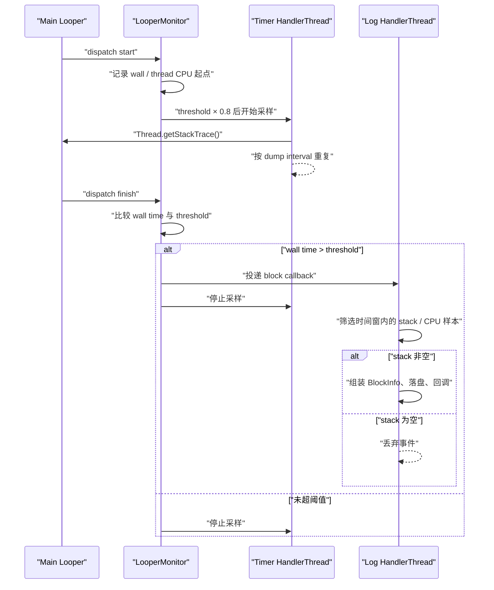

---

title: "BlockCanary"
chapter: "19"
section: "19.06"
status: "finalized"
drafted_date: "2026-04-24"
drafted_by: "codex"
applicable_versions: "历史项目（公开基线：compileSdk 23 / targetSdk 22 / AGP 2.2.2）；现代 Android 版本需单独验证"
last_verified: "2026-04-24"
last_verified_against: "markzhai/AndroidPerformanceMonitor README + build.gradle"
confidence: medium
tags: [apm, jank, looper, main-thread, block-detection]
related_chapters: ["19.0"]
sources:
  - type: blog
    path: "https://github.com/markzhai/AndroidPerformanceMonitor"
pipeline_stage: "ready-to-publish"
task6_state: "reviewed"
task6_result: pass-light-edit
reviewed_by: openclaw-task6
reviewed_date: "2026-06-04"
task9_state: reviewed
task9_result: auto-fixed
task9_reviewed_date: "2026-06-05"
task9_reviewed_by: openclaw-task9
last_task9_at: "2026-06-05T19:28:13+08:00"
task2b_state: fixed
task2b_result: "fixed"
review_round: 5
last_task2b_at: '2026-06-04T20:56:00+08:00'
repaired_date: "2026-04-25"
repaired_by: "openclaw-task2b"
last_task9_audit: "2026-05-20"
last_task9_audit_log: "logs/deep-review/2026-05-20-12-audit.md"
last_task6_at: "2026-06-05T20:08:00+08:00"
last_task6_audit: "2026-06-18"
review_notes_6: "2026-06-05 task6 revisit-review (round 7): pass-light-edit. L1 clean (真正 x2 functional, Not-X-but-Y x2 within limit). All 10 anchors covered. task9_result=auto-fixed, queue clean. Auto-promoted to finalized."
review_notes_5: "2026-06-05 task6 re-review (round 6): pass-light-edit. Fixed 禁用词 痛点→冲突. task9_result=pending, routes to task9."
review_notes_4: "2026-06-04 task6 re-review (round 5): pass-light-edit. Task2b fix at 20:56 reviewed; no new writing quality issues. L1 clean (真正 x2 functional). Routing to task9 for pending tech review."
review_notes_3_orig: "2026-06-04 task6 re-review (round 4): pass-light-edit. L1 clean (真正 x2, both functional). Not-X-but-Y x2 (within limit). All 10 anchors covered. task9_result=needs-rework, pipeline routes to task9. Score: structure 5/5, wording 4/5, consistency 4/5, verification 3/5, metadata 4/5."
last_task9_autofix_at: "2026-06-05"
last_task9_review_log: "logs/deep-review/2026-06-05-19-deep-review.md"
task9_review_notes: "2026-06-05 Task9 deep-review: auto-fixed。将 Looper.Observer 的直接源码验证边界从不存在的 android-17.0.0_r1 回退到 android-16.0.0_r3，并保留 Android 17 待 tag 公开复核。"
deepseek_cn_review_state: done
last_deepseek_cn_review_at: 2026-07-05
---

# BlockCanary

## 结论：保留原理，不直接接入 1.5.0

BlockCanary 是早期 Android 主线程长消息监控库，仓库名为 `AndroidPerformanceMonitor`。它用公开的 `Looper.setMessageLogging()` 取得每次 `Message` dispatch 的起止边界，再由后台线程采样主线程 Java 栈。这个模型至今仍适合解释“Looper 长消息监控怎样工作”。

发布物已经不适合 Android 17 / API 37 工程直接依赖。截至 2026-07-25：

- Maven Central 可用的最高版本是 `1.5.0`，元数据更新时间停在 2017-02。
- 仓库 `master` HEAD 是 `ed688391cdf95742892ce61494736667cf5baf08`，最近一次代码提交日期为 2017-08-17。仓库没有设置 archived，但不能把“仍可打开”理解为“仍在维护”。
- 上游仍使用 AGP 2.2.2、compileSdk 23、targetSdk 22、minSdk 9；README 依赖配置还是 `compile`、`debugCompile` 和 `releaseCompile`。
- 1.5.0 的 Activity 带 intent-filter，却没有声明 `android:exported`；target 31+ 的现代工程会在 manifest 合并/构建阶段遇到问题。
- 通知实现没有 NotificationChannel，`PendingIntent` 也没有 `FLAG_IMMUTABLE` / `FLAG_MUTABLE`。API 31+ 首次显示 block 通知时可能抛出 mutability 异常，API 26+ 的通知渠道同样缺失。
- analyzer manifest 会合并 `READ_PHONE_STATE` 和 `WRITE_EXTERNAL_STORAGE`，代码还调用 `TelephonyManager.getDeviceId()` 采集 IMEI；这与现代权限、设备标识符和隐私要求不相容。

新项目应以 JankStats / FrameMetrics 建立帧指标，以 Perfetto 还原现场；若还需要“主线程单次 Message 超时 + 栈采样”，可按后文重写轻量实现。已有项目若必须保留 BlockCanary，至少 fork 源码，不能用 1.5.0 AAR 修几个 Gradle 写法就宣布 API 37 兼容。

## 它测量的是 dispatch，不是整帧

Android 17 的 `Looper.loopOnce()` 从 `MessageQueue.next()` 取出消息后，才调用 `Printer` 的 dispatch-start；`Handler.dispatchMessage()` 返回后，再调用 dispatch-finish。因此 BlockCanary 的时间窗口是：

```text
MessageQueue.next() 返回
    ↓
Printer: >>>>> Dispatching
    ↓
Handler.dispatchMessage(msg)
    ↓
Printer: <<<<< Finished
```

这段窗口不包含消息进入队列后等待前序消息的 delivery delay，也不等于一帧从输入、动画、布局、绘制、RenderThread 到 SurfaceFlinger 呈现的总时间。严格看源码，它除了 `Handler.dispatchMessage()`，还包含两次 Printer 回调之间的 Observer、trace、LooperDoctor 和 slow-log 收尾；因此只能说明“这次 Looper dispatch 窗口的 wall time 超过自定义阈值”。

一次长 dispatch 可能跨过多个 Vsync，造成连续慢帧；它也可能发生在后台或静止页面，对用户没有直接帧影响。反方向也成立：25 ms 的 dispatch 在高刷新率滚动中可能造成慢帧，却远低于常见的 500～1000 ms block 阈值；RenderThread、GPU、SurfaceFlinger 或调度引起的 jank 也可能没有长主线程消息。

所以报告中应分别保留：

- `dispatch_wall_ms`：起止 wall/monotonic 时间差。
- `dispatch_thread_cpu_ms`：主线程在这段窗口消耗的 CPU 时间。
- 帧级指标：同一时间窗内的 jank frame、frame overrun 和 UI state。
- 系统时间线：线程处于 Running、Runnable、Sleeping 还是阻塞等待。

wall time 很长而 thread CPU time 很短，通常意味着等待或调度不足；两者都很长，才更像主线程持续执行计算。这个差值只能用于分流，不能单凭两项数值断言 Binder、锁、I/O 或 GC 中的哪一种。

## BlockCanary 1.5.0 的真实采样顺序

上游实现并不是从 dispatch 开始就每 300 ms 抓一次栈。源码顺序如下：

1. `BlockCanary.start()` 把 `LooperMonitor` 写入主 Looper 的 message logger 槽位。
2. `LooperMonitor.println()` 第一次回调记录 `System.currentTimeMillis()` 和 `SystemClock.currentThreadTimeMillis()`，再启动 stack/CPU sampler。
3. sampler 的首个任务延迟为 `provideBlockThreshold() * 0.8`。只有 dispatch 已经接近阈值，采样才开始。
4. 后续任务按 `provideDumpInterval()` 执行。传入 0 才回退到 sampler 内部的 300 ms；`BlockCanaryContext` 的默认 dump interval 与 block threshold 相同。
5. 第二次 Printer 回调记录结束时间并按 wall clock 判断是否超过阈值。超阈值时，它先向写日志线程投递 block callback，再停止 sampler。
6. 写日志线程执行 callback 时，从时间区间内取 stack/CPU 样本。若 stack 列表为空，`BlockInfo` 不会生成，整次超时事件直接丢失。callback 与 sampler 停止分属不同线程，不能依赖两者的竞态补抓“临近结束的一份栈”。

下面的时序图标出阈值、采样和上报之间的关系：



例如阈值为 1000 ms、dump interval 为 300 ms，一次 1200 ms dispatch 的计划采样点大致是 800 ms 和 1100 ms，不是 300/600/900/1200 ms。最慢代码若只在前 200 ms 执行，两个样本都会错过它。计时器线程繁忙时，Handler 的延迟任务还会进一步推迟。

`StackSampler` 调用 `mainThread.getStackTrace()`，把完整 Java 栈拼成字符串，保存在一个最多 100 项的静态 `LinkedHashMap` 中；访问 map 时使用 `synchronized`。上游没有“最大栈深”配置，也没有针对相同栈的去重。高频抓栈、字符串拼接和保留多份完整栈都需要纳入开销测试。

`LooperMonitor` 也不解析 `>>>>>` / `<<<<<`，而是用一个布尔值把相邻两次 Printer 回调当作 start/end。若 debugger 恰好在一条消息执行期间连接或断开，`stopWhenDebugging()` 的提前返回可能让这个布尔值失配。自研实现应识别前缀、记录配对状态，并把调试器状态写入报告。

## `Printer` 是公开 API，但只有一个槽位

Android 17 `android-17.0.0_r1` 仍公开 `Looper.setMessageLogging(Printer)`，Javadoc 还明确提示 message logging 有性能损耗。`Looper` 每个实例只保存一个 `mLogging`：

- 后调用者会覆盖先调用者。
- 没有公开 getter 可以取回并包装当前 Printer。
- BlockCanary 的 `stop()` 直接 `setMessageLogging(null)`，会清空该 Looper 当时的 logger。
- 只要 logger 非空，Android 17 每次 dispatch 前后都会构造日志字符串：start 行包含 Handler、callback 和 `what`，finish 行包含 Handler 与 callback。

如果 App 自己控制所有 Looper 观察组件，可以只安装一个 hub，再把多个 delegate 放入 hub：

```java
public final class MainLooperPrinterHub implements Printer {
    private final CopyOnWriteArrayList<Printer> delegates =
            new CopyOnWriteArrayList<>();

    public void add(Printer delegate) {
        delegates.addIfAbsent(delegate);
    }

    public void remove(Printer delegate) {
        delegates.remove(delegate);
    }

    @Override
    public void println(String line) {
        for (Printer delegate : delegates) {
            delegate.println(line);
        }
    }
}
```

hub 只能协调愿意通过它注册的组件。某个 SDK 后续再次调用 `setMessageLogging()`，仍会覆盖 hub；因此 SDK 评审和启动日志要检查这一冲突，不能只靠代码中存在 hub 就认为多观察者安全。

Android 17 还保留 `Looper.Observer`、`setObserver()`、slow dispatch/delivery threshold 和 `LooperDoctor`，但这些接口都标为 `@hide`，不属于应用 SDK。`sObserver` 还是 process-wide 静态单槽位。应用不应通过反射把 Observer 当作 Printer 的稳定替代品，也不能沿用“API 29 起存在”推导出“API 37 对普通 App 可用”。

## 一个可审计的最小实现

下面的伪代码只展示 dispatch 边界、单调时钟和异步上报；生产实现还要补采样限流、生命周期与冲突管理：

```kotlin
class MainDispatchPrinter(
    private val thresholdMs: Long,
    private val sampler: MainThreadSampler,
    private val reporter: BlockReporter
) : Printer {
    private var inDispatch = false
    private var startUptimeMs = 0L
    private var startCpuMs = 0L
    private var dispatchLine = ""

    override fun println(line: String) {
        when {
            line.startsWith(">>>>> Dispatching") -> {
                inDispatch = true
                dispatchLine = line
                startUptimeMs = SystemClock.uptimeMillis()
                startCpuMs = SystemClock.currentThreadTimeMillis()
                sampler.schedule(startUptimeMs, thresholdMs)
            }

            line.startsWith("<<<<< Finished") && inDispatch -> {
                val endUptimeMs = SystemClock.uptimeMillis()
                val endCpuMs = SystemClock.currentThreadTimeMillis()
                inDispatch = false
                val samples = sampler.stopAndSnapshot()

                if (endUptimeMs - startUptimeMs >= thresholdMs) {
                    reporter.enqueue(
                        dispatchLine = dispatchLine,
                        wallMs = endUptimeMs - startUptimeMs,
                        threadCpuMs = endCpuMs - startCpuMs,
                        samples = samples
                    )
                }
            }
        }
    }
}
```

这里用 `uptimeMillis()` 避免系统时间校准造成负数或异常长事件，保留 `currentThreadTimeMillis()` 区分 on-CPU 与 off-CPU。`println()` 运行在被监控的主线程，里面只能做常数级状态更新；签名、压缩、磁盘与网络必须移到有界队列的后台线程。

Printer 收到的是格式化字符串，没有公开的 `Message` 对象。可以保留原始 dispatch line 或提取 Handler/callback/what 作为调试信息，但字符串格式没有独立的 SDK 稳定承诺。不要把解析结果当作跨版本唯一主键；稳定聚合仍以归一化栈、页面和构建版本为主。

## 阈值与配置不能照搬默认值

BlockCanary 1.5.0 的默认配置与影响如下：

| 配置 | 上游默认 | 源码行为 | 现代实现建议 |
|---|---:|---|---|
| `provideBlockThreshold()` | 1000 ms | wall time 严格大于阈值才报告 | 按场景和设备层级配置；启动、点击、滚动不能共用一条阈值 |
| `provideDumpInterval()` | 等于 block threshold | 首采样仍等到阈值的 80%，后续才用该间隔 | 单独设置采样间隔、最大样本数和总时长 |
| `provideQualifier()` | `"unknown"` | `BlockInfo` 类初始化时缓存 | 使用 build ID/version/flavor，不依赖运行中动态变化 |
| `provideNetworkType()` | `"unknown"` | 每次报告由 App 提供 | 只作上下文；主线程网络等待要由 stack/Binder/socket 证据确认 |
| `providePath()` | `"/blockcanary/"` | 1.5.0 在外部根目录可写时写外部，否则拼到 `/data` 根目录；发布后的 master 才改为 filesDir | 只用 app 私有 cache/noBackup 目录，并设置大小、保留期和失败清理 |
| `displayNotification()` | `true` | 启用旧 DisplayActivity 和旧通知 | internal 包可做现代通知；线上默认关闭 |
| `provideWhiteList()` | `org.chromium` | UI 过滤，可配置删除命中日志 | 白名单精确到已知 signature，并保留计数；不要按大包名静默删除 |
| `stopWhenDebugging()` | `true` | debugger 连接时 Printer 回调直接返回 | Debug 现场可暂停采集，但要记录开关状态，避免测试误判 |

阈值没有通用标准。60 Hz 一帧预算约 16.7 ms，120 Hz 约 8.3 ms，但 Looper block 监控的目标通常是抓“明显长任务”，不是把阈值设成一帧预算后记录每个 dispatch。可行做法是：

- 帧体验交给 JankStats / FrameMetrics。
- Looper 监控用较高阈值抓取少量长消息，并按页面、交互和设备等级分层。
- internal/QA 可以降低阈值换取更多现场；生产使用远程开关、采样率、冷却时间和单会话上限。
- 参数变更随报告上传，避免把 300 ms 与 1000 ms 阈值的事件直接比较次数。

## 报告字段要能支持反证

BlockCanary 原始 `BlockInfo` 已包含 wall time、thread CPU time、多个 stack、进程、版本、网络、CPU 采样和内存；它也包含 UID、IMEI 等不应继续采集的字段。现代 schema 建议保留以下内容：

| 字段 | 用途 |
|---|---|
| `event_id` / `session_id` | 去重，并与 frame、ANR、启动事件关联 |
| `process_name`、`pid`、`main_tid` | 区分主进程和远程进程 |
| `app_version`、`build_id`、`git_sha`、`flavor` | 定位代码与配置 |
| `api_level`、`device_model`、`refresh_rate` | 解释平台与帧预算差异 |
| `scene`、`page`、`ui_state`、`foreground` | 判断用户是否处于交互窗口 |
| `dispatch_line` | 提供 Handler/callback/what 候选，不作稳定标识 |
| `dispatch_wall_ms`、`dispatch_thread_cpu_ms`、`threshold_ms` | 区分持续执行与等待/调度，并保留门槛 |
| `sample_interval_ms`、`sample_count`、`stacks[]` | 评估采样覆盖率；每份栈带相对时间 |
| `stack_signature` | 对类名、方法名、行号做稳定归一化后聚合 |
| `debugger_attached`、`gc_overlap` | 排除调试暂停并标注 GC 旁证 |
| `trace_id` | 跳转到受控 Perfetto / ANR / frame 样本 |

下面的样例强调“观测值”和“推断”分开：

```json
{
  "event_id": "b7e3...",
  "process_name": "com.example.app",
  "app_version": "8.3.1",
  "api_level": 37,
  "scene": "feed_scroll",
  "foreground": true,
  "dispatch_wall_ms": 1287,
  "dispatch_thread_cpu_ms": 94,
  "threshold_ms": 800,
  "sample_interval_ms": 200,
  "sample_count": 3,
  "stack_signature": "BinderProxy.transact>FeedRepository.refresh",
  "debugger_attached": false,
  "gc_overlap": false,
  "trace_id": "perfetto-session-42"
}
```

wall 1287 ms、thread CPU 94 ms 说明主线程大部分时间没有执行 Java CPU 工作，但还不能据此写成“Binder 导致”。需要结合每份栈、线程状态、Binder 轨道、调度与远端进程确认。报告不要上传原始用户 ID、IMEI、URL 参数、输入内容或高基数 item ID。

## 堆栈为什么经常指错方向

采样栈只表示“采样瞬间主线程在哪里”，常见误读如下：

| 栈/现象 | 可以提出的假设 | 仍需补的证据 |
|---|---|---|
| 多个样本稳定落在同一业务循环 | 主线程持续计算 | thread CPU、方法采样或局部 trace |
| `BinderProxy.transact()` | 主线程同步等待远端 Binder | Binder transaction、远端线程和调度 |
| 文件/SQLite/socket 入口 | 可能有同步 I/O | ftrace I/O、StrictMode、系统调用或数据库 trace |
| monitor/futex/park | 锁或条件等待 | owner thread、锁争用、wakeup |
| 普通业务栈且 thread CPU 很低 | 主线程可能 Runnable 但抢不到 CPU | sched_switch、CPU frequency、后台线程负载 |
| 栈分散并与 GC 时间重叠 | GC 或分配压力可能参与 | ART GC slice、allocation、暂停时长 |
| debugger attached | 人工暂停或单步 | 调试会话标记，样本不进入质量统计 |

### 案例：主线程慢，CPU 却耗在后台

现象是图片瀑布流进入页面后出现 1.2 秒 block。三个 Java 样本都停在轻量的 `FeedAdapter.bind()`，容易得出“bind 太慢”的结论；报告却显示主线程 thread CPU 只有 70 ms。

Perfetto 中，主线程大部分时间处于 Runnable，四条图片解码线程和两条 JSON 线程持续占用大核。根因是后台并发过量造成调度饥饿，`bind()` 只是采样时的程序计数位置。修复应限制启动阶段并发、调整工作优先级或错开任务，再比较主线程 runnable latency、frame overrun 与 Looper wall/thread-CPU 差值。

这个案例也说明 BlockCanary 自带的 `/proc/stat` CPU 百分比不够：它能提示系统忙，却没有逐线程调度和唤醒关系。

## Looper block、慢帧与 ANR 的口径

| 信号 / 工具 | 粒度 | 适合回答的问题 | 主要边界 |
|---|---|---|---|
| BlockCanary / 自研 Printer | 单次 Looper dispatch | 主线程哪段消息窗口超过自定义阈值 | 无完整 Message 对象；看不到队列等待、RenderThread、GPU |
| JankStats 1.0.0 | 每个 Window 的帧与 UI state | 哪些场景产生用户可感知 jank | 不直接给方法栈；回调要快速返回 |
| FrameMetrics（API 24+） | Window 帧阶段计时 | CPU、layout/draw/sync 等帧时间怎样分布 | 只覆盖对应 Window，仍需系统 trace 找调度/跨进程原因 |
| Perfetto / FrameTimeline | 跨进程全局时间线 | 调度、频率、Binder、GC、渲染管线如何相互影响 | 不适合无节制常驻抓全量长 trace |
| ANR traces / ApplicationExitInfo | 系统已经判定无响应后的现场 | 发生了哪类 ANR，系统当时抓到了什么 | 阈值和触发条件由系统管理，亚秒级 block 通常不会成为 ANR |

Android 17 InputDispatcher 的未乘系数默认输入分发超时仍为 5000 ms，运行时还要乘 `ro.hw_timeout_multiplier`，并允许窗口提供 dispatch timeout。Service、Broadcast、ContentProvider 等 ANR 有各自的超时与状态机。一个 800 ms BlockCanary 事件可能严重影响交互，却不是系统 ANR；一个输入 ANR 也可能由队列堆积、无焦点窗口或跨进程等待造成，不能简写成“某个 Message 执行超过 5 秒”。

## Android 17 的 Looper 可观测性

在 `android-17.0.0_r1` 中，一次 dispatch 周围同时存在几条平台观测路径：

- 公开 `setMessageLogging()` 仍打印 start/finish 字符串，BlockCanary 的核心入口没有消失。
- `Looper.Observer` 仍在 dispatch 前后获得 token 和 `Message`，但它是 `@hide`、process-wide 单槽位。
- `setSlowLogThresholdMs()` 可以区分 slow delivery 与 slow dispatch，但同样是隐藏平台接口；普通 App 不应依赖。
- `LooperDoctor` 在 feature flag 开启时为 Message 启停 timer，也是隐藏实现。
- 当 `perfettoSdkTracingV3()` 与 `PerfettoCategories.MQ_CATEGORY` 同时启用时，Looper 会为 `message_queue_receive` 和 dispatch 发出 Perfetto 事件/flow。它是条件路径，不能写成“API 37 所有设备 trace 一定都有 MQ 轨道”。

这组源码给自研方案一个清晰边界：应用侧继续使用公开 Printer 做低频长消息信号；系统级现场优先看 Perfetto 中已存在的 MessageQueue、atrace、Binder、ART GC、FrameTimeline 和 sched 数据。不要反射 Observer 或 LooperDoctor 来减少字符串开销，因为换来的 hidden API 风险更大。

线程调度证据最终来自目标设备内核和 userspace tracing 配置。知识库的内核源码锚点统一为 [`android17-6.18-2026-06_r6`](https://android.googlesource.com/kernel/common/+/refs/tags/android17-6.18-2026-06_r6/Documentation/trace/ftrace.rst)；量产设备可能带厂商分支、不同 tracepoint 和权限策略。看不到 sched 轨道时先检查采集配置与设备能力，不要把“没有轨道”解释成“没有调度问题”。

## 迁移与自研检查表

若老项目正在使用 1.5.0，迁移顺序建议如下：

1. 先保留旧报告的阈值、版本、页面与 signature，建立可比基线。
2. 接入 JankStats / FrameMetrics，把慢帧与 Looper 长消息拆成两套指标。
3. 用自有 Printer 替换 1.5.0，并确认项目只有一个 message logger 安装入口。
4. 使用单调时钟、首采样延迟、采样间隔、最大样本数、最大栈深和总采集时长配置。
5. 上报队列有容量、丢弃策略、采样率、冷却时间和远程熔断；主线程只写内存状态。
6. 用 app 私有目录短暂落盘，限制文件总量和保留期；上传前做字段 allowlist。
7. 删除 IMEI、READ_PHONE_STATE、WRITE_EXTERNAL_STORAGE 和原始 UID 采集。
8. internal 通知若保留，补 channel、POST_NOTIFICATIONS 策略、PendingIntent mutability 与 `android:exported`；生产包默认不带展示 Activity。
9. 在低端机、60/90/120 Hz、GC 压力、Binder 等待、同步 I/O、CPU 竞争和 debugger 场景量化开销与误判。
10. API 37 上验证 Printer 起止配对、SDK 覆盖冲突、异常 dispatch、前后台切换、多进程和进程重启。

BlockCanary 1.5.0 没有 native `.so`，本身不存在 16 KB ELF 对齐问题。它的 API 37 阻塞项来自 manifest、通知、权限、存储、隐私和十年前的采样/上报设计；不要因为 16 KB 检查通过就忽略这些 Java/Android 行为差异。

## 参考源码与文档

- [AndroidPerformanceMonitor `master@ed688391`](https://github.com/markzhai/AndroidPerformanceMonitor/tree/ed688391cdf95742892ce61494736667cf5baf08)
- [BlockCanary Maven Central 版本元数据](https://repo.maven.apache.org/maven2/com/github/markzhai/blockcanary-android/maven-metadata.xml)
- [BlockCanary 1.5.0 analyzer source JAR](https://repo.maven.apache.org/maven2/com/github/markzhai/blockcanary-analyzer/1.5.0/blockcanary-analyzer-1.5.0-sources.jar)
- [BlockCanary 1.5.0 Android source JAR](https://repo.maven.apache.org/maven2/com/github/markzhai/blockcanary-android/1.5.0/blockcanary-android-1.5.0-sources.jar)
- [`master@ed688391` `LooperMonitor`](https://github.com/markzhai/AndroidPerformanceMonitor/blob/ed688391cdf95742892ce61494736667cf5baf08/blockcanary-analyzer/src/main/java/com/github/moduth/blockcanary/LooperMonitor.java)
- [`master@ed688391` `BlockCanaryInternals`](https://github.com/markzhai/AndroidPerformanceMonitor/blob/ed688391cdf95742892ce61494736667cf5baf08/blockcanary-analyzer/src/main/java/com/github/moduth/blockcanary/BlockCanaryInternals.java)
- [`master@ed688391` 旧通知实现](https://github.com/markzhai/AndroidPerformanceMonitor/blob/ed688391cdf95742892ce61494736667cf5baf08/blockcanary-android/src/main/java/com/github/moduth/blockcanary/DisplayService.java)
- [Android 17 `Looper.java`](https://android.googlesource.com/platform/frameworks/base/+/android-17.0.0_r1/core/java/android/os/Looper.java)
- [Android 17 InputDispatcher 默认超时计算](https://android.googlesource.com/platform/frameworks/native/+/android-17.0.0_r1/services/inputflinger/dispatcher/InputDispatcher.cpp)
- [Android 17 `IInputConstants.aidl`](https://android.googlesource.com/platform/frameworks/native/+/android-17.0.0_r1/libs/input/android/os/IInputConstants.aidl)
- [Android 12 target 行为：`android:exported` 与 PendingIntent mutability](https://developer.android.com/about/versions/12/behavior-changes-12)
- [通知渠道官方指南](https://developer.android.com/develop/ui/views/notifications/channels)
- [JankStats Maven 版本元数据](https://dl.google.com/android/maven2/androidx/metrics/metrics-performance/maven-metadata.xml)
- [JankStats 官方指南](https://developer.android.com/topic/performance/jankstats)
- [FrameMetrics API](https://developer.android.com/reference/android/view/FrameMetrics)
- [Android 慢帧与冻结帧](https://developer.android.com/topic/performance/vitals/render)
- [Android 17 GKI ftrace 文档锚点](https://android.googlesource.com/kernel/common/+/refs/tags/android17-6.18-2026-06_r6/Documentation/trace/ftrace.rst)
