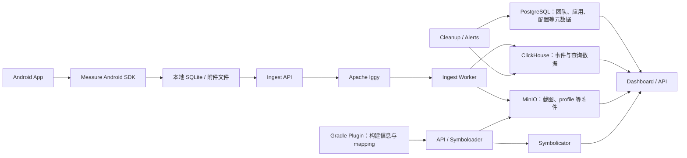

---

title: Measure
chapter: '19'
section: '19.07'
status: "finalized"
drafted_date: '2026-04-24'
drafted_by: codex
applicable_versions: Android 8 (API 26) - Android 17 (API 37)
last_verified: '2026-05-31'
last_verified_against: measure-sh docs/README.md + sdk-integration-guide + docs/api/sdk/README.md event/span schema + feature-anr-reporting + feature-crash-reporting + docs/api/dashboard/README.md retention endpoint
confidence: medium
tags: 
- apm
related_chapters: 
- '19.0'
sources:
- type: reference
  path: https://raw.githubusercontent.com/measure-sh/measure/main/docs/hosting/README.md
- type: reference
  path: https://api.example.com/products/42",
- type: reference
  path: https://github.com/measure-sh/measure/tree/8a189ea1e9728105773c1c81fb6cc8797e6b2d15
- type: reference
  path: https://github.com/measure-sh/measure/releases/tag/android-v0.19.0
- type: reference
  path: https://github.com/measure-sh/measure/blob/8a189ea1e9728105773c1c81fb6cc8797e6b2d15/android/measure-android/measure/build.gradle.kts
- type: reference
  path: https://github.com/measure-sh/measure/blob/8a189ea1e9728105773c1c81fb6cc8797e6b2d15/android/measure-android/measure/src/main/java/sh/measure/android/config/DynamicConfig.kt
- type: reference
  path: https://github.com/measure-sh/measure/blob/8a189ea1e9728105773c1c81fb6cc8797e6b2d15/android/measure-android/measure/src/main/jni/anr_handler.c
- type: reference
  path: https://github.com/measure-sh/measure/blob/8a189ea1e9728105773c1c81fb6cc8797e6b2d15/android/measure-android/measure/src/main/CMakeLists.txt
- type: reference
  path: https://github.com/measure-sh/measure/blob/8a189ea1e9728105773c1c81fb6cc8797e6b2d15/android/measure-android/measure/src/main/java/sh/measure/android/performance/MemoryReader.kt
- type: reference
  path: https://github.com/measure-sh/measure/blob/8a189ea1e9728105773c1c81fb6cc8797e6b2d15/android/measure-android/measure/src/main/java/sh/measure/android/profiling/ProfileCollector.kt
- type: reference
  path: https://github.com/measure-sh/measure/blob/8a189ea1e9728105773c1c81fb6cc8797e6b2d15/android/measure-android/measure/src/main/java/sh/measure/android/Measure.kt
- type: reference
  path: https://github.com/measure-sh/measure/blob/8a189ea1e9728105773c1c81fb6cc8797e6b2d15/self-host/compose.prod.yml
- type: reference
  path: https://measure.sh/docs/sdk-integration-guide
- type: reference
  path: https://measure.sh/docs/features/feature-session-timelines
- type: reference
  path: https://measure.sh/docs/features/feature-crash-reporting
- type: reference
  path: https://measure.sh/docs/features/feature-anr-reporting
- type: reference
  path: https://measure.sh/docs/features/feature-network-monitoring
- type: reference
  path: https://measure.sh/docs/features/feature-performance-tracing
- type: reference
  path: https://measure.sh/docs/features/feature-profiling
- type: reference
  path: https://measure.sh/docs/configuration-options
- type: reference
  path: https://measure.sh/docs/hosting
- type: official
  path: https://developer.android.com/sdk/api_diff/37/changes/android.os.ProfilingTrigger
- type: official
  path: https://developer.android.com/reference/android/os/ProfilingTrigger
- type: aosp
  path: https://android.googlesource.com/platform/packages/modules/Profiling/+/refs/tags/android-17.0.0_r1
task2b_state: "fixed"
task2b_result: "fixed-lite"
task2b_reopened_at: "2026-05-21T08:06:00+08:00"
task2b_fixed_at: "2026-05-31T20:52:00+08:00"
last_task2b_at: "2026-05-31T20:52:00+08:00"
last_task2b_lite_at: "2026-06-03T07:35:00+08:00"
task9_result: auto-fixed
task9_reviewed_date: "2026-05-31"
task9_reviewed_by: openclaw-task9
last_task9_at: "2026-06-03T07:20:00+08:00"
last_task9_autofix_at: "2026-05-31"
last_task9_audit: "2026-05-20"
last_task9_audit_log: "logs/deep-review/2026-05-20-15-audit.md"
task9_review_notes: "2026-05-31 Task9 deep review: AUTO-FIX Measure 许可证与自托管依赖口径，回到 Task6 复审。"
last_task9_review_log: "logs/deep-review/2026-06-03-07-deep-review.md"
last_task2b_rework_log: "Task2B 2026-05-31: 按 2026-05-20/21 Task9 fallback 问题修正 Measure SDK schema、ANR/native 边界与 retention 来源。"
last_task2b_verifier_at: "2026-05-31T23:25:00+08:00"
last_task2b_verifier_log: "logs/rework/2026-05-31-23-task2b-verifier.md"
reviewed_by: openclaw-task6
reviewed_date: "2026-06-04"
task6_reviewed_date: "2026-06-01"
last_task6_at: "2026-06-04T05:07:00+08:00"
last_task6_audit: "2026-06-12"
last_task6_review_log: "logs/review/2026-06-01-02-review.md"
task6_result: "pass-light-edit"
task6_state: "reviewed"
task9_state: "reviewed"
pipeline_stage: "ready-to-publish"
task6_review_notes: "2026-06-04 Task6 revisiting-review: L1/L2 无新增问题，章节整洁。自动晋升 finalized。"
deepseek_cn_review_state: done
last_deepseek_cn_review_at: 2026-06-23
---
# Measure

## 产品定位与版本边界

Measure 是一个面向移动端的监控平台，项目包含 Android、iOS、Flutter、React Native SDK，数据接收与处理服务，以及 Web 看板。它把 Crash、ANR、启动、HTTP、CPU、内存、点击、页面导航、业务 span 和 bug report 放进同一套会话模型。Matrix、KOOM 的重点是端侧专项采集与诊断；Measure 还负责事件入库、检索、聚合、告警、附件保存和团队协作。两类工具可以并存，不是同一层级的替代品。

产品源码依据为 2026-07-25 的 `measure-sh/measure` 主分支提交 `8a189ea1e9728105773c1c81fb6cc8797e6b2d15`，平台边界为 Android 17 / API 37 / `android-17.0.0_r1`。此时最新稳定 Android SDK 为 `0.19.0`，Gradle 插件为 `0.13.0`；主分支分别已进入 `0.20.0-SNAPSHOT` 和 `0.14.0-SNAPSHOT`。

评估前要记住三条边界：

- Android 端尚不支持 C/C++ native crash reporting。`ApplicationExitInfo` 能记录 `REASON_CRASH_NATIVE`，不等于 Measure 已能解析、聚合和符号化 native 崩溃。
- Measure 能给出线上问题发生前后的上下文，但 CPU 抖动、对象泄漏、掉帧或调度问题仍需 Perfetto、heap dump、Android Studio Profiler 等专项工具定因。
- 当前 SDK 源码以 `compileSdk 36` 构建。它能作为普通兼容 SDK 运行在 Android 17 设备上，却尚未接入 API 37 新增的全部 `ProfilingTrigger`。后文会单独说明这个差距。

此前流传的 `android.app.Measure`、`MeasureSession` 以及 “Measure → DropBoxManager → statsd → Play Vitals” 链路不存在于 `android-17.0.0_r1`。开源产品 Measure 的入口是 `sh.measure.android.Measure`，数据上传到配置的 Measure ingest 服务。Android 平台的 `DropBoxManager` 位于 `android.os`，不能据此推导出两者有关联。

## 平台数据怎样流动

Measure 的数据流可以拆成端侧采集、可靠上传、服务端处理和查询四段。下面这张图只画影响容量与故障面的主要部件。



SDK 先把事件与 span 写入本地数据库，再按批上传；附件走独立上传路径。默认本地空间上限为 50 MB，可配置在 20～1500 MB，达到上限后会从旧数据开始清理。离线、服务不可达、附件偏大时，这一层决定“故障现场还能保留多少”，不能只看网络重试次数。

自托管的生产 Compose 文件还包含 dashboard、API、agent、ingest、ingest-worker、cleanup、alerts、symboloader、migrator、Symbolicator、PostgreSQL、ClickHouse、MinIO、Apache Iggy 和 Valkey。服务数量本身已经说明：Measure 是一个要运营的平台，不是添加一个 AAR 就完成了接入。

## 会话、事件、span 与附件

### Session 的生命周期

SDK 初始化时创建 session。应用进入后台超过 30 秒后再次回到前台，会创建新 session；短于这个阈值的切换仍属于原 session。每个事件带 `session_id`，每个 span 也带 `session_id`，所以页面、点击、资源曲线、错误和业务耗时才能按时间归到同一次使用过程。

默认动态配置为 Crash、ANR、bug report 各保留问题发生前 300 秒的时间线上下文。这里的“5 分钟”是错误现场窗口，不代表服务端只保存 5 分钟数据。服务端应用级 retention 是另一项配置，范围 30～365 天，默认 30 天。

### Event 与 span 是两种对象

Event 有统一外壳：`id`、`session_id`、时间、类型、类型专属 `data`、系统属性、用户自定义属性、附件引用和采样标记。事件类型包括 `exception`、`anr`、`app_exit`、`gesture_click`、`screen_view`、`http`、`cpu_usage`、`memory_usage`、`cold_launch`、`profile` 等。

Span 单独保存，核心字段是 `trace_id`、`span_id`、`parent_id`、`session_id`、起止时间、耗时、状态、属性与 checkpoints。一个 trace 可以由多个有父子关系的 span 组成；event 不会因为同处一条时间线就自动变成 span。

下面的 JSON 用来理解关联关系，不是 SDK 的原始上传报文。

```json
{
  "session": {
    "id": "s-7f2d",
    "app_version": "8.4.0",
    "os_version": "17",
    "device_model": "Pixel"
  },
  "events": [
    {
      "id": "e-101",
      "session_id": "s-7f2d",
      "timestamp": "2026-07-25T09:00:05.120Z",
      "type": "screen_view",
      "data": {"name": "ProductDetail"}
    },
    {
      "id": "e-102",
      "session_id": "s-7f2d",
      "timestamp": "2026-07-25T09:00:06.220Z",
      "type": "http",
      "data": {
        "method": "get",
        "url": "https://api.example.com/products/42",
        "status_code": 200,
        "client": "okhttp"
      }
    }
  ],
  "spans": [
    {
      "trace_id": "4bf92f3577b34da6a3ce929d0e0e4736",
      "span_id": "00f067aa0ba902b7",
      "parent_id": null,
      "session_id": "s-7f2d",
      "name": "product.detail.load",
      "duration_ms": 1180,
      "status": "ok"
    }
  ]
}
```

示例里 `session_id` 把移动端现场归在一起，`trace_id` 表示一次耗时调用树。不要用用户 ID 代替 session，也不要用 session ID 冒充分布式 trace ID。

### 一条 ANR 时间线能提供什么

假设用户反馈“打开详情页后卡住”，ANR 堆栈只描述取样时各线程的位置。时间线还可以还原问题前的顺序：

```text
00:00  lifecycle_app: foreground
00:01  screen_view: Home
00:05  gesture_click: feed_item
00:05  screen_view: ProductDetail
00:06  http: GET /products/{id}, 200, 820 ms
00:07  http: GET /recommendations, timeout
00:07  memory_usage: PSS 420 MB -> 680 MB
00:08  gesture_click: back
00:10  anr: SIGQUIT captured
```

这段记录能提出“详情页加载、超时回调、内存增长或返回流程是否阻塞主线程”等假设，却不能单独证明根因。正确的下一步是对照 ANR 全线程堆栈、`ApplicationExitInfo` trace、服务端请求日志；仍无法定因时，再复现并采集 Perfetto。

## Android 端能力与源码边界

下表以稳定版 `0.19.0` 文档和同周期主分支源码交叉检查。文档与源码冲突时，表中明确指出差异，不把旧文档值当成代码行为。

| 能力 | 端侧来源与主要字段 | 能回答的问题 | 不能据此得出的结论 |
|---|---|---|---|
| Java / Kotlin Crash | 包装 `Thread.UncaughtExceptionHandler`；`exception` 含异常链、线程、frames、severity、前后台状态 | 崩溃分组、版本回归、混淆栈还原 | 未覆盖 C/C++ native crash；截图也不能替代线程和状态分析 |
| ANR | native `SIGQUIT` 处理器把信号让渡回 ART Signal Catcher；`anr` 保存主线程 Java 栈和有上限的其他 Java 线程栈；API 30+ 另采 `ApplicationExitInfo` trace | ANR 现场、死锁线索、问题前 5 分钟上下文 | 不是主线程定时 ping 的 Java watchdog；其他线程收集受 `MAX_THREADS_IN_EXCEPTION=16` 限制，收到 `SIGQUIT` 也不表示每次都能保存完整现场 |
| App exit | API 30+ 调用 `getHistoricalProcessExitReasons(null, 0, 3)`；记录 reason、importance、trace、process name、pid | 最近的系统杀进程、ANR、低内存、native crash 等退出原因 | SDK 单次只读取最多 3 条历史记录；`app_exit: CRASH_NATIVE` 只是退出分类，不是 native crash 堆栈能力 |
| HTTP | Gradle 插件自动插桩 OkHttp 4.7.0～5.3.2；0.18.0 起支持 `HttpURLConnection` 包装；记录 URL、method、status、起止时间、失败、client，可按 URL 开启 body/header | 端侧耗时、失败率、请求与页面/错误的时序 | Retrofit 若只带传递依赖，自动插桩可能失效；请求 body 默认关闭；不等同于服务端 trace |
| 启动 | `MeasureInitProvider.attachInfo`、进程启动时间、Activity 生命周期与下一帧 draw；生成 cold/warm/hot launch | TTID 趋势、启动 Activity、版本对比 | 初始化太晚会丢失早期崩溃并降低起点精度；当前 launch metric 不计算 TTFD，`reportFullyDrawn()` 只会触发 profile，TTFD 趋势需另建业务 span |
| App size | Gradle 插件在 `assemble<Variant>` / `bundle<Variant>` 后调用 Android tools 的 `GzipSizeCalculator`，或 bundletool 的 `BuildApksCommand` / `GetSizeCommand` | APK 估算下载大小、AAB 最大生成 APK 大小的版本趋势 | AAB 数值不是所有设备的真实商店下载量；关闭该 variant 的插件后不会上传 |
| CPU | 前台周期采样 `/proc/self/stat` 的 utime、stime、cutime、cstime，并按核数、`_SC_CLK_TCK` 和间隔计算百分比 | 错误前后进程 CPU 趋势 | 不是线程级火焰图，也不能说明某个函数耗时 |
| 内存 | `Runtime` Java heap、`Debug.getMemoryInfo()` PSS、`/proc/<pid>/statm` RSS、native heap；RSS 按运行设备的 `_SC_PAGESIZE` 换算 | PSS/RSS/Java/native heap 趋势，错误前的内存压力 | 曲线上涨不能直接判为泄漏；对象引用链仍需 heap dump |
| 点击与滚动 | Curtains 拦截 Window touch；View hit test；Compose 遍历 semantics；事件含 target、id/label、坐标、尺寸和触摸时间 | 用户操作顺序、点击或滚动目标的估算 | 无可识别 target 的触摸会被丢弃，不能靠时间线统计所有 dead click；Compose 未设置 `testTag` 时 target id 信息有限 |
| 页面与生命周期 | Activity、Fragment、应用前后台生命周期；Gradle 插件支持 AndroidX Navigation，包括 Compose 2.4.0～2.9.7；也可手动 `trackScreenView` | 页面路径、页面级错误和耗时 | route 若含订单号等动态值，会造成高基数和隐私风险 |
| Trace / span | 手动 span、父子 span、自动 Activity/Fragment screen-load trace；span 含 trace/session/parent、duration、status、attributes、checkpoints | 登录、首屏、支付等业务路径耗时 | 当前不是通用 OpenTelemetry SDK，也没有自动生成服务端 span |
| Trigger-based profile | API 36+ `ProfilingManager`；当前注册 `APP_FULLY_DRAWN` 与 `ANR`，结果作为 `profile` 附件由 WorkManager 上传 | 下载平台返回的 running system trace 快照，补充首屏或 ANR 现场 | 默认关闭；需显式依赖 WorkManager；Android 17 新 trigger 尚未全部注册 |

### 两处容易误读的配置

主分支 `DynamicConfig` 把 CPU 与内存采样间隔都设为 5 秒。功能文档仍分别写 3 秒和 2 秒，这是文档滞后；判断运行行为应以所用 release 的源码和下发配置为准。

当前代码默认开启 Crash/ANR 截图，并把 `screenshotMaskLevel` 设为 `AllTextAndMedia`。Crash/ANR 功能页仍有“遮罩默认关闭”的旧表述。接入验收必须在目标环境抓一条测试事件，确认远端配置和 SDK release 共同得到的有效值。

### Android 17 / API 37 的新增机会

Measure 为 `SIGQUIT` ANR 采集带有 `libmeasure-ndk.so`。当前 CMake 链接参数包含 `-Wl,-z,max-page-size=16384`，RSS 计算也读取运行设备的 `_SC_PAGESIZE`，没有把页大小写死为 4 KB。这两点覆盖了 16 KB page-size 设备最常见的 ELF LOAD segment 对齐和 RSS 换算问题。应用仍要对最终 release APK/AAB 运行 16 KB page-size 检查，因为宿主工程的 AGP、NDK、其他 `.so` 和 APK 打包方式不由 Measure 控制。

Android 17 在 `ProfilingTrigger` 中加入 `TRIGGER_TYPE_COLD_START`、`TRIGGER_TYPE_OOM`、`TRIGGER_TYPE_ANOMALY`、`TRIGGER_TYPE_KILL_EXCESSIVE_CPU_USAGE` 等触发类型。平台为冷启动触发器返回新启动的 system trace 与 stack sampling profile，为 OOM 返回 Java heap dump；anomaly 的附件随异常类型变化，过量 CPU 退出触发器返回 running system trace 快照。

Measure 主分支快照仍是 `compileSdk 36`，`ProfileCollector.triggerTypes()` 只返回 `TRIGGER_TYPE_APP_FULLY_DRAWN` 和 `TRIGGER_TYPE_ANR`。因此：

- Android 17 用户不会因为 SDK 未使用新 API 就失去既有 Crash、ANR、HTTP、session 等能力。
- 看板里出现 `profile` 不能笼统写成“已经支持 Android 17 OOM 自动 heap dump”。
- 产品后续升级到 `compileSdk 37` 并注册新 trigger 后，还要补充 profile 类型、附件容量、WorkManager 上传、采样和隐私验收。

`ProfileCollector` 能识别 `.hprof` 和 `.heapprofd` 文件，只说明上传模型为这些格式留了入口。当前注册列表没有 OOM trigger，不能据此宣传 Android 17 自动 heap dump。这个边界也说明了源码锚点的价值：只看“支持 Android”或“支持 profiling”无法判断 API 37 能力是否已经进入 SDK。

## 接入还包括平台侧工作

稳定版最小要求为 minSdk 21、AGP 8.1.0。官方接入页列出的稳定坐标如下；版本号应在升级时跟随 release notes 调整。

```kotlin
plugins {
    id("sh.measure.android.gradle") version "0.13.0"
}

dependencies {
    implementation("sh.measure:measure-android:0.19.0")
}
```

Gradle 插件负责 OkHttp、HttpURLConnection、AndroidX Navigation 等字节码插桩，还负责构建大小与 R8/ProGuard mapping 上传。禁用某个 variant 的插件会减少构建步骤，也可能让该 variant 缺少自动网络采集、包大小趋势或混淆栈还原。

初始化要尽量靠近 `Application.onCreate()` 开头，并把 API key 与 ingest URL 放在不同 build type/flavor 的 manifest placeholder 或受控配置中。若延迟初始化，早期 Crash 和启动时间会形成不可恢复的盲区。

SDK 接好后，平台侧仍有这些工作：

- 为 release、staging、debug 决定是否拆应用或环境，防止测试噪声进入线上基线。
- 把 API key、API URL、mapping、版本名、version code 和构建产物保持一一对应。
- 配置采样、URL 规则、截图、日志、retention、权限与告警。
- 建立告警负责人、去重规则、版本灰度判断和处置时限。
- 监控 SDK 自身的启动耗时、主线程操作、磁盘占用、网络量与附件量。

官方在 Pixel 4a / Android 13 的简单样例上测得 SDK `0.16.0` 增加约 17.5～31.3 ms TTID，中位数 24.3 ms；点击目标与 layout snapshot 约增加 0.6～1 ms。这个数字只能作为回归参照。业务应用应使用自己的基准机、启动路径和 release 构建复测，尤其要关注低端机、首装、离线积压和大量 Compose 节点。

## 自定义 trace 要能聚合，也要能跨端关联

### 命名与属性

Span 名称上限为 64 个字符，checkpoint 名称上限也是 64 个字符，每个 span 最多 100 个 checkpoints。命名应表达“稳定业务步骤”，动态值放到经过治理的属性里。

| 场景 | 推荐 span 名 | 推荐属性 | 不应放进名称的内容 |
|---|---|---|---|
| 登录 | `auth.login` | `login_method`、`result` | 用户 ID、手机号、错误全文 |
| 首屏 | `home.first_content` | `source`、`item_count`、`cache_hit` | 实验参数拼接串、时间戳 |
| 支付 | `checkout.payment.submit` | `provider`、`result`、`retry_count` | 订单号、金额、token |
| 图片解码 | `media.thumbnail.decode` | `format`、`width_bucket`、`cache_hit` | 图片 URL、文件路径 |

单位要写进属性名，例如 `payload_bytes`、`image_width_px`、`queue_wait_ms`。枚举值应受控，布尔量用布尔类型，避免把任意异常文本、完整 URL 或用户输入当成聚合维度。

下面示例使用当前 Android 源码存在的 `SpanBuilder` API 创建父子 span。

```kotlin
val payment = Measure.startSpan("checkout.payment.submit")
    .setAttribute("provider", "example_pay")

try {
    val tokenize = Measure.createSpanBuilder("checkout.payment.tokenize")
        ?.setParent(payment)
        ?.startSpan()

    tokenizeCard()
    tokenize?.setStatus(SpanStatus.Ok)?.end()

    submitOrder()
    payment
        .setCheckpoint("order_accepted")
        .setAttribute("retry_count", 0)
        .setStatus(SpanStatus.Ok)
        .end()
} catch (t: Throwable) {
    payment
        .setAttribute("error_type", t.javaClass.simpleName)
        .setStatus(SpanStatus.Error)
        .end()
    throw t
}
```

父 span 表示支付提交，子 span 只表示令牌化步骤。代码不要把异常 message 写入属性，因为 message 常含服务端返回、账号或订单信息。另一个工程细节是：官方性能 tracing 页面曾展示过源码中不存在的 `startSpan(name, parent=...)` Kotlin 重载，复制文档示例前要对照所用 SDK 的公开 API。

### 与 OpenTelemetry 的关系

移动 session 和分布式 trace 解决不同问题。session 关注应用前后台、设备、页面、手势、Crash、ANR 和资源曲线；OpenTelemetry trace 关注跨进程调用树、服务和依赖耗时。二者最可靠的连接点是 W3C Trace Context，不是强行把 session 转成服务端 trace。

Measure Android SDK 能从 span 生成标准 `traceparent` 键和值。下面示例把移动根 span 的上下文显式放进业务请求。

```kotlin
val span = Measure.startSpan("checkout.payment.submit")

val request = Request.Builder()
    .url(paymentUrl)
    .header(
        Measure.getTraceParentHeaderKey(),
        Measure.getTraceParentHeaderValue(span),
    )
    .build()
```

服务端 OpenTelemetry instrumentation 读取 `traceparent` 后，可继续同一个 `trace_id`。Measure 的自动 HTTP event 仍是 session 时间线事件；不要假设它会替你把每个 OkHttp 请求都挂到自定义 span 下。

建议把三类 ID 分工固定下来：

- `session_id`：从移动错误或用户反馈回到 Measure 会话。
- `trace_id`：从移动 span 跳到服务端 APM，并追踪跨服务调用。
- `request_id`：保留服务端日志系统自己的单请求检索键，可作为旧系统的补充。

如果网关会丢弃未知 header，要把 `traceparent` 加入转发规则，并验证采样位是否被服务端尊重。若服务端另起 trace，至少在移动 span 和服务端日志同时记录一个低敏 request ID，否则跨端关联只停留在设计文档里。

## 自托管的成本与故障面

### 官方自托管定位

官方文档把单机 self-host 定位为小规模或个人项目，并明确提醒：用单机脚本承载大规模生产流量可能造成数据丢失、安全问题和停机。文档给出的最低机器规格是 x86-64 Ubuntu 24.04 / Debian 12、4 vCPU、16 GB RAM、100 GB 系统盘。

这组配置适合功能验证，不是容量承诺。上线前至少要用“日活 × 每会话事件数 × 采样率 × 单事件/附件大小 × 保留天数”估算写入量，再测试 ClickHouse 查询、MinIO 增长、Iggy 积压与清理吞吐。

### 数据分别保存在哪里

| 数据 | 主要存储或服务 | 容量与恢复重点 |
|---|---|---|
| 事件、span、聚合查询数据 | ClickHouse | 分区、TTL/cleanup、磁盘水位、查询并发 |
| 团队、应用、权限、配置等元数据 | PostgreSQL | 一致性备份、迁移、凭据与恢复演练 |
| 截图、layout snapshot、profile、符号文件等对象 | MinIO | 对象生命周期、跨区备份、删除一致性 |
| ingest 缓冲 | Apache Iggy | 消费积压、磁盘保护、重放与重复处理 |
| 缓存/短期状态 | Valkey（Compose 服务名为 `redis`） | 丢失后的可恢复性、内存与淘汰策略 |
| 符号处理 | Symboloader + Symbolicator | mapping/符号文件与 app version/build 的关联 |

Android R8/ProGuard mapping 由 Gradle 插件在 assemble 任务后上传。自托管环境要保证构建上传与事件 ingest 使用同一个 app/API 配置，并以 version name、version code、app identifier 关联。仅看到 Compose 中存在 Symbolicator，不能推导出 Android NDK 崩溃已经可用；当前 native crash reporting 仍是未实现能力。

### 保留期、附件与备份

Dashboard API 的应用 retention 范围为 30～365 天，默认 30 天。它会影响事件数据的清理节奏，但运维团队仍要逐项确认附件、数据库备份和对象存储快照是否遵循同一期限。若备份保留 180 天而线上 retention 是 30 天，用户删除请求和合规说明不能只写“Dashboard 已设 30 天”。

至少进行以下恢复演练：

- PostgreSQL 与 ClickHouse 在同一恢复点附近恢复后，应用、session 和查询是否仍对应。
- MinIO 恢复后，截图、profile、mapping 引用是否还可读取。
- Iggy 有积压时升级或重启，是否会漏数据或造成重复入库。
- 从一个稳定 `vMAJOR.MINOR.PATCH` tag 升级前，是否完成官方 migration guide 要求，并验证回滚数据兼容性。

不要直接追随 `main` 部署生产。自托管文档要求选择面向部署的稳定 `v*` tag；SDK 与 self-host 也有最低版本配对关系，例如 Android SDK `>=0.16.0` 要求 self-host `>=0.10.0`。

### 小团队也要算的账

| 阶段 | 推荐范围 | 主要成本 |
|---|---|---|
| 2～4 周试点 | 单应用、一个 release 版本、Crash/ANR/HTTP/会话 | 机器、接入、隐私审查、mapping 与告警验证 |
| 中型团队 | 多应用、多环境、按版本灰度、业务 trace | 容量规划、查询性能、权限、值班、备份与升级 |
| 强合规私有化 | 区域隔离、审计、删除流程、灾备 | 安全加固、身份系统、密钥轮换、证据留存与恢复演练 |

这张表没有给固定金额，因为附件比例、事件采样、日活和查询频率比团队人数更能决定成本。试点要记录每千 session 的 ClickHouse 增量、MinIO 增量和 ingest 峰值，再外推预算。

## 隐私策略要先于全量采集

Measure 支持远端修改采样和若干采集选项，这让故障期临时提高采集率很方便，也增加了“无需发版就扩大数据范围”的治理风险。任何能在 Dashboard 修改采集范围的角色都应进入权限审计。

| 数据面 | 当前默认或控制点 | 建议 |
|---|---|---|
| 用户 ID | `setUserId()` 会跨启动持久化，`clearUserId()` 只影响后续标识 | 使用匿名内部 ID；登出清理；不要上传邮箱、手机号 |
| Intent data | `trackActivityIntentData=false` | 保持关闭，除非逐字段确认 deep link 与 extras 不含 token/账号 |
| HTTP body/header | 默认不采；按 URL 精确或 `*` 规则开启；Authorization、Cookie、Set-Cookie、Proxy-Authorization、WWW-Authenticate、X-Api-Key 永久阻断 | 只对白名单接口短期开启；业务层先脱敏；不要把 GraphQL 全量 body 当成普通诊断字段 |
| URL | HTTP event 会记录完整 URL | 上传前去掉 query、fragment、签名参数和路径中的用户/订单 ID；统一成低基数 endpoint |
| 自动日志 | 默认关闭，最低采集 severity 与 ignore regex 可远端配置 | 日志正文按敏感级别审查；异常对象不要直接拼完整请求 |
| Crash/ANR 截图 | 当前代码默认开启，默认 mask `AllTextAndMedia`；远端配置可改变 | 支付、实名、聊天、密码页做禁采验证；不要只相信配置名称 |
| 点击 layout snapshot | click 默认可生成，连续 snapshot 有 750 ms 节流 | 检查文本、content description、Compose semantics 和 `testTag` 是否泄露业务数据 |
| Bug report 附件 | 最多 5 个，描述最多 4000 字符 | 让用户预览并删除附件；服务端校验类型、大小和访问权限 |
| 本地磁盘 | 默认 50 MB，离线时保留到上限 | 退出登录、账号切换和用户拒绝采集时定义本地数据处置方式 |
| 服务端 retention | 30～365 天，默认 30 天 | 把线上库、对象存储与备份的期限放在同一张清单 |

`clearUserId()` 不会自动删除已经上传的历史 session。公开 API 中可验证的是应用 retention 配置，不能据此声称平台已经提供“按 user ID 擦除所有历史数据”的完整流程。上线前要用自己的部署版本演练检索、导出、删除、缓存失效、对象删除和备份到期；做不到时，就不应上传可直接识别个人的数据。

## Firebase、Sentry 与 Measure 怎样选

下表比较的是产品重心，不是功能数量排名。各产品都在快速变化，采购或迁移前要用目标版本复核。

| 维度 | Firebase Crashlytics + Performance | Sentry | Measure |
|---|---|---|---|
| 托管形态 | Google 托管，无官方 self-host | 官方 SaaS；提供 self-hosted 发行版 | 官方云；Apache-2.0 仓库与单机 self-host |
| Android 错误 | JVM、NDK Crash；Crashlytics 在 Android 11+ 通过历史退出原因报告 ANR | JVM/NDK 错误、ANR、breadcrumbs 等，覆盖面成熟 | JVM Crash、SIGQUIT ANR、app exit；无 Android native crash |
| 性能视角 | 自动启动、HTTP、屏幕渲染、自定义 trace | 跨端 error、transaction/span、profiling/replay 能力丰富 | 启动、HTTP、screen-load/custom span、资源曲线与 session timeline |
| 会话上下文 | Crashlytics breadcrumbs 依赖 Analytics；Performance 数据在 Firebase 看板 | breadcrumbs、release health、移动 replay 等 | 点击、导航、HTTP、CPU、内存、错误、附件围绕移动 session 组织 |
| 数据控制 | 服从 Firebase 服务区域、条款与导出能力 | SaaS 或自运维 self-hosted | 适合需要查看完整源码并控制自托管数据面的团队 |
| 运维成本 | 客户端与控制台配置为主 | self-hosted 架构复杂；SaaS 可降低运维负担 | 官方脚本是单机定位；全套服务仍需容量、备份、升级和安全运营 |

可以按问题类型做决策：

- 已深度使用 Firebase，需求集中在 Crash/ANR、启动、HTTP 和屏幕渲染指标：优先验证 Firebase，接入和团队学习成本通常较低。
- 需要 Web、后端、移动统一错误与 trace，或已经使用 Sentry：优先评估 Sentry，避免再建一套跨端问题系统。
- 主要是移动应用，希望源码透明、自托管，并重视错误前的点击、页面、网络与资源上下文：Measure 值得试点。
- 核心需求是 native crash：不要把 Measure 作为唯一稳定性平台。
- 核心需求是精确掉帧归因：三者的聚合指标都不能代替 FrameTimeline、Perfetto 与源码分析。

## 2～4 周试点怎么验收

试点不要从“把开关全打开”开始。选择一个有稳定发布节奏、能制造测试 Crash/ANR、流量可控的应用，按周收敛。

### 第 1 周：接入与数据边界

- 固定 SDK `0.19.0`、Gradle 插件 `0.13.0` 和 self-host/cloud 版本。
- 验证 release mapping 上传、混淆 Crash 还原、冷/温/热启动分类。
- 制造前台与后台 Crash、Java deadlock ANR、API 30+ app exit。
- 抓包检查 URL、header、body、用户 ID、截图、layout snapshot。
- 记录 SDK 对 TTID、主线程、网络量和本地磁盘的影响。

### 第 2 周：会话是否能缩短定位

- 用同一条业务路径制造慢接口、接口失败、内存增长和 ANR。
- 让未参与接入的工程师只根据看板还原复现步骤。
- 检查 session 搜索能否按版本、设备、页面、事件和匿名用户 ID 找到目标。
- 记录误导性 target、重复 screen、动态 route 和告警噪声。

### 第 3～4 周：运营与恢复

- 为登录、首屏、支付、图片解码各接一个稳定 span，验证 P50/P95 与样本明细。
- 传播 `traceparent` 到一个服务端接口，从移动 session 跳到后端 trace。
- 调整采样后复核成本、查询速度和故障样本完整度。
- 自托管团队执行一次版本升级、数据备份与恢复演练。
- 演练用户数据检索与删除，确认对象存储和备份的处置时限。

验收表要包含可量化标准：

| 问题 | 建议通过标准 |
|---|---|
| Crash 定位 | release mapping 自动关联；测试混淆栈可还原；分组不被动态 message 打散 |
| ANR 上下文 | 能看到有效线程 dump、问题前页面/点击/HTTP；API 30+ app exit 可关联 |
| Session 检索 | 已知测试 session 在约定时限内可按至少两种维度找到 |
| 告警噪声 | 每类告警有负责人、抑制规则和可接受误报率 |
| Trace 规范 | 名称无动态 ID；属性有类型、单位、基数与隐私约束 |
| 平台成本 | 已测每千 session 数据量、附件占比、查询延迟和恢复时间 |
| Android 17 | 既有能力在 API 37 真机通过；未把 API 37 新 profiling trigger 误报为现有能力 |

只有当“采到数据”转化为“更快找到根因，并且团队愿意持续投入数据治理和平台维护”时，试点才算通过。

## 参考资料

- [Measure 仓库快照：`8a189ea1e9728105773c1c81fb6cc8797e6b2d15`](https://github.com/measure-sh/measure/tree/8a189ea1e9728105773c1c81fb6cc8797e6b2d15)
- [Measure Android SDK `0.19.0` release](https://github.com/measure-sh/measure/releases/tag/android-v0.19.0)
- [Android SDK 构建配置：minSdk 21、compileSdk 36](https://github.com/measure-sh/measure/blob/8a189ea1e9728105773c1c81fb6cc8797e6b2d15/android/measure-android/measure/build.gradle.kts)
- [Android SDK 动态配置默认值](https://github.com/measure-sh/measure/blob/8a189ea1e9728105773c1c81fb6cc8797e6b2d15/android/measure-android/measure/src/main/java/sh/measure/android/config/DynamicConfig.kt)
- [Android ANR `SIGQUIT` handler](https://github.com/measure-sh/measure/blob/8a189ea1e9728105773c1c81fb6cc8797e6b2d15/android/measure-android/measure/src/main/jni/anr_handler.c)
- [Measure native library 16 KB linker alignment](https://github.com/measure-sh/measure/blob/8a189ea1e9728105773c1c81fb6cc8797e6b2d15/android/measure-android/measure/src/main/CMakeLists.txt)
- [Measure RSS page-size conversion](https://github.com/measure-sh/measure/blob/8a189ea1e9728105773c1c81fb6cc8797e6b2d15/android/measure-android/measure/src/main/java/sh/measure/android/performance/MemoryReader.kt)
- [Android `ProfileCollector` 当前注册的触发类型](https://github.com/measure-sh/measure/blob/8a189ea1e9728105773c1c81fb6cc8797e6b2d15/android/measure-android/measure/src/main/java/sh/measure/android/profiling/ProfileCollector.kt)
- [Android span 与 W3C `traceparent` API](https://github.com/measure-sh/measure/blob/8a189ea1e9728105773c1c81fb6cc8797e6b2d15/android/measure-android/measure/src/main/java/sh/measure/android/Measure.kt)
- [Measure self-host production Compose](https://github.com/measure-sh/measure/blob/8a189ea1e9728105773c1c81fb6cc8797e6b2d15/self-host/compose.prod.yml)
- [Measure Android SDK 接入指南](https://measure.sh/docs/sdk-integration-guide)
- [Measure Session Timeline](https://measure.sh/docs/features/feature-session-timelines)
- [Measure Crash Reporting](https://measure.sh/docs/features/feature-crash-reporting)
- [Measure ANR Reporting](https://measure.sh/docs/features/feature-anr-reporting)
- [Measure Network Monitoring](https://measure.sh/docs/features/feature-network-monitoring)
- [Measure Performance Tracing](https://measure.sh/docs/features/feature-performance-tracing)
- [Measure Android Profiling](https://measure.sh/docs/features/feature-profiling)
- [Measure SDK Configuration](https://measure.sh/docs/configuration-options)
- [Measure Self Hosting Guide](https://measure.sh/docs/hosting)
- [Android 17 / API 37 `ProfilingTrigger` API 差异](https://developer.android.com/sdk/api_diff/37/changes/android.os.ProfilingTrigger)
- [Android `ProfilingTrigger` API reference](https://developer.android.com/reference/android/os/ProfilingTrigger)
- [AOSP Profiling 模块：`android-17.0.0_r1`](https://android.googlesource.com/platform/packages/modules/Profiling/+/refs/tags/android-17.0.0_r1)
- [AOSP frameworks/base `android.app` 目录：`android-17.0.0_r1`](https://android.googlesource.com/platform/frameworks/base/+/refs/tags/android-17.0.0_r1/core/java/android/app/)
- [AOSP `android.os.DropBoxManager`：`android-17.0.0_r1`](https://android.googlesource.com/platform/frameworks/base/+/refs/tags/android-17.0.0_r1/core/java/android/os/DropBoxManager.java)
- [Firebase Crashlytics for Android](https://firebase.google.com/docs/crashlytics/android/get-started)
- [Firebase Performance Monitoring for Android](https://firebase.google.com/docs/perf-mon/get-started-android)
- [Sentry Android 文档](https://docs.sentry.io/platforms/android/)
- [Sentry self-hosted](https://github.com/getsentry/self-hosted)
