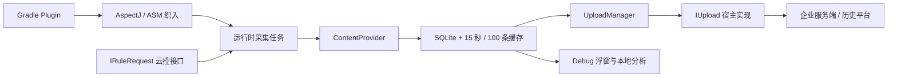

# ArgusAPM

<!-- outline-start -->

## 本节要点大纲

### 锚点（必须覆盖）

- 🔹 [定位] 说明 ArgusAPM 是早期开源一体化 APM 方案，重点价值在架构学习和存量项目评估，新项目要谨慎接入。
- 🔹 [架构] 拆 Gradle Plugin、AOP / ASM 织入、采集模块、缓存、上报、后端依赖；画出模块关系。
- 🔹 [能力范围] 按启动、页面、网络、卡顿、内存、崩溃等方向列数据来源和报告产物。
- 🔹 [兼容风险] 明确 AGP、Kotlin、R8、Android 版本、仓库活跃度带来的维护成本。
- 🔹 [AOP 适用性] 说明函数耗时、页面生命周期、点击、网络拦截适合织入；Binder、native、系统调度不适合靠 AOP 判断。
- 🔹 [多进程] 设计主进程、常驻业务进程、短命进程、WebView / renderer 的采集策略和去重规则。
- 🔹 [网络监控] 用现代网络阶段拆分 DNS、connect、TLS、request、server wait、response、retry、queue wait。
- 🔹 [迁移建议] 给存量项目保留、替换、封装上报协议、逐步停用模块的方案。
- 🔹 [学习价值] 提炼早期 APM 的工程设计：插件化采集、统一事件模型、端侧缓存、服务端分析。
- 🔹 [边界] 明确不要把 ArgusAPM 作为最新最佳实践，需要和 Matrix、Firebase、Sentry、官方 SDK 对照。

### 扩展（可选深入）

- 🔸 增加代码阅读索引：从 Gradle 插件入口、采集模块初始化、网络 interceptor、上报接口开始。
- 🔸 补一个迁移前评估表，覆盖功能替代、数据兼容、开关回滚、历史看板保留。
- 🔸 对 Qihoo360/ArgusAPM 仓库活跃度、依赖版本和已知 issue 做核对。
- 🔸 增加与 Matrix、Measure、Firebase、Sentry 的差异表。
- 🔸 补一个“早期 APM 方案为什么会遇到现代 AGP / Android 限制”的解释段。

### 流水线加工要求

- 评价 ArgusAPM 时必须把历史价值和当前可维护性分开写。
- 涉及 AOP 织入的内容必须说明能观测什么、观测不到什么。
- 迁移建议要给顺序和验收方式，不能只写“替换为新方案”。

### OpenClaw 加工指引

> **锚点**是最低覆盖要求，加工时必须逐条落实并标注验证结果。
> **扩展**视素材丰富程度选择性深入。
> 如果从 Obsidian 素材或 AOSP 源码中发现大纲未列出但与本节强相关的知识点，
> 可**就地插入**最相关的锚点之后，并用 `[自动发现]` 标注，方便后续 review。
> 锚点内容需 L1/L2 验证，扩展内容至少 L2 验证，自动发现内容至少标注来源。
<!-- outline-end -->

## 结论先行：适合读源码，不适合新项目直接接入

ArgusAPM 是 360 在 2018 年开源的 Android APM 客户端方案。它把编译期织入、运行时采集、SQLite 缓存、云控接口和批量上传放在一个仓库里，完整呈现了早期移动 APM 的工程形态。

它也停在了那个时代。公开仓库末次提交是 2019-05-09 的 `75ead19ca98a8a1f776688e9df5b572f20c80b12`。截至 2026 年 7 月，仓库没有设置 archived，但七年没有代码提交；README 还写着服务端停止免费新增接入。仓库无 tag，README 的 3.0.1.1001 发布链接指向已经退出服务的 Bintray，预期坐标也不在 Maven Central。

这几个事实给出清晰结论：

- 新项目不要把公开 ArgusAPM 作为生产依赖。
- 存量项目应把它视为待迁出的旧采集器。
- 它仍值得阅读，因为模块边界、事件模型、端侧缓存和可替换上传接口都具有参考意义。

本节以 Android 17 / API 37 / `android-17.0.0_r1` 为平台锚点。所有行为结论均基于末次公开提交的源码，不把 README 的产品说明当作 API 37 兼容证明。

## 公开工程停在哪个版本

| 对象 | 末次公开状态 | 对现代工程的含义 |
|---|---|---|
| Sample | `compileSdkVersion 27`、`targetSdkVersion 27`、Java 7、OkHttp 3.10.0 | 只能复原旧环境，不能证明 target 37 可运行 |
| Sample 构建 | Gradle 2.14.1、AGP 2.1.3 | 与当前 Gradle、JDK、AGP 相隔多个代际 |
| AspectJ 插件 | Kotlin 1.2.30、AGP 3.1.3、AspectJ 1.8.x，版本 2.0.1.1005/1006 | 依赖旧 Transform 和旧 Gradle 配置 |
| ASM 插件 | Kotlin 1.2.30、AGP 3.1.3、ASM 7.0，版本 3.0.1.1001 | 同样使用旧 Transform，且按固定类名和字段改字节码 |
| 客户端主模块 | minSdk 10、targetSdk 27、`org.apache.http.legacy` | 权限、隐私、存储、ANR 和隐藏 API 都要重写 |
| 发布渠道 | JCenter / Bintray 脚本；Maven Central 无预期 group 目录 | 不能依赖 README 坐标从标准仓库恢复构建 |

“仓库未归档”只是一项 GitHub 设置。判断维护状态要看提交时间、发布渠道、issue 处理和平台适配，不能只看 archived 标记。

## 架构：采集与后端之间留了一层接口

下面的图按源码调用关系组织模块：



图中 `IRuleRequest` 和 `IUpload` 是接口，开源客户端没有把上传域名写死在核心模块。原服务端停止新增接入后，存量团队仍可实现自己的云控和上传端；代价是服务端 schema、鉴权、重试、删除与看板都要自行维护。

源码可以按以下顺序阅读：

1. `ArgusAPMPlugin.kt`、`ArgusAPMTransform.kt`：插件注册与输入范围。
2. `ASMWeaver.kt`、各 `ClassAdapter`：字节码改写点。
3. `Client.java`、`Manager.java`、`TaskManager.java`：初始化、开关和任务注册。
4. `ApmProvider.java`、`DbCache.java`、`DataHelper.java`：跨进程写入、批量缓存与清理。
5. `UploadManager.java`、`IRuleRequest.java`、`IUpload.java`：云控与上传边界。

## 能力表：README 的名称要回到实现核对

| 方向 | 公开源码的数据来源 | 默认口径或产物 | Android 17 审阅结论 |
|---|---|---|---|
| 启动 | `attachBaseContext` 时间到首个 Activity decor view 的 `post()` 回调 | 一条 `appstart` 毫秒值 | 不是系统定义的 TTID / TTFD；受初始化时机和消息队列影响 |
| 页面 | AspectJ 包围 `Activity.on**()`，或反射替换 `ActivityThread.mInstrumentation` | 生命周期耗时；首帧阈值默认 300 ms，生命周期阈值 100 ms | AOP 可迁；Instrumentation hook 依赖隐藏 API，应移除 |
| FPS | `Choreographer.FrameCallback` 计帧，后台任务约每 1000 ms 计算 | 只持久化 `fps <= 30` 的窗口 | 能做低帧率线索，不能给 FrameTimeline 慢帧类型 |
| 内存 | `Debug.getMemoryInfo()` | total / Dalvik / native / other PSS；默认启动 10 秒后、每 30 分钟采样 | 只能看进程 PSS 快照，不能定位对象泄漏 |
| 网络 | OkHttp application interceptor，另有 HttpClient / URLConnection 改写 | URL、状态码、总耗时、请求与响应字节数 | 没有 DNS / connect / TLS 分段；失败请求不会落记录 |
| 卡顿 | `Looper.setMessageLogging()` 配合延时任务 | 默认 4500 ms 后抓一次主线程栈 | 阈值很高，且占用 Looper 的单一 Printer 插槽 |
| Watchdog | 后台线程向主线程 post，sleep 后检查 tick | 默认 4500 ms 阈值、5 秒检查间隔 | 可发现长时间无响应；单点堆栈不能说明阻塞起因 |
| ANR | 周期枚举 `/data/anr/` 并解析 trace | 默认每 2 小时且只在 Wi-Fi 下扫描，命中后立即上传 | 普通 API 37 应用无权依赖该目录，模块失去核心数据源 |
| 文件 | 遍历配置目录，默认 12 小时一次、深度 3、最小 50 KiB | 路径、大小、文件数、读写执行权限 | 应用私有目录仍可审计；外部存储根目录方案受分区存储限制 |
| 进程 | 每个已初始化进程延时约 2～3 秒写一条记录 | 进程名与启动次数 | 只说明 SDK 看到了该进程，不等于进程存活率或退出原因 |
| 函数耗时 | ASM 只包围 `Runnable.run()` 与 `BroadcastReceiver.onReceive()` | 超过 2000 ms 才记录 | 并非任意函数耗时；公开 `TaskManager` 未注册 `FuncTask` |
| WebView | ASM 匹配 `onPageFinished(WebView, String)` 后注入 JS bridge | Navigation Timing 字段 | 公开 `TaskManager` 未注册 `WebTask`，且注入会改变 WebView 安全设置 |
| Crash | 无对应 task、storage 或 uncaught-exception 采集器 | 无 | README 也未把 Crash 列为模块；应由独立稳定性 SDK 处理 |

这张表里有几处容易误判的细节。

FPS 的计算任务跑在后台执行器，帧时间与计数由主线程更新，字段没有明确同步；低 FPS 时保存的 `CommonUtils.getStack()` 又是在后台任务当前线程创建 `Throwable`，并不是当时的主线程栈。它可以提示某个窗口低帧，不能用附带堆栈定因。

OkHttp interceptor 在 `chain.proceed()` 抛出 `IOException` 后直接重新抛出，没有调用 `DataRecordUtils.recordUrlRequest()`，所以 DNS 失败、连接失败和超时等重要错误样本不会进入原网络表。响应没有 `Content-Length` 时，代码还会 `source.request(Long.MAX_VALUE)`，可能把整个响应读入缓冲区，改变被测请求的内存与时序。

Func 与 WebView 文件出现在末次提交中，但 `TaskManager.registerTask()` 只注册到 WatchDog，没有注册 `FuncTask` 和 `WebTask`。仅看到 class 文件不能宣布功能可用；至少要沿着“插件注入 → task 开关 → task 注册 → storage → upload”走完一次。

## AOP / ASM 能看见什么

### 适合织入的边界

编译期织入适合有稳定 Java / Kotlin 调用点、需要附加业务上下文的事件，例如：

- Activity 生命周期入口与出口。
- 明确标注的业务函数耗时。
- 点击回调或 route 变化。
- OkHttp builder、interceptor 或调用封装。
- `Runnable.run()`、`BroadcastReceiver.onReceive()` 这类固定签名。

它能在事件里补上页面名、业务操作名、进程名和 trace id，这是单靠系统 trace 不容易自动获得的语义。

### 不适合用织入推断的范围

AOP 或 ASM 看不到 Java 方法边界之外的完整因果关系：

- Binder 对端执行与 binder 线程池饥饿。
- RenderThread、SurfaceFlinger、GPU 与合成。
- native heap、信号处理和 C/C++ 锁。
- Linux 调度、I/O wait、内存回收和设备频率。
- 服务端排队与数据库耗时。

这些问题要用 Perfetto、FrameTimeline、heap dump、native unwind、服务端 trace 或系统 API 补证据。织入事件适合作为 trace 上的业务标记，不适合作为系统瓶颈的单一结论。

## 旧插件在现代构建链上为什么会断

3.0.1.1001 的 `ArgusAPMPlugin` 取得旧版 `AppExtension`，调用 `android.registerTransform(ArgusAPMTransform(project))`，Transform 范围是 `SCOPE_FULL_PROJECT`。AGP 7.2 弃用 Transform API，AGP 8.0 删除该 API；target 37 工程常用的 AGP 8/9 无法直接加载这套插件。

旧插件还有以下构建风险：

- 依赖注入只寻找 `api` 或 `compile`，没有按 Debug / Release 变体隔离。
- ASM 插件的 `enabled` 总开关没有被织入流程读取；`funcEnabled`、`netEnabled`、`okhttpEnabled`、`webviewEnabled` 默认都为 true。
- OkHttp 改写按 `okhttp3/OkHttpClient$Builder` 和内部 `interceptors` 字段写死，网络库升级后容易出现校验或运行错误。
- ASM 7.0、Kotlin 1.2.30 和旧 Gradle listener 没有现代 Kotlin / Java 字节码、configuration cache 或 project isolation 验证。
- jar 改写捕获异常后不抛出，构建有机会留下难诊断的不完整输出。

迁移插件不能只把 `registerTransform()` 改个名字。需要在 Android Components Instrumentation API 上重新设计：

- 逐 variant 选择 Debug / internal / production。
- 明确只处理项目 class，还是连依赖 class 一起处理。
- 为每个 adapter 写输入字节码与输出行为测试。
- 对 Kotlin suspend、lambda、desugaring、R8 前后顺序和增量构建做回归。
- 插桩失败时让构建失败，不能吞掉异常继续出包。

### R8 规则也是迁移阻断项

`argus-apm-main.pro` 作为 consumer rules 发布，包含无参数的 `-dontwarn`、`-dontoptimize`，还保留所有 Activity、Application、Service、BroadcastReceiver、ContentProvider、View 以及完整 OkHttpClient / Builder。原样进入现代 App 会扩大保留范围、掩盖缺失类告警，并可能关闭优化。

内部 fork 要从最小反射面重新写 consumer rules。对已迁走的模块删除 keep；对确需反射的类使用精确成员规则；CI 同时检查 R8 mapping、APK 大小、missing-class 告警和启动性能。

## Android 17 运行时边界

### Instrumentation hook 依赖非 SDK 接口

`InstrumentationHooker` 反射 `ActivityThread.currentActivityThread()` 与 `ActivityThread.mInstrumentation`，把系统对象替换为 `ApmInstrumentation`。这些成员在 `android-17.0.0_r1` 中仍能找到，但不属于公开 SDK。Android 9 起的非 SDK 限制、OEM 修改、加固与测试框架都可能阻止或冲突这次替换。

页面生命周期计时可以改用 `Application.ActivityLifecycleCallbacks`、Jetpack Startup、Macrobenchmark 和业务可控的埋点。不要为保留旧数据口径继续扩大 hidden API exemption。

### ANR 不能再读取 `/data/anr/`

`AnrLoopTask` 只在 Wi-Fi 下枚举 `/data/anr/`，寻找名字包含 `trace` 且两天内、大小不超过 50 MiB 的文件。普通应用在 Android 17 没有稳定权限读取系统 ANR 目录，因此“任务启动成功”不代表能采到 ANR。

迁移时可组合：

- `ActivityManager.getHistoricalProcessExitReasons()` 与 `ApplicationExitInfo.getTraceInputStream()` 获取 API 30+ 的历史退出及可用 ANR trace。
- 轻量主线程 watchdog 提供 ANR 前的应用侧线索，但要控制采样开销和误报。
- `ProfilingManager`、Perfetto 或平台允许的诊断机制采集系统级证据。
- Google Play Android vitals 或目标稳定性平台提供聚类、版本趋势和设备维度。

不要继续尝试绕过 `/data/anr/` 权限，也不要把 watchdog 事件直接命名为系统 ANR。

### 动态广播、网络与设备标识都需要重写

客户端用无 flags 的 `registerReceiver()` 注册网络、亮屏、解锁和自定义云控广播。Android 13 提供显式导出 flags，target 34+ 对接收非系统广播的动态 receiver 强制要求 `RECEIVER_EXPORTED` 或 `RECEIVER_NOT_EXPORTED`；旧注册代码可能失败，云控刷新也可能静默停止。

网络判断依赖已弃用的 `NetworkInfo`。现代实现应使用 `ConnectivityManager` 与 `NetworkCapabilities`，并把“当前默认网络”“是否计费”“传输类型”分开记录。

`CommonUtils` 会尝试读取 IMSI、IMEI、设备序列号和 `android_id`，dummy cloud manifest 还声明 `READ_PHONE_STATE`。Android 10 以后，普通应用不能把不可重置设备标识当通用采集字段。迁移时使用随机 installation id 或符合业务与合规要求的 App Set ID，并定义删除与重置语义。

### 存储与 WebView 不能照搬

Debug 路径会在外部存储根目录使用 `/360/Apm/`，文件任务也能从外部存储根目录拼路径。target 30+ 的分区存储不支持这套任意目录访问方式。配置与数据库应留在应用私有目录；需要用户导出时走 SAF。

WebView adapter 在每个匹配的 `onPageFinished()` 开头执行这些动作：

- 把 JavaScript 强制设为 enabled。
- 添加名为 `android_apm` 的 JavaScript interface。
- 用 `loadUrl("javascript:...")` 读取 `window.performance.timing`。

这会改变原页面的安全策略，也把 bridge 暴露给当前加载内容。即使 bridge 只有采集方法，也可能被不可信页面调用来注入伪造数据或制造开销。API 37 项目不应保留这段全局自动织入；只在可信 origin、受控 WebView 和明确生命周期中注入最小接口，并在导航变化时移除。

### 16 KB 页不是核心模块的直接阻断项

末次公开树没有 `.so` 或 C/C++ 源码，ArgusAPM 核心本身不存在 ELF 页对齐问题。宿主提供的 uploader、其他 APM 或后续 fork 若加入 native 组件，仍要对最终 APK/AAB 做 16 KB ELF 与 ZIP 对齐检查。涉及 common kernel 源码时统一以 `android17-6.18-2026-06_r6` 为锚点，量产设备还要核对 vendor kernel。

## 多进程：原设计可借鉴，默认开关不能照用

ArgusAPM 的思路是让每个需要采集的进程各自初始化，通过 `${applicationId}.apm.storage` 的未导出 `ContentProvider` 把数据写进一个 SQLite 数据库。Sample 也示范了在非 UI 进程关闭清理、云控、上传、ANR 和文件扫描。

`argus-apm-main` 自己的 manifest 没有声明这个 provider，Sample 是手工添加的。存量工程要核对最终合并 manifest，确保 authority 与 `StorageUtils.getAuthority(packageName)` 一致且 `exported=false`；缺少 provider 时，各 task 会在保存阶段失败。

问题在于 `Config.localFlags` 默认接近全开。每个进程中的 static 单例彼此独立，如果忘记按进程关开关，就会重复注册 receiver、重复清理、重复请求云控或竞争上传。

存量项目应把进程策略写成配置表：

| 进程类型 | 建议保留 | 应关闭 |
|---|---|---|
| 主进程 | 页面、网络、必要的资源采样；唯一上传与清理者 | 无关模块和 Debug 浮窗 |
| 常驻业务进程 | 该进程的网络、PSS、watchdog、关键业务事件 | 页面、文件扫描、云控、上传、清理 |
| 短命工具进程 | 进程启动与必要错误线索，能不初始化就不初始化 | FPS、文件、周期采样、上传 |
| WebView 宿主进程 | 受控 WebView 页面事件 | 全局 JS bridge 注入 |
| WebView renderer | 不在应用进程内初始化 SDK | 全部 ArgusAPM 任务 |

每条事件至少带：

- `event_id`：全局唯一，服务端幂等键。
- `session_id`：一次前台会话。
- `trace_id`：一次用户操作或跨端请求。
- `process_name`、`pid`、`process_start_id`：区分进程实例。
- `elapsed_realtime_ns` 与 wall clock：排序用单调时钟，跨端关联用墙钟。
- `schema_version`、`collector_version`：支持双写和回滚。

ArgusAPM 原表里不少事件带 `processName`，但没有完整的 session、trace 和幂等协议。迁移时应在上报适配层补齐，避免直接修改每个旧 task 后造成多套格式。

## 端侧缓存与上传：设计思路正确，实现有数据丢失边界

`ApmProvider` 把跨进程写入收进一个进程，`DbCache` 每 15 秒或累计 100 条做一次 SQLite 事务。这种“采集线程只提交事件，存储线程批量写”的方向仍可采用。

上传由宿主实现 `IUpload`，默认在 Wi-Fi 连接变化且距上次上传超过一小时后读取数据库；单批最多 1000 条，失败重试计数为 3。上传 JSON 还会附加机型、厂商、SDK、系统版本、App 版本、APM 版本和时间。

`DataHelper.readAll(handler)` 有一个需要修复的数据安全问题：小于 1000 条的末批数据调用 `handler.onRead(dataMap)` 后，没有检查返回值，随后照常按计数删除。末批上传失败时仍可能被清掉。迁移前应为成功确认、重试、进程中断和重复上传补测试，协议采用至少一次投递与服务端幂等。

下面的事件封装用于把旧表记录与新 collector 解耦：

```kotlin
data class ApmEnvelope(
    val eventId: String,
    val schemaVersion: Int,
    val collector: String,
    val processName: String,
    val sessionId: String?,
    val traceId: String?,
    val elapsedRealtimeNanos: Long,
    val wallTimeMillis: Long,
    val payload: ByteArray,
)

interface ApmSink {
    fun enqueue(event: ApmEnvelope): Boolean
}
```

旧 Argus storage adapter 和新 SDK 都写 `ApmSink`，上传器只认 `ApmEnvelope`。这样可以先稳定服务端字段，再逐项替换采集实现，也便于在回滚时区分 collector。

## 网络采集的现代字段

ArgusAPM 的 `costTime = now - start` 只能给出 interceptor 包围的总时间。现代网络事件至少应分出：

| 阶段 | 推荐来源 | 需要区分 |
|---|---|---|
| queue wait | Dispatcher / Call 调度埋点 | 排队、并发上限、取消 |
| DNS | OkHttp `EventListener` | host、缓存、地址族、失败 |
| connect | `EventListener` | route、proxy、连接复用 |
| TLS | `secureConnectStart/End` | 协议、握手失败；不要上传证书敏感内容 |
| request | headers/body start/end | 请求头耗时、Body 大小、单次发送 |
| server wait | request end 到 response headers start | 服务端与网络往返的合并等待 |
| response | headers/body start/end | 状态码、Body 大小、取消与读取失败 |
| retry / follow-up | call / exchange 序号 | 重定向、鉴权、连接恢复、业务重试 |

`EventListener` 负责网络阶段，interceptor 负责业务 code、稳定的 route pattern、页面与 trace id。不要上传完整 URL query、Authorization、Cookie、请求体或响应体；动态 path 参数要归一化。

如果后端支持分布式追踪，客户端保留服务端返回或约定生成的 `traceparent` / request id。一次 OkHttp `Call` 可能有多次 exchange，服务端 trace id、call id 和 retry index 要分开，避免把重试误算成多个用户请求。

## 存量迁移：按风险顺序拆，不做一次性替换

### 建立现状清单

先记录每个旧 task 的开关、进程、采样率、数据库表、上传字段、看板、告警、日均量和数据负责人。还要导出一份 R8 rules、Gradle 插件配置、provider 声明与服务器 schema。

### 先移除构建阻断

停用旧 AspectJ / ASM 插件，删除它自动注入的依赖。必须保留的少量业务埋点改成显式 API，或写一个只处理项目 class、按 variant 开启的现代 Instrumentation 插件。验收包括 clean / incremental / configuration cache、Kotlin、R8、测试、APK 内容和构建耗时。

### 稳定事件协议

在旧数据库与服务器之间增加 adapter，补 `event_id`、schema 版本、进程实例、单调时钟和隐私过滤。服务器先接受旧、新两种 collector，按 collector 分组对比，不急着改历史看板。

### 按模块替换

| 旧模块 | 替代方向 | 双写验收 |
|---|---|---|
| Activity / 启动 | ActivityLifecycleCallbacks、Jetpack Startup、Macrobenchmark、目标 APM | 同设备同场景比较定义，不强求数值相等 |
| FPS / 卡顿 | JankStats、FrameMetrics、Perfetto、Matrix | 页面 jank 率、trace 可定位性、探针开销 |
| 内存 | 平台内存 API、Profiler、heap dump、KOOM 或目标 SDK | PSS 口径、OOM / 泄漏覆盖、采样成本 |
| 网络 | 当前 OkHttp 的 EventListener + interceptor | 成功、失败、取消、重试、HTTP/2 复用与脱敏 |
| ANR / Crash | ApplicationExitInfo、Play vitals、Sentry、Firebase 或企业平台 | 聚类、符号化、会话关联、漏报与误报 |
| 文件 / 进程 | 按业务必要性重写；ApplicationExitInfo 补退出原因 | 分区存储、短命进程、升级与数据删除 |

双写窗口内同时记录事件量、关键分位数、漏报、重复率、上传失败率、端侧 CPU / 内存 / 电量和包体积。旧数值与新数值定义不同，验收重点是新定义可解释、趋势稳定、问题可回查。

### 退出条件

旧 ArgusAPM 可以下线时，应满足：

- 新 collector 连续覆盖至少两个发布周期。
- 历史看板注明口径切换时间，必要字段可映射。
- 旧 plugin、AAR、provider、权限、receiver、数据库和 ProGuard 规则均从最终包移除。
- 服务器停止接收旧 schema 前已完成回滚窗口与数据保留确认。
- Release APK/AAB 扫描不到 `com.argusapm` 类和 `apm.storage` provider。

## 与其他方案的边界

| 方案 | 主要位置 | 适合负责 | 不应从 ArgusAPM 结论外推 |
|---|---|---|---|
| ArgusAPM | 历史客户端源码，服务端需自接 | 架构学习、存量迁移 | 新项目生产 APM |
| Matrix | 模块化端侧性能与稳定性采集 | 卡顿、资源与 native 能力按模块选用 | 仍要审计版本、插件与 native 依赖 |
| Measure | SDK + 后端 + 看板 | 自托管移动观测与会话回查 | 部署、存储、符号化和升级并非零成本 |
| Firebase | Google 托管产品 | 快速接入官方生态中的性能与稳定性产品 | 数据托管、配额和地区要求需单独评估 |
| Sentry | 错误、trace、profiling 与会话上下文平台 | 跨端错误追踪和性能关联 | 当前 SDK 能力与自托管成本需按版本核对 |
| Android 官方工具 | Perfetto、JankStats、FrameMetrics、Macrobenchmark、ApplicationExitInfo | 系统证据、专项测量、退出原因 | 不自动提供完整企业看板与处置流程 |

选型不能只比功能数量。要同时比较数据口径、端侧成本、隐私、构建侵入、服务端运维、告警处置和平台退出成本。

## 能从 ArgusAPM 学到什么

ArgusAPM 留下的几项设计仍有参考意义：

- 按采集方向拆 task 与 storage，支持独立开关。
- 用 `ContentProvider` 把多进程写入收进同一数据库。
- 先在内存聚合，再批量事务写库。
- 把云控与上传抽象为接口，让客户端不绑定固定后端。
- Debug 现场分析与生产采集共用事件对象。

它的限制也同样值得记录：构建 API 会淘汰，固定签名 hook 会漂移，私有系统接口的限制会变严，旧权限与设备标识会失效，端侧缓存必须面对失败确认和幂等。学习这套架构时，应保留模块化和协议分层，替换已经失去平台支持的实现。

## 参考资料

- [ArgusAPM 官方仓库](https://github.com/Qihoo360/ArgusAPM)
- [末次公开提交 `75ead19`](https://github.com/Qihoo360/ArgusAPM/tree/75ead19ca98a8a1f776688e9df5b572f20c80b12)
- [ASM 插件入口 `ArgusAPMPlugin.kt`](https://github.com/Qihoo360/ArgusAPM/blob/75ead19ca98a8a1f776688e9df5b572f20c80b12/argus-apm-gradle-asm/src/main/kotlin/com/argusapm/gradle/ArgusAPMPlugin.kt)
- [ASM 织入入口 `ASMWeaver.kt`](https://github.com/Qihoo360/ArgusAPM/blob/75ead19ca98a8a1f776688e9df5b572f20c80b12/argus-apm-gradle-asm/src/main/kotlin/com/argusapm/gradle/internal/asm/ASMWeaver.kt)
- [运行时任务注册 `TaskManager.java`](https://github.com/Qihoo360/ArgusAPM/blob/75ead19ca98a8a1f776688e9df5b572f20c80b12/argus-apm/argus-apm-main/src/main/java/com/argusapm/android/core/tasks/TaskManager.java)
- [OkHttp 采集 `NetWorkInterceptor.java`](https://github.com/Qihoo360/ArgusAPM/blob/75ead19ca98a8a1f776688e9df5b572f20c80b12/argus-apm/argus-apm-okhttp/src/main/java/com/argusapm/android/okhttp3/NetWorkInterceptor.java)
- [ANR 目录扫描 `AnrLoopTask.java`](https://github.com/Qihoo360/ArgusAPM/blob/75ead19ca98a8a1f776688e9df5b572f20c80b12/argus-apm/argus-apm-main/src/main/java/com/argusapm/android/core/job/anr/AnrLoopTask.java)
- [端侧批量读取与清理 `DataHelper.java`](https://github.com/Qihoo360/ArgusAPM/blob/75ead19ca98a8a1f776688e9df5b572f20c80b12/argus-apm/argus-apm-main/src/main/java/com/argusapm/android/core/storage/DataHelper.java)
- [WebView 字节码注入 `WebMethodAdapter.kt`](https://github.com/Qihoo360/ArgusAPM/blob/75ead19ca98a8a1f776688e9df5b572f20c80b12/argus-apm-gradle-asm/src/main/kotlin/com/argusapm/gradle/internal/asm/bytecode/webview/WebMethodAdapter.kt)
- [Android Gradle Plugin API 更新](https://developer.android.com/build/releases/gradle-plugin-api-updates)
- [JFrog：Bintray 服务退出说明](https://jfrog.com/blog/into-the-sunset-bintray-jcenter-gocenter-and-chartcenter/)
- [Android 非 SDK 接口限制](https://developer.android.com/guide/app-compatibility/restrictions-non-sdk-interfaces)
- [`ApplicationExitInfo` API](https://developer.android.com/reference/android/app/ApplicationExitInfo)
- [运行时注册广播接收器](https://developer.android.com/develop/background-work/background-tasks/broadcasts)
- [Android 14：动态 receiver 导出标志要求](https://developer.android.com/about/versions/14/behavior-changes-14#runtime-receivers-exported)
- [Android 10 不可重置设备标识限制](https://developer.android.com/about/versions/10/privacy/changes#non-resettable-device-ids)
- [WebView native bridge 安全风险](https://developer.android.com/privacy-and-security/risks/insecure-webview-native-bridges)
- [Android 16 KB 页支持指南](https://developer.android.com/guide/practices/page-sizes)
- [`android-17.0.0_r1`：`ActivityThread.java`](https://android.googlesource.com/platform/frameworks/base/+/android-17.0.0_r1/core/java/android/app/ActivityThread.java)
- [`android17-6.18-2026-06_r6` common kernel](https://android.googlesource.com/kernel/common/+/refs/tags/android17-6.18-2026-06_r6/)
