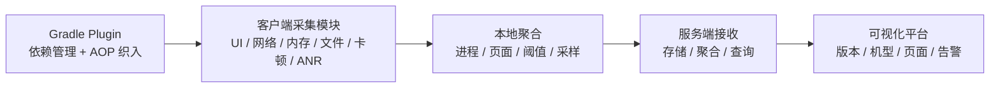

# ArgusAPM

<!-- outline-start -->
## 本节要点大纲

### 锚点（必须覆盖）

- 🔹 [定位] 说明 ArgusAPM 是早期开源一体化 APM 方案，重点价值在架构学习和存量项目评估，新项目要谨慎接入。
- 🔹 [架构] 拆 Gradle Plugin、AOP / ASM 织入、采集模块、缓存、上报、后端依赖；画出模块关系。
- 🔹 [能力范围] 按启动、页面、网络、卡顿、内存、崩溃等方向列数据来源和报告产物。
- 🔹 [兼容风险] 明确 AGP、Kotlin、R8、Android 版本、仓库活跃度带来的维护成本。
- 🔹 [AOP 适用性] 说明函数耗时、页面生命周期、点击、网络拦截适合织入；Binder、native、系统调度不适合靠 AOP 判断。
- 🔹 [多进程] 设计主进程、常驻业务进程、短命进程、WebView / renderer 的采集策略和去重规则。
- 🔹 [网络监控] 用现代网络阶段拆分 DNS、connect、TLS、request、server wait、response、retry、queue wait。
- 🔹 [迁移建议] 给存量项目保留、替换、封装上报协议、逐步停用模块的方案。
- 🔹 [学习价值] 提炼早期 APM 的工程设计：插件化采集、统一事件模型、端侧缓存、服务端分析。
- 🔹 [边界] 明确不要把 ArgusAPM 作为最新最佳实践，需要和 Matrix、Firebase、Sentry、官方 SDK 对照。

### 扩展（可选深入）

- 🔸 增加代码阅读索引：从 Gradle 插件入口、采集模块初始化、网络 interceptor、上报接口开始。
- 🔸 补一个迁移前评估表，覆盖功能替代、数据兼容、开关回滚、历史看板保留。
- 🔸 对 Qihoo360/ArgusAPM 仓库活跃度、依赖版本和已知 issue 做核对。
- 🔸 增加与 Matrix、Measure、Firebase、Sentry 的差异表。
- 🔸 补一个“早期 APM 方案为什么会遇到现代 AGP / Android 限制”的解释段。

### 流水线加工要求

- 评价 ArgusAPM 时必须把历史价值和当前可维护性分开写。
- 涉及 AOP 织入的内容必须说明能观测什么、观测不到什么。
- 迁移建议要给顺序和验收方式，不能只写“替换为新方案”。

### OpenClaw 加工指引

> **锚点**是最低覆盖要求，加工时必须逐条落实并标注验证结果。
> **扩展**视素材丰富程度选择性深入。
> 如果从 Obsidian 素材或 AOSP 源码中发现大纲未列出但与本节强相关的知识点，
> 可**就地插入**最相关的锚点之后，并用 `[自动发现]` 标注，方便后续 review。
> 锚点内容需 L1/L2 验证，扩展内容至少 L2 验证，自动发现内容至少标注来源。
<!-- outline-end -->

## ArgusAPM 是早期开源的一体化方案

ArgusAPM 是 360 开源的 Android 性能监控平台，仓库 README 把它定义为移动端可视化性能监控平台。它覆盖交互分析、网络、内存、进程、文件、卡顿、ANR 等指标，并提供 Gradle Plugin 做接入和 AOP 织入。

截至 2026-04-24，仓库 README 仍保留一条公告：由于公司业务调整及成本原因，ArgusAPM 停止支持服务端免费新增接入，已接入产品不受影响。这个状态决定了它更适合作为架构参考或存量项目维护对象，不适合作为新项目默认选型。

## 架构分成采集模块和 Gradle Plugin

ArgusAPM 的整体结构可以看成两部分：

- **性能采集模块**：核心 APM 能力、AOP 织入能力、OkHttp 网络采集等，最终以 aar 形式接入。
- **Gradle Plugin**：管理依赖并在编译期织入部分性能采集代码。

这种设计在早期 Android APM 里很典型：客户端 SDK 负责采集，Gradle 插件负责自动插入埋点或包装调用，服务端负责展示和分析。

## 支持的监控方向

README 中列出的监控模块覆盖面较广：

| 方向 | 采集目的 |
|---|---|
| 交互分析 | 统计 Activity 生命周期耗时，定位页面打开慢 |
| 网络请求分析 | 记录请求耗时、流量、错误和网络问题 |
| 内存分析 | 监控内存使用，辅助降低内存占用 |
| 进程监控 | 统计多进程启动和异常存活情况 |
| 文件监控 | 观察私有文件大小和变化 |
| 卡顿分析 | 记录卡顿时刻和代码堆栈 |
| ANR 分析 | 捕获 ANR 相关异常和现场 |

这些方向至今仍是移动 APM 的主干。变化主要发生在实现细节上：Android 版本提高、权限收紧、AGP 插件 API 变化、隐私审查变严，都会影响旧方案直接复用。

## 新项目使用要谨慎

ArgusAPM 的问题不在思路，而在维护和平台依赖。新项目直接采用会遇到几类风险：

- 服务端新增接入状态不确定，平台能力无法直接依赖。
- Gradle 插件和 AOP 织入可能不适配现代 AGP。
- 旧监控模块对 Android 12+、14+、16KB page size、隐私策略的适配需要重新验证。
- 文档和社区活跃度不足，遇到兼容问题时更多要靠自修。

如果已有项目还在用，建议先把采集模块、服务端依赖和构建插件分开评估。能保留的保留，无法适配的逐步替换成 AndroidX、Matrix、KOOM、Sentry、Firebase 或自研模块。

## 作为参考，它仍然有学习价值

ArgusAPM 展示了一个完整移动 APM 早期形态：客户端模块化采集、编译期织入、网络库适配、多进程处理、服务端看板。这些设计问题今天仍然存在，只是工具和系统环境变了。

读这类老项目时，不要只看“现在能不能接”。更有用的是看它怎么划分采集模块、怎么处理多进程、怎么把网络和页面关联、怎么让 Debug 模式和线上采集共存。这些经验可以迁移到新的 APM 体系里。

## 早期一体化 APM 的典型形态

ArgusAPM 展示了早期 Android APM 的一条完整路线：

这套结构在今天仍然成立，只是每一层的实现要更新。Gradle Transform 要迁到现代 AGP API，进程和隐私限制要重审，服务端新增接入也不能再依赖原项目公告里已经停止的免费服务。

## AOP 织入适合哪些数据

ArgusAPM 这类方案使用编译期织入，最适合处理有明确调用边界的数据：

- Activity 生命周期耗时。
- OkHttp 请求开始、结束、失败。
- 页面打开和关闭。
- 业务埋点的自动包装。
- 主线程风险 API 的静态扫描或插入。

不适合用 AOP 解决所有问题。比如系统调度、RenderThread、GPU、native heap、Binder 对端，这些都不在 Java 方法入口出口里。AOP 能补业务上下文，不能替代系统 trace。

## 多进程采集要单独设计

README 提到 ArgusAPM 支持多进程采集。多进程 APM 的难点在三个地方：

- 每个进程是否都要初始化 SDK。
- 同一个用户会话如何跨进程关联。
- 子进程上报失败时是否会丢关键样本。

现代项目里常见进程包括主进程、推送进程、WebView renderer、播放器进程、插件进程、短命工具进程。采集策略应该分层：

| 进程类型 | 建议 |
|---|---|
| 主进程 | 完整采集页面、启动、卡顿、网络、内存 |
| 常驻业务进程 | 采集稳定性、CPU、内存和关键业务事件 |
| 短命进程 | 只采 Crash / ANR / exit，避免重模块初始化 |
| WebView / renderer | 依赖系统和 WebView 侧指标，谨慎注入 |

多进程一刀切初始化，会增加启动成本，也会制造重复上报。

## 网络监控的现代适配

ArgusAPM 里有 `argus-apm-okhttp` 这类网络采集模块。现代网络监控除了 OkHttp 耗时，还要区分：

- DNS、connect、TLS、request body、server wait、response body。
- HTTP code、业务 code、异常类型、重试次数。
- 请求队列等待时间。
- 缓存命中和离线缓存。
- URL pattern 脱敏。

如果平台只记录“接口耗时 1200ms”，定位价值有限。书稿级 APM 应该把网络请求拆成阶段指标，并和页面、用户操作、服务端 trace id 关联。

## 存量项目迁移建议

已有 ArgusAPM 存量接入时，建议按模块拆迁，不要一次推倒：

1. 保留服务端能用的历史数据，避免趋势断档。
2. 先替换构建链风险最高的 Gradle / AOP 插件。
3. 卡顿和帧指标迁到 JankStats / FrameMetrics 或 Matrix。
4. Crash / ANR 迁到 Bugly、Sentry、APMPlus 或自建平台。
5. 网络数据迁到统一网络库拦截器。
6. 页面、版本、机型维度保持字段兼容，方便前后对比。

旧 APM 最大的价值是历史口径。迁移时如果字段全变，平台会失去版本对比能力。
