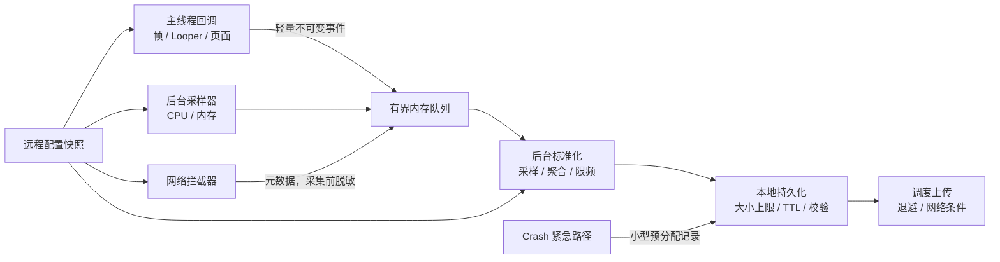

# 历史开源 APM：BlockCanary、ArgusAPM、AndroidGodEye、Collie 与 Rabbit

## 这些项目适合看设计取舍

AndroidGodEye、Collie、Rabbit 都曾试图用较低的接入成本覆盖多种 Android 性能信号。它们留下了不少值得学习的设计：按模块启停采集、把主线程事件转交给后台线程、用 Activity 生命周期补页面上下文，以及把本地调试 UI 与数据采集分开。

不过，“仓库里有这个功能”只说明作者实现过一条采集路径，不代表它在 Android 17、可变刷新率设备、现代 AGP 和生产流量下仍有可靠口径。评估旧 APM 项目时，应同时检查四个维度：

- **信号语义**：采到的是系统定义的指标，还是由 SDK 自己推断的近似值。
- **运行开销**：是否在主线程做反射、抓栈、序列化、文件 I/O 或主动 GC。
- **构建兼容性**：Gradle 插件是否使用已经删除的 Transform API 或 AGP 内部类。
- **维护证据**：最近发布、固定 commit、`compileSdk`、`targetSdk` 与依赖仓库能否支撑当前工程。

以下分析将源码固定在对应 commit。固定日期和构建版本用于界定结论适用的代码，不用于给项目排资历：

| 项目 | 源码基线 | 发布与构建基线 | 可以得出的结论 |
|---|---|---|---|
| AndroidGodEye | [`459f5cb5`](https://github.com/Kyson/AndroidGodEye/tree/459f5cb5a2a4d176ff63f27322644a8191df2af9) | 3.4.3；AGP 3.2.1；`compileSdk` / `targetSdk` 29；`minSdk` 16 | upstream 没有给出 Android 17 与现代 AGP 的验证证据 |
| Collie | [`bfdc6782`](https://github.com/happylishang/Collie/tree/bfdc6782d568bfcefef01e846e81ccfd5a7e3470) | 1.1.8；AGP 7.2.1；`compileSdk` / `targetSdk` 30；`minSdk` 21 | 可阅读运行时实现，但指标口径和依赖要逐项替换或复测 |
| Rabbit | [`d29f293a`](https://github.com/SusionSuc/rabbit-client/tree/d29f293a373167b03fc946e763d57e72157ab0e5) | README 标注 1.0.3；AGP 3.5.3；`compileSdk` / `targetSdk` 28；`minSdk` 19 | Gradle 插件不能直接进入 AGP 8.0+ 工程 |
| Matrix | [`3b8293bd`](https://github.com/Tencent/matrix/tree/3b8293bd65d47eeea7caf1f32a3a5d4d5eab60e7) | 2.1.0；插件编译依赖 AGP 4.0.0；README 声明支持 AGP 3.5/4.0/4.1 | Trace Gradle 插件仍受 Transform API 删除影响 |

BlockCanary 和 ArgusAPM 也归入本节。两者分别完整保留了早期 Looper 长消息采样与“一体化客户端 APM”的实现，但发布物均停在现代 Android 之前；新项目不应为它们继续保留独立接入章节。

## BlockCanary：保留 Looper 长消息原理

BlockCanary 1.5.0 使用公开的 `Looper.setMessageLogging()` 获取每次 `Message` dispatch 的起止边界，再由后台线程采样主线程 Java 栈。它测到的是一次 dispatch 的 wall time，不包含消息在队列中的 delivery delay，也不是从输入、RenderThread、GPU 到屏幕 present 的整帧耗时。

上游 1.5.0 停在 2017 年，仍使用 AGP 2.2.2、compileSdk 23 和 targetSdk 22。analyzer manifest 的 exported、旧通知、`PendingIntent`、外部存储、IMEI 与权限实现都不符合现代平台要求。因此 Android 17 项目只借鉴原理，不直接依赖旧 AAR。

### 真实采样窗口与盲区

采样不是从 dispatch 开始就固定每 300 ms 抓栈：

1. 第一次 Printer 回调记录 wall time 和主线程 CPU time，并启动 sampler。
2. 首次采样被安排在 `threshold × 0.8`；默认 dump interval 又等于 block threshold。
3. dispatch 结束时按 wall time 判断是否超阈值，再异步组装报告并停止 sampler。
4. 若时间窗内没有栈样本，原实现不会生成 `BlockInfo`。

阈值 1000 ms、采样间隔 300 ms 的 1200 ms dispatch，计划采样点约在 800 ms 和 1100 ms，前 200 ms 的真正热点可能完全错过。采样栈只说明采样瞬间主线程所在位置：wall time 很长、thread CPU 很短时，仍要用 Perfetto 区分 Runnable 饥饿、Binder、锁或 I/O；两者都长才更接近持续 CPU 工作。

`Looper` 只有一个 message logger 槽位，后安装 SDK 会覆盖先安装者，BlockCanary 停止时又会设为 `null`。自研方案若由应用控制所有观察者，可以安装一个 hub 分发回调；它仍无法阻止另一个 SDK 后续覆盖。Android 17 虽然还有隐藏的 `Looper.Observer` 和 slow-log 阈值，但普通 App 不应通过反射把它们当稳定替代。

现代最小实现应满足：

- 用 `uptimeMillis()` 或纳秒单调时钟计算 wall duration，并保留 `currentThreadTimeMillis()`。
- Printer 回调只做常数级状态更新；抓栈、签名、序列化、磁盘和上传进入有界后台队列。
- 识别 dispatch start/finish 前缀并处理调试器、重复初始化、Printer 冲突和停止恢复。
- 阈值、采样间隔、最大样本数、页面/交互与配置版本随事件上报。
- 帧体验由 JankStats/FrameMetrics 负责；系统已经判定的 ANR 由 ApplicationExitInfo 与系统 trace 负责。

## ArgusAPM：完整架构样本与迁移对象

ArgusAPM 是 360 在 2018 年开源的客户端 APM。它把编译期织入、运行时 task、ContentProvider、SQLite 批量缓存、云控接口和上传接口放在一个仓库里，适合学习模块边界；公开代码末次提交在 2019 年，Bintray 发布渠道和免费服务均已退出，新项目不应把它作为生产依赖。

其采集链可概括为：Gradle 插件完成 AspectJ/ASM 织入，运行时 task 生成事件，未导出的 ContentProvider 汇总多进程写入，`DbCache` 按 15 秒或 100 条批量入库，宿主实现 `IRuleRequest` 与 `IUpload` 对接云控和服务端。

| 旧能力 | 实际来源与口径 | Android 17 处理 |
|---|---|---|
| 启动/页面 | attach 到 decor `post()`、生命周期 AOP 或 Instrumentation hook | 不等于 TTID/TTFD；移除 hidden Instrumentation hook |
| FPS | Choreographer callback 按秒计数，只保存低 FPS 窗口 | 只作线索，改用 JankStats/FrameMetrics |
| 卡顿/Watchdog | Looper Printer 或后台 tick，默认约 4.5 秒 | 命名为 stall 预警，不冒充系统 ANR |
| ANR | 周期扫描 `/data/anr/` | 普通 API 37 App 不可依赖；迁到 ApplicationExitInfo/平台能力 |
| 网络 | OkHttp interceptor 和旧 URLConnection/HttpClient 改写 | 缺 DNS/connect/TLS；失败请求还可能不落库 |
| 内存/文件/进程 | PSS 快照、目录遍历和 SDK 看到的进程 | 不是泄漏、介质或存活率结论 |
| 函数/WebView | 固定签名 ASM；末次代码中 task 未完整注册 | 不能因 class 存在就宣称功能可用 |

旧 Gradle 插件依赖 `AppExtension`、`registerTransform()` 与旧 AGP 内部类型，consumer rules 还包含无参数 `-dontwarn`、`-dontoptimize` 和宽泛 keep。迁移必须改为按 variant 的 Android Components Instrumentation/Artifacts API，重新验证 Kotlin、协程、lambda、R8、增量构建与插桩失败行为，不能只替换一个类名。

运行时还需移除 `ActivityThread.mInstrumentation` 反射、`/data/anr`、旧动态广播、`NetworkInfo`、不可重置设备标识、外部存储根目录和全局 WebView JS bridge。Argus 核心没有 native `.so`，不代表宿主 uploader 或其他组合 SDK 自动满足 16 KB page size。

多进程通过 Provider 收敛写入的思路仍可借鉴，但每个进程必须有明确模块表，只有一个进程负责清理、云控和上传。原 `DataHelper.readAll()` 在不足 1000 条的末批回调失败后仍可能删除数据，迁移时要改为至少一次投递、服务端 event-id 幂等和显式 ACK。

存量项目按下面顺序退出：先冻结旧事件、开关、表、看板和 R8 规则；移除构建插件；在上传适配层补 schema、event/session/trace/process id 与单调时钟；按模块双写新 collector；连续两个发布周期稳定后再删除旧 AAR、Provider、权限、数据库和服务端 schema。

这里的兼容性判断不等于“所有运行时模块在 Android 17 都会崩溃”。它只表示 upstream 没有提供 `targetSdk 37`、API 37 与当前 AGP 的完整验证，因此不能把旧版本 README 当成生产准入报告。

## AndroidGodEye：浏览器看板式调试平台

AndroidGodEye 把系统拆成 Core、Debug Monitor 和 Toolbox 三层。Core 生成性能数据，Debug Monitor 在浏览器展示，Toolbox 提供 LeakCanary、xCrash、OkHttp 等组合入口。其 README 列出的范围很广，包括 CPU、Battery、FPS、PSS、Heap、RAM、流量、卡顿、启动、线程 dump、页面耗时、Java/native Crash、ANR、方法耗时、APK 体积、图片与 View 检查。

这套设计最值得借的是“采集能力与查看方式分离”：

- 调试包可以保留高密度实时曲线、线程列表与网络正文。
- 生产包只保留经过预算和脱敏的事件，不携带浏览器面板或调试入口。
- 每个 monitor 单独声明采样周期、线程、权限、缓存上限和停用动作。

它不适合被当作 Android 17 新项目的二进制基线。固定版本仍使用 AGP 3.2.1，`compileSdk` 与 `targetSdk` 都是 29，发布脚本也保留了旧式 JCenter 流程。这些证据说明接入工作会包含构建迁移、依赖升级、manifest 审核和模块级回归，远不止改一个版本号。

如果团队喜欢 AndroidGodEye 的浏览器看板，较稳妥的做法是复用信息架构：保留“模块列表—实时曲线—单次事件详情”的交互，再用自己的事件协议和采集器供数。这样不会把旧运行时依赖一起带入 Release 包。

## Collie：轻量实现里的口径陷阱

Collie 的代码量不大，很适合学习“一个轻量监控库如何拼出第一批信号”。也正因为实现直接，源码中几种常见误差很容易看清。

### Looper 卡顿和 ANR 只是 SDK 启发式判断

`LooperMonitor` 调用 `Looper.setMessageLogging()` 安装 `Printer`，再以 `>` / `<` 日志标记一次 message dispatch 的开始和结束。它还会反射 `Looper.mLogging` 保存原有 Printer，并每 60 秒检查一次。这里有两个工程约束：

- 一个 Looper 只有一个 message logging Printer。多个监控 SDK 都想接管它时，安装顺序和恢复逻辑会影响数据，甚至导致某一方失去回调。
- 一次主线程 message 很慢可以解释部分卡顿，却不等于一帧的完整 CPU/GPU 时长，也不等于系统已经判定 ANR。

Collie 在 dispatch 开始时安排一个 5 秒延迟任务，dispatch 结束时把任务标记为失效。因此它报告的是“单次主线程 dispatch 超过 5 秒”的预警。系统 ANR 还有 input dispatch、BroadcastReceiver、Service、ContentProvider、无焦点窗口等多种类型，超时也不是统一的 5 秒常量。该信号可以用于提前抓 Java 栈，事件名应写成 `main_dispatch_stall`，不应直接写成 `system_anr`。

### FPS 计算默认了 60 Hz

`FpsTracker` 把一次 dispatch 的耗时按 16 ms 分桶，并用 `cost / 16 - 1` 推算掉帧数，平均 FPS 还被限制在 60。这个模型在 60 Hz 设备上已经是近似值，在 90/120 Hz 和动态刷新率设备上会出现系统性误差。

源码还反射 `Choreographer.mLock`、`mCallbackQueues` 与 `addCallbackLocked()`，用于判断 dispatch 是否处于 input、animation 或 traversal 阶段；代码明确在 Android P 之后停用这条路径。因此，在 Android 8 到 Android 17 的覆盖范围内，同一个字段在不同系统版本上的含义并不一致。

现代实现应优先使用 `JankStats`。API 24+ 时它以 `FrameMetrics` 为基础，低版本使用 `OnPreDrawListener`；业务侧补充页面和交互状态即可。必须自行接 `FrameMetrics` 时，要在回调内复制对象，并把后续聚合移到后台线程，因为系统会复用该对象，消费过慢还会丢回调。

### 启动、流量和泄漏都需要重新命名

Collie README 把启动方式写成 `ContentProvider+onwindforcus`，但固定 commit 的 library manifest 没有注册采集 Provider，源码也没有对应 `ContentProvider`。当前实现由应用手动调用 `Collie.init()`，随后结合进程启动时间、一个透明 View 的 `onDraw()` 与 window focus 估算启动或页面可见耗时。

这三个时间点都能辅助调试，却不能直接命名为系统 TTID 或 TTFD：

- View 的 `onDraw()` 只说明该 View 进入绘制，未证明这一帧已经提交并显示。
- window focus 可能受启动窗口、权限弹窗、多窗口和焦点切换影响。
- TTFD 需要应用在可交互时调用 `reportFullyDrawn()`；系统不会从 window focus 自动推导。

如果另一个 SDK 采用 `ContentProvider` 提前初始化，需要记住 Provider 在 `Application.onCreate()` 之前创建。Jetpack App Startup 也通过 `InitializationProvider` 工作，它的价值是让多个 initializer 共用一个 Provider，并显式声明依赖顺序。采集代码本身仍会计入冷启动成本。

流量模块只读取 `TrafficStats.getUidRxBytes(Process.myUid())`，没有读取 TX，也没有 URL、请求阶段或错误类型。UID 计数还可能覆盖同 UID 的多个进程。把生命周期区间内的 RX 增量归给某个 Activity，只能得到粗略的页面流量提示。

泄漏模块在 Activity 销毁后把它放入 `WeakHashMap`，应用退到后台时两次分配约 4 MiB 数组，并主动请求 GC 和 finalization。GC 后仍存活的弱引用是“值得进一步检查”的对象，不是泄漏证明；主动分配和 GC 也会扰动被测应用。生产诊断应使用采样、堆转储或 LeakCanary 的可达性分析，不应靠持续制造内存压力来判定泄漏。

Collie 还使用无界 `LinkedBlockingQueue` 转交部分事件。消费速度跟不上生产速度时，无界队列会把流量高峰转成内存增长。这个实现适合教学，不适合原样复制到生产 SDK。

## Rabbit：运行时工具与构建期检查要拆开

Rabbit 的 README 同时列出启动测速、FPS、敏感函数扫描、慢函数插桩、网络查看、内存、Java Crash、APK 分析、自定义 UI 和上报。对内部测试包来说，一套入口集中展示这些信息很方便；对 Release 包来说，它们属于三类不同生命周期：

| 类别 | 典型能力 | 合适的运行位置 |
|---|---|---|
| 运行时低成本信号 | 页面、内存概览、经过脱敏的网络耗时 | Release 可采样开启 |
| 现场诊断 | 网络正文、浮窗、调用栈、详细方法耗时 | Debug、dogfood 或定向灰度 |
| 构建产物检查 | 大图、重复文件、APK 组成、SO 体积 | CI 或离线任务 |

Rabbit 的 Gradle 插件直接调用 `registerTransform()`，并使用 `com.android.build.api.transform.*` 以及 `VariantScope` 等 AGP 内部结构。AGP 8.0 已删除 Transform API，所以插件不能在 AGP 8.0+ 下直接加载。

迁移也不是把父类名称换成 `AsmClassVisitorFactory` 就结束了。逐类插桩适合 Instrumentation API；需要读取全工程 class 或修改整体产物时，应评估 `ScopedArtifacts`。迁移后还要验证：

- 插桩范围是当前 module、整个 project，还是包含外部依赖。
- 增量构建、configuration cache 和并行构建是否稳定。
- R8 前后类名、方法签名与 mapping 的关联是否正确。
- Kotlin、协程、Compose 生成代码及 desugaring 后的字节码是否符合假设。

Rabbit 公共 README 对 Crash 的承诺是 Java 异常捕获。仓库里出现 native 或 JVMTI module，不应自动扩写成“已具备生产级 native crash 与线上 JVMTI 能力”；每个 module 仍要单独检查 ABI、API 下限、信号链、符号化和 Android 17 行为。

## 横向对比

| 工具 | 值得学习的部分 | 不应直接沿用的部分 | 适合的处理方式 |
|---|---|---|---|
| AndroidGodEye | Core / Monitor / Toolbox 分层，浏览器实时看板 | 旧构建链和未经 API 37 复测的全量模块 | 借鉴模块边界与调试 UI |
| Collie | 少量代码组合 Looper、生命周期、内存与流量信号 | 60 Hz 假设、私有反射、主动 GC、无界队列、近似指标命名 | 阅读源码并重写采集器 |
| Rabbit | 研发工具的统一入口，运行时与 APK 检查的组合方式 | Transform 插件、AGP 内部 API、Release 中的高风险诊断能力 | 把运行时、调试和 CI 模块分拆 |
| Matrix | 多个 Canary 共享插件框架与上报接口 | Trace Gradle 插件对旧 Transform API 的依赖 | 模块级评估，现代 AGP 下先解决插件兼容性 |

这张表表达的是复用层级。复制概念的风险较低，复制源码需要测试，直接接旧二进制则必须有与当前构建链、目标系统和业务流量匹配的验证报告。

## Matrix、轻量方案、官方 SDK、商业平台的分工

Matrix upstream README 将自身描述为微信使用的 **plugin style、non-invasive APM system**。在 Android 工程里，它更接近客户端专项采集框架：Trace Canary、Resource Canary、IO Canary、SQLiteLint、Battery Canary 等模块共享一套插件组织方式。

“non-invasive”是项目对接入形态的描述，不表示运行时没有 Hook、插桩或额外开销。每个 Canary 的采集原理和预算仍需单独审查。

Matrix 的 Trace Gradle 插件在固定 commit 中仍由 `MatrixTraceInjection` 调用 `AppExtension.registerTransform()`，并导入 `com.android.build.api.transform.*`。README 只声明 AGP 3.5.0、4.0.0 和 4.1.0；示例工程使用 AGP 7.2.2，只能说明 Transform 尚未被删除时仍有示例配置。AGP 8.0 删除该 API 后，插件没有可调用的兼容入口。

不启用 Trace 插件时，Resource Canary 或 IO Canary 等运行时模块可以分别评估，但“绕开 Gradle 插件”也不能证明整个 Matrix 组合已兼容 Android 17。正确做法是按 artifact、初始化路径和设备组合出具测试结果。

四类方案的职责边界如下：

| 方案 | 主要价值 | 团队需要自建的部分 | 适用条件 |
|---|---|---|---|
| 轻量自研或参考 Collie | 代码少，能快速验证少数信号 | schema、采样、缓存、重试、归因、隐私、后台服务 | 指标少且有人长期维护 SDK |
| Matrix、KOOM 等专项框架 | 内存、I/O、Trace 等专项经验较多 | 现代构建适配、服务端、发布验证 | 已明确要解决某类专项问题 |
| 官方系统 API 与 Jetpack | 系统语义清晰，版本边界可查 | 聚合、看板、告警、低版本回退 | 希望先建立可持续的基础指标 |
| Measure、Firebase、Sentry 等平台 | 会话、存储、查询、告警和协作能力完整 | 成本、数据控制、供应商迁移方案 | 团队已经需要平台服务 |

选型时要明确谁负责采集、谁负责事件协议、谁负责本地存储、谁负责上传和谁负责数据删除。功能列表相似，不代表这些职责的成熟度相同。

## Android 版本与 APM 能力演进

平台实现固定到 AOSP `android-17.0.0_r1`，公开契约以 API 37 reference 为准。版本表只记录与 APM 直接相关、能从公开 API 验证的变化。`ProcessLifecycleOwner`、`JankStats` 等 Jetpack 库按依赖版本发布，不应写成某个 Android 系统版本“新增”的平台 API。

| Android 版本 | API Level | 公开能力 | 使用边界 |
|---|---:|---|---|
| Android 4.1 | 16 | `Choreographer` 与 `FrameCallback` | 能跟随 vsync 收回调，不能仅凭回调间隔还原完整渲染流水线 |
| Android 7 | 24 | `FrameMetrics`、`Window.OnFrameMetricsAvailableListener` | 按 Window 提供帧时长；回调对象会复用，处理慢会丢报告 |
| Android 11 | 30 | `ApplicationExitInfo`、`getHistoricalProcessExitReasons()` | 能补进程退出原因；ANR trace 是尽力提供，可能为 `null` |
| Android 12 | 31 | `FrameMetrics.DEADLINE` 等更完整的帧时序可供上层使用 | `JankStats` 在 API 31+ 可给出 `frameOverrunNanos`，仍需业务状态辅助归因 |
| Android 15 | 35 | `ProfilingManager.requestProfiling()`；`ApplicationStartInfo` | profiling 有频率限制且不保证执行；启动信息提供冷/温/热类型和系统时间点 |
| Android 16 | 36 | `addProfilingTriggers()`；`APP_FULLY_DRAWN`、`ANR` | 两种触发器返回正在运行的 system trace 快照；`APP_FULLY_DRAWN` 在冷启动调用 `reportFullyDrawn()` 后触发，不是冷启动开始触发 |
| Android 16 ext 36.1 | 36.1 | running trace 请求及 force-stop、recents、Task Manager kill 触发器 | 必须按 SDK extension 做运行时 gating |
| Android 17 | 37 | `COLD_START`、`OOM`、`ANOMALY`、`APP_COMPAT`、excessive CPU kill；ANR warning 与 `ApplicationExitInfo.AnrInfo` | 产物按触发器变化，ANR warning 也是尽力回调，不能代替退出记录 |

Android 17 的细节需要分开记：

- `COLD_START` 在系统确认 `ApplicationStartInfo.START_TYPE_COLD` 后尽早开始，返回新启动的 system trace 与 stack sampling；采集持续到 `reportFullyDrawn()`，未调用时默认最多 5 秒。
- `OOM` 返回 Java heap dump，但应用自定义 `UncaughtExceptionHandler` 必须继续调用默认 handler，否则系统触发器不能完成这条路径。
- `KILL_EXCESSIVE_CPU_USAGE` 返回正在运行的 system trace 快照。
- `ANOMALY` 与 `APP_COMPAT` 的产物随异常类型变化，不能在客户端固定按 Perfetto 文件解析。
- `ActivityManager.registerAnrWarningListener()` 在接近 ANR 超时前尽力回调，executor 不应使用主线程。`AnrWarningResult.anrId` 可与后续 `ApplicationExitInfo.getAnrInfo().getAnrId()` 关联，从“预警”追到“已发生的 ANR”。

这些 API 给轻量 APM 增加了更可靠的系统信号，但没有取消低版本方案。`minSdk 26` 的应用仍要同时维护 API 26-29、30-34、35、36 和 37 的分层路径。

## 轻量方案和商业平台的切换点

| 当前需求 | 更合适的方向 | 判断依据 |
|---|---|---|
| 少量研发人员查看本地现场 | 内部 debug 面板，参考 AndroidGodEye / Rabbit 的 UI | 不需要建设组织级存储与告警 |
| 只缺启动、慢帧、主线程 stall、Crash 基础指标 | 官方 API + 小型自研采集层 | 信号范围有限，团队能维护协议和服务端 |
| 已经需要 session、跨信号关联、告警、权限和版本对比 | 平台型方案 | 工作重点从采集转向检索与协作 |
| 需要深挖内存、I/O 或启动 trace | 专项框架或按需 profiling | 重样本需要独立预算和分析工具 |
| 私有化、删除请求和迁移成本是硬条件 | 先定义内部事件协议，再评估平台 | 数据所有权比客户端功能数量更重要 |

不要用 DAU 或团队人数作为唯一阈值。一天一万用户若每次会话产生数百个网络 span，数据量可能高于百万 DAU 的低采样 Crash 系统。切换点应由事件率、保留期、查询延迟、告警责任和合规要求共同决定。

## 使用建议

存量项目接入旧库前，至少完成以下检查：

- 在目标 AGP、Gradle、JDK、Kotlin、R8 与 configuration cache 组合上构建。
- 在 Android 8、11、15、16、17 以及主要厂商 ROM 上运行核心用例。
- 检查 library manifest 合并结果，包括权限、Provider、Receiver、Service 和 `exported` 属性。
- 测量空闲、正常交互、异常高峰三种场景的 CPU、内存、线程、I/O、网络与包体增量。
- 验证多进程去重、session 边界、离线缓存上限、失败重试和卸载后数据处理。
- 对 URL、header、query、网络正文、文件路径、用户名、账号和设备标识做采集前脱敏。
- 演练远程停用、配置回滚和 SDK 移除，确认关闭后不会留下线程、回调或磁盘任务。

旧项目没有现代验证报告时，默认动作应是阅读和移植需要的设计，不是把所有 artifact 一次接入。

## 从这些项目提炼最小 APM SDK

一个能进入生产环境的最小 APM SDK，可以只覆盖少量信号，但每个信号都要有稳定语义：

| 信号 | 推荐采集入口 | 最小输出 | 容易写错的地方 |
|---|---|---|---|
| 启动 | API 35+ `ApplicationStartInfo`；低版本自定义节点；应用调用 `reportFullyDrawn()` | start type、TTID/TTFD、自定义阶段 | 把 window focus 当成 TTFD |
| 慢帧 | `JankStats`；必要时直接用 `FrameMetrics` | 帧时长、overrun、Window、UI state | 固定按 16 ms 和 60 Hz 计算 |
| 主线程 stall | Looper dispatch 计时 + 限频抓栈 | dispatch 耗时、栈签名、页面 | 把 SDK 阈值事件命名为系统 ANR |
| 内存 | `Debug.MemoryInfo`、Runtime / native heap、RSS | 单位明确的 PSS/RSS/heap 与进程名 | 混用 kB、KiB、MB，或主动 GC 扰动样本 |
| 网络 | OkHttp interceptor 或统一网络层 | route pattern、方法、阶段耗时、状态与错误类 | 上传完整 URL、token、请求或响应正文 |
| Crash / 退出 | Java handler、native crash 组件、API 30+ `ApplicationExitInfo` | 栈、signal / reason、进程、版本 | 只依赖 handler，遗漏 LMK、force-stop 和 native crash |
| 重样本 | API 35+ `ProfilingManager` 或受控 Perfetto | artifact 类型、触发原因、tag、符号信息 | 假设请求必定执行，或在低版本调用新 API |

`ApplicationExitInfo` 是前一次进程死亡后的补充证据，不能替代崩溃发生时的同步持久化；`ProfilingManager` 也有系统限频和拒绝可能。生产采集要允许“只有事件、没有附件”的不完整样本。

下面这张图展示最小 SDK 中各线程和存储层的职责：



主线程路径只创建小对象并尝试写入有界队列；队列满时按模块策略丢弃或聚合，不能阻塞业务线程。Crash 紧急路径不要依赖普通异步队列全部排空，而应写入尺寸受控、可校验的最小记录。

### 统一事件协议

AndroidGodEye、Collie 与 Rabbit 没有可直接通用于现代平台的统一 report schema。迁移前应由团队定义自己的协议。下面是一个示意事件，字段值只用于说明边界：

```json
{
  "schema_version": 3,
  "event_id": "018f7d7e-6a39-7f42-a3d1-78d39f0e9c31",
  "session_id": "s_7c2f",
  "process": {
    "name": "com.example.app",
    "instance_id": "p_b641"
  },
  "app": {
    "version_name": "8.4.0",
    "version_code": 840012,
    "build_id": "release-840012"
  },
  "device": {
    "api_level": 37,
    "abi": "arm64-v8a"
  },
  "signal": {
    "type": "frame",
    "duration_ns": 27800000,
    "overrun_ns": 11100000,
    "window": "HomeActivity",
    "ui_state": "feed_scroll"
  },
  "time": {
    "wall_ms": 1784973600123,
    "elapsed_realtime_ns": 983402100000
  },
  "config_version": 42,
  "sample_rate": 0.01
}
```

事件用 monotonic clock 计算时长，用 wall clock 做跨设备检索；两者不能互相替代。URL、用户输入和账号等高风险字段不应出现在通用 attributes 中，必须经过字段级白名单。

## 轻量 APM 的线程模型

轻量不等于“只开一个后台线程”。线程模型应规定生产速度、消费速度和进程退出时的行为：

- 帧、Looper 和生命周期回调只写小型事件；回调里不做 JSON、压缩、DNS、文件写入或复杂栈处理。
- 队列必须有上限，并为 Crash、ANR warning、普通性能样本设置不同优先级。
- CPU 和内存采样使用固定节奏，但应用退到后台、进入省电状态或出现热限制时要降频。
- 本地文件采用可恢复的分段或事务写入，单文件、总目录和保留时间都有上限。
- 上传任务使用指数退避和随机抖动，避免大量设备在配置更新后同时请求。
- 多进程各自生成 `process_instance_id`，由服务端按 session 和时间关联，不能只用 PID。

Collie 的无界队列提醒我们：把工作移出主线程只解决了调用延迟，没有解决背压。队列上限、丢弃计数和配置版本也要作为 SDK 自身健康指标上报。

## 线上开关设计

生产 APM 至少需要四层控制：

- **总开关**：紧急停止所有非必要采集和上传。
- **模块开关**：启动、帧、网络、内存、Crash、ANR 与 profiling 分开控制。
- **采样规则**：按稳定哈希选择用户或设备，再叠加版本、页面、异常类型和时间窗口。
- **预算限制**：约束单位时间事件数、附件字节数、CPU 时间、磁盘占用和单次上传大小。

配置要有单调递增版本、签名或可信传输、过期时间和本地默认值。客户端事件必须携带生效的 `config_version` 与 `sample_rate`，否则服务端无法解释版本之间的数量变化。

对 Crash 和 Android 17 的 ANR warning，不应在回调到来后再读取复杂远程配置。关键阈值和脱敏规则要提前形成内存快照，异常路径只读快照。

## AndroidGodEye、Collie、Rabbit 各自更适合借什么

- **AndroidGodEye**：借 Core、调试 Monitor 与 Toolbox 的分层，以及浏览器看板的信息组织。
- **Collie**：借“用少量公开入口快速验证信号”的思路，同时把 60 Hz 假设、私有反射、主动 GC 和无界队列列为反例。
- **Rabbit**：借研发工具统一入口，但把构建检查、Debug 诊断和 Release 采集拆成不同 artifact 与构建变体。
- **Matrix**：借多个专项 Canary 的组织方式；对每个 module 单独做版本、开销与构建审计。

大图、重复资源、APK 组成、SO 体积和敏感 API 扫描属于构建产物分析。让运行时 SDK 重复负责这些任务，只会增加包体和维护成本。

## 从旧开源工具迁移到官方 SDK / 平台的 checklist

迁移的核心是保持事件语义连续，而不是让两个 SDK 同时运行得越久越好：

1. 导出现有事件、枚举、单位、采样规则与看板查询。
2. 定义内部 schema，并记录每个旧字段的来源和误差。
3. 按启动、帧、stall、网络、Crash、内存、重样本拆分采集模块。
4. 为每个模块选择官方 API、重写采集器或平台 SDK，并写明版本下限。
5. 在小流量设备上双写，用同一 session 和时间窗口比较分布，不比较单个偶然样本。
6. 迁移告警阈值、符号表、权限、删除流程和数据保留策略。
7. 停用旧采集后观察至少一个完整发布周期，再移除依赖与 manifest 项。

迁移映射可以从这张表开始：

| 旧能力 | 优先目标 | 验证重点 |
|---|---|---|
| 固定 16 ms 的 FPS / 掉帧 | `JankStats`、`FrameMetrics` | 可变刷新率、Window 切换、回调丢失 |
| window focus 启动耗时 | `ApplicationStartInfo`、TTID、`reportFullyDrawn()` | 冷/温/热分类，TTID 与 TTFD 分离 |
| 5 秒 Looper “ANR” | `main_dispatch_stall` + `ApplicationExitInfo`；API 37 补 ANR warning | 区分预警、SDK stall 与系统 ANR |
| UID RX 流量 | 网络层 interceptor | route 脱敏、TX/RX、重试、缓存命中 |
| WeakHashMap 泄漏提示 | LeakCanary 或受控 heap dump | 只在合适环境抓重样本，避免主动 GC 常驻 |
| 旧 Transform 插桩 | Instrumentation API / `ScopedArtifacts` | 插桩范围、增量构建、R8 与 mapping |
| 手工 Perfetto 抓取 | API 35+ `ProfilingManager`，低版本保留受控 Perfetto | 请求可能被限频或拒绝，附件类型需显式记录 |

`ProfilingManager` 从 API 35 才可用，触发器从 API 36 才可注册；Android 17 新增的触发类型还要用 API 37 gating。Android 14 及以下应继续使用可控的 Perfetto、profileable 构建或内部诊断流程。

AndroidGodEye、Collie 和 Rabbit 的主要价值，是把早期移动端监控的工程取舍完整地留在源码里。到了 Android 17，系统已经提供更准确的帧、启动、退出、ANR 预警和 profiling 信号；旧项目中的模块化、限频和调试 UI 仍值得借鉴，依赖私有反射、固定帧率、主动 GC 和旧 Transform API 的实现则应替换。

## 参考资料

- [BlockCanary 固定源码 `ed688391`](https://github.com/markzhai/AndroidPerformanceMonitor/tree/ed688391cdf95742892ce61494736667cf5baf08)
- [Android 17 `Looper`](https://android.googlesource.com/platform/frameworks/base/+/refs/tags/android-17.0.0_r1/core/java/android/os/Looper.java)
- [ArgusAPM 固定源码 `75ead19`](https://github.com/Qihoo360/ArgusAPM/tree/75ead19ca98a8a1f776688e9df5b572f20c80b12)
- [ArgusAPM 任务注册](https://github.com/Qihoo360/ArgusAPM/blob/75ead19ca98a8a1f776688e9df5b572f20c80b12/argus-apm/argus-apm-main/src/main/java/com/argusapm/android/core/tasks/TaskManager.java)
- [ArgusAPM 批量读取与删除](https://github.com/Qihoo360/ArgusAPM/blob/75ead19ca98a8a1f776688e9df5b572f20c80b12/argus-apm/argus-apm-main/src/main/java/com/argusapm/android/core/storage/DataHelper.java)

- AndroidGodEye README（固定 commit）：https://github.com/Kyson/AndroidGodEye/blob/459f5cb5a2a4d176ff63f27322644a8191df2af9/README.md
- AndroidGodEye 构建基线：https://github.com/Kyson/AndroidGodEye/blob/459f5cb5a2a4d176ff63f27322644a8191df2af9/build.gradle
- AndroidGodEye SDK 版本配置：https://github.com/Kyson/AndroidGodEye/blob/459f5cb5a2a4d176ff63f27322644a8191df2af9/gradle.properties
- Collie README（固定 commit）：https://github.com/happylishang/Collie/blob/bfdc6782d568bfcefef01e846e81ccfd5a7e3470/README.md
- Collie 构建基线：https://github.com/happylishang/Collie/blob/bfdc6782d568bfcefef01e846e81ccfd5a7e3470/build.gradle
- Collie library manifest：https://github.com/happylishang/Collie/blob/bfdc6782d568bfcefef01e846e81ccfd5a7e3470/collie/src/main/AndroidManifest.xml
- Collie LooperMonitor：https://github.com/happylishang/Collie/blob/bfdc6782d568bfcefef01e846e81ccfd5a7e3470/collie/src/main/java/com/snail/collie/core/LooperMonitor.kt
- Collie FpsTracker：https://github.com/happylishang/Collie/blob/bfdc6782d568bfcefef01e846e81ccfd5a7e3470/collie/src/main/java/com/snail/collie/fps/FpsTracker.java
- Collie LauncherTracker：https://github.com/happylishang/Collie/blob/bfdc6782d568bfcefef01e846e81ccfd5a7e3470/collie/src/main/java/com/snail/collie/startup/LauncherTracker.kt
- Collie TrafficStatsTracker：https://github.com/happylishang/Collie/blob/bfdc6782d568bfcefef01e846e81ccfd5a7e3470/collie/src/main/java/com/snail/collie/trafficstats/TrafficStatsTracker.kt
- Collie MemoryLeakTrack：https://github.com/happylishang/Collie/blob/bfdc6782d568bfcefef01e846e81ccfd5a7e3470/collie/src/main/java/com/snail/collie/mem/MemoryLeakTrack.kt
- Rabbit README（固定 commit）：https://github.com/SusionSuc/rabbit-client/blob/d29f293a373167b03fc946e763d57e72157ab0e5/README.md
- Rabbit BuildInfo：https://github.com/SusionSuc/rabbit-client/blob/d29f293a373167b03fc946e763d57e72157ab0e5/buildSrc/src/main/java/Dependencies.kt
- Rabbit Gradle plugin：https://github.com/SusionSuc/rabbit-client/blob/d29f293a373167b03fc946e763d57e72157ab0e5/rabbit-gradle-transform/src/main/java/com/susion/rabbit/gradle/RabbitPlugin.kt
- Rabbit VariantScope 适配层：https://github.com/SusionSuc/rabbit-client/blob/d29f293a373167b03fc946e763d57e72157ab0e5/rabbit-gradle-transform/src/main/java/com/susion/rabbit/gradle/core/context/VariantScope.kt
- Matrix README（固定 commit）：https://github.com/Tencent/matrix/blob/3b8293bd65d47eeea7caf1f32a3a5d4d5eab60e7/README.md
- Matrix Gradle plugin 构建依赖：https://github.com/Tencent/matrix/blob/3b8293bd65d47eeea7caf1f32a3a5d4d5eab60e7/matrix/matrix-android/matrix-gradle-plugin/build.gradle
- Matrix Trace plugin 注册路径：https://github.com/Tencent/matrix/blob/3b8293bd65d47eeea7caf1f32a3a5d4d5eab60e7/matrix/matrix-android/matrix-gradle-plugin/src/main/kotlin/com/tencent/matrix/plugin/trace/MatrixTraceInjection.kt
- AGP API updates：https://developer.android.com/build/releases/gradle-plugin-api-updates
- JankStats：https://developer.android.com/topic/performance/jankstats
- FrameMetrics listener：https://developer.android.com/reference/android/view/Window.OnFrameMetricsAvailableListener
- App Startup：https://developer.android.com/topic/libraries/app-startup
- ApplicationStartInfo：https://developer.android.com/reference/android/app/ApplicationStartInfo
- ApplicationExitInfo：https://developer.android.com/reference/android/app/ApplicationExitInfo
- ApplicationExitInfo.AnrInfo：https://developer.android.com/reference/android/app/ApplicationExitInfo.AnrInfo
- ActivityManager ANR warning API：https://developer.android.com/reference/android/app/ActivityManager
- ProfilingManager：https://developer.android.com/reference/android/os/ProfilingManager
- ProfilingTrigger：https://developer.android.com/reference/android/os/ProfilingTrigger
- AOSP `android-17.0.0_r1` ActivityManager：https://android.googlesource.com/platform/frameworks/base/+/refs/tags/android-17.0.0_r1/core/java/android/app/ActivityManager.java
- AOSP `android-17.0.0_r1` ApplicationExitInfo：https://android.googlesource.com/platform/frameworks/base/+/refs/tags/android-17.0.0_r1/core/java/android/app/ApplicationExitInfo.java
- AOSP `android-17.0.0_r1` ProfilingTrigger：https://android.googlesource.com/platform/packages/modules/Profiling/+/refs/tags/android-17.0.0_r1/framework/java/android/os/ProfilingTrigger.java
- Android 17 API diff：https://developer.android.com/sdk/api_diff/37/changes
