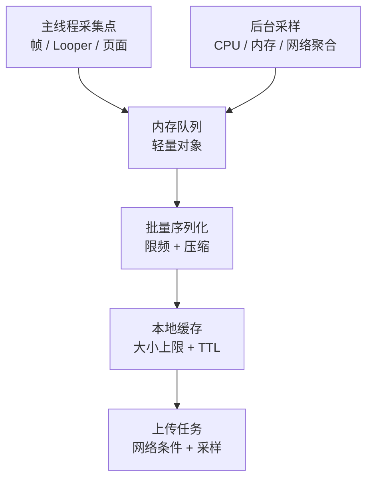

---
{
  "title": "其他开源 APM 库（AndroidGodEye、Collie、Rabbit）",
  "chapter": "19",
  "section": "19.10",
  "status": "ready-for-review",
  "drafted_date": "2026-04-24",
  "drafted_by": "codex",
  "applicable_versions": "Android 8 (API 26) - Android 17 (API 37)",
  "last_verified": "2026-04-24",
  "last_verified_against": "AndroidGodEye / Collie / Rabbit GitHub READMEs",
  "confidence": "medium",
  "tags": [
    "apm"
  ],
  "related_chapters": [
    "19.0"
  ],
  "sources": [
    {
      "type": "blog",
      "path": "https://github.com/Kyson/AndroidGodEye"
    },
    {
      "type": "blog",
      "path": "https://github.com/happylishang/Collie"
    },
    {
      "type": "blog",
      "path": "https://github.com/SusionSuc/rabbit-client"
    }
  ],
  "pipeline_stage": "task9_pending",
  "task6_state": "reviewed",
  "task9_state": "pending",
  "task2b_state": "pending",
  "reviewed_by": "openclaw-task6",
  "reviewed_date": "2026-04-24",
  "task6_result": "pass-light-edit"
}
---

# 其他开源 APM 库（AndroidGodEye、Collie、Rabbit）

<!-- outline-start -->
## 本节要点大纲

### 锚点（必须覆盖）

- 🔹 [章节定位] 说明 AndroidGodEye、Collie、Rabbit 更适合学习设计取舍和补充思路，不能直接等同于现代生产 APM 方案。
- 🔹 [项目状态] 对每个项目补仓库地址、维护活跃度、最近版本、主要模块、依赖风险和适配边界。
- 🔹 [AndroidGodEye] 展开浏览器看板、插件式采集、CPU / memory / network / FPS 等能力；说明适合 Debug 还是线上。
- 🔹 [Collie] 提炼轻量采样、端侧缓存、远程开关和线上低开销思路；写清它能保留哪些现场。
- 🔹 [Rabbit] 说明研发工具和 APM 混合形态，重点写慢函数、APK 分析、调试入口和工程使用场景。
- 🔹 [横向对比] 用表格比较数据来源、接入成本、线上可用性、可视化、报告产物、维护风险。
- 🔹 [最小 SDK] 从这些项目提炼一个最小 APM SDK 结构：collector、sampler、buffer、uploader、config、report schema。
- 🔹 [线程模型] 写采集线程、上传线程、主线程监听、定时采样之间的关系，说明避免干扰业务线程的方法。
- 🔹 [开关设计] 展开远程配置、本地兜底、采样率、按版本/机型/页面启用、失败降级。
- 🔹 [使用建议] 明确哪些代码可以借鉴，哪些模块因版本、维护或系统限制不建议直接引入。

### 扩展（可选深入）

- 🔸 增加一张“轻量 APM SDK 最小架构图”。
- 🔸 补充三个项目的 report 字段示例，统一到本章推荐的数据合同。
- 🔸 对 GitHub README、issue、commit 活跃度做核对，并在正文中写出风险。
- 🔸 增加与 Matrix、DoKit、BlockCanary 的关系说明。
- 🔸 补一个从旧开源项目迁移到官方 SDK / 自研轻量 SDK 的步骤表。

### 流水线加工要求

- 对旧项目必须写维护状态和替代方案，不能只做功能介绍。
- 每个设计取舍都要说明能带来什么数据、会付出什么成本。
- 抽象成最小 SDK 时，字段和线程命名要和 01 节数据模型一致。

### OpenClaw 加工指引

> **锚点**是最低覆盖要求，加工时必须逐条落实并标注验证结果。
> **扩展**视素材丰富程度选择性深入。
> 如果从 Obsidian 素材或 AOSP 源码中发现大纲未列出但与本节强相关的知识点，
> 可**就地插入**最相关的锚点之后，并用 `[自动发现]` 标注，方便后续 review。
> 锚点内容需 L1/L2 验证，扩展内容至少 L2 验证，自动发现内容至少标注来源。
<!-- outline-end -->

## 这些项目适合看设计取舍

AndroidGodEye、Collie、Rabbit 都属于开源 Android APM 或研发监控工具。它们覆盖 CPU、内存、FPS、卡顿、启动、网络、Crash、线程、页面耗时、APK 分析等能力，但维护活跃度、现代 Android 适配和线上可用性差异很大。

这一组工具更适合作为设计参考或存量项目补充，不建议新项目在没有验证的情况下直接作为线上主方案。

## AndroidGodEye：浏览器看板式性能监控

AndroidGodEye 的定位很像“端内性能数据 + PC 浏览器看板”。README 中把它描述为类似 Android Studio Profiler 的 App 性能监控工具，可以在 PC 浏览器里实时看应用性能数据，也提到可用于生产环境。

它覆盖的模块很多：

- CPU、RAM、PSS、Heap、Battery、Traffic。
- FPS、卡顿、启动、页面加载、线程 dump。
- Crash、ANR、网络、方法耗时。
- App size、复杂布局、过度绘制、不合理图片使用。
- 基于 LeakCanary / Shark 的泄漏检测。

这个覆盖面很适合做内部调试平台。风险也来自覆盖面：模块越多，越要确认每个模块在目标 Android 版本、目标机型、目标构建链上的开销和兼容性。

## Collie：轻量线上采样思路

Collie 的 README 把它称为线上轻量级 Android 性能监测工具。它的实现思路比较直接：

- FPS 和卡顿基于 Looper 的打印回调。
- 流量通过 `TrafficStats`。
- 内存通过 `Debug`。
- 泄漏通过 `WeakHashMap`。
- 启动耗时通过 `ContentProvider` 和 window focus 等节点。

这些实现路径足够轻，也很容易理解。它适合学习“一个最小可用 APM SDK 需要哪些信号”。但要进入现代线上包，还要补很多工程能力：远程开关、采样、页面归因、后台上报、隐私字段过滤、多进程、数据丢失保护和指标口径稳定性。

## Rabbit：研发工具和 APM 混合形态

Rabbit 的定位是 Android APM framework / tools，覆盖应用测速、FPS、慢函数、网络请求、内存、Crash、APK 分析、自定义 UI 和数据上报。

它的特点是把调试工具和性能监控放在一起：既能看网络 JSON、慢函数调用栈，也能分析 APK 大图和重复文件。对于内部测试包，这种一体化工具很方便；对于 Release 包，则要拆分哪些功能能上线、哪些只能在研发环境使用。

## 横向对比

| 工具 | 更适合 | 主要风险 |
|---|---|---|
| AndroidGodEye | 内部调试看板、性能数据可视化、模块化采样参考 | 模块多，线上开销和现代系统适配需要逐项验证 |
| Collie | 学习轻量 APM 信号采集、快速自研最小方案 | 能力基础，平台、采样、归因和合规要自补 |
| Rabbit | 研发工具集合、网络和慢函数现场、APK 分析 | Debug / Release 边界要拆清，旧构建链适配要验证 |

这三者和 Matrix、KOOM 的差别在于工程成熟方向不同。Matrix 更像大型客户端监控框架，KOOM 是内存专项，Measure 是平台型方案；AndroidGodEye、Collie、Rabbit 更偏轻量采集、研发面板或学习参考。

## 使用建议

如果是存量项目，先看当前库是否仍然能在目标 AGP、targetSdk、Android 版本和 64 位环境下稳定运行。只要涉及字节码插桩、Hook、线程抓栈、网络拦截，都要用灰度包跑一轮压力测试。

如果是新项目，更建议吸收这些项目的设计思路，而不是直接照搬。轻量 APM 的最低成本方案可以从 Collie 类思路开始：启动、慢帧、主线程 block、内存、Crash、网络耗时。等这些指标稳定后，再决定是否引入 Matrix、KOOM、Measure 或商业平台。

## 从这些项目提炼最小 APM SDK

AndroidGodEye、Collie、Rabbit 虽然维护状态不同，但它们共同说明了一件事：一个最小 APM SDK 可以很小。基础版本只需要这些信号：

| 信号 | 采集方式 | 最小输出 |
|---|---|---|
| 冷启动耗时 | `ContentProvider` / `Application` / 首帧节点 | `startup_ms`、启动类型、页面 |
| 慢帧 | JankStats / Choreographer | 慢帧率、页面、交互状态 |
| 主线程 block | Looper message logging + 抓栈 | block 耗时、堆栈签名 |
| 内存 | `Debug.getMemoryInfo()` / Runtime heap | PSS、Java heap、native heap |
| 网络 | OkHttp interceptor / 统一网络层 | URL pattern、阶段耗时、错误类型 |
| Crash / ANR | 崩溃处理、ApplicationExitInfo、ANR 监控 | 堆栈、退出原因、版本 |
| 页面 | Activity / Fragment lifecycle | 页面进入、退出、停留 |

这些信号足够支撑第一版线上性能看板。不要一开始就做复杂 Hook、完整方法 trace 和大文件上传。基础指标稳定后，再补专项工具。

## 轻量 APM 的线程模型

自研或改造这些开源项目时，线程模型要先定好：

主线程只允许写入轻量事件，不能做 JSON 序列化、文件写入、网络请求或复杂堆栈处理。APM SDK 如果自己制造卡顿，后续数据都会失去可信度。

## 线上开关设计

轻量 APM 至少要有三级开关：

- **总开关**：紧急关闭 SDK 采集。
- **模块开关**：启动、帧、网络、内存、Crash、trace 分别控制。
- **采样开关**：按用户、设备、版本、页面、异常类型调整。

配置要带版本号和生效时间。客户端收到配置后要能回传当前配置版本，否则平台不知道某条样本是在什么采样条件下产生的。

## AndroidGodEye 的可视化思路

AndroidGodEye 的浏览器看板思路适合内部工具：端上采集数据，通过本地服务或通信通道展示在 PC。它的优点是迭代快，开发人员能看到实时曲线；缺点是和线上平台的数据模型不同。

如果借鉴它，建议把“本地实时看板”和“线上上报 schema”拆开。实时看板可以显示更多调试字段，线上上报只保留稳定字段和脱敏后的样本。

## Collie 的轻量实现边界

Collie 用 Looper、TrafficStats、Debug、WeakHashMap、ContentProvider 等系统能力拼出轻量 APM。这种路线适合快速起步，但每个信号都有边界：

- `TrafficStats` 只能给进程或 UID 粒度流量，不能自动拆到接口。
- `Debug` 内存数据适合趋势，不等于完整 heap 分析。
- `WeakHashMap` 泄漏检测只能做粗略提示。
- `ContentProvider` 启动节点很早，但会改变启动路径，数量多时本身有成本。

轻量实现的价值是低侵入，代价是诊断深度有限。不要让它承担超出能力范围的根因分析。

## Rabbit 的慢函数和 APK 分析

Rabbit 把慢函数、网络、测速、APK 分析放在一起，这对研发包很方便。书稿里更值得关注的是两个方向：

- **慢函数**：如果靠插桩记录方法耗时，就要处理 AGP、R8、混淆、包名过滤、method id 映射。
- **APK 分析**：大图、重复文件、包体组成适合放进 CI，不一定要进运行时 SDK。

运行时 APM 和构建期检查要拆开。大图、重复资源、so 体积、asset 体积这些问题在发版前就能发现，没必要等线上用户触发。
