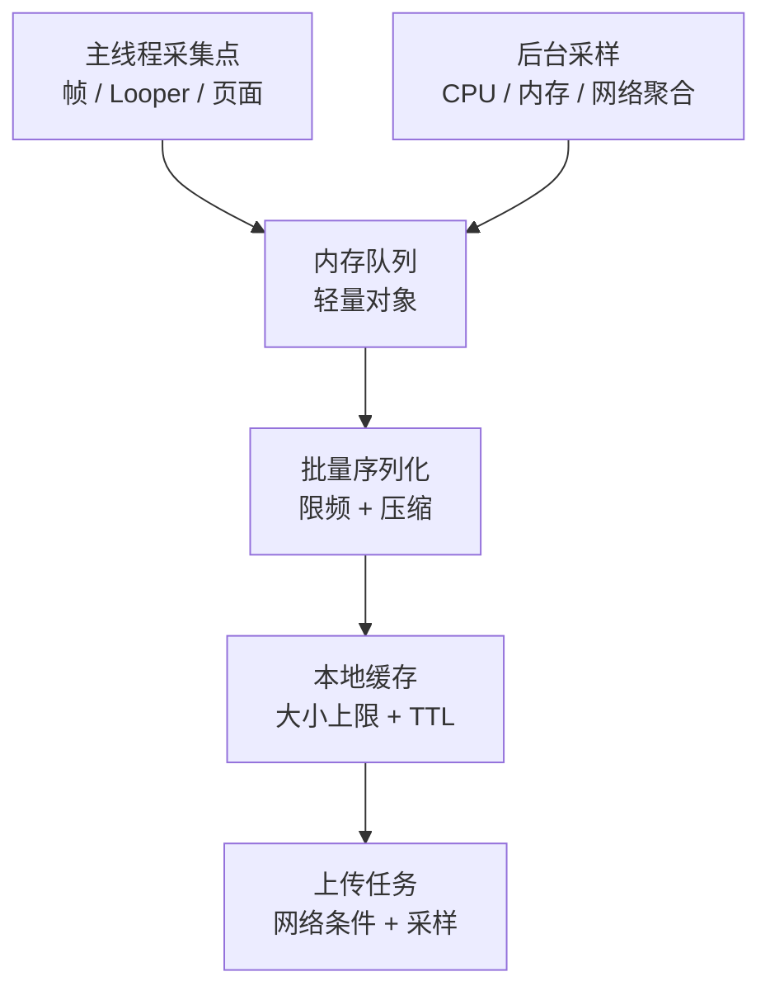

---

# 其他开源 APM 库(AndroidGodEye、Collie、Rabbit)

<!-- outline-start -->
## 本节要点大纲

### 锚点(必须覆盖)

- 🔹 AndroidGodEye、Collie、Rabbit 更适合拿来学习设计取舍或补齐存量项目，不适合直接当现代生产 APM 默认基线
- 🔹 要把它们和 Matrix、官方 SDK、商业平台放在同一张决策表里看，不能只比功能名词
- 🔹 Matrix 的官方定位要按 upstream README 表述：plugin style、non-invasive APM system developed by WeChat
- 🔹 轻量方案、官方 SDK、商业平台的切换点要写清楚，包括接入成本、归因能力、治理成本和退出成本
- 🔹 从旧开源库迁移到官方 SDK / 平台时，要先拆数据合同，再拆采集模块，再替换上报流程

### 扩展(可选深入)

- 🔸 补一张最小 APM SDK 架构图
- 🔸 给 Rabbit / AndroidGodEye / Collie 补 report schema 示例
- 🔸 补一张"旧开源能力 -> 官方 SDK / 平台"的映射表
<!-- outline-end -->

## 这些项目适合看设计取舍

AndroidGodEye、Collie、Rabbit 都是开源 Android APM 或研发监控工具。它们覆盖 CPU、内存、FPS、卡顿、启动、网络、Crash、线程、页面耗时、APK 分析等能力，但维护活跃度、构建链兼容性和现代 Android 适配差异很大。

把它们放进今天的项目里，更合适的用法是两种：

- 当作设计样本，学习"轻量信号怎么采、怎么缓存、怎么上报"
- 在存量项目里局部借用某个模块，补一段调试或诊断能力

如果新项目要做长期线上治理，不能只看它们能采什么，还要看合规、配置中心、告警、会话归因、版本治理和退出成本。

## AndroidGodEye:浏览器看板式调试平台

AndroidGodEye 的 README 把它描述成类似 Android Studio Profiler 的性能监控工具，重点是端上采集加浏览器看板。它覆盖的模块很多：CPU、RAM、PSS、Heap、Battery、Traffic、FPS、卡顿、启动、页面加载、线程 dump、Crash、ANR、网络、方法耗时，以及基于 LeakCanary / Shark 的泄漏检测。

这类方案适合内部调试平台：

- 数据面广，接上后能很快看到曲线和现场
- 浏览器看板适合研发和测试现场联调
- 模块化做法适合拿来学习最小采集框架怎么拆

但能力越多，越要逐项验证开销、权限、ROM 差异和 Release 包边界。内部调试看板能接受的信息密度和线上稳定 schema 不是一回事。

## Collie:轻量线上采样思路

Collie 的切入点是轻量线上监测。它主要依赖 Android 公开能力把几类核心信号拼出来：

- FPS / 卡顿：Looper message logging
- 流量：`TrafficStats`
- 内存：`Debug` 与 Runtime heap
- 泄漏：`WeakHashMap`
- 启动：`ContentProvider`、window focus 等关键节点

如果启动采集依赖 `ContentProvider`，要和 Jetpack App Startup 一起核对初始化顺序。两者都可能在 `Application.onCreate()` 前后插入初始化动作，轻量 APM 应把采集 Provider 的初始化时机、App Startup initializer 的依赖顺序、首帧节点记录放在同一张启动时序里核对，避免把框架初始化耗时算成业务启动阶段。

这条路线的价值在于：接入成本低，概念简单，适合团队先把第一版线上看板跑起来。局限也很明显：数据深度有限，页面归因、多进程、远程开关、异常关联、后台补传、隐私过滤都要自己补。

## Rabbit:研发工具和 APM 混合形态

Rabbit 把慢函数、网络测速、内存、Crash、APK 分析、自定义 UI 和数据上报放进同一套工具里。对内部测试包来说，这种一体化设计很顺手：研发能直接看慢函数现场，也能顺手看包体与资源问题。

Release 包接入时要把边界拆清：

- 运行时诊断能力是否会增加包体、线程或 Hook 风险
- APK 分析、大图检查、重复文件这类能力是否更适合放进 CI
- 慢函数、网络拦截这类字节码插桩模块是否仍依赖 Transform API;AGP 8.0 起 Transform API 已移除，未迁到 `AsmClassVisitorFactory` / Instrumentation API 的插件会在现代构建环境中失败

## 横向对比

| 工具 | 更适合 | 主要风险 |
|---|---|---|
| AndroidGodEye | 内部调试看板、性能数据可视化、模块化采样参考 | 模块多，线上开销和现代系统适配要逐项验证 |
| Collie | 学习轻量 APM 信号采集、快速自研最小方案 | 能力基础，页面归因、配置中心、合规和补传要自补 |
| Rabbit | 研发工具集合、网络和慢函数现场、APK 分析 | Debug / Release 边界要拆清；AGP 8.0+ 下依赖 Transform API 的插桩插件不能直接接入 |

AGP 8.0 是旧 APM 插桩方案的分水岭。旧库若通过 `android.registerTransform` 接 ASM，升级到 AGP 8.0+ 后没有兼容层；工程需要迁到 `com.android.build.api.instrumentation.AsmClassVisitorFactory`，再重新验证 R8、增量构建、mapping 和多模块范围。对 AndroidGodEye、Collie、Rabbit 这类维护放缓的项目，更安全的复用方式是参考采集设计，不把 Gradle 插件直接接进新项目。

## Matrix、轻量方案、官方 SDK、商业平台的分工

Matrix 的定位容易写歪。Matrix upstream README 的原话是 **plugin style、non-invasive APM system developed by WeChat**。这是一条官方定位，书稿里应该按这个口径引用。

落到工程使用层面，Matrix 承担的角色更接近**客户端采集框架**：Trace Canary、Resource Canary、IO Canary、SQLiteLint、Battery Canary 都挂在同一套插件体系下，方便统一接入、统一配置和统一上报。这是接入层面的角色判断，不是对 upstream 定位的改写。

把四类方案放在一张表里看，分工会更清楚：

| 方案 | 主要价值 | 短板 | 适合什么时候选 |
|---|---|---|---|
| 轻量开源方案(Collie、局部自研) | 成本低，能快速起步 | 归因深度、治理能力、稳定 schema 较弱 | 团队先把启动、慢帧、主线程 block、网络耗时跑通 |
| 客户端监控框架(Matrix、KOOM) | 端侧采集能力更全，专项模块更成熟 | 接入、调参与兼容性验证成本更高；Matrix Gradle Trace 插件仍依赖 Transform API，仅声明支持 AGP 3.5/4.0/4.1,AGP 8.0+ 工程不能直接接入 | 已经明确要做客户端专项治理 |

> **Matrix Gradle 插件兼容性边界**：Matrix Android Gradle plugin（artifact `com.tencent.matrix:matrix-gradle-plugin`）当前仍通过 `appExtension.registerTransform` 注册字节码插桩，依赖 `com.android.build.api.transform.*`（AGP 8.0 已移除）。官方 README 仅声明 AGP 3.5.0/4.0.0/4.1.0。AGP 8.0+ 工程接入 Matrix 时，Gradle Trace 插件不能直接使用；如需在 AGP 8.0+ 环境中使用，迁移路径是将字节码插桩迁到 `com.android.build.api.instrumentation.AsmClassVisitorFactory` + Instrumentation API，但 upstream Matrix 尚未完成此迁移。建议只参考端侧采集设计、非 Gradle 模块（如 Resource Canary、IO Canary），或寻找已完成迁移的社区分支。
| 官方 SDK / 系统能力(JankStats、FrameMetrics、ApplicationExitInfo、ProfilingManager) | 口径稳定，系统兼容性好，适合长期维护 | `ProfilingManager` 仅限 Android 15(API 35)+；功能面通常更窄，需要自己补治理流程 | 希望先建立稳定基础指标与诊断入口 |
| 商业 / 平台型方案(Firebase Performance、Measure、Sentry、APMPlus、Bugly) | 会话、告警、看板、权限管理、协同流程完整 | 成本、数据所有权、私有化、迁移锁定要评估 | 团队已经需要跨端看板、告警治理和组织级协作 |

决策时别只看"哪个工具功能多"。更关键的是：谁负责端侧采集，谁负责样本治理，谁负责看板与告警，谁负责数据合同。

上面这张表解决的是"不同团队阶段怎么选"的问题。但选型还有另一个维度的约束：你手上的设备都跑什么 Android 版本。Android 每个大版本都会在 APM 可用的系统能力上做加法，版本分布直接决定了你能依赖哪些官方采集通道。

## Android 版本与 APM 能力演进

Android 版本迭代也意味着 APM 可用的系统级能力在逐步变化。下面这张版本-能力对照表比散落的"XX 版本支持 XX"更有用：

| Android 版本 | API Level | 新增 APM 相关能力 | 对 APM 选型的影响 |
|---|---|---|---|
| Android 9 | API 28 | `FrameMetrics`（`Window.OnFrameMetricsAvailableListener` API 24+ 稳定）、`Choreographer` 公开 | 慢帧采集不再只靠自定义 Looper logging |
| Android 10 | API 29 | Scoped Storage、后台启动限制、`ProcessLifecycleOwner` | 数据存储与上报通道受限，APK 内日志和缓存策略需要重新设计 |
| Android 11 | API 30 | `ApplicationExitInfo`（`ActivityManager.getHistoricalProcessExitReasons()`） | Crash/ANR 归因首次有了系统级退出原因，不用只靠自己的异常处理器猜 |
| Android 12-13 | API 31-33 | `JankStats`（Jetpack）、Performance Class、Foreground Service 限制 | 慢帧采集有了 Jetpack 官方口径；后台采样窗口进一步受限 |
| Android 14 | API 34 | 无 `ProfilingManager` 公共 API；仍依赖 `JankStats`、`FrameMetrics`、`ApplicationExitInfo`、Perfetto / profileable 等既有通道 | APM 侧不能在 Android 14 及以下调用 `requestProfiling()`，只能保留低版本抓取流程 |
| Android 15 | API 35 | `ProfilingManager` 稳定，手动 profiling 可用 | APM SDK 可以把性能诊断能力接到系统 profiling 通道上 |
| Android 16 | API 36 | `addProfilingTriggers()`、`APP_FULLY_DRAWN`、`ANR` 触发器 | system-triggered profiling 进入公开 API，冷启动和 ANR 不需要人工复现也能拿到 trace |
| Android 16 ext 36.1 | extension 36.1 | `APP_REQUEST_RUNNING_TRACE`、`KILL_FORCE_STOP`、`KILL_RECENTS`、`KILL_TASK_MANAGER` | 触发器覆盖范围进一步扩大，但运行时需做 extension gating |
| Android 17 | API 37 | `OOM`、`ANOMALY`、`KILL_EXCESSIVE_CPU_USAGE`、`COLD_START`、`APP_COMPAT` | 触发器不再只返回 running trace，产物类型开始分化（heap dump、stack sampling、artifact varies） |

> **关键分水岭**：Android 15 的 `ProfilingManager` 是 APM 能力从"全靠 SDK 自己采"到"系统帮忙采"的转折点。Android 16 的 system-triggered profiling 进一步解决了"问题发生时没有开启 trace"的空档。Android 17 的 `ANOMALY` 则把采集条件从显式系统事件扩展到了异常行为检测。选型时要按设备版本分布决定能在多大版本上依赖这些能力，不要假设全量用户已经升到 API 37。

版本能力的演进最终要落到团队当下的设备覆盖面上。如果你的 `minSdk` 还是 26，那 `ProfilingManager` 和 `ANOMALY` 触发器对你来说就是未来的事——现在的选型要按现有的系统能力来。下面这张表把前面讨论过的方案按团队现状做了重新归类，更适合直接拿来决策：

## 轻量方案和商业平台的切换点

| 现状 | 更合适的方向 | 原因 |
|---|---|---|
| 只有少量研发同学要看本地现场 | AndroidGodEye / Rabbit / 内部 debug 面板 | 现场可视化比组织级治理更重要 |
| 线上只缺启动、慢帧、主线程 block、Crash 基础指标 | Collie 类轻量方案 + 官方 SDK | 先把数据口径跑稳，避免一上来引入过重框架 |
| 已经需要 session 视角、告警、版本回滚辅助、跨团队协同 | 平台型或商业方案 | 单纯端侧采集已经不够，问题在治理流程 |
| 数据合规、私有化、退出成本是采购前提 | 先定内部 schema，再评估平台 | 没有数据合同，后面迁移成本会持续放大 |

## 使用建议

存量项目接这类库之前，要先做四项检查：

- 目标 AGP、targetSdk、64 位、多进程环境是否能稳定跑
- 采集线程、上传线程、Hook 点会不会和现有 SDK 冲突
- 数据格式能不能并入现有 APM 事件模型
- 关闭开关、降采样、灰度回滚是不是现成可用

新项目更稳的路线通常是：基础指标先用官方 SDK 和公开系统能力补齐，再根据专项问题决定要不要引入 Matrix、KOOM 或平台型方案。

## 从这些项目提炼最小 APM SDK

AndroidGodEye、Collie、Rabbit 虽然形态不同，但它们共同说明了一件事：一个能上线的最小 APM SDK 不需要一开始就做得很重。

| 信号 | 采集方式 | 最小输出 |
|---|---|---|
| 冷启动耗时 | `ContentProvider` / `Application` / 首帧节点 | `startup_ms`、启动类型、页面 |
| 慢帧 | `JankStats`(首选)/ `FrameMetrics`(API 24+)/ `Choreographer`(兜底) | 慢帧率、页面、交互状态 |
| 主线程 block | Looper message logging + 抓栈 | block 耗时、堆栈签名 |
| 内存 | `Debug.getMemoryInfo()` / Runtime heap | PSS、Java heap、native heap |
| 网络 | OkHttp interceptor / 统一网络层 | URL pattern、阶段耗时、错误类型 |
| Crash / ANR | 崩溃处理、`ApplicationExitInfo`、ANR 监控 | 堆栈、退出原因、版本 |
| 页面 | Activity / Fragment lifecycle | 页面进入、退出、停留 |

> **API 路径**：`JankStats` — `androidx.metrics.performance.JankStats`（Jetpack Metrics 库）;`FrameMetrics` — `android.view.FrameMetrics` + `Window.OnFrameMetricsAvailableListener`（API 24+）;`ProfilingManager` — `android.os.ProfilingManager`（API 35+）;`ApplicationExitInfo` — `android.app.ApplicationExitInfo`（API 30+）。

这套最小信号已经足够支撑第一版线上看板。指标稳定后，再决定是否补重样本、端侧专项或平台化能力。

## 轻量 APM 的线程模型

自研或改造这些开源项目时，线程模型要先定清楚：

主线程只允许写入轻量事件。JSON 序列化、文件写入、压缩、网络请求、复杂堆栈处理都要离开主线程。APM SDK 如果自己制造卡顿，后面的监控结果就不可信。

## 线上开关设计

轻量 APM 至少要有三级开关：

- **总开关**:紧急关闭全部采集
- **模块开关**:启动、帧、网络、内存、Crash、trace 分开控制
- **采样开关**:按用户、设备、版本、页面、异常类型调节

配置要带版本号和生效时间。客户端收到配置后还要回传配置版本，不然平台无法判断样本是在什么采样条件下产生的。

## AndroidGodEye、Collie、Rabbit 各自更适合借什么

- **AndroidGodEye**:借它的可视化面板思路，把本地调试看板和线上上报 schema 分开
- **Collie**:借它的轻量信号采集路线，快速搭一版启动、慢帧、主线程 block、内存、网络基础指标
- **Rabbit**:借它的研发工具组合方式，但把运行时诊断和构建期检查分开

大图、重复资源、APK 组成、SO 体积这类问题更适合放进 CI。让运行时 SDK 承担这些职责，通常只会增加维护负担。

## 从旧开源工具迁移到官方 SDK / 平台的 checklist

迁移时，顺序要稳，不要直接一把切。

1. 先列出现有事件与字段：页面、用户、版本、设备、异常类型、trace id、session id
2. 定内部 schema，保证字段名和枚举先稳定下来
3. 把采集模块按能力拆开：启动、帧、block、网络、Crash、内存、重样本
4. 用官方 SDK 或公开系统能力替掉最基础的一层
5. 保留旧库与新流程一段时间双写，对比口径差异
6. 看板和告警迁完，再逐步下线旧上报流程
7. 观察一到两个发布周期，再移除旧 SDK

下面这张映射表可以直接拿来做迁移盘点：

| 旧能力 | 优先迁移目标 | 说明 |
|---|---|---|
| 慢帧 / 卡顿 | `JankStats`、`FrameMetrics` | 先把系统口径稳定下来 |
| 启动异常后的重样本 | Android 15(API 35)+ 使用 `ProfilingManager`；低版本用 Perfetto trace config / 内部抓取流程 | 指标发现问题后再取证，按设备版本选择入口 |
| Crash / ANR | Crash SDK + `ApplicationExitInfo`(Android 11 / API 30+) | 退出原因和堆栈分别治理 |
| Java 泄漏本地复盘 | `LeakCanary` | 研发自查比线上常驻更合适 |
| 线上内存专项 | `KOOM` 或内部专项模块 | 不和轻量基础指标混在一起 |
| 看板、告警、权限、跨团队协作 | 平台型 / 商业方案 | 这部分不是轻量库擅长的事 |

`ProfilingManager` 不能写成 Android 8+ 的通用方案。它从 API 35 才可用；Android 14 及以下要走可控的 Perfetto trace config、profileable 构建或内部抓取通道。迁移文档要把版本下限写在命令旁边。

回过头来看，这一章讨论的四个开源工具——AndroidGodEye、Collie、Rabbit、Matrix——它们的共同困境不是功能不够，而是维护节奏跟不上 Android 版本迭代的速度。AGP 8.0 的 Transform API 移除是一个标志性事件：依赖旧构建链的 APM 插件如果不能完成迁移，就不是"好不好用"的问题，而是"能不能用"的问题。

对新项目来说，更安全的路子是分两层走：基础指标用 `JankStats`、`FrameMetrics`、`ApplicationExitInfo`、`ProfilingManager` 这些官方 SDK 或系统能力兜底；专项问题（内存、I/O、启动 trace）再按需引入 Matrix、KOOM 或平台型方案。旧开源项目最大的价值在于设计思路——怎么采信号、怎么控制开销、怎么设计采样开关——而不是把它们的 Gradle 插件直接接进 AGP 8.0+ 工程。

## 参考资料

- AndroidGodEye GitHub: https://github.com/Kyson/AndroidGodEye
- Collie GitHub: https://github.com/happylishang/Collie
- Rabbit GitHub: https://github.com/SusionSuc/rabbit-client
- Matrix GitHub: https://github.com/Tencent/matrix
- JankStats: https://developer.android.com/topic/performance/jankstats
- FrameMetrics: https://developer.android.com/reference/android/view/Window.OnFrameMetricsAvailableListener
- ApplicationExitInfo: https://developer.android.com/reference/android/app/ApplicationExitInfo
- AGP API Updates: https://developer.android.com/build/releases/gradle-plugin-api-updates
- ProfilingManager: https://developer.android.com/reference/android/os/ProfilingManager
