# Baseline Profiles 与编译优化

## Baseline Profiles 的位置：发布前优化，不是监控

Baseline Profile 是随应用或 AAR（Android Archive，Android 库的发布包）发布的一组类和方法规则。安装渠道完成 profile 编译，或设备随后完成后台 dexopt（DEX 优化任务）后，ART（Android Runtime，Android 运行时）可以据此对常用代码路径做 profile-guided AOT（按 profile 预先编译），减少解释执行与 JIT（运行中按需编译）预热。它能覆盖启动、页面导航、列表滚动等路径，不只服务于冷启动。

官方文档给出的经验值是：不少应用在优化后观察到约 30% 的代码执行速度提升。这个数字是汇总经验，不是项目验收标准。应用是否受益、受益多少，仍要用自己的 release 构建产物和目标设备做成对测量。

Baseline Profile 不采集线上性能数据，也不会定位慢点。它与 APM（Application Performance Monitoring，应用性能监控）的关系是：

1. APM 或 Android vitals 发现某个版本的首开、启动或关键交互退化。
2. Perfetto 系统追踪或 Macrobenchmark 端到端基准测试确认其中包含解释执行、JIT、类加载或 DEX（Android 运行时使用的字节码格式）访问成本。
3. 更新关键用户旅程并重新生成 profile。
4. 用无 profile 与有 profile 的同机实验确认收益，再观察发布后的新安装和升级用户。

如果耗时来自主线程 I/O、网络、锁竞争、Binder 阻塞、昂贵的资源解码或同步 SDK 初始化，Baseline Profile 不会消除这些工作。它优化的是被规则覆盖的代码如何编译和装载，不会改变业务依赖关系。

## 从文本规则到 Android 17 ART

这条链路要分成“构建期”和“设备端”两段理解。构建期由 `BaselineProfileRule` 驱动 CUJ（Critical User Journey，关键用户旅程），输出 HRF（Human Readable Format，可读文本规则）；AGP（Android Gradle Plugin）负责合并，R8 负责压缩、优化并重写规则。下面的图只表达数据交接关系，不表示这些组件在所有安装渠道上彼此直接调用。

```mermaid
flowchart LR
    subgraph Build["构建期"]
        CUJ["BaselineProfileRule 驱动 CUJ"] --> HRF["baseline-prof.txt / startup-prof.txt"]
        HRF --> Merge["AGP 合并 App 与依赖库规则"]
        Merge --> R8["R8 重写混淆后的规则并处理 DEX 布局"]
        R8 --> Artifact["APK / AAB 内二进制 baseline.prof"]
    end

    subgraph Device["设备端"]
        Artifact --> Delivery["Play / PackageManager / ProfileInstaller"]
        Delivery --> Current["current 或 reference profile"]
        Current --> ArtService["ART Service / artd / profman"]
        ArtService --> Dex2oat["dex2oat 的 profile-guided 编译"]
        Dex2oat --> Oat["OAT / VDEX / app image 等编译产物"]
    end
```



构建期生成的 HRF 是文本规则。AGP 汇总应用和依赖库规则，R8 按 release 产物中的类名、方法名和优化结果重写规则，再生成供设备使用的二进制 profile，并打进 APK 或 AAB（Android App Bundle）。Startup Profile 也在这一阶段影响 DEX 布局。

设备端路径受 Android 版本和安装来源影响。current profile 保存当前积累、仍可能等待系统处理的 profile 数据；reference profile 保存系统已采纳的参考数据，通常意味着设备已按 profile 编译。Google Play、PackageManager、ART Service 与 `androidx.profileinstaller` 都可能参与 profile 的投递或编译调度，不能把它简化成 `ProfileInstaller` 直接调用 `profman` 和 `dex2oat`。其中 `artd` 是 ART 的后台服务进程，`profman` 负责处理 profile，`dex2oat` 则把 DEX 转为 OAT、VDEX、app image 等运行时编译产物。

Android 17（API 37，`android-17.0.0_r1`）源码提供了几个可核对的边界：

- `artd.cc` 的 `copyAndRewriteEmbeddedProfile()` 提取嵌入式 profile，并通过 `profman --copy-and-update-profile-key` 按当前 DEX 校验和重写 profile key。profile key 是 profile 与具体 DEX 版本之间的匹配标识；profile 与 APK 不匹配时会返回 `BAD_PROFILE`。
- `profman.cc` 负责读取、合并、检查与转换 profile；其 HRF 解析代码明确识别 `H`、`S`、`P` 三种方法 flag。
- `dex2oat.cc` 在收到 profile 输入时把默认 compiler filter（编译策略档位）设为 `speed-profile`；如果 profile 缺失、为空或不能用于 PGO（Profile-Guided Optimization，按 profile 优化），则把 `speed-profile` 降为 `verify`。

所以，“包中有 `baseline.prof`”只能证明构建产物携带了输入，“设备显示 `speed-profile`”才说明该包存在 profile-guided 编译产物。即便状态正确，也要用性能实验确认规则覆盖了目标路径。

## Android 版本与安装来源决定生效时机

ProfileInstaller 1.4.1 的 AAR 声明 `minSdkVersion=21`，但源码中的 `ProfileVersion.MIN_SUPPORTED_SDK` 是 Android 7.0（API 24）。依赖可以装进 API 21 的应用，不代表 API 21-23 会通过 ProfileInstaller 安装 Baseline Profile。

| 平台或安装方式 | 编译行为 | 工程上应如何判断 |
|---|---|---|
| Android 5.0-6.0（API 21-23） | 平台采用 full AOT（安装时完整预编译）；ProfileInstaller 不安装 Baseline Profile。 | 不把这个设备段写成 Baseline Profile 覆盖范围，也不能用 `CompilationMode.Partial` 做同类对照。 |
| Android 7.0-8.1（API 24-27） | ProfileInstaller 在应用启动后把包内 profile 写到 ART current profile，系统在后续后台 dexopt 中编译。 | 安装成功与编译完成是两个状态；首开时可能尚未享受 AOT 收益。 |
| Android 9-17（API 28-37），Google Play | Play 可交付 Baseline Profile，并在有数据时结合 Cloud Profile。具体编译可出现在安装处理或后台设备更新。 | 记录安装渠道，并查看 compiler filter 与 reason；不要承诺下载完成时一定已编译。 |
| Android 9-17，其他商店或 sideload（侧载，即通过应用商店之外的方式直接安装） | 商店未必支持安装期 profile。ProfileInstaller 可把 profile 放入 current profile，等待后台 dexopt。 | 包内文件、current profile、reference profile 和编译状态要分开检查。 |
| Android Studio 或 Gradle 安装 non-debuggable build（不可调试构建） | AGP 8.4 起会在本地安装流程处理 Baseline Profile。 | AGP 版本、Gradle 安装 task 和目标构建变体（variant）都要写进实验记录。 |

Cloud Profile 来自 Google Play 汇总的线上 ART profile，只支持 Android 9（API 28）及以上，而且需要足够用户量，更新后通常要数小时到数天才能分发。Baseline Profile 用于覆盖新版本和新用户尚未等到 Cloud Profile 的窗口，两者是互补关系。

还要留意几项发布边界：

- Google Play Internal App Sharing 不支持 Baseline Profile；Internal Testing 测试轨道支持。
- 非 Play 渠道可能要等到设备空闲和充电时运行后台 dexopt，常见现象是隔夜后才出现 `speed-profile`。
- AGP 8.4 之前的 Studio、Gradle 或其他非 Play 安装不会自动完成这段本地编译流程。
- Firebase Test Lab 设备，包括由 Gradle 管理的 Test Lab 设备，不支持生成 Baseline Profile。
- 省电策略和 OEM（设备厂商）行为可能延迟后台 dexopt；本地复现时需要记录这些条件。

## Profile 规则：读懂即可，优先自动生成

Profile 规则有方法规则和类规则。下面两行展示了 HRF 的基本形态。

```text
HSPLcom/example/app/MainActivity;->onCreate(Landroid/os/Bundle;)V
Lcom/example/app/FeedItem;
```

第一行是方法规则，第二行是类规则。方法规则的 flag 含义如下：

- `H`：Hot，应用生命周期内被频繁调用的方法。
- `S`：Startup，在启动阶段调用的方法。
- `P`：Post Startup，启动阶段之后调用的方法。

`H`、`S`、`P` 可以组合。`Lcom/example/app/MainActivity;` 中的 `L` 不属于 flag，它是 DEX 类型描述符（虚拟机签名语法）中“引用类型”的前缀。参数列表中的 `Landroid/os/Bundle;` 也是同一语法；`I`、`J`、`Z`、`V` 分别表示 int、long、boolean 和 void 等类型。

类规则本身不带 `H`、`S`、`P`。ART 可据此优化类加载和相关布局。手写规则还支持通配符，例如下面这条会覆盖指定包下的方法。

```text
HSPLcom/example/app/startup/**->**(**)**
```

通配范围过大会带来更多 AOT 编译与磁盘读取。官方限制二进制 `baseline.prof` 必须小于 1.5 MB，并明确提醒过宽规则可能拖慢启动。日常维护应让 `BaselineProfileRule` 从稳定的用户旅程生成具体规则，手写规则用于小范围补充或验证，不宜用 `**` 把整个应用包纳入。

## Baseline Profile 与 Startup Profile

两类 profile 共享生成工具，但消费者和生效阶段不同。

| 对比项 | Baseline Profile | Startup Profile |
|---|---|---|
| 主要消费者 | 设备端 ART | 构建期 R8 |
| 主要目标 | 对常用方法做 profile-guided AOT，减少解释执行和 JIT 预热 | 调整 DEX 中启动代码的布局，改善代码局部性 |
| 典型源码文件 | `baseline-prof.txt` | `startup-prof.txt` |
| 发布产物验证 | APK/AAB 内的二进制 `baseline.prof`，以及设备编译状态 | DEX 排列与 AGP 8.8+ AAB 内的 `r8.json` |
| 适合覆盖 | 启动和启动后的关键交互 | 从各启动入口到可用首屏所需的代码 |
| Library 是否可贡献 | 可以 | 不可以，由应用定义启动入口 |

这里的 DEX 代码局部性，是指把启动阶段常用的代码尽量排在相邻位置，减少启动时的分散读取和缺页。它描述的是代码排列，不等同于把更多方法做 AOT 编译。

Baseline Profile 通常是 Startup Profile 的超集。`BaselineProfileRule.collect()` 无论 `includeInStartupProfile` 是什么，采集到的规则都会进入 Baseline Profile；只有启动必需的旅程才应设为 `true`，让对应规则同时进入 Startup Profile。

Startup Profile 在构建时已经被使用，因此 APK 或 AAB 内没有一个可供设备安装的 `startup.prof`。AGP 8.8 及以上可检查 AAB 中 `r8.json` 的 `dexFiles` 数组是否出现 `"startup": true`；更早的 AGP 或进一步排障时，可用 APK Analyzer 查看启动类和方法是否集中在首个 `classes.dex`。启动代码能放进一个 DEX 时通常更有利，但仍需 A/B 测试。

使用 Startup Profile 的 release build 要启用 R8 与完整优化：

```kotlin
android {
    buildTypes {
        release {
            isMinifyEnabled = true
        }
    }
}
```

生成 profile 的构建变体（variant）需要关闭混淆和优化，使采集结果能对应原始签名。Baseline Profile Gradle Plugin 会创建并配置 `nonMinifiedRelease`、`benchmarkRelease` 等 variant；R8 在构建 release 时把未混淆规则重写到优化后的程序。不要把对应旧版混淆映射 `mapping.txt` 的 HRF 文件直接塞进新版 release 包。

## 当前工具链与 Gradle 配置

截至 Android 17 基线，官方最低建议为 AGP 8.0.0、Macrobenchmark 1.4.1 和 ProfileInstaller 1.4.1。AGP 8.2+ 的 Android Studio 模板能一次建立 producer module（生成方模块）、consumer 配置（消费方配置）、生成测试和 benchmark；新项目宜从模板开始。

根工程可以把 Baseline Profile 插件与 Macrobenchmark 依赖统一在 1.4.1：

```kotlin
plugins {
    id("androidx.baselineprofile") version "1.4.1" apply false
}
```

该插件来自 AndroidX Benchmark 的发布版本。若项目使用 version catalog，应只保留一处版本定义，避免 producer、consumer 和 benchmark module 各自漂移。

应用 module 是 profile consumer，也就是接收并打包规则的消费方。下面是相关的最小配置：

```kotlin
plugins {
    id("com.android.application")
    id("org.jetbrains.kotlin.android")
    id("androidx.baselineprofile")
}

android {
    compileSdk = 37

    buildTypes {
        release {
            isMinifyEnabled = true
        }
    }
}

dependencies {
    baselineProfile(project(":baseline-profile"))
    implementation("androidx.profileinstaller:profileinstaller:1.4.1")
}
```

`baselineProfile(project(...))` 接入应用自己的 producer；普通依赖 AAR 携带的 library profile 由 AGP 一并合并。ProfileInstaller 用于 sideload 和不提供安装期 profile 的渠道，也提供 Macrobenchmark 与状态验证所需的接口。

producer 是生成 profile 的一方，通常是只承载 instrumentation test（在设备上运行的测试）的 `com.android.test` module。下面的 GMD（Gradle-managed device，由 Gradle 创建和管理的模拟设备）使用 Android 17 AOSP 镜像生成规则：

```kotlin
plugins {
    id("com.android.test")
    id("org.jetbrains.kotlin.android")
    id("androidx.baselineprofile")
}

android {
    namespace = "com.example.app.baselineprofile"
    compileSdk = 37
    targetProjectPath = ":app"

    defaultConfig {
        minSdk = 28
        targetSdk = 37
        testInstrumentationRunner = "androidx.test.runner.AndroidJUnitRunner"
    }

    testOptions.managedDevices.devices {
        create<com.android.build.api.dsl.ManagedVirtualDevice>("pixelApi37") {
            device = "Pixel 6"
            apiLevel = 37
            systemImageSource = "aosp"
        }
    }
}

baselineProfile {
    managedDevices += "pixelApi37"
    useConnectedDevices = false
}

dependencies {
    implementation("androidx.benchmark:benchmark-macro-junit4:1.4.1")
    implementation("androidx.test.ext:junit:1.3.0")
}
```

API 33 及以上可以在没有 root 权限的设备上生成 profile；较低版本需要 rooted 环境，官方自动生成流程的下限是 rooted API 28。生成规则可以使用模拟器或 GMD，因为这一阶段不输出性能结论；收益测量应使用物理设备。

包含多个 flavor（例如 free、paid 版本）的项目还要决定保存策略：

- 应用中 `mergeIntoMain` 默认是 `false`，可为每个 release variant 保留独立 profile。
- library 中 `mergeIntoMain` 默认是 `true`，通常生成一份主 profile。
- `saveInSrc = true` 会把结果保存到 `src/<variant>/generated/baselineProfiles`，便于代码审查。
- `automaticGenerationDuringBuild = true` 会在 release assembly 时运行设备测试，增加构建时间；更适合受控的 CI（持续集成）job，不宜在开发者每次 assemble 时无条件启用。

## 用关键用户旅程生成规则

启动与启动后的交互应拆成不同测试，避免把列表、搜索等路径误放入 Startup Profile。下面的示例要求首屏与列表状态出现，自动化失效时会直接失败。

```kotlin
import androidx.benchmark.macro.junit4.BaselineProfileRule
import androidx.test.ext.junit.runners.AndroidJUnit4
import androidx.test.uiautomator.By
import androidx.test.uiautomator.Direction
import androidx.test.uiautomator.Until
import org.junit.Rule
import org.junit.Test
import org.junit.runner.RunWith

@RunWith(AndroidJUnit4::class)
class BaselineProfileGenerator {
    @get:Rule
    val rule = BaselineProfileRule()

    @Test
    fun startup() = rule.collect(
        packageName = PACKAGE_NAME,
        includeInStartupProfile = true,
        strictStability = true
    ) {
        pressHome()
        startActivityAndWait()
        check(
            device.wait(
                Until.hasObject(By.res(PACKAGE_NAME, "home_ready")),
                5_000
            )
        ) {
            "Home did not become ready"
        }
    }

    @Test
    fun feedAndDetail() = rule.collect(
        packageName = PACKAGE_NAME,
        includeInStartupProfile = false,
        strictStability = true
    ) {
        pressHome()
        startActivityAndWait()
        val feed = checkNotNull(
            device.wait(
                Until.findObject(By.res(PACKAGE_NAME, "feed_list")),
                5_000
            )
        )
        check(feed.fling(Direction.DOWN)) {
            "Feed could not scroll"
        }

        val visibleItem = checkNotNull(
            device.wait(
                Until.findObject(By.res(PACKAGE_NAME, "feed_item")),
                5_000
            )
        )
        visibleItem.click()
        check(
            device.wait(
                Until.hasObject(By.res(PACKAGE_NAME, "detail_ready")),
                5_000
            )
        ) {
            "Detail did not become ready"
        }
    }

    private companion object {
        const val PACKAGE_NAME = "com.example.app"
    }
}
```

`strictStability = true` 会在规则稳定性校验未通过时让采集失败，减少偶发路径混入 profile；它不能替代业务断言。示例中的 ready resource id 让脚本等到异步内容真正完成，单凭 Activity 出现还不足以判定页面可用。测试应使用固定 fixture（例如固定账号和本地数据），不能依赖实时网络、轮播内容或随机账号状态。

场景选择按线上频率和延迟敏感度排序：

- 从 launcher（桌面启动器）冷启动，覆盖 TTID（Time to Initial Display，首帧显示时间）与 TTFD（Time to Full Display，完整内容显示时间）。
- 通知、deep link（直接进入应用内部页面的链接）、widget（桌面小组件）等常见启动入口。
- 首页首次展示、短距离滚动和主导航切换。
- 搜索、详情、播放、编辑、支付等高频关键操作。
- 大型 SDK 或核心 library 首次执行的高频代码路径。

启动入口用 `includeInStartupProfile = true`；普通导航、滚动、搜索和支付路径保持 `false`。路径数量增加后，要检查二进制大小和测量结果，不能用“覆盖越多越好”代替实验。

生成命令应运行 consumer 的 task：

```bash
./gradlew :app:generateBaselineProfile
```

任务结束后，应用 profile 通常位于 `app/src/<variant>/generated/baselineProfiles/`。若按 variant 保存，可运行 `generateFreeReleaseBaselineProfile` 之类的 variant task。把生成文件提交前，应审查 diff 是否与本次启动流程或 CUJ 变化相符。

## R8、多模块与 Library Profile

profile 生成 variant 应保持 non-debuggable（不可调试）、profileable（允许性能工具采集）、未混淆且未优化；release variant 应开启 R8。Baseline Profile Gradle Plugin 1.2.4 及以上会固定 producer 的关键属性，包括 `isDebuggable=false`、`isMinifyEnabled=false` 和 `isProfileable=true`，避免采集 variant 被误配。

AGP 对 profile 的关键演进如下：

- AGP 7.4：应用可消费依赖库 profile，并提供自己的 `src/main/baseline-prof.txt`。
- AGP 8.0：提供 Baseline Profile Gradle Plugin，并为 app module 支持 profile source set（按构建类型和 flavor 组织的一组源码目录）。
- AGP 8.2：R8/D8 重写规则，并加入 Startup Profile 支持。
- AGP 8.3：library module 支持按 variant 区分的源码目录，profile 也能包含 desugared class（为兼容低版本而由构建工具改写的类）。
- AGP 8.4：Studio/Gradle 安装 non-debuggable build 时处理本地 Baseline Profile。
- AGP 9.1：library module 也支持完整 source set directory，可放置多个任意文件名的 profile。

库作者需要 sample app（用于演示和驱动库 API 的宿主应用）、library 和 producer 三个 module。sample app 驱动库的公开能力，producer 记录路径，library consumer 过滤掉 sample app 和其他依赖的规则。下面是 library module 的核心配置：

```kotlin
plugins {
    id("com.android.library")
    id("androidx.baselineprofile")
}

android {
    compileSdk = 37
}

dependencies {
    baselineProfile(project(":baseline-profile"))
}

baselineProfile {
    filter {
        include("com.example.mylibrary.**")
    }
}
```

使用 `./gradlew :library:generateBaselineProfile` 后，结果写到 `library/src/main/generated/baselineProfiles`。过滤规则必须只保留 library 自己的 package；测试则要覆盖真实公开 API，而非只打开 sample 首页。AAR 被应用依赖后，AGP 会把库规则与应用规则合并。

library profile 不能替代应用 profile。它不知道宿主的 `Application`、导航入口、依赖注入图和业务页面；Startup Profile 也不能由 library 贡献，因为启动入口与 DEX 布局属于最终应用。

## 四层验证：产物、投递、编译、收益

### 第一层：检查 release 产物

下面的命令只确认 profile 被打进指定的 APK 或 AAB：

```bash
unzip -l app-release.apk |
  rg 'assets/dexopt/baseline\.prof(m)?$'

unzip -l app-release.aab |
  rg 'BUNDLE-METADATA/com\.android\.tools\.build\.profiles/baseline\.prof(m)?$'
```

APK 至少应包含 `assets/dexopt/baseline.prof`；某些目标格式还会带 `baseline.profm`，它补充不同 ART profile 格式转码所需的 DEX 元数据，API 24-25 与 API 31+ 会用到。AAB 的 profile 位于 `BUNDLE-METADATA/com.android.tools.build.profiles/`。这里查不到文件时，应回到 variant、consumer plugin、producer dependency 和生成输出排查；查到文件仍不能说明设备已编译。

同时记录二进制 `baseline.prof` 的大小，必须低于 1.5 MB。不要用文本 `baseline-prof.txt` 的大小套用这个限制。

### 第二层：区分 ProfileInstaller 回调与 ProfileVerifier 状态

ProfileInstaller 1.4.1 默认通过 AndroidX Startup 初始化框架注册 `ProfileInstallerInitializer`。它在首帧后等待约 5 秒并加入少量 jitter（随机抖动，避免大量进程在固定时刻同时执行），再创建后台线程写 profile，避免把磁盘操作压进首屏路径。

如果应用从 manifest 中移除了 `ProfileInstallerInitializer`，应在首屏显示后的后台线程调用 `ProfileInstaller.writeProfile()`，推荐在启动后 5-10 秒内完成。不要为了更早写 profile 而在 `Application.onCreate()` 同步执行。

`ProfileInstaller.DiagnosticsCallback` 的 `RESULT_INSTALL_SUCCESS` 只表示二进制 profile 已成功写入 current profile。它不表示 ART 已完成 AOT 编译。编译状态要看 `ProfileVerifier` 或系统 dexopt 状态。

下面的代码在后台线程读取并记录 `ProfileVerifier` 结果：

```kotlin
import androidx.profileinstaller.ProfileVerifier
import kotlinx.coroutines.Dispatchers
import kotlinx.coroutines.withContext

private suspend fun reportProfileState() {
    val status = withContext(Dispatchers.IO) {
        ProfileVerifier.writeProfileVerification(applicationContext)
    }

    when (status.profileInstallResultCode) {
        ProfileVerifier.CompilationStatus.RESULT_CODE_COMPILED_WITH_PROFILE ->
            logProfileState("compiled")

        ProfileVerifier.CompilationStatus.RESULT_CODE_PROFILE_ENQUEUED_FOR_COMPILATION ->
            logProfileState("enqueued")

        ProfileVerifier.CompilationStatus.RESULT_CODE_COMPILED_WITH_PROFILE_NON_MATCHING ->
            logProfileState("compiled_non_matching")

        ProfileVerifier.CompilationStatus.RESULT_CODE_NO_PROFILE_INSTALLED ->
            logProfileState("not_installed")

        ProfileVerifier.CompilationStatus.RESULT_CODE_ERROR_NO_PROFILE_EMBEDDED ->
            logProfileState("not_embedded")

        ProfileVerifier.CompilationStatus.RESULT_CODE_ERROR_UNSUPPORTED_API_VERSION ->
            logProfileState("unsupported")
    }
}
```

这几个状态应按源码含义解释：

- `COMPILED_WITH_PROFILE`：reference profile 存在，应用已经按 profile 编译。
- `PROFILE_ENQUEUED_FOR_COMPILATION`：current profile 存在，仍在等待后台 dexopt。
- `COMPILED_WITH_PROFILE_NON_MATCHING`：编译后 reference profile 比之前记录的 current profile 小；这是文件大小启发式判断，也就是用大小变化推测不匹配，不会逐方法验证命中。
- `NO_PROFILE_INSTALLED`：APK 内有 profile，但没有发现已安装的 current 或 reference profile。
- `ERROR_NO_PROFILE_EMBEDDED`：APK 的 `assets/dexopt/baseline.prof` 不存在或不能作为未压缩 asset 直接读取。

ProfileVerifier 不区分 Baseline Profile 与 Cloud Profile。ProfileInstaller 1.4.1 源码还明确限制：API 28、29 和 API 31+ 可验证；Android 11（API 30）因 reference profile 目录权限问题也返回 `ERROR_UNSUPPORTED_API_VERSION`，API 27 及以下同样不支持。不要把“ProfileInstaller 可安装到 API 24”和“ProfileVerifier 可验证”混成一个版本范围。

### 第三层：检查设备编译状态

下面的命令用于本地复现“已入队但未编译”的状态：

```bash
adb shell cmd package compile -r bg-dexopt com.example.app
adb shell dumpsys package dexopt |
  rg -A 2 'com\\.example\\.app'
```

这里的 `status` 是 compiler filter（实际采用的编译策略），`reason` 是触发本次编译的原因。预期状态是 `status=speed-profile`。`reason=install-dm` 表示安装时读取 DM（Dex Metadata）中的 profile，`reason=bg-dexopt` 表示后台 dexopt，`reason=cmdline` 表示由命令触发。`status=verify` 可能只是 profile 仍在排队，也可能是 profile 缺失或不可用；要结合产物检查和 ProfileVerifier 判断。

强制编译只用于调试链路，不应拿它证明 Google Play、OEM 商店或 sideload 会在同一时机自动编译。做渠道验收时，应从干净安装开始，不执行强制命令。

### 第四层：用 Macrobenchmark 测收益

下面的测试把无 AOT 与“必须使用包内 Baseline Profile”的状态成对比较：

```kotlin
import androidx.benchmark.macro.BaselineProfileMode
import androidx.benchmark.macro.CompilationMode
import androidx.benchmark.macro.StartupMode
import androidx.benchmark.macro.StartupTimingMetric
import androidx.benchmark.macro.junit4.MacrobenchmarkRule
import androidx.test.ext.junit.runners.AndroidJUnit4
import androidx.test.uiautomator.By
import androidx.test.uiautomator.Until
import org.junit.Rule
import org.junit.Test
import org.junit.runner.RunWith

@RunWith(AndroidJUnit4::class)
class BaselineProfileStartupBenchmark {
    @get:Rule
    val benchmarkRule = MacrobenchmarkRule()

    @Test
    fun noCompilation() = measure(CompilationMode.None())

    @Test
    fun baselineProfile() = measure(
        CompilationMode.Partial(
            baselineProfileMode = BaselineProfileMode.Require
        )
    )

    private fun measure(compilationMode: CompilationMode) {
        benchmarkRule.measureRepeated(
            packageName = PACKAGE_NAME,
            metrics = listOf(StartupTimingMetric()),
            compilationMode = compilationMode,
            startupMode = StartupMode.COLD,
            iterations = 10,
            setupBlock = {
                pressHome()
            }
        ) {
            startActivityAndWait()
            check(
                device.wait(
                    Until.hasObject(By.res(PACKAGE_NAME, "home_ready")),
                    5_000
                )
            )
        }
    }

    private companion object {
        const val PACKAGE_NAME = "com.example.app"
    }
}
```

这组对照要求 API 24+、release 类目标 APK、AGP 7.0+ 打包的 profile 和 ProfileInstaller。`BaselineProfileMode.Require` 在 profile 缺失时会失败，适合 CI 防止静默退化。API 23 只能使用 `CompilationMode.Full()`，不能运行这组等价实验。

两组必须使用同一个 APK、物理设备、系统构建指纹（fingerprint）、数据 fixture、启动入口与迭代次数（iteration）。关注 TTID、TTFD 和逐轮结果；若目标是列表或动画，再加 `FrameTimingMetric`。还可用 `ArtMetric` 观察 JIT compilation、类加载与校验工作是否减少，但 trace 证据不能替代用户可感知指标。

## 与 App Startup、lazy init 和 APM 的关系

这里的 lazy init 指等到功能真正需要时再初始化，eager initialization 则是在启动阶段立即初始化。两者描述初始化时机，与代码是否已做 AOT 编译是两回事。

`androidx.startup` 在这里有两种容易混淆的角色：

- App Startup 的 `InitializationProvider` 可以启动 `ProfileInstallerInitializer`，把 profile 写入安排到首帧之后。
- 业务自己的 App Startup initializer 仍可能在主线程执行昂贵初始化。profile 能降低相关方法的执行开销，却不会让不必要的 eager initialization 变得合理。

启动优化可以按成本拆开：

| 成本 | Baseline Profile 能否改善 | 更合适的证据或措施 |
|---|---|---|
| 解释执行、JIT 预热 | 可以，前提是路径被规则覆盖并完成 profile-guided 编译 | Macrobenchmark、ArtMetric、ART 状态 |
| DEX 代码局部性 | Baseline Profile 提供规则，Startup Profile 在构建期调整布局 | `r8.json`、APK Analyzer、Perfetto |
| 主线程 I/O、网络和锁等待 | 不能 | Perfetto、StrictMode（主线程违规检测）、异步化与依赖调整 |
| 不必要的 SDK eager initialization | 只能降低部分代码执行成本 | App Startup 依赖图、lazy init、按需加载 |
| CPU 调度和唤醒延迟 | 不直接处理 | Perfetto scheduling（线程调度）轨道与 kernel（内核）证据 |

Android 17 的 ART 行为以 `android-17.0.0_r1` 为平台源码锚点。若 trace 结论涉及 CPU 调度、唤醒或频率选择，再使用 `android17-6.18-2026-06_r6` 核验 kernel；不能把调度延迟归因给 Baseline Profile。

线上观测要按编译状态可能不同的人群分组：

- 全新安装、版本升级、清数据与已长期使用。
- Google Play、其他商店、企业分发与 sideload。
- API、设备型号、系统构建指纹和应用 version code（版本号）。
- 可用平台上的 `ProfileVerifier` 状态。

ProfileVerifier 状态适合每个 version code 低频上报一次，不宜在每次启动做同步 I/O。线上看到 `not_embedded` 或 `not_installed` 突增时，优先检查发版产物和渠道；看到 `compiled` 但启动仍变慢时，回到 Perfetto 判断是否是规则漏覆盖、DEX 布局变化或与编译无关的工作增长。

## 回归排查清单

### 生成阶段

- producer 是否仍指向正确 `targetProjectPath` 和 release 对应 variant。
- 启动、通知、deep link、首页、核心 tab（标签页）、搜索、详情和关键交易路径是否仍能走通。
- ready 条件是否代表可交互状态，而非只看到 Activity 或骨架 UI。
- 生成数据是否固定，网络、账号、实验开关和区域配置是否可复现。
- 启动之外的 CUJ 是否错误设置了 `includeInStartupProfile = true`。
- CI 是否使用受支持的 AOSP GMD、API 33+ 非 root 设备或 rooted API 28+，而非 Firebase Test Lab。

### 构建阶段

- consumer 与 producer 是否都应用 `androidx.baselineprofile`，依赖关系是否指向正确 module。
- 生成 variant 是否未混淆，release 是否启用 R8 与完整优化。
- flavor 是否生成并消费自己的 profile，`mergeIntoMain` 是否符合发布策略。
- library filter 是否只留下库代码，应用是否同时保留自己的 profile。
- APK/AAB 是否包含二进制 `baseline.prof`，大小是否低于 1.5 MB。
- AGP、Baseline Profile plugin、Macrobenchmark 与 ProfileInstaller 是否在受支持的组合内。

### 设备与渠道

- 安装的是 non-debuggable release 类产物，而非 debug APK。
- 记录了 Play、Studio/Gradle、其他商店或 sideload，未混用不同渠道的结论。
- `ProfileVerifier` 是否为 `compiled`、`enqueued`、`non_matching`、`not_installed` 或 `not_embedded`。
- Android 11 的 `unsupported` 是否被误报为安装失败。
- dexopt 状态是否为 `speed-profile`，reason 是否符合预期投递路径。
- 是否用强制编译后的设备去代表未干预的首装用户。

### 收益与线上回归

- `CompilationMode.None()` 与 `Partial(BaselineProfileMode.Require)` 是否在同机、同 APK、同数据下比较。
- TTID、TTFD、帧指标与业务 ready 条件是否一起查看。
- profile 扩大后，二进制大小、启动 I/O 和测量结果是否反向变差。
- 包名、模块边界、R8、导航入口、依赖注入或大型 SDK 升级后是否重新生成。
- 线上回归是否集中在新安装或升级用户，还是所有编译状态都变慢。
- Perfetto 是否显示问题位于 I/O、锁、Binder、GPU 或调度，而非 ART 编译。

## 源码核验记录

以下内容对 ProfileInstaller 1.4.1 发布件与 Android 17 tag 做了交叉核对：

- `ProfileInstaller.java`：包内输入路径为 `dexopt/baseline.prof` / `baseline.profm`，成功写入 current profile 不等于编译完成。
- `ProfileInstallerInitializer.java`：首帧后延迟约 5 秒并加入随机 jitter，再在后台线程写 profile。
- `ProfileVerifier.java`：状态来自 embedded、current、reference profile 和本地 cache；`NON_MATCHING` 是大小启发式判断；API 30 与 API 27 以下不支持。
- `ProfileInstallReceiver.java` 与 manifest：receiver 受 `android.permission.DUMP` 保护，供安装、保存 profile 和 benchmark 工具使用。
- `android-17.0.0_r1/artd/artd.cc`：提取并重写嵌入式 profile，检查 profile 与 DEX 是否匹配。
- `android-17.0.0_r1/profman/profman.cc`：合并、转换、检查 profile，并解析 `H`、`S`、`P`。
- `android-17.0.0_r1/dex2oat/dex2oat.cc`：有 profile 输入时使用 `speed-profile`；没有可用 profile 数据时退回 `verify`。

下载件与源码快照的 SHA-256 如下：

| 文件 | SHA-256 |
|---|---|
| `profileinstaller-1.4.1.aar` | `b519f9317ded1e2c1c2993038c0692e30da326ca99097d9331ff2d3a5861a428` |
| `profileinstaller-1.4.1-sources.jar` | `a20b963dad2bf9de25c5d043d4dc50d01353e3ee1580e1813ebdfe8587acf899` |
| `android-17.0.0_r1/profman/profman.cc` | `533e2d315dfc7b6d7d57530dfd6bb2ac8042e4b2aff03166946ca379dfde429a` |
| `android-17.0.0_r1/dex2oat/dex2oat.cc` | `b66887afdb023426a8b1c4f0350b934f1731f9f750d289175c9c9acb95c37496` |
| `android-17.0.0_r1/artd/artd.cc` | `4201cc3347d7def2f7cf6ddfc40a3f630f4d6070a1c670e6b2f2e15f151ebfef` |

## 参考资料

- [Baseline Profiles overview](https://developer.android.com/topic/performance/baselineprofiles/overview)
- [Create Baseline Profiles](https://developer.android.com/topic/performance/baselineprofiles/create-baselineprofile)
- [Configure Baseline Profile generation](https://developer.android.com/topic/performance/baselineprofiles/configure-baselineprofiles)
- [Create Baseline Profiles for a library](https://developer.android.com/topic/performance/baselineprofiles/create-baselineprofile-library)
- [Manually create and measure Baseline Profiles](https://developer.android.com/topic/performance/baselineprofiles/manually-create-measure)
- [Debug Baseline Profiles](https://developer.android.com/topic/performance/baselineprofiles/debug-baseline-profiles)
- [Benchmark Baseline Profiles](https://developer.android.com/topic/performance/baselineprofiles/measure-baselineprofile)
- [Create Startup Profiles](https://developer.android.com/topic/performance/startupprofiles/dex-layout-optimizations)
- [Confirm Startup Profile optimization](https://developer.android.com/topic/performance/baselineprofiles/confirm-startup-profiles)
- [ProfileInstaller release notes](https://developer.android.com/jetpack/androidx/releases/profileinstaller)
- [Google Maven：ProfileInstaller metadata](https://dl.google.com/android/maven2/androidx/profileinstaller/profileinstaller/maven-metadata.xml)
- [`ProfileVerifier` API reference](https://developer.android.com/reference/androidx/profileinstaller/ProfileVerifier)
- [`profileinstaller:1.4.1` AAR](https://dl.google.com/dl/android/maven2/androidx/profileinstaller/profileinstaller/1.4.1/profileinstaller-1.4.1.aar)
- [`profileinstaller:1.4.1` sources](https://dl.google.com/dl/android/maven2/androidx/profileinstaller/profileinstaller/1.4.1/profileinstaller-1.4.1-sources.jar)
- [`android-17.0.0_r1` `artd.cc`](https://android.googlesource.com/platform/art/+/refs/tags/android-17.0.0_r1/artd/artd.cc)
- [`android-17.0.0_r1` `profman.cc`](https://android.googlesource.com/platform/art/+/refs/tags/android-17.0.0_r1/profman/profman.cc)
- [`android-17.0.0_r1` `dex2oat.cc`](https://android.googlesource.com/platform/art/+/refs/tags/android-17.0.0_r1/dex2oat/dex2oat.cc)
- [`android17-6.18-2026-06_r6` kernel source](https://android.googlesource.com/kernel/common/+/refs/tags/android17-6.18-2026-06_r6)
