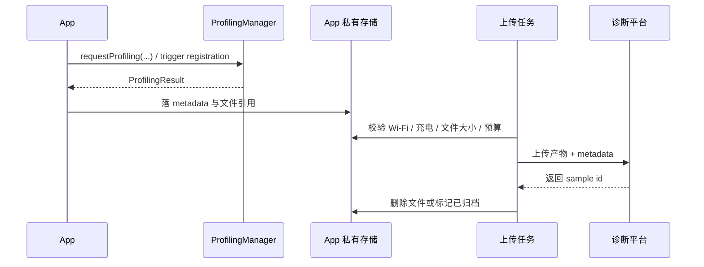

# ProfilingManager

## 适用范围按版本区分

`android.os.ProfilingManager` 从 Android 15（API 35）开始提供。它允许普通应用在用户实际使用的量产设备上请求受控 profiling（性能剖析，即记录线程、CPU 或内存现场），或者登记自己关心的系统事件，由系统在条件满足时生成诊断文件。平台负责执行、脱敏、限流（限制采集频率与资源预算）并把文件写入应用私有目录；应用负责接收结果、关联业务现场、上传与清理。

接入前要把两套能力分开：

- **app-driven profiling**：API 35 起可用。应用主动发起请求，采集 system trace（系统时间线）、Java heap dump（Java 堆快照）、heap profile（按时间采样内存分配）或 stack sampling（采样调用栈）。
- **system-triggered profiling**：从 API 36 开始，经过 version 36.1（Android 16 的 Minor SDK 版本），在 API 37 补入更多 trigger（触发器）。应用只登记关心的事件，事件何时发生、系统是否执行采集都由平台决定。

API 35 不能使用 trigger API；API 36 也不等于拥有 36.1 和 API 37 的全部触发器。版本判断、监听器注册和服务端字段都应按这三条边界设计。

## 按结果类型选请求

先写明要排查的性能问题，再选择剖析类型。四种结果都比帧指标、启动耗时或 ANR（Application Not Responding，应用无响应）计数更重，线上只应做低频取证。

| AndroidX builder | Android 17 文件后缀 | 适合回答的问题 | 主要限制 |
|---|---|---|---|
| `SystemTraceRequestBuilder` | `.perfetto-trace` | 启动慢、卡顿、ANR 前后线程时序、Binder（跨进程调用）/ I/O（文件或网络读写）/ 调度问题 | 不能直接看对象引用链 |
| `JavaHeapDumpRequestBuilder` | `.perfetto-java-heap-dump` | 哪些 Java 对象仍然存活、引用链为何无法释放 | 不能观察一段时间里的分配速率 |
| `HeapProfileRequestBuilder` | `.perfetto-heap-profile` | 哪类 native（C/C++）或 Java 分配持续增长、分配调用栈在哪里 | 不能直接确认 Java GC Root（垃圾回收判活的根引用） |
| `StackSamplingRequestBuilder` | `.perfetto-stack-sample` | 应用 CPU 时间主要花在哪些调用栈 | 不能查看完整的系统时间线 |

这些后缀来自 `android-17.0.0_r1` 的 `ProfilingService`，不能把 Java heap dump 写成传统的 `.hprof` 文件名。四类结果都可以从 Perfetto UI（Perfetto 的时间线分析界面）开始检查；Java heap dump 若要进入只接受 HPROF（传统 Java 堆快照格式）的工具，必须使用经过验证的转换链，不能只改扩展名。

`ProfilingManager` 返回的是请求进程的资料。经过平台脱敏的 system trace 会保留本进程线程和 trace slice（开发者或框架标记的时间区间），并把其他进程的 CPU 活动合并到 `OtherProcesses`。因此它适合判断“本进程慢”还是“整机繁忙”，无法替代本地拥有更高权限的全系统 Perfetto trace。

## app-driven request 的基本调用形态

公开 API 位于 `android.os.ProfilingManager`。业务代码推荐通过 AndroidX 的 `Profiling` 和四种 request builder 构造参数。以下代码块保留 2026 年 7 月已验证的依赖组合：

```kotlin
dependencies {
    implementation("androidx.core:core:1.19.0")
    implementation("androidx.tracing:tracing:1.3.0")
}
```

截至 2026-08-14，`androidx.core:core:1.19.0` 仍是稳定版；`androidx.tracing` 已在 8 月 12 日发布 2.0.0。官方当前 Kotlin 示例使用 `androidx.tracing:tracing-ktx:2.0.0`，Java 示例使用 `androidx.tracing:tracing:2.0.0`。`androidx.core` 提供 profiling 请求与监听器封装，`androidx.tracing` 只负责在 trace 中标记业务区间；新接入宜使用 2.0.0，继续使用 1.3.0 时也不要把它误当成 `ProfilingManager` 的版本。

工程可由 version catalog（Gradle 依赖版本目录）统一管理版本，但不能只升级调用端而跳过 API 35 的运行时判断。

下面的例子在目标操作前发起 system trace，并把 `CancellationSignal`（调用方可触发的停止信号）交给调用方在操作完成后停止采集。`callbackExecutor` 是指定结果回调线程的 `Executor`：

```kotlin
@RequiresApi(Build.VERSION_CODES.VANILLA_ICE_CREAM)
fun requestScrollTrace(
    context: Context,
    callbackExecutor: Executor,
    resultSink: Consumer<ProfilingResult>,
): CancellationSignal {
    val stopSignal = CancellationSignal()
    val request = SystemTraceRequestBuilder()
        .setBufferSizeKb(10 * 1024)
        .setDurationMs(30_000)
        .setBufferFillPolicy(BufferFillPolicy.RING_BUFFER)
        .setTag("scroll-jank-case-42")
        .setCancellationSignal(stopSignal)
        .build()

    requestProfiling(
        context.applicationContext,
        request,
        callbackExecutor,
        resultSink,
    )
    return stopSignal
}
```

代码中的 `RING_BUFFER` 会在缓冲区写满后用新事件覆盖最旧事件，因而保留采集窗口末端的数据。调用 `requestScrollTrace()` 只表示请求已提交，采集不保证立刻开始。连续型采集（system trace、heap profile、stack sampling）应在目标操作之前请求，在操作完成后调用 `stopSignal.cancel()`；系统超时和取消信号谁先发生，谁结束本次采集。若更看重多次采集的一致性，官方当前指南建议以 `setDurationMs()` 设定固定上限，不要依赖手动取消去对齐精确起点。Java heap dump 没有持续采样窗口，触发时点要在本地反复验证，不能假设调用 request 的那一行就是 dump 时刻。

request callback 只应校验结果并把任务交给持久化队列。文件校验、压缩、上传和删除不能占用主线程，也不要长期占用平台回调所用的 executor（线程执行器）。

AndroidX builder 会避免业务侧手写未知的 `Bundle` key（参数名），但当前实现的 setter 只是把数值写进 `Bundle` 参数集合，不会在客户端做上下界校验。平台遇到未知参数会返回 `ERROR_FAILED_INVALID_REQUEST`；已知参数超出范围时，会裁剪到设备支持的最近值。以 `android-17.0.0_r1` 的 AOSP（Android Open Source Project）默认配置为例：

| 类型 | duration 默认 / 范围 | buffer 默认 / 范围 | 其他默认范围 |
|---|---:|---:|---:|
| system trace | 300 s / 1–600 s | 32 MiB / 64 KiB–32 MiB | buffer 按 4 KiB 对齐 |
| Java heap dump | 服务内部 1 s | 250 MiB / 8–250 MiB | 不暴露 duration setter |
| heap profile | 120 s / 1–300 s | 64 MiB / 256 KiB–64 MiB | sampling interval 1–65536 bytes |
| stack sampling | 60 s / 1–300 s | 64 MiB / 64 KiB–64 MiB | 1–200 Hz |

这里的 KiB 和 MiB 分别按 1024 字节和 1024 KiB 计算。表中数值是这份 AOSP 源码快照的默认值，并非稳定 API 契约；厂商配置和后续系统更新可以调整它们。应用应提交合理的小值、记录最终文件大小，并用真实设备验证采样是否覆盖目标区间。

结果写入应用内部的 `files/profiling/`，不需要外部存储权限。`<profileable android:shell="true" />` 允许 shell 用户和本地 Perfetto、simpleperf、Android Studio Profiler 等调试工具对应用执行 profiling，不是线上 `requestProfiling()` 的前提。发布包要检查 API 版本、采样预算、隐私告知、备份规则和诊断后端权限；调试包若还要配合 shell 工具，再单独配置 `profileable`。

## request listener 和 global listener 是两层结果通道

`requestProfiling(..., executor, listener)` 的 listener（结果回调）只关联该次显式请求。`registerForAllProfilingResults(executor, listener)` 注册的是 UID（Android 分配给应用身份与权限的数字标识）级全局结果入口，也是 system-triggered profiling 唯一的应用侧结果入口。

| 场景 | request listener | global listener | 说明 |
|---|---|---|---|
| 只发起一次显式 request，未注册 global listener | 会收到 | 收不到 | 最小可跑通接入 |
| 显式 request + 已注册 global listener | 会收到 | 也会收到同一结果 | request callback 适合关联具体诊断任务；global listener 适合统一归档 |
| `addProfilingTriggers(...)` 注册的 trigger 结果 | 收不到 | 会收到 | trigger 模式必须先注册 global listener |

平台要求 listener 和 executor 成对出现：listener 决定收到结果后做什么，executor 决定在哪个线程执行它。显式请求可以在 request 上提供这一对，也可以依赖已经注册的 global listener；两处都没有时，请求会被丢弃，调用方也收不到失败回调。

全局监听器适合在进程级组件中注册，并保持对象引用稳定。以下代码展示注册和对称注销的基本形态：

```kotlin
@RequiresApi(Build.VERSION_CODES.VANILLA_ICE_CREAM)
class ProfilingResultRegistry(
    private val executor: Executor,
    private val store: ProfilingResultStore,
) {
    private val listener = Consumer<ProfilingResult> { result ->
        store.enqueueIdempotently(result)
    }

    fun register(context: Context) {
        registerForAllProfilingResults(
            context.applicationContext,
            executor,
            listener,
        )
    }

    fun unregister(context: Context) {
        unregisterForAllProfilingResults(
            context.applicationContext,
            listener,
        )
    }
}
```

例子中的 `ProfilingResultStore` 是应用自己的持久化队列接口，listener 内不做文件解析。trigger 模式通常在 `Application` 或等价的进程初始化位置注册一次。不要在每个 `Activity` 创建一份 global listener；多进程应用还应指定一个诊断进程负责接收 UID 级结果，避免多个进程各自重复登记。只有功能关闭、测试清理或进程级组件确定退出时才注销。

应用在采集期间被杀后，平台可能在应用重启并重新注册 global listener 时重投结果。显式请求同时使用两层 listener 也会产生两次回调。因此消费端必须幂等，也就是同一结果处理一次或重复处理，最终记录都相同：成功结果可用规范化后的 `resultFilePath` 作为本地唯一键；失败结果没有路径，应该结合本地请求记录、`tag`、`triggerType`、错误码和时间窗口去重。这个组合只用于应用自己的持久化策略，平台没有承诺它是全局唯一 ID。

## system-triggered profiling 的版本边界

trigger 由应用主动登记，事件和采集时机由系统控制。登记成功不代表一定产出结果：后台 trace、应用与整机的限流预算、磁盘空间、并发采集和系统策略都会影响成功率。

| 首次可用版本 | trigger | 结果与触发语义 | 必须注意的条件 |
|---|---|---|---|
| API 36 | `TRIGGER_TYPE_APP_FULLY_DRAWN` | 冷启动调用 `reportFullyDrawn()`（声明首屏已完整可用）后，克隆正在运行的 system trace | 依赖后台 trace 和预算；只覆盖事件之前已经存在的数据 |
| API 36 | `TRIGGER_TYPE_ANR` | 系统识别 ANR 后、尝试杀进程前，克隆正在运行的 system trace | 触发不等于进程最终因 ANR 被杀 |
| version 36.1 | `TRIGGER_TYPE_APP_REQUEST_RUNNING_TRACE` | 应用调用 `requestRunningSystemTrace(tag)` 后，复制一份正在运行的 system trace 快照 | 必须预先登记该 trigger |
| version 36.1 | `TRIGGER_TYPE_KILL_FORCE_STOP` | 用户在应用信息页点“强行停止”时取 running trace snapshot | 与普通进程死亡分开统计 |
| version 36.1 | `TRIGGER_TYPE_KILL_RECENTS` | 用户从最近任务界面移除应用时取 running trace snapshot | 语义是 Recents 移除 |
| version 36.1 | `TRIGGER_TYPE_KILL_TASK_MANAGER` | 用户从前台服务 Task Manager 停止应用时取 running trace snapshot | 语义是 Task Manager 的 Stop |
| API 37 | `TRIGGER_TYPE_COLD_START` | 冷启动时尽早新开 system trace，并同时做 stack sampling | 到 `reportFullyDrawn()` 停止，未调用时默认 5 秒；采集本身可能延迟开始 |
| API 37 | `TRIGGER_TYPE_KILL_EXCESSIVE_CPU_USAGE` | `ApplicationExitInfo.REASON_EXCESSIVE_RESOURCE_USAGE` 且归因为 CPU 使用过量时取 running trace snapshot | 不要把所有 `REASON_EXCESSIVE_RESOURCE_USAGE` 都解释为 CPU trigger |
| API 37 | `TRIGGER_TYPE_OOM` | 应用发生 `OutOfMemoryError`（堆内存不足）时生成 Java heap dump | 自定义未捕获异常处理器必须继续调用默认 handler |
| API 37 | `TRIGGER_TYPE_ANOMALY` | 系统检测到应用异常行为，产物随异常类型变化 | `ProfilingResult.tag` 会携带异常类型的补充信息 |
| API 37 | `TRIGGER_TYPE_APP_COMPAT` | 系统发现未来 Android 版本将不再支持的应用行为，产物随问题变化 | `tag` 会携带兼容性问题信息 |

`TRIGGER_TYPE_COLD_START` 使用 discard buffer（写满后停止接收新事件的缓冲区），以保住冷启动最早阶段的 tracepoint（时间线事件）。它与 `TRIGGER_TYPE_APP_FULLY_DRAWN` 的 running-trace snapshot（后台 trace 快照）解决不同问题，不能互换。前者尝试记录本次冷启动的开头，后者从系统已经运行的后台 trace 中截取历史窗口。

`ApplicationExitInfo` 是系统保存的应用进程退出记录。`REASON_EXCESSIVE_RESOURCE_USAGE` 是资源使用过量这一大类退出原因，只有系统进一步归因为 CPU 使用过量时，才对应 `TRIGGER_TYPE_KILL_EXCESSIVE_CPU_USAGE`。

`TRIGGER_TYPE_OOM` 依赖默认未捕获异常处理链。应用若安装了自定义 `Thread.UncaughtExceptionHandler`，必须保存默认 handler 并在记录完成后继续调用它；不再调用默认处理会使 OOM trigger 无法使用。此时应用仍可主动请求 Java heap dump，但请求发生在 OOM 之后，内存与进程状态都很脆弱，不能把它当成等价的备用方案。

36.1 属于 Minor SDK 版本，即主 API 级别仍为 36，但系统又补充了一组公开 API；只看 `SDK_INT == 36` 无法区分。`SDK_INT_FULL` 把主版本和 minor 版本编码在同一个整数中。以下判断需要用 API 37 SDK 编译：

```kotlin
fun supportsProfilingVersion36_1(): Boolean {
    if (Build.VERSION.SDK_INT < Build.VERSION_CODES.BAKLAVA) return false
    return Build.VERSION.SDK_INT_FULL >= Build.VERSION_CODES_FULL.BAKLAVA_1
}
```

这段代码先排除低于 Android 16（代号 Baklava）的系统，再比较完整版本值。大于 36 的完整 SDK 值也会满足判断，因此 Android 17 不会被误判为不支持。若工程的 `compileSdk` 尚未暴露 `SDK_INT_FULL`、`VERSION_CODES_FULL.BAKLAVA_1` 或对应 trigger 常量，应先升级编译 SDK；不要用反射拼接常量值掩盖编译边界。

trigger 注册还有四条规则：

- 每种 trigger 同一时刻只能登记一个配置；重复登记会替换旧配置
- `setRateLimitingPeriodHours(n)` 表示同一 trigger 两份结果之间至少等待 `n` 小时，实际间隔可能更长；`0` 表示不增加应用侧间隔
- 应用侧间隔叠加在系统限流之上，不能放宽系统预算
- 停用功能时用 `removeProfilingTriggersByType()` 或 `clearProfilingTriggers()` 清理登记

version 36.1 增加了 `addAllProfilingTriggers()`，可一次登记平台支持的所有触发器。但生产接入更适合按问题登记明确的 trigger：这样版本门槛、数据用途和采样间隔都能逐项审计。

## 在排查漏斗里的位置

`ProfilingManager` 位于“轻量指标发现异常”之后。推荐的排查顺序是：

1. `JankStats`、`FrameMetrics` 等帧监控工具，以及启动/ANR 指标和 APM（Application Performance Monitoring，应用性能监控）事件，先把异常样本筛出来
2. 满足条件时用 `ProfilingManager` 抓一份包含完整现场的诊断样本
3. 四类文件先在 Perfetto UI 中检查；Java heap dump 若还要交给 HPROF-only 工具，走经过验证的转换流程
4. 把 profiling 结果与业务会话（session）、版本、页面、实验分组关联回原始 APM 事件

轻量指标负责大样本统计，`ProfilingManager` 负责低频取证，Perfetto 或内存分析器负责还原现场。若每次卡顿都请求 system trace，系统限流会很快让策略失效，还会给用户设备增加额外负担。

## 错误码、限流和重试策略

成功时 `errorCode == ERROR_NONE`，`resultFilePath` 指向应用私有目录中的文件。失败时路径为 `null`，应同时记录 `errorMessage`，但聚合统计要以稳定的错误码为主。

| 错误码 | 含义 | 建议处理 |
|---|---|---|
| `ERROR_FAILED_RATE_LIMIT_PROCESS` | 当前应用 UID 的预算拒绝本次请求 | 本次不重试，降低该类型的采样频率 |
| `ERROR_FAILED_RATE_LIMIT_SYSTEM` | 系统级预算拒绝本次请求 | 不做即时重试，等待新的业务采样机会 |
| `ERROR_FAILED_PROFILING_IN_PROGRESS` | 已有 profiling 正在执行 | 把请求串行化，同类诊断同一时刻只保留一个 |
| `ERROR_FAILED_NO_DISK_SPACE` | 结果文件无法落盘 | 清理历史样本，给本地缓存设大小上限 |
| `ERROR_FAILED_POST_PROCESSING` | 采集完成，但后处理失败，结果被丢弃 | 记录设备、版本、request 类型、errorCode，回看是否集中在某个系统版本 |
| `ERROR_FAILED_EXECUTING` | 平台执行阶段失败 | 记失败事件，不做立即重试，等待下一次业务触发 |
| `ERROR_FAILED_INVALID_REQUEST` | 类型、key 或参数组合无效，或者相应采集能力被禁用 | 修正接入或关闭该能力，不走线上重试 |
| `ERROR_UNKNOWN` | 未归类失败 | 只记日志与事件，避免自动重试放大成本 |

应用侧至少记录 `tag`、`triggerType`、`errorCode`、`errorMessage`、本地 `requestType`、应用版本、设备、完整 SDK 版本、请求时间和回调时间。`ProfilingResult` 不提供 app-driven 请求的 `requestType` 字段，业务侧要通过本地请求记录补齐。

限流不能简化成固定的“每小时几次”。Android 17 的服务会给不同 profiling type 计算不同资源成本（cost），并分别统计最近一小时、一天和一周的用量；应用 UID 与整机又有各自预算。任一周期的剩余额度不足都可能拒绝请求。具体 cost 和额度由系统配置控制，不属于应用可依赖的 API 常量。

应用端还应设置更保守的本地冷却时间，并保证同类采集同一时刻最多运行一个；远程配置只负责缩小采样范围。限流错误是一次明确拒绝，循环重试只会增加唤醒与日志噪声，无法恢复额度。

## 结果文件生命周期

系统先让应用进程在 `files/profiling/` 中创建目标文件，再通过文件描述符（跨进程传递已打开文件的句柄）写入结果。`ProfilingResult.resultFilePath` 返回的是完整路径，文件此时已经存在，callback 不需要再“保存”一份。应用要在一次数据库事务（相关字段要么全部写入，要么全部回滚）中登记路径与业务 metadata（描述这份文件来源和状态的附加字段），然后交给后台任务。

下面的时序图描述了推荐的处理链：



回调重复、进程重启和上传重试都写入同一条幂等记录。只有后端确认完整接收后才删除本地文件；上传失败则保留到应用自己的过期时间或容量上限。

metadata 至少包含：

- `case_id` / `session_id`
- `request_type` / `trigger_type`
- `app_version` / `build_id`（构建标识）/ `device` / `sdk_int_full`
- 页面、前后台状态、实验分组、触发原因
- `result_file_path`、文件大小、内容摘要（用于校验完整性）、上传状态和清理时间

`android-17.0.0_r1` 中，`ProfilingManager` 会借用应用提供的 executor，尝试删除已交付超过 5 天的旧文件；这项清理至多每天触发一次，但触发依赖相关 API 调用。服务侧也有结果重投与过期处理。这些是实现细节，调用时机和系统配置都可能变化。应用仍需维护自己的容量上限、保留期和上传成功即删除策略。

平台会先把 `tag` 转成小写并过滤到字母、数字和连字符，再截取前 20 个有效字符写进文件名。`tag` 只能放短场景码或随机诊断任务 ID，不能放手机号、账号、Token、URL 查询参数等用户数据。

## Java heap dump 的敏感数据风险

Java heap dump 会记录应用进程中的对象、字段、数组和字符串。用户登录后的堆中可能出现：

- 登录 Token、Session ID、OAuth Refresh Token（用于换取新访问令牌的长期凭据）
- 手机号、邮箱、用户昵称等 PII（Personally Identifiable Information，可识别个人身份的信息）
- 支付信息、订单号、地址
- 缓存在内存中的密钥材料或证书

平台对 system trace 的脱敏不能替应用清理 heap dump 中的业务数据。安全方案需要按分析方式选择：

1. **优先在设备上提取**：若问题能由对象计数、Retained Size（对象及其支配对象占用的内存）、类分布或少量调用栈回答，可在设备上提取诊断摘要，只上传摘要。
2. **受控后端分析**：必须上传原始 heap dump 时，使用 TLS 加密传输、服务端加密存储、独立 KMS（密钥管理系统）、最小权限、访问审计和短保留期。后端要分析文件，就必然存在受控的解密路径；“端到端加密且服务端无法读取”与服务端分析不能同时成立。
3. **明确授权与采样范围**：隐私告知应说明性能诊断可能包含内存快照，远程开关要能关闭 heap dump，并把采样限定到必要版本和必要用户范围。
4. **备份排除**：`files/` 默认可能进入 Auto Backup。把 `files/profiling/` 同时排除在云备份和设备迁移规则之外，并兼顾旧版 `fullBackupContent` 配置。
5. **删除可验证**：上传成功、超过保留期、用户撤回同意或诊断任务关闭时，都要有可观测的删除记录。

不要把通用 trace 上传接口直接复用于 heap dump。两者的数据敏感度、访问人群、保留期和审计要求不同。

## 用源码核对调用链

`android-17.0.0_r1` 中可以沿以下路径核对关键行为：

| 源码位置 | 可验证的行为 |
|---|---|
| `framework/java/android/os/ProfilingManager.java` | 双层 listener、无 listener 时丢弃请求、`files/profiling/`、重投提示、旧文件清理 |
| `framework/java/android/os/ProfilingTrigger.java` | API 37 trigger 语义、冷启动 5 秒边界、OOM 默认 handler 要求、应用侧限流 |
| `framework/java/android/os/ProfilingResult.java` | 错误码、失败时路径为 `null`、`tag` 与 `triggerType` |
| `service/java/com/android/os/profiling/Configs.java` | 参数裁剪、默认范围、Perfetto 数据源和缓冲区策略 |
| `service/java/com/android/os/profiling/ProfilingService.java` | 限流、执行与后处理、脱敏、文件后缀、结果复制和回调 |

从调用链看，应用侧 request 经 Binder（Android 的跨进程通信机制）进入 `ProfilingService`，服务依次检查并发状态、限流与参数，再启动 Perfetto。采集完成后，system trace 与 stack sampling 会在需要时经过 redaction（删除或合并其他进程的敏感信息），服务请求应用进程创建目标文件，把临时结果复制到应用私有目录，然后发送 `ProfilingResult`。任一阶段失败都映射到对应错误码，因此“提交成功”不能当成“采集成功”。

## 上线前检查清单

- 版本门槛按 API 35、API 36、version 36.1、API 37 分开判断
- trigger 模式先注册 global listener，再注册 trigger
- request 上没有 callback 时，确认进程已经注册 global listener
- 连续型 request 提前发起，并用 `CancellationSignal` 覆盖目标区间
- request callback 与 global callback 共存时，持久化层能够幂等消费
- request callback 只做轻量关联，归档走后台流程
- `tag` 不含 PII、Token 或其他敏感值
- 结果目录有容量上限、备份排除、过期时间和删除策略
- heap dump 与 trace 使用不同的数据权限和保留策略
- 线上 `ProfilingManager` 接入检查 API、限流、结果目录和隐私说明；`profileable` 只放在本地 shell / Perfetto / Android Studio 工具链检查项里
- 线上预算默认保守，不要把 `ProfilingManager` 当成高频采集指标的 SDK

## 参考资料

1. **Android SDK Reference, `android.os.ProfilingManager`**  
   https://developer.android.com/reference/android/os/ProfilingManager
2. **Android SDK Reference, `android.os.ProfilingTrigger`**  
   https://developer.android.com/reference/android/os/ProfilingTrigger
3. **Android SDK Reference, `android.os.ProfilingResult`**  
   https://developer.android.com/reference/android/os/ProfilingResult
4. **Android Developers, ProfilingManager overview**  
   https://developer.android.com/topic/performance/tracing/profiling-manager/overview
5. **Android Developers, App-driven profiling**  
   https://developer.android.com/topic/performance/tracing/profiling-manager/how-to-capture
6. **Android Developers, Trigger-based profiling**  
   https://developer.android.com/topic/performance/tracing/profiling-manager/trigger-based-capture
7. **Android Developers, Retrieve and analyze profiling data**  
   https://developer.android.com/topic/performance/tracing/profiling-manager/retrieve-and-analyze
8. **Android Developers, Profiling limitations**  
   https://developer.android.com/topic/performance/tracing/profiling-manager/will-my-profile-always-be-collected
9. **AndroidX Reference, `androidx.core.os.Profiling` / `ProfilingRequest`**  
   https://developer.android.com/reference/androidx/core/os/Profiling
10. [AndroidX Tracing release notes](https://developer.android.com/jetpack/androidx/releases/tracing)
11. [Google Maven, AndroidX Core metadata](https://dl.google.com/android/maven2/androidx/core/core/maven-metadata.xml)
12. [Google Maven, AndroidX Tracing metadata](https://dl.google.com/android/maven2/androidx/tracing/tracing/maven-metadata.xml)
13. [AOSP android-17.0.0_r1, Profiling module](https://android.googlesource.com/platform/packages/modules/Profiling/+/refs/tags/android-17.0.0_r1)
14. **AOSP android-17.0.0_r1, `ProfilingService.java`**
   `packages/modules/Profiling/service/java/com/android/os/profiling/ProfilingService.java`
15. **AOSP android-17.0.0_r1, `Configs.java` / `DeviceConfigHelper.java` / `RateLimiter.java`**
   `packages/modules/Profiling/service/java/com/android/os/profiling/`
16. **Android Developers, Back up user data with Auto Backup**
   https://developer.android.com/identity/data/autobackup
