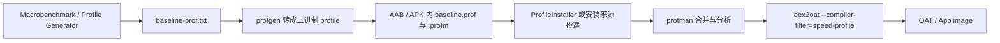

# Baseline Profiles 与编译优化

<!-- outline-start -->
## 本节要点大纲

### 锚点(必须覆盖)

- 🔹 [定位] 说明 Baseline Profiles 是发布前编译优化手段,解决首次运行和冷启动性能,不是运行时监控。
- 🔹 [机制] 解释 ART profile、ahead-of-time 编译、startup / hot path 方法和类的关系;写清安装后何时生效。
- 🔹 [生成方式] 展开 Macrobenchmark / Baseline Profile Generator、Gradle 插件、managed device、本地与 CI 生成。
- 🔹 [规则格式] 展示 profile rules 中类、方法、flags 的基本形态,并说明读者不需要手写大部分规则。
- 🔹 [场景覆盖] 规定生成场景应覆盖冷启动、首页、关键 tab、搜索、详情、支付等用户路径。
- 🔹 [Startup Profiles] 区分 Baseline Profiles 和 Startup Profiles 的目标、位置和验证方式。
- 🔹 [验证] 写如何用 Macrobenchmark、ProfileVerifier、日志、APK / AAB 产物确认 profile 生效。
- 🔹 [与 APM] 说明线上启动变差如何触发重新检查 profile 覆盖,发布后如何观察启动指标回归。
- 🔹 [库作者] 说明 Android library 如何发布 baseline profile,App 如何合并依赖库 profile。
- 🔹 [回归判断] 给 profile 失效、场景漏覆盖、AGP 配置错误、版本升级后重新生成的排查清单。

### 扩展(可选深入)

- 🔸 增加 Baseline Profile 生成 Gradle 配置和测试代码示例。
- 🔸 补一份 profile 生效验证清单,覆盖本地、CI、发版产物和线上指标。
- 🔸 对 Android Developers Baseline Profiles 文档、AGP 版本要求、ProfileVerifier 文档做核对。
- 🔸 增加与 R8、startup library、App Startup、lazy init 的关系说明。
- 🔸 补一个"启动优化改动后 profile 漏更新"的回归案例。

### 流水线加工要求

- 所有优化结论都要明确是发布前编译收益还是运行时逻辑收益。
- 示例必须能说明生成、打包、验证三个阶段。
- 不要把 Baseline Profiles 写成万能启动优化,需要列出它不处理的 I/O、网络、锁等待问题。

### OpenClaw 加工指引

> **锚点**是最低覆盖要求,加工时必须逐条落实并标注验证结果。
> **扩展**视素材丰富程度选择性深入。
> 如果从 Obsidian 素材或 AOSP 源码中发现大纲未列出但与本节强相关的知识点,
> 可**就地插入**最相关的锚点之后,并用 `[自动发现]` 标注,方便后续 review。
> 锚点内容需 L1/L2 验证,扩展内容至少 L2 验证,自动发现内容至少标注来源。
<!-- outline-end -->

## Baseline Profiles 是发布前优化,不是监控

Baseline Profiles 使应用或库随包发布一组常用代码路径,Android Runtime 据此进行 AOT 编译优化。官方文档给出的目标是优化启动、降低交互卡顿,让新用户和每次更新后的首次运行都受益。

它不属于 APM 采集工具,但和性能监控关系很近。线上启动慢或交互慢被发现后,Baseline Profiles 常常是修复手段之一;修复是否生效,再用 Macrobenchmark 和线上指标验证。

## 它解决的是首次运行性能

没有 profile 时,应用安装或更新后,很多代码路径要等运行中解释执行、JIT 编译或后台 profile 引导优化。用户首次打开时,关键路径可能还没被编译好。

Baseline Profiles 把"哪些类和方法值得提前优化"提前打包进去。ART 按安装来源、系统版本和后台 dexopt 时机使用这些规则,让启动和高频交互更早进入较好状态。

版本边界要拆开看:

| 场景 | 生效方式 | 验证重点 |
|---|---|---|
| Android 7.0-8.1(API 24-27) | 系统没有 Play Cloud Profiles。应用需要随包携带 baseline profile,并依赖 `androidx.profileinstaller` 在首次运行后把 profile 安装给 ART,随后等待后台 dexopt 编译。 | 不能只看包内文件,要看 ProfileInstaller 返回状态和后续编译结果。 |
| Android 9+(API 28+),Google Play 安装 | Baseline Profile 随包交付,Play Cloud Profiles 也可能参与后续优化。Baseline Profile 覆盖新版本初期和新用户,Cloud Profiles 来自 Play 的聚合数据。 | 灰度早期不要假设 Cloud Profiles 已经覆盖。 |
| Android Studio / Gradle 安装 | 现代 AGP 可在安装流程中触发 profile 编译,适合本地验证。 | 记录 AGP 版本和安装命令,避免把本地安装结果当成商店安装结果。 |
| 其他商店 / sideload | 依赖 APK 内 profile 与 ProfileInstaller 触发安装。AGP < 8.4 且非 Play 安装时,Baseline Profile 编译不会自动完成。 | 把"文件存在"和"ART 已编译"分开验证。 |

从文本规则到设备端编译,中间会经过这几个环节:



`baseline-prof.txt` 不会直接交给 ART 编译器。`profgen` 在构建期把文本规则转成二进制 profile;非 Play 安装时,`androidx.profileinstaller.ProfileInstaller` 通常负责把随包 profile 放到 ART 可读的位置。后续由 `profman` 合并和分析 profile,满足条件后由 `dex2oat --compiler-filter=speed-profile` 编译命中的方法。源码锚点可先落到 AOSP android-16.0.0_r1 的 `art/profman/profman.cc` 和 `art/dex2oat/dex2oat.cc`; Android 17 发布 tag 可用后再复核同一路径。

`RESULT_CODE_PROFILE_ENQUEUED_FOR_COMPILATION` 表示 profile 已交给系统,等待后续 dexopt;`RESULT_CODE_COMPILED_WITH_PROFILE` 才表示当前包已经按 profile 完成编译。排查时不要把 ENQUEUED 当作收益已经生效。

适合纳入 profile 的路径包括:

- 冷启动到首屏。
- 首页列表首次展示和滚动。
- 主导航切换。
- 搜索、详情页、支付等高频路径。
- 库作者提供的库初始化或热点 API。

不适合把全 App 都塞进去。profile 过宽会增加编译成本,也会稀释优化重点。

## 生成方式

应用通常用 Macrobenchmark 或 Baseline Profile Gradle Plugin 生成 profile。测试代码驱动 App 执行关键路径,工具记录触发到的类和方法,再输出 profile 文件。

常见流程是:

1. 写一组用户关键路径的 UI 自动化操作。
2. 运行 profile generation。
3. 把生成的 profile 合入源码。
4. 用 Macrobenchmark 分别测有 profile 和无 profile 的启动或交互。
5. 在 CI 中持续验证 profile 没有失效。

这个流程里的难点不在 API,而在路径选择。只录"打开首页"会漏掉很多高频交互;录太多路径,又会让 profile 变得臃肿。

## Baseline Profiles 和 Startup Profiles

Baseline Profiles 和 Startup Profiles 的作用点不同。Baseline Profiles 面向 ART 的 profile-guided AOT 编译,用来减少首次运行时的解释执行和 JIT 预热。Startup Profiles 面向构建期 DEX layout,R8 / D8 消费带 `S` 标记的规则,把启动路径中的类和方法排到更集中的 DEX 区域,减少启动阶段 page fault 和 DEX 加载局部性问题。

两者的区别:

- Baseline Profiles:包内 profile 交给 ART,安装或后台 dexopt 阶段通过 `speed-profile` 编译常用方法。
- Startup Profiles:构建期由 R8 / D8 使用,目标是调整 DEX 中启动代码的位置,不等同于 ART 编译。
- 两者可同时存在:一个偏执行速度,一个偏加载局部性;启动慢时还要看资源加载、主线程 I/O、锁等待和业务初始化。

调启动时,编译状态和 DEX 布局要分开验证。只看到 profile 文件存在,还不能说明启动路径已经被编译,也不能说明 DEX 页面已经按启动顺序排好。

## 和 APM 的连接方式

线上 APM 里,Baseline Profiles 最常见的观测指标是:

- 冷启动 TTID / TTFD 是否下降。
- 首次安装或更新后首开是否变快。
- 首页首屏慢帧率是否下降。
- 关键交互 P95 是否下降。

需要把用户群区分清楚。老用户、刚更新用户、全新安装用户、清数据用户的编译状态不一样。只看全量平均启动耗时,容易把 profile 效果冲淡。

## 使用建议

Baseline Profiles 最适合和 Macrobenchmark 一起纳入发布流程。每次新增关键启动路径、重构首页、改动导航或接入大 SDK,都应该重新检查 profile。

如果线上启动慢来自网络等待、服务端接口、主线程 I/O、同步锁或厂商 ROM 调度,Baseline Profiles 只能改善代码执行和加载相关成本,不能解决所有慢启动。它是性能工具箱里很有效的一件工具,但不是万能修复开关。

## Profile 规则长什么样

Baseline Profile 最终会生成一组 ART profile 规则,描述哪些类和方法应该被优先优化。开发者通常不手写这些规则,但读得懂格式有助于排查。

规则大致会包含类、方法和 flag。示意如下:

规则分两类：方法规则和类规则。

方法规则的格式是 flags + 方法描述符：

```text
HSPLcom/example/app/MainActivity;->onCreate(Landroid/os/Bundle;)V
```

前缀里的字母只有三个 flag 含义：

- `H`：Hot，频繁调用的方法。
- `S`：Startup，启动路径内的方法或类，R8 / D8 可据此调整 DEX layout。
- `P`：Post-startup，启动后仍常用的路径。

`L` 不是 profile flag。`Lcom/example/app/MainActivity;` 中的 `L` 是 JVM/Dex 类型描述符前缀，表示一个对象类型，和 `I`（int）、`V`（void）、`[`（数组）是同一套描述符语法。方法签名 `(Landroid/os/Bundle;)V` 里的 `L` 也是同一个意思。

类规则不带 H/S/P flags：

```text
Lcom/example/app/FeedItem;
```

这表示整个类纳入 profile，没有方法级的 flag。`L` 同样是类型描述符前缀，不是独立的 "Load" 标记。

方法规则上可以同时出现 H、S、P，例如 `HSPLcom/...;->method(...)V` 表示这条记录既影响 ART 编译优先级，也参与启动布局优化。开发者通常不手写这些规则，但排查 profile 命中率时要能区分 flags 和类型描述符。profile 不是"性能配置开关"，它是一组热点类和方法提示。它覆盖不到的路径，不会因为文件存在而自动变快。

## 生成场景要覆盖用户路径

Baseline Profile 的质量取决于生成脚本。只启动 App 一次,通常只能覆盖 `Application`、入口 Activity 和首屏一小段。更完整的生成脚本应该覆盖:

- 冷启动到首页首屏。
- 首页列表滚动一小段。
- 主导航切到核心 tab。
- 打开详情页。
- 触发一次核心业务操作,例如搜索或播放。

不要录太多低频路径。Profile 越宽,安装后编译成本越高,也越难维护。

## 验证 profile 是否生效

验证不能只看文件是否生成。要把产物、安装来源、ProfileVerifier 和 Macrobenchmark 分开:

| 验证对象 | 观察点 | 常见误判 |
|---|---|---|
| AAB / APK 产物 | AAB 中的 `BUNDLE-METADATA/com.android.tools.build.profiles/baseline.prof` / `.profm`,APK 中的 `assets/dexopt/baseline.prof` / `.profm`。 | 包内有文件只能说明 profile 被打包,不代表设备已完成编译。 |
| 安装来源 | Google Play、Android Studio / Gradle、其他商店或 sideload 的触发时机不同。AGP < 8.4 的非 Play 安装要单独验证。 | 用本地 Gradle 安装结果推断商店安装结果。 |
| ProfileVerifier | 关注 `RESULT_CODE_COMPILED_WITH_PROFILE`、`RESULT_CODE_PROFILE_ENQUEUED_FOR_COMPILATION`、`RESULT_CODE_NO_PROFILE`、`RESULT_CODE_ERROR_UNSUPPORTED_API_VERSION`。 | `ENQUEUED` 只是已入队,不能当成已编译。 |
| Macrobenchmark | 对比 `CompilationMode.Partial`、无 profile、全编译等模式下的启动和滚动指标。 | 只看一次冷启动,忽略首装、升级、清数据用户的差异。 |

还可以用系统侧状态补一层验证:

```bash
adb shell dumpsys package com.example.app | grep -A 10 "dexopt"
adb shell cmd package compile -m speed-profile -f com.example.app
```

不同 Android 版本的 `dumpsys package` 字段会变化,目标是确认当前包的编译过滤器或状态里出现 `speed-profile` / profile compiled 相关信息。第二条命令适合本地复现,不要拿它替代真实安装来源的自动编译结果。

### 混淆与初始化检查

`androidx.profileinstaller` 的 manifest 通过 `androidx.startup.InitializationProvider` 注册 `ProfileInstallerInitializer`,并声明 `androidx.profileinstaller.ProfileInstallReceiver` 处理安装、保存和 benchmark 相关 action。如果项目移除了 AndroidX Startup provider,要确认仍有等价的 profile 安装动作;如果 shrinker 或 manifest 合并把 `ProfileInstallReceiver` 裁掉,相关调试入口会失效。

Baseline Profile 规则通常在混淆前由测试包生成,AGP 打包时会把规则映射到混淆后的名称并产出 `.prof` / `.profm`。不要把未重映射的文本规则手工塞进 release 包。存在非标混淆或手动移动 profile 时,抽取最终 AAB / APK 中的 profile,并和同版本 `mapping.txt` 对照,确认类和方法名对应。

常见问题:

- 生成脚本跑的是 Debug 包,profile 对 Release 路径覆盖不足。
- R8 后方法变化,旧 profile 命中率下降。
- 多模块或动态特性模块的关键路径没有被录到。
- CI 没有重新生成 profile,文件长期滞后。
- AAB / APK 已包含 profile,但非 Play 安装没有完成 ART 编译。

Baseline Profiles 应该和关键路径测试一起维护,而不是生成一次就放着。

## 启动优化中的位置

启动优化可以按三类成本看:

| 成本 | Baseline Profiles 是否能处理 | 其他工具 |
|---|---|---|
| 代码解释执行 / JIT 预热 | 能改善 | Macrobenchmark 验证 |
| 类加载和 DEX 布局 | 部分改善,配合 Startup Profiles | Perfetto、ART 日志 |
| 主线程 I/O、网络、锁等待、SDK 初始化 | 不能直接解决 | Perfetto、Matrix、StrictMode |

如果启动慢主要来自同步网络请求或主线程读大文件,profile 再好也只能改善一小部分。先用 Perfetto 判断启动时间花在哪,再决定是否用 Baseline Profiles。

## Library 作者的责任

库也可以提供 Baseline Profiles。对 UI 库、图片库、数据库库、序列化库来说,这能让使用方从首次运行就受益。

库作者生成 profile 时要覆盖公开 API 的典型路径,而不是只覆盖 sample App 的演示页面。并且要避免把 sample 业务代码录进库 profile。

应用方接入库 profile 后,仍然需要自己的应用 profile。库 profile 只能覆盖库内部热点,不能覆盖 App 启动和业务页面。

## 回归判断

Baseline Profiles 的回归通常表现为:

- 新版本冷启动 P50/P95 上升。
- 首次安装后前几次打开变慢。
- Macrobenchmark 中 profile-enabled 和 profile-disabled 差异缩小。
- trace 中解释执行、类加载或编译相关成本变多。

一旦发现回归,先检查生成脚本是否还能走到关键路径,再看最近是否做了包名、模块、R8、导航或启动流程调整。
