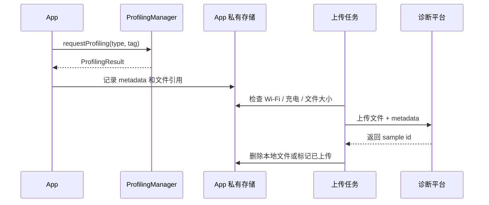

# ProfilingManager

<!-- outline-start -->
## 本节要点大纲

### 锚点（必须覆盖）

- 🔹 [定位] 说明 ProfilingManager 把系统 profiling 能力以受控 API 暴露给 App，用于线上或灰度环境触发专项样本。
- 🔹 [类型] 列出支持的 profiling 类型、输出文件、适用问题和系统版本要求；必须按官方 API 核对。
- 🔹 [调用形态] 展开 request、parameters、callback、executor、result file、error code 的基本调用流程。
- 🔹 [触发设计] 写 App-driven profiling 触发条件：慢启动、ANR 前兆、慢帧升高、内存异常、远程配置命中、用户反馈。
- 🔹 [Android 16+] 核对系统触发能力和 API 变化；所有版本相关内容必须标注来源和适用 API level。
- 🔹 [结果生命周期] 说明文件生成、可访问时间、复制、压缩、上传、删除、失败处理和磁盘配额。
- 🔹 [四类边界] 按 CPU、heap、system trace、Java heap dump 等类型说明适用问题和不能回答的问题。
- 🔹 [隐私] 覆盖 trace 文件、堆信息、线程名、路径、URL、符号、用户数据的裁剪和上传策略。
- 🔹 [APM 集成] 设计 profiling sample 与 session、event、trace id、版本、页面、设备的关联字段。
- 🔹 [工具关系] 和 Perfetto 手动采集、Android Studio Profiler、JankStats、FrameMetrics 的使用顺序做说明。

### 扩展（可选深入）

- 🔸 增加 ProfilingManager 调用代码示例，并标注权限、API level 和错误处理。
- 🔸 补一张结果文件生命周期图。
- 🔸 对 Android ProfilingManager API reference 做 L1 核对，特别是 Android 16+ 行为。
- 🔸 补充线上触发的风控表：采样率、文件大小、Wi-Fi、充电、温度、低端机排除。
- 🔸 增加与商业 APM profiling 能力的差异说明。

### 流水线加工要求

- ProfilingManager 章节必须以官方 API 为准，不确定的版本信息一律标注待核对。
- 每种 profiling 类型都要写适用问题、输出物、开销和隐私风险。
- 线上触发示例必须包含采样和上传限制。

### OpenClaw 加工指引

> **锚点**是最低覆盖要求，加工时必须逐条落实并标注验证结果。
> **扩展**视素材丰富程度选择性深入。
> 如果从 Obsidian 素材或 AOSP 源码中发现大纲未列出但与本节强相关的知识点，
> 可**就地插入**最相关的锚点之后，并用 `[自动发现]` 标注，方便后续 review。
> 锚点内容需 L1/L2 验证，扩展内容至少 L2 验证，自动发现内容至少标注来源。
<!-- outline-end -->

## ProfilingManager 把系统 profiling 暴露给 App

`android.os.ProfilingManager` 是 Android 15（API 35）加入的平台 API，用于由 App 请求系统 profiling。官方 API 支持的类型包括 Java heap dump、heap profile、stack sampling 和 system trace。

它的意义在于：应用可以在真实用户设备上，在受系统约束的条件下请求性能资料，而不是只能依赖开发者手动 adb 抓 trace。它仍然不是传统常驻 APM SDK，采集频率、文件生成、权限和系统策略都要遵守平台限制。

## 支持哪些 profiling 类型

| 类型 | API 常量 | 适合的问题 |
|---|---|---|
| Java heap dump | `PROFILING_TYPE_JAVA_HEAP_DUMP` | Java 对象引用和内存泄漏分析 |
| Heap profile | `PROFILING_TYPE_HEAP_PROFILE` | 分配行为和内存增长分析 |
| Stack sampling | `PROFILING_TYPE_STACK_SAMPLING` | CPU 热点和线程执行采样 |
| System trace | `PROFILING_TYPE_SYSTEM_TRACE` | 调度、渲染、I/O、Binder 等系统事件 |

这些资料比普通指标重得多。一次 system trace 或 heap dump 不能当作帧级指标那样频繁采集，更适合异常触发、灰度诊断或用户反馈后的单点取证。

## 基本调用形态

下面代码展示 API 形态，重点看 profiling type、参数、tag 和异步回调。

```kotlin
if (Build.VERSION.SDK_INT >= 35) {
    val manager = context.getSystemService(ProfilingManager::class.java)
    manager.requestProfiling(
        ProfilingManager.PROFILING_TYPE_SYSTEM_TRACE,
        Bundle(),
        "startup_slow_sample",
        null,
        executor
    ) { result ->
        handleProfilingResult(result)
    }
}
```

实际接入时，`handleProfilingResult()` 不能只把文件路径简单上传。还要处理失败原因、文件生命周期、Wi-Fi / 充电条件、用户同意策略、大小限制和重试。

## Android 16 之后的触发能力

API reference 中还列出 `addProfilingTriggers()`、`addAllProfilingTriggers()`、`clearProfilingTriggers()` 等触发式能力，部分标注为 version 36.1。它们让进程可以注册 profiling trigger，由系统按触发条件生成资料。

这类能力很适合未来线上诊断：比如 ANR、严重慢启动、内存异常后，由系统触发资料采集。工程上仍然要看目标设备覆盖率和平台策略，不能假设所有用户设备都支持。

## 和 Perfetto、APM SDK 的关系

ProfilingManager 不是 Perfetto 的替代品。它更像平台提供的受控入口，允许 App 请求系统帮它采某类资料。最终分析 system trace 时，仍然要用 Perfetto UI、Trace Processor 或批量分析脚本。

它和 APM SDK 的关系也很清楚：

- APM SDK 负责常驻指标、异常识别、采样和用户上下文。
- ProfilingManager 负责在少量关键样本上补系统级资料。
- 服务端负责把指标样本、profiling 结果和版本上下文关联起来。

没有 APM 的异常筛选，ProfilingManager 容易被滥用；没有 ProfilingManager，线上某些问题又只能停在粗指标。

## 使用建议

接入时先从灰度诊断入口做起。比如某个用户反馈慢启动，App 在下次启动满足条件时请求一次 system trace；或者某个版本 OOM 抬升，只对少量设备请求 heap profile。

要给 profiling 结果设计独立的数据通道。它们体积大、隐私风险高、上传条件苛刻，不应该和普通埋点走同一条队列。ProfilingManager 的价值在“少量高质量样本”，不是“多采一点总有用”。

## App-driven profiling 的触发设计

App 主动请求 profiling 时，触发条件要足够具体。适合的触发条件包括：

- 某次启动超过本地阈值，例如冷启动超过 5 秒。
- 页面连续出现严重慢帧，且用户仍在前台。
- Java heap 使用率连续超过阈值。
- 用户主动反馈卡顿，并同意上传诊断资料。
- 灰度实验中只对指定设备组启用。

不适合的触发条件：

- 每次启动都请求 system trace。
- 所有 ANR 前兆都抓 heap dump。
- 网络请求慢就抓系统 trace。
- 没有用户状态和网络条件判断就上传大文件。

ProfilingManager 的资料重，触发条件越粗，越容易伤害用户体验和数据成本。

## 结果文件的生命周期

Profiling 结果不能按普通埋点处理。建议生命周期如下：



metadata 至少包含 profiling type、tag、触发原因、App 版本、设备、系统版本、页面、前后台状态、采样配置版本。否则服务端拿到文件后不知道为什么抓它。

## 四类 profiling 的使用边界

| 类型 | 最适合 | 不适合 |
|---|---|---|
| Java heap dump | 泄漏、对象保留、Java heap 异常 | 高频采集、前台交互中采集 |
| Heap profile | 分配热点、native / heap 增长趋势 | 替代完整 Hprof 引用链 |
| Stack sampling | CPU 热点、长时间计算 | 精确方法耗时和短函数分析 |
| System trace | ANR、启动慢、卡顿、系统调度 | 直接当线上指标 |

选择错误会浪费样本。比如启动慢更适合 system trace，Java heap dump 很难解释启动；内存泄漏更适合 heap dump 或 heap profile，stack sampling 只能看到 CPU 热点。

## 隐私和上传策略

System trace、heap dump、profile 都可能包含敏感信息。上传前要做策略约束：

- 只在用户协议和隐私策略允许的范围内采集。
- 文件大小超过阈值时放弃或等待 Wi-Fi。
- 上传通道加密，服务端访问需要权限。
- 保留周期短于普通指标。
- heap dump 尽量只在内部、灰度或用户授权场景采集。

这些资料比普通日志更敏感。尤其是 heap dump，可能包含业务对象、缓存内容和用户输入。

## 与 APM 平台的联动

ProfilingManager 最适合由 APM 平台远程控制：

1. 平台发现某版本启动 P95 异常。
2. 下发配置，只对目标版本、目标机型、1% 用户开启启动 trace 触发。
3. App 本地满足阈值后请求 system trace。
4. trace 上传后关联到启动异常事件。
5. 平台停止采集，避免继续产生成本。

这个流程让 profiling 从“开发者手动抓”变成“线上异常定向取证”。它也是 ProfilingManager 和传统 APM SDK 最有价值的结合点。
