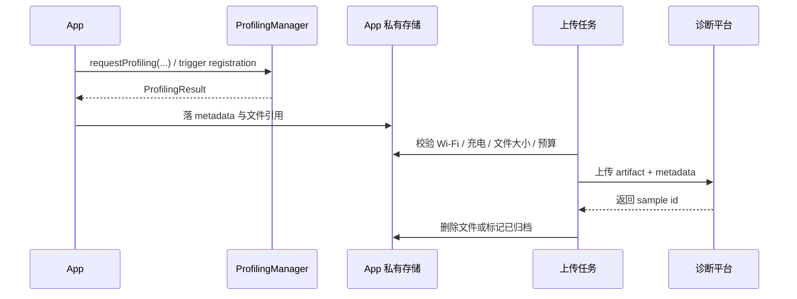

---


title: "ProfilingManager"
chapter: "19"
section: "19.16"
status: finalized
drafted_date: "2026-04-24"
drafted_by: "codex"
applicable_versions: "Android 15+（app-driven API 35；system-triggered 触发器覆盖 API 36、version 36.1、API 37）"
last_verified: "2026-04-24"
last_verified_against: "developer.android ProfilingManager / ProfilingTrigger / ProfilingResult + AndroidX Profiling reference"
confidence: medium
tags: [apm, profiling, perfetto]
related_chapters: ["19.11", "19.12", "19.13", "15.5", "13.1", "9.1", "8.2"]
sources:
  - type: official
    path: "https://developer.android.com/reference/android/os/ProfilingManager"
  - type: official
    path: "https://developer.android.com/reference/android/os/ProfilingTrigger"
  - type: official
    path: "https://developer.android.com/reference/android/os/ProfilingResult"
  - type: official
    path: "https://developer.android.com/topic/performance/profiling-manager"
  - type: official
    path: "https://developer.android.com/reference/androidx/core/os/Profiling"
  - type: official
    path: "https://developer.android.com/reference/androidx/core/os/ProfilingRequest"
pipeline_stage: task2b_pending
task6_state: reviewed
task9_state: reviewed
task2b_state: pending
task9_result: needs-rework
task9_reviewed_by: openclaw-task9
task9_reviewed_date: "2026-05-20"
last_task6_at: "2026-05-07T15:09:20+08:00"
last_task6_review_log: "logs/review/2026-05-07-15-review.md"
task6_review_notes: "2026-05-07 task6 review 15:09：重审 ProfilingManager，清理填充词 3 处；L1/L2 通过，无新增回炉项；Task9 已通过且 queue 无 pending，自动晋升 finalized。"
last_task9_at: "2026-05-20T06:20:00+08:00"
last_task9_audit: "2026-05-20"
task9_review_notes: "2026-05-20 task9 idle audit: needs-rework。P0 1（ProfilingResult 不存在 ERROR_FAILED_PROFILING_NOT_ALLOWED）/ P1 0 / P2 1（官方 guide URL 过期）。"
task2b_result: fixed
last_task2b_at: "2026-05-07T14:47:28+08:00"
repaired_date: "2026-04-25"
repaired_by: "openclaw-task2b"

task6_result: pass-light-edit
reviewed_by: openclaw-task6
reviewed_date: "2026-05-07"
---

# ProfilingManager

<!-- outline-start -->
## 本节要点大纲

### 锚点（必须覆盖）

- 🔹 `ProfilingManager` 的公开平台 API 从 Android 15（API 35）开始可用，不能写成 Android 8-17 全覆盖
- 🔹 app-driven profiling 和 system-triggered profiling 是两套能力，回调链也分 request listener 与 global listener 两层
- 🔹 trigger 版本边界要拆开写：API 36、version 36.1、API 37 不是同一层能力
- 🔹 `ProfilingResult` 的错误码、限流、并发冲突、磁盘不足要分别处理，不能只写成“失败原因”
- 🔹 `ProfilingManager` 在排查流程里的位置是“指标发现异常后的重样本取证”，不是常驻指标 SDK

### 扩展（可选深入）

- 🔸 用 AndroidX `Profiling` / `ProfilingRequest` 包装请求构造
- 🔸 补一张 request listener / global listener 的结果分发表
- 🔸 给 trigger 场景补版本对照表和 artifact 对照表
<!-- outline-end -->

## 适用范围按版本拆开

`android.os.ProfilingManager` 是 Android 15（API 35）加入的平台 API。它解决的是量产设备上“异常发生时没有提前开工具”的缺口：应用在受系统预算约束的前提下，请系统抓一份更重的样本，用来补充线上指标。

这里有两个边界要先拆清：

- **app-driven profiling**：API 35 起可用。应用主动发起请求，抓 system trace、Java heap dump、heap profile、stack sampling
- **system-triggered profiling**：从 API 36、version 36.1、API 37 逐步补齐。结果由系统事件触发，接收方式和 request callback 不同

如果把这两类能力混写，版本判断、回调注册和结果归档都会写错。

## 按结果类型选请求

应用侧要先决定的是“要回答什么问题”，再选 request 类型。

| 请求类型 | 结果形态 | 适合回答的问题 | 不适合 |
|---|---|---|---|
| `SystemTraceRequestBuilder` | `.perfetto-trace` | 启动慢、卡顿、ANR 前后线程时序、Binder / I/O / 调度问题 | 直接看对象引用链 |
| `JavaHeapDumpRequestBuilder` | `.hprof` | 哪些对象还活着、谁把 Java heap 顶满了 | 观察一段时间里的分配波动 |
| `HeapProfileRequestBuilder` | heap profile trace | 哪类分配一直涨、分配热点在哪 | 直接确认 GC root |
| `StackSamplingRequestBuilder` | stack samples trace | CPU 时间主要花在哪段调用栈 | 看完整系统时间线 |

线上接入时，system trace 和 heap dump 都属于重样本。它们更适合异常取证，不适合替代常驻指标。

## app-driven request 的基本调用形态

公开平台 API 是 `android.os.ProfilingManager`。应用接入时更常见的写法是 AndroidX `androidx.core.os.Profiling`，因为请求构造、参数约束和兼容封装更清楚。

```java
ProfilingRequest request = new SystemTraceRequestBuilder()
        .setBufferSizeKb(10_240)
        .setDurationMs(5_000)
        .setBufferFillPolicy(BufferFillPolicy.RING_BUFFER)
        .setTag("scroll-jank")
        .build();

Profiling.requestProfiling(context, request, executor, result -> {
    if (result.getErrorCode() == ProfilingResult.ERROR_NONE) {
        archiveResult(result.getTag(), result.getResultFilePath());
        return;
    }
    recordProfilingFailure(result);
});
```

这段调用只说明一件事：**请求参数、执行过程、结果回传是异步拆开的**。应用线程负责提交 request，平台负责执行与限流，结果在 listener 里回到应用。归档、上传、删除都应走后台流程，不要塞回请求线程。

`ProfilingManager` 的结果写入应用私有目录，发起 request 不需要外部存储权限。若希望 system trace 覆盖更完整的调度与系统视角，调试包、内测包或可分析版本要在 manifest 中配置 `<profileable android:shell="true" />`，并让发布渠道确认这项配置符合内部合规口径。没有这类配置时，系统仍可能返回结果，但可见范围会收窄。

## request listener 和 global listener 是两层结果通道

`requestProfiling(..., executor, listener)` 这层 callback 只覆盖本次显式请求。system-triggered profiling 的结果要靠 `registerForAllProfilingResults(Executor, Consumer<ProfilingResult>)` 这层 global listener 收。

| 场景 | request listener | global listener | 说明 |
|---|---|---|---|
| 只发起一次显式 request，未注册 global listener | 会收到 | 收不到 | 最小可跑通接入 |
| 显式 request + 已注册 global listener | 会收到 | 也会收到同一结果 | callback 适合关联 case；global listener 适合统一归档 |
| `addProfilingTriggers(...)` 注册的 trigger 结果 | 收不到 | 会收到 | trigger 模式必须先注册 global listener |

如果应用同时注册两层 listener，去重主键优先用 `resultFilePath`。失败结果没有文件时，再退回 `triggerType + tag + errorCode + caseId` 组合键。

## system-triggered profiling 的版本边界

`ProfilingTrigger` 的能力是逐步加的，API level 和 extension version 不能混成一个判断分支。

| 版本 | trigger | 产物 | 场景 |
|---|---|---|---|
| API 36 | `TRIGGER_TYPE_APP_FULLY_DRAWN` | running system trace snapshot | 冷启动尾段复盘 |
| API 36 | `TRIGGER_TYPE_ANR` | running system trace snapshot | ANR 取证 |
| version 36.1 | `TRIGGER_TYPE_APP_REQUEST_RUNNING_TRACE` | running system trace snapshot | 主动取当前正在运行的 trace |
| version 36.1 | `TRIGGER_TYPE_KILL_FORCE_STOP` / `TRIGGER_TYPE_KILL_RECENTS` / `TRIGGER_TYPE_KILL_TASK_MANAGER` | running system trace snapshot | 用户手动结束进程后的现场 |
| API 37 | `TRIGGER_TYPE_COLD_START` | newly started system trace + stack sampling | 冷启动全窗口取证 |
| API 37 | `TRIGGER_TYPE_KILL_EXCESSIVE_CPU_USAGE` | running system trace snapshot | 因资源占用异常被系统终止 |
| API 37 | `TRIGGER_TYPE_OOM` | Java heap dump | Java 层 OOM 根因定位 |
| API 37 | `TRIGGER_TYPE_ANOMALY` / `TRIGGER_TYPE_APP_COMPAT` | 依异常类型返回不同 artifact | 异常行为与兼容性问题采样 |

36.1 这类 Minor SDK 版本不能只用 `SDK_INT == 36` 判断。运行时要先确认大版本，再读 `Build.VERSION.SDK_INT_FULL`：

```kotlin
fun supportsKillTriggeredProfiling(): Boolean {
    if (Build.VERSION.SDK_INT < 36) return false
    return Build.VERSION.SDK_INT_FULL >= 3601
}
```

编译时也要使用暴露 36.1 常量的 SDK。若工程还停在较低 `compileSdk`，不要直接引用 36.1 的 trigger 常量；可以把能力判断下沉到独立模块，或用服务端能力位控制触发器注册。

启动相关的两个 trigger 也要分开写：

- `TRIGGER_TYPE_APP_FULLY_DRAWN` 是冷启动尾段的 snapshot，触发点在 `Activity.reportFullyDrawn()` 之后
- `TRIGGER_TYPE_COLD_START` 从冷启动早期开始录制，到 `reportFullyDrawn()` 或默认超时结束，并附带 stack sampling

## 在排查漏斗里的位置

`ProfilingManager` 不是拿来替代 `JankStats`、`FrameMetrics`、Perfetto 或 Android Studio Profiler 的。更稳的排查顺序是：

1. `JankStats`、`FrameMetrics`、启动/ANR 指标、APM 事件先把异常样本筛出来
2. 满足条件时用 `ProfilingManager` 抓一份重样本
3. `System trace` 进 Perfetto，heap dump / heap profile 进 Android Studio Profiler、MAT 或内部解析流程
4. 最终把 profiling artifact 和 session、版本、页面、实验分组重新关联回 APM 事件

这样分工之后，轻量指标负责发现问题，`ProfilingManager` 负责取证，Perfetto / Profiler 负责复盘。

## 错误码、限流和重试策略

`ProfilingResult` 的错误分支要写进接入逻辑，不然线上只会留下“本次没拿到文件”的黑洞。

| 错误码 | 含义 | 建议处理 |
|---|---|---|
| `ERROR_FAILED_RATE_LIMIT_PROCESS` | 当前进程自己的预算用完 | 不重试，拉长采样周期，记录到 APM 事件 |
| `ERROR_FAILED_RATE_LIMIT_SYSTEM` | 系统级预算没给这次样本 | 不在前台循环重试，按下一次命中条件再试 |
| `ERROR_FAILED_PROFILING_IN_PROGRESS` | 已有 profiling 正在执行 | 请求侧串行化，同类重样本只保留一个 |
| `ERROR_FAILED_NO_DISK_SPACE` | 结果文件无法落盘 | 清理历史样本，给本地缓存设大小上限 |
| `ERROR_FAILED_PROFILING_NOT_ALLOWED` | 当前设备或应用状态不允许 profiling，常见触发点包括 profileable / debuggable 配置不满足、用户或系统关闭相关能力 | 记录为配置类失败，检查 manifest、构建变体、开发者选项和设备策略，不做自动重试 |
| `ERROR_FAILED_POST_PROCESSING` | 采集完成，但后处理失败，结果被丢弃 | 记录设备、版本、request 类型、errorCode，回看是否集中在某个系统版本 |
| `ERROR_FAILED_EXECUTING` | 平台执行阶段失败 | 记失败事件，不做立即重试，等待下一次业务触发 |
| `ERROR_FAILED_INVALID_REQUEST` | 参数不合法或 request 构造不满足要求 | 直接修接入代码，不走线上重试 |
| `ERROR_UNKNOWN` | 未归类失败 | 只记日志与事件，避免自动重试放大成本 |

应用侧至少要把 `tag`、`triggerType`、`errorCode`、`requestType`、`app version`、`device` 一起记下来。只有整型错误码，没有上下文，后续很难聚合。

## 结果文件生命周期

结果文件不能按普通埋点处理。稳定做法是把它们当成独立 artifact 管理。



metadata 至少要带这些字段：

- `case_id` / `session_id`
- `request_type` / `trigger_type`
- `app_version` / `build_id` / `device` / `sdk_int`
- 页面、前后台状态、实验分组、触发原因
- 上传状态、文件大小、压缩方式、清理时间

## Heap Dump 的敏感数据风险

Java heap dump（`.hprof`）包含进程内所有 Java 对象的快照。如果用户已登录，堆中会包含：

- 登录 Token / Session ID / OAuth Refresh Token
- 手机号、邮箱、用户昵称等 PII
- 支付信息、订单号、地址
- 加密密钥或证书（如果缓存在内存中）

这些数据在 heap dump 里是明文的。`ProfilingManager` 简化了采集，但没有简化合规。上传前必须在本地完成脱敏或加密处理，且处理方式要和 App 隐私协议一致。

具体要求：

1. **上传前脱敏**：heap dump 不能直接上传到通用诊断平台。要么在本地用工具（如 Android Studio Profiler 的脱敏导出）清除敏感对象引用，要么对整个文件做端到端加密后再上传，确保服务端无法直接读取堆内容。
2. **存储隔离**：结果文件落在应用私有目录，但要检查是否被备份到 Google Drive 或其他云同步路径。`ProfilingManager` 的结果文件应加入备份排除列表。
3. **采样同意**：如果采集触发条件覆盖线上用户，要在隐私协议中说明"性能诊断数据可能包含内存快照"，并给用户关闭入口。system-triggered profiling 的 trigger 不受应用控制时，至少在 APM 后台展示时标注数据来源。
4. **保留期限**：heap dump 文件体积通常在 50-500MB。本地保留超过 24 小时会显著占用存储空间。设置自动清理策略，上传成功后立即删除本地文件。

## 上线前检查清单

- 版本门槛按 API 35、API 36、version 36.1、API 37 分开判断
- trigger 模式先注册 global listener，再注册 trigger
- request callback 只做轻量关联，归档走后台流程
- 结果文件要有大小上限、过期时间和清理策略
- 堆文件、trace 文件的采集说明要和隐私条款、内部合规口径一致
- manifest 中的 `profileable`、构建变体和设备策略要进入上线前检查，避免线上大量返回 `ERROR_FAILED_PROFILING_NOT_ALLOWED`
- 线上预算默认保守，不要把 `ProfilingManager` 当高频指标 SDK

## 参考资料

1. **Android SDK Reference, `android.os.ProfilingManager`**  
   https://developer.android.com/reference/android/os/ProfilingManager
2. **Android SDK Reference, `android.os.ProfilingTrigger`**  
   https://developer.android.com/reference/android/os/ProfilingTrigger
3. **Android SDK Reference, `android.os.ProfilingResult`**  
   https://developer.android.com/reference/android/os/ProfilingResult
4. **Android Developers, ProfilingManager guide**  
   https://developer.android.com/topic/performance/profiling-manager
5. **AndroidX Reference, `androidx.core.os.Profiling` / `ProfilingRequest`**  
   https://developer.android.com/reference/androidx/core/os/Profiling
