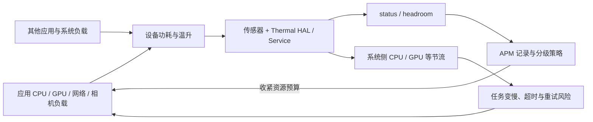

---


title: 耗电与发热监控 (Battery & Thermal)
chapter: '19'
section: '19.20'
status: finalized
applicable_versions: Android 10 (API 29) - Android 17 (API 37)
last_verified: '2026-04-25'
last_verified_against: AOSP PowerManager / PowerManagerService / BatteryStats references,
  Android Thermal API docs
confidence: high
tags:
- apm
- battery
- thermal
- wakelock
related_chapters:
- '19.0'
- '19.16'
pipeline_stage: ready-to-publish
task2b_state: fixed
task6_state: reviewed
task9_state: reviewed
sources:
- type: official
  path: https://developer.android.com/reference/android/os/PowerManager
- type: official
  path: https://source.android.com/docs/core/power/thermal-mitigation
- type: official
  path: https://developer.android.com/topic/performance/power/setup-battery-historian
---


# 耗电与发热监控 (Battery & Thermal)

耗电监控最关键的工作是把资源活动还原到业务代码。单看“电量下降了多少”远远不够：电池百分比经过 fuel gauge 平滑，瞬时电流还混合了屏幕、蜂窝基带、GPU、充放电和其他进程的影响。线上 APM 若把一段方法执行时间换算成 mAh，往往只得到一个看似精确的误差。

可执行的方案是记录资源事件：哪个任务申请了 WakeLock，哪个 Alarm 被系统投递，定位与扫描请求是否收到结果，网络传了多少字节，哪些线程持续消耗 CPU，以及这些事件发生时进程是否在后台。发热侧再记录系统 Thermal 状态和应用采取的降级动作。两组证据按单调时钟对齐后，可以定位“升温期间仍在运行的高成本任务”，但不能单凭时间重合断言它就是唯一热源。

以下内容以 Android 17 / API 37 / `android-17.0.0_r1` 为平台锚点，内核侧以 `android17-6.18-2026-06_r6` 为锚点。涉及 Android 10—17 的 API 演进会单独标出。

## 1. 建立证据等级：请求、回调、系统账本

同一个资源通常有三层证据，APM 字段名应把它们分开：

| 证据层 | 能说明什么 | 不能说明什么 | 典型数据 |
| --- | --- | --- | --- |
| 业务请求 | 应用代码表达了资源需求 | 请求已被系统接受、硬件已经工作 | `acquire()`、`setExact()`、`requestLocationUpdates()`、`startScan()` |
| 应用可见结果 | 调用成功或回调已经到达 | 整个硬件活跃窗口、精确能耗 | Alarm delivery、定位回调、扫描成功/失败、网络请求字节 |
| 系统或实验室账本 | UID、硬件状态和功耗模型下的统计 | 单次方法的普适 mAh | batterystats、Perfetto、Power Profiler、Macrobenchmark `PowerMetric` |

这一区分能避免几类常见误判：

- Alarm 设置成功只表示系统接收了计划；只有接收器或 `OnAlarmListener` 开始执行，才能确认该次 Alarm 已投递。
- 定位和扫描请求窗口是应用意图。系统可能返回缓存、批处理结果，也可能因权限、配额或硬件状态拒绝请求。
- `TrafficStats` 的 UID 字节差能确认流量变化，无法给出蜂窝 modem 的活跃时长或能耗。
- Thermal 状态来自系统对设备传感器的聚合。应用活动与状态上升同窗出现属于相关证据，还需要对照实验、系统 trace 或人群统计加强因果判断。

Android 的 `BatteryStats` 使用计时器、计数器和功耗模型维护系统账本，应用进程拿不到同等完整的数据。开发阶段可用 `dumpsys batterystats --history`、Perfetto、Power Profiler 和 Macrobenchmark 电源指标核对端侧事件。Battery Historian 仍可读取旧式 batterystats 报告，但官方文档已经注明它不再积极维护，不宜把它当作唯一验证工具。

## 2. WakeLock：公开调用与系统持有状态要分别建模

### 2.1 Android 17 源码中的对象语义

Android 17 的 `PowerManager.WakeLock` 在构造时创建一个私有 Binder `mToken`。`acquireLocked()` 将该 token、flags、tag 和归因信息交给 `IPowerManager.acquireWakeLock()`；`PowerManagerService` 以 token 识别这把锁。`release()` 使用同一 token 调用服务端释放。

应用侧有几个容易遗漏的语义：

- WakeLock 默认启用引用计数。同一对象 acquire 两次，通常需要 release 两次；`setReferenceCounted(false)` 后，一次 release 就能撤销此前的持有。
- `acquire(timeout)` 通过框架内部 Handler 安排 `release(RELEASE_FLAG_TIMEOUT)`。这个内部释放不会经过业务代码里的公开 `release()` 调用点。
- Android 17 源码会在进入服务端前递增内部计数。release 过多会触发 under-locked 异常；非引用计数模式和带 timeout 的多次 acquire 也不能用一个布尔值完整模拟。
- `isHeld()` 是公开状态观测点，适合在 timeout 到期后核查；它仍然只是一瞬间的观测，调用前后状态可能改变。

系统 token 是框架私有实现。线上 SDK 不应反射 `mToken`、`mTag`、`mInternalCount` 或 `mRefCounted`。隐藏 API 限制、R8、厂商改动和并发访问都会让这条路径脆弱，而且读取到的 token 也没有必要上传。

### 2.2 插桩点与本地对象身份

较稳妥的 ASM 方案覆盖四类公开调用：

1. `PowerManager.newWakeLock(levelAndFlags, tag)` 返回后，为该对象分配进程内 `lockId`，保存创建时已经可见的 flags 和经过清洗的 tag。
2. `setReferenceCounted(value)` 成功返回后，更新本地模式。
3. `acquire()` / `acquire(timeout)` 成功返回后，记录 acquire 事件；异常路径单独记录，不能进入“已持有”状态。
4. `release()` 成功返回后，记录 release；若抛出 under-locked 异常，保留异常类型和调用栈。

对象注册表应使用弱引用和 identity 语义，避免 APM 延长 WakeLock 生命周期，也避免把对象的 `equals()` 结果当作身份。`lockId` 只在当前进程和当前启动周期内有效。tag、业务任务名和调用栈指纹负责跨会话聚合。

下面的伪代码说明 timeout 到期后的保守处理。它刻意不访问 WakeLock 私有字段。

```kotlin
// Pseudocode: hooks run only after the original framework call returns successfully.
data class LockState(
    val lockId: Long,
    val tagHash: String,
    val levelAndFlags: Int,
    var referenceCounted: Boolean = true,
    var publicAcquireCount: Int = 0,
    var lastAcquireStack: String? = null
)

fun afterNewWakeLock(
    lock: PowerManager.WakeLock,
    levelAndFlags: Int,
    tag: String
) {
    locks.putWeakIdentity(
        lock,
        LockState(
            lockId = ids.next(),
            tagHash = Privacy.stableHash(Privacy.cleanTag(tag)),
            levelAndFlags = levelAndFlags
        )
    )
}

fun afterAcquire(
    lock: PowerManager.WakeLock,
    timeoutMs: Long?,
    callStartedElapsedMs: Long
) {
    val state = locks.get(lock) ?: return
    state.publicAcquireCount++
    state.lastAcquireStack = StackSampler.fingerprint()
    record("wakelock_acquire", state, timeoutMs)

    if (timeoutMs != null) {
        val weakLock = WeakReference(lock)
        val deadlineMs = callStartedElapsedMs + timeoutMs
        val delayMs = (
            deadlineMs + TIMEOUT_PROBE_GRACE_MS - SystemClock.elapsedRealtime()
        ).coerceAtLeast(0)
        scheduler.schedule(delayMs) {
            val current = weakLock.get() ?: return@schedule
            // The framework's timeout release is private and bypasses app call-site hooks.
            record(
                event = if (current.isHeld) "wakelock_still_held_after_timeout"
                        else "wakelock_not_held_at_timeout_probe",
                state = state,
                timeoutMs = timeoutMs
            )
        }
    }
}

fun afterRelease(lock: PowerManager.WakeLock) {
    val state = locks.get(lock) ?: return
    state.publicAcquireCount = (state.publicAcquireCount - 1).coerceAtLeast(0)
    record("wakelock_release", state, timeoutMs = null)
}
```

`publicAcquireCount` 只描述插桩看到的调用，不冒充框架内部计数。探针以调用开始时刻计算 deadline，并在 deadline 后留一个很短的宽限期，避免与框架 Handler 的 timeout Runnable 争用同一时刻。探针发现 `isHeld == false` 时，可以结束“观测到仍持有”的窗口；发现 `true` 时只说明对象当时仍被持有，可能来自另一次 acquire。进程退出、系统强制释放或漏掉的第三方调用也会造成状态不完整，报告中要标记证据来源。

### 2.3 告警规则要看场景

固定的“持有超过 30 秒就是泄漏”会产生大量误报。规则至少要区分：

- 锁等级，重点关注 `PARTIAL_WAKE_LOCK`；
- 进程前后台、前台服务类型和用户可见任务；
- 是否提供 timeout，以及 timeout 后是否仍处于 held 状态；
- 页面、Service、Worker 或 Job 的生命周期是否已经结束；
- tag/调用栈在相同设备和版本中的分位数；
- release 失败、引用计数模式变化和 acquire/release 栈是否对应。

采样栈可在首次 acquire、跨过阈值、模式变化和异常 release 时获取。每次调用都抓完整堆栈会增加 CPU 与内存开销，反过来污染耗电数据。

## 3. Alarm：设置、接受、取消、投递是四个事件

只有 `RTC_WAKEUP` 和 `ELAPSED_REALTIME_WAKEUP` 属于 wakeup alarm。它们被投递时，系统会唤醒设备并在执行 `BroadcastReceiver.onReceive()` 或 `OnAlarmListener.onAlarm()` 期间持有 partial WakeLock。非 wakeup 类型也可能让应用在设备已经醒着时执行工作，不能一概记成“唤醒设备”。

一条可追踪的 Alarm 记录至少分为四个阶段：

| 阶段 | 记录项 | 结论边界 |
| --- | --- | --- |
| schedule attempt | API、type、请求时间、窗口、exact/idle 标记、业务 tag、调用栈 | 业务发起了设置请求 |
| accepted / rejected | 正常返回或异常类型、`canScheduleExactAlarms()` | 系统是否接收本次调用；正常返回仍不代表一定投递 |
| cancel / replace | 取消时间、稳定业务 ID、替换原因 | 计划被应用撤销或同一身份的新计划覆盖 |
| delivery | callback 开始/结束、计划与投递时间差、前后台、后续 Worker/Job/网络/WakeLock | 该次回调已经到达应用 |

不要反射 `PendingIntent` 私有字段或上传完整 Intent。业务在创建 Alarm 时提供低基数的稳定 ID，例如 `daily_sync`、`user_reminder`，APM 再记录其哈希。动态时间戳、用户 ID 和随机数放进 tag 会破坏聚合，也可能泄露隐私。

### 3.1 精确 Alarm 的版本边界

Android 12 开始对精确 Alarm 引入 special app access。Android 17 的行为需要按回调载体和系统版本拆开：

| 系统与 target 条件 | `PendingIntent` 精确 Alarm | `OnAlarmListener.setExact()` |
| --- | --- | --- |
| Android 11 及以下 | 无 `SCHEDULE_EXACT_ALARM` 限制 | 无该限制 |
| Android 12—13，target 31+ | 需要声明并获得 `SCHEDULE_EXACT_ALARM`，豁免应用除外；target 33+ 可按合规场景改用 `USE_EXACT_ALARM`，面向 Android 13+ 的新安装不预授予前者 | Android 17 源码注释确认，Android 12—13 的 target 31+ 同样需要 `SCHEDULE_EXACT_ALARM`，豁免应用除外 |
| Android 14—17，target 31+ | 未获相应能力时，`setExact()`、`setExactAndAllowWhileIdle()`、`setAlarmClock()` 等调用抛 `SecurityException`，不会自动改成非精确 Alarm；target 33+ 可按合规场景选择两种权限之一 | 当前实现不要求 `SCHEDULE_EXACT_ALARM`，但进程离开有效生命周期、进入 cached 后，系统可丢弃该 listener Alarm；它不适合持久后台提醒 |

`USE_EXACT_ALARM` 安装时自动授予且用户不能撤销，但只适用于受限的闹钟、计时器、日历等核心场景，并受 Google Play 政策约束。`SCHEDULE_EXACT_ALARM` 由用户授予，也可能被用户或系统撤销。当前官方文档明确指出：面向 Android 13+ 的新安装不会预授予它；Android 14 的备份恢复也不会把已授予状态带到新设备，而已持有权限的应用在设备升级时可继续获得预授予。

权限被撤销后，系统会停止应用并取消其后续精确 Alarm。APM 应在调用前记录 `canScheduleExactAlarms()`，在调用后记录成功或 `SecurityException`，收到授权变更广播后重新核查。样本中的 `requested_exact`、`accepted` 和 `delivered` 必须是三个字段。

### 3.2 Doze 配额与后台任务

`setExactAndAllowWhileIdle()` 允许 Alarm 在 idle 中执行，但系统仍会施加每应用配额和调度限制。APM 不应根据请求时间推算一定的投递时间，也不应把一次获准调用描述为绕过 Doze。

Alarm 适合用户可见且时间语义明确的提醒。可延迟的同步、日志上传和周期拉取应优先交给 WorkManager；需要系统级约束和组件回调的任务可使用 JobScheduler。监控时也要把“入队”和“执行”分开：

- WorkManager：记录 unique work 名、约束、expedited/foreground 属性、入队时间，以及 `Worker.doWork()` / `CoroutineWorker.doWork()` 的开始、结果和重试。
- JobScheduler：记录 jobId、约束和 schedule 返回值，再记录 `JobService.onStartJob()`、`onStopJob()`、`jobFinished()`。
- Alarm 投递后启动 Worker 或 Job：用父任务 ID 连接，但不能因为二者时间接近就假定是同一调度链。

同一任务在后台短时间反复经历“投递 → 网络重试 → WakeLock → 再入队”时，才构成有代码指向的唤醒风暴证据。线上阈值应按 App 版本、设备、任务类型和用户可见性分组，避免把合规的时钟或提醒类功能与后台轮询混在一起。

## 4. 定位、扫描、网络与 CPU：不要把 API 窗口写成硬件窗口

普通应用无法直接读取 GNSS、Wi-Fi、蓝牙和蜂窝基带的完整硬件活跃状态。端侧监控应保留“请求证据”和“结果证据”，把更强的硬件结论留给系统 trace 或实验室测量。

| 资源 | 请求侧记录 | 结果侧记录 | 必须保留的边界 |
| --- | --- | --- | --- |
| 定位 | provider / request、质量、最小间隔、最大延迟、duration、前后台、调用栈 | 首次回调、回调数、末次回调、移除请求、错误/权限状态 | 请求可能被限频、批处理，回调也可能来自缓存或融合定位；请求持续时间不等于 GNSS 射频持续时间 |
| BLE 扫描 | filters、scan mode、start/stop、任务和页面 | `onScanFailed()`、结果/批次回调、首末回调 | `startScan()` 返回不证明整个窗口内硬件持续扫描；记录结果中的设备名和地址会带来隐私风险 |
| Wi-Fi 扫描 | `startScan()`、返回值、权限、前后台 | `SCAN_RESULTS_AVAILABLE_ACTION` 与 `EXTRA_RESULTS_UPDATED` | 调用可能因限频、idle 或硬件失败而返回 false；`getScanResults()` 可能给出旧结果 |
| 网络 | 请求数、协议、网络类型、重试、应用层字节，UID 流量快照 | 成功/失败、响应字节、重试原因 | `TrafficStats` 是 UID 累计字节，包含同 UID 的其他进程和请求；它看不到 modem tail time 与能量 |
| CPU | 进程 CPU 时间、线程 CPU 时间、墙钟窗口、线程栈、调度任务 | 任务完成/取消、采样分位数 | 进程 CPU 时间是较强的应用自耗证据，仍不能直接换算成整机功耗 |

### 4.1 网络的“基带唤醒”只能做风险判断

蜂窝 radio 常在数据传输后保持一段高功耗状态，具体状态机由 modem、运营商网络和厂商配置决定。高频小包、失败重试和后台轮询有放大风险，但应用 SDK 仅凭 socket 时间线或 UID 字节差无法确认某次传输让基带保持了多久。

端侧可以报告：

- 前后台移动网络发送/接收字节；
- 请求与重试次数、时间间隔、批量程度；
- 网络从 Wi-Fi 切换到蜂窝后的任务行为；
- 同一业务在弱网下增加的 CPU、WakeLock 和执行时长。

报告中的措辞应使用“蜂窝耗电风险”“后台移动网络活动”或“与 radio 活跃相关”，不要给出虚构的 modem mAh。需要确认时，用 Perfetto、设备电源轨、厂商 modem 工具或 Android Vitals 的后台移动网络指标交叉验证。

### 4.2 CPU 归因要同时保存 CPU 时间和墙钟时间

一段任务运行 30 秒，不代表它占用了 30 秒 CPU；等待网络、Binder、锁或磁盘时，墙钟继续走而 CPU 时间增长很少。反过来，多线程解码在 2 秒墙钟内可能累积更多线程 CPU 时间。

端侧样本可以保存：

```text
task_id, process_state
start_elapsed_ms, end_elapsed_ms
process_cpu_ms_delta
top_thread_cpu_ms_delta
sampled_stack_fingerprint
thermal_status_before, thermal_status_after
```

这组字段用于区分“任务持续很久”和“任务持续计算”。线程 CPU 采样应限制频率；只在进程 CPU 异常增长时抓 top 线程栈，避免监控线程本身成为热源。

### 4.3 生命周期是资源泄漏判断的参照物

页面退出、Service 停止、Worker/Job 完成后仍然存在定位请求、扫描、网络重试或高 CPU 线程，比单独的持续时长更有定位价值。每类资源都应记录 owner：

- `screen:<route>`：页面或可见会话；
- `service:<class>`：前台或后台服务；
- `worker:<unique-name>`：WorkManager 工作；
- `job:<job-id>`：JobScheduler 任务；
- `feature:<stable-id>`：跨组件的业务会话。

owner 使用开发期配置的低基数标识，不采集用户输入、位置、蓝牙设备信息、完整 URL、query 或请求体。

## 5. `BatteryManager`：适合做设备侧上下文，不适合给方法计费

Android 17 的 `BatteryManager` 对几项常用属性给出了明确单位：

- `BATTERY_PROPERTY_CURRENT_NOW`：瞬时电流，单位 µA；正数表示净电流流入电池，负数表示电池放电。
- `BATTERY_PROPERTY_CURRENT_AVERAGE`：平均电流，单位 µA；平均窗口由 fuel gauge 硬件及其配置决定。
- `BATTERY_PROPERTY_CHARGE_COUNTER`：剩余电量，单位 µAh。
- `BATTERY_PROPERTY_ENERGY_COUNTER`：剩余能量，单位 nWh。
- 电压通常来自 `ACTION_BATTERY_CHANGED` 的 `BatteryManager.EXTRA_VOLTAGE`，单位 mV。

设备不支持某项 long property 时，`getLongProperty()` 返回 `Long.MIN_VALUE`。采集端要把“不支持”作为独立状态，不能把它记成 0。不同设备的采样周期、滤波、符号和精度仍会有差异，`CURRENT_AVERAGE` 的时间窗口也没有跨设备统一保证。

这些值可用于同设备、同充电状态下的实验对照，也可作为线上低频上下文。例如比较某版本在“未充电、屏幕状态相近、网络类型一致”的会话中，资源事件与放电电流分布是否共同偏移。它们不适合：

- 用一次 `CURRENT_NOW × 电压 × 方法耗时` 计算某个方法的能量；
- 跨机型直接比较绝对电流；
- 在充电、电量校准或温控强降频期间推导业务成本；
- 高频轮询后把采样开销忽略不计。

端侧默认只需要低频、低比例采样。精确功耗评估放到固定设备、固定亮度和网络条件的实验室测试，并使用 Power Profiler、系统 trace、Macrobenchmark 电源指标或外接功耗设备。

## 6. Thermal API：状态负责保护，headroom 用于提前收敛负载

Android Thermal API 的演进可以分成四步：

| Android 版本 | 公共能力 | 使用要点 |
| --- | --- | --- |
| Android 10 / API 29 | `getCurrentThermalStatus()`、`OnThermalStatusChangedListener` | 读取和监听系统聚合的热节流等级 |
| Android 11 / API 30 | `getThermalHeadroom(forecastSeconds)` | 预测 0—60 秒后的热余量；不支持、样本不足或调用过频时可能返回 `NaN` |
| Android 15 / API 35 | `getThermalHeadroomThresholds()` | 读取设备提供的状态阈值；不是每个状态都一定有阈值 |
| Android 16—17 / API 36—37 | `OnThermalHeadroomChangedListener` | 接收当前 headroom 或阈值的显著变化；API 36 起阈值可变化 |

`getThermalHeadroom()` 返回值 1.0 表示当前或预测会到达 `THERMAL_STATUS_SEVERE` 的阈值。值大于 1.0 不对应某个确定的更高状态，不能自行线性映射成 CRITICAL 或 EMERGENCY。官方说明还指出，慢速温度传感器没有必要高于约每秒一次轮询；过频调用可能得到 `NaN`。

headroom listener 适合获知显著的当前值或阈值变化，但它不会仅因某个未来预测值变化就持续回调。需要短期预测的游戏、相机或视频业务，仍应在受控频率下调用 `getThermalHeadroom(forecastSeconds)`，并处理 `NaN`。

### 6.1 状态与动作的映射

系统状态描述的是整机热节流程度，不提供摄氏度，也不证明热量来自当前 App。应用只需把它转成统一的资源预算：

| Thermal 状态 | 资源预算示例 | 恢复条件 |
| --- | --- | --- |
| `NONE` / `LIGHT` | 正常预算；LIGHT 可停止非必要的新增预取 | 低状态稳定一段时间后恢复全部能力 |
| `MODERATE` | 降低预取、上传、解码和渲染并发，减少后台扫描 | 低于 MODERATE 且持续稳定 |
| `SEVERE` | 暂停大文件后台下载，降低视频规格和高成本特效，压低工作线程并发 | 低于 SEVERE 且持续稳定 |
| `CRITICAL` | 停止非必要计算、定位与扫描，保留用户当前操作 | 状态持续下降后分级恢复 |
| `EMERGENCY` | 保存必要状态，停止所有可推迟任务 | 只做保守恢复 |
| `SHUTDOWN` | 不依赖回调完成持久化；若收到则立即执行最小保护 | 由设备后续状态决定 |

升温时应立即缩减预算，降温时延迟恢复。状态在阈值附近来回变化时，如果每次都立即启停下载、视频和动画，会引入抖动，甚至产生更多 CPU 与网络活动。每项策略都要幂等，而且 NORMAL 预算必须显式恢复此前改变过的参数。

### 6.2 Android 17 注册行为与可恢复状态机

在 `android-17.0.0_r1` 中，`ThermalManagerService.registerThermalStatusListener()` 注册成功后会立即把当前 `mStatus` 投递给新 listener。应用再紧接着调用 `getCurrentThermalStatus()` 并手工执行一次策略，会产生重复事件，还可能与异步回调交错。Android 17 锚点下直接依赖注册后的初始回调即可。

下面的 Kotlin 结构展示串行回调、立即降级和延迟恢复。业务策略由 `ThermalPolicy.applyAll()` 统一设置，避免不同模块各自维护一份状态。

```kotlin
enum class ThermalBudget {
    NORMAL, REDUCED, SEVERE, PROTECT
}

class ThermalGuard(
    context: Context,
    private val policy: ThermalPolicy
) : Closeable {
    private val powerManager =
        context.getSystemService(PowerManager::class.java)
    private val executor =
        Executors.newSingleThreadScheduledExecutor()

    @Volatile
    private var active = false
    private var currentStatus = PowerManager.THERMAL_STATUS_NONE
    private var appliedBudget = ThermalBudget.NORMAL
    private var pendingRecovery: ScheduledFuture<*>? = null

    private val listener =
        PowerManager.OnThermalStatusChangedListener { status ->
            if (!active) return@OnThermalStatusChangedListener

            currentStatus = status
            BatteryApm.recordThermalStatus(
                status = status,
                elapsedRealtimeMs = SystemClock.elapsedRealtime(),
                foreground = ProcessState.isForeground()
            )

            pendingRecovery?.cancel(false)
            val target = budgetFor(status)
            if (target.ordinal >= appliedBudget.ordinal) {
                applyNow(target) // Tighten immediately.
            } else {
                scheduleOneRecoveryStep()
            }
        }

    fun start() {
        check(!active)
        active = true
        // Android 17 posts the current status after registration.
        powerManager.addThermalStatusListener(executor, listener)
    }

    override fun close() {
        active = false
        pendingRecovery?.cancel(false)
        powerManager.removeThermalStatusListener(listener)
        executor.shutdown()
    }

    private fun applyNow(target: ThermalBudget) {
        if (target == appliedBudget) return
        policy.applyAll(target) // NORMAL must restore every changed knob.
        BatteryApm.recordThermalPolicy(appliedBudget, target)
        appliedBudget = target
    }

    private fun scheduleOneRecoveryStep() {
        pendingRecovery = executor.schedule({
            val stableTarget = budgetFor(currentStatus)
            if (active && stableTarget.ordinal < appliedBudget.ordinal) {
                val next = ThermalBudget.values()[appliedBudget.ordinal - 1]
                applyNow(next)
                if (stableTarget.ordinal < appliedBudget.ordinal) {
                    scheduleOneRecoveryStep()
                }
            }
        }, 30, TimeUnit.SECONDS)
    }

    private fun budgetFor(status: Int): ThermalBudget = when (status) {
        PowerManager.THERMAL_STATUS_NONE,
        PowerManager.THERMAL_STATUS_LIGHT -> ThermalBudget.NORMAL
        PowerManager.THERMAL_STATUS_MODERATE -> ThermalBudget.REDUCED
        PowerManager.THERMAL_STATUS_SEVERE -> ThermalBudget.SEVERE
        else -> ThermalBudget.PROTECT
    }
}
```

示例中的 30 秒是业务迟滞参数，需要通过设备测试调整；它不是平台常量。生产实现还要处理注册失败、重复 start/close、进程生命周期和策略模块异常。回调线程只做轻量状态更新，耗时的资源切换应继续投递给对应模块。

### 6.3 发热与性能之间存在反馈路径

这张图用于说明资源活动、系统热节流和应用策略之间的关系。



APM 看到的是 E、F 与应用自己的 A，其他负载 B 通常不可见。因而“业务负载先出现、热状态随后升高、降级后状态下降”只能提高归因可信度。要确认因果，还需对照版本、设备分层、功能开关实验和系统级 trace。

## 7. Android Vitals 与端侧 APM 的互补关系

截至 2026 年 7 月，Google Play 的公开口径包括：

| Vitals 指标 | 当前公开定义 | 端侧可提供的补充 |
| --- | --- | --- |
| excessive partial wake locks | 非豁免 partial WakeLock 在 24 小时内累计达到 2 小时，统计应用处于后台或运行前台服务时的持有；当前豁免音频、定位和 JobScheduler user-initiated API 创建的锁 | tag/调用栈、业务 owner、每次持有窗口、timeout 与 release 异常 |
| stuck partial wake locks | 24 小时内至少出现一次后台持续 1 小时的 partial WakeLock | 哪个对象和生命周期没有结束 |
| excessive wakeups | 关注已触发的 `RTC_WAKEUP` / `ELAPSED_REALTIME_WAKEUP` | schedule、cancel、delivery 和后续工作之间的关系 |
| excessive background Wi-Fi scans | 后台每小时超过 4 次扫描 | 哪个业务请求、调用是否成功、结果是否更新 |
| excessive background mobile network | 后台每日收发合计达到 50 MB | 请求、重试、业务和网络类型分布 |

excessive partial wake locks 已是 core vital。当前整体 bad behavior threshold 为 5% 的会话，Play 商店可见性影响从 2026 年 3 月 1 日起生效，并按最近 28 天评估。Play 的定义、豁免和阈值可能调整，APM 规则需要版本化并定期对照官方文档，不能把表中的值写死成单次会话告警线。

Vitals 来自符合条件的 Google Play 安装和同意共享数据的用户，拥有应用进程外的系统视角；端侧 SDK 覆盖自己的分发和业务上下文。两者的分母、会话定义与隐私门槛不同，数值不应直接互相换算。合适的协作方式是用 Vitals 找版本、设备和指标趋势，再用端侧低基数任务 ID 与调用栈定位代码。

## 8. 上报、时钟与隐私边界

资源事件默认在本地聚合，普通会话只上传分钟级摘要。命中异常分位数后，再从受控比例的会话上传少量明细。建议保留：

- `elapsedRealtime`：进程内持续时间和事件排序，不受用户修改墙钟影响；
- wall clock 与 boot/session ID：跨进程、跨设备日志关联；重启后不能延续旧的 elapsed 时间线；
- App 版本、Android 版本、机型分组、进程状态、充电/屏幕/网络类型；
- 低基数业务 ID、清洗后的 tag 哈希、调用栈指纹和采样原因；
- `evidence_level=request|callback|system_validation`，防止下游把请求事件写成硬件事实。

以下数据不应进入耗电 APM：精确位置、附近 Wi-Fi SSID/BSSID、蓝牙设备名和地址、完整 URL/query、请求体、用户 ID、原始 Intent extras。调用栈上报前还要去除动态参数，并设置每日条数与字节预算。

结论模板也要与证据匹配：

- 可以说：“`worker:feed_sync` 在后台 20 分钟内被执行 18 次，其中 16 次发生移动网络重试，并在 14 个窗口观测到 partial WakeLock 仍为 held。”
- 不宜说：“`feed_sync` 消耗了 12.4 mAh，导致基带保持活跃 8 分钟。”端侧数据没有提供这两个系统级事实。

## 9. 验证清单

WakeLock 测试至少覆盖引用计数开启/关闭、连续多次 acquire、timeout 内主动 release、timeout 自动释放、release 过多和进程退出。断言对象是事件状态机与 `isHeld()` 观测，不要断言私有计数值。

Alarm 测试覆盖：

- `PendingIntent` 与 `OnAlarmListener`；
- wakeup 与 non-wakeup type；
- 精确能力已授予、未授予、撤销；
- schedule 后 cancel、同身份替换、进程进入 cached；
- Doze 下允许与不允许 idle 的投递时间；
- callback 内启动 Worker/Job、网络失败与重试。

Thermal 策略测试要模拟升温和降温序列，验证限制立即生效、恢复经过迟滞、重复状态幂等、close 后不再改策略。Android 17 的调试设备可通过 `adb shell cmd thermalservice override-status <status>` 注入状态，并用 `adb shell cmd thermalservice reset` 解除覆盖；该命令用于测试环境，不应在用户设备执行。headroom 路径还要覆盖 `NaN`、阈值缺失和 listener 不可用。

设备实验应固定亮度、刷新率、温度起点、充电状态、网络和业务输入，至少包含空载基线与功能开关对照。结果按设备和版本分层，不把某台设备的电流曲线推广成所有 Android 设备的功耗模型。

## 参考资料

### Android 17 / `android-17.0.0_r1` 源码

- [`PowerManager.java`](https://android.googlesource.com/platform/frameworks/base/+/refs/tags/android-17.0.0_r1/core/java/android/os/PowerManager.java)：WakeLock 引用计数、timeout、`isHeld()` 与 Thermal 公共 API 实现。
- [`PowerManagerService.java`](https://android.googlesource.com/platform/frameworks/base/+/refs/tags/android-17.0.0_r1/services/core/java/com/android/server/power/PowerManagerService.java)：SystemServer 的 WakeLock 管理。
- [`ThermalManagerService.java`](https://android.googlesource.com/platform/frameworks/base/+/refs/tags/android-17.0.0_r1/services/core/java/com/android/server/power/thermal/ThermalManagerService.java)：状态/headroom listener 注册、初始回调与调试命令。
- [`AlarmManager.java`](https://android.googlesource.com/platform/frameworks/base/+/refs/tags/android-17.0.0_r1/apex/jobscheduler/framework/java/android/app/AlarmManager.java)：精确 Alarm、listener 生命周期与版本注释。
- [`AlarmManagerService.java`](https://android.googlesource.com/platform/frameworks/base/+/refs/tags/android-17.0.0_r1/apex/jobscheduler/service/java/com/android/server/alarm/AlarmManagerService.java)：Alarm 调度、权限和投递服务端实现。
- [`BatteryManager.java`](https://android.googlesource.com/platform/frameworks/base/+/refs/tags/android-17.0.0_r1/core/java/android/os/BatteryManager.java)：电流、容量、能量属性的单位和不支持返回值。
- [`BatteryStatsImpl.java`](https://android.googlesource.com/platform/frameworks/base/+/refs/tags/android-17.0.0_r1/services/core/java/com/android/server/power/stats/BatteryStatsImpl.java)：系统电池统计的计时器与计数器实现。

### Kernel `android17-6.18-2026-06_r6`

- [`drivers/base/power/wakeup.c`](https://android.googlesource.com/kernel/common/+/refs/tags/android17-6.18-2026-06_r6/drivers/base/power/wakeup.c)：wakeup source 与系统 suspend 约束。
- [`kernel/power/wakelock.c`](https://android.googlesource.com/kernel/common/+/refs/tags/android17-6.18-2026-06_r6/kernel/power/wakelock.c)：内核 wakelock 兼容接口。
- [`drivers/thermal/thermal_core.c`](https://android.googlesource.com/kernel/common/+/refs/tags/android17-6.18-2026-06_r6/drivers/thermal/thermal_core.c)：thermal zone、governor 和 cooling device 核心框架。

App 层 WakeLock 经 PowerManagerService 影响系统电源约束，但不能把一个 Java WakeLock 对象机械映射成某个同名内核 wakelock 条目。Thermal 公共状态也经过传感器、Thermal HAL 和系统服务聚合；内核 thermal zone 只是链路中的一层。

### 官方文档

- [PowerManager API reference](https://developer.android.com/reference/android/os/PowerManager)
- [Schedule alarms](https://developer.android.com/develop/background-work/services/alarms)
- [Thermal mitigation](https://source.android.com/docs/core/power/thermal-mitigation)
- [BatteryManager API reference](https://developer.android.com/reference/android/os/BatteryManager)
- [Profile battery usage with Batterystats and Battery Historian](https://developer.android.com/topic/performance/power/setup-battery-historian)
- [Android vitals](https://developer.android.com/topic/performance/vitals)
- [Excessive partial wake locks](https://developer.android.com/topic/performance/vitals/excessive-wakelock)
- [Stuck partial wake locks](https://developer.android.com/topic/performance/vitals/stuck-wakelock)
- [Excessive wakeups](https://developer.android.com/topic/performance/vitals/wakeup)
- [Excessive background Wi-Fi scans](https://developer.android.com/topic/performance/vitals/bg-wifi)
- [Excessive background mobile network usage](https://developer.android.com/topic/performance/vitals/bg-network-usage)
- [Wi-Fi scanning overview](https://developer.android.com/develop/connectivity/wifi/wifi-scan)
- [Find BLE devices](https://developer.android.com/develop/connectivity/bluetooth/ble/find-ble-devices)
