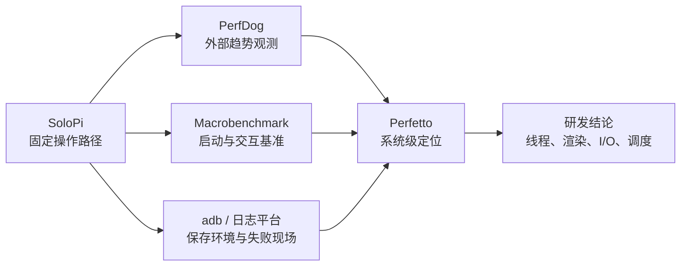

# SoloPi 与 Emmagee

<!-- outline-start -->
## 本节要点大纲

### 锚点（必须覆盖）

- 🔹 [定位] 说明 SoloPi 和 Emmagee 都偏测试现场，适合 QA 和实验室辅助,不适合作为线上 APM 主方案。
- 🔹 [SoloPi] 展开自动化录制回放、性能采集、启动耗时、设备管理、报告导出和多人协作场景。
- 🔹 [Emmagee] 说明它作为早期单 App 性能悬浮窗的历史价值,写清维护状态和现代替代方案。
- 🔹 [对比] 用表格比较采集指标、自动化能力、可维护性、权限要求、报告产物和适用阶段。
- 🔹 [启动测试] 写 SoloPi 测启动耗时的口径:冷启动、热启动、清数据、清进程、首帧或页面可交互。
- 🔹 [录制回放] 说明脚本稳定性、控件变化、网络数据、账号状态、动画等待和设备差异带来的噪声。
- 🔹 [权限检查] 列无障碍、悬浮窗、adb、录屏、存储、后台运行等权限及失败表现。
- 🔹 [QA 工具组] 说明 SoloPi、PerfDog、Macrobenchmark、adb、日志平台各自负责什么。
- 🔹 [使用建议] 给回归测试、专项测试、兼容性测试三种工作流。
- 🔹 [边界] 写清这些工具只能帮助复现和记录,根因分析仍需 Perfetto、Profiler、APM 样本。

### 扩展（可选深入）

- 🔸 增加 SoloPi 启动测试步骤模板和报告字段。
- 🔸 补一个录制回放不稳定的案例,说明如何改成更稳的等待条件。
- 🔸 对 alipay/SoloPi、NetEase/Emmagee README、维护状态和系统适配做核对。
- 🔸 增加 QA 工具组流程图,从复现、采集、报告到专项诊断。
- 🔸 补充测试账号、隐私数据和录屏素材的管理要求。

<!-- outline-end -->

## 结论：两者都属于测试现场工具

SoloPi 和 Emmagee 都不负责线上 APM 的职责。它们运行在测试设备上，擅长复现操作、观察现场和导出记录；崩溃、ANR、卡顿等问题的归因仍要回到 Perfetto、Android Studio Profiler、系统日志或应用内监控样本。

两者的现状差异很大：

- SoloPi 仍有使用价值，重点是录制回放和设备侧测试辅助。不过，公开 APK、构建链与若干采集实现都停留在较早的 Android 基线上，Android 17 / API 37 只能按“需逐机验收的测试现场工具”接入。
- Emmagee 的 README 已明确声明 Android 7.0 不受支持。它在现代系统中的主要价值是解释旧报告和研究早期外部采样方案，不应重新纳入 Android 17 测试体系。

本节以 SoloPi 源码提交 `35a4a3e3fe02deeb89df35c82dc3ba03a33f4f13`、Emmagee 源码提交 `6a382dffe74b5be6d2de78cb0c640cc67e9ce650` 为审阅基线。Android 平台上限为 Android 17 / API 37 / `android-17.0.0_r1`，涉及 `/proc` 语义时使用内核 `android17-6.18-2026-06_r6` 交叉核对。

## SoloPi 能做什么

SoloPi README 将产品能力概括为录制回放、性能测试和一机多控，同时注明开源部分只包含录制回放与性能测试，一机多控因稳定性原因尚未完整开源。因而，评估开源版时应采用下面的能力边界：

- 录制并回放一条业务路径，在不同设备上复用同一用例。
- 通过悬浮窗观察 CPU、内存、帧率、网络和电池等字段，并把采样记录导出到设备存储。
- 通过录屏和图像分析测量视觉响应耗时。
- 用设备内的 ADB 连接执行 shell 命令和输入操作。
- 导出用例或记录后交给版本库、文件服务或测试平台协作。公开源码没有提供可据以承诺的完整多人协作服务，一机多控也不等于测试资产管理平台。

这组能力很适合 QA 固定复现步骤。它不能保证采集字段在每个 Android 版本上仍保持原来的语义。

## 先分清两种 Android 17 兼容性

讨论 SoloPi 是否兼容 Android 17 时，要把两个问题分开：

1. **旧 APK 能否运行**：使用上游 v0.12.0 或旧构建，在 Android 17 设备上验收安装、授权、录制、回放和采样。它仍以 `targetSdkVersion 29` 运行，部分新行为不会按 API 37 目标应用的规则启用。
2. **源码能否迁移到 API 37**：升级构建链、`compileSdkVersion` 和 `targetSdkVersion` 后重新打包。此时需要处理现代前台服务、MediaProjection、存储、后台启动以及原生库页面大小等要求。

旧 APK 在某台设备上能打开，只证明这一组 APK、系统镜像和厂商策略可以共同运行。它不能替代 API 37 迁移验收。

### 公开构建基线

固定提交中的构建配置给出了明确边界：

| 项目 | 上游值 | 审阅结论 |
|---|---:|---|
| AGP | 4.0.2 | 属于 Android Studio 4.0 时期的构建链 |
| Gradle | README 指定 6.1.1 | 与 AGP 4.0.2 配套，不能代表 API 37 构建已通过 |
| `compileSdkVersion` | 29 | 未使用 API 37 SDK 编译 |
| `targetSdkVersion` | 29 | 未按 API 37 目标应用规则验证 |
| `minSdkVersion` | 18 | 只说明最低安装 API，不说明新系统适配程度 |
| NDK | README 指定 r16 | 原生依赖和动态插件需要单独检查 16 KB 页面兼容性 |
| ABI | `armeabi-v7a`、`arm64-v8a` | 不提供 x86 / x86_64，模拟器设备池要匹配 ABI |
| 最新 release | v0.12.0，2022-05-09 | 上游没有发布 Android 17 兼容报告 |

仓库 HEAD 的时间晚于 release，但对应提交只是 README 修改，不能据此推断运行代码已经适配新平台。

### 隐藏 API 会影响节点唯一性

SoloPi 的兼容风险不只来自权限。`AccessibilityUtil` 会反射调用非 SDK 方法 `AccessibilityNodeInfo.getSourceNodeId()`，并用返回值构建节点 ID；反射失败时降级为 `0`。多个节点都得到 `0` 后，录制界面仍可能正常显示，但节点定位和回放稳定性已经失去原有前提。

Android 9 起，非 SDK 接口按目标 API 分级限制；迁移到 API 37 时，应把这类反射视为待移除依赖。节点定位应改用公开的资源 ID、类名、文本、内容描述、窗口和边界等组合信息，并由被测 App 提供稳定的测试语义。录屏配置页对 `MediaCodecInfo.VideoCapabilities` 私有字段的反射也应改成公开的能力查询接口。异常被捕获只能防止当场崩溃，不能证明功能语义仍然正确。

### Android 17 准入清单

SoloPi 要进入 Android 17 设备池，至少通过以下关卡：

| 关卡 | 通过条件 | 常见失败证据 |
|---|---|---|
| 安装与启动 | APK 可安装，冷启动无崩溃 | `INSTALL_FAILED_*`、启动异常、依赖下载失败 |
| ADB 通道 | 设备内 ADB 连接能建立并持续执行 shell | 授权弹窗未确认、密钥失效、厂商定时断开 |
| 无障碍 | 服务已由用户开启，节点读取、点击和输入均有效 | 开关置灰、节点为空、回放点击无响应 |
| 节点唯一性 | 隐藏 API 失败后，公开选择器仍能稳定区分节点 | 多个节点 ID 为 `0`、控件重名、回放命中错误目标 |
| 悬浮窗 | 浮窗可显示、拖动和关闭 | AppOp 被拒、浮窗消失、触摸冲突 |
| MediaProjection | 每次录屏都能取得用户授权并正常结束 | 授权页未出现、虚拟显示创建失败、录屏为黑屏 |
| 后台存活 | 切换到被测应用后，服务和控制通道不被终止 | 脚本半途停止、前台服务通知消失 |
| 记录存储 | CSV、截图和视频可写入并能导出 | 旧 `/sdcard/solopi/...` 路径写入失败 |
| 指标语义 | 每个启用字段都与独立观测源对读 | 固定为 0、重复旧值、单位异常、进程归属错误 |
| 16 KB 页面 | 最终 APK 内所有原生库均兼容 16 KB 页面 | 16 KB 设备安装后启动即崩溃或动态插件加载失败 |

若计划把源码升级到 `targetSdkVersion 37`，还要按现代规则改造 MediaProjection：声明 `mediaProjection` 前台服务类型及对应权限，在前台启动服务，并为每次录制取得新的用户授权。SoloPi 当前 manifest 已声明服务类型，但固定提交只声明了通用 `FOREGROUND_SERVICE` 权限；API 34 新增的 `FOREGROUND_SERVICE_MEDIA_PROJECTION` 不在该基线中。Android 14 起，面向 API 34 及以上的应用也不能复用一次授权创建多次捕获会话。

如果最终 APK 或 `hulu_screenRecord` 动态插件包含 `.so`，应在 16 KB 设备上检查成品，不能只看主工程的 Java 代码。Android 16 提供的兼容模式也不等于原生库已经完成 16 KB 适配。

下面这组命令用于保存设备与 APK 的基础条件，避免报告只写“Android 17”：

```bash
adb devices -l
adb shell getprop ro.build.fingerprint
adb shell getprop ro.build.version.sdk
adb shell getconf PAGE_SIZE
adb shell dumpsys package com.alipay.hulu | grep -E 'versionName|versionCode|targetSdk'
adb shell settings get global animator_duration_scale
adb shell settings get global transition_animation_scale
adb shell settings get global window_animation_scale
```

这些值应和测试报告一起归档。`PAGE_SIZE=16384` 表示当前是 16 KB 页面设备；动画比例、系统镜像或 APK 版本发生变化时，结果要进入新的对比组。

## SoloPi 性能字段的源码口径

工具界面上显示同一个字段名，不代表它与 Perfetto、Framework API 或其他工具使用同一个数据源。固定提交中的主要路径如下：

| 字段 | SoloPi 源码路径 | Android 17 审阅 |
|---|---|---|
| CPU | 通过高权限 shell 读取 `/proc/stat` 与 `/proc/<pid>/stat` 的时间差 | 可以作为采样实现，但依赖 ADB 通道、PID 识别和 `/proc` 可读性；多进程切换时必须核对归属 |
| 内存 PSS | `ActivityManager.getProcessMemoryInfo(pids)` | Android 10 起，普通应用只能取得同 UID 进程信息，跨 UID 数据会是 0；SoloPi 监控目标应用时不能默认相信此字段 |
| Private Dirty | ADB 执行 `dumpsys meminfo <pid>` 并解析 `TOTAL` 文本 | 比普通应用 API 权限更高，但依赖 shell 权限和文本格式，系统升级后要做解析回归 |
| 应用网络 | 读取 `/proc/<pid>/net/dev` 的接口计数 | 该目录描述 PID 所在的网络命名空间，不是“这个进程产生的字节数”；不能直接作为进程流量结论 |
| 全局网络 | `TrafficStats.getTotalRxBytes()` / `getTotalTxBytes()` | 是设备自开机以来的全接口累计值，包含其他应用流量 |
| FPS / 卡顿 | 查找前台 Activity，再解析 `dumpsys gfxinfo <process> framestats` 等文本 | 可用于现场趋势；依赖 Activity 识别、shell 输出和窗口状态，不应替代 FrameTimeline 或 Perfetto 证据 |
| 视觉响应耗时 | MediaProjection 录屏，动态插件调用 OpenCV 对视频帧做差异分析 | 测的是点击后画面趋于稳定的视觉区间，不是 Framework TTID 或 TTFD |
| 电流 / 功率 | `BatteryManager.BATTERY_PROPERTY_CURRENT_*`，旧系统再尝试 sysfs 节点 | 设备级数据，采样周期、符号、单位和厂商实现都要实测 |

这里最容易误用的是网络字段。Linux 内核在 `/proc` 下把 `net` 指向 `self/net`，相关文件按网络命名空间组织；路径里出现 PID，只是选择了该 PID 所属的网络命名空间。大多数普通应用共享网络命名空间时，多个 PID 可能读到同一组接口计数。报告里应将此字段标成“SoloPi 网络接口估算”，没有独立验证时不要写“目标进程上传/下载量”。

内存字段也要拆开判断。SoloPi 的 PSS 调用来自自身进程，目标 App 通常属于另一个 UID；Android 10 及以上的公开 API 文档已明确限制这种跨 UID 查询。Android 17 的 `ActivityManagerService.getProcessMemoryInfo()` 源码也会比较 `callingUid` 与目标 UID：调用方无权查看其他 UID 时直接跳过该 PID，返回的 `Debug.MemoryInfo` 保持空值。若 Private Dirty 仍能通过设备内 ADB 获得，也只能证明 `dumpsys meminfo` 路径有效，不能反推 PSS 字段有效。

建议给每个指标附一个运行状态：

- `verified`：与同一时段的独立来源对读，量纲和趋势一致。
- `degraded`：能返回值，但只能作为趋势或全局值使用。
- `unavailable`：返回 0、空值、旧值或解析失败。
- `unknown`：尚无本次设备对读证据，不能进入结论。

## 启动耗时：视觉响应和系统启动要分列

SoloPi Wiki 对“启动耗时计算”的描述属于响应耗时工具：先录屏分帧，再用 OpenCV 识别操作起点与画面停止变化的时刻。固定提交中的 `RecordService` 使用 `MediaProjection`，`ScreenRecorder` 创建 `VirtualDisplay`，`VideoAnalyzer` 再把视频交给 `hulu_screenRecord` 插件计算结束帧。

这条路径适合回答“用户点击后多久看到稳定画面”。它和 Android 启动指标的边界如下：

| 指标 | 起点 | 终点 | 适用问题 |
|---|---|---|---|
| SoloPi 视觉响应 | 工具记录的点击或录制起点 | 图像差异低于阈值的稳定帧 | 用户看到页面稳定用了多久 |
| `am start -W` / `Displayed` | ActivityManager 收到启动请求 | 首帧完成显示 | 一次 Activity 启动的系统计时 |
| Macrobenchmark `timeToInitialDisplayMs` | 系统收到启动 Intent | 目标 Activity 首帧 | 可重复的 TTID 基准 |
| Macrobenchmark `timeToFullDisplayMs` | 系统收到启动 Intent | `reportFullyDrawn()` 所在或之后的首帧 | 应用声明主要内容已可用的 TTFD |

画面“停止变化”不保证页面可交互，页面可交互也不保证业务数据完整。轮播图、骨架屏、光标闪烁、视频、加载动画和系统转场都会改变图像差异。SoloPi 数字应命名为“视觉稳定耗时”，不要改名成 TTID 或 TTFD。

### 启动用例模板

每条启动用例至少记录这些字段：

| 字段 | 示例 | 为什么必须记录 |
|---|---|---|
| 启动状态 | cold / warm / hot | 三者进程与 Activity 状态不同 |
| 数据状态 | 保留数据 / 清数据后的首启 | 清数据会引入协议、引导页和缓存重建 |
| 触发入口 | 桌面图标 / deeplink / 指定 Activity | Intent 与任务栈可能不同 |
| 计时工具 | SoloPi 视觉 / Macrobenchmark / `am start -W` | 工具口径不能混算 |
| 终点 | 首帧 / 主要内容可见 / 可交互 / 视觉稳定 | 终点变化会直接改变数值 |
| 编译状态 | Baseline Profile / 部分编译 / 无预编译 | ART 编译状态会影响启动 |
| 账号与数据 | 已登录、固定测试账号、缓存快照 | 决定网络请求和页面分支 |
| 设备条件 | 指纹、温度、电量、充电状态、动画比例 | 控制热降频和系统动画噪声 |
| 样本 | 预热次数、正式轮数、P50 / P90 | 单次数字不能代表回归 |

“冷启动”和“清数据”不是同义词。冷启动要求目标进程不存在；清数据会额外改变首次启动业务路径。普通冷启动可以保留应用数据后终止目标进程再启动，首装或清数据首启应单列。

建议用 SoloPi 做现场视觉复核，用 Macrobenchmark 固定冷、温、热启动状态并输出 TTID / TTFD。两组数字可以同时放入报告，但不能相互替换。

## 录制回放要把稳定性和性能分开

脚本成功率只能说明操作路径是否完成，不能直接说明性能是否合格。录制回放本身会引入观察者效应：

- 无障碍节点读取和事件处理会改变输入时序。
- 悬浮窗会增加一个可见窗口和合成工作。
- MediaProjection、视频编码和图像分析会使用 CPU、内存与图形资源。
- 设备内 ADB 命令会产生 shell 进程、I/O 和系统服务 dump。
- 无线 ADB 与控制消息会增加网络活动。

因此，同一场景至少准备两种运行方式：一组由 SoloPi 控制路径但关闭不需要的悬浮指标和录屏，另一组使用目标采样工具采集性能。若必须同时启用 SoloPi 录屏和性能采样，再增加一组“SoloPi 全关”的基线，用差值判断工具干扰是否不可忽略。不要预设一个通用开销百分比。

### 把固定等待改成状态等待

一个常见的不稳定用例是：点击“登录”后固定等待 2 秒，再点击首页入口。网络变慢时入口尚未出现，设备变快时 2 秒又成为无效等待。

更稳的写法是：

- 等待唯一且稳定的资源 ID、文本或页面特征出现，设置明确超时。
- 登录成功后再等待加载控件消失，并确认目标控件可点击。
- 超时时保存截图、当前窗口、日志和步骤序号，避免只返回“回放失败”。
- 控件没有稳定标识时，优先推动被测 App 增加测试语义；坐标点击只保留为受控设备上的降级路径。

如果 SoloPi 当前步骤类型无法表达某个状态等待，可由外部测试编排器轮询条件，再触发下一段 SoloPi 用例。固定延时只适合动画时长完全受控的局部步骤。

### 录制回放的噪声清单

批量执行前要固定或显式记录：

- 被测 App、SoloPi、系统 WebView 与依赖服务的版本。
- 测试账号、数据快照、权限状态和登录态。
- 网络类型、代理、DNS、弱网参数和服务端实验分组。
- 系统动画比例、字体与显示大小、语言、时区和深浅色模式。
- 导航模式、屏幕刷新率、折叠状态和横竖屏。
- 键盘类型、安全输入法以及厂商金融保护功能。
- 设备电量、充电方式、温度和冷却间隔。

设备或业务条件变化后，用例成功率和性能数据都要进入新的分组。

## 权限和失败表现

SoloPi 依赖多项用户授权与设备策略。测试清单要记录“是否授权”和“失败时看到什么”：

| 权限 / 条件 | 用途 | 失败表现与处理 |
|---|---|---|
| USB 调试 / 无线 ADB | shell 命令、输入和部分性能采样 | 连接断开、命令返回空、回放中止；检查设备授权、密钥和厂商超时策略 |
| 无障碍服务 | 节点读取、事件监听和部分操作 | 找不到控件、点击落空；确认服务由用户在设置中开启 |
| 受限设置 | 允许受信任的侧载应用开启敏感设置 | Android 13 及以上可能将开关置灰；仅在确认 APK 来源后，从应用详情页的更多菜单选择“允许受限设置” |
| 悬浮窗 | 控制按钮和实时指标 | 浮窗不显示或无法操作；检查 `SYSTEM_ALERT_WINDOW` AppOp 与厂商权限页 |
| MediaProjection | 录屏、视觉响应分析 | 授权取消、录屏黑屏或会话失效；每次用例都要处理系统授权结果 |
| 前台服务 / 通知 | 录屏和长时任务存活 | 切后台后服务终止；现代目标版本需满足服务类型、权限和启动时机要求 |
| 文件访问 | CSV、截图、视频和用例导入导出 | 旧共享目录不可写；API 37 迁移应改为应用专属目录、MediaStore 或 SAF |
| 后台运行策略 | 长流程回放 | 锁屏或切后台后进程被回收；记录电池策略，不要把白名单当作产品默认条件 |
| 安全输入法 / 金融保护 | 敏感输入页面 | 密码框无法注入、支付页面拒绝操作；使用专用测试账号并遵守安全策略 |

“允许受限设置”会扩大应用读取屏幕和代替用户操作的能力，只应在隔离测试设备上对可信构建启用。不同厂商的入口名称和策略可能不同，设备清单要保留实际截图。

无线 ADB 也应放在隔离网络中使用，测试结束后关闭调试端口并撤销不再使用的授权。

## Emmagee：为什么停在历史工具区

Emmagee 最新 release 是 V2.5.1，发布于 2017-08-25；仓库 HEAD `6a382dffe74b5be6d2de78cb0c640cc67e9ce650` 的时间是 2018-03-16，内容为 README 修改。README 明确写出两条边界：

- Android 5.0 起，`getRunningTasks()` 与 `getRunningAppProcesses()` 的返回受到限制，工具无法再取得可靠的 TopActivity。
- Android 7.0 对 `/proc` 的访问限制趋严，同时工具无法通过 `top` 命令取得目标 PID，因此上游直接声明 Android 7.0 不受支持。

源码进一步说明了这些限制为何会影响整条采样链：

| Emmagee 字段 | 固定提交中的实现 | 现代平台限制 |
|---|---|---|
| 目标 PID | `getRunningAppProcesses()`，失败后解析 `top -m 100 -n 1` | 外部进程发现不再是普通应用可依赖的稳定能力 |
| TopActivity | 已废弃的 `getRunningTasks(1)` | Android 5.0 起只返回受限子集 |
| CPU | 直接读取 `/proc/<pid>/stat` 和 `/proc/stat` | Android 7.0 上游已确认不可用 |
| PSS | `getProcessMemoryInfo()` | Android 10 起跨 UID 返回 0，且采样频率受限 |
| 流量 | `TrafficStats.getUidRxBytes()` / `getUidTxBytes()`，另有旧 `/proc/uid_stat` 路径 | Android 7.0 起，查询其他 UID 会返回 `UNSUPPORTED`；旧 proc 路径也不能继续依赖 |
| 堆数据 | `su` 后执行 `dumpsys meminfo` | 依赖 Root，不属于普通测试 APK 的通用能力 |
| 电流 | 遍历多个厂商 sysfs 节点 | 节点、单位和可读权限均由设备实现决定 |

因此，Emmagee 在 Android 17 上没有“降精度后继续用”的可靠路线。旧 CSV 可以用于历史趋势说明，但报告必须保留当年的设备、系统、Emmagee 版本和字段口径；缺少这些信息时，只能把数值当作背景材料。

## 两者对照

| 维度 | SoloPi | Emmagee |
|---|---|---|
| 上游 release | v0.12.0（2022-05-09） | V2.5.1（2017-08-25） |
| 核心定位 | 录制回放、现场性能辅助、视觉响应 | 早期单 App 外部采样 |
| 自动化 | 有录制回放；一机多控未完整开源 | 无完整 UI 自动化能力 |
| 性能字段 | CPU、内存、FPS、网络、电池、响应耗时 | CPU、内存、流量、电流、启动等 |
| 报告 | 设备侧记录、CSV、截图或视频 | 悬浮窗与 CSV |
| 主要权限 | 无障碍、悬浮窗、ADB、MediaProjection、存储 | 外部进程查询、`/proc`，部分能力依赖 Root |
| Android 17 结论 | 可做受控试用，逐项验收；没有上游 API 37 认证 | 上游从 Android 7.0 起已声明不支持 |
| 建议用途 | QA 复现与辅助采集 | 旧报告解释、工具演进研究 |

## QA 工具组如何分工

下面的流程图展示从复现到归因的职责边界：



SoloPi 负责复现，PerfDog 观察设备外部趋势，Macrobenchmark 给出可重复的应用基准，ADB 与日志平台保存环境和错误，Perfetto解释时间花在何处。Emmagee 不进入 Android 17 的主流程。

| 工具 | 主要职责 | 不应负责的职责 |
|---|---|---|
| SoloPi | 录制回放、视觉响应、现场辅助字段 | 单独给出根因或线上质量结论 |
| PerfDog | FPS、CPU、功耗和温度等外部趋势 | 解释每个内部线程为何耗时 |
| Macrobenchmark | 在受控编译和启动状态下做可重复基准 | 线上真实用户分布 |
| ADB / 日志平台 | 安装、配置、命令、logcat、产物归档 | 把一次 shell 输出当长期趋势 |
| Perfetto | 调度、渲染、I/O、Binder 等系统时序 | 替代业务正确性断言 |

## 三类测试工作流

### 回归测试

用 SoloPi 固定主路径和断言，先关注“步骤能否完成”。性能门禁由 Macrobenchmark 或团队已有基准负责。回归失败时保留步骤序号、截图、窗口信息、logcat、账号和环境指纹。

### 专项性能测试

把启动、滚动、页面跳转、弱网和资源压力拆成独立用例。每个用例只改变一个主要变量，记录 SoloPi 开关状态，并使用 PerfDog 或 Perfetto 采样。启动场景用 Macrobenchmark 给出 TTID / TTFD，SoloPi 视觉耗时作为体验侧补充。

### 兼容性测试

先执行 Android 17 准入清单，再批量回放业务用例。设备池至少包含：

- Android 17 的 4 KB 页面设备或镜像。
- Android 17 的 16 KB 页面设备或镜像。
- 一台接近 AOSP 的设备，以及业务覆盖率高的厂商 ROM。
- 需要维持历史对比时，再保留 Android 14、15、16 的代表设备；这些版本只能作为演进样本，结论上限仍是 Android 17。

权限、MediaProjection、无线 ADB、后台存活和指标语义要分别打勾。任何一项失败，都不能用“脚本整体跑完”掩盖。

## 报告模板

一份可复查的报告至少包含：

| 分组 | 必填内容 |
|---|---|
| 工具 | SoloPi APK 版本、源码提交、插件版本、是否自行改包 |
| 被测对象 | 包名、版本号、提交、构建类型、ABI |
| 设备 | 型号、build fingerprint、API、页面大小、刷新率 |
| 条件 | 电量、温度、充电、网络、动画、账号与数据快照 |
| 脚本 | 用例版本、入口、步骤、等待条件、超时、正式轮数 |
| 自动化结果 | 成功率、失败步骤、截图、日志 |
| 性能结果 | 指标来源、口径、P50 / P90、原始文件 |
| 交叉验证 | PerfDog、Macrobenchmark、Perfetto 或系统命令的对应证据 |
| 降级项 | `degraded`、`unavailable`、`unknown` 字段及原因 |
| 隐私 | 测试账号、录屏脱敏、产物权限、保存期限 |

录屏、截图和 CSV 可能包含账号、消息、订单、定位或设备标识。只使用专用测试账号；导出前做脱敏；产物放入受控存储并设置访问权限和删除期限。不要把无线 ADB 私钥、令牌或生产数据打进用例包。

## 参考资料

- [SoloPi README（固定提交）](https://github.com/alipay/SoloPi/blob/35a4a3e3fe02deeb89df35c82dc3ba03a33f4f13/README.md)
- [SoloPi 根构建配置：AGP、compileSdk 与 targetSdk（固定提交）](https://github.com/alipay/SoloPi/blob/35a4a3e3fe02deeb89df35c82dc3ba03a33f4f13/src/build.gradle)
- [SoloPi 应用构建配置：minSdk、ABI（固定提交）](https://github.com/alipay/SoloPi/blob/35a4a3e3fe02deeb89df35c82dc3ba03a33f4f13/src/portal/build.gradle)
- [SoloPi FPS 采集实现（固定提交）](https://github.com/alipay/SoloPi/blob/35a4a3e3fe02deeb89df35c82dc3ba03a33f4f13/src/shared/src/main/java/com/alipay/hulu/shared/display/items/util/FpsUtil.java)
- [SoloPi CPU 采集实现（固定提交）](https://github.com/alipay/SoloPi/blob/35a4a3e3fe02deeb89df35c82dc3ba03a33f4f13/src/shared/src/main/java/com/alipay/hulu/shared/display/items/CPUTools.java)
- [SoloPi 内存采集实现（固定提交）](https://github.com/alipay/SoloPi/blob/35a4a3e3fe02deeb89df35c82dc3ba03a33f4f13/src/shared/src/main/java/com/alipay/hulu/shared/display/items/MemoryTools.java)
- [SoloPi 网络采集实现（固定提交）](https://github.com/alipay/SoloPi/blob/35a4a3e3fe02deeb89df35c82dc3ba03a33f4f13/src/shared/src/main/java/com/alipay/hulu/shared/display/items/NetworkTools.java)
- [SoloPi 电流与功率采集实现（固定提交）](https://github.com/alipay/SoloPi/blob/35a4a3e3fe02deeb89df35c82dc3ba03a33f4f13/src/shared/src/main/java/com/alipay/hulu/shared/display/items/BatteryInfo.java)
- [SoloPi 无障碍节点 ID 反射实现（固定提交）](https://github.com/alipay/SoloPi/blob/35a4a3e3fe02deeb89df35c82dc3ba03a33f4f13/src/shared/src/main/java/com/alipay/hulu/shared/node/tree/accessibility/util/AccessibilityUtil.java)
- [SoloPi 录屏与视频分析实现（固定提交）](https://github.com/alipay/SoloPi/blob/35a4a3e3fe02deeb89df35c82dc3ba03a33f4f13/src/app/src/main/java/com/alipay/hulu/screenRecord/VideoAnalyzer.java)
- [SoloPi MediaProjection 与 VirtualDisplay 实现（固定提交）](https://github.com/alipay/SoloPi/blob/35a4a3e3fe02deeb89df35c82dc3ba03a33f4f13/src/app/src/main/java/com/alipay/hulu/screenRecord/ScreenRecorder.java)
- [SoloPi 性能工具 Wiki](https://github.com/alipay/SoloPi/wiki/Performance)
- [SoloPi v0.12.0 release](https://github.com/alipay/SoloPi/releases/tag/v0.12.0)
- [Emmagee README（固定提交）](https://github.com/NetEase/Emmagee/blob/6a382dffe74b5be6d2de78cb0c640cc67e9ce650/README.md)
- [Emmagee 进程发现实现（固定提交）](https://github.com/NetEase/Emmagee/blob/6a382dffe74b5be6d2de78cb0c640cc67e9ce650/src/com/netease/qa/emmagee/utils/ProcessInfo.java)
- [Emmagee 流量实现（固定提交）](https://github.com/NetEase/Emmagee/blob/6a382dffe74b5be6d2de78cb0c640cc67e9ce650/src/com/netease/qa/emmagee/utils/TrafficInfo.java)
- [Android 17 面向 API 37 应用的行为变更](https://developer.android.com/about/versions/17/behavior-changes-17)
- [Android 非 SDK 接口限制](https://developer.android.com/guide/app-compatibility/restrictions-non-sdk-interfaces)
- [Android 应用启动时间、TTID 与 TTFD](https://developer.android.com/topic/performance/vitals/launch-time)
- [Macrobenchmark 使用说明](https://developer.android.com/topic/performance/benchmarking/macrobenchmark-overview)
- [ActivityManager.getProcessMemoryInfo() 的跨 UID 限制](https://developer.android.com/reference/android/app/ActivityManager#getProcessMemoryInfo(int%5B%5D))
- [Android 17 `ActivityManagerService.getProcessMemoryInfo()` 源码](https://android.googlesource.com/platform/frameworks/base/+/android-17.0.0_r1/services/core/java/com/android/server/am/ActivityManagerService.java)
- [TrafficStats.getUidRxBytes() 的跨 UID 限制](https://developer.android.com/reference/android/net/TrafficStats#getUidRxBytes(int))
- [Android MediaProjection 指南](https://developer.android.com/media/grow/media-projection)
- [Android 14 MediaProjection 会话授权变更](https://developer.android.com/about/versions/14/behavior-changes-14#media-projection)
- [Android 16 KB 页面兼容指南](https://developer.android.com/guide/practices/page-sizes)
- [Android 帮助：允许受限设置](https://support.google.com/android/answer/12623953)
- [Linux `proc_net` 的网络命名空间实现（android17-6.18-2026-06_r6）](https://android.googlesource.com/kernel/common/+/refs/tags/android17-6.18-2026-06_r6/fs/proc/proc_net.c)
