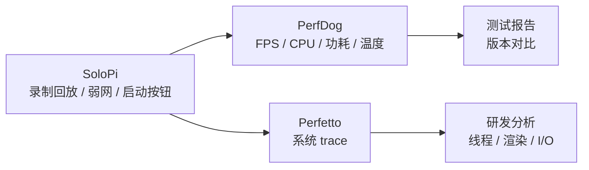

# SoloPi 与 Emmagee

<!-- outline-start -->
## 本节要点大纲

### 锚点（必须覆盖）

- 🔹 [定位] 说明 SoloPi 和 Emmagee 都偏测试现场，适合 QA 和实验室辅助,不适合作为线上 APM 主方案。
- 🔹 [SoloPi] 展开自动化录制回放、性能采集、启动耗时、设备管理、报告导出和多人协作场景。
- 🔹 [Emmagee] 说明它作为早期单 App 性能悬浮窗的历史价值,写清维护状态和现代替代方案。
- 🔹 [对比] 用表格比较采集指标、自动化能力、可维护性、权限要求、报告产物和适用阶段。
- 🔹 [启动测试] 写 SoloPi 测启动耗时的口径:冷启动、热启动、清数据、清进程、首帧或页面可交互。
- 🔹 [录制回放] 说明脚本稳定性、控件变化、网络数据、账号状态、动画等待和设备差异带来的噪声。
- 🔹 [权限检查] 列无障碍、悬浮窗、adb、录屏、存储、后台运行等权限及失败表现。
- 🔹 [QA 工具组] 说明 SoloPi、PerfDog、Macrobenchmark、adb、日志平台各自负责什么。
- 🔹 [使用建议] 给回归测试、专项测试、兼容性测试三种工作流。
- 🔹 [边界] 写清这些工具只能帮助复现和记录,根因分析仍需 Perfetto、Profiler、APM 样本。

### 扩展（可选深入）

- 🔸 增加 SoloPi 启动测试步骤模板和报告字段。
- 🔸 补一个录制回放不稳定的案例,说明如何改成更稳的等待条件。
- 🔸 对 alipay/SoloPi、NetEase/Emmagee README、维护状态和系统适配做核对。
- 🔸 增加 QA 工具组流程图,从复现、采集、报告到专项诊断。
- 🔸 补充测试账号、隐私数据和录屏素材的管理要求。

### 流水线加工要求

- 任何测试结论都要写明操作脚本和设备条件。
- 历史工具必须写维护风险和替代工具。
- 自动化能力要和性能采集分开写,避免把脚本成功率当性能结论。

### OpenClaw 加工指引

> **锚点**是最低覆盖要求,加工时必须逐条落实并标注验证结果。
> **扩展**视素材丰富程度选择性深入。
> 如果从 Obsidian 素材或 AOSP 源码中发现大纲未列出但与本节强相关的知识点,
> 可**就地插入**最相关的锚点之后,并用 `[自动发现]` 标注,方便后续 review。
> 锚点内容需 L1/L2 验证,扩展内容至少 L2 验证,自动发现内容至少标注来源。
<!-- outline-end -->

## SoloPi 和 Emmagee 都偏测试现场

SoloPi 和 Emmagee 都不是典型线上 APM。它们更适合测试人员在设备上观察性能、录制操作或输出测试报告。

SoloPi 更新、更偏自动化测试工具；Emmagee 更老,重点是单 App 的 CPU、内存、流量、启动、电流和悬浮窗数据。放在同一节，是因为它们都回答"测试现场怎么快速拿数据"。

## SoloPi：自动化加性能采集

SoloPi 是支付宝开源的无线化、非侵入式 Android 自动化工具。README 公开的主能力是录制回放、性能测试、一机多控；同一页也写明开源部分当前只包含录制回放和性能测试，一机多控暂未完整开源。

它适合 QA 和实验室做三类事情：

- 固定一条业务操作路径。
- 在多台设备上复现同一套步骤。
- 把启动耗时、资源指标和现场图表放在同一套工具里。

## SoloPi 的兼容性边界

SoloPi 公开仓库暴露出的构建基线比较老：根工程使用 AGP 4.0.2，README 写明 Android Studio 4.0、Gradle 6.1.1、TargetApi 29、MinimumApi 18；GitHub latest release 仍是 v0.12.0（2022-05）。这套基线直接影响 Android 12 之后的验收方式。

上游维护状态也要放进工具选型：公开 release 停在 2022-05，仓库 `targetSdkVersion` 为 29，公开构建链没有跟进 Android 14+ 前台服务类型、后台启动 Activity、受限设置等行为变化。SoloPi 可以用来固定操作路径，但不要作为自动化测试的唯一依赖；关键回归要保留 adb、Macrobenchmark、PerfDog、Perfetto 等可替代路径。

| 项目 | 上游公开基线 | 对测试的影响 |
|---|---|---|
| AGP | 4.0.2 | 构建链停留在 Android Studio 4.0 时代，后续平台行为变化没有在仓库里公开成新基线 |
| `compileSdkVersion` / `targetSdkVersion` | 29 | Android 12+ 的无障碍、悬浮窗、前台服务、后台弹窗、无线调试行为要逐机验证 |
| `minSdkVersion` | 18 | 老设备仍可安装，现代兼容性不等于已验证 |
| latest release | v0.12.0（2022-05） | 近年平台改动后的兼容结果表没有上游发布说明 |

可以按下面的节奏判断：

| 平台段 | 当前判断 | 使用方式 |
|---|---|---|
| Android 4.3 - 11 | 与公开构建基线更接近 | 可作为主要试用区间，仍要检查 ROM 权限差异 |
| Android 12 - 15 | 需要专项兼容性回归 | 先验收录制、回放、悬浮窗、无障碍、无线 ADB，再决定是否纳入日常工具链 |

性能工具部分可以记录待测应用指标，支持悬浮窗实时观察，也可以录制性能数据后看图表。启动耗时工具支持双点标记和广播调用，适合和 UI 自动化脚本配合。它的价值在于把操作路径和现场数据放到同一台设备上完成。

## Emmagee：早期单 App 性能悬浮窗

Emmagee 是网易早期开源的 Android 性能测试工具。README 写明它可监控指定 App 的 CPU、内存、流量、电池电流与状态、启动时间，并输出悬浮窗与 CSV 报告。

> **Deprecated / 不可用边界**：Emmagee 不应作为 Android 8-17 主力工具。README 已声明 Android 7.0 不支持；Android 8+ 对外部进程信息读取继续收紧，Emmagee 这类外部采样工具更难获得可信 CPU、内存和 TopActivity 数据，现代设备上的结果可能是 0、空值或错误值。正文只把它作为历史工具和旧报告对照材料。

版本边界要按 README 原文写：Android 5.0 以上 `getRunningTasks()` 和 `getRunningAppProcesses()` 行为受限，拿不到 TopActivity；Android 7.0 上 `/proc` 访问和 `TOP` 命令拿 pid 都受限，README 直接写出“7.0 can not be supported”。这一条比“精度下降”更强，含义就是官方已经把 Android 7.0 列为不支持平台。

所以 Emmagee 适合放在历史工具和旧流程兼容区，不适合写成 Android 8-17 的现代主方案。现代项目如果还保留它，先看目标 ROM 上哪些指标还能拿到，再决定是否只保留 CSV 导出或启动时间等少数字段。

## 两者对比

| 工具 | 维护状态 | 采集 / 自动化能力 | 报告产物 | 版本边界 | 适合阶段 |
|---|---|---|---|---|---|
| SoloPi | latest release v0.12.0（2022-05），仓库基线 targetSdk 29 | 录制回放、性能指标、启动耗时、弱网 / 压力场景；一机多控在 README 中展示，但开源部分暂未完整放出 | 设备侧图表、操作回放、测试记录 | minSdk 18；Android 12-15 需专项验证 | QA 回归、专项测试、兼容性测试 |
| Emmagee | latest release V2.5.1（2017-08），历史维护状态 | 单 App CPU / 内存 / 流量 / 电流 / 启动时间悬浮窗与 CSV | 悬浮窗、CSV | README 声明 Android 7.0 起不支持 | 历史报告对照、旧设备存量流程 |

测试现场工具的优势是操作成本低。它们的局限是指标来源常受系统限制，尤其是 CPU、进程、TopActivity、电流等数据，不同 Android 版本和厂商 ROM 下差异很大。

## 使用建议

按工作流分配更稳妥：

- 回归测试：用 SoloPi 固定操作路径，产出设备侧报告；关键回归再用 PerfDog 或 Macrobenchmark 复核。
- 专项测试：把启动、弱网、资源压力、录制回放拆开跑，性能采样以 Perfetto、PerfDog 或系统 trace 为准。
- 兼容性测试：先做权限与脚本稳定性验收，再批量回放；Android 12-15 先跑一轮工具兼容性清单。

Emmagee 只建议留在旧设备或历史报告对照流程里，不再承担现代 Android 主力测试入口。

## SoloPi 的启动耗时测试

SoloPi 的启动耗时工具适合 QA 快速测用户感知启动。要让数据能和 Macrobenchmark、`am start -W` 或线上启动指标对读，记录模板要固定。

SoloPi 的启动耗时口径偏视觉侧。典型路径是 MediaProjection 录屏，按帧截取启动过程，再用 OpenCV 做图像相似度或变化率判断：起点来自点击、广播或无障碍事件时间戳，终点是画面从启动态进入稳定页面的帧。记录结果时把它写成“视觉首屏 / 页面稳定”口径，和系统 Activity 启动耗时、Macrobenchmark 的 `timeToFullDisplayMs` 分列。

| 必填字段 | 允许值 / 示例 | 说明 |
|---|---|---|
| 测试类型 | 冷启动 / 热启动 | 先区分是否走冷进程 |
| 清数据 | 是 / 否 | 影响首启路径和缓存 |
| 清进程 | 是 / 否 | 决定是否为真正冷启动 |
| 起点 | 点击桌面图标 / `adb shell am start` / deeplink | 起点不同，不能横比 |
| 终点 | 首帧 / 首屏数据可见 / 页面可交互 | 终点口径要固定 |
| 触发方式 | 人工双点 / 广播触发 | 人工触发要写界面状态 |
| 设备条件 | 机型、ROM、版本、电量、温度 | 这些条件会影响结果 |
| 备注 | 登录态、弱网、预拉起、动画设置 | 用来解释异常值 |

同一轮测试至少固定一组组合。例如“冷启动 + 清数据 + 清进程 + 点击桌面图标 + 页面可交互 + 广播触发”。组合变了，数字就要分组存档，不和上一组混算。

人工双点适合现场排查；需要稳定回归时，优先使用广播或脚本触发，减少人工反应时间带来的波动。

## 录制回放的性能陷阱

录制回放能稳定操作路径,但也可能改变性能环境:

- 辅助功能和注入事件可能改变输入时序。
- 悬浮窗会参与窗口合成。
- 工具本身占用 CPU、内存和网络。
- 无线 ADB 或控制通道可能带来额外系统负载。
- Android 13+ 上如果 FPS 依赖 `dumpsys SurfaceFlinger` 文本解析，先用 FrameMetrics、`dumpsys gfxinfo` 或 Perfetto 复核字段可用性。

SoloPi 也会借助本地 ADB / 无线调试能力执行部分设备侧动作。这个能力解释了它免 Root、非侵入的使用方式，也带来连接稳定性和后台保活风险。

SoloPi 更适合作为“稳定操作路径”的工具。正式性能报告用 SoloPi 控制操作路径，用 PerfDog、Perfetto 或系统指标采样。

## Emmagee 的历史价值

Emmagee 的 README 里明确提到 Android 5.0 和 Android 7.0 后的限制。这是理解 Android 性能工具演进的好例子:早期工具能读 `/proc`、能看其他进程、能拿 top activity;系统权限收紧后,这些能力逐渐失效。

从 Emmagee 可以学到两个原则:

- 依赖非公开或宽松系统行为的工具,会随 Android 版本升级失效。
- 进程级外部采样越来越难,线上监控更需要 SDK 内部埋点和官方 API。

这也是为什么现代章节要更多使用 JankStats、FrameMetrics、ApplicationExitInfo、ProfilingManager 这类官方入口。

## QA 工具链组合

更实用的组合是:

SoloPi 负责把操作路径固定,PerfDog 负责外部指标,Perfetto 负责根因分析。Emmagee 如果仍在存量流程里,只适合作为辅助参考。

## 设备权限检查

使用 SoloPi 前要把权限和失败表现一起验收：

| 权限 / 条件 | 失败表现 |
|---|---|
| USB 调试 / 无线 ADB | 设备断连，回放中断，启动按钮无法触发 |
| 无障碍 | 录制能开始，回放点击落空，找不到控件 |
| Android 13+ 受限设置 | 无障碍开关置灰，提示“为了您的安全，此设置目前不可用”；进入 SoloPi 应用详情页，右上角三点选择“允许受限设置”后再开启无障碍 |
| 悬浮窗 | 实时指标窗不显示，性能录制结果为空 |
| 后台弹窗 / 后台运行 | 切后台后脚本被系统杀掉，长流程回放中断 |
| 录屏 / 截图 | 报告缺少视频或截图证据 |
| 安全输入法 / 金融保护模式 | 密码框无法输入，支付页步骤失败 |

这些前置条件没过时，测试失败很容易被误判成 App 性能问题。