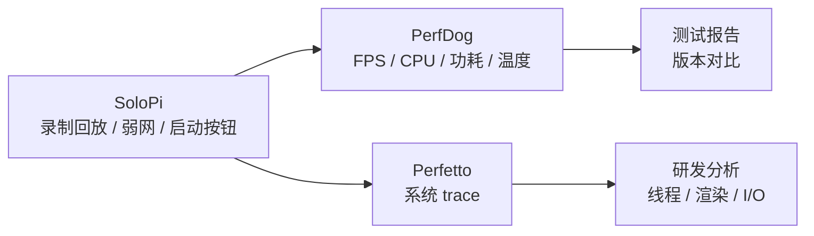

# SoloPi 与 Emmagee

<!-- outline-start -->
## 本节要点大纲

### 锚点（必须覆盖）

- 🔹 [定位] 说明 SoloPi 和 Emmagee 都偏测试现场，适合 QA 和实验室辅助,不适合作为线上 APM 主方案。
- 🔹 [SoloPi] 展开自动化录制回放、性能采集、启动耗时、设备管理、报告导出和多人协作场景。
- 🔹 [Emmagee] 说明它作为早期单 App 性能悬浮窗的历史价值,写清维护状态和现代替代方案。
- 🔹 [对比] 用表格比较采集指标、自动化能力、可维护性、权限要求、报告产物和适用阶段。
- 🔹 [启动测试] 写 SoloPi 测启动耗时的口径:冷启动、热启动、清数据、清进程、首帧或页面可交互。
- 🔹 [录制回放] 说明脚本稳定性、控件变化、网络数据、账号状态、动画等待和设备差异带来的噪声。
- 🔹 [权限检查] 列无障碍、悬浮窗、adb、录屏、存储、后台运行等权限及失败表现。
- 🔹 [QA 工具组] 说明 SoloPi、PerfDog、Macrobenchmark、adb、日志平台各自负责什么。
- 🔹 [使用建议] 给回归测试、专项测试、兼容性测试三种工作流。
- 🔹 [边界] 写清这些工具只能帮助复现和记录,根因分析仍需 Perfetto、Profiler、APM 样本。

### 扩展（可选深入）

- 🔸 增加 SoloPi 启动测试步骤模板和报告字段。
- 🔸 补一个录制回放不稳定的案例,说明如何改成更稳的等待条件。
- 🔸 对 alipay/SoloPi、NetEase/Emmagee README、维护状态和系统适配做核对。
- 🔸 增加 QA 工具组流程图,从复现、采集、报告到专项诊断。
- 🔸 补充测试账号、隐私数据和录屏素材的管理要求。

### 流水线加工要求

- 任何测试结论都要写明操作脚本和设备条件。
- 历史工具必须写维护风险和替代工具。
- 自动化能力要和性能采集分开写,避免把脚本成功率当性能结论。

### OpenClaw 加工指引

> **锚点**是最低覆盖要求,加工时必须逐条落实并标注验证结果。
> **扩展**视素材丰富程度选择性深入。
> 如果从 Obsidian 素材或 AOSP 源码中发现大纲未列出但与本节强相关的知识点,
> 可**就地插入**最相关的锚点之后,并用 `[自动发现]` 标注,方便后续 review。
> 锚点内容需 L1/L2 验证,扩展内容至少 L2 验证,自动发现内容至少标注来源。
<!-- outline-end -->

## SoloPi 和 Emmagee 都偏测试现场

SoloPi 和 Emmagee 都不是典型线上 APM。它们更适合测试人员在设备上观察性能、录制操作或输出测试报告。

SoloPi 更新、更偏自动化测试工具；Emmagee 更老,重点是单 App 的 CPU、内存、流量、启动、电流和悬浮窗数据。放在同一节，是因为它们都回答"测试现场怎么快速拿数据"。

## SoloPi：自动化加性能采集

SoloPi 是支付宝开源的无线化、非侵入式 Android 自动化工具。README 中列出三项主要能力:录制回放、性能测试、一机多控,并提到新增鸿蒙分支。

性能工具部分可以记录待测应用指标,支持悬浮窗实时观察,也可以录制性能数据后查看图表。它还支持 CPU、内存、网络环境限制,用来复现低性能或弱网场景。启动耗时计算工具可以通过两次点击获取更贴近用户感受的启动耗时,并支持广播调用,便于和 UI 自动化测试结合。

这类能力很适合 QA 流程:

- 录制一条关键业务路径。
- 在不同机型上回放。
- 同时记录性能指标。
- 输出可对比的图表或报告。

它的重点是把测试操作和性能数据一起放进设备侧工具里。

## Emmagee：早期单 App 性能悬浮窗

Emmagee 是网易早期开源的 Android 性能测试工具。README 描述它可以监控指定 App 的 CPU、内存、网络流量、电池电流和状态、启动时间,并能在悬浮窗里显示实时进程状态,输出 CSV 报告。

它的局限也写在 README 里:Android 5.0 以上 `getRunningTasks()` 和 `getRunningAppProcesses()` 行为受限;Android 7.0 之后 `/proc` 访问被限制,目标进程 pid 获取也受影响。最新 release 停在 2017 年。

所以 Emmagee 更适合作为历史工具和思路参考。新 Android 版本上直接使用,很多指标可能失效或不准。

## 两者对比

| 工具 | 适合场景 | 主要边界 |
|---|---|---|
| SoloPi | UI 自动化、录制回放、性能测试、弱网和压力复现 | 依赖设备权限和 ADB 环境,指标仍需与 Perfetto 交叉验证 |
| Emmagee | 老设备单 App 性能观察、CSV 报告、悬浮窗监控 | Android 7.0+ 受系统限制明显,维护状态较旧 |

测试现场工具的优势是操作成本低。它们的问题是指标来源常受系统限制,尤其是 CPU、进程、top activity、电流等数据,不同 Android 版本和厂商 ROM 下差异很大。

## 使用建议

SoloPi 更适合放进测试团队工具链,尤其是需要录制回放、弱网、启动耗时和多机回归时。它产出的性能数据可以作为回归入口,但重大结论要用 Perfetto、Profiler 或专用 Benchmark 复核。

Emmagee 不建议作为现代项目主工具。若存量流程仍在用,要先确认目标 Android 版本上每个指标是否仍然可信。对于 Android 8 及以上设备,很多老式进程采样方法已经不适合做严肃性能判断。

## SoloPi 的启动耗时测试

SoloPi 的启动耗时工具适合 QA 快速测"用户感知启动"。它通常通过人工或广播标记开始和结束点,得到一次操作路径下的启动耗时。

需要重点说明：

- 起点要固定:点击桌面图标、adb 启动、从其他 App 跳转,口径不同。
- 终点要固定:首帧、首屏数据可见、可交互,口径不同。

如果终点由测试人员手动触发标记，报告里要写明"触发时看到的界面状态"。否则同一个数值无法和 Macrobenchmark、`am start -W` 或线上启动指标比较。

## 录制回放的性能陷阱

录制回放能稳定操作路径,但也可能改变性能环境:

- 辅助功能和注入事件可能改变输入时序。
- 悬浮窗会参与窗口合成。
- 工具本身占用 CPU、内存和网络。
- 无线 ADB 或控制通道可能带来额外系统负载。

所以 SoloPi 更适合作为"稳定操作路径"的工具,而不是最终性能采样源。正式报告可以用 SoloPi 控制操作,用 PerfDog、Perfetto 或系统指标采样。

## Emmagee 的历史价值

Emmagee 的 README 里明确提到 Android 5.0 和 Android 7.0 后的限制。这是理解 Android 性能工具演进的好例子:早期工具能读 `/proc`、能看其他进程、能拿 top activity;系统权限收紧后,这些能力逐渐失效。

从 Emmagee 可以学到两个原则:

- 依赖非公开或宽松系统行为的工具,会随 Android 版本升级失效。
- 进程级外部采样越来越难,线上监控更需要 SDK 内部埋点和官方 API。

这也是为什么现代章节要更多使用 JankStats、FrameMetrics、ApplicationExitInfo、ProfilingManager 这类官方入口。

## QA 工具链组合

更实用的组合是:

SoloPi 负责把操作路径固定,PerfDog 负责外部指标,Perfetto 负责根因分析。Emmagee 如果仍在存量流程里,只适合作为辅助参考。

## 设备权限检查

使用 SoloPi 前要检查设备权限:

- USB 调试和无线调试是否稳定。
- 厂商 ROM 是否限制后台弹窗、辅助功能、悬浮窗。
- 输入法、安全键盘、金融保护模式是否影响录制回放。
- 目标 App 是否禁止截图、录屏或辅助功能。

这些限制不解决,测试失败很容易被误判成 App 性能问题。
