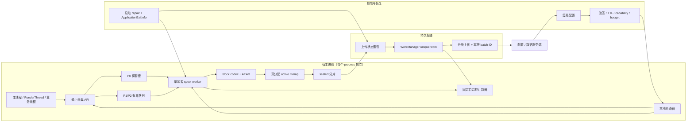

---


status: finalized
title: 千万级 DAU 的 APM 端侧架构
chapter: '19'
section: '19.22'
applicable_versions: Android 8 (API 26) - Android 17 (API 37)
last_verified: '2026-08-14'
last_verified_against: 'Android 17 ApplicationExitInfo, ProfilingManager/ProfilingTrigger, ComponentCallbacks2, storage and WorkManager documentation; kotlinx.coroutines 1.11.0 Channel contract; current Java mmap APIs; pinned Mars and Logan source revisions'
confidence: medium
tags:
- apm
- architecture
- mmap
- protobuf
- reliability
related_chapters:
- '19.0'
- '19.02'
- '19.07'
- '19.10'
- '19.18'
- '19.19'
- '19.21'
sources:
- type: source
  path: https://raw.githubusercontent.com/Tencent/mars/master/mars/libraries/mars_android_sdk/src/main/java/com/tencent/mars/xlog/Xlog.java
- type: source
  path: https://raw.githubusercontent.com/Meituan-Dianping/Logan/master/README.md
- type: official
  path: https://raw.githubusercontent.com/protocolbuffers/protobuf/main/java/README.md
- type: official
  path: https://raw.githubusercontent.com/protocolbuffers/protobuf/main/java/lite.md
- type: source
  path: https://github.com/google/flatbuffers
- type: official
  path: https://perfetto.dev/docs/instrumentation/tracing-sdk
- type: official
  path: https://developer.android.com/topic/performance/background-optimization
- type: official
  path: https://developer.android.com/reference/android/app/ApplicationExitInfo
- type: official
  path: https://developer.android.com/studio/profile/capture-heap-dump
- type: official
  path: https://developer.android.com/reference/android/os/ProfilingTrigger
- type: official
  path: https://developer.android.com/reference/android/content/ComponentCallbacks2
- type: official
  path: https://developer.android.com/reference/java/nio/MappedByteBuffer
- type: official
  path: https://developer.android.com/develop/background-work/background-tasks/persistent/how-to/long-running
- type: official
  path: https://kotlinlang.org/api/kotlinx.coroutines/kotlinx-coroutines-core/kotlinx.coroutines.channels/-send-channel/try-send.html
pipeline_stage: ready-to-publish
task6_state: reviewed
task9_state: reviewed
task2b_state: 'fixed'
---

# 千万级 DAU 的 APM 端侧架构

DAU（Daily Active Users，日活跃用户数）达到千万级时，APM SDK（应用性能监控软件开发包）在单台设备上的职责并没有改变，但极小比例的缺陷也会影响大量用户。SDK 的压力峰值往往与宿主故障同时出现：卡顿会增加慢帧事件，网络失败会积压待传批次，内存异常可能触发更高采样率或更重的诊断采集，进程退出又要求保住故障前的少量上下文。端侧架构必须按这个峰值设计，不能只看平稳期的平均流量。

平台源码固定在 Android 17 / API 37 / `android-17.0.0_r1`，涉及 Linux 虚拟内存与文件回写时固定在 `android17-6.18-2026-06_r6`。Android 8—17 的应用都能采用以下队列、分片和上传模型；`ApplicationExitInfo`、`ProfilingManager` 等能力再按 API level 分支。

“千万级 DAU”不会让单台手机的队列自动变大，它改变的是发布风险：一个只在 0.1% 设备出现的采集器回归也会覆盖大量用户；没有随机错峰的重试会在同一时刻形成请求峰值；目标范围过宽的远程指令会迅速消耗系统预算和用户流量。因此端侧需要同时控制单进程开销、跨进程一致性，以及一次配置或版本发布能影响的设备范围。

## 1. 端侧引擎的职责与不可破坏约束

端侧负责采集、准入、短期存储、受控上传和远程配置执行；聚合、长期检索、因果分析和告警留给服务端。设备上可以做低成本过滤与摘要，不能把复杂分析放进业务线程。

一个可维护的 SDK 至少包含以下层：

| 层 | 主要职责 | 必须限制的风险 |
| --- | --- | --- |
| 采集 API | 读取已有事实，填最小事件 | 主线程分配、锁等待、字符串处理 |
| 准入与缓冲 | 有界队列、优先级、丢弃计数 | 无界增长、低价值事件挤掉故障事件 |
| 编码 | schema 校验、批量序列化、压缩 | 大对象、GC、压缩 CPU 峰值 |
| 本地 spool | 分片、提交、恢复、配额 | 尾部损坏、磁盘满、跨进程并发写 |
| 上传调度 | 幂等、约束、退避、删除确认 | 后台唤醒、重试风暴、误删未确认文件 |
| 指令控制 | 验签、能力检查、TTL、预算 | 越权采集、过期指令、重样本失控 |
| 自我保护 | 成本计数、断路器、分批发布开关 | 监控逻辑递归、服务端失联时无法降级 |

schema 是事件字段、类型和兼容规则的约定；GC（Garbage Collection）是运行时回收不再使用对象的过程。本地 spool 指尚未上传、暂存在 App 私有目录中的分片文件。TTL（Time To Live）是指令允许存活的时间。断路器会在连续故障或成本超限时暂时拒绝一类工作，避免 SDK 继续放大宿主问题。

全链条共享三条硬约束：

1. 业务线程不等待编码、文件、压缩、加密和网络。
2. 所有内存、文件、重试和重样本都有上限。
3. 高优先级故障证据有独立容量，不能被普通指标淹没。

这里的“业务线程不等待”不等于每次调用都具有严格的常数耗时。对象分配、CAS（Compare-And-Set，并发代码常用的原子比较后更新）竞争、缺页（访问尚未驻留内存的页面）和线程调度都可能形成少量高延迟调用。SDK 仍要在目标低端机上测入口 P50/P95/P99.9：它们分别表示 50%、95% 和 99.9% 的样本不高于该耗时，并给主线程路径设置自动降级。

## 2. 线程模型：非挂起入口、有界准入、单写者副作用

### 2.1 `trySend()` 非挂起，但不代表 Channel 无锁

`kotlinx.coroutines` 的 `Channel.trySend()` 是非挂起发送：它尝试立即把元素放入 Channel，不等待可用容量，也不会抛出“队列已满”异常。默认 `BufferOverflow.SUSPEND` 策略表示普通 `send()` 在有界 buffer 满时会等待；`trySend()` 在相同场景或 Channel 已关闭时直接返回失败。这个契约适合普通 APM 事件入口。

“立即返回 API”与“lock-free 实现”是两件事。lock-free 表示系统整体总有线程能够前进，wait-free 还要求每个操作在有限步骤内完成；Channel 文档没有承诺这两种进度保证，也没有承诺固定纳秒上限。若项目选择自研 MPSC（Multi-Producer, Single-Consumer，多生产者单消费者）RingBuffer（首尾相接、循环复用槽位的缓冲区），还要用每个 slot 的 sequence（代次序号）证明发布顺序，并处理槽位值循环后被误认成旧状态的 ABA 问题。实现需要通过并发测试、长时间 soak test（持续压力测试）和线性化检查，不能把一个循环数组直接命名为无锁队列。

下面的示例只展示准入语义。事件使用预先分配的 `sceneId`，避免在入口处理 URL、路由名和动态标签。

```kotlin
import android.os.SystemClock
import kotlinx.coroutines.channels.Channel

private const val APM_QUEUE_CAPACITY = 4096

enum class Admission {
    ACCEPTED,
    FULL,
    CLOSED
}

class ApmIngress(
    private val queue: Channel<ApmEvent> =
        Channel(capacity = APM_QUEUE_CAPACITY),
    private val selfMetrics: ApmSelfMetrics,
    private val clock: () -> Long = {
        SystemClock.elapsedRealtimeNanos()
    }
) {
    fun recordFrameJank(
        sceneId: Int,
        frameCostNs: Long
    ): Admission {
        val result = queue.trySend(
            ApmEvent.FrameJank(
                sceneId = sceneId,
                frameCostNs = frameCostNs,
                observedElapsedNs = clock()
            )
        )

        return when {
            result.isSuccess -> Admission.ACCEPTED
            result.isClosed -> {
                selfMetrics.incrementClosed(EventKind.FRAME_JANK)
                Admission.CLOSED
            }
            else -> {
                selfMetrics.incrementDropped(
                    EventKind.FRAME_JANK,
                    DropReason.QUEUE_FULL
                )
                Admission.FULL
            }
        }
    }
}
```

`capacity = 4096` 只限制 buffer 中持有的元素数量，不等于 SDK 总内存严格等于 4096 乘某个固定值。事件在 `trySend()` 前已经创建，队列中的对象还可能引用大字符串或 `ByteArray`。生产实现要限制每种 event 的最大编码长度，优先使用整数 ID 和固定字段，并把队列节点、事件对象、临时编码 buffer、压缩工作区一起纳入内存预算。

失败计数也处于 hot path（调用频繁、对耗时敏感的路径）。计数器应预先创建、使用固定枚举索引，不能在失败时拼 key、创建 Map entry 或打印日志。若 queue 已关闭，说明 SDK 生命周期或 worker 出错；这个状态要与“容量已满”分开统计。

Channel 被取消时，buffer 中尚未消费的 event 也会丢失。若使用 `onUndeliveredElement` 补计数，回调可能在触发取消或丢弃的调用上下文中同步执行，必须保持无阻塞且不抛异常。`trySend()` 因容量已满或 Channel 已关闭而失败时，元素从未进入 Channel，官方契约明确不会调用这个回调，所以失败分支仍要自行计数。event 中也不要携带必须靠该回调释放的复杂资源。

### 2.2 优先级不能只靠一个 FIFO

FIFO（First In, First Out，先进先出）队列满载时，普通帧样本可能占满所有 slot（队列槽位），随后到达的 crash breadcrumb（崩溃前保留的少量事件线索）无处可放。更稳妥的准入模型分为三类：

| 级别 | 例子 | 队列满时的策略 |
| --- | --- | --- |
| P0 故障证据 | crash/ANR 摘要、renderer gone、存储损坏 | 独立保留槽或直接写预分配故障区 |
| P1 异常样本 | 确认白屏、严重慢帧、超时网络 | 丢弃同类旧样本或限频保留 |
| P2 普通样本 | 正常帧、正常网络、Debug/Info | 按采样率丢弃 |

P0 也不能无限增长。常见做法是很小的独立 ring，每类只保留最近 N 条，或覆盖最旧 breadcrumb。覆盖策略要记录 dropped/overwritten count（丢弃数和覆盖数），服务端才能识别样本不完整。

### 2.3 单写者简化文件一致性

多个业务线程可以并发投递，编码、分片、游标提交和文件轮转尽量由一个 spool writer（待上传文件的单写入线程）串行执行。active 分片仍在写入；sealed 分片已经提交并停止修改。上传 worker 只读取 sealed 文件，不读取 active 文件。这样可以把“记录发布”“文件提交”“上传删除”分成清晰状态：

```text
IN_MEMORY -> ACTIVE -> SEALED -> UPLOADING -> ACKED -> DELETED
                         \-> EXPIRED / CORRUPT
```

状态迁移写入小型索引，或由文件名与 atomic rename（对观察者一次完成的重命名）表达。`ACKED` 表示服务端已经确认完整接收；收到确认前不能进入该状态。App 被杀后，下一次启动修复 `ACTIVE`，继续上传 `SEALED`，并把中断的 `UPLOADING` 恢复成可重试状态。

## 3. 多进程与进程退出：不要让两个 writer 共享一份活动文件

Android App 可以声明多个进程，WebView、远程 service 或业务组件也可能运行在不同进程。每个进程启动时都应生成新的 `process_instance_id`，并记录 process name、PID（操作系统分配的进程号）、进程启动的 elapsed time 与 App 版本。PID 在重启后会复用，不能单独作为持久标识。

推荐每个进程使用自己的 active queue、worker 和 spool 目录：

```text
files/apm/spool/<process-name-hash>/<process-instance-id>/
```

上传协调者应固定在主进程或专用诊断进程，扫描其他进程的 sealed 文件；其他进程只负责 seal 和发送轻量 IPC（Inter-Process Communication，进程间通信）通知，通知丢失时由下次扫描补上。需要从多个进程安全地提交 WorkManager 请求时，显式接入 `androidx.work.multiprocess.RemoteWorkManager`，不要在每个进程各自初始化一套未验证的调度器。多个进程也不能向同一个 mmap active file 写入；Java/Kotlin 进程内锁无法保护另一个进程，文件锁仍不能替代 record commit protocol（记录何时算完整提交的协议）。Mars xLog 的接入文档同样要求多进程使用独立日志文件。

### 3.1 crash handler 不能负责“清空整个队列”

Java 未捕获异常、native signal、OOM（Out of Memory，内存耗尽）和系统结束进程时，可安全执行的操作不同：

- Java uncaught handler 仍在故障进程内，锁、堆和线程状态可能已损坏；
- native fatal signal handler 只能调用 async-signal-safe（POSIX 明确允许在信号处理器中调用）的极小函数集合；Java、malloc、常规日志和复杂文件 API 都不安全；
- OOM 后再创建大 event、压缩或 dump heap 很容易触发二次失败；
- LMK（Low Memory Killer，系统因内存压力终止进程）、force-stop、设备掉电与 `SIGKILL` 没有应用清理回调。

因此 crash 前的 breadcrumb 要持续写入预分配区域。handler 只追加固定大小、无敏感正文的最小头，或设置预留的 crash marker（表示进程异常终止的固定标记），然后交还默认终止链。不要在 handler 中等待 Channel drain（消费完队列）、执行全量 `MappedByteBuffer.force()`、上传网络或遍历所有线程。

### 3.2 下次启动补系统退出原因

API 30 起可以通过 `ActivityManager.getHistoricalProcessExitReasons()` 读取 `ApplicationExitInfo`。它能补充 reason、status、importance、timestamp，以及某些 ANR/native crash 的 trace stream（系统保存的诊断数据流）。RSS 是进程当时驻留在物理内存中的页面总量，PSS 会按共享比例分摊共享页面；两者都是系统最近一次采样，不是死亡瞬间精确值。trace 也可能因系统循环缓冲被后续记录覆盖而返回 `null`。

SDK 要把系统退出记录与本地 `process_instance_id`、wall clock（可对应日历日期的系统时间）窗口和上次已提交 breadcrumb 关联，并对已消费的 exit record 做幂等标记，也就是重复扫描不会再次上报同一条记录。它是重启后的补充证据，不能替代进程内 crash handler。

## 4. `mmap`：减少小写 syscall，不消除 I/O 与持久性问题

### 4.1 页修改仍可能触发缺页、回写和存储错误

`mmap`（memory-mapped file）把文件页面映射到进程虚拟地址空间，代码可以像访问内存一样读写它。已经驻留内存的热页可减少逐条 `write()` syscall（进入内核执行系统调用）的次数，但首次访问仍可能触发 page fault（缺页处理）。修改后的 dirty page（脏页）也要由内核写回存储。Android 17 对应的 Linux 6.18 仍通过 file cache（文件页缓存）和 writeback（异步回写）路径管理这些页面；存储拥塞、内存回收和显式同步都可能产生延迟。

Java `MappedByteBuffer.force()` 会把 read/write mapping 的修改强制写到本地存储设备。它提供明确的 durability boundary（调用成功前已经提交到本地设备的持久化边界），也可能执行同步 I/O，所以只能在 spool worker 上按批调用。`FileChannel.force()` 不保证替代 mapped buffer 自己的 `force()`。

要先定义允许丢失的窗口：

| 数据 | 同步策略 | 进程 crash 后的承诺 |
| --- | --- | --- |
| 普通性能样本 | 按字节或时间批量 `force()` | 允许丢最近一个未提交窗口 |
| 关键 breadcrumb | 小分片、更短提交周期 | 尽量保留最近上下文，仍不承诺设备掉电零丢失 |
| sealed 上传分片 | 完成 header/index 后同步并原子 rename | 上传器只读取已提交文件 |

没有调用 `force()` 时，脏页何时写入由实现和内核决定。进程 crash 后内核仍存活并不构成 Java API 持久性契约；需要承诺的记录必须有显式提交点。

### 4.2 文件格式比 `mmap` API 更重要

一个可恢复分片至少包含两类结构：superblock 是记录格式版本和已提交位置的元数据头，record 是单条事件的完整记录。

```text
superblock A/B:
  magic, format_version, generation, committed_offset, checksum

record:
  length, type, flags, sequence, elapsed_ns, payload, checksum
```

`magic` 是识别文件格式的固定值，`generation` 是 superblock 的更新代次，`committed_offset` 指向最后一个确认提交的位置，checksum 用于检查内容是否损坏。单写者先写完整 record 与 checksum，再更新下一代 superblock。A/B 两份 superblock 通过 generation 和 checksum 选择较新的有效副本。启动扫描只接受长度合法、类型已知、payload（事件载荷）未越界且 checksum 正确的 record；遇到尾部半条记录就停在前一个有效 offset。CRC（Cyclic Redundancy Check，循环冗余校验）可发现随机损坏，却不能证明数据来自可信写入方；需要这类身份与防篡改保证时使用 AEAD。

不要把 4 字节游标更新想成跨 crash 的 transaction（要么全部成功、要么全部撤销的事务）。文件系统、设备写入粒度和回写顺序都可能影响结果，恢复器必须能接受“数据写了但游标没写”“游标较新但尾部校验失败”等组合。

### 4.3 预分配、磁盘满与 `SIGBUS`

`ftruncate()` 可以把文件的逻辑长度扩到指定值，但文件系统可能只创建 sparse region（尚未分配所有物理块的稀疏区），因此每个映射页未必都有 backing block。后续写 `MAP_SHARED`（修改会回到文件的共享映射）页面时若空间耗尽，native 进程可能收到 `SIGBUS`，即访问映射对象失败的总线错误信号。Mars 的 `mmap_util.cc` 会把新映射文件写零以实际分配 backing store，README 也警告错误的 cache path 或文件准备可能导致 `SIGBUS`；Logan 的 C 实现同样先检查并填充固定长度文件，映射失败则退回普通内存 buffer。

生产实现需要：

- 在 worker 上检查可用空间并完整预分配小而固定的 active file；
- active mapping 存续期间禁止另一个线程/进程 truncate、替换或删除底层文件；
- 捕获 Java I/O/force 失败，native mapping 失败时回退到有大小上限的 heap buffer（Java 堆缓冲）或普通追加写；
- 对 ENOSPC（设备无剩余空间）、只读文件系统、权限、checksum 失败分别计数；
- 清理器只删除 sealed/expired 文件，不碰当前 active generation（正在写入的文件代次）；
- 轮转前关闭旧 writer，再把分片标记为 sealed。

纯 Java 还要注意 mapping 生命周期：关闭创建 mapping 的 `FileChannel` 不会让 `MappedByteBuffer` 立即失效，公开 API 也没有可依赖的同步 unmap（立即解除映射）操作。可控方案是长期复用一块很小的 active journal（按提交顺序追加的日志区），在 worker 上把已提交 block 复制成普通 sealed 文件后再复用 journal；若采用每分片 mapping，则限制同时存在的 mapping 数量，并在所有引用释放前禁止复用或截断底层文件。

`mmap` 是一种缓冲与访问方式，本身不提供 crash-safe（进程异常终止后仍可判定并恢复有效记录）的日志格式。Mars、Logan 的源码适合学习预分配、fallback（主路径失败后的受限备用方案）和恢复思路，不能只复制一个 `mmap()` 调用。

## 5. 编码与文件 envelope：协议选择要靠真实 payload

APM event 通常字段稳定、数值多、批量频繁。payload 指事件真正携带的数据。二进制协议常能减少字段名重复和临时字符串，但“二进制一定更快”不是通用结论。

| 方案 | 适用位置 | 优点 | 需要付出的成本 |
| --- | --- | --- | --- |
| JSON | 本地 debug、人工导出、小流量兼容接口 | 可读、工具普遍 | UTF-8 字符串与对象分配，字段名重复 |
| Protobuf Lite | 默认事件 schema 与网络批次 | 小 runtime、未知字段兼容、跨语言成熟 | 生成代码、schema 演进、对象构造 |
| FlatBuffers | 读取路径很热、希望直接访问 buffer | 不必 unpack 到第二份对象图 | builder 与随机访问模式不同，buffer 生命周期和 schema 约束更强 |
| 自定义定长记录 | 极少数超高频固定事件 | 可精确控制 slot 与文件格式 | 兼容、工具、安全审计全部自建 |

runtime 在这里指随 App 一起运行的协议支持库。Protobuf Lite 适合资源受限设备，但 schema 仍要执行规则：线上 field number 不改、不复用，删除字段后标记 `reserved`，enum 要保留 unknown value（新值未被旧客户端识别）的处理，批次大小设上限。Lite runtime 缺少 full runtime 的 descriptor/reflection（运行时读取消息结构并按字段动态访问）能力，服务端工具不能假设端侧携带完整描述信息。

FlatBuffers 的“直接访问”指读取时无需先 unpack（展开）成第二份对象表示，不代表序列化写入零成本，也不代表每种遍历都比 Protobuf 快。APM 多数场景是“写一次、服务端读一次”，是否值得引入要由写入成本、APK 体积、服务端生态和 schema 维护共同决定。

一个常见的存储结构是外层 block envelope 加内部 event；envelope 是包住一批事件、描述编码和安全参数的外层头：

```text
block envelope:
  format_version
  codec
  compression
  encryption_key_id
  nonce
  uncompressed_length
  ciphertext_length
  sequence_range
  authenticated_ciphertext
```

内部可以是多个 length-delimited Protobuf event，也就是每条消息先写长度，再写对应字节。先压缩，再用 AEAD（Authenticated Encryption with Associated Data，带关联数据认证的加密）加密；`key_id` 指明使用哪把密钥，便于轮换。nonce 是同一密钥下每次加密必须唯一的输入，不能复用。文件恢复所需的非敏感长度和版本字段也要纳入 authenticated data（参与认证但不加密的关联数据），防止这些字段被悄悄修改。

选型 benchmark 使用 App 的真实字段分布，在低端 32/64 位设备和当前主力设备分别跑 1000、10000 条事件，记录：

- 编码/解码 wall time 与 thread CPU time；
- payload 与压缩后字节数；
- Java/native 分配量和 GC 次数；
- 峰值工作区与大对象数量；
- 版本兼容、损坏输入和超大字段的行为。

测试结果要按事件类型保存，不能用一个只有三个整数的 microbenchmark（针对极小代码路径的微型基准测试）推导包含 stack trace、URL 或 header 的真实批次。

## 6. 动态指令：签名配置只能缩小到平台允许的能力

远程指令适合让少量目标设备从低成本指标切换到重取证，也就是 trace、heap dump 等成本较高的诊断采集。它不增加 App 权限，也不能保证命令到达时设备满足内存、磁盘、网络和系统预算。

### 6.1 Android 8—17 的能力边界

| 能力 | 普通发布 App | 版本与限制 |
| --- | --- | --- |
| `android.os.Trace` marker | 可写本进程 section/counter | 只有 trace session 正在采集时才形成可分析材料 |
| Perfetto SDK in-process | 可由 App 自己启停并写 `.pftrace` | 只含 App 自定义 data source，不含 sched/ftrace 等系统事件 |
| `ProfilingManager` app-driven | 普通 App 可请求受控 system trace、Java heap dump、heap profile、stack sample | API 35+；平台脱敏、限流并把结果放入 App 私有目录 |
| `ProfilingManager` system-triggered | App 登记 trigger，系统决定是否采集 | API 36、36.1、API 37 能力不同；Android 17 增加冷启动、OOM 等 trigger |
| `Debug.dumpHprofData()` | 可 dump 自身进程，可能触发 GC，可能失败 | API 3+；高内存/停顿/敏感数据风险，不适合静默大范围开启 |
| 自有日志回捞 | 只能回捞 SDK 自己持久化且获准采集的日志 | 普通 App 无权读取全设备 logcat |
| system Perfetto / 其他进程 Hprof | 普通 App 不具备 | 需要 adb、测试环境或系统/特权能力 |

Trace marker 是写进 trace 时间线的区间或计数标记，只有采集会话开启时才会进入结果。Perfetto data source 是向 trace 提供某类事件的数据生产者；in-process mode 的服务和 App 自定义 data source 都在当前进程内，因此看不到 sched/ftrace（内核线程调度等系统事件）。Hprof 是 Java heap dump 的文件格式，包含进程中对象及引用关系。普通发布 App 也没有读取全设备 logcat 的 `READ_LOGS` 特权。

Android 17 上的重取证优先复用 [19.13 ProfilingManager](13-profiling-manager.md) 已定义的 app-driven（App 主动请求）与 system-triggered（App 登记条件、系统决定是否采集）流程。系统会限流且不保证满足请求，客户端还要设置更低的本地预算。Perfetto SDK 的 system mode 适合 adb/lab 场景；in-process mode 不需要特权，但不能描述成带内核调度信息的 system trace。

Android 17 的 OOM system trigger 还有一个容易遗漏的前提：如果 App 安装了自定义 uncaught exception handler，处理结束后必须继续调用系统默认 handler，否则平台无法完成这类 OOM 触发采集。远程指令在执行前应把该接入条件也算入 capability 检查。

Java heap dump 可能包含 token、会话、地址、订单和密钥材料。普通用户设备上只允许有明确数据用途、可审计授权和严格人群范围的方案；能由端侧类计数或摘要回答的问题，不上传原始 heap。内部 build 与用户支持场景也要设置文件上限、加密、访问审计和短保留期。

### 6.2 指令字段与验签顺序

一个可执行指令至少包含：

- `command_id`、`schema_version`、`generation`；
- `issued_at`、`expires_at`、`max_duration_ms`；
- app version、Android version、设备/实验 cohort 与随机采样条件；
- `required_capability`、`required_consent`；
- 单设备触发次数、CPU、内存、文件和上传字节预算；
- `key_id`、规范化 payload 的数字签名；
- server kill switch 与客户端不可放宽的 hard limit。

cohort 是符合某组版本、设备或实验条件的目标设备集合。规范化 payload 表示字段顺序和字节编码都有唯一结果，才能稳定验签。`key_id` 指明验证签名所用的公钥版本；server kill switch 是服务端紧急停用开关，hard limit 则是写在客户端、远端配置无权放宽的成本上限。

TLS 保护网络传输，应用层数字签名继续保护配置经过 CDN、代理或存储后的完整性。端侧内置公钥并支持 key rotation（逐步切换到新公钥）；还要拒绝 generation 倒退造成的 rollback（回滚攻击）。验签、schema、generation、TTL、cohort、consent（用户授权）、capability（平台能力）和预算全部通过后，指令才能持久化为 `VERIFIED`。未知字段可能改变安全含义时采用 fail-closed，也就是拒绝执行，等待客户端理解该字段。

wall clock（可对应日历日期的系统时间）可能被用户修改。客户端在获取配置时同时记录 server time、wall time 和 `elapsedRealtime`（设备开机后单调递增的时间），本次进程内用单调时钟计算剩余 TTL；跨重启仍以签名的 `expires_at` 和保守的最大存活期双重限制。服务端 kill switch 依赖网络，不能替代端侧 hard limit。

“特定 UserID”不应把原始账号写进配置和 APM 文件。服务端应生成短期、App scoped（只能在当前 App 范围使用）的 opaque cohort token（不携带可读账号信息的目标令牌），或在获得相应授权的支持流程中使用一次性 case ID。指令回执只带 command/case ID、结果码和预算消耗。

### 6.3 执行状态必须可恢复

指令按以下状态运行：

```text
RECEIVED -> VERIFIED -> ARMED -> RUNNING -> SEALED -> UPLOAD_PENDING
                 \-> REJECTED / EXPIRED / BUDGET_EXHAUSTED
```

进入 `RUNNING` 前持久化触发次数与预算预留，防止进程在写计数前被杀而反复执行。启动恢复时清理半成品，归还能够安全归还的预算，并产生一条固定大小的 command result。crash loop 是 App 启动后很快再次崩溃并反复重启的循环；重取证请求不能在这个循环中每次启动都执行。

## 7. 网络投递：进程内快路径与持久调度分开

APM 上传分两层：

1. App 仍在前台且已有合适网络时，上传器可以直接发送 sealed 小批次；这是一条 opportunistic fast path，即只在现有进程和网络条件合适时使用的进程内快路径；
2. 需要跨进程退出、重启或系统调度继续的任务交给 WorkManager。

WorkManager 是持久、可延迟后台任务的推荐 API：它会持久化工作状态，进程退出或设备重启后仍可由系统重新调度。它支持网络、电量、充电和存储约束，但不承诺精确执行时刻。普通 worker 通常有约 10 分钟执行窗口；大 trace/Hprof 应切块和续传，不要依赖一个无限期 worker。long-running worker 是借助 foreground service（带用户可见通知的前台服务）继续运行的长任务。Android 16 起，这类 worker 也会消耗 JobScheduler quota（系统分配给 App 后台 job 的运行额度），Android 17 架构不能把 APM 上传伪装成用户可见前台工作来绕过限制。

推荐为上传使用 unique work：同一个唯一名称只保留一条受策略控制的工作链，避免多个 worker 重复上传同一批数据。输入只放 batch ID（批次唯一标识），不把大 payload（实际事件或附件字节）塞入容量有限的 WorkManager Data。worker 从 spool 索引取得文件，执行以下幂等流程：

```text
select SEALED
  -> mark UPLOADING with attempt_id
  -> upload chunks with content hash
  -> server commits batch_id idempotently
  -> mark ACKED
  -> delete file and index entry
```

这里的幂等表示同一 `batch_id` 即使因超时被提交多次，服务端也只确认一个批次。content hash 是内容摘要；它用于检查分块重传后字节是否一致，不能替代鉴权或数字签名。

重试策略区分响应：

- 网络断开、timeout（超时）、408、429 和多数 5xx：指数退避加 full jitter；指数退避会逐次增大等待上限，full jitter 则在 `0` 到该上限之间重新随机等待时间；
- 429/503 带 `Retry-After` 响应头：至少等待服务端指定的时间，并叠加本地随机偏移；
- 认证或 key 失效：刷新一次凭据，仍失败则停止该批次；
- schema/4xx 永久错误：隔离批次并上报摘要，不无限重试；
- 文件 hash 不一致：停止上传，进入 `CORRUPT`，不要删掉唯一证据。

大规模设备不能用固定“每 15 分钟整点上传”，否则会让大量客户端同时请求。每台设备应在允许窗口内选择一个随机偏移，并在一段配置周期内保持稳定，避免进程重启后又回到整点。服务端返回的动态窗口也要带 jitter（随机抖动）。Crash/ANR 先传小摘要，再在 unmetered（非按流量计费网络）、battery-not-low（电量不低）和 storage-not-low（可用存储不低）等约束满足后传大附件。

压缩、加密和网络在 worker 中执行。已压缩的 Perfetto/归档文件先检测格式，避免重复压缩浪费 CPU。传输使用 TLS；本地敏感文件若做应用层加密，密钥由 Android Keystore 管理并支持轮换。Keystore 让密钥材料不必以普通文件形式交给 App，具体是否由安全硬件保护取决于设备和密钥配置；服务端按 `key_id` 选择对应密钥解密。

## 8. 断路器：按证据优先级削减自身成本

这里的断路器是 SDK 自保状态机：某类操作持续超预算或失败时，暂时拒绝对应的低优先级工作，冷却后再放少量请求探测是否恢复。

阈值必须来自设备实验和发布数据，下表的数值只是规则形态，不是可直接复制的默认值：

| 信号 | 示例判定 | 动作 |
| --- | --- | --- |
| queue 拥塞 | 连续多个窗口占用接近容量上限且 drop 上升 | 关闭 P2，降低 P1 采样，保留 P0 槽 |
| writer 长尾 | force/write P99 超预算 | 增大普通提交窗口，暂停压缩，限制 active 文件的在用字节数 |
| SDK 内存 | queue、buffer 和文件索引合计超预算 | 释放工作区，停止重采样，不申请 Hprof |
| 存储不足 | 预分配/force 失败或 storage-not-low 不满足 | 停止新大文件，按优先级过期 sealed 批次 |
| 上传失败 | 429/5xx/timeout 持续 | 打开网络断路器，延长带 jitter 的冷却 |
| 模块故障 | writer/codec 连续捕获可恢复异常 | 禁用该模块，切到最小 breadcrumb 路径 |
| 上次异常退出 | `ApplicationExitInfo` 显示 OOM/资源异常且 SDK 队列或内存峰值异常 | 下次启动使用更低本地配置，不自动执行重指令 |

Android 14 / API 34 起不会再向 App 发送 `TRIM_MEMORY_RUNNING_MODERATE/LOW/CRITICAL`，这些常量又在 API 35 标记 deprecated。Android 17 上不能只靠旧 low-memory callback。SDK 应以自己的已知字节预算、Runtime heap headroom、固定窗口内的队列最大占用、文件配额和系统可用空间为主；`TRIM_MEMORY_UI_HIDDEN` 等仍有效的 callback 只作为附加信号。

Runtime heap headroom 指 Java heap 当前占用距离运行时上限还剩多少空间；队列峰值则是固定测量窗口内出现过的最大占用。两者都来自 SDK 可观测数据，不能等同于系统仍可提供的全部内存。

断路器至少有 `CLOSED`、`OPEN`、`HALF_OPEN`：

- `CLOSED` 是正常放行状态；
- `OPEN` 使用持久的冷却截止时间，拒绝对应低优先级工作；
- 冷却后 `HALF_OPEN` 只放少量探测请求；
- 探测成功且成本恢复后才回到 `CLOSED`；
- 连续失败增加冷却，但设置最大值，避免永久失去诊断能力。

自保规则使用 SDK 内置上限与已验签配置共同计算，远端只能给出更严格的限制，不能放宽硬上限。服务端失联、DNS（域名解析）故障或 App 离线时，本地规则仍能工作。

## 9. APM 监控 APM：给每个数字写清测量边界

“SDK CPU 占比 1%”只有分子、分母和覆盖线程明确时才有意义。例如，分子可以是全部 SDK 线程消耗的 CPU 时间，分母可以是同一窗口的进程 CPU 时间；缺少任一口径，两个“1%”就不可比较。建议随批次上传以下自监控窗口：

| 指标 | 可行测法 | 不能声称的内容 |
| --- | --- | --- |
| `ingress_wall_ns` | 抽样测入口 `elapsedRealtimeNanos` 差值；`ns` 表示纳秒 | 未抽样调用的精确分位数 |
| `worker_cpu_ns` | worker 任务前后读取 `Debug.threadCpuTimeNanos()`，得到当前线程消耗的 CPU 时间 | 整个 SDK 的 CPU，除非覆盖所有 SDK 线程 |
| `codec_input/output_bytes` | codec（编码/压缩模块）自己的输入输出计数 | 文件系统实际物理写放大 |
| `mapped_dirty_bytes` | writer 已修改范围的逻辑计数 | 已持久化字节，除非 force 成功 |
| `force_wall_ns` / failure | force 周期与结果 | 设备内部 FTL（Flash Translation Layer，闪存逻辑地址到物理页的映射层）的完整写入行为 |
| `queue_high_watermark` | 固定窗口内的最大队列占用 | 未记录时刻的瞬时峰值 |
| `drop_count{kind,reason}` | 固定枚举计数器 | 缺失样本的内容分布 |
| `upload_attempt/wire_bytes` | SDK 请求次数与 socket 实际发送的 payload 字节数 | 同一 UID（Android 为应用分配的系统用户标识）下其他网络流量 |
| `repair/corrupt/expired_count` | 启动修复、损坏批次和过期批次的状态计数 | 用户无故障 |
| `command_budget_used` | 每个 command 的 CPU/bytes/count | 未获授权的用户画像 |

公开 API 没有低开销且精确的“某个 Java SDK 分配字节数”。可以按已知 event/buffer 大小估算，或在内部/profileable build 中用 allocation profiler（对象分配分析器）校准。profileable build 是清单允许性能分析工具附加、但不等同于 debuggable 的构建；ART 是 Android 的 Java/Kotlin 运行时。进程级 ART 统计包含宿主 App 和其他库，不能直接算作 APM 自身开销。估算字段要标记 `estimated` 和版本。

自监控计数器走独立的固定结构，不能把每次 drop 再投递成一条普通 event，否则 queue 满会递归放大。每个窗口只生成一份摘要；摘要也发送失败时覆盖旧摘要并保留累计计数。

发布策略从 0.01%/内部设备开始，按 Android 版本、RAM 档位（设备物理内存分组）、ABI（应用二进制接口，如 `arm64-v8a`）、厂商和 App 进程分别统计成本分布。入口耗时、ANR/crash、OOM、耗电、流量、storage repair（存储启动修复）都稳定，且目标样本中成功产出有效数据的比例没有下降后，才扩大发布比例。

## 10. App 私有存储、备份与隐私

Scoped storage（分区存储）主要限制 shared/external storage，也就是多个 App 或用户可见的共享/外部存储空间。`filesDir`、`cacheDir` 和 `noBackupFilesDir` 是 App 私有内部目录，读写不需要存储权限。APM 没有必要为了“兼容 scoped storage”把内部 spool 放到公共目录。

目录按“能否被系统清理”和“能否进入备份”选择：

| 数据 | 位置 | 处理原则 |
| --- | --- | --- |
| 可丢普通批次 | `cacheDir/apm/` | 系统可在低空间时删除；读取前接受文件消失 |
| 未上传故障摘要/可靠 spool | `noBackupFilesDir/apm/` 或已排除备份的 `filesDir` | SDK 自己做配额、过期与删除 |
| `ProfilingManager` 结果 | 平台的 `files/profiling/` | 登记路径、限制大小、排除 cloud backup/device transfer |
| 临时 Hprof/trace | 专用私有目录 | 与普通日志分开权限、配额、上传和保留 |
| 用户导出诊断包 | 私有源文件 + FileProvider/SAF | 用户明确触发，授予短期 URI 权限 |

FileProvider 通过 `content://` URI（统一资源标识符）临时分享 App 私有文件；SAF（Storage Access Framework，存储访问框架）让用户通过系统选择器决定导出位置。两者都应只授予本次操作需要的读写权限，并在使用结束后撤销或让权限自然失效。

`cacheDir` 可能在上传前被系统删除，所以不能把它描述成 crash 摘要的可靠位置。`noBackupFilesDir` 只表示不进入 Auto Backup（Android 的应用数据自动备份），不代表不会因卸载、清数据、文件系统故障而丢失。内部存储隔离也不能替代服务端访问控制和敏感文件的应用层加密。

采集层执行数据最小化：

- URL 只保留模板化 path key，例如把 `/users/123/orders/456` 规整为 `/users/{id}/orders/{id}`；不保留 `?` 后的 query、`#` 后的 fragment 和用户输入；
- HTTP header 采用允许列表，`Authorization`、`Cookie` 和 token（访问凭据）不进入 event；
- stack trace 做路径与动态值清理，并限制帧数和字节；
- 设备与账号使用短期、App scoped（只在当前 App 范围有意义）的随机标识；
- heap dump、trace 和日志正文分别设置授权、访问人群与保留期；
- 上传确认、过期、撤回授权和 command 结束都触发可审计删除。

多进程清理器只能删除不属于任何活跃 `process_instance_id` 的 sealed/expired 文件。这里的 owner 是创建并仍可能使用该文件的进程实例。无法判断 owner 是否仍活跃时，删除动作延迟到下一次冷启动修复，避免另一个进程正在使用 mapping 时文件被 truncate（截短）或删除。

## 11. 完整架构与排查入口

下面的图把优先级准入、单写者 spool、重启恢复、持久上传和远程指令放在同一视角。单写者表示只有一个 writer 修改 active 文件，其他线程只向有界队列提交事件。



图中没有从业务线程直接指向文件和网络。P0 走保留容量，但仍受硬上限；P1/P2 可以按成本丢弃。active mmap 只有单写者，上传只读 sealed 文件。断路器读取固定计数器，不依赖普通事件队列。

具体采集与诊断入口分别见：

- [19.10 Perfetto Tracing SDK](10-tracing-sdk.md)
- [19.13 ProfilingManager](13-profiling-manager.md)
- [19.18 网络 APM 内部实现](18-network-apm-internals.md)
- [19.19 Crash / ANR 捕获内部实现](19-crash-anr-internals.md)
- [19.20 Battery / Thermal APM](20-battery-thermal-apm.md)
- [19.21 Hybrid APM](21-hybrid-apm.md)

## 参考资料

### Android 17 / Linux 6.18

- [AOSP `ApplicationExitInfo.java`（android-17.0.0_r1）](https://android.googlesource.com/platform/frameworks/base/+/android-17.0.0_r1/core/java/android/app/ApplicationExitInfo.java)
- [AOSP `Debug.java`（android-17.0.0_r1）](https://android.googlesource.com/platform/frameworks/base/+/android-17.0.0_r1/core/java/android/os/Debug.java)
- [AOSP `ProfilingManager.java`（android-17.0.0_r1）](https://android.googlesource.com/platform/packages/modules/Profiling/+/android-17.0.0_r1/framework/java/android/os/ProfilingManager.java)
- [ProfilingTrigger API reference](https://developer.android.com/reference/android/os/ProfilingTrigger)
- [libcore `MappedByteBuffer.java`（android-17.0.0_r1）](https://android.googlesource.com/platform/libcore/+/android-17.0.0_r1/ojluni/src/main/java/java/nio/MappedByteBuffer.java)
- [Linux `mm/mmap.c`（android17-6.18-2026-06_r6）](https://android.googlesource.com/kernel/common/+/refs/tags/android17-6.18-2026-06_r6/mm/mmap.c)
- [Linux `mm/filemap.c`（android17-6.18-2026-06_r6）](https://android.googlesource.com/kernel/common/+/refs/tags/android17-6.18-2026-06_r6/mm/filemap.c)
- [Linux `mm/page-writeback.c`（android17-6.18-2026-06_r6）](https://android.googlesource.com/kernel/common/+/refs/tags/android17-6.18-2026-06_r6/mm/page-writeback.c)
- [MappedByteBuffer API reference](https://developer.android.com/reference/java/nio/MappedByteBuffer)
- [FileChannel API reference](https://developer.android.com/reference/java/nio/channels/FileChannel)
- [ApplicationExitInfo API reference](https://developer.android.com/reference/android/app/ApplicationExitInfo)
- [ComponentCallbacks2 / memory trim API](https://developer.android.com/reference/android/content/ComponentCallbacks2)
- [App-specific storage](https://developer.android.com/training/data-storage/app-specific)
- [Android background task scheduling](https://developer.android.com/develop/background-work/background-tasks/persistent)
- [WorkManager work constraints](https://developer.android.com/develop/background-work/background-tasks/persistent/getting-started/define-work)
- [Long-running WorkManager 与 Android 16+ job quota](https://developer.android.com/develop/background-work/background-tasks/persistent/how-to/long-running)
- [RemoteWorkManager 多进程 API](https://developer.android.com/reference/androidx/work/multiprocess/RemoteWorkManager)
- [Manifest.permission.READ_LOGS](https://developer.android.com/reference/android/Manifest.permission#READ_LOGS)

### 协议、Trace 与开源实现

- [Perfetto Tracing SDK：in-process 与 system mode](https://perfetto.dev/docs/instrumentation/tracing-sdk)
- [`Channel.trySend()` contract](https://kotlinlang.org/api/kotlinx.coroutines/kotlinx-coroutines-core/kotlinx.coroutines.channels/-send-channel/try-send.html)
- [`Channel` capacity 与 overflow](https://kotlinlang.org/api/kotlinx.coroutines/kotlinx-coroutines-core/kotlinx.coroutines.channels/-channel/)
- [Protocol Buffers Java generated code / Lite runtime](https://protobuf.dev/reference/java/java-generated/)
- [Protocol Buffers proto3 schema evolution](https://protobuf.dev/programming-guides/proto3/)
- [FlatBuffers documentation](https://flatbuffers.dev/)
- [Mars xLog `appender.cc`](https://github.com/Tencent/mars/blob/6aa5b567afada93936252bac2f271c4b43eccd1f/mars/xlog/src/appender.cc)
- [Mars `mmap_util.cc`](https://github.com/Tencent/mars/blob/6aa5b567afada93936252bac2f271c4b43eccd1f/mars/comm/mmap_util.cc)
- [Mars Android README：多进程文件与 SIGBUS 提示](https://github.com/Tencent/mars/tree/6aa5b567afada93936252bac2f271c4b43eccd1f#android)
- [Logan `mmap_util.c`](https://github.com/Meituan-Dianping/Logan/blob/4c1ebca8395723075e3108bea1a6833420485398/Logan/Clogan/mmap_util.c)
- [Logan `clogan_core.c`](https://github.com/Meituan-Dianping/Logan/blob/4c1ebca8395723075e3108bea1a6833420485398/Logan/Clogan/clogan_core.c)
