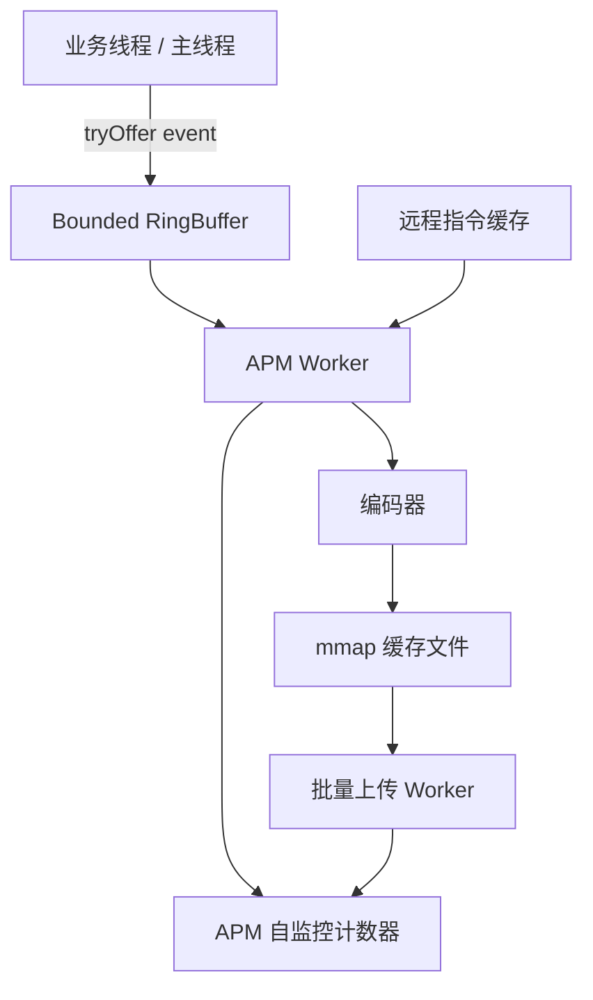
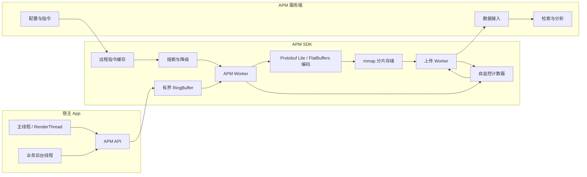

---

status: ready-for-review
title: 千万级 DAU 的 APM 端侧架构
chapter: '19'
section: '19.27'
drafted_date: '2026-05-13'
drafted_by: openclaw-task2a
applicable_versions: Android 8 (API 26) - Android 17 (API 37)
last_verified: '2026-06-04'
last_verified_against: 'Android SDK docs + Kotlin kotlinx.coroutines Channel docs + open-source APM/logging projects'
confidence: medium
tags:
- apm
- architecture
- mmap
- protobuf
- reliability
related_chapters:
- '19.0'
- '19.02'
- '19.09'
- '19.13'
- '19.23'
- '19.24'
- '19.26'
sources:
- type: source
  path: https://raw.githubusercontent.com/Tencent/mars/master/mars/libraries/mars_android_sdk/src/main/java/com/tencent/mars/xlog/Xlog.java
- type: source
  path: https://raw.githubusercontent.com/Meituan-Dianping/Logan/master/README.md
- type: official
  path: https://raw.githubusercontent.com/protocolbuffers/protobuf/main/java/README.md
- type: official
  path: https://raw.githubusercontent.com/protocolbuffers/protobuf/main/java/lite.md
- type: source
  path: https://github.com/google/flatbuffers
- type: official
  path: https://perfetto.dev/docs/instrumentation/tracing-sdk
- type: official
  path: https://developer.android.com/topic/performance/background-optimization
- type: official
  path: https://developer.android.com/reference/android/app/ApplicationExitInfo
- type: official
  path: https://developer.android.com/studio/profile/capture-heap-dump
pipeline_stage: task6_pending
task6_state: revisiting
task9_state: reviewed
reviewed_date: "2026-06-05"
reviewed_by: openclaw-task6
task6_result: pass-light-edit
last_task6_at: "2026-06-05T06:13:36+08:00"
last_task6_review_log: "logs/review/2026-06-05-06-review.md"
task6_review_notes: '2026-06-04 Task6 01:08: pass-light-edit(revisit). Task9 auto-fix writing quality OK; fixed AppenderMode typo. No new rework items.'
task9_result: 'auto-fixed'
last_task9_at: '2026-06-04T00:20:00+08:00'
task9_reviewed_by: 'openclaw-task9'
task9_reviewed_date: '2026-06-04'
last_task9_review_log: 'logs/deep-review/2026-06-04-00-deep-review.md'
task9_review_notes: '2026-06-04 Task9 00:20：auto-fixed。修正 Kotlin Channel 溢出语义：DROP_OLDEST 下 trySend 不会暴露满队列失败，示例改为有界 Channel + trySend 失败计数；回到 Task6 复审。'
task2b_state: 'fixed'
task2b_result: 'fixed'
task2b_fixed_date: '2026-06-03'
task2b_fixed_at: '2026-06-03T10:53:52'
last_task2b_at: '2026-06-03T10:53:52'
last_task9_autofix_at: '2026-06-04'
task6_review_notes: '2026-06-04 Task6 18:15: pass-light-edit(revisit#2). Task9 auto-fix confirmed OK; writing quality clean on re-check. L1/L2 pass. No new rework items. Sending to Task9 for final confirmation.'
---

# 千万级 DAU 的 APM 端侧架构

<!-- outline-start -->
## 本节要点大纲

### 锚点（必须覆盖）

- 🔹 [定位] 超越单一的性能检测点，从顶层架构师视角探讨如何构建一个不影响宿主性能、高可靠且具备动态能力的“移动可观测性端侧引擎”。
- 🔹 [Mmap 高可靠存储] 深度解析为何大厂 APM（如微信 Mars/xLog、美团 Logan）都采用内存映射（`mmap`）技术。解释其在应对极端 Crash 时防日志丢失、以及规避 I/O 线程阻塞的优势。
- 🔹 [序列化与传输协议] 对比 JSON 与 Protobuf / FlatBuffers，说明在高频性能埋点场景下，为何二进制协议能节省 CPU 开销、降低 GC 频率并压缩网络流量。
- 🔹 [线程模型与无锁队列] 设计千万级 DAU 可用的 APM 线程模型：主线程只做事件投递（无锁队列或轻量 RingBuffer），后台单线程处理序列化与落盘，规避多线程锁竞争带来的耗时毛刺。
- 🔹 [动态指令下发] 构建 APM 的双向能力：云端按版本、机型、或特定 UserID 下发指令，要求客户端在下次启动时开启深度的 Perfetto Trace、全量 Hprof Dump 或高级 Logcat 回捞。
- 🔹 [熔断与降级自保] 设计 APM 的自保红线：当检测到自身写入日志量暴增、连续 OutOfMemory 或高频唤醒网络时，触发断路器（Circuit Breaker），主动裁剪自身能力，避免把宿主 App 带崩。
- 🔹 [APM 监控 APM] 提出“谁来监控监控者”的问题，规定 APM 必须在本地统计自身的 CPU 消耗占比、内存分配量与 I/O 写入总量，并随报文上传。

### 扩展（可选深入）

- 🔸 画一张千万级 DAU 客户端 APM 引擎的完整架构图（涵盖 API 层、缓冲层、序列化层、mmap 存储层、网络投递层及指令中控层）。
- 🔸 给出一份 APM 降级策略表（如内存极低时丢弃所有 Info/Debug 日志，仅保留 Error 和 Crash）。
- 🔸 探讨在高版本 Android 分区存储（Scoped Storage）与隐私新规下对 Mmap 缓存落盘位置的影响。

### 流水线加工要求

- 这必须是本章最硬核的架构篇，所有结论都要立足于“极端高并发、低端机、网络波动”这一真实线上环境。
- 不能只介绍开源工具，要提取开源工具背后的通用架构范式（如日志引擎的设计思想）。

### OpenClaw 加工指引

> **锚点**是最低覆盖要求，加工时必须逐条落实并标注验证结果。
> **扩展**视素材丰富程度选择性深入。
<!-- outline-end -->

千万级 DAU 的 APM 端侧架构，要在宿主 App 最差状态下仍以低成本记录事实；指标数量只是次要问题。主线程卡住、进程被杀、网络不可用、低端机存储慢、用户只复现一次，这些条件同时出现时，APM 才暴露真实质量。本文把端侧 APM 看成一个小型数据系统：入口要轻，缓冲要可丢，存储要能恢复，上传要受控，远程指令要有边界。

## 1. APM 端侧引擎的职责边界

端侧 APM 承担设备侧采集与传输职责，不承担服务端看板分析。它负责在设备上完成四件事：采集、暂存、压缩编码、受控上传。服务端再负责聚合、检索、归因和告警。端侧一旦把分析逻辑做重，会把性能工具变成性能问题。

一个可长期运行的 APM SDK，至少分成六层：

| 层级 | 端侧职责 | 失控风险 |
| --- | --- | --- |
| API 层 | 对业务提供埋点、性能样本、异常样本入口 | API 做同步 I/O，直接增加主线程耗时 |
| 缓冲层 | 将事件写入内存队列或 RingBuffer | 队列无上限，低端机上触发 OOM |
| 编码层 | 将事件转换成 Protobuf、FlatBuffers 或自定义二进制记录 | JSON 反复构造对象，产生 GC 毛刺 |
| 本地存储层 | 用 `mmap` 或追加写保存未上传数据 | 文件损坏后无法恢复，启动时反复解析失败 |
| 网络投递层 | 批量上传、退避重试、按网络条件延迟 | 后台高频唤醒，造成耗电和流量异常 |
| 指令层 | 接收采样率、开关、Trace、Hprof 等远程配置 | 指令无 TTL 或无配额，放大线上故障 |

[已验证: source, Tencent Mars xLog 暴露 `AppenderModeAsync`、`AppenderModeSync`、`cacheDir`、`logDir` 配置入口；Logan README 将端侧、服务端和日志检索站点拆成多个组件。]

这六层的共同约束是：业务线程只提交事实，不等待编码、落盘和网络。只要 APM 的一次记录动作能被放进主线程耗时分布里，它就必须给出耗时上限和降级策略。

## 2. 线程模型：主线程只投递，后台线程处理副作用

移动端 APM 最大的架构误区，是把“采集很轻”理解成“哪里都可以直接写文件”。真实线上环境里，日志量、异常量、网络样本量会在故障时同时上涨，APM 入口要按故障流量设计。

推荐模型如下：



入口侧只做三步：取时间戳、填最小字段、`tryOffer()`。队列满时不阻塞，按事件等级丢弃。后台 Worker 顺序处理编码、落盘、分片和上传状态变更。这样做的代价是局部样本会丢，但宿主 App 不会被 APM 拖慢。

这段代码用于说明入口侧的耗时边界。重点看队列构造方式和 `trySend()` 的失败分支：队列必须有界，满时不阻塞业务线程，只记丢弃计数。

```kotlin
import kotlinx.coroutines.channels.Channel

class ApmRecorder(
    private val queue: Channel<ApmEvent> = Channel(capacity = APM_QUEUE_CAPACITY),
    private val clock: () -> Long = { System.nanoTime() },
    private val selfMetrics: ApmSelfMetrics
) {
    fun recordFrameJank(scene: String, frameCostMs: Long) {
        val event = ApmEvent.FrameJank(
            scene = scene.take(MAX_SCENE_LENGTH),
            frameCostMs = frameCostMs,
            timestampNs = clock()
        )

        val result = queue.trySend(event)
        if (result.isFailure) {
            selfMetrics.incrementDropped("frame_jank")
        }
    }

    companion object {
        private const val MAX_SCENE_LENGTH = 80
        private const val APM_QUEUE_CAPACITY = 4096
    }
}
```

队列的关键约束：`Channel(capacity = 4096)` 把内存上限锁在 4096 条事件上；入口只使用 `trySend()`，满时返回失败并丢弃本次事件，失败分支负责记录 `dropped` 计数，避免背压传导到业务线程。容量值按目标机型实测内存占用设定——低端机可以进一步下调。不推荐使用默认 rendezvous channel（无缓冲），也不推荐 `UNLIMITED`（内存失控）。

这段代码只表达入口约束，不代表完整 SDK：禁止在记录函数里序列化、压缩、加密、写文件、发网络请求。业务线程的失败分支也不能打印大量日志，否则队列满会变成日志风暴。

## 3. `mmap` 存储：降低写入抖动，但不能替代一致性设计

`mmap` 的价值在于把频繁小写入转换成内存页修改，减少每条日志都走 `write()` 的系统调用和线程等待。Mars xLog 的 Java 接口暴露 `cacheDir`、`logDir`、异步/同步模式和压缩模式，Logan 也把采集、存储、上传、分析拆成日志平台能力。这类设计共同指向一个结论：端侧日志先进入本地缓冲，再由后台线程整理成可上传文件。[已验证: source, Tencent Mars xLog `XLogConfig` 包含 `cachedir`、`logdir`、`mode`、`compressmode`；Logan README 描述 collect、store、upload、analyze 能力。]

`mmap` 降低写入抖动，但不能保证“崩溃不丢日志”。进程崩溃时，页缓存何时刷盘、文件头是否已提交、加密压缩块是否完整，都要靠文件格式兜底。可靠的 APM 存储要至少处理四个细节：

- 记录边界：每条记录带长度、类型、时间戳和校验字段，启动恢复时能跳过尾部半条记录。
- 提交游标：编码完成后再更新可读游标，避免上传线程读到未完成块。
- 分片轮转：单文件按大小或日期切分，旧分片只读，新分片追加，降低恢复成本。
- 启动修复：发现校验失败时截断到上一个有效偏移，并上报一次 `storage_repair` 自监控事件。

`mmap` 适合高频、小体积、允许延迟刷盘的事件，例如帧耗时、网络阶段耗时、普通日志。Crash 现场、ANR traces、Hprof 文件更适合单独文件或专用目录，因为这些数据体积大，访问权限和脱敏策略也不同。

## 4. 编码协议：JSON 适合调试，二进制协议适合高频上报

APM 报文的字段稳定、类型明确、批量发送频繁，二进制协议通常比 JSON 更适合生产上报。Protobuf 官方文档建议 Android 使用 Java Lite runtime，原因是体积更小、对 ProGuard/R8 更友好；Lite runtime 也明确牺牲了部分能力，例如反射、ProtoJSON 和 TextProto 支持。[已验证: official, Protocol Buffers Java README 与 Lite runtime 文档。]

FlatBuffers 的优势不同：它允许直接访问序列化后的 buffer，不必先解析成中间对象，适合读取路径更敏感的场景。[已验证: source, google/flatbuffers README。]

| 协议 | 适用场景 | 优点 | 代价 |
| --- | --- | --- | --- |
| JSON | 本地调试、临时灰度、人工排查 | 可读性好，服务端排障方便 | 字符串和对象分配多，字段名重复占网络流量 |
| Protobuf Lite | 大多数 Android APM 批量上报 | schema 稳定，体积小，Android 体积控制更好 | 需要 schema 演进规则，R8 规则要验证 |
| FlatBuffers | 读路径敏感、跨语言读取、部分离线索引 | 可直接读取 buffer，减少解析对象 | 写入 API 和 schema 约束更强，团队学习成本高 |
| 自定义二进制 | 极端日志系统、固定字段高频事件 | 可以贴合文件格式和加密压缩块 | 调试成本高，服务端工具要自建 |

端侧推荐默认使用 Protobuf Lite 作为网络报文，存储层可使用自定义 block 包住多个 Protobuf event。这样能兼顾 schema 演进和文件恢复：单条 event 仍由 Protobuf 描述，外层 block 负责压缩、加密、长度和校验。

以上对比基于协议设计特性和业界通用经验，未包含特定字段规模、事件频率、设备型号、payload 大小和序列化耗时的一手 benchmark。实际选型前，至少在目标设备上用本 App 的真实埋点 payload 跑一次最小对比：同一批 1k/10k 事件分别用 JSON、Protobuf Lite、FlatBuffers 编码，记录 payload bytes、encode/decode time、alloc bytes 和 GC 次数。缺少这组数据时，结论应理解为"二进制协议通常更适合高频上报"而非"一定更优"。

## 5. 动态指令：远程能力必须带 TTL、配额和签名

千万级 DAU 的 APM 不能只做被动采集。线上问题常见的排查路径是：服务端发现某版本、某机型、某用户群异常，再给端侧下发短期指令，让目标设备在下次启动或下一次场景进入时记录更详细的材料。

可下发的指令分三类：

| 指令 | 触发条件 | 风险控制 |
| --- | --- | --- |
| Perfetto / `android.os.Trace` 增强 | 卡顿、启动慢、线程等待异常 | 限制时长、文件大小、采样比例；只对目标人群打开 |
| Hprof Dump | OOM 前兆、内存泄漏疑似样本 | 只在充电、Wi-Fi、前台确认或内部灰度设备启用；上传前脱敏 |
| Logcat / APM 日志回捞 | 单用户疑难问题复现 | 只回捞白名单 tag 和时间窗；默认剥离账号、token、定位等字段 |

Perfetto 文档给出的建议是：Android 侧已有 `android.os.Trace` / ATrace 能满足时继续使用这些接口；更复杂的应用内事件可以使用 Perfetto SDK 定义自有数据源。[已验证: official, Perfetto Tracing SDK 文档。] Hprof 方面，Android Studio 文档说明可通过 `dumpHprofData()` 在代码的指定位置生成堆转储，但生成过程会增加内存压力，生产使用必须受控。[已验证: official, Android Studio Capture a heap dump 文档。]

这三种诊断能力在 Android 上受 App 进程权限边界严格约束。普通三方 App 不是 adsb/internal build，能采集的范围和能开通的通道完全不同。下表按 App 类型区分可用能力和限制：

| 诊断能力 | 普通三方 App | debuggable / profileable App | 系统签名 / 特权 App | adb / internal build |
| --- | --- | --- | --- | --- |
| Perfetto SDK in-process tracing | 可用，无需特殊权限 | 可用，同普通 App | 可用 | 可用 |
| 系统级 Perfetto ftrace / atrace 全量采集 | 不可用；需要 privileged consumer（如 adb shell / system） | 不可用；同普通 App | 可用（预声明 trace config 且进程有合适权限） | 可用 |
| Hprof `dumpHprofData()` 自身进程 | 可用（需受控配额） | 可用 | 可用 | 可用 |
| Hprof 跨进程 / 系统级 | 不可用 | 不可用 | 可能可用（依 SELinux 和 signing 权限） | 可用 |
| 本进程 / 本 SDK 可控日志（自写 tag） | 可用 | 可用 | 可用 | 可用 |
| 全设备 logcat 回捞（含其他进程/system server） | 不可用；Android 4.1+ `READ_LOGS` 只授予 privileged/system app | 不可用；同普通 App | 可用（manifest 声明 `READ_LOGS` 且系统签名） | 可用 |

[已验证: 官方文档, Android 4.1+ `READ_LOGS` 仅授予 privileged system apps；Perfetto docs 说明 in-process tracing 不需要特殊 OS 权限，系统级 tracing 需要 privileged consumer。]

设计远程指令协议时，必须把 App 的实际权限边界编进指令的 capability check。普通三方 App 只能开通自身进程内的 Perfetto SDK in-process trace、自身 Hprof 和自有 SDK 日志回捞；系统级 Perfetto、全设备 logcat 和跨进程 Hprof 只能在内部测试 build 或系统签名 App 上执行。指令协议中增加 `required_capability` 字段（`app_sdk` / `system_privileged` / `adb_internal`），端侧收到超出自身能力的指令时返回失败回执，不静默忽略。

指令协议至少包含这些字段：

- `command_id`: 服务端指令唯一标识，用于去重和回执。
- `target`: 版本、渠道、机型、系统版本、用户分桶，不在端侧做复杂表达式解释。
- `ttl`: 过期时间，避免旧指令在用户数天后启动时继续生效。
- `quota`: 单设备最大触发次数、最大文件大小、最大上传字节数。
- `required_capability`: 执行该指令需要的最低 App 权限级别（`app_sdk` / `system_privileged` / `adb_internal`），端侧收到超出自身能力的指令时返回失败回执。
- `signature`: 防止配置通道被篡改后开启敏感采集。
- `kill_switch`: 服务端可立即关闭某类指令。

端侧执行指令前先写入本地状态，再开始采集。采集中崩溃或进程被杀，下次启动能知道上一次指令是否生成了半成品文件，并按恢复流程处理。

## 6. 网络投递：批量、退避、约束条件

APM 上传不能按事件实时发送。后台上传要批量合并，按网络、充电、前后台状态和服务端限流执行。Android 官方后台任务文档强调，后台任务应减少电量、性能和网络使用，并建议把非紧急后台工作放在合适约束下执行。[已验证: official, Android background task battery optimization 文档。]

推荐策略：

- 普通性能样本：按大小或时间窗口批量上传，例如 64 KB 或 15 分钟一个批次。
- Crash / ANR 摘要：下次冷启动后优先上传摘要，再补充大文件。
- Hprof / Trace：单独上传通道，限制 Wi-Fi、充电、文件大小和并发数。
- 失败重试：指数退避，服务端 429 或 5xx 后延长间隔；本地文件超过保留天数直接删除。
- 压缩加密：先压缩再加密，避免密文压缩无效；密钥轮换要能兼容历史文件。

上传 Worker 必须统计自己的唤醒次数、发送字节、失败次数和平均耗时。服务端收到 APM 报文后，除了业务性能数据，还要能看到“APM 本身这次花了多少成本”。

## 7. 熔断与降级：APM 要能主动变轻

APM 自保的触发条件要写成可执行规则，不能停留在口头约定。只要命中红线，SDK 立即降低采集强度，并把原因写入自监控事件。

| 红线 | 触发条件示例 | 降级动作 |
| --- | --- | --- |
| 写入量异常 | 单进程 10 分钟写入超过配置上限 | 丢弃 Debug / Info，只保留 Error、Crash、ANR 摘要 |
| 队列拥塞 | RingBuffer 连续 3 个窗口超过 80% | 降低帧样本采样率，保留慢帧和严重异常 |
| 内存压力 | APM 自身缓存超过上限或收到低内存回调 | 停止大对象采集，禁止 Hprof 指令 |
| 网络失败 | 连续上传失败或服务端返回限流 | 延长退避间隔，暂停大文件上传 |
| 自身异常 | APM Worker 连续崩溃或初始化失败 | 只保留最小 Crash 记录，关闭非必要模块 |

降级规则要本地生效，不能依赖服务端实时响应。故障发生时网络可能已经不可用，端侧只能靠本地配置和默认红线保护宿主。

## 8. APM 监控 APM：成本数据和业务数据一起上报

APM SDK 每个模块都要有自监控指标。没有这些指标，服务端只能看到“采集到的数据变少了”，无法判断是用户没有问题、采样率被调低、队列满丢弃，还是 SDK 自己坏了。

建议随每批报文附带这些字段：

- `sdk_cpu_time_ms`: Worker 线程累计 CPU 时间，用于识别编码或压缩异常。
- `sdk_alloc_bytes`: 采集窗口内估算分配量，用于发现 JSON 或临时对象膨胀。
- `sdk_io_bytes`: 本地写入字节数和上传字节数，用于控制存储和流量成本。
- `queue_dropped_count`: 按事件类型统计的丢弃数，用于还原采样偏差。
- `storage_repair_count`: 启动修复次数，用于发现文件格式或崩溃恢复问题。
- `command_execute_count`: 远程指令执行次数和失败原因，用于审计敏感采集。

这些字段不服务于用户画像，只服务于 SDK 质量判断。采集时要避免记录可识别个人的信息，尤其是文件路径、URL query、账号、设备唯一标识和定位片段。

## 9. 分区存储与隐私边界

Android 高版本的分区存储要求 App 更克制地使用外部存储。APM 缓存优先放在应用私有目录，例如 `context.filesDir`、`cacheDir` 或专用 no-backup 目录；只有用户导出、内部测试或系统分享场景才考虑外部可见位置。

目录设计可以按数据敏感度分层：

| 数据 | 推荐位置 | 保留策略 |
| --- | --- | --- |
| 普通性能样本 | App 私有缓存目录 | 上传成功后删除，超期清理 |
| Crash / ANR 摘要 | App 私有文件目录 | 保留最近 N 次，启动后优先上传 |
| Trace / Hprof 大文件 | App 私有临时目录 | 单独配额，上传后删除，默认不备份 |
| 用户可导出诊断包 | 用户明确触发的导出目录 | 导出前脱敏，导出后提示用户可删除 |

隐私规则要前置到采集层。URL 只保留 path pattern，query 默认剥离；header 默认黑名单加白名单双控；日志正文按 tag 分级；Hprof 和 Trace 属于高敏材料，只能在灰度、内部测试或用户授权场景开启。

## 10. 一张端侧 APM 架构图

这张图把入口、缓冲、存储、上传、指令和自监控放在同一个视角里。读图时重点看两条路径：业务事件从左向右异步写入，远程指令从上向下受控触发。



架构图里没有让业务线程直接连到文件和网络，这是端侧 APM 的底线。APM 只有在最差设备、最差网络、最高故障流量下仍能保持轻量，采到的数据才有解释价值。

## 11. 与本章其他小节的关系

本节给的是端侧 APM 总架构，具体能力放到相邻小节：网络捕获详见 19.23 节，Crash / ANR 捕获详见 19.24 节，Hybrid 监控详见 19.26 节，Perfetto SDK 接入详见 19.13 节。这里不重复展开各模块内部原理，只保留架构取舍和端侧约束。
