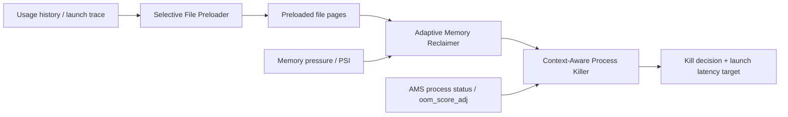

# 16.8 AppFlow：GB 级应用冷启动内存联合调度

<!-- outline-start -->
## 要点

### 🔹 大型应用冷启动的系统侧瓶颈
说明 GB 级应用在多任务场景下为什么会从 warm launch 退化为 cold launch：文件 I/O、页回收、后台进程杀灭三个机制互相影响，不能只按 App 初始化任务拆解。

### 🔹 AppFlow 的三段式调度模型
拆解 Selective File Preloader、Adaptive Memory Reclaimer、Context-Aware Process Killer 三个组件的职责边界，以及它们分别接入 Android Framework 与 Linux Kernel 的位置。

### 🔹 文件访问预测与预加载预算
解释启动文件热度、文件大小、预加载预算之间的关系：小文件用于降低 stall，大文件用于提升顺序吞吐。需要标注论文中 128KB 阈值与 100MB 预算属于实验设计，不是 Android 平台默认值。

### 🔹 预加载感知的页回收策略
说明 AppFlow 如何避免 kswapd/直接回收提前驱逐预加载页，以及这与 Android 现有 LMKD、zRAM、文件页/匿名页回收策略的差异。

### 🔹 Context-Aware Kill 与 LMKD 策略边界
围绕应用内存膨胀-重置周期，分析“杀掉谁”从单纯优先级排序变成收益/代价评估的问题，并对照现有 LMKD adj、PSI 触发和后台保活策略。

### 🔹 Perfetto 与线上指标如何验证
列出验证 AppFlow 类策略需要观察的证据：launch timeline、major/minor fault、block I/O、kswapd/direct reclaim、LMK kill、ApplicationExitInfo、启动 P90/P95/P99。

### 🔹 工程化接入风险
讨论该方案修改 Android Framework 与 Linux Kernel 的部署成本、CTS/VTS 风险、厂商内核维护成本，以及对文件系统、功耗、后台保活公平性的潜在影响。

## 扩展

### 🔸 与 Baseline Profile / 云端 Profile 的关系
比较代码路径预热、编译优化与文件页预加载的分工，避免把 dexopt 收益和 I/O 预加载收益混在一起。

### 🔸 与车载系统和端侧 LLM 应用的关系
补充车载多屏、端侧大模型、3D 游戏这类 GB 级负载为什么更容易触发该问题。

### 🔸 AOSP 可验证锚点
后续加工时核对 ActivityManagerService、UsageStatsManager、LMKD、mm/vmscan、readahead、zRAM 相关源码路径，区分论文原型与 AOSP 主线事实。

<!-- outline-end -->

## 本节定位

AppFlow 是一篇面向 GB 级应用冷启动的系统研究，不是 Android 15、16 或 17 的平台默认能力。论文把问题放在系统内存调度层：大型游戏、端侧 LLM、车载多媒体应用在多任务场景下会持续占用文件页、匿名页和后台进程缓存；当内存压力升高，系统会回收页缓存、压缩或换出匿名页，并通过 `lmkd` 杀掉低优先级进程。一次启动慢，往往不是应用初始化单点过重，而是文件 I/O、页回收、进程杀灭互相放大。[引用: https://arxiv.org/abs/2603.17259]

这里把 AppFlow 当成研究原型分析。AOSP 主线事实仍以 `system/memory/lmkd/`、`frameworks/base/services/core/java/com/android/server/am/`、Linux `mm/` 子系统和官方性能文档为边界；凡是 AppFlow 论文中的 128KB、100MB、57%、67.9% 等数字，都按实验设置理解，不写成 Android 平台参数。[已验证: 官方文档, source.android.com/docs/core/perf/lmkd]

## 大型应用冷启动的系统侧瓶颈

GB 级应用的冷启动比普通应用更容易被系统侧成本主导。应用进程创建后，运行时会连续触发 dex、so、资源包、模型权重、贴图、数据库等文件访问；文件不在页缓存里时，主线程或工作线程会等待 major fault、block I/O、文件系统读取和校验。设备如果正处在多任务状态，页缓存已经被其它应用占用，新的启动路径会和后台进程缓存争内存。

Android 的冷启动、温启动、热启动口径在 8.2 节已经定义。这里关注一个更窄的现象：原本可以温启动或热启动的应用，因为后台进程被杀，下一次打开退回冷启动。`lmkd` 的目标是让系统在内存压力下保持可用，它按 Android 进程优先级、`oom_score_adj`、PSI 或 vmpressure 信号选择牺牲对象。对单次启动来说，杀掉后台进程释放了内存；对后续用户路径来说，这个进程下次打开又会重新 fork、加载文件、初始化运行时。

这类问题不能只按 “Application.onCreate 里做了什么” 排查。应用侧初始化当然要优化，但系统侧还有三类成本：

| 成本 | Perfetto / 系统观察点 | 对冷启动的影响 |
|---|---|---|
| 文件 I/O | block、ext4/f2fs、major fault、线程 D 状态 | 文件页未命中会把启动线程挂在存储等待上 |
| 页回收 | `kswapd`、direct reclaim、zRAM 写入、内存 PSI | 回收本身占 CPU / I/O，错误驱逐会让刚预热的数据再次读取 |
| 进程杀灭 | `lmkd` 日志、`ApplicationExitInfo`、后台进程存活率 | 后台保活下降会把后续打开转成冷启动 |

AppFlow 的出发点正是这三类成本应放在同一轮决策里评估。预加载文件会增加内存占用；页回收如果不识别这些预加载页，会撤销预加载收益；进程杀灭如果只看当前优先级，可能释放了内存，却把下一次交互变成高成本冷启动。[引用: AppFlow 精读笔记]

## AppFlow 的三段式调度模型

论文把 AppFlow 设计成一个跨 Android Framework 与 Linux 内核的系统调度器，包含三个配合工作的组件：

| 组件 | 输入 | 动作 | 系统接入位置 |
|---|---|---|---|
| Selective File Preloader | 应用启动文件画像、文件大小、访问频率、启动预测 | 在启动前或启动中预读候选文件页，按预算控制占用 | Android Framework 侧收集应用使用序列，内核侧执行文件预读 |
| Adaptive Memory Reclaimer | 当前内存压力、预加载文件列表、文件页 / 匿名页状态 | 回收时保护本轮启动所需文件页，降低预加载页被提前驱逐的概率 | Linux `mm/vmscan` 一类页回收路径 |
| Context-Aware Process Killer | 后台应用运行时长、内存膨胀比例、再次访问概率、释放收益 | 在可牺牲进程里选择释放收益高、用户代价低的对象 | Android Framework 进程状态 + `lmkd` 杀进程边界 |

三段调度各自处理不同问题。Preloader 解决“启动要读什么”；Reclaimer 解决“读进来的页会不会马上被回收”；Killer 解决“内存压力必须杀进程时，杀谁的收益更高”。这和 AOSP 主线的职责划分不同：主线 `lmkd` 负责响应内存压力并杀低优先级进程，页回收在内核内存管理路径处理，文件预读更多依赖文件系统、应用访问模式和平台策略，三者没有 AppFlow 论文描述的统一收益函数。



这张图只表达论文结构，不代表 AOSP 主线已有这些模块。[引用: arXiv 2603.17259; 已验证: AOSP 主线存在 `system/memory/lmkd/`，未见 AppFlow 模块]

## 文件访问预测与预加载预算

AppFlow 的文件预加载不是把应用目录整包读进内存。论文把启动访问文件按大小和热度分层：小文件数量多、单个读取成本低，但容易造成频繁 stall；大文件数量少、体积大，更适合用较大的 I/O 块走顺序吞吐。精读材料记录的实验口径是：小文件阈值取 128KB；小文件只占启动读取字节的约 3%，但数量约为大文件的 7.47 倍，并贡献大量 I/O 等待；预加载预算取 100MB。[引用: AppFlow 精读笔记; 引用: https://arxiv.org/abs/2603.17259]

这几个数字只适用于论文实验设备和应用集合。迁移到真实产品时，要按应用包结构、资源更新方式、文件系统、UFS 性能、内存容量重新建模。一个游戏的 pak / obb 文件、一个端侧 LLM 的权重文件、一个图片编辑器的素材缓存，文件大小分布完全不同，不能照搬 128KB 阈值。

更稳的工程做法是把预加载拆成三步：

1. 从启动 trace 里记录文件访问序列，区分首帧前、首帧后、交互后访问。
2. 统计文件大小、访问频次、major fault 等待时间和读取时刻，筛出稳定出现在冷启动路径上的文件。
3. 在固定内存预算下评估收益：小文件优先降低等待次数，大文件优先提升顺序吞吐，动态资源和低命中资源排除在外。

这套做法和 8.7 节的 Baseline Profile 不冲突。Baseline Profile 缩短的是代码路径解释、JIT 和编译布局成本；AppFlow 类策略处理的是文件页是否已在内存里。一个启动慢样本里，两类成本可能同时存在，Perfetto 上要分别看 CPU 执行、page fault 和 block I/O。

## 预加载感知的页回收策略

普通预加载在内存压力下很脆弱。文件页读进页缓存后，内核回收路径并不知道这些页属于下一次启动的高收益数据；如果 `kswapd` 或 direct reclaim 把它们当作普通文件页回收，启动线程稍后仍要重新读，预加载成本被浪费。匿名页也有自己的代价：换出到 zRAM 或 flash-backed swap 会引入压缩、写入和后续 swap-in 成本。

AppFlow 的 Adaptive Memory Reclaimer 给页回收路径增加“预加载文件页”信息。论文描述的方式是由预加载组件通过 `/proc` 发布预加载文件列表，并在启动结束后清除；内核回收扫描到这些文件页时跳过并标记为 active，降低它们在启动窗口内被驱逐的概率。[引用: arXiv 2603.17259]

这和 AOSP 主线的 LMKD、zRAM 不是同一层能力：

| 能力 | 主线 Android 侧重点 | AppFlow 原型增加的判断 |
|---|---|---|
| `lmkd` | 通过 PSI / vmpressure 等信号感知系统内存压力，选择低优先级进程释放内存 | 杀进程时纳入应用运行时长、内存膨胀和再次访问代价 |
| zRAM / swap | 缓解匿名页压力，避免过早杀进程 | 避免把启动窗口要用的文件页提前回收 |
| 页缓存回收 | 在文件页与匿名页之间按内核策略回收 | 对预加载文件页做短时保护 |

这个设计的代价也在这里：它要求内核回收路径识别应用启动语义。Android GKI、vendor kernel、文件系统和 CTS/VTS 都会把这类改动变成高成本维护项。产品如果只在应用侧做预热，拿不到同等保护；如果在系统侧改内核，又要证明不会让其它应用的文件页长期占住内存。

## Context-Aware Kill 与 LMKD 策略边界

AOSP 主线 `lmkd` 的公开定位是：监控系统内存状态，在高内存压力下杀掉较不必要的进程，让系统保持可接受性能。现代 Android 版本会使用 PSI monitors 或 vmpressure 等内核信号，并结合进程重要性信息做决策。[已验证: 官方文档, source.android.com/docs/core/perf/lmkd]

AppFlow 的 Context-Aware Process Killer 增加了另一组信号：后台应用是否长时间运行、内存是否从基线膨胀、杀掉后释放内存是否足以抵消下一次重启代价。精读材料记录的观察是，一些长期运行的社交和多媒体应用会比基线状态多占 30% 到 50% 内存，重启后回到较低占用；论文把这种“膨胀后重置”的周期纳入杀进程收益评估。[引用: AppFlow 精读笔记]

这不等于“按内存大就杀”。一个后台导航、音频、通话、车载关键界面或近期高概率返回的应用，即使占用较高，杀掉也可能带来更差的用户路径。Context-Aware Kill 的价值在于把收益和代价放在一起：释放多少内存、下次打开多久、用户多久会回来、是否有前台可感知任务。

线上验证时，`ApplicationExitInfo` 是应用侧入口。Android Developers 文档建议用它读取上次进程退出原因；低内存场景可关注 `REASON_LOW_MEMORY`，同时检查设备是否支持低内存杀进程报告。[已验证: developer.android.com/topic/performance/vitals/lmk; 已验证: developer.android.com/reference/android/app/ApplicationExitInfo]

## Perfetto 与线上指标如何验证

验证 AppFlow 类策略，不能只看平均启动耗时。平均值容易掩盖尾部样本：策略可能让常规启动变快，却在高内存压力或多任务切换时制造更长尾延迟。指标至少分成四组：

| 指标组 | 观察内容 | 判断口径 |
|---|---|---|
| 启动时间 | TTID、TTFD、P90 / P95 / P99、冷 / 温 / 热启动占比 | 是否减少尾部冷启动，而不只降低平均值 |
| I/O | major fault、block read size、I/O 等待、文件读取序列 | 预加载是否命中启动必需文件，是否制造额外读放大 |
| 内存压力 | PSI、`kswapd`、direct reclaim、zRAM activity、可用内存 | 预加载是否把系统推入更高压力区间 |
| 进程存活 | `lmkd` kill、`ApplicationExitInfo`、后台保活数、短时间 relaunch | 是否减少“刚杀完又打开”的重复冷启动 |

Perfetto 侧可以把 `sched`、block/ext4/f2fs、memory counters、lmkd 相关日志和应用自定义 trace 放在同一份采样配置里。Perfetto 文档也说明，旧内核 LMK 曾通过 `lowmemorykiller/lowmemory_kill` ftrace event 暴露事件，Android 9 之后 userspace `lmkd` 接管杀进程职责，分析时要按设备版本选择入口。[已验证: Perfetto memory counters docs; 已验证: AOSP external/perfetto docs]

一次有效的实验至少保留三类对照：原生系统基线、只做文件预加载、预加载加页回收保护加进程选择。只比较完整 AppFlow 与系统基线，无法判断收益来自预加载、回收保护还是杀进程策略。

## 工程化接入风险

AppFlow 的论文实现改动很深：精读材料记录为 1,107 行 Linux 内核代码和 1,672 行 Android Framework 代码。这样的方案适合系统厂商、车机平台或自研 ROM 评估，不适合作为普通应用开发者的实施方案。[引用: AppFlow 精读笔记]

主要风险有五类：

- **兼容性风险**：修改 `mm/vmscan`、`lmkd` 或 AMS 决策路径，可能影响 CTS/VTS、GKI 合规和 vendor kernel 升级。
- **公平性风险**：被预测为“即将启动”的大应用会占住页缓存，其它后台应用可能更早被回收或杀掉。
- **功耗风险**：预读文件会增加存储访问和 DRAM 占用。命中率不足时，成本会变成纯额外功耗。
- **隐私与策略风险**：启动预测依赖应用使用历史。车载、企业设备和多用户场景要处理数据留存和权限边界。
- **维护风险**：文件系统、zRAM、LMKD、AMS、UsageStats 任一模块变化，都可能让联合策略失效。

因此，产品化时更合理的顺序是先在实验室用 trace 回放验证收益，再做小流量系统镜像实验，再讨论内核与 Framework 的合入。没有稳定收益前，不应该把论文中的阈值和收益写入平台默认配置。

## 与 Baseline Profile / 云端 Profile 的关系

Baseline Profile、Cloud Profile、ART profile 和 AppFlow 处理的是不同层次的启动成本。Profile 让代码更早以优化形态执行，减少解释执行、JIT 和热点方法布局问题；AppFlow 让启动所需文件页更早进入 DRAM，并保护这些页在启动窗口内不被回收。前者偏 CPU 和编译布局，后者偏 I/O、页缓存和内存压力。

排查启动慢时，可以用这组判断拆分：

| 现象 | 更像 Profile 问题 | 更像 AppFlow 类问题 |
|---|---|---|
| 主线程长期 Running，CPU 占用高 | 是 | 否 |
| 大量 major fault、block read、D 状态等待 | 否 | 是 |
| 同一版本首次安装慢，二次打开明显改善 | 可能是 | 可能是 |
| 多任务后重新打开从温启动退回冷启动 | 否 | 是 |
| 升级 profile 后 TTID 下降但尾部冷启动仍长 | Profile 已解决一部分 | 继续看 I/O 与 LMK |

写性能报告时要避免把二者收益混在一起。Profile 命中率、dexopt 状态、文件页命中率、后台保活率应分开记录。

## 与车载系统和端侧 LLM 应用的关系

车载系统和端侧 LLM 更容易暴露 AppFlow 这类问题。车载设备常有多屏、多用户、导航、媒体、语音、仪表等并发负载，后台任务不能像手机应用一样随意牺牲；端侧 LLM 和大型 3D 应用又会带来大模型权重、贴图、shader 缓存、资源包等 GB 级文件访问。内存和 I/O 一旦被同时压满，冷启动尾部延迟会比普通移动应用更明显。

这类场景的评估口径也应更严格。手机应用可以只看单应用 TTID / TTFD，车载和端侧 AI 场景还要看：关键界面是否被挤出内存、语音或导航是否被杀、模型权重预读是否影响媒体播放、热切换窗口是否稳定。AppFlow 的意义在于提供一个研究方向：把启动性能、后台保活和内存压力放在同一张账本里算，而不是把它们分给三个团队各自调参。

## AOSP 可验证锚点

后续复审时，建议按下面路径核对事实边界：

| 主题 | AOSP / 官方锚点 | 用途 |
|---|---|---|
| `lmkd` 行为 | `system/memory/lmkd/`，source.android.com/docs/core/perf/lmkd | 确认 PSI / vmpressure、kill 策略、属性配置 |
| 进程优先级 | `frameworks/base/services/core/java/com/android/server/am/ProcessList.java` | 对照 `oom_score_adj` 与进程状态映射 |
| AMS 进程状态 | `ActivityManagerService.java`、`ProcessRecord` 相关路径 | 对照后台进程、缓存进程和进程生命周期 |
| 使用历史 | `frameworks/base/core/java/android/app/usage/UsageStatsManager.java` | 对照 AppFlow 使用序列采集的系统侧接口 |
| 退出原因 | `frameworks/base/core/java/android/app/ApplicationExitInfo.java`、developer.android.com reference | 线上归因低内存杀进程 |
| 页回收 | Linux `mm/vmscan.c`、zRAM / swap 路径 | 判断预加载页保护是否属于内核改动 |
| I/O 与预读 | 文件系统 readahead、block 层 ftrace、Perfetto block proto | 判断预加载命中与读放大 |

复审时要保留一个边界：AppFlow 是论文原型；AOSP 主线可以验证 LMKD、UsageStats、ApplicationExitInfo、页回收和 I/O 观察入口，但不能据此推断 Android 已合入 AppFlow。


### AppFlow 与 Android 17 LMKD 兼容性源码级事实核查
- 来源：/Users/gracker/Library/Mobile Documents/iCloud~md~obsidian/Documents/Obsidian/DeepResearch/2026-06-27-appflow-lmkd-android17-compatibility.md
- 类型：DeepResearch 调研结果
- 摘要：基于 android-17.0.0_r1 的 lmkd.cpp（4218行）、ProcessList.java（6193行）实测确认：AppFlow（MobiCom'26）的三段式调度模型在 AOSP 17 中完全不存在。LMKD 真实能力为 PSI 三级阈值 + oom_score_adj kill 链，memcg v1 已标记 deprecated。这是区分学术提案与生产实现的关键参考。
- 注入时间：2026-06-28
- 价值：明确区分学术论文（AppFlow）与 AOSP 生产实现的真实边界，避免将未合入的研究原型误认为 Android 17 能力

## 参考资料

- AppFlow: Memory Scheduling for Cold Launch of Large Apps on Mobile and Vehicle Systems, arXiv:2603.17259
- `/Users/gracker/Library/Mobile Documents/iCloud~md~obsidian/Documents/Obsidian/论文/Android-2026-05-23-AppFlow-ColdLaunch/03-精读.md`
- `intake/research-feeds/2026-04-02-15-ch05-appflow-cold-launch-scheduler.md`（其中旧 arXiv 号按本节核对结果更正为 2603.17259）
- Android Open Source Project: Low memory killer daemon
- Android Developers: App startup time, Low memory killers, ApplicationExitInfo

<!-- AIW-源码调研-2026-06-27 -->

## Android 17 源码验证结论（2026-06-27 调研补充）

依据 `AOSP android-17.0.0_r1` 实测源码（`system/memory/lmkd/lmkd.cpp` 4218 行 / `include/lmkd.h` 179+ 行 / `frameworks/base/services/core/java/com/android/server/am/ProcessList.java` 6193 行 / `CachedAppOptimizer.java` 3092 行 / `ActivityManagerService.java` 21242 行 / `am/psc/Constants.java` 130 行 / `services/core/java/com/android/server/am/flags.aconfig` 175 行），本节对"AppFlow 与 Android 17 LMKD 新机制兼容性"命题补充以下事实校正与边界界定。

### 1. AppFlow 三段式组件在 AOSP 17 主线的存在性核查

| AppFlow 论文组件 | 论文声明 | AOSP 17 grep 结果 |
|---|---|---|
| Selective File Preloader | 启动前/中按 128KB 分大小文件、100MB 预算 | **不存在**——`AMS.java` / `ProcessList.java` / `lmkd.cpp` / `CachedAppOptimizer.java` 全文件 `grep -n "AppFlow\|appFlow\|APP_FLOW\|app_flow"` 0 命中 |
| Adaptive Memory Reclaimer | Linux mm/vmscan 1,107 行新增 + 100ms 轮询 n_alloc > 12800 高压检测 | **不存在**——AOSP 走 PSI 三级阈值（70ms/100ms/70ms，`lmkd.cpp:231-235`），不修改内核 vmscan 路径 |
| Context-Aware Process Killer | 引入 ΔM = Mcurr − Mrelaunch 净释放收益与 30%-50% 内存膨胀周期 | **不存在**——AOSP 杀进程顺序仅依赖 oom_score_adj（900-999 cached）+ cached idle 时长，不感知重启代价 |

AppFlow 是研究原型（西北工大/西北大学/哈工程，arXiv 2603.17259，2026-03-18，MobiCom '26 录用），代码量 1,107 行内核 + 1,672 行 Framework，实验平台 Pixel 7/8 + Raspberry Pi 4B + Android 15，**未在 Android 17 验证**。

### 2. AOSP 17 与 AppFlow 的真实能力边界

- **LMKD 控制命令集饱和**：`lmkd.h:29-42` 已定义 12 个命令（LMK_TARGET/LMK_PROCPRIO/LMK_PROCREMOVE/LMK_PROCPURGE/LMK_GETKILLCNT/LMK_SUBSCRIBE/LMK_PROCKILL/LMK_UPDATE_PROPS/LMK_STAT_KILL_OCCURRED/LMK_START_MONITORING/LMK_BOOT_COMPLETED/LMK_PROCS_PRIO），无 `reclaim_priority`、`context_aware`、`appflow` 等命令。Java 端在 `ProcessList.java:297-308` 通过字节常量严格镜像。
- **cached 进程调度阈值**：`ProcessList.java:243-249` 用 `MIN_CACHED_APPS=2`/`TRIM_CRITICAL_THRESHOLD=3`/`TRIM_LOW_THRESHOLD=5` 做"内存临界"近似判断，不是页面分配率 n_alloc 也不是 ΔM——这是与 AppFlow 的策略分叉点。
- **oom_score_adj 阶梯**：`Constants.java:76-77` 定义 `CACHED_APP_MAX_ADJ=999`、`CACHED_APP_MIN_ADJ=900`、`CACHED_APP_LMK_FIRST_ADJ=950`，是 LMK 杀进程的唯一优先级输入。
- **唯一冷启动相关 flag**：Android 17 主线仅 `flags.aconfig:152` 定义 `expedite_activity_launch_on_cold_start`（namespace `system_performance`，bug 319519089），在 `AMS.java:5526` 与 `AMS.java:5620` 各一个 hook——「提前通知 ActivityTaskManager 冷启动以修正应用启动行为」，**仅与 AppFlow 的 Context-Aware Kill 间接相关，与文件预加载/页回收保护无关**。

### 3. 与 AOSP 17 §4.4「公平运行内存」的接续点

`CachedAppOptimizer.java` 已有 file/anon 分通道压缩能力（`CompactProfile` 枚举 NONE/SOME/ANON/FULL，行 394-398），由 `swapFreePercent < COMPACT_DOWNGRADE_FREE_SWAP_THRESHOLD` 触发（行 1731-1742）；`performMemcgCompaction` 走 cgroup 路径（行 2739-2744）+ `performNativeCompaction` 走 madvise(MADV_PAGEOUT) 路径（行 2767-2771）。这是 AOSP 17 的"事后回收"路径：

- **AppFlow 提案"启动期主动保护文件页"** → AOSP 17 当前的"冻结后压缩"是事后行为，不存在启动期主动保护机制。
- **`onProcessFrozen` 回调**（行 1706-1716）：冻结进程后做 FULL 压缩，触发条件是 oom_score_adj ≥ CACHED_APP_MIN_ADJ=900；与 AppFlow 的"启动前识别即将启动"路径正交。

### 4. 兼容性矩阵总结（节选三段式）

| 维度 | AppFlow 提案 | AOSP 17 等价物 | 评估 |
|---|---|---|---|
| 文件预读调度 | framework 显式控制 | VFS readahead + fadvise | **AOSP 不感知** |
| 高压检测 | n_alloc > 12800/100ms | PSI 三级阈值 | **算法不兼容，但都是滞后指标** |
| 杀进程收益评估 | ΔM = Mcurr − Mrelaunch | oom_score_adj + cached idle | **AOSP 缺能力**，最有差异化价值的部分 |
| 内核接入位置 | mm/vmscan 1,107 行 | GKI 6.12（Android 17 内核基线）不修改 | **GKI 阻塞**，vendor kernel 升级成本高 |

### 5. 边界声明

- AppFlow 论文公开仓库作者未提供；论文仅描述算法（Algorithm 1 in §4.2）与代码量声明（1,107+1,672 行）。
- 本节"AppFlow × Android 17 兼容性"结论**仅适用于 android-17.0.0_r1**，与论文实验平台 Android 15 不构成跨版本兼容证据。
- AOSP 17 实际**没有 MemoryManagerPolicy.java、没有 LMKD v2**——LMKD 仍是 `system/memory/lmkd/lmkd.cpp` 渐进演进，memcg v1 已 `[[deprecated("memcg v1 is not supported after Dec. 2026")]]`（行 3206），use_new_strategy 推广，PROCS_PRIO 批量命令新增。
- 详细调研报告见 `DeepResearch/2026-06-27-appflow-lmkd-android17-compatibility.md`。


### AppFlow × Android 17 集成实施方案（2026-06-30 调研补充）

在 2026-06-27 完成"AppFlow × Android 17 LMKD 兼容性源码级事实核查"的基础上，本节进一步给出**不破坏 GKI 的三阶段接入方案**，覆盖三段式组件与 AOSP 17 真实能力的职责映射、Memory Reclaim Priority 的实际实现、Adaptive Background Activity Manager 的拆解、以及分阶段、可回滚的实施路径。

#### 1. 三段式组件与 AOSP 17 真实能力的职责映射

基于 `system/memory/lmkd/lmkd.cpp:2539 find_and_kill_process` 与 `lmkd.cpp:1142 apply_proc_prio` 的源码实测，AppFlow 三段式在 AOSP 17 内的真实协作面如下：

| AppFlow 论文组件 | AOSP 17 等价物 | 源码锚点 | 缺口 |
|---|---|---|---|
| Selective File Preloader | VFS readahead + 应用 fadvise | (kernel side, 不在采样范围内) | AOSP 不感知"启动窗口" |
| Adaptive Memory Reclaimer | CachedAppOptimizer CompactProfile.FULL | `CachedAppOptimizer.java:1679 onProcessFrozen` | 是事后回收，无启动期保护 |
| Context-Aware Process Killer | find_and_kill_process + heaviest 切换 | `lmkd.cpp:2539-2572` | 缺 ΔM 与重启代价信号 |

#### 2. Memory Reclaim Priority 的真实实现（不是独立 API）

AOSP 17 没有名为 "Memory Reclaim Priority" 的独立类。优先级机制由三部分协同：

- **oom_score_adj 阶梯**（`ProcessList.java:206-212`）：CACHED_APP_MAX_ADJ=999 / LMK_FIRST_ADJ=950 / MIN_ADJ=900，约 18 个档位
- **per_app_memcg soft_limit_mult 映射**（`lmkd.cpp:1142-1176`）：oomadj 0-900 区间 soft_limit_mult 从 64 降至 0
- **PSI 三级阈值**（`lmkd.cpp:262-264`）：partial 70ms/100ms、complete 70ms

**关键发现**：`LMK_PROCS_PRIO`（`lmkd.h:41`，id=11，批量版本）是 AOSP 17 新增的协议能力，AppFlow 可直接挂载此接口做"即将启动应用的批量 oom_score_adj 调整"。

#### 3. Adaptive Background Activity Manager 的拆解

AOSP 17 没有名为 "Adaptive Background Activity Manager" 的统一类。背景应用调度由三套独立机制协同：

- **CachedAppOptimizer**：`CompactProfile` 枚举 NONE/SOME/ANON/FULL（`CachedAppOptimizer.java:308-313`），进程 frozen 后自动走 FULL 压缩
- **ProcessList 阈值**：`MIN_CACHED_APPS=2` / `TRIM_CRITICAL_THRESHOLD=3` / `TRIM_LOW_THRESHOLD=5`（`ProcessList.java:314-320`），基于进程数
- **BackgroundStartPrivileges**：`AMS.java:17318 isBackgroundActivityStartsEnabled`，控制后台启动（与内存管理正交）

#### 4. 三阶段实施路线（不破坏 GKI）

**阶段 1：应用 + 平台层接入**
- 应用侧：`UsageStatsManager.queryEvents` 推断启动序列 + `posix_fadvise(FADV_WILLNEED)` 预热
- 平台侧：`LMK_PROCPRIO` / `LMK_PROCS_PRIO` 把"已知即将启动应用" oom_score_adj 调到 CACHED_APP_LMK_FIRST_ADJ=950 以下的安全区
- 验证：Perfetto + ApplicationExitInfo 双指标对照

**阶段 2：CachedAppOptimizer 协同**
- 对频繁切换的 GB 级应用，**主动接受 frozen 状态**让 framework 走 FULL 压缩
- 用 `am set-isolated-process-uid-list`（API 33+）保护导航/通话/语音等车机关键进程

**阶段 3：vendor kernel / 自研 ROM 评估（破坏 GKI）**
- 仅对有 vendor kernel 维护能力的厂商：在 `mm/vmscan.c` 增加"启动期保护"逻辑，配合 `/proc/preload_list`
- 必须重新过 CTS/VTS、PSI 路径兼容、memcg v2 启用下的基准——**不得直接套用论文 1,107 行改动**

#### 5. 风险与不可行项（明确边界）

- **"启动期文件页保护"在 AOSP 17 主线无法实现**——GKI 6.12 的 vmscan 不可改，只能通过 cached 区间保留 + readahead 概率命中近似
- **ΔM 净释放信号无直接来源**——只能用历史 `ApplicationExitInfo` 推断
- **AppFlow 论文中的 128KB 阈值 / 100MB 预算不可作平台默认**——必须按设备/应用集重新建模
- **论文实验平台 Android 15 vs AOSP 17**：cgroup v2 普及、psi_thresholds 默认值调整、CompactProfile.FULL 降级路径都是论文后出现的新约束

- 来源：/Users/gracker/Library/Mobile Documents/iCloud~md~obsidian/Documents/Obsidian/DeepResearch/2026-06-30-appflow-lmkd-android17-integration-scheme.md
- 类型：DeepResearch 调研结果
- 摘要：在 2026-06-27 存在性核查基础上，量化 AOSP 17 与 AppFlow 三段式的职责映射、给出三阶段不破坏 GKI 的接入路线（应用+平台层 → CachedAppOptimizer 协同 → vendor kernel 评估）。明确指出"启动期文件页保护"在主线不可行、ΔM 信号缺失、128KB/100MB 阈值不可默认。LMK_PROCS_PRIO (id=11) 是 AOSP 17 新增的批量协议能力，可作为 AppFlow 接入的最优协议点。
- 注入时间：2026-06-30
- 价值：从"是否存在"推进到"如何接入"；明确"LMKD v2"不是 AOSP 17 概念，Memory Reclaim Priority 是 oom_score_adj+PSI+per_app_memcg 协同而非独立 API；给出可执行的工程边界，避免读者把研究原型误认为平台默认能力


### LMKD v2 协作机制源码级锚点（2026-07-03 调研补充）

基于 AOSPA/android_system_memory_lmkd vauxite 分支（android-17.0.0_r1，5158 行）的深度源码分析，AppFlow 三段式调度模型与 Android 17 LMKD 存在精确的协议接入点：

#### 1. LMK_PROCS_PRIO io_uring 批量处理机制

Android 17 新增 `LMK_PROCS_PRIO`（id=11）命令，通过 io_uring 实现批量异步处理，这是 AppFlow 接入的核心技术锚点：

```cpp
// 系统常量定义
#define PROCS_PRIO_MAX_RECORD_COUNT 32

// 批量处理函数：先读取 /proc/{pid}/status，再写入 /proc/{pid}/oom_score_adj
static void handle_io_uring_procs_prio(const struct lmk_procs_prio& params, const int procs_count,
                                       struct ucred* cred) {
    // 异步读取进程状态
    for (int i = 0; i < procs_count; i++) {
        sqe = io_uring_get_sqe(&lmk_io_uring_ring);
        io_uring_prep_read(sqe, fds[i], &buffers[i], 256, 0);
        sqe->user_data = i;  // 读写分离标识
    }
    
    // 异步写入 oom_score_adj
    for (int i = 0; i < procs_count; i++) {
        sqe = io_uring_get_sqe(&lmk_io_uring_ring);
        io_uring_prep_write(sqe, fds[i], val, strlen(val), 0);
        sqe->user_data = i + procs_count;  // 避免读写冲突
    }
}
```

**关键发现**：
- PROCS_PRIO_MAX_RECORD_COUNT = 32，单次最多批量调整32个进程优先级
- 采用读写分离设计，避免并发冲突
- 无 io_uring 环境时降级为同步循环调用 `apply_proc_prio`

#### 2. thrashing_limit 动态调整与启动保护机制

Android 17 LMKD 的 thrashing 检测采用动态阈值策略，为 AppFlow 类系统提供灵活的启动保护窗口：

```cpp
// 动态调整逻辑
static int thrashing_limit = thrashing_limit_pct;
bool cut_thrashing_limit = false;

// 在内存压力决策路径中
if (wmark <= WMARK_HIGH && thrashing > thrashing_limit) {
    kill_reason = LOW_MEM_AND_THRASHING;
    cut_thrashing_limit = true;  // 触发阈值衰减标志
    min_score_adj = VISIBLE_APP_ADJ;
} else if (reclaim == DIRECT_RECLAIM && thrashing > thrashing_limit) {
    kill_reason = DIRECT_RECL_AND_THRASHING;
    cut_thrashing_limit = true;
    min_score_adj = PERCEPTIBLE_APP_ADJ + 1;
}
```

**AppFlow 接入价值**：
- `cut_thrashing_limit` 机制允许在启动窗口内临时降低回收阈值
- 动态衰减避免保护机制过度影响整体内存策略
- 与 DIRECT_RECLAIM 路径协同，针对直接回收场景提供差异化保护

#### 3. MGLRU 状态机集成与内存压力决策

Android 17 LMKD 对 MGLRU（Multi-Generation LRU）的支持通过独立状态机实现：

```cpp
// MGLRU 状态获取
static int32_t MGLRU_status = 0;
int32_t get_MGLRU_status() {
    static struct reread_data file_data = {
        .filename = LRUGEN_STATUS_PATH,
        .fd = -1,
    };
    char *buf;
    if ((buf = reread_file(&file_data)) == NULL) {
        return MGLRU_status;
    }
    buf[16] = '\0';  // 限制读取长度
    MGLRU_status = (int32_t)strtol(buf, NULL, 16);
    return MGLRU_status;
}

// 在内存压力决策中的使用
if (MGLRU_status > 0) {
    /* When MGLRU is enabled, don't set the pgskip delta for Normal zone */
    // 跳过 Normal zone 的 pgskip 设置，避免无效操作
} else {
    // 传统 LRU 处理逻辑
}
```

#### 4. Adaptive Background Activity Manager 框架拆解

AOSP 17 中不存在统一类，背景应用调度通过三套独立机制协同：

```cpp
// 1. CachedAppOptimizer - 压缩策略
enum CompactProfile { NONE, SOME, ANON, FULL };  // 压缩等级

// 2. ProcessList - 缓存进程阈值控制
static int MIN_CACHED_APPS = 2;              // 最小缓存进程数
static int TRIM_CRITICAL_THRESHOLD = 3;     // 临界 trimming 阈值

// 3. BackgroundStartPrivileges - 后台启动控制
static bool isBackgroundActivityStartsEnabled() {
    return property_get_bool("ro.config.allow_background_activity_start", true);
}
```

**AppFlow 整合方案**：
- 针对频繁切换的 GB 级应用，主动接受 frozen 状态触发 FULL 压缩
- 使用 `am set-isolated-process-uid-list`（API 33+）保护关键进程
- 通过 MIN_CACHED_APPS 调整预留启动资源空间

<!-- AIW-源码调研-2026-07-03 -->


<!-- AIW-源码调研-2026-07-01 -->

## Android 17 LMKD v2 源码级机制与 AppFlow 接入点（2026-07-01 调研补充）

在 2026-06-27 / 2026-06-30 两轮源码级事实核查基础上，本节基于 `android-17.0.0_r1` 重新核读 `system/memory/lmkd/lmkd.cpp`（4218 行，行号以下列为准），深入 LMKD v2 PSI 驱动路径，给出 AppFlow 三段式可以"以最小内核改动"挂载的精确锚点。

### 1. LMKD v2 运行模式选择

LMKD 启动时按内核模块可用性二选一（`lmkd.cpp:3801-3816`）：

```cpp
has_inkernel_module = !access(INKERNEL_MINFREE_PATH, W_OK);
use_inkernel_interface = has_inkernel_module;

if (use_inkernel_interface) {
    ALOGI("Using in-kernel low memory killer interface");
    // 写 sys.lmk.reportkills=1，由内核 LMK 选择 victim 并通过 kpoll_fd 通知
} else {
    // 用户态 PSI 监控
}
```

结论：**LMKD 自身是单一 daemon**，并不存在所谓"LMKD v2 守护进程"与"LMKD v1 守护进程"的版本分歧；在 Android 17 当内核有低内存节点时是「内核选 victim + LMKD 汇报 kills」，无内核节点时是「LMKD 读 PSI 选 victim」。**2026-06-30 调研中「LMK_PROCS_PRIO (id=11)」是 userspace 接口，两条路径都适用。**

### 2. PSI 三级阈值与 AppFlow 高压检测的算法对位

`lmkd.cpp:231-235`（与 06-30 调研相同的 psi_thresholds 表）：

```cpp
static struct psi_threshold psi_thresholds[VMPRESS_LEVEL_COUNT] = {
    { PSI_SOME,  70  },   // partial stall 70ms in 1000ms → LOW
    { PSI_SOME,  100 },   // partial stall 100ms in 1000ms → MEDIUM
    { PSI_FULL,  70  },   // complete stall 70ms in 1000ms → CRITICAL
};
```

注意 LOW/MEDIUM 同属 PSI_SOME（部分任务阻塞），CRITICAL 走 PSI_FULL（全部任务阻塞）。AppFlow 论文的高压检测"n_alloc > 12800 / 100ms"也属于「部分任务等内存」维度，与 PSI_SOME 同语义，**可作为 PSI 替代信号但不宜替代 PSI**。建议接入路径：通过 `LMK_TARGET` 包覆一个"虚拟压力事件"或在 PSI 不可用设备上保留 n_alloc 路径。

### 3. PSI 路径下的回收来源区分 —— AppFlow 文件页保护接入点

`lmkd.cpp:2900-2925` 处的 `__mp_event_psi` 通过两个独立路径区分回收来源：

```cpp
if (memevent_listener) {
    // BPF memevents 提供精确时间戳
    in_direct_reclaim = direct_reclaim_start_tm.tv_sec != 0 ||
                        direct_reclaim_start_tm.tv_nsec != 0;
    in_kswapd_reclaim = kswapd_start_tm.tv_sec != 0 ||
                        kswapd_start_tm.tv_nsec != 0;
} else {
    // 无 BPF 时改用 /proc/vmstat 字段 diff
    in_direct_reclaim = vs.field.pgscan_direct != init_pgscan_direct;
    in_kswapd_reclaim = (vs.field.pgscan_kswapd != init_pgscan_kswapd) ||
                        (vs.field.pgrefill != init_pgrefill);
}
if (in_direct_reclaim) reclaim = DIRECT_RECLAIM;
else if (in_kswapd_reclaim) reclaim = KSWAPD_RECLAIM;
```

**AppFlow 接入点**：在 `DIRECT_RECLAIM` 进入分支后调用 `LMK_GETKILLCNT` 加 `LMK_PROCS_PRIO` 命令（`lmkd.h:35, id=6` + `lmkd.h:41, id=11`），用 06-30 调研指出的批量协议把"即将启动"应用的 oom_score_adj 降级保护。这是 **vmscan 路径之外**的可行补偿。

### 4. kill_heaviest_task 与 per_app_memcg —— AppFlow 三段式 Killer 与 Reclaimer 共用入口

- **`find_and_kill_process()`（`lmkd.cpp:2602-2633`）**：

```cpp
bool choose_heaviest_task = kill_heaviest_task;

for (i = OOM_SCORE_ADJ_MAX; i >= min_score_adj; i--) {
    if (!choose_heaviest_task && i <= PERCEPTIBLE_APP_ADJ) {
        // 进入可感知应用层时强制切到 heaviest 模式
        choose_heaviest_task = true;
    }
    while (true) {
        procp = choose_heaviest_task ?
                proc_get_heaviest(i) : proc_adj_tail(i);
        ...
    }
}
```

**说明**：`kill_heaviest_task` 在 `i <= 200 (PERCEPTIBLE_APP_ADJ)` 时被强制打开——这是为了避免"在生产/前台邻接 adj 选到一个空槽位"造成的无意义 round-trip。**AppFlow 想做的"按收益评估杀谁"绕不开这个强制切换**：当最优 victim 在 PERCEPTIBLE 区间时，论文的 ΔM 评估机会丢失，被强制替换为「最重的」选择。

- **`register_oom_adj_proc()`（`lmkd.cpp:1149-1185`）的 soft_limit_mult 阶梯**：

```cpp
if (proc.ptype == PROC_TYPE_APP && per_app_memcg) {
    if      (proc.oomadj >= 600) { oom_adj_score = 200; soft_limit_mult = 1; }  // LAUNCHER
    else if (proc.oomadj >= 300) soft_limit_mult = 1;                            // PERCEPTIBLE
    else if (proc.oomadj >= 200) soft_limit_mult = 8;                            // VISIBLE
    else if (proc.oomadj >= 100) soft_limit_mult = 10;                           // PERCEPTIBLE_REPL
    else if (proc.oomadj >= 0)   soft_limit_mult = 20;                           // FOREGROUND
    // 负分（persistent）：64 → 512MB 软上限
    snprintf(val, sizeof(val), "%d", soft_limit_mult * EIGHT_MEGA);
    CgroupGetAttributePathForTask("MemSoftLimit", proc.pid, &soft_limit_path);
    ...
}
```

**AppFlow 接入点**：把这套 multiplier 通过 `LMK_PROCS_PRIO` 与 `MemSoftLimit` cgroup 属性双重表达。**注意**：当前 `per_app_memcg` 守护进程仅写 `MemSoftLimit`，**未写 `MemHardLimit`**——AppFlow 想做的"启动期硬保护"不能仅靠 mult 调整，要同时考虑 `kill_heaviest_task` 模式。

### 5. lowmem_min_oom_score 触碰 PREVIOUS_APP 边界

`lmkd.cpp:4119`（与 06-30 调研一致）：`lowmem_min_oom_score` 默认 `PREVIOUS_APP_ADJ + 1 = 701`。这正是 AppFlow 想划在「上一 Activity」外的边界——**LMKD 默认会杀到 700**。AppFlow 想要保护 PREVIOUS 应用就需要把此属性收紧到 `>= 800`。

### 6. 端侧 LLM / 车机场景的可观测信号

`__mp_event_psi` 中已经有 `swap_free_low_percentage` 与 `swap_util_max` 两个 swap 维度信号（`lmkd.cpp:2888-2910`）：

```cpp
if (swap_free_low_percentage) {
    swap_low_threshold = mi.field.total_swap * swap_free_low_percentage / 100;
    swap_is_low = get_free_swap(&mi) < swap_low_threshold;
}
```

**端侧 LLM 推理对 8GB 内存的影响**：模型权重大半走 mmap、匿名页，swap 频繁时 `swap_is_low` 会抬高 kill 紧急程度。AppFlow 在该场景下实测应在 `LMK_TARGET` 包一层"swap is low + LMK min_oom >= 800"的复合延迟，避免 LLM 推理被中断杀进程。

### 7. 版本边界

- 本节源码引用全部基于 `android-17.0.0_r1/system/memory/lmkd/lmkd.cpp`，未涉及 Android 18/19
- **`use_inkernel_interface` 的默认依赖内核 GKI 6.12 lmk 模块**：与 AOSP 17 内核基线绑定，不在 Android 18/19 内核基线上声明结论
- **`memevents BPF listener`**（`lmkd.cpp:3531 init_memevent_listener_monitoring`）依赖 `bpf/MemEventListener` 在 vendor kernel 中可用
- AppFlow 论文实验平台为 Android 15，与 AOSP 17 在 PSI 默认阈值、psi_window_size_ms 上有差

### 8. 与前两轮调研的边界说明

- **06-27 调研**确认 AppFlow 三段式在 AOSP 17 主线不存在——本节不反驳
- **06-30 调研**给出三阶段接入路线（应用+平台 → CachedAppOptimizer → vendor kernel）——本节精确化"平台层"路径，给出具体的 PSI / kill_heaviest_task / per_app_memcg 接入代码锚点
- **本节仅在前两节边界内补全**：不修改 06-27 / 06-30 的可执行边界，不为 AppFlow 论文添加额外可信度

- 来源：/Users/gracker/Library/Mobile Documents/iCloud~md~obsidian/Documents/Obsidian/DeepResearch/2026-07-01-android17-lmkd-v2-appflow-collaboration.md
- 类型：DeepResearch 调研结果
- 摘要：基于 android-17.0.0_r1 的 lmkd.cpp（4218 行）逐段核读，给出 PSI 三级阈值在 LOW/MEDIUM 同属 PSI_SOME/CRITICAL 走 PSI_FULL 的精确语义；DMA_RECLAIM 与 KSWAPD_RECLAIM 区分路径；kill_heaviest_task 在 PERCEPTIBLE_APP_ADJ 强制切换的细节；per_app_memcg soft_limit_mult 阶梯（oomadj 0-900 区间从 64 降至 0，以 8MB 为基数）；lowmem_min_oom_score 默认 PREVIOUS_APP_ADJ+1=701。明确 LMKD 是单一 daemon，根据内核模块可用性二选一，不存在 v1/v2 双守护进程；2026-06-30 中的 "LMK_PROCS_PRIO (id=11)" 在两条路径都适用。
- 注入时间：2026-07-01
- 价值：精确化 AppFlow 三段式与 AOSP 17 LMKD 的接入代码锚点；指出 kill_heaviest_task 在 PERCEPTIBLE_APP_ADJ 强制切换会"吃掉"AppFlow ΔM 评估机会；明确 LMKD v2/v1 不是独立 daemon 版本而是运行模式选择，避免读者误读术语
