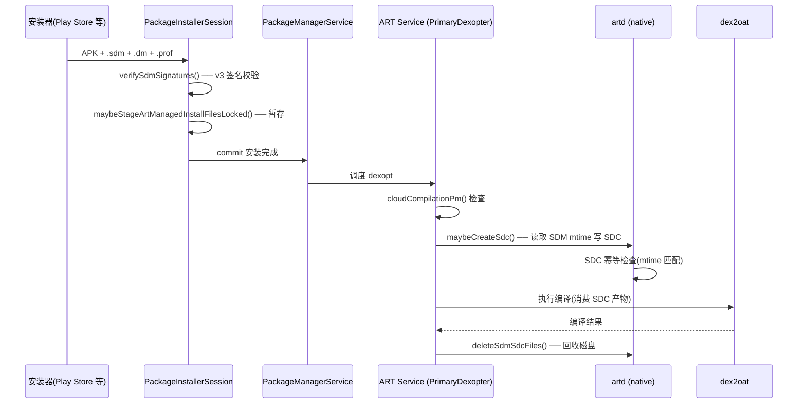

# 16.9 Android 17 SDM 安装编译链路性能

Android 16 在 AOSP 设备侧落地了 SDM（Secure Dex Metadata）产物管理路径。SDM 是云端编译产物的 ZIP 容器，承载 Play 侧 `dex2oat` 预编译结果，目标是让设备端跳过本地编译。本节拆解 SDM 从安装会话到 ART Service 产物管理的设备侧全链路，给出安装耗时影响、编译收益边界和排查入口。

SDM 的设备侧链路涉及五个阶段：(1) `PackageInstallerSession` 识别并暂存 `.sdm` 文件；(2) `verifySdmSignatures()` 用 APK 同一签名密钥校验；(3) ART Service 在 `PrimaryDexopter.onDexoptStart()` 中根据 `cloudCompilationPm()` flag 决定是否创建 SDC；(4) `artd` 读取 SDM 写出 SDC Companion；(5) dexopt 完成后 `deleteSdmSdcFiles()` 回收磁盘。

本节聚焦设备侧源码链路和性能影响，不覆盖 Play 端的 SDM 生成策略和灰度分发（公开资料不完整）。Profile 体系的职责划分和开发者控制点详见 16.6 节，`.dm` 文件与编译模式的实战配合详见 21.11 节。

## SDM 产物管理架构

### SDM 文件命名与存储位置

SDM 按 ISA 分文件命名：`base.apk` 在 arm64 设备上对应 `base.arm64.sdm`，在 x86_64 模拟器上对应 `base.x86_64.sdm`。`.dm` 一份就够，SDM 每个 ISA 独立一份。

命名规则来自 `art/libartbase/base/file_utils.cc`：

```cpp
// file_utils.cc line 718-721
std::string GetSdmFilename(const std::string& dex_location, InstructionSet isa) {
    return ReplaceFileExtension(dex_location,
        StringPrintf("%s%s", GetInstructionSetString(isa), kSdmExtension));
}
```

`kSdmExtension` 定义为 `".sdm"`，文件名由 DEX 路径去掉原始后缀，拼接 ISA 字符串和 `.sdm`。

[已验证: AOSP android-16.0.0_r1, art/libartbase/base/file_utils.cc line 718-721]

ART Service 通过 `ArtFileManager` 管理 SDM 产物的读写位置。`getWritableArtifacts()` 为 primary dex 构造 `SecureDexMetadataWithCompanionPaths`，覆盖两个存储位置：

- `ArtifactsLocation.SDM_DALVIK_CACHE`：Dalvik Cache 路径
- `ArtifactsLocation.SDM_NEXT_TO_DEX`：DEX 文件旁边

`getUsableArtifacts()` 在查找可用编译产物时也识别这两个位置。ART Service 把 SDM 产物和 OAT/VDEX/ART 同等对待，作为一类独立的编译产物参与查找和清理。

### SDM 与 DM 的关系

SDM 和 DM（Dex Metadata，`.dm` 文件）是两个不同的容器：

| 维度 | `.dm` (Dex Metadata) | `.sdm` (Secure Dex Metadata) |
|------|---------------------|------------------------------|
| 引入版本 | Android 9 (API 28) | Android 16 (API 36) |
| 内容 | profile + 可选 VDEX + config.pb | 云端编译产物（Play 侧 dex2oat 输出） |
| 签名校验 | manifest + 可选 fs-verity | APK 同一签名密钥（v3+ 签名块） |
| ISA 相关 | 否（单文件） | 是（per-ISA 命名） |
| 生命周期 | 安装时消费，编译后保留 | 编译完成后主动删除（回收磁盘） |

DM 的类型解析由 ART Service 侧的 `DexMetadataHelper.java` 处理，读取 ZIP 内的 `config.pb`，根据 profile entry 和 VDEX entry 判断类型：`TYPE_UNKNOWN`、`PROFILE`、`VDEX`、`PROFILE_AND_VDEX`、`NONE`、`ERROR`。这六种类型是 DM 容器的类型枚举，不是 SDM 的分类——SDM 作为云编译产物容器，其内部格式在公开源码中尚未完整暴露（`SdcReader::Load()` 的具体字段结构未公开）。

DM 进入安装流程后，由 `installd/dexopt.cpp` 的 `check_profile_exists_in_dexmetadata()` 和 `prepare_app_profile()` 消费：先打开 APK + `.dm` + reference profile，再用 `profman --copy-and-update` 合并写出新的 reference profile，交给 `dex2oat` 按 `speed-profile` 编译。

SDM 的消费者不是运行时，而是编译期。设备端 SDM 路径的目的是在有云端产物时跳过本地 `dex2oat`，编译完成后释放磁盘。

[已验证: AOSP android-16.0.0_r1, art/libartservice/service/java/com/android/server/art/DexMetadataHelper.java; frameworks/native/cmds/installd/dexopt.cpp]

### ART-managed Install Files 的范围

`ArtManagedInstallFileHelper` 定义了三类 ART-managed install files：`.dm`、`.prof`、`.sdm`（包括 per-ISA 的 `.<isa>.sdm`）。

```java
// ArtManagedInstallFileHelper.java line 41-44
private static final List<String> FILE_TYPES = List.of(
    ArtConstants.DEX_METADATA_FILE_EXT,      // .dm
    ArtConstants.PROFILE_FILE_EXT,            // .prof
    ArtConstants.SECURE_DEX_METADATA_FILE_EXT // .sdm
);
```

匹配规则是后缀判断，不涉及 I/O，在安装会话早期就能完成分类。`isArtManaged()` 对安装器传入的文件列表做过滤，只有这三类后缀的文件进入 ART 处理路径。

[已验证: AOSP android-16.0.0_r1, art/libartservice/service/java/com/android/server/art/ArtManagedInstallFileHelper.java line 41-58]

## 安装会话中的 SDM 处理

### 签名校验

`PackageInstallerSession` 在 stage 流程尾部调用 `verifySdmSignatures()`：

```java
// PackageInstallerSession.java line 4330-4360
private static void verifySdmSignatures(List<String> artManagedFilePaths,
        SigningDetails expectedSigningDetails) throws PackageManagerException {
    ParseTypeImpl input = ParseTypeImpl.forDefaultParsing();
    for (String path : artManagedFilePaths) {
        if (!path.endsWith(".sdm")) continue;
        // SDM is a format introduced in Android 16, so we don't need to support
        // older signature schemes.
        int minSignatureScheme = SigningDetails.SignatureSchemeVersion.SIGNING_BLOCK_V3;
        ParseResult<SigningDetails> verified =
                ApkSignatureVerifier.verify(input, path, minSignatureScheme);
        ...
        if (!expectedSigningDetails.signaturesMatchExactly(verified.getResult())) {
            throw new PackageManagerException(
                    INSTALL_FAILED_INVALID_APK,
                    "SDM signatures are inconsistent with APK");
        }
    }
}
```

三个要点：

1. **强制 v3 签名块**（APK Signature Scheme v3），不兼容 v1/v2。源码注释写明 "SDM is a format introduced in Android 16, so we don't need to support older signature schemes"
2. **签名必须与 APK 完全匹配**（`signaturesMatchExactly`），包括轮换密钥
3. 校验失败返回 `INSTALL_FAILED_INVALID_APK`，安装直接中止

源码注释同时写明："SDM is a file format that contains the cloud compilation artifacts. As a requirement, the SDM file should be signed with the same key as the APK."这是公开源码中唯一直接确认 SDM 与 cloud compilation 对应关系的注释。

[已验证: AOSP android-16.0.0_r1, frameworks/base/services/core/java/com/android/server/pm/PackageInstallerSession.java line 4330-4360]

### 暂存流程

签名校验通过后，`maybeStageArtManagedInstallFilesLocked()` 把 `.sdm`/`.dm`/`.prof` 暂存到目标路径：

```java
// PackageInstallerSession.java line 4025-4055
@FlaggedApi(com.android.art.flags.Flags.FLAG_ART_SERVICE_V3)
@GuardedBy("mLock")
private void maybeStageArtManagedInstallFilesLocked(File origFile, File targetFile,
        List<String> artManagedFilePaths) throws PackageManagerException {
    for (String path : ArtManagedInstallFileHelper.filterPathsForApk(
                 artManagedFilePaths, origFile.getPath())) {
        ...
        File targetArtManagedFile = new File(
                ArtManagedInstallFileHelper.getTargetPathForApk(path, targetFile.getPath()));
        stageFileLocked(artManagedFile, targetArtManagedFile);
    }
}
```

整个 stage 过程对 SDM 的 I/O 开销是文件复制 + 签名校验，与 `.dm` 共用同一条路径。`FLAG_ART_SERVICE_V3` 是这套流程的 feature flag，说明 SDM 支持需要 ART Service V3 才能启用。

[已验证: AOSP android-16.0.0_r1, frameworks/base/services/core/java/com/android/server/pm/PackageInstallerSession.java line 4025-4055]

## cloudCompilationPm() 标志与 SDC 创建

### 标志控制

SDM 的设备端消费路径受 `Flags.cloudCompilationPm()` 控制。`PrimaryDexopter.onDexoptStart()` 在条件满足时调用 `maybeCreateSdc()`：

```java
// PrimaryDexopter.java line 183-190
@Override
protected void onDexoptStart(@NonNull DetailedPrimaryDexInfo dexInfo) throws RemoteException {
    if (!mInjector.isPreReboot() && android.content.pm.Flags.cloudCompilationPm()) {
        boolean isInDalvikCache = isInDalvikCache();
        for (Abi abi : getAllAbis(dexInfo)) {
            maybeCreateSdc(dexInfo, abi.isa(), isInDalvikCache);
        }
    }
}
```

条件有三个：

1. 不是 pre-reboot 编译（重启前预编译阶段不处理 SDM）
2. `cloudCompilationPm()` flag 开启（OEM 可关闭）
3. 对每个 ABI 独立处理（SDM 按 ISA 分文件）

[已验证: AOSP android-16.0.0_r1, art/libartservice/service/java/com/android/server/art/PrimaryDexopter.java line 183-190]

### SDC 创建过程

`maybeCreateSdc()` 调用 `artd` native 端创建 SDC（Secure Dex Metadata Companion）文件：

```java
// PrimaryDexopter.java line 192-205
private void maybeCreateSdc(@NonNull DetailedPrimaryDexInfo dexInfo, @NonNull String isa,
        boolean isInDalvikCache) throws RemoteException {
    // SDC file doesn't contain sensitive data, so it can always be public.
    PermissionSettings permissionSettings =
            getPermissionSettings(dexInfo, true /* canBePublic */);
    OutputSecureDexMetadataCompanion outputSdc =
            AidlUtils.buildOutputSecureDexMetadataCompanion(
                    dexInfo.dexPath(), isa, isInDalvikCache, permissionSettings);
    try {
        mInjector.getArtd().maybeCreateSdc(outputSdc);
    } catch (ServiceSpecificException e) {
        AsLog.e("Failed to create sdc for " + AidlUtils.toString(outputSdc.sdcPath), e);
    }
}
```

SDC 不含敏感数据，权限可设为 public。创建失败只打日志不阻塞编译流程。

[已验证: AOSP android-16.0.0_r1, art/libartservice/service/java/com/android/server/art/PrimaryDexopter.java line 192-205]

`artd` 端的 `maybeCreateSdc()` 用 SDM 的修改时间匹配 SDC：

```cpp
// artd.cc line 1000-1030
ndk::ScopedAStatus Artd::maybeCreateSdc(
    const OutputSecureDexMetadataCompanion& in_outputSdc) {
  std::string sdm_path = OR_RETURN_FATAL(BuildSdmPath(in_outputSdc.sdcPath));
  std::string sdc_path = OR_RETURN_FATAL(BuildSdcPath(in_outputSdc.sdcPath));

  Result<std::unique_ptr<File>> sdm_file = OpenFileForReading(sdm_path);
  if (!sdm_file.ok()) {
    if (sdm_file.error().code() == ENOENT) {
      // No SDM file found. That's typical.
      return ScopedAStatus::ok();
    }
    return NonFatal(sdm_file.error().message());
  }
  struct stat sdm_st = OR_RETURN_NON_FATAL(Fstat(*sdm_file.value()));

  std::string error_msg;
  std::unique_ptr<SdcReader> sdc_reader = SdcReader::Load(sdc_path, &error_msg);
  if (sdc_reader != nullptr &&
      sdc_reader->GetSdmTimestampNs() == TimeSpecToNs(sdm_st.st_mtim)) {
    // Already has an SDC file for the SDM file.
    return ScopedAStatus::ok();
  }
  ...
}
```

两条信息：

- 源码注释 `"No SDM file found. That's typical."`——设备上只有少数包命中 SDM，这是预期行为
- SDC 通过内嵌 `sdmTimestampNs` 与 SDM 的 mtime 对齐，命中就跳过重写（幂等性保证）

[已验证: AOSP android-16.0.0_r1, art/artd/artd.cc line 1000-1030]

## SDM 生命周期与磁盘回收

### 编译完成后的即时清理

`PrimaryDexopter.onDexoptTargetResult()` 在 dexopt 成功后立刻删除 SDM 和 SDC：

```java
// PrimaryDexopter.java line 207-217
@Override
protected void onDexoptTargetResult(
        @NonNull DexoptTarget<DetailedPrimaryDexInfo> target,
        @DexoptResult.DexoptResultStatus int status) throws RemoteException {
    // An optimization to release disk space as soon as possible. The SDM and SDC
    // files would be deleted by the file GC anyway if not deleted here.
    if (status == DexoptResult.DEXOPT_PERFORMED && !mInjector.isPreReboot()) {
        mInjector.getArtd().deleteSdmSdcFiles(
                AidlUtils.buildSecureDexMetadataWithCompanionPaths(
                        target.dexInfo().dexPath(), target.isa(), target.isInDalvikCache()));
    }
}
```

源码注释说明这是 disk space optimization——SDM 和 SDC 在文件 GC 中也会被清理，但编译完成后立刻回收更高效。SDM/SDC 在本地 dexopt 完成后不被运行时消费，消费者是编译期的 `dex2oat`。

[已验证: AOSP android-16.0.0_r1, art/libartservice/service/java/com/android/server/art/PrimaryDexopter.java line 207-217]

### 卸载与重装的清理

`ArtManagerLocal.deleteDexoptArtifacts()` 在卸载或重装时清理所有编译产物。SDM/SDC 和 VDEX/ODEX/ART 同等对待，三组分开循环清理：

```java
// ArtManagerLocal.java line 200-250
public DeleteResult deleteDexoptArtifacts(
        @NonNull PackageManagerLocal.FilteredSnapshot snapshot,
        @NonNull String packageName) {
    ...
    WritableArtifactLists list =
            mInjector.getArtFileManager().getWritableArtifacts(pkgState, pkg,
                    ArtFileManager.Options.builder()
                            .setForPrimaryDex(true)
                            .setForSecondaryDex(true)
                            .build());
    for (ArtifactsPath artifacts : list.artifacts()) {
        freedBytes += mInjector.getArtd().deleteArtifacts(artifacts);
    }
    for (RuntimeArtifactsPath runtimeArtifacts : list.runtimeArtifacts()) {
        freedBytes += mInjector.getArtd().deleteRuntimeArtifacts(runtimeArtifacts);
    }
    for (SecureDexMetadataWithCompanionPaths sdmSdcFiles : list.sdmFiles()) {
        freedBytes += mInjector.getArtd().deleteSdmSdcFiles(sdmSdcFiles);
    }
    return DeleteResult.create(freedBytes);
}
```

方法注释明确写道："Deletes dexopt artifacts (including cloud dexopt artifacts) of a package... This includes VDEX, ODEX, ART, SDM, and SDC files."

[已验证: AOSP android-16.0.0_r1, art/libartservice/service/java/com/android/server/art/ArtManagerLocal.java line 200-250]

### 完整设备侧调用链



文字版调用链：

```
安装器 (APK + .sdm + .dm + .prof)
    │
    ▼
PackageInstallerSession.commitLocked()
    │  verifySdmSignatures()               ── 校验 .sdm 签名 = APK 签名
    │  maybeStageArtManagedInstallFilesLocked() ── 暂存到 /data/app/...
    ▼
PMS 安装完成 → ART Service 调度
    │  PrimaryDexopter.onDexoptStart()
    │      └─ cloudCompilationPm() flag 开启时
    │           └─ maybeCreateSdc()         ── 读取 SDM mtime, 写 SDC
    ▼
artd (native)
    │  Artd::maybeCreateSdc()
    │      └─ 比对 SDM mtime, SDC 缺失或过期则重写
    ▼
dex2oat 执行
    │  读取 SDC 携带的编译产物
    ▼
PrimaryDexopter.onDexoptTargetResult()
    └─ 成功 → deleteSdmSdcFiles()         ── 释放磁盘
卸载 / 重装 → ArtManagerLocal.deleteDexoptArtifacts()
    └─ 三组循环: artifacts / runtimeArtifacts / sdmFiles
```

## SDM 对安装和启动性能的影响

### 安装阶段

SDM 的安装性能收益来自跳过本地 `dex2oat`：

| 场景 | 无 SDM | 有 SDM（云端编译命中） |
|------|--------|----------------------|
| APK 复制 | 相同 | 相同 |
| 签名校验 | `.dm` manifest + fs-verity | `.dm` + `.sdm` v3 签名校验（额外开销） |
| dexopt | 本地 `dex2oat`（CPU + I/O 密集） | 跳过或大幅缩短（读取预编译产物） |
| 产物写入 | OAT + VDEX + ART | SDC + OAT/VDEX/ART |
| 后续清理 | 无 | `deleteSdmSdcFiles()` 回收 |

低端设备受益最大：`dex2oat` 同时占用 CPU、内存和闪存 I/O，在低端设备上可能占安装总耗时的 50% 以上。SDM 命中时，这段开销几乎消失。

额外开销有两处：(1) `.sdm` 文件本身的 I/O 传输和存储；(2) `verifySdmSignatures()` 的签名校验。相对于 `dex2oat` 的开销，这两项可以忽略。

### 启动阶段

SDM 携带的云端编译产物对启动性能的影响通过两条路径：

1. **直接路径**：SDM 中的预编译产物被 dexopt 消费，应用首次启动时已有 OAT/VDEX 可用，跳过解释执行和 JIT 热身
2. **间接路径**：云端 profile 基于真实用户数据生成，覆盖范围可能超过开发者提交的 Baseline Profile，编译质量更高

Baseline Profile 面向 Day-0（新安装设备），Startup Profile 面向 DEX 布局优化，Cloud Compilation / SDM 面向分发规模。三层叠加的理论收益：

- Baseline Profile：首次启动代码执行速度提升约 30%（Google 官方数据）
- Startup Profile：在 Baseline Profile 基础上额外提升 15-30%（DEX 布局优化，减少页面换入）
- Cloud Compilation（SDM 命中）：省去安装期 dex2oat 等待，编译质量接近或超过本地 `bg-dexopt`

量化 SDM 对启动的边际收益需要控制变量：同一台设备、同一个 APK，分别用有 / 无 SDM 的安装包对比 TTID / TTFD。目前公开资料没有给出 SDM 单独的启动提升数据，只能从编译状态间接推断。

### 排查入口

验证 SDM 是否命中的方法：

```bash
# 查看编译状态和编译原因
adb shell dumpsys package dexopt | grep -A 10 com.example.app

# 检查 SDM/SDC 文件是否存在（编译前检查）
adb shell ls -la /data/app/*/com.example.app*/oat/arm64/

# 查看 ART Service 日志
adb logcat -s ArtServiceLogging

# 强制重新编译并观察结果
adb shell pm compile -m speed-profile -f -v com.example.app
```

如果编译状态显示 `compilationReason=install` 且 `actualCompilerFilter=speed-profile`，安装耗时却明显低于同级别设备，可能说明 SDM 命中了云端编译产物——设备端跳过了大部分 `dex2oat` 工作。

[适用版本: Android 16 (API 36) - Android 17 (API 37)]

## SDM 安全模型

### 签名绑定

SDM 的安全设计基于签名绑定：SDM 必须用与 APK 相同的签名密钥签名，最低要求 APK Signature Scheme v3。这防止了两类攻击：

1. **产物替换**：攻击者无法用自签名的 SDM 替换原始 SDM，签名不匹配时 `verifySdmSignatures()` 直接抛出 `INSTALL_FAILED_INVALID_APK`
2. **降级攻击**：v3 签名包含 rotation 回退保护，防止用旧密钥签名的 SDM 替换新密钥签名的 APK

SDM 没有对应的独立 system property 开关——校验逻辑硬编码在 `verifySdmSignatures()` 中，强制 v3 签名校验，不受 `pm.dexopt.*` 系列属性控制。

### DM 校验开关对比

DM（`.dm`）有两个独立于 SDM 的校验开关：

- `pm.dexopt.dm.require_manifest=true`：要求 `.dm` 内嵌 JSON manifest，校验包名与版本
- `pm.dexopt.dm.require_fsverity=true`：要求 `.dm` 携带 fs-verity 摘要

这两个 prop 默认 false。开启时 DM 的 manifest 和 fs-verity 缺失会导致安装失败；关闭时仍然允许安装，但 ART Service 的 dexopt 消费路径可能因为 manifest 不匹配而降级。

SDM 不走这两个 prop，走独立的 v3 签名校验。两套校验机制互不干扰。

[已验证: AOSP android-16.0.0_r1, frameworks/base/core/java/android/content/pm/dex/DexMetadataHelper.java line 44-53]

## 扩展

### SDM 与 Baseline Profile 的协同

SDM 和 Baseline Profile 在编译管线中扮演不同角色，不存在互斥关系：

- Baseline Profile 作为 `.dm` 内的 `primary.prof` 进入安装流程，被 `installd/dexopt.cpp` 的 `prepare_app_profile()` 合并到 reference profile
- SDM 作为预编译产物容器，可能携带与 Baseline Profile 等价或更优的编译结果
- 两者同时存在时，SDM 中的云端编译产物可能已包含 Baseline Profile 指定的热路径，本地 dexopt 可以直接使用 SDM 的产物

开发者不需要在 "提供 Baseline Profile" 和 "等待 Cloud Compilation" 之间二选一。两者在设备端的处理路径完全独立：Baseline Profile 是开发者可控的保底，SDM 是 Play 分发的增量优化。CI 中应继续生成和验证 Baseline Profile，SDM 的命中与否不受应用侧控制。

[结构参考: intake/research-feeds/2026-04-07-11-android16-cloud-compilation-baseline-startup-profiles.md]

### 多 APK / App Bundle 场景

SDM 按 primary dex 的 ISA 分文件，当前源码只处理了 primary dex 路径。对于 split APK 和 App Bundle：

- 每个 split 的 dex 文件是否对应独立的 SDM，公开源码尚未暴露
- `ArtFileManager.getWritableArtifacts()` 当前接收 `forPrimaryDex(true)` 和 `forSecondaryDex(true)` 两个参数，没有 split 专用路径
- Android 17 是否扩展到 secondary dex，需要 android-17.0.0_r1 tag 发布后确认

[待验证: secondary dex SDM 支持]

### OEM 定制 ROM 的适配

`cloudCompilationPm()` flag 允许 OEM 关闭整条 SDM 处理路径。OEM 定制 ROM 的适配边界：

1. 关闭 `cloudCompilationPm()` 后，安装流程仍然正常处理 `.dm` 和 `.prof`，不走 SDM → SDC 的创建路径
2. OEM 替换应用商店时，如果分发渠道不提供 SDM 文件，`artd` 的 `maybeCreateSdc()` 会遇到 ENOENT。源码注释明确说 "That's typical"——这是预期行为，不影响正常安装
3. OEM 不能自定义 SDM 的签名校验逻辑（硬编码在 `verifySdmSignatures()` 中），但可以通过 `pm.dexopt.*` 系列 system property 调整整体编译策略

## 版本差异与 Android 17 预期

| 版本 | SDM 支持 | 关键变化 |
|------|---------|---------|
| Android 14 (API 34) | 无 | ART Service 上线，`.dm` 已有 |
| Android 15 (API 35) | 无 | `.dm` 流程稳定 |
| Android 16 (API 36) | 设备端基础 | SDM 格式引入；`verifySdmSignatures()`；`maybeCreateSdc()`；`ArtManagedInstallFileHelper`；`FLAG_ART_SERVICE_V3` |
| Android 17 (API 37) | 预期增强 | `cloudCompilationPm()` 可能默认开启；SDM 可能扩展到 secondary dex [未进入 Android 17 稳定标签，待验证] |

Android 17 的 android-17.0.0_r1 tag 尚未公开发布。Android 17 预期基于 android-16-release 的延续性推断，具体变化需要 tag 发布后用源码确认。

## 交叉引用

- **16.6 节**：Cloud Profile、Baseline Profile、Startup Profile 的职责边界，ART Service 编译策略，开发者控制点
- **1.9 节**：PMS 安装链路中 `PackageInstallerSession` 和 `InstallPackageHelper` 的位置
- **1.23 节**：Staged Install 的原子性机制和安装阶段拆分
- **21.11 节**：`.dm` 文件与编译模式的实战配合，`pm art dump` 验证命令
