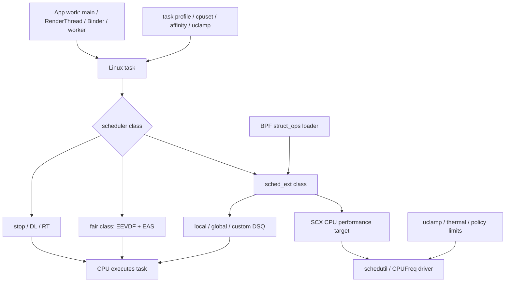
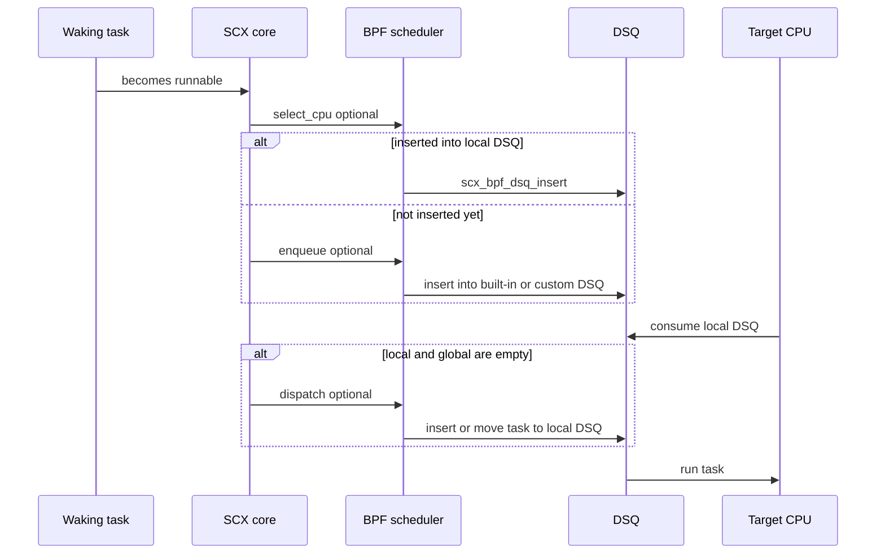

# sched_ext 与 OEM 调度实践

## 阅读前要分开的三件事

Android 17 的 arm64 GKI（Generic Kernel Image，通用内核镜像）配置含有 `CONFIG_SCHED_CLASS_EXT=y`。sched_ext 是 Linux 的可扩展调度类，允许 eBPF（extended Berkeley Packet Filter）程序提供普通任务的调度策略；eBPF 程序加载前要经过安全校验，再在内核中执行。这个配置只说明内核编译了 sched_ext，无法证明设备当前加载了 BPF 调度器，也无法证明某个线程正由该调度器管理。

排查设备时要依次确认三个层次：

1. **编译能力**：内核配置中有没有 `CONFIG_SCHED_CLASS_EXT=y`。
2. **运行状态**：`/sys/kernel/sched_ext/state` 是否为 `enabled`，`root/ops` 显示哪个调度器。
3. **任务范围**：当前调度器采用 full（接管全部符合条件的普通任务）还是 partial（只接管显式 `SCHED_EXT` 任务）模式，目标线程是否在接管范围内。

这三个层次不能互相代替。设备可能编入 sched_ext 却从未加载 BPF 程序；也可能本次开机加载过又退出；还可能处于 partial 模式，只处理显式使用 `SCHED_EXT` 的少量线程。

本文核对平台行为时以 Android 17 / API 37 和内核源码 tag（固定版本标签）`android17-6.18-2026-06_r6` 为准。Linux 6.12 只用于说明 sched_ext 进入主线的历史背景；OEM（设备厂商）向旧内核移植（backport）后的行为仍要以设备源码和运行数据为准。

## sched_ext 在 Android CPU 调度栈中的位置

应用创建的 Java 线程、native 线程（通常承载 C/C++ 代码）和 Binder 线程进入内核后，都以 `task_struct`（Linux 的任务数据结构）表示。线程池、协程调度器和 WorkManager 决定工作怎样映射到线程；sched_ext 处理已经处于可运行状态（runnable，即工作已就绪但可能仍在等待 CPU）的普通任务怎样选 CPU、排队和获得运行机会。两者处在不同层级。

Android 上还要同时观察以下机制：

- **调度类**：stop、deadline（DL）、real-time（RT，实时）、sched_ext、fair（公平）和 idle（空闲）等调度类按内核定义的顺序参与选取。sched_ext 面向普通任务，不接管 RT、DL 和 stop 调度类。
- **任务约束**：CPU affinity（亲和性）限制单个任务可去的 CPU，cpuset 用控制组限定一组任务的 CPU 范围，task profile（任务配置档）可以组合多项约束；uclamp（利用率钳制）给调度利用率设置上下界。
- **CPU 选择**：未启用 sched_ext 时，普通任务由 fair 调度类的 EEVDF（按虚拟截止时间兼顾公平与延迟）、公平性逻辑与 EAS（Energy Aware Scheduling，能效感知调度）等路径处理。启用后，BPF 调度器可以接管普通任务的选核和排队。
- **频率与容量**：schedutil、CPUFreq 驱动、uclamp、thermal pressure（温控导致的可用容量折减）和硬件限制共同决定可用性能。sched_ext 可以提供 CPU performance target（性能目标值），却无权绕过温控或驱动上限。

下面的图用于定位 sched_ext 与 Android 其他调度组件之间的关系。



图中有两条相互关联的输出：任务何时在哪个 CPU 上运行，以及该 CPU 请求多高的性能。分析卡顿时，调度 trace（时间线记录）要和频率、CPU 空闲状态、温控数据放在同一时间轴上。

## 从 GKI 编译能力到运行时启用

Android 17 的 `arch/arm64/configs/gki_defconfig` 明确设置 `CONFIG_SCHED_CLASS_EXT=y`。`init/Kconfig` 中的 `EXT_GROUP_SCHED` 依赖 `SCHED_CLASS_EXT && CGROUP_SCHED`，默认值为 `y`。因此 GKI 具备 sched_ext 及其 cgroup（control group，控制组）相关接口。

BPF 调度器仍需由用户空间 loader（负责加载 BPF 对象的程序）通过 BPF `struct_ops` 挂载。`struct_ops` 允许 BPF 程序填充内核定义的操作表。启用成功后，内核保存 `ops.name`，切换符合条件的任务，并增加 `enable_seq`。退出 loader、触发内核调试按键序列 `SysRq-S`、检测到内部错误，或出现可运行任务长时间得不到调度（runnable task stall）时，sched_ext 会中止当前 BPF 调度器，把任务交还给 fair 调度类。

这个版本不支持原地更新正在运行的 `struct_ops`。`bpf_scx_update()` 返回表示“不支持该操作”的 `-EOPNOTSUPP`；升级策略需要解除挂载后重新加载。这个过程可能短暂经过 fair 调度类，性能实验应把切换窗口排除在稳定样本之外。

### sysfs 的目录层级和字段含义

sysfs 是内核向用户空间暴露状态的虚拟文件系统。Android 17 6.18 中，`/sys/kernel/sched_ext/` 的全局属性与当前调度器属性分处两层：

| 路径 | 含义 | 容易误读的地方 |
|---|---|---|
| `state` | `disabled`、`enabling`、`enabled` 或 `disabling` | 只有 `enabled` 表示此刻有调度器运行 |
| `switch_all` | 当前调度器是否接管全部符合条件的普通策略任务 | `1` 对应 full；调度器未运行时不要单独解释该值 |
| `nr_rejected` | 当前或最近一次启用周期内，显式请求 `SCHED_EXT` 却被拒绝的累计次数 | 每次启用时归零；它不是调度器加载失败次数 |
| `hotplug_seq` | CPU hotplug（上线或下线变化）序列号 | 它不是 CPU 上下线数量 |
| `enable_seq` | 本次开机成功启用调度器的累计次数 | 大于零只能证明曾经启用过 |
| `root/ops` | 当前 BPF 调度器的 `ops.name` | 正确路径含 `root/` |
| `root/events` | 当前调度器的 SCX 事件计数 | 这是纯文本文件，不是事件目录 |

`root` kobject（内核对象）只在当前调度器对象存在时建立。因此 `root/ops` 读不到，可能是调度器未启用、权限受限或 sysfs 未挂载；单凭读取失败无法区分原因。

## full 与 partial 决定接管范围

Android 17 的 sched_ext 文档对接管范围给出了明确规则：

- BPF 调度器处于运行状态，并且没有设置 `SCX_OPS_SWITCH_PARTIAL` 时，`SCHED_NORMAL`、`SCHED_BATCH`、`SCHED_IDLE` 和 `SCHED_EXT` 任务由 sched_ext 处理。
- 设置 `SCX_OPS_SWITCH_PARTIAL` 后，只有显式采用 `SCHED_EXT` 的任务由 sched_ext 处理；其余普通策略任务留在 fair 调度类。
- 没有 BPF 调度器运行时，显式设置为 `SCHED_EXT` 的任务按 fair 调度类处理，行为接近 `SCHED_NORMAL`。

full 模式下，普通应用线程的调度策略字段仍可能显示 `SCHED_NORMAL`。因此，在 `/proc/<pid>/sched` 中搜索字符串 `ext`，无法可靠判断该线程是否正在被 sched_ext 接管。应把 `state`、`switch_all`、调度器名称和目标线程策略放在一起判断。

partial 模式也不能由某个 OEM 节点的名字直接推断。厂商节点 `partial_ctrl` 与 `SCX_OPS_SWITCH_PARTIAL` 是否一一对应，需要设备内核源码或运行时切换证据支持。

## `struct sched_ext_ops`：回调有默认行为

BPF 调度器通过 `struct sched_ext_ops` 提供策略。Android 17 6.18 支持选核、入队、分发、运行状态、任务生命周期、CPU 热插拔、cgroup 和调试转储等多类回调。接口还会随内核演进，不宜用固定回调数量描述 ABI（应用二进制接口）。DSQ（dispatch queue，分发队列）是 sched_ext 保存待运行任务的队列，分为每个 CPU 的 local DSQ、共享的 global DSQ 和策略自建队列。

常用回调可以这样理解：

| 回调 | 发生阶段 | 未实现时的边界 |
|---|---|---|
| `select_cpu()` | 唤醒、`fork` 或 `exec` 后的早期 CPU 选择 | 内核提供默认选择行为；返回值只是优化提示 |
| `enqueue()` | 可运行任务需要进入调度队列 | 默认送入 global DSQ |
| `dispatch()` | local 与 global DSQ 都没有可运行任务 | 只用内置 DSQ 且在入队阶段直接插入时可以省略 |
| `running()` / `stopping()` | 任务开始或停止占用 CPU | 供策略维护虚拟时间和运行统计 |
| `set_weight()` / `set_cpumask()` | 权重或允许 CPU 集合变化 | 策略可同步自己的任务状态 |
| `init_task()` / `exit_task()` | 任务进入或离开调度器生命周期 | 适合分配和释放任务专属状态 |
| `cpu_online()` / `cpu_offline()` | CPU 上线或下线 | 适合维护每 CPU 队列或容量信息 |
| `dump*()` | 错误转储 | 供异常退出时输出策略状态 |

`select_cpu()` 属于可选回调。官方示例明确说明，示例中的实现与默认 `select_cpu` 行为相同，删除该实现也能工作。`enqueue()` 同样有默认的 global DSQ 行为。内核的 `validate_ops()` 主要检查不兼容的 flag（选项位）组合和已废弃配置，没有要求每个调度器实现 `select_cpu()`。

### 一次唤醒怎样走到 CPU

下面的流程展示普通任务在 sched_ext 中最常见的调度周期。



`select_cpu()` 选出的 CPU 只是提示。结果超出任务的 allowed cpumask（允许 CPU 掩码）时，内核会忽略它；即使结果合法，任务也可能在后续阶段运行到另一颗允许的 CPU。若 `select_cpu()` 已把任务直接插入 local DSQ，`enqueue()` 会被跳过。

## DSQ、时间片与进展保障

CPU 只执行自己 local DSQ 中的任务。local DSQ 为空时，sched_ext 核心实现会尝试从 global DSQ 取任务；仍然为空时才调用 `dispatch()`，让 BPF 策略从自定义队列或其他位置补充任务。

Android 17 6.18 对外公开的内置 DSQ ID 包括：

- `SCX_DSQ_GLOBAL`
- `SCX_DSQ_LOCAL`
- `SCX_DSQ_LOCAL_ON | cpu`

自定义 DSQ 可以采用 FIFO（first in, first out，先进先出），也可以用 `scx_bpf_dsq_insert_vtime()` 维护虚拟时间顺序。内置 DSQ 采用 FIFO。文档中的 `scx_bpf_dsq_insert()` 和 `scx_bpf_move_to_local()` 是该版本调度周期里的主要 BPF helper（内核提供给 BPF 程序调用的辅助函数）。

`SCX_SLICE_DFL` 在该 tag 中为 20 ms。它是调度器没有提供其他时间片（slice）时使用的默认值，不是 Android 帧预算，也不保证任务连续运行 20 ms。更高优先级调度类、阻塞、抢占和策略自身的重新入队都可能提前结束本次运行。

`root/events` 里能看到 `BYPASS_DURATION`、`BYPASS_DISPATCH` 与 `BYPASS_ACTIVATE` 等内部事件计数。bypass 指内核暂时绕过 BPF 策略的处理过程。不能根据这些事件名虚构一个面向 BPF 程序公开的 `SCX_DSQ_BYPASS` 常量；Android 17 6.18 的公开内置 DSQ 列表没有这个 ID。

sched_ext 还有进展保障与自动回退：可运行任务长时间得不到调度、BPF 程序触发错误或调度器异常退出时，内核会终止该策略并回到 fair 调度类。这能防止失效策略长期阻塞系统，但切换本身仍可能造成短时延迟波动。

## Android 17 中 sched_ext 与 schedutil 的关系

Android 17 6.18 把 sched_ext 的 CPU 性能目标值接入 schedutil。下面的精简源码用于说明 full 与 partial 模式的差别，代码来自该 tag 的 `kernel/sched/cpufreq_schedutil.c`。

```c
static void sugov_get_util(struct sugov_cpu *sg_cpu, unsigned long boost)
{
    unsigned long min, max, util = scx_cpuperf_target(sg_cpu->cpu);

    if (!scx_switched_all())
        util += cpu_util_cfs_boost(sg_cpu->cpu);
    util = effective_cpu_util(sg_cpu->cpu, util, &min, &max);
    util = max(util, boost);
    sg_cpu->util = sugov_effective_cpu_perf(
        sg_cpu->cpu, util, min, max);
}
```

full 模式中，`scx_switched_all()` 为真，schedutil 从 sched_ext 的 CPU 性能目标值起算，不再叠加 fair 调度类的 `cpu_util_cfs_boost()`。partial 模式仍有 fair 任务，代码会加上 fair 利用率（util）。两种模式随后都经过 `effective_cpu_util()`、I/O 等待的临时提升值（boost）、uclamp 与策略上下界等处理。

同文件的 `sugov_hold_freq()` 在 full 模式直接返回 `false`，源码给出的理由是 fair 调度类的保频启发式不适合 SCX，频率目标应跟随 BPF 调度器。由此可以得到两个工程结论：

- BPF 策略若接管全部普通任务，需要同步提供合理的 CPU 性能目标值；只改 DSQ 排序可能让频率响应与调度意图脱节。
- sched_ext 提供的目标值仍受 uclamp、CPUFreq 策略、驱动、温控造成的容量折减和硬件频点限制。目标值很高也不保证 CPU 运行在最高频点。

## Android vendor hook 与 OEM 策略边界

Android common 内核在 sched_ext 核心实现中放置了一组 `android_vh_*` vendor hook（供厂商模块挂接逻辑的内核钩子）。Android 17 tag 能看到的触发点涵盖：

- sched_ext 启用状态变化；
- 任务切入或切出 SCX class；
- 选核后的 CPU 可运行性和 `cpus_allowed` 变化；
- 入队、迁移与时间片修正；
- 调度 tick（周期性的调度时钟）处理与异常退出通知。

这些 hook 允许厂商模块在指定触发点补充产品策略。它们可以影响某些决定或状态流转，所以分析 Android 设备时不能假定同一个 BPF 程序在所有 OEM 内核上表现相同。hook 的数量和含义会随 tag 变化，正文不把某个统计值当成稳定 ABI。

vendor hook 本身没有给出厂商策略。要确认 hook 上注册了什么实现，仍需厂商模块源码、符号信息、trace 或设备实验。

### 怎样看待 `hmbird_sched` 公开线索

GitHub 上的 `Wuzikh1/sched_ext` 仓库包含 `hmbird_sched_proc_main.c`，代码创建了 `/proc/hmbird_sched` 目录及 `scx_enable`、`partial_ctrl`、`cpuctrl_*`、`slim_*` 等 proc 节点。proc 节点是内核通过 `/proc` 暴露的虚拟控制或状态文件。这个仓库不属于 OPPO 官方组织，也没有提供可验证的发布声明，因此只能作为第三方公开线索。

文件名和 proc 节点能支持的结论很有限：

- 某套代码定义过这些厂商控制入口；
- 节点可能与调度器启停、任务分组、频率控制或调试有关；
- 设备若暴露相同节点，可以继续做源码和行为比对。

以下推断没有足够证据：

- `partial_ctrl` 一定直接修改 `SCX_OPS_SWITCH_PARTIAL`；
- `cpuctrl_high_ratio` 一定映射到 `scx_bpf_cpuperf_set()`；
- 某个名含 `frame` 的参数数值代表固定刷新率策略；
- 使用特定 SoC（系统级芯片）的设备都启用同一套调度算法；
- 这些控制文件等同于完整 BPF `struct sched_ext_ops` 实现。

高通、联发科或某个手机品牌的名称也不能替代设备证据。量产状态要按内核 tag、固件版本和具体型号记录。

## 它怎样影响前台交互

sched_ext 对体验的影响沿着四条路径传播。

### 唤醒与 CPU 选择

主线程、RenderThread、Binder 线程和执行短任务的工作线程（worker）会频繁睡眠与唤醒。合理的 CPU 提示可以减少唤醒后的 runnable 等待，错误提示则可能带来额外迁移、唤醒空闲 CPU，或让任务在容量不足的 CPU 上排队。allowed cpumask 仍是硬约束。

### DSQ 中的相对顺序

自定义 DSQ 可以按任务组、虚拟时间或场景规则排序。前台任务提前获得 CPU 时，后台工作和系统服务可能等待更久。只看应用的平均帧率，容易漏掉 Binder 回复、`system_server` 或 SurfaceFlinger 一侧的尾延迟；尾延迟指一批请求中最慢那部分请求的耗时。

### CPU 性能目标值

调度器可以让 schedutil 更快请求容量，也可能因目标值过高造成能耗和温升。温控开始压频后，前段时间获得的延迟收益可能消失。实验至少要覆盖冷机、热稳态（温度和频率不再持续漂移）和温控限制三个阶段。

### 调度类边界

RT、DL 与 stop 调度类不属于 sched_ext 接管的普通任务范围。Android 的 RenderThread、音频线程或系统关键线程可能被系统框架或设备厂商设成不同策略，也可能带有 CPU 亲和性、uclamp 或 task profile。线程名相同并不保证调度属性相同。

迁移次数本身没有固定的好坏方向。减少跨 CPU 集群（cluster）迁移可能降低缓存（cache）失效与功耗，但把任务留在拥塞或降频的 CPU 上会拉长 runnable latency（任务已就绪却等待 CPU 的时间）。需要把等待时间、运行位置、频率和帧时间放在一起解释。

## 在设备上做只读核查

下面的命令只读取内核能力、当前 sched_ext 状态和常见厂商节点，适合先建立设备事实表。

```bash
adb shell uname -r
adb shell 'zcat /proc/config.gz 2>/dev/null | grep -E "CONFIG_SCHED_CLASS_EXT|CONFIG_EXT_GROUP_SCHED"'
adb shell 'for f in state switch_all nr_rejected hotplug_seq enable_seq; do
  printf "%s=" "$f"
  cat "/sys/kernel/sched_ext/$f" 2>/dev/null || echo inaccessible
done'
adb shell 'for f in ops events; do
  echo "[$f]"
  cat "/sys/kernel/sched_ext/root/$f" 2>/dev/null || echo inaccessible
done'
adb shell 'ls -la /proc/hmbird_sched 2>/dev/null'
```

输出的解释要保守：配置文件读不到可能是 `/proc/config.gz` 没开放；sysfs 读不到可能是调度器未运行、权限不足或路径未挂载；厂商目录存在也不能证明其中的主开关处于启用状态。若要读取节点内容，先确认操作为只读，并记录固件 build fingerprint（唯一标识系统构建版本的字符串）。

建议为每台设备保存以下字段：

| 字段 | 示例 | 用途 |
|---|---|---|
| build fingerprint | 完整字符串 | 固定固件版本 |
| kernel release | `uname -r` 输出 | 区分 GKI 与厂商构建 |
| `state` / `switch_all` | `enabled` / `1` | 区分当前状态和模式 |
| `root/ops` | 调度器名称 | 识别已挂载策略 |
| `enable_seq` | 数值 | 判断本次开机是否发生过成功启用 |
| `root/events` | 全量快照 | 比较实验前后的异常与回退事件 |
| target thread policy | 调度策略、CPU 亲和性、cpuset、uclamp | 确认任务边界 |

## 用 Perfetto 验证影响

一次有效的 trace 应覆盖 CPU 调度、CPU 频率、CPU 空闲状态、Binder、FrameTimeline 与温控相关数据。tracefs 是内核暴露跟踪事件的虚拟文件系统；若设备 tracefs 提供 `sched_ext/sched_ext_event` 或 `sched_ext/sched_ext_dump`，可以一并采集，是否可用取决于内核和权限。

`sched_switch` 只记录线程切换，不能直接告诉你“这次决策来自哪个 BPF 回调”。因此，采集 trace 前后要同时保存 sched_ext sysfs 快照。设备支持厂商 tracepoint（预先定义的内核跟踪点）时，再用它补充策略原因。

下面的 SQL 用进程关系筛选主线程、RenderThread 和 Binder 线程，并统计相邻运行片落在不同 CPU 的次数。

```sql
WITH target_threads AS (
  SELECT t.utid, t.name, t.tid, p.pid
  FROM thread t
  JOIN process p USING (upid)
  WHERE p.name = 'com.example.game'
    AND (
      t.tid = p.pid
      OR t.name = 'RenderThread'
      OR t.name GLOB 'Binder:*'
    )
),
ordered_runs AS (
  SELECT
    s.utid,
    s.cpu,
    LAG(s.cpu) OVER (PARTITION BY s.utid ORDER BY s.ts) AS prev_cpu
  FROM sched s
  JOIN target_threads t USING (utid)
)
SELECT
  t.tid,
  t.name,
  COUNT(*) AS running_slices,
  SUM(CASE
        WHEN r.prev_cpu IS NOT NULL AND r.cpu != r.prev_cpu THEN 1
        ELSE 0
      END) AS adjacent_cpu_changes
FROM ordered_runs r
JOIN target_threads t USING (utid)
GROUP BY t.tid, t.name
ORDER BY adjacent_cpu_changes DESC;
```

这条查询统计相邻运行片段（running slice，即线程连续占用 CPU 的一段时间）的 CPU 变化，不等同于内核迁移事件，也没有计算迁移成本。它适合定位需要继续分析的线程。因果判断还要补充 `thread_state` 中的 runnable 时长、从唤醒到运行的延迟、CPU 集群分布、频率、空闲状态、Binder 等待和 FrameTimeline。

## 对照实验怎样设计

能控制厂商开关时，一轮实验至少满足以下条件：

1. 固定设备、固件、应用版本、场景脚本、屏幕刷新率和网络条件。
2. 记录开关前后的 `state`、`switch_all`、`root/ops`、`enable_seq` 与 `root/events`。
3. 从相同的冷机温度开始，记录预热过程，并分别采样热稳态和温控限制阶段。
4. 每个条件重复多轮，报告中位数、P90/P95/P99（第 90/95/99 百分位）与异常样本。
5. 同时评估帧时间、runnable latency、Binder 等待、CPU 时间、各频点停留时间、功耗和温度。
6. 检查 `system_server`、SurfaceFlinger、后台任务与音频等同时运行的负载，避免局部收益掩盖系统退化。

只能拿到只读设备时，可以比较同一场景下不同固件，或同一 SoC 上不同系统软件（ROM），但结论只能写成相关性。单次 trace、单个 proc 值或调度器名称无法支持性能因果。

## 与 cpuset、affinity 和 uclamp 一起分析

cpuset 和 CPU 亲和性决定任务允许在哪些 CPU 上运行。BPF `select_cpu()` 的返回值超出 allowed mask（允许 CPU 掩码）时会被内核忽略。若任务被限制在小核，单独调整 DSQ 顺序无法把它送到不允许的大核。

uclamp 影响 `effective_cpu_util()` 计算和容量请求。full 模式中的 SCX 性能目标值也会经过这条约束路径。观察到频率被压住时，应检查 `uclamp.max`、温控造成的容量折减、CPUFreq 策略与设备驱动，不能把责任直接归给 BPF 调度器。

task profile 可能同时改变 cpuset、uclamp 和其他 cgroup 属性。排查顺序可以固定为：

1. 记录线程调度策略、CPU 亲和性、cpuset 与 uclamp。
2. 确认 sched_ext 的运行状态和 full/partial 模式。
3. 查看 DSQ、唤醒、runnable latency 与 CPU 分布。
4. 对齐 schedutil、频率、空闲状态、温控数据与帧时间。

这样能够区分“任务没有资格去某颗 CPU”“调度器没有把任务及时送过去”和“任务到了 CPU 但容量请求受限”三类问题。

## MUSCHED：从通用机制到量产 OEM 策略

MUSCHED 是荣耀面向移动交互负载设计的语义感知调度框架，其中 VIP 是给交互关键任务添加的临时高优先级标签。项目从 2021 年开始研究，2024 年 1 月进入量产，2026 年以 OSDI 论文发表。它展示了 sched_ext 怎样从内核接口发展为产品策略，但论文没有公开实现源码。

证据边界要分三层：MUSCHED 架构、参数和实验结果以论文为准；通用 sched_ext 和 Binder 行为以 Android 17 内核为准；论文未说明的 `struct_ops` 选项位、私有 kfunc（开放给 BPF 程序调用的内核函数）、引用计数和固件配置，不能从通用内核能力反推成产品事实。

### 语义标注与有界 VIP 服务

120 Hz 的显示周期约为 8.33 ms。一次触控可能依次唤醒主线程、RenderThread、窗口动画线程、Binder 服务线程和合成线程。单个线程只需运行很短时间，端到端路径却跨越多个进程和同步点。`nice` 值是 fair 调度类的权重输入；仅降低发起线程的 `nice` 值，不能让远端 Binder 线程或锁持有者一同加速。把大量线程改成实时策略 `SCHED_FIFO` / `SCHED_RR`，又会带来普通任务饥饿、功耗和温升风险。

MUSCHED 把工作分为两侧：

- 用户空间识别启动、滑动、动画和窗口切换等场景，根据线程角色、离线 trace 和测试用户的卡顿 trace，更新 BPF Map 中的 VIP 候选、场景和生存时间。BPF Map 是 BPF 程序与用户空间或内核交换状态的数据结构。
- 内核侧维护每 CPU VIP 队列，在没有可运行 RT 任务时先服务 VIP，再服务普通任务，并负责时间片、累计预算和跨 CPU 均衡。

论文将有效顺序概括为 `RT > VIP > CFS`。CFS 是论文所用 Linux 6.6 中的 Completely Fair Scheduler（完全公平调度器）。VIP 是 MUSCHED 的产品策略，不是上游 Linux 新增的固定 `sched_class`，也不意味着 Android 17 存在 `SCHED_VIP`。论文没有公开它采用 full 还是 partial 接管模式；前者可在 BPF 策略内把普通与 VIP 任务放入不同 DSQ，后者还需安全地将候选线程切换到 `SCHED_EXT`。

论文公开的队列策略是：每个 CPU 有一个 FIFO VIP 队列，单次时间片为 3 ms；时间片用完但累计预算仍有剩余时回到队尾，累计预算耗尽则临时撤销 VIP。论文中 Audio、Video、WebView 和 Display 的预算分别是 20 ms、10 ms、120 ms 和 20 ms。这些数值来自该实现对代表性负载的性能测量（profiling），不是 Android API 或可跨设备复制的默认值。

### 锁与 Binder 依赖传播

只提升等待线程，无法缩短锁持有者或远端服务线程的 runnable 等待。MUSCHED 针对 `futex`（快速用户空间锁机制）、`mutex`（互斥锁）和 `rwsem`（读写信号量）三类同步原语提供两种有时间边界的策略：

- 等待队列同时存在普通等待者和 VIP 等待者时，允许 VIP 越过若干非关键等待者。
- VIP 等待者被普通线程持锁阻塞时，临时把 VIP 标签传给锁持有者；锁释放、依赖消失或超过生存时间后撤销。

这些是 OEM 实现，不代表 Android 17 的普通锁已经具备相同语义。多级锁链、锁持有者退出、超时、信号中断、多个临时提升来源和环形依赖都需要实现级证据；论文没有公开引用计数和环检测细节。

Android 17 Binder 驱动已经会在同步事务中处理 Linux 调度策略与优先级（policy/prio），保存服务线程原值，并在回复、失败或线程重新等待进程工作时恢复。MUSCHED 的 VIP 是自有状态，Binder 默认路径不会自动复制它。论文说明了同步事务上的 VIP 传播，但没有公开它使用 vendor hook、tracepoint、kfunc，还是私有 Binder 改动。oneway（单向、无需回复）事务、嵌套调用 `A → B → C`、线程池复用、事务失败和调用方死亡，都必须单独验证标签的添加与撤销时机。

### 选核、负载均衡与产品证据

MUSCHED 先选空闲且允许运行的 CPU；找不到时，选择没有 RT/VIP 任务的 CPU；仍找不到时，选择没有 RT 且 VIP 较少的 CPU。论文的产品实现还会扫描 performance cores（性能核）；“大核优先”不能外推到其他 SoC，CPU 容量、亲和性、温控造成的容量折减和空闲状态都会改变结果。

负载均衡同时包含两种方向：空闲 CPU 从其他 CPU 的运行队列（runqueue）拉取任务（pull）；周期性调度时钟（tick）发现当前 CPU 正在运行 RT 任务、另有 VIP 已等待超过 4 ms 时，把 VIP 推向其他 CPU（push）。4 ms 是论文样机与 120 Hz 场景下的调优点，不是 sched_ext 常量。

论文的实验室环境是荣耀 Magic7、Snapdragon 8 Elite、MagicOS 9、Android 15 和 Linux 6.6。10 个应用各测试 100 次，报告冷启动平均时间降低 14.8%、标准差降低 24.25%，VIP 任务的睡眠时间和可运行等待时间分别降低 71.8% 与 52.6%，与画中画（PiP）视频通话并发时的前台场景响应延迟降低 9.8%～22.8%。这些数字只覆盖论文条件。

论文还报告了自 2024 年 1 月起覆盖超过 2,000 万台设备的量产统计。按每千小时用户使用时间计算，动画、滑动和启动异常次数分别从 27.2 降到 20.4、10.5 降到 6.8、94.5 降到 65.5。论文未公开设备分层、实验分桶和置信区间，这些数据只能视为产品证据，不能当作通用基准。论文没有“触控到显示最高降低 31%”或“消除 92% 掉帧”的结论。

### 量产成本与 Android 17 迁移

论文还说明了“内核支持 sched_ext”到“移动调度器进入量产”之间需要补哪些工程能力：团队扩展了当时不支持 `BPF_MAP_TYPE_STRUCT_OPS` 的 Android `bpfloader`（开机阶段加载 BPF 对象的系统进程）；用 `BPF_F_LINK` 管理内部状态转换；受 eBPF verifier（加载前安全校验器）的无界循环、动态内存和 512 字节栈限制，把复杂逻辑移入厂商 kfunc。高度优化的游戏收益很小，某大型 MOBA（多人在线战术竞技）样本的帧率没有显著改善，电流与机身温度还略有变差。

从 Linux 6.6 迁移到 Android 17 / 6.18 时，至少要复查：

- 旧 `scx_bpf_dispatch()` / `scx_bpf_consume()` 到 DSQ 插入/移动 API 的变更；
- full/partial 接管模式的任务范围和回退行为；
- 每 CPU DSQ、CPU 上下线、cpuset、CPU 亲和性和隔离 CPU；
- 3 ms 时间片和 4 ms runnable 阈值在新 SoC、刷新率与温控压力下是否仍成立；
- Binder 同步、嵌套、失败、单向事务与线程池复用时的标签生命周期；
- futex、mutex、rwsem 的锁持有者追踪，以及 BPF loader、BTF（BPF Type Format，BPF 类型信息）、kfunc、SELinux 安全策略和 watchdog（检测调度器失去进展的看门狗）回退。

MUSCHED、ADPF 和 Game Mode 分别位于不同控制层。MUSCHED 使用 OEM 场景信息与线程依赖，ADPF Hint Session（性能提示会话）报告应用的周期性工作，Game Mode 表达用户或游戏选择的模式。论文没有给普通应用提供可调用的 MUSCHED VIP SDK；应用团队可以使用公开 API、减少关键窗口的排队与持锁，并在目标设备上验证多种策略同时生效时的先后关系。

## Android 17 的工程结论

- Android 17 arm64 GKI 默认编译 sched_ext 能力；AOSP 或量产设备是否加载 BPF 调度器仍需运行时证据。
- full 模式会接管普通策略任务；partial 模式只接管显式 `SCHED_EXT` 任务。进程的调度策略字段不足以证明 full 模式下的归属。
- `select_cpu()`、`enqueue()` 和 `dispatch()` 都有可以省略的场景。分析 BPF 程序时，应根据调度器使用的 DSQ 和 BPF helper 判断缺失回调是否合理。
- Android 17 的 schedutil 已使用 sched_ext 的 CPU 性能目标值，并在 full 与 partial 模式采用不同的 fair 利用率组合逻辑。
- Android vendor hook 可能改变调度细节；同一套上游机制在不同设备上可能表现不同。
- 第三方 `hmbird_sched` 文件只能证明一组公开控制节点的线索，不能替代 OEM 官方源码、量产固件状态或 BPF 策略实现。
- MUSCHED 证明语义标注、有界 VIP 预算和依赖传播可在量产中组合，但它不是 Android 17 默认能力，论文也不足以还原私有实现。
- 应用团队通常无法控制 sched_ext。可以做的是减少关键窗口的 runnable 竞争、记录完整线程属性，并用包含多类信号的 trace 识别设备侧差异。

## 参考资料

### Android 17 固定版本与案例证据

- [Android 17 6.18 sched_ext 官方文档](https://android.googlesource.com/kernel/common/+/refs/tags/android17-6.18-2026-06_r6/Documentation/scheduler/sched-ext.rst)
- [Android 17 6.18 sched_ext core](https://android.googlesource.com/kernel/common/+/refs/tags/android17-6.18-2026-06_r6/kernel/sched/ext.c)
- [Android 17 6.18 sched_ext internal interface](https://android.googlesource.com/kernel/common/+/refs/tags/android17-6.18-2026-06_r6/kernel/sched/ext_internal.h)
- [Android 17 6.18 public sched_ext constants and DSQ definitions](https://android.googlesource.com/kernel/common/+/refs/tags/android17-6.18-2026-06_r6/include/linux/sched/ext.h)
- [Android 17 6.18 schedutil implementation](https://android.googlesource.com/kernel/common/+/refs/tags/android17-6.18-2026-06_r6/kernel/sched/cpufreq_schedutil.c)
- [Android 17 arm64 GKI defconfig](https://android.googlesource.com/kernel/common/+/refs/tags/android17-6.18-2026-06_r6/arch/arm64/configs/gki_defconfig)
- [Android 17 scheduler Kconfig](https://android.googlesource.com/kernel/common/+/refs/tags/android17-6.18-2026-06_r6/init/Kconfig)
- [Android 17 scheduler vendor hooks](https://android.googlesource.com/kernel/common/+/refs/tags/android17-6.18-2026-06_r6/include/trace/hooks/sched.h)
- [Android 17 sched_ext trace events](https://android.googlesource.com/kernel/common/+/refs/tags/android17-6.18-2026-06_r6/include/trace/events/sched_ext.h)
- [Perfetto CPU scheduling data source](https://perfetto.dev/docs/data-sources/cpu-scheduling)
- [PerfettoSQL 入门](https://perfetto.dev/docs/analysis/perfetto-sql-getting-started)
- [第三方 `hmbird_sched` proc 控制面线索](https://github.com/Wuzikh1/sched_ext/blob/main/hmbird_sched_proc_main.c)
- [OSDI ’26 MUSCHED 论文介绍](https://www.usenix.org/conference/osdi26/presentation/xiao)
- [OSDI ’26 MUSCHED 论文 PDF](https://www.usenix.org/system/files/osdi26-xiao.pdf)
- [Android 17 / 6.18 Binder 驱动](https://android.googlesource.com/kernel/common/+/refs/tags/android17-6.18-2026-06_r6/drivers/android/binder.c)

### 历史与滚动版本对照

以下链接保留原有来源。上游 `master` 会继续变化，Android 16 分支用于版本对照；Android 17 的固定结论以前一组 tag 链接为准。

- [上游 sched_ext 文档（master）](https://raw.githubusercontent.com/torvalds/linux/master/Documentation/scheduler/sched-ext.rst)
- [上游 sched_ext core 的原有 raw 路径（master）](https://raw.githubusercontent.com/torvalds/linux/master/kernel/sched/ext.c)（截至 2026-08-14 返回 404）
- [上游 sched_ext internal header 的原有 raw 路径（master）](https://raw.githubusercontent.com/torvalds/linux/master/kernel/sched/ext.h)（截至 2026-08-14 返回 404）
- [上游 sched_ext public header（master）](https://raw.githubusercontent.com/torvalds/linux/master/include/linux/sched/ext.h)
- [上游 `scx_simple` 示例（master）](https://raw.githubusercontent.com/torvalds/linux/master/tools/sched_ext/scx_simple.bpf.c)
- [Android 16 / 6.12 common kernel 分支](https://android.googlesource.com/kernel/common/+/refs/heads/android16-6.12)
- [Android 16 / 6.12 sched_ext core](https://android.googlesource.com/kernel/common/+/refs/heads/android16-6.12/kernel/sched/ext.c)
- [Android 16 / 6.12 sched_ext internal header](https://android.googlesource.com/kernel/common/+/refs/heads/android16-6.12/kernel/sched/ext.h)
- [Android 16 / 6.12 sched_ext public header](https://android.googlesource.com/kernel/common/+/refs/heads/android16-6.12/include/linux/sched/ext.h)
- [Android 16 / 6.12 schedutil](https://android.googlesource.com/kernel/common/+/refs/heads/android16-6.12/kernel/sched/cpufreq_schedutil.c)
- [第三方 `hmbird_sched` proc 源文件（raw）](https://raw.githubusercontent.com/Wuzikh1/sched_ext/main/hmbird_sched_proc_main.c)
