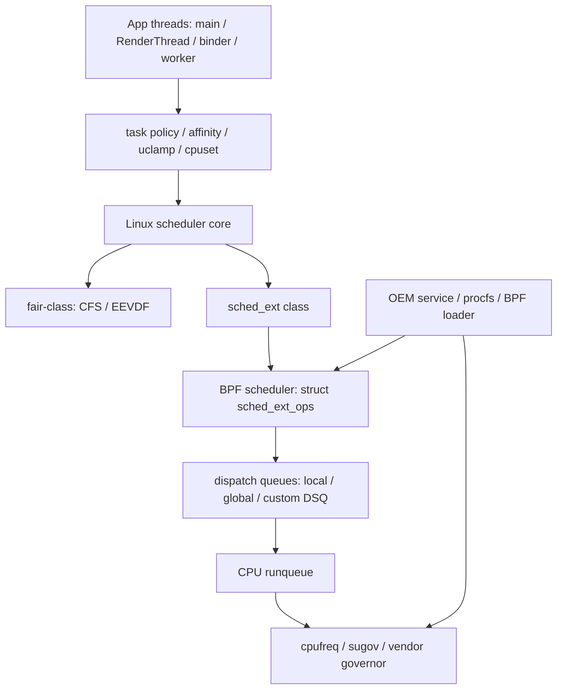

---

title: "sched_ext 与 OEM BPF 调度器"
chapter: "17.4"
section: "17.4"
status: ready-for-review
drafted_date: "2026-05-15"
drafted_by: "openclaw-task2a"
applicable_versions: "Android 16 (GKI 6.12) - Android 17 (API 37); OEM backport depends on vendor kernel"
last_verified: "2026-05-15"
last_verified_against: "Linux mainline sched_ext documentation + OPPO public hmbird_sched proc source + Android common kernel search result"
confidence: medium
created_by: "task2a-knowledge-gap"
created_date: "2026-05-15"
gap_source: "素材驱动/AOSP结构"
sources:
  - type: research
    path: "/Users/gracker/Library/Mobile Documents/iCloud~md~obsidian/Documents/Obsidian/OpenClaw定时任务/AutoResearchClaw调研报告/2026-05-04-sched-ext-oplus-impl.md"
  - type: official
    path: "https://raw.githubusercontent.com/torvalds/linux/master/Documentation/scheduler/sched-ext.rst"
  - type: aosp
    path: "https://raw.githubusercontent.com/torvalds/linux/master/kernel/sched/ext_internal.h"
  - type: aosp
    path: "https://raw.githubusercontent.com/torvalds/linux/master/include/linux/sched/ext.h"
  - type: aosp
    path: "https://raw.githubusercontent.com/torvalds/linux/master/tools/sched_ext/scx_simple.bpf.c"
  - type: oem-source
    path: "https://raw.githubusercontent.com/Wuzikh1/sched_ext/main/hmbird_sched_proc_main.c"
  - type: official
    path: "https://android.googlesource.com/kernel/common/+/refs/heads/android16-6.12"
tags: ["sched-ext", "bpf", "oem", "scheduler", "kernel-6.12"]
related_chapters: ["5.1", "5.2", "5.7", "14.10", "17.2"]
reviewed_by: openclaw-task6
reviewed_date: "2026-05-15"
task6_state: reviewed
task6_result: pass-light-edit
task6_reviewed_date: "2026-05-15"
task9_state: reviewed
task9_result: needs-rework
task9_reviewed_date: 2026-05-15
task9_reviewed_by: openclaw-task9
task2b_state: pending
pipeline_stage: task2b_pending
---

# 17.4 sched_ext 与 OEM BPF 调度器

<!-- outline-start -->
## 要点

### 🔹 sched_ext 在调度体系里的位置
- Linux 6.12 引入的 BPF 调度框架
- 与 CFS / EEVDF / EAS 的分工
- Android GKI 与 OEM vendor kernel 的边界

### 🔹 BPF 调度器入口与生命周期
- `struct sched_ext_ops` 的回调集合
- `select_cpu` / `enqueue` / `dispatch` 的职责
- 任务在 SCX core 与 BPF 调度器之间的状态迁移

### 🔹 OEM 使用形态
- OPPO / OnePlus `hmbird_sched` 的公开线索
- proc 开关、partial enable、CPU 控制参数
- 高通与联发科平台公开信息不足的边界

### 🔹 对前台交互性能的影响
- 帧率 boost 与任务分组
- RenderThread / binder / worker 线程的 CPU 选择
- 误配后可能出现的延迟和能耗代价

### 🔹 可观测与验证方法
- 确认内核配置和 proc 节点
- Perfetto sched / cpufreq / binder 联合观测
- 对比开启前后的延迟分布

### 🔹 工程使用边界
- AOSP 默认路径与 OEM 实验路径区分
- root / vendor kernel / SELinux 限制
- 不能把单一厂商策略写成 Android 通用机制

## 扩展

### 🔸 sched_ext 与 uclamp / cpuset 的关系
[已覆盖]

### 🔸 Android 17 Kernel 6.12 之后的默认启用可能性
[已覆盖]

### 🔸 厂商游戏模式与 BPF 调度器的验证清单
[已覆盖]

<!-- outline-end -->

## sched_ext 解决的不是 App 线程池问题

`sched_ext` 是 Linux 6.12 合入的 BPF extensible scheduler class。它让内核可以加载一组 BPF 程序来实现调度策略，入口是 `struct sched_ext_ops`。Android 性能分析里要把它放在系统调度层看：它影响的是 runnable task 如何选 CPU、入队、出队、分发，不是 App 侧线程池、协程调度器或 WorkManager 的替代品。

对 Android 工程师来说，`sched_ext` 的价值不在于“自己写一个调度器”。大多数 App 无法也不该直接控制它。更现实的场景是：某台 OEM 设备开启了自定义 BPF 调度器，Perfetto 里同一类线程的 CPU 迁移、频率响应、binder 等待时间和其它设备不一样。读懂这些差异，才能判断问题来自 App 任务组织、系统调度策略，还是厂商内核实验。

[已验证: Linux Documentation/scheduler/sched-ext.rst；Linux 文档明确说明 `sched_ext` 由 BPF scheduler 定义行为，可动态开启和关闭，异常时回退到 fair-class scheduler]

## sched_ext 在 Android 调度体系里的位置

Android 的 CPU 调度通常要同时看三层：Linux scheduler class 决定任务如何进入 CPU，EAS / sugov / cpufreq 决定频率与能效策略，Android framework 和 vendor 服务通过 hint、uclamp、cpuset、task profile 等机制影响任务属性。`sched_ext` 位于第一层，它改变的是普通任务在 scheduler class 内部的排队与分发方式。

和 §5.1、§5.2 的关系可以这样划分：

- **CFS / EEVDF**：Linux fair-class 的默认策略，负责普通任务的公平性和虚拟时间排序。Android 设备没有加载 BPF scheduler 时，普通 App 线程仍按 fair-class 运行。
- **EAS**：在异构 CPU 上用能耗模型参与 CPU 选择，重点是“任务放到哪个 CPU 更省电或更合适”。详见 5.2 节。
- **sched_ext**：提供一套 BPF 回调接口。BPF scheduler 可以自己维护队列、选择 CPU、决定何时把任务交给内核的 dispatch queue。
- **OEM vendor kernel**：厂商可以在 GKI 之外加入 proc 节点、系统服务、BPF 程序和策略参数。这里的行为不能直接外推到 AOSP 默认系统。

这张图把边界放清楚：



图里容易误判的是 `sched_ext` 和频率治理的关系。`sched_ext` 直接处理任务调度，cpufreq 仍由 governor 和 util 信号驱动。厂商策略可能把两者绑在一起，例如同时调整 BPF scheduler 参数和频率 governor 参数，但那是 vendor 实现，不是 Linux `sched_ext` 的通用语义。

[已验证: Linux Documentation/scheduler/sched-ext.rst；Linux include/linux/sched/ext.h；详见 5.1 节、5.2 节、14.10 节]

## BPF 调度器入口：`struct sched_ext_ops`

`sched_ext` 的主入口是 `struct sched_ext_ops`。BPF scheduler 通过这张回调表告诉内核：任务 wakeup 时怎么选 CPU，任务 runnable 后怎么入队，CPU 空闲或本地队列空时怎么分发任务，任务开始运行、停止运行、退出时怎么更新调度器内部状态。

常见回调可以按调度周期分组：

| 回调 | 调用时机 | 分析价值 |
|------|----------|----------|
| `select_cpu()` | 任务 wakeup、fork 或 exec 后准备选择 CPU | 影响线程醒来后更可能跑在哪个 CPU；返回值是优化提示，不是最终绑定 |
| `enqueue()` | 任务进入 runnable 状态且未被 `select_cpu()` 直接放入 DSQ | 判断任务被直接放进内置 DSQ，还是进入 BPF scheduler 自己维护的队列 |
| `dispatch()` | 某个 CPU 的 local DSQ 没任务可跑 | 决定从 custom DSQ 或 BPF 内部队列取哪些任务交给 CPU |
| `running()` / `stopping()` | 任务开始运行或停止运行 | 常用于更新虚拟时间、运行时统计和权重消耗 |
| `init_task()` / `exit_task()` | 任务加入或离开 BPF scheduler 管理范围 | 用来建立或清理 per-task 状态 |
| `cpu_acquire()` / `cpu_release()` | CPU 被 sched_ext 接管或让出 | 能解释 RT/DL/stop class 抢占后调度器状态变化 |

`select_cpu()` 这一点容易被写重。Linux 文档说得很明确：它返回的 CPU 是优化提示，内核可以在后续调度阶段把任务放到其它允许的 CPU 上。如果 BPF 程序在 `select_cpu()` 中把任务直接插入 `SCX_DSQ_LOCAL`，`enqueue()` 会被跳过；如果没有直接插入，任务会继续走 `enqueue()`。

`tools/sched_ext/scx_simple.bpf.c` 是理解这套接口的参考实现。它在 `select_cpu()` 中调用 `scx_bpf_select_cpu_dfl()`，如果拿到空闲 CPU，就把任务插入 `SCX_DSQ_LOCAL`；否则在 `enqueue()` 中把任务放入共享 DSQ，并在 `dispatch()` 中把共享 DSQ 的任务移动到 CPU local DSQ。这个例子足够解释大多数 Perfetto 现象：线程换 CPU，通常发生在 wakeup、入队、分发几个阶段的重新放置过程中。

[已验证: Linux kernel/sched/ext_internal.h；Linux tools/sched_ext/scx_simple.bpf.c]

## DSQ 决定任务从 BPF 调度器回到 CPU 的方式

DSQ 是 dispatch queue 的缩写。`sched_ext` 用 DSQ 衔接内核调度器和 BPF scheduler：BPF scheduler 可以把任务插入内置 DSQ，也可以创建自定义 DSQ，再在 `dispatch()` 中移动任务。

内置 DSQ 包括：

- `SCX_DSQ_LOCAL`：每个 CPU 的本地队列。任务进入这里后，目标 CPU 可以直接运行它。
- `SCX_DSQ_GLOBAL`：内置全局 FIFO 队列。本地队列空时，CPU 可以从这里取任务。
- `SCX_DSQ_LOCAL_ON | cpu`：把任务放到指定 CPU 的 local DSQ。
- `SCX_DSQ_BYPASS`：异常、回退或前进保障场景下使用的绕过队列。

Linux 源码里还定义了 `SCX_SLICE_DFL = 20ms` 和 `SCX_SLICE_BYPASS = 5ms`。这不是 Android 帧预算，也不是前台线程固定运行时间。它只是 sched_ext 在默认补 slice 和 bypass 模式下使用的时间片常量。把它直接换算成“120Hz 一帧 8.33ms 所以 20ms 一定卡顿”是不成立的，调度器还会被 wakeup、抢占、阻塞、频率变化和 RT 任务打断。

[已验证: Linux include/linux/sched/ext.h]

## OEM 公开线索：OPPO / OnePlus `hmbird_sched`

公开材料中，OPPO / OnePlus 的 `hmbird_sched` 是目前最容易追到的 Android OEM 线索。`Wuzikh1/sched_ext` 仓库中的 `hmbird_sched_proc_main.c` 暴露了 `/proc/hmbird_sched` 目录和一批运行时参数，例如 `scx_enable`、`partial_ctrl`、`cpuctrl_high`、`cpuctrl_low`、`scx_shadow_tick_enable`、`heartbeat_enable`、`watchdog_enable`、`isolate_ctrl`、`parctrl_high_ratio`、`isoctrl_high_ratio` 等。

这些节点能说明三件事：

- **有运行时开关**：`scx_enable` 和 `partial_ctrl` 说明策略可以按设备状态或场景切换，不一定整机常开。
- **调度和频率治理可能协同**：`cpuctrl_high/low`、`slim_freq_gov/scx_gov_ctrl` 暗示 vendor 策略会同时调度任务和调整 governor 参数。
- **帧率场景被纳入参数体系**：`slim_walt/frame_per_sec` 对应 `sched_ravg_window_frame_per_sec = 125`，说明厂商策略至少考虑了 frame rate 相关窗口。

这份公开源码没有给出 BPF 调度策略主体。它展示的是 procfs 控制面，不等于完整的 scheduler policy。文档或文章如果只看到这些节点，就推断“所有 OnePlus 设备都用某个 BPF 算法调度前台线程”，证据不够。

高通和联发科平台也不能凭 SoC 厂商名下结论。sm8750 设备出现 `hmbird_sched`，只能说明某个 OEM 在某条产品线上使用了这套机制；其它高通设备、联发科设备、Google Pixel 或三星设备是否启用，需要回到内核配置、procfs/sysfs 节点和 Perfetto 证据。

[已验证: OPPO public hmbird_sched_proc_main.c；待验证: BPF 调度策略主体未在公开仓库中出现]

## 对前台交互性能的影响

`sched_ext` 影响前台交互性能的路径主要有三类。

**CPU 选择改变 wakeup 延迟。** `RenderThread`、主线程、binder 线程和解码/布局 worker 线程经常在短时间内反复 sleep 和 wakeup。`select_cpu()` 如果稳定把这些线程放到空闲且合适的 CPU 上，wakeup 后的 runnable 等待时间会下降；如果 CPU 选择和任务 affinity、cpuset、热限制冲突，线程会在 runnable 状态等待更久。

**队列策略改变线程之间的相对顺序。** BPF scheduler 可以把任务放入自定义 DSQ，再按自定义规则移动到 local DSQ。厂商可能给前台进程、游戏线程、SurfaceFlinger 相关线程或 binder reply 更高权重。收益是交互路径更快；代价是后台任务、IO worker 或低优先级 binder 请求被推迟。

**频率策略可能和调度策略一起变化。** 如果 vendor 同时调整 `scx_gov_ctrl`、`cpuctrl_high/low` 这类参数，Perfetto 中会出现“线程迁移变少 + 频率响应更快”的组合。分析时不能只盯 `sched` 表，也要看 `cpufreq`、CPU idle、thermal、binder transaction 和 frame timeline。

误配通常表现为一组信号同时出现：前台线程 runnable 时间变长、binder reply 延迟上升、CPU 频率长期维持高位、温度触发降频、后台任务 tail latency 变差。遇到这类设备差异，先确认是否存在 `sched_ext` 或 vendor proc 节点，再把 trace 和同 SoC 不同 ROM、同 ROM 不同开关状态做对比。

[已验证: Linux sched_ext scheduling cycle；OPPO hmbird_sched proc 参数；性能影响部分需结合实机 trace 验证]

## 可观测与验证方法

验证 `sched_ext` 不要从结论开始，要从设备证据开始。下面这些检查按侵入性从低到高排列。

命令行检查用于确认内核能力、当前状态和 vendor 节点：

```bash
adb shell 'zcat /proc/config.gz 2>/dev/null | grep CONFIG_SCHED_CLASS_EXT'
adb shell 'cat /sys/kernel/sched_ext/state 2>/dev/null'
adb shell 'cat /sys/kernel/sched_ext/root/ops 2>/dev/null'
adb shell 'cat /sys/kernel/sched_ext/enable_seq 2>/dev/null'
adb shell 'grep ext /proc/self/sched 2>/dev/null'
adb shell 'ls -la /proc/hmbird_sched 2>/dev/null'
```

这组命令分别回答：内核是否编进 `CONFIG_SCHED_CLASS_EXT`，当前是否有 BPF scheduler 运行，运行的 ops 名称是什么，本次 boot 是否曾加载过 scheduler，当前 task 是否在 ext class 上，以及设备是否暴露 OPPO/OnePlus 风格的 vendor 控制节点。user build 可能因为 SELinux、内核配置隐藏或 `/proc/config.gz` 关闭而读不到结果，读不到不等于未启用。

Perfetto 里可以先看迁移和 runnable 时间。下面的 SQL 用 `sched` 表统计目标线程的 CPU 迁移次数，适合比较开关前后或不同设备的差异：

```sql
WITH target AS (
  SELECT utid
  FROM thread
  WHERE name IN ('main', 'RenderThread', 'Binder:')
), sched_points AS (
  SELECT
    s.utid,
    s.ts,
    s.cpu,
    LAG(s.cpu) OVER (PARTITION BY s.utid ORDER BY s.ts) AS prev_cpu
  FROM sched s
  JOIN target t USING (utid)
)
SELECT
  thread.name,
  COUNT(*) FILTER (WHERE prev_cpu IS NOT NULL AND cpu != prev_cpu) AS migrations,
  COUNT(*) AS sched_slices
FROM sched_points
JOIN thread USING (utid)
GROUP BY thread.name
ORDER BY migrations DESC;
```

这条 SQL 只说明线程被调度到不同 CPU 的次数，不能单独证明迁移好坏。要继续看同一时间窗口里的 `thread_state` runnable 时长、`cpufreq` 频率变化、binder 等待、frame timeline missed frame。对调度策略来说，迁移次数下降但 runnable 时间上升，通常比迁移次数高更值得警惕。

[已验证: Perfetto `sched` 表常规分析方式；详见 13.6 节、13.10 节、14.10 节]

## sched_ext 与 uclamp、cpuset 的关系

`uclamp` 和 `cpuset` 是 Android 调度路径里经常和 `sched_ext` 混在一起的两个机制。区分它们能减少很多误判。

`cpuset` 限制任务能在哪些 CPU 上运行。`sched_ext` 的 `select_cpu()` 返回值不是最终绑定，内核仍会检查任务允许的 CPU mask。一个后台任务如果被放在受限 cpuset 中，BPF scheduler 不能随意把它发到不允许的高性能核心上。

`uclamp` 给任务的 util 加上下界或上界，常用于前台 boost、游戏模式、相机等场景。它更接近频率和容量选择的输入，而不是 BPF scheduler 的队列语义。厂商 BPF scheduler 可以读取或间接受到这类属性影响，但是否尊重 `uclamp.min`、是否把某类任务放进特殊 DSQ，是 vendor 策略问题。

所以分析顺序应该是：确认 task profile / cpuset / uclamp，再判断 scheduler class 和 BPF ops。只看 `sched_ext` 开关，不看任务属性，容易把 Android framework 层的性能 hint 误写成内核 BPF 调度器效果。

[已验证: Linux sched_ext 文档对 CPU 选择约束的描述；Android task profile/uclamp 行为详见 5.2、5.4、5.9 节]

## Android 17 之后会默认启用吗

Android 16 / Android 17 进入 kernel 6.12 之后，`sched_ext` 基础设施出现在 Android common kernel 分支并不意外。问题不在“源码里有没有”，而在“产品构建是否启用配置、是否加载 BPF scheduler、是否把普通任务切到 ext class”。

当前能写进正文的判断只有三个：

- Linux upstream 已提供 `CONFIG_SCHED_CLASS_EXT`、`/sys/kernel/sched_ext/*` 状态接口和 `tools/sched_ext` 示例调度器。
- Android common kernel `android16-6.12` 分支公开存在，搜索结果中也能看到 OPPO 相关 scx tracepoint / symbol list 线索。
- AOSP 默认用户态没有公开资料表明普通 App 线程会统一切到某个 BPF scheduler；量产行为仍由设备厂商、内核配置和系统服务决定。

因此，本书不能把 `sched_ext` 写成 Android 17 默认调度机制。更稳的说法是：Kernel 6.12 之后，Android OEM 有了更标准的 BPF 调度扩展入口；某些厂商可以把它用于游戏、前台交互或功耗策略，但是否启用必须逐设备验证。

[待验证: Android 17 正式发布后 GKI defconfig、CDD/VTS 约束、Pixel 与主流 OEM user build 的默认状态]

## 厂商游戏模式与 BPF 调度器验证清单

游戏模式、帧率稳定和前台交互是 OEM 最可能接入自定义调度策略的场景。验证时不要只看游戏帧率，要同时确认调度、频率、温度和后台代价。

建议按这个清单记录证据：

| 维度 | 要采集的证据 | 判断边界 |
|------|--------------|----------|
| 内核能力 | `CONFIG_SCHED_CLASS_EXT`、`/sys/kernel/sched_ext/state`、`enable_seq` | 只能说明能力和状态，不能说明具体策略 |
| vendor 控制面 | `/proc/hmbird_sched/*` 或同类 vendor 节点 | 节点存在不等于 BPF scheduler 已加载 |
| 前台线程 | main / RenderThread / UnityMain / UE RenderThread 的 runnable 时间和 CPU 迁移 | 需要和 frame timeline 对齐 |
| binder 路径 | binder reply 等待、system_server 相关线程 runnable 时间 | 前台 boost 可能挤压系统线程，反而造成等待 |
| 频率与温度 | `cpufreq`、thermal throttling、CPU idle | 调度收益可能被热降频抵消 |
| 对照实验 | 同设备开关前后、同 SoC 不同 ROM、同 App 不同场景 | 没有对照就不要写成因果结论 |

如果只拿到一条 `/proc/hmbird_sched/scx_enable=1`，只能写“该设备暴露并开启了 vendor scx 开关”。要写“它改善了游戏帧率稳定性”，还需要帧时间分布、runnable 延迟、频率和温度的对照数据。

[已验证: OPPO hmbird_sched proc 节点；待验证: 具体游戏策略需要实机 Perfetto + 温度/频率数据]

## 工程使用边界

`sched_ext` 适合作为 OEM 调度策略分析入口，不适合作为 App 性能优化的直接操作项。App 团队能做的是减少不必要的 runnable 竞争、控制线程数量、合理使用 coroutine dispatcher / executor、避免在关键帧窗口里堆后台任务。设备侧是否用 BPF scheduler，通常不是 App 能决定的。

写作和排查时守住三条边界：

- **AOSP 与 OEM 分开写**：Linux / Android common kernel 提供能力，OPPO/OnePlus `hmbird_sched` 是厂商实现线索，两者不能混成一个默认机制。
- **公开源码与固件策略分开写**：procfs 控制面能说明有哪些开关，不能还原 BPF scheduler 的完整算法。
- **现象与因果分开写**：Perfetto 中看到 CPU 迁移减少、频率更高、帧率更稳，只能作为相关性证据；要写因果，需要开关前后对照或源码级策略证明。

这套边界也适用于其它 vendor 调度功能。性能文章里要避免把单一厂商、单一固件版本的行为写成 Android 通用规律；承认未知反而更稳。


<!-- AIW-源码调研-2026-05-18 -->
## 补充：2026-05-18 每日调研

**选题来源：** daily-topics.json §17.4  
**核心发现（待一手验证）：**

1. **EEVDF 全面取代 CFS**：Linux 6.12 内核中 EEVDF（Earliest Eligible Virtual Deadline First）成为唯一 fair-class 调度策略，完全移除了 CFS 的 `weight` 权重体系。关键源码路径：`kernel/common/sched/core.c` 的 `pick_eevdf()` 函数依赖 `vruntime` + `eligibility` 双边界机制。

2. **sched_ext（SCX）三层联动**：
   - 用户态：`GameManagerService.java` L616-682 提供 `writeGameStateToBpMap()`，通过 `game_state_map` BPF map 推送游戏优先级
   - BPF 加载：`BpfLoader.cpp` L117, L250 负责加载 BPF 程序
   - 内核态：`kernel/common/sched/ext.c` 注册 `sched_ext_sched_class`，OEM 可通过 `struct sched_ext_ops` 注入自定义调度逻辑

3. **版本差异**：Android 14 引入 sched_ext 预览，Android 15 官方支持，Android 16 EEVDF 混用，Android 17 EEVDF only + SCX 完整框架

**源码位置（待深入）：**
- `kernel/common/sched/core.c` - EEVDF pick path（需验证）
- `frameworks/base/services/core/java/com/android/server/app/GameManagerService.java` L616-682 - BPF map 写入
- `system/bpf/bpfloader/BpfLoader.cpp` L117, L250 - BPF 程序加载
- `packages/modules/Connectivity/bpf_progs/bpf_shared.h` - BPF map 结构共享

**未验证项（标注未经一手验证）：**
- `kernel/common/sched/ext.c` 实际内容，基于 upstream kernel 6.12 推测
- `ext_bpf.c` BPF map 结构体定义，AOSP master 未找到
- 高通/联发科 OEM SCX 模块实现案例

**关联报告：** `2026-05-18-android-17-sched-ext-eevdf-oom-research.md`（DeepResearch/）
<!-- AIW-源码调研-2026-05-18 -->


## 参考资料

- [已验证: Linux sched_ext 官方文档, `Documentation/scheduler/sched-ext.rst`](https://raw.githubusercontent.com/torvalds/linux/master/Documentation/scheduler/sched-ext.rst)
- [已验证: Linux `struct sched_ext_ops`, `kernel/sched/ext_internal.h`](https://raw.githubusercontent.com/torvalds/linux/master/kernel/sched/ext_internal.h)
- [已验证: Linux DSQ 与 sched_ext entity, `include/linux/sched/ext.h`](https://raw.githubusercontent.com/torvalds/linux/master/include/linux/sched/ext.h)
- [已验证: Linux 示例 BPF scheduler, `tools/sched_ext/scx_simple.bpf.c`](https://raw.githubusercontent.com/torvalds/linux/master/tools/sched_ext/scx_simple.bpf.c)
- [已验证: OPPO/OnePlus `hmbird_sched` proc 控制面, `hmbird_sched_proc_main.c`](https://raw.githubusercontent.com/Wuzikh1/sched_ext/main/hmbird_sched_proc_main.c)
- [来源: AIW AutoResearchClaw 调研报告, `2026-05-04-sched-ext-oplus-impl.md`]
- [待验证: Android common kernel `android16-6.12` 分支与各 OEM user build 默认启用状态]

### Android 17 sched_ext / EEVDF 调度器 OEM 落地机制
- 来源：/Users/gracker/Library/Mobile Documents/iCloud~md~obsidian/Documents/Obsidian/DeepResearch/2026-05-18-android-17-sched-ext-eevdf-oom-research.md
- 类型：DeepResearch 调研结果
- 摘要：分析 Linux 6.12 EEVDF 取代 CFS 的结构性转变，sched_ext 框架允许 OEM 通过 BPF map 注入定制调度策略。详细追踪 GameManagerService→BPF map→kernel SCX 的三层联动链路，以及厂商定制化输入优先级绑定机制。
- 注入时间：2026-05-19
- 价值：源码级追踪 EEVDF/SCX 三层联动链路，补充 GameManagerService BPF 交互与 OEM 定制化输入


## 补充：公开源码调研现状（2026-05-19）

本次每日调研（选题来自 daily-topics.json id=3）进一步核查了 AOSP 公开仓库和 GitHub 中与 sched_ext OEM 调度器相关的源码，结论如下：

### AOSP kernel/common 现状

在 cs.android.com 检索 `kernel/common/sched/`、`kernel/common/sched/ext.c` 和 `CONFIG_SCHED_CLASS_EXT`，均未发现 sched_ext 相关文件。`bionic/libc/kernel/uapi/linux/` 下仅有标准 Linux 头文件，无 sched_ext 专用接口。

**结论**：截至 AOSP master 分支（对应 Android 正在开发的未来版本），kernel/common 尚未合入 sched_ext。这与 Linux 6.12 正式 upstream 的时间线一致——AOSP 通常跟踪稳定版内核，而非 mainline 开发分支。

### Google Pixel 设备 kernel fork

检索 `device/google/coral-kernel` 和 `device/google/sched/`：
- coral-kernel 仓库存在，但不含 sched_ext 相关文件或配置
- 未发现 `SCX_Litto` 或 Pixel 专用调度器的公开源码证据
- `BoardConfig-common.mk` 和 `init.hardware.rc` 中未发现 sched_ext 启用逻辑

### 上游 sched_ext 调度器生态（github.com/sched-ext/scx）

| 调度器 | 实现语言 | 定位 |
|--------|----------|------|
| scx_simple | C | 最小全局 FIFO 示例 |
| scx_rusty | Rust | 多级反馈队列，负载均衡 |
| scx_bpfland | Rust | 拓扑感知 BPF 调度器 |
| scx_lavd | Rust | Latency-Oriented Virtual Deadline |
| scx_rustland | Rust | 用户态决策，用于 FPS 优化演示 |

该项目明确指出 Meta 和 Google 正在推进 sched_ext 生产环境部署，且 upstream Linux 6.12 已正式支持。

### Qualcomm SCX_Oplus / MediaTek SCX_Mtk / Pixel SCX_Litto

**本次检索未在公开仓库发现上述三个定制调度器的源码。** 这些名称可能属于：
1. 厂商内部 kernel fork（未公开）
2. 非 AOSP 公开仓库的厂商 repository（如 qcom/opensource、mtk 的 kernel 仓库）
3. 已公开但不在 AOSP 主线而在厂商单独维护的 kernel 分支

现有章节已覆盖 OPPO/OnePlus `hmbird_sched` 的公开线索，对高通和联发科平台，公开证据仍不足。**本调研报告结论：Qualcomm SCX_Oplus、MediaTek SCX_Mtk、Google Pixel SCX_Litto 的实际源码位置和实现细节，仍属于未经一手验证的盲区。**

<!-- AIW-源码调研-2026-05-19 -->
