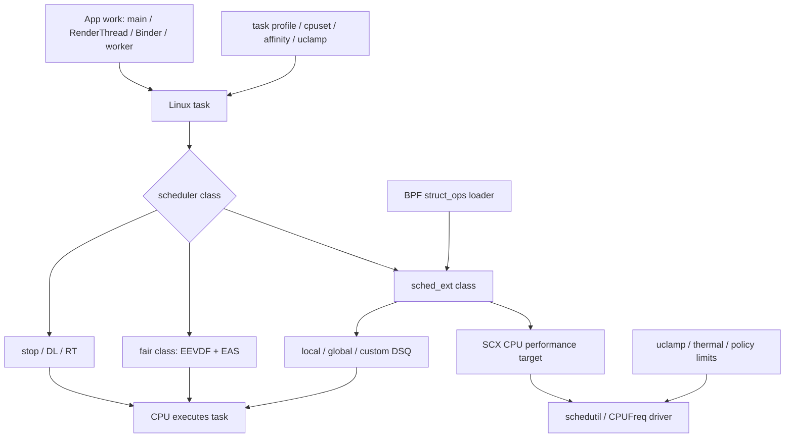
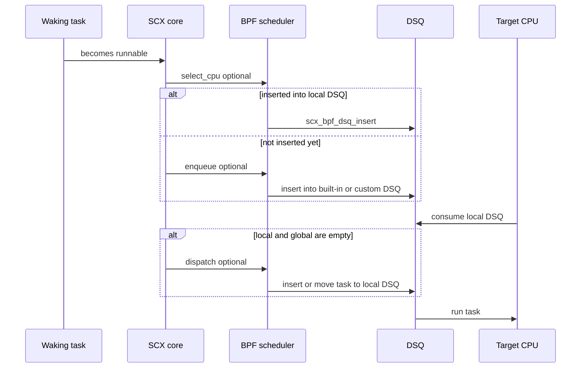

# 17.4 sched_ext 与 OEM BPF 调度器

## 阅读前要分开的三件事

Android 17 的 arm64 GKI 配置含有 `CONFIG_SCHED_CLASS_EXT=y`。这项配置只说明内核编译了 sched_ext 调度类，无法证明设备当前加载了 BPF 调度器，也无法证明某个线程正由该调度器管理。

排查设备时要依次确认三个层次：

1. **编译能力**：内核配置中有没有 `CONFIG_SCHED_CLASS_EXT=y`。
2. **运行状态**：`/sys/kernel/sched_ext/state` 是否为 `enabled`，`root/ops` 显示哪个调度器。
3. **任务范围**：当前调度器采用 full 还是 partial 模式，目标线程是否属于可接管的策略集合。

这三个层次不能互相代替。设备可能编入 sched_ext 却从未加载 BPF 程序；也可能本次开机加载过又退出；还可能处于 partial 模式，只处理显式使用 `SCHED_EXT` 的少量线程。

平台源码统一锚定 Android 17 / API 37，内核锚定 `android17-6.18-2026-06_r6`。Linux 6.12 只作为 sched_ext 进入主线的历史背景。

## sched_ext 在 Android CPU 调度栈中的位置

App 创建的 Java 线程、Native 线程和 Binder 线程到达内核后，都以 `task_struct` 参与调度。线程池、协程调度器和 WorkManager 决定工作怎样映射到线程；sched_ext 处理已经 runnable 的普通任务怎样选 CPU、排队和获得运行机会。两者处在不同层级。

Android 上还要同时观察以下机制：

- **调度类**：stop、deadline、real-time、sched_ext、fair、idle 等调度类按内核定义的顺序参与选取。sched_ext 面向普通任务，不接管 RT、DL 和 stop class。
- **任务约束**：affinity、cpuset 与 task profile 限定任务可去的 CPU；uclamp 给利用率提供上下界。
- **CPU 选择**：未启用 sched_ext 时，普通任务由 fair class 的 EEVDF、公平性逻辑与 EAS 等路径处理。启用后，BPF 调度器可以接管普通任务的选核和排队。
- **频率与容量**：schedutil、CPUFreq driver、uclamp、thermal pressure 和硬件限制共同决定可用性能。sched_ext 可以提供 CPU performance target，却无权绕过温控或驱动上限。

下面的图用于定位 sched_ext 与 Android 其他调度组件之间的关系。



图中有两条相互关联的输出：任务何时在哪个 CPU 上运行，以及该 CPU 请求多高的性能。分析卡顿时，调度 trace 和频率、idle、thermal 数据需要放在同一时间轴上。

## 从 GKI 编译能力到运行时启用

Android 17 的 `arch/arm64/configs/gki_defconfig` 明确设置 `CONFIG_SCHED_CLASS_EXT=y`。`init/Kconfig` 中的 `EXT_GROUP_SCHED` 依赖 `SCHED_CLASS_EXT && CGROUP_SCHED`，默认值为 `y`。这让 GKI 具备 sched_ext 及其 cgroup 相关接口。

BPF 调度器仍需由用户态 loader 通过 BPF `struct_ops` 挂载。启用成功后，内核保存 `ops.name`，切换符合条件的任务，并增加 `enable_seq`。退出 loader、触发 `SysRq-S`、检测到内部错误或 runnable task stall 时，sched_ext 会中止当前 BPF 调度器，把任务交还给 fair class。

当前调度器不支持原地更新 `struct_ops`。`bpf_scx_update()` 返回 `-EOPNOTSUPP`；升级策略需要解除挂载后重新加载。这个过程可能短暂经历 fair class，性能实验应把切换窗口排除在稳定样本之外。

### sysfs 的目录层级和字段含义

Android 17 6.18 中，`/sys/kernel/sched_ext/` 的全局属性与当前调度器属性分处两层：

| 路径 | 含义 | 容易误读的地方 |
|---|---|---|
| `state` | `disabled`、`enabling`、`enabled` 或 `disabling` | 只有 `enabled` 表示此刻有调度器运行 |
| `switch_all` | 当前调度器是否接管全部符合条件的普通策略任务 | `1` 对应 full；调度器未运行时不要单独解释该值 |
| `nr_rejected` | 显式请求 `SCHED_EXT` 却被拒绝的累计次数 | 它不是调度器加载失败次数 |
| `hotplug_seq` | CPU hotplug 序列号 | 它不是 CPU 上下线数量 |
| `enable_seq` | 本次开机成功启用调度器的累计序列 | 大于零只能证明曾经启用过 |
| `root/ops` | 当前 BPF 调度器的 `ops.name` | 正确路径含 `root/` |
| `root/events` | 当前调度器的 SCX 事件计数 | 这是一个纯文本格式文件，不是事件目录 |

`root` kobject 只在当前调度器对象存在时建立。因此 `root/ops` 读不到，可能源自 scheduler 未启用、权限受限或 sysfs 未挂载；单凭读取失败无法区分原因。

## full 与 partial 决定接管范围

Android 17 的 sched_ext 文档对接管范围给出了明确规则：

- BPF 调度器处于运行状态，并且没有设置 `SCX_OPS_SWITCH_PARTIAL` 时，`SCHED_NORMAL`、`SCHED_BATCH`、`SCHED_IDLE` 和 `SCHED_EXT` 任务由 sched_ext 处理。
- 设置 `SCX_OPS_SWITCH_PARTIAL` 后，只有显式采用 `SCHED_EXT` 的任务由 sched_ext 处理；其余普通策略任务留在 fair class。
- 没有 BPF 调度器运行时，显式设置为 `SCHED_EXT` 的任务按 fair class 处理，行为接近 `SCHED_NORMAL`。

full 模式下，普通 App 线程的调度策略字段仍可能显示 `SCHED_NORMAL`。因此，`/proc/<pid>/sched` 中搜索字符串 `ext` 无法可靠判断该线程是否正在被 sched_ext 接管。应把 `state`、`switch_all`、调度器名称和目标线程策略放在一起判断。

partial 模式也不能由某个 OEM 节点的名字直接推断。厂商节点 `partial_ctrl` 与 `SCX_OPS_SWITCH_PARTIAL` 是否存在一一对应关系，需要 vendor kernel 或运行时切换证据支持。

## `struct sched_ext_ops`：回调有默认行为

BPF 调度器通过 `struct sched_ext_ops` 提供策略。Android 17 6.18 支持选核、入队、分发、运行状态、任务生命周期、CPU 热插拔、cgroup 和调试转储等多类回调。接口还会随内核演进，不宜用固定回调数量描述 ABI。

常用回调可以这样理解：

| 回调 | 发生阶段 | 未实现时的边界 |
|---|---|---|
| `select_cpu()` | wakeup、fork 或 exec 后的早期 CPU 选择 | 内核提供默认选择行为；返回值只是优化提示 |
| `enqueue()` | runnable 任务需要进入调度队列 | 默认送入 global DSQ |
| `dispatch()` | local 与 global DSQ 都没有可运行任务 | 只用内置 DSQ且在入队阶段直接插入时可以省略 |
| `running()` / `stopping()` | 任务开始或停止占用 CPU | 供策略维护虚拟时间和运行统计 |
| `set_weight()` / `set_cpumask()` | 权重或允许 CPU 集合变化 | 策略可同步自己的 per-task 状态 |
| `init_task()` / `exit_task()` | 任务进入或离开调度器生命周期 | 适合分配和释放 per-task 状态 |
| `cpu_online()` / `cpu_offline()` | CPU hotplug | 适合维护 per-CPU 队列或容量信息 |
| `dump*()` | 错误转储 | 供异常退出时输出策略状态 |

`select_cpu()` 属于可选回调。官方示例明确说明，示例中的实现与默认 `select_cpu` 行为相同，删除该实现也能工作。`enqueue()` 同样有默认的 global DSQ 行为。内核的 `validate_ops()` 主要检查不兼容的 flag 组合和已废弃配置，没有要求每个调度器实现 `select_cpu()`。

### 一个 wakeup 怎样走到 CPU

下面的流程展示普通任务在 sched_ext 中最常见的调度周期。



`select_cpu()` 选出的 CPU 只是提示。结果超出任务的 allowed cpumask 时，内核会忽略它；即使结果合法，任务也可能在后续阶段运行到另一颗允许的 CPU。若 `select_cpu()` 已把任务直接插入 local DSQ，`enqueue()` 会被跳过。

## DSQ、slice 与前进保障

CPU 只执行自己 local DSQ 中的任务。local DSQ 为空时，sched_ext core 会尝试从 global DSQ 取任务；仍然为空时才调用 `dispatch()`，让 BPF 策略从自定义队列或其他位置补充任务。

Android 17 6.18 对外公开的内置 DSQ ID 包括：

- `SCX_DSQ_GLOBAL`
- `SCX_DSQ_LOCAL`
- `SCX_DSQ_LOCAL_ON | cpu`

自定义 DSQ 可以采用 FIFO，也可以用 `scx_bpf_dsq_insert_vtime()` 维护虚拟时间顺序。内置 DSQ 采用 FIFO。文档中的 `scx_bpf_dsq_insert()` 和 `scx_bpf_move_to_local()` 是该版本调度周期里的核心 helper。

`SCX_SLICE_DFL` 在该 tag 中为 20 ms。它是调度器没有提供其他 slice 时使用的默认值，不是 Android 帧预算，也不保证任务连续运行 20 ms。更高优先级调度类、阻塞、抢占和策略自身的重新入队都可能提前结束本次运行。

`root/events` 里能看到 `BYPASS_DURATION`、`BYPASS_DISPATCH` 与 `BYPASS_ACTIVATE` 等内部事件计数。这些名字描述内核的 bypass 处理过程，不能据此虚构一个面向 BPF 程序公开的 `SCX_DSQ_BYPASS` 常量；Android 17 6.18 的公开内置 DSQ 列表没有这个 ID。

sched_ext 还有前进保障与自动回退：可运行任务长时间得不到调度、BPF 程序触发错误或调度器异常退出时，内核会终止该策略并回到 fair class。对于用户体验，这比让失效的策略永久占住系统更安全，但切换本身仍可能造成短时延迟波动。

## Android 17 中 sched_ext 与 schedutil 的关系

Android 17 6.18 把 sched_ext 的 CPU performance target 接入 schedutil。下面的精简源码用于说明 full 与 partial 模式的差别，代码来自该 tag 的 `kernel/sched/cpufreq_schedutil.c`。

```c
static void sugov_get_util(struct sugov_cpu *sg_cpu, unsigned long boost)
{
    unsigned long min, max, util = scx_cpuperf_target(sg_cpu->cpu);

    if (!scx_switched_all())
        util += cpu_util_cfs_boost(sg_cpu->cpu);
    util = effective_cpu_util(sg_cpu->cpu, util, &min, &max);
    util = max(util, boost);
    sg_cpu->util = sugov_effective_cpu_perf(
        sg_cpu->cpu, util, min, max);
}
```

full 模式中，`scx_switched_all()` 为真，schedutil 从 sched_ext 的 CPU performance target 起算，不再叠加 fair-class 的 `cpu_util_cfs_boost()`。partial 模式仍有 fair 任务，代码会把 fair util 加进来。两种模式随后都经过 `effective_cpu_util()`、boost、uclamp 与策略上下界等处理。

同文件的 `sugov_hold_freq()` 在 full 模式直接返回 `false`，理由是 fair class 的保频启发式不适合 SCX，频率目标应跟随 BPF 调度器。由此可以得到两个工程结论：

- BPF 策略若接管全部普通任务，需要同步提供合理的 CPU performance target；只改 DSQ 排序可能让频率响应与调度意图脱节。
- sched_ext 提供的 target 仍受 uclamp、CPUFreq policy、driver、thermal pressure 和硬件频点限制。高 target 不等于 CPU 必然运行在最高频点。

## Android vendor hook 与 OEM 策略边界

Android common 在 sched_ext core 中放置了一组 `android_vh_*` vendor hook。Android 17 tag 能看到的触发点涵盖：

- sched_ext 启用状态变化；
- 任务切入或切出 SCX class；
- 选核后的 CPU 可运行性和 `cpus_allowed` 变化；
- enqueue、迁移与 slice 修正；
- tick 处理与异常退出通知。

这些 hook 允许 vendor module 在稳定触发点补充产品策略。它们可以影响某些决定或状态流转，所以分析 Android 设备时不能假定同一个 BPF 程序在所有 OEM kernel 上表现相同。hook 的数量和含义会随 tag 变化，正文不把某个统计值当成稳定 ABI。

vendor hook 也没有自动给出厂商策略。要确认 hook 上注册了什么实现，仍需 vendor module 源码、符号信息、trace 或设备实验。

### 怎样看待 `hmbird_sched` 公开线索

GitHub 上的 `Wuzikh1/sched_ext` 仓库包含 `hmbird_sched_proc_main.c`，代码创建了 `/proc/hmbird_sched` 及 `scx_enable`、`partial_ctrl`、`cpuctrl_*`、`slim_*` 等节点。这个仓库不属于 OPPO 官方组织，也没有提供可验证的发布声明，因此只能作为第三方公开线索。

文件名和 proc 节点能支持的结论很有限：

- 某套代码定义过这些 vendor 控制入口；
- 节点可能与调度器启停、任务分组、频率控制或调试有关；
- 设备若暴露相同节点，可以继续做源码和行为比对。

以下推断没有足够证据：

- `partial_ctrl` 一定直接修改 `SCX_OPS_SWITCH_PARTIAL`；
- `cpuctrl_high_ratio` 一定映射到 `scx_bpf_cpuperf_set()`；
- 某个 frame 参数的数值代表固定刷新率策略；
- 使用特定 SoC 的设备都启用同一套调度算法；
- 控制面文件等同于完整 BPF `struct sched_ext_ops` 实现。

高通、联发科或某个手机品牌的名称也不能替代设备证据。量产状态要按内核 tag、固件版本和具体型号记录。

## 它怎样影响前台交互

sched_ext 对体验的影响沿着四条路径传播。

### wakeup 与 CPU 选择

主线程、RenderThread、Binder 线程和短任务 worker 会频繁睡眠与唤醒。合理的 CPU 提示可以减少唤醒后的 runnable 等待，错误提示则可能带来额外迁移、idle 唤醒或在容量不足的 CPU 上排队。allowed cpumask 仍是硬约束。

### DSQ 中的相对顺序

自定义 DSQ 可以按任务组、虚拟时间或场景规则排序。前台任务提前获得 CPU 时，后台工作和系统服务可能等待更久。只看 App 的平均帧率，容易漏掉 Binder reply、system_server 或 SurfaceFlinger 一侧的尾延迟。

### CPU performance target

调度器可以让 schedutil 更快请求容量，也可能因 target 过高造成能耗和温升。温控开始压频后，前段时间获得的延迟收益可能反转。实验至少要覆盖冷机、稳定温度和热限制三个阶段。

### 调度类边界

RT、DL 与 stop class 不属于 sched_ext 接管的普通任务范围。Android 的 RenderThread、音频线程或系统关键线程可能被 framework/vendor 设成不同策略，也可能带有 affinity、uclamp 或 task profile。线程名相同并不保证调度属性相同。

迁移次数也没有固定的好坏方向。减少跨 cluster 迁移可能降低 cache 失效与功耗，但把任务留在拥塞或降频的 CPU 上会拉长 runnable latency。需要用等待时间、运行位置、频率和帧时间一起解释。

## 在设备上做只读核查

下面的命令只读取内核能力、当前 sched_ext 状态和常见 vendor 节点，适合先建立设备事实表。

```bash
adb shell uname -r
adb shell 'zcat /proc/config.gz 2>/dev/null | grep -E "CONFIG_SCHED_CLASS_EXT|CONFIG_EXT_GROUP_SCHED"'
adb shell 'for f in state switch_all nr_rejected hotplug_seq enable_seq; do
  printf "%s=" "$f"
  cat "/sys/kernel/sched_ext/$f" 2>/dev/null || echo inaccessible
done'
adb shell 'for f in ops events; do
  echo "[$f]"
  cat "/sys/kernel/sched_ext/root/$f" 2>/dev/null || echo inaccessible
done'
adb shell 'ls -la /proc/hmbird_sched 2>/dev/null'
```

输出的解释要保守：配置文件读不到可能是 `/proc/config.gz` 没开放；sysfs 读不到可能是调度器未运行、权限不足或路径未挂载；vendor 目录存在也不能证明其中的主开关处于启用状态。若要读取节点内容，先确认操作为只读，并记录固件 build fingerprint。

建议为每台设备保存以下字段：

| 字段 | 示例 | 用途 |
|---|---|---|
| build fingerprint | 完整字符串 | 固定固件版本 |
| kernel release | `uname -r` 输出 | 区分 GKI 与 vendor 构建 |
| `state` / `switch_all` | `enabled` / `1` | 区分当前状态和模式 |
| `root/ops` | 调度器名称 | 识别已挂载策略 |
| `enable_seq` | 数值 | 判断本次开机是否发生过成功启用 |
| `root/events` | 全量快照 | 比较实验前后的异常与 fallback 事件 |
| target thread policy | policy、affinity、cpuset、uclamp | 确认任务边界 |

## 用 Perfetto 验证影响

一次有效的 trace 应覆盖 CPU scheduling、CPU frequency、CPU idle、Binder、FrameTimeline 与 thermal 相关数据。若设备 tracefs 暴露 `sched_ext/sched_ext_event` 或 `sched_ext/sched_ext_dump`，可以一并采集；是否可用取决于内核和权限。

`sched_switch` 只记录线程切换，不能直接告诉你“这次决策来自哪个 BPF 回调”。因此，采集 trace 前后要同时保存 sched_ext sysfs 快照。设备支持 vendor tracepoint 时，再用它补充策略原因。

下面的 SQL 用进程关系筛选主线程、RenderThread 和 Binder 线程，并统计相邻运行片落在不同 CPU 的次数。

```sql
WITH target_threads AS (
  SELECT t.utid, t.name, t.tid, p.pid
  FROM thread t
  JOIN process p USING (upid)
  WHERE p.name = 'com.example.game'
    AND (
      t.tid = p.pid
      OR t.name = 'RenderThread'
      OR t.name GLOB 'Binder:*'
    )
),
ordered_runs AS (
  SELECT
    s.utid,
    s.cpu,
    LAG(s.cpu) OVER (PARTITION BY s.utid ORDER BY s.ts) AS prev_cpu
  FROM sched s
  JOIN target_threads t USING (utid)
)
SELECT
  t.tid,
  t.name,
  COUNT(*) AS running_slices,
  SUM(CASE
        WHEN r.prev_cpu IS NOT NULL AND r.cpu != r.prev_cpu THEN 1
        ELSE 0
      END) AS adjacent_cpu_changes
FROM ordered_runs r
JOIN target_threads t USING (utid)
GROUP BY t.tid, t.name
ORDER BY adjacent_cpu_changes DESC;
```

这条查询统计相邻 running slice 的 CPU 变化，不等同于内核迁移事件，也没有计算迁移成本。它适合定位需要深挖的线程。因果判断还要补充 `thread_state` 中的 runnable 时长、wakeup 到运行的延迟、cluster 分布、频率、idle、Binder 等待和 FrameTimeline。

## 对照实验怎样设计

能控制 vendor 开关时，一轮实验至少满足以下条件：

1. 固定设备、固件、App 版本、场景脚本、屏幕刷新率和网络条件。
2. 记录开关前后的 `state`、`switch_all`、`root/ops`、`enable_seq` 与 `root/events`。
3. 冷机预热后再采样，分别记录稳定温度阶段和热限制阶段。
4. 每个条件重复多轮，报告中位数、P90/P95/P99 与异常样本。
5. 同时评估帧时间、runnable latency、Binder 等待、CPU 时间、频率驻留、功耗和温度。
6. 检查 system_server、SurfaceFlinger、后台任务与音频等邻接工作负载，避免局部收益掩盖系统退化。

只能拿到只读设备时，可以比较同一场景下不同固件或同 SoC 不同 ROM，但结论应写成相关性。单次 trace、单个 proc 值或调度器名称无法支持性能因果。

## 与 cpuset、affinity 和 uclamp 一起分析

cpuset 和 affinity 决定任务允许在哪些 CPU 上运行。BPF `select_cpu()` 的返回值超出 allowed mask 时会被内核忽略。若任务被限制在小核，单独调整 DSQ 顺序无法把它送到不允许的大核。

uclamp 影响 `effective_cpu_util()` 计算和容量请求。full 模式中的 SCX target 也会经过这条约束路径。观察到频率被压住时，应检查 `uclamp.max`、thermal pressure、CPUFreq policy 与 vendor driver，不能把责任直接归给 BPF 调度器。

task profile 可能同时改变 cpuset、uclamp 和其他 cgroup 属性。排查顺序建议固定为：

1. 记录线程 policy、affinity、cpuset 与 uclamp。
2. 确认 sched_ext 的运行状态和 full/partial 模式。
3. 查看 DSQ、wakeup、runnable latency 与 CPU 分布。
4. 对齐 schedutil、频率、idle、thermal 与帧时间。

这样能够区分“任务没有资格去某颗 CPU”“调度器没有把任务及时送过去”和“任务到了 CPU 但容量请求受限”三类问题。

## Android 17 的工程结论

- Android 17 arm64 GKI 默认编译 sched_ext 能力；AOSP 或量产设备是否加载 BPF 调度器仍需运行时证据。
- full 模式会接管普通策略任务；partial 模式只接管显式 `SCHED_EXT` 任务。进程的 policy 字段不足以证明 full 模式下的归属。
- `select_cpu()`、`enqueue()` 和 `dispatch()` 都有可省略的场景。分析 BPF 程序时，应按调度器所用 DSQ 和 helper 判断缺失回调是否合理。
- Android 17 的 schedutil 已消费 sched_ext CPU performance target，并在 full 与 partial 模式采用不同的 fair-util组合逻辑。
- Android vendor hook 可能改变调度细节；同一套 upstream 机制在不同设备上可能表现不同。
- 第三方 `hmbird_sched` 文件只能证明一套公开控制面线索，不能替代 OEM 官方源码、量产固件状态或 BPF 策略实现。
- App 团队通常无法控制 sched_ext。可执行的工作是减少关键窗口的 runnable 竞争、记录完整线程属性，并用多信号 trace 识别设备侧差异。

## 参考资料

- [Android 17 6.18 sched_ext 官方文档](https://android.googlesource.com/kernel/common/+/refs/tags/android17-6.18-2026-06_r6/Documentation/scheduler/sched-ext.rst)
- [Android 17 6.18 sched_ext core](https://android.googlesource.com/kernel/common/+/refs/tags/android17-6.18-2026-06_r6/kernel/sched/ext.c)
- [Android 17 6.18 sched_ext internal interface](https://android.googlesource.com/kernel/common/+/refs/tags/android17-6.18-2026-06_r6/kernel/sched/ext_internal.h)
- [Android 17 6.18 public sched_ext constants and DSQ definitions](https://android.googlesource.com/kernel/common/+/refs/tags/android17-6.18-2026-06_r6/include/linux/sched/ext.h)
- [Android 17 6.18 schedutil implementation](https://android.googlesource.com/kernel/common/+/refs/tags/android17-6.18-2026-06_r6/kernel/sched/cpufreq_schedutil.c)
- [Android 17 arm64 GKI defconfig](https://android.googlesource.com/kernel/common/+/refs/tags/android17-6.18-2026-06_r6/arch/arm64/configs/gki_defconfig)
- [Android 17 scheduler vendor hooks](https://android.googlesource.com/kernel/common/+/refs/tags/android17-6.18-2026-06_r6/include/trace/hooks/sched.h)
- [Perfetto CPU scheduling data source](https://perfetto.dev/docs/data-sources/cpu-scheduling)
- [PerfettoSQL 入门](https://perfetto.dev/docs/analysis/perfetto-sql-getting-started)
- [第三方 `hmbird_sched` proc 控制面线索](https://github.com/Wuzikh1/sched_ext/blob/main/hmbird_sched_proc_main.c)
